# 第 1 天：从初版框架建立演进问题地图

## 0. 这节课真正要学什么

初版框架已经可以完成请求发送、业务调用、异步轮询、用例收集和报告记录。今天不评价它“好或坏”，也不急着学习当前的 `RequestContext`、`RetryExecutor`、`PollingPolicy` 等类。

今天只解决一个更根本的问题：

> 一个已经可以工作的框架，为什么会随着需求增加而需要重新划分职责？

课程结束时，你应该能够从初版代码自行推导出：

- 框架的约束已经从“缺少功能”转变成“不同变化被迫修改同一处代码”。
- 文件大不是根因，职责多也不是足够准确的诊断。
- 真正需要寻找的是变化轴、状态所有者和状态生命周期。
- 当前架构不是预先设计出的标准答案，而是经过至少两轮演进形成的阶段性选择。

今天不会深入讲解各扩展能力如何实现。后续课程会逐一展开。

## 1. 两小时学习安排

| 阶段 | 时间 | 要做的事 | 必须留下的产出 |
| --- | ---: | --- | --- |
| 建立观察规则 | 0～10 分钟 | 区分功能、职责、状态和变化轴 | 四个概念的一句话定义 |
| 观察初版请求层 | 10～30 分钟 | 阅读旧 `BaseRequest` | 职责标注表 |
| 观察业务层和执行层 | 30～45 分钟 | 阅读旧 `BaseTask`、runner | 第二份职责标注表 |
| 建立问题因果链 | 45～60 分钟 | 从新需求推导修改扩散 | 一张因果图 |
| 阅读演进证据 | 60～80 分钟 | 比较两次关键改造 | 两阶段差异记录 |
| 识别变化轴和状态所有者 | 80～100 分钟 | 完成生命周期表 | 状态所有权表 |
| 推导边界并比较方案 | 100～115 分钟 | 比较三种架构方案 | 决策表 |
| 验收与复盘 | 115～120 分钟 | 口述最终结论 | 150 字总结 |

如果某一步没有产出，不要用“我看懂了”跳过。今天的重点是留下推理证据。

## 2. 开始前：四个容易混淆的概念

### 2.1 功能

功能描述系统能做什么，例如发送 GET、记录日志、异步轮询。

### 2.2 职责

职责描述谁对某个结果负责，例如请求层负责把 method、URL 和参数交给 HTTP transport。

### 2.3 状态

状态是执行过程中必须被记住、并可能随时间变化的数据，例如 headers、重试次数、轮询迁移历史、测试用例中的 `task_id`。

### 2.4 变化轴

变化轴描述一段代码因为什么原因发生变化。例如日志附件格式因为报告需求变化，重试次数因为稳定性策略变化。两者都发生在请求附近，但变化原因不同。


判断边界时，不要从“应该创建几个文件”开始，而要从“谁拥有状态、状态活多久”开始。

## 3. 第一遍观察：暂时遮住当前答案

在完成第 3～5 节之前，不要打开当前版本的以下文件：

- `common/request_context.py`
- `common/request_middleware.py`
- `common/retry_executor.py`
- `common/polling.py`
- `common/test_context.py`

否则很容易把当前类名复述成设计理由，失去自行推导的过程。

### 3.1 安全查看旧代码

以下命令只读取 Git 对象，不会修改工作区：

```powershell
cd D:\API_CASE
git show 56f4f15:common/base_request.py
git show 56f4f15:common/base_task.py
git show 56f4f15:master_service.py
git show 56f4f15:run_master.py
```

不要使用 `git checkout` 或 `git reset` 切换历史版本。

### 3.2 阅读时只做三种标记

在学习记录中给代码职责做三类标记：

- `[T] Transport`：构造和发送 HTTP 请求。
- `[O] Observation`：日志、报告、资源记录等观测行为。
- `[C] Control`：循环、等待、终止条件和执行调度。

如果一段代码同时带两个标记，先记录，不急着判断它是否应该拆分。

## 4. 观察初版 BaseRequest

### 4.1 普通请求执行链

初版 `request()` 的主链可以概括为：

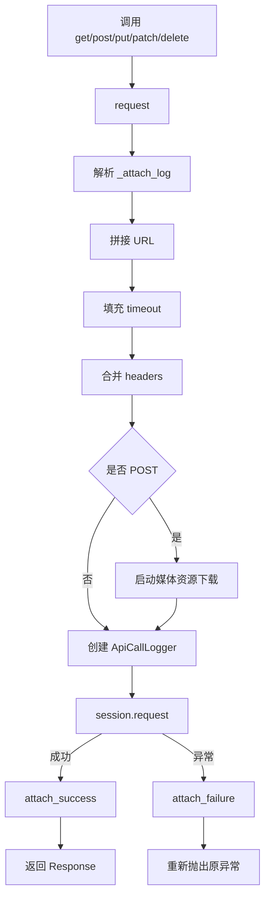

这条链能工作，而且初期有明显优势：调用直观、执行顺序集中、定位入口容易。

现在完成下面的观察表，不要先看参考分析。

| 代码行为 | 标记 T/O/C | 依赖的状态 | 状态活多久 | 未来因什么变化 |
| --- | --- | --- | --- | --- |
| 拼接 URL |  |  |  |  |
| 合并 headers |  |  |  |  |
| 启动媒体下载 |  |  |  |  |
| 创建 logger |  |  |  |  |
| 发送 HTTP |  |  |  |  |
| 挂载成功/失败日志 |  |  |  |  |

### 4.2 一个重要事实：初版不是“错误设计”

如果当时只有下列需求，把流程集中在 `request()` 中是成本较低的选择：

- 请求发送方式稳定。
- 日志只有一种实现。
- 没有复杂重试。
- 异步任务协议数量少。
- 团队规模和变化频率较低。

架构不是抽象越多越好。抽象只有在隔离真实变化、保护不变量或提高可测试性时才有价值。

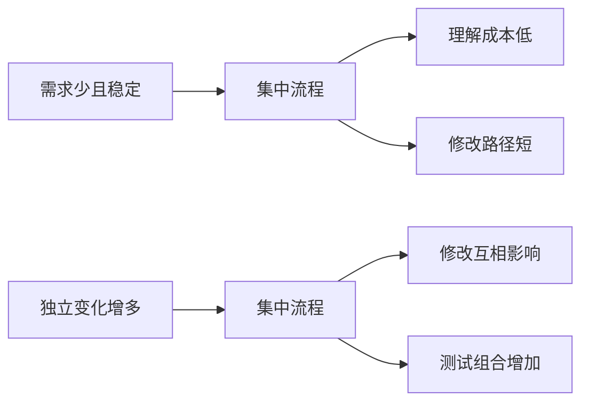

同一种结构在不同约束下，可以先是合理选择，后来变成主约束。

### 4.3 初版中已经出现的重复

继续观察 `_request_without_attach()`。它再次完成：

- URL 构造。
- timeout 默认值。
- header 合并。
- logger 创建。
- `session.request()`。
- 异常日志。

它的存在不是因为作者喜欢复制代码，而是因为轮询有一个特殊报告要求：中间响应不要全部自动挂载，只在最终结论时处理日志。

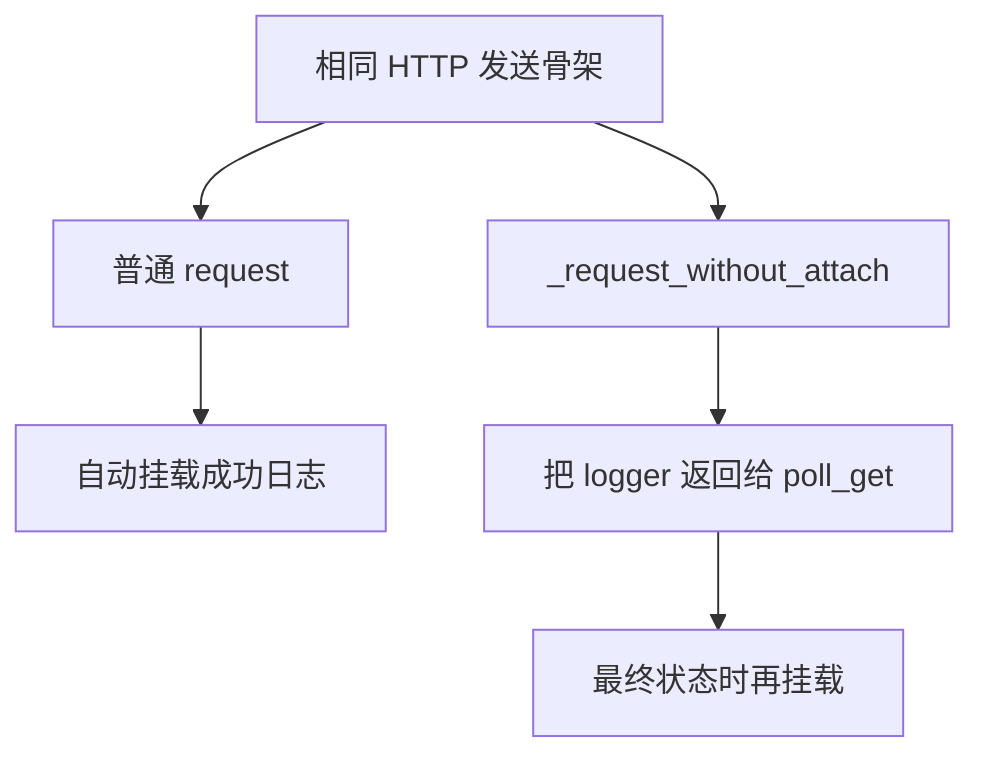

这里第一次出现了真正的设计信号：

> 传输逻辑相同，但观测时机不同；为了改变观测行为，代码复制了传输骨架。

这比“文件太长”更具体，因为它指出了两个独立变化轴被绑定在一起：HTTP 发送与日志挂载策略。

### 4.4 初版 poll_get 的职责

初版 `poll_get()` 同时完成：

1. 校验轮询参数。
2. 计算 deadline。
3. 重复发 GET。
4. 解析 JSONPath。
5. 判断成功字段。
6. 判断失败字段。
7. 决定何时记录最终日志。
8. 决定何时 sleep。
9. 构造失败或超时异常。

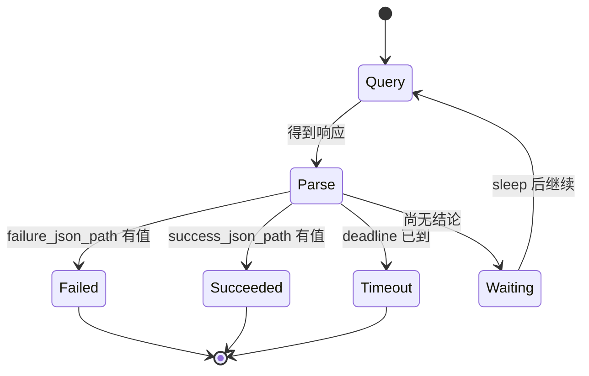

这仍然可以工作，但请注意其中存在两类时间变化：

- HTTP 请求可能因为网络瞬态故障需要再次尝试。
- HTTP 请求成功后，远端业务任务可能仍处于运行中，需要下一轮查询。

初版只实现了第二类循环。以后加入第一类循环时，如果不先辨认状态所有者，两种循环很容易缠在一起。

### 4.5 第一检查点

先暂停，回答以下问题：

1. 为什么 `_request_without_attach()` 的复制首先暴露的是观测边界问题，而不只是 DRY 问题？
2. `poll_get()` 中哪些状态属于本地循环，哪些状态来自远端服务？
3. 如果新增“每个请求生成 trace ID”，最可能修改普通请求、轮询请求中的哪些重复位置？
4. 如果新增重试，你会把循环放在 `request()` 外面还是里面？此时不要追求正确答案，只记录依据。

## 5. 观察初版 BaseTask 与执行入口

### 5.1 BaseTask 不只是路径集合

初版 `BaseTask` 包含多类行为：

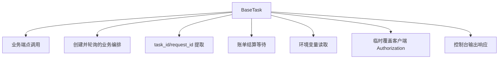

这些行为不必全部拆走。今天要问的是：它们是否因同一种原因变化？

例如：

- `/v1/media/generations` 路径变化，属于业务协议变化。
- 结算等待从 30 秒改为 60 秒，属于账单时序变化。
- `request_id` 改从 body 提取，属于链路变量来源变化。
- 输出从 `print` 改为 Allure，属于观测方式变化。
- Authorization 临时切换，属于客户端会话状态变化。

这些变化都发生在一个类里，但原因并不相同。

### 5.2 识别最危险的状态：共享可变 session headers

初版账单查询会临时修改 `request_client.session.headers`，请求结束后再 reset：

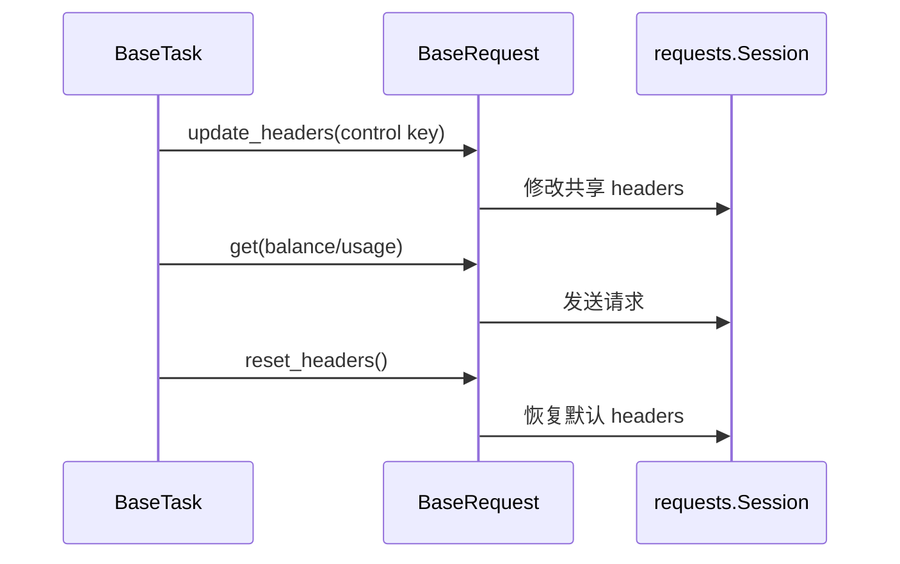

单线程顺序执行时，这个流程可以成立。并发情况下，关键问题不是语法是否线程安全，而是两条业务链可能在同一个共享客户端上交错修改认证状态。

今天不解决它，但需要认识到：

> 判断职责边界时，仅列出函数不够，还要找出可变状态以及它被谁共享。

### 5.3 初版收集与执行入口

初版 `master_service.py` 通过子进程执行 `pytest --collect-only`，再从文本输出中筛选包含 `::` 的行；`run_master.py` 把 nodeid 和 `-n/--dist` 参数直接交给 pytest。

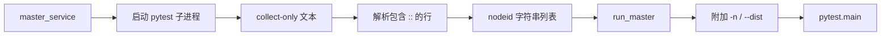

这个设计拥有“有哪些用例”，但不拥有 marker 等结构化元数据。因此它能执行全量串行或把全量交给 xdist，却无法表达“多数用例并发，少数共享资源用例串行”。

这里的演进压力不是来自 HTTP，而是来自执行计划。它与请求层的变化是独立的。

### 5.4 第二检查点

完成下面的变化清单：

| 新需求 | 最可能修改初版哪里 | 变化原因 |
| --- | --- | --- |
| 日志统一脱敏 |  |  |
| GET 遇到 503 有限重试 |  |  |
| 异步任务新增 `cancelled` 状态 |  |  |
| `request_id` 先从 header、再从 body 兜底 |  |  |
| 共享账号用例禁止并发 |  |  |
| 报告需要保存每次状态迁移 |  |  |

如果多个需求都需要修改 `BaseRequest`，不能立刻得出“BaseRequest 应全部拆掉”。先判断它们分别改变什么状态。

## 6. 从现象深入到根因

### 6.1 不够深入的诊断

以下说法都可能为真，但不足以指导重构：

- `BaseRequest` 太大。
- 代码耦合高。
- 不符合单一职责原则。
- 应该使用设计模式。
- 应该拆成更多文件。

它们没有说明应该在哪里切开，也没有说明拆开后由谁拥有状态。

### 6.2 可执行的因果链

更准确的因果链是：

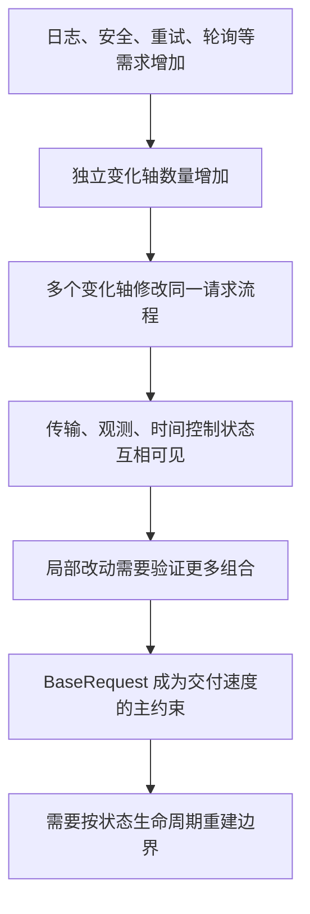

真正的根因不是代码行数，而是：

> 独立变化轴共享同一修改边界，并且相关状态缺少明确所有者。

### 6.3 用一个具体例子验证因果链

假设要增加“失败日志脱敏”：

1. 日志需要看到异常内容。
2. 异常可能携带 prepared request。
3. prepared request 中可能有 Authorization。
4. 普通请求异常由 `request()` 记录。
5. 轮询内部异常由 `_request_without_attach()` 记录。
6. 超时错误又由 `poll_get()` 拼接最后响应。

一个安全需求会横跨三条错误出口。问题不是脱敏算法难，而是观测数据没有统一安全出口。

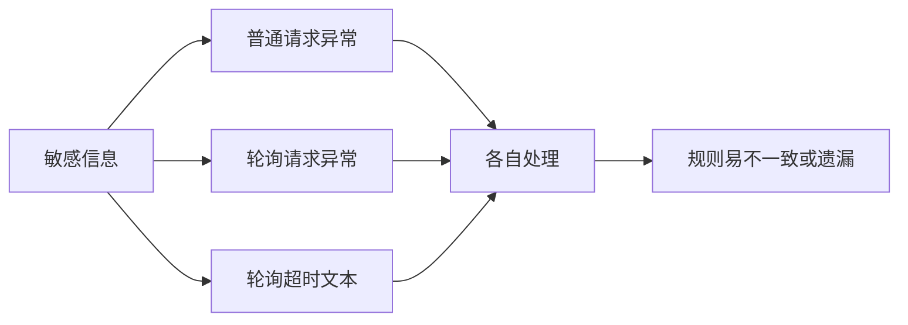

这个例子说明变化轴分析必须落到数据流和错误出口，不能只数类和函数。

## 7. 第二遍观察：阅读真实演进证据

现在可以打开演进版本，但仍不要先研究所有实现细节。

### 7.1 第一次集中增强：291e6ea

执行：

```powershell
git diff --stat 56f4f15 291e6ea -- common/base_request.py common/base_task.py
git diff 56f4f15 291e6ea -- common/base_request.py
```

在这次演进中，`common/base_request.py` 增加 421 行、删除 33 行。新增能力包括：

- 独立请求上下文。
- Middleware 生命周期。
- 重试策略和重试循环。
- 轮询状态策略和迁移记录。
- 新的日志协调方式。

这次改造证明了初版确实面临扩展压力，但它不是最终答案。第一次演进采取的是：先建立模型和入口，再保留大量编排在 `BaseRequest` 中。

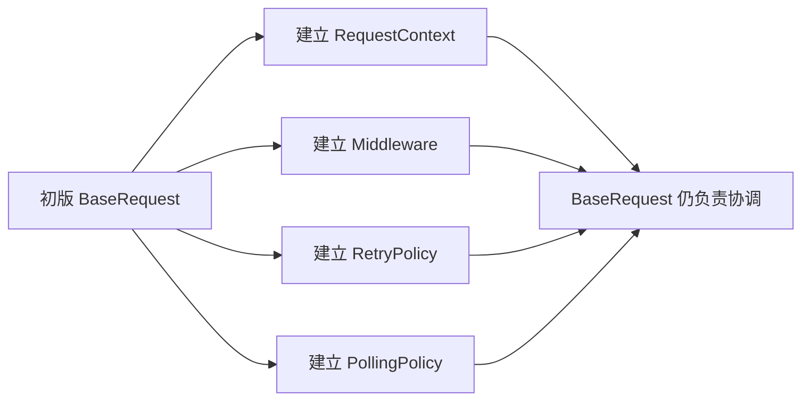

为什么没有一次性拆成最终形态？合理解释包括：

- 先保持公开调用兼容，缩小迁移风险。
- 新模型尚未经过足够用例验证，边界仍需观察。
- 如果一次同时改变模型、执行器和业务调用，失败时难以定位。

渐进式演进允许每一步都可测试、可回退，但会暂时保留中间态复杂度。

### 7.2 第二次抽离：2748f16

执行：

```powershell
git show 2748f16 -- common/base_request.py common/retry_executor.py
```

这次改造把重试主循环从 `BaseRequest` 抽到独立 `RetryExecutor`。原因不是“又想多建一个类”，而是第一次增强后已经能够观察到两组不同变化：

| BaseRequest 关心 | RetryExecutor 关心 |
| --- | --- |
| 构造 URL 和 headers | attempt 序号 |
| 创建 RequestContext | 累计重试记录 |
| 执行 Middleware | 退避等待 |
| 调用 HTTP transport | 最大次数和总时间预算 |
| 协调 logger | 是否继续下一次 attempt |

两组状态生命周期不同，因此再次分裂。

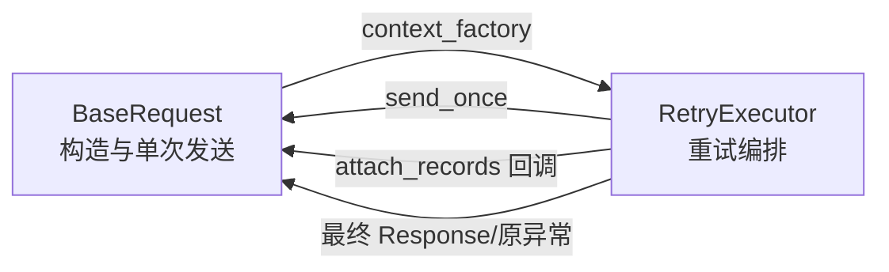

这里最重要的学习不是 executor 的 API，而是演进方法：


### 7.3 演进不是线性追求更多抽象

真实演进可以概括为：

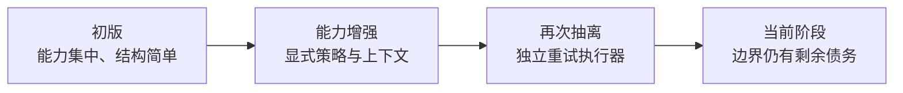

其中每一步都在新的主约束出现后才进行。TOC 的意义不是预先建设所有抽象，而是识别当前限制交付质量或速度的关键约束。

## 8. 找到变化轴

现在把需求按“为什么变化”分类，而不是按“放在哪个文件”分类。

### 8.1 参考变化轴

| 变化轴 | 典型变化 | 不应被迫同时变化的内容 |
| --- | --- | --- |
| 配置可信度 | 环境选择、类型、必填项 | HTTP transport |
| 传输 | URL、headers、timeout、session | 日志附件格式 |
| 横切观测 | 日志、脱敏、cURL、trace | 业务状态集合 |
| 瞬态恢复 | 状态码、异常、退避、预算 | 单次发送实现 |
| 业务状态 | pending/success/failure/unknown | 网络重试条件 |
| 用例链路 | task_id、request_id、cleanup | session 全局状态 |
| 执行调度 | worker、marker、执行池 | HTTP 请求参数 |

### 8.2 变化轴之间的关系

它们不是完全孤立，而是通过明确接口组合：

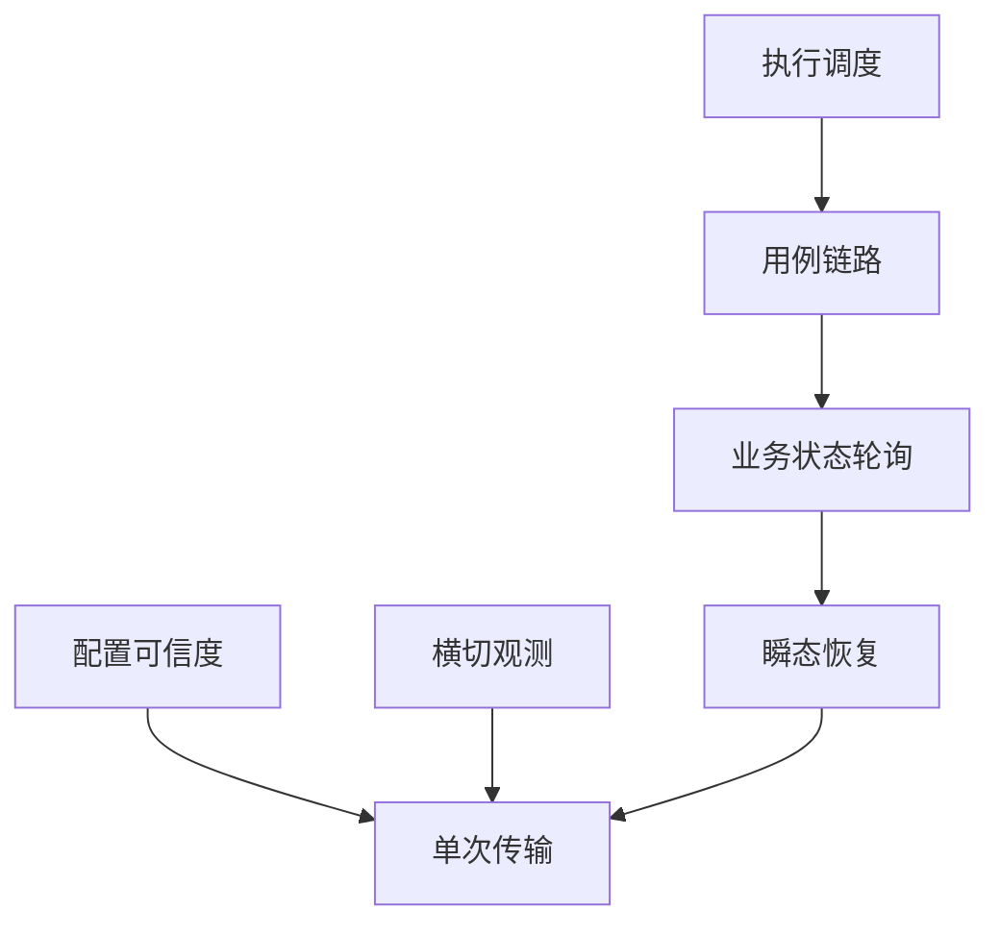

箭头表示“上层使用下层能力”，不表示上层应该拥有下层状态。

例如轮询可以调用带重试的 GET，但轮询不应该拥有 `RetryPolicy` 内部的退避计算；重试可以调用单次传输，但不应该直接实现 logger。

### 8.3 变化轴练习

为以下需求填写主变化轴和次要影响：

| 需求 | 主变化轴 | 次要影响 | 为什么 |
| --- | --- | --- | --- |
| Authorization 不得出现在 Allure |  |  |  |
| 429 尊重 Retry-After |  |  |  |
| 新增 `paused` 状态 |  |  |  |
| 用例结束删除临时资源 |  |  |  |
| 计费用例必须串行 |  |  |  |
| 新增 request trace |  |  |  |

判断主变化轴时，问“哪组规则决定最终行为”，而不是“代码最先从哪里调用”。

## 9. 识别状态所有者

### 9.1 生命周期比文件名更可靠

当前框架中的状态大致形成嵌套生命周期：

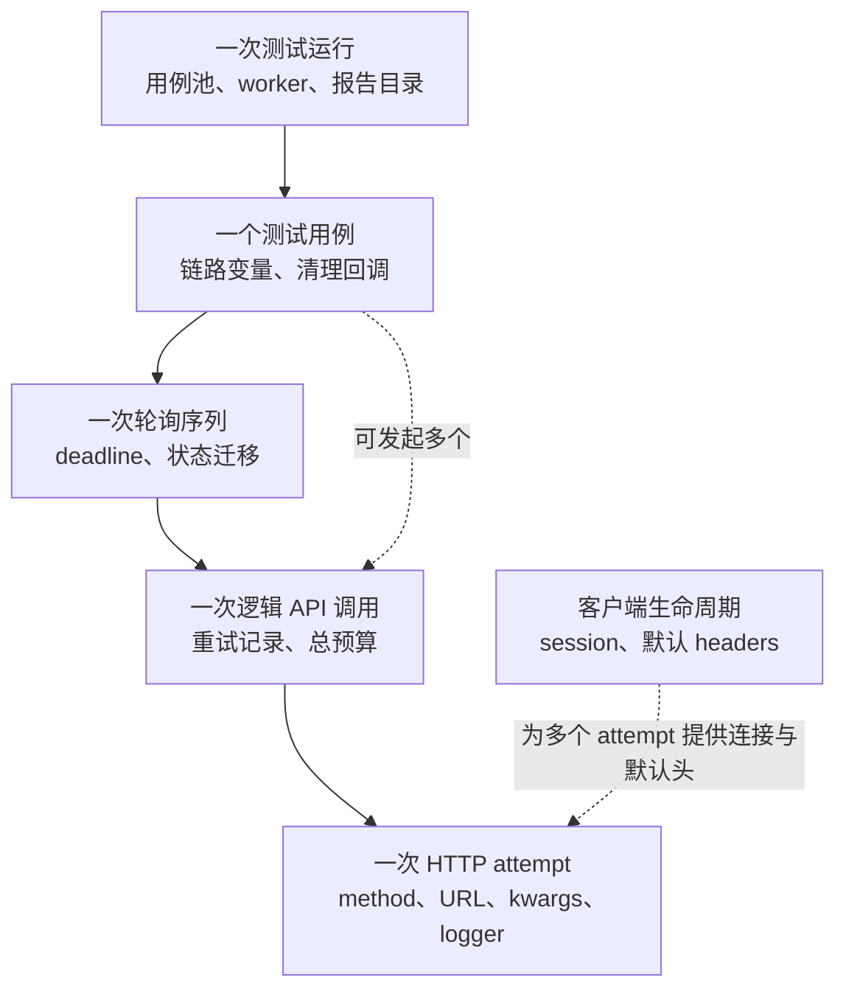

这不是严格的每次都完整嵌套。例如一个同步用例可以没有 polling；一个 case 可以创建多个客户端。但它能帮助判断状态不应越过哪条边界。

### 9.2 状态所有权参考表

先自行填写，再对照下面的参考答案：

| 状态 | 创建者 | 修改者 | 结束/清理者 | 生命周期 |
| --- | --- | --- | --- | --- |
| 默认 session headers | 请求客户端 | 客户端公开方法 | `close/reset` | 客户端 |
| 本次请求 kwargs | 请求入口 | 构造过程/Middleware | attempt 结束 | HTTP attempt |
| attempt index | 重试编排者 | 重试编排者 | 逻辑调用结束 | retry sequence |
| polling transitions | 轮询编排者 | 每轮状态评估 | 得出最终结论 | polling sequence |
| task_id | 测试链路 | 提取逻辑 | 用例结束 | test case |
| 并发池/串行池 | runner | 调度过程 | 测试运行结束 | test run |

一个对象不一定只能拥有一种状态，但如果同时拥有多个差异很大的生命周期，就需要特别警惕。

### 9.3 状态泄漏的判断方式

当状态存活时间超过它应该服务的任务，就发生了泄漏风险：

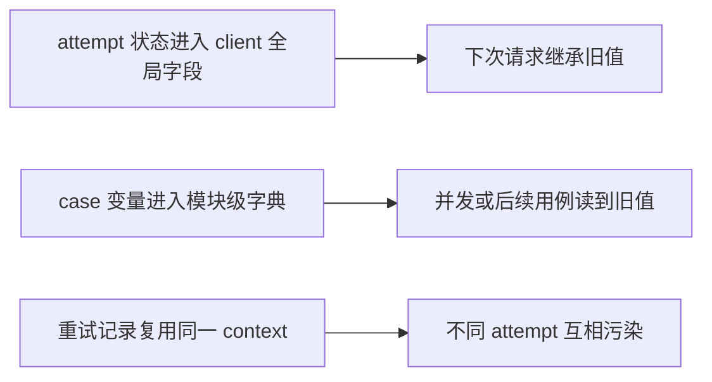

边界设计的核心价值之一，就是让短生命周期状态无法意外存活过久。

## 10. 从不变量推导职责边界

不要先决定类名。先写出系统必须始终成立的事实。

### 10.1 第一天需要识别的不变量

1. 观测行为不能改变真实请求语义。
2. 一次 attempt 的临时数据不能污染下一次 attempt。
3. 网络恢复是否继续，不能由业务成功状态决定。
4. 业务任务是否完成，不能由 HTTP 请求是否成功决定。
5. 用例变量不能跨 case 隐式共享。
6. 并发调度不能让已知共享资源用例互相破坏。
7. 新扩展应尽量保持现有 `get/post/...` 调用方式。

### 10.2 从不变量推导边界

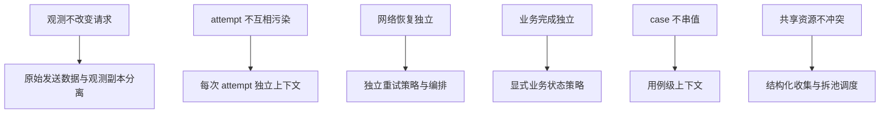

这条推导链比“因为用了某设计模式”更可靠。模式是实现边界的一种手段，不是边界存在的原因。

## 11. 比较三种方案

### 11.1 方案 A：继续扩大 BaseRequest

所有新能力继续写进 `request()`、`poll_get()` 和辅助方法。

优点：

- 入口集中。
- 初期开发快。
- 不增加概念数量。

代价：

- 独立变化轴共享修改点。
- 状态生命周期只能靠命名和开发者自律区分。
- 测试一个能力时需要构造更多无关依赖。
- 新控制流容易与旧控制流交叉。

### 11.2 方案 B：按功能拆成工具函数

把日志、重试、轮询、变量提取拆成一组函数，`BaseRequest` 调用它们。

优点：

- 文件变短。
- 纯函数容易测试。
- 迁移成本可能较低。

代价：

- 有状态循环仍需调用方传递大量参数。
- 谁创建、修改和结束状态仍可能不清楚。
- 工具函数容易变成“无所有者的公共能力集合”。

工具函数适合计算和转换，例如退避时间计算；不一定适合拥有完整重试序列。

### 11.3 方案 C：按状态生命周期拆对象

让单次请求、重试序列、轮询序列和用例链路拥有各自状态边界，通过显式接口组合。

优点：

- 状态所有权清晰。
- 可以注入 transport、时间和记录回调做离线测试。
- 一个变化轴通常只影响局部边界。

代价：

- 类型、接口和适配代码增加。
- 学习成本更高。
- 边界划分错误会产生无价值的薄包装。
- 过早抽象会让简单需求复杂化。

### 11.4 决策表

| 判断维度 | 扩大 BaseRequest | 工具函数 | 生命周期对象 |
| --- | --- | --- | --- |
| 初期实现速度 | 高 | 中高 | 中低 |
| 状态所有权 | 模糊 | 取决于调用方 | 清晰 |
| 独立测试 | 较难 | 计算逻辑容易 | 控制流也可独立测试 |
| 兼容旧调用 | 容易 | 容易 | 需要适配层 |
| 多变化轴扩展 | 容易互相影响 | 参数传递膨胀 | 局部演进 |
| 适用阶段 | 需求少且稳定 | 无状态通用计算 | 已出现稳定独立生命周期 |

### 11.5 TOC 决策

初版阶段，主要约束是快速建立业务覆盖，方案 A 合理。

当日志、安全、重试、轮询和上下文同时出现后，主要约束转为修改扩散和异常分支不可稳定验证，方案 C 的额外复杂度开始产生收益。


所以不能脱离项目阶段争论哪种方案“永远最好”。

## 12. 最小实验：用 Git 证明演进，而不是凭印象

### 12.1 实验目标

证明两件事：

1. 第一次能力增强确实把多个扩展点集中引入 `BaseRequest`。
2. 后续又根据独立生命周期抽离了重试执行循环。

### 12.2 执行命令

```powershell
git diff --stat 56f4f15 291e6ea -- common/base_request.py common/base_task.py
git diff 56f4f15 291e6ea -- common/base_request.py | Select-Object -First 220

git show --stat 2748f16 -- common/base_request.py common/retry_executor.py
git show 2748f16 -- common/base_request.py common/retry_executor.py | Select-Object -First 260
```

### 12.3 观察记录

为两次演进分别填写：

| 演进 | 新增了什么状态 | 当时由谁拥有 | 为什么下一步还要调整 |
| --- | --- | --- | --- |
| `56f4f15 → 291e6ea` |  |  |  |
| `291e6ea → 2748f16` |  |  |  |

### 12.4 五句话限制

用正好五句话解释演进：

1. 初版首先解决了什么问题。
2. 新需求增加了哪些独立变化轴。
3. 第一次增强建立了哪些显式模型。
4. 为什么第一次增强仍让 `BaseRequest` 过厚。
5. `RetryExecutor` 的抽离依据是什么。

限制句数是为了迫使你表达因果，而不是复述文件清单。

## 13. 课堂练习

### 练习 1：只根据变化原因分类

不要写类名，把下列需求放入变化轴：

1. 请求日志增加 cURL。
2. Authorization 全链路脱敏。
3. 503 使用指数退避。
4. POST 只有幂等键时允许重试。
5. 异步接口新增 `cancelled`。
6. 从 header 提取 request ID。
7. 用例结束删除远端临时资源。
8. 计费用例必须串行。

### 练习 2：找状态所有者

为以下状态写出创建者、修改者、结束者和生命周期：

- `attach_log`。
- 当前 request kwargs。
- retry attempt index。
- polling deadline。
- task ID。
- serial case nodeids。

### 练习 3：方案选择

场景：现在只需要给请求增加一个固定的 `X-Client-Version` header，未来半年不会变化。

回答：

- 是否需要创建新对象？
- 最小安全改动是什么？
- 什么新变化出现后，才值得建立独立边界？

这个练习用来防止“学会拆分后，所有需求都想新增抽象”。

## 14. 参考分析

完成练习后再展开本节。

<details>
<summary>练习 1 参考</summary>

| 需求 | 主变化轴 | 说明 |
| --- | --- | --- |
| 请求日志增加 cURL | 横切观测 | 不应改变 transport |
| Authorization 全链路脱敏 | 安全观测 | 影响多个输出出口，但不能改真实数据 |
| 503 使用指数退避 | 瞬态恢复 | 决定何时再次 attempt |
| POST 幂等键约束 | 瞬态恢复 + 业务语义 | 安全重复的证据来自业务语义 |
| 新增 cancelled | 业务状态 | HTTP 200 也可能是业务失败 |
| 提取 request ID | 用例链路 | 值服务于后续步骤 |
| 删除临时资源 | 用例生命周期 | 清理责任在 case 结束时触发 |
| 计费用例串行 | 执行调度 | 约束来自共享外部资源 |

</details>

<details>
<summary>练习 2 参考</summary>

| 状态 | 主要所有者 | 生命周期 |
| --- | --- | --- |
| `attach_log` | 单次请求上下文 | 一个 HTTP attempt |
| request kwargs | 单次请求上下文 | 一个 HTTP attempt |
| retry attempt index | 重试编排 | 一个逻辑调用的 retry sequence |
| polling deadline | 轮询编排 | 一个 polling sequence |
| task ID | 测试链路 | 一个 test case，或显式传给外部所有者 |
| serial nodeids | 执行计划 | 一次 test run |

</details>

<details>
<summary>练习 3 参考</summary>

不一定需要新对象。若 header 对所有请求固定且没有独立生命周期，把它加入默认 header 构造可能就是最小方案。

当它需要按环境变化、每次请求动态计算、依赖外部凭据刷新、需要独立测试或由不同模块选择启用时，变化轴开始与静态默认 header 分离，才需要考虑配置层、认证组件或 Middleware 等边界。

</details>

## 15. 常见误区

### 误区 1：文件越短，架构越好

把一个大文件拆成十个互相调用、共享隐式状态的小文件，并没有建立边界。

### 误区 2：重复代码必须立即消除

有些重复是在两个行为尚未稳定前保留的迁移缓冲。应先确认共同部分和变化部分，再抽象。

### 误区 3：类就是状态所有者

类可能只是命名空间。只有当它明确创建、修改并结束某段状态时，才真正拥有生命周期。

### 误区 4：所有请求附近的能力都属于 Middleware

Middleware 适合一次 attempt 的横切行为。跨 attempt 的 retry、跨请求的 polling、跨步骤的 case context 属于不同生命周期。

### 误区 5：当前实现就是标准答案

当前实现是当前业务规模、兼容要求和投入预算下的选择。继续演进时，新的约束可能要求再次调整。

## 16. 最终验收

### 16.1 五个口述问题

不看代码回答：

1. 初版为什么在当时是合理的？
2. `_request_without_attach()` 的重复揭示了哪两个变化轴？
3. 为什么第一次引入 RetryPolicy 后，后来仍要抽出 RetryExecutor？
4. 状态生命周期如何帮助区分 retry、polling 和 test case？
5. 为什么“BaseRequest 太大”不是足够深入的根因？

### 16.2 合格答案必须包含

- 至少两个具体旧代码证据。
- 至少四个独立变化轴。
- 至少四种生命周期。
- 一个当前方案与替代方案的权衡。
- “初版合理、约束变化后才需要演进”这一动态判断。

### 16.3 今日总结模板

用不超过 150 字完成：

> 初版框架的主要目标是……。随着……等变化轴增加，真正的约束从……转变为……。判断拆分位置不能依据文件大小，而要依据……。当前框架通过……建立边界，但这些边界仍然是……条件下的阶段性选择。

## 17. 今日产出清单

完成后应拥有：

- [ ] 初版 `BaseRequest` 职责标注表。
- [ ] 初版 `BaseTask` 与 runner 变化清单。
- [ ] 一张问题因果图。
- [ ] 一张变化轴表。
- [ ] 一张状态所有权与生命周期表。
- [ ] 三种架构方案决策表。
- [ ] 两次关键演进的五句话解释。
- [ ] 150 字以内总结。

今天到此结束。不要提前学习各扩展类的具体字段；下一节只聚焦配置如何从外部字符串演进为可信运行时状态。
