# 第 1 天：从初版框架建立演进问题地图

## 0. 本节结论

初版框架没有设计错误。它在业务覆盖不足的阶段，以较低成本完成了请求发送、业务编排、异步轮询和用例执行。

后续必须演进的根本原因也不是 `BaseRequest` 文件太长，而是日志、安全、重试、轮询、链路变量和执行调度沿不同原因变化，却共同修改少数核心文件。这使局部改动需要验证越来越多的无关组合，核心文件逐渐成为交付速度和正确性的主约束。

解决这一约束的正确起点不是增加更多目录，而是依次完成：


当前框架由此形成了主要控制边界：单次 HTTP 请求、重试序列、业务轮询序列、测试用例和测试运行分别拥有自己的状态。它们通过接口组合，不再依赖一个对象持有所有状态。不过，账户查询的临时 Authorization 仍写入共享 Session，这说明“边界已经形成”不等于“所有旧状态都已完成迁移”。

## 1. 两小时核心总图与扩展精读

第一节承担全课程坐标系，内容完整性优先于严格限制在两小时。首轮用 120 分钟建立总图，已经满足每天至少两小时的学习内容；再用约 90 分钟核对关键源码。后续专题会分别深入配置、Middleware、日志、重试、轮询、TestContext 和调度，本节不要求一次记住所有 API。

| 阶段 | 时间 | 学习内容 |
| --- | ---: | --- |
| 概念准备 | 0～10 分钟 | 功能、职责、状态、变化轴和边界 |
| 初版请求层 | 10～35 分钟 | `BaseRequest` 的能力、重复与状态 |
| 初版业务和执行层 | 35～55 分钟 | `BaseTask`、`master_service`、`run_master` |
| 根因分析 | 55～70 分钟 | 从文件膨胀深入到变化轴冲突 |
| 两次关键演进 | 70～90 分钟 | `291e6ea` 与 `2748f16` |
| 状态所有权 | 90～105 分钟 | 五种生命周期与不变量 |
| 方案比较 | 105～115 分钟 | 集中流程、工具函数、生命周期对象 |
| 结论复盘 | 115～120 分钟 | 完整演进因果链 |

核心总图完成后继续扩展精读：

| 扩展阶段 | 时间 | 学习内容 |
| --- | ---: | --- |
| 初版源码对照 | 120～145 分钟 | `request`、`_request_without_attach`、`poll_get` |
| 第一次增强对照 | 145～170 分钟 | RequestContext、Middleware、内置重试循环 |
| 第二次抽离对照 | 170～195 分钟 | BaseRequest 委托与 RetryExecutor 所有权 |
| 当前边界核验 | 195～210 分钟 | runner、TestContext、polling 与 Session Header 遗留 |

本节只建立演进问题地图，不提前展开各扩展类的字段和 API。

## 2. 五个基础概念

### 2.1 功能

功能描述系统具备的外部能力，例如发送请求、生成日志、轮询异步任务。

### 2.2 职责

职责描述某个对象必须保证的结果。例如请求层需要保证 method、URL、headers 和 body 被正确交给 HTTP transport。

### 2.3 状态

状态是执行过程中必须保存并可能变化的数据，例如 session headers、请求参数、重试次数、轮询迁移历史和 `task_id`。

### 2.4 变化轴

变化轴描述代码因何种原因发生变化。日志格式因报告需求变化，重试次数因稳定性策略变化，异步状态集合因业务协议变化。这些功能都靠近请求流程，但变化原因不同。

### 2.5 职责边界

职责边界根据变化轴和状态生命周期，把必须共同变化的内容放在一起，把独立变化的内容隔离开。


因此，架构分析的顺序不是先决定文件数量，而是先识别状态及其生命周期。

## 3. 初版框架的真实结构

本节以初始提交 `56f4f15` 为观察对象。以下命令只读取历史，不修改工作区：

```powershell
cd D:\API_CASE
git show 56f4f15:common/base_request.py
git show 56f4f15:common/base_task.py
git show 56f4f15:master_service.py
git show 56f4f15:run_master.py
```

### 3.1 初版 BaseRequest 的普通请求链

初版 `request()` 集中完成请求构造、媒体资源处理、HTTP 发送和日志记录：

初版代码：`56f4f15`，`common/base_request.py`

```python
def request(self, method: str, path: str, **kwargs: Any) -> requests.Response:
    attach_log = kwargs.pop("_attach_log", True)
    url = self._build_url(path)
    kwargs.setdefault("timeout", self.config.timeout)

    headers = kwargs.pop("headers", None)
    if headers:
        kwargs["headers"] = self._merge_headers(headers)

    if method.upper() == "POST":
        start_media_downloads(kwargs.get("json"))

    logger = ApiCallLogger(method, url, kwargs)
    try:
        response = self.session.request(method=method, url=url, **kwargs)
    except Exception as error:
        if attach_log:
            logger.attach_failure(error)
        raise

    if attach_log:
        logger.attach_success(response)
    return response
```

这段代码直接提供三项证据：`kwargs` 同时经过传输构造和日志构造，POST 媒体处理直接嵌入发送入口，成功与失败附件由请求方法决定。传输、资源处理和观测沿不同原因变化，却共享同一个修改点。初版没有跨请求控制状态，因此集中实现仍符合当时“先获得统一调用能力”的主约束。

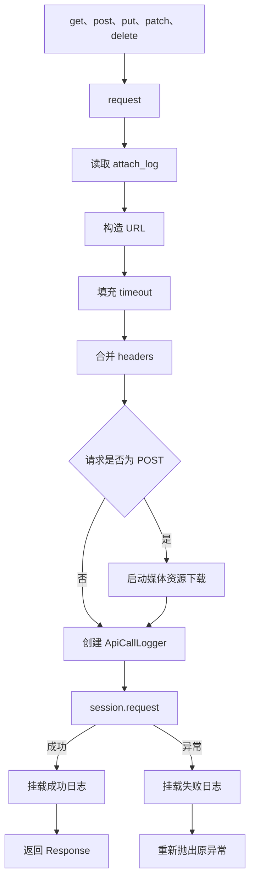

职责可以直接归纳为：

| 代码行为 | 类型 | 依赖状态 | 生命周期 | 变化原因 |
| --- | --- | --- | --- | --- |
| URL 构造 | 传输 | base URL、path | 单次请求 | 环境和路由规则 |
| header 合并 | 传输 | session headers、调用参数 | 单次请求 | 认证和接口要求 |
| 媒体下载 | 横切行为 | POST payload | 单次请求及后台任务 | 素材记录需求 |
| logger 创建 | 观测 | method、URL、kwargs | 单次请求 | 报告格式和安全要求 |
| HTTP 发送 | 传输 | session、请求参数 | 单次请求 | 客户端和网络行为 |
| 成功或失败附件 | 观测 | response 或 exception | 单次请求 | Allure 展示要求 |

初版将这些职责集中在一个入口中，具有三项现实收益：

- 调用路径短。
- 执行顺序直观。
- 在需求较少时维护成本低。

因此初版属于符合当时约束的合理设计。

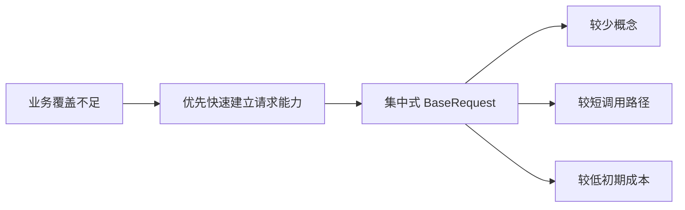

### 3.2 `_request_without_attach` 暴露了第一个边界问题

初版 `_request_without_attach()` 重复了 URL 构造、timeout 填充、header 合并、logger 创建、HTTP 发送和异常日志。

初版代码：`56f4f15`，`common/base_request.py`

```python
def _request_without_attach(
    self,
    method: str,
    path: str,
    *,
    step_name: str = API_REQUEST_STEP_NAME,
    response_step_name: str | None = None,
    **kwargs: Any,
) -> tuple[requests.Response, ApiCallLogger]:
    url = self._build_url(path)
    request_kwargs = dict(kwargs)
    request_kwargs.setdefault("timeout", self.config.timeout)

    headers = request_kwargs.pop("headers", None)
    if headers:
        request_kwargs["headers"] = self._merge_headers(headers)

    logger_kwargs: dict[str, Any] = {"step_name": step_name}
    if response_step_name is not None:
        logger_kwargs["response_step_name"] = response_step_name

    logger = ApiCallLogger(method, url, request_kwargs, **logger_kwargs)
    try:
        response = self.session.request(method=method, url=url, **request_kwargs)
    except Exception as error:
        logger.attach_failure(error)
        raise

    return response, logger
```

这不是普通的代码重复，而是由报告语义驱动的重复：普通请求需要立即挂载响应日志，轮询中间响应不能全部挂载，只在最终结论处记录。

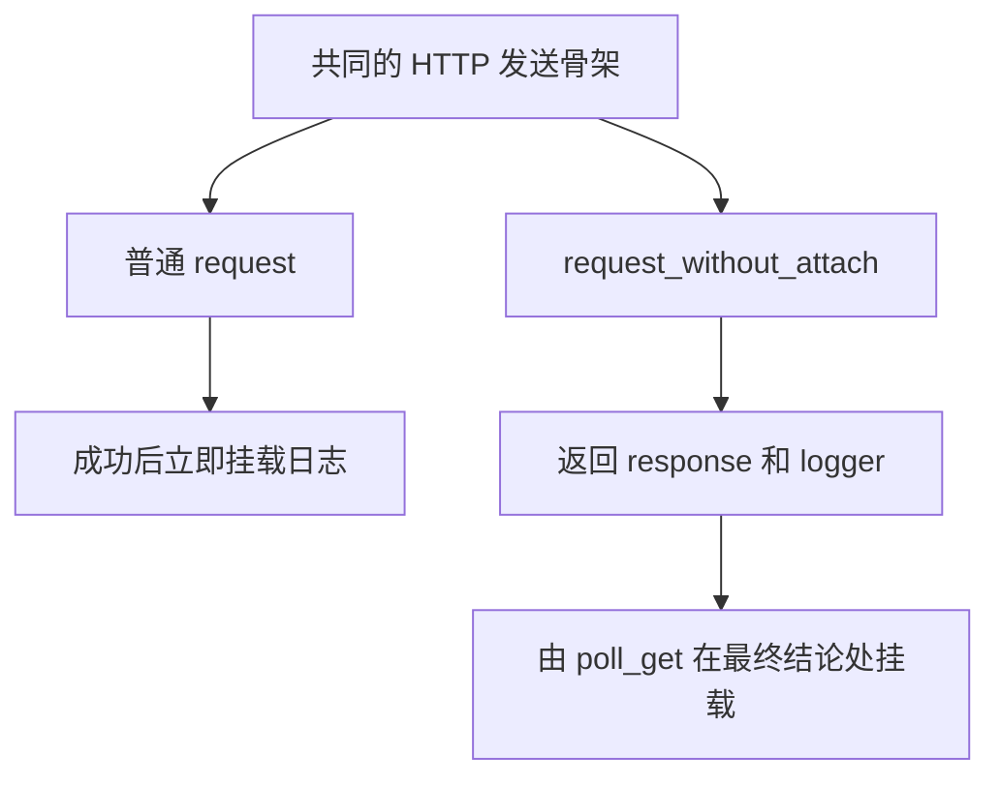

这里已经能得出完整答案：

- 传输逻辑的变化轴是 HTTP 构造与发送。
- 观测逻辑的变化轴是何时、以何种格式记录证据。
- 两个变化轴被绑定后，为了改变观测时机，只能复制传输骨架。
- 因此真正缺失的是单次请求上下文和可替换的观测生命周期，而不仅是一个公共函数。

### 3.3 初版 poll_get 同时拥有两类状态

初版 `poll_get()` 负责参数校验、deadline、重复 GET、JSONPath 解析、成功判断、失败判断、sleep、最终日志和异常构造。

初版代码：`56f4f15`，`common/base_request.py`

```python
def poll_get(
    self,
    path: str,
    *,
    poll_interval: float = 2,
    poll_timeout: float | None = None,
    success_json_path: str | None = None,
    failure_json_path: str | None = None,
    **kwargs: Any,
) -> requests.Response:
    if poll_interval <= 0:
        raise ValueError("poll_interval must be greater than 0")

    timeout = self.config.timeout if poll_timeout is None else poll_timeout
    if timeout <= 0:
        raise ValueError("poll_timeout must be greater than 0")

    deadline = time.monotonic() + timeout
    last_response: requests.Response
    last_status: Any
    last_logger: ApiCallLogger | None = None

    while True:
        last_response, last_logger = self._request_without_attach(
            "GET",
            path,
            step_name=POLL_GET_REQUEST_STEP_NAME,
            response_step_name=POLL_GET_RESPONSE_STEP_NAME,
            **kwargs,
        )
        failure_status = None
        try:
            if failure_json_path is not None:
                failure_status = self._extract_json_path_value(last_response, failure_json_path)
            last_status = self._extract_json_path_value(last_response, success_json_path)
        except Exception:
            last_logger.attach_success(last_response)
            raise

        if failure_json_path is not None and failure_status is not None:
            last_logger.attach_success(last_response)
            raise AssertionError(
                f"poll_get failed: path={path!r}, "
                f"{failure_json_path}={failure_status!r}, "
                f"response={last_response.text}"
            )

        if last_status is not None:
            last_logger.attach_success(last_response)
            return last_response

        remaining = deadline - time.monotonic()
        if remaining <= 0:
            last_logger.attach_success(last_response)
            raise TimeoutError(
                f"poll_get timed out after {timeout} seconds: path={path!r}, "
                f"last {success_json_path}={last_status!r}, "
                f"last response={last_response.text if last_response is not None else '<empty>'}"
            )

        time.sleep(min(poll_interval, remaining))
```

代码证据中的所有权是明确的：`poll_get()` 创建并修改 deadline、last response 和 sleep 节奏，同时用 JSONPath 值决定远端任务成功或失败，并亲自决定最终日志时机。一个函数因此同时拥有本地时间控制、远端业务判定和观测协调。

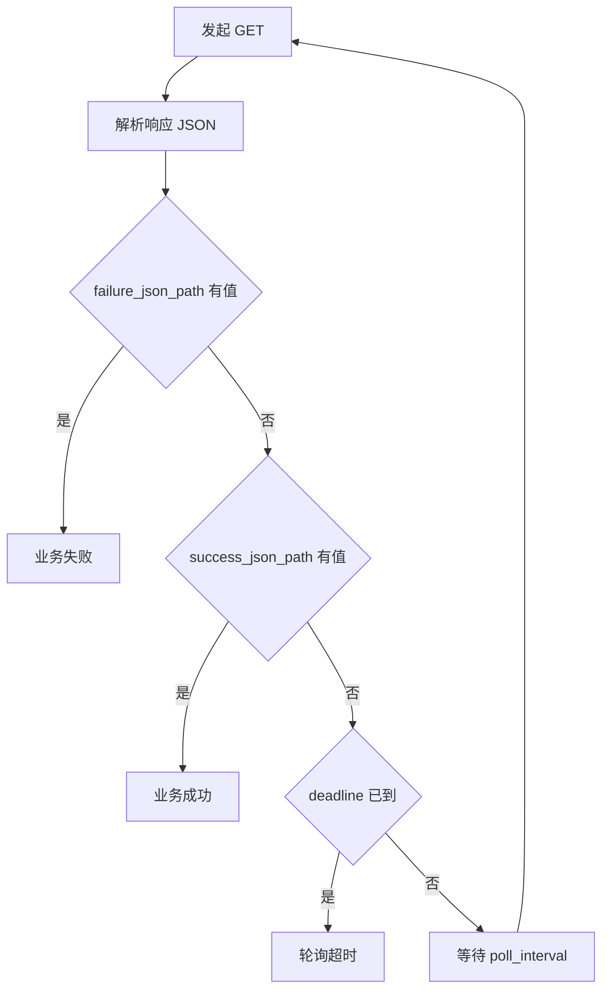

其中的状态分成两组：

| 状态组 | 具体状态 | 来源 | 正确生命周期 |
| --- | --- | --- | --- |
| 本地控制状态 | deadline、remaining、poll interval、最后响应 | 框架 | 一次轮询序列 |
| 远端业务状态 | success 字段、failure 字段、任务结果 | 服务端响应 | 一次远端任务 |

后续加入网络重试后，还会出现第三组状态：attempt 次数、退避等待、重试记录和总重试预算。这组状态只属于一次逻辑 HTTP 调用，不属于整个业务任务。

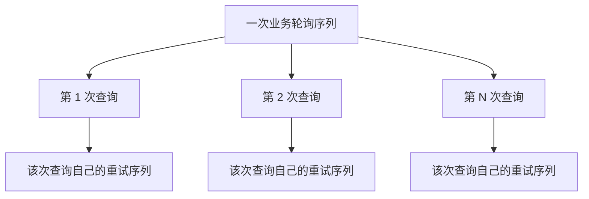

这证明网络恢复和业务轮询是两个嵌套但不同的控制流。

## 4. 初版 BaseTask 的变化轴

初版 `BaseTask` 同时包含：

初版代码：`56f4f15`，`common/base_task.py`

```python
def get_account_balance(
    self,
    request_client: BaseRequest,
    control_api_key: str,
) -> requests.Response:
    request_client.update_headers(
        {
            "User-Agent": "api-v1_chat_completions-framework",
            "Accept-Encoding": "gzip, deflate, zstd",
            "Accept": "application/json",
            "Connection": "keep-alive",
            "Content-Type": "application/json",
            "Authorization": f"Bearer {control_api_key}",
        }
    )
    try:
        return request_client.get(self.account_balance_path, data="")
    finally:
        request_client.reset_headers()

def query_usage_records_by_request_id(
    self,
    request_client: BaseRequest,
    control_api_key: str,
    request_id: str,
) -> requests.Response:
    request_client.update_headers({"Authorization": f"Bearer {control_api_key}"})
    try:
        usage_response = request_client.get(
            self.usage_records_path,
            params={"request_id": request_id, "": ""},
        )
    finally:
        request_client.reset_headers()

    print("usage_records response body:")
    print(self.format_response_body(usage_response))
    return usage_response
```

这里保留了影响推导的完整控制流，省略的只有函数 docstring 和装饰器。代码本身证明一个业务方法同时知道端点、request ID、控制台认证、共享客户端恢复和控制台输出。不同变化轴不是根据方法名称猜测出来的，而是由它直接读写的状态推出。

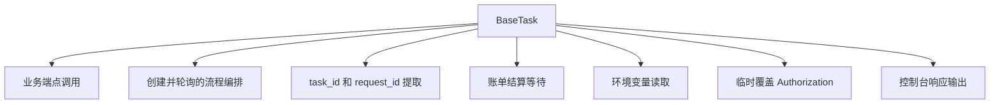

这些职责的变化原因并不相同：

| 行为 | 变化轴 |
| --- | --- |
| API 路径和 payload | 业务协议 |
| 创建后轮询 | 业务流程 |
| task ID 和 request ID 提取 | 链路变量来源 |
| 固定等待 30 秒 | 账单时序 |
| 读取控制台密钥 | 环境配置 |
| 临时替换 Authorization | 客户端会话状态 |
| `print` 响应内容 | 观测方式 |

文件中功能较多不是直接重构依据，但这些功能沿不同原因变化，说明它们不应永久共享同一修改边界。

### 4.1 共享 session headers 是关键状态

账单相关方法会临时修改 `request_client.session.headers`，请求结束后再 reset。

初版与当前 dev2 在这条状态边界上保持了相同做法。

当前代码：`dev2`，`module/smoke/request.py`

```python
def get_account_balance(self, control_api_key: str) -> requests.Response:
    self.update_headers(
        {
            "User-Agent": "api-v1_chat_completions-framework",
            "Accept-Encoding": "gzip, deflate, zstd",
            "Accept": "application/json",
            "Connection": "keep-alive",
            "Content-Type": "application/json",
            "Authorization": f"Bearer {control_api_key}",
        }
    )
    try:
        return self.get(self.account_balance_path, data="")
    finally:
        self.reset_headers()

def get_usage_records(self, control_api_key: str, request_id: str) -> requests.Response:
    self.update_headers({"Authorization": f"Bearer {control_api_key}"})
    try:
        return self.get(
            self.usage_records_path,
            params={"request_id": request_id, "": ""},
        )
    finally:
        self.reset_headers()
```


顺序执行时这套逻辑成立。共享同一客户端并发执行时，两条业务链可能交错修改 Authorization。问题不只是 Python 容器的线程安全，而是认证状态的业务生命周期超过了单次请求。

完整结论是：

- 默认 headers 属于客户端生命周期。
- 某次请求的临时认证应属于单次请求。
- 把临时认证写入 session，会扩大状态的可见范围和存活时间。
- 边界判断必须检查可变状态的共享范围，而不能只查看函数数量。

前两条需要严格区分事实与推导：默认 headers 当前确实属于客户端；“临时认证应属于单次请求”是根据并发隔离不变量推出的目标边界，dev2 尚未完成这项迁移。当前 `try/finally` 只保证顺序控制流最终恢复，不能阻止并发调用在恢复前观察到临时 Authorization。这是一项已识别的遗留约束，不应被写成已经解决的能力。

## 5. 初版执行入口的能力边界

初版 `master_service.py` 启动 `pytest --collect-only` 子进程，再从文本中筛选包含 `::` 的 nodeid；`run_master.py` 把 nodeid 和 xdist 参数直接交给 pytest。

演进前：`56f4f15`，`master_service.py` 与 `run_master.py`

```python
def collect_test_cases(test_path: str | Path = DEFAULT_TEST_PATH) -> list[str]:
    completed = subprocess.run(
        [sys.executable, "-m", "pytest", "--collect-only", "-q", str(test_path)],
        cwd=PROJECT_ROOT,
        capture_output=True,
        text=True,
        check=False,
    )
    if completed.returncode != 0:
        raise RuntimeError(_collect_error_message(completed))
    return _parse_pytest_nodeids(completed.stdout)

def _parse_pytest_nodeids(output: str) -> list[str]:
    case_pool: list[str] = []
    for line in output.splitlines():
        pytest_nodeid = line.strip()
        if not pytest_nodeid or "::" not in pytest_nodeid:
            continue
        if pytest_nodeid not in case_pool:
            case_pool.append(pytest_nodeid)
    return case_pool

def run(test_path: str = DEFAULT_TEST_PATH, extra_pytest_args=None) -> int:
    case_pool = collect_test_cases(test_path)
    pytest_args = list(case_pool)
    if extra_pytest_args:
        pytest_args.extend(extra_pytest_args)
    return pytest.main(pytest_args)
```

初版收集结果的数据类型只有 `list[str]`，nodeid 是从控制台文本中解析出来的。调度器看不见 marker，所以它没有足够信息区分共享资源用例与普通用例。这是数据缺失造成的能力边界，不是多写一个 `if` 就能安全解决。

演进后：`24a3d8c`，`master_service.py` 与 `run_master.py`

```python
@dataclass(frozen=True)
class CollectedTestCase:
    nodeid: str
    markers: frozenset[str]

def split_test_cases(
    cases: Sequence[CollectedTestCase],
    serial_marker: str = DEFAULT_SERIAL_MARKER,
) -> tuple[list[str], list[str]]:
    parallel_cases: list[str] = []
    serial_cases: list[str] = []
    for case in cases:
        if serial_marker in case.markers:
            serial_cases.append(case.nodeid)
        else:
            parallel_cases.append(case.nodeid)
    return parallel_cases, serial_cases

def run(
    test_path: str = DEFAULT_TEST_PATH,
    extra_pytest_args: Sequence[str] | None = None,
    *,
    numprocesses: str | None = None,
    dist: str | None = None,
    serial_marker: str = DEFAULT_SERIAL_MARKER,
) -> int:
    cases = collect_test_case_items(test_path)
    case_nodeids = [case.nodeid for case in cases]
    pytest_args = list(extra_pytest_args or [])

    if not numprocesses:
        return _run_pytest(case_nodeids + pytest_args)

    parallel_cases, serial_cases = split_test_cases(cases, serial_marker=serial_marker)
    results: list[int] = []
    if parallel_cases:
        parallel_args = _build_parallel_args(
            pytest_args,
            numprocesses=numprocesses,
            dist=dist,
            junit_suffix="parallel",
        )
        results.append(_run_pytest(parallel_cases + parallel_args))
    if serial_cases:
        serial_args = _build_serial_args(pytest_args, junit_suffix="serial")
        results.append(_run_serial_pool(serial_cases + serial_args))
    return _merge_exit_codes(results)
```

代码片段删除了纯展示用的 `print` 和 collect-only 快速返回，但完整保留了影响职责判断的函数签名、分池、两阶段执行与退出码合并控制流。变化的关键不是“调用两次 pytest”，而是收集状态从裸 nodeid 演进为 `nodeid + markers`，一次测试运行拥有并发池、串行池和合并退出码。被保护的不变量是已知共享资源用例不与普通并发池同时执行。

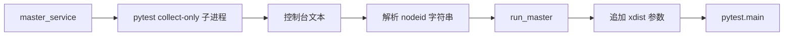

它拥有用例标识，却没有 marker 等结构化元数据。因此它支持：

- 全部串行。
- 全部交给 xdist 并发。

它不支持：

- 普通用例并发执行。
- 共享账号和共享数据用例串行执行。
- 两个执行阶段的 JUnit 和 Allure 结果合并。

这部分演进压力属于测试运行生命周期，与 HTTP 请求层独立。

## 6. 从新需求到修改扩散

下表直接给出初版面对典型新需求时的修改位置和变化轴：

| 新需求 | 初版主要修改位置 | 主变化轴 | 次要影响 |
| --- | --- | --- | --- |
| 日志统一脱敏 | `request`、`_request_without_attach`、超时异常文本 | 安全观测 | cURL、响应和异常格式 |
| GET 遇到 503 有限重试 | `request` 或新的发送包装 | 瞬态恢复 | 日志次数、时间预算 |
| 异步任务新增 `cancelled` | `poll_get` 与 Task 参数 | 业务状态 | 错误信息和报告 |
| request ID 支持多来源兜底 | `BaseTask` 和业务用例 | 链路变量 | 类型检查和错误输出 |
| 共享账号用例禁止并发 | `master_service`、`run_master`、marker | 执行调度 | 报告合并 |
| 保存每次状态迁移 | `poll_get` 和 logger | 业务状态观测 | 报告体积 |

多个需求会修改 `BaseRequest`，但不能由此得出“删除 BaseRequest”的结论。正确处理方式是按变化轴继续拆解它持有的状态。

## 7. 根因因果链

“文件太大”“耦合高”“违反单一职责”都只是表面描述，因为它们没有给出可执行的切分位置。

完整因果链如下：

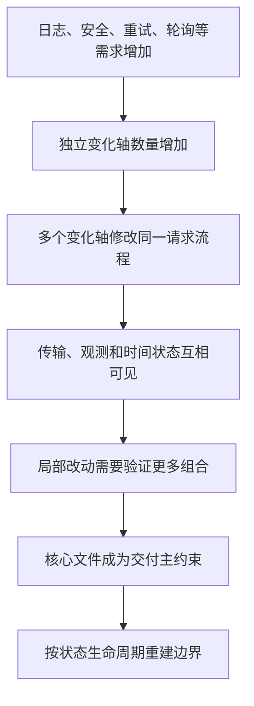

因此根因可以准确表述为：

> 独立变化轴共享同一修改边界，短生命周期状态缺少明确所有者，导致修改扩散和验证组合持续增长。

### 7.1 脱敏需求展示了修改扩散

初版失败信息可能从三条出口产生：

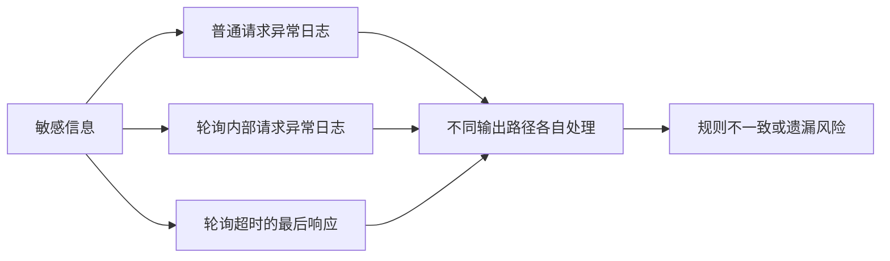

脱敏算法本身并不是主要难点。主要难点是观测数据没有统一安全出口，导致同一安全规则需要进入多条错误路径。

## 8. 第一次集中增强：291e6ea

演进证据：

```powershell
git diff --stat 56f4f15 291e6ea -- common/base_request.py common/base_task.py
git diff 56f4f15 291e6ea -- common/base_request.py
```

`common/base_request.py` 在这一阶段增加 421 行、删除 33 行。主要新增：

- 独立请求上下文。
- Middleware 生命周期。
- 重试策略和重试循环。
- 轮询状态策略和迁移记录。
- 新的日志协调方式。

演进前：`56f4f15`，`common/base_request.py`

```python
def request(self, method: str, path: str, **kwargs: Any) -> requests.Response:
    attach_log = kwargs.pop("_attach_log", True)
    url = self._build_url(path)
    kwargs.setdefault("timeout", self.config.timeout)

    headers = kwargs.pop("headers", None)
    if headers:
        kwargs["headers"] = self._merge_headers(headers)

    if method.upper() == "POST":
        start_media_downloads(kwargs.get("json"))

    logger = ApiCallLogger(method, url, kwargs)
    try:
        response = self.session.request(method=method, url=url, **kwargs)
    except Exception as error:
        if attach_log:
            logger.attach_failure(error)
        raise

    if attach_log:
        logger.attach_success(response)
    return response
```

演进后之一：`291e6ea`，`common/request_context.py`

```python
@dataclass
class RequestContext:
    method: str
    path: str
    url: str
    kwargs: dict[str, Any]
    attach_log: bool = True
    request_step_name: str = API_REQUEST_STEP_NAME
    response_step_name: str = API_RESPONSE_STEP_NAME
    attributes: dict[str, Any] = field(default_factory=dict)
```

演进后二：`291e6ea`，`common/base_request.py`

```python
def request(self, method: str, path: str, **kwargs: Any) -> requests.Response:
    attach_log = kwargs.pop("_attach_log", True)
    retry_policy = kwargs.pop("retry_policy", None)
    if retry_policy is not None:
        return self._send_with_retry(
            method,
            path,
            retry_policy,
            attach_log=attach_log,
            **kwargs,
        )

    context = self._build_request_context(
        method,
        path,
        attach_log=attach_log,
        **kwargs,
    )
    return self._send(context)

def _build_request_context(
    self,
    method: str,
    path: str,
    *,
    attach_log: bool = True,
    request_step_name: str = API_REQUEST_STEP_NAME,
    response_step_name: str = API_RESPONSE_STEP_NAME,
    **kwargs: Any,
) -> RequestContext:
    url = self._build_url(path)
    request_kwargs = self._copy_request_kwargs(kwargs)
    request_kwargs.setdefault("timeout", self.config.timeout)

    headers = request_kwargs.pop("headers", None)
    if headers:
        request_kwargs["headers"] = self._merge_headers(headers)

    return RequestContext(
        method=method.upper(),
        path=path,
        url=url,
        kwargs=request_kwargs,
        attach_log=attach_log,
        request_step_name=request_step_name,
        response_step_name=response_step_name,
    )

def _send(self, context: RequestContext) -> requests.Response:
    self._run_before_middlewares(context)

    try:
        response = self.session.request(
            method=context.method,
            url=context.url,
            **context.kwargs,
        )
    except Exception as error:
        self._run_exception_middlewares(context, error)
        raise

    self._run_after_middlewares(context, response)
    return response
```

演进后三：`291e6ea`，`common/request_middleware.py`

```python
class RequestMiddleware(Protocol):
    def before_request(self, context: RequestContext) -> None:
        ...

    def after_response(
        self,
        context: RequestContext,
        response: requests.Response,
    ) -> None:
        ...

    def on_exception(
        self,
        context: RequestContext,
        error: BaseException,
    ) -> None:
        ...

def default_request_middlewares() -> list[RequestMiddleware]:
    return [
        MediaResourceMiddleware(),
        RedactionMiddleware(),
        LoggingMiddleware(),
    ]
```

Protocol 中的省略号是 Python 接口方法体，不是被删去的控制流。前后代码的实质差异是：

- 初版 `request()` 自己持有 URL、kwargs、日志时机和发送顺序。
- `291e6ea` 让 `RequestContext` 成为一次 attempt 状态的显式所有者。
- `_send()` 只执行一次 transport，并向三个 Middleware hook 公布生命周期。
- 资源发现、脱敏和日志可以各自变化，但不能拥有跨 attempt 的次数和等待预算。

这次演进保护了三个不变量：公开 `get/post` 调用保持兼容；每次 attempt 有独立上下文；观测扩展不再要求复制或改写 transport 骨架。

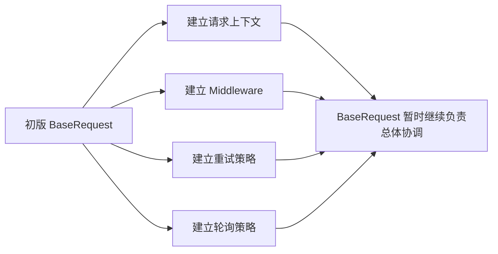

这次改造没有一次拆成最终结构，原因是渐进式迁移需要同时保护三件事：

- 现有 `get/post/...` 调用兼容。
- 每一步都可测试和回退。
- 新模型先经过真实用例验证，再确定稳定执行边界。

第一次演进先把隐式概念变成显式模型，但重试循环仍然留在 `BaseRequest`。这是一种有意识的中间态，而不是最终架构。

## 9. 第二次抽离：2748f16

演进证据：

```powershell
git show 2748f16 -- common/base_request.py common/retry_executor.py
```

这次改造把重试循环抽到独立 `RetryExecutor`。两边拥有的状态如下：

演进前：`291e6ea`，`common/base_request.py`

```python
def _send_with_retry(
    self,
    method: str,
    path: str,
    retry_policy: RetryPolicy,
    *,
    attach_log: bool = True,
    request_step_name: str = API_REQUEST_STEP_NAME,
    response_step_name: str = API_RESPONSE_STEP_NAME,
    context_recorder: list[RequestContext] | None = None,
    **kwargs: Any,
) -> requests.Response:
    first_context = self._build_request_context(
        method,
        path,
        attach_log=attach_log,
        request_step_name=request_step_name,
        response_step_name=response_step_name,
        **kwargs,
    )
    if context_recorder is not None:
        context_recorder[:] = [first_context]
    if not is_method_retry_allowed(
        first_context.method,
        self._kwargs_with_session_headers(first_context.kwargs),
        retry_policy,
    ):
        return self._send(first_context)

    started_at = time.monotonic()
    retry_records: list[RetryAttemptRecord] = []
    last_response: requests.Response | None = None

    for attempt_index in range(1, retry_policy.max_attempts + 1):
        context = self._build_request_context(
            method,
            path,
            attach_log=attach_log,
            request_step_name=request_step_name,
            response_step_name=response_step_name,
            **kwargs,
        )
        context.attributes["attempt_index"] = attempt_index
        context.attributes["max_attempts"] = retry_policy.max_attempts
        context.attributes["retry_records"] = retry_records
        if context_recorder is not None:
            context_recorder[:] = [context]

        try:
            response = self._send(context)
        except Exception as error:
            if (
                attempt_index >= retry_policy.max_attempts
                or not should_retry_exception(error, retry_policy)
            ):
                self._attach_retry_records(context, retry_records)
                raise

            wait_seconds = self._retry_wait_seconds(
                retry_policy,
                attempt_index,
                started_at=started_at,
            )
            retry_records.append(
                RetryAttemptRecord(
                    attempt_index=attempt_index,
                    max_attempts=retry_policy.max_attempts,
                    reason=retry_reason_for_exception(error),
                    wait_seconds=wait_seconds,
                    exception_type=type(error).__name__,
                    exception_message=str(error),
                )
            )
            self._attach_retry_records(context, retry_records)
            if not self._can_retry_within_elapsed(
                retry_policy,
                started_at,
                wait_seconds,
            ):
                raise
            time.sleep(wait_seconds)
            continue

        last_response = response
        if (
            attempt_index >= retry_policy.max_attempts
            or not should_retry_response(response, retry_policy)
        ):
            self._attach_retry_records(context, retry_records)
            return response

        wait_seconds = self._retry_wait_seconds(
            retry_policy,
            attempt_index,
            started_at=started_at,
            response=response,
        )
        retry_records.append(
            RetryAttemptRecord(
                attempt_index=attempt_index,
                max_attempts=retry_policy.max_attempts,
                reason=retry_reason_for_response(response),
                wait_seconds=wait_seconds,
                response_status_code=response.status_code,
            )
        )
        self._attach_retry_records(context, retry_records)
        if not self._can_retry_within_elapsed(
            retry_policy,
            started_at,
            wait_seconds,
        ):
            return response
        time.sleep(wait_seconds)

    if last_response is not None:
        return last_response
    raise RuntimeError("retry loop ended without response or exception")
```

这段完整控制流证明：虽然 `RetryPolicy` 已经独立，执行中的 `started_at`、`retry_records`、`attempt_index`、sleep、预算判断和异常终结仍由 `BaseRequest` 创建并修改。策略对象显式化没有自动改变运行时状态所有者。

演进后之一：`2748f16`，`common/base_request.py`

```python
def _send_with_retry(
    self,
    method: str,
    path: str,
    retry_policy: RetryPolicy,
    *,
    attach_log: bool = True,
    request_step_name: str = API_REQUEST_STEP_NAME,
    response_step_name: str = API_RESPONSE_STEP_NAME,
    context_recorder: list[RequestContext] | None = None,
    **kwargs: Any,
) -> requests.Response:
    first_context = self._build_request_context(
        method,
        path,
        attach_log=attach_log,
        request_step_name=request_step_name,
        response_step_name=response_step_name,
        **kwargs,
    )

    def context_factory(attempt_index: int) -> RequestContext:
        context = self._build_request_context(
            method,
            path,
            attach_log=attach_log,
            request_step_name=request_step_name,
            response_step_name=response_step_name,
            **kwargs,
        )
        context.attributes["attempt_index"] = attempt_index
        context.attributes["max_attempts"] = retry_policy.max_attempts
        return context

    return self.retry_executor.execute(
        method=first_context.method,
        request_kwargs=self._kwargs_with_session_headers(first_context.kwargs),
        policy=retry_policy,
        context_factory=context_factory,
        send_once=self._send,
        attach_records=self._attach_retry_records,
        context_recorder=context_recorder,
    )
```

演进后二：`2748f16`，`common/retry_executor.py`

```python
class RetryExecutor:
    def __init__(
        self,
        *,
        sleeper: Callable[[float], None] = time.sleep,
        monotonic: Callable[[], float] = time.monotonic,
    ):
        self.sleeper = sleeper
        self.monotonic = monotonic

    def execute(
        self,
        *,
        method: str,
        request_kwargs: Mapping[str, Any],
        policy: RetryPolicy,
        context_factory: Callable[[int], RequestContext],
        send_once: Callable[[RequestContext], requests.Response],
        attach_records: Callable[[RequestContext, list[RetryAttemptRecord]], None],
        context_recorder: list[RequestContext] | None = None,
    ) -> requests.Response:
        retry_records: list[RetryAttemptRecord] = []

        if not is_method_retry_allowed(method, request_kwargs, policy):
            context = context_factory(1)
            self._prepare_context(context, policy, 1, retry_records)
            self._record_context(context_recorder, context)
            return send_once(context)

        started_at = self.monotonic()
        last_response: requests.Response | None = None

        for attempt_index in range(1, policy.max_attempts + 1):
            context = context_factory(attempt_index)
            self._prepare_context(
                context,
                policy,
                attempt_index,
                retry_records,
            )
            self._record_context(context_recorder, context)

            try:
                response = send_once(context)
            except Exception as error:
                if (
                    attempt_index >= policy.max_attempts
                    or not should_retry_exception(error, policy)
                ):
                    attach_records(context, retry_records)
                    raise

                wait_seconds = calculate_retry_delay(policy, attempt_index)
                retry_records.append(
                    RetryAttemptRecord(
                        attempt_index=attempt_index,
                        max_attempts=policy.max_attempts,
                        reason=retry_reason_for_exception(error),
                        wait_seconds=wait_seconds,
                        exception_type=type(error).__name__,
                        exception_message=str(error),
                    )
                )
                attach_records(context, retry_records)
                if not self._can_retry_within_elapsed(
                    policy,
                    started_at,
                    wait_seconds,
                ):
                    raise
                self.sleeper(wait_seconds)
                continue

            last_response = response
            if (
                attempt_index >= policy.max_attempts
                or not should_retry_response(response, policy)
            ):
                attach_records(context, retry_records)
                return response

            wait_seconds = calculate_retry_delay(
                policy,
                attempt_index,
                response=response,
            )
            retry_records.append(
                RetryAttemptRecord(
                    attempt_index=attempt_index,
                    max_attempts=policy.max_attempts,
                    reason=retry_reason_for_response(response),
                    wait_seconds=wait_seconds,
                    response_status_code=response.status_code,
                )
            )
            attach_records(context, retry_records)
            if not self._can_retry_within_elapsed(
                policy,
                started_at,
                wait_seconds,
            ):
                return response
            self.sleeper(wait_seconds)

        if last_response is not None:
            return last_response
        raise RuntimeError("retry loop ended without response or exception")
```

前后代码显示所有权发生了真实迁移：`RetryExecutor.execute()` 创建记录集合和开始时间，推进 attempt，调用注入的时钟与 sleeper，并决定序列何时结束；`BaseRequest` 只提供 Context 工厂、单次发送和记录附件回调。时间依赖可以注入后，预算和等待无需真实 sleep 即可离线验证。

被保护的不变量是：每个 attempt 使用新 Context；不允许重试的方法仍只发送一次；最终返回原响应或重新抛出原异常；executor 不需要知道 URL 构造、Session、Middleware 和 Allure 的实现。

| `BaseRequest` 拥有 | `RetryExecutor` 拥有 |
| --- | --- |
| URL 和 headers 构造 | attempt 序号 |
| RequestContext 创建 | 累计重试记录 |
| Middleware 执行 | 退避等待 |
| HTTP transport 调用 | 最大次数和总时间预算 |
| logger 协调 | 是否继续下一次 attempt |

两组状态的生命周期和变化原因不同，因此具备独立边界的条件。

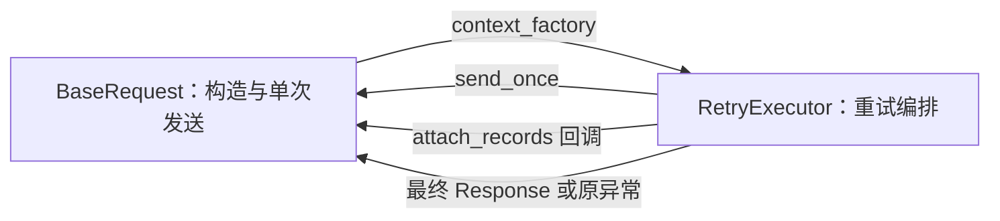

这次抽离没有让 `RetryExecutor` 直接依赖 `BaseRequest` 或 Allure，而是通过回调组合。这样 executor 只拥有重试控制流，传输和观测仍由原边界负责。

演进方法可以归纳为：


## 10. 七条核心变化轴

| 变化轴 | 典型变化 | 不应被迫同时变化的内容 |
| --- | --- | --- |
| 配置可信度 | 环境选择、类型、必填项 | HTTP transport |
| 单次传输 | URL、headers、timeout、session | 日志附件格式 |
| 横切观测 | 日志、脱敏、cURL、trace | 业务状态集合 |
| 瞬态恢复 | 状态码、异常、退避、预算 | 单次发送实现 |
| 业务状态 | pending、success、failure、unknown | 网络重试条件 |
| 用例链路 | task ID、request ID、cleanup | session 全局状态 |
| 执行调度 | worker、marker、执行池 | HTTP 请求参数 |

它们通过显式调用关系组合：

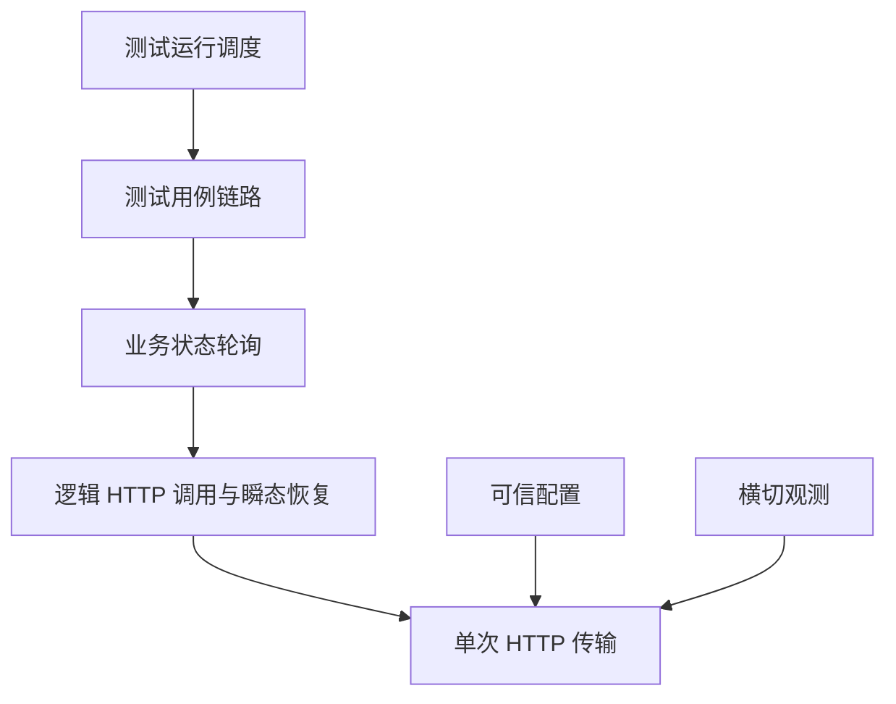

箭头表示上层使用下层能力，不表示上层拥有下层状态。例如轮询可以调用带重试的 GET，但轮询不拥有指数退避算法。

典型需求的归属如下：

| 需求 | 主变化轴 | 次要影响 | 归属依据 |
| --- | --- | --- | --- |
| Authorization 不得出现在 Allure | 横切观测 | 请求、响应、异常、cURL | 规则决定输出，不改变 transport |
| 429 尊重 Retry-After | 瞬态恢复 | 等待记录 | 决定下一次 attempt 的时间 |
| 新增 `paused` 状态 | 业务状态 | 超时策略 | 决定远端任务结论 |
| 用例结束删除临时资源 | 用例链路 | 清理错误 | 生命周期终点是 case teardown |
| 计费用例必须串行 | 执行调度 | 报告拆分 | 约束来自共享外部资源 |
| 新增 request trace | 横切观测 | headers 和日志 | 服务一次请求或逻辑调用的关联 |

## 11. 状态所有者与生命周期

当前框架涉及五种执行生命周期，以及一个长期存在的客户端生命周期：

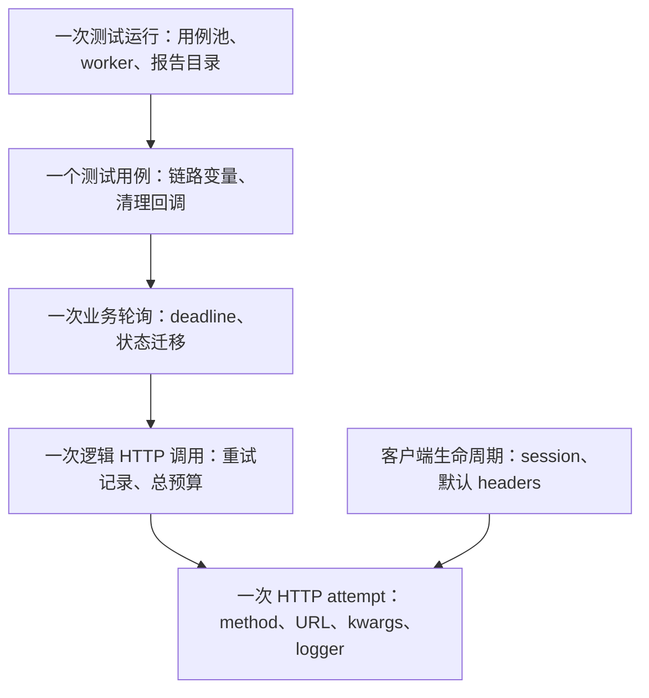

前文已经用代码定位了 test run、retry sequence 和 HTTP attempt。下面只补齐 polling sequence 与 test case 的当前代码锚点，不在总图中展开其完整算法。

当前代码：`dev2`，`common/base_request.py`

```python
def _poll_get_with_policy(
    self,
    path: str,
    *,
    poll_interval: float,
    timeout: float,
    polling_policy: PollingPolicy,
    retry_policy: RetryPolicy | None = None,
    **kwargs: Any,
) -> requests.Response:
    deadline = time.monotonic() + timeout
    started_at = time.monotonic()
    transitions: list[PollingTransition] = []
    last_response: requests.Response | None = None
    last_status: Any = None
    last_logger: ApiCallLogger | None = None
    attempt_index = 0

    while True:
        attempt_index += 1
        last_response, last_logger = self._request_without_attach(
            "GET",
            path,
            step_name=POLL_GET_REQUEST_STEP_NAME,
            response_step_name=POLL_GET_RESPONSE_STEP_NAME,
            retry_policy=retry_policy,
            **kwargs,
        )
        evaluation = evaluate_polling_response(last_response, polling_policy)
        last_status = evaluation.raw_status
        transitions.append(
            PollingTransition(
                attempt_index=attempt_index,
                elapsed_seconds=round(time.monotonic() - started_at, 3),
                state=evaluation.state,
                raw_status=evaluation.raw_status,
                response_status_code=last_response.status_code,
            )
        )

        if evaluation.state is PollingState.SUCCESS:
            self._attach_polling_transitions(last_logger, transitions)
            last_logger.attach_success(last_response)
            return last_response

        if evaluation.state is PollingState.FAILURE:
            raise PollingFailedError(
                path=path,
                last_status=last_status,
                last_response=last_response,
                transitions=transitions,
                error_value=evaluation.error_value,
            )

        remaining = deadline - time.monotonic()
        if remaining <= 0:
            raise PollingTimeoutError(
                path=path,
                timeout=timeout,
                last_status=last_status,
                last_response=last_response,
                transitions=transitions,
            )

        time.sleep(min(poll_interval, remaining))
```

片段保留了状态创建、每轮修改、成功、业务失败和超时终点，删除了重复的附件语句与 unknown 分支。由此可以看出，polling sequence 的所有者仍是一次 `_poll_get_with_policy()` 调用的局部作用域，而不是 `PollingPolicy`。Policy 拥有稳定规则，执行方法拥有 deadline、transitions、last response 和循环终点。边界不要求每种生命周期都必须对应一个独立类。

当前代码：`dev2`，`common/test_context.py` 与 `module/conftest.py`

```python
class TestContext:
    def __init__(self, *, name: str | None = None):
        self.name = name
        self._variables: dict[str, Any] = {}
        self._cleanup_callbacks: list[_CleanupCallback] = []

    def set(self, name: str, value: Any) -> Any:
        _validate_variable_name(name)
        self._variables[name] = value
        return value

    def add_cleanup(
        self,
        callback: Callable[..., Any],
        *args: Any,
        **kwargs: Any,
    ) -> None:
        self._cleanup_callbacks.append(
            _CleanupCallback(
                callback=callback,
                args=args,
                kwargs=dict(kwargs),
            )
        )

    def cleanup(self) -> None:
        errors: list[BaseException] = []
        while self._cleanup_callbacks:
            cleanup_callback = self._cleanup_callbacks.pop()
            try:
                cleanup_callback.callback(
                    *cleanup_callback.args,
                    **cleanup_callback.kwargs,
                )
            except BaseException as exc:
                errors.append(exc)
        if errors:
            raise ContextCleanupError(errors)

@pytest.fixture
def test_context() -> TestContext:
    context = TestContext()
    try:
        yield context
    finally:
        context.cleanup()
```

`TestContext` 创建和修改变量及清理栈，function-scope fixture 则决定它的出生与终点。清理采用 LIFO，即后注册的资源先释放；即使一个回调失败，其余回调仍继续执行。这里被保护的不变量是变量不跨 case 共享，资源清理不会因单个失败而提前中断。

状态所有权完整表：

| 状态 | 创建者 | 修改者 | 结束或清理者 | 生命周期 |
| --- | --- | --- | --- | --- |
| 默认 session headers | 请求客户端 | 客户端公开方法 | reset 或 close | 客户端 |
| 本次请求 kwargs | 请求入口 | 构造过程和 Middleware | attempt 结束 | HTTP attempt |
| attempt index | 重试编排者 | 重试编排者 | 逻辑调用结束 | retry sequence |
| retry records | 重试编排者 | 每次重试决策 | 逻辑调用结束 | retry sequence |
| polling deadline | 轮询编排者 | 单调时钟计算 | 得出最终结论 | polling sequence |
| polling transitions | 轮询编排者 | 每轮状态评估 | 得出最终结论 | polling sequence |
| task ID | 测试链路 | 提取逻辑 | 用例结束 | test case |
| 清理回调 | 测试链路 | 用例步骤 | fixture teardown | test case |
| 并发池和串行池 | runner | 调度过程 | 运行结束 | test run |

状态存活超过合理生命周期时会产生泄漏：

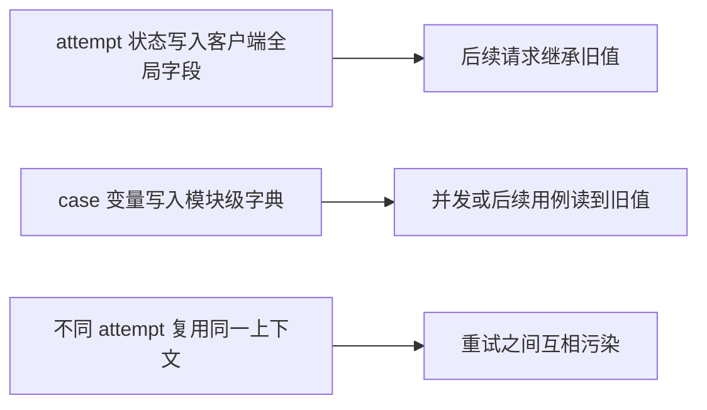

## 12. 从不变量推导边界

当前框架需要保护的不变量：

1. 观测行为不能改变真实请求语义。
2. 一次 attempt 的临时数据不能污染下一次 attempt。
3. 网络恢复结论不能由业务成功状态决定。
4. 业务任务结论不能由 HTTP 是否成功决定。
5. 用例变量不能跨 case 隐式共享。
6. 已知共享资源用例不能并发互相破坏。
7. 新扩展应尽量保持现有公开调用兼容。

职责边界由不变量直接推出：

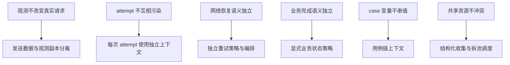

设计模式只是实现这些边界的手段，不是边界存在的原因。

## 13. 三种架构方案比较

### 13.1 方案 A：继续扩大 BaseRequest

所有新能力继续写入 `request()`、`poll_get()` 和辅助方法。

收益：

- 入口集中。
- 初期开发速度快。
- 概念数量少。
- 容易保持旧调用兼容。

代价：

- 独立变化轴共享修改点。
- 状态生命周期依赖开发者自律。
- 测试某项能力需要构造无关依赖。
- 新旧控制流容易交叉。

适用于需求较少且变化稳定的初期阶段。

### 13.2 方案 B：按功能拆工具函数

日志、重试判断、轮询解析和变量提取拆成函数，由 `BaseRequest` 负责调用。

收益：

- 文件长度下降。
- 纯计算函数容易测试。
- 迁移成本较低。

代价：

- 有状态循环仍需调用方传递大量参数。
- 状态创建、修改和结束责任仍可能不清晰。
- 公共函数容易形成没有所有者的能力集合。

适合退避时间、数据转换和状态评估等无状态计算。

### 13.3 方案 C：按状态生命周期拆对象

单次请求、重试序列、轮询序列和用例链路分别拥有状态，通过显式接口组合。

收益：

- 状态所有权清晰。
- 控制流可以独立测试。
- 时间、transport 和记录器可以注入。
- 一个变化轴通常只影响局部边界。

代价：

- 类型、接口和适配代码增加。
- 学习成本提高。
- 边界错误会产生无价值薄包装。
- 过早使用会让简单需求复杂化。

适合已经出现稳定、独立生命周期的能力。

### 13.4 决策结论

| 判断维度 | 扩大 BaseRequest | 工具函数 | 生命周期对象 |
| --- | --- | --- | --- |
| 初期实现速度 | 高 | 中高 | 中低 |
| 状态所有权 | 模糊 | 取决于调用方 | 清晰 |
| 纯计算测试 | 较难 | 容易 | 容易 |
| 控制流测试 | 较难 | 仍依赖调用方 | 可独立测试 |
| 兼容旧调用 | 容易 | 容易 | 需要适配层 |
| 多变化轴扩展 | 容易互相影响 | 参数逐渐膨胀 | 局部演进 |
| 合适阶段 | 需求少且稳定 | 无状态通用计算 | 独立生命周期稳定出现 |

TOC 决策随项目阶段变化：


初版阶段选择集中流程是合理的；变化轴增加后，生命周期对象的收益才超过其复杂度成本。

## 14. 两次关键演进的完整答案

| 演进阶段 | 新增状态 | 当时的所有者 | 后续调整原因 |
| --- | --- | --- | --- |
| `56f4f15 → 291e6ea` | 请求 attributes、重试次数和记录、轮询迁移 | 新模型已出现，但大量编排仍在 `BaseRequest` | 重试状态与请求构造沿不同原因变化 |
| `291e6ea → 2748f16` | executor 内 attempt、累计记录、sleep、时间预算 | `RetryExecutor` | 形成独立、可注入、可离线测试的控制流 |

演进可以用五句话准确概括：

1. 初版优先解决业务接口能够被统一调用、轮询和记录的问题。
2. 日志、安全、瞬态恢复、业务状态和链路变量随后形成相互独立的变化轴。
3. 第一次增强把请求上下文、Middleware、重试策略和轮询策略变成显式模型。
4. 第一次增强仍由 `BaseRequest` 执行重试循环，使请求构造和时间编排继续共享修改边界。
5. `RetryExecutor` 根据独立的重试状态生命周期被抽离，并通过回调复用请求发送和日志能力。

## 15. 固定 Header 场景的直接结论

给所有请求增加一个未来半年不变化的固定 `X-Client-Version` header，不需要新对象。把它加入默认 header 构造就是最小且安全的实现。

只有出现以下变化后，才需要重新考虑边界：

- 按环境或模块使用不同版本。
- 每次请求动态计算。
- 需要独立开关和测试。
- 依赖外部配置刷新。
- 需要与 trace 或认证生命周期协同。

这个结论防止另一种过度设计：掌握拆分方法后，为所有简单需求都增加新抽象。

## 16. 常见误区及正确结论

### 16.1 文件变短不等于边界成立

把大文件拆成多个共享隐式状态的小文件，只改变了物理位置，没有改变状态所有权。

### 16.2 重复代码不必立即消除

重复有时是行为尚未稳定时的迁移缓冲。共同部分和变化部分明确后再抽象，边界更可靠。

### 16.3 类名不等于状态所有者

真正的所有者需要明确创建、修改和结束某段状态。只包含静态函数的类可能只是命名空间。

### 16.4 请求附近的能力不都属于 Middleware

Middleware 服务一次 HTTP attempt。跨 attempt 的 retry、跨查询的 polling、跨业务步骤的 test context 属于不同生命周期。

### 16.5 当前实现不是永久标准答案

当前架构是业务规模、兼容要求和投入预算下的阶段性选择。新的主约束出现后，边界仍可能继续演进。

## 17. 最终验收答案

### 17.1 初版在当时合理

当时的主约束是业务覆盖不足。集中流程概念少、路径短，能快速建立请求、轮询和报告能力，额外抽象的收益还不足以抵消成本。

### 17.2 `_request_without_attach` 揭示两个变化轴

它揭示了 HTTP 传输和日志挂载时机两个独立变化轴。为改变日志时机而复制发送骨架，说明观测策略缺少独立生命周期接口。

### 17.3 RetryPolicy 之后仍需 RetryExecutor

Policy 只描述规则，不能拥有执行中的 attempt、累计记录、sleep 和时间预算。第一次实现把这些状态留在 `BaseRequest`，后续根据独立生命周期抽出 executor。

### 17.4 生命周期区分三种控制流

- retry 服务一次逻辑 HTTP 调用。
- polling 服务一次远端业务任务查询序列。
- test context 服务一个完整测试用例。

三者可以嵌套调用，但成功条件、状态和终点不同。

### 17.5 “BaseRequest 太大”不是根因

文件大小不能说明切分位置。真正根因是独立变化轴共享修改边界，且短生命周期状态没有明确所有者，导致修改扩散和测试组合增长。

## 18. 今日完整总结

初版框架以集中式结构快速解决了业务覆盖问题，因此在当时是合理选择。随着日志、安全、重试、轮询、链路变量和调度形成独立变化轴，核心约束转变为多种状态共享修改边界。当前框架通过请求、重试、轮询、用例和运行级生命周期建立职责边界，并用渐进式改造保持调用兼容。架构演进的依据不是文件大小或模式偏好，而是状态所有权、生命周期、不变量和当前主约束。

本节到此结束。下一节单独讲解配置如何从外部字符串演进为可信的运行时状态。
