# 第 2 天：配置从字符串集合演进为可信状态

## 0. 本节结论

配置系统的本质不是读取环境变量，而是在外部世界和框架运行时之间建立信任边界。

环境变量具有四个天然属性：无类型、可能缺失、可能包含空白、来源不受业务代码控制。请求框架需要的状态恰好相反：类型明确、当前环境必需字段完整、格式合法、运行过程中不可随意变化。

当前配置链路完成的核心转换如下：


这条链的关键边界是：

- `_EnvironmentSettingsInput` 承接不可信外部输入。
- `Settings` 表示经过 `load_settings()` 构造的运行时状态。
- `util.config_validation` 提供可复用的解析规则和稳定错误语义。
- 模块级 `settings = load_settings()` 把失败前移到 import 或测试收集阶段。

当前实现仍有两个明确限制：

1. `Settings` 的可信性依赖调用方通过 `load_settings()` 构造，直接实例化不会执行 URL 等业务校验。
2. Pydantic 字段校验失败时，`mode="after"` 的环境交叉校验不会继续执行，因此字段错误与环境缺失项未必能在一次失败中全部聚合。

这些限制说明 Pydantic 只是边界实现工具，不是可信性的自动保证。

## 1. 两小时学习结构

| 阶段 | 时间 | 学习内容 |
| --- | ---: | --- |
| 观察初版 | 0～20 分钟 | import 阶段直接解析环境变量 |
| 第一轮演进 | 20～40 分钟 | `load_settings`、错误聚合、可注入 env |
| 第二轮演进 | 40～65 分钟 | 输入模型与公开模型分离 |
| 变化轴分析 | 65～80 分钟 | 来源、类型、环境选择、安全和兼容 |
| 状态所有权 | 80～95 分钟 | 原始输入与可信状态的生命周期 |
| 边界与不变量 | 95～105 分钟 | 失败前移、只读性和最小配置范围 |
| 方案比较 | 105～115 分钟 | 四种配置建模方案 |
| 验证与总结 | 115～120 分钟 | 当前实现的收益与限制 |

## 2. 观察初版配置

初版提交为 `56f4f15`：

```powershell
git show 56f4f15:config.py
```

核心结构可以简化为：

```python
load_dotenv()

USE_CHINA_ENVIRONMENT = _is_true(os.getenv("USE_CHINA_ENVIRONMENT"))

@dataclass(frozen=True)
class Settings:
    timeout = float(os.getenv("API_TIMEOUT", 600))
    history_report_keep_limit = int(os.getenv("HISTORY_REPORT_KEEP_LIMIT", "30"))

    if USE_CHINA_ENVIRONMENT:
        base_url = os.getenv("CHINA_TEST_ENVIRONMENT_BASE_URL").rstrip("/")
        api_key = os.getenv("CHINA_API_KEY").strip()
    else:
        base_url = os.getenv("OVERSEAS_TEST_BASE_URL").rstrip("/")
        api_key = os.getenv("OVERSEAS_API_KEY").strip()

settings = Settings()
```

### 2.1 初版执行时机

这些表达式位于类定义体中。Python 导入模块时会执行类定义体，因此配置转换不是在真正发送请求时发生，而是在 `config.py` 被 import 时发生。

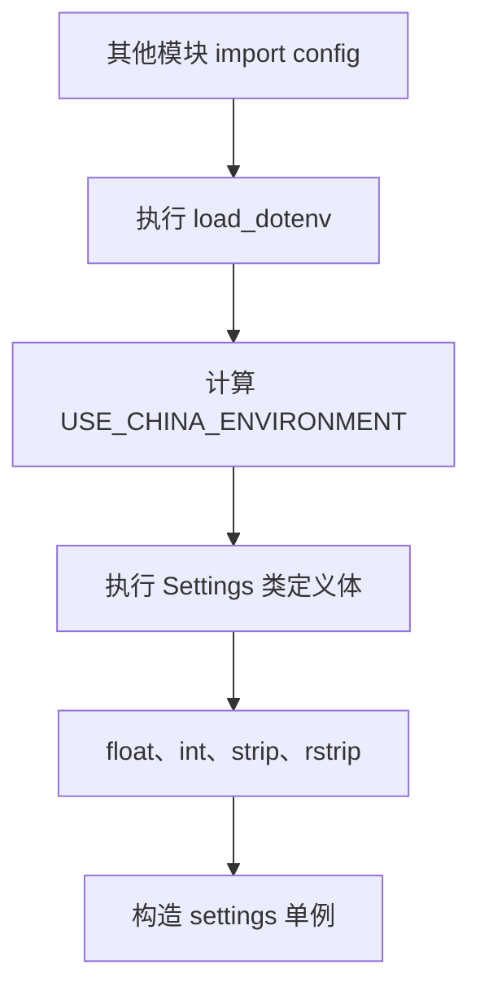

初版已经具备失败前移的雏形，但失败语义来自 Python 内置操作，而不是框架配置语义。

### 2.2 初版的实际失败类型

| 输入问题 | 初版触发位置 | 典型异常 | 诊断质量 |
| --- | --- | --- | --- |
| base URL 缺失 | `None.rstrip()` | `AttributeError` | 看不到明确配置规则 |
| API Key 缺失 | `None.strip()` | `AttributeError` | 看不到变量必填语义 |
| timeout 为 `abc` | `float("abc")` | `ValueError` | 只有转换失败 |
| keep limit 为 `0` | `int("0")` | 成功 | 非法业务范围未被发现 |
| bool 为 `yes` | `_is_true("yes")` | 被解释为 `False` | 非法值被静默吞掉 |
| URL 无协议 | `.rstrip()` | 成功 | 可能延迟到请求阶段失败 |

最危险的不是程序会失败，而是部分非法配置不会失败，或者以错误层级很低的异常失败。

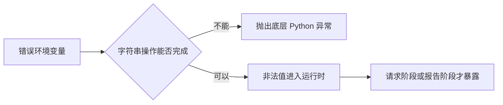

### 2.3 frozen dataclass 解决的范围

初版 `Settings` 使用 `@dataclass(frozen=True)`，它只能防止实例创建后的字段赋值，不能保证输入来源可信，也不能保证 URL、数字范围和环境组合合法。

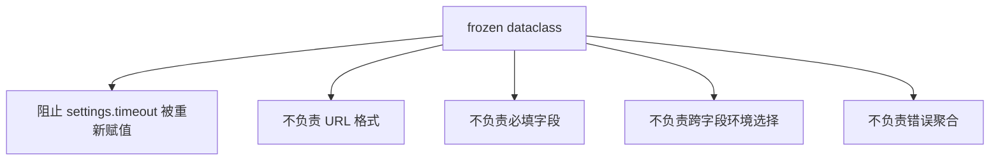

因此，不可变性和有效性是两个不同维度。

## 3. 第一轮演进：显式加载与错误聚合

第一轮配置增强位于提交 `291e6ea`：

```powershell
git diff 56f4f15 291e6ea -- config.py util/config_validation.py
```

这次改造仍使用 frozen dataclass，但引入了三个关键边界。

### 3.1 `load_settings(env)` 成为唯一组装入口


`env` 为 `None` 时读取 `os.environ`；测试可以传入普通字典，不依赖本机 `.env`。

```python
settings = load_settings(
    {
        "OVERSEAS_TEST_BASE_URL": "https://example.org",
        "OVERSEAS_API_KEY": "test-secret",
        "API_TIMEOUT": "10.5",
    }
)
```

这项变化把配置解析从类定义副作用变成可调用、可注入、可单测的函数边界。

### 3.2 解析规则下沉到纯函数

`util/config_validation.py` 提供：

- `parse_bool`
- `parse_positive_float`
- `parse_positive_int`
- `require_non_empty`
- `require_http_url`
- `aggregate_config_errors`
- `is_enabled`
- `redact_config_summary`

它们分别拥有单值解析规则，不拥有环境选择和最终 `Settings` 组装。

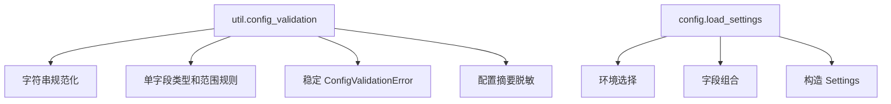

这是工具函数与状态所有者的正确配合：纯函数负责规则，加载器负责整个配置快照的生命周期。

### 3.3 错误聚合

第一轮实现用 `_parse_config()` 捕获每个字段的 `ConfigValidationError`，继续校验其他字段，最后统一抛出：

```text
Configuration validation failed:
- Missing required config CHINA_TEST_ENVIRONMENT_BASE_URL.
- Missing required config CHINA_API_KEY.
- Invalid config API_TIMEOUT='abc'. Expected positive number.
```

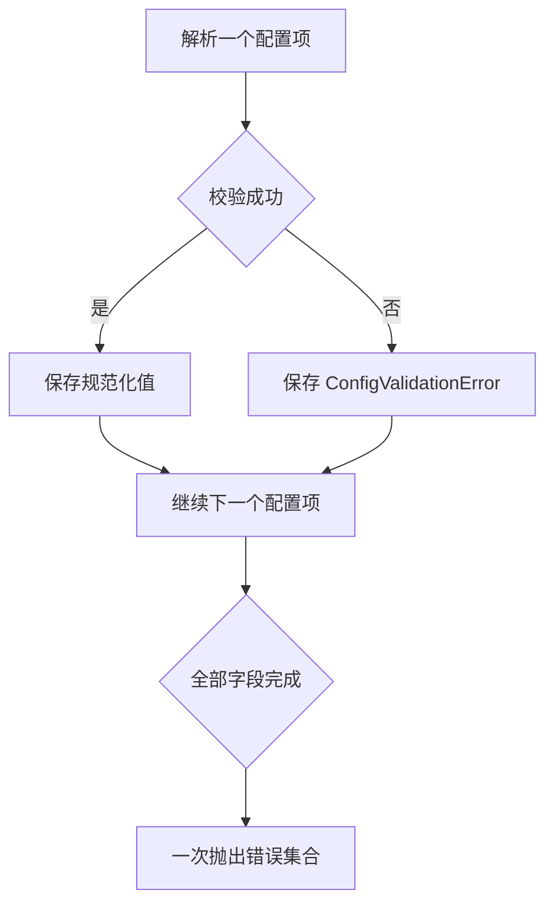

错误聚合减少了修复一个变量后再次运行才能发现下一个变量的反馈循环。

## 4. 第二轮演进：建立双模型信任边界

提交 `2748f16` 将配置迁移到 Pydantic：

```powershell
git diff 291e6ea 2748f16 -- config.py util/config_validation.py requirements.txt tests/test_config_validation.py
```

关键变化不是 dataclass 换成 `BaseModel`，而是出现两个不同语义的模型。


### 4.1 输入模型的职责

`_EnvironmentSettingsInput` 使用 `validation_alias` 接收大写环境变量名：

```python
use_china_environment: bool = Field(
    default=False,
    validation_alias="USE_CHINA_ENVIRONMENT",
)
```

它必须允许两套环境字段同时存在或缺失，因为在环境选择完成前，无法把所有 URL 和 Key 都声明为必填。

| 输入字段 | 输入模型中的形态 | 原因 |
| --- | --- | --- |
| `USE_CHINA_ENVIRONMENT` | 有默认值的 bool | 决定条件分支 |
| `API_TIMEOUT` | 有默认值的 float | 非敏感低风险默认项 |
| china URL 和 Key | 可选字符串 | 未选择 china 时不必存在 |
| overseas URL 和 Key | 可选字符串 | 未选择 overseas 时不必存在 |

输入模型的 optional 不代表运行时允许缺失，只代表交叉校验之前必须容纳原始状态。

### 4.2 字段 validator 的职责

`mode="before"` 的 validator 在 Pydantic 自身转换前调用原有解析函数：

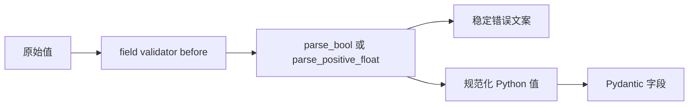

复用原有 helper 有两个目的：

- 保留已经形成的严格规则，例如 bool 只接受 TRUE 或 FALSE。
- 保留 `ConfigValidationError` 的变量名和错误文案，不把所有错误暴露成 Pydantic 默认文本。

### 4.3 model validator 的职责

字段解析成功后，`_validate_selected_environment()` 校验环境组合：

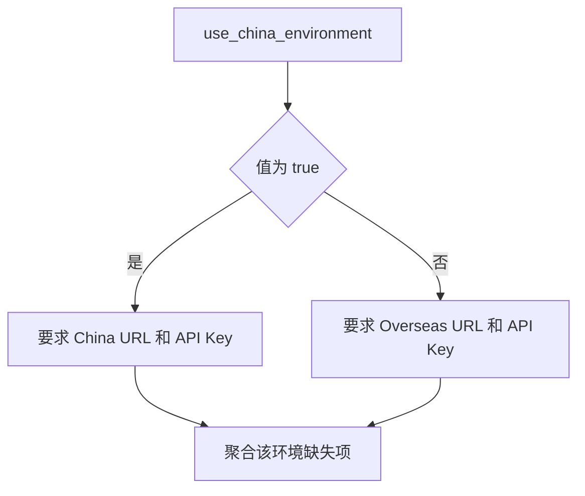

它只校验被选中的环境。这样 overseas 用例不会因为缺少 china 密钥而无法启动。

### 4.4 公开 Settings 的职责

公开 `Settings` 只包含运行时真正需要的字段：

```text
timeout
generate_allure_report
generate_history_report
history_report_keep_limit
base_url
api_key
environment_name
```

它不再暴露两套环境的全部原始字段。调用方不需要重复判断 china 或 overseas。

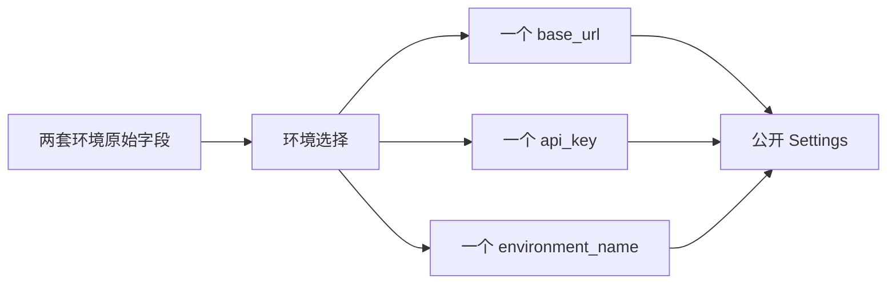

`ConfigDict(frozen=True)` 防止运行过程中重新赋值，保证同一个配置快照在客户端和报告模块之间保持一致。

## 5. 当前完整执行链

当前 `config.py` 在 import 时执行：

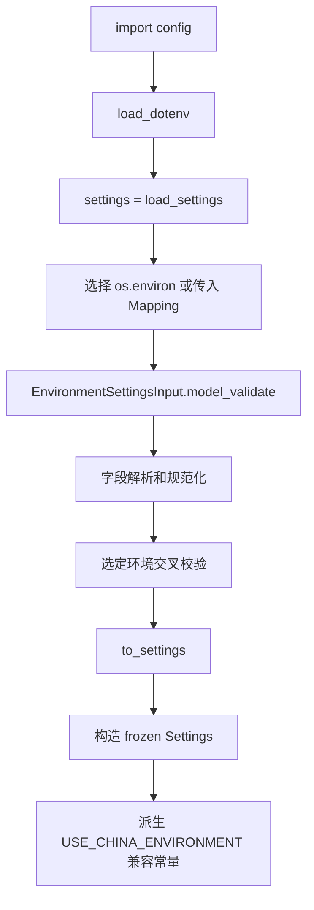

`load_dotenv()` 默认不覆盖已经存在的系统环境变量，因此实际来源优先级为：

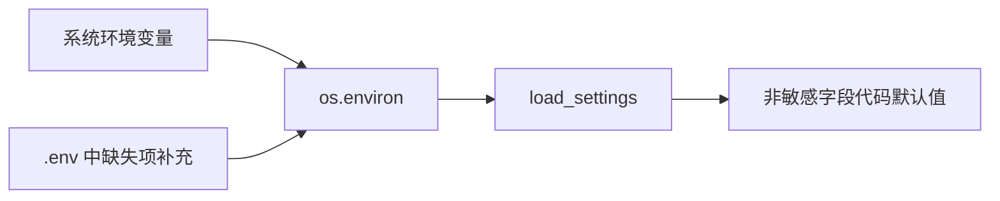

主 URL 和主 API Key 没有代码默认值，避免测试静默发往未知环境或使用错误账号。

## 6. 变化轴

配置能力不是单一变化，它包含六条独立变化轴：

| 变化轴 | 变化内容 | 主要所有者 | 与其他变化的关系 |
| --- | --- | --- | --- |
| 来源 | 系统环境、`.env`、测试 Mapping | 加载入口 | 独立于类型规则 |
| 类型与范围 | bool、正数、正整数、URL | validation helper | 独立于环境选择 |
| 环境选择 | china 或 overseas | 输入模型交叉校验 | 决定哪些字段必填 |
| 错误语义 | 变量名、聚合、稳定异常类型 | helper 与错误适配层 | 独立于运行时消费 |
| 安全输出 | API Key 和 Authorization 脱敏 | redaction helper | 只影响观测副本 |
| 运行时稳定性 | 字段完整、不可变 | 公开 Settings | 位于信任边界之后 |

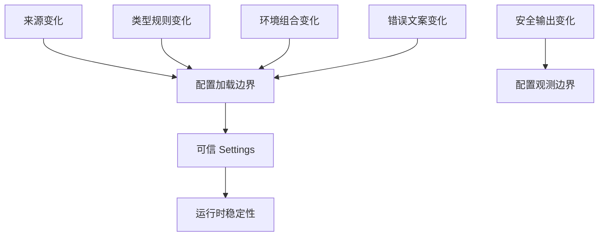

这些变化轴说明 `config.py` 不应重新实现所有解析细节，`util.config_validation` 也不应决定项目使用哪个环境。

## 7. 状态所有者与生命周期

| 状态 | 创建者 | 修改者 | 结束或清理者 | 生命周期 |
| --- | --- | --- | --- | --- |
| `.env` 文件内容 | 人或 CI | 人或 CI | 外部环境 | 跨测试运行 |
| `os.environ` | 操作系统、进程启动器、dotenv | 进程和外部工具 | 进程结束 | 进程 |
| 传入 `env` Mapping | 单元测试或调用方 | 调用方 | 函数返回后 | 一次加载调用 |
| `_EnvironmentSettingsInput` | Pydantic 校验入口 | validators | `to_settings` 后可释放 | 一次加载调用 |
| 聚合错误列表 | 校验过程 | 字段和模型校验 | 抛出异常后 | 一次加载调用 |
| `Settings` 实例 | `to_settings` | frozen，不应修改 | 进程或客户端结束 | 配置快照 |
| 模块级 `settings` | `config` import | 无 | 进程结束 | 进程 |

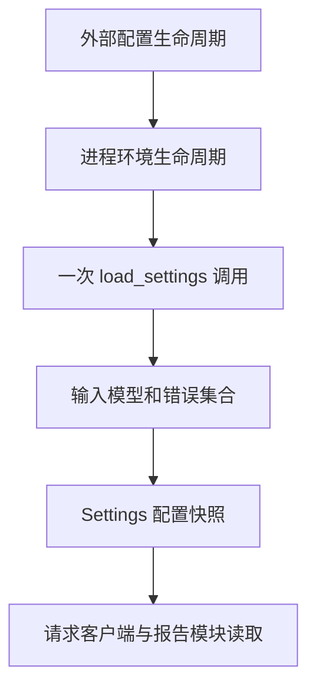

关键所有权结论：

- 输入模型只拥有解析期间的中间状态。
- 公开 Settings 拥有运行时消费状态。
- `BaseRequest` 只读取配置，不负责重新解析环境变量。
- 用例级账号不属于全局配置快照。

## 8. 全局配置与用例级配置的边界

全局配置只应该包含几乎所有业务用例启动都依赖的最低前提：

- 当前环境 base URL。
- 当前环境主 API Key。
- 请求 timeout。
- 报告开关与保留数量。

以下配置不进入全局 `Settings`：

- `CHINA_CONTROL_API_KEY`
- `OVERSEAS_CONTROL_API_KEY`
- `B_ACCOUNT_API_KEY`
- `B_ACCOUNT_CONTROL_KEY`
- `ZERO_BALANCE_API_KEY`
- `ZERO_BALANCE_CONTROL_KEY`

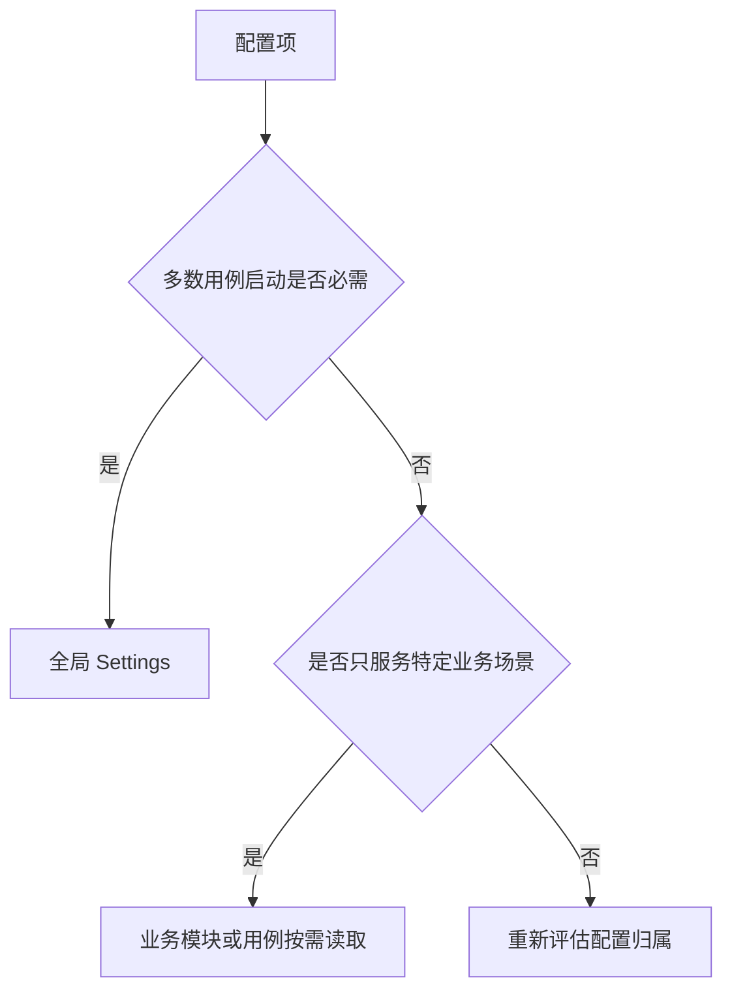

如果把 zero account 密钥设为全局必填，任何不涉及余额的用例也会因缺少该密钥无法收集。此时局部业务前提被错误提升为框架启动前提，扩大了失败半径。

## 9. 不变量与职责边界

### 9.1 配置不变量

1. 请求发出前必须得到合法 HTTP base URL。
2. 当前环境主 API Key 必须非空。
3. timeout 必须为正数。
4. 报告保留数量必须为正整数。
5. bool 配置只接受明确的 TRUE 或 FALSE。
6. 运行时配置快照不可被意外改写。
7. 错误输出和配置摘要不得泄露密钥。
8. 未选中环境和特定业务账号不得阻塞当前用例。
9. 测试可以注入 Mapping 验证解析逻辑。
10. 公开字段名和 `settings = load_settings()` 保持兼容。

### 9.2 从不变量推导边界

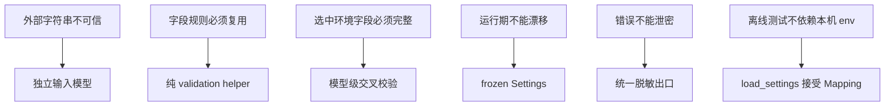

边界的目的不是展示 Pydantic 技巧，而是让每条不变量能够被局部测试。

## 10. 错误模型

### 10.1 稳定的外部异常

当前 `load_settings()` 捕获 Pydantic `ValidationError`，再转换为 `ConfigValidationError`。业务调用方看到的是框架稳定异常，而不是第三方库内部结构。

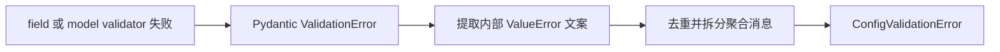

这样迁移到 Pydantic 后仍保留已有错误契约。

### 10.2 当前聚合行为的真实限制

实际验证结果：

```text
输入：USE_CHINA_ENVIRONMENT=TRUE，China URL 和 API Key 都缺失
结果：一次报告两个缺失项

输入：USE_CHINA_ENVIRONMENT=TRUE，API_TIMEOUT=abc，同时 China URL 和 API Key 缺失
结果：只报告 API_TIMEOUT 非法
```

原因是 `model_validator(mode="after")` 依赖字段模型先成功构造。字段 validator 失败后，选中环境交叉校验不会执行。

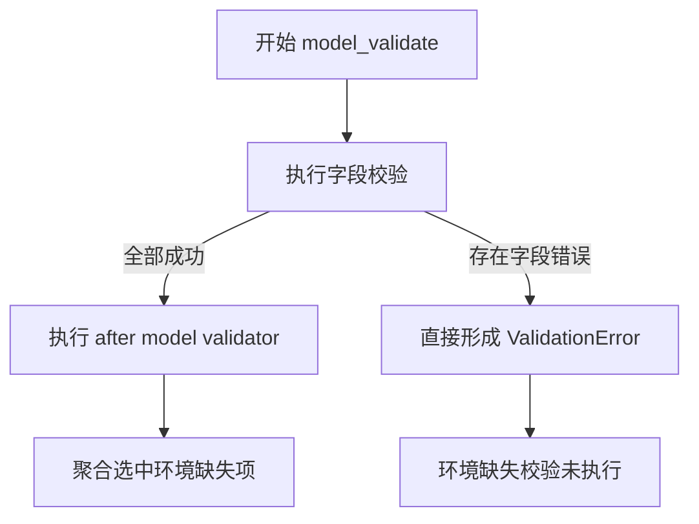

第一轮手写加载器在全流程聚合方面更彻底；Pydantic 版本获得结构化模型和统一模型模式，但保留了这个错误聚合边界。

这项限制目前没有破坏测试定义的公开错误契约，因此属于已知权衡，而不是本节要修改的代码缺陷。

## 11. `settings = load_settings()` 的双面性

模块末尾保留：

```python
settings = load_settings()
USE_CHINA_ENVIRONMENT = settings.environment_name == "china"
```

### 11.1 收益

- 任意真实入口 import 配置时立即校验。
- 不会等到第一个 HTTP 请求才发现 URL 或 Key 缺失。
- `BaseRequest(config=settings)` 保持原有调用方式。
- 报告模块直接读取相同配置快照。

### 11.2 成本

- import `config` 具有读取 `.env` 和校验环境的副作用。
- 缺少基础环境配置时，纯离线测试可能在收集阶段失败。
- 单独测试 `load_settings(mapping)` 前，模块本身仍需成功 import。
- 同一进程中修改 `os.environ` 不会自动重建已经创建的模块级 settings。

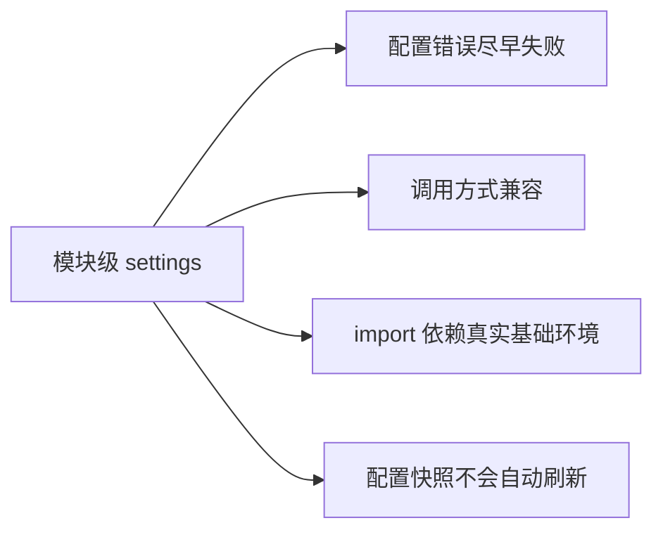

当前项目接受这一成本，并通过三种方式降低影响：

- 配置单测直接调用 `load_settings(mapping)`。
- 请求单测可以给 `BaseRequest` 注入 `DummyConfig`。
- CI 在测试前准备 `.env` 或环境变量。

它只部分解决了完全离线导入问题，因为 `config.py` 本身仍会创建全局 settings。

## 12. 安全输出边界

配置校验和配置展示是两个不同流程：

- 校验需要读取真实值。
- 展示只能使用脱敏副本。

```mermaid
flowchart LR
    A["真实配置值"] --> B["校验和运行时 Settings"]
    A --> C["redact_config_summary"]
    C --> D["安全配置摘要"]
    D --> E["终端或报告"]
```

`redact_config_summary()` 复用 `util.redaction.redact_sensitive_data()`，避免配置系统维护第二套敏感字段列表。

缺失 API Key 时错误只输出变量名；非敏感非法值如 timeout 可以显示原始值帮助定位。

## 13. 四种方案比较

### 13.1 方案 A：业务代码直接使用 `os.getenv()`

收益：实现最少，无中间模型。

代价：解析散落、错误暴露晚、规则不一致、难以一次获得完整配置快照。

适合一次性脚本，不适合被多个模块共享的测试框架。

### 13.2 方案 B：frozen dataclass 加手写加载器

收益：依赖少、控制流直观、可以完整聚合错误、运行时字段只读。

代价：字段映射、默认值、校验调用和错误收集都需要手工维护。

这是 `291e6ea` 阶段的方案，已经能满足第一版安全边界。

### 13.3 方案 C：单个 Pydantic Settings 模型

收益：声明集中、类型转换和结构化错误由库处理。

代价：同一个模型既要容纳两套环境的可选原始字段，又要向运行时承诺单套必填字段，optional 输入状态会泄漏到调用方。

单模型难以同时表达“解析前允许缺失”和“解析后保证完整”。

### 13.4 方案 D：输入模型加公开模型

收益：明确不可信输入与可信输出；运行时只看到选中环境；字段结构和不可变性统一；保留公开字段兼容。

代价：模型转换和错误适配代码增加；直接构造公开 `Settings` 可以绕过业务校验；after validator 存在聚合限制。

这是当前方案。

### 13.5 决策表

| 维度 | 直接 getenv | dataclass 加加载器 | 单 Pydantic 模型 | 双 Pydantic 模型 |
| --- | --- | --- | --- | --- |
| 输入与运行时隔离 | 无 | 由函数保证 | 较弱 | 清晰 |
| 错误聚合 | 无 | 最强且可控 | 依赖模型 | 结构化但有阶段限制 |
| 类型与默认声明 | 分散 | 手工 | 集中 | 集中 |
| 运行时只读 | 无 | frozen | 可配置 frozen | 公开模型 frozen |
| 离线测试 | 较难 | 容易 | 容易 | 容易，但模块 import 仍有前提 |
| 维护成本 | 初期低 | 中 | 中 | 中高 |
| 当前项目适配度 | 低 | 可用 | 一般 | 较高 |

```mermaid
flowchart TD
    A["配置项很少且只被一个脚本使用"] --> B["直接读取即可"]
    C["需要稳定错误和可注入测试"] --> D["显式加载器"]
    E["原始输入和运行时承诺不同"] --> F["输入模型与公开模型分离"]
```

当前方案的价值来自信任边界，而不是 Pydantic 名称本身。

## 14. 当前实现的直接构造限制

实际代码允许直接构造：

```python
Settings(
    timeout="1",
    generate_allure_report=True,
    generate_history_report=False,
    history_report_keep_limit=1,
    base_url="not-a-http-url",
    api_key="x",
    environment_name="unknown",
)
```

Pydantic 会把 `timeout="1"` 转换为 `1.0`，而公开 `Settings` 本身没有验证 URL 和 environment name 的业务规则。

因此可信边界的准确表达是：

```mermaid
flowchart LR
    A["通过 load_settings 构造"] --> B["执行完整输入和环境校验"]
    B --> C["可信 Settings"]
    D["直接调用 Settings 构造器"] --> E["只执行公开模型字段类型规则"]
    E --> F["不保证完整业务合法性"]
```

项目通过把输入模型设为私有、文档统一使用 `load_settings()`、测试围绕加载器建立契约来控制这一风险。若未来必须从类型层彻底禁止绕过，可进一步收紧构造入口，但当前没有这项真实需求。

## 15. 最小实验及完整结果

### 15.1 缺失环境配置聚合

```python
load_settings({"USE_CHINA_ENVIRONMENT": "TRUE"})
```

结果：

```text
ConfigValidationError
Configuration validation failed:
- Missing required config CHINA_TEST_ENVIRONMENT_BASE_URL.
- Missing required config CHINA_API_KEY.
```

这证明选中环境的两个缺失项会一次报告。

### 15.2 字段错误优先于环境交叉校验

```python
load_settings(
    {
        "USE_CHINA_ENVIRONMENT": "TRUE",
        "API_TIMEOUT": "abc",
    }
)
```

结果只包含：

```text
Invalid config API_TIMEOUT='abc'. Expected positive number.
```

这证明当前 Pydantic 阶段化校验的聚合限制。

### 15.3 运行时不可变

```python
settings = load_settings(
    {
        "OVERSEAS_TEST_BASE_URL": "https://example.org",
        "OVERSEAS_API_KEY": "secret",
    }
)
settings.timeout = 1
```

结果为 frozen validation error，证明配置快照不能被普通赋值修改。

### 15.4 URL 规范化

输入 `https://example.org/`，公开 `settings.base_url` 为 `https://example.org`。统一移除末尾斜杠，避免请求 URL 拼接出现双斜杠差异。

### 15.5 验证命令

```powershell
.\.venv\Scripts\python.exe -m pytest tests\test_config_validation.py -q
```

当前测试覆盖两套环境、默认值、frozen、缺失项、URL、数字范围、bool、业务账号边界、显式开关和配置摘要脱敏。

## 16. 按学习记录模板生成的完整记录

### 16.1 观察旧实现

- 使用历史提交：`56f4f15`、`291e6ea`、`2748f16`。
- 初版职责：dotenv 加载、环境选择、字符串转换、默认值、运行时模型和全局单例创建集中在类定义及 import 阶段。
- 具体问题：错误类型缺少框架语义、非法 bool 被静默当作 false、范围和 URL 不校验、错误不能聚合、单测无法直接注入独立 env。
- 已真实出现的约束：缺失变量导致底层异常，错误暴露质量低；未来风险包括环境增多、规则增多和配置摘要泄密。

### 16.2 找到变化轴

| 变化内容 | 变化原因 | 频率 | 独立性 |
| --- | --- | --- | --- |
| 来源优先级 | 本地、CI 和系统环境不同 | 中 | 独立于字段类型 |
| 字段规则 | 新增 timeout、开关和范围 | 中 | 独立于环境选择 |
| 环境组合 | china 与 overseas 前提不同 | 低到中 | 依赖环境标志 |
| 错误格式 | 定位和兼容要求 | 中 | 独立于运行时字段 |
| 安全摘要 | 报告和日志要求 | 中 | 独立于真实配置值 |
| 不可变性 | 防止运行期漂移 | 低 | 属于输出模型 |

### 16.3 识别状态所有者

- 原始字符串由外部环境和输入 Mapping 拥有。
- 解析中间状态由 `_EnvironmentSettingsInput` 拥有。
- 单字段规则由 validation helper 定义，但 helper 不保存状态。
- 运行时配置快照由 frozen `Settings` 拥有。
- 模块级 `settings` 的生命周期为整个 Python 进程。

### 16.4 推导职责边界

- 不变量：选中环境完整、类型和范围正确、运行时不可变、错误可定位且不泄密、局部账号不阻塞全局。
- 推导边界：外部输入模型负责容纳和解析；交叉校验负责环境组合；公开模型负责运行时承诺；helper 负责单字段规则。
- 当前边界：`load_settings()` 是受支持的可信构造入口。
- 当前限制：直接构造 Settings 可绕过业务规则；字段错误会阻断 after model validator 的进一步聚合。

### 16.5 比较其他方案

当前双模型方案比直接 getenv 和单模型方案更清晰地表达输入与输出信任差异；相比手写 dataclass 加载器，它减少结构样板并统一 Pydantic 模型模式，但错误聚合控制力较弱、适配层更复杂。

### 16.6 代码执行链

```mermaid
flowchart LR
    A["import config"] --> B["load_dotenv"]
    B --> C["load_settings"]
    C --> D["输入模型校验"]
    D --> E["环境交叉校验"]
    E --> F["to_settings"]
    F --> G["模块级 settings"]
    G --> H["BaseRequest 和报告模块"]
```

### 16.7 失败分析

- 依赖层：Pydantic 或 dotenv 未安装时 import 失败。
- 环境层：模块级 settings 让缺少基础 `.env` 的离线收集提前失败。
- 字段层：非法 bool、数字或 URL 产生 `ConfigValidationError`。
- 组合层：选中环境的 URL 和 API Key 缺失由 model validator 聚合。
- 业务层：B 账号和 zero 账号不属于全局模型，由对应用例决定 skip 或失败。

## 17. 最终验收答案

### 17.1 旧实现的演进原因

初版把原始字符串读取、类型转换、环境选择和运行时状态创建放在 import 期间，能够尽早失败，却无法提供稳定配置语义、错误聚合、范围校验和可注入单测。随着配置和安全规则增加，类定义副作用成为扩展约束。

### 17.2 配置能力的正确层级

配置边界位于外部环境和所有运行时模块之间。请求层只能消费可信配置，不应重复读取和解析 `os.environ`；业务用例只读取自身局部前提，不应扩大全局启动条件。

### 17.3 核心状态及生命周期

原始输入只存在于加载阶段；输入模型存在于一次 `load_settings()` 调用；公开 Settings 是进程级配置快照；模块级 settings 在进程结束前保持稳定。

### 17.4 当前方案的收益与代价

双模型方案清晰表达了可选原始输入和完整运行时输出，支持结构化校验、不可变快照和稳定公开字段。代价是转换与错误适配复杂，直接构造公开模型仍可绕过业务规则，阶段化校验不能聚合所有错误。

### 17.5 错误实现的后果

缺少信任边界会导致非法配置静默进入请求层、错误环境误发、底层异常难定位、局部账号阻塞全量测试、配置在运行中漂移以及密钥出现在日志中。

### 17.6 离线证明方式

使用 `load_settings(mapping)` 覆盖两套环境、缺失项、非法类型、范围、URL、frozen 和业务账号边界；使用 `redact_config_summary()` 验证输出副本；请求层测试注入 `DummyConfig`，不访问真实接口。

## 18. 今日总结

配置系统的本质是把无类型、可缺失的外部字符串转换为完整、稳定的运行时配置快照。当前框架通过单字段 helper、私有输入模型、选中环境交叉校验和 frozen Settings 建立信任边界，并用 `load_settings(mapping)` 支持离线验证。模块级单例实现失败前移和调用兼容，同时带来 import 依赖真实环境的成本。Pydantic 提升了结构表达，但可信性仍依赖受支持的加载入口和明确不变量。

本节到此结束。下一节单独讲解如何从初版请求主流程推导 Middleware 边界。
