# 第 2 天：配置从字符串集合演进为可信状态

## 0. 本节结论

配置系统的本质不是读取环境变量，而是在外部世界和框架运行时之间建立信任边界。

环境变量具有四个天然属性：无类型、可能缺失、可能包含空白、来源不受业务代码控制。请求框架需要的状态恰好相反：类型明确、当前环境必需字段完整、格式合法、运行过程中不可随意变化。

当前配置链路完成的核心转换如下：


这条链的关键边界是：

- `_EnvironmentSettingsInput` 承接不可信外部输入。
- `Settings` 表示经过 `load_settings()` 构造的运行时状态。
- `util.config_validation` 提供可复用的解析规则和稳定错误语义。
- 模块级 `settings = load_settings()` 把失败前移到 import 或测试收集阶段。

当前实现仍有两个明确限制：

1. `Settings` 的可信性依赖调用方通过 `load_settings()` 构造，直接实例化不会执行 URL 等业务校验。
2. Pydantic 字段校验失败时，`mode="after"` 的环境交叉校验不会继续执行，因此字段错误与环境缺失项未必能在一次失败中全部聚合。

这些限制说明 Pydantic 只是边界实现工具，不是可信性的自动保证。

## 1. 两小时学习结构

| 阶段 | 时间 | 学习内容 |
| --- | ---: | --- |
| 观察初版 | 0～20 分钟 | import 阶段直接解析环境变量 |
| 第一轮演进 | 20～40 分钟 | `load_settings`、错误聚合、可注入 env |
| 第二轮演进 | 40～65 分钟 | 输入模型与公开模型分离 |
| 变化轴分析 | 65～80 分钟 | 来源、类型、环境选择、安全和兼容 |
| 状态所有权 | 80～95 分钟 | 原始输入与可信状态的生命周期 |
| 边界与不变量 | 95～105 分钟 | 失败前移、只读性和最小配置范围 |
| 方案比较 | 105～115 分钟 | 四种配置建模方案 |
| 验证与总结 | 115～120 分钟 | 当前实现的收益与限制 |

## 2. 观察初版配置

初版提交为 `56f4f15`：

```powershell
git show 56f4f15:config.py
```

初版关键代码：`56f4f15`，`config.py`

```python
load_dotenv()


def _is_true(value: str | None) -> bool:
    return value is not None and value.strip().upper() == "TRUE"


USE_CHINA_ENVIRONMENT = _is_true(os.getenv("USE_CHINA_ENVIRONMENT"))


@dataclass(frozen=True)
class Settings:
    timeout: float = float(os.getenv("API_TIMEOUT", 600))
    generate_allure_report: bool = _is_true(
        os.getenv("GENERATE_ALLURE_REPORT", "TRUE")
    )
    generate_history_report: bool = _is_true(
        os.getenv("GENERATE_HISTORY_REPORT", "FALSE")
    )
    history_report_keep_limit: int = int(
        os.getenv("HISTORY_REPORT_KEEP_LIMIT", "30")
    )

    if USE_CHINA_ENVIRONMENT:
        base_url: str = os.getenv("CHINA_TEST_ENVIRONMENT_BASE_URL").rstrip("/")
        api_key: str = os.getenv("CHINA_API_KEY").strip()
    else:
        base_url: str = os.getenv("OVERSEAS_TEST_BASE_URL").rstrip("/")
        api_key: str = os.getenv("OVERSEAS_API_KEY").strip()


settings = Settings()
```

该片段保留了完整的配置读取与分支，没有用伪代码代替关键控制流。证据直接表明：环境选择、字符串转换、默认值、环境分支和运行时实例创建都发生在模块导入期间；`Settings` 实例虽然 frozen，但它接收的类字段已经在类定义阶段从外部环境求值。

### 2.1 初版执行时机

这些表达式位于类定义体中。Python 导入模块时会执行类定义体，因此配置转换不是在真正发送请求时发生，而是在 `config.py` 被 import 时发生。

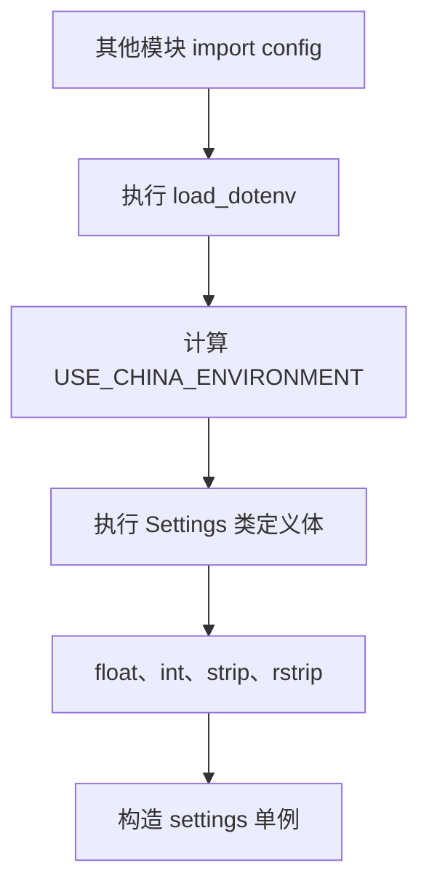

初版已经具备失败前移的雏形，但失败语义来自 Python 内置操作，而不是框架配置语义。

### 2.2 初版的实际失败类型

| 输入问题 | 初版触发位置 | 典型异常 | 诊断质量 |
| --- | --- | --- | --- |
| base URL 缺失 | `None.rstrip()` | `AttributeError` | 看不到明确配置规则 |
| API Key 缺失 | `None.strip()` | `AttributeError` | 看不到变量必填语义 |
| timeout 为 `abc` | `float("abc")` | `ValueError` | 只有转换失败 |
| keep limit 为 `0` | `int("0")` | 成功 | 非法业务范围未被发现 |
| bool 为 `yes` | `_is_true("yes")` | 被解释为 `False` | 非法值被静默吞掉 |
| URL 无协议 | `.rstrip()` | 成功 | 可能延迟到请求阶段失败 |

最危险的不是程序会失败，而是部分非法配置不会失败，或者以错误层级很低的异常失败。

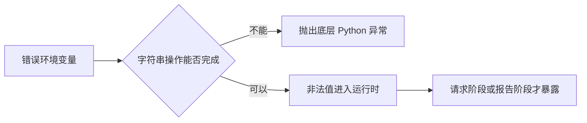

### 2.3 frozen dataclass 解决的范围

初版 `Settings` 使用 `@dataclass(frozen=True)`，它只能防止实例创建后的字段赋值，不能保证输入来源可信，也不能保证 URL、数字范围和环境组合合法。

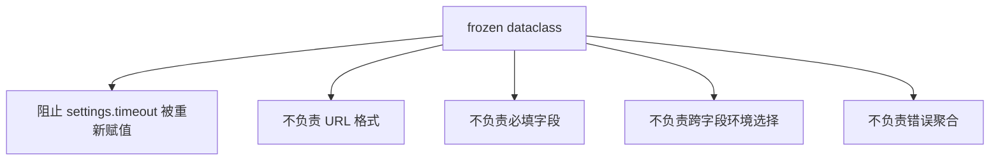

因此，不可变性和有效性是两个不同维度。

## 3. 第一轮演进：显式加载与错误聚合

第一轮配置增强位于提交 `291e6ea`：

```powershell
git diff 56f4f15 291e6ea -- config.py util/config_validation.py
```

这次改造仍使用 frozen dataclass，但引入了三个关键边界。演进前证据是第 2 节的类定义期读取；演进后则把同一组装过程移动到显式函数中。

### 3.1 `load_settings(env)` 成为受支持的统一组装入口

演进后：`291e6ea`，`config.py`

```python
@dataclass(frozen=True)
class Settings:
    timeout: float
    generate_allure_report: bool
    generate_history_report: bool
    history_report_keep_limit: int
    base_url: str
    api_key: str
    environment_name: str


def load_settings(env: Mapping[str, str | None] | None = None) -> Settings:
    env_values = os.environ if env is None else env
    errors: list[ConfigValidationError] = []

    use_china_environment = _parse_config(
        errors,
        parse_bool,
        "USE_CHINA_ENVIRONMENT",
        env_values.get("USE_CHINA_ENVIRONMENT"),
        default=False,
    )
    timeout = _parse_config(
        errors,
        parse_positive_float,
        "API_TIMEOUT",
        env_values.get("API_TIMEOUT"),
        default=600.0,
    )
    generate_allure_report = _parse_config(
        errors,
        parse_bool,
        "GENERATE_ALLURE_REPORT",
        env_values.get("GENERATE_ALLURE_REPORT"),
        default=True,
    )
    generate_history_report = _parse_config(
        errors,
        parse_bool,
        "GENERATE_HISTORY_REPORT",
        env_values.get("GENERATE_HISTORY_REPORT"),
        default=False,
    )
    history_report_keep_limit = _parse_config(
        errors,
        parse_positive_int,
        "HISTORY_REPORT_KEEP_LIMIT",
        env_values.get("HISTORY_REPORT_KEEP_LIMIT"),
        default=30,
    )

    if use_china_environment:
        environment_name = "china"
        base_url_name = "CHINA_TEST_ENVIRONMENT_BASE_URL"
        api_key_name = "CHINA_API_KEY"
    else:
        environment_name = "overseas"
        base_url_name = "OVERSEAS_TEST_BASE_URL"
        api_key_name = "OVERSEAS_API_KEY"

    base_url = _parse_config(
        errors,
        require_http_url,
        base_url_name,
        env_values.get(base_url_name),
    )
    api_key = _parse_config(
        errors,
        require_non_empty,
        api_key_name,
        env_values.get(api_key_name),
    )

    if errors:
        raise aggregate_config_errors(errors)

    return Settings(
        timeout=timeout,
        generate_allure_report=generate_allure_report,
        generate_history_report=generate_history_report,
        history_report_keep_limit=history_report_keep_limit,
        base_url=base_url,
        api_key=api_key,
        environment_name=environment_name,
    )


def _parse_config(
    errors: list[ConfigValidationError],
    parser,
    *args,
    **kwargs,
):
    try:
        return parser(*args, **kwargs)
    except ConfigValidationError as error:
        errors.append(error)
        return None
```

代码中的状态所有权发生了三项变化：一次 `load_settings()` 调用拥有输入 Mapping、错误列表和环境选择；单字段 parser 只返回值或错误；`Settings` 只在所有字段完成后创建。初版类定义体无法注入独立输入，演进后测试可以把普通字典作为一次加载调用的全部外部状态。

这次演进直接保护三个不变量：所有声明字段都经过对应 parser；只要求选中环境的 URL 与 Key；错误列表非空时绝不构造运行时 Settings。代价是加载器成为较长的手工编排函数，字段结构仍由调用顺序隐式表达，这正是第二轮模型化演进要处理的约束。


`env` 为 `None` 时读取 `os.environ`；测试可以传入普通字典，不依赖本机 `.env`。

```python
loaded_settings = load_settings(
    {
        "OVERSEAS_TEST_BASE_URL": "https://example.org",
        "OVERSEAS_API_KEY": "test-secret",
        "API_TIMEOUT": "10.5",
    }
)
```

这项变化把配置解析从类定义副作用变成可调用、可注入、可单测的函数边界。它是项目受支持的可信入口，但 dataclass 构造器仍然公开，因此“统一入口”是工程契约，不是类型系统强制限制。

### 3.2 解析规则下沉到纯函数

`util/config_validation.py` 提供：

- `parse_bool`
- `parse_positive_float`
- `parse_positive_int`
- `require_non_empty`
- `require_http_url`
- `aggregate_config_errors`
- `is_enabled`
- `redact_config_summary`

它们分别拥有单值解析规则，不拥有环境选择和最终 `Settings` 组装。

演进后：`291e6ea`，`util/config_validation.py`

```python
class ConfigValidationError(RuntimeError):
    pass


def parse_bool(
    name: str,
    value: str | None,
    *,
    default: bool | None = None,
) -> bool:
    normalized_value = _normalize_optional_value(value)
    if normalized_value is None:
        if default is not None:
            return default
        raise ConfigValidationError(
            REQUIRED_VALUE_MESSAGE.format(name=name)
        )

    upper_value = normalized_value.upper()
    if upper_value == TRUE_VALUE:
        return True
    if upper_value == FALSE_VALUE:
        return False
    raise ConfigValidationError(
        f"Invalid config {name}={normalized_value!r}. "
        "Expected TRUE or FALSE."
    )


def require_http_url(name: str, value: str | None) -> str:
    normalized_value = require_non_empty(name, value).rstrip("/")
    if not normalized_value.startswith(("http://", "https://")):
        raise ConfigValidationError(
            f"Invalid config {name}={normalized_value!r}. "
            "Expected http(s) URL."
        )
    return normalized_value


def aggregate_config_errors(
    errors: list[ConfigValidationError],
) -> ConfigValidationError:
    if not errors:
        raise ValueError("errors must not be empty")

    lines = ["Configuration validation failed:"]
    lines.extend(f"- {error}" for error in errors)
    return ConfigValidationError("\n".join(lines))


def _normalize_optional_value(value: str | None) -> str | None:
    if value is None:
        return None
    stripped_value = value.strip()
    return stripped_value or None
```

代码证明 helper 只拥有一次函数调用内的规范化值和判断规则，不保存当前环境，也不创建 `Settings`。严格 bool 规则修复了初版 `_is_true("yes") == False` 的静默降级；URL helper 把“有值、移除尾斜杠、必须是 HTTP(S)”合并为可复用契约。稳定异常文本属于 helper，错误列表的生命周期属于 `load_settings()`。

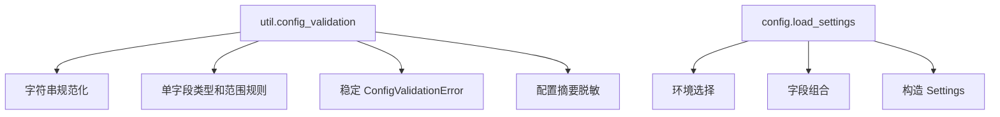

这是工具函数与状态所有者的正确配合：纯函数负责规则，加载器负责整个配置快照的生命周期。

### 3.3 错误聚合

第一轮实现用 `_parse_config()` 捕获每个字段的 `ConfigValidationError`，继续校验其他字段，最后统一抛出：

对应控制流已经在 3.1 的 `load_settings()` 与 `_parse_config()` 中完整展示。关键点不是把多个字符串连接起来，而是失败后返回 `None` 让其他独立字段继续校验，并且只有组装者拥有累计错误列表。只要构造 `Settings` 的语句严格位于 `if errors` 之后，非法中间值就不会跨越信任边界。

```text
Configuration validation failed:
- Missing required config CHINA_TEST_ENVIRONMENT_BASE_URL.
- Missing required config CHINA_API_KEY.
- Invalid config API_TIMEOUT='abc'. Expected positive number.
```

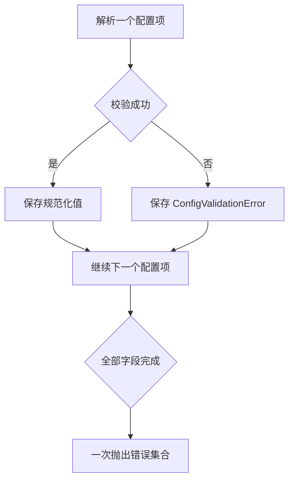

错误聚合减少了修复一个变量后再次运行才能发现下一个变量的反馈循环。

## 4. 第二轮演进：建立双模型信任边界

提交 `2748f16` 将配置迁移到 Pydantic：

```powershell
git diff 291e6ea 2748f16 -- config.py util/config_validation.py requirements.txt tests/test_config_validation.py
```

关键变化不是 dataclass 换成 `BaseModel`，而是出现两个不同语义的模型。

演进前代码已在 3.1 完整展示：`291e6ea` 的 `config.py` 只有一个运行时 dataclass，原始输入的可缺失状态由 `load_settings()` 的局部变量隐式承接。以下演进后代码与该完整实现形成直接对照。


### 4.1 输入模型的职责

`_EnvironmentSettingsInput` 使用 `validation_alias` 接收大写环境变量名：

演进后：`2748f16`，`config.py`

```python
class Settings(BaseModel):
    model_config = ConfigDict(frozen=True)

    timeout: float
    generate_allure_report: bool
    generate_history_report: bool
    history_report_keep_limit: int
    base_url: str
    api_key: str
    environment_name: str


class _EnvironmentSettingsInput(BaseModel):
    model_config = ConfigDict(extra="ignore")

    use_china_environment: bool = Field(
        default=False,
        validation_alias="USE_CHINA_ENVIRONMENT",
    )
    api_timeout: float = Field(
        default=600.0,
        validation_alias="API_TIMEOUT",
    )
    generate_allure_report: bool = Field(
        default=True,
        validation_alias="GENERATE_ALLURE_REPORT",
    )
    generate_history_report: bool = Field(
        default=False,
        validation_alias="GENERATE_HISTORY_REPORT",
    )
    history_report_keep_limit: int = Field(
        default=30,
        validation_alias="HISTORY_REPORT_KEEP_LIMIT",
    )
    china_base_url: str | None = Field(
        default=None,
        validation_alias="CHINA_TEST_ENVIRONMENT_BASE_URL",
    )
    china_api_key: str | None = Field(
        default=None,
        validation_alias="CHINA_API_KEY",
    )
    overseas_base_url: str | None = Field(
        default=None,
        validation_alias="OVERSEAS_TEST_BASE_URL",
    )
    overseas_api_key: str | None = Field(
        default=None,
        validation_alias="OVERSEAS_API_KEY",
    )
```

前后差异不是字段换一种声明语法。`_EnvironmentSettingsInput` 首次显式拥有“尚未选择环境、两套凭据可能缺失”的中间状态；公开 `Settings` 仍只允许完整字段。`extra="ignore"` 还限定了输入模型只消费自己认识的环境变量，而不是把整个 `os.environ` 暴露给运行时对象。

它必须允许两套环境字段同时存在或缺失，因为在环境选择完成前，无法把所有 URL 和 Key 都声明为必填。

| 输入字段 | 输入模型中的形态 | 原因 |
| --- | --- | --- |
| `USE_CHINA_ENVIRONMENT` | 有默认值的 bool | 决定条件分支 |
| `API_TIMEOUT` | 有默认值的 float | 非敏感低风险默认项 |
| china URL 和 Key | 可选字符串 | 未选择 china 时不必存在 |
| overseas URL 和 Key | 可选字符串 | 未选择 overseas 时不必存在 |

输入模型的 optional 不代表运行时允许缺失，只代表交叉校验之前必须容纳原始状态。

### 4.2 字段 validator 的职责

`mode="before"` 的 validator 在 Pydantic 自身转换前调用原有解析函数：

演进后：`2748f16`，`config.py`

```python
BOOL_FIELDS: ClassVar[dict[str, str]] = {
    "use_china_environment": "USE_CHINA_ENVIRONMENT",
    "generate_allure_report": "GENERATE_ALLURE_REPORT",
    "generate_history_report": "GENERATE_HISTORY_REPORT",
}

@field_validator(
    "use_china_environment",
    "generate_allure_report",
    "generate_history_report",
    mode="before",
)
@classmethod
def _validate_bool_env(cls, value: Any, info) -> bool:
    if isinstance(value, bool):
        return value
    field_name = cls.BOOL_FIELDS[info.field_name]
    return parse_bool(
        field_name,
        _optional_string(value),
        default=bool(cls.model_fields[info.field_name].default),
    )

@field_validator("api_timeout", mode="before")
@classmethod
def _validate_timeout(cls, value: Any) -> float:
    return parse_positive_float(
        "API_TIMEOUT",
        _optional_string(value),
        default=600.0,
    )

@field_validator("history_report_keep_limit", mode="before")
@classmethod
def _validate_history_keep_limit(cls, value: Any) -> int:
    return parse_positive_int(
        "HISTORY_REPORT_KEEP_LIMIT",
        _optional_string(value),
        default=30,
    )
```

Pydantic 没有取代第一轮已经形成的字段语义。validator 先把任意输入转成 helper 所需的字符串，再复用严格 bool、正数和稳定变量名规则。字段模型负责声明何时调用规则，helper 仍负责规则本身；两者沿不同原因变化。

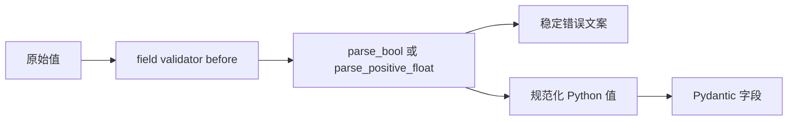

复用原有 helper 有两个目的：

- 保留已经形成的严格规则，例如 bool 只接受 TRUE 或 FALSE。
- 保留 `ConfigValidationError` 的变量名和错误文案，不把所有错误暴露成 Pydantic 默认文本。

### 4.3 model validator 的职责

字段解析成功后，`_validate_selected_environment()` 校验环境组合：

演进后：`2748f16`，`config.py`

```python
@model_validator(mode="after")
def _validate_selected_environment(self) -> _EnvironmentSettingsInput:
    errors: list[ConfigValidationError] = []
    if self.use_china_environment:
        _collect_config_error(
            errors,
            require_http_url,
            "CHINA_TEST_ENVIRONMENT_BASE_URL",
            self.china_base_url,
        )
        _collect_config_error(
            errors,
            require_non_empty,
            "CHINA_API_KEY",
            self.china_api_key,
        )
        if errors:
            raise aggregate_config_errors(errors)
        return self

    _collect_config_error(
        errors,
        require_http_url,
        "OVERSEAS_TEST_BASE_URL",
        self.overseas_base_url,
    )
    _collect_config_error(
        errors,
        require_non_empty,
        "OVERSEAS_API_KEY",
        self.overseas_api_key,
    )
    if errors:
        raise aggregate_config_errors(errors)
    return self
```

这个分支证明环境完整性属于模型组合规则，不属于单个 URL 或 Key 字段。只有选中的一组字段进入必填校验，因此未选中环境不会扩大当前测试运行的启动前提。同一环境的 URL 与 Key 共享一次 model validator 错误列表，可以同时报告。

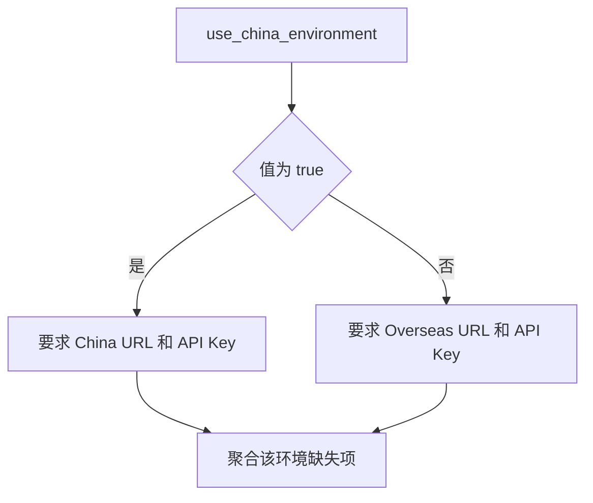

它只校验被选中的环境。这样 overseas 用例不会因为缺少 china 密钥而无法启动。

### 4.4 公开 Settings 的职责

公开 `Settings` 只包含运行时真正需要的字段：

```text
timeout
generate_allure_report
generate_history_report
history_report_keep_limit
base_url
api_key
environment_name
```

它不再暴露两套环境的全部原始字段。调用方不需要重复判断 china 或 overseas。

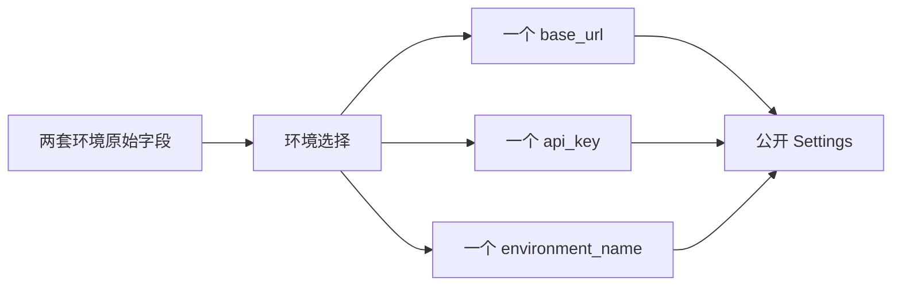

`ConfigDict(frozen=True)` 防止运行过程中重新赋值，保证同一个配置快照在客户端和报告模块之间保持一致。

演进后：`2748f16`，`config.py`

```python
def to_settings(self) -> Settings:
    if self.use_china_environment:
        return Settings(
            timeout=self.api_timeout,
            generate_allure_report=self.generate_allure_report,
            generate_history_report=self.generate_history_report,
            history_report_keep_limit=self.history_report_keep_limit,
            base_url=require_http_url(
                "CHINA_TEST_ENVIRONMENT_BASE_URL",
                self.china_base_url,
            ),
            api_key=require_non_empty(
                "CHINA_API_KEY",
                self.china_api_key,
            ),
            environment_name="china",
        )

    return Settings(
        timeout=self.api_timeout,
        generate_allure_report=self.generate_allure_report,
        generate_history_report=self.generate_history_report,
        history_report_keep_limit=self.history_report_keep_limit,
        base_url=require_http_url(
            "OVERSEAS_TEST_BASE_URL",
            self.overseas_base_url,
        ),
        api_key=require_non_empty(
            "OVERSEAS_API_KEY",
            self.overseas_api_key,
        ),
        environment_name="overseas",
    )
```

`to_settings()` 是信任转换的最后一道代码边界：输入模型持有两套可选字段，输出模型只得到选中环境的一套完整 URL 与 Key。这里再次调用 `require_*`，使转换本身不只依赖 model validator 的先验结论。调用方得到的对象不再需要环境分支，也无法看到未选中环境的凭据。

## 5. 当前完整执行链

当前 `config.py` 在 import 时执行：

当前代码：`dev2`，`config.py`

```python
def load_settings(
    env: Mapping[str, str | None] | None = None,
) -> Settings:
    env_values = os.environ if env is None else env
    try:
        return _EnvironmentSettingsInput.model_validate(
            dict(env_values)
        ).to_settings()
    except ValidationError as error:
        errors = _config_errors_from_pydantic(error)
        if errors:
            raise aggregate_config_errors(errors) from error
        raise


settings = load_settings()
USE_CHINA_ENVIRONMENT = settings.environment_name == "china"
```

当前代码与 `2748f16` 的核心链路保持一致。`load_settings()` 拥有一次信任转换；模块级语句决定默认配置快照在 import 时创建；兼容常量从已验证的 Settings 反向派生，而不是再次读取 `os.environ`，避免同一环境选择出现两个事实来源。

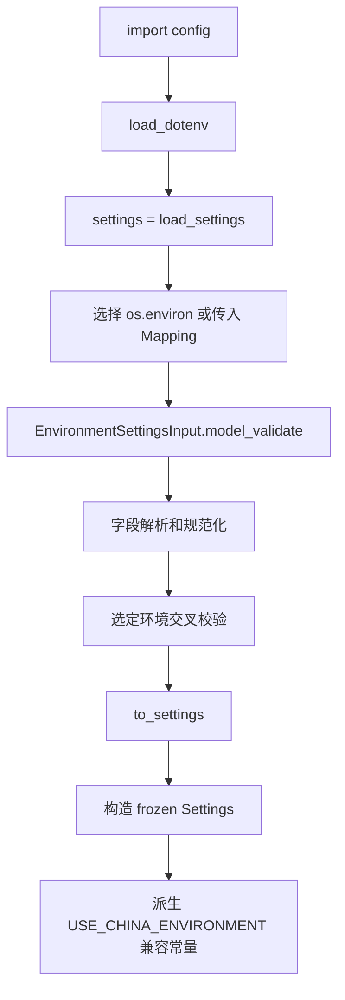

`load_dotenv()` 默认不覆盖已经存在的系统环境变量，因此实际来源优先级为：

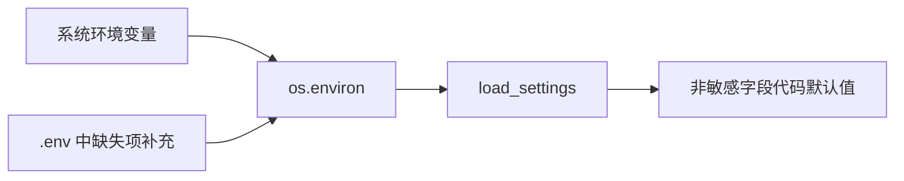

主 URL 和主 API Key 没有代码默认值，避免测试静默发往未知环境或使用错误账号。

### 5.1 贯穿后续课程的数据流思维导图（基准 v1）

本图只保留配置成功路径上的真实函数调用。输入形态、失败语义和生命周期见图后的表格与正文。

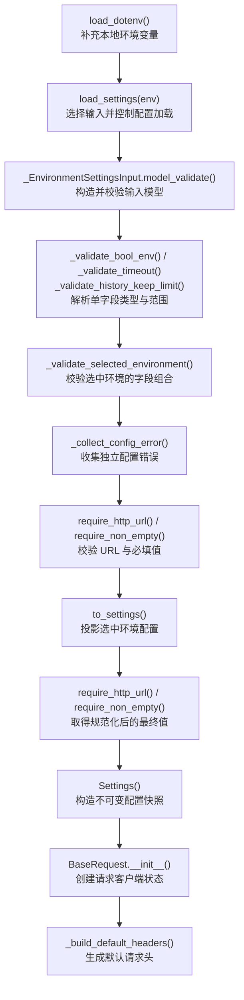

失败流与成功流在信任边界前分离：字段或环境组合校验先形成 Pydantic `ValidationError`，`load_settings()` 捕获后交给 `_config_errors_from_pydantic()` 提取、拆分和去重，最后由 `aggregate_config_errors()` 生成框架稳定的 `ConfigValidationError`。失败路径不会产生可信 `Settings`；第 10 节会展开错误适配的代码证据。

图中的主要数据变换是：

| 变换 | 输入数据 | 函数边界 | 输出数据 | 被消除的不确定性 |
| --- | --- | --- | --- | --- |
| 来源合并 | 系统环境、`.env` | `load_dotenv()` | `os.environ` | 本地缺失项得到候选值，但仍不可信 |
| 调用隔离 | `os.environ` 或测试 Mapping | `load_settings()`、`dict()` | 本次加载快照 | 后续解析不再依赖 Mapping 的实时变化 |
| 字段解析 | 可缺失字符串 | field validators 与 parser | typed fields | bool、数字、空白和默认值语义确定 |
| 组合校验 | 两套环境字段 | `_validate_selected_environment()` | 选中环境完整的输入模型 | 哪套 URL/Key 必需已经确定；`require_*` 返回值不在此步写回模型 |
| 信任转换 | 私有输入模型 | `to_settings()` | frozen `Settings` | 再次执行 `require_*`，规范化 URL，丢弃未选中环境字段 |
| 错误适配 | Pydantic `ValidationError` | `_config_errors_from_pydantic()`、`aggregate_config_errors()` | `ConfigValidationError` | 下游不依赖第三方错误结构，非法输入不能产生 `Settings` |
| 请求消费 | `Settings` | `BaseRequest.__init__()` | 客户端配置与默认 Header | 配置开始成为 HTTP 构造事实 |
| 观测复制 | 调用方待展示 Mapping | `redact_config_summary()` | 脱敏副本 | 输出不再直接携带已识别的敏感值，输入 Mapping 不被修改 |

### 5.2 按数据流图讲解关键函数

这一模块严格按图中的 `A → L` 顺序阅读。每个函数都回答五个问题：接收什么、返回什么、改变什么状态、怎样失败、为什么下一函数可以继续。

| 图节点 | 关键函数 | 本阶段完成的转换 |
| --- | --- | --- |
| A | `load_dotenv()` | 把 `.env` 候选值补入进程环境 |
| B | `load_settings(env)` | 选择输入来源并控制完整信任转换 |
| C | `_EnvironmentSettingsInput.model_validate()` | 将外部键映射到私有输入模型并调度校验器 |
| D | 三类 field validator | 把字符串转换成字段级类型 |
| E～G | `_validate_selected_environment()`、`_collect_config_error()`、`require_*()` | 校验当前环境的跨字段完整性 |
| H～J | `to_settings()`、`require_*()`、`Settings()` | 投影并构造运行时配置快照 |
| K～L | `BaseRequest.__init__()`、`_build_default_headers()` | 把配置事实转成客户端发送状态 |

#### 5.2.1 A：`load_dotenv()` 只处理来源，不判断配置是否合法

当前代码：`dev2`，`config.py`

```python
load_dotenv()
```

它在 `config.py` 导入期间执行。默认行为是读取 `.env`，将进程环境中尚不存在的键补入 `os.environ`，但不覆盖已经存在的系统环境变量。

| 问题 | 答案 |
| --- | --- |
| 输入 | 当前工作目录附近的 `.env` 和已有 `os.environ` |
| 输出 | 没有业务返回值；副作用是补充进程环境 |
| 状态所有者 | `os.environ` 仍由 Python 进程拥有 |
| 它不负责什么 | 不解析 bool、数字和 URL，不判断哪套环境必填 |
| 下一步为什么仍不可信 | 所有值仍是可缺失字符串，只是来源完成合并 |

因此不能把“dotenv 加载成功”等同于“配置有效”。它只解决值从哪里来，`load_settings()` 才解决这些值是否可供框架运行。

#### 5.2.2 B：`load_settings(env)` 是唯一受支持的信任转换入口

当前代码：`dev2`，`config.py`

```python
def load_settings(
    env: Mapping[str, str | None] | None = None,
) -> Settings:
    env_values = os.environ if env is None else env
    try:
        return _EnvironmentSettingsInput.model_validate(
            dict(env_values)
        ).to_settings()
    except ValidationError as error:
        errors = _config_errors_from_pydantic(error)
        if errors:
            raise aggregate_config_errors(errors) from error
        raise
```

这个函数同时承担三个职责，但它们都围绕同一个目标：保证调用方只能得到完整 `Settings` 或稳定配置异常。

1. **选择来源**：`env is None` 时读取 `os.environ`；显式传入 Mapping 时完全使用该 Mapping。
2. **建立本次快照**：`dict(env_values)` 复制顶层键值，后续模型验证不再持续读取原 Mapping。
3. **适配错误边界**：内部 Pydantic `ValidationError` 被转成项目稳定的 `ConfigValidationError`。

关键不变量是：

```text
返回 Settings
或
抛出配置异常

不存在“返回半合法配置”这一分支
```

为什么支持传入 `env`：单元测试可以显式构造全部输入，不必修改全局 `os.environ`。为什么仍保留默认 `os.environ`：真实入口可以继续使用 `.env` 和 CI 环境变量。

注意 `dict()` 只是浅层复制。这里环境值的公开类型为字符串或 `None`，已经足够隔离键集合；它不是通用的深拷贝边界。

#### 5.2.3 C：`model_validate()` 创建的是输入模型，不是运行时 Settings

调用点：`dev2`，`config.py`

```python
_EnvironmentSettingsInput.model_validate(dict(env_values))
```

`model_validate()` 是 Pydantic 入口。它完成的不是单纯 `dict → object`，而是按模型声明依次执行：

```text
环境变量别名映射
  → mode="before" 字段校验
  → Pydantic 字段类型构造
  → mode="after" 模型级校验
  → _EnvironmentSettingsInput
```

输入模型使用：

```python
class _EnvironmentSettingsInput(BaseModel):
    model_config = ConfigDict(extra="ignore")

    use_china_environment: bool = Field(
        default=False,
        validation_alias="USE_CHINA_ENVIRONMENT",
    )
    api_timeout: float = Field(
        default=600.0,
        validation_alias="API_TIMEOUT",
    )
```

两个设计点决定数据如何流转：

- `validation_alias` 让外部继续使用大写环境变量名，模型内部使用 Python 字段名。
- `extra="ignore"` 让整个 `os.environ` 可以作为输入，但只有模型声明的字段进入输入模型。

它创建 `_EnvironmentSettingsInput` 而不是直接创建 `Settings`，因为此时必须暂时容纳 china 和 overseas 两套可选字段。只有完成环境选择后，才能投影出一套完整运行时配置。

#### 5.2.4 D：field validator 消除单字段的不确定性

数据流图把三个代表性 validator 放在同一节点，因为它们的共同边界是：只判断当前字段，不决定环境组合。

当前代码：`dev2`，`config.py`

```python
@field_validator(
    "use_china_environment",
    "generate_allure_report",
    "generate_history_report",
    mode="before",
)
@classmethod
def _validate_bool_env(cls, value: Any, info) -> bool:
    if isinstance(value, bool):
        return value
    field_name = cls.BOOL_FIELDS[info.field_name]
    return parse_bool(
        field_name,
        _optional_string(value),
        default=bool(cls.model_fields[info.field_name].default),
    )

@field_validator("api_timeout", mode="before")
@classmethod
def _validate_timeout(cls, value: Any) -> float:
    return parse_positive_float(
        "API_TIMEOUT",
        _optional_string(value),
        default=600.0,
    )

@field_validator("history_report_keep_limit", mode="before")
@classmethod
def _validate_history_keep_limit(cls, value: Any) -> int:
    return parse_positive_int(
        "HISTORY_REPORT_KEEP_LIMIT",
        _optional_string(value),
        default=20,
    )
```

`mode="before"` 的含义是 parser 能看到外部原始值，在 Pydantic 做最终字段类型构造之前先应用项目规则。

| Validator | 输入 | 委托函数 | 成功输出 | 失败条件 |
| --- | --- | --- | --- | --- |
| `_validate_bool_env()` | bool 或任意外部值 | `parse_bool()` | `bool` | 非空值不是 TRUE/FALSE |
| `_validate_timeout()` | 外部 timeout | `parse_positive_float()` | 正浮点数 | 不能转为数字或 `<= 0` |
| `_validate_history_keep_limit()` | 外部保留数 | `parse_positive_int()` | 正整数 | 不能转为整数或 `< 1` |

parser 的职责比 validator 更窄。例如：

```python
def parse_positive_float(
    name: str,
    value: str | None,
    *,
    default: float | None = None,
) -> float:
    normalized_value = _normalize_optional_value(value)
    if normalized_value is None:
        if default is not None:
            return default
        raise ConfigValidationError(
            REQUIRED_VALUE_MESSAGE.format(name=name)
        )

    try:
        parsed_value = float(normalized_value)
    except ValueError as exc:
        raise ConfigValidationError(
            f"Invalid config {name}={normalized_value!r}. "
            "Expected positive number."
        ) from exc

    if parsed_value <= 0:
        raise ConfigValidationError(
            f"Invalid config {name}={normalized_value!r}. "
            "Expected positive number."
        )
    return parsed_value
```

它只知道“一个具名配置必须是正数”，不知道这个数字最终进入请求 timeout 还是报告配置。这使规则可以离线、独立测试。

URL 与 Key 的四个 normalize validator 也在 `model_validate()` 内执行，但图只保留代表性节点。它们把 `None` 保持为 `None`，把空白字符串转成 `None`，暂时不要求未选中环境的值存在。

当前实现有一个需认知的细节：模型字段 `history_report_keep_limit` 声明默认值为 `30`，而 `_validate_history_keep_limit()` 调用 parser 时传入默认值 `20`。字段完全缺失时，当前测试证明公开结果为 `30`；显式传入空值时会经过 validator 的 `20`。这两个默认来源并不一致，是当前实现事实，不应在扩展时继续复制。

#### 5.2.5 E～G：模型级校验只验证选中的环境

当前代码：`dev2`，`config.py`

```python
@model_validator(mode="after")
def _validate_selected_environment(
    self,
) -> _EnvironmentSettingsInput:
    errors: list[ConfigValidationError] = []
    if self.use_china_environment:
        _collect_config_error(
            errors,
            require_http_url,
            "CHINA_TEST_ENVIRONMENT_BASE_URL",
            self.china_base_url,
        )
        _collect_config_error(
            errors,
            require_non_empty,
            "CHINA_API_KEY",
            self.china_api_key,
        )
        if errors:
            raise aggregate_config_errors(errors)
        return self

    _collect_config_error(
        errors,
        require_http_url,
        "OVERSEAS_TEST_BASE_URL",
        self.overseas_base_url,
    )
    _collect_config_error(
        errors,
        require_non_empty,
        "OVERSEAS_API_KEY",
        self.overseas_api_key,
    )
    if errors:
        raise aggregate_config_errors(errors)
    return self
```

为什么必须在字段校验之后执行：环境标志先变成可靠 bool，URL 和 Key 的空白也先规范化，模型级规则才可以稳定判断“当前到底选择哪一套字段”。

为什么只校验选中环境：未选中环境不会被本次运行消费，让它成为必填项只会扩大启动失败范围。

`_collect_config_error()` 的作用不是校验字段，而是改变失败控制流：

```python
def _collect_config_error(
    errors: list[ConfigValidationError],
    parser,
    *args,
    **kwargs,
) -> None:
    try:
        parser(*args, **kwargs)
    except ConfigValidationError as error:
        errors.append(error)
```

如果直接连续调用两个 `require_*()`，URL 第一个失败后 API Key 就不会再检查。collector 把“立即抛出”改成“收集当前独立错误并继续”，所以同一环境缺失 URL 和 Key 时能一次报告两项。

两个 require helper 分别建立最低契约：

```python
def require_non_empty(name: str, value: str | None) -> str:
    normalized_value = _normalize_optional_value(value)
    if normalized_value is None:
        raise ConfigValidationError(
            REQUIRED_VALUE_MESSAGE.format(name=name)
        )
    return normalized_value


def require_http_url(name: str, value: str | None) -> str:
    normalized_value = require_non_empty(name, value).rstrip("/")
    if not normalized_value.startswith(("http://", "https://")):
        raise ConfigValidationError(
            f"Invalid config {name}={normalized_value!r}. "
            "Expected http(s) URL."
        )
    return normalized_value
```

`require_http_url()` 先复用非空规则，再移除尾斜杠，最后限制协议头。这里没有使用完整 URL parser，因此它只承诺当前代码实际检查的内容，不能宣称已经验证 host、port、路径或域名合法性。

还要注意：model validator 中 `require_*()` 的返回值只用于判断，没有写回输入模型。因此此阶段证明“值可用”，真正规范化后的 URL 要在 `to_settings()` 中再次取得。

#### 5.2.6 H～J：`to_settings()` 是最后的信任投影

当前代码：`dev2`，`config.py`

```python
def to_settings(self) -> Settings:
    if self.use_china_environment:
        return Settings(
            timeout=self.api_timeout,
            generate_allure_report=self.generate_allure_report,
            generate_history_report=self.generate_history_report,
            history_report_keep_limit=self.history_report_keep_limit,
            base_url=require_http_url(
                "CHINA_TEST_ENVIRONMENT_BASE_URL",
                self.china_base_url,
            ),
            api_key=require_non_empty(
                "CHINA_API_KEY",
                self.china_api_key,
            ),
            environment_name="china",
        )

    return Settings(
        timeout=self.api_timeout,
        generate_allure_report=self.generate_allure_report,
        generate_history_report=self.generate_history_report,
        history_report_keep_limit=self.history_report_keep_limit,
        base_url=require_http_url(
            "OVERSEAS_TEST_BASE_URL",
            self.overseas_base_url,
        ),
        api_key=require_non_empty(
            "OVERSEAS_API_KEY",
            self.overseas_api_key,
        ),
        environment_name="overseas",
    )
```

这个函数做了三件不能由字段 validator 代替的事：

1. 根据已验证的环境标志选择一套 URL 与 Key。
2. 再次调用 `require_*()`，取得去空白、去尾斜杠后的真实返回值。
3. 丢弃未选中环境的字段，只向运行时公开统一的 `base_url` 和 `api_key`。

公开模型为：

```python
class Settings(BaseModel):
    model_config = ConfigDict(frozen=True)

    timeout: float
    generate_allure_report: bool
    generate_history_report: bool
    history_report_keep_limit: int
    base_url: str
    api_key: str
    environment_name: str
```

`frozen=True` 只承诺实例创建后不能普通赋值修改。它不自动证明 URL 和 environment name 符合业务规则，所以可信构造路径是 `load_settings() → to_settings() → Settings()`，而不是调用方直接 `Settings(...)`。

到这里，配置数据的所有权发生改变：输入模型只属于一次加载调用；返回的 `Settings` 成为运行时配置快照。

#### 5.2.7 K～L：`BaseRequest` 把配置快照转成客户端状态

当前代码：`dev2`，`common/base_request.py`

```python
class BaseRequest:
    def __init__(
        self,
        config: Settings = settings,
        middlewares: list[RequestMiddleware] | None = None,
        retry_executor: RetryExecutor | None = None,
    ):
        self.config = config
        self.session = requests.Session()
        self.default_headers = self._build_default_headers()
        self.session.headers.update(self.default_headers)
        self.middlewares = list(
            self._default_middlewares()
            if middlewares is None
            else middlewares
        )
        self.retry_executor = retry_executor or RetryExecutor(
            sleeper=time.sleep,
            monotonic=time.monotonic,
        )

    def _build_default_headers(self) -> dict[str, str]:
        return {
            "Content-Type": "application/json",
            "Accept": "application/json",
            "User-Agent": "api-v1_chat_completions-framework",
            "Authorization": f"Bearer {self.config.api_key}",
        }
```

这里完成从“可信配置事实”到“可发送客户端状态”的转换：

| Settings 字段 | 消费位置 | 形成的客户端状态 |
| --- | --- | --- |
| `api_key` | `_build_default_headers()` | 真实 `Authorization` Header |
| `base_url` | 后续 `_build_url()` | 相对 path 的 URL 基址 |
| `timeout` | 后续 `_build_request_context()` | 未显式传 timeout 时的默认值 |

`BaseRequest` 不再读取 `os.environ`，也不再次判断 china/overseas。环境差异已经在 `to_settings()` 前消失，这是信任边界生效的直接证据。

`Authorization` 是真实发送数据，不是日志安全副本。若在这里提前脱敏，网络请求会携带 `<redacted>` 而失败；日志脱敏必须在后续观测路径产生副本。这正是第 3、4 天继续展开的数据流。

#### 5.2.8 一次成功调用后，各层可以依赖什么

| 函数返回点 | 下游可以依赖的不变量 | 下游仍不能假设什么 |
| --- | --- | --- |
| `load_dotenv()` 后 | 环境来源已尝试合并 | 配置存在、类型正确 |
| field validator 后 | 单字段类型和基本范围正确 | 当前环境的 URL/Key 完整 |
| `_validate_selected_environment()` 后 | 选中环境最低前提完整 | URL 规范化结果已写回模型 |
| `to_settings()` 后 | 公开字段完整，选中环境已投影 | 直接构造任意 Settings 也同样可信 |
| `BaseRequest.__init__()` 后 | Session 已持有真实默认 Header | 日志输出已经脱敏 |

这条调用链的核心因果关系是：

```text
来源确定
  → 单字段可解释
  → 环境组合完整
  → 运行时模型收敛
  → 客户端可以发送
```

任何新配置规则都应先判断它消除的是哪一层不确定性，再放入对应函数，不能因为都在 `config.py` 就堆进 `load_settings()`。

### 5.3 后续课程沿用的绘图协议

每节课只画一张自上而下的真实函数调用链。每个节点保留“函数名 + 一句简短作用”，数据详情、分支、异常和生命周期放在图外说明。

第 3 天从请求调用继续：

```text
BaseRequest.__init__()
  → get() / post()
  → request()
  → _build_request_context()
```

因此第 3 天需要回答的是：`Settings` 中的 `base_url`、`api_key` 和 `timeout` 如何与用例传入的 method、path、payload、headers 合并成一次 attempt 的 `RequestContext`；不再重新解释环境变量如何变成 `Settings`。

## 6. 变化轴

配置能力不是单一变化，它包含六条独立变化轴：

| 变化轴 | 变化内容 | 主要所有者 | 与其他变化的关系 |
| --- | --- | --- | --- |
| 来源 | 系统环境、`.env`、测试 Mapping | 加载入口 | 独立于类型规则 |
| 类型与范围 | bool、正数、正整数、URL | validation helper | 独立于环境选择 |
| 环境选择 | china 或 overseas | 输入模型交叉校验 | 决定哪些字段必填 |
| 错误语义 | 变量名、聚合、稳定异常类型 | helper 与错误适配层 | 独立于运行时消费 |
| 安全输出 | API Key 和 Authorization 脱敏 | redaction helper | 只影响观测副本 |
| 运行时稳定性 | 字段完整、不可变 | 公开 Settings | 位于信任边界之后 |

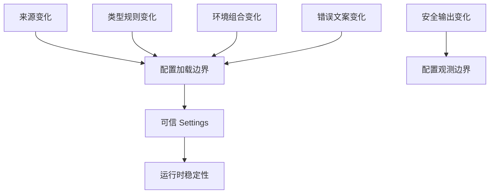

这些变化轴说明 `config.py` 不应重新实现所有解析细节，`util.config_validation` 也不应决定项目使用哪个环境。

## 7. 状态所有者与生命周期

| 状态 | 创建者 | 修改者 | 结束或清理者 | 生命周期 |
| --- | --- | --- | --- | --- |
| `.env` 文件内容 | 人或 CI | 人或 CI | 外部环境 | 跨测试运行 |
| `os.environ` | 操作系统、进程启动器、dotenv | 进程和外部工具 | 进程结束 | 进程 |
| 传入 `env` Mapping | 单元测试或调用方 | 调用方 | 函数返回后 | 一次加载调用 |
| `_EnvironmentSettingsInput` | Pydantic 校验入口 | validators | `to_settings` 后可释放 | 一次加载调用 |
| 聚合错误列表 | 校验过程 | 字段和模型校验 | 抛出异常后 | 一次加载调用 |
| `Settings` 实例 | `to_settings` | frozen，不应修改 | 进程或客户端结束 | 配置快照 |
| 模块级 `settings` | `config` import | 无 | 进程结束 | 进程 |

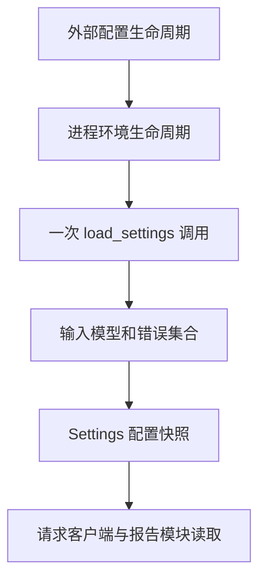

关键所有权结论：

- 输入模型只拥有解析期间的中间状态。
- 公开 Settings 拥有运行时消费状态。
- `BaseRequest` 只读取配置，不负责重新解析环境变量。
- 用例级账号不属于全局配置快照。

## 8. 全局配置与用例级配置的边界

全局配置只应该包含几乎所有业务用例启动都依赖的最低前提：

- 当前环境 base URL。
- 当前环境主 API Key。
- 请求 timeout。
- 报告开关与保留数量。

以下配置不进入全局 `Settings`：

- `CHINA_CONTROL_API_KEY`
- `OVERSEAS_CONTROL_API_KEY`
- `B_ACCOUNT_API_KEY`
- `B_ACCOUNT_CONTROL_KEY`
- `ZERO_BALANCE_API_KEY`
- `ZERO_BALANCE_CONTROL_KEY`

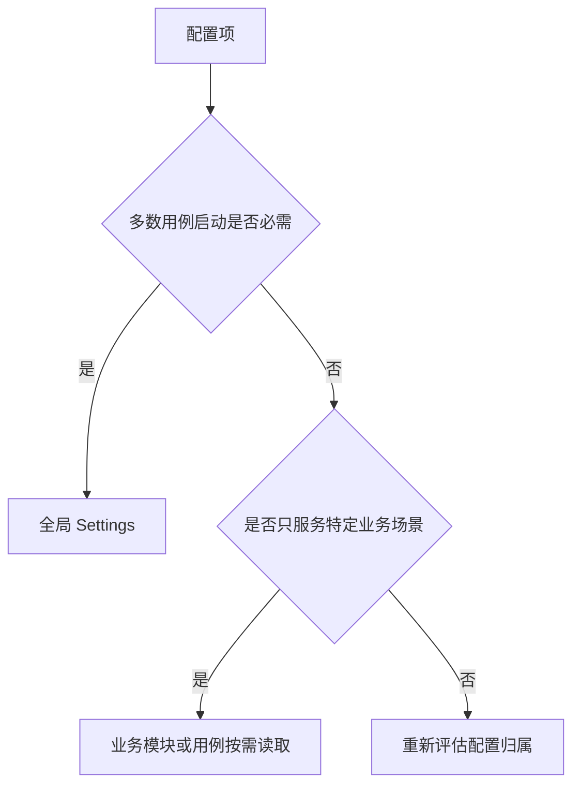

如果把 zero account 密钥设为全局必填，任何不涉及余额的用例也会因缺少该密钥无法收集。此时局部业务前提被错误提升为框架启动前提，扩大了失败半径。

## 9. 不变量与职责边界

### 9.1 配置不变量

1. 请求发出前必须得到合法 HTTP base URL。
2. 当前环境主 API Key 必须非空。
3. timeout 必须为正数。
4. 报告保留数量必须为正整数。
5. bool 配置只接受明确的 TRUE 或 FALSE。
6. 运行时配置快照不可被意外改写。
7. 错误输出和配置摘要不得泄露密钥。
8. 未选中环境和特定业务账号不得阻塞当前用例。
9. 测试可以注入 Mapping 验证解析逻辑。
10. 公开字段名和 `settings = load_settings()` 保持兼容。

### 9.2 从不变量推导边界

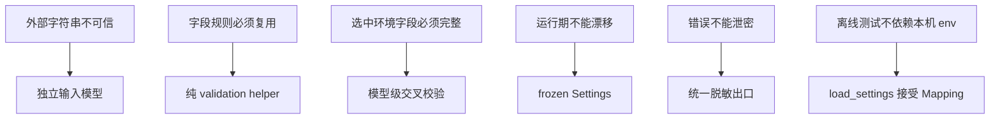

边界的目的不是展示 Pydantic 技巧，而是让每条不变量能够被局部测试。

## 10. 错误模型

### 10.1 稳定的外部异常

当前 `load_settings()` 捕获 Pydantic `ValidationError`，再转换为 `ConfigValidationError`。业务调用方看到的是框架稳定异常，而不是第三方库内部结构。

当前代码：`dev2`，`config.py`

```python
def _config_errors_from_pydantic(
    error: ValidationError,
) -> list[ConfigValidationError]:
    errors: list[ConfigValidationError] = []
    seen_messages: set[str] = set()
    for detail in error.errors(
        include_url=False,
        include_context=True,
    ):
        for message in _pydantic_error_messages(detail):
            if message in seen_messages:
                continue
            seen_messages.add(message)
            errors.append(ConfigValidationError(message))
    return errors


def _pydantic_error_messages(detail: dict[str, Any]) -> list[str]:
    context = detail.get("ctx") or {}
    error = context.get("error")
    if isinstance(error, ConfigValidationError):
        return _split_aggregate_error_message(str(error))
    if isinstance(error, ValueError):
        return _split_aggregate_error_message(str(error))
    return [str(detail.get("msg", "Invalid configuration."))]


def _split_aggregate_error_message(message: str) -> list[str]:
    prefix = "Configuration validation failed:"
    if not message.startswith(prefix):
        return [message]

    messages: list[str] = []
    for line in message.splitlines()[1:]:
        stripped_line = line.strip()
        if stripped_line.startswith("- "):
            messages.append(stripped_line[2:])
    return messages or [message]
```

适配层读取 Pydantic 的结构化 context，恢复内部 helper 产生的原始错误文案，拆开 model validator 中已经聚合的多行消息并去重。这个边界保护的是外部错误契约：以后即使替换或升级建模库，调用方仍只依赖 `ConfigValidationError` 与项目定义的变量名。

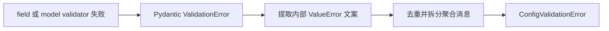

这样迁移到 Pydantic 后仍保留已有错误契约。

### 10.2 当前聚合行为的真实限制

实际验证结果：

```text
输入：USE_CHINA_ENVIRONMENT=TRUE，China URL 和 API Key 都缺失
结果：一次报告两个缺失项

输入：USE_CHINA_ENVIRONMENT=TRUE，API_TIMEOUT=abc，同时 China URL 和 API Key 缺失
结果：只报告 API_TIMEOUT 非法
```

原因是 `model_validator(mode="after")` 依赖字段模型先成功构造。字段 validator 失败后，选中环境交叉校验不会执行。

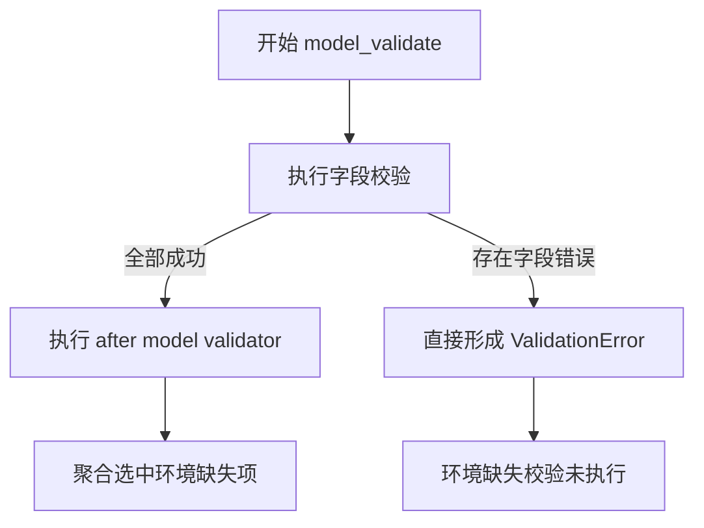

第一轮手写加载器在全流程聚合方面更彻底；Pydantic 版本获得结构化模型和统一模型模式，但保留了这个错误聚合边界。

这项限制目前没有破坏测试定义的公开错误契约，因此属于已知权衡，而不是本节要修改的代码缺陷。

## 11. `settings = load_settings()` 的双面性

模块末尾保留：

```python
settings = load_settings()
USE_CHINA_ENVIRONMENT = settings.environment_name == "china"
```

### 11.1 收益

- 任意真实入口 import 配置时立即校验。
- 不会等到第一个 HTTP 请求才发现 URL 或 Key 缺失。
- `BaseRequest(config=settings)` 保持原有调用方式。
- 报告模块直接读取相同配置快照。

### 11.2 成本

- import `config` 具有读取 `.env` 和校验环境的副作用。
- 缺少基础环境配置时，纯离线测试可能在收集阶段失败。
- 单独测试 `load_settings(mapping)` 前，模块本身仍需成功 import。
- 同一进程中修改 `os.environ` 不会自动重建已经创建的模块级 settings。

```mermaid
flowchart LR
    A["模块级 settings"] --> B["配置错误尽早失败"]
    A --> C["调用方式兼容"]
    A --> D["import 依赖真实基础环境"]
    A --> E["配置快照不会自动刷新"]
```

当前项目接受这一成本，并通过三种方式降低影响：

- 配置单测直接调用 `load_settings(mapping)`。
- 请求单测可以给 `BaseRequest` 注入 `DummyConfig`。
- CI 在测试前准备 `.env` 或环境变量。

它只部分解决了完全离线导入问题，因为 `config.py` 本身仍会创建全局 settings。

## 12. 安全输出边界

配置校验和配置展示是两个不同流程：

- 校验需要读取真实值。
- 展示只能使用脱敏副本。

当前代码：`dev2`，`util/config_validation.py`

```python
def redact_config_summary(
    summary: Mapping[str, Any],
) -> dict[str, Any]:
    redacted_summary = redact_sensitive_data(dict(summary))
    if not isinstance(redacted_summary, dict):
        return dict(summary)
    return redacted_summary
```

这里先复制 Mapping，再把副本交给通用结构化脱敏函数。真实 Settings 与校验值不会被修改。状态所有权因此分开：配置快照属于运行时，安全摘要属于一次观测输出。此函数仍受 `redact_sensitive_data()` 的字段名规则约束，不是任意秘密值追踪器。

```mermaid
flowchart LR
    A["真实配置值"] --> B["校验和运行时 Settings"]
    A --> C["redact_config_summary"]
    C --> D["安全配置摘要"]
    D --> E["终端或报告"]
```

`redact_config_summary()` 复用 `util.redaction.redact_sensitive_data()`，避免配置系统维护第二套敏感字段列表。

缺失 API Key 时错误只输出变量名；非敏感非法值如 timeout 可以显示原始值帮助定位。

## 13. 四种方案比较

### 13.1 方案 A：业务代码直接使用 `os.getenv()`

收益：实现最少，无中间模型。

代价：解析散落、错误暴露晚、规则不一致、难以一次获得完整配置快照。

适合一次性脚本，不适合被多个模块共享的测试框架。

### 13.2 方案 B：frozen dataclass 加手写加载器

收益：依赖少、控制流直观、可以完整聚合错误、运行时字段只读。

代价：字段映射、默认值、校验调用和错误收集都需要手工维护。

这是 `291e6ea` 阶段的方案，已经能满足第一版安全边界。

### 13.3 方案 C：单个 Pydantic Settings 模型

收益：声明集中、类型转换和结构化错误由库处理。

代价：同一个模型既要容纳两套环境的可选原始字段，又要向运行时承诺单套必填字段，optional 输入状态会泄漏到调用方。

单模型难以同时表达“解析前允许缺失”和“解析后保证完整”。

### 13.4 方案 D：输入模型加公开模型

收益：明确不可信输入与可信输出；运行时只看到选中环境；字段结构和不可变性统一；保留公开字段兼容。

代价：模型转换和错误适配代码增加；直接构造公开 `Settings` 可以绕过业务校验；after validator 存在聚合限制。

这是当前方案。

### 13.5 决策表

| 维度 | 直接 getenv | dataclass 加加载器 | 单 Pydantic 模型 | 双 Pydantic 模型 |
| --- | --- | --- | --- | --- |
| 输入与运行时隔离 | 无 | 由函数保证 | 较弱 | 清晰 |
| 错误聚合 | 无 | 最强且可控 | 依赖模型 | 结构化但有阶段限制 |
| 类型与默认声明 | 分散 | 手工 | 集中 | 集中 |
| 运行时只读 | 无 | frozen | 可配置 frozen | 公开模型 frozen |
| 离线测试 | 较难 | 容易 | 容易 | 容易，但模块 import 仍有前提 |
| 维护成本 | 初期低 | 中 | 中 | 中高 |
| 当前项目适配度 | 低 | 可用 | 一般 | 较高 |

```mermaid
flowchart TD
    A["配置项很少且只被一个脚本使用"] --> B["直接读取即可"]
    C["需要稳定错误和可注入测试"] --> D["显式加载器"]
    E["原始输入和运行时承诺不同"] --> F["输入模型与公开模型分离"]
```

当前方案的价值来自信任边界，而不是 Pydantic 名称本身。

## 14. 当前实现的直接构造限制

实际代码允许直接构造：

```python
Settings(
    timeout="1",
    generate_allure_report=True,
    generate_history_report=False,
    history_report_keep_limit=1,
    base_url="not-a-http-url",
    api_key="x",
    environment_name="unknown",
)
```

Pydantic 会把 `timeout="1"` 转换为 `1.0`，而公开 `Settings` 本身没有验证 URL 和 environment name 的业务规则。

因此可信边界的准确表达是：

```mermaid
flowchart LR
    A["通过 load_settings 构造"] --> B["执行完整输入和环境校验"]
    B --> C["可信 Settings"]
    D["直接调用 Settings 构造器"] --> E["只执行公开模型字段类型规则"]
    E --> F["不保证完整业务合法性"]
```

项目通过把输入模型设为私有、文档统一使用 `load_settings()`、测试围绕加载器建立契约来控制这一风险。若未来必须从类型层彻底禁止绕过，可进一步收紧构造入口，但当前没有这项真实需求。

## 15. 最小实验及完整结果

### 15.1 缺失环境配置聚合

```python
load_settings({"USE_CHINA_ENVIRONMENT": "TRUE"})
```

结果：

```text
ConfigValidationError
Configuration validation failed:
- Missing required config CHINA_TEST_ENVIRONMENT_BASE_URL.
- Missing required config CHINA_API_KEY.
```

这证明选中环境的两个缺失项会一次报告。

### 15.2 字段错误优先于环境交叉校验

```python
load_settings(
    {
        "USE_CHINA_ENVIRONMENT": "TRUE",
        "API_TIMEOUT": "abc",
    }
)
```

结果只包含：

```text
Invalid config API_TIMEOUT='abc'. Expected positive number.
```

这证明当前 Pydantic 阶段化校验的聚合限制。

### 15.3 运行时不可变

```python
settings = load_settings(
    {
        "OVERSEAS_TEST_BASE_URL": "https://example.org",
        "OVERSEAS_API_KEY": "secret",
    }
)
settings.timeout = 1
```

结果为 frozen validation error，证明配置快照不能被普通赋值修改。

### 15.4 URL 规范化

输入 `https://example.org/`，公开 `settings.base_url` 为 `https://example.org`。统一移除末尾斜杠，避免请求 URL 拼接出现双斜杠差异。

### 15.5 验证命令

```powershell
.\.venv\Scripts\python.exe -m pytest tests\test_config_validation.py -q
```

当前测试覆盖两套环境、默认值、frozen、缺失项、URL、数字范围、bool、业务账号边界、显式开关和配置摘要脱敏。

## 16. 按学习记录模板生成的完整记录

### 16.1 观察旧实现

- 使用历史提交：`56f4f15`、`291e6ea`、`2748f16`。
- 初版职责：dotenv 加载、环境选择、字符串转换、默认值、运行时模型和全局单例创建集中在类定义及 import 阶段。
- 具体问题：错误类型缺少框架语义、非法 bool 被静默当作 false、范围和 URL 不校验、错误不能聚合、单测无法直接注入独立 env。
- 已真实出现的约束：缺失变量导致底层异常，错误暴露质量低；未来风险包括环境增多、规则增多和配置摘要泄密。

### 16.2 找到变化轴

| 变化内容 | 变化原因 | 频率 | 独立性 |
| --- | --- | --- | --- |
| 来源优先级 | 本地、CI 和系统环境不同 | 中 | 独立于字段类型 |
| 字段规则 | 新增 timeout、开关和范围 | 中 | 独立于环境选择 |
| 环境组合 | china 与 overseas 前提不同 | 低到中 | 依赖环境标志 |
| 错误格式 | 定位和兼容要求 | 中 | 独立于运行时字段 |
| 安全摘要 | 报告和日志要求 | 中 | 独立于真实配置值 |
| 不可变性 | 防止运行期漂移 | 低 | 属于输出模型 |

### 16.3 识别状态所有者

- 原始字符串由外部环境和输入 Mapping 拥有。
- 解析中间状态由 `_EnvironmentSettingsInput` 拥有。
- 单字段规则由 validation helper 定义，但 helper 不保存状态。
- 运行时配置快照由 frozen `Settings` 拥有。
- 模块级 `settings` 的生命周期为整个 Python 进程。

### 16.4 推导职责边界

- 不变量：选中环境完整、类型和范围正确、运行时不可变、错误可定位且不泄密、局部账号不阻塞全局。
- 推导边界：外部输入模型负责容纳和解析；交叉校验负责环境组合；公开模型负责运行时承诺；helper 负责单字段规则。
- 当前边界：`load_settings()` 是受支持的可信构造入口。
- 当前限制：直接构造 Settings 可绕过业务规则；字段错误会阻断 after model validator 的进一步聚合。

### 16.5 比较其他方案

当前双模型方案比直接 getenv 和单模型方案更清晰地表达输入与输出信任差异；相比手写 dataclass 加载器，它减少结构样板并统一 Pydantic 模型模式，但错误聚合控制力较弱、适配层更复杂。

### 16.6 代码执行链

```mermaid
flowchart LR
    A["import config"] --> B["load_dotenv"]
    B --> C["load_settings"]
    C --> D["输入模型校验"]
    D --> E["环境交叉校验"]
    E --> F["to_settings"]
    F --> G["模块级 settings"]
    G --> H["BaseRequest 和报告模块"]
```

### 16.7 失败分析

- 依赖层：Pydantic 或 dotenv 未安装时 import 失败。
- 环境层：模块级 settings 让缺少基础 `.env` 的离线收集提前失败。
- 字段层：非法 bool、数字或 URL 产生 `ConfigValidationError`。
- 组合层：选中环境的 URL 和 API Key 缺失由 model validator 聚合。
- 业务层：B 账号和 zero 账号不属于全局模型，由对应用例决定 skip 或失败。

## 17. 最终验收答案

### 17.1 旧实现的演进原因

初版把原始字符串读取、类型转换、环境选择和运行时状态创建放在 import 期间，能够尽早失败，却无法提供稳定配置语义、错误聚合、范围校验和可注入单测。随着配置和安全规则增加，类定义副作用成为扩展约束。

### 17.2 配置能力的正确层级

配置边界位于外部环境和所有运行时模块之间。请求层只能消费可信配置，不应重复读取和解析 `os.environ`；业务用例只读取自身局部前提，不应扩大全局启动条件。

### 17.3 核心状态及生命周期

原始输入只存在于加载阶段；输入模型存在于一次 `load_settings()` 调用；公开 Settings 是进程级配置快照；模块级 settings 在进程结束前保持稳定。

### 17.4 当前方案的收益与代价

双模型方案清晰表达了可选原始输入和完整运行时输出，支持结构化校验、不可变快照和稳定公开字段。代价是转换与错误适配复杂，直接构造公开模型仍可绕过业务规则，阶段化校验不能聚合所有错误。

### 17.5 错误实现的后果

缺少信任边界会导致非法配置静默进入请求层、错误环境误发、底层异常难定位、局部账号阻塞全量测试、配置在运行中漂移以及密钥出现在日志中。

### 17.6 离线证明方式

使用 `load_settings(mapping)` 覆盖两套环境、缺失项、非法类型、范围、URL、frozen 和业务账号边界；使用 `redact_config_summary()` 验证输出副本；请求层测试注入 `DummyConfig`，不访问真实接口。

## 18. 今日总结

配置系统的本质是把无类型、可缺失的外部字符串转换为完整、稳定的运行时配置快照。当前框架通过单字段 helper、私有输入模型、选中环境交叉校验和 frozen Settings 建立信任边界，并用 `load_settings(mapping)` 支持离线验证。模块级单例实现失败前移和调用兼容，同时带来 import 依赖真实环境的成本。Pydantic 提升了结构表达，但可信性仍依赖受支持的加载入口和明确不变量。

本节到此结束。下一节单独讲解如何从初版请求主流程推导 Middleware 边界。
