# 第 3 天：从请求主流程推导 Middleware 边界

## 0. 本节结论

请求 Middleware 的本质，是为一次 HTTP attempt 建立显式、可排序、可测试的横切生命周期。它解决的不是所有请求相关问题，而是以下这一类问题：

- 需要观察或补充一次即将发送的请求。
- 需要处理该次请求返回的 response。
- 需要记录该次 transport 抛出的异常。
- 能力本身不拥有跨 attempt 的次数、等待、总预算或业务状态。

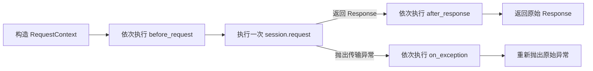

当前协议的边界可以直接概括为：

| 能力 | 是否适合当前 Middleware | 原因 |
| --- | --- | --- |
| 请求日志 | 适合 | 服务一次 attempt 的观测 |
| 脱敏日志副本 | 适合 | 服务一次 attempt 的安全输出 |
| 请求级 header 注入 | 适合 | 在发送前补充本次 kwargs |
| 媒体资源发现 | 适合 | 观察本次 POST payload |
| trace attempt 标签 | 适合 | 生命周期为一次 attempt |
| 自动重试循环 | 不适合 | 拥有多个 attempt 和时间预算 |
| 异步任务轮询 | 不适合 | 拥有多次逻辑查询和业务状态 |
| 测试链路变量 | 不适合 | 生命周期为完整 test case |

当前实现并非通用插件平台，也不是可包裹 transport 的洋葱模型。它是一条显式列表驱动的通知管道，优先保证调用兼容、顺序可预测和离线可测。

## 1. 两小时学习结构

| 阶段 | 时间 | 学习内容 |
| --- | ---: | --- |
| 初版观察 | 0～20 分钟 | `request` 与 `_request_without_attach` 的重复 |
| 变化轴分析 | 20～35 分钟 | 传输、观测、安全和资源处理 |
| Context 推导 | 35～55 分钟 | attempt 状态所有者和隔离 |
| Middleware 协议 | 55～80 分钟 | 三个 hook 的精确语义 |
| 默认实现与顺序 | 80～95 分钟 | Media、Redaction、Logging |
| 边界与替代方案 | 95～110 分钟 | 条件分支、装饰器、事件总线、显式列表 |
| 最小实验 | 110～118 分钟 | 上下文隔离和顺序验证 |
| 结论复盘 | 118～120 分钟 | 完整职责边界 |

本节只讨论单次 HTTP attempt。重试和轮询只用于说明边界，不展开其内部算法。

## 2. 观察初版请求主流程

初版证据来自提交 `56f4f15`：

```powershell
git show 56f4f15:common/base_request.py
```

初版 `request()` 同时完成：

1. 提取内部 `_attach_log` 参数。
2. 构造 URL。
3. 填充 timeout。
4. 合并 session 与请求级 headers。
5. 对 POST 启动媒体资源下载。
6. 创建 `ApiCallLogger`。
7. 调用 `session.request()`。
8. 在成功或异常时挂载日志。

演进前：`56f4f15`，`common/base_request.py`

```python
def request(self, method: str, path: str, **kwargs: Any) -> requests.Response:
    attach_log = kwargs.pop("_attach_log", True)
    url = self._build_url(path)
    kwargs.setdefault("timeout", self.config.timeout)

    headers = kwargs.pop("headers", None)
    if headers:
        kwargs["headers"] = self._merge_headers(headers)

    if method.upper() == "POST":
        start_media_downloads(kwargs.get("json"))

    logger = ApiCallLogger(method, url, kwargs)
    try:
        response = self.session.request(
            method=method,
            url=url,
            **kwargs,
        )
    except Exception as error:
        if attach_log:
            logger.attach_failure(error)
        raise

    if attach_log:
        logger.attach_success(response)
    return response
```

代码直接证明 `request()` 同时拥有传输参数、资源发现、logger 生命周期和异常日志时机。它们在初期共享一个顺序清晰的控制流是合理的；当日志、安全和资源规则开始独立变化时，同一个函数才成为修改约束。边界问题来自变化绑定，而不是方法行数。

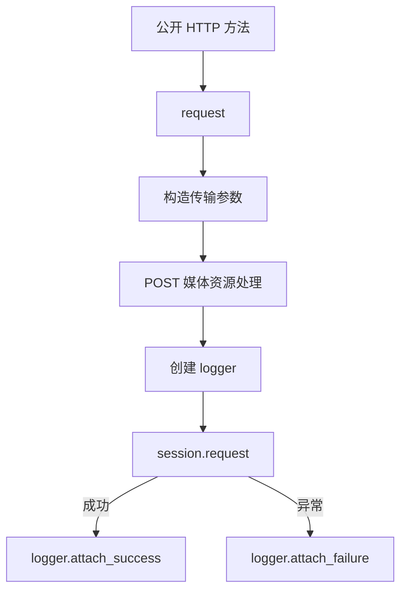

### 2.1 初版的变化轴

| 初版代码 | 主要变化轴 | 典型变化原因 |
| --- | --- | --- |
| URL、timeout、headers | HTTP 传输 | 环境和请求协议变化 |
| `start_media_downloads` | 资源收集 | 新增媒体类型和附件要求 |
| `ApiCallLogger` | 报告观测 | Allure 格式、cURL、响应展示变化 |
| `_attach_log` | 流式兼容 | SSE 不能提前消费 response body |
| 异常分支 | 证据保留 | 错误格式、脱敏和原异常要求 |

这些行为都发生在一次请求附近，但变化原因相互独立。继续直接写入 `request()` 会让任何横切能力都必须修改传输核心。

### 2.2 重复不是根因，变化绑定才是根因

初版 `_request_without_attach()` 又实现了一次 URL、timeout、headers、logger、发送和异常日志。它服务于轮询的特殊日志语义：中间查询不自动挂载日志，只在最终结论处记录。

演进前：`56f4f15`，`common/base_request.py`

```python
def _request_without_attach(
    self,
    method: str,
    path: str,
    *,
    step_name: str = API_REQUEST_STEP_NAME,
    response_step_name: str | None = None,
    **kwargs: Any,
) -> tuple[requests.Response, ApiCallLogger]:
    url = self._build_url(path)
    request_kwargs = dict(kwargs)
    request_kwargs.setdefault("timeout", self.config.timeout)

    headers = request_kwargs.pop("headers", None)
    if headers:
        request_kwargs["headers"] = self._merge_headers(headers)

    logger_kwargs: dict[str, Any] = {"step_name": step_name}
    if response_step_name is not None:
        logger_kwargs["response_step_name"] = response_step_name

    logger = ApiCallLogger(
        method,
        url,
        request_kwargs,
        **logger_kwargs,
    )
    try:
        response = self.session.request(
            method=method,
            url=url,
            **request_kwargs,
        )
    except Exception as error:
        logger.attach_failure(error)
        raise

    return response, logger
```

与 `request()` 对照可见，两段代码的 URL、timeout、headers、logger 和 transport 骨架几乎一致，差异只在成功日志由谁决定。观测时机的变化迫使传输骨架复制，说明缺少的是一次发送生命周期的统一入口，而不是简单缺少一个日志开关。

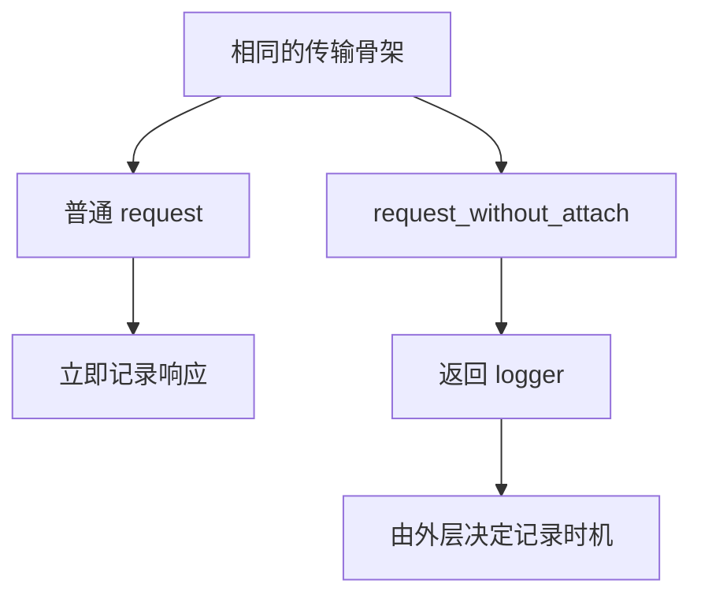

真正的约束是：为了改变观测时机，框架复制了传输流程。日志和 HTTP 发送没有独立变化边界。

## 3. 第一次演进如何切开请求主流程

Middleware 在提交 `291e6ea` 中进入代码：

```powershell
git diff 56f4f15 291e6ea -- common/base_request.py common/request_context.py common/request_middleware.py
```

改造后的主流程变为：

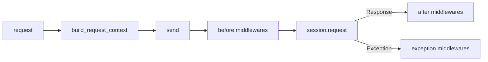

`BaseRequest.request()` 不再直接知道 logger、脱敏和媒体资源处理的具体实现。它只负责解析框架控制参数、建立上下文并选择发送方式。

演进后之一：`291e6ea`，`common/base_request.py`

```python
def request(self, method: str, path: str, **kwargs: Any) -> requests.Response:
    attach_log = kwargs.pop("_attach_log", True)
    retry_policy = kwargs.pop("retry_policy", None)
    if retry_policy is not None:
        return self._send_with_retry(
            method,
            path,
            retry_policy,
            attach_log=attach_log,
            **kwargs,
        )

    context = self._build_request_context(
        method,
        path,
        attach_log=attach_log,
        **kwargs,
    )
    return self._send(context)
```

演进后二：`291e6ea`，`common/base_request.py`

```python
def _build_request_context(
    self,
    method: str,
    path: str,
    *,
    attach_log: bool = True,
    request_step_name: str = API_REQUEST_STEP_NAME,
    response_step_name: str = API_RESPONSE_STEP_NAME,
    **kwargs: Any,
) -> RequestContext:
    url = self._build_url(path)
    request_kwargs = self._copy_request_kwargs(kwargs)
    request_kwargs.setdefault("timeout", self.config.timeout)

    headers = request_kwargs.pop("headers", None)
    if headers:
        request_kwargs["headers"] = self._merge_headers(headers)

    return RequestContext(
        method=method.upper(),
        path=path,
        url=url,
        kwargs=request_kwargs,
        attach_log=attach_log,
        request_step_name=request_step_name,
        response_step_name=response_step_name,
    )


def _send(self, context: RequestContext) -> requests.Response:
    self._run_before_middlewares(context)

    try:
        response = self.session.request(
            method=context.method,
            url=context.url,
            **context.kwargs,
        )
    except Exception as error:
        self._run_exception_middlewares(context, error)
        raise

    self._run_after_middlewares(context, response)
    return response
```

前后代码显示职责发生了真实移动：请求构造产生独立 Context；`_send()` 只描述一个 attempt 的 before、transport、exception 和 after；具体横切行为不再出现在 transport 主函数。`_send_with_retry()` 位于 `_send()` 外层也证明 Middleware 被重复执行于每个 attempt，而不拥有 attempt 序列。

这次演进保护三个不变量：现有公开调用保持兼容；每个 attempt 拥有自己的 Context；transport 异常经过通知后仍由裸 `raise` 重新抛出原对象。

这里保留了 `get/post/put/patch/delete` 的公开调用方式，迁移发生在内部管道，不要求业务模块整体重写。

## 4. RequestContext 是一次 attempt 的状态所有者

演进后：`291e6ea`，`common/request_context.py`。当前 dev2 保持相同字段结构：

```python
@dataclass
class RequestContext:
    method: str
    path: str
    url: str
    kwargs: dict[str, Any]
    attach_log: bool = True
    request_step_name: str = API_REQUEST_STEP_NAME
    response_step_name: str = API_RESPONSE_STEP_NAME
    attributes: dict[str, Any] = field(default_factory=dict)
```

### 4.1 字段职责

| 字段 | 所有状态 | 生命周期 |
| --- | --- | --- |
| `method` | 规范化后的 HTTP 方法 | 一次 attempt |
| `path` | 调用方的业务路径 | 一次 attempt |
| `url` | 最终请求地址 | 一次 attempt |
| `kwargs` | 本次 transport 输入 | 一次 attempt |
| `attach_log` | 本次自动日志策略 | 一次 attempt |
| step names | 本次 Allure 展示语义 | 一次 attempt |
| `attributes` | Middleware 协作状态 | 一次 attempt |

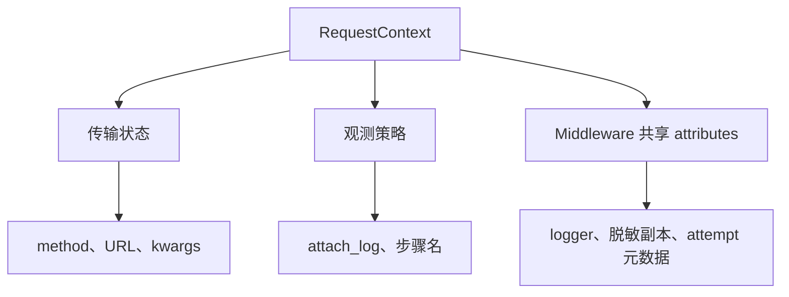

### 4.2 Context 与 BaseRequest 的状态边界

`BaseRequest` 持有可跨多次请求复用的客户端状态：

- `requests.Session`
- 默认 headers
- 配置快照
- Middleware 注册列表
- RetryExecutor

`RequestContext` 持有只服务一次 attempt 的状态。

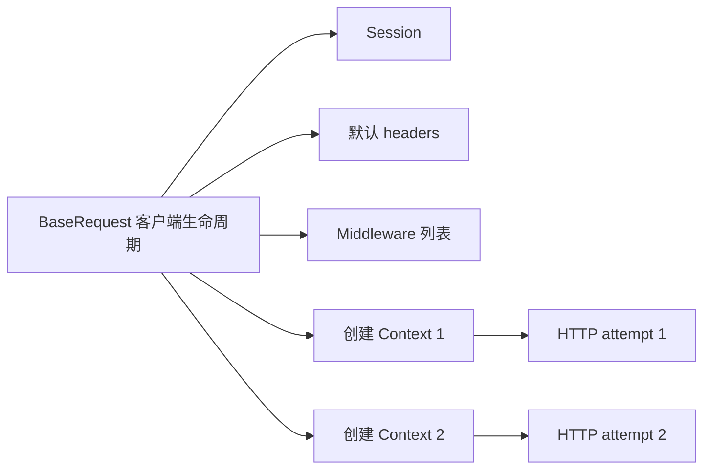

把 `attributes` 放进 `BaseRequest` 会使并发请求和后续请求共享 logger、脱敏副本等短期状态，因此必须由 Context 持有。

### 4.3 请求参数复制

`_build_request_context()` 调用 `_copy_request_kwargs()`，逐字段尝试 `deepcopy`：

当前代码：`dev2`，`common/base_request.py`

```python
@staticmethod
def _copy_request_kwargs(
    kwargs: dict[str, Any],
) -> dict[str, Any]:
    copied_kwargs: dict[str, Any] = {}
    for name, value in kwargs.items():
        try:
            copied_kwargs[name] = deepcopy(value)
        except Exception:
            copied_kwargs[name] = value
    return copied_kwargs
```

作用是隔离嵌套 payload：Middleware 即使修改 `context.kwargs["json"]`，调用方原始字典也不会被同步修改。

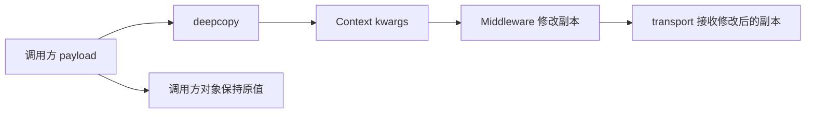

这是隔离而不是只读。Middleware 仍然可以有意修改 Context 中的真实发送参数，例如增加 header。

当前复制具有明确限制：某个值无法 `deepcopy` 时会回退到原引用。此时该字段不再具备完全隔离保证。文件对象、生成器和带特殊锁的对象应被视为调用方与 Context 共享状态，不应让普通 Middleware 原地修改。

### 4.4 Headers 的真实行为

当调用方传入非空请求级 headers 时，框架会先与 session headers 合并，再放入 `context.kwargs`。未传 headers 或传空字典时，`context.kwargs` 中不一定存在 headers，`requests.Session` 会在准备请求时应用默认 headers。

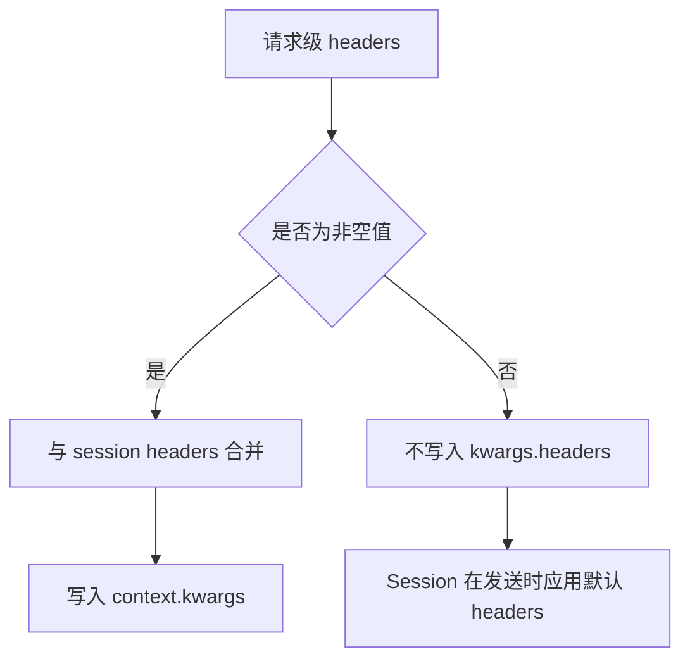

因此发送前 Middleware 读取 `context.kwargs["headers"]` 时，不能假设其中一定包含 session 默认 Authorization。需要完整 prepared request 的能力必须考虑 transport 准备阶段，而不能仅依赖 Context 当前 kwargs。

## 5. Middleware 协议的精确语义

协议使用 `typing.Protocol`：

演进后：`291e6ea`，`common/request_middleware.py`。当前 dev2 保持相同协议：

```python
class RequestMiddleware(Protocol):
    def before_request(self, context: RequestContext) -> None:
        ...

    def after_response(
        self,
        context: RequestContext,
        response: requests.Response,
    ) -> None:
        ...

    def on_exception(
        self,
        context: RequestContext,
        error: BaseException,
    ) -> None:
        ...
```

这里的省略号是 Protocol 抽象方法的真实函数体，不是课程隐藏的控制流。三个方法都返回 `None`，协议没有 `next()`、retry decision 或 response replacement 返回值。这一签名本身限定了 Middleware 是通知与就地补充机制，不能凭空拥有多次发送控制权。

它表达结构化类型约束，不要求实现类继承共同基类。当前没有 `runtime_checkable`，注册时也不做运行时完整性验证。缺少方法会在对应生命周期真正执行时暴露。

### 5.1 `before_request`

执行位置在 transport 之前，适合：

- 检查本次请求状态。
- 给 `context.kwargs` 增加请求级参数。
- 在 `attributes` 创建后续 hook 需要的对象。
- 从 payload 启动独立资源处理。
- 生成安全观测副本。

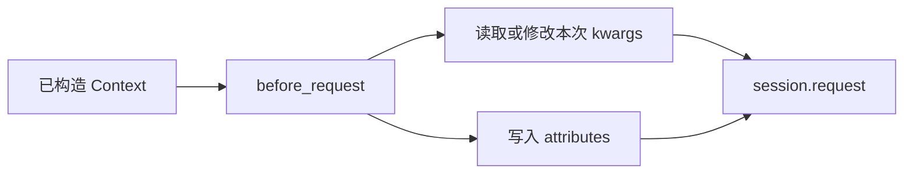

如果某个 `before_request` 抛异常：

- 当前 hook 被包装为带 Middleware 类名的 `RuntimeError`。
- 后续 Middleware 不再执行。
- transport 不会执行。
- `on_exception` 不会执行，因为 `_run_before_middlewares()` 位于 `_send()` 的 transport `try` 之外。

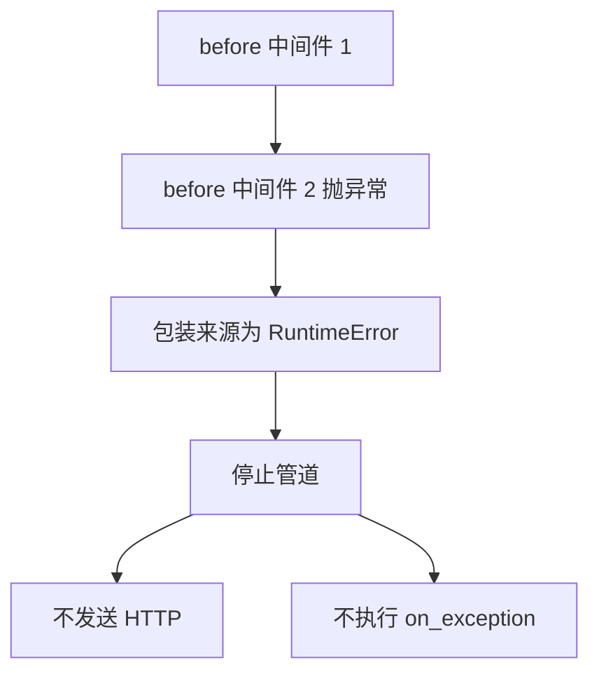

这意味着 `on_exception` 的语义是传输异常通知，不是所有管道异常的 finally hook。

当前代码：`dev2`，`common/base_request.py`

```python
def _send(self, context: RequestContext) -> requests.Response:
    self._run_before_middlewares(context)

    try:
        response = self.session.request(
            method=context.method,
            url=context.url,
            **context.kwargs,
        )
    except Exception as error:
        self._run_exception_middlewares(context, error)
        raise

    self._run_after_middlewares(context, response)
    return response


def _run_before_middlewares(self, context: RequestContext) -> None:
    for middleware in self.middlewares:
        try:
            middleware.before_request(context)
        except Exception as error:
            raise RuntimeError(
                "Request middleware "
                f"{type(middleware).__name__} "
                "failed in before_request"
            ) from error
```

`_run_before_middlewares()` 位于 `try` 之外是决定性证据：before 失败不会进入 transport 的 exception 分支。循环在异常处直接退出，所以后续 before hook 不会运行。这个行为不是从 Middleware 名称推导出来的，而是 Python 控制流的直接结果。

### 5.2 `after_response`

`requests` 返回任意 `Response` 后执行，包括 2xx、4xx 和 5xx。因为框架没有在 transport 后自动调用 `raise_for_status()`，HTTP 错误状态仍属于正常 response 路径。

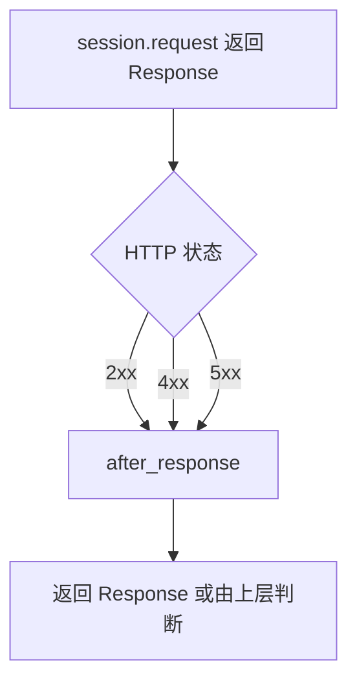

`after_response` 适合记录响应和提取观测数据，不应把某个业务 HTTP 状态统一改写成成功或失败结论。

如果 `after_response` 抛异常：

- 异常被包装为带 Middleware 类名的 `RuntimeError`。
- 后续 after hook 停止执行。
- 已经收到的 response 不会返回给调用方。
- `on_exception` 不会执行。

因此 after Middleware 必须尽量小、可预测。观测失败阻断业务响应是当前协议的明确代价。

当前代码：`dev2`，`common/base_request.py`

```python
def _run_after_middlewares(
    self,
    context: RequestContext,
    response: requests.Response,
) -> None:
    for middleware in self.middlewares:
        try:
            middleware.after_response(context, response)
        except Exception as error:
            raise RuntimeError(
                "Request middleware "
                f"{type(middleware).__name__} "
                "failed in after_response"
            ) from error
```

代码没有 `reversed(self.middlewares)`，也没有捕获后继续。因此 after 按列表正序执行，任一 hook 失败都会停止后续 hook，并使 `_send()` 无法执行 `return response`。这是当前通知模型的收益与代价，不是通用 Middleware 模式的必然语义。

### 5.3 `on_exception`

只有 `session.request()` 抛异常时执行，例如 Timeout 或 ConnectionError。

所有 `on_exception` 按注册顺序继续执行。某个异常 hook 自己失败时，框架不会用它覆盖原始网络异常，而是：

1. 创建描述来源的 `RuntimeError`。
2. 保存到 `context.attributes["middleware_exception_errors"]`。
3. 使用 `request_error.add_note()` 给原异常附加说明。
4. 最终重新抛出同一个原始请求异常对象。

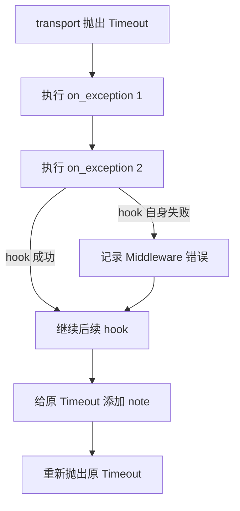

这个设计保护了最重要的诊断事实：真实网络错误不会被日志或观测错误替换。

当前代码：`dev2`，`common/base_request.py`

```python
def _run_exception_middlewares(
    self,
    context: RequestContext,
    request_error: BaseException,
) -> None:
    middleware_errors: list[RuntimeError] = []
    for middleware in self.middlewares:
        try:
            middleware.on_exception(context, request_error)
        except Exception as error:
            middleware_errors.append(
                RuntimeError(
                    "Request middleware "
                    f"{type(middleware).__name__} "
                    "failed in on_exception"
                )
            )
            middleware_errors[-1].__cause__ = error

    if middleware_errors:
        context.attributes["middleware_exception_errors"] = (
            middleware_errors
        )
        for middleware_error in middleware_errors:
            request_error.add_note(str(middleware_error))
```

exception hook 的循环与 before/after 不同：它收集错误后继续，最后把附属失败写入当前 Context 并给原请求异常添加 note。结合 `_send()` exception 分支末尾的裸 `raise`，可以证明调用方得到的仍是同一个 transport 异常对象，而不是 Middleware 的 RuntimeError。

## 6. 当前顺序不是洋葱模型

三个 hook 都按注册顺序执行。注册 `[one, two]` 时，成功路径为：

顺序证据就是 5.1、5.2、5.3 三个 `_run_*_middlewares()` 中相同的 `for middleware in self.middlewares`。before、after 和 exception 都没有逆序，也没有把下游调用作为参数交给 Middleware。

```text
one.before
two.before
send
one.after
two.after
```

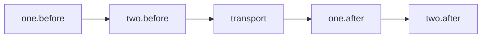

洋葱模型通常会在返回路径逆序执行：`two.after → one.after`。当前实现没有采用这种语义，因为 Middleware 不包裹 `next()`，只是接收三个通知 hook。

| 模型 | before 顺序 | after 顺序 | 能否控制下游调用 |
| --- | --- | --- | --- |
| 当前通知管道 | 正序 | 正序 | 不能 |
| 洋葱模型 | 正序 | 逆序 | 可以包裹 next |

当前方案理解和测试成本较低，但无法自然表达事务式资源打开与反向关闭。如果未来出现这种真实需求，协议需要升级，而不是在现有 after 顺序上做隐式假设。

## 7. 默认 Middleware 与顺序依赖

默认列表：

当前代码：`dev2`，`common/request_middleware.py`

```python
class RedactionMiddleware:
    REDACTED_KWARGS_ATTR = "redacted_kwargs"

    def before_request(self, context: RequestContext) -> None:
        context.attributes[self.REDACTED_KWARGS_ATTR] = (
            redact_request_kwargs(context.kwargs)
        )

    def after_response(
        self,
        context: RequestContext,
        response: requests.Response,
    ) -> None:
        return None

    def on_exception(
        self,
        context: RequestContext,
        error: BaseException,
    ) -> None:
        return None


class LoggingMiddleware:
    LOGGER_ATTR = "api_call_logger"

    def before_request(self, context: RequestContext) -> None:
        logger_kwargs = context.attributes.get(
            RedactionMiddleware.REDACTED_KWARGS_ATTR,
            context.kwargs,
        )
        context.attributes[self.LOGGER_ATTR] = ApiCallLogger(
            context.method,
            context.url,
            logger_kwargs,
            step_name=context.request_step_name,
            response_step_name=context.response_step_name,
        )

    def after_response(
        self,
        context: RequestContext,
        response: requests.Response,
    ) -> None:
        if not context.attach_log:
            return
        self.get_logger(context).attach_success(response)

    def on_exception(
        self,
        context: RequestContext,
        error: BaseException,
    ) -> None:
        if not context.attach_log:
            return
        self.get_logger(context).attach_failure(error)


class MediaResourceMiddleware:
    def before_request(self, context: RequestContext) -> None:
        if context.method == "POST":
            start_media_downloads(context.kwargs.get("json"))


def default_request_middlewares() -> list[RequestMiddleware]:
    return [
        MediaResourceMiddleware(),
        RedactionMiddleware(),
        LoggingMiddleware(),
    ]
```

为聚焦前置行为，片段没有重复 `MediaResourceMiddleware` 的两个空后置 hook，也没有重复 logger getter；所有影响顺序、数据依赖和 attach 策略的控制流均已保留。代码证明 Redaction 先写 `redacted_kwargs`，Logging 后读该属性；若顺序交换，`.get(..., context.kwargs)` 会回退到真实请求参数。这是隐式顺序依赖，也是当前方案的明确限制。


### 7.1 MediaResourceMiddleware

它只在 POST 时读取 `context.kwargs.get("json")` 并调用 `start_media_downloads()`。它不决定响应结果，也不改变控制流。

生命周期为单次请求前置观察，因此适合当前 Middleware。

### 7.2 RedactionMiddleware

它读取真实 `context.kwargs`，生成脱敏副本并写入：

```text
context.attributes["redacted_kwargs"]
```

它不修改真实 transport 输入。完整的数据流为：

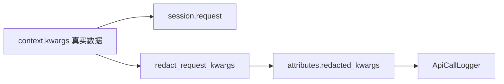

脱敏属于安全观测，不能原地修改真实请求。

### 7.3 LoggingMiddleware

`before_request` 优先读取 `redacted_kwargs`，不存在时才使用真实 `context.kwargs`，然后创建 logger 放入 attributes。

`after_response` 和 `on_exception` 根据 `attach_log` 决定是否自动挂载附件。

顺序约束非常明确：Redaction 必须在 Logging 之前执行，否则 logger 构造时会接收未脱敏 kwargs。

### 7.4 `_attach_log=False` 的准确语义

它不禁用 LoggingMiddleware，也不跳过其他 Middleware。LoggingMiddleware 仍在 before 阶段创建 logger，只是 after 和 exception 阶段不自动 attach。

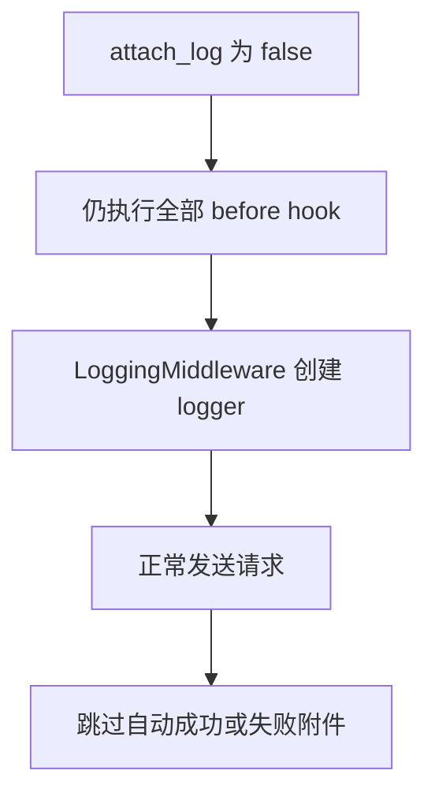

这支持两类场景：

- SSE 请求避免 logger 读取 `response.text` 导致流被提前消费。
- polling 内部请求延迟到最终结论再手动挂载最后响应。

`attach_log` 不是全局日志开关，而是单次 attempt 的自动附件策略。

### 7.5 贯穿课程的数据流思维导图：从 Settings 到一次 attempt

本图承接第 2 天，只展示请求级 headers 非空、无 retry、默认 Middleware、transport 成功时的真实函数调用。分支和异常语义见后文。

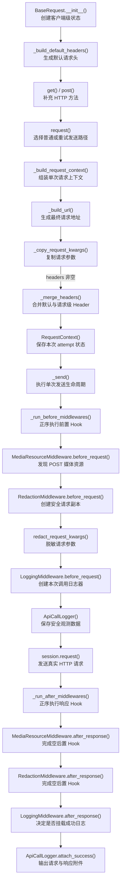

图中最重要的不是 hook 顺序，而是三类数据不能合并：

| 数据状态 | 内容 | 谁可以修改 | 谁消费 | 为什么必须独立 |
| --- | --- | --- | --- | --- |
| 调用方输入 | 原始 payload、headers、timeout | 调用方 | `_build_request_context()` | Middleware 不应反向污染用例对象 |
| attempt 真值 | 真正准备发送的 method、URL、kwargs | before hook 可就地补充 | `session.request()` | 必须保留真实凭据和真实业务数据才能正确发送 |
| 安全副本 | 对 kwargs 复制并脱敏后的结构 | RedactionMiddleware 创建，后续只读 | LoggingMiddleware | 不能把 `<redacted>` 写回真实请求，也不能让真实秘密进入报告 |
| 协作状态 | logger 等本次 attempt 对象 | Middleware 通过 attributes 写入 | 当前 attempt 的后续 hook | 不能进入 Middleware 实例字段造成并发串扰 |
| transport 结果 | Response 或原始网络异常 | transport 创建 | after/on_exception 与上层 | HTTP 4xx/5xx 是 Response，不等同于 Python 异常 |

#### 与真实代码对应时必须保留的四个细节

1. `_copy_request_kwargs()` 是“尽力深拷贝”，某个值无法 `deepcopy` 时会保留原引用，因此不是绝对隔离承诺。
2. 调用方显式提供的 timeout 通过 `setdefault()` 保留；只有未提供时才使用 `Settings.timeout`。
3. 只有非空请求级 headers 才会在 Context 构造阶段与 Session headers 合并。未传或传空字典时，Context 不一定含 Authorization；requests 在 PreparedRequest 阶段应用 Session headers。
4. `RedactionMiddleware` 创建旁路安全副本。`session.request()` 始终消费 `context.kwargs`，不会消费 `attributes.redacted_kwargs`。

#### 第 4 天的唯一接续点

第 4 天从日志函数继续，不重新解释 Context 构造：

```text
context.kwargs
  → session.request() → Response

redacted_kwargs + PreparedRequest / Response
  → ApiCallLogger
  → Allure 安全附件
```

下一节要解决的问题是：为什么日志既要参考最终 PreparedRequest 和 Response，又不能直接输出其中的秘密；以及脱敏副本为什么只能进入观测流，不能返回真实发送流。

## 8. Middleware 能修改什么

当前协议把可变 `RequestContext` 交给 `before_request`，因此 Middleware 有能力修改真实发送参数。

适合的修改包括：

- 设置本次请求的 trace header。
- 增加稳定的客户端标识。
- 根据本次 path 选择请求级 timeout。
- 添加只服务本次请求的认证信息。

不适合的修改包括：

- 把敏感值原地替换成 `<redacted>`。
- 把 response 业务状态写成全局客户端状态。
- 在 hook 内循环调用 transport 完成重试。
- 把 test case 的 task ID 保存到 Middleware 实例共享字段。

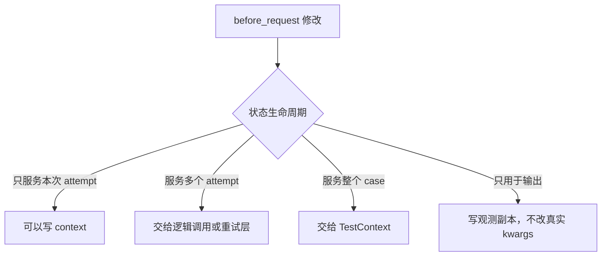

## 9. 四类需求的直接归属

### 9.1 请求级认证头注入

如果认证信息已由配置提供，只需在单次请求发送前写入 header，适合 Middleware 或现有默认 header 构造。

如果认证 token 会过期并需要刷新，状态包括 token 缓存、过期时间、刷新锁和失败恢复，生命周期超过单次 attempt。此时 Middleware 可以作为注入入口，但 token 所有权应属于独立认证组件。

### 9.2 Trace

一次 attempt 的 ID 适合 Middleware 创建并写入 Context。跨重试保持不变的逻辑 trace ID 不属于单个 attempt，需要由重试外层创建，再传给每次 Context。

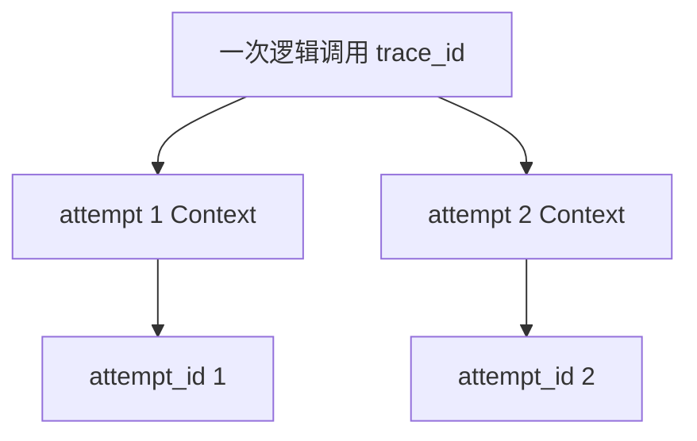

因此 trace 不能只凭名称决定全部放入 Middleware，必须先区分两种生命周期。

### 9.3 重试

重试拥有 attempt 次数、退避、总预算和累计记录，并多次调用 `_send(context)`。当前 hook 没有 `next`、decision 或 response replacement 返回值，不能正确拥有这段控制流。

Middleware 可以观察每个 attempt，但重试编排必须在外层执行器中。

当前代码：`dev2`，`common/base_request.py`

```python
def _send_with_retry(
    self,
    method: str,
    path: str,
    retry_policy: RetryPolicy,
    *,
    attach_log: bool = True,
    request_step_name: str = API_REQUEST_STEP_NAME,
    response_step_name: str = API_RESPONSE_STEP_NAME,
    context_recorder: list[RequestContext] | None = None,
    **kwargs: Any,
) -> requests.Response:
    first_context = self._build_request_context(
        method,
        path,
        attach_log=attach_log,
        request_step_name=request_step_name,
        response_step_name=response_step_name,
        **kwargs,
    )

    def context_factory(attempt_index: int) -> RequestContext:
        context = self._build_request_context(
            method,
            path,
            attach_log=attach_log,
            request_step_name=request_step_name,
            response_step_name=response_step_name,
            **kwargs,
        )
        context.attributes["attempt_index"] = attempt_index
        context.attributes["max_attempts"] = retry_policy.max_attempts
        return context

    return self.retry_executor.execute(
        method=first_context.method,
        request_kwargs=self._kwargs_with_session_headers(
            first_context.kwargs
        ),
        policy=retry_policy,
        context_factory=context_factory,
        send_once=self._send,
        attach_records=self._attach_retry_records,
        context_recorder=context_recorder,
    )
```

`RetryExecutor` 接收 `context_factory` 与 `send_once=self._send`，因此外层 executor 决定何时创建和发送下一个 attempt；每次 `_send()` 才执行一轮 Middleware。attempt index 属于重试序列，但被复制到本次 Context 供观测使用，这不等于 Middleware 拥有它。

### 9.4 轮询

轮询拥有业务 deadline、远端状态迁移、最后响应和最终业务结论。一次查询内部可以执行 Middleware，但 Middleware 不拥有整个任务状态。

当前代码：`dev2`，`common/base_request.py`

```python
def _poll_get_with_policy(
    self,
    path: str,
    *,
    poll_interval: float,
    timeout: float,
    polling_policy: PollingPolicy,
    retry_policy: RetryPolicy | None = None,
    **kwargs: Any,
) -> requests.Response:
    deadline = time.monotonic() + timeout
    started_at = time.monotonic()
    transitions: list[PollingTransition] = []
    last_response: requests.Response | None = None
    last_status: Any = None
    last_logger: ApiCallLogger | None = None
    attempt_index = 0

    while True:
        attempt_index += 1
        last_response, last_logger = self._request_without_attach(
            "GET",
            path,
            step_name=POLL_GET_REQUEST_STEP_NAME,
            response_step_name=POLL_GET_RESPONSE_STEP_NAME,
            retry_policy=retry_policy,
            **kwargs,
        )
        try:
            evaluation = evaluate_polling_response(
                last_response,
                polling_policy,
            )
        except Exception:
            last_logger.attach_success(last_response)
            raise

        last_status = evaluation.raw_status
        transitions.append(
            PollingTransition(
                attempt_index=attempt_index,
                elapsed_seconds=round(
                    time.monotonic() - started_at,
                    3,
                ),
                state=evaluation.state,
                raw_status=evaluation.raw_status,
                response_status_code=last_response.status_code,
            )
        )

        if evaluation.state is PollingState.SUCCESS:
            self._attach_polling_transitions(last_logger, transitions)
            last_logger.attach_success(last_response)
            return last_response

        if evaluation.state is PollingState.FAILURE:
            self._attach_polling_transitions(last_logger, transitions)
            last_logger.attach_success(last_response)
            raise PollingFailedError(
                path=path,
                last_status=last_status,
                last_response=last_response,
                transitions=transitions,
                error_value=evaluation.error_value,
            )

        if evaluation.state is PollingState.UNKNOWN:
            self._attach_polling_transitions(last_logger, transitions)
            last_logger.attach_success(last_response)
            raise PollingUnknownStateError(
                path=path,
                last_status=last_status,
                last_response=last_response,
                transitions=transitions,
            )

        remaining = deadline - time.monotonic()
        if remaining <= 0:
            self._attach_polling_transitions(last_logger, transitions)
            last_logger.attach_success(last_response)
            raise PollingTimeoutError(
                path=path,
                timeout=timeout,
                last_status=last_status,
                last_response=last_response,
                transitions=transitions,
            )
        time.sleep(min(poll_interval, remaining))
```

代码证明 polling 方法持有 deadline、started_at、transitions 和 last response，并在循环中重复调用 `_request_without_attach()`；每次内部请求才进入一次或多次 attempt 的 Middleware 生命周期。业务状态的成功、失败、未知和超时终点都由 polling 外层决定，不由任何 hook 决定。

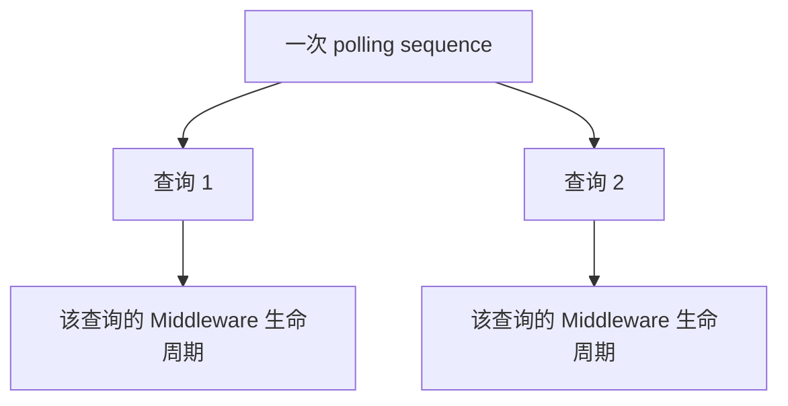

## 10. 中间件错误策略

| 失败位置 | transport 是否执行 | 后续同类 hook | 原始错误处理 |
| --- | --- | --- | --- |
| `before_request` | 否 | 停止 | 包装为带来源的 RuntimeError |
| `session.request` | 已执行并失败 | 所有 exception hook 尽量继续 | 保留并重抛原异常 |
| `on_exception` 自身 | transport 已失败 | 继续 | 作为 note 附加到原异常 |
| `after_response` | 已收到响应 | 停止 | 包装为带来源的 RuntimeError |

```mermaid
flowchart TD
    A["管道失败"] --> B{"失败阶段"}
    B -->|"before"| C["阻止发送并报告 Middleware 来源"]
    B -->|"transport"| D["运行 exception hook 并保留原异常"]
    B -->|"exception hook"| E["附加 note，不覆盖 transport 异常"]
    B -->|"after"| F["响应不返回，报告 Middleware 来源"]
```

当前策略优先保证 transport 异常证据，但没有做到观测 Middleware 永不影响业务结果。after hook 失败仍会阻断 response。这是简单同步协议的现实代价。

## 11. 变化轴

| 变化内容 | 变化原因 | 变化频率 | 独立性 |
| --- | --- | --- | --- |
| URL 和 headers 构造 | 服务协议与环境 | 中 | 独立于日志格式 |
| Middleware 注册顺序 | 横切依赖 | 低到中 | 独立于 transport 实现 |
| 日志附件结构 | 报告需求 | 中 | 独立于请求发送 |
| 脱敏字段集合 | 安全规则 | 中 | 独立于媒体资源发现 |
| 媒体 payload 识别 | 业务媒体类型 | 中 | 独立于 logger |
| SSE 自动附件策略 | 流式协议 | 低 | 依赖 logger 是否消费 body |
| 异常保留策略 | 诊断要求 | 低 | 横跨 transport 与观测 |
| Context 复制策略 | 隔离与性能 | 低 | 独立于具体 Middleware |

```mermaid
flowchart TD
    A["单次请求生命周期"] --> B["传输变化"]
    A --> C["观测变化"]
    A --> D["安全变化"]
    A --> E["前置资源变化"]
    B --> F["BaseRequest 与 Context 构造"]
    C --> G["LoggingMiddleware"]
    D --> H["RedactionMiddleware"]
    E --> I["MediaResourceMiddleware"]
```

## 12. 状态所有者

| 状态 | 创建者 | 修改者 | 结束或清理者 | 生命周期 |
| --- | --- | --- | --- | --- |
| Middleware 列表 | `BaseRequest.__init__` | 客户端构造方 | 客户端结束 | 客户端 |
| URL、method、kwargs | `_build_request_context` | before hook | attempt 结束 | attempt |
| `attributes` | RequestContext default factory | 各 Middleware | attempt 结束 | attempt |
| redacted kwargs | RedactionMiddleware | 不应再修改 | attempt 结束 | attempt |
| logger | LoggingMiddleware | logger 自身记录 | attempt 结束或外层手动使用后 | attempt |
| response | transport | 不由当前 Middleware 替换 | 调用方处理 | attempt 结果 |
| transport exception | requests | exception hook 只观察 | 抛给调用方 | attempt 结果 |
| session headers | BaseRequest | 客户端公开方法 | reset 或 close | 客户端 |

```mermaid
flowchart LR
    A["客户端级状态"] --> B["Middleware 列表"]
    A --> C["Session 和默认 headers"]
    D["attempt 级状态"] --> E["RequestContext"]
    E --> F["kwargs"]
    E --> G["attributes"]
    G --> H["logger 和安全副本"]
```

Middleware 实例本身由客户端复用，因此不应把每次请求的可变状态写入实例字段。并发安全的短期状态必须放入 Context。

## 13. 不变量与职责边界

### 13.1 必须保持的不变量

1. 每次 attempt 创建独立 RequestContext。
2. 每个 Context 拥有独立 attributes 字典。
3. 嵌套请求数据尽量与调用方对象隔离。
4. Middleware 顺序显式且可预测。
5. 脱敏副本不得替换真实发送数据。
6. 原始 transport 异常不得被 exception hook 覆盖。
7. `_attach_log=False` 不得阻止请求发送和其他 Middleware。
8. SSE 响应不得因自动日志提前消费。
9. HTTP 4xx 和 5xx 仍作为 response 进入 after hook。
10. 跨 attempt 和跨 case 状态不得进入 Middleware 实例字段。

### 13.2 边界推导

```mermaid
flowchart TD
    A["attempt 状态不能串扰"] --> B["独立 RequestContext"]
    C["横切能力独立变化"] --> D["显式 Middleware 列表"]
    E["安全输出不改请求"] --> F["真实 kwargs 与安全副本分离"]
    G["网络错误证据优先"] --> H["保留原 transport 异常"]
    I["跨 attempt 状态独立"] --> J["重试和轮询留在外层"]
```

## 14. 四种方案比较

### 14.1 在 `request()` 中持续增加条件分支

收益：调用直接、初期代码少、无需额外协议。

代价：每个横切能力修改核心发送函数；组合测试增长；普通请求和特殊请求容易再次复制。

适合只有一两个稳定行为的初期阶段。

### 14.2 使用函数装饰器层层包装

收益：单个能力可以从函数体移出；装饰器语法简洁。

代价：实例状态、动态顺序和参数传递较复杂；异常经过多层闭包；对 `get/post/poll_get` 的覆盖容易不一致。

适合静态、独立、与实例状态关系较弱的单一行为。

### 14.3 事件总线或动态插件注册中心

收益：扩展发现和注册灵活；生产者与消费者弱引用。

代价：执行顺序、失败传播和依赖关系更隐式；调试困难；第一版业务规模不足以抵消平台成本。

适合插件数量多、团队边界明确、确有动态加载需求的阶段。

### 14.4 显式 Middleware 列表

收益：顺序可见；构造时可注入；列表为空可完全禁用；Context 统一承载状态；测试无需动态注册环境。

代价：协议能力有限；顺序依赖由开发者维护；没有依赖声明；after 不是逆序；Middleware 错误可能阻断响应。

这是当前方案。

### 14.5 决策表

| 维度 | request 条件分支 | 装饰器 | 事件或插件总线 | 显式 Middleware 列表 |
| --- | --- | --- | --- | --- |
| 执行顺序可见性 | 高但与核心混合 | 中 | 低 | 高 |
| 动态组合 | 低 | 低到中 | 高 | 中高 |
| 状态共享 | 局部变量 | 闭包和参数 | 事件对象 | RequestContext |
| 失败定位 | 中 | 中低 | 低 | 高，包含类名和阶段 |
| 实现成本 | 初期低 | 中 | 高 | 中 |
| 当前项目适配度 | 已达到瓶颈 | 一般 | 过度设计 | 较高 |

```mermaid
flowchart TD
    A["横切能力很少"] --> B["核心流程内直接实现"]
    C["能力需要显式排序和测试"] --> D["Middleware 列表"]
    E["需要动态发现和第三方插件"] --> F["再评估插件注册中心"]
    G["需要包裹 next 和逆序释放"] --> H["升级为洋葱协议"]
```

## 15. 当前实现的限制

### 15.1 顺序依赖没有声明系统

Logging 依赖 Redaction 先生成安全副本，但依赖只体现在默认列表顺序中。框架不会自动检测顺序错误。

### 15.2 before 失败不执行补偿 hook

当前协议没有统一 finally 或 cleanup hook。一个 before 已产生副作用，后续 before 失败时，框架不会自动回滚前面的副作用。因此 before 应避免需要补偿的外部写操作。

### 15.3 after 失败会吞掉可返回的 response

响应已经收到，但 after hook 的 RuntimeError 会阻止调用方获得 response。若观测能力必须做到永不影响业务结果，需要改变失败策略。

### 15.4 Protocol 只提供静态约束

没有运行时注册验证。错误对象可能在请求执行到某个 hook 时才暴露缺失方法。

### 15.5 deepcopy 是尽力而为

无法复制的值会共享原引用。完全隔离并非对所有 Python 对象成立。

### 15.6 Context 不一定包含 session 最终 headers

未显式传请求级 headers 时，session 默认 headers 在 requests 准备请求阶段应用。发送前 Context 不总是最终 prepared request 的完整镜像。

这些限制目前有明确测试覆盖或可理解的边界，没有形成需要立即升级 Middleware 协议的主约束。

## 16. 最小实验及完整答案

学习用 Middleware：

```python
class AttemptTagMiddleware:
    def __init__(self, contexts):
        self.contexts = contexts

    def before_request(self, context):
        self.contexts.append(context)
        context.attributes["attempt_tag"] = f"request-{len(self.contexts)}"

    def after_response(self, context, response):
        context.attributes["status_code"] = response.status_code

    def on_exception(self, context, error):
        context.attributes["error_type"] = type(error).__name__
```

配合两个离线响应执行后，正确结果为：

```text
contexts[0] is not contexts[1]
contexts[0].attributes is not contexts[1].attributes
contexts[0].attributes["attempt_tag"] == "request-1"
contexts[1].attributes["attempt_tag"] == "request-2"
```

这个 Middleware 实例可以被客户端复用，但每次请求状态全部写入 Context。实例字段 `contexts` 仅用于测试收集证据，生产实现不应把请求业务状态保存在共享列表中。

现有验证命令：

```powershell
.\.venv\Scripts\python.exe -m pytest tests\test_request_middleware.py tests\test_base_request_middleware.py -q
```

测试已经验证：

- 三个 hook 按注册顺序执行。
- transport 异常后重抛同一个异常对象。
- exception hook 失败不覆盖原异常。
- Middleware 错误包含类名和生命周期阶段。
- 每次请求 Context 独立。
- 嵌套 kwargs 深拷贝。
- 线程并发下 payload 不串扰。
- `middlewares=[]` 禁用默认 Middleware。
- `_attach_log=False` 仍发送请求并创建 logger。
- polling 只挂载最终响应。

## 17. 按学习记录模板生成的完整记录

### 17.1 观察旧实现

- 历史证据：`56f4f15` 初版和 `291e6ea` 中间件引入。
- 初版职责：传输构造、媒体资源、logger、成功日志和异常日志集中在 `request()`；轮询为改变日志时机复制发送骨架。
- 具体问题：观测变化迫使传输代码变化，特殊请求路径重复，横切能力难以独立注入和测试。
- 已出现问题：`request()` 与 `_request_without_attach()` 重复；未来风险包括脱敏、trace 和 metrics 继续进入核心流程。

### 17.2 找到变化轴

| 变化内容 | 原因 | 频率 | 独立性 |
| --- | --- | --- | --- |
| 请求构造 | HTTP 和服务协议 | 中 | 独立于日志格式 |
| 日志附件 | 报告需求 | 中 | 独立于 transport |
| 脱敏规则 | 安全要求 | 中 | 独立于媒体识别 |
| 媒体发现 | payload 类型 | 中 | 独立于 logger |
| 生命周期错误策略 | 诊断要求 | 低 | 横跨三个 hook |
| 上下文复制 | 隔离要求 | 低 | 独立于具体 Middleware |

### 17.3 识别状态所有者

- 客户端拥有 session、默认 headers 和 Middleware 列表。
- RequestContext 拥有一次 attempt 的 method、URL、kwargs 和 attributes。
- RedactionMiddleware 创建该 attempt 的安全副本。
- LoggingMiddleware 创建该 attempt 的 logger。
- transport 创建 response 或异常结果。
- 重试次数、轮询迁移和测试变量不属于 Middleware 生命周期。

### 17.4 推导职责边界

- 不变量：Context 独立、观测不改真实请求、原网络异常保留、SSE 不被提前读取、跨 attempt 状态不进入实例字段。
- 推导边界：Middleware 只处理单次 attempt 的 before、response 和 transport exception。
- 当前边界：显式列表、正序 hook、可变 Context、无 next 返回值。
- 当前限制：没有 cleanup、after 失败阻断 response、顺序依赖无声明、deepcopy 为尽力而为。

### 17.5 比较其他方案

当前显式列表方案比 request 条件分支更能隔离变化，比事件总线更容易理解和定位，比装饰器更适合动态注入实例能力。代价是协议简单，无法直接表达重试、洋葱式释放和动态依赖解析。

### 17.6 代码执行链

```mermaid
flowchart LR
    A["client.get"] --> B["request"]
    B --> C["build_request_context"]
    C --> D["send"]
    D --> E["before hooks"]
    E --> F["session.request"]
    F -->|"Response"| G["after hooks"]
    F -->|"Exception"| H["exception hooks"]
    G --> I["返回 Response"]
    H --> J["重抛原异常"]
```

### 17.7 最小实验

- 输入：同一客户端连续发送两个离线 GET。
- 预期和实际结果：两个 Context、attributes 和 attempt tag 全部独立。
- 验证方式：运行 Middleware 两个目标测试文件。
- 真实网络：未访问。
- 真实 sleep：未执行。

### 17.8 失败分析

- 环境层失败：默认 config import 失败，可注入 `DummyConfig` 降低请求测试依赖。
- 构造层失败：deepcopy 或 URL/header 组装异常发生在 transport 前。
- before 层失败：包装 Middleware 来源，不进入 on_exception。
- transport 层失败：执行 exception hook 后保留原异常。
- after 层失败：包装 Middleware 来源，response 不返回。
- 业务状态失败：4xx/5xx 不属于管道异常，由断言、重试或业务层解释。

## 18. 最终验收答案

### 18.1 旧实现的演进原因

初版把传输、日志和资源处理绑定在 `request()` 中，为改变轮询日志时机又复制发送骨架。随着安全和观测能力增加，独立变化轴持续修改 transport 核心，因此需要显式 attempt 上下文和横切生命周期。

### 18.2 Middleware 所在层级

Middleware 位于 Context 构造之后、一次 transport 调用周围。它只服务单次 attempt，不拥有多次 attempt、多次业务查询或完整测试用例的状态。

### 18.3 核心状态及生命周期

Context 的 kwargs、attributes、安全副本和 logger 都只持续一次 attempt。Middleware 列表和 session 属于客户端。attempt index 属于重试序列，task ID 属于测试用例。

### 18.4 当前方案的收益与代价

显式列表让顺序、注入和测试保持简单，结构化 Protocol 避免继承耦合。代价是顺序依赖需人工维护，after 正序且会阻断响应，没有统一 cleanup，也不能控制多次发送。

### 18.5 错误实现的后果

把脱敏写回 kwargs 会发送 `<redacted>`；把请求状态写入 Middleware 实例会导致并发串扰；在 hook 内重试会绕开统一预算和记录；把业务 5xx 直接视为异常会改变当前 response 语义。

### 18.6 离线证明方式

注入 `DummyConfig`、显式 Middleware 列表和 fake `session.request`，验证事件顺序、Context identity、嵌套 payload、线程隔离、logger 调用及异常对象 identity，无需真实网络。

## 19. 今日总结

Middleware 是一次 HTTP attempt 的显式横切管道。RequestContext 隔离本次传输参数和协作状态，默认 Middleware 按 Media、Redaction、Logging 正序执行。当前协议适合请求级观测和补充，不拥有跨 attempt 的重试、跨查询的轮询或跨步骤的用例状态。其价值来自变化隔离和局部可测，而非 Middleware 模式本身。

本节到此结束。下一节单独讲解日志与脱敏为何必须被视为两条数据流。
