# 第 4 天：日志与脱敏为什么是数据流问题

## 0. 本节结论

日志脱敏的本质不是替换几个字符串，而是在同一次 HTTP attempt 中维护两条用途不同的数据流：

- 真实请求流必须保留原值，否则服务端无法完成认证，也无法获得真实业务参数。
- 安全观测流只保留定位问题所需的信息，敏感值在进入日志、附件、cURL 和异常文本前必须被替换。

### 0.1 贯穿式数据流总图

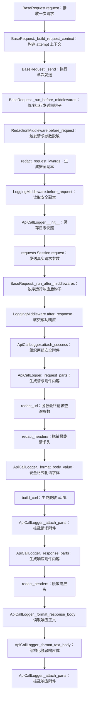

### 0.2 按调用顺序理解关键函数

| 调用 | 输入 → 输出 | 失败与边界 | 最小关键代码 |
| --- | --- | --- | --- |
| `BaseRequest.request()` / `_build_request_context()` | `method、path、kwargs` → 独立的 `RequestContext` | 构造阶段失败时尚未发送；这里只复制并补全 transport 输入，不负责脱敏输出 | `context = self._build_request_context(...)` |
| `BaseRequest._send()` / `_run_before_middlewares()` | `RequestContext` → 进入发送前 Middleware 链 | hook 失败会包装为 `RuntimeError`；单次 attempt 边界止于 `_send()` | `self._run_before_middlewares(context)` |
| `RedactionMiddleware.before_request()` / `redact_request_kwargs()` | `context.kwargs` → `attributes["redacted_kwargs"]` | 安全复制失败的字段可能回退原引用；绝不能把脱敏值写回 transport kwargs | `context.attributes[self.REDACTED_KWARGS_ATTR] = redact_request_kwargs(context.kwargs)` |
| `LoggingMiddleware.before_request()` / `ApiCallLogger.__init__()` | 安全副本 → logger 快照 | 缺少副本时当前实现会回退真实 kwargs；默认 Middleware 顺序因此是安全约束 | `logger_kwargs = context.attributes.get(..., context.kwargs)` |
| `requests.Session.request()` | 原始语义的 `context.kwargs` → `Response` | transport 异常改走 `on_exception`；它不读取 `redacted_kwargs` | `self.session.request(..., **context.kwargs)` |
| `LoggingMiddleware.after_response()` / `ApiCallLogger.attach_success()` | `Response` 与 logger 快照 → Allure 附件 | `_attach_log=False` 时跳过；logger 仍对最终 URL、header、body 和 cURL 做末端脱敏 | `self.get_logger(context).attach_success(response)` |
| `_request_parts()` / `redact_url()` / `redact_headers()` / `_format_body_value()` | `PreparedRequest` → 安全的请求行、请求头与请求体 | 这里读取真实 prepare 结果，但只生成输出字符串，不修改待发送对象 | `url = redact_url(prepared_request.url or self.url)` |
| `build_curl()` / `_attach_parts()` | `PreparedRequest` → 脱敏 cURL → Allure 请求附件 | cURL 独立重复处理 URL、header、body；构建失败被替换为 unavailable 文本 | `return self._truncate(build_curl(prepared_request))` |
| `_response_parts()` / `_format_response_body()` / `_format_text_body()` | `Response` → 安全响应行、header 与 body → Allure 响应附件 | JSON 可按键递归脱敏；未知自由文本无法保证识别全部裸 secret，输出边界仍需审计 | `return self._format_text_body(response.text, content_type)` |

课程接续：第 3 天建立了单次 attempt 的 Middleware 边界，本节沿该入口追踪安全观测链；第 5 天再从单次发送扩展到“是否允许再次发送”的重试决策。

从第一性原理看，请求正确性和日志安全性是两个不能互相替代的不变量。原地修改只能保住其中一个，分流才能同时保住两个。

从 TOC 约束理论看，安全水平不由最强的脱敏函数决定，而由最薄弱的输出出口决定。九个出口中八个安全、一个直接输出 `response.text`，整体仍然存在泄漏路径。因此本节既解释当前主要观测链路如何形成纵深防御，也明确说明整个仓库尚未形成绝对统一的安全出口。

本节最终需要掌握的不是函数清单，而是以下推导：

```text
原始数据必须完成真实请求
  → 观测数据不能与原始数据共用可变对象
  → 分叉点必须位于发送前且靠近请求上下文
  → 每个输出边界仍要执行自己的末端防御
  → 新增任何输出出口都必须重新进入安全审计范围
```

## 1. 两小时学习结构

| 阶段 | 时间 | 学习内容 | 完成产出 |
| --- | ---: | --- | --- |
| 观察初版 | 0～18 分钟 | 还原请求、响应、异常和 cURL 的输出面 | 初版泄漏面表 |
| 建立因果链 | 18～32 分钟 | 从原地替换的冲突推导双数据流 | 两类不变量 |
| 追踪当前实现 | 32～55 分钟 | Middleware、logger、PreparedRequest 的真实链路 | 完整调用图 |
| 拆解脱敏规则 | 55～75 分钟 | header、query、结构化 body、文本的不同算法 | 规则适用表 |
| 识别状态所有者 | 75～90 分钟 | 原始值、副本、实际发送结果和附件的生命周期 | 状态所有权表 |
| 推导职责边界 | 90～103 分钟 | 分叉、末端防御、SSE 和输出完整性 | 不变量清单 |
| 比较其他方案 | 103～113 分钟 | 原地脱敏、仅 logger 脱敏、双流加纵深防御 | 决策表 |
| 最小实验与复盘 | 113～120 分钟 | 用离线测试证明隔离与输出安全 | 实验结论 |

本节只学习日志和脱敏数据流。重试决策与轮询状态机只作为新增日志出口出现，不展开其策略算法。

## 2. 先建立安全问题的最小模型

### 2.1 三个事实

第一，认证信息本身就是请求有效载荷。`Authorization` 被替换后再发送，服务端只能收到占位符。

第二，日志的输入不只来自调用方传入的字典。`requests` 完成 prepare 后，`PreparedRequest` 还可能包含 Session 默认 header、自动生成的 `Content-Type`、编码后的 body 和最终 URL。

第三，输出面不只是一份请求日志。响应、异常、重试记录、轮询迁移、cURL、断言失败、控制台文本都可能成为敏感数据出口。

### 2.2 两个同时成立的不变量

| 不变量 | 含义 | 被破坏后的直接后果 |
| --- | --- | --- |
| 传输真实性 | transport 必须收到调用语义要求的原值 | 认证失败、参数失真、测试不再代表真实调用 |
| 观测安全性 | 非受信输出不得包含敏感原值 | Allure、CI、控制台或异常栈泄漏密钥 |

这两个不变量形成一组结构性冲突：同一份可变对象如果先被脱敏，真实请求失真；如果保持原值并直接交给日志，观测出口泄漏。

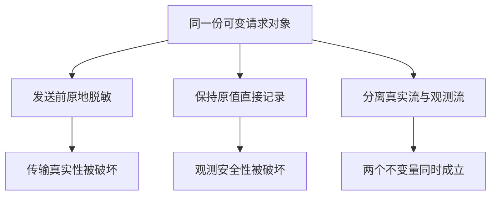

冲突的消解方向不是寻找更聪明的原地替换，而是改变数据结构，让不同用途拥有不同表示。

## 3. 观察初版实现

初版证据来自提交 `56f4f15`：

```powershell
git show 56f4f15:util/api_call_logger.py
git show 56f4f15:util/curl_builder.py
git show 56f4f15:common/base_request.py
```

### 3.1 初版日志链路

初版 `BaseRequest.request()` 直接把请求参数交给 `ApiCallLogger`，再调用 `session.request()`。logger 在成功路径读取 `PreparedRequest` 和 `Response`，在失败路径读取异常对象。

演进前之一：`56f4f15`，`common/base_request.py`

```python
def request(self, method: str, path: str, **kwargs: Any) -> requests.Response:
    attach_log = kwargs.pop("_attach_log", True)
    url = self._build_url(path)
    kwargs.setdefault("timeout", self.config.timeout)

    headers = kwargs.pop("headers", None)
    if headers:
        kwargs["headers"] = self._merge_headers(headers)

    if method.upper() == "POST":
        start_media_downloads(kwargs.get("json"))

    logger = ApiCallLogger(method, url, kwargs)
    try:
        response = self.session.request(
            method=method,
            url=url,
            **kwargs,
        )
    except Exception as error:
        if attach_log:
            logger.attach_failure(error)
        raise

    if attach_log:
        logger.attach_success(response)
    return response
```

同一份 `kwargs` 先进入 logger 构造器，随后进入 `session.request()`。这段代码直接证明初版尚未区分 transport 表示与观测表示；若此时原地替换 Authorization 或 token，logger 会更安全，但真实请求会同时被改坏。

演进前之二：`56f4f15`，`util/api_call_logger.py`

```python
def attach_success(self, response: requests.Response) -> None:
    self._attach_parts(
        self.step_name,
        self._request_parts(response.request),
        (REQUEST_CURL_ATTACHMENT_NAME, "请求行", "请求头", "请求体"),
    )
    self._attach_parts(
        self.response_step_name,
        self._response_parts(response),
        ("响应行", "响应头", "响应体"),
    )


def attach_failure(self, error: BaseException) -> None:
    self._attach_parts(
        self.step_name,
        self._request_parts(self._request_from_error(error)),
        (REQUEST_CURL_ATTACHMENT_NAME, "请求行", "请求头", "请求体"),
    )
    self._attach_parts(
        self.response_step_name,
        {
            "响应行": "<no response>",
            "响应头": "<empty>",
            "响应体": "\n".join(
                [
                    f"异常类型: {type(error).__name__}",
                    f"异常内容: {error}",
                ]
            ),
        },
        ("响应行", "响应头", "响应体"),
    )


def _request_parts(
    self,
    prepared_request: requests.PreparedRequest | None = None,
) -> dict[str, str]:
    if prepared_request is None:
        method = self.method
        url = self.url
        headers = self.kwargs.get("headers")
        body = self._fallback_request_body()
    else:
        method = prepared_request.method or self.method
        url = prepared_request.url or self.url
        headers = prepared_request.headers
        body = self._format_body_value(prepared_request.body)

    return {
        REQUEST_CURL_ATTACHMENT_NAME: self._format_curl(prepared_request),
        "请求行": f"{method} {url} HTTP/1.1",
        "请求头": self._format_headers(headers),
        "请求体": body,
    }


def _response_parts(self, response: requests.Response) -> dict[str, str]:
    return {
        "响应行": "\n".join(
            [
                f"HTTP/1.1 {response.status_code} {response.reason}",
                f"响应耗时(秒): {self._response_elapsed_seconds(response)}",
                f"执行耗时(秒): {self._elapsed_seconds()}",
            ]
        ),
        "响应头": self._format_headers(response.headers),
        "响应体": self._format_response_body(response),
    }
```

代码直接证明 URL、PreparedRequest headers/body、response headers/body 和异常字符串都以原始表示进入格式化，没有统一安全转换。logger 拥有附件布局，却没有安全表示与真实表示的边界。

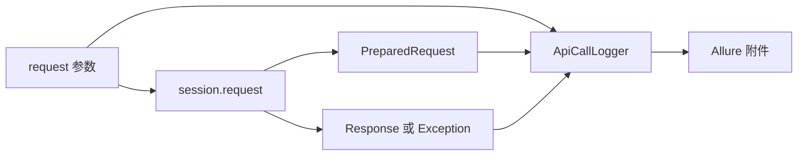

这条链路已经具备较好的诊断信息，但诊断完整性和安全性没有同时建立。

### 3.2 初版输出面的实际风险

| 输出位置 | 初版行为 | 风险 |
| --- | --- | --- |
| 请求行 | 直接输出最终 URL | query 中的 token、api_key 可泄漏 |
| 请求头 | 直接格式化 `PreparedRequest.headers` | Authorization、Cookie 可泄漏 |
| 请求体 | 直接格式化 JSON 或文本 | 嵌套 token、password 可泄漏 |
| 响应头 | 直接格式化 `response.headers` | Set-Cookie 可泄漏 |
| 响应体 | 直接输出解析后 JSON 或原文 | 服务端返回的 token 可泄漏 |
| 异常内容 | 直接格式化 `error` | URL、header 或服务端错误内容可泄漏 |
| cURL header | 对固定敏感 header 脱敏 | 该出口局部安全 |
| cURL URL 和 body | 保留原值 | query 与 body 仍可泄漏 |

初版 `curl_builder.py` 已经认识到 Authorization 一类 header 不能直接展示，但规则只存在于 cURL header 的局部路径。它没有覆盖同一请求在请求行、请求体、响应和异常中的其他表示。

演进前：`56f4f15`，`util/curl_builder.py`

```python
def build_curl(
    prepared_request: requests.PreparedRequest,
    *,
    redact_headers: Iterable[str] | None = DEFAULT_REDACT_HEADERS,
    multiline: bool = True,
) -> str:
    if not isinstance(prepared_request, requests.PreparedRequest):
        raise TypeError(
            "prepared_request must be a requests.PreparedRequest instance"
        )

    method = prepared_request.method or "GET"
    url = prepared_request.url
    if not url:
        raise ValueError("prepared_request.url is empty")

    redacted_header_names = _normalized_header_names(redact_headers)
    parts = [f"curl -X {method.upper()} {_shell_quote(url)}"]

    for name, value in prepared_request.headers.items():
        header_value = (
            REDACTED_VALUE
            if name.lower() in redacted_header_names
            else str(value)
        )
        parts.append(f"-H {_shell_quote(f'{name}: {header_value}')}" )

    body = _request_body_to_text(
        prepared_request.body,
        prepared_request.headers.get("Content-Type", ""),
    )
    if body is not None:
        parts.append(f"--data-raw {_shell_quote(body)}")

    return _join_command_parts(parts, multiline=multiline)
```

这里 header 值会按名单替换，但 `url = prepared_request.url` 和 body 转换没有脱敏。相同 secret 放在 Authorization 时安全，放在 query 或 JSON body 时泄漏。安全能力依赖数据载体和出口分支，尚未形成统一规则。

### 3.3 初版问题的因果链

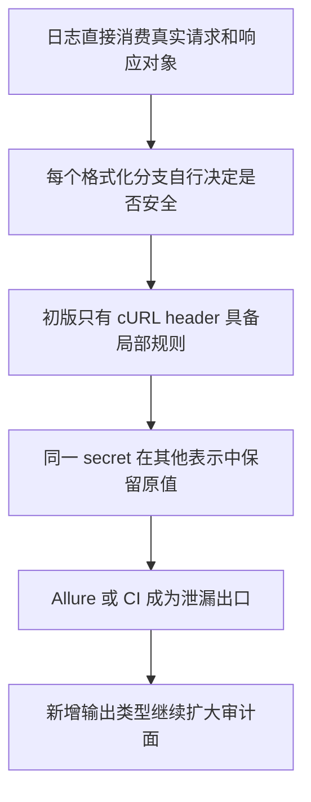

表面问题是缺少若干替换调用，深层问题是没有显式区分真实数据和观测数据，也没有定义所有输出出口必须遵守的安全契约。

## 4. 找到真正的分叉点

### 4.1 分叉不能发生在调用方对象上

调用方可能在请求结束后继续使用原 payload，也可能在失败时根据原值定位问题。框架如果直接修改调用方字典，会产生跨层副作用。

当前 `BaseRequest._build_request_context()` 先通过 `_copy_request_kwargs()` 建立一次 attempt 自己的 transport 输入。这个复制主要隔离调用方与请求上下文。随后 `RedactionMiddleware` 再从 `context.kwargs` 生成安全副本，这一步隔离 transport 与观测。

当前代码：`dev2`，`common/base_request.py`

```python
@staticmethod
def _copy_request_kwargs(
    kwargs: dict[str, Any],
) -> dict[str, Any]:
    copied_kwargs: dict[str, Any] = {}
    for name, value in kwargs.items():
        try:
            copied_kwargs[name] = deepcopy(value)
        except Exception:
            copied_kwargs[name] = value
    return copied_kwargs


def _build_request_context(
    self,
    method: str,
    path: str,
    *,
    attach_log: bool = True,
    request_step_name: str = API_REQUEST_STEP_NAME,
    response_step_name: str = API_RESPONSE_STEP_NAME,
    **kwargs: Any,
) -> RequestContext:
    url = self._build_url(path)
    request_kwargs = self._copy_request_kwargs(kwargs)
    request_kwargs.setdefault("timeout", self.config.timeout)

    headers = request_kwargs.pop("headers", None)
    if headers:
        request_kwargs["headers"] = self._merge_headers(headers)

    return RequestContext(
        method=method.upper(),
        path=path,
        url=url,
        kwargs=request_kwargs,
        attach_log=attach_log,
        request_step_name=request_step_name,
        response_step_name=response_step_name,
    )


def _send(self, context: RequestContext) -> requests.Response:
    self._run_before_middlewares(context)
    try:
        response = self.session.request(
            method=context.method,
            url=context.url,
            **context.kwargs,
        )
    except Exception as error:
        self._run_exception_middlewares(context, error)
        raise
    self._run_after_middlewares(context, response)
    return response
```

代码证明第一层复制发生在 Context 创建时，而 transport 最终仍读取 `context.kwargs`。因此后续安全分流必须生成新的派生值，不能把 `<redacted>` 写回这份 transport 状态。深拷贝失败会回退原引用，这也为后文“隔离不是绝对保证”提供了直接证据。

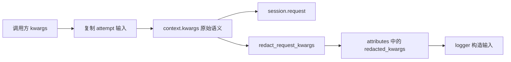

这里实际存在两次隔离：

1. 调用方对象与 attempt transport 输入隔离。
2. attempt transport 输入与安全观测输入隔离。

缺少第一层会让框架修改业务数据；缺少第二层会让日志和 transport 争用同一份敏感表示。

### 4.2 最迟分叉位置

安全副本必须在任何日志消费者读取请求参数之前生成。当前默认顺序为：

演进后：`291e6ea`，`common/request_middleware.py`。当前 dev2 保持相同分流结构：

```python
class RedactionMiddleware:
    REDACTED_KWARGS_ATTR = "redacted_kwargs"

    def before_request(self, context: RequestContext) -> None:
        context.attributes[self.REDACTED_KWARGS_ATTR] = (
            redact_request_kwargs(context.kwargs)
        )


class LoggingMiddleware:
    LOGGER_ATTR = "api_call_logger"

    def before_request(self, context: RequestContext) -> None:
        logger_kwargs = context.attributes.get(
            RedactionMiddleware.REDACTED_KWARGS_ATTR,
            context.kwargs,
        )
        context.attributes[self.LOGGER_ATTR] = ApiCallLogger(
            context.method,
            context.url,
            logger_kwargs,
            step_name=context.request_step_name,
            response_step_name=context.response_step_name,
        )


def default_request_middlewares() -> list[RequestMiddleware]:
    return [
        MediaResourceMiddleware(),
        RedactionMiddleware(),
        LoggingMiddleware(),
    ]
```

前后演进的关键变化是：初版 logger 直接接收请求 kwargs；`291e6ea` 开始由 RedactionMiddleware 创建独立派生状态，再由 LoggingMiddleware 消费。`context.kwargs` 没有被赋值为脱敏结果，因而仍可发送真实认证和业务值。被保护的不变量是传输真实性与观测安全性同时成立。

`RedactionMiddleware` 先写入 `redacted_kwargs`，`LoggingMiddleware` 再构造 logger。这个顺序就是数据依赖，不只是排列风格。


若交换后两个 Middleware，`LoggingMiddleware` 会回退到 `context.kwargs`。虽然 logger 的部分格式化分支还会再次脱敏，但 fallback header 等路径会失去第一层保证。当前协议没有用类型系统表达这一依赖，因此默认列表顺序和对应测试共同承担契约。

## 5. 当前 dev2 的真实执行链

### 5.1 发送前

```text
BaseRequest.request
  → _build_request_context
  → _send
  → _run_before_middlewares
  → MediaResourceMiddleware.before_request
  → RedactionMiddleware.before_request
  → LoggingMiddleware.before_request
  → session.request 使用 context.kwargs
```

关键事实如下：

- `context.kwargs` 保留真实请求语义。
- `redacted_kwargs` 存放于 `context.attributes`，属于观测派生状态。
- `ApiCallLogger` 接收安全副本，但不会把副本写回 `context.kwargs`。
- `session.request` 始终读取原始语义的 `context.kwargs`。

这四项事实由 4.1 的 `_send()` 和 4.2 的两个 Middleware 共同证明：二者读取同一个 Context，却把数据写向不同消费者。`context.kwargs` 是 transport 状态，`attributes["redacted_kwargs"]` 是观测派生状态；共享生命周期不代表共享表示。

### 5.2 成功后

成功后 logger 优先读取 `response.request`。这个对象是 `requests` 实际 prepare 后的请求，诊断信息比最初 kwargs 更接近线上事实。

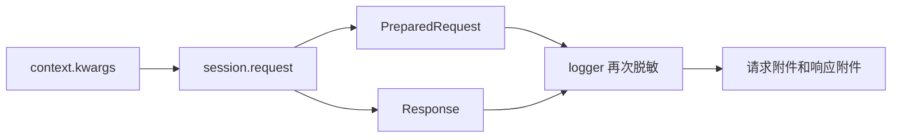

使用 PreparedRequest 产生了一个新的安全要求。Session 可能在 prepare 阶段补入默认 header，这些值在 Middleware 创建的 `redacted_kwargs` 中不一定存在。因此 logger 必须对最终 URL、最终 header 和最终 body 再执行一次脱敏。

当前代码：`dev2`，`util/api_call_logger.py`

```python
def _request_parts(
    self,
    prepared_request: requests.PreparedRequest | None = None,
) -> dict[str, str]:
    if prepared_request is None:
        method = self.method
        url = redact_url(self.url) or self.url
        headers = self.kwargs.get("headers")
        body = self._fallback_request_body()
    else:
        method = prepared_request.method or self.method
        url = redact_url(prepared_request.url or self.url) or self.url
        headers = redact_headers(prepared_request.headers)
        body = self._format_body_value(prepared_request.body)

    return {
        REQUEST_CURL_ATTACHMENT_NAME: self._format_curl(prepared_request),
        "请求行": f"{method} {url} HTTP/1.1",
        "请求头": self._format_headers(headers),
        "请求体": body,
    }


def _response_parts(self, response: requests.Response) -> dict[str, str]:
    return {
        "响应行": "\n".join(
            [
                f"HTTP/1.1 {response.status_code} {response.reason}",
                f"响应耗时(秒): {self._response_elapsed_seconds(response)}",
                f"执行耗时(秒): {self._elapsed_seconds()}",
            ]
        ),
        "响应头": self._format_headers(
            redact_headers(response.headers)
        ),
        "响应体": self._format_response_body(response),
    }


def _format_body_value(self, body: Any) -> str:
    if body is None:
        return "<empty>"
    if isinstance(body, bytes):
        body = body.decode("utf-8", errors="replace")
    return self._format_text_body(redact_text_body(str(body)))


def _format_text_body(
    self,
    body: str,
    content_type: str = "",
) -> str:
    if self._looks_like_json(content_type, body):
        try:
            parsed_body = json.loads(body)
            return self._to_pretty_text(
                redact_sensitive_data(parsed_body)
            )
        except ValueError:
            pass
    return self._truncate(body)
```

代码表明 PreparedRequest 路径重新处理最终 URL、headers 和 body，Response 路径独立处理响应 headers 与 body。Middleware 副本没有替代末端防御，因为它看不到 prepare 阶段才生成的数据。与此同时，非法 JSON 最终回退 `_truncate(body)`，也直接证明后文指出的原文泄漏窗口。

### 5.3 失败后

`requests.RequestException` 可能携带 `PreparedRequest`。`attach_failure()` 会优先从异常中取出它，并按照与成功路径相同的请求格式化规则生成请求行、header、body 和 cURL。异常字符串再经过自由文本脱敏。

若异常没有携带 prepared request，logger 回退到构造时保存的 kwargs。默认 Middleware 顺序保证这些 kwargs 已是安全副本。

当前代码：`dev2`，`util/api_call_logger.py`

```python
def attach_failure(self, error: BaseException) -> None:
    self._attach_parts(
        self.step_name,
        self._request_parts(self._request_from_error(error)),
        (REQUEST_CURL_ATTACHMENT_NAME, "请求行", "请求头", "请求体"),
    )
    self._attach_parts(
        self.response_step_name,
        {
            "响应行": "<no response>",
            "响应头": "<empty>",
            "响应体": "\n".join(
                [
                    f"异常类型: {type(error).__name__}",
                    f"异常内容: {self._format_error_text(error)}",
                ]
            ),
        },
        ("响应行", "响应头", "响应体"),
    )


def _format_error_text_value(self, value: str) -> str:
    redacted = redact_urlencoded_text(value)
    return self._truncate(redact_text_body(redacted))


@staticmethod
def _request_from_error(
    error: BaseException,
) -> requests.PreparedRequest | None:
    request = getattr(error, "request", None)
    if isinstance(request, requests.PreparedRequest):
        return request
    return None
```

异常路径先尝试恢复真实 PreparedRequest，再进入与成功路径相同的 `_request_parts()` 安全转换；异常字符串则经过独立文本规则。logger 只生成附件，不替换或重新抛异常，请求层仍负责保持原异常控制流。

### 5.4 分叉之后仍然需要汇合

真实流与观测流不是完全互不相干。请求完成后，logger 需要从真实执行结果中获得最终事实，然后把这些事实转换为安全表示。准确模型是先分叉、后在安全出口处受控汇合。

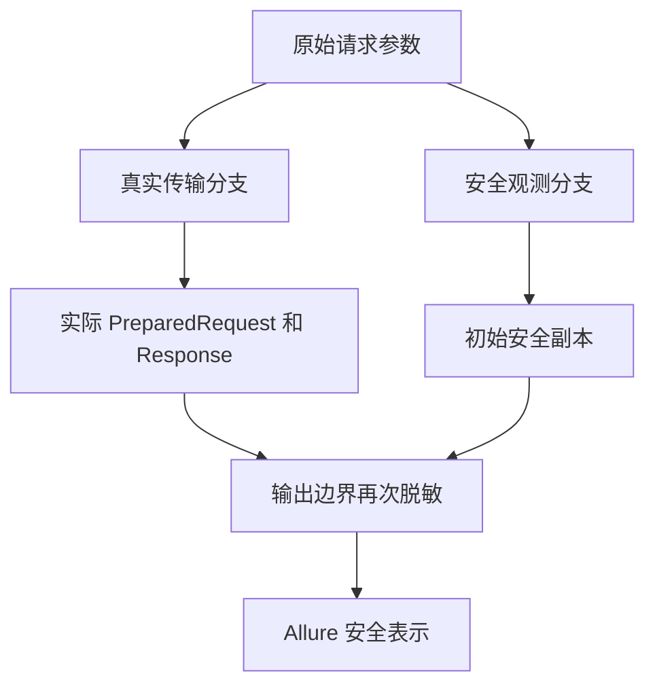

## 6. 脱敏规则不是一个算法

敏感信息在不同载体中的结构不同。header 是名字到值的映射，URL query 是编码后的键值序列，JSON 是递归结构，自由文本可能只有松散的赋值片段。用一个正则处理全部载体，会同时产生漏报、误报和表示破坏。

### 6.1 当前默认敏感名称

敏感 header 采用大小写不敏感的精确匹配：

```text
authorization
cookie
proxy-authorization
set-cookie
x-api-key
```

敏感字段同样采用大小写不敏感的精确匹配：

```text
api_key
key
token
access_token
refresh_token
secret
password
authorization
```

精确匹配控制误伤范围，但也意味着未列入集合的 `client_secret`、`private_token` 等名称不会自动继承敏感语义。

### 6.2 各函数的适用层

| 函数 | 输入结构 | 当前行为 | 主要使用位置 |
| --- | --- | --- | --- |
| `redact_request_kwargs` | 请求 kwargs 映射 | 按 headers、params、json、data 分派 | RedactionMiddleware |
| `redact_headers` | header 映射 | 对固定 header 名替换值 | logger 与 header 输出 |
| `redact_url` | URL 字符串 | 解析 query 后按字段名替换 | 请求行与 cURL |
| `redact_sensitive_data` | Mapping、list、tuple、标量 | 递归处理嵌套字段 | JSON、结构化 body、Schema 错误 |
| `redact_text_body` | JSON 文本或 form 文本 | 先识别结构再处理 | body 和状态文本 |
| `redact_urlencoded_text` | form 或自由文本 | 先尝试表单，再使用有限正则 | 异常、重试和轮询文本 |

当前代码：`dev2`，`util/redaction.py`

```python
def redact_request_kwargs(
    kwargs: Mapping[str, Any],
) -> dict[str, Any]:
    redacted: dict[str, Any] = {}
    for name, value in kwargs.items():
        lowered_name = name.lower()
        if lowered_name == "headers":
            redacted[name] = redact_headers(value)
        elif lowered_name in {"params", "json", "data"}:
            redacted[name] = redact_sensitive_data(value)
        elif _is_sensitive_key(name):
            redacted[name] = REDACTED_VALUE
        else:
            redacted[name] = _safe_copy(value)
    return redacted


def redact_headers(
    headers: Any,
    *,
    sensitive_headers: Iterable[str] | None = DEFAULT_REDACT_HEADERS,
) -> Any:
    if not headers:
        return headers

    sensitive_header_names = _normalized_names(sensitive_headers)
    return {
        name: (
            REDACTED_VALUE
            if str(name).lower() in sensitive_header_names
            else value
        )
        for name, value in dict(headers).items()
    }


def redact_url(url: str | None) -> str | None:
    if not url:
        return url

    split_url = urlsplit(url)
    if not split_url.query:
        return url

    query_pairs = parse_qsl(split_url.query, keep_blank_values=True)
    redacted_pairs = [
        (
            name,
            REDACTED_VALUE if _is_sensitive_key(name) else value,
        )
        for name, value in query_pairs
    ]
    return urlunsplit(
        (
            split_url.scheme,
            split_url.netloc,
            split_url.path,
            urlencode(redacted_pairs, doseq=True),
            split_url.fragment,
        )
    )
```

代码证明不同载体使用不同解析边界：kwargs 只负责分派，header 按名字映射，URL 先拆 query 再重建。所有函数都返回新表示，不承担 transport 调用。query 编码可能变化也能从 `parse_qsl → urlencode` 直接推出，但变化只发生在观测字符串。

### 6.3 结构化数据递归

`redact_sensitive_data()` 对 Mapping 递归处理，对 list 和 tuple 保留容器形态，并识别二元键值序列。其目标是保留足够结构用于诊断，同时把敏感节点值替换为统一占位符。

当前代码：`dev2`，`util/redaction.py`

```python
def redact_sensitive_data(value: Any) -> Any:
    if isinstance(value, Mapping):
        return {
            key: (
                REDACTED_VALUE
                if _is_sensitive_key(key)
                else redact_sensitive_data(item)
            )
            for key, item in value.items()
        }

    if isinstance(value, list):
        return [_redact_sequence_item(item) for item in value]

    if isinstance(value, tuple):
        return tuple(_redact_sequence_item(item) for item in value)

    if isinstance(value, str):
        return redact_text_body(value)

    return _safe_copy(value)


def redact_text_body(body: str, content_type: str = "") -> str:
    if _looks_like_json(content_type, body):
        try:
            parsed_body = json.loads(body)
        except ValueError:
            return body
        return json.dumps(
            redact_sensitive_data(parsed_body),
            ensure_ascii=False,
        )

    redacted_form_body = _redact_urlencoded_text(body)
    if redacted_form_body is not None and (
        "x-www-form-urlencoded" in content_type.lower()
        or _contains_sensitive_form_field(body)
    ):
        return redacted_form_body

    return body
```

递归函数以字段名决定是否替换，未命中的结构继续向下遍历。`redact_text_body()` 先选 JSON 分支，解析失败立即返回原文，不会进入 form 分支；这一真实控制流正是“畸形 JSON 泄漏窗口”的根因，而不是推测。

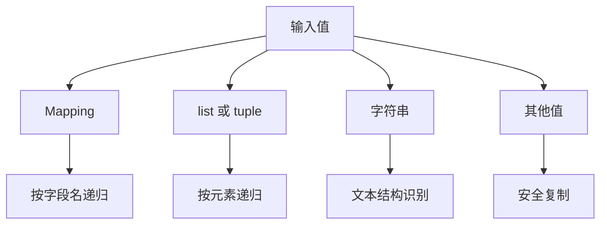

例如以下结构中的 `token` 和 `password` 会被替换，而 `prompt`、`role` 和列表结构得到保留：

```python
{
    "input": {"token": "body-secret", "prompt": "hello"},
    "messages": [{"role": "user", "password": "nested-secret"}],
}
```

### 6.4 URL query

`redact_url()` 使用 `urlsplit` 和 `parse_qsl` 解析 query，再用 `urlencode` 重建。这比直接正则替换更理解 URL 结构，也会带来一个明确副作用：编码形式、空格表示或参数表现形式可能变化。

这个副作用在当前设计中可接受，因为重建只作用于观测字符串，不会写回真实请求 URL。若对 transport URL 使用同一结果，表现形式变化就会进入请求语义，风险等级完全不同。

### 6.5 JSON、form 与自由文本

当前文本处理采用分层策略：

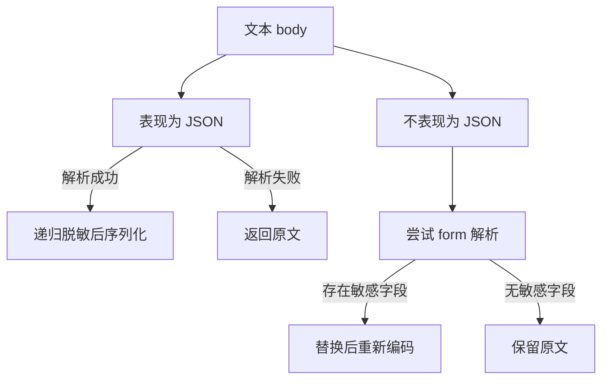

`redact_urlencoded_text()` 还会在 form 解析不能命中时，对 `token=值`、`password:值` 和固定敏感 header 文本执行有限正则替换。它适合异常消息等非结构化出口，但不是完整的秘密扫描器。

## 7. 纵深防御的三层结构

### 7.1 第一层为 Middleware 安全副本

`RedactionMiddleware` 的责任是建立独立观测表示，不修改 transport 输入。它解决副作用隔离和 logger 初始输入安全。

测试 `test_redacts_copy_without_mutating_original_kwargs` 已证明：

- 原始 Authorization、query api_key 和嵌套 token 保持原值。
- `redacted_kwargs` 中对应值变为 `<redacted>`。
- 非敏感 `X-Trace-Id` 和业务字段保持可诊断。

### 7.2 第二层为 logger 输出时脱敏

logger 不把 Middleware 副本视为绝对可信，仍对最终 URL、PreparedRequest header、request body、response header、response body、error text、retry records 和 polling transitions 执行对应规则。

这层防御解决两个问题：

1. PreparedRequest 包含 Middleware 阶段尚不存在的最终值。
2. logger 也可能被其他代码直接构造，不能完全依赖默认管道。

这里的第二点只得到部分保证。prepared request 路径会重新处理 header，fallback 路径的 header 仍依赖构造输入已安全。准确结论是纵深防御显著降低风险，但 logger 并不是对任意原始输入都自足的纯安全汇点。

### 7.3 第三层为 cURL 独立脱敏

cURL 是可复制、可再次执行的命令，泄漏后影响更直接。`build_curl()` 不直接信任 logger 已处理的字符串，而是从 PreparedRequest 独立处理：

- URL query 通过 `redact_url()` 处理。
- header 按敏感 header 集合处理。
- JSON body 解析后递归处理。
- form body 按字段处理。
- shell 单引号转义与脱敏分开负责。

当前代码：`dev2`，`util/curl_builder.py`

```python
def build_curl(
    prepared_request: requests.PreparedRequest,
    *,
    redact_headers: Iterable[str] | None = DEFAULT_REDACT_HEADERS,
    multiline: bool = True,
) -> str:
    if not isinstance(prepared_request, requests.PreparedRequest):
        raise TypeError(
            "prepared_request must be a requests.PreparedRequest instance"
        )

    method = prepared_request.method or "GET"
    url = redact_url(prepared_request.url)
    if not url:
        raise ValueError("prepared_request.url is empty")

    redacted_header_names = _normalized_header_names(redact_headers)
    parts = [f"curl -X {method.upper()} {_shell_quote(url)}"]

    for name, value in prepared_request.headers.items():
        header_value = (
            REDACTED_VALUE
            if name.lower() in redacted_header_names
            else str(value)
        )
        parts.append(f"-H {_shell_quote(f'{name}: {header_value}')}" )

    body = _request_body_to_text(
        prepared_request.body,
        prepared_request.headers.get("Content-Type", ""),
    )
    if body is not None:
        parts.append(f"--data-raw {_shell_quote(body)}")

    return _join_command_parts(parts, multiline=multiline)


def _request_body_to_text(
    body: object,
    content_type: str = "",
) -> str | None:
    if body is None:
        return None
    if isinstance(body, bytes):
        body = body.decode("utf-8", errors="replace")

    text = str(body)
    if _looks_like_json(content_type, text):
        try:
            parsed_body = json.loads(text)
            return json.dumps(
                redact_sensitive_data(parsed_body),
                ensure_ascii=False,
            )
        except ValueError:
            pass
    return redact_text_body(text, content_type)
```

与初版对照可以直接看到三处演进：URL 从原值变为 `redact_url()` 结果；JSON body 在序列化前递归脱敏；其他 body 进入文本规则。header 仍由 cURL 自己处理，而不是接收 logger 已经格式化的字符串。cURL 因此是独立安全出口，不是 logger 的无条件可信下游。

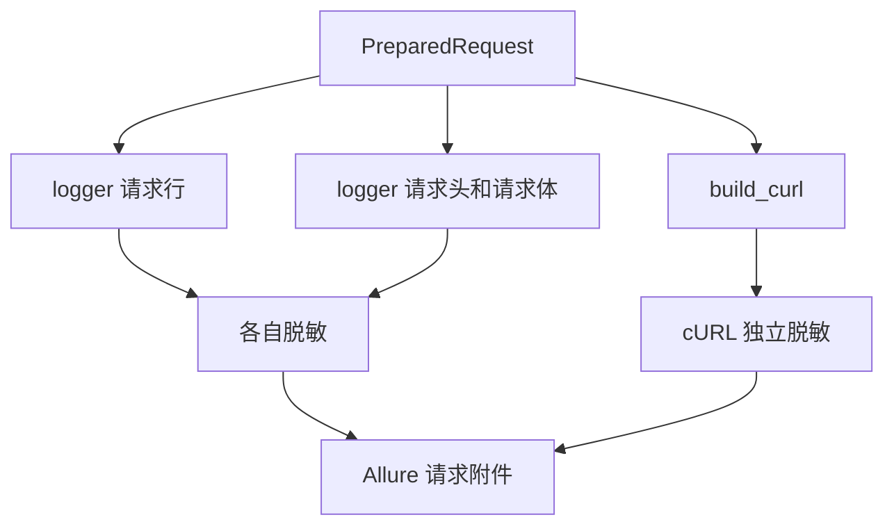

独立处理不是无意义重复。任何一个格式化分支未来被复用到 logger 外部时，独立安全边界仍然存在。

### 7.4 纵深防御不等于多次无差别替换

每一层处理的是不同阶段的事实：

| 层 | 看见的数据 | 主要威胁 |
| --- | --- | --- |
| Middleware | attempt 初始 kwargs | 观测副本与 transport 共用对象 |
| ApiCallLogger | 最终请求、响应、异常、执行记录 | Session 注入值和新增日志出口 |
| cURL builder | 可执行命令表示 | 命令被复制传播或重新执行 |

若三层都只对同一个初始字典重复调用同一函数，它们不会形成真正纵深防御。当前结构的价值来自不同层观察了不同阶段的数据。

## 8. 按出口审计完整链路

### 8.1 普通成功请求

```text
response.request
  → URL query 脱敏
  → prepared headers 脱敏
  → prepared body 按内容结构脱敏
  → cURL 独立脱敏

response
  → Set-Cookie 等响应 header 脱敏
  → JSON 响应递归脱敏
  → 截断到最大文本长度
```

成功链路保留状态码、reason、响应耗时和执行耗时。这些值不需要脱敏，属于安全诊断元数据。

### 8.2 请求异常

```text
RequestException
  → 尝试取得 prepared request
  → 按普通请求出口处理
  → 异常类型保留
  → 异常字符串执行 form 和有限文本脱敏
```

原异常仍由请求层重新抛出，logger 不改变异常类型。这维持了调用方控制流语义。

### 8.3 重试记录

重试记录包含 attempt 序号、原因、等待时间、响应状态、异常类型和异常消息。`Reason` 与 `Exception message` 在写入附件前执行文本脱敏。

重试记录扩大了输出面，因为同一个异常信息可能在单次请求附件和汇总记录中出现两次。当前 logger 对两个出口分别处理，这正是出口安全原则的体现。

### 8.4 轮询迁移

轮询迁移把多次业务状态转换为文本附件。logger 对整个 transitions 文本应用脱敏和截断。轮询逻辑还会在最终成功、失败、未知状态和超时处挂载最后一次响应。

这说明安全责任不能停在单次普通请求。只要数据被转换为新的观测表示，新表示就成为新的安全出口。

### 8.5 SSE 流式响应

`SmokeRequest.create_stream_chat_completion()` 显式传入：

当前代码：`dev2`，`module/smoke/request.py`

```python
def create_stream_chat_completion(
    self,
    payload: dict[str, Any],
) -> requests.Response:
    return self.post(
        self.chat_completions_path,
        json=payload,
        headers={"Accept": "text/event-stream"},
        stream=True,
        _attach_log=False,
    )
```

对应当前代码：`dev2`，`common/request_middleware.py`

```python
class LoggingMiddleware:
    def before_request(self, context: RequestContext) -> None:
        logger_kwargs = context.attributes.get(
            RedactionMiddleware.REDACTED_KWARGS_ATTR,
            context.kwargs,
        )
        context.attributes[self.LOGGER_ATTR] = ApiCallLogger(
            context.method,
            context.url,
            logger_kwargs,
            step_name=context.request_step_name,
            response_step_name=context.response_step_name,
        )

    def after_response(
        self,
        context: RequestContext,
        response: requests.Response,
    ) -> None:
        if not context.attach_log:
            return
        self.get_logger(context).attach_success(response)

    def on_exception(
        self,
        context: RequestContext,
        error: BaseException,
    ) -> None:
        if not context.attach_log:
            return
        self.get_logger(context).attach_failure(error)
```

`before_request()` 没有检查 `attach_log`，所以 logger 仍被创建；只有成功和异常附件被跳过。结合 logger 的 `_format_response_body()` 会读取 `response.text`，可以直接推出此策略避免自动消费流式 body，同时保留外层延迟使用 logger 的可能。

`LoggingMiddleware.before_request()` 仍会创建 logger，但 `after_response()` 和 `on_exception()` 跳过自动挂载。这样设计的直接原因是普通响应日志会读取 `response.text`，而流式响应的 body 尚未完成消费。提前读取会消耗流或改变首 token、chunk 迭代等观测行为。

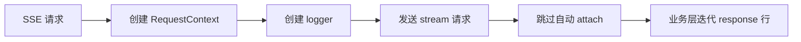

因此 `_attach_log=False` 表示关闭自动读取和附件挂载，不表示删除 logger 基础设施。轮询同样使用这一机制先取得 response 与 logger，再由外层状态机决定最终挂载时机。

当前 SSE 业务层的 `print_stream_raw_line()` 会直接输出行文本，没有经过统一脱敏。这是主日志管道之外的独立出口，不能被 `_attach_log=False` 的正确性掩盖。

## 9. 找到变化轴

| 变化轴 | 变化原因 | 生命周期 | 与其他轴的关系 |
| --- | --- | --- | --- |
| 敏感名称集合 | 新认证协议、新业务字段 | 进程级规则 | 独立于 HTTP 发送方式 |
| 输入载体 | header、query、JSON、form、文本 | 一次格式化 | 决定脱敏算法 |
| 日志展示格式 | Allure 名称、缩进、截断 | 一次输出 | 独立于敏感字段语义 |
| 请求 prepare 行为 | Session header、编码、重定向 | 一次 attempt | 决定最终观测事实 |
| cURL 表示 | shell quoting、单行或多行 | 一次输出 | 独立于日志附件布局 |
| 流式语义 | body 是否可立即读取 | 一次 response 生命周期 | 约束自动挂载时机 |
| 重试与轮询记录 | 多 attempt 和多状态聚合 | 一次执行序列 | 新增安全出口 |
| 断言错误格式 | 测试失败诊断 | 一次断言 | 位于 logger 管道之外 |

初版把日志展示、数据安全和最终请求事实集中在 `ApiCallLogger` 的格式化分支中。当前实现把通用脱敏规则抽到 `util.redaction`，把请求期分叉放进 Middleware，把具体附件布局保留在 logger，把 shell 表示保留在 cURL builder。

这些边界来自变化频率，而不是目录命名偏好。

## 10. 识别状态所有者

### 10.1 状态生命周期表

| 状态 | 创建者 | 修改者 | 终结或消费者 | 生命周期 |
| --- | --- | --- | --- | --- |
| 调用方 kwargs | 业务调用方 | 业务调用方 | 调用方自己 | 由调用方决定 |
| `context.kwargs` | BaseRequest | 请求构造和前置 Middleware 可补充 | `session.request` | 一次 attempt |
| `redacted_kwargs` | RedactionMiddleware | 当前实现不再修改 | LoggingMiddleware 与 logger | 一次 attempt |
| ApiCallLogger 快照 | LoggingMiddleware | logger 内部只格式化 | Allure 附件 | 一次 attempt 或延迟挂载 |
| PreparedRequest | requests | Session prepare 过程 | transport 与 logger | 一次 attempt |
| Response | requests | response 消费者 | 调用方、logger、断言 | 一次响应生命周期 |
| retry records | RetryExecutor | 每次重试追加 | logger 汇总附件 | 一次重试序列 |
| polling transitions | polling 执行 | 每轮追加 | logger 汇总附件 | 一次轮询序列 |
| 脱敏规则集合 | `util.redaction` 模块 | 当前运行期不修改 | 各安全出口 | Python 进程 |

### 10.2 状态所有权的关键判断

`RequestContext` 拥有一次 attempt 的原始语义和派生观测状态，但这不代表两者可以混写。`kwargs` 是 transport 通道，`attributes` 中的 `redacted_kwargs` 是 Middleware 协作通道。

logger 拥有的是用于附件生成的快照，不拥有真实请求。它可以改变格式、截断文本和替换敏感值，但不能回写 transport。

PreparedRequest 由 `requests` 生成，最接近实际发送事实。logger 可以读取并转换它，不能把脱敏后的表示当成新的 PreparedRequest 再发送。

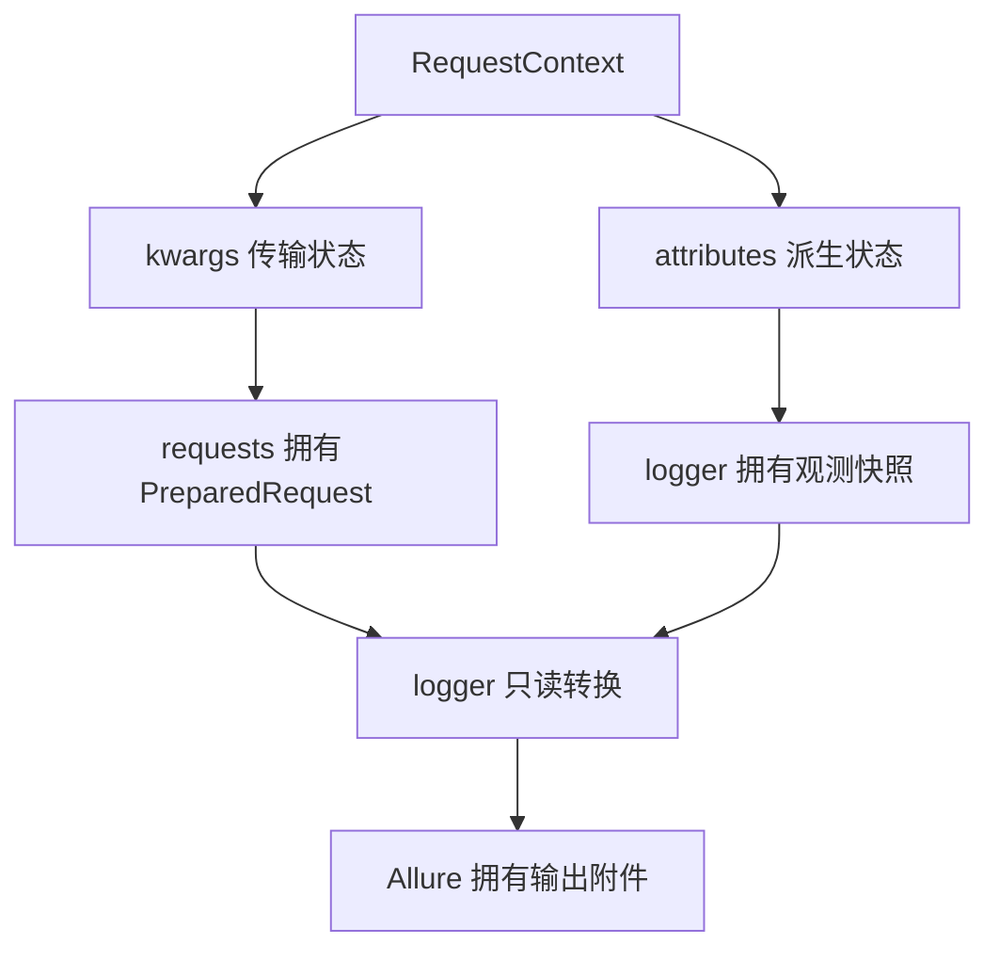

## 11. 从不变量推导职责边界

### 11.1 必须保持的不变量

1. 调用方对象不因日志行为而改变。
2. transport 输入不因脱敏行为而改变。
3. 最终 PreparedRequest 中后期出现的敏感值仍需处理。
4. 请求、响应、异常、cURL、重试和轮询各出口都不能假设上游已经绝对安全。
5. 日志失败不能悄悄改变原始请求异常类型。
6. SSE 日志不能提前消费 response body。
7. 脱敏只降低输出信息量，不改变真实业务交互。
8. 新增输出出口时，安全责任必须显式落到该出口或统一安全适配层。

### 11.2 当前职责边界

| 组件 | 应负责 | 不应负责 |
| --- | --- | --- |
| BaseRequest | 复制请求参数、建立 Context、发送真实数据 | 逐个理解敏感字段和日志格式 |
| RedactionMiddleware | 从 attempt 输入派生安全副本 | 修改原始 kwargs、发送请求、挂载附件 |
| `util.redaction` | 按数据结构执行可复用转换 | 决定何时记录日志、拥有 response 生命周期 |
| LoggingMiddleware | 管理一次 attempt 的 logger 生命周期与自动挂载 | 重新发送请求、拥有重试或轮询循环 |
| ApiCallLogger | 把请求结果转换成安全附件 | 修改真实请求、决定 retry 或 polling 状态 |
| cURL builder | 构造 shell 表示并独立保护其出口 | 管理 Allure 生命周期和 transport |
| SSE 业务层 | 消费流并决定流式观测策略 | 假设普通 `response.text` 日志仍然安全 |

### 11.3 边界的可局部证明性

边界的价值体现在测试可以分别证明：

- Middleware 测试证明副本隔离。
- logger 测试证明请求、响应和异常附件不含已知 secret。
- cURL 测试证明 query、header、JSON 和 form 的命令表示安全。
- SSE 请求测试证明关闭 attach 不阻断真实发送。

如果所有能力仍写在 `BaseRequest.request()` 中，每个安全断言都必须穿过真实发送、Allure 和 response 构造，证明成本会显著增加。

## 12. 比较其他方案

| 方案 | 状态放置 | 收益 | 代价和失败方式 | 适用条件 |
| --- | --- | --- | --- | --- |
| 发送前原地脱敏 | 原 kwargs 直接变更 | 实现最少 | 认证和业务数据失真，调用方对象被修改 | 只适用于数据永远不发送的纯展示工具 |
| 仅在 logger 内脱敏 | logger 读取所有原始对象 | 接入点少，能看到最终请求 | logger 成为巨大安全汇点，新增出口容易遗漏，直接输出仍可绕过 | 输出面极少且完全封闭 |
| 每个调用点自行脱敏 | 各调用点保存局部规则 | 局部灵活 | 规则漂移、重复实现、最薄弱出口决定整体失败 | 小型一次性脚本 |
| Middleware 只生成安全副本 | Context 同时保存原始流和观测流 | 隔离明确，transport 不变 | PreparedRequest 后期注入值可能未覆盖，顺序存在依赖 | logger 只消费初始 kwargs 的简单客户端 |
| 当前方案 | Middleware 分流，logger 与 cURL 末端再防御 | 同时保护传输真实性、最终请求事实和主要出口 | 规则精确匹配有限，仍需审计管道外出口，存在重复转换成本 | 当前多出口接口测试框架 |
| 全量 secret 污点追踪 | 值级标签贯穿所有对象 | 理论上可识别改名和跨结构传播 | Python 第三方库适配复杂，性能与维护成本高 | 强合规且有专门平台投入 |

### 12.1 当前方案胜出的约束条件

当前框架的主要约束不是实现任意秘密检测，而是在较低复杂度下同时满足：

- 现有 `BaseRequest` 调用保持兼容。
- 不改变 `requests` 传输语义。
- 覆盖 Allure 的主要请求、响应和执行记录。
- 可以完全离线验证。
- 不引入大型插件或污点追踪系统。

当前方案用安全副本解决对象隔离，用末端重复脱敏解决 final representation，用显式规则集合控制误伤范围。它是当前约束下的工程平衡，不是绝对完备的安全模型。

## 13. 使用 TOC 找到真正约束

### 13.1 系统目标

目标不是让 `redaction.py` 的覆盖率变高，而是让敏感原值无法通过非受信观测出口离开框架。

### 13.2 当前约束

当前约束是输出出口分散。主 logger 已覆盖大量路径，但断言、Task 错误、装饰器、SSE 控制台输出仍可以独立构造文本。

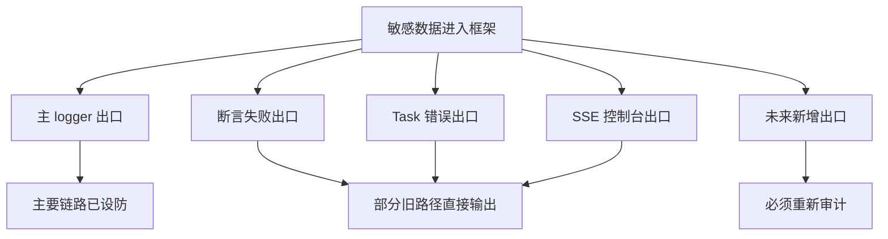

### 13.3 五步聚焦

1. 识别约束：安全由最薄弱输出出口决定。
2. 榨尽约束：复用现有结构化脱敏函数，先收敛现有高风险文本出口。
3. 迁就约束：新增日志、异常和报告时必须声明安全表示，不允许直接拼接原始 response。
4. 提升约束：当出口数量继续增长，再考虑统一 `safe_response_summary` 或安全输出值对象。
5. 防止惰性：统一入口形成后仍保留 PreparedRequest 和 cURL 的末端防御，不把集中化误解为单点绝对可信。

这个顺序比继续增加更多敏感字段名更有效。字段集合再完整，也无法保护一个完全绕过脱敏工具的直接输出出口。

## 14. 当前实现的边界与安全债务

### 14.1 精确字段名不是值级追踪

当前规则根据字段名判断敏感性。`token` 会命中，`client_secret` 当前不会命中。一个 secret 若出现在普通字段 `note` 中，也不会因为值与其他位置相同而自动被识别。

因此当前能力属于基于结构和名称的脱敏，不属于 secret-value 污点追踪。

### 14.2 非法 JSON 的回退存在泄漏窗口

`redact_text_body()` 在文本表现为 JSON 但解析失败时直接返回原文，不会继续执行 form 或自由文本兜底。`ApiCallLogger._format_text_body()` 对非法 JSON 同样会保留并截断原文。

一个被标记为 JSON 的畸形响应若包含敏感赋值片段，当前可能原样进入附件。这里的根因不是正则缺一条，而是解析失败策略选择了可观测性优先。

### 14.3 安全复制不是绝对隔离

`redact_request_kwargs()` 对未专门处理的值调用 `_safe_copy()`。深拷贝失败时会回退原对象。当前函数不会主动修改该对象，但若后续代码修改这份观测值，隔离承诺会变弱。

`ApiCallLogger.__init__()` 自身使用直接 `deepcopy()`，遇到不可复制对象还可能让 logger 构造失败。默认请求 kwargs 通常可复制，但这不是类型契约保证。

### 14.4 URL 表示会规范化

query 经解析和 `urlencode` 重建后，编码表现可能变化。当前只影响日志副本，所以不改变服务端收到的 URL。测试输出时应断言敏感值消失和语义字段保留，不应把原始编码字节完全相等当成不变量。

### 14.5 Middleware 顺序是隐式依赖

LoggingMiddleware 在找不到 `redacted_kwargs` 时回退到 `context.kwargs`。这支持自定义 Middleware 列表，但降低了强制安全性。默认列表顺序正确，协议本身却没有声明 LoggingMiddleware 必须依赖 RedactionMiddleware。

### 14.6 cURL 允许关闭 header 脱敏

`build_curl()` 的 `redact_headers` 参数可以传入空集合。相关测试明确证明此时 Authorization 原值会出现在命令中。这是一个有意提供的低层能力，调用者一旦把结果写入报告，就必须自行承担安全边界。

### 14.7 logger 安全不等于全仓库安全

当前可直接确认的旧出口包括：

- `BaseAssertions.assert_status_code()` 直接拼接 `response.text`。
- 部分 JSONPath 断言在非法 JSON 或未匹配时直接拼接 `response.text`。
- `BaseDecorators` 的部分 JSON 解析错误直接拼接 `response.text`。
- `BaseTask.extract_task_id` 一类旧错误路径直接输出创建响应文本。
- SSE `print_stream_raw_line()` 直接写控制台。

当前代码证据：`dev2`，`common/base_assertions.py`、`common/base_task.py` 与 `module/smoke/task.py`

```python
class BaseAssertions:
    def assert_status_code(
        self,
        response: requests.Response,
        expected: int,
    ) -> requests.Response:
        actual = response.status_code
        assert actual == expected, (
            f"状态码断言失败：期望 {expected}，实际 {actual}。"
            f"响应内容：{response.text}"
        )
        return response


class BaseTask:
    def extract_task_id(
        self,
        create_response: requests.Response,
    ) -> str:
        try:
            response_body = create_response.json()
        except ValueError as exc:
            raise AssertionError(
                "创建任务响应不是有效 JSON。"
                f"响应内容：{create_response.text}"
            ) from exc

        if not isinstance(response_body, dict):
            raise AssertionError(
                "创建任务响应不是 JSON 对象。"
                f"响应内容：{create_response.text}"
            )

        task_id = response_body.get(self.task_id_field)
        assert task_id, (
            f"创建任务响应中未返回 {self.task_id_field}。"
            f"响应内容：{create_response.text}"
        )
        return str(task_id)


class SmokeTask:
    @staticmethod
    def print_stream_raw_line(line: str) -> None:
        try:
            print(f"stream raw line: {line}")
        except UnicodeEncodeError:
            safe_line = line.encode("unicode_escape").decode("ascii")
            print(f"stream raw line: {safe_line}")
```

三段代码都绕过 ApiCallLogger：断言和 Task 直接拼接 `response.text`，SSE helper 直接打印原始行。它们证明系统安全由全部出口共同决定，而不是 logger 单点实现是否正确。Schema、Polling 与 TestContext 的新路径已开始复用脱敏函数，但旧出口尚未全部收敛。

同时，Schema 断言、Polling 和 TestContext 的若干新路径已经显式复用脱敏函数。仓库处于逐步收敛而非全量完成状态。

准确安全声明应写成：当前请求 logger、cURL、retry records、polling transitions 和部分新错误路径对已知敏感字段执行脱敏；整个仓库仍有绕过统一安全出口的历史路径。

### 14.8 当前债务的优先级

| 优先级 | 债务 | 原因 |
| --- | --- | --- |
| 高 | 直接输出 `response.text` 的公共断言 | 使用面广，失败文本进入 pytest 和 CI |
| 高 | 非法 JSON 原文回退 | 攻击或故障输入可主动触发 |
| 中 | SSE 原始行控制台输出 | 流内容可能包含敏感业务数据 |
| 中 | Middleware 顺序依赖未显式化 | 自定义列表可能绕过第一层 |
| 中 | 扩展敏感名称的配置机制 | 新协议需要改代码集合 |
| 低 | query 表示规范化 | 只影响展示，不影响传输 |

优先级依据是出口到达概率与影响范围，不是修改代码的容易程度。

## 15. 最小实验及完整结果

### 15.1 实验输入

离线测试构造了同一次 POST attempt，数据同时分布在：

- Authorization 和 Cookie header。
- params 中的 api_key。
- JSON body 中的 token 与嵌套 password。
- response JSON 中的 token。
- response Set-Cookie。
- exception 中的 api_key、token 和 Authorization 文本。

所有值均为测试字符串，不访问真实网络，也不读取真实 `.env`。

### 15.2 证明目标

| 证明项 | 预期证据 |
| --- | --- |
| 传输真实性 | 原始 kwargs 中测试 secret 保持不变 |
| 副本隔离 | `redacted_kwargs` 对应值为 `<redacted>` |
| 最终请求安全 | PreparedRequest 的 URL、header、body 附件无原 secret |
| 响应安全 | response header 与 JSON body 附件无原 secret |
| 异常安全 | error attachment 无原 secret |
| cURL 安全 | query、header、JSON 与 form 命令无原 secret |

### 15.3 验证命令

```powershell
.\.venv\Scripts\python.exe -m pytest tests\test_api_call_logger.py tests\test_curl_builder.py tests\test_request_middleware.py -q
```

### 15.4 dev2 当前实际结果

```text
................
16 passed in 0.27s
```

### 15.5 实验能证明的范围

这 16 项测试证明已列入规则的 header、query、JSON、form 和异常文本在主日志路径得到处理，也证明 Middleware 不修改原 kwargs。

它们不能证明未知字段名、畸形 JSON、任意自由文本、断言失败信息或未来新增输出天然安全。测试样本覆盖已知规则，不会把基于名称的脱敏提升为通用秘密检测。

## 16. 按每日学习记录模板生成的完整记录

### 16.1 基本信息

- 对应课程日：第 4 天。
- 建议投入时间：120 分钟。
- 今日主题：日志与脱敏的数据流、状态所有权和输出边界。
- 代码基准：当前 `dev2` 分支。

### 16.2 观察旧实现

- 使用历史提交：`56f4f15` 与 `291e6ea`。
- 初版职责：ApiCallLogger 直接格式化真实请求、响应和异常；cURL builder 单独保护固定敏感 header。
- 具体问题：请求行、请求头、请求体、响应头、响应体和异常文本没有统一安全契约；同一个 secret 换一种表示就可能绕过局部规则。
- 已真实存在的风险：初版代码路径直接输出多个原始对象；当前测试表明后续提交专门补充了 query、body、response 和 error 脱敏。
- 未来风险：新增 retry、polling、SSE 和断言出口会扩大安全审计面。

### 16.3 找到变化轴

| 变化内容 | 变化原因 | 变化频率 | 独立性 |
| --- | --- | --- | --- |
| 敏感字段集合 | 认证协议和业务字段演进 | 中 | 独立于日志布局 |
| 数据载体 | header、query、JSON、form、text | 中 | 决定解析算法 |
| PreparedRequest | Session 和 requests prepare 行为 | 低到中 | 独立于初始 kwargs |
| Allure 展示 | 调试体验和报告要求 | 中 | 独立于 transport |
| cURL 格式 | shell 和复制执行需求 | 低 | 独立于附件结构 |
| SSE 挂载时机 | response body 生命周期 | 中 | 独立于敏感名称 |
| 错误出口 | 断言、Task 和执行器增长 | 中到高 | 每个出口均需安全契约 |

### 16.4 识别状态所有者

| 状态 | 创建者 | 修改者 | 结束或清理者 | 生命周期 |
| --- | --- | --- | --- | --- |
| 调用方原始参数 | 业务代码 | 业务代码 | 业务代码 | 调用范围 |
| attempt kwargs | BaseRequest | 请求构造层和允许的 Middleware | session.request 消费 | 一次 attempt |
| 脱敏 kwargs | RedactionMiddleware | 当前无后续修改 | logger 消费 | 一次 attempt |
| prepared request | requests | prepare 阶段 | response 与 logger 引用 | 一次 attempt |
| logger | LoggingMiddleware | 内部生成附件 | attempt 或外层延迟挂载结束 | 一次 attempt |
| retry records | RetryExecutor | 每个失败 attempt | 最终汇总附件 | 一次 retry 序列 |
| polling transitions | polling 执行 | 每轮状态迁移 | 最终汇总附件 | 一次 polling 序列 |

### 16.5 推导职责边界

- 必须保持的不变量：调用方对象不变、transport 原值不变、最终请求再脱敏、各输出独立设防、SSE 不提前消费、原异常语义不变。
- 根据生命周期推导的边界：Context 保存一次 attempt 状态；RedactionMiddleware 建立安全副本；logger 转换最终执行事实；cURL builder 保护命令表示；外层执行器只提供记录，不复制脱敏规则。
- 当前代码的实际边界：默认 Middleware 顺序完成发送前分叉，logger 和 cURL 对最终表示再次处理。
- 推导与实现不一致之处：全仓库尚未统一输出边界；部分旧断言、Task 和 SSE 文本仍直接输出；Middleware 依赖由顺序而非显式协议表达。

### 16.6 比较其他方案

当前方案比原地脱敏多维护一份观测表示，换取请求真实性和调用方隔离；比仅 logger 脱敏多一个发送前分叉点，换取初始状态安全和职责可测；比值级污点追踪能力有限，但成本显著更低，符合当前框架规模。

### 16.7 代码执行链

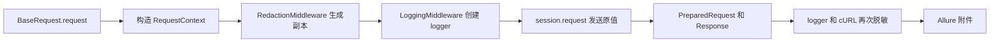

### 16.8 最小实验

- 实验输入：包含 header、params、嵌套 JSON、响应 token、Set-Cookie 和异常敏感文本的离线对象。
- 预期结果：transport 侧原值保持不变，观测附件不包含测试 secret。
- 实际结果：3 个测试文件共 16 项通过。
- 验证命令：`python -m pytest tests\test_api_call_logger.py tests\test_curl_builder.py tests\test_request_middleware.py -q`。
- 是否访问真实网络：否。
- 是否执行真实 sleep：否。

### 16.9 失败分析

- 环境层：虚拟环境缺少 pytest、requests 或 allure 时测试无法收集。
- 构造层：测试 Response 未绑定 PreparedRequest 时只能进入 fallback 路径。
- 适配层：Middleware 顺序错误会让 logger 读取原 kwargs。
- 策略层：字段未列入敏感集合会按普通字段保留。
- 表示层：非法 JSON 解析失败会回退原文本。
- 出口层：绕过 logger 的断言和 print 不受主链路保护。

本次实验没有失败。以上层次用于界定当前测试未证明的范围。

### 16.10 今日口述答案

- 旧实现需要演进的原因：它直接消费真实请求和响应，只有 cURL header 存在局部规则，同一敏感值可从多个表示泄漏。
- 能力放置层级：分流属于一次 attempt 的 Middleware 生命周期，结构转换属于通用 redaction，最终附件保护属于 logger 与 cURL 输出边界。
- 核心状态所有者：RequestContext 拥有 attempt 原始语义与派生状态；logger 拥有观测快照；requests 拥有最终 PreparedRequest。
- 当前方案收益与代价：同时保持 transport 真实性和观测安全，代价是副本、顺序依赖、重复转换和持续出口审计。
- 错误实现后果：原地脱敏导致真实请求失败，仅局部脱敏导致其他出口泄漏，自动读取 SSE body 导致流语义改变。
- 离线证明方式：分别测试副本隔离、prepared request 输出、response 输出、exception 文本和 cURL 表示，不访问真实接口。

### 16.11 未解决问题

- 已确认但暂不处理：旧断言、BaseTask、BaseDecorators 和 SSE 控制台仍有直接文本出口。
- 需要后续源码收敛：非法 JSON 的安全回退策略与统一 response summary。
- 需要真实业务协议决定：`client_secret` 等扩展字段应进入默认集合还是由模块配置提供。

### 16.12 今日结论

脱敏不是对真实请求做清洗，而是为观测目的派生安全表示。当前框架在 Middleware 处分流，在 logger 与 cURL 处保护最终表示，兼顾传输真实性和主要日志安全。整体安全仍取决于所有输出出口，旧断言和 SSE 等绕行路径是后续约束。

## 17. 最终验收答案

### 17.1 原始流与观测流的最迟分叉位置

分叉最迟发生在 LoggingMiddleware 创建 logger 之前。当前选择 RedactionMiddleware.before_request，在 transport 发送前从 `context.kwargs` 派生 `redacted_kwargs`。真实 kwargs 继续交给 session，安全副本交给 logger。

### 17.2 logger 二次脱敏的必要性

Middleware 只能看到发送前的 kwargs。PreparedRequest 还可能包含 Session 默认 header、编码后的 body 和最终 URL。logger 在读取最终请求事实时必须重新建立安全表示，否则发送前副本无法覆盖 prepare 阶段产生的数据。

### 17.3 cURL 独立脱敏的必要性

cURL 是新的可执行表示，可能脱离 Allure 单独复制和传播。它必须对自己的 URL、header 和 body 承担出口责任，不能依赖调用者已经把 PreparedRequest 修改为安全对象。

### 17.4 当前状态所有权

RequestContext 拥有一次 attempt 的 transport 状态和 Middleware 派生状态；RedactionMiddleware 创建安全副本；ApiCallLogger 拥有附件快照；requests 拥有最终 PreparedRequest 和 Response；执行器分别拥有 retry records 与 polling transitions。

### 17.5 当前方案相对替代方案的判断

原地脱敏破坏传输真实性；仅 logger 脱敏让所有风险集中到一个持续膨胀的类；每个调用点自行脱敏造成规则漂移；值级污点追踪超过当前成本约束。双流加末端防御能在兼容现有调用的前提下局部证明主要出口。

### 17.6 当前实现的准确安全声明

当前主请求日志已覆盖已知敏感 header、query、嵌套 JSON、form 请求、JSON response、exception、retry records、polling transitions 和 cURL。它不保证未知字段名、裸 secret、非结构化 response、畸形 JSON 或绕过 logger 的所有仓库输出安全。

## 18. 今日总结

日志与脱敏之所以是数据流问题，是因为同一事实必须同时存在真实表示和安全表示。当前 dev2 通过 RequestContext 隔离一次 attempt，用 RedactionMiddleware 建立观测副本，再由 ApiCallLogger 和 cURL builder 对最终表示执行末端防御。这个设计把传输正确性和日志安全性同时保住，并让副本隔离、输出安全和流式行为能够离线证明。

更深一层的结论是，脱敏函数不是系统安全边界，输出出口才是。字段集合、JSON 解析和正则只能处理进入它们的数据。任何直接拼接 `response.text` 或打印流内容的路径都会成为新的约束。后续扩展时，先识别数据将流向哪里，再决定由哪一层生成安全表示，优先级高于继续堆叠替换规则。

本节到此结束。下一节单独讲解如何从业务副作用推导 RetryPolicy。
