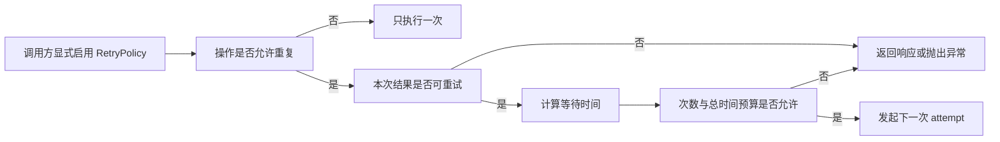
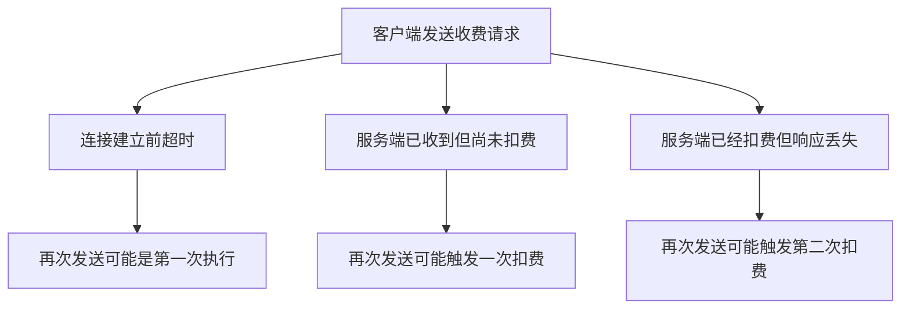
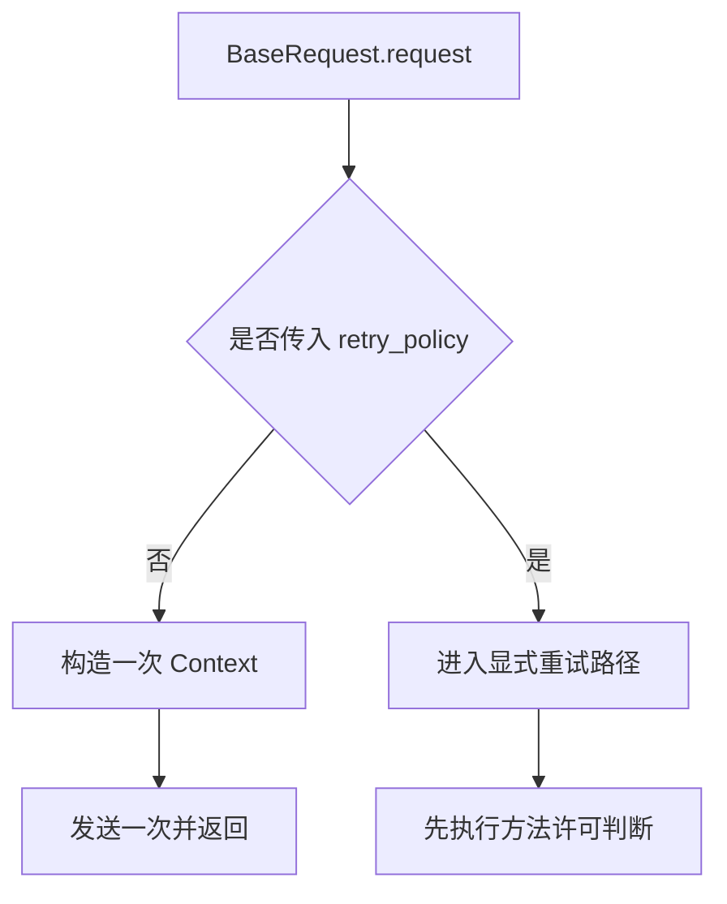
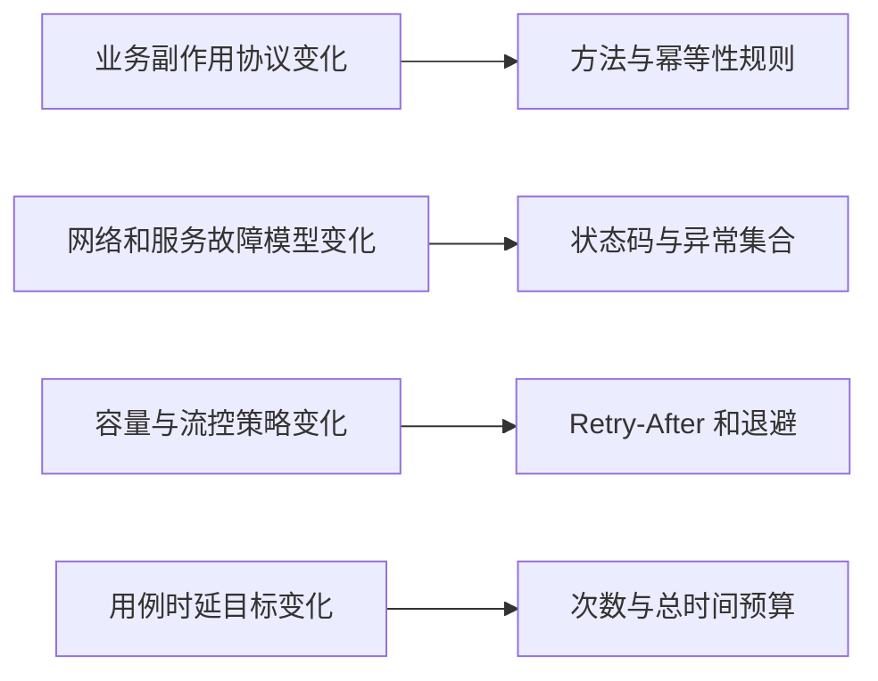
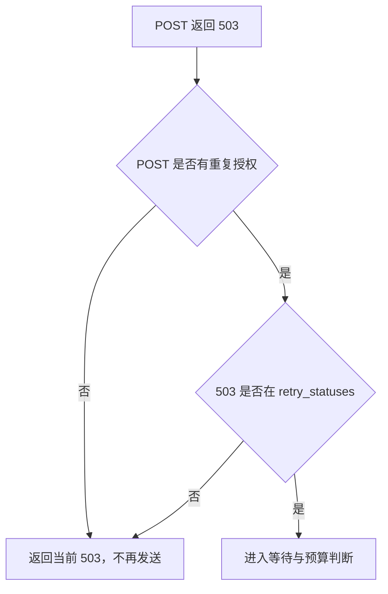
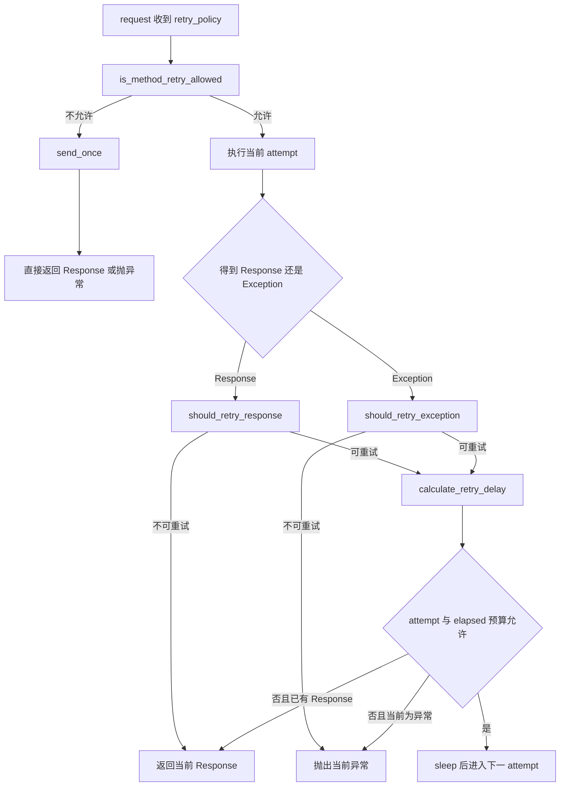

# 第 5 天：从业务副作用推导 RetryPolicy

## 0. 本节结论

重试不是“请求失败后再试一次”，而是框架决定再次执行一个可能产生业务副作用的操作。

一次 `Timeout` 只能证明客户端没有按时拿到结果，不能证明服务端没有扣费、创建订单或提交任务。一次 `503` 也只能说明当前响应属于候选瞬态故障，不能证明原操作可以安全重复。因此，重试决策必须依次通过四道门：



顺序不能颠倒：

```text
操作是否允许重复
  → 本次结果是否属于瞬态故障
  → 应该等待多久
  → 次数与总时间预算是否允许继续
```

从第一性原理看，状态码、异常、退避和预算都只是“如何重试”的技术事实；接口是否支持安全重复才是“能否重试”的业务事实。

从 TOC 约束理论看，当前系统的主约束不是缺少更丰富的异常表，而是框架无法单方面证明服务端的副作用语义。只要这个约束存在，默认关闭自动重试、POST 默认不重试、调用方显式传入策略，就是必要的安全边界。

本节只深入 `RetryPolicy` 及其决策函数。`RetryExecutor` 的循环抽离、每次 attempt 的 Context、记录与假时钟测试留到第 6 天。

## 1. 两小时学习结构

| 阶段 | 时间 | 学习内容 | 完成产出 |
| --- | ---: | --- | --- |
| 观察初版 | 0～15 分钟 | 确认初版只有单次发送，理解“不自动重试”的安全含义 | 初版约束说明 |
| 建立副作用模型 | 15～32 分钟 | 区分传输结果、服务端执行事实和业务幂等性 | 超时歧义因果链 |
| 阅读演进证据 | 32～50 分钟 | 对照 `56f4f15`、`291e6ea` 与当前 dev2 | 关键代码差异 |
| 找到变化轴 | 50～67 分钟 | 拆解方法、结果、等待、次数和总时间 | 策略字段分组表 |
| 精读策略判断 | 67～90 分钟 | 方法许可、状态码、异常、Retry-After 和退避 | 决策链 |
| 状态与边界 | 90～103 分钟 | 区分 Policy 稳定规则与 Executor 运行状态 | 状态所有权表 |
| 方案比较 | 103～112 分钟 | 比较全局重试、Adapter、手写循环和显式 Policy | 方案决策表 |
| 离线实验与验收 | 112～120 分钟 | 执行策略测试并回答收费 POST 问题 | 决策矩阵与结论 |

控制学习范围：今天回答“一个结果是否有资格进入下一次尝试”；明天再回答“多次尝试如何被正确组织”。

## 2. 先看真正的问题：客户端失败不等于服务端未执行

### 2.1 一个收费 POST 的超时歧义

设想客户端调用：

```http
POST /v1/charge

{"order_id": "order-001", "amount": 100}
```

客户端等待 10 秒后得到 `Timeout`，至少存在三种真实情况：



客户端只观察到一个 `Timeout`，无法从异常对象区分这三种情况。于是形成因果链：

```text
客户端没有收到结果
  → 客户端不知道服务端执行到哪一步
  → 重新发送可能重复业务副作用
  → Timeout 属于候选瞬态故障，但不是安全重试证明
  → 必须先取得接口幂等性或去重协议证据
```

这也是为什么“遇到网络错误就自动重试”不是稳定性优化，而可能是数据正确性缺陷。

### 2.2 幂等性不是“多发几次大概率没事”

在本课程中，操作可安全重试至少意味着：对于同一个逻辑请求，多次到达服务端不会产生超出一次调用意图的业务副作用。

常见证据包括：

- 接口本身是只读查询，重复调用不会改变业务状态。
- 服务端文档明确声明该操作幂等。
- 客户端为同一个逻辑操作复用非空且唯一的幂等键。
- 服务端承诺在规定窗口内按该键去重，并返回首次操作结果。
- 幂等键的作用域、有效期、冲突行为和请求体不一致行为都已明确。

HTTP 方法名只能提供默认线索，不能替代业务契约。例如 GET 理论上应安全，但一个错误设计为“读取即扣费”的 GET 仍不应被自动重复；PUT/DELETE 在 HTTP 语义上常被认为幂等，但当前框架默认许可集合只有 GET 和 HEAD。

### 2.3 两种不同的问题

| 问题 | 需要的证据 | 当前负责者 |
| --- | --- | --- |
| 操作能否再次执行 | 方法、业务契约、幂等键或显式风险授权 | `is_method_retry_allowed()` 与调用方 |
| 本次结果是否值得再试 | 状态码或异常是否属于候选瞬态故障 | `should_retry_response()` / `should_retry_exception()` |

只有两者同时为真，才有资格进入预算判断。把它们合并成“503 要重试”会丢失最关键的副作用约束。

## 3. 观察初版：没有策略，也没有隐式循环

演进前：`56f4f15`，`common/base_request.py`

```python
def request(self, method: str, path: str, **kwargs: Any) -> requests.Response:
    attach_log = kwargs.pop("_attach_log", True)
    url = self._build_url(path)
    kwargs.setdefault("timeout", self.config.timeout)

    headers = kwargs.pop("headers", None)
    if headers:
        kwargs["headers"] = self._merge_headers(headers)

    if method.upper() == "POST":
        start_media_downloads(kwargs.get("json"))

    logger = ApiCallLogger(method, url, kwargs)
    try:
        response = self.session.request(method=method, url=url, **kwargs)
    except Exception as error:
        if attach_log:
            logger.attach_failure(error)
        raise

    if attach_log:
        logger.attach_success(response)
    return response
```

这段代码只调用一次 `session.request()`：

- 收到响应就直接返回，包括 429 和 503。
- 捕获异常只为了挂载日志，随后重抛原异常。
- 没有 attempt、sleep、状态码集合和幂等性判断。

表面限制是无法自动恢复短暂网络故障；更深层的安全收益是，在框架不知道业务语义时，它不会擅自再次执行请求。

初版真正缺少的不是一个 `for` 循环，而是一组可审查的授权规则。如果直接在 `except` 中再调用一次 `session.request()`，代码会同时引入副作用风险、等待策略、预算和可观测性问题。

## 4. 第一次演进：把重试规则显式建模

### 4.1 `RetryPolicy` 首次形成

演进前：`56f4f15` 没有 `common/retry.py`，重试决策没有独立表示；`BaseRequest.request()` 只有上一节展示的单次发送。

演进后：`291e6ea`，`common/retry.py`

```python
DEFAULT_RETRY_STATUSES = frozenset({429, 500, 502, 503, 504})
DEFAULT_ALLOWED_METHODS = frozenset({"GET", "HEAD"})


@dataclass(frozen=True)
class RetryPolicy:
    max_attempts: int = 3
    retry_statuses: frozenset[int] = DEFAULT_RETRY_STATUSES
    retry_exceptions: tuple[type[BaseException], ...] = (
        requests.ConnectionError,
        requests.Timeout,
    )
    backoff: str = "exponential"
    base_delay: float = 0.5
    max_delay: float = 10.0
    jitter: bool = True
    respect_retry_after: bool = True
    max_elapsed: float | None = 30.0
    allowed_methods: frozenset[str] = DEFAULT_ALLOWED_METHODS
    allow_post: bool = False
    idempotency_header: str = "Idempotency-Key"

    def __post_init__(self) -> None:
        if self.max_attempts < 1:
            raise ValueError("max_attempts must be greater than or equal to 1")
        if self.base_delay < 0:
            raise ValueError("base_delay must be greater than or equal to 0")
        if self.max_delay < self.base_delay:
            raise ValueError("max_delay must be greater than or equal to base_delay")
        if self.max_elapsed is not None and self.max_elapsed <= 0:
            raise ValueError("max_elapsed must be greater than 0")
        if self.backoff not in {"fixed", "exponential"}:
            raise ValueError("backoff must be 'fixed' or 'exponential'")
        if not self.idempotency_header.strip():
            raise ValueError("idempotency_header must not be empty")
```

差异解释：

- 阶段：从“只能发送一次”演进到“调用方可显式声明一组重试规则”。
- 变化原因：不同接口对方法、瞬态故障、等待和预算的要求不同，这些变化不应散落在请求调用点。
- 状态所有者：不可变 `RetryPolicy` 拥有一次重试序列采用的稳定决策数据。
- 不变量：非法策略在发送前失败；执行过程中不能悄悄修改策略；POST 默认没有重复执行授权。

这里的 `frozen=True` 很重要。一次重试序列如果在第二次 attempt 前被其他代码改掉 `max_attempts` 或状态码集合，后续结果就无法按同一规则解释。

### 4.2 显式启用，而不是全局接管

演进后：`291e6ea`，`common/base_request.py`

```python
def request(self, method: str, path: str, **kwargs: Any) -> requests.Response:
    attach_log = kwargs.pop("_attach_log", True)
    retry_policy = kwargs.pop("retry_policy", None)
    if retry_policy is not None:
        return self._send_with_retry(
            method,
            path,
            retry_policy,
            attach_log=attach_log,
            **kwargs,
        )

    context = self._build_request_context(
        method,
        path,
        attach_log=attach_log,
        **kwargs,
    )
    return self._send(context)
```

当前 dev2 仍保留相同公开语义：没有传 `retry_policy` 就只发送一次。策略能力存在，不代表所有请求默认使用它。



这个入口保护两个不变量：旧用例行为不会因框架升级而悄悄变化；高风险接口必须在调用点或业务封装处显式表达重试意图。

### 4.3 此时只抽出了规则，尚未抽出执行状态

同一阶段：`291e6ea`，`common/base_request.py`

```python
started_at = time.monotonic()
retry_records: list[RetryAttemptRecord] = []
last_response: requests.Response | None = None

for attempt_index in range(1, retry_policy.max_attempts + 1):
    context = self._build_request_context(
        method,
        path,
        attach_log=attach_log,
        request_step_name=request_step_name,
        response_step_name=response_step_name,
        **kwargs,
    )
    context.attributes["attempt_index"] = attempt_index
    context.attributes["max_attempts"] = retry_policy.max_attempts
    context.attributes["retry_records"] = retry_records
```

代码证明第一次演进形成的是“策略数据边界”：`RetryPolicy` 已经独立，但本次执行的 `started_at`、`retry_records`、`attempt_index` 和 Context 创建仍由 `BaseRequest` 拥有。

因此不能从“已经有 RetryPolicy”推导出“重试职责已经完全抽离”。规则沿接口协议变化，运行进度沿一次执行变化，二者生命周期不同；这个尚未解决的边界正是第 6 天抽出 `RetryExecutor` 的起点。

## 5. `2748f16` 到当前 dev2：公开语义稳定，校验模型统一

演进后：`2748f16`，`common/retry.py`；当前 dev2 保持这一模型结构：

```python
class RetryPolicy(BaseModel):
    model_config = ConfigDict(
        frozen=True,
        arbitrary_types_allowed=True,
    )

    max_attempts: int = 3
    retry_statuses: frozenset[int] = DEFAULT_RETRY_STATUSES
    retry_exceptions: tuple[type[BaseException], ...] = (
        requests.ConnectionError,
        requests.Timeout,
    )
    backoff: str = "exponential"
    base_delay: float = 0.5
    max_delay: float = 10.0
    jitter: bool = True
    respect_retry_after: bool = True
    max_elapsed: float | None = 30.0
    allowed_methods: frozenset[str] = DEFAULT_ALLOWED_METHODS
    allow_post: bool = False
    idempotency_header: str = "Idempotency-Key"

    @field_validator("max_attempts")
    @classmethod
    def _validate_max_attempts(cls, value: int) -> int:
        if value < 1:
            raise ValueError(
                "max_attempts must be greater than or equal to 1"
            )
        return value

    @field_validator("base_delay")
    @classmethod
    def _validate_base_delay(cls, value: float) -> float:
        if value < 0:
            raise ValueError(
                "base_delay must be greater than or equal to 0"
            )
        return value

    @field_validator("max_elapsed")
    @classmethod
    def _validate_max_elapsed(
        cls,
        value: float | None,
    ) -> float | None:
        if value is not None and value <= 0:
            raise ValueError("max_elapsed must be greater than 0")
        return value

    @field_validator("backoff")
    @classmethod
    def _validate_backoff(cls, value: str) -> str:
        if value not in {"fixed", "exponential"}:
            raise ValueError(
                "backoff must be 'fixed' or 'exponential'"
            )
        return value

    @field_validator("idempotency_header")
    @classmethod
    def _validate_idempotency_header(cls, value: str) -> str:
        if not value.strip():
            raise ValueError("idempotency_header must not be empty")
        return value

    @model_validator(mode="after")
    def _validate_delay_range(self) -> RetryPolicy:
        if self.max_delay < self.base_delay:
            raise ValueError(
                "max_delay must be greater than or equal to base_delay"
            )
        return self
```

相对 `291e6ea`，`2748f16` 的主要变化是从 frozen dataclass 迁移为 frozen Pydantic model，并把手写 `__post_init__` 拆为字段级和模型级校验。公开策略字段、默认值和不可变语义基本保持，当前 dev2 延续了这个边界。

变化原因不是重试算法发生根本改变，而是框架结构化模型逐步统一到 Pydantic。状态所有者仍是 `RetryPolicy`，被保护的不变量仍是：调用前得到合法、不可变、可复用的决策规则。

注意：`arbitrary_types_allowed=True` 是因为 `retry_exceptions` 保存异常类对象；它不表示所有输入都跳过校验。

## 6. 找到变化轴：不要把所有 retry 参数当成一类

### 6.1 策略字段分组

| 决策阶段 | 字段 | 回答的问题 | 默认值 |
| --- | --- | --- | --- |
| 操作许可 | `allowed_methods` | 哪些方法默认允许重复 | GET、HEAD |
| 操作许可 | `allow_post` | 是否由调用方强制授权 POST | `False` |
| 操作许可 | `idempotency_header` | 用哪个 header 名识别幂等证据 | `Idempotency-Key` |
| 结果分类 | `retry_statuses` | 哪些响应是候选瞬态故障 | 429、500、502、503、504 |
| 结果分类 | `retry_exceptions` | 哪些异常是候选瞬态故障 | ConnectionError、Timeout |
| 等待控制 | `respect_retry_after` | 是否优先尊重服务端等待建议 | `True` |
| 等待控制 | `backoff` | 使用固定还是指数退避 | `exponential` |
| 等待控制 | `base_delay` | 本地退避的基础秒数 | `0.5` |
| 等待控制 | `max_delay` | 单次等待上限 | `10.0` |
| 等待控制 | `jitter` | 是否随机化本地退避 | `True` |
| 终止预算 | `max_attempts` | 最多总共发送几次 | `3` |
| 终止预算 | `max_elapsed` | 整个序列允许的时间上限 | `30.0` |

这些字段属于同一 Policy，是因为它们共同定义一次重试序列的稳定决策规则；但它们位于不同决策阶段，不能任意互换顺序。

### 6.2 变化轴之间为何独立



例如，服务端新增 429 并不意味着收费 POST 突然可以重复；业务接口支持幂等键也不意味着 SSLError 应该重试；延长总预算也不能把 400 变成瞬态故障。

如果一个函数只写成：

```python
if response.status_code >= 500:
    retry()
```

它把四条独立变化轴压缩成了一个状态码分支，无法表达业务授权、异常排除、等待和终止条件。

## 7. 第一关：方法许可必须最先判断

当前代码：`dev2`，`common/retry.py`

```python
def is_method_retry_allowed(
    method: str,
    kwargs: Mapping[str, Any],
    policy: RetryPolicy,
) -> bool:
    normalized_method = method.upper()
    if normalized_method in {
        name.upper() for name in policy.allowed_methods
    }:
        return True

    if normalized_method != "POST":
        return False

    if policy.allow_post:
        return True

    headers = kwargs.get("headers") or {}
    header_names = {
        str(name).lower() for name in dict(headers).keys()
    }
    return policy.idempotency_header.lower() in header_names
```

### 7.1 当前真实规则

| 请求 | 默认是否允许进入重试循环 | 原因 |
| --- | --- | --- |
| GET | 是 | 位于默认 `allowed_methods` |
| HEAD | 是 | 位于默认 `allowed_methods` |
| POST，无幂等键 | 否 | 副作用未知 |
| POST，存在 `Idempotency-Key` 名称 | 是 | 视为调用方提供了幂等证据 |
| POST，`allow_post=True` | 是 | 调用方显式承担风险 |
| PUT / DELETE | 否 | 当前默认集合不含它们，且特殊分支只处理 POST |
| PUT / DELETE，加入 `allowed_methods` | 是 | 调用方显式改变许可集合 |

方法名和 header 名判断都不区分大小写。

`BaseRequest` 传给许可函数的不是孤立的请求级 headers，而是合并 Session headers 后的视图：

当前代码：`dev2`，`common/base_request.py`

```python
return self.retry_executor.execute(
    method=first_context.method,
    request_kwargs=self._kwargs_with_session_headers(
        first_context.kwargs
    ),
    policy=retry_policy,
    context_factory=context_factory,
    send_once=self._send,
    attach_records=self._attach_retry_records,
    context_recorder=context_recorder,
)


def _kwargs_with_session_headers(
    self,
    kwargs: dict[str, Any],
) -> dict[str, Any]:
    retry_kwargs = dict(kwargs)
    merged_headers = dict(self.session.headers)
    merged_headers.update(dict(kwargs.get("headers") or {}))
    retry_kwargs["headers"] = merged_headers
    return retry_kwargs
```

因此幂等 header 可以来自 Session 或本次请求；同名请求级 header 覆盖 Session 值。这个合并只让许可判断看到真实发送时可用的 header 名，仍不验证值是否有效或服务端是否实现去重。

### 7.2 代码实际证明了什么，没有证明什么

代码只检查目标 header 名是否存在。它没有验证：

- header 值是否为空。
- 幂等键是否对每个逻辑操作唯一。
- 同一次逻辑操作的不同 attempt 是否复用同一个键。
- 服务端是否真正识别该 header。
- 服务端去重窗口是否覆盖整个重试时段。
- 相同键配不同请求体时服务端如何处理。

因此，框架检查是一个工程护栏，不是业务正确性证明。下面这种代码能通过当前许可判断，但不能形成有效业务证据：

```python
headers = {"Idempotency-Key": ""}
```

### 7.3 `allow_post=True` 的准确含义

`allow_post=True` 表示“调用方明确要求框架允许 POST 重试”，不是“框架已证明 POST 安全”。

对于收费接口，单独修改：

```python
RetryPolicy(allow_post=True)
```

只是绕过默认护栏。若服务端没有幂等协议，它会把不确定的一次收费升级为可能的重复收费。

### 7.4 方法许可在执行入口处生效

当前代码：`dev2`，`common/retry_executor.py`

```python
retry_records: list[RetryAttemptRecord] = []

if not is_method_retry_allowed(method, request_kwargs, policy):
    context = context_factory(1)
    self._prepare_context(context, policy, 1, retry_records)
    self._record_context(context_recorder, context)
    return send_once(context)

started_at = self.monotonic()
last_response: requests.Response | None = None
```

这里只展示执行器入口，是为了证明策略边界：方法不允许时仍会发送一次，但不会因为 503 或 Timeout 再次发送。完整循环如何组织属于第 6 天。

## 8. 第二关：把单次结果分类，而不是判断业务成功

当前代码：`dev2`，`common/retry.py`

```python
def should_retry_exception(
    error: BaseException,
    policy: RetryPolicy,
) -> bool:
    if isinstance(
        error,
        (
            requests.exceptions.SSLError,
            requests.exceptions.TooManyRedirects,
        ),
    ):
        return False
    return isinstance(error, policy.retry_exceptions)


def should_retry_response(
    response: requests.Response,
    policy: RetryPolicy,
) -> bool:
    return response.status_code in policy.retry_statuses
```

### 8.1 响应分类

默认情况下：

- 429、500、502、503、504 是候选可重试结果。
- 400、404 不重试。
- 200 也不重试，因为本次传输已得到正常响应。

`should_retry_response()` 不做 `raise_for_status()`，也不判断业务 JSON 中的 `code`。它只回答当前 HTTP 响应是否属于策略集合。

这意味着“不可重试”不等于“成功”。404 不重试，但仍可能由后续断言判定用例失败。

### 8.2 异常分类

默认 `retry_exceptions` 包含 `requests.ConnectionError` 和 `requests.Timeout`，但代码显式排除：

- `SSLError`：证书、信任链或协议错误通常需要配置修复，重复相同调用不会自然恢复。
- `TooManyRedirects`：重定向配置或循环问题通常不是短暂抖动。

显式排除的意义在于 `SSLError` 会落入更宽的 `ConnectionError`；如果调用方把 `RequestException` 一类宽类型加入策略，`TooManyRedirects` 也可能被包含。只做 `isinstance(error, policy.retry_exceptions)` 会把这些配置性错误误判为瞬态错误。

### 8.3 结果分类不是操作授权



503 只能让第二道门通过，不能代替第一道门。

## 9. 第三关：等待不是固定 sleep

等待的目的有两个：给服务端恢复时间，以及避免所有客户端在同一时刻再次冲击故障点。

### 9.1 解析服务端 `Retry-After`

当前代码：`dev2`，`common/retry.py`

```python
def parse_retry_after(
    value: str | None,
    *,
    now: datetime | None = None,
) -> float | None:
    if value is None:
        return None

    stripped_value = value.strip()
    if not stripped_value:
        return None

    try:
        delay = float(stripped_value)
    except ValueError:
        delay = None
    if delay is not None:
        if delay < 0:
            return None
        return delay

    try:
        retry_datetime = parsedate_to_datetime(stripped_value)
    except (TypeError, ValueError, IndexError, OverflowError):
        return None

    if retry_datetime.tzinfo is None:
        retry_datetime = retry_datetime.replace(tzinfo=UTC)

    now_datetime = now or datetime.now(UTC)
    if now_datetime.tzinfo is None:
        now_datetime = now_datetime.replace(tzinfo=UTC)

    return max(
        0.0,
        (retry_datetime - now_datetime).total_seconds(),
    )
```

它支持两种标准表示：

- 秒数，例如 `Retry-After: 3`。
- HTTP-date，例如未来 5 秒的 GMT 时间。

过去日期返回 0；负数、空值和无法解析的值返回 `None`，随后回退到本地 backoff。

### 9.2 计算最终等待时间

当前代码：`dev2`，`common/retry.py`

```python
def calculate_retry_delay(
    policy: RetryPolicy,
    attempt_index: int,
    *,
    response: requests.Response | None = None,
    random_uniform: Callable[[float, float], float] = random.uniform,
    now: datetime | None = None,
) -> float:
    retry_after_delay = None
    if policy.respect_retry_after and response is not None:
        retry_after_delay = parse_retry_after(
            response.headers.get("Retry-After"),
            now=now,
        )

    use_jitter = policy.jitter
    if retry_after_delay is not None:
        delay = retry_after_delay
        use_jitter = False
    elif policy.backoff == "fixed":
        delay = policy.base_delay
    else:
        delay = policy.base_delay * (
            2 ** max(0, attempt_index - 1)
        )

    delay = min(policy.max_delay, delay)
    if use_jitter and delay > 0:
        delay = random_uniform(0, delay)
    return max(0.0, delay)
```

计算优先级为：

```text
合法 Retry-After
  → 否则 fixed 或 exponential backoff
  → max_delay 截断
  → 仅对本地 backoff 可选 full jitter
```

### 9.3 指数退避的 attempt 含义

指数退避公式是：

```python
base_delay * 2 ** max(0, attempt_index - 1)
```

默认 `base_delay=0.5`、关闭 jitter 时：

| 刚结束的 attempt | 下一次等待 |
| ---: | ---: |
| 1 | 0.5 秒 |
| 2 | 1.0 秒 |
| 3 | 2.0 秒 |
| 4 | 4.0 秒 |

等待最终受 `max_delay` 截断。这里的 `attempt_index` 是刚刚失败的发送序号，不是“已重试次数”。

### 9.4 jitter 解决什么问题

没有 jitter 时，大量客户端如果同一时刻收到 503，会在完全相同的 0.5、1、2 秒再次到达服务端，形成同步重试风暴。

当前实现使用 full jitter：从 `[0, delay]` 中均匀取值。它降低客户端同步概率，但让单次等待不再确定，所以测试通过注入 `random_uniform` 固定结果。

合法 `Retry-After` 不应用 jitter，因为它是服务端明确给出的等待建议；但当前实现仍会用 `max_delay` 截断它。这是当前真实语义，不应误写为“始终完整尊重服务端时间”。

## 10. 第四关：次数上限和总时间预算

### 10.1 `max_attempts` 是总发送次数

| 配置 | 最多初次发送 | 最多额外重试 | 最多总 attempt |
| --- | ---: | ---: | ---: |
| `max_attempts=1` | 1 | 0 | 1 |
| `max_attempts=2` | 1 | 1 | 2 |
| `max_attempts=3` | 1 | 2 | 3 |

把 `max_attempts=3` 理解成“初次发送加 3 次重试”会把真实上限误算为 4。当前循环使用：

```python
for attempt_index in range(1, policy.max_attempts + 1):
```

所以字段名称与实现一致：它限制全部 attempt。

### 10.2 Policy 保存预算，Executor 消耗预算

`RetryPolicy.max_elapsed` 只描述允许的上限；它不会自己读取时钟。当前执行器的判断为：

当前代码：`dev2`，`common/retry_executor.py`

```python
def _can_retry_within_elapsed(
    self,
    policy: RetryPolicy,
    started_at: float,
    wait_seconds: float,
) -> bool:
    if policy.max_elapsed is None:
        return True
    return (
        self.monotonic() - started_at + wait_seconds
    ) <= policy.max_elapsed
```

这段代码证明两个状态所有者不同：

- Policy 拥有稳定上限 `max_elapsed`。
- Executor 拥有本次执行的 `started_at`、当前时间和即将发生的 wait。

当前预算只检查“已用时间 + 下一次等待”，没有预估下一次网络调用会耗时多久。因此 `max_elapsed` 是重试调度预算，不是整个调用绝不超过该秒数的硬实时保证。

### 10.3 预算不足时为何有两种结果

当前实现中：

- response 路径预算不足：返回当前 response。
- exception 路径预算不足：重新抛出当前原异常。

原因不是任意分支风格，而是当前已有的终止事实不同：response 路径有一个可返回的 HTTP 结果，exception 路径只有异常。如果为统一形式而把 503 包装成异常，或把 Timeout 转成伪响应，都会改变请求层已有语义。

这些是执行器边界的必要预告；第 6 天再完整展开循环、记录、sleep 和异常身份。

## 11. 状态所有者与生命周期

### 11.1 状态表

| 状态 | 谁创建 | 谁修改 | 谁结束/清理 | 生命周期 |
| --- | --- | --- | --- | --- |
| 方法许可集合 | RetryPolicy 构造者 | frozen，不修改 | Policy 被释放 | 可跨多次执行复用 |
| 状态码/异常集合 | RetryPolicy 构造者 | frozen，不修改 | Policy 被释放 | 可跨多次执行复用 |
| 退避规则与预算上限 | RetryPolicy 构造者 | frozen，不修改 | Policy 被释放 | 可跨多次执行复用 |
| 当前 attempt 序号 | RetryExecutor | 每轮推进 | 序列结束 | 一次 retry 序列 |
| started_at / elapsed | RetryExecutor 与时钟 | 随执行推进 | 序列结束 | 一次 retry 序列 |
| retry records | RetryExecutor | 每次候选重试后追加 | 最终挂载 | 一次 retry 序列 |
| method、URL、kwargs | RequestContext 工厂 | 单次中间件与 transport 使用 | attempt 结束 | 一次 HTTP attempt |
| Response 或 Exception | transport | 不由 Policy 修改 | 当前 attempt 结束或返回 | 一次 HTTP attempt |
| 服务端幂等记录 | 服务端 | 服务端按业务协议维护 | 去重窗口结束 | 业务协议定义 |

### 11.2 为什么 Policy 不应保存 `current_attempt`

同一个不可变 Policy 可以被多个请求甚至并发请求复用。如果把 `current_attempt`、`started_at` 或 records 放入 Policy：

```text
共享 Policy
  → 多个执行共同修改 attempt
  → 一个请求消耗另一个请求的预算
  → 日志记录互相串扰
  → 策略不再是可复用值对象
```

状态持续多久决定它属于哪一层。稳定规则属于 Policy；一次序列的可变进度属于 Executor；一次发送的参数和中间件数据属于 RequestContext。

## 12. 从状态所有者推导职责边界

### 12.1 必须保持的不变量

1. 未显式传入策略的请求仍只发送一次。
2. 操作许可先于状态码和异常判断。
3. 非幂等 POST 默认不自动重试。
4. 单次结果分类不伪装成业务成功判断。
5. 同一次执行期间策略不可变。
6. 次数上限表示总 attempt 数。
7. 等待不超过 `max_delay`，总调度受 `max_elapsed` 控制。
8. 最终 response 或原异常语义不因预算终止而被无故转换。

### 12.2 当前边界

| 层 | 应负责 | 不应负责 |
| --- | --- | --- |
| 业务调用方/封装 | 提供接口幂等证据，决定是否显式启用 | 把 Timeout 当作服务端未执行证明 |
| RetryPolicy | 保存合法、不可变的许可、分类、等待和预算规则 | 保存当前 attempt、sleep 或累计记录 |
| 策略函数 | 对单个输入做方法、结果和 delay 判断 | 发送请求、写日志、执行真实等待 |
| RetryExecutor | 消耗 Policy，推进 attempt、时间和记录 | 猜测服务端是否支持幂等 |
| BaseRequest | 构造请求并把单次发送能力交给执行器 | 内置所有接口的业务重试规则 |
| 服务端 | 执行真正去重，定义键的作用域和有效期 | 依赖客户端“尽量不要重复”保证一致性 |

### 12.3 TOC 清晰思考：先利用约束，再考虑升级

当前约束是客户端无法知道服务端副作用是否发生。合理利用方式是：

1. 默认不启用重试。
2. 默认只许可 GET、HEAD。
3. POST 需要幂等 header 名或显式授权。
4. 对允许的操作再使用瞬态故障、退避和预算规则。

提升约束需要服务端协作，例如完善幂等协议、查询操作结果或提供业务 request ID。继续扩大 `retry_statuses` 无法提升这个约束，只会让更多结果进入潜在重复执行路径。

## 13. 真实决策链



这张图中 Policy 参与所有判断，但不拥有流程游标。它像规则表，Executor 才是读取规则并推进流程的对象。

## 14. 最小重试决策矩阵

假设使用默认 `RetryPolicy()`，且次数和时间预算仍充足：

| 方法与业务证据 | 本次结果 | 方法允许 | 结果可重试 | 是否再次发送 | 终结行为 |
| --- | --- | ---: | ---: | ---: | --- |
| GET | 400 | 是 | 否 | 否 | 返回 400 |
| GET | 404 | 是 | 否 | 否 | 返回 404 |
| GET | 429 | 是 | 是 | 是 | 按 Retry-After 或 backoff |
| GET | 503 | 是 | 是 | 是 | 按 backoff |
| GET | Timeout | 是 | 是 | 是 | 按 backoff |
| GET | SSLError | 是 | 否 | 否 | 抛出原 SSLError |
| POST，无幂等键 | 503 | 否 | 是 | 否 | 返回 503 |
| POST，无幂等键 | Timeout | 否 | 是 | 否 | 抛出原 Timeout |
| POST，有幂等键名 | 503 | 是 | 是 | 是 | 按策略继续 |
| POST，有幂等键名 | 400 | 是 | 否 | 否 | 返回 400 |
| POST，`allow_post=True` | 503 | 是 | 是 | 是 | 调用方承担副作用风险 |
| DELETE，默认策略 | 503 | 否 | 是 | 否 | 返回 503 |

矩阵中特别要看两个反例：

- POST 503 的“结果可重试”为真，但“方法允许”为假，所以不能再次发送。
- POST 有幂等键 400 的“方法允许”为真，但“结果可重试”为假，所以也不能再次发送。

重试需要多条件同时成立，不是任意一项成立。

## 15. 方案比较

| 方案 | 状态放在哪里 | 收益 | 代价/失败方式 | 适用条件 |
| --- | --- | --- | --- | --- |
| 当前显式 `RetryPolicy` | 调用点选择 Policy；规则在不可变对象；进度在 Executor | 意图可见，可按接口定制，副作用护栏和离线测试清晰 | 调用方必须理解业务协议；参数较多；header 检查不能证明服务端幂等 | 接口语义不同，需要审计和精确控制 |
| 全局自动重试 | 全局 client 或基础配置 | 接入最省事，所有请求统一 | 高风险 POST 可能被隐式重复；旧用例语义变化；难定位谁授权 | 所有操作都被服务端统一幂等化且规则一致 |
| requests Adapter 默认重试 | Session transport adapter | 复用成熟 HTTP 层能力，连接池集成自然 | 业务意图远离调用点；应用层记录和 Context 边界难统一；方法规则易被全局化 | 纯 transport 场景，业务操作均满足统一约束 |
| 调用点手写循环 | 每个测试或业务函数 | 局部灵活，无需框架抽象 | 判断、sleep、异常和日志重复；容易漏预算或错误重试 POST | 极少数一次性特殊逻辑 |
| 普通 RequestMiddleware 重试 | 单次 attempt hook | 表面上靠近请求 | 当前 hook 不拥有再次调用 transport 的控制权；易重复执行其他 Middleware 或形成递归 | 只有协议专门支持 around/next 控制流时才考虑 |

### 15.1 为什么当前方案不是“绝对最好”

若一个组织已经在服务端网关强制所有写操作使用统一幂等协议，并且 transport retry 有完整 trace，Adapter 方案可能更省成本。若只有一个特殊长任务需要业务查询确认，手写的领域恢复流程可能比通用 HTTP retry 更准确。

当前方案成立的约束是：框架服务多个语义不同的接口，默认行为必须保守，同时需要在调用点看见授权，并能离线证明决策函数。

## 16. 当前实现的限制与误用风险

### 16.1 幂等 header 只检查名称存在

空字符串也会放行，唯一性、复用和服务端支持均不校验。高风险接口应在业务封装层增加值校验和 key 生成规则。

### 16.2 HTTP 方法默认集合偏保守

PUT、DELETE 没有默认启用。即使 HTTP 规范常把它们视作幂等，真实接口也可能实现得不幂等。调用方需要在掌握业务证据后显式加入 `allowed_methods`。

### 16.3 `allow_post=True` 容易被误读

它是绕过默认护栏的人工授权，不是自动幂等化。代码评审应要求同时说明服务端契约或可接受的副作用风险。

### 16.4 `Retry-After` 会被 `max_delay` 截断

服务端要求等待 60 秒、Policy 的 `max_delay=10` 时，当前计算结果是 10 秒。对于强限流服务，这可能过早重试。调用方应让 `max_delay` 与服务端协议一致。

### 16.5 `max_elapsed` 不是硬 deadline

它检查已用时间加下一次 sleep，不预估下一次网络耗时。单次 request 自身还由 timeout 控制；两类时间预算需要共同设计。

### 16.6 状态码集合不理解业务响应

HTTP 200 中的业务错误不会触发 HTTP RetryPolicy；HTTP 503 即使返回确定性业务拒绝，也会按集合分类。需要领域恢复时，不应无限扩张通用策略函数。

### 16.7 同一幂等键的生成与复用不由 RetryPolicy 负责

Policy 只定义 header 名。真正的 key 应在进入重试序列前生成一次，并让所有 attempt 使用同一值；每次 attempt 生成新 key 会让服务端把它们视为不同操作。

## 17. 最小实验与当前结果

### 17.1 实验范围

本节只验证纯策略函数，不访问真实网络、不执行真实 sleep，也不验证完整执行循环。覆盖：

- 非法 `max_attempts` 在构造时失败。
- Policy 是 frozen Pydantic model。
- `Retry-After` 秒数、HTTP-date、过去日期和非法回退。
- 指数退避受 `max_delay` 限制。
- jitter 可通过注入随机函数确定性测试。
- GET 默认许可。
- POST 无键、有键和 `allow_post=True`。
- 400、404、429、503。
- Timeout 可重试，SSLError 被排除。

### 17.2 验证命令

```powershell
cd D:\API_CASE
.\.venv\Scripts\python.exe -m pytest tests\test_retry_policy.py -q
```

### 17.3 dev2 当前实际结果

```text
...............
15 passed in 0.34s
```

### 17.4 测试中的关键证据

当前测试：`dev2`，`tests/test_retry_policy.py`

```python
def test_post_without_idempotency_key_is_not_retry_allowed():
    assert not is_method_retry_allowed(
        "POST",
        {"headers": {}},
        RetryPolicy(),
    )


def test_post_with_idempotency_key_is_retry_allowed():
    assert is_method_retry_allowed(
        "POST",
        {"headers": {"Idempotency-Key": "request-001"}},
        RetryPolicy(),
    )


def test_timeout_is_retryable_but_ssl_error_is_not():
    policy = RetryPolicy()

    assert should_retry_exception(
        requests.Timeout("timeout"),
        policy,
    )
    assert not should_retry_exception(
        requests.exceptions.SSLError("ssl"),
        policy,
    )
```

这些测试证明当前代码如何分类输入，不证明真实收费接口支持幂等。业务契约不能由单元测试伪造出来。

## 18. 按每日学习记录模板生成的完整记录

### 18.1 基本信息

- 对应课程日：第 5 天。
- 建议投入时间：120 分钟。
- 今日主题：从业务副作用推导 RetryPolicy。
- 代码基准：当前 `dev2` 分支。

### 18.2 观察旧实现

- 使用的历史提交：`56f4f15` 初版与 `291e6ea` 首次策略引入。
- 旧实现职责：`BaseRequest.request()` 构造参数、发送一次、挂载成功或失败日志；没有重试判断和循环。
- 具体问题：429、503、ConnectionError 和 Timeout 都直接终结，无法恢复候选瞬态故障；若直接在异常分支加循环，又无法控制副作用、等待和预算。
- 已真实出现的结构变化：`291e6ea` 新增 frozen `RetryPolicy` 与显式入口。
- 未来风险：把“提高成功率”等同于“所有错误都再试”，导致重复扣费、重复创建资源和重试风暴。

### 18.3 找到变化轴

| 变化内容 | 为什么变化 | 变化频率 | 是否与其他内容独立 |
| --- | --- | --- | --- |
| 方法许可 | 接口副作用与幂等协议不同 | 按接口变化 | 独立于状态码 |
| 响应状态集合 | 服务故障与限流协议变化 | 中 | 独立于业务授权 |
| 异常集合 | 网络库和故障模型变化 | 低到中 | 独立于等待时间 |
| Retry-After | 服务端流控策略变化 | 中 | 独立于方法许可 |
| backoff 与 jitter | 容量恢复和并发冲击变化 | 中 | 独立于业务结果 |
| attempt 上限 | 成功率与调用成本权衡 | 按场景变化 | 与总时间相关但不等价 |
| elapsed 上限 | 测试 SLA 和外层预算变化 | 按场景变化 | 独立于单次 timeout |

### 18.4 识别状态所有者

| 状态 | 谁创建 | 谁修改 | 谁结束/清理 | 生命周期 |
| --- | --- | --- | --- | --- |
| 许可、分类和退避规则 | Policy 构造者 | frozen，不修改 | Policy 释放 | 多次执行可复用 |
| 当前 attempt | RetryExecutor | 每轮推进 | 序列结束 | 一次 retry 序列 |
| 累计 elapsed | 时钟与 RetryExecutor | 执行中增长 | 序列结束 | 一次 retry 序列 |
| retry records | RetryExecutor | 候选重试后追加 | 最终挂载 | 一次 retry 序列 |
| 请求 Context | BaseRequest 的工厂 | 单次发送链使用 | attempt 结束 | 一次 attempt |
| 幂等去重记录 | 服务端 | 服务端维护 | 去重窗口结束 | 业务协议定义 |

### 18.5 推导职责边界

- 必须保持的不变量：默认只发送一次；方法许可先于结果分类；POST 默认不重试；策略在执行中不可变；attempt 表示总次数；预算终止保留当前响应或原异常。
- 根据生命周期推导的边界：Policy 保存稳定规则，Executor 保存一次序列进度，Context 保存一次发送状态，业务方与服务端共同负责真正幂等。
- 当前代码的实际边界：`request()` 显式选择策略；`common/retry.py` 提供纯判断；Executor 消耗判断并推进循环。
- 推导与当前实现不一致之处：框架只能检查幂等 header 名，不能证明值、唯一性、复用或服务端去重；这是业务协议信息缺失，不应假装由通用 Policy 解决。

### 18.6 比较其他方案

当前显式 Policy 比全局重试更能暴露授权意图，比 Adapter 更接近业务调用点，比手写循环更能统一预算和测试。代价是调用方必须理解接口协议，并显式配置。当前设计选择保守默认，是用少量接入成本交换副作用安全和可审计性。

### 18.7 代码执行链


### 18.8 最小实验

- 实验输入：默认 Policy 下的 GET/POST、400/404/429/503、Timeout/SSLError、幂等键与 Retry-After。
- 预期结果：先由方法决定是否允许，再由结果决定是否值得继续；delay 遵守优先级和上限。
- 实际结果：`tests/test_retry_policy.py` 共 15 项通过。
- 使用的验证命令：`.\.venv\Scripts\python.exe -m pytest tests\test_retry_policy.py -q`。
- 是否访问真实网络：否。
- 是否执行真实 sleep：否。

### 18.9 失败分析

本次实验没有失败。若失败，按以下层次定位：

1. 环境层：虚拟环境是否包含 pytest、requests 和 Pydantic。
2. 测试构造层：Response 是否设置状态码、header 和时间基准。
3. 框架适配层：传入 header 是否位于策略函数实际读取的 kwargs 中。
4. 策略判断层：方法许可、异常排除、状态集合和 delay 优先级是否符合代码。
5. 业务语义层：服务端是否真正支持幂等，这一层不能由纯策略测试证明。

### 18.10 今日口述答案

- 旧实现为什么需要演进：它只能单次发送，无法恢复瞬态故障；直接增加循环又会缺失副作用授权、退避和预算边界。
- 这项能力为什么放在当前层：方法许可、结果分类和等待规则是可复用的稳定决策，适合不可变 Policy；运行游标属于 Executor。
- 核心状态由谁拥有：Policy 拥有规则并可跨执行复用；Executor 拥有一次序列的 attempt、elapsed 和 records；Context 只活一个 attempt。
- 当前方案比备选方案好在哪里：显式、保守、可审计且可离线验证；代价是配置较多，并依赖调用方提供真实业务证据。
- 错误实现会造成什么后果：可能重复扣费、重复创建资源，或在故障时形成同步重试风暴并放大服务压力。
- 如何离线证明：用纯对象验证方法、响应、异常、Retry-After、退避和不可变性；不访问真实接口，不真实 sleep。

### 18.11 未解决问题

- 已确认但暂不处理：幂等 header 只检查名称存在，`Retry-After` 会被 `max_delay` 截断，`max_elapsed` 不是硬 deadline。
- 需要第 6 天回看：每次 attempt 的 Context、records、sleep、时间预算和异常身份如何由 RetryExecutor 维护。
- 需要真实业务协议才能回答：收费接口是否支持幂等键、去重窗口多长、相同键配不同 body 如何处理、如何查询首次执行结果。

### 18.12 今日结论

重试是再次执行业务操作的授权决策。当前框架先检查方法与幂等证据，再分类瞬态结果，最后受退避、次数和时间预算约束。Policy 拥有不可变规则，Executor 才拥有执行进度；状态码和 Timeout 都不能单独证明写操作可安全重复。

## 19. 最终验收：收费 POST 需要哪些业务证据

面对收费接口，不能只写 `allow_post=True`。允许自动重试前至少确认：

1. 服务端正式文档声明支持幂等请求。
2. 幂等键由谁生成，保证非空，并对每个逻辑收费操作唯一。
3. 同一逻辑操作的所有 attempt 复用同一个键，而不是每次重新生成。
4. 服务端按什么作用域去重，例如商户、账号和接口路径。
5. 去重窗口是否大于客户端最大重试时间和可能的网络延迟。
6. 相同 key、相同 body 会返回首次结果，而不是再次扣费。
7. 相同 key、不同 body 是拒绝、冲突还是覆盖。
8. 客户端超时后是否能按 key 或业务单号查询最终结果。
9. 哪些状态码和异常被服务端定义为可安全恢复。
10. 重试次数、总时长、单次 timeout 和限流要求是否一致。

只有这些证据成立，下面的代码才是业务协议的表达：

```python
from common import RetryPolicy

charge_key = "charge-order-001"
response = client.post(
    "/v1/charge",
    headers={"Idempotency-Key": charge_key},
    json={"order_id": "order-001", "amount": 100},
    retry_policy=RetryPolicy(max_attempts=3),
)
```

代码中的 header 不是让请求“技术上可以重试”的魔法字符串；它只是客户端参与服务端去重协议的载体。

## 20. 今日总结

第 5 天从初版单次发送出发，找到了重试能力的核心变化轴：业务操作许可、单次结果分类、等待控制和终止预算。`291e6ea` 首次用 frozen dataclass 把这些规则显式建模，当前 dev2 迁移到 frozen Pydantic model，但继续保持默认关闭、POST 保守和调用方显式启用。

最重要的判断顺序是：先问操作能否重复，再问本次结果是否瞬态，然后计算等待并检查预算。`RetryPolicy` 保存可复用且不可变的规则；attempt、elapsed、sleep 和 records 属于一次执行。真正的幂等状态位于服务端，框架只能验证有限的客户端证据，不能从 503、Timeout 或一个 header 名推导出业务安全。

本节到此结束。下一节将从 `291e6ea` 中仍留在 `BaseRequest` 的完整重试循环出发，推导为什么当前实现进一步抽离 `RetryExecutor`。
