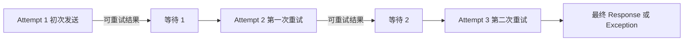
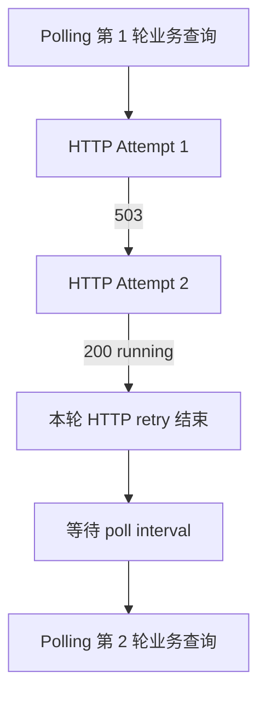
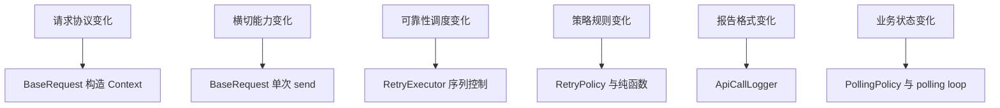
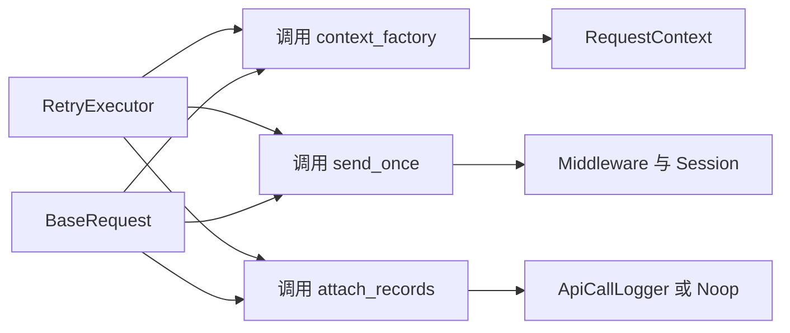
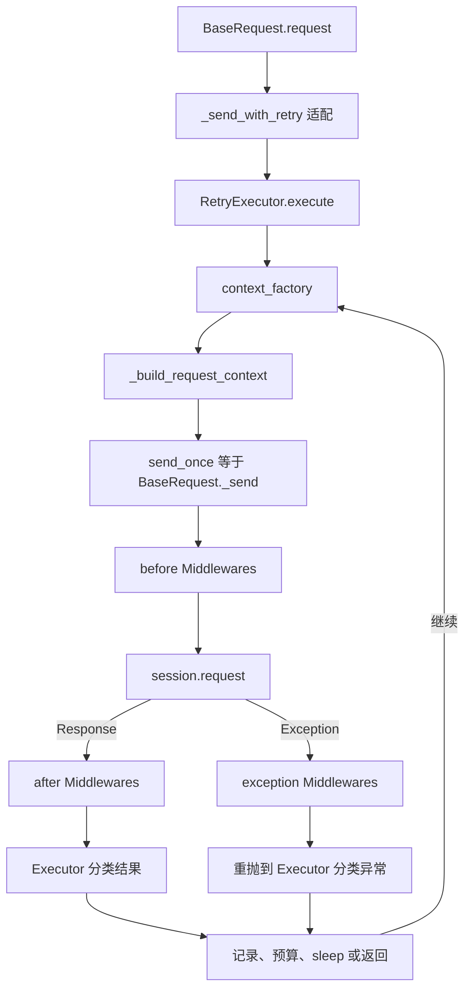
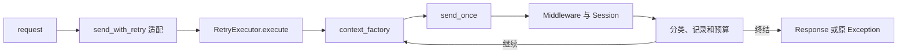

# 第 6 天：重试循环为什么从 BaseRequest 再次抽离

## 0. 本节结论

第 5 天解决了“什么情况下允许再次尝试”，第 6 天解决“谁负责把多次尝试组织成一个正确的执行过程”。

`RetryPolicy` 独立之后，`291e6ea` 的重试功能已经可用，但 `BaseRequest._send_with_retry()` 仍同时知道：

- 如何构造 URL、headers 和 `RequestContext`。
- 如何执行 Middleware 和 `requests.Session`。
- 当前是第几次 attempt。
- 已经积累了哪些重试记录。
- 什么时候读取单调时钟、计算等待并 sleep。
- response 路径和 exception 路径如何终结。
- 轮询场景最后应该使用哪个 Context 的 logger。

这不是简单的“函数太长”，而是两个不同生命周期被同一个对象拥有：

### 0.1 贯穿式数据流总图

```mermaid
flowchart TD
    A["BaseRequest.get()｜进入 GET 请求"] --> B["BaseRequest.request()｜选择 retry 发送路径"]
    B --> C["BaseRequest._send_with_retry()｜适配请求能力到执行器"]
    C --> C1["BaseRequest._build_request_context()｜构造策略判断输入"]
    C1 --> C2["BaseRequest._kwargs_with_session_headers()｜合并最终请求头"]
    C2 --> D["RetryExecutor.execute()｜组织多 attempt 序列"]
    D --> D1["is_method_retry_allowed()｜确认 GET 可重复发送"]
    D1 --> E1["context_factory()｜创建 attempt 1 的 Context"]
    E1 --> F1["BaseRequest._build_request_context()｜构造本轮请求上下文"]
    F1 --> G1["RetryExecutor._prepare_context()｜写入 attempt 1 元数据"]
    G1 --> H1["BaseRequest._send()｜执行 attempt 1"]
    H1 --> I1["requests.Session.request()｜返回 HTTP 503"]
    I1 --> J1["should_retry_response()｜判定响应可重试"]
    J1 --> K["calculate_retry_delay()｜计算退避时间"]
    K --> K0["retry_reason_for_response()｜生成本轮重试原因"]
    K0 --> K1["RetryAttemptRecord()｜保存本轮重试事实"]
    K1 --> K2["BaseRequest._attach_retry_records()｜挂载累计重试记录"]
    K2 --> K3["RetryExecutor._can_retry_within_elapsed()｜检查剩余预算"]
    K3 --> L["time.sleep()｜通过注入的 sleeper 执行等待"]
    L --> E2["context_factory()｜创建 attempt 2 的 Context"]
    E2 --> F2["BaseRequest._build_request_context()｜构造新请求上下文"]
    F2 --> G2["RetryExecutor._prepare_context()｜写入 attempt 2 元数据"]
    G2 --> H2["BaseRequest._send()｜执行 attempt 2"]
    H2 --> I2["requests.Session.request()｜返回 HTTP 200"]
    I2 --> J2["should_retry_response()｜判定响应无需重试"]
    J2 --> M["BaseRequest._attach_retry_records()｜挂载最终重试记录"]
```



图 6-1：`503 → 200` 的两次 HTTP attempt 成功主路径。图中重复展开 Context 构造和单次发送，是为了呈现每个 attempt 都会得到独立 `RequestContext`；次数耗尽、异常、预算不足和方法不允许等分支在图外说明。

### 0.2 按图顺序讲解关键函数

| 顺序 | 真实函数/方法 | 输入 → 输出 | 失败与边界 | 最小关键代码 |
| ---: | --- | --- | --- | --- |
| 1～2 | `BaseRequest.get()`、`request()` | `path`、`retry_policy` → 进入重试发送并最终返回 `Response` | 未传 Policy 时直接走单次 `_send()`；本图只选显式重试主路径 | `return self.request("GET", path, **kwargs)` |
| 3 | `BaseRequest._send_with_retry()` / `_build_request_context()` / `_kwargs_with_session_headers()` | method、path、Policy、kwargs → Executor 回调与包含 Session headers 的判断输入 | 首个 Context 只提供规范化 method/kwargs；`context_factory` 仍会为每轮重建 Context | `request_kwargs=self._kwargs_with_session_headers(first_context.kwargs)` |
| 4 | `RetryExecutor.execute()` / `is_method_retry_allowed()` | Policy、三个回调 → 获得重复发送许可后进入序列 | 拥有 attempt、records、时钟和 sleep；方法不允许重试时只执行一次 | `if not is_method_retry_allowed(...): return send_once(context)` |
| 5～7 | `context_factory()`、`_build_request_context()`、`_prepare_context()` | attempt 序号与原始 kwargs → 独立 Context 和 attempt 元数据 | 深拷贝尽量隔离各轮 payload；Policy 与累计 records 由 Executor 写入 Context | `context.attributes["retry_records"] = retry_records` |
| 8～9 | `BaseRequest._send()`、`requests.Session.request()` | Context → 本轮 `Response` 或 transport exception | `_send()` 保留 Middleware 生命周期；异常先交给 exception Middleware，再原样抛出 | `response = self.session.request(...)` |
| 10 | `should_retry_response()` | Response、Policy → `bool` | 只判断状态码是否在 `retry_statuses`，不判断业务成功 | `return response.status_code in policy.retry_statuses` |
| 11～15 | `calculate_retry_delay()`、`retry_reason_for_response()`、`RetryAttemptRecord()`、`_attach_retry_records()`、`_can_retry_within_elapsed()` | 本次结果与序列状态 → 不可变记录及是否仍可继续 | 先形成并挂载记录，再检查“已耗时 + 将等待时间”；预算不足时不 sleep | `retry_records.append(RetryAttemptRecord(...))` |
| 16 | `time.sleep()`（默认注入的 `sleeper`） | wait seconds → 完成等待 | 测试可注入 fake sleeper，因此执行器不被真实时间阻塞 | `self.sleeper(wait_seconds)` |
| 17 | `BaseRequest._attach_retry_records()` | 最终 Context、累计 records → logger 附件 | 没有记录时直接返回；只负责展示，不决定是否继续 | `logger.attach_retry_records(records)` |

从第一性原理看，重试机制只需要包装一个最小动作：

```text
send_once(context) → Response 或抛出 Exception
```

它不需要知道 URL 如何拼接、中间件有哪些、Session 如何配置、Allure 怎样输出。反过来，单次发送也不需要知道这是整个序列的第几次尝试。

从 TOC 约束理论看，`291e6ea` 的主约束已经不再是 Policy 缺失，而是所有多 attempt 控制流仍集中在 `BaseRequest`。继续加入时间预算、记录、指标或取消能力都会修改请求核心。`2748f16` 通过 `RetryExecutor` 把这一约束从“巨大的请求类”移动到“可独立验证的序列执行器”。

本节的核心判断是：

```text
规则由 RetryPolicy 拥有
  → 序列进度由 RetryExecutor 拥有
  → 单次请求事实由 RequestContext 与 BaseRequest 拥有
  → 日志表示仍由 logger 拥有
```

## 1. 两小时学习结构

| 阶段 | 时间 | 学习内容 | 完成产出 |
| --- | ---: | --- | --- |
| 观察抽离前实现 | 0～20 分钟 | 精读 `291e6ea` 的 `_send_with_retry()` | 职责和依赖清单 |
| 找到变化轴 | 20～35 分钟 | 区分请求构造、单次发送、序列推进和观测输出 | 变化轴图 |
| 识别状态所有者 | 35～50 分钟 | 标记 Policy、Executor、Context、logger 的生命周期 | 状态所有权表 |
| 阅读抽离证据 | 50～75 分钟 | 对照 `2748f16` 的薄适配层与 Executor | 演进前后代码对照 |
| 推演执行语义 | 75～94 分钟 | 分析 response、exception、预算和记录路径 | 分支状态表 |
| 推导回调边界 | 94～105 分钟 | 解释三个回调、时钟注入和 context recorder | 依赖方向图 |
| 比较其他方案 | 105～113 分钟 | 比较内嵌、继承、Middleware 与独立 Executor | 决策表 |
| 假时钟实验与验收 | 113～120 分钟 | 推演 `503 → 503 → 200` 并运行测试 | 时间线和结论 |

今天只研究重试执行序列。`PollingPolicy` 只用于解释 `context_recorder` 和内外循环关系，不展开业务状态机；业务轮询留到第 7 天。

## 2. 先区分三个概念

### 2.1 Policy 不是 Executor

| 概念 | 回答的问题 | 是否拥有运行进度 |
| --- | --- | ---: |
| `RetryPolicy` | 哪些操作和结果可重试，等待及预算上限是什么 | 否 |
| `RetryExecutor` | 当前执行到哪一步，是否继续，何时 sleep | 是 |
| `BaseRequest._send()` | 如何完成一次带 Middleware 的 HTTP attempt | 只拥有单次 attempt |

一个不可变策略不会自动产生第二次请求。即使 Policy 已经包含 `max_attempts=3`，仍需要一个执行者维护：

```text
attempt_index
started_at
retry_records
last_response
本轮 response 或 exception
下一次 wait_seconds
```

### 2.2 attempt 不是 retry

一次完整序列最多有 `max_attempts` 个 attempt，其中第一个是初次发送，后续才是 retry。



所以 `max_attempts=3` 最多只有两次额外重试。Executor 的循环变量必须表达 attempt，而不是含糊的 retry count。

### 2.3 重试序列不是轮询序列



HTTP retry 解决一次查询中的瞬态传输故障；polling 解决远端业务状态尚未完成。把整个 polling 状态机放进 RetryExecutor，会让 `running`、`failed` 等业务状态错误地变成 HTTP 重试原因。

## 3. 观察 `291e6ea`：功能可用，但执行状态仍在 BaseRequest

### 3.1 抽离前的入口与方法许可

演进前：`291e6ea`，`common/base_request.py`

```python
def _send_with_retry(
    self,
    method: str,
    path: str,
    retry_policy: RetryPolicy,
    *,
    attach_log: bool = True,
    request_step_name: str = API_REQUEST_STEP_NAME,
    response_step_name: str = API_RESPONSE_STEP_NAME,
    context_recorder: list[RequestContext] | None = None,
    **kwargs: Any,
) -> requests.Response:
    first_context = self._build_request_context(
        method,
        path,
        attach_log=attach_log,
        request_step_name=request_step_name,
        response_step_name=response_step_name,
        **kwargs,
    )
    if context_recorder is not None:
        context_recorder[:] = [first_context]
    if not is_method_retry_allowed(
        first_context.method,
        self._kwargs_with_session_headers(first_context.kwargs),
        retry_policy,
    ):
        return self._send(first_context)

    started_at = time.monotonic()
    retry_records: list[RetryAttemptRecord] = []
    last_response: requests.Response | None = None
```

这段代码同时使用了两类知识：

- `BaseRequest` 特有知识：如何构造 Context，如何合并 Session headers，如何单次 `_send()`。
- 重试序列知识：何时开始计时，records 从哪里开始，如何保存最后 response。

`first_context` 在方法不允许重试时会被真实发送；方法允许时，它主要用于得到标准化 method 和用于幂等判断的请求参数，真正 attempt 会在循环中重新构造 Context。

### 3.2 抽离前的循环与 Context

演进前：`291e6ea`，`common/base_request.py`

```python
for attempt_index in range(1, retry_policy.max_attempts + 1):
    context = self._build_request_context(
        method,
        path,
        attach_log=attach_log,
        request_step_name=request_step_name,
        response_step_name=response_step_name,
        **kwargs,
    )
    context.attributes["attempt_index"] = attempt_index
    context.attributes["max_attempts"] = retry_policy.max_attempts
    context.attributes["retry_records"] = retry_records
    if context_recorder is not None:
        context_recorder[:] = [context]

    try:
        response = self._send(context)
    except Exception as error:
        ...
```

这里已经形成两个重要不变量：

1. 每个 attempt 都重新调用 `_build_request_context()`，不能复用前一次 Context。
2. 同一序列共享 `retry_records` 累加器，便于后续 attempt 观察完整历史。

但创建者、循环推进者和单次发送者都还是 `BaseRequest`。

### 3.3 抽离前的异常路径

演进前：`291e6ea`，`common/base_request.py`

```python
except Exception as error:
    if (
        attempt_index >= retry_policy.max_attempts
        or not should_retry_exception(error, retry_policy)
    ):
        self._attach_retry_records(context, retry_records)
        raise

    wait_seconds = self._retry_wait_seconds(
        retry_policy,
        attempt_index,
        started_at=started_at,
    )
    retry_records.append(
        RetryAttemptRecord(
            attempt_index=attempt_index,
            max_attempts=retry_policy.max_attempts,
            reason=retry_reason_for_exception(error),
            wait_seconds=wait_seconds,
            exception_type=type(error).__name__,
            exception_message=str(error),
        )
    )
    self._attach_retry_records(context, retry_records)
    if not self._can_retry_within_elapsed(
        retry_policy,
        started_at,
        wait_seconds,
    ):
        raise
    time.sleep(wait_seconds)
    continue
```

异常路径必须同时保证：

- 不可重试或次数耗尽时不再 sleep。
- 最终使用裸 `raise` 保留当前异常对象及其 traceback。
- 可重试异常先形成记录，再判断剩余时间是否允许等待。
- 时间不足时仍抛出原异常，而不是生成 `RetryError`。

这些都是序列终结语义，不属于 URL 构造或 Session 发送知识。

### 3.4 抽离前的响应路径

演进前：`291e6ea`，`common/base_request.py`

```python
last_response = response
if (
    attempt_index >= retry_policy.max_attempts
    or not should_retry_response(response, retry_policy)
):
    self._attach_retry_records(context, retry_records)
    return response

wait_seconds = self._retry_wait_seconds(
    retry_policy,
    attempt_index,
    started_at=started_at,
    response=response,
)
retry_records.append(
    RetryAttemptRecord(
        attempt_index=attempt_index,
        max_attempts=retry_policy.max_attempts,
        reason=retry_reason_for_response(response),
        wait_seconds=wait_seconds,
        response_status_code=response.status_code,
    )
)
self._attach_retry_records(context, retry_records)
if not self._can_retry_within_elapsed(
    retry_policy,
    started_at,
    wait_seconds,
):
    return response
time.sleep(wait_seconds)
```

响应路径与异常路径结构相似，但终结值不同：

- response 不可重试、次数耗尽或时间不足：返回当前 response。
- exception 不可重试、次数耗尽或时间不足：抛出当前原异常。

因此不能为了“消除重复”粗暴把 response 转成异常，或把异常转成伪 response。

### 3.5 时间帮助函数仍属于 BaseRequest

演进前：`291e6ea`，`common/base_request.py`

```python
@staticmethod
def _retry_wait_seconds(
    retry_policy: RetryPolicy,
    attempt_index: int,
    *,
    started_at: float,
    response: requests.Response | None = None,
) -> float:
    return calculate_retry_delay(
        retry_policy,
        attempt_index,
        response=response,
    )


@staticmethod
def _can_retry_within_elapsed(
    retry_policy: RetryPolicy,
    started_at: float,
    wait_seconds: float,
) -> bool:
    if retry_policy.max_elapsed is None:
        return True
    return (
        time.monotonic() - started_at + wait_seconds
    ) <= retry_policy.max_elapsed
```

`_retry_wait_seconds()` 的 `started_at` 参数实际没有参与 delay 计算，而 `_can_retry_within_elapsed()` 直接读取全局 `time.monotonic()`。这使时间行为只能通过修改 `common.base_request.time` 间接控制。

问题不是静态方法写在哪里看起来不整齐，而是 BaseRequest 的测试被迫知道重试时钟细节。

## 4. 抽离前 BaseRequest 同时知道了什么

| 知识或状态 | 为什么需要变化 | 真实所有者应是谁 |
| --- | --- | --- |
| URL、timeout、headers | HTTP 调用和配置变化 | BaseRequest |
| Context 深拷贝与 step name | 单次请求隔离和报告变化 | BaseRequest |
| Middleware 生命周期 | 横切能力变化 | BaseRequest._send |
| Session transport | requests 适配变化 | BaseRequest._send |
| method 是否允许重试 | Policy 规则变化 | RetryPolicy 函数 + Executor 调度 |
| attempt_index | 每轮执行推进 | RetryExecutor |
| started_at / elapsed | 序列时间推进 | RetryExecutor |
| retry_records | 每个候选重试累积 | RetryExecutor |
| sleep | 退避调度与测试控制 | RetryExecutor |
| response/exception 终结 | 序列结果语义 | RetryExecutor |
| Allure 附件 | 报告格式和安全输出变化 | ApiCallLogger，经 BaseRequest 回调适配 |
| 最后 Context | 外层轮询延迟挂载日志 | 调用方桥接状态 |

如果只说“BaseRequest 耦合太高”，无法指导拆分。真正可以执行的判断是：当重试预算变化时，不应修改 URL 构造；当 Middleware 变化时，不应修改 attempt 循环；当 Allure 格式变化时，Executor 不应导入 Allure。

## 5. 找到变化轴



### 5.1 为什么这些变化轴不能继续集中

因果链如下：

```text
时间预算需要假时钟测试
  → BaseRequest 必须暴露或替换 time 依赖
  → 请求集成测试开始承担调度算法验证
  → 每增加一个终结分支都扩大 BaseRequest 回归面
  → 单次请求能力和多次执行控制无法独立证明
```

另一个因果链是：

```text
重试记录需要写入 Allure
  → 若 Executor 直接依赖 logger
  → 报告格式变化会修改调度器
  → 没有 logger 的离线测试也必须构造 Allure 环境
  → 执行语义无法作为纯编排单元测试
```

因此抽离的目标不是减少文件行数，而是让每条变化轴拥有最小知识集合。

## 6. 识别状态所有者与生命周期

| 状态 | 创建者 | 修改者 | 结束/清理者 | 生命周期 |
| --- | --- | --- | --- | --- |
| Policy 字段 | 调用方 | frozen，不修改 | 调用方释放 | 可跨多个序列复用 |
| session 与默认 headers | BaseRequest | BaseRequest 公开 header 方法 | client.close | 一个客户端 |
| method/path/original kwargs | BaseRequest 调用点 | 不应被 Executor 修改 | 调用结束 | 一个公开请求 |
| attempt Context | `context_factory` | 本次 Middleware 使用 | 本次 attempt 结束 | 一个 HTTP attempt |
| attempt_index | RetryExecutor | 循环推进 | 序列结束 | 一个 retry 序列 |
| started_at | RetryExecutor | 不修改，只读取时钟计算差值 | 序列结束 | 一个 retry 序列 |
| retry_records 列表 | RetryExecutor | 候选重试结果后 append | 序列结束并被日志消费 | 一个 retry 序列 |
| last_response | RetryExecutor | 每次收到 response 后替换 | 返回最终结果 | 一个 retry 序列 |
| logger | LoggingMiddleware | 附件方法消费 | attempt 或外层延迟挂载结束 | 一个 attempt |
| context_recorder 容器 | 外层调用者 | RetryExecutor 替换其中最新 Context | 外层请求结束 | 一次外层调用 |
| polling transitions | polling loop | 每次业务查询后 append | polling 结束 | 一个 polling 序列 |

### 6.1 为什么每次 attempt 必须独立 Context

Middleware 可以修改：

- `context.kwargs`。
- `context.attributes`。
- 安全日志副本。
- logger 与 attempt 元数据。

若第二次 attempt 复用第一次 Context：

```text
Attempt 1 的 Middleware 修改 kwargs
  → Attempt 2 从已修改状态开始
  → Middleware 再修改一次
  → 实际请求不再代表同一个逻辑输入
  → 日志和重试原因也可能串联错误
```

独立 Context 不代表所有对象都深度绝对隔离；`_copy_request_kwargs()` 对无法 deepcopy 的对象会回退引用。但它建立了当前框架可以局部验证的主要隔离边界。

### 6.2 为什么 records 在同一序列共享

`retry_records` 是一个累积列表。每个新 Context 的 attributes 都引用它：

```python
context.attributes["retry_records"] = retry_records
```

因此它不是 attempt 私有状态，而是序列状态在当前 attempt 上的可观察入口。后续 append 后，旧 Context 中该属性也会看到更新后的同一列表。logger 的 `attach_records` 在调用时立即格式化；测试 harness 则显式 `list(records)` 建立当时快照。

这个差异必须讲清：Context 对象独立，不等于其中所有引用值都互不共享。

## 7. 从最小能力推导 RetryExecutor 接口

### 7.1 Executor 真正需要什么

从控制流出发，而不是从类名出发：

```text
要多次执行
  → 需要一个创建本次 Context 的函数
要获得本次结果
  → 需要一个单次发送函数
要保留诊断记录
  → 需要一个记录输出函数
要判断方法许可
  → 需要 method 与实际 headers 视图
要控制时间
  → 需要 sleeper 与 monotonic
要让外层找到最后 logger
  → 需要返回或记录最新 Context
```

这自然得到当前接口，而不是先决定建一个类再凑参数。

### 7.2 `2748f16` 新增的执行器接口

演进后：`2748f16`，`common/retry_executor.py`；当前 dev2 保持相同结构：

```python
class RetryExecutor:
    """Execute a single-send callable under a RetryPolicy.

    The executor owns retry orchestration only. Request context construction,
    middleware execution, HTTP transport, and log attachment stay outside.
    """

    def __init__(
        self,
        *,
        sleeper: Callable[[float], None] = time.sleep,
        monotonic: Callable[[], float] = time.monotonic,
    ):
        self.sleeper = sleeper
        self.monotonic = monotonic

    def execute(
        self,
        *,
        method: str,
        request_kwargs: Mapping[str, Any],
        policy: RetryPolicy,
        context_factory: Callable[[int], RequestContext],
        send_once: Callable[[RequestContext], requests.Response],
        attach_records: Callable[
            [RequestContext, list[RetryAttemptRecord]],
            None,
        ],
        context_recorder: list[RequestContext] | None = None,
    ) -> requests.Response:
        ...
```

这不是完全通用的任意函数重试器：它仍依赖 `RequestContext`、`requests.Response` 和 HTTP 策略函数。它是“框架请求层的重试执行器”，边界比 BaseRequest 小，但不是无领域知识的通用库。

### 7.3 每个参数在保护什么边界

| 参数/依赖 | 提供者 | Executor 得到的能力 | Executor 因此不必知道 |
| --- | --- | --- | --- |
| `method` | BaseRequest | 判断方法许可 | URL 如何构造 |
| `request_kwargs` | BaseRequest | 看到合并后的幂等 header | Session 如何合并 headers |
| `policy` | 调用方 | 读取稳定规则 | 规则从哪个业务场景产生 |
| `context_factory` | BaseRequest | 每轮获得新 Context | timeout、step name、深拷贝细节 |
| `send_once` | BaseRequest | 得到 Response 或 Exception | Middleware 与 Session |
| `attach_records` | BaseRequest | 在正确时机输出记录 | LoggingMiddleware 与 Allure |
| `context_recorder` | 外层请求 | 暴露最新 Context | polling 如何延迟挂载最终日志 |
| `sleeper` | 构造注入 | 执行等待 | 测试是否应真实 sleep |
| `monotonic` | 构造注入 | 计算 elapsed | 系统墙上时间与时区 |

回调的价值是依赖反转：Executor 决定“何时创建、何时发送、何时记录”，BaseRequest 决定“具体怎样做”。

## 8. `2748f16`：BaseRequest 变为薄适配层

### 8.1 构造器注入 Executor

演进前：`291e6ea`，`common/base_request.py`

```python
def __init__(
    self,
    config: Settings = settings,
    middlewares: list[RequestMiddleware] | None = None,
):
    self.config = config
    self.session = requests.Session()
    self.default_headers = self._build_default_headers()
    self.session.headers.update(self.default_headers)
    self.middlewares = list(
        self._default_middlewares()
        if middlewares is None
        else middlewares
    )
```

演进后：`2748f16`，`common/base_request.py`；当前 dev2 相同：

```python
def __init__(
    self,
    config: Settings = settings,
    middlewares: list[RequestMiddleware] | None = None,
    retry_executor: RetryExecutor | None = None,
):
    self.config = config
    self.session = requests.Session()
    self.default_headers = self._build_default_headers()
    self.session.headers.update(self.default_headers)
    self.middlewares = list(
        self._default_middlewares()
        if middlewares is None
        else middlewares
    )
    self.retry_executor = retry_executor or RetryExecutor(
        sleeper=time.sleep,
        monotonic=time.monotonic,
    )
```

变化原因：时间依赖从 BaseRequest 方法内部的全局调用，变成 Executor 的构造依赖。生产仍使用真实时间；单元测试可注入假时钟。

状态所有者：BaseRequest 持有可复用 Executor 依赖，但每次执行的 `started_at` 和 records 都是 `execute()` 局部变量，不存到 Executor 实例，因此同一个默认 Executor 不会把不同请求的序列状态混在一起。

### 8.2 `_send_with_retry()` 不再拥有循环

演进后：`2748f16`，`common/base_request.py`；当前 dev2 相同：

```python
def _send_with_retry(
    self,
    method: str,
    path: str,
    retry_policy: RetryPolicy,
    *,
    attach_log: bool = True,
    request_step_name: str = API_REQUEST_STEP_NAME,
    response_step_name: str = API_RESPONSE_STEP_NAME,
    context_recorder: list[RequestContext] | None = None,
    **kwargs: Any,
) -> requests.Response:
    first_context = self._build_request_context(
        method,
        path,
        attach_log=attach_log,
        request_step_name=request_step_name,
        response_step_name=response_step_name,
        **kwargs,
    )

    def context_factory(attempt_index: int) -> RequestContext:
        context = self._build_request_context(
            method,
            path,
            attach_log=attach_log,
            request_step_name=request_step_name,
            response_step_name=response_step_name,
            **kwargs,
        )
        context.attributes["attempt_index"] = attempt_index
        context.attributes["max_attempts"] = retry_policy.max_attempts
        return context

    return self.retry_executor.execute(
        method=first_context.method,
        request_kwargs=self._kwargs_with_session_headers(
            first_context.kwargs
        ),
        policy=retry_policy,
        context_factory=context_factory,
        send_once=self._send,
        attach_records=self._attach_retry_records,
        context_recorder=context_recorder,
    )
```

前后差异不是公开功能变化。调用方仍写：

```python
client.get(
    "/v1/models",
    retry_policy=RetryPolicy(max_attempts=3),
)
```

真正变化的是内部知识方向：

- BaseRequest 保留 Context 构造、Session header 合并、单次 `_send()` 和 logger 适配。
- Executor 获得 attempt、records、clock、sleep 和终结控制。
- Policy 仍只保存规则。

### 8.3 为什么 BaseRequest 仍保留 `_send_with_retry()`

它现在是适配层，负责把 BaseRequest 的具体能力转换成 Executor 所需的几个最小输入。若直接让公开 `request()` 构造所有回调，入口会重新变厚；若让 Executor 直接接收 BaseRequest，执行器又会知道整个对象。

薄方法不是多余转发，只要它确实完成边界适配并稳定公开调用链。

## 9. 当前 Executor 的真实执行语义

### 9.1 方法不允许时只发送一次

当前代码：`dev2`，`common/retry_executor.py`

```python
retry_records: list[RetryAttemptRecord] = []

if not is_method_retry_allowed(method, request_kwargs, policy):
    context = context_factory(1)
    self._prepare_context(context, policy, 1, retry_records)
    self._record_context(context_recorder, context)
    return send_once(context)
```

Executor 仍准备 `attempt_index=1` 等 Context 元数据，但不会启动时钟、循环、记录或 sleep。`max_elapsed` 不限制这个单次发送，因为它是重试调度预算，不是整个请求的硬 deadline。

### 9.2 每轮先创建 Context，再发送一次

当前代码：`dev2`，`common/retry_executor.py`

```python
started_at = self.monotonic()
last_response: requests.Response | None = None

for attempt_index in range(1, policy.max_attempts + 1):
    context = context_factory(attempt_index)
    self._prepare_context(
        context,
        policy,
        attempt_index,
        retry_records,
    )
    self._record_context(context_recorder, context)

    try:
        response = send_once(context)
    except Exception as error:
        ...
```

`context_factory` 每轮调用一次，`send_once` 每轮最多调用一次。计时从方法许可通过之后、第一次真实 attempt 之前开始。

### 9.3 Executor 自己保证 attempt 元数据

当前代码：`dev2`，`common/retry_executor.py`

```python
@staticmethod
def _prepare_context(
    context: RequestContext,
    policy: RetryPolicy,
    attempt_index: int,
    retry_records: list[RetryAttemptRecord],
) -> None:
    context.attributes["attempt_index"] = attempt_index
    context.attributes["max_attempts"] = policy.max_attempts
    context.attributes["retry_records"] = retry_records
```

当前 BaseRequest 的 `context_factory` 也写入前两个字段，Executor 会再次设置。这是有意的防御性重复：直接单测 Executor 时，factory 不必理解 Executor 的元数据契约；代价是边界中存在少量重复写入。

### 9.4 exception 路径

当前代码：`dev2`，`common/retry_executor.py`

```python
except Exception as error:
    if (
        attempt_index >= policy.max_attempts
        or not should_retry_exception(error, policy)
    ):
        attach_records(context, retry_records)
        raise

    wait_seconds = calculate_retry_delay(
        policy,
        attempt_index,
    )
    retry_records.append(
        RetryAttemptRecord(
            attempt_index=attempt_index,
            max_attempts=policy.max_attempts,
            reason=retry_reason_for_exception(error),
            wait_seconds=wait_seconds,
            exception_type=type(error).__name__,
            exception_message=str(error),
        )
    )
    attach_records(context, retry_records)
    if not self._can_retry_within_elapsed(
        policy,
        started_at,
        wait_seconds,
    ):
        raise
    self.sleeper(wait_seconds)
    continue
```

裸 `raise` 发生在捕获当前 error 的 `except` 内，因此保留原异常对象。现有测试不只验证异常类型，还验证：

```python
assert exc_info.value is error
```

这比“仍然抛 Timeout”更强，防止抽离时偷偷包装成新异常。

### 9.5 response 路径

当前代码：`dev2`，`common/retry_executor.py`

```python
last_response = response
if (
    attempt_index >= policy.max_attempts
    or not should_retry_response(response, policy)
):
    attach_records(context, retry_records)
    return response

wait_seconds = calculate_retry_delay(
    policy,
    attempt_index,
    response=response,
)
retry_records.append(
    RetryAttemptRecord(
        attempt_index=attempt_index,
        max_attempts=policy.max_attempts,
        reason=retry_reason_for_response(response),
        wait_seconds=wait_seconds,
        response_status_code=response.status_code,
    )
)
attach_records(context, retry_records)
if not self._can_retry_within_elapsed(
    policy,
    started_at,
    wait_seconds,
):
    return response
self.sleeper(wait_seconds)
```

达到次数上限时，即使最后仍是 503，也返回最后 response，不调用 `raise_for_status()`。这是请求层已有语义：HTTP 失败是否转为测试失败由断言层决定。

### 9.6 时间预算判断

当前代码：`dev2`，`common/retry_executor.py`

```python
def _can_retry_within_elapsed(
    self,
    policy: RetryPolicy,
    started_at: float,
    wait_seconds: float,
) -> bool:
    if policy.max_elapsed is None:
        return True
    return (
        self.monotonic() - started_at + wait_seconds
    ) <= policy.max_elapsed
```

它检查的是：

```text
已经过去的时间 + 下一次计划 sleep ≤ max_elapsed
```

它不预测下一次 HTTP attempt 的耗时。因此这是“是否允许安排下一次重试”的预算，不是整个公开调用的硬 deadline。

### 9.7 记录时机的精确含义

当前顺序是：

```text
计算 delay
  → append RetryAttemptRecord
  → attach_records
  → 检查 max_elapsed
  → 可能 sleep，也可能直接终结
```

因此 record 中的 `wait_seconds` 是计划等待时间，不保证 sleep 实际执行。预算不足时，记录已经产生，但 `sleeper` 不会被调用。

这是一项容易误读的当前语义：日志字段名写的是 `Wait seconds`，但更准确的业务含义是“计算出的候选等待秒数”。若未来要求记录实际 sleep，需要把“计划”和“已执行”拆为不同字段，或调整记录时机。

## 10. 为什么是三个回调，而不是直接依赖 BaseRequest

### 10.1 `context_factory`

Executor 知道何时需要第 N 次 Context，但不知道：

- URL 如何由 path 拼接。
- timeout 默认值是什么。
- headers 如何合并。
- kwargs 如何复制。
- request/response step name 是什么。

这些知识留在 BaseRequest，Executor 只调用：

```python
context = context_factory(attempt_index)
```

### 10.2 `send_once`

当前注入的是绑定方法：

```python
send_once=self._send
```

`_send(context)` 内部完成：

```text
before Middleware
  → session.request
  → after Middleware 或 exception Middleware
  → 返回 Response 或重抛 Exception
```

因此每次重试都会完整进入一次 Middleware 生命周期。Executor 不绕过观测、脱敏和资源处理，也不重复实现 transport。

### 10.3 `attach_records`

Executor 知道何时记录发生变化，却不应该知道如何展示：

```python
attach_records=self._attach_retry_records
```

当前 BaseRequest 适配为：

```python
@staticmethod
def _attach_retry_records(
    context: RequestContext,
    records: list[RetryAttemptRecord],
) -> None:
    if not records:
        return
    logger = BaseRequest._get_optional_api_call_logger(context)
    logger.attach_retry_records(records)
```

这样 Allure step、脱敏和附件布局仍由 logger 管理。没有 LoggingMiddleware 时使用 Noop logger，Executor 的控制流不需要分支判断报告系统是否存在。

### 10.4 依赖方向



Executor 控制调用时机，BaseRequest 提供具体能力。它们互相协作，但 Executor 不导入 BaseRequest，也不直接访问其 session 或 middlewares。

## 11. `context_recorder` 为什么存在

### 11.1 外层轮询需要最后一次 attempt 的 logger

轮询为了只挂载最终业务响应，会以 `attach_log=False` 执行内部 HTTP 请求，然后在业务状态确定后由外层选择最终 logger。

当前代码：`dev2`，`common/base_request.py`

```python
if retry_policy is None:
    response = self._send(context)
    response_context = context
else:
    context_recorder: list[RequestContext] = []
    response = self._send_with_retry(
        method,
        path,
        retry_policy,
        attach_log=False,
        request_step_name=step_name,
        response_step_name=(
            response_step_name or API_RESPONSE_STEP_NAME
        ),
        context_recorder=context_recorder,
        **kwargs,
    )
    response_context = (
        context_recorder[-1]
        if context_recorder
        else context
    )
```

每个 attempt 都有独立 logger。重试结束后，外层必须找到产生最终 response 或 exception 的 Context，而不是第一次 attempt 的 Context。

### 11.2 recorder 只保留最新 Context

当前代码：`dev2`，`common/retry_executor.py`

```python
@staticmethod
def _record_context(
    context_recorder: list[RequestContext] | None,
    context: RequestContext,
) -> None:
    if context_recorder is not None:
        context_recorder[:] = [context]
```

切片赋值保持调用方持有的 list identity 不变，同时把内容替换为最新 Context。它不是历史列表；完整 attempt 历史由 records 表达。

### 11.3 这是当前边界中的适配性债务

`context_recorder` 是一个可变输出参数，主要服务 `_request_without_attach()` 的 logger 选择。更一般的接口可以返回包含 `response`、`final_context` 和 records 的结果对象，但那会改变当前返回语义和更多调用点。

当前方案在保持 `execute() -> Response` 兼容的前提下成本较低，但它让 Executor 接口知道“调用方可能要取最新 Context”。这是明确、可接受但不是终极通用的边界。

## 12. Middleware 为什么不能直接拥有重试

当前协议：`dev2`，`common/request_middleware.py`

```python
class RequestMiddleware(Protocol):
    def before_request(self, context: RequestContext) -> None:
        ...

    def after_response(
        self,
        context: RequestContext,
        response: requests.Response,
    ) -> None:
        ...

    def on_exception(
        self,
        context: RequestContext,
        error: BaseException,
    ) -> None:
        ...
```

这个协议只能观察一次 attempt 的三个时点，没有：

- `next()` 或 `send()` 参数。
- 返回替代 response 的协议。
- 重新创建 Context 的工厂。
- 包围后续 Middleware 的 around 语义。
- 跨 attempt 时间预算和记录所有权。

若在 `after_response()` 中直接再次调用 `session.request()`：

```text
第二次请求绕过 BaseRequest._send
  → before Middleware 不完整
  → 新 Context 未创建
  → 日志和脱敏生命周期不一致
  → 重试循环可能递归进入 hook
```

若 Middleware 反过来调用 `BaseRequest.request()`，还会形成执行层依赖请求入口和潜在递归。当前协议下，重试不是普通横切观察，而是拥有多次发送的上层控制流。

## 13. 每次 attempt 的完整调用链



关键点：Executor 从不直接调用 Session；它每次都通过 `_send()`，所以 attempt 仍是完整、独立、可观测的请求生命周期。

## 14. 假时钟推演：`503 → 503 → 200`

### 14.1 实验设置

```python
policy = RetryPolicy(
    max_attempts=3,
    base_delay=0.5,
    backoff="exponential",
    jitter=False,
    max_elapsed=5,
)
results = [response_503, response_503, response_200]
```

假时钟初始为 0，`sleep(seconds)` 只记录参数并推进假时间，不执行真实等待。

### 14.2 逐步状态

| 步骤 | 当前时间 | Context | 结果 | 新增 record | 预算判断 | 动作 |
| --- | ---: | --- | --- | --- | --- | --- |
| 启动 | 0.0 | 无 | 无 | 无 | 尚未判断 | 记录 started_at=0 |
| Attempt 1 | 0.0 | C1 | 503 | `R1: HTTP 503, wait=0.5` | `0+0.5≤5` | fake sleep 0.5 |
| Attempt 2 | 0.5 | C2 | 503 | `R2: HTTP 503, wait=1.0` | `0.5+1≤5` | fake sleep 1.0 |
| Attempt 3 | 1.5 | C3 | 200 | 无 | 不再需要 | 返回 200 |

最终结果：

```text
contexts = [C1, C2, C3]
C1 is not C2
C2 is not C3
sleep_calls = [0.5, 1.0]
records = [R1, R2]
context_recorder = [C3]
final_response.status_code = 200
```

### 14.3 records 与日志时机

- C1 收到 503 后，attach C1 当时的 `[R1]`。
- C2 收到 503 后，attach C2 当时的 `[R1, R2]`。
- C3 收到 200 后，attach C3 的 `[R1, R2]`，然后返回。

因为 logger 在 attach 时格式化，最终 logger 能呈现完整重试历史。若测试只保留原 list 引用而不复制，后续 append 会改变之前观察到的列表内容，所以 harness 使用 `list(records)` 保存快照。

### 14.4 预算不足的对照实验

若 `max_elapsed=0.4`：

```text
Attempt 1 得到 503
  → 计算候选 wait=0.5
  → 生成并挂载 R1
  → 0+0.5>0.4
  → 不 sleep
  → 返回当前 503
```

如果 Attempt 1 抛 Timeout，则最后一步改为重抛同一个 Timeout 对象。response 与 exception 终结语义保持不同。

## 15. 测试为什么在抽离后更接近问题本身

### 15.1 假时钟

当前测试：`dev2`，`tests/test_retry_executor.py`

```python
class FakeClock:
    def __init__(self):
        self.now = 0.0
        self.sleeps: list[float] = []

    def monotonic(self) -> float:
        return self.now

    def sleep(self, seconds: float) -> None:
        self.sleeps.append(seconds)
        self.now += seconds
```

时间从隐式全局环境变成显式依赖。测试不需要 patch 系统时钟，也不会为了验证 30 秒预算真的等待 30 秒。

### 15.2 最小 Harness

当前测试：`dev2`，`tests/test_retry_executor.py`

```python
self.clock = FakeClock()
self.executor = RetryExecutor(
    sleeper=self.clock.sleep,
    monotonic=self.clock.monotonic,
)
self.contexts: list[RequestContext] = []
self.attached_records: list[
    tuple[RequestContext, list[RetryAttemptRecord]]
] = []

def context_factory(self, attempt_index: int) -> RequestContext:
    context = RequestContext(
        method=self.method,
        path="/v1/models",
        url="https://example.com/v1/models",
        kwargs={
            "headers": dict(
                self.request_kwargs.get("headers") or {}
            )
        },
    )
    self.contexts.append(context)
    return context

def send_once(self, context: RequestContext) -> requests.Response:
    result = self.results.pop(0)
    if isinstance(result, BaseException):
        raise result
    return result

def attach_records(self, context, records) -> None:
    self.attached_records.append((context, list(records)))
```

它不需要 BaseRequest、真实 Session、Middleware 或 Allure。测试失败时，定位范围直接落在序列控制，而不是先排查 URL、配置和日志。

### 15.3 单元测试与集成测试的分工

| 测试层 | 证明内容 | 不负责证明 |
| --- | --- | --- |
| `test_retry_policy.py` | 许可、分类、Retry-After、delay | 循环是否推进 |
| `test_retry_executor.py` | attempt、sleep、预算、records、异常身份 | BaseRequest 是否正确接线 |
| `test_base_request_retry_polling.py` | Context、Middleware、Session、logger、polling 集成 | 每个纯策略分支细节 |

抽离没有消灭集成测试，而是让不同失败原因落到更窄的测试层。

## 16. 方案比较

| 方案 | 状态放在哪里 | 收益 | 代价/失败方式 | 适用条件 |
| --- | --- | --- | --- | --- |
| 当前独立 `RetryExecutor` | 规则在 Policy；序列状态在 execute 局部；请求能力由回调提供 | 调度可独立测试；保留 Context、Middleware 和日志边界；时间可注入 | 接口参数较多；仍依赖 HTTP 类型；context recorder 是可变输出参数 | 当前框架存在动态 Policy、独立 Context 和日志协作 |
| 循环留在 BaseRequest | 所有请求和重试状态都在请求类 | 调用路径最直接，初期文件少 | BaseRequest 持续膨胀；时间与分支只能在集成层验证；变化轴互相影响 | 极小且重试规则永不扩展的客户端 |
| 继承式 `RetryRequest(BaseRequest)` | 子类覆盖 request/send 并持有序列状态 | 表面隔离普通与重试客户端 | 调用方需选择客户端类型；动态 per-call Policy 不自然；继承易复制私有流程 | 所有请求统一使用固定重试模式 |
| 普通 `RetryMiddleware` | Middleware 实例或 Context | 看起来符合横切能力直觉 | 当前协议无 around/next；无法正确重新创建 Context；易绕过或递归 Middleware | Middleware 协议已专门设计成可控制发送链 |
| 简单 retry 装饰器 | 闭包和装饰器局部 | 对纯函数接入快速 | 难传递 Context、logger、幂等 headers 和动态 Policy；异常/响应双通道复杂 | 无请求上下文、只按异常重试的纯函数 |

### 16.1 当前方案为何符合约束

当前框架同时要求：

- Policy 每次调用动态传入。
- 每次 attempt 重新构造 Context。
- 每个 attempt 完整执行 Middleware。
- response 与 exception 使用不同终结语义。
- polling 能取得最后 Context 的 logger。
- 时间测试不能真实等待。

独立 Executor 用回调保留这些能力，同时不接管 BaseRequest 的具体知识。它不是抽象层数最少的方案，但在当前约束下让核心不变量最容易局部证明。

## 17. 当前实现的限制与设计债务

### 17.1 `first_context` 只用于决策视图

允许重试时，BaseRequest 先构造 `first_context` 获取标准化 method 和合并 headers 的输入，Executor 再通过 factory 构造实际 attempt Context。前一个 Context 不发送。这增加一次对象构造，但避免 Executor 知道 BaseRequest 的构造规则。

### 17.2 Context 元数据有重复写入

BaseRequest factory 与 Executor 都设置 `attempt_index`、`max_attempts`。Executor 的再次写入保证直接使用时契约完整，但当前适配层存在冗余。

### 17.3 `context_recorder` 是轮询适配细节

可变 list 输出参数不如结构化执行结果直观。当前为了保持返回 `Response` 的 API 和延迟日志链路而保留。

### 17.4 计划 wait 与实际 sleep 未区分

预算不足时 records 已记录 `wait_seconds`，但没有真实 sleep。报告阅读者可能误以为已等待该时间。

### 17.5 max_elapsed 不是硬截止时间

预算不约束第一次发送，也不预估下一次 transport 耗时。单次 request timeout 仍可能让总耗时超过 `max_elapsed`。

### 17.6 Executor 仍是同步 HTTP 专用

它依赖 `requests.Response`、同步 sleeper 和同步回调，不支持 async、取消 token 或流式 attempt 的专门终结协议。

### 17.7 Middleware 实例仍由客户端共享

Context 每次独立，但 Middleware 对象列表属于 BaseRequest。如果自定义 Middleware 把 attempt 状态写入自身字段，并发和重试仍会串扰。独立 Context 不能修复错误的 Middleware 状态所有权。

### 17.8 jitter 随机源没有通过 Executor 注入

Executor 可注入 clock，但 `calculate_retry_delay()` 默认随机源仍在策略函数中。当前 Executor 测试用 `jitter=False`，jitter 的确定性在策略测试中通过函数参数注入验证。

### 17.9 没有取消和外层 deadline 传播

Executor 只理解 Policy 的 `max_elapsed`。如果 pytest、CI job 或 polling 外层剩余预算更短，当前接口不会自动取二者最小值。

这些限制说明抽离解决的是职责和可测性约束，不代表重试系统已经成为通用容错平台。

## 18. 最小实验与当前结果

### 18.1 验证命令

```powershell
cd D:\API_CASE
.\.venv\Scripts\python.exe -m pytest tests\test_retry_executor.py tests\test_retry_policy.py tests\test_base_request_retry_polling.py -q
```

### 18.2 dev2 当前实际结果

```text
.........................................
41 passed in 0.98s
```

### 18.3 其中 Executor 的直接证据

`tests/test_retry_executor.py` 当前 10 项覆盖：

- GET 收到 503 后重试并返回 200。
- Timeout 后重试并返回 200。
- 最终 Timeout 保留原异常对象。
- POST 无幂等键只运行一次。
- POST 有幂等键允许重试。
- `allow_post=True` 允许重试。
- 次数耗尽返回最后 retryable response。
- response 路径时间不足时不 sleep，返回当前响应。
- exception 路径时间不足时不 sleep，抛原异常。
- `context_recorder` 指向最后 Context，且 attempts 的 Context identity 不同。

### 18.4 实验能证明和不能证明什么

能证明：同步 Executor 在给定结果序列和假时钟下按当前规则推进，时间预算不真实等待，异常 identity、Context identity 和最新 Context 均符合契约。

不能证明：真实服务端幂等、真实网络延迟分布、Allure 最终展示效果、并发取消或 async 行为。它们属于其他边界。

### 18.5 相关边界回归

为了验证 Executor 抽离后，单次请求 Middleware、BaseTask 透传和 polling 状态机仍保持原边界，执行：

```powershell
.\.venv\Scripts\python.exe -m pytest tests\test_base_request_middleware.py tests\test_base_task.py tests\test_polling_state_machine.py -q
```

当前结果：

```text
..........................................
42 passed in 1.06s
```

这组测试不是用来重复证明 Executor 的分支，而是证明回调接线没有绕过 `_send()`、破坏任务层透传或把 HTTP retry 与 polling 状态机混为一层。

## 19. 按每日学习记录模板生成的完整记录

### 19.1 基本信息

- 对应课程日：第 6 天。
- 建议投入时间：120 分钟。
- 今日主题：从 BaseRequest 内嵌循环推导 RetryExecutor 边界。
- 代码基准：当前 `dev2` 分支。

### 19.2 观察旧实现

- 使用的历史提交：`291e6ea` 的内嵌循环与 `2748f16` 的 Executor 抽离。
- 旧实现承担的职责：BaseRequest 同时构造 Context、合并 headers、执行 Middleware/Session、推进 attempt、累计 records、读取时钟、sleep、判断预算及挂载日志。
- 具体问题：时间与终结分支只能依附 BaseRequest 集成环境测试；请求构造、观测和可靠性调度沿不同原因变化却修改同一方法。
- 已真实出现的问题：`_send_with_retry()` 已包含方法许可、双结果通道、预算、记录和轮询 Context 协作；不是假设未来可能变长。
- 未来风险：熔断、取消、指标或外层 deadline 若继续进入 BaseRequest，会扩大核心请求回归面。

### 19.3 找到变化轴

| 变化内容 | 为什么变化 | 变化频率 | 是否与其他内容独立 |
| --- | --- | --- | --- |
| Context 构造 | URL、headers、timeout 和复制规则 | 中 | 独立于重试次数 |
| Middleware | 日志、脱敏、资源处理 | 中 | 独立于时间预算 |
| 策略判断 | 幂等、状态码、异常、delay | 中 | 独立于 Session |
| 序列推进 | attempt、终结分支、records | 中 | 独立于 URL 构造 |
| 时间控制 | sleeper、monotonic、max_elapsed | 中 | 独立于报告格式 |
| 日志输出 | Allure 格式与脱敏 | 中 | 独立于 sleep |
| polling 协作 | 最终 Context 与业务状态 | 中 | 外层生命周期独立 |

### 19.4 识别状态所有者

| 状态 | 谁创建 | 谁修改 | 谁结束/清理 | 生命周期 |
| --- | --- | --- | --- | --- |
| RetryPolicy | 调用方 | frozen | 调用方释放 | 可跨序列复用 |
| attempt_index | Executor | 循环推进 | execute 结束 | 一次 retry 序列 |
| started_at / elapsed | Executor 与注入时钟 | 时钟推进 | execute 结束 | 一次 retry 序列 |
| retry_records | Executor | 候选重试后 append | 最终日志消费 | 一次 retry 序列 |
| RequestContext | BaseRequest factory | 本次 Middleware | attempt 结束 | 一次 attempt |
| logger | LoggingMiddleware | 附件调用 | attempt 或外层挂载结束 | 一次 attempt |
| latest Context 容器 | 外层请求 | Executor 替换内容 | 外层调用结束 | 一次请求/轮询查询 |

### 19.5 推导职责边界

- 必须保持的不变量：每次 attempt 新 Context；每次发送完整经过 Middleware；原异常 identity 保留；response 仍直接返回；时间测试不真实 sleep；Executor 不依赖 Allure。
- 根据生命周期推导的边界：BaseRequest 提供 context factory、send once 和 record adapter；Executor 拥有序列局部状态；logger 拥有展示；Policy 拥有规则。
- 当前实际边界：`_send_with_retry()` 是薄适配器，Executor 通过回调编排同步 HTTP attempt，并用 mutable recorder 暴露最新 Context。
- 推导与实现不一致之处：records 的 wait 是计划值而非已执行值；context recorder 较特化；BaseRequest 与 Executor 重复设置部分 Context 元数据。

### 19.6 比较其他方案

独立 Executor 比内嵌循环更容易单独证明预算和异常语义；比继承式客户端更适合 per-call 动态 Policy；比普通 Middleware 更符合多 attempt 控制流；比简单装饰器更能携带 Context、response 和日志回调。代价是参数较多，并保留少量框架类型依赖与适配债务。

### 19.7 代码执行链



### 19.8 最小实验

- 实验输入：GET，结果序列 `503 → 503 → 200`，`max_attempts=3`，指数退避，`base_delay=0.5`，jitter 关闭，假时钟。
- 预期结果：三个独立 Context；两条 records；sleep 为 0.5、1.0；最终返回 200；recorder 指向 C3。
- 实际结果：目标三组测试共 41 项通过；当前 Executor 直接测试 10 项。
- 使用的验证命令：`python -m pytest tests\test_retry_executor.py tests\test_retry_policy.py tests\test_base_request_retry_polling.py -q`。
- 是否访问真实网络：否。
- 是否执行真实 sleep：否，Executor 单测注入 FakeClock；集成测试替换 sleep。

### 19.9 失败分析

本次实验没有失败。出现失败时按以下层次定位：

1. 环境层：pytest、requests、Pydantic 是否可导入。
2. 测试构造层：结果序列是否足够，Response 状态码是否正确，FakeClock 是否推进。
3. 框架适配层：factory、send_once、attach_records 是否接对，session headers 是否合并。
4. 策略判断层：方法和结果是否有资格重试，delay 是否符合 Policy。
5. 执行编排层：attempt、预算、sleep、异常或 response 终结是否正确。
6. 真实业务语义：服务端幂等与业务状态不由 Executor 单测证明。

### 19.10 今日口述答案

- 旧实现为什么需要演进：Policy 虽已独立，BaseRequest 仍拥有多 attempt 的时间、记录和终结状态，导致请求与调度无法独立变化和测试。
- 能力为什么放在当前层：Executor 包装单次发送能力，正好拥有一次重试序列的生命周期；BaseRequest 只提供具体请求能力。
- 核心状态由谁拥有：attempt、started_at、records 和 last response 由 execute 局部拥有；Context 由 factory 每轮新建；Policy 不可变。
- 当前方案的收益与代价：调度可用假时钟直接测试，且不依赖 Session/Allure；代价是回调参数多、recorder 特化、仍是同步 HTTP 专用。
- 错误实现的后果：复用 Context 会让 Middleware 污染后续 attempt；包装异常会破坏上层捕获；直接依赖 logger 会让报告变化修改执行器；Middleware 内重试会绕过完整生命周期。
- 如何离线证明：提供结果序列、factory、send_once、record collector 和 FakeClock，断言 Context identity、sleep、records、最终 response 与异常 identity。

### 19.11 未解决问题

- 已确认但暂不处理：计划等待与实际 sleep 未区分；`context_recorder` 是可变输出参数；first Context 有额外构造；Context 元数据重复设置。
- 需要后续源码评估：是否返回结构化 ExecutionResult，是否支持取消或外层 deadline，是否对 async 建立独立 Executor。
- 需要真实业务协议才能回答：不同操作允许的总时间、服务端幂等窗口和真实 Retry-After 上限。

### 19.12 今日结论

Policy 只描述重试规则，Executor 才拥有一次序列的 attempt、records、时钟、sleep 与终结。BaseRequest 通过三个回调提供 Context、单次发送和日志能力，使每个 attempt 独立经过 Middleware，并能用假时钟证明预算和原异常语义。

## 20. 最终验收答案

### 20.1 如何从抽离前代码推导 Executor

先在 `291e6ea` 的 `_send_with_retry()` 中圈出只服务多 attempt 的局部状态：`started_at`、`retry_records`、`last_response`、`attempt_index`、wait 和 sleep。再圈出 BaseRequest 特有动作：构造 Context、合并 Session headers、`_send()` 和 logger 适配。

前一组拥有同一个序列生命周期，应进入 Executor；后一组包含请求实现知识，应留在 BaseRequest。两组之间最小协作面就是 `context_factory`、`send_once` 和 `attach_records`。

### 20.2 为什么不能只把大函数移动到新文件

如果新类仍直接接收 BaseRequest、访问 session、运行 middlewares 并调用 ApiCallLogger，只是移动了代码位置，没有改变知识边界。当前实现通过回调让 Executor 控制时机但不掌握具体请求和报告实现，这才构成职责抽离。

### 20.3 最关键的不变量

- 一个 attempt 一个新 Context。
- 每个 attempt 完整调用 `_send()`，不绕过 Middleware。
- Policy 在序列内不变，进度不写回 Policy。
- 次数耗尽的 response 仍返回，最终 exception 仍是原对象。
- 时间由可注入的 monotonic 与 sleeper 控制。
- Executor 只通知记录时机，不决定 Allure 展示。

### 20.4 当前方案仍保留的代价

Executor 不是通用重试库，仍理解 RequestContext 和 requests.Response；BaseRequest 会构造一个决策用 Context；recorder 是 polling 驱动的可变输出参数；记录的是候选 wait 而非实际 sleep。边界已经显著变清晰，但没有为了抽象纯度牺牲当前调用兼容性。

## 21. 今日总结

`291e6ea` 已有清晰的 RetryPolicy，但 `BaseRequest` 仍同时承担单次请求与多次尝试。`2748f16` 没有改变公开调用方式，而是把序列局部状态和控制流迁入 `RetryExecutor`，让 BaseRequest 以 factory、send callback 和 record callback 提供具体能力。

这次演进的关键不是新增一个类，而是依据生命周期重新分配状态：Policy 可跨序列复用，Executor 状态只活一次重试序列，RequestContext 只活一次 attempt，logger 只负责输出表示。假时钟由此能够直接证明 sleep 与预算，原异常 identity 和 Context 隔离也能脱离真实网络验证。

更深一层看，职责边界由“谁必须知道什么”决定。Executor 必须知道何时再次发送，却不必知道怎样发送；BaseRequest 必须知道怎样完成一次请求，却不必拥有跨 attempt 的时间进度。回调正是两种知识之间的最小接口。

本节到此结束。下一节将区分 HTTP retry 与业务 polling，从旧的“字段出现即成功”逻辑推导显式业务状态机。
