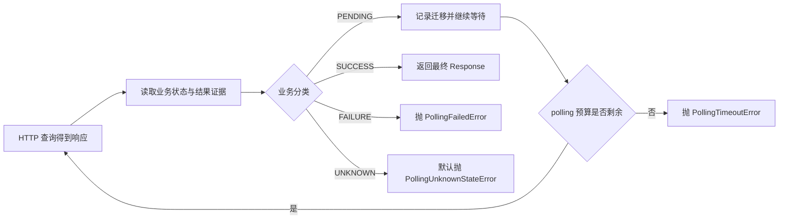
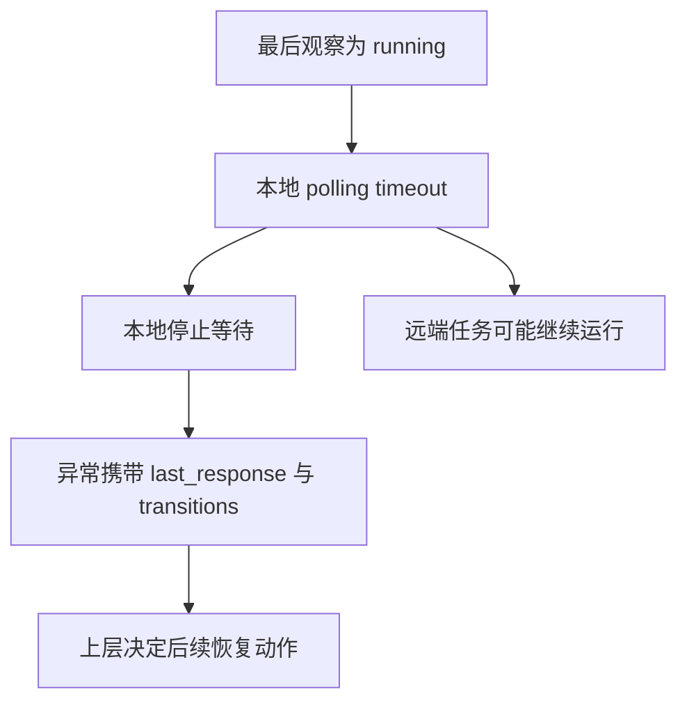
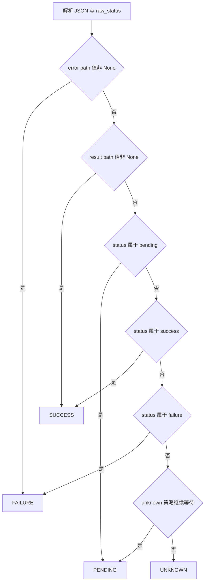
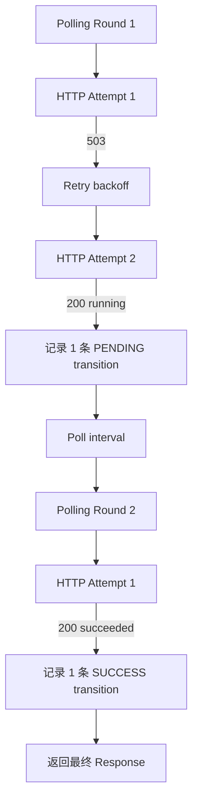
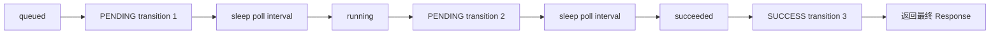
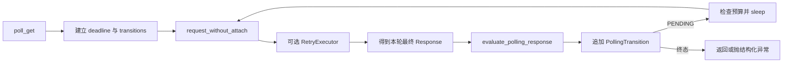
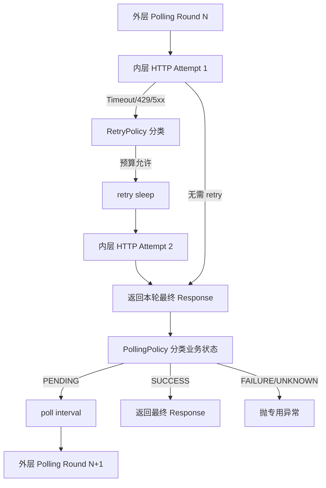

# 第 7 天：从“字段出现”演进为业务状态机

## 0. 本节结论

异步任务轮询不是“重复 GET，直到某个字段不为空”，而是持续观察远端业务状态，并把每次观察确定地归入等待、成功、失败或未知。

一次 HTTP 200 只证明本次查询拿到了响应，不证明任务成功；一个 JSONPath 匹配到值，只证明响应中存在数据，也不证明该值具备成功语义。



从第一性原理看，轮询需要回答三个彼此独立的问题：

```text
本次 HTTP 查询是否成功完成
  → 响应代表哪一种业务状态
  → 整个等待过程是否还有时间预算
```

从 TOC 约束理论看，旧实现的约束不是缺少更多 `if`，而是业务协议没有显式进入模型。只要框架只知道“字段存在”，服务端新增 `paused`、`moderating` 或 `expired` 时，框架就只能误判成功、继续到超时，或给出缺少上下文的失败。当前实现通过显式状态集合和 UNKNOWN 默认失败，把协议漂移暴露在第一次观察处。

本节还必须准确限定“状态机”的含义：当前框架实现的是“响应分类函数 + polling 循环 + 迁移记录”，并不是会校验所有合法相邻边的通用工作流引擎。它能记录 `queued → running → succeeded`，但不会拒绝 `running → queued` 这类业务回退，除非状态集合本身把某个值归为失败或未知。

## 1. 两小时学习结构

| 阶段 | 时间 | 学习内容 | 完成产出 |
| --- | ---: | --- | --- |
| 观察初版 | 0～18 分钟 | 精读 `56f4f15` 的 success/failure JSONPath 轮询 | 旧判断真值表 |
| 建立业务状态模型 | 18～32 分钟 | 区分 HTTP 结果、业务状态与等待预算 | 三层模型图 |
| 阅读第一次演进 | 32～50 分钟 | 观察 `291e6ea` 如何并行引入 PollingPolicy | 兼容迁移说明 |
| 精读当前分类 | 50～72 分钟 | 推导 error、result、status、unknown 的优先级 | 分类决策表 |
| 精读当前循环 | 72～90 分钟 | 分析 transitions、终态异常、deadline 与日志 | 执行时间线 |
| 识别状态所有者 | 90～101 分钟 | 区分 Policy、Evaluation、Transition 与执行列表 | 生命周期表 |
| 比较方案 | 101～112 分钟 | 比较字段存在、predicate、显式集合和通用引擎 | 决策表 |
| 离线实验与复盘 | 112～120 分钟 | 推演成功、失败、未知和 retry 嵌套 | 验收图与结论 |

今天只学习异步任务状态判断和 polling 外循环。任务创建、TestContext 变量保存和业务契约断言分别属于其他课程日。

## 2. 先建立三个层次

### 2.1 HTTP 成功不是业务成功

同一个任务查询接口可能连续返回：

```text
HTTP 200 {"status": "queued"}
HTTP 200 {"status": "running"}
HTTP 200 {"status": "succeeded", "result": {...}}
```

三次 transport 都成功，只有最后一次是业务成功。

反过来，HTTP 503 表示本次查询出现候选瞬态故障，但远端任务可能仍在正常执行。此时 retry 解决“如何拿到一次查询响应”，polling 解决“任务何时到达终态”。

### 2.2 字段存在不是状态语义

假设 `success_json_path="$.status"`：

| 响应 | JSONPath 结果 | 仅按非 `None` 判断 | 真实业务语义 |
| --- | --- | --- | --- |
| `{"status":"queued"}` | `queued` | 成功 | 等待 |
| `{"status":"running"}` | `running` | 成功 | 等待 |
| `{"status":"failed"}` | `failed` | 成功 | 失败 |
| `{"status":"succeeded"}` | `succeeded` | 成功 | 成功 |
| `{"status":"paused"}` | `paused` | 成功 | 协议未知 |

路径只表达“去哪里取值”，状态集合才表达“值意味着什么”。

### 2.3 timeout 不是业务状态

`PollingTimeoutError` 说明在本地预算内没有观察到可接受的终态。它不等于远端任务失败，也不等于任务仍在运行。超时后任务可能随后成功，因此异常必须保留最后状态、最后响应和观察历史，供调用方决定查询、取消或人工确认。



## 3. 观察初版 `56f4f15`

### 3.1 旧公开入口

演进前：`56f4f15`，`common/base_request.py`

```python
def poll_get(
    self,
    path: str,
    *,
    poll_interval: float = 2,
    poll_timeout: float | None = None,
    success_json_path: str | None = None,
    failure_json_path: str | None = None,
    **kwargs: Any,
) -> requests.Response:
    if poll_interval <= 0:
        raise ValueError("poll_interval must be greater than 0")

    timeout = (
        self.config.timeout
        if poll_timeout is None
        else poll_timeout
    )
    if timeout <= 0:
        raise ValueError("poll_timeout must be greater than 0")

    deadline = time.monotonic() + timeout
    last_response: requests.Response
    last_status: Any
    last_logger: ApiCallLogger | None = None
```

初版已经使用单调时钟、interval 和总 timeout，也刻意只保留最后一次响应用于日志。问题不是“没有循环”，而是循环的业务终结条件太弱。

### 3.2 旧核心循环

演进前：`56f4f15`，`common/base_request.py`

```python
while True:
    last_response, last_logger = self._request_without_attach(
        "GET",
        path,
        step_name=POLL_GET_REQUEST_STEP_NAME,
        response_step_name=POLL_GET_RESPONSE_STEP_NAME,
        **kwargs,
    )
    failure_status = None
    try:
        if failure_json_path is not None:
            failure_status = self._extract_json_path_value(
                last_response,
                failure_json_path,
            )
        last_status = self._extract_json_path_value(
            last_response,
            success_json_path,
        )
    except Exception:
        last_logger.attach_success(last_response)
        raise

    if failure_json_path is not None and failure_status is not None:
        last_logger.attach_success(last_response)
        raise AssertionError(
            f"poll_get failed: path={path!r}, "
            f"{failure_json_path}={failure_status!r}, "
            f"response={last_response.text}"
        )

    if last_status is not None:
        last_logger.attach_success(last_response)
        return last_response

    remaining = deadline - time.monotonic()
    if remaining <= 0:
        last_logger.attach_success(last_response)
        raise TimeoutError(
            f"poll_get timed out after {timeout} seconds: "
            f"path={path!r}, "
            f"last {success_json_path}={last_status!r}, "
            f"last response={last_response.text}"
        )

    time.sleep(min(poll_interval, remaining))
```

初版真实决策顺序是：

```text
failure path 有非 None 值 → 失败
否则 success path 有非 None 值 → 成功
否则预算耗尽 → 超时
否则继续等待
```

它已经给失败字段更高优先级，但没有 pending、success、failure 的值集合，也没有 unknown 分支。

### 3.3 旧 JSONPath helper

演进前：`56f4f15`，`common/base_request.py`

```python
@staticmethod
def _extract_json_path_value(
    response: requests.Response,
    json_path: str,
) -> Any:
    if not json_path.startswith("$"):
        raise ValueError(
            "json_path must start with '$', "
            f"current value: {json_path!r}"
        )

    try:
        body = response.json()
    except ValueError as exc:
        raise AssertionError(
            f"response body is not valid JSON: {response.text}"
        ) from exc

    matches = [
        match.value
        for match in parse(json_path).find(body)
    ]
    if not matches:
        return None
    return matches[0] if len(matches) == 1 else matches
```

这个 helper 同时承担路径校验、JSON 解析、值提取和原始响应错误输出。业务分类仍留在 `poll_get()` 的“是否为 None”判断中。

初版签名把 `success_json_path` 默认设为 `None`，但循环无条件把它交给需要字符串的 helper；直接省略该参数会在 `.startswith()` 处失败。真实业务封装通过传入 `$.result.urls` 避开了这个问题，但它说明旧接口的通用默认值与实现契约并不一致。

### 3.4 初版 BaseTask 如何表达媒体成功

演进前：`56f4f15`，`common/base_task.py`

```python
def poll_media_generation_result(
    self,
    request_client: BaseRequest,
    task_id: str,
    *,
    poll_interval: float = 2,
    poll_timeout: float | None = None,
    success_json_path: str = "$.result.urls",
    failure_json_path: str | None = "$.error",
) -> requests.Response:
    return request_client.poll_get(
        self.media_task_path_template.format(task_id=task_id),
        poll_interval=poll_interval,
        poll_timeout=poll_timeout,
        success_json_path=success_json_path,
        failure_json_path=failure_json_path,
    )
```

这个选择比 `$.status` 更不容易把 running 误判为成功：只有结果 URL 出现才结束。但它仍然有三个问题：

- 不知道 queued 和 running 的区别，无法记录状态演进。
- 新失败状态若不写入 `$.error`，只能一直等到超时。
- 新终态若改变结果结构，也会表现为超时，而不是协议不匹配。

因果链如下：

```text
业务语义被压缩为两个路径
  → 路径只能证明值是否存在
  → 新状态无法被分类
  → 未知协议被当作继续等待
  → 最终以超时掩盖真正的协议变化
```

## 4. 第一次演进 `291e6ea`：并行引入显式状态模型

### 4.1 首版 PollingPolicy

演进后：`291e6ea`，`common/polling.py`

```python
class PollingState(Enum):
    PENDING = "pending"
    SUCCESS = "success"
    FAILURE = "failure"
    UNKNOWN = "unknown"


@dataclass(frozen=True)
class PollingPolicy:
    status_json_path: str = "$.status"
    pending: frozenset[Any] = frozenset({"queued", "running"})
    success: frozenset[Any] = frozenset({"succeeded"})
    failure: frozenset[Any] = frozenset({"failed", "cancelled"})
    result_json_path: str | None = None
    error_json_path: str | None = "$.error"
    unknown: str = "fail"

    def __post_init__(self) -> None:
        _validate_json_path(
            "status_json_path",
            self.status_json_path,
        )
        _validate_optional_json_path(
            "result_json_path",
            self.result_json_path,
        )
        _validate_optional_json_path(
            "error_json_path",
            self.error_json_path,
        )
        if self.unknown not in {"fail", "pending", "ignore"}:
            raise ValueError(
                "unknown must be 'fail', 'pending', or 'ignore'"
            )
```

变化不只是把两个参数装进 dataclass：

- `status_json_path` 定位状态事实。
- 三个集合显式定义值的业务语义。
- result/error path 保留兼容型结果证据。
- unknown 策略决定未识别值是否立即暴露。
- frozen 让同一次 polling 执行使用稳定协议。

### 4.2 四态分类结果

演进后：`291e6ea`，`common/polling.py`

```python
@dataclass(frozen=True)
class PollingEvaluation:
    state: PollingState
    raw_status: Any
    result_value: Any = None
    error_value: Any = None


@dataclass(frozen=True)
class PollingTransition:
    attempt_index: int
    elapsed_seconds: float
    state: PollingState
    raw_status: Any
    response_status_code: int
```

`PollingEvaluation` 是一次响应的分类结果；`PollingTransition` 是一次 polling 执行中对该分类的带时间记录。前者生命周期是一轮判断，后者进入整个 polling 序列的历史。

### 4.3 兼容迁移而非一次性删除

演进阶段：`291e6ea`，`common/base_request.py`

```python
def poll_get(
    self,
    path: str,
    *,
    poll_interval: float = 2,
    poll_timeout: float | None = None,
    success_json_path: str | None = None,
    failure_json_path: str | None = None,
    polling_policy: PollingPolicy | None = None,
    retry_policy: RetryPolicy | None = None,
    **kwargs: Any,
) -> requests.Response:
    ...
    if polling_policy is not None:
        return self._poll_get_with_policy(
            path,
            poll_interval=poll_interval,
            timeout=timeout,
            polling_policy=polling_policy,
            retry_policy=retry_policy,
            **kwargs,
        )

    # 未传 policy 时继续执行旧 JSONPath 循环
```

这个阶段同时存在两个入口：新调用可验证状态机，旧 BaseTask 和用例不必一次性全部改动。收益是迁移风险较低；代价是 `BaseRequest` 暂时维护两套语义，调用方可能继续停留在弱判断。

这也是为什么“新增 Policy 类”不等于迁移完成。只有旧公开入口和调用方都被替换，框架才能强制状态语义。

## 5. `2748f16`：完成迁移并删除旧入口

### 5.1 当前公开入口强制要求 Policy

演进前：`291e6ea` 的 `polling_policy` 可选，同时保留 success/failure path。

演进后：`2748f16`，`common/base_request.py`；当前 dev2 相同：

```python
def poll_get(
    self,
    path: str,
    *,
    poll_interval: float = 2,
    poll_timeout: float | None = None,
    polling_policy: PollingPolicy,
    retry_policy: RetryPolicy | None = None,
    **kwargs: Any,
) -> requests.Response:
    if poll_interval <= 0:
        raise ValueError("poll_interval must be greater than 0")

    timeout = (
        self.config.timeout
        if poll_timeout is None
        else poll_timeout
    )
    if timeout <= 0:
        raise ValueError("poll_timeout must be greater than 0")

    return self._poll_get_with_policy(
        path,
        poll_interval=poll_interval,
        timeout=timeout,
        polling_policy=polling_policy,
        retry_policy=retry_policy,
        **kwargs,
    )
```

`success_json_path` 和 `failure_json_path` 已从当前签名删除；不传 `polling_policy` 会在 Python 参数绑定阶段得到 `TypeError`。这把“调用方必须明确业务状态协议”从建议升级为公开入口约束。

### 5.2 BaseTask 迁移为领域默认 Policy

演进后：`2748f16`，`common/polling.py`

```python
DEFAULT_MEDIA_POLLING_POLICY = PollingPolicy(
    status_json_path="$.status",
    pending=frozenset({
        "queued",
        "running",
        "pending",
        "processing",
    }),
    success=frozenset({
        "succeeded",
        "success",
        "completed",
    }),
    failure=frozenset({
        "failed",
        "cancelled",
        "canceled",
    }),
    result_json_path="$.result.urls",
    error_json_path="$.error",
)
```

演进后：`2748f16`，`common/base_task.py`

```python
def poll_media_generation_result(
    self,
    request_client: BaseRequest,
    task_id: str,
    *,
    poll_interval: float = 2,
    poll_timeout: float | None = None,
    polling_policy: PollingPolicy = DEFAULT_MEDIA_POLLING_POLICY,
    retry_policy: RetryPolicy | None = None,
) -> requests.Response:
    return request_client.poll_get(
        self.media_task_path_template.format(task_id=task_id),
        poll_interval=poll_interval,
        poll_timeout=poll_timeout,
        polling_policy=polling_policy,
        retry_policy=retry_policy,
    )
```

通用 `BaseRequest` 不猜媒体任务协议；`BaseTask` 用领域默认值把已知媒体状态映射为通用四态，同时允许调用方覆盖 Policy。

变化原因：不同异步接口拥有不同状态值和结果路径，但循环、时间预算、迁移记录和终结异常相对稳定。状态集合归领域 Policy，循环骨架留在请求协调层。

### 5.3 从 dataclass 迁移到 Pydantic

同一提交 `2748f16` 将 `PollingPolicy`、`PollingEvaluation` 和 `PollingTransition` 迁移为 frozen Pydantic model。当前 Policy 关键结构为：

```python
class PollingPolicy(BaseModel):
    model_config = ConfigDict(frozen=True)

    status_json_path: str = "$.status"
    pending: frozenset[Any] = frozenset({"queued", "running"})
    success: frozenset[Any] = frozenset({"succeeded"})
    failure: frozenset[Any] = frozenset({"failed", "cancelled"})
    result_json_path: str | None = None
    error_json_path: str | None = "$.error"
    unknown: str = "fail"
```

模型形式变化没有改变四态分类主语义。frozen 保证规则在一次执行中稳定，Pydantic 统一框架结构化模型的校验方式。

## 6. 当前分类函数：优先级就是协议

### 6.1 完整关键代码

当前代码：`dev2`，`common/polling.py`

```python
def evaluate_polling_response(
    response: requests.Response,
    policy: PollingPolicy,
) -> PollingEvaluation:
    try:
        body = response.json()
    except ValueError as exc:
        raise AssertionError(
            "polling response body is not valid JSON: "
            f"{_redact_response_text(response)}"
        ) from exc

    raw_status = _extract_json_path_value(
        body,
        policy.status_json_path,
    )

    if policy.error_json_path is not None:
        error_value = _extract_json_path_value(
            body,
            policy.error_json_path,
        )
        if error_value is not None:
            return PollingEvaluation(
                state=PollingState.FAILURE,
                raw_status=(
                    raw_status
                    if raw_status is not None
                    else error_value
                ),
                error_value=error_value,
            )

    if policy.result_json_path is not None:
        result_value = _extract_json_path_value(
            body,
            policy.result_json_path,
        )
        if result_value is not None:
            return PollingEvaluation(
                state=PollingState.SUCCESS,
                raw_status=raw_status,
                result_value=result_value,
            )

    if raw_status in policy.pending:
        return PollingEvaluation(
            state=PollingState.PENDING,
            raw_status=raw_status,
        )
    if raw_status in policy.success:
        return PollingEvaluation(
            state=PollingState.SUCCESS,
            raw_status=raw_status,
        )
    if raw_status in policy.failure:
        return PollingEvaluation(
            state=PollingState.FAILURE,
            raw_status=raw_status,
        )

    if policy.unknown in {"pending", "ignore"}:
        return PollingEvaluation(
            state=PollingState.PENDING,
            raw_status=raw_status,
        )
    return PollingEvaluation(
        state=PollingState.UNKNOWN,
        raw_status=raw_status,
    )
```

### 6.2 决策优先级

```text
响应必须是合法 JSON
  → error_json_path 非 None 命中：FAILURE
  → result_json_path 非 None 命中：SUCCESS
  → raw_status 属于 pending：PENDING
  → raw_status 属于 success：SUCCESS
  → raw_status 属于 failure：FAILURE
  → unknown=pending/ignore：PENDING
  → 否则：UNKNOWN
```



优先级不是实现细节。例如响应同时有 `status="succeeded"` 和 `error={...}`，当前结果是 FAILURE；同时有 `status="running"` 和结果 URL，当前结果是 SUCCESS。测试明确锁定了前两项顺序。

### 6.3 “命中”仍然按非 `None` 判断

当前代码不会检查 result/error 的真值或业务结构，只检查值是否为 `None`：

| 匹配值 | error path | result path |
| --- | --- | --- |
| `None` | 不触发 | 不触发 |
| `[]` | FAILURE | SUCCESS |
| `{}` | FAILURE | SUCCESS |
| `""` | FAILURE | SUCCESS |
| `0` | FAILURE | SUCCESS |

这是为了保留“字段出现”类协议的兼容能力，但不能把它解释为内容已经有效。若媒体结果必须至少有一个 URL，应在领域契约层验证列表长度和 URL 结构，或未来扩展更精确的 result predicate。

### 6.4 unknown 的安全默认值

默认 `unknown="fail"` 不直接返回 FAILURE，而是返回 `PollingState.UNKNOWN`，随后循环抛专用 `PollingUnknownStateError`。这保留“业务明确失败”和“框架不认识协议”之间的区别。

`unknown="pending"` 与 `unknown="ignore"` 在当前实现中效果相同，都会返回 PENDING。`ignore` 并不会删除 transition，也不会跳过 deadline；它只是与 pending 一样继续循环。这是当前实现的兼容入口，不应在文档中虚构额外语义。

## 7. 当前 polling 循环

### 7.1 初始化执行状态

当前代码：`dev2`，`common/base_request.py`

```python
deadline = time.monotonic() + timeout
started_at = time.monotonic()
transitions: list[PollingTransition] = []
last_response: requests.Response | None = None
last_status: Any = None
last_logger: ApiCallLogger | None = None
attempt_index = 0
```

这里的 `attempt_index` 是 polling 查询轮次，不是 RetryExecutor 的 HTTP attempt。Policy 不保存这些可变值，它们只属于本次 polling 执行。

### 7.2 查询、分类与记录

当前代码：`dev2`，`common/base_request.py`

```python
while True:
    attempt_index += 1
    last_response, last_logger = self._request_without_attach(
        "GET",
        path,
        step_name=POLL_GET_REQUEST_STEP_NAME,
        response_step_name=POLL_GET_RESPONSE_STEP_NAME,
        retry_policy=retry_policy,
        **kwargs,
    )
    try:
        evaluation = evaluate_polling_response(
            last_response,
            polling_policy,
        )
    except Exception:
        last_logger.attach_success(last_response)
        raise

    last_status = evaluation.raw_status
    transitions.append(
        PollingTransition(
            attempt_index=attempt_index,
            elapsed_seconds=round(
                time.monotonic() - started_at,
                3,
            ),
            state=evaluation.state,
            raw_status=evaluation.raw_status,
            response_status_code=last_response.status_code,
        )
    )
```

每次成功拿到 HTTP response 后才产生一条 polling transition。transport exception 没有可分类的业务响应，因此不会产生 transition；`_request_without_attach()` 会挂载 failure 日志并重抛异常。

分类异常时调用 `attach_success(last_response)`，这里的 success 表示 HTTP 响应成功被 logger 接收，并不表示业务状态成功。

### 7.3 四种终结路径

当前代码：`dev2`，`common/base_request.py`

```python
if evaluation.state is PollingState.SUCCESS:
    self._attach_polling_transitions(last_logger, transitions)
    last_logger.attach_success(last_response)
    return last_response

if evaluation.state is PollingState.FAILURE:
    self._attach_polling_transitions(last_logger, transitions)
    last_logger.attach_success(last_response)
    raise PollingFailedError(
        path=path,
        last_status=last_status,
        last_response=last_response,
        transitions=transitions,
        error_value=evaluation.error_value,
    )

if evaluation.state is PollingState.UNKNOWN:
    self._attach_polling_transitions(last_logger, transitions)
    last_logger.attach_success(last_response)
    raise PollingUnknownStateError(
        path=path,
        last_status=last_status,
        last_response=last_response,
        transitions=transitions,
    )

remaining = deadline - time.monotonic()
if remaining <= 0:
    self._attach_polling_transitions(last_logger, transitions)
    last_logger.attach_success(last_response)
    raise PollingTimeoutError(
        path=path,
        timeout=timeout,
        last_status=last_status,
        last_response=last_response,
        transitions=transitions,
    )

time.sleep(min(poll_interval, remaining))
```

终态优先于 deadline 检查。即使响应在 deadline 之后到达，只要它被分类为 SUCCESS，当前代码仍返回成功；FAILURE 和 UNKNOWN 也会抛各自语义异常，而不是改为 timeout。只有 PENDING 才检查剩余预算。

因此 `poll_timeout` 是“是否继续下一轮等待”的预算，不是能够抢占正在执行 HTTP 请求的硬 deadline。

## 8. 外层 polling 与内层 retry

### 8.1 真实嵌套结构



这个例子真实发生了三次 HTTP 调用，但只有两条 polling transitions：

- HTTP retry record 描述 Round 1 内部的 503 和等待。
- polling transition 描述 Round 1 最终观察到 running。
- Round 2 最终观察到 succeeded。

### 8.2 两层成功条件

| 层 | 成功意味着什么 | 成功后输出 |
| --- | --- | --- |
| HTTP retry | 得到一个不再按 RetryPolicy 重试的 Response | 交给 polling 分类，不代表任务成功 |
| polling | Response 被 PollingPolicy 分类为 SUCCESS | 返回最终 Response |

### 8.3 两层时间预算

| 预算 | 所有者 | 作用范围 | 当前限制 |
| --- | --- | --- | --- |
| `RetryPolicy.max_elapsed` | 每次 RetryExecutor.execute | 一轮 poll GET 内的 HTTP retry 序列 | 每个 polling round 重新开始 |
| request `timeout` | requests transport | 单次 HTTP attempt | 由请求参数控制 |
| `poll_timeout` | 外层 polling loop | 整个业务等待序列 | 不抢占进行中的 retry/request |
| `poll_interval` | 外层 polling loop | 两轮业务查询之间 | 使用 `min(interval, remaining)` |

当前代码不会把外层 `remaining` 自动传给内层 RetryExecutor，也不会把单次 request timeout 截断到剩余 polling 时间。一次内层重试序列可能越过 polling deadline；返回后由业务分类和 PENDING 分支决定终结。

### 8.4 不能把 retry 成功当成 polling 成功

当前集成测试的序列是：

```text
HTTP 503 {status: running}
  → 内层 retry
HTTP 200 {status: succeeded}
  → 外层只得到最终 200
  → 分类为 SUCCESS
```

若第二个响应是 `200 running`，内层 retry 仍然成功结束，但外层必须记录 PENDING 并继续下一轮。

## 9. 状态所有者与生命周期

| 状态 | 创建者 | 修改者 | 结束/清理者 | 生命周期 |
| --- | --- | --- | --- | --- |
| status path 与状态集合 | Policy 构造者/领域封装 | frozen，不修改 | Policy 被释放 | 可跨多次 polling 复用 |
| unknown 处理规则 | Policy 构造者 | frozen，不修改 | Policy 被释放 | 可跨多次 polling 复用 |
| 本轮 `PollingEvaluation` | 分类函数 | frozen，不修改 | 本轮分类完成 | 一次 polling round |
| polling attempt_index | polling loop | 每轮加一 | polling 终结 | 一次 polling 序列 |
| transitions 列表 | polling loop | 每个可分类响应后 append | 返回或异常后由调用方持有 | 一次 polling 序列 |
| 单条 PollingTransition | polling loop | frozen，不修改 | 随列表释放 | 一次观察事实 |
| deadline / started_at | polling loop | 不修改，读取时钟比较 | polling 终结 | 一次 polling 序列 |
| last_response / last_status | polling loop | 每轮替换 | 返回或异常携带 | 一次 polling 序列 |
| HTTP retry records | RetryExecutor | 每个候选 retry 后 append | 本轮 HTTP 序列结束 | 一轮 poll GET 内部 |
| logger | 每次 HTTP attempt 的 Context | 日志出口消费 | attempt 或最终挂载结束 | 一次 HTTP attempt |

### 9.1 Policy 为什么不可变

如果同一次等待过程中，另一个线程或 hook 把 `paused` 从 failure 改入 pending，前后 transition 将无法按同一个协议解释。Policy frozen 让整段历史具有一致分类基准。

### 9.2 transitions 为什么不属于 Policy

Policy 可被多个任务同时复用；transitions 包含具体 task 的状态和时间。如果把历史写入 Policy，不同任务会共享进度并产生并发串扰。规则和运行历史必须分开。

## 10. 异常与可观测性边界

### 10.1 三类业务终结异常

| 异常 | 含义 | 基类 | 携带信息 |
| --- | --- | --- | --- |
| `PollingFailedError` | 服务端明确返回失败状态或 error 值 | `PollingError(AssertionError)` | path、last status/response、transitions、error value |
| `PollingUnknownStateError` | 状态不在已知集合且默认拒绝继续 | `PollingError(AssertionError)` | path、last status/response、transitions |
| `PollingTimeoutError` | PENDING 且本地等待预算耗尽 | `TimeoutError` | path、timeout、last status/response、transitions |

明确失败、协议未知和本地超时是三个不同原因，上层可以分别统计或恢复，不能统一成一条字符串 AssertionError。

### 10.2 transition 文本

当前代码：`dev2`，`common/polling.py`

```python
def format_polling_transitions(
    transitions: Iterable[PollingTransition],
) -> str:
    lines = []
    for transition in transitions:
        lines.append(
            f"{transition.attempt_index}. "
            f"{transition.elapsed_seconds:.3f}s "
            f"{transition.raw_status!r} "
            f"-> {transition.state.value} "
            f"HTTP {transition.response_status_code}"
        )
    return "\n".join(lines) if lines else "<empty>"
```

示例：

```text
1. 0.000s 'queued' -> pending HTTP 200
2. 1.000s 'running' -> pending HTTP 200
3. 2.000s 'succeeded' -> success HTTP 200
```

`elapsed_seconds` 是从 polling `started_at` 到本轮响应分类后的累计时间，不是该状态单独停留时长。单状态时长可由相邻记录近似推导，但当前模型没有直接字段。

### 10.3 最终响应日志

轮询内部以 `_attach_log=False` 发送，避免每轮响应正文都进入报告。成功、失败、未知、超时或分类异常时，外层挂载最后响应，并附加 transitions。

这降低报告体积，但中间响应正文不会完整保留；可观测性依赖 transition 的状态、HTTP code 和重试记录。若排障必须保留每轮业务摘要，需要扩展结构化 transition，而不是重新输出所有原始响应。

### 10.4 错误文本的脱敏与截断

当前 `PollingTimeoutError` 和非法 JSON 路径通过 `_redact_response_text()` 处理响应文本，并限制最多 2000 字符。这比初版直接拼接 `response.text` 更安全，但仍只保护 polling.py 内这些出口；上层若自行输出 `last_response.text`，需要承担自己的安全责任。

## 11. 假想任务状态表与推演

### 11.1 Policy

```python
policy = PollingPolicy(
    status_json_path="$.task.state",
    pending=frozenset({"queued", "running"}),
    success=frozenset({"succeeded"}),
    failure=frozenset({"failed", "cancelled"}),
    result_json_path="$.task.output.url",
    error_json_path="$.task.error",
    unknown="fail",
)
```

### 11.2 状态决策表

| 响应事实 | Evaluation | 外层动作 |
| --- | --- | --- |
| state=`queued` | PENDING | 记录并等待 |
| state=`running` | PENDING | 记录并等待 |
| state=`succeeded` | SUCCESS | 返回当前 response |
| state=`failed` | FAILURE | 抛失败异常 |
| state=`paused` | UNKNOWN | 默认立即抛未知异常 |
| output URL 存在 | SUCCESS | 优先于 status 集合 |
| error 存在 | FAILURE | 优先于 result 和 status |
| 非法 JSON | 不生成 Evaluation | 挂载响应并抛解析 AssertionError |

### 11.3 `queued → running → succeeded`



预期：三条 transitions、两次 polling sleep、最终 response 的 status 为 succeeded。

### 11.4 `queued → failed`

预期：

```text
transitions.raw_status = ["queued", "failed"]
last_status = "failed"
last_response = 失败响应对象
抛 PollingFailedError
不再 sleep
```

若 `$.task.error` 同时有值，`error_value` 也进入异常。

### 11.5 `queued → paused`

默认 Policy 下：

```text
queued → PENDING
paused → UNKNOWN
立即抛 PollingUnknownStateError
```

它不会继续等到 timeout。这样服务端新增状态会直接触发协议审查。

只有在业务明确允许时，才可使用 `unknown="pending"` 暂时等待；这会降低对协议漂移的敏感度。

## 12. 从状态所有者推导职责边界

### 12.1 必须保持的不变量

1. HTTP 查询成功不能自动等于业务任务成功。
2. 明确 failure 不能继续等待到 timeout。
3. 未知状态默认不能静默当成成功或 pending。
4. 同一次 polling 使用不变的 Policy。
5. transitions 只属于一个任务的一次等待序列。
6. retry 只恢复单轮 HTTP 查询，不重启或代替业务状态机。
7. timeout 必须携带最后响应与迁移历史。
8. 中间响应不应无限膨胀报告，最终诊断信息仍须可用。

### 12.2 当前职责分配

| 层 | 应负责 | 不应负责 |
| --- | --- | --- |
| 领域 BaseTask/调用方 | 选择状态路径、集合、结果与错误证据 | 复制 polling while 循环 |
| PollingPolicy | 保存稳定业务分类规则 | 保存当前 task 的 transitions |
| `evaluate_polling_response` | 将单个 Response 分类为四态 | sleep、发请求或维护 deadline |
| BaseRequest polling loop | 查询、记录、等待、预算和终结 | 猜测每个接口的状态名称 |
| RetryExecutor | 恢复单轮 GET 的瞬态传输故障 | 判断 queued/running/succeeded |
| ApiCallLogger | 格式化最终响应和迁移附件 | 决定业务成功 |
| 上层用例/契约 | 校验成功结果内容是否完整 | 把字段断言当 polling 控制流 |

### 12.3 TOC 清晰思考

当前核心约束是状态协议可能变化。利用约束的方式是把已知集合显式化，并默认拒绝未知值；提升约束需要服务端提供稳定、版本化的状态契约。

继续增加 polling 次数或 timeout 不能解决未知状态，只会更晚暴露问题。优先动作应该是更新协议映射和测试，而不是延长等待时间。

## 13. 方案比较

| 方案 | 状态放在哪里 | 收益 | 代价/失败方式 | 适用条件 |
| --- | --- | --- | --- | --- |
| 当前显式状态集合 | 规则在 frozen Policy；历史在 polling 局部列表 | 状态含义可见；未知可立即失败；异常和 transitions 结构化 | 不校验相邻迁移合法性；result/error 仍按非 None；需维护集合 | 状态有限、循环骨架稳定的接口测试 |
| success/failure JSONPath | 两个调用参数和 while 分支 | 接入最简单，适合“结果出现即完成” | pending 不可见；未知被吞到 timeout；路径和语义混合 | 接口没有稳定 status，且结果/错误字段足够可靠 |
| 回调 predicate | 调用方函数返回 continue/success/fail | 可表达任意业务逻辑 | 可观测结构不统一；回调可能有副作用；难序列化和审查 | 少量高度特殊的复杂判定 |
| 完整迁移图引擎 | 通用状态节点、允许边、动作和事件 | 可验证非法回退、分支和补偿 | 建模与调试成本高；远超当前有限轮询需求 | 多阶段工作流且边合法性是核心要求 |
| 各业务 Task 手写循环 | 每个领域方法自己保存所有状态 | 局部自由度最大 | timeout、日志、异常和 retry 嵌套重复；行为漂移 | 一次性、无法抽象的特殊流程 |

### 13.1 为什么当前没有建设通用状态机引擎

当前需求只需要：观察服务端状态、映射到四种控制结果、记录序列并在终态退出。没有本地事件驱动动作、补偿、并行分支、持久化恢复或合法边校验。

若此时建设工作流引擎，会让模型成本超过被解决的问题。当前 Policy 是有限状态分类器；未来只有出现“非法迁移必须阻断”等真实约束，才值得增加 allowed transitions。

## 14. 当前实现的限制与误用风险

### 14.1 不验证状态集合互斥

Policy 没有校验 pending、success、failure 是否重叠。分类顺序是 pending → success → failure；同一值同时出现在多个集合时，前者获胜。这可能把失败值误判为等待。

### 14.2 不验证相邻迁移是否合法

`running → queued → running → succeeded` 会被记录并最终成功。当前模型只分类每个观察值，不校验迁移图。

### 14.3 result/error 只按非 None

空列表、空字典、空字符串和 0 都会触发对应终态。结果完整性仍需领域契约验证。

### 14.4 HTTP 状态码不由 evaluator 判定

`evaluate_polling_response()` 不检查 `response.status_code`。没有 RetryPolicy，或 retry 次数耗尽后，HTTP 503 的 JSON body 仍可能被分类为 SUCCESS/PENDING/FAILURE。

因此应由 HTTP retry 或请求断言处理 transport 语义，不能认为 polling 分类自动要求 2xx。若业务要求非 2xx 一律失败，需要新增明确边界，而不是依赖当前实现。

### 14.5 unknown pending 可能把协议错误推迟为 timeout

它是兼容逃生口，不应作为默认。`ignore` 当前与 pending 没有行为差异。

### 14.6 poll_timeout 不是硬 deadline

终态在 deadline 后到达仍按终态处理；进行中的 HTTP request/retry 不会被抢占；内层预算也不会自动受外层 remaining 截断。

### 14.7 transitions 记录观察点，不记录状态持续区间

elapsed 是累计观察时间。两次查询之间服务端何时真实变更状态未知，无法从客户端精确得到状态持续时间。

### 14.8 只挂载最后响应正文

中间状态响应的额外字段不会完整保留在报告中。transition 只保存 raw status 和 HTTP code。

### 14.9 JSONPath 只做最小前缀校验

Policy 验证路径以 `$` 开始，但不在构造时完整编译表达式。语法错误可能在实际 evaluate 时由 `jsonpath_ng` 抛出。

### 14.10 当前为同步轮询

使用同步 `time.sleep` 和 requests，不支持 async、取消 token、回调推送或跨进程恢复。

## 15. 最小实验与当前结果

### 15.1 验证命令

```powershell
cd D:\API_CASE
.\.venv\Scripts\python.exe -m pytest tests\test_polling_state_machine.py tests\test_base_request_retry_polling.py -k "polling" -q
```

### 15.2 dev2 当前结果

```text
..............................
30 passed in 1.18s
```

### 15.3 覆盖的关键事实

- Policy 拒绝不以 `$` 开始的 status path，且模型 frozen。
- queued、succeeded、failed 和 paused 分别映射到四态。
- unknown 可显式映射为 pending。
- error 优先于 result 和成功 status。
- result 优先于 pending status。
- 非法 JSON 的错误文本被脱敏。
- 三类 polling 异常暴露 last response、status 与 transitions。
- transition 格式包含 polling round、elapsed、raw status、state 和 HTTP code。
- 集成循环覆盖成功、失败、未知、超时以及 polling 内 HTTP retry。

### 15.4 测试边界

这些测试不证明真实服务端状态集合完整，也不证明任意相邻迁移合法。Policy 中的值必须来自真实接口契约；离线测试只能证明框架按给定规则分类和组织循环。

### 15.5 Middleware 与领域封装回归

执行：

```powershell
.\.venv\Scripts\python.exe -m pytest tests\test_base_request_middleware.py tests\test_base_task.py -q
```

当前结果：

```text
............................
28 passed in 0.69s
```

这组回归证明当前接线仍只挂载最终 polling 响应、没有 logger 时仍可执行、请求异常保持原异常，并且 BaseTask 默认透传 `DEFAULT_MEDIA_POLLING_POLICY`。它不替代状态分类单测，而是验证状态机接入没有破坏相邻边界。

## 16. 按每日学习记录模板生成的完整记录

### 16.1 基本信息

- 对应课程日：第 7 天。
- 建议投入时间：120 分钟。
- 今日主题：从字段存在判断演进为显式业务状态分类与 polling 循环。
- 代码基准：当前 `dev2` 分支。

### 16.2 观察旧实现

- 使用的历史提交：`56f4f15` 初版、`291e6ea` 并行引入 Policy、`2748f16` 完成迁移。
- 旧实现职责：BaseRequest 同时发查询、解析 JSONPath、判断字段非 None、维护 deadline、sleep、挂最终日志和拼接异常文本。
- 具体问题：路径只能定位值，无法表达 queued/running/succeeded/failed 的业务语义；未知状态通常退化为 timeout。
- 已真实出现的问题：success path 默认值与 helper 字符串契约不一致；错误直接包含 response.text；BaseTask 只能以 result/error 字段表达终态。
- 未来风险：服务端新增状态、结果结构变化或失败不写 error 时，旧实现会误判或延迟暴露。

### 16.3 找到变化轴

| 变化内容 | 为什么变化 | 变化频率 | 是否与其他内容独立 |
| --- | --- | --- | --- |
| 状态 JSONPath | 不同接口响应结构不同 | 按接口 | 独立于循环骨架 |
| pending/success/failure 值 | 业务协议演进 | 中 | 独立于 HTTP retry |
| result/error 证据 | 兼容旧协议和领域终态 | 中 | 独立于 interval |
| unknown 策略 | 协议严格度要求 | 低到中 | 独立于日志格式 |
| poll interval/timeout | SLA 与服务容量 | 按场景 | 独立于状态名称 |
| transitions | 排障和报告需求 | 中 | 独立于 Policy 构造 |
| HTTP retry | 网络瞬态故障 | 中 | 内层生命周期独立 |

### 16.4 识别状态所有者

| 状态 | 谁创建 | 谁修改 | 谁结束/清理 | 生命周期 |
| --- | --- | --- | --- | --- |
| PollingPolicy | 领域封装/调用方 | frozen | 调用方释放 | 多次 polling 可复用 |
| Evaluation | 纯分类函数 | frozen | 本轮结束 | 一次响应分类 |
| polling round index | BaseRequest polling loop | 每轮递增 | polling 终结 | 一次 polling 序列 |
| transitions | polling loop | 每轮 append | 返回或异常携带 | 一次 polling 序列 |
| deadline/last response | polling loop | 每轮读取或替换 | polling 终结 | 一次 polling 序列 |
| retry records | RetryExecutor | 内层 attempt 更新 | 单轮 GET 结束 | 一次 HTTP retry 序列 |

### 16.5 推导职责边界

- 必须保持的不变量：HTTP 与业务成功分离；failure 立即终结；unknown 默认暴露；Policy 不在执行中变化；transitions 不跨任务共享；timeout 保留最后事实。
- 根据生命周期推导的边界：领域层提供 Policy；polling.py 分类单个响应；BaseRequest 组织外层循环；RetryExecutor 只处理单轮查询故障；logger 只展示。
- 当前实际边界：强制 PollingPolicy，四态分类，transition 列表和三类结构化终结异常。
- 推导与实现不一致之处：未验证集合互斥和相邻边；result/error 仍按非 None；poll_timeout 不是硬截止；HTTP 状态不在 evaluator 中校验。

### 16.6 比较其他方案

当前 Policy 比两个 JSONPath 更能表达业务语义和未知协议，比自由回调更易审查与统一记录，比完整工作流引擎成本低。代价是表达能力有限，需要调用方维护集合，且无法阻止合法集合内部的非法顺序。

### 16.7 代码执行链



### 16.8 最小实验

- 实验输入：queued→running→succeeded、queued→failed、queued→paused，以及单轮 503→200 的内层 retry。
- 预期结果：成功序列返回最终响应；失败和未知分别抛专用异常；retry 不额外产生 polling transition。
- 实际结果：筛选后的 polling 相关测试 30 项通过。
- 验证命令：`.\.venv\Scripts\python.exe -m pytest tests\test_polling_state_machine.py tests\test_base_request_retry_polling.py -k "polling" -q`。
- 是否访问真实网络：否。
- 是否执行真实 sleep：否，测试替换 sleep 或使用立即到达的终态响应。

### 16.9 失败分析

本次实验没有失败。若失败，按层次定位：

1. 环境层：pytest、requests、Pydantic、jsonpath-ng 是否可导入。
2. 测试构造层：Response 是否为合法 JSON，状态路径是否与 body 一致，假时间序列是否足够。
3. HTTP 适配层：transport 是否返回预期响应，retry 是否消耗了某些响应。
4. polling 分类层：error/result 优先级、状态集合和 unknown 是否正确。
5. polling 执行层：transition、deadline、sleep 和终结异常是否正确。
6. 真实业务语义层：服务端状态含义与合法迁移只能由协议确认。

### 16.10 今日口述答案

- 旧实现为什么需要演进：两个路径只能判断值存在，无法表达状态含义，未知协议会被误判或拖到超时。
- 能力为什么放在当前层：Policy 拥有领域规则，纯函数分类响应，BaseRequest 拥有外层等待序列，生命周期彼此匹配。
- 核心状态由谁拥有：Policy 保存稳定集合；Evaluation 属于一轮；transitions、deadline 和 last response 属于一次 polling；retry records 只属于内层请求。
- 当前方案收益与代价：状态清晰、未知默认失败、诊断结构化；代价是未建完整迁移图，结果字段仍需后续契约断言。
- 错误实现会造成什么后果：running 被当成功、failed 被拖到超时、未知状态静默等待、retry 成功被误当任务成功，或 transitions 跨任务串扰。
- 如何离线证明：构造 Response 序列并替换 transport、sleep 和 monotonic，断言 Evaluation、transitions、last response 和异常类型。

### 16.11 未解决问题

- 已确认但暂不处理：状态集合可重叠、相邻迁移不校验、ignore 等同 pending、HTTP code 不参与分类、timeout 非硬 deadline。
- 需要后续源码评估：是否编译 JSONPath、增加 transition graph、传播外层 remaining、区分观察时间和状态持续时间。
- 需要真实业务协议才能回答：所有合法状态、终态优先级、暂停是否可恢复、结果为空是否成功、超时后如何查询或取消。

### 16.12 今日结论

轮询是对远端业务状态的重复观察，不是等待字段出现。当前框架用不可变 Policy 显式分类四态，用 transitions 保存本次历史，并把失败、未知和超时分开；HTTP retry 仅服务单轮查询。它是有限分类状态机，不校验完整迁移图。

## 17. 最终验收答案

### 17.1 retry 内循环与 polling 外循环



### 17.2 两层成功与预算

- retry 成功：本轮拿到一个不再重试的 HTTP Response；不代表业务完成。
- polling 成功：该 Response 被业务 Policy 分类为 SUCCESS。
- retry budget：每个 polling round 内重新开始，限制 HTTP attempt 序列。
- polling budget：跨所有 round 的外层等待预算，但不抢占正在执行的内层调用。

### 17.3 从旧代码推导新边界

旧代码的 while、deadline 和 sleep 是稳定循环骨架；success/failure JSONPath 与业务接口一起变化。把变化的路径和值集合放入 Policy，把稳定循环留在 BaseRequest，再用纯函数连接二者，就形成当前边界。transitions 属于一次执行，不能放入可复用 Policy。

### 17.4 当前状态机准确能力声明

当前实现能把单次响应按 error、result 和状态集合映射到 PENDING、SUCCESS、FAILURE、UNKNOWN，记录每次观察并按终态返回或抛错。它不会验证状态集合互斥、相邻迁移合法性、结果内容完整性或 HTTP 2xx；这些不能从“状态机”三个字中额外推导出来。

## 18. 今日总结

初版 polling 已有单调时钟、总预算和最终日志，但以 success/failure JSONPath 的非 None 值作为终结条件。`291e6ea` 首次把业务状态集合、unknown 策略、Evaluation 和 Transition 显式建模，同时保留旧入口降低迁移风险；`2748f16` 删除旧参数、强制 PollingPolicy，并让 BaseTask 使用媒体领域默认策略。

当前执行链分为两层：RetryExecutor 在单轮查询内处理瞬态 HTTP 故障，polling loop 在多轮查询间处理业务状态。前者成功只表示获得响应，后者 SUCCESS 才表示任务完成。两层拥有独立的 attempt、记录与时间预算，不能混用。

更深一层的设计原则是：JSONPath 只定位事实，Policy 才赋予事实语义；Policy 拥有稳定规则，执行循环拥有迁移历史。unknown 默认失败把服务端协议变化从“最终超时”前移为“首次未知状态即暴露”，这比增加等待次数更能解决框架的真实约束。

本节到此结束。下一节将从跨步骤变量和资源清理出发，推导 TestContext 为什么必须拥有明确的用例生命周期。
