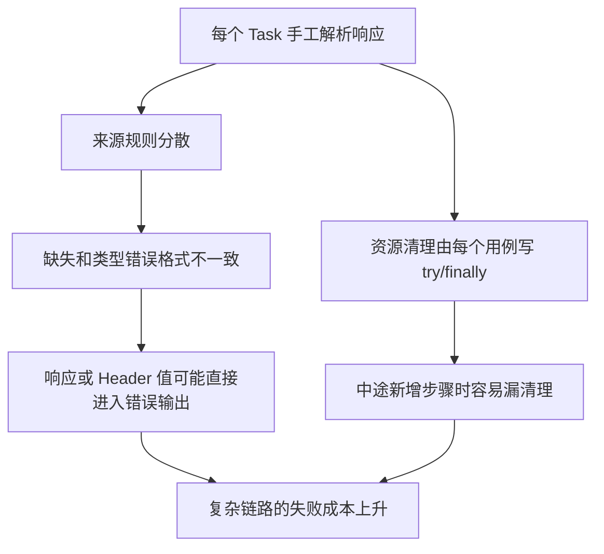
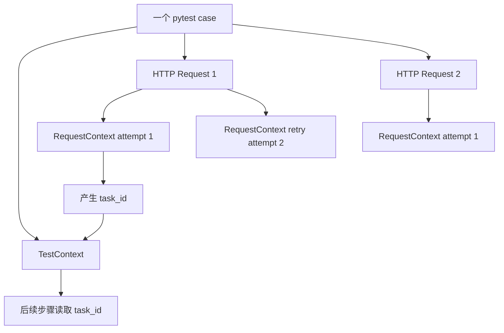
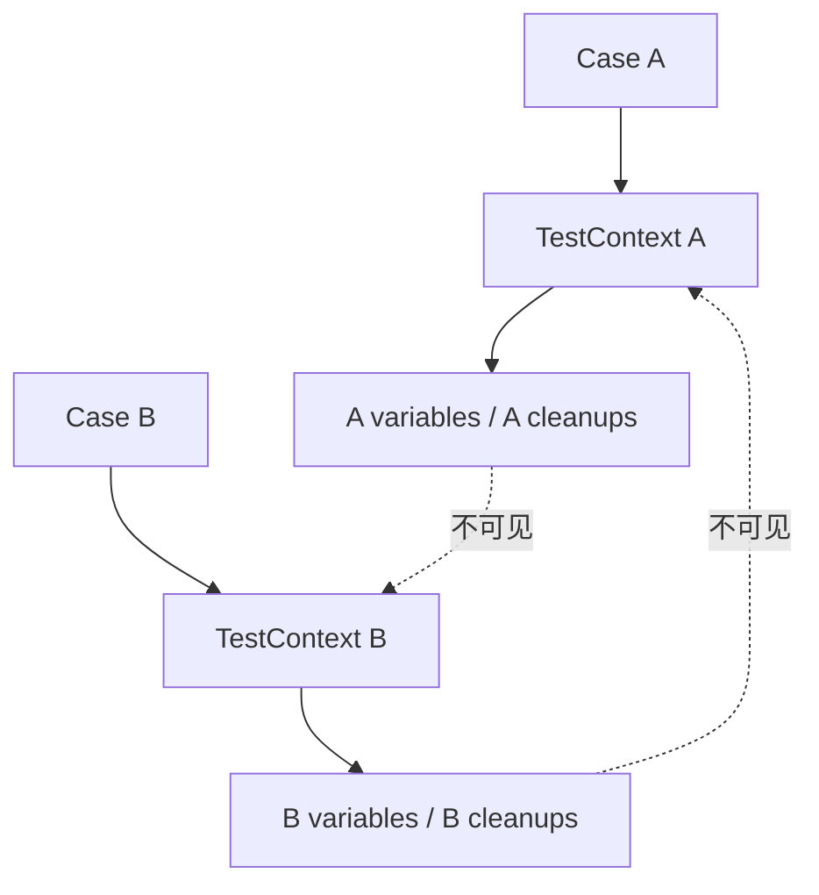
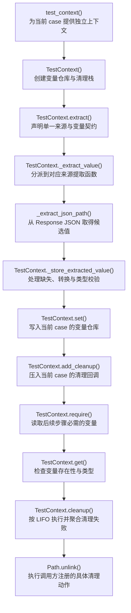

# 第 8 天：TestContext 与用例生命周期

## 0. 本节结论

`TestContext` 的本质不是一个更方便的字典，而是单个测试用例中临时事实与清理责任的所有者。

接口链路通常会产生两类状态：

- 后续步骤需要消费的事实，例如 `task_id`、`request_id`、临时文件路径。
- 用例结束时必须执行的逆操作，例如关闭客户端、删除文件、释放远端资源。

它们共同受同一个生命周期约束：只属于当前 case，不应跨用例泄漏，并且无论用例成功还是中途失败，都必须在 case 结束时完成清理。


从第一性原理看，值应该存放在哪里，不由“以后可能复用”决定，而由它服务的最小完整生命周期决定：

```text
一次 HTTP attempt 的状态 → RequestContext
一次 retry 序列的状态 → RetryExecutor 局部变量
一个 pytest case 的链路事实 → TestContext
跨 case 的持久业务数据 → 不属于当前 TestContext
```

从 TOC 约束理论看，复杂链路真正的约束不是 Python 无法传局部变量，而是变量来源、类型、缺失诊断和资源清理开始在多个用例中重复。`TestContext` 把这些重复收敛到用例级边界；如果把它提升成全局仓库，新的主约束会变成并发串扰、执行顺序依赖和清理归属不明。

本节必须同时保留一个反例：如果 `task_id` 只在一个短函数里产生并立即消费，普通局部变量仍然是最清晰的所有者。上下文不是默认替代所有局部变量的容器。

## 1. 两小时学习结构

| 阶段 | 时间 | 学习内容 | 完成产出 |
| --- | ---: | --- | --- |
| 观察旧链路 | 0～18 分钟 | 查看 task_id、request_id 的手工提取与传递 | 重复职责清单 |
| 建立生命周期模型 | 18～32 分钟 | 区分 attempt、retry、polling、case 和 session | 生命周期图 |
| 阅读演进证据 | 32～52 分钟 | 对照 `56f4f15` 与 `291e6ea` | 关键代码差异 |
| 精读变量边界 | 52～72 分钟 | 读写、缺失、类型、默认值和浅拷贝语义 | 变量契约表 |
| 精读提取边界 | 72～91 分钟 | JSONPath、Header、候选来源与错误脱敏 | 提取决策表 |
| 精读清理边界 | 91～103 分钟 | fixture finally、LIFO、幂等和失败聚合 | 清理时间线 |
| 方案比较 | 103～113 分钟 | 比较局部变量、全局字典、fixture dict、Context、Redis | 决策表 |
| 最小实验与验收 | 113～120 分钟 | 完成两类提取、类型校验和两个清理回调 | 离线结果与迁移范围 |

本节不学习 Schema 契约断言。`expected_type` 只验证一个链路变量的 Python 类型，不替代第 9 天的完整响应结构契约。

## 2. 先判断：什么时候局部变量已经不够

### 2.1 局部变量本身没有问题

下面的代码不需要上下文：

```python
create_response = task.create_media_generation(client, payload)
task_id = task.extract_task_id(create_response)
result_response = task.poll_media_generation_result(client, task_id)
```

`task_id` 的创建者、消费者和作用域都在同一个短函数中，来源也只有一个。把它改成 `context.set()` 再 `context.require()` 只会增加间接层。

### 2.2 真正的演进压力

当链路出现以下变化时，问题才从“传一个值”变成“管理用例状态”：

- 同一变量可能来自 Header、JSON body 或多个兼容路径。
- 后续多个 helper 都需要该变量，参数列表持续膨胀。
- 缺失时需要统一输出变量名、来源和安全响应摘要。
- 消费前必须证明类型，避免错误传播到更远步骤。
- 创建临时资源后，即使中间断言失败也必须清理。
- 并发执行时，每个 case 必须拥有独立变量集合。

因果链如下：

```text
链路事实跨越多个步骤
  → 每个步骤重复提取、校验或传参
  → 失败位置远离变量来源
  → 临时资源的清理分散在多个 finally
  → case 生命周期缺少一个明确所有者
  → 需要显式、用例级 TestContext
```

### 2.3 上下文不是跨用例共享的理由

如果测试 B 必须读取测试 A 写入的 `task_id`：

```text
执行顺序成为前置条件
  → 单独运行 B 失败
  → xdist 调度到不同 worker 时无法共享
  → A 失败会级联阻断 B
  → 清理由哪个 case 负责变得不确定
```

这种状态应通过 fixture 显式创建共享前置资源、外部测试数据准备或重新设计用例，而不是把 `TestContext` 提升到模块级全局字典。

## 3. 观察初版 `56f4f15`

### 3.1 初版没有 TestContext

在提交 `56f4f15` 中，`common/test_context.py` 不存在。框架已经能用普通局部变量完成链路，但提取与错误处理写在具体 Task 或用例中。

这个“文件不存在”不是缺少代码截图的理由；演进前证据应来自当时真实承担这些职责的业务方法。

### 3.2 task_id 的手工提取

演进前：`56f4f15`，`common/base_task.py`

```python
def extract_task_id(
    self,
    create_response: requests.Response,
) -> str:
    try:
        response_body = create_response.json()
    except ValueError as exc:
        raise AssertionError(
            "创建任务响应不是有效 JSON。"
            f"响应内容：{create_response.text}"
        ) from exc

    if not isinstance(response_body, dict):
        raise AssertionError(
            "创建任务响应不是 JSON 对象。"
            f"响应内容：{create_response.text}"
        )

    task_id = response_body.get(self.task_id_field)
    assert task_id, (
        f"创建任务响应中未返回 {self.task_id_field}。"
        f"响应内容：{create_response.text}"
    )
    return str(task_id)
```

这段方法同时知道：

- 变量叫 task_id。
- 来源是顶层 JSON 字段。
- 缺失与非法 JSON 如何报错。
- 最终要转换成字符串。
- 错误里如何展示响应正文。

如果另一个接口把 task id 放在 `$.id` 或 `$.request_id`，就需要新分支或新 helper。

### 3.3 request_id 的手工提取

演进前：`56f4f15`，`common/base_task.py`

```python
@staticmethod
def get_request_id_from_response(
    response: requests.Response,
) -> str:
    request_id = response.headers.get(
        ONEAPI_REQUEST_ID_HEADER,
        "",
    ).strip()
    print(f"{ONEAPI_REQUEST_ID_HEADER}: {request_id}")
    if not request_id:
        raise AssertionError(
            f"Response header {ONEAPI_REQUEST_ID_HEADER} is missing. "
            f"Response headers: {dict(response.headers)}"
        )
    return request_id
```

这里的来源变成 Header，缺失诊断又复制了一套逻辑，而且直接输出完整 headers 可能携带敏感值。

### 3.4 旧复合链路

演进前：`56f4f15`，`common/base_task.py`

```python
def create_and_poll_media_generation(
    self,
    request_client: BaseRequest,
    payload: dict[str, Any],
    *,
    poll_interval: float = 2,
    poll_timeout: float | None = None,
    success_json_path: str = "$.result.urls",
    failure_json_path: str | None = "$.error",
) -> requests.Response:
    create_response = self.create_media_generation(
        request_client,
        payload,
    )
    task_id = self.extract_task_id(create_response)
    return self.poll_media_generation_result(
        request_client,
        task_id,
        poll_interval=poll_interval,
        poll_timeout=poll_timeout,
        success_json_path=success_json_path,
        failure_json_path=failure_json_path,
    )
```

这条链路中的局部变量完全合理。初版真正缺少的是：当变量来源和后续步骤增多时，没有通用、用例级的提取与清理边界。

### 3.5 初版障碍的因果链



## 4. `291e6ea`：一次性建立用例级边界

### 4.1 新增独立对象，而不是扩展 BaseRequest

演进后：`291e6ea`，`common/test_context.py`

```python
class TestContext:
    """Test-case scoped variable store and cleanup stack.

    The context owns all variable state. It intentionally does not use a
    module-level shared store, so callers can safely create one context per
    pytest case or worker.
    """

    __test__ = False

    def __init__(self, *, name: str | None = None):
        self.name = name
        self._variables: dict[str, Any] = {}
        self._cleanup_callbacks: list[_CleanupCallback] = []
```

变化原因：一次请求的 transport 状态与整个用例的业务事实生命周期不同。把变量字典放进 `BaseRequest` 会让多个 case 复用同一 client 时产生隐式状态，并迫使请求层知道业务变量名。

状态所有者：每个 `TestContext` 实例拥有自己的变量字典和清理栈。它没有模块级共享 store，也没有 `get_current_context()` 一类隐式入口。

`__test__ = False` 防止 pytest 把类名以 `Test` 开头的框架类误当测试类收集。

### 4.2 基础读写契约

演进后：`291e6ea`，`common/test_context.py`；当前 dev2 保持相同实现：

```python
def set(self, name: str, value: Any) -> Any:
    _validate_variable_name(name)
    self._variables[name] = value
    return value


def get(
    self,
    name: str,
    default: Any = _UNSET,
    *,
    expected_type: type | tuple[type, ...] | None = None,
) -> Any:
    _validate_variable_name(name)
    if name not in self._variables:
        if default is not _UNSET:
            return default
        raise ContextVariableNotFound(
            f"Context variable {name!r} was not found."
        )

    value = self._variables[name]
    _ensure_expected_type(name, value, expected_type)
    return value


def require(
    self,
    name: str,
    *,
    expected_type: type | tuple[type, ...] | None = None,
) -> Any:
    return self.get(name, expected_type=expected_type)
```

`get(default=...)` 与 `require()` 的语义不同：前者允许缺失，且不会把 default 写入 Context；后者把缺失视为明确测试失败。

变量名必须匹配：

```text
[A-Za-z_][A-Za-z0-9_.-]*
```

因此 `task_id`、`billing.request_id` 和 `resource-file` 合法，空格、空字符串和数字开头不合法。

### 4.3 fixture 建立和结束生命周期

演进前：`56f4f15` 的 `module/conftest.py` 没有 `test_context` fixture。

演进后：`291e6ea`，`module/conftest.py`；当前 dev2 相同：

```python
@pytest.fixture
def test_context() -> TestContext:
    context = TestContext()
    try:
        yield context
    finally:
        context.cleanup()
```

pytest fixture 默认是 function scope，且这里没有 `autouse=True`：

- 每个显式声明 `test_context` 参数的 case 得到一个新实例。
- 未声明参数的 case 不创建 Context。
- case 正常结束、断言失败或抛异常后，生成器 fixture 都进入 finally。
- cleanup 失败会作为 teardown 错误暴露。

fixture 位于 `module/conftest.py`，自动服务 `module/` 测试树，不是仓库根目录下所有任意测试路径的全局 fixture。`tests/test_test_context.py` 通过直接创建对象，并手动驱动 fixture generator 验证 teardown。

### 4.4 首次实现之后的真实演进

`git diff 291e6ea -- common/test_context.py tests/test_test_context.py` 当前没有差异；fixture 的核心片段也未变化。说明 `TestContext` 的第一版边界延续到当前 dev2。

这不等于所有业务用例已经迁移。框架能力稳定与业务采用深度是两个独立事实。

## 5. 当前业务采用为什么仍较浅

### 5.1 BaseTask 仍保留专用 helper

当前 dev2 的 `BaseTask.extract_task_id()` 和 `get_request_id_from_response()` 仍与初版基本相同，并未改为隐式读取 `TestContext`。

这是有意保持的边界：

- 已有调用不因新增 Context 被迫改写。
- `BaseTask` 可以继续返回普通值。
- 用例只有在确实需要跨步骤状态时才显式使用 Context。

### 5.2 真实 smoke 用例仍大量手工提取

当前代码：`dev2`，`module/smoke/test_图片生成异步调用.py`

```python
@staticmethod
def _extract_task_id(response: requests.Response) -> str:
    body = TestAsyncImageGeneration._get_json_body(response)
    task_id = (
        TestAsyncImageGeneration._extract_first_json_path_value(
            body,
            "$.task_id",
        )
        or TestAsyncImageGeneration._extract_first_json_path_value(
            body,
            "$.id",
        )
        or TestAsyncImageGeneration._extract_first_json_path_value(
            body,
            "$.request_id",
        )
    )
    assert task_id, (
        "Response should contain task_id, id, or request_id. "
        f"Response body: {response.text}"
    )
    return str(task_id)
```

这段真实代码正好对应 `extract_first()` 已提供的能力，但尚未迁移。仓库检索显示，业务模块没有实际声明 `test_context` 参数，只有 fixture 定义和框架测试使用它。

### 5.3 “较浅”的准确含义

当前状态是：

```text
框架能力：已实现并有 30 项离线测试
业务文档：已经推荐用法
真实业务模块：仍以局部变量和私有 helper 为主
BaseRequest/BaseTask：没有隐式绑定 TestContext
```

这既不是“能力不存在”，也不是“全框架已经采用”。学习时必须区分能力可用性、迁移完成度和是否值得迁移。

### 5.4 为什么不应机械批量迁移

如果某个用例只在一个函数内提取 task id 后立即轮询，局部变量更直接。优先迁移的候选应同时具备至少一项：

- 多个候选来源重复出现。
- 同一变量跨多个 helper 或阶段消费。
- 缺失错误直接输出敏感响应内容。
- 创建资源后需要统一清理。
- 大量用例复制相同提取与类型检查。

## 6. TestContext 与 RequestContext 的边界

| 维度 | RequestContext | TestContext |
| --- | --- | --- |
| 生命周期 | 一次 HTTP attempt | 一个 pytest case |
| 创建者 | BaseRequest 的 context factory | pytest fixture 或用例显式创建 |
| 核心数据 | method、URL、kwargs、Middleware attributes | 业务变量、清理回调 |
| 主要消费者 | Middleware、transport、logger | 测试步骤、Task helper、fixture teardown |
| 是否跨 retry attempt | 否，每次新建 | 可以记录整个 case 的最终业务事实 |
| 是否自动存在 | 请求时由框架内部创建 | 只有显式 fixture 参数或手工创建 |
| 结束方式 | attempt 返回或抛异常 | fixture teardown 调用 cleanup |



`BaseRequest` 不应隐式读写 TestContext：

- 请求层不知道哪个响应字段是业务变量。
- 同一响应可能被不同用例以不同名称消费。
- 自动保存会产生隐藏依赖和变量覆盖。
- request client 的生命周期可能比 case 更长。

正确方向是用例显式把 `Response` 交给 Context 提取，而不是 Context 注入每一次请求。

## 7. 变量容器的真实语义

### 7.1 基础操作

| 操作 | 缺失行为 | 是否修改变量 store | 适用目的 |
| --- | --- | ---: | --- |
| `set(name, value)` | 不适用 | 写入/覆盖 | 保存明确事实 |
| `get(name)` | 抛 NotFound | 否 | 必需读取 |
| `get(name, default=x)` | 返回 x | 否 | 可选读取 |
| `require(name, expected_type=T)` | 缺失或类型不符失败 | 否 | 显式前置条件 |
| `has(name)` | 返回 False | 否 | 分支判断 |
| `delete(name)` | 缺失时失败 | 删除一个值 | 主动结束变量可见性 |
| `clear()` | 不适用 | 清空全部变量 | 清除变量，不执行 cleanup |
| `snapshot()` | 不适用 | 返回浅拷贝 | 调试或断言 store 内容 |

### 7.2 `set()` 不复制值

当前实现直接保存对象引用：

```python
self._variables[name] = value
```

`get()` 也返回同一个对象。因此：

```python
payload = {"ids": []}
context.set("payload", payload)
payload["ids"].append("id-1")

assert context.get("payload") == {"ids": ["id-1"]}
```

TestContext 隔离的是不同实例的字典，不保证存入的可变对象不可被外部修改。

### 7.3 `snapshot()` 是浅拷贝

`snapshot()` 使用 `dict(self._variables)`：新增或删除 snapshot 顶层 key 不会修改内部 store，但嵌套 list/dict 仍共享引用。

它也返回真实值，不自动脱敏。不能直接把 snapshot 打印到 Allure 或 CI；错误格式化有专门脱敏路径，snapshot 没有。

### 7.4 变量名和类型错误

当前类型检查：

```python
def _ensure_expected_type(name, value, expected_type) -> None:
    if expected_type is None or isinstance(value, expected_type):
        return
    raise ContextVariableTypeError(
        f"Context variable {name!r} type mismatch. "
        f"Expected: {_format_expected_type(expected_type)}, "
        f"actual: {type(value).__name__}, "
        f"value: {_format_value(name, value)}"
    )
```

这是运行时 `isinstance` 校验，不是静态类型系统，也不会自动转换。需要转换必须在提取时显式传 `transform`。

敏感值脱敏依赖变量名。例如变量名为 `api_key` 时，类型错误不会输出原值；一个语义敏感但名称未被规则识别的值仍可能出现在错误里。因此不应把密钥、Authorization 或 Cookie 放入 Context。

## 8. 从响应提取：把来源与变量契约绑定

### 8.1 `extract()` 的边界

当前代码：`dev2`，`common/test_context.py`

```python
def extract(
    self,
    name: str,
    response: requests.Response | None = None,
    *,
    json_path: str | None = None,
    header: str | None = None,
    cookie: str | None = None,
    regex: str | None = None,
    group: int | str = 0,
    source_text: str | None = None,
    multiple: bool = False,
    required: bool = True,
    default: Any = _UNSET,
    expected_type: type | tuple[type, ...] | None = None,
    transform: Callable[[Any], Any] | None = None,
    allow_none: bool = False,
) -> Any:
    _validate_variable_name(name)
    source_count = sum(
        value is not None
        for value in (json_path, header, cookie, regex)
    )
    if source_count != 1:
        raise ContextExtractionError(
            "extract() requires exactly one source: "
            "json_path, header, cookie, or regex."
        )
    ...
```

四种来源必须且只能选一个。来源兜底由 `extract_first()` 表达，避免一个方法同时承担“从一个来源提取”和“按候选顺序决策”两种语义。

### 8.2 JSONPath 提取

```python
task_id = test_context.extract(
    "task_id",
    create_response,
    json_path="$.task_id",
    expected_type=str,
)
```

规则：

- 路径必须以 `$` 开始。
- response 必须能解析为 JSON。
- 默认多个匹配只取第一个。
- `multiple=True` 返回全部匹配列表。
- 路径未匹配与匹配到 JSON null 是两种状态。

### 8.3 Header 提取

```python
request_id = test_context.extract(
    "request_id",
    response,
    header="x-oneapi-request-id",
    expected_type=str,
)
```

`requests.Response.headers` 提供大小写不敏感查找；字符串值会 `strip()`。缺失错误只列出响应 Header 名称，不输出所有值。

### 8.4 缺失、空值与 null

当前 `_has_extracted_value()` 把以下值视为“没有有效提取值”：

- 内部 `_NO_VALUE`，代表来源未匹配。
- 空字符串 `""`。
- 空 list `[]`。

空 dict `{}`、数字 `0`、布尔 `False` 被视为有效值。

JSONPath 匹配到 `null` 会得到 `None`：

- `required=True` 且 `allow_none=False`：提取失败。
- `required=True` 且 `allow_none=True`：保存 None。
- `required=False`：当前实现可保存 None，即使未显式 `allow_none=True`。

最后一项是当前真实边界；`allow_none` 的强约束只作用于 required 场景。

### 8.5 default、transform 和 type 的顺序

```text
提取来源
  → 未获得有效值时选择 default / 返回 None / 抛错
  → 检查 required None 规则
  → 执行 transform
  → 校验 expected_type
  → set 写入 Context
```

例如：

```python
count = test_context.extract(
    "count",
    response,
    json_path="$.count",
    required=False,
    default="2",
    transform=int,
    expected_type=int,
)
```

返回并保存整数 2。转换不是默认行为，只有调用方显式授权才发生，避免把服务端真实类型错误悄悄修正。

## 9. 多候选来源：`extract_first()`

### 9.1 当前接口

当前代码：`dev2`，`common/test_context.py`

```python
def extract_first(
    self,
    name: str,
    response: requests.Response,
    *,
    sources: list[Mapping[str, Any]]
    | tuple[Mapping[str, Any], ...],
    required: bool = True,
    default: Any = _UNSET,
    expected_type: type | tuple[type, ...] | None = None,
    transform: Callable[[Any], Any] | None = None,
    allow_none: bool = False,
) -> Any:
    _validate_variable_name(name)
    if not sources:
        raise ContextExtractionError(
            "extract_first() requires at least one source."
        )

    source_errors: list[str] = []
    for source in sources:
        try:
            normalized_source = _normalize_source(source)
            value = self._extract_value(
                name,
                response,
                **normalized_source,
            )
        except ContextExtractionError as exc:
            source_errors.append(str(exc))
            continue
        if _has_extracted_value(value):
            return self._store_extracted_value(...)
        source_errors.append(
            f"{_format_source_description(**normalized_source)} "
            "did not match any value."
        )
```

### 9.2 用它替换真实候选链

当前 smoke 私有 helper 的三个 `or` 候选可以表达为：

```python
task_id = test_context.extract_first(
    "task_id",
    create_response,
    sources=[
        {"json_path": "$.task_id"},
        {"json_path": "$.id"},
        {"json_path": "$.request_id"},
    ],
    expected_type=(str, int),
    transform=str,
)
```

候选顺序是业务兼容优先级，不是随意列表；第一个非空来源获胜。

### 9.3 候选失败边界

每个 source 必须包含且只包含 json_path/header/cookie/regex 之一，未知 key 会失败。

来源解析错误或未匹配会尝试下一个候选；但一旦找到值，后续 `transform` 或 `expected_type` 失败不会继续尝试其他候选。原因是“已经找到事实但契约不合法”不同于“该来源没有事实”。

## 10. 错误信息与安全边界

### 10.1 结构化异常族

| 异常 | 含义 |
| --- | --- |
| `ContextVariableNotFound` | 必需变量尚未写入或已删除 |
| `ContextVariableTypeError` | 已有值不满足 expected_type |
| `ContextExtractionError` | 来源配置、解析、匹配、转换或 None 规则失败 |
| `ContextCleanupError` | 一个或多个 cleanup callback 失败 |

它们最终继承 `TestContextError(AssertionError)`，因此在 pytest 中表现为测试语义失败，而不是无类型 KeyError。

### 10.2 响应摘要

提取错误不会直接输出完整 Header 值。当前摘要包含：

```text
status_code
Header 名称列表
脱敏并最多保留 2000 字符的 body
```

这能定位来源，同时减少 Authorization、Cookie 等值泄漏。

### 10.3 不是秘密保险箱

TestContext 内部变量仍保存原值，`get()` 和 `snapshot()` 也返回原值。脱敏只发生在特定错误格式化路径。

因此：

- 不推荐保存 API key、Authorization、Cookie 或控制台密钥。
- 不要直接打印 snapshot。
- 自定义 transform 和 cleanup 的异常文本也应避免主动拼接 secret。
- `_redact_text()` 不能识别所有未知格式的裸秘密。

## 11. 清理栈：为什么变量和清理属于同一个 case

### 11.1 注册回调

当前代码：`dev2`，`common/test_context.py`

```python
def add_cleanup(
    self,
    callback: Callable[..., Any],
    *args: Any,
    **kwargs: Any,
) -> None:
    if not callable(callback):
        raise TypeError(
            "cleanup callback must be callable, "
            f"actual: {callback!r}"
        )
    self._cleanup_callbacks.append(
        _CleanupCallback(
            callback=callback,
            args=args,
            kwargs=dict(kwargs),
        )
    )
```

Context 不知道如何删除远端任务或文件；调用方提供具体 callback。Context 只拥有“这些动作必须在当前 case 结束时执行”的顺序责任。

### 11.2 LIFO 执行与失败聚合

当前代码：`dev2`，`common/test_context.py`

```python
def cleanup(self) -> None:
    errors: list[BaseException] = []
    while self._cleanup_callbacks:
        cleanup_callback = self._cleanup_callbacks.pop()
        try:
            cleanup_callback.callback(
                *cleanup_callback.args,
                **cleanup_callback.kwargs,
            )
        except BaseException as exc:
            errors.append(exc)

    if errors:
        raise ContextCleanupError(errors)
```

LIFO 与资源依赖的逆序一致：

```text
先创建目录 A
  → 再在 A 中创建文件 B
  → cleanup 先删除 B
  → 再删除 A
```

一个 callback 失败不会阻断剩余清理；所有错误最终聚合。callback 在执行前已经从栈中 pop，所以无论成功或失败，第二次 `cleanup()` 都不会重试它，形成幂等清空语义。

### 11.3 cleanup 与 clear/delete 完全不同

- `delete("task_id")` 只删除变量值，不执行关联资源清理。
- `clear()` 只清空变量字典，不清空或执行 cleanup stack。
- `cleanup()` 只执行回调，不自动清空变量字典。

Context 没有“变量与 cleanup 一一绑定”的内部关系。调用方必须在资源成功创建后立即注册回调。

### 11.4 为什么要立即注册

错误顺序：

```python
resource = create_resource()
assert_resource_shape(resource)  # 这里失败
context.add_cleanup(delete_resource, resource.id)
```

正确顺序：

```python
resource = create_resource()
context.add_cleanup(delete_resource, resource.id)
assert_resource_shape(resource)
```

一旦资源创建成功，清理责任已经产生，不应等待后续断言通过。

### 11.5 当前限制

`cleanup()` 捕获 `BaseException`，包括普通 Exception 之外的退出类异常，然后继续清理并聚合。这保证尽量释放资源，但也意味着 KeyboardInterrupt 等异常可能被包装为 `ContextCleanupError`。

fixture 直接在 finally 调用 cleanup。若测试主体已经失败且 cleanup 也失败，pytest 通常会同时报告 call 失败和 teardown 错误，但当前 Context 没有自定义 hook 将两者合并成一个领域异常链。

## 12. fixture 与并发隔离

### 12.1 function scope 是边界，不是装饰



每次 fixture 调用都会创建新对象。用例不能依靠另一个用例 Context 中的变量。

### 12.2 xdist

不同 worker 是不同进程；只要 Context 不把状态写到公共文件、环境变量、数据库或模块全局，天然进程隔离。

当前 Context 不提供跨 worker 共享。如果多个 worker 创建同名远端资源，冲突仍需由业务数据命名策略解决，不能由本地 Context 自动解决。

### 12.3 线程

测试证明多个线程分别创建自己的 Context 时互不串扰。它没有证明多个线程共享同一个 Context 是线程安全的：实现没有锁，变量和 cleanup stack 都是可变容器。

正确模式是每个并发任务独立 Context，或由主线程负责串行写入一个明确的聚合对象。

### 12.4 非 autouse 保持依赖可见

用例签名中的 `test_context` 表明该用例拥有链路状态与清理责任。若 fixture autouse，每个测试都会隐式获得状态容器，变量来源更难审查，也会为不需要它的测试增加 teardown 行为。

### 12.5 贯穿课程的数据流总图：从 case 响应到清理回调

本图承接第 7 天：polling 或普通业务请求最终返回的 `Response`，从这里进入 case 级状态边界。当前业务采用仍较浅，因此图表达的是当前 API 已支持、并由 `tests/test_test_context.py` 与 fixture 测试验证的代表性主路径，不表示现有 smoke 用例已经全部迁移。



图只选 JSONPath 与 `Path.unlink()` 作为代表。Header、Cookie、正则和其他业务 cleanup callback 走相同边界；`extract_first()` 是多候选入口，不是这条单来源主路径的一部分。

#### 与前后课程的接续

- 第 7 天拥有 polling 的 deadline、状态迁移和最终 `Response`；第 8 天只接收结果，不接管 polling 循环。
- `TestContext` 可保存从响应提取的 case 事实，但不拥有 `Response` 的结构规则。
- 第 9 天从 `Response + 业务 Schema` 进入断言层；契约验证不必先把响应放进 `TestContext`。

### 12.6 按总图顺序讲解关键函数

#### A～B：`test_context()` 与 `TestContext()` 封闭 case 边界

| 项目 | 说明 |
| --- | --- |
| 输入 | pytest 对 fixture 参数的解析；可选 Context 名称 |
| 输出 | 当前 case 独享的 `TestContext` |
| 作用 | fixture 创建实例，并保证测试主体结束后进入 teardown |
| 失败 | 构造本身通常不失败；teardown 的 `cleanup()` 失败会成为清理错误 |
| 边界 | fixture 只管理 Context 生命周期，不自动发送请求或提取业务字段 |

当前 `dev2`，`module/conftest.py`：

```python
@pytest.fixture
def test_context() -> TestContext:
    context = TestContext()
    try:
        yield context
    finally:
        context.cleanup()
```

#### C～G：`extract()` 把来源、校验与写入连成一次原子操作

| 项目 | 说明 |
| --- | --- |
| 输入 | 变量名、`Response`、唯一来源和可选类型/转换规则 |
| 输出 | 返回提取值，并由 `set()` 保存同一个值 |
| 作用 | `_extract_value()` 分派来源；`_store_extracted_value()` 处理缺失、转换和类型；`set()` 最终写入 |
| 失败 | 来源数量不为一、非法 JSONPath/JSON、缺失必需值、转换失败或类型不符 |
| 边界 | 只提取调用方指定的值，不猜测字段名，不验证整个响应契约 |

当前 `dev2`，`common/test_context.py` 的最小主链：

```python
value = self._extract_value(
    name,
    response,
    json_path=json_path,
    header=header,
    cookie=cookie,
    regex=regex,
    group=group,
    source_text=source_text,
    multiple=multiple,
)
return self._store_extracted_value(
    name,
    value,
    required=required,
    default=default,
    expected_type=expected_type,
    transform=transform,
    allow_none=allow_none,
    source_description=_format_source_description(
        json_path=json_path,
        header=header,
        cookie=cookie,
        regex=regex,
    ),
    response=response,
)
```

写入只发生在所有前置规则通过之后：

```python
_ensure_expected_type(name, value, expected_type)
self.set(name, value)
return value
```

因此失败提取不会在 store 中留下半合法值。

#### H：`add_cleanup()` 保存动作与实参，不拥有资源实现

| 项目 | 说明 |
| --- | --- |
| 输入 | callable、位置参数和关键字参数 |
| 输出 | 无；向 cleanup stack 追加一个 `_CleanupCallback` |
| 作用 | 记录当前 case 结束时必须执行的逆操作 |
| 失败 | callback 不可调用时立即抛 `TypeError` |
| 边界 | Context 只拥有执行责任，不知道 `Path.unlink()` 或远端删除的业务语义 |

```python
def add_cleanup(self, callback, *args, **kwargs) -> None:
    if not callable(callback):
        raise TypeError(...)
    self._cleanup_callbacks.append(
        _CleanupCallback(callback=callback, args=args, kwargs=dict(kwargs))
    )
```

#### I～J：`require()` 在消费点重新建立存在性和类型不变量

| 项目 | 说明 |
| --- | --- |
| 输入 | 变量名与可选 `expected_type` |
| 输出 | 已保存的原值 |
| 作用 | `require()` 委托 `get()`；缺失时不提供默认值 |
| 失败 | 非法变量名、变量不存在或运行时类型不符 |
| 边界 | 不复制、不转换值，也不延长它超过当前 case 的生命周期 |

```python
def require(self, name, *, expected_type=None) -> Any:
    return self.get(name, expected_type=expected_type)
```

#### K～L：`cleanup()` 负责顺序和失败聚合，callback 负责具体撤销

| 项目 | 说明 |
| --- | --- |
| 输入 | 当前 cleanup stack；图中代表 callback 为 `Path.unlink()` |
| 输出 | 全部成功时返回 `None`；失败时聚合异常 |
| 作用 | 持续 `pop()` 形成 LIFO，即使一个 callback 失败也继续执行剩余项 |
| 失败 | 所有 callback 错误最终包装为 `ContextCleanupError` |
| 边界 | 不重试 callback，不清空变量 store，不推断资源依赖 |

```python
while self._cleanup_callbacks:
    cleanup_callback = self._cleanup_callbacks.pop()
    try:
        cleanup_callback.callback(
            *cleanup_callback.args,
            **cleanup_callback.kwargs,
        )
    except BaseException as exc:
        errors.append(exc)

if errors:
    raise ContextCleanupError(errors)
```

## 13. 状态所有者与生命周期

| 状态 | 创建者 | 修改者 | 结束/清理者 | 生命周期 |
| --- | --- | --- | --- | --- |
| TestContext 实例 | pytest fixture/用例 | 用例步骤显式调用 | fixture finally | 一个 case |
| 变量 store | TestContext | set/extract/delete/clear | Context 实例释放 | 一个 case |
| task_id/request_id | API 响应产生，Context 提取 | 通常写入一次，也可显式覆盖 | case 结束或 delete | 一个 case 的链路事实 |
| cleanup stack | TestContext | add_cleanup push、cleanup pop | fixture finally | 一个 case |
| cleanup callback 具体知识 | 业务用例/资源 helper | 注册后参数引用仍可能变化 | callback 执行 | 对应资源生命周期 |
| RequestContext | BaseRequest | Middleware | attempt 结束 | 一个 HTTP attempt |
| retry records | RetryExecutor | 每个候选 retry | retry 结束 | 一个 retry 序列 |
| polling transitions | polling loop | 每轮查询 | polling 结束 | 一个 polling 序列 |
| 跨 case 数据 | 外部 fixture/数据系统 | 明确的外部所有者 | 外部生命周期管理 | 不属于 TestContext |

### 13.1 清理栈为何与变量 store 同对象

二者并非技术上必须在同一个类中，但它们共享 case 边界：变量描述“这个 case 创建了什么”，清理描述“case 结束时如何撤销”。放在同一实例可让 fixture 用一个 finally 封闭生命周期。

### 13.2 Context 不拥有资源本身

远端任务仍由服务端拥有，文件仍由文件系统拥有，client 仍由调用者拥有。TestContext 只持有资源标识或回调，并负责在 case 边界触发清理动作。

## 14. 从状态所有者推导职责边界

### 14.1 必须保持的不变量

1. 一个 case 的变量不能被另一个 case 读取。
2. 变量来源必须由用例显式表达，BaseRequest 不自动写入。
3. 必需变量缺失或类型错误应在消费点立即失败。
4. 提取错误不得直接泄露完整 Header、Cookie 或敏感 body。
5. 资源创建成功后，后续任意失败都不能跳过已注册清理。
6. 清理按依赖逆序执行，一个失败不能阻断其他回调。
7. Context 不能因为方便而升级成全局单例。
8. 简单局部状态不应被强制迁入 Context。

### 14.2 当前职责分配

| 层 | 应负责 | 不应负责 |
| --- | --- | --- |
| BaseRequest | 发送请求并返回 Response | 猜测要保存哪些业务字段 |
| RequestContext | 一次 attempt 的 transport/Middleware 状态 | 跨步骤保存 task_id |
| BaseTask/领域 helper | 发起业务动作，提供资源删除函数 | 持有模块级共享变量仓库 |
| TestContext | case 变量、通用提取、类型检查、清理顺序 | 自动发送请求、理解所有业务资源 |
| pytest fixture | 创建 Context 并保证 finally cleanup | 自动为所有用例注入隐藏状态 |
| 外部数据系统 | 真正需要跨 case/进程的数据 | 伪装成普通用例临时变量 |

### 14.3 TOC 清晰思考

如果当前链路最慢、最不稳定的原因是重复提取和漏清理，迁移高重复链路能提升约束；如果变量只在一个函数内，增加 Context 不会改善约束，只会增加间接性。

决策顺序应是：

```text
变量是否跨多个步骤或需要统一清理
  → 是否只属于当前 case
  → 来源和类型契约是否重复
  → 是：使用 TestContext
  → 否：保留局部变量或选择更合适的外部所有者
```

## 15. 方案比较

| 方案 | 状态放在哪里 | 收益 | 代价/失败方式 | 适用条件 |
| --- | --- | --- | --- | --- |
| 局部变量 | 测试函数栈 | 来源最直接，类型工具友好，无隐藏状态 | 跨多个 helper 时参数变多；清理需 try/finally | 单函数、短链路，首选 |
| 模块级字典 | Python 模块全局 | 写法最省事，任意函数可访问 | 并发串扰、顺序依赖、无法确定清理所有者 | 不适合独立 pytest case |
| 普通 fixture dict | function-scope dict | 用例隔离，简单灵活 | 名称、类型、提取、错误和 cleanup 都需各用例自建 | 少量简单共享字段 |
| 当前显式 TestContext | function-scope 对象；变量和清理栈同生命周期 | 统一来源、类型、错误安全、LIFO 清理和隔离 | 字符串 key 缺少静态类型；值可变；容易被滥用成万能字典 | 多步骤、候选来源或资源清理链路 |
| class/module scope Context | 更长 scope fixture | 同组用例可复用昂贵资源 | 用例不独立；失败和清理互相影响；并发复杂 | 明确只读或受控共享 fixture，而非当前默认 |
| Redis/数据库 | 外部持久系统 | 跨进程、跨 job、可恢复 | 网络、过期、命名、权限和清理成本；引入新故障源 | 确实需要跨进程业务协调时 |

### 15.1 当前方案为什么保持显式

字符串 key 已经带来一定间接性；若再通过线程本地变量、ContextVar 或 BaseRequest 自动注入隐藏当前 Context，调试时更难知道谁写入了值。

当前同步 pytest 框架优先选择 fixture 参数和显式方法调用，用少量传参成本换取依赖可见性。

## 16. 最小实验

### 16.1 输入

构造两个离线 Response：

```python
create_response = make_response(
    {"id": "task-001"},
    headers={"X-OneAPI-Request-ID": " request-001 "},
)
```

创建 Context 并执行：

```python
context = TestContext(name="day-08")

task_id = context.extract_first(
    "task_id",
    create_response,
    sources=[
        {"json_path": "$.task_id"},
        {"json_path": "$.id"},
    ],
    expected_type=str,
)

request_id = context.extract(
    "request_id",
    create_response,
    header="x-oneapi-request-id",
    expected_type=str,
)

calls = []
context.add_cleanup(calls.append, "delete-parent")
context.add_cleanup(calls.append, "delete-child")
context.cleanup()
```

### 16.2 预期结果

```text
task_id == "task-001"
request_id == "request-001"
context.require("task_id", expected_type=str) == "task-001"
context.require("task_id", expected_type=int) 抛类型错误
calls == ["delete-child", "delete-parent"]
第二次 cleanup 不再执行回调
```

### 16.3 目标测试

```powershell
cd D:\API_CASE
.\.venv\Scripts\python.exe -m pytest tests\test_test_context.py -q
```

当前 dev2 结果：

```text
..............................
30 passed in 1.00s
```

覆盖变量读写、四种提取来源、多候选、类型与转换、null、错误脱敏、LIFO、清理失败聚合、多实例、线程隔离和 fixture teardown。

### 16.4 现有业务封装回归

执行：

```powershell
.\.venv\Scripts\python.exe -m pytest tests\test_base_task.py -q
```

当前结果：

```text
..............
14 passed in 0.69s
```

这组回归证明 TestContext 仍是可选能力：现有 BaseTask 继续通过普通参数和返回值工作，没有被迫依赖 Context。它不能证明业务用例已采用 TestContext，采用深度应以源码检索为准。

## 17. 一条真实链路的最小迁移范围

### 17.1 选择适合迁移的点

`module/smoke/test_图片生成异步调用.py` 的 `_extract_task_id()` 已重复实现三个 JSONPath 候选，因此是合理的示例迁移点。

不需要修改：

- `BaseRequest`。
- RetryExecutor 或 PollingPolicy。
- 所有 BaseTask 方法。
- 全仓库其他用例。

最小修改范围只有目标测试函数或一个新的领域提取 helper。

### 17.2 示例

```python
def test_f8_08_async_image_generation_task_status_query(
    self,
    test_context,
):
    create_response = self.smoke_task.create_async_image_generation(
        self.smoke_request,
    )
    task_id = test_context.extract_first(
        "task_id",
        create_response,
        sources=[
            {"json_path": "$.task_id"},
            {"json_path": "$.id"},
            {"json_path": "$.request_id"},
        ],
        expected_type=(str, int),
        transform=str,
    )

    task_response = self.smoke_task.get_media_generation_task(
        self.smoke_request,
        test_context.require("task_id", expected_type=str),
    )
```

如果 `task_id` 只消费一次，可以直接继续使用 `task_id` 局部变量；`require()` 的价值在于后续 helper 从 Context 显式获取同一事实。不要为了展示 API 人为写一次 set 后立刻 get。

### 17.3 清理迁移必须基于真实删除能力

当前通用 BaseTask 没有远端媒体任务删除或取消 API，不能虚构：

```python
test_context.add_cleanup(delete_task, task_id)
```

只有当领域 request/task 已提供并验证真实清理动作时，才在资源创建后立即注册。否则 Context 只能统一变量传递，不能凭空解决远端资源残留。

### 17.4 当前采用较浅意味着什么

- 框架侧不需要再造变量容器。
- 业务侧尚有可迁移的重复 helper。
- 迁移应按重复与清理收益排序，不追求使用率数字。
- 简单局部变量继续保留，避免把所有链路变成字符串查找。

## 18. 当前实现的限制与误用风险

### 18.1 字符串 key 缺少静态类型

`task_id` 拼成 `task-id` 会变成另一个合法变量名，IDE 无法像 dataclass 字段那样发现。`require(expected_type=...)` 只能在运行时保护。

### 18.2 set/get/snapshot 不复制值

外部修改嵌套对象会改变 Context 中的值；snapshot 也是浅拷贝。

### 18.3 snapshot 不脱敏

它不应直接进入日志或 Allure。

### 18.4 clear/delete 不管理资源

删除变量不会触发 cleanup。变量 store 和清理栈共享生命周期，但没有自动绑定关系。

### 18.5 cleanup 失败不会重试

callback 在调用前已 pop；失败被聚合，但第二次 cleanup 不会再次执行。若远端删除需要重试，具体 callback 应自行实现有界、幂等的恢复策略。

### 18.6 Context 本身不是线程安全共享对象

测试只证明每个线程独立创建实例的隔离，不证明共享一个实例的并发读写。

### 18.7 fixture 只在 module 测试树自动发现

其他目录需要自己的 fixture、pytest plugin 或显式创建 Context。不能因 `common.TestContext` 可导入，就假设 fixture 在任意路径可用。

### 18.8 提取结果完整性有限

JSONPath 默认取第一个匹配；空 dict、0、False 都是有效值；类型检查不验证字符串格式、ID 唯一性或 URL 合法性。更深业务契约属于断言层。

### 18.9 错误脱敏不是全能秘密检测

字段名规则与文本脱敏只能覆盖已知模式。上下文不应存秘密作为第一道防线。

### 18.10 当前没有作用域层级或命名空间对象

点号只是一种合法 key 字符，不会创建嵌套 scope。Context 也没有父子上下文、只读变量、写入历史或来源追踪。

## 19. 按每日学习记录模板生成的完整记录

### 19.1 基本信息

- 对应课程日：第 8 天。
- 建议投入时间：120 分钟。
- 今日主题：用例级变量、提取契约、清理栈和 pytest 生命周期。
- 代码基准：当前 `dev2` 分支。

### 19.2 观察旧实现

- 使用的历史提交：`56f4f15` 的 BaseTask 手工提取，`291e6ea` 的 TestContext 首次引入。
- 旧实现职责：每个 Task/helper 各自解析 JSON/Header、判断缺失、转换类型、输出错误；清理由业务用例自行写 finally。
- 具体问题：来源兼容和错误诊断重复；敏感响应可能直接输出；复杂链路没有统一的 case 级清理所有者。
- 已真实出现的问题：异步 smoke 用例重复三个 task id JSONPath 候选；BaseTask 的 request id 缺失错误输出完整 headers。
- 未来风险：全局字典会产生顺序依赖和并发串扰；漏注册 cleanup 会残留资源。

### 19.3 找到变化轴

| 变化内容 | 为什么变化 | 变化频率 | 是否与其他内容独立 |
| --- | --- | --- | --- |
| 变量名称与来源 | 接口响应结构变化 | 中 | 独立于 HTTP 发送 |
| 类型与转换 | 消费步骤契约变化 | 中 | 独立于 cleanup 顺序 |
| 缺失/default/null | 用例可选性变化 | 中 | 独立于 fixture scope |
| 错误摘要与脱敏 | 安全和排障要求 | 中 | 独立于变量值本身 |
| 清理动作 | 资源类型变化 | 按业务 | 独立于提取算法 |
| 清理顺序 | 资源依赖变化 | 按链路 | 独立于 RequestContext |
| fixture scope | 测试隔离要求 | 低 | 决定全部状态生命周期 |

### 19.4 识别状态所有者

| 状态 | 谁创建 | 谁修改 | 谁结束/清理 | 生命周期 |
| --- | --- | --- | --- | --- |
| TestContext | function fixture | 用例显式调用 | fixture finally | 一个 case |
| 变量 store | Context | set/extract/delete/clear | 实例释放 | 一个 case |
| task/request id | API 产生、Context 提取 | 可显式覆盖 | case 结束 | 链路事实 |
| cleanup stack | Context | add push、cleanup pop | fixture teardown | 一个 case |
| 具体删除知识 | 领域 helper | 业务代码维护 | callback 执行 | 资源生命周期 |
| RequestContext | BaseRequest | Middleware | attempt 结束 | 一个 attempt |

### 19.5 推导职责边界

- 必须保持的不变量：case 隔离、来源显式、必需值尽早失败、错误安全、失败路径也清理、LIFO 且不中断剩余回调。
- 根据生命周期推导的边界：fixture 创建/结束 Context；Context 管变量和回调顺序；业务层提供提取声明与具体清理函数；请求层不参与。
- 当前实际边界：function scope、非 autouse、module 测试树可用；显式 Context API；没有全局单例或 BaseRequest 注入。
- 推导与实现不一致之处：值和 snapshot 只是浅引用；Context 不绑定变量与 cleanup；业务模块采用仍浅；没有远端任务通用清理 API。

### 19.6 比较其他方案

局部变量仍是短链路首选。显式 TestContext 比模块全局字典具备 case 与并发隔离，比普通 fixture dict 多出统一提取、类型、错误和清理契约；比 Redis 成本和故障面小。代价是字符串 key、运行时类型和误用成万能仓库的风险。

### 19.7 代码执行链

完整执行链统一见 12.5 的贯穿式数据流总图。本记录不再绘制第二张缩略数据流图，避免省略 `_extract_value()`、`_store_extracted_value()` 和具体 cleanup callback 后形成另一套不完整心智模型。

### 19.8 最小实验

- 实验输入：JSON body 中备用 `id`、Header 中 request id、错误类型读取和两个依赖清理回调。
- 预期结果：候选来源正确回退；Header strip；错误类型被立即发现；cleanup 顺序为 child→parent，重复 cleanup 无动作。
- 实际结果：`tests/test_test_context.py` 共 30 项通过。
- 验证命令：`.\.venv\Scripts\python.exe -m pytest tests\test_test_context.py -q`。
- 是否访问真实网络：否。
- 是否执行真实 sleep：否。

### 19.9 失败分析

本次实验没有失败。出现失败时按层次定位：

1. 环境层：pytest、requests、jsonpath-ng 是否存在。
2. Response 构造层：body、headers、cookies 和 Content-Type 是否正确。
3. 来源配置层：是否恰好指定一种来源，候选 key 是否合法。
4. 值契约层：缺失、空值、null、transform 和 expected_type 是否符合预期。
5. 生命周期层：fixture 是否可发现，cleanup 是否在资源创建后立即注册。
6. 业务语义层：变量是否应跨步骤、远端资源是否有真实删除协议。

### 19.10 今日口述答案

- 旧实现为什么需要演进：复杂链路重复来源兜底、缺失诊断和清理 finally，缺少一个 case 级状态所有者。
- 能力为什么放在当前层：这些事实跨多个 HTTP attempt，但不应跨 pytest case，function-scope Context 正好匹配生命周期。
- 核心状态由谁拥有：Context 拥有变量和回调栈；fixture 拥有 Context 的开始与结束；业务 helper 拥有具体删除知识。
- 当前方案收益与代价：统一诊断、隔离和清理，代价是字符串 key、浅引用与显式传参。
- 错误实现会造成什么后果：全局共享导致串扰；自动写入导致隐藏依赖；晚注册 cleanup 导致资源泄漏；直接打印 snapshot 泄密。
- 如何离线证明：构造 Response、多个 Context 和假 callback，验证提取、类型、错误脱敏、LIFO、失败聚合、线程隔离和 fixture teardown。

### 19.11 未解决问题

- 已确认但暂不处理：业务采用较浅、snapshot 不脱敏、共享实例无线程锁、cleanup 失败不重试、fixture 只在 module 树自动发现。
- 需要后续源码评估：是否提供脱敏 snapshot、typed context facade、资源注册 helper 或根级 pytest plugin。
- 需要真实业务协议才能回答：哪些远端资源可删除/取消，清理是否幂等，失败后是否应保留资源用于排障。

### 19.12 今日结论

TestContext 不是全局字典，而是一个 case 的临时事实和清理责任边界。fixture 保证失败路径也执行 LIFO cleanup；Response 变量通过显式来源、类型和安全错误进入 store。短链路继续用局部变量，跨 case 数据必须另找所有者。

## 20. 最终验收答案

### 20.1 当前业务采用仍较浅意味着什么

它意味着框架已经有稳定、充分单测的用例级 Context，但业务模块尚未系统迁移：BaseTask 和 smoke 用例仍保留手工提取 helper，仓库业务测试没有实际声明 `test_context` fixture 参数。

这不是要求全量替换的信号。应先迁移重复候选、跨步骤消费或资源清理收益最高的链路；单函数局部变量继续保留。

### 20.2 一条真实链路的最小改动范围

选择异步图片用例中的 task id 三候选提取：

1. 目标 test 方法增加 `test_context` fixture 参数。
2. 用 `extract_first()` 替换该方法内 `_extract_task_id()` 调用。
3. 后续跨 helper 消费时使用 `require(expected_type=str)`；只消费一次则保留返回的局部变量。
4. 不修改 BaseRequest、RetryExecutor、PollingPolicy 或其他用例。
5. 只有存在真实取消/删除 API 时，才在创建成功后立即 `add_cleanup()`。

### 20.3 为什么 Context 不能成为全局仓库

全局化会把 case 生命周期延长到 module/session/process，使变量来源依赖执行顺序，清理所有者消失，并发 worker 也无法安全共享。当前 Context 的正确性正来自每个 case 一个实例，而不是它提供了字典 API。

### 20.4 TestContext 与 RequestContext 的最短区分

RequestContext 回答“这一次 HTTP attempt 正在发送什么”；TestContext 回答“这个测试 case 已经得到哪些业务事实、结束时还要清理什么”。BaseRequest 创建前者，pytest fixture 创建并结束后者。

## 21. 今日总结

初版框架通过局部变量和 BaseTask helper 提取 `task_id`、`request_id`，足以支撑短链路，却让来源兜底、类型、错误输出和清理在复杂用例中重复。`291e6ea` 新增 `TestContext` 与 function-scope fixture，把变量 store 和 LIFO 清理栈绑定到单个 case；这一核心实现延续至当前 dev2。

当前能力支持 JSONPath、Header、Cookie、Regex、多候选、类型转换、缺失诊断和失败聚合，但它不复制值、不自动脱敏 snapshot、不管理业务资源本身，也不支持跨 case 共享。业务模块目前仍主要使用局部变量和私有 helper，迁移应以约束收益为依据，而非追求所有变量都进入 Context。

最重要的设计原则是：状态边界由生命周期决定。一次 attempt、一次 retry、一次 polling 和一个 case 各有不同所有者。只有把变量、清理和 fixture teardown 对齐到同一个 case，才能同时获得可见依赖、并发隔离和失败路径资源安全。

本节到此结束。下一节将从重复字段断言出发，区分稳定响应契约与只属于当前业务样例的数据规则。
