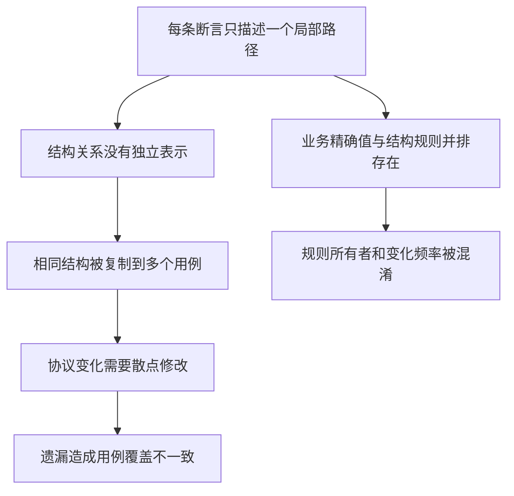
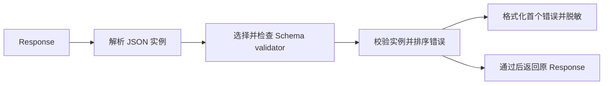
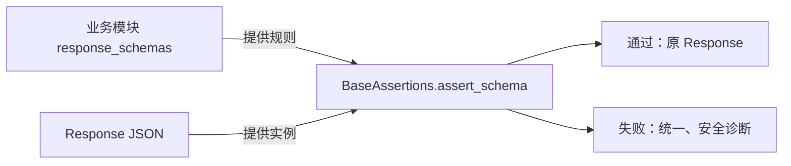
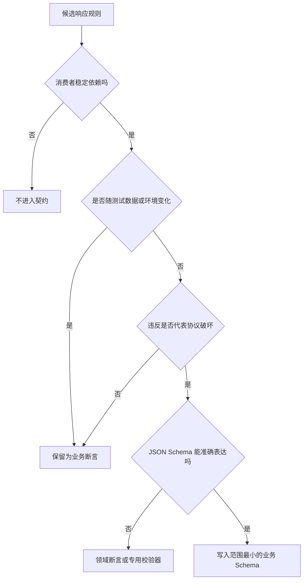
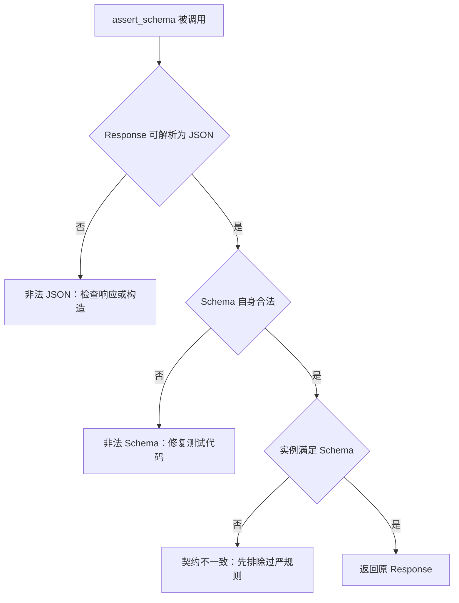
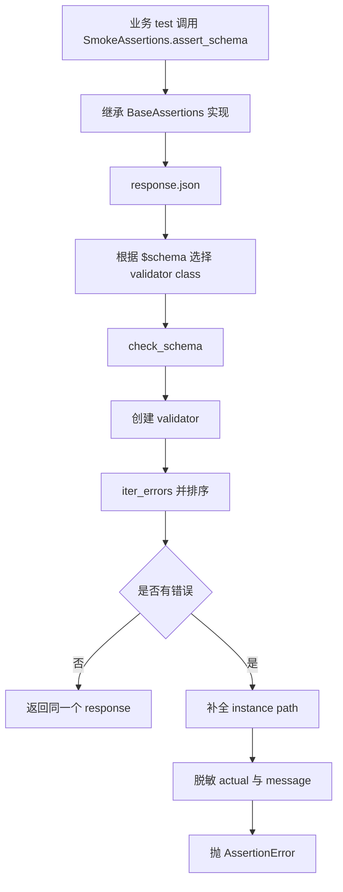
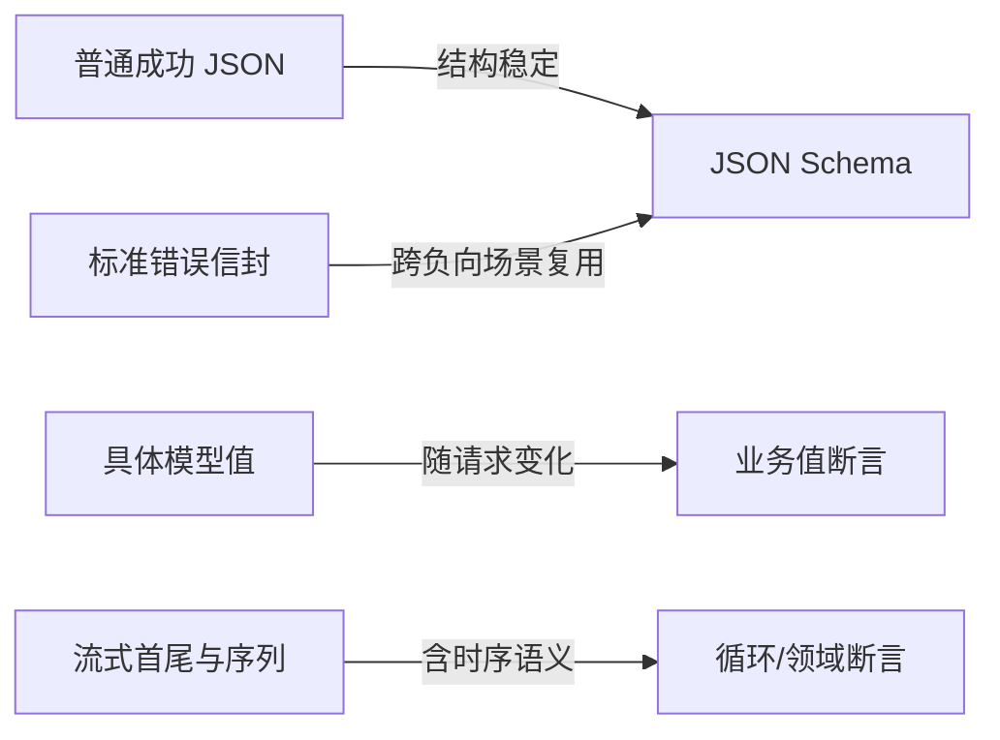
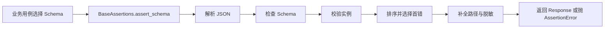

# 第 9 天：从重复字段断言演进为响应契约

> 代码基准：当前 `dev2` 分支。历史代码用于还原演进，当前源码与测试是最终事实。

## 1. 本节定位

前 8 天已经把一次 HTTP attempt、重试序列、轮询序列和测试用例的状态分开。今天进入另一个容易被低估的问题：响应已经返回，测试到底在证明什么？

初版框架能逐字段断言，但“能写断言”不等于“拥有响应契约”。本节不以记住 JSON Schema 关键字为目标，而是训练一种判断能力：

```text
一条响应规则
  → 是消费者长期依赖的结构吗
  → 还是当前数据恰好如此
  → 谁拥有这条规则
  → 它应该随协议、业务还是用例变化
  → 最后才决定是否写入 Schema
```

### 1.1 今日核心问题

> 哪些响应规则是稳定契约，哪些只是当前业务样例，不能进入通用 Schema？

### 1.2 学习完成标准

完成本节后，应能够：

1. 从初版逐字段断言推导出契约断言，而不是因为“JSON Schema 更高级”就替换代码。
2. 用变化原因和变化频率区分结构契约、协议判别值、业务精确值与跨字段语义。
3. 解释为什么 Schema 常量放在业务模块，而验证算法和安全诊断放在 `BaseAssertions`。
4. 区分非法 JSON、非法 Schema、实例不满足 Schema 三种失败及其责任方。
5. 读懂缺失字段路径补全、首错选择和敏感值脱敏的当前实现。
6. 说清当前实现没有提供的能力，不把 JSON Schema 入口误解成契约平台。
7. 给定五条响应规则，判断哪些进入 Schema，并给出可检验的依据。

## 2. 120 分钟学习安排

| 时间 | 环节 | 产出 |
| ---: | --- | --- |
| 0～20 分钟 | 观察初版字段断言 | 旧职责、重复点和信息缺口清单 |
| 20～40 分钟 | 阅读 `291e6ea` 演进代码 | 演进前后证据与调用链 |
| 40～65 分钟 | 寻找变化轴和状态所有者 | 规则分类表、状态生命周期表 |
| 65～90 分钟 | 推导职责边界与最小稳定契约 | 边界表、五问判断法 |
| 90～110 分钟 | 离线最小实验 | 缺失、类型、敏感值三类失败证据 |
| 110～120 分钟 | 方案比较与口述验收 | 决策表和 150 字结论 |

本节只精读一个机制：`assert_schema()` 如何把业务 Schema 应用到响应并产生安全、可定位的失败。不会扩展到 OpenAPI 自动生成、契约注册中心或流式协议平台。

## 3. 第一性原理：契约不是响应样例的完整复刻

### 3.1 从测试的最小目的开始

响应断言的目的不是证明“这次响应和上次一模一样”，而是阻止一个消费者无法继续正确使用的响应进入后续步骤。

因此一条规则进入契约前，至少要满足：

- 消费者确实依赖它，而不是测试作者觉得它看起来重要。
- 它在契约适用范围内稳定，不随测试数据和环境频繁变化。
- 违反它意味着协议兼容性或基本结构已经破坏。
- 它能被当前 Schema 准确表达，不会把业务计算伪装成结构校验。

由此可以推导：Schema 应表达“最小稳定契约”，不是“最大响应描述”。

### 3.2 两条相反的失败链

契约太少：


契约太多：


两条链的共同结论是：Schema 的价值不取决于规则数量，而取决于它是否准确包围消费者依赖的稳定边界。

### 3.3 TOC：真正约束不是 Schema 语法

初版框架已经能用 Python 写任意判断，所以瓶颈从来不是“表达能力不足”。约束链是：

```text
结构规则散落在多个用例
  → 同一协议没有单一、可复用的表达
  → 变化时修改点多且容易遗漏
  → 但若直接复制完整响应生成 Schema
  → 又把样例波动错误升级为协议变化
```

真正约束是对“稳定性”的判断能力。`assert_schema()` 只是执行器；契约质量由规则所有者和边界决定。

TOC 决策因此是：先提供一个失败可定位、安全输出的最小契约入口，再沉淀少量高重复、稳定的 Schema；不先建设全局注册中心和自动生成平台。

## 4. 观察旧实现：逐字段断言究竟缺了什么

### 4.1 初版基础能力

演进前：`56f4f15`，`common/base_assertions.py`

```python
def assert_json_value(
    self,
    response: requests.Response,
    json_path: str,
    expected: Any,
) -> requests.Response:
    assert json_path.startswith("$"), f"JSONPath 表达式必须以 '$' 开头，当前值：{json_path!r}"

    try:
        body = response.json()
    except ValueError as exc:
        raise AssertionError(f"响应内容不是合法 JSON。响应内容：{response.text}") from exc

    matches = [match.value for match in parse(json_path).find(body)]
    assert matches, f"JSONPath {json_path!r} 未匹配到任何值。响应内容：{response.text}"

    actual = matches[0] if len(matches) == 1 else matches
    assert actual == expected, f"JSONPath 断言失败：路径 {json_path!r}，期望 {expected!r}，实际 {actual!r}"
    return response

def assert_json_path_exists(
    self,
    response: requests.Response,
    json_path: str,
) -> requests.Response:
    assert json_path.startswith("$"), (
        f"JSONPath expression must start with '$', current value: {json_path!r}"
    )

    try:
        body = response.json()
    except ValueError as exc:
        raise AssertionError(
            f"Response body is not valid JSON. Response body: {response.text}"
        ) from exc

    matches = [match.value for match in parse(json_path).find(body)]
    assert matches, (
        f"JSONPath {json_path!r} did not match any value. "
        f"Response body: {response.text}"
    )
    return response
```

这两个入口分别回答：

- 路径是否存在。
- 路径的实际值是否等于某个期望值。

它们适合局部、精确的业务判断，却没有把一组字段组织成可复用的结构规则。`assert_json_path_exists()` 也不能证明值的类型；一个字段存在但从整数变成字符串仍会通过。

初版错误分支还直接输出 `response.text`。这证明旧入口本身不具备契约断言所需的安全诊断边界，不能简单循环调用旧函数就结束演进。

### 4.2 重复已经在业务用例中真实出现

演进前：`56f4f15`，`module/smoke/test_response_body_validation.py`

```python
def test_chat_completions_response_body(self):
    response = self.smoke_task.create_chat_completion(
        self.smoke_request,
        self.smoke_task.build_chat_completions_payload(),
    )

    self.smoke_assertions.assert_status_code(response, 200)
    self.smoke_assertions.assert_json_value(response, "$.model", "glm-5")
    self.smoke_assertions.assert_json_path_exists(response, "$.id")
    self.smoke_assertions.assert_json_value(response, "$.object", "chat.completion")
    self.smoke_assertions.assert_json_path_exists(response, "$.choices[0].message")
    self.smoke_assertions.assert_json_path_exists(response, "$.usage.prompt_tokens")
    self.smoke_assertions.assert_json_path_exists(response, "$.usage.total_tokens")
    self.smoke_assertions.assert_json_path_exists(response, "$.usage.completion_tokens")
```

标准错误响应也重复描述同一结构：

```python
assert response.status_code != 200, (
    f"Expected non-200 status code, actual: {response.status_code}."
)
self.smoke_assertions.assert_json_path_exists(response, "$.error")
self.smoke_assertions.assert_json_path_exists(response, "$.error.message")
self.smoke_assertions.assert_json_path_exists(response, "$.error.type")
self.smoke_assertions.assert_json_path_exists(response, "$.error.code")
```

### 4.3 深挖旧实现的问题

问题不是代码行数多，而是每一行只携带局部事实：

1. `$.usage.prompt_tokens` 存在，却没有约束 `usage` 必须是对象、token 必须是非负整数。
2. 同一结构复制到多个用例后，没有一个地方能回答“标准错误响应到底是什么”。
3. 新增或修改稳定字段要搜索所有用例，遗漏不会立即暴露。
4. 路径断言失败时可能打印完整响应，敏感数据保护依赖每个调用点自觉处理。
5. 具体模型值 `glm-5` 与结构规则混在同一串断言里，所有权不清晰。

因果链如下：



## 5. 演进证据一：建立通用契约执行入口

演进后：`291e6ea`，`common/base_assertions.py`；当前 `dev2` 的核心实现保持一致。

```python
def assert_schema(
    self,
    response: requests.Response,
    schema: Mapping[str, Any],
) -> requests.Response:
    try:
        body = response.json()
    except ValueError as exc:
        redacted_body = _redact_response_text(response)
        raise AssertionError(
            f"Response body is not valid JSON. Response body: {redacted_body}"
        ) from exc

    try:
        validator_cls = (
            validator_for(schema)
            if "$schema" in schema
            else Draft202012Validator
        )
        validator_cls.check_schema(schema)
    except SchemaError as exc:
        raise AssertionError(f"Invalid JSON Schema: {exc.message}") from exc

    validator = validator_cls(schema)
    errors = sorted(
        validator.iter_errors(body),
        key=_validation_error_sort_key,
    )
    if errors:
        raise AssertionError(_format_schema_error(errors[0], response))

    return response
```

### 5.1 这段代码形成的边界

它把契约执行分成四步：



- 业务模块负责提供 `schema`，框架不猜测业务协议。
- `BaseAssertions` 负责统一选择 validator、执行校验和组织失败诊断。
- 方法只读响应与 Schema，不修改二者；成功后返回原始 `response`。
- 声明 `$schema` 时由 `validator_for()` 选择版本；未声明时默认 Draft 2020-12。
- `check_schema()` 在校验响应前先验证规则本身，避免把测试代码错误归咎于服务端。
- 实现收集并排序全部 validation errors，但只向调用方展示排序后的第一个错误。

最后一点要准确理解：当前实现不是“发现第一个就停止”，而是 `iter_errors()` 产生的错误被 `sorted()` 收集、排序，再选择 `errors[0]`。这保证相同响应的首错更稳定，但大响应和复杂 Schema 下仍需承担收集全部错误的成本。

### 5.2 同步与异步入口

演进后：`291e6ea`，`common/base_assertions.py`；当前实现保持一致。

```python
async def async_assert_schema(
    self,
    response: requests.Response,
    schema: Mapping[str, Any],
) -> requests.Response:
    return self.assert_schema(response, schema)
```

这是调用形态兼容，不是异步校验引擎。JSON 解析与 Schema 校验都在当前线程同步执行，没有线程池、异步 I/O 或并行验证。

### 5.3 为什么入口属于断言层

Schema 校验发生在响应已经返回之后，既不改变请求，也不控制 retry/polling。若把它放进其他层，会产生错误所有权：

| 错误位置 | 为什么不合适 |
| --- | --- |
| `BaseRequest` | 请求层会被迫知道每个业务接口的响应结构，通用 HTTP client 与业务协议耦合 |
| Middleware | Middleware 生命周期属于一次 attempt；契约是否应用、使用哪个 Schema 是测试意图，不是所有请求的横切行为 |
| `BaseTask` | Task 负责业务动作封装；自动断言会让返回原始响应与负向测试变困难 |
| `TestContext` | Context 管 case 事实和清理，不应同时成为响应规则引擎 |
| `BaseAssertions` | 正确位置：通用执行算法、诊断格式和安全输出可复用，具体 Schema 仍由业务模块提供 |

## 6. 演进证据二：Schema 属于业务模块

### 6.1 成功响应的最小结构

演进后：`291e6ea`，`module/smoke/response_schemas.py`；当前 `dev2` 保持相同 Schema。

```python
CHAT_COMPLETION_SUCCESS_SCHEMA: dict[str, Any] = {
    "$schema": "https://json-schema.org/draft/2020-12/schema",
    "type": "object",
    "required": ["id", "object", "model", "choices", "usage"],
    "properties": {
        "id": {"type": "string", "minLength": 1},
        "object": {"const": "chat.completion"},
        "created": {"type": "integer", "minimum": 0},
        "model": {"type": "string", "minLength": 1},
        "choices": {
            "type": "array",
            "minItems": 1,
            "items": {
                "type": "object",
                "required": ["message"],
                "properties": {
                    "index": {"type": "integer", "minimum": 0},
                    "finish_reason": {"type": ["string", "null"]},
                    "message": {
                        "type": "object",
                        "properties": {
                            "role": {"type": "string"},
                            "content": {"type": ["string", "array", "null"]},
                        },
                    },
                },
            },
        },
        "usage": {
            "type": "object",
            "required": [
                "prompt_tokens",
                "completion_tokens",
                "total_tokens",
            ],
            "properties": {
                "prompt_tokens": {"type": "integer", "minimum": 0},
                "completion_tokens": {"type": "integer", "minimum": 0},
                "total_tokens": {"type": "integer", "minimum": 0},
            },
        },
    },
}
```

关键取舍：

- `object == "chat.completion"` 是协议判别值，所以用 `const`。
- `model` 只要求非空字符串，不写死 `glm-5`；具体模型属于本次请求与业务断言。
- `choices` 至少一项，首层 item 必须有 `message`。
- `content` 允许字符串、数组或 null，避免把纯文本样例误当成唯一协议形态。
- token 约束类型和非负，不在 Schema 中表达总量计算关系。
- 没有 `additionalProperties: false`，服务端新增兼容字段不会因此失败。

### 6.2 标准错误结构

演进后：`291e6ea`，`module/smoke/response_schemas.py`；当前实现保持一致。

```python
STANDARD_ERROR_RESPONSE_SCHEMA: dict[str, Any] = {
    "$schema": "https://json-schema.org/draft/2020-12/schema",
    "type": "object",
    "required": ["error"],
    "properties": {
        "error": {
            "type": "object",
            "required": ["message", "type", "code"],
            "properties": {
                "message": {"type": "string", "minLength": 1},
                "type": {"type": "string", "minLength": 1},
                "code": {"type": ["string", "null"]},
            },
        },
    },
}
```

这里沉淀的是错误“信封”结构，不是某次错误的完整业务语义：

- `message` 必须是非空字符串，但不固定文案。
- `type` 必须存在，但不把所有允许值提前枚举。
- `code` 允许字符串或 null；具体的 `model_not_found` 仍应由对应负向用例断言。
- `param`、`request_id` 等未来新增字段默认被接受。

### 6.3 为什么不放入 `common/`

`BaseAssertions` 的验证算法对所有模块通用；Chat Completion 的字段结构只属于 smoke 模块正在验证的业务协议。把后者放入 `common` 会制造一种假象：框架核心拥有外部 API 的业务契约。

边界应是：



## 7. 演进证据三：结构契约没有吞掉业务断言

演进后：`291e6ea`，`module/smoke/test_response_body_validation.py`；当前 `dev2` 仍使用同一组合。

```python
def test_chat_completions_response_body(self):
    response = self.smoke_task.create_chat_completion(
        self.smoke_request,
        self.smoke_task.build_chat_completions_payload(),
    )

    self.smoke_assertions.assert_status_code(response, 200)
    self.smoke_assertions.assert_schema(
        response,
        CHAT_COMPLETION_SUCCESS_SCHEMA,
    )
    self.smoke_assertions.assert_json_value(response, "$.model", "glm-5")
```

差异不是“八行变两行”这么简单，而是规则重新分组：

- 状态码属于 HTTP 结果预期。
- `CHAT_COMPLETION_SUCCESS_SCHEMA` 属于可复用响应结构。
- `model == glm-5` 属于这条用例发送的业务输入与输出一致性。

如果把 `glm-5` 写进通用 Schema，那么同一接口测试其他合法模型时必须复制或动态修改 Schema，结构契约就会被测试数据接管。

标准错误用例的四条路径存在断言也被一个 Schema 调用替代：

```python
assert response.status_code != 200, (
    f"Expected non-200 status code, actual: {response.status_code}."
)
self.smoke_assertions.assert_schema(
    response,
    STANDARD_ERROR_RESPONSE_SCHEMA,
)
```

注意：只断言“非 200”仍较宽；某个负向场景若要求精确 404 和 `model_not_found`，应由该业务用例补充，不能期待标准错误 Schema 代替。

## 8. 找到变化轴：不要按字段名分类，要按变化原因分类

| 规则 | 为什么变化 | 典型频率 | 所有者 | 推荐表达 |
| --- | --- | ---: | --- | --- |
| 顶层对象与必需字段 | 协议版本变化 | 低 | 业务协议 Schema | `type`、`required` |
| 字段类型和基本范围 | 协议兼容规则变化 | 低 | 业务协议 Schema | `type`、`minimum`、`minLength` |
| 协议判别值 | 响应种类变化 | 低 | 业务协议 Schema | `const` 或稳定枚举 |
| 具体模型 ID | 请求参数、环境、测试数据变化 | 高 | 业务用例 | `assert_json_value()` |
| 错误码 | 负向场景变化 | 中 | 领域断言或用例 | 精确业务断言 |
| 错误消息文案 | 产品文案、本地化变化 | 高 | 特定业务用例 | 必要时局部断言 |
| token 数值 | 输入、模型、计费变化 | 每次响应 | 响应实例；用例只判断语义 | 范围或跨字段业务断言 |
| 新增可选字段 | 服务端兼容扩展 | 中 | 服务端协议 | 默认允许 |
| 失败路径与错误格式 | 框架诊断要求变化 | 中 | `BaseAssertions` | 通用 formatter |
| 敏感字段识别规则 | 安全策略变化 | 中 | `util.redaction` | 通用脱敏能力 |

判断边界时最重要的不是“这个值会不会变”，而是“它为什么变”。两个字段即使现在都很稳定，只要变化原因不同，就不应被同一个所有者永久绑定。

## 9. 识别状态所有者与生命周期

| 状态/规则 | 谁创建 | 谁修改 | 谁结束/清理 | 生命周期 |
| --- | --- | --- | --- | --- |
| HTTP `Response` | requests/服务端交互 | 断言不修改 | 调用链释放 | 一次响应 |
| 解析后的 body | `assert_schema()` | 只读 | 方法返回后释放 | 一次断言调用 |
| Schema 常量 | 业务模块维护者 | 协议变化时修改 | 随代码版本替换 | 一个业务协议版本 |
| validator class | `$schema`/默认规则选择 | 不修改 | 调用内结束 | 一次断言调用 |
| validator 实例 | `assert_schema()` | 内部校验 | 调用结束 | 一次断言调用 |
| validation errors | jsonschema 生成 | 排序后读取 | 抛错或调用结束 | 一次失败调用 |
| 具体模型期望 | 测试场景创建 | 用例参数变化时修改 | case 结束 | 一个测试场景 |
| 诊断格式 | `BaseAssertions` | 框架演进时修改 | 随代码版本替换 | 框架版本 |
| 敏感字段规则 | `util.redaction` | 安全策略变化时修改 | 随代码版本替换 | 框架版本 |

这里没有需要跨请求保存的可变契约状态，因此当前实现不需要 Schema registry、全局缓存或 TestContext。Schema 是代码常量，validator 是调用内临时对象。

## 10. 推导“最小稳定契约”的五问法

面对一条候选规则，依次回答：

1. **谁依赖？** 没有消费者依赖的字段，不因响应里出现就自动成为契约。
2. **为什么变化？** 若随模型、账号、时间、环境或测试数据变化，通常属于业务样例。
3. **违反意味着什么？** 若只表示另一个合法场景，不应写进通用 Schema。
4. **适用范围多大？** 是整个端点、一个响应种类，还是单个 case？Schema 名称和位置必须匹配范围。
5. **Schema 能准确表达吗？** 跨响应、账单计算、顺序状态等语义应留给领域断言。

决策流程：



### 10.1 对十条真实候选规则做判断

| 候选规则 | 是否进入 `CHAT_COMPLETION_SUCCESS_SCHEMA` | 依据 |
| --- | --- | --- |
| 顶层必须是 object | 是 | 消费者读取命名字段的结构前提 |
| `id` 必须是非空字符串 | 是 | 响应身份的稳定类型约束 |
| `object == "chat.completion"` | 是 | 该 Schema 适用响应种类的协议判别值 |
| `model == "glm-5"` | 否 | 随请求选择变化；属于当前用例 |
| `choices` 至少一项 | 是 | 当前成功响应的最小可消费结构 |
| `content` 必须是非空字符串 | 否 | 当前协议兼容数组与 null，过严会制造假失败 |
| token 必须是非负整数 | 是 | 类型与基本范围稳定 |
| `total_tokens == prompt + completion` | 不放入当前 Schema | 跨字段业务语义，更适合领域断言；当前 Schema 也未表达 |
| 必须恰好只有当前列出的字段 | 否 | 兼容新增字段不应失败 |
| 错误消息必须等于某句文案 | 否 | 文案和场景变化频率高 |

## 11. 三种失败必须分开诊断

### 11.1 响应不是合法 JSON

责任对象通常是服务端内容、网关响应或测试构造：

```python
try:
    body = response.json()
except ValueError as exc:
    redacted_body = _redact_response_text(response)
    raise AssertionError(
        f"Response body is not valid JSON. Response body: {redacted_body}"
    ) from exc
```

此时 Schema 还没有开始执行。错误输出先脱敏，并最多保留 2000 字符。

### 11.2 Schema 自身非法

责任对象是测试代码或契约常量：

```python
try:
    validator_cls = (
        validator_for(schema)
        if "$schema" in schema
        else Draft202012Validator
    )
    validator_cls.check_schema(schema)
except SchemaError as exc:
    raise AssertionError(f"Invalid JSON Schema: {exc.message}") from exc
```

例如 `{"type": 123}` 不是合法 Schema。若不先 `check_schema()`，测试可能在验证响应时产生难以归责的异常。

### 11.3 响应不满足合法 Schema

责任对象通常是服务端响应与声明契约不一致，但仍要先检查 Schema 是否写得过严：

```python
validator = validator_cls(schema)
errors = sorted(
    validator.iter_errors(body),
    key=_validation_error_sort_key,
)
if errors:
    raise AssertionError(_format_schema_error(errors[0], response))
```

判断顺序不能倒置：失败首先证明“实例与当前 Schema 不一致”，只有确认 Schema 表达的是稳定协议后，才能判定服务端回归。



## 12. 失败定位：路径本身也是框架契约

### 12.1 为什么 `required` 需要补全字段路径

jsonschema 对缺失属性的原始错误路径通常停在父对象。例如 `usage` 缺少 `prompt_tokens`，原始 instance path 可能只有 `$.usage`。当前框架把缺失字段补到路径尾部：

演进后：`291e6ea`，`common/base_assertions.py`；当前实现保持一致。

```python
def _error_path_parts(error: ValidationError) -> list[Any]:
    path_parts = list(error.absolute_path)
    if error.validator == "required":
        missing_property = _missing_required_property(error)
        if missing_property is not None:
            path_parts.append(missing_property)
    return path_parts

def _missing_required_property(error: ValidationError) -> str | None:
    if error.validator != "required":
        return None
    if not isinstance(error.instance, Mapping):
        return None
    if not isinstance(error.validator_value, Iterable):
        return None

    for property_name in error.validator_value:
        if isinstance(property_name, str) and property_name not in error.instance:
            return property_name
    return None
```

这样失败能定位到 `$.usage.prompt_tokens`，而不是只说 `$.usage` 有问题。

### 12.2 统一错误信息

演进后：`291e6ea`，`common/base_assertions.py`；当前实现保持一致。

```python
def _format_schema_error(
    error: ValidationError,
    response: requests.Response,
) -> str:
    path_parts = _error_path_parts(error)
    actual_value = _actual_value(error)
    redacted_actual_value = _redact_value_for_path(
        actual_value,
        path_parts,
    )
    expected = _format_expected(error)
    message = _redact_error_message(
        error.message,
        actual_value,
        path_parts,
    )

    lines = [
        "JSON Schema assertion failed.",
        f"Path: {_format_json_path(path_parts)}",
        f"Schema path: {_format_schema_path(error.absolute_schema_path)}",
        f"Validator: {error.validator}",
        f"Expected: {expected}",
        f"Actual type: {_type_name(actual_value)}",
        f"Actual value: {_format_actual_value(redacted_actual_value)}",
        f"Message: {message}",
    ]

    if error.validator == "required":
        lines.append(
            f"Response body: {_redact_response_text(response)}"
        )

    return "\n".join(lines)
```

一条类型错误会同时给出：

```text
Path: $.usage.prompt_tokens
Schema path: properties/usage/properties/prompt_tokens/type
Validator: type
Expected: integer
Actual type: str
Actual value: '12'
```

JSON path 回答“响应哪里错”，Schema path 回答“哪条规则判错”。二者不能互相替代。

### 12.3 脱敏不是附加功能

失败信息会进入终端、CI 和报告，因此实际值和原始 validator message 都可能泄密。当前代码按失败字段名再次包装实际值，让 `api_key` 这类字段即使值只是普通字符串也能触发字段名脱敏；required 失败附带的响应体也经过文本脱敏和长度限制。

必须保持的不变量：

> 诊断信息可以增加，但不能以泄露真实秘密为代价。

也要注意当前边界：安全处理是 `assert_schema()` 的实现事实，不代表旧的 `assert_json_value()`、`assert_json_path_exists()` 所有错误分支都已经同样脱敏。

## 13. 当前真实调用链

以业务用例通过 `SmokeAssertions` 调用为例：



这里 `SmokeAssertions` 不需要重写方法。继承只复用通用验证机制；Schema 仍从 `module/smoke/response_schemas.py` 显式传入。

模块级 `assert_schema()` 和 `async_assert_schema()` 也存在，但业务规范要求通过当前模块的 Assertions 实例调用，从而保留模块断言层作为统一入口。

## 14. 推导职责边界

### 14.1 必须保持的不变量

1. Schema 自身错误不能伪装成服务端响应错误。
2. 缺失嵌套字段必须定位到具体字段，而不是只停在父对象。
3. 失败信息中的实际值、validator message 和响应摘要必须安全处理。
4. Schema 只表达其适用范围内的稳定协议，不冻结动态业务数据。
5. 新增兼容字段默认不能造成失败，除非协议明确禁止。
6. 具体业务值断言不能因引入 Schema 而消失。
7. 契约验证不得修改原始 Response，成功后仍可继续断言。
8. 响应 Schema 不进入通用请求层、Middleware 或 TestContext。

### 14.2 当前职责分配

| 层 | 应负责 | 不应负责 |
| --- | --- | --- |
| `BaseRequest` | 发送请求、返回 Response | 自动选择业务 Schema |
| Middleware | attempt 级横切处理 | 把所有响应强制契约化 |
| `BaseTask` | 封装业务动作与 payload | 隐式断言响应结构 |
| `BaseAssertions` | validator 选择、执行、路径与安全诊断 | 拥有 Chat Completion 字段定义 |
| 业务 `response_schemas.py` | 对应模块的稳定结构契约 | 通用脱敏算法、请求发送 |
| 模块 Assertions/业务用例 | 选择 Schema、补充精确业务语义 | 重复实现 validator plumbing |
| `TestContext` | case 事实与清理 | 保存全局 Schema 或执行契约 |

### 14.3 TOC 清晰思考

是否新增 Schema，不看“覆盖率是否更高”，而看当前约束是否来自重复且稳定的结构断言：

```text
同一结构是否在多个场景重复
  → 是否有明确消费者依赖
  → 规则是否比测试数据更稳定
  → 是：沉淀业务 Schema
  → 否：保留局部或领域断言
```

当前流式 chunk 仍手写循环断言并不自动等于欠债。流式响应存在首块、中间块、尾块和 `[DONE]` 的时序差异；在没有先定义 chunk 类型与序列协议之前，用一个静态 Schema 替换全部判断会丢失状态语义。

## 15. 方案比较

| 方案 | 规则/状态放在哪里 | 收益 | 代价或失败方式 | 适用条件 |
| --- | --- | --- | --- | --- |
| 手写逐字段断言 | 每个用例 | 直接、灵活、适合少量精确值 | 重复、遗漏、类型与结构关系分散 | 单个特例或业务精确语义 |
| 当前 JSON Schema | 业务模块常量；通用 validator 在断言层 | 语言中立、声明式、结构复用、错误路径清晰 | 手工维护；动态语义有限；治理不当会过严 | 稳定 JSON 响应结构 |
| Pydantic 响应模型 | Python model 类 | 类型对象、IDE 支持、可复用业务代码 | 可能发生转换；与 Python 运行模型绑定；校验目的易与反序列化混合 | 应用代码需要构造强类型对象 |
| 直接加载 OpenAPI | 外部/仓库 API 描述 | 契约来源集中，可减少双写 | `$ref`、版本、环境差异、文档滞后和端点映射成为新约束 | OpenAPI 已被可靠治理并持续同步 |
| Schema registry | 独立中心 | 跨服务版本管理与复用 | 发布、权限、缓存、兼容策略和可用性成本 | 多团队、大规模契约治理 |
| Schemathesis/Hypothesis 自动生成 | API 描述与生成策略 | 扩大输入空间，发现边界问题 | 不是简单响应断言替代品；需要稳定契约、数据和隔离治理 | 基础契约已可靠，需系统性生成测试 |

### 15.1 为什么当前没有直接加载 OpenAPI

第一版约束是重复结构校验缺口。直接加载 OpenAPI 会立即引入另一个更难的问题：哪个文档版本是事实、如何映射环境、如何解析引用、文档滞后时谁负责。若契约来源尚未治理，自动化只会更快地执行错误契约。

### 15.2 为什么不是 Pydantic

本场景只需判断一个已有 JSON 实例是否符合协议，不需要把响应转换成应用领域对象。JSON Schema 更贴近 API 契约表达，也不会让测试误以为“成功构造 Python model”就是全部业务正确性。

## 16. 当前采用深度：局部迁移，而非全仓库替换

当前 `dev2` 的源码检索显示：

- Chat Completion 普通成功响应使用 `CHAT_COMPLETION_SUCCESS_SCHEMA`。
- 标准错误响应使用 `STANDARD_ERROR_RESPONSE_SCHEMA`。
- 同步图片生成仍使用路径存在断言。
- 流式 Chat Completion 仍逐 chunk 手写结构与首尾语义断言。
- 具体模型仍使用 `assert_json_value(..., "glm-5")`。

这说明当前策略是“先迁移最稳定、重复最高的结构”，不是以 Schema 使用率为目标。



## 17. 当前实现的真实限制

这些限制必须从代码得出，不能因依赖库“理论上支持”就当作框架能力：

1. **只报告一个错误。** 实现收集并排序全部错误，但最终只格式化 `errors[0]`。
2. **每次重新创建 validator。** 当前没有已编译 validator 或 Schema 缓存。
3. **没有显式 `FormatChecker`。** 即使 Schema 写了 `format: email` 等格式，当前构造方式也没有启用格式检查器，不能宣称格式一定被验证。
4. **没有引用治理。** 库本身可处理部分 `$ref`，但框架没有 registry、resolver、远程引用策略或离线引用测试，不能把复杂 `$ref` 视为已治理能力。
5. **没有 Schema 注册与自动选择。** 调用方必须显式传入 Schema。
6. **没有 OpenAPI 同步。** 代码常量可能与外部文档漂移，需要业务维护者负责。
7. **默认允许额外字段。** 两个当前 Schema 都未设置 `additionalProperties: false`；这是兼容性选择，不是遗漏字段验证。
8. **不能表达所有业务语义。** 跨响应账单变化、轮询状态迁移、流式顺序不应硬塞进静态响应 Schema。
9. **异步入口仍同步执行。** 它只兼容 `await` 调用形态。
10. **安全边界不是整个断言模块统一完成。** `assert_schema()` 有脱敏诊断，旧 JSONPath 入口仍存在直接输出响应的分支。

## 18. 最小离线实验

### 18.1 实验目标

用一个最小任务响应证明四件事：

1. 合法结构通过并返回原 Response。
2. 缺失字段能定位到精确 JSON path。
3. 错误类型能同时显示期望、实际类型和值。
4. 敏感字段的实际值不会进入异常文本。

### 18.2 实验构造

```python
import json

import requests

from common.base_assertions import BaseAssertions


def make_response(body):
    response = requests.Response()
    response.status_code = 200
    response.headers["Content-Type"] = "application/json"
    response._content = json.dumps(body).encode("utf-8")
    return response


TASK_SCHEMA = {
    "type": "object",
    "required": ["task"],
    "properties": {
        "task": {
            "type": "object",
            "required": ["id", "status", "api_key"],
            "properties": {
                "id": {"type": "string", "minLength": 1},
                "status": {
                    "enum": ["queued", "running", "succeeded", "failed"],
                },
                "api_key": {"type": "integer"},
            },
        },
    },
}

assertions = BaseAssertions()
```

`api_key` 故意写成 `integer`，只用于触发敏感值类型错误并观察脱敏，不代表真实业务应把 secret 放入响应。

### 18.3 三组失败

缺失字段：

```python
assertions.assert_schema(
    make_response({"task": {"status": "queued", "api_key": 1}}),
    TASK_SCHEMA,
)
```

预期包含：

```text
Path: $.task.id
Validator: required
Actual type: <missing>
```

错误类型：

```python
assertions.assert_schema(
    make_response({
        "task": {
            "id": 123,
            "status": "queued",
            "api_key": 1,
        },
    }),
    TASK_SCHEMA,
)
```

预期包含：

```text
Path: $.task.id
Validator: type
Expected: string
Actual type: int
Actual value: 123
```

敏感值：

```python
assertions.assert_schema(
    make_response({
        "task": {
            "id": "task-001",
            "status": "queued",
            "api_key": "day09-secret",
        },
    }),
    TASK_SCHEMA,
)
```

预期异常包含 `<redacted>`，且不包含 `day09-secret`。

### 18.4 仓库目标测试

```powershell
cd D:\API_CASE
.\.venv\Scripts\python.exe -m pytest tests\test_base_assertions_schema.py -q
```

当前测试文件共定义 13 项，覆盖成功返回、顶层/嵌套缺失、类型、const、数组路径、非法 JSON、非法 Schema、脱敏、同步/异步导出和两个业务 Schema。

本次在当前工作区实际执行时，测试在收集阶段被环境依赖阻塞：

```text
ModuleNotFoundError: No module named 'jsonschema'
```

仓库 `requirements.txt` 已声明 `jsonschema`，但当前 `.venv` 尚未安装。安装命令：

```powershell
.\.venv\Scripts\python.exe -m pip install jsonschema
```

安装后重新执行目标测试。历史落地记录显示该测试集曾得到 `13 passed`，但它不能替代对当前环境的重新验证；本节不把历史结果写成当前通过。

### 18.5 失败时按层定位

1. 环境层：当前解释器是否安装 `jsonschema`、`requests`。
2. 构造层：Response body 是否为正确编码的 JSON，Content-Type 是否符合预期。
3. Schema 层：Schema 自身是否合法、draft 是否明确。
4. 契约层：规则是否过严，是否误放具体业务样例。
5. 实例层：服务端响应是否真的违反稳定规则。
6. 诊断层：路径、expected/actual 和脱敏是否正确。

不要在依赖缺失时讨论服务端契约，也不要在 Schema 自身非法时修改接口代码。

## 19. 按每日学习记录模板生成的完整记录

### 19.1 基本信息

- 对应课程日：第 9 天。
- 建议投入时间：120 分钟。
- 今日主题：从重复字段断言演进为最小稳定响应契约。
- 代码基准：当前 `dev2`；演进节点为 `56f4f15 → 291e6ea`。

### 19.2 观察旧实现

- 使用的历史提交：`56f4f15` 的 `common/base_assertions.py` 和 `module/smoke/test_response_body_validation.py`。
- 旧实现职责：按 JSONPath 判断存在性或精确值，业务用例逐条排列响应字段。
- 具体问题：同一结构散落重复；存在不等于类型正确；结构与具体业务值混在同一用例；错误可能直接输出响应体。
- 已真实出现的问题：普通成功响应重复七条字段规则，标准错误响应在多个负向场景重复四条路径规则。
- 未来风险：散点修改遗漏、Schema 过严导致兼容扩展假失败、失败输出泄露敏感数据。

### 19.3 找到变化轴

| 变化内容 | 为什么变化 | 变化频率 | 是否与其他内容独立 |
| --- | --- | ---: | --- |
| 必需字段与嵌套结构 | API 协议版本变化 | 低 | 独立于测试数据 |
| 字段类型与范围 | 协议兼容规则变化 | 低 | 独立于具体值 |
| 模型 ID | 请求参数和环境变化 | 高 | 独立于响应结构 |
| 错误码/消息 | 业务场景和产品文案变化 | 中/高 | 独立于错误信封结构 |
| 新增可选字段 | 服务端兼容扩展 | 中 | 不应破坏旧消费者 |
| validator draft | Schema 声明变化 | 低 | 独立于 Response 实例 |
| 失败格式与脱敏 | 排障、安全要求变化 | 中 | 独立于业务 Schema |

### 19.4 识别状态所有者

| 状态 | 谁创建 | 谁修改 | 谁结束/清理 | 生命周期 |
| --- | --- | --- | --- | --- |
| Response/body | 服务端与 requests | 断言只读 | 调用链释放 | 一次响应 |
| 业务 Schema | 业务模块 | 协议变化时维护 | 代码版本替换 | 协议版本 |
| validator | `assert_schema()` | 不修改 | 调用结束 | 一次断言 |
| validation error | jsonschema | 框架排序/格式化 | 抛错后释放 | 一次失败 |
| 精确模型期望 | 用例 | 输入变化时调整 | case 结束 | 测试场景 |
| 诊断与脱敏规则 | common/util | 框架与安全演进 | 代码版本替换 | 框架版本 |

### 19.5 推导职责边界

- 必须保持的不变量：规则合法性先验证；路径精确；失败安全；稳定结构与动态业务值分离；兼容新增字段默认通过；原 Response 不被修改。
- 根据生命周期推导的边界：业务模块拥有长期协议常量，断言调用拥有临时 validator/error，用例拥有本场景精确值。
- 当前实际边界：`BaseAssertions` 执行并诊断，`module/smoke/response_schemas.py` 提供两个 Schema，业务用例显式选择并补充值断言。
- 推导与实现不一致或尚未覆盖之处：无 validator 缓存、无显式 FormatChecker、无引用治理、无注册中心、只显示一个错误、流式序列尚未契约化。

### 19.6 比较其他方案

当前 JSON Schema 方案比逐字段断言更能复用稳定结构，比 Pydantic 更少混入对象构造语义，比直接加载 OpenAPI 少了契约来源治理成本。代价是 Schema 常量需要手工维护，复杂业务语义仍需领域断言，而且错误规则会被更大范围复用。

### 19.7 代码执行链



### 19.8 最小实验

- 实验输入：合法任务响应、缺失 `task.id`、`task.id` 类型错误、敏感 `api_key` 类型错误。
- 预期结果：合法响应返回原对象；缺失路径为 `$.task.id`；类型错误包含 expected/actual；秘密只显示 `<redacted>`。
- 实际结果：当前目标测试在 collection 阶段因 `.venv` 缺少 `jsonschema` 被阻塞，未进入 13 项用例执行。
- 验证命令：`.\.venv\Scripts\python.exe -m pytest tests\test_base_assertions_schema.py -q`。
- 是否访问真实网络：测试本身否；本次依赖安装尝试未成功完成。
- 是否执行真实 sleep：否。

### 19.9 失败分析

本次失败属于环境/依赖层。证据是导入 `common.base_assertions` 时抛出 `ModuleNotFoundError`，尚未创建 Response、Schema 或执行 validator，因此可以排除测试构造、契约判断和业务响应层。

修复环境后若出现测试失败，再按 Schema 合法性、响应构造、实例差异、诊断格式顺序定位。

### 19.10 今日口述答案

- 旧实现为什么需要演进：稳定结构被拆成多个局部路径断言，重复且无法统一表达类型、范围和嵌套关系。
- 能力为什么放在当前层：验证算法和安全诊断跨业务复用，属于断言层；字段结构随业务协议变化，属于模块 Schema。
- 核心状态由谁拥有：业务模块拥有长期 Schema；一次调用拥有 validator/error；用例拥有具体模型和错误码期望。
- 当前方案收益与代价：结构复用、定位清楚且安全；代价是手工维护、能力边界有限、错误契约会扩大假失败。
- 错误实现会造成什么后果：过松放过破坏，过严阻塞兼容扩展；混入具体模型会让 Schema 随测试数据变化；不脱敏会泄密。
- 如何离线证明：构造 `requests.Response`，覆盖合法、缺失、类型、非法 Schema、非法 JSON、数组路径和敏感值，不访问真实接口。

### 19.11 未解决问题

- 已确认但暂不处理：只显示首错、每次新建 validator、无 FormatChecker、旧 JSONPath 断言安全行为不统一。
- 需要后续源码评估：validator 缓存的实际收益、共享 Schema 组件、离线 `$ref` registry、是否统一旧断言脱敏。
- 需要真实业务协议才能回答：哪些字段保证长期必需、哪些枚举允许扩展、流式 chunk 的合法序列、是否存在严格禁止额外字段的响应。

### 19.12 今日结论

响应契约不是完整样例快照，而是消费者依赖的最小稳定结构。业务模块拥有 Schema，`BaseAssertions` 只负责验证和安全诊断；具体模型、错误码和跨字段语义继续由用例或领域断言拥有。边界判断比 Schema 语法更重要。

## 20. 最终验收答案

### 20.1 给定五条规则，哪些进入 Schema

假设规则是：

1. 顶层必须有非空字符串 `id`。
2. `object` 必须等于 `chat.completion`。
3. `model` 必须等于 `glm-5`。
4. `usage.total_tokens` 必须是非负整数。
5. 响应不能出现 Schema 未列出的任何字段。

答案：

| 规则 | 决策 | 原因 |
| --- | --- | --- |
| 非空字符串 `id` | 进入 | 稳定身份结构，消费者依赖 |
| 固定 `object` 判别值 | 进入 | 界定该 Schema 的响应种类 |
| `model == glm-5` | 留在业务用例 | 随请求和环境变化，不是端点通用结构 |
| 非负整数 token | 进入 | 稳定类型和基本范围 |
| 禁止所有额外字段 | 当前不进入 | 兼容扩展不应破坏旧消费者，除非协议明确封闭 |

### 20.2 状态所有者的最短回答

Schema 常量由对应业务模块拥有，并随协议版本变化；validator 和 validation error 由一次 `assert_schema()` 调用拥有；具体模型、错误码和场景值由业务用例拥有；安全诊断规则由通用断言与脱敏模块拥有。

### 20.3 为什么 Schema 不替代业务断言

Schema 擅长结构、类型、必需字段和基本范围；“请求 glm-5 就应返回 glm-5”“失败不应扣费”“token 总量如何计算”等是场景或跨字段语义。强行合并会让通用 Schema 跟随高频业务数据变化，失去复用边界。

### 20.4 为什么默认不禁止额外字段

消费者只依赖已声明字段时，服务端增加新字段是向后兼容变化。`additionalProperties: false` 会把这种兼容扩展变成测试失败。只有协议明确封闭、额外字段本身会造成安全或解析风险时，才应局部禁止。

### 20.5 如何判断一次 Schema 失败是不是服务端缺陷

按顺序确认：响应确为 JSON；Schema 自身合法；失败规则是消费者依赖而非当前样例；Schema 适用范围正确；协议没有允许该变化。完成这些排除后，实例违反稳定契约才是服务端回归证据。

## 21. 今日总结

初版框架用 JSONPath 逐项验证 Chat Completion 和标准错误响应，能够检查局部字段，却无法独立表达可复用结构，也没有统一的类型、范围、路径和安全诊断。`291e6ea` 在 `BaseAssertions` 中加入 `assert_schema()`，并把两个业务 Schema 放在 smoke 模块：通用层拥有验证机制，业务层拥有协议规则。

当前方案刻意保持最小：声明 draft、先检查 Schema、排序错误并输出首错、补全 required 路径、脱敏实际值和响应摘要；同时不建设注册中心、OpenAPI 自动加载、FormatChecker 或复杂引用治理。具体模型仍由用例断言，流式首尾仍由序列逻辑验证，额外字段默认允许。

今天最重要的不是会写 `required` 和 `properties`，而是能说出一条规则为什么稳定、由谁拥有、违反后破坏哪个消费者不变量。只有这个判断成立，JSON Schema 才是契约；否则它只是更难维护的响应样例。

本节到此结束。下一节将研究 Mock 如何控制外部不确定性，并证明异常分支在不访问真实接口时仍然正确。
