# 第 10 天：Mock 是控制不确定性，不是伪造一切

> 代码基准：当前 `dev2` 分支。历史提交用于观察演进，当前源码与测试是最终事实。

## 1. 本节定位

第 9 天解决的是：已经得到一个 `Response` 后，如何证明它满足稳定响应契约。

第 10 天继续向外追一层：真实网络、服务端状态和流式传输都不受测试控制，怎样稳定制造 `Timeout → 503 → 200`、非法 chunk 和中途断流，并证明框架的异常控制流没有被偶然环境掩盖？

本节不是教你把整个服务端复制到测试进程里，也不是记忆 `monkeypatch` 语法。真正要解决的问题是：

```text
框架关键分支依赖外部不确定事件
  → 真实环境无法保证事件按指定顺序出现
  → 无法稳定到达分支，就无法持续证明分支正确
  → 必须在最小协议边界注入可重复事件
  → Fake 只实现被测代码实际读取的协议表面
  → Fake 没覆盖的真实性必须由更高层测试补足
```

### 1.1 今日核心问题

> 框架异常分支为什么必须离线验证？Fake 应该模拟到什么程度停止？

### 1.2 学习完成标准

完成本节后，应能够：

1. 从旧测试中的重复局部 fake 推导出公共 helper，而不是因为“测试代码也要抽象”就机械封装。
2. 区分故障输入、调用记录、假时间、流读取进度分别由谁拥有以及持续多久。
3. 解释为什么 `SequenceTransport` 替换 `session.request`，而不是给 `BaseRequest` 增加生产环境 mock 模式。
4. 解释为什么普通响应尽量构造真实 `requests.Response`，流式故障才使用最小 `FakeStreamResponse`。
5. 设计一个 `Timeout → 503 → 200` 离线实验，断言结果、请求次数、等待时间和输入没有被隐藏。
6. 证明流中断时原异常传播且 `response.close()` 必然执行。
7. 列出当前 Fake 与真实 `requests`/网络栈的至少三个偏差，并据此选择升级测试层级。
8. 当 Fake 测试与更高层测试结论不一致时，能按协议真实性缺口选择升级层级，而不是继续扩张 Fake。

## 2. 120 分钟学习安排

| 时间 | 环节 | 产出 |
| ---: | --- | --- |
| 0～18 分钟 | 观察 `291e6ea` 的内联 fake | 重复状态与重复协议清单 |
| 18～33 分钟 | 建立不确定性与证据模型 | 网络、协议、业务三层表 |
| 33～53 分钟 | 阅读 `fbff62e` 演进证据 | 演进前后关键代码差异 |
| 53～72 分钟 | 精读 `SequenceTransport` 与假时间 | `Timeout → 503 → 200` 调用链 |
| 72～91 分钟 | 精读 `FakeStreamResponse` 与关闭语义 | 中途断流资源时间线 |
| 91～104 分钟 | 识别状态所有者并推导边界 | 生命周期表与不变量 |
| 104～113 分钟 | 比较替代方案与升级条件 | 四方案决策表 |
| 113～120 分钟 | 执行离线实验与口述验收 | 测试证据、偏差清单、结论 |

控制学习范围：今天只研究测试如何控制框架已经依赖的协议表面。不建设 Mock Server，不引入场景 DSL，不学习第三方 Mock 库的完整 API，也不把真实 smoke 改成假接口测试。

## 3. 第一性原理：测试要控制的是输入，不是复制世界

### 3.1 异常分支为什么不能只靠真实环境

正常 HTTP 200 很容易在联调环境出现，但以下事件不能被测试稳定预约：

- 第一次调用恰好在连接阶段 `Timeout`。
- 第二次调用恰好返回 503。
- 第三次调用恰好返回 200。
- 服务端恰好在第一条 SSE 数据之后中断 chunked encoding。
- 一个轮询任务恰好按 `queued → running → succeeded` 演进。

如果只依赖真实环境，因果链会变成：

```text
故障出现时机由网络和服务端决定
  → 测试多数时候无法进入目标异常分支
  → 未进入分支却仍显示“本轮没有失败”
  → 绿色结果只能证明环境当时正常
  → 不能证明重试、预算、异常传播和资源清理正确
```

所以异常分支离线验证不是为了让测试跑得快，而是为了让“指定输入必然触发指定控制流”成为可重复证据。

### 3.2 三层不确定性不能混为一个“接口不稳定”

| 层次 | 代表事件 | 被测对象真正依赖的表面 | 合适的离线控制点 |
| --- | --- | --- | --- |
| 网络/传输 | ConnectionError、Timeout、429、503 | `session.request()` 返回 Response 或抛异常 | `SequenceTransport` |
| 时间 | backoff、deadline、主动中断时刻 | `sleep(seconds)`、`monotonic()` | `SleepRecorder`、假时钟/monkeypatch |
| HTTP 响应 | status、headers、JSON/text body、PreparedRequest | `requests.Response` 的局部接口 | `make_response()` 构造真实 Response |
| 流协议 | `iter_lines()`、中途异常、`close()` | SmokeTask 实际调用的三个成员 | `FakeStreamResponse` |
| 观测出口 | success/failure/retry/polling 附件 | logger 的四个公开方法 | `FakeApiCallLogger` |
| 业务轮询 | queued、running、failed、succeeded | 一组按顺序返回的 Response | `polling_responses()` + `SequenceTransport` |

测试替身的粒度应从被测代码实际读取的协议推导，不能从真实系统“拥有多少功能”反向复制。

### 3.3 两种证据各自能证明什么

| 证据 | 能证明 | 不能证明 |
| --- | --- | --- |
| 离线 Fake 测试 | 控制流、分支、调用次数、等待参数、异常类型、关闭动作 | DNS、TLS、代理、真实 Socket、服务端真实协议承诺 |
| 真实 smoke | 环境可达、认证、真实请求/响应集成、服务端当前行为 | 稀有故障分支每次都正确、严格故障顺序可重复 |

两者不是高低关系，而是证据范围不同。用 smoke 替代离线异常测试，会失去可控性；用 Fake 替代 smoke，会失去真实集成证据。

## 4. TOC：当前约束不是“没有 Mock Server”

### 4.1 当前现实树

观察 `291e6ea` 时，可以看到四个不良结果：

| 不良结果 | 直接原因 | 更深原因 |
| --- | --- | --- |
| 重试用例重复维护 response list | 每个用例自己表达结果序列 | 没有公共的顺序 transport 协议 |
| 异常和 Response 需要手工分派 | lambda 只能直接返回，复杂场景再写局部函数 | 故障序列没有统一值模型 |
| sleep 断言写法分散 | 每个用例 patch 一个 list.append | 假时间只是技巧，没有成为显式场景状态 |
| SSE 故障缺少离线覆盖 | 普通 Response helper 不会在迭代中抛错 | 流读取协议没有最小替身 |

共同根因不是“pytest 不够强”，也不是“缺少一个 HTTP 服务”。共同根因是：测试场景状态缺少可复用、可观察的表达。

### 4.2 约束转移

如果第一步直接建设本地 Mock Server，约束会从“故障不可重复”转移成：

- 端口和进程生命周期管理。
- 服务启动就绪与 teardown。
- 路由 DSL 和状态重置。
- 并行 worker 端口隔离。
- CI 网络策略和日志定位。

这些工作不会自动提高 `RetryExecutor` 分支的证明强度。因此 `fbff62e` 的选择是先建立进程内 helper，只在 Fake 无法表达真实 Socket 行为时升级。

### 4.3 TOC 决策准则

本节使用一个简单约束问题做决策：

> 当前最难稳定制造、又最影响结论的事件是什么？

如果答案是“第几次调用返回或抛出什么”，使用 `SequenceTransport`；如果是“流迭代到第几条时中断”，使用 `FakeStreamResponse`；如果是“真实分块、连接关闭或 TLS 行为”，当前 Fake 已越界，应升级到本地服务或真实集成测试。

## 5. 观察旧实现：能力已经存在，表达方式仍然散落

### 5.1 历史证据入口

```powershell
git show 291e6ea:tests/test_base_request_retry_polling.py
git show fbff62e:tests/mock_helpers.py
git show fbff62e -- tests/test_base_request_retry_polling.py tests/mock_helpers.py tests/test_stream_fault_simulation.py
```

先读旧测试，不要先看 helper 名称。目标是自行找出测试反复拥有的状态，再判断是否值得形成边界。

### 5.2 演进前：每个用例自己推进响应序列

演进前：`291e6ea`，`tests/test_base_request_retry_polling.py`

```python
def test_get_retries_503_then_returns_success(monkeypatch):
    sleep_calls: list[float] = []
    monkeypatch.setattr("common.base_request.time.sleep", sleep_calls.append)
    client = BaseRequest(config=DummyConfig(), middlewares=[])
    responses = [
        make_response("https://example.com/v1/models", status_code=503),
        make_response("https://example.com/v1/models", status_code=200),
    ]

    client.session.request = (
        lambda method, url, **kwargs: responses.pop(0)
    )

    response = client.get(
        "/v1/models",
        retry_policy=RetryPolicy(
            max_attempts=3,
            base_delay=0.2,
            jitter=False,
        ),
    )

    assert response.status_code == 200
    assert sleep_calls == [0.2]
```

这段测试不是错误实现。它已经做到离线、无真实等待，并能验证 503 后重试。真正的问题是场景规模扩大后，每个测试都在重复回答：

- 下一次调用应该返回什么？
- 结果是异常时怎样抛出？
- 是否记录过 method、URL 和 kwargs？
- 预设结果耗尽后应该怎样显式失败？
- sleep 发生了几次、参数是什么？

### 5.3 演进前：异常序列需要再次手写分派

演进前：`291e6ea`，同一文件

```python
def test_timeout_retries_then_returns_success(monkeypatch):
    sleep_calls: list[float] = []
    monkeypatch.setattr("common.base_request.time.sleep", sleep_calls.append)
    client = BaseRequest(config=DummyConfig(), middlewares=[])
    timeout_error = requests.Timeout("temporary timeout")
    results: list[Any] = [
        timeout_error,
        make_response(
            "https://example.com/v1/models",
            status_code=200,
        ),
    ]

    def fake_request(method, url, **kwargs):
        result = results.pop(0)
        if isinstance(result, BaseException):
            raise result
        return result

    client.session.request = fake_request
```

变化轴已经出现：503 是一个需要“返回”的结果，Timeout 是一个需要“抛出”的结果，但两者都属于同一条按调用次数推进的故障序列。继续在每个用例中复制分派器，会让场景控制逻辑与业务断言一起变化。

### 5.4 演进前：普通响应 helper 和 logger 也留在单个文件

`291e6ea` 的文件尾部还定义了局部 `DummyLogger`、`created_logger()` 和 `make_response()`。这导致相同协议在请求、中间件、轮询和日志测试中各自演化。

注意不要把“有重复”直接等同于“必须抽基类”。只有以下内容同时成立时才值得收敛：

1. 多个测试依赖同一协议表面。
2. 重复代码的变化原因相同。
3. helper 不会隐藏每个测试真正要断言的业务结果。
4. helper 状态能够严格限制在单个测试场景。

## 6. 演进落点：公共测试协议，不进入生产运行时

### 6.1 提交边界

`fbff62e` 的主题是“轻量 mock 服务”，但代码事实比提交标题更精确：

- 新增 `tests/mock_helpers.py`。
- 新增 `tests/test_mock_helpers.py`。
- 新增 `tests/test_stream_fault_simulation.py`。
- 选择性迁移已有测试中的重复 fake。
- 没有给 `common/`、`util/` 或 `BaseRequest` 增加生产 mock 模式。
- 没有新增第三方 Mock 依赖，也没有启动进程外服务。

这说明当前方案的职责边界是“测试支持代码”，不是“框架运行能力”。

### 6.2 演进后：顺序 transport 显式拥有场景进度

演进后：`fbff62e`，`tests/mock_helpers.py`

```python
@dataclass(frozen=True)
class RequestCall:
    method: str
    url: str
    kwargs: dict[str, Any]


class SequenceTransport:
    def __init__(
        self,
        results: Iterable[requests.Response | BaseException],
    ):
        self._results = list(results)
        self.calls: list[RequestCall] = []

    @property
    def remaining(self) -> int:
        return len(self._results)

    def __call__(
        self,
        method: str,
        url: str,
        **kwargs: Any,
    ) -> requests.Response:
        self.calls.append(
            RequestCall(
                method=method,
                url=url,
                kwargs=_safe_copy(kwargs),
            )
        )
        if not self._results:
            raise AssertionError(
                "SequenceTransport has no response left "
                f"for {method} {url}"
            )

        result = self._results.pop(0)
        if isinstance(result, BaseException):
            raise result
        return result
```

这里形成了三个可局部证明的不变量：

- 每次调用先留下不可变的 `RequestCall` 快照，再消费一个结果。
- Response 原样返回，异常对象原样抛出。
- 结果耗尽时明确失败，不允许测试静默返回一个“默认成功”。

### 6.3 演进后：测试保留场景与断言，只移走协议重复

当前 `dev2`，`tests/test_base_request_retry_polling.py`

```python
def test_timeout_retries_then_returns_success(monkeypatch):
    sleep = SleepRecorder()
    monkeypatch.setattr("common.base_request.time.sleep", sleep)
    client = BaseRequest(config=DummyConfig(), middlewares=[])
    transport = SequenceTransport(
        [
            timeout_error("temporary timeout"),
            make_response(
                "https://example.com/v1/models",
                status_code=200,
            ),
        ]
    )

    client.session.request = transport

    response = client.get(
        "/v1/models",
        retry_policy=RetryPolicy(
            max_attempts=2,
            base_delay=0.1,
            jitter=False,
        ),
    )

    assert response.status_code == 200
    assert sleep.calls == [0.1]
    assert len(transport.calls) == 2
```

helper 没有把测试变成 `run_scenario("timeout_success")`。故障序列、策略和关键断言仍直接可见，只有通用的调用推进、记录和异常分派进入公共边界。

### 6.4 为什么这是边界形成，而不只是代码搬家

变化前后对照：

| 关注点 | 演进前所有者 | 演进后所有者 | 被保护的不变量 |
| --- | --- | --- | --- |
| 结果序列 | 每个测试的局部 list/lambda | `SequenceTransport._results` | 一次调用恰好消费一个结果 |
| 请求记录 | 多数测试不记录或各自记录 | `SequenceTransport.calls` | 可以验证实际调用次数和输入 |
| sleep 记录 | 各测试的 list.append | `SleepRecorder.calls` | 不真实等待且参数可断言 |
| Response 拼装 | 多文件局部 helper | `make_response()` | status/header/body/request 表面一致 |
| logger 观测 | 多文件局部 DummyLogger | `FakeApiCallLogger` | 附件行为可作为列表断言 |
| SSE 迭代故障 | 缺少稳定表达 | `FakeStreamResponse` | 指定行后抛原异常并可检查关闭 |

## 7. 找到变化轴

| 变化内容 | 为什么变化 | 变化频率 | 是否应该独立 |
| --- | --- | ---: | --- |
| 故障/响应序列 | 每个测试场景不同 | 高 | 独立于生产重试算法 |
| 请求调用记录字段 | 被测协议表面变化 | 低/中 | 独立于具体响应序列 |
| Response status/header/body | 场景输入变化 | 高 | 独立于 transport 推进机制 |
| backoff 等待记录 | Policy 与 attempt 变化 | 高 | 独立于墙钟时间 |
| 轮询状态值 | 业务协议场景变化 | 高 | 独立于轮询循环骨架 |
| SSE 数据行 | 流协议测试场景变化 | 高 | 独立于 parser 实现 |
| 断流位置和异常类型 | 故障注入变化 | 高 | 独立于正常 chunk 内容 |
| URL/method/body 路由匹配 | 多端点场景复杂度变化 | 当前低 | 达到阈值后应升级工具 |
| Socket/TLS/代理行为 | 网络集成要求变化 | 低但真实性要求高 | 不应塞进进程内 Fake |

决定边界的不是“这些都叫 Mock”，而是它们是否因相同原因、以相同频率变化。

## 8. 识别状态所有者与生命周期

| 状态 | 创建者 | 修改者 | 结束/清理者 | 生命周期 |
| --- | --- | --- | --- | --- |
| `_results` 故障序列 | 单个测试 | `SequenceTransport.__call__()` 逐项消费 | 测试结束 | 一个测试场景 |
| `calls` 请求快照 | `SequenceTransport` | 每次 `__call__()` 追加 | 测试结束 | 一个测试场景 |
| `RequestCall` | 单次 transport 调用 | frozen，不修改 | 测试结束 | 一次调用证据 |
| `SleepRecorder.calls` | recorder | 每次假 sleep 追加 | 测试结束 | 一个时间场景 |
| Response 内容 | `make_response()` | 被测代码原则上只读 | 调用链释放 | 一次假响应 |
| polling Response 列表 | `polling_responses()` | transport 逐项消费 | 测试结束 | 一次轮询场景 |
| stream lines | `FakeStreamResponse` | 不修改 | 测试结束 | 一次流响应 |
| stream 迭代进度 | `iter_lines()` generator | generator 推进 | 迭代结束/异常 | 一次迭代 |
| `closed` | Fake 构造时为 False | `close()` 置 True | 测试断言 | 一次流响应 |
| RetryPolicy/Retry records | 生产代码 | `RetryExecutor` | 请求结束 | 一次逻辑请求 |

关键结论：Fake 拥有“测试安排的输入和观测记录”，生产对象继续拥有“真正的业务控制状态”。如果 Fake 自己开始判断何时应该重试，它就复制了被测算法，测试会变成两个相同实现互相确认。

## 9. 贯穿式数据流总图：`Timeout → 503 → 200`

本图承接第 9 天使用的 Response 边界，但视角转向 Response/异常是如何被测试稳定制造的。图只展示本节代表性成功主路径；方法不允许重试、预算不足、最终异常和流式旁路放在图外说明。

```mermaid
flowchart TD
    A["timeout_error()<br/>构造首次 Timeout"] --> B["make_response()<br/>构造第二次 503"]
    B --> C["make_response()<br/>构造第三次 200"]
    C --> D["SequenceTransport()<br/>持有固定结果序列"]
    D --> E["SleepRecorder()<br/>记录退避等待"]
    E --> F["BaseRequest.get()<br/>进入 GET 请求"]
    F --> G["BaseRequest.request()<br/>选择显式重试路径"]
    G --> H["BaseRequest._send_with_retry()<br/>适配请求与执行器"]
    H --> I["RetryExecutor.execute()<br/>推进 attempt 序列"]
    I --> J["context_factory()<br/>创建首次 Context"]
    J --> K["BaseRequest._send()<br/>执行首次 attempt"]
    K --> L["SequenceTransport.__call__()<br/>记录调用并抛 Timeout"]
    L --> M["should_retry_exception()<br/>确认异常可重试"]
    M --> N["calculate_retry_delay()<br/>计算首次等待"]
    N --> O["SleepRecorder.__call__()<br/>记录 0.1 秒"]
    O --> P["context_factory()<br/>创建第二个 Context"]
    P --> Q["BaseRequest._send()<br/>执行第二次 attempt"]
    Q --> R["SequenceTransport.__call__()<br/>记录调用并返回 503"]
    R --> S["should_retry_response()<br/>确认响应可重试"]
    S --> T["calculate_retry_delay()<br/>计算第二次等待"]
    T --> U["SleepRecorder.__call__()<br/>记录 0.2 秒"]
    U --> V["context_factory()<br/>创建第三个 Context"]
    V --> W["BaseRequest._send()<br/>执行第三次 attempt"]
    W --> X["SequenceTransport.__call__()<br/>记录调用并返回 200"]
    X --> Y["should_retry_response()<br/>确认不再重试"]
    Y --> Z["BaseRequest._attach_retry_records()<br/>挂载累计记录"]
```



### 9.1 与前后课程的接续

- 第 6 天研究 `RetryExecutor` 为什么拥有 attempt、records 和时间预算；第 10 天只替换它依赖的发送结果和 sleep，不复制执行器决策。
- 第 7 天研究 polling 外循环；`polling_responses()` 只是为每一轮提供 Response，不决定何时终止 polling。
- 第 9 天研究 Response 契约；`make_response()` 只制造输入，不判断 Schema 是否通过。
- 第 11 天进入并发调度；今天所有 Fake 状态都必须是测试局部的，不能成为跨 worker 共享全局变量。

## 10. 按总图顺序讲解关键函数

### 10.1 A～C：异常工厂与 `make_response()` 只构造输入

| 项目 | 说明 |
| --- | --- |
| 输入 | 异常消息；URL、method、status、headers、body |
| 输出 | 指定的 `requests` 异常；真实 `requests.Response` 实例 |
| 直接作用 | 把测试意图转换成生产代码已经认识的值类型 |
| 失败 | body 参数使用不当可能生成与场景不符的内容；helper 不验证业务 Schema |
| 边界 | 不推进调用次数，不决定是否重试，不访问网络 |

当前 `dev2`，`tests/mock_helpers.py`：

```python
def timeout_error(message: str = "timeout") -> requests.Timeout:
    return requests.Timeout(message)


def make_response(...):
    response = requests.Response()
    response.status_code = status_code
    response.reason = reason

    if json_body is not _UNSET:
        body = json.dumps(json_body, ensure_ascii=False)
        default_content_type = "application/json"
    elif json_text is not None:
        body = json_text
        default_content_type = "application/json"
    elif text_body is not None:
        body = text_body
        default_content_type = "text/plain"
    else:
        body = json.dumps({"ok": True})
        default_content_type = "application/json"

    response._content = body.encode("utf-8")
    response.headers = CaseInsensitiveDict()
    response.headers["Content-Type"] = (
        content_type or default_content_type
    )
    response.headers.update(headers or {})
    response.request = requests.Request(method, url).prepare()
    return response
```

普通响应没有另造 `FakeResponse`，而是使用真实 `requests.Response`。这样 `response.json()`、`response.text`、大小写不敏感 header 和 PreparedRequest 等行为尽量复用 requests 自己的实现。

### 10.2 D：`SequenceTransport()` 拥有故障脚本，不拥有重试规则

| 项目 | 说明 |
| --- | --- |
| 输入 | `Iterable[Response | BaseException]` |
| 输出 | 一个可赋给 `client.session.request` 的 callable |
| 直接作用 | 保存结果序列和调用记录 |
| 失败 | 空序列仍被调用时抛出明确 `AssertionError` |
| 边界 | 不按状态码自动重试，不 sleep，不构造 Context |

构造器先把 Iterable 固化为 list，使一次场景的输入顺序在执行前已经确定。`remaining` 只暴露剩余数量，不允许调用方直接修改内部列表。

### 10.3 E：`SleepRecorder()` 把等待变成可观察调用

```python
class SleepRecorder:
    def __init__(self, advance_clock=None):
        self.calls: list[float] = []
        self.advance_clock = advance_clock

    def __call__(self, seconds: float) -> None:
        self.calls.append(seconds)
        if self.advance_clock is not None:
            self.advance_clock(seconds)
```

它没有模拟“时间真的过去”，只记录生产代码要求等待多少秒；需要与 max elapsed 联动时，才通过 `advance_clock` 推进假时钟。把这两件事分开，能避免测试把墙钟延迟误当成算法正确性。

### 10.4 F～I：生产入口保持不变

`BaseRequest.get() → request() → _send_with_retry() → RetryExecutor.execute()` 全部是生产代码。测试没有调用一个专用的 `request_mock()`，因此仍能覆盖真实的入口选择、Context 构造、Middleware 和执行器适配。

替换位置是：

```python
client.session.request = transport
```

这条 seam 足够窄：上游框架控制流仍真实执行，下游网络适配器及 Socket 被切断。

### 10.5 J～O：首次 Timeout 证明异常路径

`BaseRequest._send()` 调用实例上的 `session.request`。由于测试已替换该成员，实际执行 `SequenceTransport.__call__()`：

1. 先记录 method、URL 和 kwargs 的安全副本。
2. 消费第一个 `Timeout`。
3. 原样抛出异常。
4. `RetryExecutor` 使用 `should_retry_exception()` 分类。
5. `calculate_retry_delay()` 计算 attempt 1 的等待。
6. 注入的 `SleepRecorder` 记录 0.1，而不阻塞测试。

异常对象原样传播很重要。若 Fake 只抛相同类型的新异常，测试就无法证明最终异常是否保留原对象及附加信息。

### 10.6 P～U：第二次 503 证明响应路径

第二次 Context 必须重新创建，`SequenceTransport` 返回预制的 503。此时进入 `should_retry_response()`，而不是异常分支。

固定指数退避下：

```text
attempt 1 后等待 = 0.1 × 2^(1-1) = 0.1
attempt 2 后等待 = 0.1 × 2^(2-1) = 0.2
```

所以完整实验应断言 `sleep.calls == [0.1, 0.2]`，而不只断言“sleep 被调用过”。

### 10.7 V～Z：第三次 200 终结序列

第三次 transport 调用返回 200，`should_retry_response()` 为 False，执行器挂载此前累计的 Timeout 和 HTTP 503 记录并返回 Response。

最终至少验证四类证据：

| 证据 | 断言 |
| --- | --- |
| 最终结果 | `response.status_code == 200` |
| 调用次数 | `len(transport.calls) == 3` |
| 输入顺序已消费 | `transport.remaining == 0` |
| 等待算法 | `sleep.calls == [0.1, 0.2]` |

只断言最终 200 会漏掉“框架是否真的经历了预期两次故障”。

## 11. 请求快照为什么要复制

当前实现记录调用时执行 `_safe_copy(kwargs)`：

```python
def _safe_copy(value: Any) -> Any:
    try:
        return deepcopy(value)
    except Exception:
        return value
```

如果直接保存可变 kwargs 引用，后续 Middleware 或测试代码修改 payload 后，历史 `RequestCall` 也会变化。届时测试看到的是“最后状态”，而不是“当次发送事实”。

当前实现是尽力复制：无法 deepcopy 时回退原引用。因此它保护常见 dict/list 场景，但不能声称对所有文件对象、生成器或第三方对象都形成快照隔离。遇到这些对象时，测试应断言稳定字段，或为目标协议编写明确的记录器。

## 12. 流式故障是不同的协议表面

### 12.1 普通 Response 序列为什么不够

`SequenceTransport` 能在调用边界返回 Response 或抛异常，但 SSE 中途断流发生在请求已经返回之后：

```text
session.request() 已返回 Response
  → 消费者开始 response.iter_lines()
  → 已读取若干行
  → 迭代过程中抛 ChunkedEncodingError
```

所以把 `ChunkedEncodingError` 直接放进 transport，只能模拟“请求阶段失败”，不能证明“已获得 Response 后，消费流时失败”的清理行为。

### 12.2 `FakeStreamResponse` 只实现三个被依赖表面

当前 `dev2`，`tests/mock_helpers.py`：

```python
class FakeStreamResponse:
    def __init__(
        self,
        *,
        lines: Sequence[bytes | str],
        status_code: int = 200,
        headers: dict[str, str] | None = None,
        error_after: int | None = None,
        error: BaseException | None = None,
    ):
        self.lines = list(lines)
        self.status_code = status_code
        self.headers = CaseInsensitiveDict(headers or {})
        self.error_after = error_after
        self.error = error or requests.exceptions.ChunkedEncodingError(
            "stream interrupted"
        )
        self.closed = False

    def iter_lines(self, decode_unicode: bool = False):
        for index, line in enumerate(self.lines, start=1):
            raw_line = (
                line.encode("utf-8")
                if isinstance(line, str)
                else line
            )
            yield (
                raw_line.decode("utf-8", errors="replace")
                if decode_unicode
                else raw_line
            )
            if self.error_after is not None and index >= self.error_after:
                raise self.error

    def close(self) -> None:
        self.closed = True
```

`SmokeTask` 当前只依赖：

- `response.iter_lines(decode_unicode=False)`。
- `response.headers`。
- `response.close()`。

Fake 还提供 `status_code` 和 `text` 方便邻近测试，但没有试图复制完整 requests 对象。

### 12.3 关闭语义来自生产代码的 `finally`

当前 `dev2`，`module/smoke/task.py`：

```python
def collect_stream_chat_completion_chunks(self, response):
    raw_data_lines = []
    chunks = []

    try:
        for line in self.iter_stream_lines(response):
            if not line:
                continue
            assert line.startswith("data:")
            raw_data_lines.append(line)

            data = line.removeprefix("data:").strip()
            if data == "[DONE]":
                break

            try:
                chunk = json.loads(data)
            except ValueError as exc:
                raise AssertionError(
                    f"Stream data chunk is not valid JSON: {data}"
                ) from exc
            chunks.append(chunk)
    finally:
        response.close()
```

资源不变量不是 Fake 自动帮生产代码关闭，而是：无论正常结束、断言失败还是迭代异常，生产代码的 `finally` 都调用 `close()`。Fake 的 `closed` 只是让这个动作可观察。

### 12.4 中途断流的最小证据

```python
error = requests.exceptions.ChunkedEncodingError(
    "stream interrupted"
)
response = FakeStreamResponse(
    lines=[
        b'data: {"id":"chatcmpl-001","choices":[]}',
        b"data: [DONE]",
    ],
    error_after=1,
    error=error,
)

with pytest.raises(
    requests.exceptions.ChunkedEncodingError
) as exc_info:
    SmokeTask().collect_stream_chat_completion_chunks(response)

assert exc_info.value is error
assert response.closed is True
```

这两条断言分别证明控制流和资源清理。只检查异常会漏掉连接泄漏，只检查 closed 会漏掉异常被吞掉或错误转换。

## 13. Fake 应该在哪里停止

### 13.1 最小协议原则

为一个替身逐项回答：

1. 被测代码会调用哪些成员？
2. 哪些返回值会改变目标控制流？
3. 哪些副作用必须被观察？
4. 哪些真实行为没有进入本次结论？

只有前 3 类进入 Fake。第 4 类应明确记为偏差，而不是继续无上限实现。

### 13.2 当前 Fake 与真实对象的具体偏差

| 偏差 | 当前 Fake 的行为 | 真实 requests/网络可能发生什么 | 影响 |
| --- | --- | --- | --- |
| Session 处理 | 直接替换实例 `session.request` | prepare、adapter、cookie、hook、redirect、proxy、TLS 都参与 | 无法证明 Session 集成行为 |
| PreparedRequest | `make_response()` 只按 method/url 构造 | 真实请求含合并 header、编码 body、最终 URL | 不能验证所有 prepare 细节 |
| 流分块 | Fake 以预设“行”为单位 yield | 网络按字节 chunk 到达，行可能跨 chunk | 无法证明真实分块边界处理 |
| 断流时机 | `error_after` 按已 yield 行数触发 | 异常可能在半行、解码、socket read 时触发 | 只能证明迭代异常控制流 |
| close | 只把 `closed=True` | 真实 close 释放连接回池/关闭底层 raw | 只能证明调用发生，不能证明 Socket 释放 |
| 迭代语义 | 每次调用可重新遍历固定 lines | 真实流通常不可安全重复消费 | 无法证明重复读取行为 |
| 时钟 | `SleepRecorder` 不等待 | 调度误差、线程切换、真实单调时钟会推进 | 只能证明请求的等待参数 |
| 服务器协议 | 无真实 HTTP parser | header 合法性、chunked framing、连接复用可能失败 | 必须由更高层补证据 |

### 13.3 三类升级信号

遇到以下任一情况，不要继续扩展当前 Fake：

1. **匹配复杂度信号**：大量场景需要按 URL、method、query、header、body 组合路由，手写 `SequenceTransport` 已难以阅读。考虑 `requests-mock` 或 `responses`。
2. **协议真实性信号**：结论依赖真实 chunked framing、半包、连接提前关闭、redirect、cookie 或 adapter。考虑本地 Mock Server。
3. **环境集成信号**：结论依赖 DNS、代理、TLS、认证网关或真实服务端去重语义。保留真实集成/smoke 测试。

## 14. Patch 边界：替换使用处，而不是定义处的名字

当前主要切入点：

| 要控制的依赖 | 当前替换位置 | 原因 |
| --- | --- | --- |
| HTTP 发送结果 | `client.session.request` | `BaseRequest._send()` 实际从该实例取 callable |
| BaseRequest 默认 sleep | `common.base_request.time.sleep`，且在构造 client 前 | `BaseRequest.__init__()` 把当时的函数注入 `RetryExecutor` |
| polling monotonic | `common.base_request.time.monotonic` | polling 循环在该模块读取 |
| stream monotonic | `module.smoke.task.time.monotonic` | stream 中断逻辑在该模块读取 |
| logger 构造器 | `common.request_middleware.ApiCallLogger` | Middleware 从其导入命名空间解析 |

最容易犯的错误是 patch 原始模块里的定义，却忽略使用方已经通过 import 持有另一个名字。判断方法不是背路径，而是从执行语句向上追踪“运行时从哪里解析这个对象”。

还要注意构造时机：

```python
monkeypatch.setattr("common.base_request.time.sleep", sleep)
client = BaseRequest(...)
```

如果先构造 `BaseRequest` 再 patch，`RetryExecutor.sleeper` 已经保存旧的 `time.sleep`，测试可能发生真实等待。

## 15. 职责边界与必须保持的不变量

### 15.1 当前边界

| 组件 | 应负责 | 不应负责 |
| --- | --- | --- |
| `make_response()` | 构造测试所需 Response 表面 | 判断响应是否业务正确 |
| `SequenceTransport` | 按调用顺序返回/抛出并记录输入 | 判断是否重试、计算 backoff |
| `SleepRecorder` | 记录等待参数，可选推进假时钟 | 模拟操作系统调度 |
| `polling_responses()` | 把状态值转为 Response 列表 | 决定 pending/success/failure 语义 |
| `FakeApiCallLogger` | 记录公开日志方法收到的对象 | 实现 Allure 或重复脱敏算法 |
| `FakeStreamResponse` | yield 行、指定位置抛错、记录 close | 复制完整 HTTP/Socket 栈 |
| 具体测试 | 安排场景并断言业务结论 | 重复实现通用替身协议 |
| 真实 smoke | 验证环境与服务集成 | 稳定制造稀有故障顺序 |

### 15.2 六条不变量

1. Fake 不进入生产包，也不被生产代码导入。
2. 一次 transport 调用最多消费一个预设结果。
3. 预设异常原样抛出，Response 原样返回。
4. 结果耗尽必须显式失败，不能伪造默认成功。
5. 流读取无论如何终结，生产代码都应关闭 Response。
6. helper 只控制输入与记录调用，不能复制被测决策算法。

## 16. 方案比较

| 方案 | 状态放在哪里 | 收益 | 代价/失败方式 | 适用条件 |
| --- | --- | --- | --- | --- |
| 当前公共 Fake helper | 单个测试创建的 helper 实例 | 无网络、快、顺序清楚、异常对象可控、无需新依赖 | 绕过 Session/Socket 真实行为，复杂路由会变笨重 | 当前重试、轮询、日志、SSE 控制流 |
| 每个测试直接 monkeypatch/lambda | 测试局部 list、闭包和计数器 | 场景完全显式，无公共抽象成本 | 重复分派、记录和耗尽规则，协议容易漂移 | 一次性、极简单且不复用的场景 |
| `requests-mock` / `responses` | 库 fixture/注册表 | URL/method/body 匹配更强，仍是进程内 | 新依赖、匹配 DSL、仍不是真实 Socket | 路由组合大量增加时 |
| 本地 Mock Server | 测试进程或独立进程服务 | 更接近 HTTP、chunked 和连接行为，可供多客户端使用 | 生命周期、端口、并发、CI 维护成本高 | 结论依赖真实协议传输时 |
| 真实测试环境 | 外部系统 | 最高环境集成真实性 | 故障不可控、慢、有费用、数据与权限约束 | 认证、网关、真实业务契约和最终 smoke |

### 16.1 为什么当前阶段不引入第三方库

当前主要场景是“一条调用链按次数消费结果”，不是“几十个端点按复杂条件路由”。`SequenceTransport` 已直接命中约束点。此时引入更强工具只会增加抽象表面，没有解除新的主约束。

### 16.2 为什么不强制迁移所有内联 fake

公共 helper 的目标是降低重复协议成本，不是统一代码外观。如果一个测试只需要：

```python
client.session.request = lambda method, url, **kwargs: response
```

而且不关心序列、调用记录或耗尽，保留局部表达可能更清楚。抽象收益必须大于阅读跳转成本。

## 17. 最小实验一：`Timeout → 503 → 200`

### 17.1 实验代码

在学习用测试文件中编写以下场景，不修改生产代码：

```python
from dataclasses import dataclass

from common.base_request import BaseRequest
from common.retry import RetryPolicy
from tests.mock_helpers import (
    SequenceTransport,
    SleepRecorder,
    make_response,
    timeout_error,
)


@dataclass(frozen=True)
class DummyConfig:
    base_url: str = "https://example.com"
    api_key: str = "offline-secret"
    timeout: float = 3


def test_timeout_then_503_then_success(monkeypatch):
    sleep = SleepRecorder()
    monkeypatch.setattr("common.base_request.time.sleep", sleep)

    client = BaseRequest(
        config=DummyConfig(),
        middlewares=[],
    )
    transport = SequenceTransport(
        [
            timeout_error("temporary timeout"),
            make_response(
                "https://example.com/v1/models",
                status_code=503,
            ),
            make_response(
                "https://example.com/v1/models",
                status_code=200,
                json_body={"ok": True},
            ),
        ]
    )
    client.session.request = transport

    response = client.get(
        "/v1/models",
        retry_policy=RetryPolicy(
            max_attempts=3,
            base_delay=0.1,
            jitter=False,
        ),
    )

    assert response.status_code == 200
    assert response.json() == {"ok": True}
    assert len(transport.calls) == 3
    assert transport.remaining == 0
    assert sleep.calls == [0.1, 0.2]
    assert {call.method for call in transport.calls} == {"GET"}
    assert all(
        call.url == "https://example.com/v1/models"
        for call in transport.calls
    )
```

### 17.2 为什么这组断言足够小

- 最终 Response 证明执行序列能恢复。
- 三次调用证明两个故障确实被消费。
- `remaining == 0` 证明没有遗漏预设事件。
- `[0.1, 0.2]` 证明指数退避参数。
- method/URL 证明 Fake 记录的是框架实际发送输入。

不要断言 `SequenceTransport` 内部 list 的具体实现，也不要复制 `RetryExecutor` 的所有 records 字段；那会把测试绑定到非目标实现细节。

## 18. 最小实验二：流中断后必须关闭 Response

本实验使用当前已有测试：

```powershell
.\.venv\Scripts\python.exe -m pytest `
  tests\test_stream_fault_simulation.py `
  -k "reraises_mid_stream_error" -q
```

观察以下两条断言：

```python
assert exc_info.value is error
assert response.closed is True
```

然后分别做两个思想实验：

1. 删除生产代码的 `finally`，异常仍会传播，但 `closed` 断言失败。
2. Fake 在抛异常前自行调用 `close()`，测试会错误地通过，因为替身替生产代码完成了责任。

第二种是假测试的典型形式：Fake 过度聪明，掩盖被测对象缺陷。

## 19. Helper 自己为什么也需要测试

测试 helper 是其他测试证据的基础。如果它按错顺序消费、吞异常或不记录调用，上层绿色结果将失去意义。

当前 `tests/test_mock_helpers.py` 共 14 项，覆盖：

- JSON 与 text Response 构造。
- 顺序返回、顺序抛错、调用快照和结果耗尽。
- 四种 requests 异常工厂。
- sleep 记录与假时钟推进。
- logger 四类观测。
- polling 状态列表与长度约束。
- stream bytes/text 迭代和中途异常。

`tests/test_stream_fault_simulation.py` 共 6 项，覆盖：

- 合法 SSE。
- 非法 JSON chunk。
- 非 `data:` 行。
- 缺少 `[DONE]`。
- 中途断流。
- 主动中断、request id 与 close。

## 20. 验证入口与证据范围

### 20.1 Helper 测试可独立通过

本次实际执行：

```powershell
.\.venv\Scripts\python.exe -m pytest tests\test_mock_helpers.py -q
```

结果：

```text
14 passed
```

### 20.2 目标组合测试

```powershell
.\.venv\Scripts\python.exe -m pytest `
  tests\test_mock_helpers.py `
  tests\test_stream_fault_simulation.py -q
```

这组命令共覆盖 20 项：14 项证明 helper 自身协议，6 项证明流解析、异常传播与关闭语义。课程只分析这些测试对框架行为提供的证据；本机系统环境差异不纳入本节问题范围。

### 20.3 相关回归

```powershell
.\.venv\Scripts\python.exe -m pytest `
  tests\test_base_request_retry_polling.py `
  tests\test_retry_executor.py `
  tests\test_base_request_middleware.py -q
```

目标测试证明替身协议，相关回归证明 helper 接入后没有削弱真实请求入口、重试执行器和 Middleware 控制流。

本次在当前 `dev2` 实际执行不受本机系统语言环境差异影响的 helper 与相关回归：

```powershell
.\.venv\Scripts\python.exe -m pytest `
  tests\test_mock_helpers.py `
  tests\test_base_request_retry_polling.py `
  tests\test_retry_executor.py `
  tests\test_base_request_middleware.py -q
```

结果：

```text
54 passed
```

## 21. 失败分析：沿 Fake 与被测边界定位

| 层次 | 典型现象 | 当前定位方法 |
| --- | --- | --- |
| Fake 构造 | 序列耗尽、Response body 不符、header 缺失 | 单独运行 `test_mock_helpers.py` |
| Patch 边界 | 真实网络或真实 sleep 意外发生 | 检查使用处命名空间和构造顺序 |
| 框架适配 | Fake 已被调用，但 Context/Middleware 链错误 | 检查 `transport.calls` 和异常栈 |
| 策略判断 | 调用次数、等待或终态不符 | 核对 Policy 和 records |
| 真实协议语义 | Fake 通过但 Mock Server/smoke 失败 | 检查 Fake 与真实协议偏差 |

定位顺序从最靠近测试输入的 Fake 构造开始，再进入 patch seam、框架适配和策略判断。若进程内 Fake 全部通过而更真实的测试失败，优先检查 Fake 没有覆盖的 Session、Socket 或服务端语义，不要立即给 Fake 增加同样复杂的网络实现。

## 22. 常见错误及因果后果

### 22.1 在生产代码中增加 `mock=True`

```text
测试需求进入生产接口
  → 生产请求路径出现双模式
  → 每个新功能都要同时维护 real/mock 分支
  → 测试可能验证 mock 专用路径而非真实路径
```

当前使用依赖替换，不修改公开运行接口。

### 22.2 Fake 自己实现重试

```text
SequenceTransport 看见 503 后自动返回下一项
  → RetryExecutor 没有机会决定是否重试
  → 测试调用一次也得到最终 200
  → 绿色结果掩盖生产重试算法失效
```

Fake 只对一次调用给出一个结果。

### 22.3 只断言最终成功

如果测试只写 `response.status_code == 200`，即使前两个预设故障没有被消费也可能通过。调用次数、remaining 和 sleep 是证明路径真正发生的必要辅助证据。

### 22.4 Fake 自动清理资源

Fake 在抛流异常前自行 close，会让生产代码缺少 `finally` 时仍通过。替身只能记录 close，不能替被测对象履责。

### 22.5 把 Fake 当成服务端契约

`polling_responses()` 认为 `succeeded` 时可添加 result，只是测试数据便利规则，不是服务端正式协议。真正状态集合仍由 `PollingPolicy` 和业务协议拥有。

## 23. 课堂练习

### 23.1 练习 A：判断应该控制哪一层

为下列需求选择最小工具：

| 需求 | 选择 | 理由 |
| --- | --- | --- |
| 第一次 Timeout，第二次 200 | `SequenceTransport` | 控制 request 调用结果顺序 |
| 证明 Retry-After 产生 2 秒等待 | `make_response` + `SleepRecorder` | 控制 header 并观察 sleep 参数 |
| JSON body 缺字段 | `make_response` | 使用真实 Response 交给断言层 |
| 第一条 SSE 后断流 | `FakeStreamResponse` | 故障发生在 iter_lines 阶段 |
| 验证真实 chunked 半包 | 本地 Mock Server | 当前 Fake 的行级 yield 不足 |
| 验证公司代理和 TLS | 真实集成环境 | 依赖外部网络基础设施 |

### 23.2 练习 B：识别过度 Fake

审阅一个拟议 `SmartFakeServer`：它会按状态码自动重试、自动推进 polling、自动关闭流并自动生成成功响应。逐项指出它复制了哪些生产职责，以及每项会掩盖哪类缺陷。

### 23.3 练习 C：设计升级阈值

假设新增 30 个端点，每个场景都按 method、path、query 和 JSON body 选择响应。回答：

- `SequenceTransport` 的哪个假设开始失效？
- 引入 `requests-mock` 能解除什么约束？
- 它仍不能证明哪些 Socket/TLS 行为？
- 是否所有现有顺序测试都必须迁移？为什么？

## 24. 按每日学习记录模板生成的完整记录

### 24.1 基本信息

- 对应课程日：第 10 天。
- 建议投入时间：120 分钟。
- 今日主题：以最小测试替身控制外部不确定性。
- 代码基准：当前 `dev2`；演进节点为 `291e6ea → fbff62e`。

### 24.2 观察旧实现

- 使用的历史提交：`291e6ea` 的 `tests/test_base_request_retry_polling.py`。
- 旧实现职责：每个测试自己构造 Response、维护结果 list、按类型返回或抛错、记录 sleep，并在文件内维护 DummyLogger。
- 具体问题：同一测试协议在不同用例和文件中重复，故障耗尽与调用记录不统一，SSE 迭代异常没有稳定替身。
- 已真实出现的问题：503、Timeout、polling 和 logger 测试已有重复局部 helper；SSE 异常分支缺少离线覆盖。
- 未来风险：增加故障组合后测试分派器膨胀；Fake 协议漂移；测试只断言最终值而遗漏真实路径。

### 24.3 找到变化轴

| 变化内容 | 为什么变化 | 变化频率 | 是否与其他内容独立 |
| --- | --- | ---: | --- |
| 结果序列 | 测试故障场景变化 | 高 | 独立于 RetryExecutor |
| 请求快照 | 需要验证调用输入 | 中 | 独立于响应构造 |
| sleep 参数 | backoff/Policy 变化 | 高 | 独立于墙钟 |
| Response 内容 | API 场景变化 | 高 | 独立于调用推进 |
| stream lines/断流点 | SSE 场景变化 | 高 | 独立于 parser |
| Socket/TLS | 网络集成要求变化 | 低 | 不属于轻量 Fake |

### 24.4 识别状态所有者

| 状态 | 谁创建 | 谁修改 | 谁结束/清理 | 生命周期 |
| --- | --- | --- | --- | --- |
| 故障序列 | 测试 | SequenceTransport 消费 | 测试结束 | 一个场景 |
| 请求记录 | transport | 每次调用追加 | 测试结束 | 一个场景 |
| 假等待记录 | SleepRecorder | 每次调用追加 | 测试结束 | 一个场景 |
| stream 进度 | generator | iter_lines 推进 | 结束/异常 | 一次迭代 |
| stream closed | Fake | 生产代码 close | 测试断言 | 一次响应 |
| retry 决策状态 | RetryExecutor | RetryExecutor | 请求结束 | 一次重试序列 |

### 24.5 推导职责边界

- 必须保持的不变量：一调用一结果；异常/Response 原样传播；耗尽显式失败；Fake 不复制决策；资源由生产代码关闭；替身状态不跨测试共享。
- 根据生命周期推导出的边界：测试 helper 位于 `tests/`，由每个测试实例化；生产入口保持原样。
- 当前代码的实际边界：替换 `session.request`、sleep/clock 或 logger 构造器；普通响应使用真实 `requests.Response`；流使用最小 Fake。
- 尚未覆盖：真实 Socket、TLS、代理、redirect、chunk 边界、连接池释放和服务器幂等性。

### 24.6 比较其他方案

当前 helper 比内联 lambda 多了稳定协议和调用证据，比第三方路由库更轻，比本地 Mock Server 少了进程/端口成本。代价是绕过 Session adapter 和网络栈，路由复杂后可读性下降，不能证明真实传输行为。

### 24.7 代码执行链

完整执行链统一见第 9 节的贯穿式数据流总图。本记录不再复制简化图，以免把 Timeout 路径、503 路径和 fake sleep 隐藏成一个“自动重试”节点。

### 24.8 最小实验

- 实验输入：`Timeout → 503 → 200`；base delay 0.1，指数退避，无 jitter。
- 预期结果：最终 200，transport 三次调用，结果全部消费，sleep 为 `[0.1, 0.2]`。
- 流实验：第一条数据后抛原 `ChunkedEncodingError`，最终 `closed=True`。
- 当前可直接复核的结果：helper 与相关请求回归合计 `54 passed`；完整目标范围另含流故障 6 项。
- 验证命令：见第 20 节。
- 是否访问真实网络：否。
- 是否执行真实 sleep：否。

### 24.9 失败分析

若 `Timeout → 503 → 200` 失败，先检查序列是否按预期构造，再检查 patch 是否发生在 client 构造前，随后用 `transport.calls` 判断请求是否到达替身，最后才分析 RetryPolicy。若流测试失败，则分别检查迭代输入、原异常身份和 `closed`，避免用一个最终布尔值替代完整因果链。

### 24.10 今日口述答案

- 旧实现为什么需要演进：异常测试已经存在，但相同结果推进、Response 构造、sleep 和 logger 协议重复，SSE 故障缺少稳定表达。
- 能力为什么放在当前层：这些状态只服务单个测试场景，放入生产客户端会污染真实入口并产生双模式。
- 核心状态由谁拥有：SequenceTransport 拥有场景结果与调用记录；SleepRecorder 拥有假等待；FakeStreamResponse 拥有流输入与 close 观测；生产执行器仍拥有决策。
- 当前方案收益与代价：快速、可重复、无网络；代价是无法证明 Session、Socket、TLS 和真实分块。
- 错误实现会造成什么后果：Smart Fake 会替生产代码重试或清理，绿色测试反而掩盖缺陷。
- 如何离线证明：指定故障序列，断言最终结果、调用次数、等待参数、原异常身份和关闭动作。

### 24.11 未解决问题

- 已确认但暂不处理：kwargs deepcopy 失败会回退原引用；Fake stream 可重复迭代；close 只记录调用。
- 需要后续源码评估：复杂路由增长到什么程度应引入 `requests-mock`；是否减少 `module.smoke.__init__` 的导入耦合。
- 需要真实环境回答：TLS/代理、连接池、真实 chunked 半包、服务端幂等键和故障恢复语义。

### 24.12 今日结论

Mock 的价值是把不可预约的外部事件变成可重复输入。Fake 只拥有场景脚本和调用记录，重试、轮询、解析与清理责任仍由生产代码拥有；超出其协议表面的真实性，必须升级测试层级补证据。

## 25. 最终验收答案

### 25.1 为什么异常分支必须离线验证

因为真实环境无法稳定按指定顺序产生 Timeout、503、断流等事件。没有确定输入，就无法确定进入目标分支；未进入分支的绿色结果只能证明当时没有故障，不能证明故障处理正确。

### 25.2 Fake 应该模拟到什么程度停止

实现被测代码实际调用、且会改变本次结论的最小协议：返回/抛出、调用记录、iter_lines 和 close。需要开始复制路由器、Socket、TLS、连接池或真实 chunk framing 时停止，改用第三方拦截库、本地 Mock Server 或真实集成环境。

### 25.3 当前 Fake 与真实 `requests.Response` 的至少三个偏差

1. `FakeStreamResponse` 不是 `requests.Response`，缺少 request、reason、raw、encoding、cookies、elapsed 等成员。
2. 它按预设完整行 yield，不模拟字节 chunk、半行和底层 socket read。
3. `close()` 只置布尔值，不证明连接回收或底层资源释放。
4. 它可以重复迭代固定 lines，真实流通常不可重复安全消费。
5. `SequenceTransport` 绕过 Session adapter、redirect、cookie、proxy 和 TLS。

### 25.4 哪些偏差会迫使升级

- 结论依赖 URL/body 复杂路由：升级到 `requests-mock`/`responses`。
- 结论依赖 chunked framing、半包或连接提前关闭：升级到本地 Mock Server。
- 结论依赖代理、TLS、DNS、网关或服务端真实幂等：保留真实集成/smoke。

### 25.5 为什么 helper 不能自动重试或自动关闭

因为这些正是被测生产代码的责任。Fake 替它完成后，即使生产逻辑删除重试或 `finally`，测试仍可能通过，证据与目标分支失去因果联系。

### 25.6 如何证明 `Timeout → 503 → 200` 确实发生

同时断言最终 200、transport 调用三次、结果剩余为零、sleep 为 `[0.1, 0.2]`，并检查 method/URL。最终值证明恢复，调用与等待证据证明中间路径没有被跳过。

## 26. 今日总结

`291e6ea` 已经能用局部 monkeypatch 验证重试和轮询，但每个测试重复拥有结果 list、异常分派、Response 构造、sleep 记录和 logger 替身，且 SSE 迭代故障尚无稳定离线入口。`fbff62e` 把这些测试协议收敛到 `tests/mock_helpers.py`，没有修改生产请求主链，也没有建设 Mock Server。

当前方案的关键边界是：`SequenceTransport` 只按调用次数提供一个结果，`SleepRecorder` 只记录等待，`make_response()` 只构造输入，`FakeStreamResponse` 只暴露流消费者依赖的成员。重试、轮询、解析、异常传播和 close 仍由生产代码完成。

真正掌握本节，不是会写 Fake，而是能为一条结论说明：控制了什么不确定性、替换点为何足够窄、Fake 没有替被测对象做什么、遗漏的真实性由哪一层测试补足。

本节到此结束。下一节将进入并发调度：当测试可以稳定离线执行后，为什么仍不能把所有用例无差别并发，以及谁应拥有串行决策。
