# 第 11 天：从全量并发演进为资源约束调度

> 代码基准：当前 `dev2` 分支。历史提交用于还原演进，当前源码、标记和测试是最终事实。

## 1. 本节定位

第 10 天把故障序列、假时间和流输入限制在单个测试场景，解决了“一个用例如何稳定、离线地证明异常分支”。第 11 天把视角提升到整批测试：即使每个用例单独运行都正确，把它们同时交给多个 worker 后，为什么结果仍可能失真？

今天不把并发问题简化成“代码有没有锁”或“pytest-xdist 怎么配置”。真正的问题是：

```text
多个独立用例同时操作外部系统
  → Python 对象可能完全隔离
  → 但账号余额、账单窗口、固定任务和额度仍被共享
  → 单个用例的前置观察与后置观察被其他用例插入
  → 断言不再只描述本用例造成的变化
  → 必须把资源冲突知识显式交给执行计划
```

### 1.1 今日核心问题

> 并发执行的问题为什么不是“线程是否安全”这么简单？谁拥有串行决策？

### 1.2 学习完成标准

完成本节后，应能够：

1. 从初版“一次 pytest 执行承载全部 nodeid”推导出为什么全量 `-n` 缺少安全前提。
2. 区分代码内存隔离、测试用例并发、用例内部并发和外部资源冲突。
3. 解释 `serial` marker 为什么属于用例契约，而不是调度器自动推断出的属性。
4. 解释收集器为什么必须获得 nodeid 与全部有效 marker，而不能继续解析 `--collect-only -q` 文本。
5. 画出结构化收集、分池、并发阶段、串行阶段、报告保留和退出码合并的真实函数链。
6. 推演 5 个并发用例与 2 个串行用例，并证明并发池失败后串行池仍会执行。
7. 解释 JUnit 为什么拆成两个文件，以及 Allure 原始结果为什么在串行阶段前保存、阶段后恢复。
8. 比较全串行、全并发、marker 分池、文件拆 Job 与资源锁，并给出升级条件。
9. 说明当前二元 marker 方案尚不能表达哪些资源关系，避免把它描述成通用调度系统。

## 2. 120 分钟学习安排

| 时间 | 环节 | 产出 |
| ---: | --- | --- |
| 0～18 分钟 | 观察 `56f4f15` 的收集与执行 | 初版信息损失清单 |
| 18～33 分钟 | 建立外部资源冲突模型 | 线程安全/资源安全对照表 |
| 33～52 分钟 | 阅读 `24a3d8c` 的结构化收集 | marker 所有权与收集链 |
| 52～73 分钟 | 精读分池与双阶段执行 | 真实调度总图 |
| 73～88 分钟 | 推演失败、空池与退出码 | 阶段状态表 |
| 88～101 分钟 | 精读 JUnit 与 Allure 处理 | 报告生命周期表 |
| 101～111 分钟 | 比较替代方案与约束转移 | 五方案决策表 |
| 111～120 分钟 | 5+2 离线实验与口述验收 | 调用序列、报告参数、最终状态 |

控制范围：今天只学习一次测试执行计划如何使用资源约束元数据。不会展开 xdist 的 worker 调度算法，不建设分布式锁服务，不设计 Jenkins 全部流水线，也不把所有业务冲突自动化推断。

## 3. 第一性原理：并发安全首先是观测归属问题

### 3.1 一个计费断言为什么会被其他用例污染

一个典型计费测试执行：

```text
读取调用前余额 B0
  → 发起本用例模型调用，成本为 C1
  → 查询本用例 usage
  → 读取调用后余额 B1
  → 断言 B0 - B1 == C1
```

若另一个测试在两次余额读取之间产生成本 `C2`，真实关系变成：

```text
B0 - B1 == C1 + C2
```

此时：

- 两个 `SmokeRequest` 可以是不同 Python 对象。
- 两个 Session 可以各自线程安全地使用。
- 每个用例单独执行都可以稳定通过。
- 失败仍然来自共享账号余额的观测窗口被交叉写入。

所以线程安全只回答“内存对象在并发访问时会不会损坏”；资源安全还要回答“这次断言观察到的外部变化是否只属于当前用例”。

### 3.2 四种容易混淆的并发

| 并发层次 | 谁启动 | 共享状态示例 | 当前 `serial` 是否直接控制 |
| --- | --- | --- | ---: |
| xdist 用例并发 | `run_master` 传 `-n` 给 pytest | 账号、余额、任务、固定数据 | 是，决定用例是否进入并发池 |
| 用例内部线程并发 | 测试自己使用 `ThreadPoolExecutor` | 该用例主动组织的多个调用 | 否 |
| HTTP retry | `RetryExecutor` | 一次逻辑调用的 attempt 序列 | 否 |
| polling | `BaseRequest._poll_get_with_policy()` | 一个远端任务的状态历史 | 否 |

当前 `test_call_billing_correctness.py` 提供了直接证据：文件级声明 `pytestmark = pytest.mark.serial`，但其中一个用例内部仍用 `ThreadPoolExecutor` 同时发起 5 次模型调用。

这不是矛盾：

```text
serial marker
  = 调度器不要让其他测试与该 case/文件并发

case 内 ThreadPoolExecutor
  = 本用例有意识地制造并发业务负载
```

因此 `serial` 更准确的含义是“进入串行池”，而不是“函数内部不能出现并发”。

### 3.3 并发收益也不是 worker 越多越好

并发的收益来自缩短可独立工作之间的等待重叠；代价包括：

- 服务端限流和账号额度更快被消耗。
- 测试数据冲突概率增加。
- 日志与报告同时写入。
- 失败定位需要恢复每个 worker 的上下文。
- 串行资源仍形成整个执行计划的尾部约束。

若 80% 时间都耗在必须串行的共享资源用例上，把并发池 worker 从 4 增加到 16 不会线性缩短总时长。优化必须先找当前瓶颈，而不是只调大 `-n`。

## 4. TOC：当前约束是用例池缺少资源安全分层

### 4.1 初始不良结果

| 不良结果 | 表面解释 | 更深原因 |
| --- | --- | --- |
| 开启全量并发后计费断言偶发失败 | “接口不稳定” | 多个用例共享同一余额观测窗口 |
| 关闭并发后执行时间变长 | “机器性能差” | 可独立用例也被迫排队 |
| 调度器无法挑出危险用例 | “缺少更聪明的算法” | 收集结果只有 nodeid，没有业务冲突元数据 |
| 按文件名硬编码例外不断增加 | “特殊用例太多” | 资源契约没有靠近用例声明 |

共同根因是：一次执行计划不知道哪些用例允许重叠、哪些不允许。

### 4.2 冲突消解

系统同时追求两个目标：

```text
尽量并发可独立用例，提高吞吐
保护共享资源观测窗口，保持确定性
```

全串行只保护第二个目标，全并发只追求第一个目标。当前方案改变执行计划结构：

```text
最大化并发池
  + 最小化串行池
  + 并发池结束后再运行串行池
```

### 4.3 约束转移

marker 分池解除“所有用例只能共享一种执行策略”的约束后，新约束变成：

- 业务作者能否正确识别共享资源。
- 是否出现两个未标记用例争用同一资源。
- 串行池是否过大，成为执行尾部瓶颈。
- 一个 `serial` 二元标签是否足够描述未来冲突关系。

这也是为什么当前方案是阶段性边界，不是通用资源调度器。

## 5. 观察初版：并发参数存在，资源信息不存在

### 5.1 历史证据入口

```powershell
git show 56f4f15:master_service.py
git show 56f4f15:run_master.py
git show 24a3d8c -- master_service.py run_master.py tests/test_master_service_parallel_serial.py
```

### 5.2 初版收集器把 pytest 输出压缩成字符串

演进前：`56f4f15`，`master_service.py`

```python
def collect_test_cases(test_path=DEFAULT_TEST_PATH) -> list[str]:
    completed = subprocess.run(
        [
            sys.executable,
            "-m",
            "pytest",
            "--collect-only",
            "-q",
            str(test_path),
        ],
        cwd=PROJECT_ROOT,
        capture_output=True,
        text=True,
        check=False,
    )
    if completed.returncode != 0:
        raise RuntimeError(_collect_error_message(completed))

    return _parse_pytest_nodeids(completed.stdout)
```

```python
def _parse_pytest_nodeids(output: str) -> list[str]:
    case_pool = []
    for line in output.splitlines():
        pytest_nodeid = line.strip()
        if not pytest_nodeid or "::" not in pytest_nodeid:
            continue
        if pytest_nodeid not in case_pool:
            case_pool.append(pytest_nodeid)
    return case_pool
```

初版得到的是“执行哪一个测试”的地址，却丢失了“该测试携带哪些 marker”的元数据。信息一旦在收集边界被压平，后续调度器就无法恢复文件级、类级和函数级标记。

### 5.3 初版 `-n` 对整个 nodeid 列表生效

演进前：`56f4f15`，`run_master.py`

```python
def main(argv=None) -> int:
    parsed_args, pytest_args = _parse_args(argv or [])
    if parsed_args.numprocesses is not None:
        pytest_args.extend(["-n", parsed_args.numprocesses])
    if parsed_args.dist is not None:
        pytest_args.extend(["--dist", parsed_args.dist])

    return run(
        test_path=parsed_args.test_path,
        extra_pytest_args=pytest_args,
    )
```

```python
def run(test_path=DEFAULT_TEST_PATH, extra_pytest_args=None) -> int:
    case_pool = collect_test_cases(test_path)
    pytest_args = list(case_pool)
    if extra_pytest_args:
        pytest_args.extend(extra_pytest_args)
    return pytest.main(pytest_args)
```

调用方传 `-n 4` 后，所有 nodeid 与同一个 `-n 4` 一起进入一次 pytest 执行。初版没有错误地实现 xdist；它缺少的是决定“哪些 nodeid 不应交给 xdist”的信息和控制流。

### 5.4 为什么不能仅从 nodeid 自动猜测

文件名可能包含 `billing`、`image` 或 `zero`，但名称不是稳定资源契约：

- 一个 billing 文件可能包含完全只读的查询。
- 一个普通 response validation 方法可能临时切换零余额账号。
- 冲突可能来自固定测试数据，而文件名看不出来。
- 资源约束会随业务账号与后端实现变化。

调度器只能执行已声明的知识，不能从字符串可靠推导业务副作用。

## 6. 演进第一步：让收集结果保留决策所需信息

### 6.1 `CollectedTestCase` 把 nodeid 与 markers 绑定

演进后：`24a3d8c`，`master_service.py`；当前 `dev2` 保持该边界。

```python
@dataclass(frozen=True)
class CollectedTestCase:
    nodeid: str
    markers: frozenset[str]

    @property
    def is_serial(self) -> bool:
        return DEFAULT_SERIAL_MARKER in self.markers
```

这里没有把余额、账号和任务对象塞进调度器，只保存最小执行元数据。`frozen=True` 保证一次收集事实不会在分池过程中被修改。

### 6.2 使用 collection hook，而不是解析显示文本

```python
class _CaseCollector:
    def __init__(self) -> None:
        self.items: list[CollectedTestCase] = []

    def pytest_collection_finish(self, session: pytest.Session) -> None:
        seen: set[str] = set()
        for item in session.items:
            if item.nodeid in seen:
                continue

            seen.add(item.nodeid)
            self.items.append(
                CollectedTestCase(
                    nodeid=item.nodeid,
                    markers=frozenset(
                        marker.name for marker in item.iter_markers()
                    ),
                )
            )
```

`item.iter_markers()` 会看到对该 item 生效的函数级、类级和文件级 marker，因此调度器不需要重新解析源文件。

### 6.3 收集阶段为什么清空执行期配置

当前 `collect_test_case_items()`：

```python
def collect_test_case_items(test_path=DEFAULT_TEST_PATH):
    collector = _CaseCollector()
    stdout = StringIO()
    stderr = StringIO()
    previous_plugin_autoload = os.environ.get(
        "PYTEST_DISABLE_PLUGIN_AUTOLOAD"
    )
    os.environ["PYTEST_DISABLE_PLUGIN_AUTOLOAD"] = "1"

    try:
        with redirect_stdout(stdout), redirect_stderr(stderr):
            exit_code = pytest.main(
                [
                    "--collect-only",
                    "-q",
                    "-o",
                    "addopts=",
                    str(test_path),
                ],
                plugins=[collector],
            )
    finally:
        if previous_plugin_autoload is None:
            os.environ.pop("PYTEST_DISABLE_PLUGIN_AUTOLOAD", None)
        else:
            os.environ["PYTEST_DISABLE_PLUGIN_AUTOLOAD"] = (
                previous_plugin_autoload
            )
```

收集阶段只需要 item 和 marker。若继承 `pytest.ini` 的 `--alluredir`、`--clean-alluredir` 或自动加载外部插件，纯收集可能产生报告副作用或受无关插件干扰。因此这里临时关闭插件自动发现、清空 addopts，并在 `finally` 恢复原环境变量。

这不是跳过项目 conftest 或跳过导入测试模块；pytest 仍需真实收集目标用例。边界只是减少与“得到调度元数据”无关的执行期插件影响。

## 7. 演进第二步：业务作者声明约束，调度器只消费约束

### 7.1 marker 注册

当前 `pytest.ini`：

```ini
markers =
    serial: must run serially after the parallel test pool
```

注册让含义成为项目协议，也避免 pytest 对未知 marker 的警告。

### 7.2 文件级标记适合整组共享同一约束

当前 `module/smoke/test_call_billing_correctness.py`：

```python
UNKNOWN_IMAGE_MODEL_ID = "wan2.7-image111"
CONCURRENT_TEXT_MODEL_CALL_COUNT = 5
pytestmark = pytest.mark.serial


class TestCallBillingCorrectness:
    ...
```

整个文件围绕余额前后差、usage 和计费结算，共享同一账号观测窗口。文件级标记比逐方法复制更不容易遗漏。

当前同步图片、异步图片和 key API 文件也使用文件级 `serial`，因为用例广泛操作真实任务、余额或共享账号状态。

### 7.3 方法级标记适合局部资源例外

当前 `module/smoke/test_response_body_validation.py`：

```python
@pytest.mark.xfail(reason="账户为0，响应体信息不精确")
@pytest.mark.serial
def test_zero_balance_account_call_response_body_contains_error_object(self):
    ...
```

同文件的普通响应结构验证未必需要串行，但零余额账号是稀缺、共享且状态敏感的资源，因此约束只放到目标方法。

### 7.4 谁拥有串行决策

职责链应分成三段：

| 决策 | 所有者 | 原因 |
| --- | --- | --- |
| 此用例依赖什么共享资源 | 业务用例作者 | 只有业务层知道账号、计费与固定数据语义 |
| marker 是否作用于某个 item | pytest 收集器 | pytest 负责解析文件/类/函数标记继承 |
| 两类用例何时、以何参数执行 | `run_master` 调度器 | 它拥有本次执行计划和阶段顺序 |

调度器不能自行发明资源知识，业务作者也不应手写两个 pytest 阶段。

## 8. 演进第三步：从元数据形成一次执行计划

### 8.1 分池函数保持纯粹

```python
def split_test_cases(
    cases: Sequence[CollectedTestCase],
    serial_marker: str = DEFAULT_SERIAL_MARKER,
) -> tuple[list[str], list[str]]:
    parallel_cases: list[str] = []
    serial_cases: list[str] = []

    for case in cases:
        if serial_marker in case.markers:
            serial_cases.append(case.nodeid)
            continue
        parallel_cases.append(case.nodeid)

    return parallel_cases, serial_cases
```

输入是不可变收集事实，输出是两个保持原顺序的 nodeid 列表。该函数不读取环境、不启动 pytest，也不判断为什么某个用例被标记。

### 8.2 三种公开执行模式

| 调用条件 | 当前行为 | `serial` marker 的作用 |
| --- | --- | --- |
| 未传 `-n` | 所有 nodeid 一次串行执行 | 不需要拆池，因为全部已经串行 |
| 传入 `-n` | 未标记池先 xdist，标记池随后单进程执行 | 决定分池 |
| 带 `--collect-only` | 收集并打印总数、并发池数、串行池数，不执行测试 | 用于观察执行计划 |

不传 `-n` 时保持初版兼容语义，不会把两个池分别跑一遍。

## 9. 贯穿式数据流总图：并发池失败后仍执行串行池

本图选定“5 个并发用例、2 个串行用例，并发阶段返回 1、串行阶段返回 0”的代表路径。节点只保留当前 `dev2` 中真实调用的函数、方法或构造器；空池、collect-only 和未启用并发放在图外。

```mermaid
flowchart TD
    A["main()<br/>接收调度命令行"] --> B["_parse_args()<br/>分离调度参数与 pytest 参数"]
    B --> C["run()<br/>创建本次执行计划"]
    C --> D["collect_test_case_items()<br/>启动纯收集"]
    D --> E["pytest.main()<br/>执行 collect-only"]
    E --> F["_CaseCollector.pytest_collection_finish()<br/>读取 item 与 marker"]
    F --> G["pytest.Item.iter_markers()<br/>合并有效标记"]
    G --> H["CollectedTestCase()<br/>固化收集事实"]
    H --> I["split_test_cases()<br/>拆成 5 个并发与 2 个串行"]
    I --> J["_build_parallel_args()<br/>构造并发阶段参数"]
    J --> K["_replace_junitxml_suffix()<br/>生成 parallel 报告名"]
    K --> K1["_with_report_suffix()<br/>追加 parallel 文件后缀"]
    K1 --> L["_run_pytest()<br/>启动并发阶段"]
    L --> M["pytest.main()<br/>以 xdist 执行并返回 1"]
    M --> N["_build_serial_args()<br/>构造串行阶段参数"]
    N --> O["_remove_xdist_args()<br/>移除 worker 分发参数"]
    O --> P["_replace_junitxml_suffix()<br/>生成 serial 报告名"]
    P --> P1["_with_report_suffix()<br/>追加 serial 文件后缀"]
    P1 --> Q["_run_serial_pool()<br/>保护跨阶段报告"]
    Q --> R["_preserve_allure_results()<br/>暂存并发阶段结果"]
    R --> S["_run_pytest()<br/>启动串行阶段"]
    S --> T["pytest.main()<br/>单进程执行并返回 0"]
    T --> U["_restore_allure_results()<br/>恢复并发阶段结果"]
    U --> V["_merge_exit_codes()<br/>合并为最终失败 1"]
```



### 9.1 与前后课程的接续

- 第 10 天要求 Fake 与调用记录只属于单个测试，避免用例内部状态串扰；第 11 天进一步处理多个测试对同一外部资源的冲突。
- 第 8 天的 `TestContext` 保证 case 内状态生命周期，但它无法隔离服务端账号余额，因此不能替代调度约束。
- 第 12 天会把调度输出接入工程闭环，并设计并发间不串值的 trace 能力；今天先掌握现有执行计划边界。

## 10. 按总图顺序讲解关键函数

### 10.1 A～C：入口只拥有本次运行参数

| 项目 | 说明 |
| --- | --- |
| 输入 | target、pytest 参数、`-n`、`--dist`、`--serial-marker` |
| 输出 | `run()` 的最终退出码 |
| 直接作用 | 将调度参数与透传给 pytest 的参数分开 |
| 边界 | 不收集 marker，不判断业务冲突，不执行具体用例 |

当前 `main()` 显式把 `numprocesses`、`dist` 与 `serial_marker` 交给 `run()`；`parse_known_args()` 保留未知参数给 pytest。

### 10.2 D～H：收集器建立结构化事实

| 项目 | 说明 |
| --- | --- |
| 输入 | 测试路径 |
| 输出 | `list[CollectedTestCase]` |
| 直接作用 | 使用 pytest 自身收集规则获得 nodeid 和有效 markers |
| 失败 | 无测试返回空列表；其他收集错误包装为含 stdout/stderr 的 `RuntimeError` |
| 边界 | 不决定池、不执行测试、不读取账号状态 |

`_CaseCollector` 通过 `seen` 去重。marker 使用 `frozenset`，因为调度只查询成员关系，不依赖 marker 顺序。

### 10.3 I：`split_test_cases()` 是知识到计划的转换点

输入仍是“用例事实”，输出已经是“执行池”。它只认 marker 名称：有则进入 serial，没有则进入 parallel。

这个默认规则意味着：

```text
未标记 = 假设可并发
```

因此漏标的风险是错误并发，过度标记的风险是吞吐下降。当前代码选择由业务作者维护这项契约，而不是默认所有测试串行。

### 10.4 J～M：并发阶段拥有 worker 参数和独立 JUnit 文件

```python
def _build_parallel_args(
    pytest_args,
    *,
    numprocesses,
    dist,
    junit_suffix,
):
    args = _replace_junitxml_suffix(
        list(pytest_args),
        junit_suffix,
    )
    args.extend(["-n", numprocesses])
    if dist:
        args.extend(["--dist", dist])
    return args
```

对输入 `--junitxml=reports/smoke-tests.xml`，并发阶段得到：

```text
--junitxml=reports/smoke-tests-parallel.xml
-n 2
```

`pytest.main()` 返回 1 后，`run()` 没有立即 return。阶段失败被记录进 `results`，执行计划继续进入串行池。

### 10.5 N～P：串行参数必须移除 xdist 控制

```python
def _build_serial_args(pytest_args, *, junit_suffix):
    return _replace_junitxml_suffix(
        _remove_xdist_args(list(pytest_args)),
        junit_suffix,
    )
```

这一步保护两个不变量：

- serial pool 不带 `-n`/`--numprocesses`/`--dist`。
- JUnit 输出改为 `smoke-tests-serial.xml`，不覆盖并发阶段。

即使调用方把 xdist 参数混入透传参数，串行阶段也尽量清理。当前函数处理分离形式和 `--numprocesses=`/`--dist=` 形式；课程后面的限制会说明它不是完整命令行规范化器。

### 10.6 Q～U：Allure 结果跨两个 pytest 阶段保持完整

项目 `pytest.ini` 默认包含：

```ini
--alluredir=allure-results
--clean-alluredir
```

第二次 `pytest.main()` 启动时可能清理同一目录。当前处理顺序是：

```python
def _run_serial_pool(pytest_args: list[str]) -> int:
    preserved_results = _preserve_allure_results(
        DEFAULT_ALLURE_RESULTS_DIR
    )
    try:
        return _run_pytest(pytest_args)
    finally:
        _restore_allure_results(
            DEFAULT_ALLURE_RESULTS_DIR,
            preserved_results,
        )
```

因此：

1. 并发阶段完成后复制现有 Allure 原始结果到临时目录。
2. 串行阶段运行，可以清理并重建 `allure-results`。
3. 无论串行阶段成功或异常，`finally` 都恢复并发阶段文件。
4. 文件名冲突时使用 UUID 生成替代目标名。
5. 临时目录最终删除。

报告数据的所有者是整次执行计划，而不是某一个 pytest 阶段。

### 10.7 V：`_merge_exit_codes()` 保存整体失败语义

```python
def _merge_exit_codes(exit_codes: Sequence[int]) -> int:
    if not exit_codes:
        return 0

    failures = [
        code
        for code in exit_codes
        if code not in (0, PYTEST_EXIT_NO_TESTS_COLLECTED)
    ]
    return 1 if failures else 0
```

代表路径的阶段码为 `[1, 0]`，最终仍是 1。继续执行串行池是为了收集更多反馈，不是用后阶段成功覆盖前阶段失败。

## 11. 状态所有者与生命周期

| 状态 | 创建者 | 修改者 | 结束/清理者 | 生命周期 |
| --- | --- | --- | --- | --- |
| marker 声明 | 业务用例作者 | 业务资源约束变化时修改 | 代码版本替换 | 用例契约 |
| pytest item/有效 markers | pytest collector | 收集过程建立 | 收集结束 | 一次收集 |
| `CollectedTestCase` | `_CaseCollector` | frozen，不修改 | `run()` 结束 | 一次执行计划 |
| parallel/serial nodeid 列表 | `split_test_cases()` | `run()` 只读 | `run()` 结束 | 一次执行计划 |
| worker 数与 dist | CLI/Jenkins 调用方 | 本次运行不修改 | 进程结束 | 一次运行参数 |
| 阶段 pytest args | `_build_*_args()` | 构造时生成 | 阶段结束 | 一个执行阶段 |
| 阶段退出码 | `_run_pytest()` | 追加到 `results` | 合并后释放 | 一个阶段/一次计划 |
| JUnit XML | 各阶段 pytest | pytest 写入 | CI 归档/工作区清理 | 一个阶段报告 |
| Allure 原始结果 | 各阶段 pytest | 保存、串行写入、恢复合并 | 报告生成/清理 | 一次执行计划 |
| 共享账号/余额 | 外部系统 | 真实业务调用 | 外部业务生命周期 | 跨用例资源 |

最重要的分离是：marker 是长期用例知识；执行池是一次运行根据 marker 派生的临时计划；外部资源不由调度器创建或清理。

## 12. 为什么业务作者拥有 marker，调度器拥有顺序

### 12.1 调度器不知道的事实

从代码结构无法可靠推出：

- 两个 API key 是否指向同一个计费账户。
- 一个 GET 是否会触发计费或更新最后访问时间。
- 后端是否按 task id、账号或租户隔离。
- 固定素材、模型额度或零余额账号是否被其他用例复用。
- 一个用例的最终一致性窗口持续多久。

这些都属于业务协议和测试数据知识。

### 12.2 业务作者不应拥有的控制流

业务用例也不应该：

- 自己检测是否处于并发执行。
- 在测试内部等待其他文件完成。
- 自己生成 JUnit 文件名。
- 自己保存 Allure 目录。
- 根据 worker 数改变断言语义。

这些属于一次执行计划，由 `run_master` 统一拥有。

### 12.3 marker 是声明，不是锁

`serial` 只影响通过 `run_master.py` 且启用 `-n` 的这条入口。若调用者直接执行：

```powershell
pytest module\smoke -n 4
```

pytest-xdist 不会因为项目注册了 `serial` marker 就自动后置这些用例。marker 本身没有锁语义，真正的执行语义来自 `run_master` 的分池控制流。

## 13. 失败、空池和 collect-only 的真实语义

| 场景 | parallel 阶段 | serial 阶段 | 最终码 | 原因 |
| --- | --- | --- | ---: | --- |
| 未传 `-n` | 不分池 | 全集一次串行 | pytest 原码 | 保持兼容 |
| 两池都非空且成功 | 执行 | 执行 | 0 | 两阶段成功 |
| parallel 失败、serial 成功 | 执行并记录 1 | 仍执行 | 1 | 收集更多反馈但保留失败 |
| parallel 成功、serial 失败 | 执行 | 执行并记录 1 | 1 | 任一有效失败即失败 |
| parallel 为空 | 跳过 | 执行 | serial 合并结果 | 空池不是错误 |
| serial 为空 | 执行 | 跳过 | parallel 合并结果 | 空池不是错误 |
| 总收集为 0 | 不执行 | 不执行 | 1 | 目标范围无可执行用例 |
| collect-only | 不执行 | 不执行 | 0 | 只打印计划统计 |

### 13.1 为什么 parallel 失败后仍执行 serial

因果链：

```text
两个池的失败原因通常独立
  → 并发池失败不证明串行池没有新缺陷
  → 立即停止会要求下一次运行才能获得剩余反馈
  → 继续执行能在同一轮得到更完整证据
  → 最终码仍合并为失败，门禁语义不被稀释
```

这是一种“继续收集证据”的策略，不是容错重试。

### 13.2 为什么 collect-only 也要分池统计

collect-only 不调用 `_run_pytest()` 执行用例，但会调用 `split_test_cases()` 并输出：

```text
Collected test cases: N
Parallel pool cases: P
Serial pool cases: S
N tests collected
```

它让 CI 或学习者在不访问真实接口时验证 marker 是否进入预期执行计划。

## 14. JUnit 为什么必须拆文件

若两个 pytest 阶段都写：

```text
reports/smoke-tests.xml
```

后执行的串行阶段会覆盖或重写先前报告，最终 CI 可能只看到 2 个串行用例，丢失 5 个并发用例的结果。

当前 `_replace_junitxml_suffix()` 同时处理：

```text
--junitxml=reports/smoke-tests.xml
--junitxml reports/smoke-tests.xml
```

分别生成：

```text
reports/smoke-tests-parallel.xml
reports/smoke-tests-serial.xml
```

runner 负责避免阶段覆盖，不负责把两个 XML 物理合并为一个文件；CI 或后续汇总逻辑需要读取两份报告。

## 15. Allure 为什么不能只改文件名

Allure 的一次测试包含 result/container JSON、附件及它们之间的文件引用，不适合简单拼接文本。当前方案保留同一个 `allure-results` 目录，通过阶段前复制、阶段后恢复进行文件级汇合。

### 15.1 必须保持的报告不变量

1. 并发阶段结果不能被串行阶段的 clean 删除。
2. 串行阶段即使失败，恢复动作仍要执行。
3. 临时保存目录最终删除。
4. 已存在目标文件不能被静默覆盖。
5. JUnit 阶段文件与 Allure 全局目录分别处理，不能混为一种机制。

### 15.2 为什么保存发生在串行池入口

只有确实存在串行池时才会发生第二次 pytest 执行，也才存在第二阶段清理风险。把保存/恢复封装进 `_run_serial_pool()`，可以让没有串行用例的执行不承担额外文件复制成本。

## 16. 标记粒度：越保守不一定越好

### 16.1 文件级

适合文件内绝大多数用例共享同一账号或业务链路。收益是不会遗漏，代价是只读或独立用例也进入串行尾部。

### 16.2 类级

适合同一文件中某一类共享 fixture/资源，而其他类独立。当前 collector 的 `iter_markers()` 能读取这一级。

### 16.3 方法级

适合局部例外，例如零余额账号负向用例。粒度细、吞吐高，但新增相关方法时容易漏标。

### 16.4 决策问题

标记前回答：

1. 哪个外部状态被共享？
2. 并发时哪一个观测窗口会被污染？
3. 冲突范围是一个方法、一类还是整个文件？
4. 是否可以通过唯一测试数据消除冲突，而不是永久串行？
5. 串行约束未来由谁维护？

不要因为“这个测试比较复杂”就标 serial。复杂度不是资源冲突证据。

## 17. 当前方案保护的与没有保护的

### 17.1 已保护

- 标记用例不会进入 `run_master` 的 xdist 并发池。
- 串行池在并发池全部结束后启动。
- 串行池自身不携带 xdist worker 参数。
- 两阶段退出码不会互相覆盖。
- JUnit 文件名按阶段拆分。
- Allure 并发阶段结果在第二阶段清理前被保存。

### 17.2 未保护

- 两个未标记用例仍可能争用同一资源。
- 两个标记 serial 的用例虽然彼此顺序执行，但并未表达它们争用哪一种资源。
- 不同 `run_master` 进程或不同 Jenkins build 之间没有跨进程锁。
- 直接调用 `pytest -n` 会绕过分池语义。
- 用例内部启动的线程不受 marker 限制。
- 调度器不理解账号、租户、模型额度或任务 id。
- 当前方案不根据历史耗时做负载均衡或动态优先级。

### 17.3 当前 Jenkins 报告发布仍有接续边界

当前 `run_master` 在并发模式下把基础报告名改为：

```text
reports/smoke-tests-parallel.xml
reports/smoke-tests-serial.xml
```

当前 Jenkinsfile 的邮件汇总函数已经读取基础名与两个阶段名，但 Real Smoke 阶段的 `post { junit ... }` 仍配置为：

```groovy
junit allowEmptyResults: true,
      testResults: 'reports/smoke-tests.xml'
```

这揭示两个不同不变量：

- runner 负责让两个阶段不互相覆盖。
- CI 发布器负责发现并消费两个实际文件。

前者当前已实现，后者在并发模式下仍需工程闭环核对。不要因为邮件汇总代码认识两个文件，就推断 Jenkins JUnit 发布步骤也已经完整消费它们；第 12 天会继续处理执行入口与 CI 证据之间的接口。

## 18. 方案比较

| 方案 | 资源知识放在哪里 | 收益 | 代价/失败方式 | 适用条件 |
| --- | --- | --- | --- | --- |
| 全串行 | 不需要显式知识 | 最简单，最大限度避免同进程用例重叠 | 吞吐最低，独立用例无谓等待 | 小测试集、资源几乎全共享 |
| 全并发 | 默认所有用例独立 | 吞吐潜力最高，配置少 | 共享状态断言失真、限流、数据冲突 | 所有用例与外部资源都真正隔离 |
| 当前 `serial` marker 两池 | 用例 marker + master 计划 | 简单、可渐进标记、兼容现有 pytest/xdist | 二元表达粗，漏标会冲突，串行尾部可能膨胀 | 当前共享账号 smoke |
| 文件级拆 Jenkins Job | CI Job/文件清单 | 环境和报告可独立，易分配不同凭据 | 分类离开代码、Job 膨胀、跨 Job 汇总复杂 | 测试域和环境天然分离 |
| 资源键 + 锁 | 用例声明资源 id，调度器/服务持锁 | 可让不同资源并发、同资源互斥，粒度高 | 锁生命周期、超时、死锁、跨进程可靠性复杂 | 多账号、多租户且串行池已成瓶颈 |

### 18.1 为什么当前没有直接上资源锁

当前主要约束是“无法区分明显可并发与明显不可并发”，一个二元 marker 已能解除大部分约束。资源锁会立即引入：

- 资源 key 命名与作用域。
- 多 key 获取顺序。
- 异常释放与租约。
- worker 崩溃恢复。
- 跨进程或跨机器协调。
- 死锁与饥饿诊断。

在串行池规模和实际等待成本尚未证明这些投入必要前，锁把系统带入更高维护约束。

### 18.2 升级信号

考虑从二元 marker 升级的条件：

- 串行池占总时长的大部分，成为稳定瓶颈。
- 串行用例实际使用多个互不冲突账号，可以安全分组并发。
- 同一套测试需要在多个进程/Agent 同时执行。
- 漏标事故频繁，资源约束需要强类型声明和审计。
- 一个用例需要同时占用多个资源，简单两池无法表达。

## 19. 最小实验：5 个并发用例 + 2 个串行用例

### 19.1 Arrange

构造七个收集事实：

```python
cases = [
    CollectedTestCase(
        f"test_parallel.py::test_p{index}",
        frozenset(),
    )
    for index in range(1, 6)
] + [
    CollectedTestCase(
        f"test_serial.py::test_s{index}",
        frozenset({"serial"}),
    )
    for index in range(1, 3)
]
```

替换 `collect_test_case_items()` 返回这七项；替换 `_run_pytest()` 记录 args，并让并发池返回 1、串行池返回 0；替换报告保存/恢复避免实验接触真实目录。

### 19.2 Act

```python
exit_code = run_master.run(
    "tests",
    extra_pytest_args=[
        "-q",
        "--junitxml=reports/smoke-tests.xml",
    ],
    numprocesses="3",
)
```

### 19.3 Assert

```python
assert exit_code == 1
assert len(calls) == 2

parallel_args, serial_args = calls
assert parallel_args[:5] == [
    f"test_parallel.py::test_p{index}"
    for index in range(1, 6)
]
assert parallel_args[-4:] == [
    "-q",
    "--junitxml=reports/smoke-tests-parallel.xml",
    "-n",
    "3",
]

assert serial_args[:2] == [
    "test_serial.py::test_s1",
    "test_serial.py::test_s2",
]
assert serial_args[-2:] == [
    "-q",
    "--junitxml=reports/smoke-tests-serial.xml",
]
assert "-n" not in serial_args
```

### 19.4 这组断言证明什么

| 断言 | 证明 |
| --- | --- |
| 两次 `_run_pytest` | 执行计划确实分为两个阶段 |
| 5 个 nodeid 只在第一调用 | 并发池没有漏项或混入串行项 |
| `-n 3` 只在第一调用 | 串行池不会被 xdist 再并发 |
| 2 个 nodeid 在第二调用 | parallel 失败没有阻止 serial |
| 两个 JUnit 后缀 | 后阶段不覆盖前阶段 |
| 最终码为 1 | serial 成功没有掩盖 parallel 失败 |

## 20. 目标测试与当前验证

### 20.1 调度单元测试

```powershell
.\.venv\Scripts\python.exe -m pytest `
  tests\test_master_service_parallel_serial.py -q
```

当前实际结果：

```text
10 passed
```

测试源文件定义 9 个 test function，其中 JUnit 参数测试展开为两个 case，所以 pytest 收集并执行 10 项。

### 20.2 安全观察执行计划

```powershell
.\.venv\Scripts\python.exe run_master.py `
  tests\test_master_service_parallel_serial.py `
  --collect-only -q -n 2
```

当前实际输出要点：

```text
Collected test cases: 10
Parallel pool cases: 10
Serial pool cases: 0
10 tests collected
```

这些框架测试自身没有 `serial` marker，因此全部进入并发候选池；collect-only 不真正执行它们。

真实 smoke 的观察入口仍是：

```powershell
.\.venv\Scripts\python.exe run_master.py `
  module\smoke --collect-only -q -n 2
```

该命令只用于核对当前业务 marker 形成的计划，不发真实 API 请求。本课程不把本机系统环境差异纳入调度机制的错误判断。

### 20.3 Allure 保存/恢复的最小文件实验

在临时目录中写入一个 parallel result，调用 `_preserve_allure_results()`；模拟第二阶段清理并写入 serial result；再调用 `_restore_allure_results()`。验收结果应同时存在两个文件，且临时保存目录已删除。

本次实际执行结果：

```text
allure preserve/restore scenario passed
```

该实验只证明文件生命周期与 finally 恢复边界，不证明 Allure CLI 能正确渲染所有合并文件；渲染与 CI 发布属于更高层工程证据。

## 21. 失败分析：按执行计划层次定位

| 层次 | 典型现象 | 首要证据 |
| --- | --- | --- |
| marker 声明 | 冲突用例进入 parallel | 用例源码、`pytest.ini` 注册 |
| 收集 | 文件/类 marker 未出现在 item | collector.items、`iter_markers()` |
| 分池 | marker 正确但池错误 | `split_test_cases()` 输入输出 |
| 参数构造 | serial args 仍含 `-n` | 两次 `_run_pytest` 调用记录 |
| 阶段执行 | parallel 失败后 serial 未运行 | `results` 与调用序列 |
| 退出码 | 前阶段失败被后阶段成功覆盖 | `_merge_exit_codes()` 输入 |
| JUnit | 只剩一个阶段报告 | 两阶段 `--junitxml` 参数 |
| Allure | serial 后 parallel 附件消失 | preserve/restore 调用与目录内容 |
| 业务语义 | 技术分池正确仍相互污染 | 是否漏标、是否存在跨进程共享资源 |

不要在 `split_test_cases()` 输入已经缺少 marker 时修改执行顺序；也不要在两个池技术上完全正确时，假设调度器能推断未声明的账号关系。

## 22. 常见错误及因果后果

### 22.1 把 serial 理解成“代码不线程安全”

后果是只检查 Session、list 或 fixture，却漏掉共享余额、计费和后端任务状态。反例是当前计费用例：外层 serial，内部仍主动并发五次调用。

### 22.2 按文件名在调度器中硬编码

```text
业务知识进入 runner
  → 文件重命名或方法迁移后规则失效
  → 每个新冲突都要修改调度核心
  → 调度器与业务模块共同变化
```

marker 让约束靠近用例，runner 只认协议。

### 22.3 parallel 失败立即 return

会减少一次运行可获得的反馈，并使串行池长期缺少执行证据。当前先记录阶段码，执行两个池后统一合并。

### 22.4 两阶段共用同一个 JUnit 文件

后阶段覆盖前阶段，CI 汇总数量与最终退出码可能矛盾：构建失败，但报告只显示串行池全部通过。

### 22.5 只保存 Allure 目录但不在 finally 恢复

串行 pytest 抛异常时恢复被跳过，并发阶段报告仍丢失。当前 `_run_serial_pool()` 用 `finally` 保护恢复。

### 22.6 把所有慢测试都标 serial

慢不代表冲突。把纯等待型、资源独立的用例放进串行池，会扩大真正的 TOC 瓶颈，却没有增加正确性。

## 23. 课堂练习

### 23.1 练习 A：判断 marker

| 用例 | 是否标 serial | 判断依据 |
| --- | --- | --- |
| 只读查询独立 model 列表 | 通常否 | 没有共享写入或观测窗口 |
| 同一账号调用前后余额差 | 是 | 其他调用会污染差值 |
| 每个 case 创建唯一 task id 并只查自己的任务 | 视服务隔离而定 | 需要协议证据，不能只看代码 |
| 零余额共享账号负向测试 | 是 | 稀缺固定状态可能被其他操作改变 |
| 用例内部压测五个独立请求 | 外层是否 serial 取决于账号/计费 | 内部并发不等于可与其他 case 并发 |

### 23.2 练习 B：减少串行池

选一个当前文件级 serial 模块，逐方法回答共享资源是什么。若部分用例只读且使用独立数据，设计从文件级下沉到方法级 marker 的最小迁移，但不要在没有真实业务证据时直接修改。

### 23.3 练习 C：升级到资源 key

假设有账号 A、B、C：

- 两个用例只使用 A。
- 两个用例只使用 B。
- 一个用例同时比较 A 与 B。
- 其他用例完全独立。

设计 `resource("account:A")` 一类元数据，说明多资源获取顺序、释放时机和 worker 崩溃恢复。再与当前两池方案比较复杂度是否值得。

## 24. 按每日学习记录模板生成的完整记录

### 24.1 基本信息

- 对应课程日：第 11 天。
- 建议投入时间：120 分钟。
- 今日主题：从统一执行策略演进为资源约束分池调度。
- 代码基准：当前 `dev2`；演进节点为 `56f4f15 → 24a3d8c`。

### 24.2 观察旧实现

- 使用的历史提交：`56f4f15` 的 `master_service.py` 与 `run_master.py`。
- 旧实现职责：子进程 collect-only，解析 stdout 得到 nodeid；把全部 nodeid 和可选 `-n` 一次性交给 pytest。
- 具体问题：收集边界丢失 marker；所有用例共享同一执行策略；调度器无法识别共享外部资源。
- 已真实出现的约束：计费、余额、零账号、图片任务和 key API 使用共享状态，当前代码已对这些范围加 serial。
- 未来风险：漏标造成交叉污染，过度标记造成串行尾部膨胀，多个运行进程之间仍可能冲突。

### 24.3 找到变化轴

| 变化内容 | 为什么变化 | 变化频率 | 是否与其他内容独立 |
| --- | --- | ---: | --- |
| 用例 marker | 业务资源约束变化 | 中 | 独立于 worker 数 |
| worker 数/dist | 机器和运行策略变化 | 每次运行 | 独立于业务 marker |
| 分池结果 | 当前收集集合变化 | 每次运行 | 由 marker 派生 |
| 阶段顺序 | 调度策略变化 | 低 | 独立于用例业务代码 |
| JUnit 名称 | 报告阶段变化 | 低 | 独立于测试结论 |
| Allure 原始文件 | 用例执行产生 | 每阶段 | 独立于分池判断 |
| 外部资源 | 业务环境变化 | 中/高 | 调度器无法自行推断 |

### 24.4 识别状态所有者

| 状态 | 谁创建 | 谁修改 | 谁结束/清理 | 生命周期 |
| --- | --- | --- | --- | --- |
| marker | 业务作者 | 资源契约变化时 | 代码版本 | 用例长期契约 |
| collected cases | collector | frozen | run 结束 | 一次计划 |
| 两个池 | split 函数 | run 只读 | run 结束 | 一次计划 |
| stage args/code | runner | 每阶段生成/追加 | merge 后 | 一个阶段 |
| JUnit | pytest | pytest 写入 | CI 清理 | 一个阶段 |
| Allure results | 两阶段 pytest | preserve/restore | 报告生成 | 一次计划 |
| 账号余额 | 外部服务 | 多个 API 调用 | 业务系统 | 跨用例 |

### 24.5 推导职责边界

- 必须保持的不变量：未启用并发时只跑一次全集；serial 不进入 xdist；parallel 失败仍执行 serial；任一阶段失败则整体失败；报告不互相覆盖。
- 根据生命周期推导：业务作者拥有 marker，pytest collector 拥有有效 marker 解析，master 拥有一次计划，CI 拥有报告消费。
- 当前实际边界：结构化收集、二元分池、parallel-first、serial 后置、JUnit 后缀、Allure 保存恢复。
- 尚未覆盖：资源 key、跨进程锁、动态调度、未标记冲突检测、多个串行资源的并发分组。
- 工程接续限制：runner 已拆分阶段 JUnit 文件，但当前 Jenkins JUnit 发布 glob 仍需在并发模式下对齐实际文件名。

### 24.6 比较其他方案

当前 marker 两池比全串行提高独立用例吞吐，比全并发保留共享资源确定性，比资源锁更轻。代价是业务作者必须正确标记，二元 serial 无法表达“同账号互斥、不同账号可并发”。

### 24.7 代码执行链

完整函数链统一见本文第 9 节的贯穿式数据流总图。本记录不再复制简化执行图，避免省略收集 hook、报告保存和退出码合并。

### 24.8 最小实验

- 输入：5 个无 marker case、2 个 serial case；workers=3；parallel 返回 1，serial 返回 0。
- 预期：两次 pytest 调用；第一组 5 项含 `-n 3`，第二组 2 项无 xdist；JUnit 拆分；最终码 1。
- 当前验证：调度目标测试 `10 passed`；collect-only 对目标测试输出 10 parallel、0 serial。
- 报告实验：临时目录中的 parallel/serial Allure 文件在 preserve/restore 后同时存在，临时目录已清理。
- 验证命令：见第 20 节。
- 是否访问真实网络：否。
- 是否执行真实业务用例：否。

### 24.9 失败分析

先看 marker 是否被收集，再看 split 输入输出，再看两次 pytest args，最后看 exit codes 和报告目录。技术分池正确但业务仍污染时，问题通常是漏标、错误资源假设或跨进程冲突，不应继续修改纯 split 函数。

### 24.10 今日口述答案

- 旧实现为什么需要演进：它只保留 nodeid，`-n` 对全集生效，没有资源约束信息。
- 能力为什么放在当前层：业务作者知道冲突，collector 解析 marker，runner 组织阶段，各自状态生命周期不同。
- 核心状态由谁拥有：marker 属于用例；pools、stage codes 和报告合并属于一次 run；账号余额属于外部系统。
- 当前方案收益与代价：用很小协议兼顾吞吐和确定性；代价是二元分类粗、依赖人工标记。
- 错误实现会造成什么后果：漏标导致业务观测污染；报告覆盖导致 CI 证据不完整；退出码覆盖导致假成功。
- 如何离线证明：构造 CollectedTestCase，替换 pytest 执行器，断言两阶段参数、顺序和最终码。

### 24.11 未解决问题

- 已确认但暂不处理：`is_serial` 固定读取默认 marker，而实际 split 可传自定义 marker；runner 不做资源 key 调度；Jenkins JUnit 发布路径与阶段文件名仍需工程闭环对齐。
- 需要后续源码评估：串行池实际耗时占比、`-n=2` 等短参数变体的清理、Allure 文件冲突引用完整性。
- 需要真实业务协议回答：哪些账号共享计费、任务隔离级别、哪些只读接口实际有副作用。

### 24.12 今日结论

并发安全不是对象有没有锁，而是一个用例的外部观测是否只归属于自己。业务作者声明资源冲突，collector 保留 marker，runner 派生两阶段计划；报告和退出码必须覆盖整个计划。

## 25. 最终验收答案

### 25.1 `serial` 表达的到底是什么

它表达“通过 `run_master` 启用并发时，此用例应在 parallel pool 完成后进入单进程 serial pool”。它通常承载共享资源冲突知识，不表示函数内部没有线程，也不自动提供跨进程锁。

### 25.2 谁拥有串行决策

业务作者拥有“该用例是否存在不可重叠资源观测”的判断并声明 marker；pytest collector 解析 marker 的有效作用域；`run_master` 根据本次参数决定是否拆池及执行顺序。三者不能互相替代。

### 25.3 为什么不能只检查线程安全

两个用例可以使用完全独立的 Python 对象，却同时修改同一个远端账号余额。内存没有竞态，业务观测仍被交叉写入。线程安全保护进程内对象，资源调度保护跨请求、跨用例的外部不变量。

### 25.4 为什么 parallel 失败后还跑 serial

两个池能提供独立失败证据。继续运行可以在一次执行中暴露更多问题；最终 `_merge_exit_codes()` 仍保留任何阶段失败，所以不会把门禁变成成功。

### 25.5 为什么报告是调度职责的一部分

调度器把一次 pytest 执行拆成两个阶段后，也制造了报告覆盖问题。若不拆 JUnit 名称、不保留 Allure 第一阶段文件，最终证据将少于实际执行范围，执行正确性无法被 CI 验证。

### 25.6 当前方案什么时候应升级

当串行池成为主耗时、多个独立账号本可互相并发、需要跨进程协调，或漏标事故频繁时，应考虑资源 key 和锁。升级前必须先度量串行约束，而不是因为锁方案更通用就提前引入。

## 26. 今日总结

初版已经支持把 `-n` 交给 pytest-xdist，但收集结果只有 nodeid，导致全部用例只能共享同一种执行策略。`24a3d8c` 把 item marker 保留为 `CollectedTestCase`，由业务用例声明 `serial`，再由 `run_master` 派生 parallel-first、serial-second 的两阶段计划。

真正困难的不只是拆两个 list。双阶段意味着失败不能提前吞掉后续反馈、退出码不能被后阶段覆盖、JUnit 不能写同一路径、Allure 第一阶段结果不能被第二阶段 clean 删除。执行计划的状态和报告必须由同一个调度边界拥有。

今天最重要的判断是：代码线程安全不等于业务资源安全；marker 是业务知识的声明，调度器只能忠实执行，不能凭文件名或实现细节猜测。当前二元分池足以解除现阶段约束，但它没有资源锁、跨进程互斥和动态调度能力。

本节到此结束。下一节将把课程方法用于一个仓库尚未实现的 trace/attempt 标识需求，检验你能否从状态生命周期与并发隔离推导新边界，而不是只复述现有类名。
