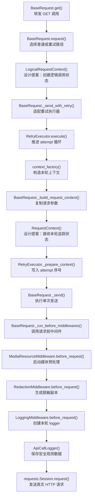

# 第 12 天：工程闭环与陌生需求设计——Trace / Attempt 状态边界

> 代码基准：当前 `dev2` 分支。历史提交只用于还原 CI 与执行器的演进；当前源码和测试是最终事实。仓库当前没有实现框架级 `trace_id` / `attempt_id`，本节后半部分是设计与测试规格，不是已落地能力。

## 1. 本节定位

前 11 天分别练习了配置信任边界、请求中间件、日志脱敏、重试、轮询、测试上下文、契约断言、Mock 故障模拟和资源约束调度。第 12 天不再增加一个需要记忆的现成类，而是检验能否独立处理仓库里尚不存在的需求：

> 一个逻辑 API 调用拥有固定 `trace_id`；发生重试时，每个 HTTP attempt 拥有不同 `attempt_id`；两个 ID 进入安全日志，但不要求服务端接收 `attempt_id`；并发逻辑调用之间不得串值。

这不是“在哪里调用 `uuid.uuid4()`”的问题。真正的推导链是：

```text
需求包含两种不同生命周期
  → 当前框架只有 attempt 级 RequestContext
  → 如果把两个 ID 放给同一个错误所有者，重试或并发时必然失真
  → 必须先补出逻辑调用级状态，再让每个 attempt 引用它
  → 最后用日志、并发测试和 CI 证据证明不变量
```

### 1.1 今日核心问题

> 面对当前仓库没有实现的需求，怎样从状态生命周期推导最小职责边界，并证明设计可实现、可兼容、可验证？

### 1.2 学习完成标准

完成本节后，应能够：

1. 区分框架单测、collect-only、真实 smoke、JUnit 与 Allure 各自能证明和不能证明的内容。
2. 从当前真实调用链指出 `RequestContext` 为什么是一次 attempt 的状态，而不是整个逻辑调用的状态。
3. 解释 `trace_id` 与 `attempt_id` 的创建者、存活期和终止点。
4. 识别 `request()` 之外的 `_request_without_attach()` 路径，避免只设计公开主路径。
5. 比较 Middleware、RetryExecutor 和两层上下文三种方案，而不是凭类名选择代码位置。
6. 给出保持 `get/post/request`、Middleware 协议、异常和 transport 参数兼容的最小接口改动。
7. 写出三个离线测试规格，证明单次请求、重试关联、并发隔离和日志安全。
8. 说明未来引入 async client 后，哪些线程模型假设会失效。

## 2. 120 分钟学习安排

| 时间 | 环节 | 产出 |
| ---: | --- | --- |
| 0～15 分钟 | 核对 CI 演进与五类证据 | 工程证据边界表 |
| 15～32 分钟 | 追踪当前请求、重试、日志链 | 真实调用链与缺口 |
| 32～48 分钟 | 建立逻辑调用 / attempt 两层模型 | 状态生命周期表 |
| 48～65 分钟 | 推导状态所有者与不变量 | 职责边界清单 |
| 65～82 分钟 | 比较三个放置方案 | 三方案决策表 |
| 82～100 分钟 | 阅读拟议最小接口和兼容分析 | 不超过 500 字设计说明 |
| 100～113 分钟 | 编写三个测试规格 | Arrange / Act / Assert |
| 113～120 分钟 | CI 接续检查与口述验收 | 结课答案 |

控制范围：今天不实现生产 trace 功能，不要求服务端支持分布式追踪协议，不引入 OpenTelemetry，不修改 HTTP header 协议，也不讨论 Flaky 治理。重点是状态边界和证据闭环。

## 3. 第一性原理：标识的正确性来自生命周期匹配

### 3.1 先定义两个事件

一次调用若经历 `503 → 200`，至少有两个不同事件：

```text
逻辑调用 L1
  ├─ HTTP attempt A1：返回 503
  └─ HTTP attempt A2：返回 200
```

业务上，A1 与 A2 是“同一次想完成的操作”；传输上，它们是“两次真实发送”。因此：

| 标识 | 回答的问题 | 在上述序列中的数量 |
| --- | --- | ---: |
| `trace_id` | 这些 attempt 是否属于同一个逻辑调用 | 1 |
| `attempt_id` | 这是该逻辑调用中的哪一次真实发送 | 2 |

最基本的不变量是：

```text
同一逻辑调用：trace_id 不变
不同 HTTP attempt：attempt_id 必须不同
不同并发逻辑调用：trace_id 和 attempt_id 集合互不相交
```

### 3.2 为什么 attempt 序号不能代替 attempt ID

当前 `RetryExecutor` 已经写入 `attempt_index=1, 2, ...`，但序号只在所属序列内唯一。两个并发调用都可能出现 `attempt_index=1`，无法单独关联日志。`attempt_id` 是跨并发调用可区分的身份；`attempt_index` 是同一调用内部的顺序。二者语义不同，不应互相替代。

### 3.3 为什么 HTTP header 也不能天然成为所有者

服务端协议只关心发送数据。需求明确“不要求服务端接收 `attempt_id`”，所以 transport header 不是必要状态容器。若为了日志关联而自动写 header：

```text
观测需求变化
  → transport 输入被改变
  → 签名、缓存、网关校验或服务端协议可能变化
  → 一个本地日志能力产生外部行为副作用
```

正确默认值是：ID 进入本地上下文和安全日志，不自动进入 `context.kwargs["headers"]`。未来若服务端明确支持 trace header，再由独立协议决策控制。

## 4. TOC：当前约束不是 ID 生成，而是缺少逻辑调用级所有者

### 4.1 不良结果与因果链

| 可能的不良结果 | 表面原因 | 深层原因 |
| --- | --- | --- |
| 每次 retry 的 trace 都不同 | ID 在每次 Middleware 进入时生成 | 生成者生命周期只有一次 attempt |
| 普通请求没有 trace | ID 只放进 RetryExecutor | 普通路径绕过 executor |
| 两个并发调用日志串值 | ID 存在 `BaseRequest` 实例字段或全局变量 | 多个调用共享可变容器 |
| attempt ID 被发给服务端 | 为复用 headers 而存入 transport kwargs | 观测状态和协议状态没有分层 |
| 轮询内重试没有稳定 trace | 只在公开 `request()` 创建逻辑状态 | `_request_without_attach()` 可直接进入重试路径 |

共同根因不是 UUID 算法，而是当前模型只有 attempt 级上下文，没有显式表达“一次逻辑调用”。

### 4.2 当前约束与解除方式

当前最窄约束：`trace_id` 找不到覆盖普通请求和整个 retry 序列、同时又不跨并发调用的状态所有者。

解除约束的最小结构：

```text
LogicalRequestContext：一次逻辑调用一个，只读持有 trace_id
RequestContext：每个 HTTP attempt 一个，持有独立 attempt_id，并引用前者
```

约束解除后，新约束转移到：

- 所有创建请求的入口是否都创建或接收逻辑上下文。
- ID 工厂是否可注入、可离线验证且并发安全。
- logger 是否只消费安全元数据，不污染 transport。
- async client 是否仍使用显式上下文传递。

## 5. 观察工程闭环的演进

### 5.1 演进前：仓库只承诺本地证据

演进前：`41cf8b5^`，根目录 `README.md`

```markdown
- 当前 CI 尚未接入。质量门禁、指标聚合和 Flaky 历史治理仍属于路线图后续阶段；
  当前验收以本地 `pytest`、`run_master.py --collect-only` 和框架单测为准。
```

这段文字在当时描述正确：只有开发机上的控制流证据，还没有流水线自动执行和报告发布。当前根 README 仍保留类似表述，但已经被后续 `Jenkinsfile` 事实覆盖，不能继续作为现状依据。

### 5.2 `41cf8b5`：本地检查进入流水线

演进后：`41cf8b5`，`Jenkinsfile`

```groovy
stage('Framework Unit Tests') {
    when { expression { return params.RUN_FRAMEWORK_TESTS } }
    steps {
        ciPowerShell('''
        $env:GENERATE_ALLURE_REPORT = 'FALSE'
        $env:GENERATE_HISTORY_REPORT = 'FALSE'
        ./.venv/Scripts/python.exe -m pytest tests -q --junitxml=reports/unit-tests.xml
        ''')
    }
    post {
        always {
            junit allowEmptyResults: false, testResults: 'reports/unit-tests.xml'
        }
    }
}

stage('Collect Smoke Cases') {
    when { expression { return params.RUN_COLLECT_ONLY } }
    steps {
        ciPowerShell('''
        ./.venv/Scripts/python.exe run_master.py module/smoke --collect-only -q
        ''')
    }
}
```

```groovy
stage('Real Smoke') {
    when { expression { return params.RUN_REAL_SMOKE } }
    steps {
        ciPowerShell('''
        $target = $env:SMOKE_TARGET
        ./.venv/Scripts/python.exe run_master.py $target --junitxml=reports/smoke-tests.xml
        ''')
    }
    post {
        always {
            junit allowEmptyResults: true, testResults: 'reports/smoke-tests.xml'
        }
    }
}

post {
    always {
        allure includeProperties: false, jdk: '', results: [[path: 'allure-results']]
        archiveArtifacts artifacts: 'allure-results/**, reports/**', allowEmptyArchive: true
    }
}
```

差异解释：框架单测、只收集、真实 smoke 被拆成不同阶段；真实 smoke 默认由参数关闭，避免每次 CI 都产生真实网络副作用；JUnit 提供机器可读结果，Allure 和 artifacts 保存诊断材料。CI 并没有让单测“更正确”，而是让同一证据可重复产生、可发布、可追溯。

### 5.3 `24a3d8c`：并发调度改变了报告接口

演进后：`24a3d8c`，`run_master.py`

```python
def _build_parallel_args(
    pytest_args: Sequence[str],
    *,
    numprocesses: str,
    dist: str | None,
    junit_suffix: str,
) -> list[str]:
    args = _replace_junitxml_suffix(list(pytest_args), junit_suffix)
    args.extend(["-n", numprocesses])
    if dist:
        args.extend(["--dist", dist])
    return args


def _build_serial_args(pytest_args: Sequence[str], *, junit_suffix: str) -> list[str]:
    return _replace_junitxml_suffix(_remove_xdist_args(list(pytest_args)), junit_suffix)
```

```python
def _with_report_suffix(report_path: str, suffix: str) -> str:
    path = Path(report_path)
    stem = path.stem
    if stem.endswith(f"-{suffix}"):
        return path.as_posix()
    return path.with_name(f"{stem}-{suffix}{path.suffix}").as_posix()
```

启用并发后，传入 `reports/smoke-tests.xml` 会产生：

```text
reports/smoke-tests-parallel.xml
reports/smoke-tests-serial.xml
```

当前 `Jenkinsfile` 的 Real Smoke 发布仍是：

```groovy
junit allowEmptyResults: true, testResults: 'reports/smoke-tests.xml'
```

这形成了真实的工程接续缺口：runner 正确拆分了两个阶段的 JUnit 文件，但 Jenkins 的 JUnit publisher 仍读取旧单文件名。当前邮件汇总函数已经读取单文件和两个后缀文件，artifact 也归档 `reports/**`，但 Jenkins 测试报告发布入口尚未完全对齐。第 12 天只识别这个证据接口问题，不修改 `Jenkinsfile`。

## 6. 五类工程证据不能互相替代

| 证据 | 能证明什么 | 不能证明什么 | 本节用途 |
| --- | --- | --- | --- |
| 框架单测 | 本地控制流、ID 生成/传递、日志脱敏、并发隔离 | 真实认证、网络和服务协议 | trace 设计的主要离线证据 |
| collect-only | 模块能导入、用例能收集、marker 和执行计划可形成 | 用例行为正确、请求能成功 | CI 前置结构检查 |
| 真实 smoke | 网络、认证、真实服务协议和最小业务链集成 | 稀有并发与故障分支被穷尽 | 可选的系统集成证据 |
| JUnit | 通过/失败/跳过、数量与趋势可被机器读取 | 请求细节、重试原因、敏感数据安全 | CI 门禁与汇总 |
| Allure | 请求/响应、重试记录、追踪元数据等诊断上下文 | 构建是否应被判定为失败 | 人工定位与审计 |

证据链的第一性原理是“每个结论必须由能观察该结论的证据支持”。例如：

- collect-only 成功不能证明 trace 在 retry 中保持不变。
- Allure 中出现两个 ID 不能单独证明 CI 门禁有效。
- 单测证明 ID 未进入 headers，不能证明真实网关接受请求。
- 真实 smoke 通过一次，不能证明两个线程永远不串值。

## 7. 当前源码事实：框架还没有追踪 ID

对 `common/`、`util/` 和 `tests/` 搜索 `trace_id`、`attempt_id`、`correlation`，当前没有框架级实现。测试里出现的 `X-Trace-Id` 只是脱敏测试使用的普通 header 样例，不是请求追踪状态模型。

因此后文必须严格区分：

| 标签 | 含义 |
| --- | --- |
| 当前源码 | 当前 `dev2` 真实存在，可以运行验证 |
| 设计提案 | 为陌生需求推导出的拟议接口，尚未写入生产代码 |
| 目标测试 | 实现后应新增的验收规格，当前不能宣称通过 |

## 8. 当前调用链暴露了什么状态边界

### 8.1 `RequestContext` 是可变的 attempt 状态

当前源码：`common/request_context.py`

```python
@dataclass
class RequestContext:
    method: str
    path: str
    url: str
    kwargs: dict[str, Any]
    attach_log: bool = True
    request_step_name: str = API_REQUEST_STEP_NAME
    response_step_name: str = API_RESPONSE_STEP_NAME
    attributes: dict[str, Any] = field(default_factory=dict)
```

`kwargs`、日志开关和 `attributes` 都描述某次真实发送。尤其 `attributes` 使用 `default_factory=dict`，每个 context 拥有独立字典，适合保存 attempt 内部的 logger、脱敏副本和重试序号。

### 8.2 普通请求只构造一个 Context

当前源码：`common/base_request.py`

```python
def request(self, method: str, path: str, **kwargs: Any) -> requests.Response:
    attach_log = kwargs.pop("_attach_log", True)
    retry_policy = kwargs.pop("retry_policy", None)
    if retry_policy is not None:
        return self._send_with_retry(method, path, retry_policy, attach_log=attach_log, **kwargs)

    context = self._build_request_context(method, path, attach_log=attach_log, **kwargs)
    return self._send(context)
```

没有 retry policy 时，`request()` 建一个 context 并发送。未来即使只有一次 attempt，也必须同时生成一个 trace 和一个 attempt ID，不能把 `attempt_id` 误解为“只有发生重试才需要”。

### 8.3 重试路径每轮重新构造 Context

当前源码：`common/base_request.py`

```python
def _send_with_retry(
    self,
    method: str,
    path: str,
    retry_policy: RetryPolicy,
    *,
    attach_log: bool = True,
    request_step_name: str = API_REQUEST_STEP_NAME,
    response_step_name: str = API_RESPONSE_STEP_NAME,
    context_recorder: list[RequestContext] | None = None,
    **kwargs: Any,
) -> requests.Response:
    first_context = self._build_request_context(
        method,
        path,
        attach_log=attach_log,
        request_step_name=request_step_name,
        response_step_name=response_step_name,
        **kwargs,
    )

    def context_factory(attempt_index: int) -> RequestContext:
        context = self._build_request_context(
            method,
            path,
            attach_log=attach_log,
            request_step_name=request_step_name,
            response_step_name=response_step_name,
            **kwargs,
        )
        context.attributes["attempt_index"] = attempt_index
        context.attributes["max_attempts"] = retry_policy.max_attempts
        return context

    return self.retry_executor.execute(
        method=first_context.method,
        request_kwargs=self._kwargs_with_session_headers(first_context.kwargs),
        policy=retry_policy,
        context_factory=context_factory,
        send_once=self._send,
        attach_records=self._attach_retry_records,
        context_recorder=context_recorder,
    )
```

`context_factory()` 每次调用 `_build_request_context()`，这已经保护了 attempt 之间 `kwargs`、`attributes` 和 logger 不共享。但 `first_context` 只用于标准化 method 和判断请求参数，并不是覆盖整个序列的逻辑上下文；当前仍缺少共享 trace 的对象。

### 8.4 RetryExecutor 拥有序号和循环，不拥有请求语义

当前源码：`common/retry_executor.py`

```python
for attempt_index in range(1, policy.max_attempts + 1):
    context = context_factory(attempt_index)
    self._prepare_context(context, policy, attempt_index, retry_records)
    self._record_context(context_recorder, context)

    try:
        response = send_once(context)
    except Exception as error:
        if attempt_index >= policy.max_attempts or not should_retry_exception(error, policy):
            attach_records(context, retry_records)
            raise
```

```python
@staticmethod
def _prepare_context(
    context: RequestContext,
    policy: RetryPolicy,
    attempt_index: int,
    retry_records: list[RetryAttemptRecord],
) -> None:
    context.attributes["attempt_index"] = attempt_index
    context.attributes["max_attempts"] = policy.max_attempts
    context.attributes["retry_records"] = retry_records
```

Executor 知道“这是第几轮”，所以它适合推进 `attempt_index`。但普通无重试请求绕过 executor，且 executor 不构造 logger、URL 和 transport 参数，所以它不适合独占 trace 生命周期。

### 8.5 LoggingMiddleware 只消费 attempt 上下文

当前源码：`common/request_middleware.py`

```python
class LoggingMiddleware:
    LOGGER_ATTR = "api_call_logger"

    def before_request(self, context: RequestContext) -> None:
        logger_kwargs = context.attributes.get(
            RedactionMiddleware.REDACTED_KWARGS_ATTR,
            context.kwargs,
        )
        context.attributes[self.LOGGER_ATTR] = ApiCallLogger(
            context.method,
            context.url,
            logger_kwargs,
            step_name=context.request_step_name,
            response_step_name=context.response_step_name,
        )
```

Middleware 每个 attempt 都会重新进入。它接近日志消费点，却进入得太晚，无法自然拥有整个 retry 序列的固定 trace。它应读取 ID，而不是决定 ID 生命周期。

## 9. 贯穿式数据流总图：当前锚点与设计提案

图中未标“设计提案”的节点均为当前真实函数、方法或构造器；两个标注为设计提案的构造器表示拟议新增状态，不代表当前已经实现。



普通无重试路径不需要经过 `RetryExecutor.execute()`，但仍必须执行 `LogicalRequestContext() → _build_request_context() → RequestContext() → _send()`。图选择重试主链，是因为它同时暴露两种生命周期；普通路径在图外用状态表说明，避免拆出第二张数据流图。

## 10. 按总图顺序讲解关键函数

### 10.1 `get()` 与 `request()`：公开调用保持不变

`get()` 只把 method 固定为 GET。`request()` 当前决定是否进入 retry。设计后调用方仍写：

```python
client.get("/v1/models")
client.get("/v1/models", retry_policy=policy)
client.post("/v1/chat/completions", json=payload)
```

不能要求业务用例手工创建 trace context，否则追踪正确性依赖每个调用点自觉执行，框架也无法保证遗漏率为零。

### 10.2 `LogicalRequestContext()`（设计提案）：只拥有逻辑调用状态

它只需包含不可变 `trace_id`。它不应持有 response、重试记录、logger 或 mutable headers，因为这些状态要么属于某次 attempt，要么属于 retry orchestration。

### 10.3 `_send_with_retry()`：接收同一个逻辑上下文

它是 `BaseRequest` 与 `RetryExecutor` 的适配层。所有 `context_factory()` 调用必须引用同一个 logical context；工厂每被调用一次，再生成一个 attempt ID。

### 10.4 `RetryExecutor.execute()`：推进 attempt，不生成 trace

Executor 继续拥有循环、退避、记录和时间预算。它提供 `attempt_index`，但不需要知道 ID 如何格式化、日志如何展示，也不需要依赖 `LogicalRequestContext` 的具体类型。

### 10.5 `_build_request_context()` 与 `RequestContext()`：建立每轮隔离

当前函数已经复制 kwargs 并构造新 `attributes`。拟议扩展让它显式接收 logical context 和调用方生成的 attempt ID。只有确定会进入 `_send()` 的 context 才传入 attempt ID；重试资格预检查使用的 `first_context` 不应冒充真实 attempt。这样 attempt 隔离沿用已有对象边界，而不是新建全局注册表。

### 10.6 `_send()` 与 Middleware：只观察本轮

`_send()` 的顺序仍是 before middlewares、transport、after/exception middlewares。Middleware 协议不增加返回值，不让日志层控制 retry。`RedactionMiddleware` 先生成安全副本，`LoggingMiddleware` 再把 ID 和脱敏后的请求数据交给 logger。

### 10.7 `ApiCallLogger()`：消费两个 ID，不拥有其生命周期

Logger 为每个 attempt 新建，因此天然对应一个 `attempt_id`；它同时读取引用的 `trace_id`，把多个 logger 关联为同一逻辑调用。Logger 不回写 ID，不自动修改请求 header。

## 11. 一页状态生命周期表

用表格代替第二张数据流图，完整展示 `503 → 200` 和并发调用：

| 时刻 | 逻辑调用 | 对象/事件 | `trace_id` | `attempt_id` | 状态动作 |
| ---: | --- | --- | --- | --- | --- |
| T0 | L1 | 创建 `LogicalRequestContext` | `T-1` | — | trace 创建一次后只读 |
| T1 | L1 | 创建 attempt 1 的 `RequestContext` | `T-1` | `A-1` | context、attributes、logger 独立 |
| T2 | L1 | attempt 1 返回 503 | `T-1` | `A-1` | 安全日志记录本轮失败/响应 |
| T3 | L1 | 创建 attempt 2 的 `RequestContext` | `T-1` | `A-2` | 新 ID，不复用 A-1 的可变状态 |
| T4 | L1 | attempt 2 返回 200 | `T-1` | `A-2` | 安全日志可与 A-1 关联 |
| T5 | L1 | `request()` 返回 | `T-1` 结束 | `A-2` 结束 | 不写入共享缓存 |
| T1' | 并发 L2 | 创建另一个 logical context | `T-2` | — | 与 L1 无共享 mutable 字段 |
| T2' | 并发 L2 | 创建自己的 attempt 1 | `T-2` | `A-3` | ID 集合与 L1 不相交 |

### 11.1 状态所有者矩阵

| 状态 | 谁创建 | 谁修改 | 谁终结 | 生命周期 |
| --- | --- | --- | --- | --- |
| `trace_id` | logical context 工厂 | 无，创建后只读 | 逻辑调用返回/抛错 | 一次普通请求或完整 retry 序列 |
| `attempt_id` | request context 工厂 | 无，创建后只读 | 单次 `_send()` 返回/抛错 | 一次 HTTP attempt |
| `attempt_index` | `RetryExecutor` | 每轮推进 | retry 序列结束 | 一次 retry 序列 |
| 脱敏 kwargs | `RedactionMiddleware` | 本轮写一次 | context 释放 | 一次 HTTP attempt |
| `ApiCallLogger` | `LoggingMiddleware` | attach 时产生附件 | context 释放 | 一次 HTTP attempt |
| retry records | `RetryExecutor` | 每次失败/可重试响应追加 | 序列结束 | 一次 retry 序列 |

注意：本课程把“每次 polling GET（连同它自己的 transport retry）”视为一个逻辑 API 调用；整个业务轮询序列已有 `PollingTransition` 表达，不自动与一个 trace 合并。若未来要增加 `polling_trace_id`，那是更长生命周期的第三层状态，不能偷偷复用本节 trace 语义。

## 12. 找到变化轴

| 变化内容 | 为什么变化 | 合理所有者 | 不应放入 |
| --- | --- | --- | --- |
| trace 格式/生成算法 | 本地关联策略变化 | logical context factory | RetryPolicy |
| attempt ID 格式 | 单次发送身份策略变化 | request context factory | Middleware 全局字段 |
| attempt 序号 | retry 轮次变化 | RetryExecutor | logger |
| 日志显示格式 | 报告需求变化 | ApiCallLogger | transport kwargs |
| 服务端 trace header | 外部协议变化 | 显式 transport/header 策略 | 本地 attempt ID 默认逻辑 |
| 并发隔离 | 调用调度变化 | 显式对象引用 | 模块全局变量 |
| async 上下文传播 | 执行模型变化 | 显式传参或 `contextvars` | `threading.local` 假设 |

同一需求里出现多个变化轴，并不意味着必须一次引入完整分布式追踪系统。当前只实现本地可观察性所需的最小状态。

## 13. 从不变量推导职责边界

设计前先写不变量：

1. 每个逻辑调用恰好一个 `trace_id`。
2. 每个真实 `_send()` 恰好一个新的 `attempt_id`。
3. retry attempt 共享 trace，但不共享 RequestContext、logger 和 attempt ID。
4. 并发逻辑调用不使用同一个 mutable ID 容器。
5. `attempt_id` 默认不进入 headers、query、body 或其他 transport kwargs。
6. 日志出现 ID 的同时，Authorization、token、api_key 等仍按原规则脱敏。
7. `get/post/request` 调用方式、Middleware 三方法协议、返回 Response 和原异常类型不变。
8. 未传 retry policy 时仍只发送一次。
9. `_request_without_attach()` 进入重试时也必须获得一个稳定 trace。

从这些不变量反推：

- trace 必须在 attempt context 之前创建。
- attempt ID 必须随每次 `_build_request_context()` 创建，而不是随 retry policy 创建。
- Middleware 只能观察 ID；否则普通/重试生命周期会由观测层决定。
- Executor 继续只负责控制流；否则普通路径和日志协议会被迫依赖它。
- 依赖显式参数传递；否则并发隔离无法由局部代码证明。

## 14. 推荐方案的最小接口草图（设计提案，未实现）

以下代码用于说明职责和接口，不是当前仓库源码，也不是要求本节直接提交的生产实现。

### 14.1 两层上下文

设计提案：`common/request_context.py`

```python
from dataclasses import dataclass, field
from typing import Any


@dataclass(frozen=True)
class LogicalRequestContext:
    trace_id: str


@dataclass
class RequestContext:
    method: str
    path: str
    url: str
    kwargs: dict[str, Any]
    attach_log: bool = True
    request_step_name: str = API_REQUEST_STEP_NAME
    response_step_name: str = API_RESPONSE_STEP_NAME
    attributes: dict[str, Any] = field(default_factory=dict)
    logical_context: LogicalRequestContext | None = None
    attempt_id: str | None = None

    @property
    def trace_id(self) -> str | None:
        if self.logical_context is None:
            return None
        return self.logical_context.trace_id
```

`logical_context` 和 `attempt_id` 暂设默认 `None`，是为了保持现有测试与自定义 Middleware 直接构造 `RequestContext(...)` 的兼容性；由 `BaseRequest` 构造的生产 context 应保证两者都有值。若未来确认 `RequestContext` 没有外部构造者，可以再收紧为必填字段。

### 14.2 可注入 ID 工厂

设计提案：`common/base_request.py`

```python
from collections.abc import Callable
from uuid import uuid4


def _new_id() -> str:
    return uuid4().hex


class BaseRequest:
    def __init__(
        self,
        config: Settings = settings,
        middlewares: list[RequestMiddleware] | None = None,
        retry_executor: RetryExecutor | None = None,
        trace_id_factory: Callable[[], str] = _new_id,
        attempt_id_factory: Callable[[], str] = _new_id,
    ):
        self.config = config
        self.session = requests.Session()
        self.default_headers = self._build_default_headers()
        self.session.headers.update(self.default_headers)
        self.middlewares = list(
            self._default_middlewares() if middlewares is None else middlewares
        )
        self.retry_executor = retry_executor or RetryExecutor(
            sleeper=time.sleep,
            monotonic=time.monotonic,
        )
        self.trace_id_factory = trace_id_factory
        self.attempt_id_factory = attempt_id_factory
```

注入工厂使测试可以给出确定 ID，不必全局 monkeypatch `uuid.uuid4`。工厂引用可以共享，但工厂自身若有可变计数器，必须由测试或实现保证并发安全。

### 14.3 创建 logical context，再创建 attempt context

设计提案：`common/base_request.py`

```python
def _new_logical_request_context(self) -> LogicalRequestContext:
    return LogicalRequestContext(trace_id=self.trace_id_factory())


def request(self, method: str, path: str, **kwargs: Any) -> requests.Response:
    attach_log = kwargs.pop("_attach_log", True)
    retry_policy = kwargs.pop("retry_policy", None)
    logical_context = self._new_logical_request_context()

    if retry_policy is not None:
        return self._send_with_retry(
            method,
            path,
            retry_policy,
            logical_context=logical_context,
            attach_log=attach_log,
            **kwargs,
        )

    context = self._build_request_context(
        method,
        path,
        logical_context=logical_context,
        attempt_id=self.attempt_id_factory(),
        attach_log=attach_log,
        **kwargs,
    )
    return self._send(context)
```

```python
def _build_request_context(
    self,
    method: str,
    path: str,
    *,
    logical_context: LogicalRequestContext,
    attempt_id: str | None = None,
    attach_log: bool = True,
    request_step_name: str = API_REQUEST_STEP_NAME,
    response_step_name: str = API_RESPONSE_STEP_NAME,
    **kwargs: Any,
) -> RequestContext:
    url = self._build_url(path)
    request_kwargs = self._copy_request_kwargs(kwargs)
    request_kwargs.setdefault("timeout", self.config.timeout)

    headers = request_kwargs.pop("headers", None)
    if headers:
        request_kwargs["headers"] = self._merge_headers(headers)

    return RequestContext(
        method=method.upper(),
        path=path,
        url=url,
        kwargs=request_kwargs,
        attach_log=attach_log,
        request_step_name=request_step_name,
        response_step_name=response_step_name,
        logical_context=logical_context,
        attempt_id=attempt_id,
    )
```

这里没有把两个 ID 放入 `request_kwargs`，因此 `Session.request()` 不会自动收到它们。`attempt_id=None` 只用于不发送的内部预检查 context 或迁移期兼容；任何进入 `_send()` 的生产 context 都应先具有非空 attempt ID。

### 14.4 retry 的所有 context 引用同一个 logical context

设计提案：`common/base_request.py` 中 `_send_with_retry()` 的关键变化

```python
def _send_with_retry(
    self,
    method: str,
    path: str,
    retry_policy: RetryPolicy,
    *,
    logical_context: LogicalRequestContext,
    attach_log: bool = True,
    request_step_name: str = API_REQUEST_STEP_NAME,
    response_step_name: str = API_RESPONSE_STEP_NAME,
    context_recorder: list[RequestContext] | None = None,
    **kwargs: Any,
) -> requests.Response:
    first_context = self._build_request_context(
        method,
        path,
        logical_context=logical_context,
        attempt_id=None,
        attach_log=attach_log,
        request_step_name=request_step_name,
        response_step_name=response_step_name,
        **kwargs,
    )

    def context_factory(attempt_index: int) -> RequestContext:
        context = self._build_request_context(
            method,
            path,
            logical_context=logical_context,
            attempt_id=self.attempt_id_factory(),
            attach_log=attach_log,
            request_step_name=request_step_name,
            response_step_name=response_step_name,
            **kwargs,
        )
        context.attributes["attempt_index"] = attempt_index
        context.attributes["max_attempts"] = retry_policy.max_attempts
        return context

    return self.retry_executor.execute(
        method=first_context.method,
        request_kwargs=self._kwargs_with_session_headers(first_context.kwargs),
        policy=retry_policy,
        context_factory=context_factory,
        send_once=self._send,
        attach_records=self._attach_retry_records,
        context_recorder=context_recorder,
    )
```

`first_context` 只为 method、headers 和 retry eligibility 提供预处理结果，所以明确使用 `attempt_id=None`；真正进入 `_send()` 的 context 才从工厂领取身份。更彻底的后续重构可以把预处理结果命名为 request blueprint，但本次不必为了命名纯度扩大生产改动。

### 14.5 不得遗漏 `_request_without_attach()`

当前轮询每轮调用 `_request_without_attach()`；该函数在 retry 分支直接调用 `_send_with_retry()`，不经过公开 `request()`。设计提案必须在这里创建 logical context，并传入两条分支：

```python
def _request_without_attach(
    self,
    method: str,
    path: str,
    *,
    step_name: str = API_REQUEST_STEP_NAME,
    response_step_name: str | None = None,
    retry_policy: RetryPolicy | None = None,
    **kwargs: Any,
) -> tuple[requests.Response, ApiCallLogger]:
    logical_context = self._new_logical_request_context()

    if retry_policy is None:
        context = self._build_request_context(
            method,
            path,
            logical_context=logical_context,
            attempt_id=self.attempt_id_factory(),
            attach_log=False,
            request_step_name=step_name,
            response_step_name=response_step_name or API_RESPONSE_STEP_NAME,
            **kwargs,
        )
        response = self._send(context)
        response_context = context
    else:
        context_recorder: list[RequestContext] = []
        response = self._send_with_retry(
            method,
            path,
            retry_policy,
            logical_context=logical_context,
            attach_log=False,
            request_step_name=step_name,
            response_step_name=response_step_name or API_RESPONSE_STEP_NAME,
            context_recorder=context_recorder,
            **kwargs,
        )
        response_context = context_recorder[-1] if context_recorder else context

    logger = self._get_optional_api_call_logger(response_context)
    return response, logger
```

上面只展示成功主干以突出 logical context 传递；正式修改必须保留当前 `try/except` 中原异常回抛和失败日志逻辑。关键结论是：logical context 的创建入口必须覆盖公开请求和轮询内部请求。

### 14.6 Logger 只接收安全追踪元数据

设计提案：`LoggingMiddleware.before_request()`

```python
def before_request(self, context: RequestContext) -> None:
    logger_kwargs = context.attributes.get(
        RedactionMiddleware.REDACTED_KWARGS_ATTR,
        context.kwargs,
    )
    context.attributes[self.LOGGER_ATTR] = ApiCallLogger(
        context.method,
        context.url,
        logger_kwargs,
        step_name=context.request_step_name,
        response_step_name=context.response_step_name,
        trace_id=context.trace_id,
        attempt_id=context.attempt_id,
    )
```

`ApiCallLogger` 应把两个值放入专门的“请求追踪”附件或现有安全元数据区域，并复用文本截断/转义出口。不要把它们拼回 URL、body 或 headers；更不要因为 ID 本身需要显示而绕过请求、响应和异常的原脱敏流程。

## 15. 不超过 500 字的设计说明

一次逻辑调用与一次 HTTP attempt 是两个事件，因此不能由同一可变状态隐式表示。新增只读 `LogicalRequestContext`，在逻辑调用入口创建唯一 `trace_id`；每次 `_build_request_context()` 新建 `RequestContext`，引用同一 logical context，并生成独立 `attempt_id`。普通请求只产生一个 attempt；重试序列的多个 context 共享 trace、不共享 attempt ID、attributes 和 logger。`RetryExecutor` 继续只推进序号、预算与记录，Middleware 继续只观察 context，logger 只消费两个 ID 并沿用安全输出。ID 通过对象显式传递，不存模块全局、实例可变字段或普通 thread-local，也不默认写入 HTTP header。公开请求调用、Middleware 协议、Response、原异常和 retry 语义保持不变；ID 工厂可注入，以便离线、确定性和并发测试。

## 16. 三方案决策表

| 方案 | 状态放在哪里 | 收益 | 代价 / 首个失败方式 | 适用条件 |
| --- | --- | --- | --- | --- |
| 全部放 Middleware | `before_request()` 生成 trace/attempt | 接近日志；改动点看似少 | 每个 retry 都重新进入，trace 容易随 attempt 改变；生成时机太晚；观测层拥有业务生命周期 | 每次发送完全独立、不需要跨 attempt 关联 |
| 全部放 RetryExecutor | executor 创建 trace 并为循环生成 attempt | executor 清楚 attempt 序号 | 普通请求绕过 executor；被迫知道日志/请求语义；轮询与非重试路径不一致 | 所有请求无条件经过统一 executor，且协议允许其拥有全部调用状态 |
| logical context + attempt context 分层（推荐） | trace 在逻辑上下文；attempt ID 在每次 RequestContext | 生命周期匹配；普通/重试一致；显式传递支持并发；logger 和 executor 保持窄职责 | 需要扩展 `_build_request_context()`、`_send_with_retry()` 和内部轮询入口；必须处理预构造 first context | 当前框架与需求约束 |

### 16.1 TOC 清晰思考校验

- 目标：在不改变外部请求语义的前提下关联日志。
- 必要条件：同一 retry 序列共享 trace；每次发送独立 attempt；并发不串值。
- 当前冲突：Middleware 看到发送但看不到完整序列；Executor 看到序列但不覆盖普通请求。
- 注入：引入覆盖逻辑调用生命周期的只读对象，让 attempt context 显式引用。
- 负面分支：接口改动是否破坏直接构造 RequestContext、轮询旁路和 logger 测试。

推荐方案不是因为“多一个类更规范”，而是唯一同时满足两个生命周期、普通/重试统一和并发隔离的最小方案。

## 17. 兼容性清单

| 现有契约 | 必须保持的行为 | 设计控制点 |
| --- | --- | --- |
| `get/post/request` | 调用参数和返回类型不变 | 内部自动创建 logical context |
| 无 retry policy | 仍只调用 transport 一次 | 只增加一个 logical 和一个 attempt 身份 |
| Middleware 协议 | 仍是 `before_request/after_response/on_exception` | ID 作为 context 数据，不增加决策返回值 |
| RetryExecutor 回调 | 仍接收 context factory、send once、attach records | trace 在闭包引用，不让 executor 依赖日志类型 |
| transport kwargs | 不自动出现 `attempt_id` | ID 字段不进入 `context.kwargs` |
| 日志脱敏 | header/query/body/error 继续统一脱敏 | Redaction 仍先于 Logging |
| 异常语义 | 原异常类型和对象继续回抛 | 不包装 transport 异常 |
| retry 记录 | 原 `attempt_index`、原因、等待保留 | ID 是补充关联信息，不替代 records |
| Response | 最终返回原 `requests.Response` | 不引入包装 Response |
| 直接构造 Context 的测试 | 迁移期不强制新增必填参数 | 新字段先提供兼容默认值 |

## 18. 日志安全与传输隔离

### 18.1 “ID 可见”不等于“所有原数据可见”

目标日志同时满足：

```text
trace_id 可见
attempt_id 可见
Authorization / token / api_key 不可见
调用方原始 kwargs 不被修改
Session.request 收到的业务数据与改造前一致
```

测试不能只断言附件包含 `trace-1`。还要在同一附件集合中搜索原 secret 不存在，并捕获 `Session.request()` 的 kwargs，确认没有自动新增 `attempt_id`、`trace_id` 或追踪 header。

### 18.2 为什么不使用实例字段

错误示例：

```python
self.current_trace_id = self.trace_id_factory()
```

同一个 `BaseRequest` 被两个线程使用时，后写入的调用会覆盖前一个调用：

```text
线程 A 写 T-A
  → 切换到线程 B 写 T-B
  → 线程 A 的 Middleware 读取 self.current_trace_id
  → A 的日志错误得到 T-B
```

显式对象引用没有“再去共享位置读取当前值”这一步，因此隔离可以由局部数据流证明。

### 18.3 为什么普通 thread-local 也不是首选

thread-local 可以隔离线程，但会引入隐式依赖、清理义务和线程池复用风险；未来 async task 还可能共享同一线程。当前函数调用链已经显式传递 `RequestContext`，继续显式传递 logical context 更简单、可测试，也不需要调用结束时清理隐藏状态。

## 19. 三个目标测试规格（当前尚未实现）

以下测试名称和断言是生产实现后的验收标准。当前源码没有追踪字段，因此不能运行后宣称通过。

### 19.1 无重试：一个 trace、一个 attempt

测试名：`test_single_attempt_has_one_trace_and_one_attempt_id`

**Arrange**

- 注入返回 `trace-1` 的 `trace_id_factory` 和返回 `attempt-1` 的 `attempt_id_factory`。
- 用捕获型 Middleware 记录 `RequestContext`。
- 替换 `session.request`，记录真实 transport kwargs 并返回 200。
- 捕获 Allure 附件；请求含 Authorization 和嵌套 token。

**Act**

```python
response = client.get("/v1/models")
```

**Assert**

- transport 只调用一次，Response 原样返回。
- 只创建一个发送用 context；其 trace 为 `trace-1`、attempt 为 `attempt-1`。
- 安全日志同时包含两个 ID。
- 附件不含 Authorization/token 原值。
- transport kwargs 不含 `trace_id`、`attempt_id`，也没有框架自动增加的追踪 header。

### 19.2 两次 attempt：共享 trace、身份隔离

测试名：`test_retry_attempts_share_trace_but_have_distinct_attempt_ids`

**Arrange**

- 注入固定 trace `trace-1`，attempt 工厂依次返回 `attempt-1`、`attempt-2`。
- transport 返回 `503 → 200`。
- RetryPolicy 设置 `max_attempts=2`、关闭 jitter，并使用假 sleeper。
- 捕获每轮 context、logger 和日志附件。

**Act**

```python
response = client.get("/v1/models", retry_policy=policy)
```

**Assert**

- 有两个真实发送 context，且 `contexts[0] is not contexts[1]`。
- 两个 context 的 `trace_id` 都是 `trace-1`。
- attempt ID 分别为 `attempt-1`、`attempt-2`，不相等。
- `attempt_index` 分别为 1、2；它没有被 attempt ID 替代。
- 两个 logger 各绑定本轮 attempt，但可用同一 trace 关联。
- 最终返回 200，重试记录和 sleep 行为保持原语义。
- 预检查 `first_context.attempt_id is None`，ID 工厂只为两个真实发送调用两次，不产生幽灵 attempt。

### 19.3 两个并发逻辑调用：集合不相交

测试名：`test_concurrent_logical_requests_do_not_share_trace_or_attempt_ids`

**Arrange**

- 使用线程安全的确定性 ID 工厂；用 `Lock` 保护计数器。
- 用 `Barrier(2)` 让两个线程在 transport 中重叠，避免测试只是顺序执行。
- 两个调用都执行 `503 → 200`，分别捕获 context 与日志。
- 捕获记录时使用锁，避免测试观察器自身产生竞态。

**Act**

```python
with ThreadPoolExecutor(max_workers=2) as executor:
    results = list(executor.map(call_once, range(2)))
```

**Assert**

- 得到两个逻辑调用组，每组两个 attempt。
- 每组内部只有一个 trace，两个 attempt ID 不同。
- 两组 trace 集合不相交；两组 attempt ID 集合也不相交。
- 每条日志中的 trace/attempt 配对都来自同一个 context，没有交叉配对。
- 两个调用都返回自己的最终 Response；没有共享 `attributes` 或 logger。

## 20. 测试设计中容易出现的假证明

| 假证明 | 为什么不足 | 应增加什么 |
| --- | --- | --- |
| 连续调用两次，ID 不同 | 没有真正并发，实例字段仍可能通过 | Barrier 强制重叠 |
| 断言 attempt_index 为 1、2 | 序号不能证明全局 attempt 身份 | 断言独立 attempt ID |
| Logger 对象不同 | 两个 logger 仍可能读取同一个共享 trace | 断言每条日志的 ID 配对 |
| headers 没有 attempt ID | ID 可能进入 query/body | 捕获完整 transport kwargs |
| 日志包含 trace | 可能同时泄露 secret | 在同一次测试断言 secret 不存在 |
| monkeypatch 全局 uuid | 并发调用顺序不稳定、影响范围过大 | 构造器注入线程安全工厂 |

## 21. async client 下最可能失效的假设

当前推荐设计依赖的正确假设不是“一个线程只有一个调用”，而是“上下文沿函数参数显式传递”。这个假设在 async 中仍可成立。

最可能失效的是任何隐含的线程隔离方案：多个 coroutine task 可以在同一线程交替执行，`threading.local()` 看到的是同一个线程值；如果把 `current_trace_id` 存在 client 实例字段，问题更严重。未来 async 版本应优先继续显式传递 context；只有当第三方回调无法传参时，才评估 `contextvars.ContextVar`，并测试 `create_task()` 的复制、任务取消后的清理和线程池桥接行为。

另一个风险是同步 `requests.Session` 的共享假设不能直接迁移到 async client。连接池、hook 和 response 生命周期要按具体库重新验证，但 trace / attempt 两层状态模型不需要因此改变。

## 22. 工程闭环：设计怎样进入 CI

陌生需求从设计到可信能力需要四步：

```text
设计不变量
  → 离线目标测试
  → 框架单测进入 Jenkins 并产出 JUnit
  → Allure 保存安全追踪附件供失败定位
```

各层门禁建议：

| 层 | 最小验收 | 失败含义 |
| --- | --- | --- |
| 静态接口 | 原公开调用测试不改或只增内部注入参数 | 兼容边界破坏 |
| 单次请求测试 | 一对 ID、transport 不污染、secret 不泄露 | 状态创建或安全出口错误 |
| retry 测试 | 同 trace、不同 attempt、原行为不变 | 生命周期或 executor 适配错误 |
| 并发测试 | 两组集合不相交、日志配对正确 | 使用了共享 mutable 状态 |
| Jenkins JUnit | 新测试被执行且结果可发布 | 自动证据链断裂 |
| Allure | 失败时能按两个 ID 定位 | 人工诊断证据不足 |

注意：修复 trace 功能与修复 smoke JUnit publisher 路径是两个不同变化轴。课程识别二者的工程关系，但正式开发应拆成独立变更，避免一个追踪需求夹带 CI 报告修复。

## 23. 当前基线验证

本节只新增课程文档，没有实现 trace 生产代码。可运行与当前请求、重试、日志和调度边界直接相关的离线测试：

```powershell
.\.venv\Scripts\python.exe -m pytest `
  tests\test_retry_executor.py `
  tests\test_request_middleware.py `
  tests\test_base_request_middleware.py `
  tests\test_api_call_logger.py `
  tests\test_master_service_parallel_serial.py -q
```

安全观察执行计划：

```powershell
.\.venv\Scripts\python.exe run_master.py module\smoke --collect-only -q
```

这些命令证明课程引用的当前基线，没有证明三个目标 trace 测试已经通过。实现生产功能后，必须把第 19 节的测试真正加入 `tests/`，才能建立新能力证据。

## 24. 失败分析：从生命周期层次定位

| 现象 | 首查层次 | 典型根因 |
| --- | --- | --- |
| retry 两轮 trace 不同 | logical context 创建点 | 在 context factory 或 Middleware 每轮生成 |
| 两轮 attempt ID 相同 | request context 工厂 | ID 存在 logical context 或复用 Context |
| 普通请求没有 ID | 普通 request 分支 | 只改了 RetryExecutor |
| polling retry 没有稳定 trace | `_request_without_attach()` | 只在公开 `request()` 创建 logical context |
| 日志正确但服务端请求变化 | transport kwargs | 把观测 ID 自动写入 header/query/body |
| 并发日志交叉配对 | 共享状态 | client 实例字段、全局变量或不安全工厂 |
| secret 与 ID 一起出现在附件 | logger 安全出口 | 新附件绕过脱敏/格式化工具 |
| 单测通过但 Jenkins 无结果 | CI publisher | JUnit 路径或收集模式未对齐 |
| Jenkins 有 JUnit 但无法定位请求 | Allure 诊断层 | ID 未进入安全附件或报告被覆盖 |

## 25. 常见错误及因果后果

### 25.1 先写 UUID，再找所有者

会在多个入口复制生成逻辑，最终普通、retry 和 polling 各有不同语义。正确顺序是先定义事件和生命周期，再决定生成位置。

### 25.2 把 trace 和 attempt 都塞进 `attributes`

技术上可以运行，但字段没有类型和必备约束，拼写错误只会运行时暴露；更关键的是 trace 的所有权仍不清楚。`attributes` 适合 Middleware 扩展数据，不适合承载框架保证的核心身份。

### 25.3 复用同一个 RequestContext，只更新 attempt ID

这会同时复用 logger、脱敏副本、middleware error 和其他 attributes。当前代码每轮新建 Context 已经建立正确隔离，不应为了共享 trace 破坏它。

### 25.4 用 RetryExecutor 生成所有 ID

普通请求没有 executor；为了统一只能强迫所有请求进入 retry 控制流，扩大改动并混淆职责。应共享 logical context，而不是共享 executor。

### 25.5 在 Middleware 首次进入时“如果没有 trace 就生成”

每个 attempt 是新 Context，第二轮看不到第一轮 Context 的 attributes；若退回共享 client 字段保存，又引入并发串值。

### 25.6 把 `X-Trace-Id` 普通 header 样例当成已实现能力

当前测试只证明该 header 值不会被不必要地脱敏。它没有定义生成、生命周期、retry 关联和并发隔离，不能作为功能已存在的证据。

### 25.7 给未发送的 first context 分配身份

当前 `_send_with_retry()` 先建 `first_context`，随后真实 attempt 才由 factory 新建。若 `_build_request_context()` 无条件生成 ID，就会出现有身份却未发送的 context，污染调用次数、指标和测试语义。提案让预检查 context 的 attempt ID 为空，只有工厂创建的发送 context 领取身份。

## 26. 课堂练习

### 26.1 练习 A：判断生命周期

判断下列状态属于 attempt、logical call、polling sequence 还是 test case：

| 状态 | 建议答案 | 理由 |
| --- | --- | --- |
| prepared request | attempt | 每次真实发送可不同 |
| `trace_id` | logical call | 关联一个 retry 序列 |
| `attempt_index` | retry sequence 内 attempt | 由执行循环推进 |
| polling transitions | polling sequence | 跨多次逻辑 GET |
| 提取的 task_id | test case / 业务链 | 被后续多个调用消费 |

### 26.2 练习 B：审查一个错误方案

假设有人在 `LoggingMiddleware` 中使用 `threading.local().trace_id`，没有值时生成，`after_response` 时删除。说明以下分支如何失败：

- attempt 1 结束时删除后，attempt 2 得到新 trace。
- 异常中间件自身抛错时，清理是否仍执行。
- 线程池复用且清理遗漏时，下一个调用是否继承旧值。
- async task 是否能被线程本地变量隔离。

### 26.3 练习 C：评估服务端 trace header

若服务端后来要求 `X-Trace-Id`，不要直接改变本节 `attempt_id` 规则。先回答：

1. header 使用 logical trace 还是 attempt 身份？
2. 调用方已有同名 header 时谁优先？
3. 签名算法是否包含该 header？
4. 日志是否显示 header，是否需要特殊脱敏？
5. 服务端返回的 trace 与客户端 trace 不同时如何记录？

只有协议答案明确后，才能增加显式 header 注入策略。

## 27. 按每日学习记录模板生成的完整记录

### 27.1 基本信息

- 对应课程日：第 12 天。
- 建议投入时间：120 分钟。
- 今日主题：从工程证据闭环推导 trace / attempt 两层状态设计。
- 代码基准：当前 `dev2`；CI 演进节点为 `41cf8b5 → 24a3d8c`。

### 27.2 观察旧实现

- CI 演进前：根 README 只承诺本地 pytest、collect-only 和框架单测。
- CI 演进后：Jenkinsfile 执行框架单测、collect-only、可选真实 smoke，并发布 JUnit、Allure 和 artifacts。
- 当前请求实现：普通路径一个 RequestContext；retry 每轮新建 RequestContext；Middleware 每轮进入；logger 每轮新建。
- 当前缺口：没有逻辑调用级 context，也没有 `trace_id` / `attempt_id`。
- 工程接续缺口：并发 runner 生成带后缀 JUnit，Real Smoke publisher 仍读取旧单文件名。

### 27.3 找到变化轴

| 变化轴 | 变化原因 | 独立性 |
| --- | --- | --- |
| trace 生命周期 | 逻辑调用关联需求 | 独立于 retry 次数 |
| attempt 身份 | 真实发送次数变化 | 独立于日志格式 |
| retry 序号/预算 | 瞬态故障策略变化 | 独立于 ID 格式 |
| 安全日志 | 诊断与脱敏需求变化 | 不应改变 transport |
| header 协议 | 服务端契约变化 | 不由本地日志需求决定 |
| CI 报告路径 | 调度阶段变化 | 不应夹带进 trace 生产改造 |

### 27.4 识别状态所有者

- `LogicalRequestContext` 创建并只读拥有 trace，存活一次普通请求或完整 retry 序列。
- `RequestContext` 拥有 attempt ID、kwargs、attributes 和本轮 logger，存活一次 `_send()`。
- `RetryExecutor` 拥有 attempt_index、重试记录、等待和预算。
- `LoggingMiddleware` 读取状态并创建 logger，不生成调用身份。
- CI 拥有测试结果发布，不拥有请求运行时状态。

### 27.5 推导职责边界

- 必须保持：同序列同 trace、每次发送不同 attempt、并发集合不相交、transport 不污染、日志不泄密、公开调用不变。
- 推荐边界：两层上下文通过显式引用连接；ID 工厂注入 BaseRequest；Middleware 和 Executor 保持现有职责。
- 旁路检查：`_request_without_attach()` 必须创建并传递 logical context。
- 当前未覆盖：跨进程分布式 trace、服务端 header、整个 polling sequence 的更长 trace。

### 27.6 比较其他方案

Middleware 方案在 retry 时 trace 生命周期过短；Executor 方案不覆盖普通请求；两层上下文方案用最小显式对象匹配两个生命周期，代价是内部构造接口需要扩展并处理 first context。

### 27.7 代码执行链

完整链见第 9 节唯一一张贯穿式数据流总图。图同时标注当前真实锚点与设计提案，没有把拟议构造器冒充为现状。

### 27.8 最小实验

- 当前可运行：重试执行器、请求中间件、BaseRequest 中间件兼容、ApiCallLogger、并发/串行调度测试。
- 设计验收：单次请求、两次 attempt、两个并发调用三个目标测试。
- 网络：框架单测不访问真实 API；collect-only 不执行真实业务请求。
- 当前结论：基线可验证；追踪目标测试尚未实现，不能报告通过。

### 27.9 失败分析

优先按生命周期定位：trace 错先看 logical context 创建点；attempt 错看 request context factory；并发串值看共享字段；日志泄露看安全出口；CI 看 JUnit 生产者与消费者文件契约。

### 27.10 今日口述答案

- 为什么不是加两个字段：两个字段生命周期不同，必须先补状态所有者。
- 为什么不放 Middleware：Middleware 每个 attempt 都重新进入，无法天然持有完整 retry trace。
- 为什么不放 Executor：普通请求绕过它，且它不应拥有日志和 transport 语义。
- 如何证明并发隔离：Barrier 强制重叠，断言两组 trace/attempt 集合不相交和日志配对正确。
- 如何证明日志安全：同一测试同时断言 ID 可见、secret 不可见、transport kwargs 无新增追踪字段。

### 27.11 未解决问题

- `first_context` 是否应重构为无 attempt 身份的 request blueprint。
- 是否允许调用方提供自定义 trace；若允许，需要校验、优先级和信任边界。
- polling sequence 是否需要第三层 trace。
- async client 是否需要 `contextvars` 兼容第三方回调。
- Jenkins Real Smoke publisher 如何匹配并发/串行两个 JUnit 文件。

### 27.12 今日结论

一次逻辑调用和一次 HTTP attempt 是两种事件。新增逻辑调用级只读 context，让每轮 RequestContext 显式引用它，才能同时保护重试关联、attempt 隔离、并发安全和 transport 不变；CI 再把这些离线证据持续发布。

## 28. 最终验收答案

### 28.1 为什么所选方案符合生命周期

trace 在逻辑调用开始时创建，普通请求返回或完整 retry 序列结束时终结；attempt ID 随每个实际发送 context 创建，单次 `_send()` 结束时终结。对象存活期与业务事件一一对应，不需要从共享位置推断“当前是谁”。

### 28.2 为什么另外两种方案较差

Middleware 只覆盖一次 attempt 的进入，生成 trace 会过晚且每轮重复；RetryExecutor 覆盖完整 retry 序列，却不覆盖普通请求，并会被迫知道日志与请求语义。它们都只能正确覆盖一条路径。

### 28.3 兼容哪些公开调用

`get/post/put/patch/delete/request` 的签名与返回 Response 不变；未传 policy 时仍一次发送；Middleware 三方法、RetryExecutor 控制流、原异常对象、retry records 和脱敏规则不变；ID 不默认进入服务端协议。

### 28.4 如何证明日志安全和并发隔离

日志测试在同一附件集合中断言 ID 可见、secret 不存在，并捕获完整 transport kwargs 证明没有追踪字段污染。并发测试用 Barrier 制造真实重叠，断言两个逻辑调用的 trace/attempt 集合完全不相交、每条日志配对只来自自身 context。

### 28.5 async client 下哪个假设最可能失效

若实现依赖 thread-local 或 client 的 current trace 字段，“线程等于调用上下文”的假设会失效，因为多个 task 可在同一线程交替执行。显式传参仍成立；确有隐式传播需求时再使用并验证 `contextvars`。

### 28.6 怎样证明掌握的是设计方法

不是复述“应该新增一个类”，而是能从两个事件推导两个生命周期，从生命周期推导所有者，从所有者推导最小接口，再用反例检查普通、retry、polling、并发、日志和 CI。设计结论能被测试证伪，才是可工程化的掌握。

## 29. 今日总结

当前框架已经为本题准备了一个正确基础：RetryExecutor 每轮新建 RequestContext，Middleware 和 logger 观察单次发送，普通调用与重试调用有明确分支。缺少的不是更多 retry 逻辑，而是覆盖完整逻辑调用的状态对象。

推荐新增只读 `LogicalRequestContext` 持有 trace，让每个 attempt 的 `RequestContext` 引用它并拥有独立 attempt ID。显式传递让并发隔离无需全局注册表、实例 current 字段或 thread-local；日志只消费身份，不改变服务端协议。

工程闭环要求继续区分证据层：单测证明生命周期和安全，collect-only 证明执行计划，真实 smoke 证明外部集成，JUnit 提供机器门禁，Allure 提供诊断上下文。当前并发 runner 与 Jenkins smoke JUnit publisher 仍有文件名接续缺口，也说明“代码路径正确”不等于“证据已经被正确消费”。

本节完成后，课程真正结束的标准不是读完 12 个文件，而是能够面对下一个陌生需求，重复执行：观察旧实现 → 找到变化轴 → 识别状态所有者 → 推导职责边界 → 比较其他方案 → 建立可证伪的工程证据。
