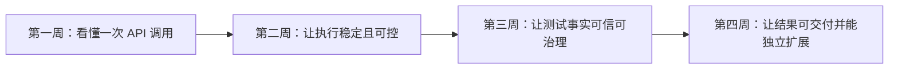
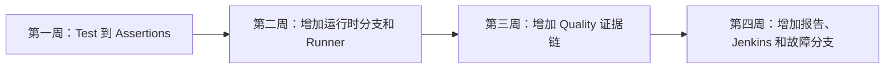

# LLM API 测试框架课程大纲

## 1. 课程定位

本课程基于当前项目实际存在的代码和测试设计，面向希望从“会写 pytest 用例”逐步提升到“能理解、调试和扩展接口测试框架”的学习者。

课程不要求一开始读懂所有源码，而是围绕一个个真实问题逐步展开：

1. 一个测试到底是怎么把请求发出去的？
2. 网络不稳定、任务异步、响应流式时怎么办？
3. 很多测试并发运行时，怎样保证不丢、不重、不串线？
4. 测试结束后，怎样证明数据完整、结论可信？
5. 怎样把机器事实变成开发、测试和管理者都能看懂的报告？

## 2. 适合人群

- 掌握 Python 基础语法。
- 了解 pytest 的测试函数、fixture 和断言。
- 接触过 HTTP API 测试，但对框架设计不熟悉。
- 希望学习 Retry、Polling、SSE、并发执行、质量指标和 CI 的完整链路。

## 3. 学习前置条件

### 必备知识

- Python 函数、类、异常和上下文管理器。
- HTTP 方法、状态码、请求头和 JSON。
- pytest 基础执行与参数化。
- Git 和命令行的基本使用。

### 学习环境

始终使用项目虚拟环境：

```powershell
.\.venv\Scripts\python.exe --version
.\.venv\Scripts\python.exe -m pytest --version
```

业务模块优先执行收集检查，不直接发送真实请求：

```powershell
.\.venv\Scripts\python.exe -m pytest module/smoke --collect-only -q
```

## 4. 第一性原理与 TOC 教学设计

### 4.1 学习目标

学习者最终要获得的不是“读过很多文件”，而是面对需求或故障时，能够判断：

- 问题属于业务链、执行链还是质量链。
- 应该从哪个入口开始排查。
- 修改应该放在哪一层。
- 应该用什么测试证明修改正确。

### 4.2 当前学习约束

项目同时包含业务测试、请求框架、Runner、Quality、报告和 Jenkins。如果按目录从头读到尾，信息会同时涌入，初学者容易失去主线。

### 4.3 解除约束的方法

课程遵循六个原则：

1. **先场景，后概念**：先看一个测试如何运行，再解释分层设计。
2. **先主链，后分支**：先掌握成功路径，再加入 Retry、Polling 和异常。
3. **先讲清，后验证**：先解释职责、对象和因果关系，再用最小证据验证，不以代码量衡量学习效果。
4. **先离线，后真实**：课程验证只使用 collect-only、现有离线测试或一次最小新增测试，不要求执行真实付费接口。
5. **先事实，后指标**：先理解原始数据从哪里来，再学习 Metrics 和 Flaky。
6. **先能复述，后能扩展**：能够脱离源码讲清链路后，才讨论修改方案；除唯一必做测试外，其余实现均为教师演示或选做。

## 5. 通俗化教学方法

课程会使用生活类比降低理解门槛，但最终必须回到准确的代码对象：

| 技术概念 | 通俗类比 | 最终要掌握的代码对象 |
| --- | --- | --- |
| Test | 顾客提出需求和验收条件 | `test_*.py` |
| Task | 厨房安排完整制作流程 | 领域 `task.py` |
| Request | 服务员确认菜单、桌号和下单方式 | 领域 `request.py` |
| Middleware | 包裹经过安检、贴单和拍照留证 | `request_middleware.py` |
| Retry | 电话占线后按规则重拨 | `RetryPolicy`、`RetryExecutor` |
| Polling | 定期查询快递是否送达 | `PollingPolicy`、`PollingState` |
| TestContext | 一次任务随身携带的资料袋 | `TestContext` |
| Runner | 车站调度员安排并行和专线列车 | `run_orchestration/` |
| Quality Fact | 不可随意修改的原始账本 | worker 写 Case、Request、Integrity；归并阶段派生 FailureRecord |
| Semantic | 把多张小票归为一次完整消费 | Operation、Request Group、Polling Session |
| Flaky | 时好时坏、需要历史观察和人工治理的故障 | Flaky 状态机、历史存储与审计治理 |
| Pipeline Report | 把账本整理成值班日报 | `pipeline_reporting/` |

## 6. 单课教学结构：重讲解、轻实践

每课建议 60～90 分钟，固定采用以下节奏：

1. **问题场景，10 分钟**：先说明为什么需要这个能力。
2. **生活类比，10 分钟**：用熟悉场景建立直觉。
3. **代码讲解，30～40 分钟**：教师沿主链解释函数、对象、边界和因果关系，只展开本课新增节点。
4. **证据观察，10～15 分钟**：阅读现有测试、日志或产物，先预测再解释；命令默认由教师演示。
5. **轻量验证，5～10 分钟**：使用 collect-only、单个现有测试或纸面测试设计验证理解，不连续布置编码任务。
6. **课后总图，10 分钟**：更新累积链路图并完成三分钟复述。

### 6.1 实践分级

大纲中的“课堂实践”统一按以下级别执行：

| 级别 | 默认要求 | 评价重点 |
| --- | --- | --- |
| 教师演示 | 教师运行命令或展示代码，学习者先预测再解释输出 | 能说清输出证明了什么 |
| 代码阅读与纸面设计 | 学习者追踪已有代码、补图、写测试场景或伪代码 | 能判断职责、输入输出和失败分支 |
| 唯一必做实现 | 仅第 25 课新增一个最小离线测试 | 能用最少代码冻结一个明确公共行为 |
| 选做扩展 | Middleware 原型、新模块骨架或更多测试 | 不计入基础考核，不影响课程完成 |

除第 25 课明确标记的唯一必做离线测试外，其他 pytest 命令均用于教师演示、课堂共同验证或个人选做，不要求学习者逐条独立运行和提交。

## 7. 课程总览



| 周次 | 核心问题 | 阶段成果 |
| --- | --- | --- |
| 第一周 | 一个测试是怎么把请求发出去的？ | 能独立追踪 Test → Task →（领域 Request 方法或 Request Client）→ BaseRequest |
| 第二周 | 异步、失败、并发和多用例怎样稳定执行？ | 能解释 Retry、Polling、Context 和 Runner |
| 第三周 | 测试结束后，怎样证明事实完整、指标可信？ | 能追踪 Runtime Hooks → Quality 生命周期与身份 → Metrics → Flaky 审计治理 |
| 第四周 | 怎样形成报告、接入 CI，并独立扩展框架？ | 能定位故障、补测试、设计新模块并完成答辩 |

## 8. 第一周：看懂一次 API 调用

### 第 1 课：项目是一座什么样的工厂

**核心问题**：项目目录很多，应该先看哪里？

**通俗理解**：先看工厂的车间分布，不要一进门就拆机器。

**学习内容**：

- 项目的三条主线：业务执行链、运行编排链、质量治理链。
- `common/`、`module/`、`run_orchestration/`、`quality/`、`pipeline_reporting/`、`tests/` 的职责。
- pytest、JUnit、Allure 和 Quality 在系统中的位置。

**代码入口**：

- `README.md`
- `FRAMEWORK_TEST_SPEC.md`
- `pytest.ini`
- `requirements.txt`

**课堂实践**：为六个核心目录各写一句职责说明。

**课后产出**：绘制第一版项目地图，只画目录和三条主线。

**验收问题**：为什么这个项目不只是 pytest 和 requests 的简单封装？

### 第 2 课：从一个单请求协议用例开始

**核心问题**：一个测试方法究竟调用了谁？

**通俗理解**：先观察一张只包含一道菜的订单，弄清顾客、厨房、服务员和后厨系统怎样协作，再学习套餐、加单和结算。

**学习内容**：

- Test、Task、Request 和 Assertions 的基本分工。
- 从测试方法向下追踪调用，而不是从公共基类向上猜业务。
- 用例收集与真实执行的区别。
- 本课只追踪一个 `openai_chat_completions` 请求，不引入 BaseTask、Task Capability、计费、控制流量、Polling 或 TestContext。

**代码入口**：

- `module/protocol_testing/text_model/test_protocol_interception.py`
- `module/protocol_testing/task.py`
- `module/protocol_testing/request.py`
- `module/protocol_testing/assertions.py`
- `common/base_request.py`

**课堂实践**：只选择参数分支 `openai_qwen_allow`，忽略其他协议与模型矩阵，追踪以下唯一主链：

```text
test_text_model_protocol_interception
  -> _create_by_protocol_path
  -> ProtocolTask.create_chat_completion
  -> ProtocolRequest.create_chat_completion
  -> BaseRequest.post / request
  -> ProtocolInterceptionAssertions
```

**安全命令**：

```powershell
.\.venv\Scripts\python.exe -m pytest `
  "module/protocol_testing/text_model/test_protocol_interception.py::TestTextModelProtocolInterception::test_text_model_protocol_interception[openai_qwen_allow]" `
  --collect-only -q
```

**课后产出**：在总图中增加 Test、Task、领域 Request 方法、BaseRequest 和 Assertions，不增加本课没有经过的 BaseTask 或 Capability。

### 第 3 课：为什么要分 Test、Task 和 Request

**核心问题**：把所有代码写进测试方法不是更直接吗？

**通俗理解**：点菜单、制作流程和验收标准写在一张纸上，短期方便，长期一定混乱。

**学习内容**：

- Test 负责场景和预期。
- Task 负责编排业务动作和构造 payload。
- Task 可以调用领域 Request 方法；已有兼容能力也可能通过 Capability 直接使用 Request Client，但这条分支推迟到第 12 课学习。
- Request 负责端点、HTTP 方法和请求语义。
- Assertions 负责复用领域判断。
- Schema 负责响应结构合同。

**课堂实践**：对比 `ProtocolTask.create_chat_completion()` 和 `MediaGenerationCapability.create_chat_completion()`：前者调用领域 Request 方法，后者直接使用 Request Client。将共同主链概括为：

```text
Test -> Task ->（领域 Request 方法或 Request Client）-> BaseRequest
```

**课后产出**：制作一张“代码应该放哪一层”的判断表。

**验收问题**：新增一个接口时，哪些情况只需要 Request，哪些情况还需要 Task？

### 第 4 课：BaseRequest 是统一请求入口

**核心问题**：领域 Request 最终怎样发送 HTTP 请求？

**通俗理解**：不同服务员最终都要把订单送进同一套后厨系统。

**学习内容**：

- `BaseRequest.request()` 的入口职责。
- URL、默认请求头和临时请求头的合并。
- `RequestContext` 如何保存一次请求的信息。
- 普通 GET、POST 与统一 request 方法的关系。

**代码入口**：

- `common/base_request.py`
- `common/request_context.py`

**课堂实践**：从一个 `SmokeRequest` 方法追踪到 `BaseRequest.request()` 和 `_build_request_context()`。

**课后产出**：把 `RequestContext` 作为输入对象加入课后总图。

### 第 5 课：Middleware、Capture 与资源附件

**核心问题**：日志、脱敏、输入媒体和输出结果为什么不直接写在领域 Request 中？

**通俗理解**：包裹发出前需要安检、贴单并保存贵重原料，成品完成后还要归档照片；记录失败不能阻止正常交付。

**学习内容**：

- before、after、exception 三个阶段。
- Middleware 如何横向复用。
- 日志、cURL 和敏感字段脱敏。
- 为什么观察和记录不能修改真实请求数据。
- `CapturePolicy` 如何分别控制输入媒体和输出结果，以及各自的最大下载大小。
- 输入分支：POST 请求进入 `MediaResourceMiddleware.before_request()`，异步启动输入媒体下载。
- 输出分支：Polling Decorator 从最终响应的 JSONPath 提取结果链接并下载，不把下载失败替换成业务响应失败。
- 本课只把 Polling Decorator 当作“最终响应的输出 Capture 接口”，Polling 状态机和超时分支推迟到第 9 课展开。
- `module/conftest.py` 如何在用例资源收口时把输入下载步骤和输出文件挂入 Allure。
- `download_url()` 如何处理临时文件、大小上限、安全命名、重名和附件类型。
- Capture 是两条共享策略与下载原语的分支，不应画成 `Middleware -> 输入下载 -> 输出下载` 的错误线性顺序。

**代码入口**：

- `common/request_middleware.py`
- `common/capture.py`
- `common/base_decorators.py`
- `util/api_call_logger.py`
- `util/curl_builder.py`
- `util/redaction.py`
- `util/media_resources.py`
- `util/downloads.py`
- `module/conftest.py`

**课堂实践**：先画出输入 Capture 与输出 Capture 两条分支，再运行 Middleware、资源下载和 Decorators 相关离线测试。

```powershell
.\.venv\Scripts\python.exe -m pytest `
  tests/test_request_middleware.py `
  tests/test_base_request_middleware.py `
  tests/test_api_call_logger.py `
  tests/test_curl_builder.py `
  tests/test_capture_downloads.py `
  tests/test_base_decorators.py -q
```

**课后产出**：在总图中补上 before、after、exception，以及以下两条非线性资源分支：

```text
CapturePolicy
├─ 输入 Capture
│  -> MediaResourceMiddleware
│  -> POST payload 媒体链接
│  -> 异步下载任务
│  -> 用例资源收口
│  -> Allure 前置资源附件或失败证据
└─ 输出 Capture
   -> download_links_from_poll_get
   -> 最终 Polling Response 的结果链接
   -> 下载与文件收集
   -> 用例资源收口
   -> Allure 模型结果附件或失败证据

两条分支共同受下载大小、文件命名和失败隔离约束。
```

### 第 6 课：断言与响应合同

**核心问题**：状态码是 200，为什么测试仍可能失败？

**通俗理解**：快递送到了，不代表里面的商品正确、完整且没有损坏。

**学习内容**：

- 状态码断言、JSONPath 断言和 JSON Schema 断言。
- 结构合同与业务合同的区别。
- 通用断言与领域断言的边界。

**代码入口**：

- `common/base_assertions.py`
- `module/smoke/assertions.py`
- `module/smoke/response_schemas.py`

**课堂实践**：阅读断言测试，先预测失败信息，再执行验证。

```powershell
.\.venv\Scripts\python.exe -m pytest `
  tests/test_assertions_entrypoints.py `
  tests/test_base_assertions_schema.py -q
```

**课后产出**：在总图末端区分“HTTP 成功”“结构正确”“业务正确”。

### 第 7 课：第一周串讲与业务链答辩

**复习主线**：

```text
Test -> Task ->（领域 Request 方法或 Request Client）-> BaseRequest
     -> RequestContext -> Middleware -> HTTP -> Response -> Assertions
                         └─ 输入 Capture：异步下载并在用例收口时挂入 Allure
     -> 最终结果 Response -. 可选输出 Capture .-> 下载结果并挂入 Allure
```

**课堂任务**：

1. 不看源码，完整讲述一次请求调用链。
2. 给出一个新接口需求，判断代码应该放在哪一层。
3. 模拟一次请求失败，说明日志和异常如何流转。

**周验收**：

- 能在五分钟内追踪一个 `smoke` 用例。
- 能解释五层职责边界。
- 能画出成功路径和异常路径。
- 能只通过 collect-only 判断用例是否可被 pytest 收集。

## 9. 第二周：让执行稳定且可控

### 第 8 课：Retry 不是无脑重试

**核心问题**：请求失败后，为什么不能简单再发一次？

**通俗理解**：电话占线可以重拨，但付款按钮不能看见失败提示就无限点击。

**学习内容**：

- 哪些异常和状态码允许重试。
- 最大尝试次数、退避时间和 deadline。
- GET 与 POST 的重试风险差异。
- `RetryExecutor` 在进入尝试循环前先判断请求方法是否具备重试资格；POST 即使配置 RetryPolicy，也可能只执行一次 `_send`。
- RetryAttemptRecord 如何记录“准备下一次 retry”的原因与候选等待；最终成功、最终响应和最终异常不会追加记录。
- 最后一次得到可重试 HTTP 响应时直接返回该响应；最后一次抛出异常时重新抛出原始异常，不存在统一的 RetryExhausted 出口。

**代码入口**：

- `common/retry.py`
- `common/retry_executor.py`
- `common/base_request.py` 中 `_send_with_retry()`。

**课堂实践**：先预测尝试次数和等待时间，再运行测试。

```powershell
.\.venv\Scripts\python.exe -m pytest `
  tests/test_retry_policy.py `
  tests/test_retry_executor.py -q
```

**课后产出**：绘制“响应/异常 → 是否可重试 → 是否还有预算 → 返回或失败”的状态图。

**验收问题**：为什么 POST 重试需要明确的幂等依据？

### 第 9 课：Polling 是有终点的查询循环

**核心问题**：异步任务还没完成时，怎样等到成功，又不会永远等下去？

**通俗理解**：查询快递状态时，“运输中”可以继续等，“已签收”可以结束，“已退回”必须失败，陌生状态不能假装正常。

**学习内容**：

- `PollingState` 的 pending、success、failure、unknown。
- `PollingPolicy` 如何定义状态集合。
- `evaluate_polling_response()` 如何分类响应。
- 轮询间隔、总超时和单次请求重试的关系。

**代码入口**：

- `common/polling.py`
- `common/base_request.py` 中 `poll_get()` 和 `_poll_get_with_policy()`。

**课堂实践**：

```powershell
.\.venv\Scripts\python.exe -m pytest `
  tests/test_polling_state_machine.py `
  tests/test_base_request_retry_polling.py -q
```

**课后产出**：绘制 Polling 状态机，明确四种状态的出口。

### 第 10 课：SSE 是边接收边处理

**核心问题**：为什么流式响应不能像普通 JSON 一样一次读取？

**通俗理解**：普通响应像收一封完整邮件，SSE 更像听直播，需要一段一段接收，还要处理突然断线。

**学习内容**：

- `stream=True` 如何改变请求和运行时观察类型。
- SSE 数据行如何解析。
- 正常结束、业务错误和传输中断的区别。
- `iter_sse_lines()` 只负责持续消费和记录流生命周期，不负责关闭 Response。
- 为什么上层 Task 必须在 `finally` 中显式关闭流式 Response。

**代码入口**：

- `common/streaming.py`
- `module/smoke/task.py` 中流式处理方法。
- `tests/test_stream_fault_simulation.py`

**课堂实践**：模拟正常流、中断流和错误数据行。

**课后产出**：在请求总图中增加普通 HTTP 与 SSE 两条分支。

### 第 11 课：TestContext 是一次测试的资料袋

**核心问题**：前一步产生的 ID、资源和清理动作，怎样安全交给后续步骤？

**通俗理解**：办理一件事情时，把身份证明、回执和待办事项放进同一个资料袋，结束后按倒序归还或清理。

**学习内容**：

- 变量保存、提取和转换。
- TestContext 是可选的用例级状态与清理容器，不是每次 Request 的必经处理阶段。
- cleanup 回调为什么按 LIFO 执行。
- 清理失败如何汇总，而不是掩盖前面的错误。
- `ContextVar` 在线程池提交时为什么需要传播。

**代码入口**：

- `common/test_context.py`
- `common/context_executor.py`
- `module/conftest.py`
- `module/material_library/test_seedance_2_5_virtual_asset_library.py`（仅静态阅读，禁止课堂执行）
- `tests/test_test_context.py`
- `tests/quality/test_quality_context_executor.py`

**课堂实践**：构造一组包含三个 callback 的 cleanup 场景，预测实际执行顺序、失败汇总和第二次 cleanup 结果。

**课后产出**：画出 TestContext 包围多步骤业务流程的生命周期图：

```text
步骤一 Response -> 提取变量到 TestContext
TestContext -> 为后续 Task / Request 提供变量
测试结束 -> 按 LIFO 执行 cleanup
手动 teardown -> 先清理业务资源 -> finally 关闭 Request Client
```

### 第 12 课：BaseTask 兼容门面与窄 Capability

**核心问题**：多个模块都需要媒体生成和账单查询时，代码应该放在哪里？

**通俗理解**：多个菜系都需要蒸箱，但不应该让所有菜都继承一个无限膨胀的万能厨房。

**学习内容**：

- `BaseTask` 是保留现有公共入口的兼容门面，不是新领域逻辑的扩展点。
- 现有 BaseTask 方法如何委托 `task_capabilities` 的真实实现。
- 新领域逻辑必须进入对应模块的领域 Task。
- 只有能力确实需要跨模块复用时，才建立职责单一的窄 Capability。
- 不继续向 BaseTask 增加新领域方法。
- 工作流量与控制流量的区别。

**代码入口**：

- `common/base_task.py`
- `common/task_capabilities/media_generation.py`
- `common/task_capabilities/billing.py`
- `module/smoke/task.py`
- `module/video_model/task.py`
- `module/material_library/task.py`
- `module/image_model/task.py`

**课堂实践**：给出三个新业务动作，在“领域 Task / 复用或窄扩展现有 Capability / 新建窄 Capability”三种结论中选择；同时区分当前兼容链与推荐的新能力链。新 Capability 不增加 BaseTask 入口，而由需要它的领域 Task 显式构造或注入后组合使用。

```powershell
.\.venv\Scripts\python.exe -m pytest `
  tests/test_base_task.py -q
```

该命令作为课前核心证据运行，共 22 条测试。`tests/test_smoke_billing_assertions.py` 和 `tests/test_smoke_billing_interval.py` 的 11 条测试只证明 Decimal 账单断言边界，作为选读证据，不计入课堂默认命令，也不用于证明 Capability 的 HTTP 委托。

**课后产出**：

1. 完成三个新业务动作的能力落位表，并写出因果理由。
2. 分开画出能力来源、当前实际兼容调用链与推荐的新 Capability 接入链；推荐设计使用虚线并注明当前暂无生产实例。
3. 完成一次三分钟复述，明确区分继承关系与函数调用链。

### 第 13 课：Runner 像车站调度系统

**核心问题**：很多测试一起执行时怎样保证不丢、不重；启用 `-n` 时怎样让普通测试并发执行、serial 测试独立收尾，未启用时为什么完整计划进入一个普通串行池？

**通俗理解**：先确定完整乘客名单，再把普通乘客分到多条并行通道，把特殊乘客安排到专用通道；不能每到一个站重新点名。

**学习内容**：

- CLI 参数与 pytest 透传参数。
- `partition_pytest_args()` 如何区分选择参数和执行参数。
- `run_orchestration.pytest_execution.collect_test_case_items()` 为什么是唯一权威收集，并与返回列表的 `master_service.collect_test_case_items()` 区分。
- `run_orchestration.scheduling.split_test_cases()` 如何形成 P/S；未传 `-n` 时执行阶段为什么仍使用完整 C。
- 集合守恒：并集等于收集集合，交集为空。

**代码入口**：

- `run_master.py`
- `run_orchestration/cli.py`
- `run_orchestration/runner.py`
- `run_orchestration/pytest_execution.py`
- `run_orchestration/scheduling.py`

**课堂实践**：执行 `course/第13课-Runner像车站调度系统.md` 第 13.2 节的完整安全命令，不直接运行省略隔离步骤的简化 pytest 命令。该命令保存并清空 `PYTEST_ADDOPTS`，通过 `-o addopts=` 覆盖项目默认参数，把 `--basetemp` 和外层 Allure raw 放在仓库根目录内的本次专用临时目录，清理前对父目录两侧执行 `TrimEnd` 校验，并在结束后恢复进程环境。核心目标仍是以下三个文件的 30 条离线测试：

- `tests/test_master_service_parallel_serial.py`
- `tests/test_run_orchestration_boundaries.py`
- `tests/test_run_orchestration_public_contract.py`

**课后产出**：绘制“权威收集 → 分池 → 执行”的集合流转图。

### 第 14 课：退出码、JUnit、Allure 与第二周答辩

**核心问题**：测试已经跑完，怎样保留真实结果并生成可查看的证据？

**通俗理解**：列车运行结束后，需要保留调度记录、事故代码、乘客清单和现场照片，不能只说“今天大概正常”。

**学习内容**：

- `PoolExecutionResult` 如何记录每个执行池。
- pytest 原始退出码如何合并。
- Runner execution result 的职责。
- JUnit 与 Allure 分别解决什么问题。
- Allure 为什么分池写 raw，并在每个池结束时累积到最终 raw 目录，最后只生成一次可选 HTML/history。

**代码入口**：

- `run_orchestration/artifacts.py`
- `run_orchestration/allure_lifecycle.py`
- `run_orchestration/pytest_execution.py`
- `run_orchestration/runner.py`

**课堂实践**：执行 `course/第14课-退出码、JUnit、Allure与第二周答辩.md` 第 14.1 节的完整安全命令。命令保存并清空 `PYTEST_ADDOPTS`，通过 `-o addopts=` 覆盖项目默认参数，精确运行 30 条退出码、PoolExecutionResult、execution-result、JUnit 与 Allure 生命周期离线测试，使用仓库内专用 `--basetemp`，并关闭真实 HTML/history 生成。

**第二周串讲主线**：

```text
普通请求 -> _send -> Middleware -> HTTP
配置 Retry -> RetryExecutor -> 判断请求方法是否具备重试资格
                         ├─ 不具备 -> 只执行一次 _send
                         └─ 具备 -> 每次尝试 _send -> Middleware -> HTTP
Polling -> 多次 GET；每次 GET 内部可选 Retry
SSE -> HTTP 返回 Response -> 上层调用 iter_sse_lines 持续消费
                          -> 上层 Task 在 finally 中关闭 Response

TestContext 可选地包围多步骤业务流程：
  Response -> 提取变量 -> TestContext -> 后续 Task / Request
  测试结束 -> LIFO cleanup

Test Case -> pytest 权威收集 -> 并发池 / 串行池
          ├-> pytest 池级原始退出码 -> PoolExecutionResult -> Runner 最终退出码
          ├-> JUnit 池级统计
          └-> Allure 池级 raw -> 每池 merge_pool -> 最终 raw
                                      -> 最后一次可选 HTML/history

CollectionResult + PoolExecutionResult + Runner 最终退出码
-> Runner execution result
```

**周验收**：

- 能解释 Retry 与 Polling 的不同循环边界。
- 能说明 SSE 与普通响应的资源生命周期差异。
- 能证明并发池与串行池满足集合守恒。
- 能说明测试失败、Runner 异常和报告生成失败为什么不能混为一谈。

## 10. 第三周：让测试事实可信可治理

### 第 15 课：Runtime Hooks 是旁观者接口

**核心问题**：Quality 想观察请求，但为什么不能让 `common` 直接依赖 `quality`？

**通俗理解**：摄像头可以记录流水线，但不能控制机器怎样生产，更不能因为摄像头坏了就让生产线停摆。

**学习内容**：

- 中性 Runtime Hooks 协议。
- `RuntimeObserver` 如何启动和结束 operation。
- Noop 实现的意义。
- fail-open：观察失败不覆盖业务响应和原始异常。

**代码入口**：

- `common/runtime_hooks/`
- `common/base_request.py` 中 RuntimeObserver 的使用。
- `common/request_middleware.py` 中 RuntimeObservationMiddleware 的 request 事件入口。
- `quality/runtime_adapter.py`

**课堂实践**：

执行 `course/第15课-Runtime Hooks是旁观者接口.md` 第 15.1 节的完整安全命令。命令精确运行以下 10 条离线测试，禁用第三方 pytest 插件自动加载，清空项目默认 addopts，并使用仓库内专用 `--basetemp`：

- `tests/quality/test_common_runtime_hooks.py`：默认 Noop、operation / stream lease 和业务异常优先；
- `tests/quality/test_runtime_adapter.py`：Adapter 映射与 request metrics 局部 fail-open；
- `tests/quality/test_common_quality_boundary.py`：`common` 无静态 Quality import，且 Quality 不可导入时内存 HTTP 仍可工作。

**课后产出**：画出 `common -> 中性协议 <- quality adapter`，明确不存在 `common -> quality` 依赖。

### 第 16 课：Quality 开关、运行身份与生命周期

**核心问题**：Quality 从哪里开启，Runner 怎样在关闭时不新增副作用，并为一次运行和真正执行的各池建立可关联的父级身份？

**通俗理解**：质检系统接入生产线前，必须先决定本轮是否启用，并给整批货、每条生产线和每个工位分配不会混淆的编号。

**学习内容**：

- `quality/config.py` 如何解析 Quality、Semantic、Metrics 和 Flaky 的独立开关与依赖关系。
- `create_quality_run_lifecycle()` 如何根据配置返回 `NoopQualityRunLifecycle` 或 `EnabledQualityRunLifecycle`。
- Noop 路径为什么不创建新 run ID、质量目录、JUnit 补充参数或质量产物，同时也不负责清洗外部已有 Quality 环境变量。
- Enabled 生命周期的 `prepare()`、`ensure_junit_args()`、`stage_environment()` 和 `finalize()`。
- Runner 只有在权威收集成功且非 collect-only 后才创建 Quality 生命周期。
- 无 `-n` 时完整集合进入 `serial-pool`；启用 `-n` 时才按 `parallel-pool` 与 `serial-pool` 计划执行，空池或终止池不进入对应 stage environment。
- `run_id` 表示一次完整运行，当前 Runner 直接用语义池名作为 `execution_id`；`worker_id` 由第 17 课 pytest 插件在具体进程内确定。
- `quality_stage_environment()` 如何把 parent run ID 和当前 execution ID 传入 pytest 执行阶段。
- `quality/identifiers.py` 提供哪些标识符工具，以及为什么当前 Runner 主链不能虚构为调用了 `build_execution_id()`。
- Quality 开启时为什么只是在参数层确保请求 JUnit 路径，不能据此断言 XML 文件已经生成。

**代码入口**：

- `quality/config.py`
- `run_orchestration/quality_lifecycle.py`
- `run_orchestration/environment.py`
- `run_orchestration/runner.py`
- `run_orchestration/pytest_execution.py`
- `quality/identifiers.py`
- `quality/runtime_context.py`
- `quality/pytest_plugin_runtime.py`（仅静态确认下一课的 `worker_id` 边界）

**课堂实践**：教师课前运行独立讲义第 15.1 节的完整安全命令。学生只预测并解释“Quality 关闭但外部已有旧身份”和“Enabled 单池”两个核心场景；“Enabled 双池”和“主开关非法”只作为教师题库。命令覆盖 `test_quality_config.py`、`test_quality_lifecycle.py`、`test_quality_identifiers.py` 和 `test_quality_run_master.py`，当前离线证据为 55 条通过；不访问真实 API。

**课后产出**：绘制以下调用与身份链，并标出 Noop 分支不会产生哪些对象：

```text
Runner -> create_quality_run_lifecycle()
          ├─ 配置关闭或普通初始化异常 -> 返回Noop生命周期
          └─ 有效开启 -> 返回Enabled生命周期

Enabled父级配置 ==> 单一run_id
真正执行池的stage_id ==> execution_id
QUALITY_ENABLE=1 + QUALITY_RUN_ID + QUALITY_EXECUTION_ID + QUALITY_OUTPUT_DIR ==> pytest stage environment
stage environment -. 第17课pytest插件读取 .-> worker_id
```

### 第 17 课：pytest 插件把生命周期写成 worker 原始账本

**核心问题**：测试 hook、运行身份和 Runtime Hooks 怎样汇合为 Case、Request、Integrity 分片？

**通俗理解**：每个工位拿到批次号和工位号后，才能把自己的生产记录写入独立账页，并在产品标签上留下可以对账的编号。

**学习内容**：

- `quality.pytest_plugin` 为什么只做轻量延迟加载，关闭或 collect-only 时不加载运行时实现。
- `pytest_configure`、`pytest_runtest_protocol` 和 `pytest_runtest_logreport` 如何建立和结束 Case 生命周期。
- `QualityRunContext` 如何组合 `run_id`、`execution_id`、`worker_id` 和输出目录。
- `case_id` 与 `invocation_id` 的区别：稳定用例身份与本次运行调用身份不能混用。
- pytest report 的 JUnit properties 如何写入 `quality_case_id` 和 `quality_invocation_id`。
- worker 只写 Case、Request、Integrity 三类分片。
- FailureRecord 不是 worker 原始分片，而是归并阶段结合 Case、JUnit、Request 和 Integrity 证据生成的派生事实。
- `QualityCollector`、JSONL 分片、进程内锁、追加写入和按 worker 文件隔离为什么适合并发 worker。

**代码入口**：

- `module/conftest.py`
- `quality/pytest_plugin.py`
- `quality/pytest_plugin_runtime.py`
- `quality/runtime_context.py`
- `quality/junit.py`
- `quality/collector.py`
- `quality/storage.py`
- `quality/models.py`

**课堂实践**：执行 `course/第17课-pytest插件把生命周期写成worker原始账本.md` 第 15.1 节的核心安全命令，不直接运行省略隔离步骤的简化 pytest 命令。课堂阅读插件和 Collector 测试，追踪一次参数化 Case 从 nodeid 到 case ID、invocation ID、JUnit properties 和 worker JSONL 的全过程；xdist 证据只使用讲义第 15.2 节教师选讲命令。

**课后产出**：绘制“run/execution/worker identity → pytest hook / Runtime Hooks → Collector → Case/Request/Integrity worker JSONL”，并为 JUnit properties 和归并阶段 FailureRecord 输出预留节点。

### 第 18 课：Aggregator 先判断账本能不能信

**核心问题**：有了很多 JSONL 文件，为什么还不能马上算指标？

**通俗理解**：对账前要先确认收银台数量、小票归属和金额是否完整；缺页的账本不能直接算利润。

**学习内容**：

- `merge_quality_facts()` 和 `merge_quality_run()` 的职责。
- run ID、execution ID、用例数量和文件哈希校验。
- `quality/junit.py` 如何读取 pytest 写入的 case ID、invocation ID、状态、错误类型和断言位置。
- Aggregator 如何使用 JUnit properties 把测试结果与 worker Case 事实关联，避免只按易变化的显示名称猜测。
- integrity status 与 integrity issues。
- `quality/aggregator.py::_classify_failures()` 负责组织证据，真正的分类规则位于 `quality/classifier.py::classify_failure()`。
- Classifier 如何结合错误类型、消息、断言位置和请求指标生成 FailureCategory、owner domain、confidence 与稳定 failure fingerprint。
- `merge_quality_facts()` 返回 `None` 时才完全停止 Quality 下游。
- 教学图必须先判断 `merge_result is None`；只有取得成功归并结果后，才表达该结果中已经完成 FailureRecord 分类。
- 返回结果但 P0 完整性为 FAILED 时，manifest status 仍可能是 `complete`；Semantic 主要校验 P0 manifest 提交状态、run ID 和请求文件哈希，Metrics 与 Flaky 则明确拒绝 P0 `integrity_status=FAILED`。必须区分 manifest 提交状态、P0 完整性状态和各下游自己的输入门槛。

**代码入口**：

- `run_orchestration/quality_fact_merge_stage.py`
- `quality/aggregator.py`
- `quality/junit.py`
- `quality/classifier.py`
- `run_orchestration/quality_pipeline.py`

**课堂实践**：执行 `course/第18课-Aggregator先判断账本能不能信.md` 第 13.1 节的核心安全命令，不直接运行省略隔离步骤的简化 pytest 命令。随后阅读 `tests/quality/test_quality_classifier.py` 中同一默认 `_evidence()` 的四个变体，先预测 configuration、unknown、transient 和稳定 fingerprint，再对照断言；命令同时覆盖 `merge_result is None` 的 pipeline 边界。

**课后产出**：在总图中分别增加“merge_result 是否为 None”、manifest 提交状态、P0 `integrity_status` 和本课关注的 P0 可信性门槛，并画出 `JUnit properties -> JUnitCaseEvidence -> Aggregator -> Classifier -> FailureRecord`；禁止把归并、完整性判断和分类规则合并成一个黑盒节点。

### 第 19 课：Semantic 把多个请求还原成一次业务调用

**核心问题**：Retry、Polling 和 SSE 会产生很多请求，怎样知道它们属于同一次业务动作？

**通俗理解**：一顿饭可能有多张加菜单和付款小票，但分析消费行为时应该把它们归为同一次就餐。

**学习内容**：

- Operation、Request Group、Polling Session。
- 一次逻辑调用与单个 HTTP 请求的区别。
- Retry 多次尝试为什么仍属于一个请求组。
- Polling 和流式响应如何补充语义事实。

**代码入口**：

- `quality/semantic_models.py`
- `quality/semantic_context.py`
- `quality/semantic_collector.py`
- `quality/semantic_aggregator.py`

**课堂实践**：根据测试事实判断 operation、request group 和 request event 的数量关系。

```powershell
.\.venv\Scripts\python.exe -m pytest `
  tests/quality/test_semantic_context.py `
  tests/quality/test_semantic_aggregator.py `
  tests/quality/test_semantic_request_groups.py `
  tests/quality/test_semantic_polling.py -q
```

### 第 20 课：Metrics 不是简单计数

**核心问题**：为什么不能只看请求成功率和平均耗时？

**通俗理解**：评价一次就餐不能只数服务员走了几次，还要区分等待时间、制作时间、加单次数和消费信息是否完整。

**学习内容**：

- 用例通过率与请求成功率的区别。
- 逻辑调用耗时与单请求耗时的区别。
- 重试挽救率和轮询等待时间。
- usage 的 complete、partial、no_data、not_applicable。
- 缺失值为什么不能按零处理。

**代码入口**：

- `quality/metrics_models.py`
- `quality/request_metrics.py`
- `quality/metrics/`

**课堂实践**：给出三组事实，判断指标应该是完整、部分还是无数据。

```powershell
.\.venv\Scripts\python.exe -m pytest `
  tests/quality/test_metrics_models.py `
  tests/quality/test_metrics_sources.py `
  tests/quality/test_quality_request_metrics.py -q
```

### 第 21 课：Flaky 从历史识别走向可审计治理

**核心问题**：一个测试今天失败，能不能马上认定它是 Flaky；识别后又该怎样安全治理？

**通俗理解**：一次发烧不能诊断为慢性病；即使确诊，也必须记录医生、负责人、治疗原因和复查时间，不能只贴一张“有问题”的标签。

**学习内容**：

- 稳定用例标识和结果签名。
- 观察窗口与状态迁移。
- 单次失败、持续失败和时好时坏的区别。
- SQLite 历史存储、数据库结构与完整性健康检查。
- 使用 `flaky-history` 查询历史样本，使用 `flaky-state` 查询当前状态投影。
- `flaky-confirm` 与 `flaky-mark-not-flaky` 如何进行人工确认或纠正。
- `flaky-quarantine` 为什么必须提供 owner、actor、reason 和 expires-at。
- `flaky-start-recovery` 与 `flaky-cancel-quarantine` 如何进入恢复或撤销误隔离。
- `flaky-governance-list` 如何查询活动、恢复中或已过期治理记录。
- quarantine 是可审计治理状态，不会自动跳过 pytest 用例。
- 人工动作为什么必须写入 transition、override 和 governance 记录：状态投影会影响后续判断，必须保留责任、原因、时间和证据窗口。
- 用例语义或实现发生明确变化时，为什么应开启新 epoch，而不是把修复后的结果误判为 Flaky 切换。

**代码入口**：

- `quality/flaky.py`
- `quality/flaky_models.py`
- `quality/flaky_importer.py`
- `quality/cli.py`
- `quality/flaky_store/facade.py`
- `quality/flaky_store/governance.py`
- `quality/flaky_store/`

**课堂实践一：状态机与治理合同测试**。手工排列一组通过/失败历史，先判断状态和允许的人工动作，再用测试验证。

```powershell
.\.venv\Scripts\python.exe -m pytest `
  tests/quality/test_flaky_state_machine.py `
  tests/quality/test_flaky_store.py `
  tests/quality/test_flaky_cli.py `
  tests/quality/test_flaky_state_cli.py `
  tests/quality/test_flaky_governance.py -q
```

**课堂实践二：在一次性数据库副本上演练治理命令**。禁止直接操作 Jenkins Job 正在使用的持久数据库；下列动作有状态前置条件，应根据当前状态选择一项，不要机械地全部顺序执行。

```powershell
$db = "D:\tmp\flaky-history-copy.db"
$caseId = "module/example/test_api.py::TestApi::test_call"
$flakyKey = "从 flaky-state 查询结果中取得"
$expiresAt = (Get-Date).AddDays(7).ToString("yyyy-MM-ddTHH:mm:sszzz")

# 1. 先检查数据库，再查询证据和当前状态
.\.venv\Scripts\python.exe -m quality.cli flaky-db-check --db $db
.\.venv\Scripts\python.exe -m quality.cli flaky-history --db $db --case-id $caseId
.\.venv\Scripts\python.exe -m quality.cli flaky-state --db $db --case-id $caseId

# 2. 根据证据选择一项人工动作
.\.venv\Scripts\python.exe -m quality.cli flaky-confirm --db $db --flaky-key $flakyKey --actor "name" --reason "历史样本满足 Flaky 规则"
.\.venv\Scripts\python.exe -m quality.cli flaky-mark-not-flaky --db $db --flaky-key $flakyKey --actor "name" --reason "已确认是环境故障而非 Flaky"
.\.venv\Scripts\python.exe -m quality.cli flaky-quarantine --db $db --flaky-key $flakyKey --owner "team" --actor "name" --reason "等待修复" --expires-at $expiresAt
.\.venv\Scripts\python.exe -m quality.cli flaky-start-recovery --db $db --flaky-key $flakyKey --actor "name" --reason "修复已合入，开始恢复观察"
.\.venv\Scripts\python.exe -m quality.cli flaky-cancel-quarantine --db $db --flaky-key $flakyKey --actor "name" --reason "隔离依据有误"

# 3. 再次查询状态和治理生命周期，确认动作可追溯
.\.venv\Scripts\python.exe -m quality.cli flaky-state --db $db --case-id $caseId
.\.venv\Scripts\python.exe -m quality.cli flaky-governance-list --db $db
```

**课后产出**：制作一张 Flaky 治理决策表，至少包含“当前状态、证据条件、允许动作、必填审计字段、动作后状态、复查方式”。

**第三周串讲主线**：

```text
Quality config
  -> QualityRunLifecycle
       ├─ Noop -> 不创建质量身份、目录或产物
       └─ Enabled -> run_id / execution_id / worker_id
                    -> pytest hooks / Runtime Hooks
                    -> case_id / invocation_id / JUnit properties
  -> Collector / Case、Request、Integrity worker JSONL
  -> merge_quality_facts
       -> Aggregator 组织 Case / JUnit / Request / Integrity 证据
       -> Classifier 应用失败分类与稳定指纹规则并生成 FailureRecord
       -> 判断 merge_result
            ├─ 返回 None -> 完全停止 Quality 下游
            └─ 返回结果 -> 结果中已包含 FailureRecord
                    -> integrity_status 可能为 FAILED
                    -> 下游按各自门槛处理：Semantic 校验 manifest/run/request hash，Metrics/Flaky 拒绝 P0 FAILED
  -> Semantic
  -> Metrics
  -> Flaky 历史与状态识别
  -> 可审计治理：confirm / mark-not-flaky / quarantine / recovery
```

**周验收**：

- 能解释为什么观察层必须 fail-open。
- 能说明 worker 分片与归并派生 FailureRecord 的职责边界。
- 能解释请求失败不等于测试失败。
- 能说明测试失败不等于 Flaky。
- 能从一个 Metrics 字段反推它依赖的原始事实。
- 能区分 merge 返回 `None` 的完全中止与返回结果但 P0 完整性 FAILED 时各下游门槛不同。
- 能解释 run ID、execution ID、worker ID、case ID 和 invocation ID 的作用域。
- 能在一次性数据库副本上完成健康检查、历史查询、状态查询和一项带审计字段的 Flaky 治理动作。

## 11. 第四周：让结果可交付并能独立扩展

### 第 22 课：Pipeline Reporting 把账本变成日报

**核心问题**：机器事实很多，怎样生成一份人能快速判断风险的报告？

**通俗理解**：原始账本适合审计，值班日报适合决策；日报必须来自账本，不能凭感觉重新编结论。

**学习内容**：

- contracts、sources、builder、renderer、service 的分工。
- Runner、JUnit 和 Quality 数据的来源关系。
- 缺失数据如何表达为无数据或告警。
- Pipeline Conclusion 如何形成。
- Markdown、机器 JSON 和邮件产物。

**代码入口**：

- `pipeline_reporting/contracts.py`
- `pipeline_reporting/sources.py`
- `pipeline_reporting/quality_sources.py`
- `pipeline_reporting/builder.py`
- `pipeline_reporting/renderer.py`
- `pipeline_reporting/service.py`

**课堂实践**：选择一个报告字段，反向追踪到原始事实文件和事实产生代码。

```powershell
.\.venv\Scripts\python.exe -m pytest `
  tests/quality/test_pipeline_reporting.py `
  tests/quality/test_pipeline_reporting_dependency_boundaries.py -q
```

**课后产出**：绘制“机器事实 → Source Loader → Report Model → Renderer → 报告产物”。

### 第 23 课：Jenkins 是课程主链的自动执行者

**核心问题**：本地能运行的框架，怎样在 CI 中稳定重复执行？

**通俗理解**：Jenkins 像自动值班员，按固定流程准备环境、执行测试、检查结果、生成报告并通知相关人员。

**学习内容**：

- Jenkins 参数如何控制收集、真实测试、Quality 和报告。
- 环境准备、框架测试、业务测试和报告阶段。
- 构建失败与质量告警的区别。
- 产物归档和邮件通知的作用。

**代码入口**：

- `Jenkinsfile`
- `JENKINS_MIGRATION_TEMPLATE.md`
- `tests/quality/test_quality_jenkinsfile.py`

**课堂实践**：把 Jenkins 阶段标记为“输入、执行、观测、交付”四类。

**课后产出**：在全链路图中加入 Jenkins 入口和 Pipeline Summary 出口。

### 第 24 课：沿故障树定位问题

**核心问题**：面对失败日志，怎样避免从几百个文件中盲目搜索？

**通俗理解**：医生先判断是挂号、检查、治疗还是结算环节出错，再进入对应科室排查。

**学习内容**：

- 收集失败：环境、导入、fixture、参数化和命名。
- 请求失败：Task payload、Request kwargs、普通或 Retry 编排、每次 `_send` 内的 Middleware 和 Session。
- 并发失败：收集计划、分池、worker、退出码和 JUnit。
- Quality 异常：配置、Hooks、分片、run ID、归并和下游降级。

**课堂实践**：教师提供四个故障现象，学习者只能沿故障树提出排查步骤，不立即修改代码。

**课后产出**：制作个人故障定位检查表。

### 第 25 课：唯一必做实现——补充一个最小离线断言测试

**核心问题**：怎样只写一个最小测试，就证明自己理解了公共行为和验证边界？

**通俗理解**：先在实验台验证一个测量规则，不直接进入生产线更换机器。

**学习内容**：

- 从公共行为出发设计测试。
- 正常、边界和失败场景。
- 失败信息也是公共合同的一部分。
- 教师演示“先失败、后通过”的最小验证过程，学习者只完成一个明确场景。
- 测试代码量不是评分重点，场景选择、断言理由和公共合同说明才是重点。

**唯一必做实践**：从以下选题中任选一个，只新增一个离线测试，不要求同时修改生产代码；如果现有行为已经正确，可以通过特征测试把行为冻结下来。

- JSON Schema 边界。
- JSONPath 缺失字段。
- 脱敏后的诊断信息。

**参考测试**：

- `tests/test_assertions_entrypoints.py`
- `tests/test_base_assertions_schema.py`

**课后产出**：一个新增离线测试，以及三句话说明：它冻结什么公共行为、为什么放在这个测试文件、失败时说明哪个边界被破坏。

### 第 26 课：Middleware 边界阅读与测试设计

**核心问题**：不继续编写第二组测试，怎样通过现有测试判断横切逻辑是否修改真实请求或吞掉异常？

**通俗理解**：安检系统可以记录包裹，但不能偷偷替换包裹内容；安检设备故障也不能伪造签收结果。

**学习内容**：

- Middleware 的输入输出边界。
- 从现有测试识别 before、after、exception 的验证方法。
- 深拷贝、脱敏和原始异常保留。
- 如何避免测试依赖真实网络。
- 怎样把一个需求转换成“前置条件、输入、预期调用、预期输出、异常保持”的测试设计表。

**参考测试**：

- `tests/test_request_middleware.py`
- `tests/test_base_request_middleware.py`
- `tests/test_mock_helpers.py`

**课堂活动**：教师选择一个 Middleware 测试逐行讲解；学习者为“Middleware 内部抛错”和“日志关闭但请求仍发送”各写一份纸面测试设计，不编写实现。

**课后产出**：一张 Middleware 测试设计表和一段职责解释。新增测试或最小 Middleware 原型降为选做，不计入基础考核。

### 第 27 课：设计一个新业务模块

**核心问题**：掌握框架后，怎样把一个新 API 正确接入？

**通俗理解**：新开一家分店时，应复用总部的收银、安检和报表系统，只新增自己的菜单和业务流程。

**学习内容**：

- 模块标准文件结构。
- Request、Task、Assertions、Decorators、Schema 和 Test 的职责。
- 已有兼容行为可以调用现有 BaseTask 入口，但不得为新领域逻辑扩张 BaseTask。
- 新领域逻辑进入当前模块 Task；确有跨模块复用时才建立窄 Capability。
- 配置、安全、质量语义和稳定标识。
- 先设计离线验证，再讨论真实接口执行。

**代码依据**：

- `FRAMEWORK_TEST_SPEC.md`
- `module/smoke/`
- `module/video_model/`
- `module/material_library/`

**课堂实践**：为一个假设的新媒体 API 设计目录、类名、方法名、输入输出和测试清单。

**课后产出**：一份模块设计说明，不要求调用真实接口。

### 第 28 课：全链路复述与架构答辩

**最终主线**：

```text
Test -> Task ->（领域 Request 方法或 Request Client）-> BaseRequest
     ├─ 普通请求：_send -> Middleware -> HTTP
     │              └─ 输入 Capture：MediaResourceMiddleware -> 异步下载
     ├─ 配置 Retry：RetryExecutor 先判断请求方法资格
     │              -> 不具备资格时只执行一次 _send
     │              -> 具备资格时每次尝试 _send -> Middleware -> HTTP
     ├─ Polling：多次 GET，每次 GET 内部可选 Retry
     │              └─ 最终 Response 可由 Polling Decorator 捕获输出链接并下载
     └─ SSE：HTTP 返回 Response 后由上层调用 iter_sse_lines 持续消费
                    并由上层 Task 在 finally 中关闭 Response
     -> 输入与输出资源在用例收口时挂入 Allure
        下载大小、文件命名和失败隔离由 CapturePolicy 与公共下载原语约束
     -> pytest 收集与分池
     -> JUnit / Allure / Runner 事实
     -> Quality config -> Noop / Enabled QualityRunLifecycle
     -> run_id / execution_id / worker_id / case_id / invocation_id
     -> Runtime Hooks / pytest hooks / JUnit properties
     -> Case、Request、Integrity worker 分片
     -> Aggregator：JUnit 关联 -> Classifier -> FailureRecord 派生
     -> merge_result 判断：None 时停止；返回结果时再进入下游可信性校验
     -> Semantic / Metrics / Flaky 历史与状态
     -> Flaky 可审计治理与恢复
     -> Pipeline Reporting / Jenkins
```

**最终学习档案要求**：

1. 选择一个当前业务用例，完成端到端调用链追踪。
2. 绘制包含成功、失败和降级分支的 Mermaid 总图。
3. 引用第 25 课的唯一必做离线测试，解释它证明的公共行为；不再新增第二个测试。
4. 设计一个新业务模块的文件结构和职责。
5. 完成十分钟项目答辩。

**答辩必须回答**：

- 为什么这个能力放在这一层？
- 正常路径和失败路径分别是什么？
- 什么事实能够证明执行正确？
- Quality 关闭或失败时，原始测试结果是否仍可信？
- 如果需求继续扩展，当前设计的下一约束是什么？

**第四周验收**：

- 能从报告字段追踪到原始事实。
- 能使用故障树定位问题所属阶段。
- 能设计测试场景，并解释唯一必做离线测试冻结的公共合同。
- 能设计符合当前架构的新模块。
- 能完整复述三条主链和关键降级边界。

## 12. 课后链路总图制度

每课结束后更新同一张累积图，不为每个知识点重新画一张互不关联的小图。

### 节点规则

- 函数节点：`函数名：解决的问题`。
- 对象节点：对象名称、关键字段或产物职责。
- 决策节点：使用菱形并画出所有主要分支。
- 外部系统：明确 Git、pytest、HTTP 服务或 Jenkins。
- 下一课内容：使用虚线，不提前展开细节。

### 每周图的增长方式



### 复述模板

每次按以下顺序复述：

1. 输入从哪里来。
2. 第一个核心函数是谁。
3. 中间对象如何变化。
4. 正常路径如何结束。
5. 失败路径在哪里分叉。
6. 产生了哪些机器事实或报告产物。
7. 下一阶段消费什么输出。

## 13. 考核方式：重解释，轻实现

考核不按执行了多少条命令、编写了多少代码或完成了多少原型计分。教师演示和选做扩展不单独计分，核心评价是学习者能否准确解释链路、判断职责、推理故障并用现有事实支持结论。

| 考核项目 | 比例 | 判断标准 |
| --- | ---: | --- |
| 每课链路图与三分钟复述 | 30% | 函数、对象、身份和分支准确，能够脱离源码讲清因果关系 |
| 职责判断与架构解释 | 25% | 能说明代码为什么位于当前层、依赖方向为何不能反转，并能评审新模块设计 |
| 故障定位与事实推理 | 20% | 能先判断所属阶段，提出最短排查路径，并区分原始事实、诊断证据和降级结果 |
| 唯一必做离线测试 | 10% | 用一个最小测试冻结明确公共行为，并解释场景、断言和放置位置 |
| 最终全链路答辩 | 15% | 能贯通业务链、执行链、证据链和交付链，回答正常、失败、跳过与降级边界 |

## 14. 教学验收标准

### 入门达标

- 能找到一个测试对应的 Task、Request 和 Assertions。
- 能使用项目虚拟环境执行 collect-only，并能解释教师演示的离线测试输出。
- 能说明 Middleware、Retry 和 Polling 的基本用途。

### 进阶达标

- 能解释 Runner 的一次权威收集和集合守恒。
- 能说明 Runtime Hooks、Collector 和 Aggregator 的关系。
- 能区分用例结果、请求结果和逻辑调用结果。

### 完成课程

- 能从一个需求判断代码应修改哪一层。
- 能从一个故障判断应检查哪条链路。
- 能从一个报告字段追踪到原始事实。
- 能设计有价值的离线测试，并完成课程唯一必做的最小测试。
- 能设计新模块并完成完整技术复述。

## 15. 课程最终成果

完成课程后，学习者应拥有以下个人成果：

- 一张不断增长的项目全链路 Mermaid 总图。
- 四份周复盘和二十八次三分钟复述记录。
- 一套个人故障定位检查表。
- 至少一个新增离线测试。
- 一份新业务模块设计说明。
- 一次完整的项目技术答辩稿。

课程最终衡量标准不是背出多少类名，也不是提交多少代码，而是：

> 面对新需求、测试失败或报告异常时，能够沿正确链路找到真实约束，用源码依据、现有测试和运行事实解释自己的判断；只有确需验证时，才增加最小代码改动。
