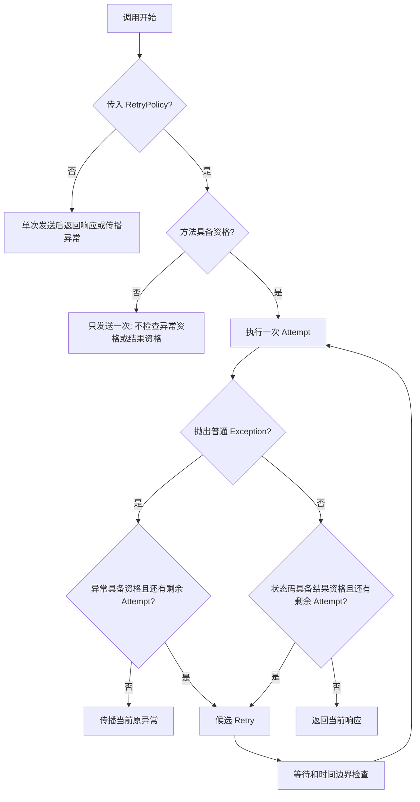

# 第 01 课：Retry 不是“失败就再试”

## 本课在事实链中的位置

本课是整套事实链的起点。后续课程会继续讨论 Runner 身份、Runtime Hooks、Aggregator、Metrics 和 Flaky，但这些内容都建立在一个更早的问题上：一次 API 调用没有得到理想结果时，框架为什么有资格继续发送，或者为什么必须停止。

本课没有上一课可承接。它先建立 Retry 的基本边界：框架不是遇到任何失败都重新发送，而是按顺序判断显式启用、方法资格、异常资格或结果资格，并且受 `max_attempts` 次数上限限制。

本课仍沿用全书统一的异步 LLM 任务案例：客户端先提交媒体生成任务，拿到 `task_id` 后通过 GET 查询任务状态。本课为了隔离 Retry 资格机制，主要使用同一业务链中的轮询 GET 请求作例子；创建任务的 POST 只在结尾作为下一课问题引出。

## 核心问题

一次请求失败后，框架凭什么判断“可以再发一次”，又在什么条件下必须停止？

## 从一个具体现象开始

先故意不用当前框架的资格规则，写一个最朴素的重试循环：

```python
last_error = None

for _ in range(3):
    try:
        response = send_once()
    except Exception as error:
        last_error = error
        continue

    if response.status_code == 200:
        return response

raise last_error or AssertionError("request never returned HTTP 200")
```

这个循环看起来只是“没有拿到 HTTP 200 就再发一次”，但它会把不同性质的失败混成同一件事：

| 场景 | 已发生的事实 | 朴素循环的决定 | 错误在哪里 |
| --- | --- | --- | --- |
| POST 创建媒体任务时发生 Timeout | 服务端可能已经创建了任务，只是响应没有回到客户端 | 继续发送同一个 POST | 没有先判断方法资格；POST 是否能安全重发还依赖服务端幂等契约 |
| GET 查询任务状态时发生 `requests.exceptions.SSLError` | 这是当前策略明确排除的异常类型 | 继续发送同一个 GET | 没有判断异常资格，可能掩盖证书或 TLS 配置问题 |
| GET 查询任务状态返回 HTTP 400 | 服务端已经给出当前请求无效的响应 | 继续发送同一个 GET | 没有判断结果资格，把不可恢复的响应当成临时失败 |

这三个错误不是同一种错误。第一个问题来自“这个方法能不能重发”，第二个问题来自“这个异常值不值得重试”，第三个问题来自“这个响应状态码是否代表可恢复”。因此，本课要从朴素循环收束到三类资格判断。

再看同一个异步 LLM 任务链中的一次轮询请求。创建任务已经完成，客户端正在查询 `task-001` 的状态，并显式传入 Retry 策略：

```python
response = client.poll_get(
    "/v1/media/tasks/task-001",
    polling_policy=PollingPolicy(),
    retry_policy=RetryPolicy(max_attempts=3),
)
```

本课暂不展开 Polling 状态机，只观察这一次 GET 状态查询内部可能发生的 Retry。假设它经历了三次发送尝试：

```text
T0：Attempt 1，GET /v1/media/tasks/task-001 抛出 requests.Timeout
T1：Attempt 2，GET /v1/media/tasks/task-001 返回 HTTP 503
T2：Attempt 3，GET /v1/media/tasks/task-001 返回 HTTP 200
```

为了先看清资格判断，这里假定等待和时间预算都允许继续，时间边界留到第 03 课。框架在这条时间线上的判断是：

| 时间 | 已发生的事实 | 本次判断 | 决策 |
| --- | --- | --- | --- |
| T0 | 调用者传入 `RetryPolicy` | Retry 已显式启用 | 进入 Retry 编排 |
| T0 | 请求方法是 GET | GET 默认具备方法资格 | 可以在失败后继续判断本次结果 |
| T0 | Attempt 1 抛出 `requests.Timeout` | Timeout 默认具备异常资格，而且还有尝试机会 | 形成候选 Retry |
| T1 | Attempt 2 返回 HTTP 503 | 503 默认具备结果资格，而且还有尝试机会 | 形成候选 Retry |
| T2 | Attempt 3 返回 HTTP 200 | 200 不在默认可重试状态码中 | 停止并返回 200 |

这条时间线同时展示了 HTTP 层和业务层的边界：

| 时间 | HTTP 层 | 业务层 |
| --- | --- | --- |
| T0 | GET 查询任务状态时发生 Timeout | 是否查询到任务状态未知 |
| T1 | GET 返回 HTTP 503 | 服务暂时无法给出可用查询结果 |
| T2 | GET 返回 HTTP 200 | 只说明本次查询拿到响应；响应体里的业务状态由 Polling 判断 |

HTTP 200 不等于异步任务已经完成。JSON 里如果是 `{"status": "running"}`，当前默认轮询策略会把这个原始状态值归入等待态；那是 Polling 的继续条件，不是重新提交当前 GET 的 Retry 条件。

## 为什么原有解释不够

“失败就再试”这个解释混在一起的问题太多。

第一，失败可能发生在不同层次。`requests.Timeout` 是异常路径，HTTP 503 是响应路径，HTTP 200 携带 `{"status": "running"}` 是业务状态路径。三者不能用同一个判断替代。

第二，不同 HTTP 方法的重发风险不同。GET 状态查询通常只是读取已有任务状态；POST 创建任务可能让服务端新建对象、扣费或触发异步作业。默认策略不能把它们当成同一种动作。

第三，Retry 是恢复机会，不是成功保证。即使每一次失败都具备资格，`max_attempts` 用完后仍然必须停止，最后的 503 仍然是 503，最后的 Timeout 仍然是 Timeout。

因此，本课需要把一次“失败”拆成三个问题：

```text
这个方法允许因失败而重发吗？
本次异常允许因失败而重发吗？
本次响应结果允许因失败而重发吗？
```

## 核心概念

本课真正新增的核心概念是三类资格。为了描述时间线，先约定两个辅助术语。

`Attempt`（发送尝试）是框架发起的一次 HTTP 发送。在 Retry 路径中，它对应 `RetryExecutor` 调用一次 `send_once(context)`，通常会进入一次 `requests.Session.request()`。

`Retry`（重试）是前一个 Attempt 结束后，框架决定创建下一次 Attempt 的行为。首次发送是 Attempt，但不是 Retry。

```text
一次轮询 GET 请求
├─ Attempt 1：首次发送
├─ Attempt 2：第一次 Retry 产生的发送尝试
└─ Attempt 3：第二次 Retry 产生的发送尝试
```

`max_attempts=3` 表示最多三个 Attempt，也就是首次发送加最多两次 Retry。它不是“首次发送后还能重试三次”。当前策略要求 `max_attempts >= 1`，因为一次正常调用至少包含首次 Attempt。

**方法资格（method eligibility）**：当前 HTTP 方法是否允许因失败而再次发送。默认允许 GET 和 HEAD。默认 POST 不具备资格，除非满足额外客户端授权条件；这些 POST 条件会在第 02 课展开。

**异常资格（exception eligibility）**：一次发送抛出普通 `Exception` 后，异常类型是否允许产生下一次 Attempt。默认包括 `requests.ConnectionError` 和 `requests.Timeout`，但明确排除 `requests.exceptions.SSLError` 和 `requests.exceptions.TooManyRedirects`。

**结果资格（result eligibility）**：一次发送返回 `requests.Response` 后，响应结果是否允许产生下一次 Attempt。当前实现中的结果资格具体表现为响应资格（response eligibility）：只检查 `response.status_code` 是否属于 `retry_statuses`，默认集合是 `{429, 500, 502, 503, 504}`。它不读取响应体中的业务状态。

三类资格的关系如下：



这张图里，“候选 Retry”还不是下一次发送已经发生。后续等待、`max_elapsed` 或 Polling deadline 仍可能阻止它。时间规则会在第 03 课和第 04 课展开。

## 完整运行过程

把一次启用 Retry 的 GET 状态查询展开，执行顺序是：

```text
输入：method=GET，path=/v1/media/tasks/task-001，retry_policy=RetryPolicy(max_attempts=3)
```

第一步，入口判断是否显式启用 Retry。调用者没有传 `retry_policy` 时，`BaseRequest` 只执行一次发送。调用者传入非空 `retry_policy` 时，才进入 `RetryExecutor`。

第二步，执行器先判断方法资格。GET 命中默认 `allowed_methods`，所以可以进入 Retry 循环。若方法是默认 POST 且没有额外授权，执行器会只发送一次，不再进入异常资格或结果资格判断。

第三步，执行一次 Attempt。这个 Attempt 只有两种互斥结果：

```text
send_once(context)
├─ 抛出普通 Exception    → 异常路径
└─ 返回 requests.Response → 响应路径
```

第四步，异常路径检查异常资格。Timeout 默认具备资格；`ValueError`、`SSLError` 或 `TooManyRedirects` 不具备默认资格。不具备资格或次数已经耗尽时，框架传播当前原异常。

第五步，响应路径检查结果资格。当前实现只看 HTTP 状态码。503 命中默认 `retry_statuses`，400 和 404 不命中，200 也不命中。不具备资格或次数已经耗尽时，框架返回当前响应。

第六步，只有“方法资格已经通过、本次异常或响应具备资格、仍有剩余 Attempt”同时成立时，当前结果才成为候选 Retry。候选 Retry 之后还要经过等待和时间边界检查，才能真正进入下一次 Attempt。

可以把本课资格规则写成：

```text
候选 Retry
= 显式启用 Retry
  且方法具备资格
  且本次结果具备资格
  且 attempt_index < max_attempts
```

其中“本次结果具备资格”根据路径二选一：异常路径检查异常类型，响应路径检查 HTTP 状态码。

## 正常路径

正常路径使用同一个轮询 GET 请求，并假设第二次请求恢复：

```python
client.poll_get(
    "/v1/media/tasks/task-001",
    polling_policy=PollingPolicy(),
    retry_policy=RetryPolicy(max_attempts=3, base_delay=0.2, jitter=False),
)
```

完整过程如下：

| 步骤 | 输入事实 | 框架判断 | 输出或状态变化 |
| --- | --- | --- | --- |
| 1 | 调用者传入 `retry_policy` | Retry 显式启用 | 进入 `_send_with_retry()` |
| 2 | 方法为 GET | GET 在默认 `allowed_methods` 中 | 进入 Retry 循环 |
| 3 | Attempt 1 返回 HTTP 503 | 503 在默认 `retry_statuses` 中，且 `1 < 3` | 记录一次响应型重试原因，形成候选 Retry |
| 4 | 等待完成 | 本课假定时间边界允许 | 进入 Attempt 2 |
| 5 | Attempt 2 返回 HTTP 200 | 200 不在默认 `retry_statuses` 中 | 停止 Retry，返回当前 200 响应 |

这条路径能够推出的结论是：503 可以给 GET 一次恢复机会，第二次 HTTP 请求返回 200 后，RetryExecutor 停止发送并交还响应。

它不能推出“异步任务已经成功”。如果 200 响应体是：

```json
{"status": "running", "task_id": "task-001"}
```

那么业务层仍然处在等待态。继续查询由 Polling 状态机决定，不由 Retry 把这一次 GET 当作失败重新发送。

## 复杂路径

复杂路径每次只增加一个变量，观察停止位置怎样变化。

| 对比项 | 正常路径 | 复杂路径 A：方法资格不满足 |
| --- | --- | --- |
| 输入 | GET 查询任务状态，传入 `RetryPolicy` | POST 创建任务，传入 `RetryPolicy`，但没有 `allow_post=True`，也没有 `Idempotency-Key` |
| 分叉位置 | GET 通过方法资格 | POST 默认不通过方法资格 |
| 后续判断 | 可以继续判断异常资格或结果资格 | 不进入 Retry 循环，不检查异常资格或结果资格 |
| 最终事实 | 503 可形成候选 Retry | 即使返回 503，也只返回当前 503 |

方法不具备资格不代表首次请求被拒绝。它的含义是：框架仍可发送第一次请求，但不会因为这次结果创建第二个 Attempt。

| 对比项 | 正常路径 | 复杂路径 B：异常资格不满足 |
| --- | --- | --- |
| 输入 | GET 抛出 `requests.Timeout` | GET 抛出 `ValueError` |
| 分叉位置 | Timeout 命中默认 `retry_exceptions` | `ValueError` 不在默认可重试异常集合中 |
| 停止方式 | 有剩余 Attempt 时形成候选 Retry | 不创建 Attempt 2，传播原 `ValueError` |
| 最终事实 | 可能恢复为后续响应 | 程序错误原样暴露 |

异常路径停止时传播的是当前原异常。框架不会把不可重试异常包装成成功响应。

| 对比项 | 正常路径 | 复杂路径 C：结果资格不满足 |
| --- | --- | --- |
| 输入 | GET 返回 HTTP 503 | GET 返回 HTTP 400 |
| 分叉位置 | 503 命中默认 `retry_statuses` | 400 不在默认 `retry_statuses` 中 |
| 停止方式 | 有剩余 Attempt 时形成候选 Retry | 返回当前 400 响应 |
| 最终事实 | 可能恢复为后续响应 | 当前响应直接交给调用者 |

结果资格只看 HTTP 状态码。响应体中的业务字段不是本课 Retry 结果资格的一部分。

| 对比项 | 正常路径 | 复杂路径 D：次数耗尽 |
| --- | --- | --- |
| 输入 | `max_attempts=3`，第 2 次返回 200 | `max_attempts=3`，三次都返回 503 |
| 分叉位置 | Attempt 2 的 200 不具备结果资格，停止 | Attempt 3 虽然仍命中结果资格，但已无剩余 Attempt |
| 停止方式 | 返回第 2 次 200 | 返回第 3 次 503 |
| 最终事实 | Retry 停止，不代表业务完成 | Retry 停止，也不代表调用成功 |

次数边界同样适用于异常路径：如果 `max_attempts=1` 且首次 Attempt 抛出 Timeout，Timeout 虽然默认具备异常资格，但已经没有下一次机会，框架会传播首次 Attempt 的原 Timeout。

## 对应的框架实现

源码只在概念模型之后出现。下面的片段用于对应本课的三个关键分支，省略了日志、Runtime 观察和时间预算细节；这些省略不改变资格判断顺序。

第一段是入口分支。`BaseRequest.request()` 先取出 `retry_policy`，只有它非空时才进入 `_send_with_retry()`：

```python
retry_policy = kwargs.pop("retry_policy", None)

if retry_policy is not None:
    response = self._send_with_retry(
        method,
        path,
        retry_policy,
        **kwargs,
    )
else:
    context = self._build_request_context(method, path, **kwargs)
    response = self._send_single_group(context)
```

这段代码的输入是调用者传入的 `method`、`path`、请求参数和可选 `retry_policy`。输出是两条执行路径：没有策略时只构造一次请求上下文并发送一次；有策略时把发送交给 Retry 编排。这里能够证明框架具备 Retry 入口，但不能证明某个业务调用一定传入了策略。

第二段是方法资格函数。它先统一方法名大小写，再检查默认或自定义允许方法；非 POST 且不在集合中直接失败；POST 需要 `allow_post=True` 或请求头中存在 `Idempotency-Key`：

```python
def is_method_retry_allowed(method, kwargs, policy):
    normalized_method = method.upper()
    if normalized_method in {name.upper() for name in policy.allowed_methods}:
        return True

    if normalized_method != "POST":
        return False

    if policy.allow_post:
        return True

    headers = kwargs.get("headers") or {}
    header_names = {str(name).lower() for name in dict(headers).keys()}
    return policy.idempotency_header.lower() in header_names
```

这段代码的输入是 HTTP 方法、请求参数和 Retry 策略。输出是布尔值：是否允许因失败创建后续 Attempt。它只判断客户端资格，不证明服务端会按 `Idempotency-Key` 去重。

第三段是执行器主干。`RetryExecutor.execute()` 在循环前先判断方法资格；进入循环后，异常路径和响应路径分别判断：

```python
if not is_method_retry_allowed(method, request_kwargs, policy):
    context = context_factory(1)
    return send_once(context)

for attempt_index in range(1, policy.max_attempts + 1):
    try:
        response = send_once(context_factory(attempt_index))
    except Exception as error:
        if (
            attempt_index >= policy.max_attempts
            or not should_retry_exception(error, policy)
        ):
            raise
        continue

    if (
        attempt_index >= policy.max_attempts
        or not should_retry_response(response, policy)
    ):
        return response
```

这里的关键输入是 `method`、合并后的请求参数、`RetryPolicy`、`context_factory` 和 `send_once`。`send_once` 是一次真实发送尝试。异常路径停止时使用 `raise`，所以当前原异常继续传播；响应路径停止时使用 `return response`，所以当前响应被返回。循环范围 `range(1, policy.max_attempts + 1)` 说明 Attempt 编号从 1 开始，最多运行到 `max_attempts`。

本课涉及的策略字段来自 `RetryPolicy`：

```python
max_attempts = 3
allowed_methods = frozenset({"GET", "HEAD"})
retry_statuses = frozenset({429, 500, 502, 503, 504})
retry_exceptions = (
    requests.ConnectionError,
    requests.Timeout,
)
allow_post = False
idempotency_header = "Idempotency-Key"
```

对应函数级依据如下：

| 结论 | 对应实现 |
| --- | --- |
| 是否进入 Retry 由调用者是否传入 `retry_policy` 决定 | `BaseRequest.request()`、`BaseRequest._send_with_retry()` |
| 轮询 GET 可以透传 `retry_policy` | `BaseRequest.poll_get()`、`BaseRequest._request_without_attach()`、`BaseRequest._poll_get_with_policy()` |
| 方法资格在循环前判断 | `RetryExecutor.execute()` 调用 `is_method_retry_allowed()` 的分支 |
| 异常资格只看异常类型和排除项 | `should_retry_exception()` |
| 结果资格当前只看 HTTP 状态码 | `should_retry_response()` |
| POST 客户端资格可来自 `allow_post=True` 或 `Idempotency-Key` | `is_method_retry_allowed()` 的 POST 分支 |

媒体生成封装还说明了“框架存在能力”和“业务调用已经启用能力”之间的边界。默认创建 POST 只发送创建请求；轮询函数才接收并透传 `retry_policy`；组合封装先创建任务，再把同一个 `retry_policy` 传给轮询调用：

```python
def create_media_generation(self, request_client, payload):
    return request_client.post(self.media_generations_path, json=payload)

def poll_media_generation_result(
    self,
    request_client,
    task_id,
    *,
    polling_policy=DEFAULT_MEDIA_POLLING_POLICY,
    retry_policy=None,
):
    return request_client.poll_get(
        self.media_task_path_template.format(task_id=task_id),
        polling_policy=polling_policy,
        retry_policy=retry_policy,
    )

def create_and_poll_media_generation(
    self,
    request_client,
    payload,
    *,
    retry_policy=None,
    create=None,
    extract_task_id=None,
    poll=None,
):
    create_call = create or self.create_media_generation
    extract_call = extract_task_id or self.extract_task_id
    poll_call = poll or self.poll_media_generation_result
    create_response = create_call(request_client, payload)
    task_id = extract_call(create_response)
    return poll_call(
        request_client,
        task_id,
        retry_policy=retry_policy,
    )
```

这段代码的输入是媒体创建载荷、任务标识和可选 `retry_policy`。状态变化分成两段：创建阶段产生 `task_id`，轮询阶段使用 `task_id` 查询业务状态。默认创建 POST 的函数签名没有接收 `retry_policy`，组合封装也没有把 `retry_policy` 传给 `create_call`；因此它不能证明创建 POST 已经进入 Retry。轮询函数明确把 `retry_policy` 传给 `poll_get()`，所以只能证明轮询 GET 在调用者提供策略时具备进入 Retry 的业务入口。

测试覆盖能够辅助确认这些预期，例如默认请求不重试、GET 的 503 和 Timeout 可重试、POST 无幂等头只发送一次、POST 带 `Idempotency-Key` 或 `allow_post=True` 时可进入客户端重试资格。测试证明覆盖和预期，不替代源码对当前行为的证明。

## 能够保证什么

当前实现能够保证：未显式传入 `retry_policy` 时，请求走单次发送路径，不会因为默认 `RetryPolicy` 字段存在而自动重发。

当前实现能够保证：进入 Retry 编排后，方法资格先于异常资格和结果资格判断。方法资格不满足时，只发送一次，不会继续检查本次异常或响应是否可重试。

当前实现能够保证：默认只有 GET 和 HEAD 具备方法资格；默认 POST 需要 `allow_post=True` 或请求头存在 `Idempotency-Key` 才具备客户端重试资格。

当前实现能够保证：异常路径和响应路径分开处理。异常路径根据异常类型和次数上限决定是否继续；响应路径根据 HTTP 状态码和次数上限决定是否继续。

当前实现能够保证：`RetryExecutor` 创建的 Attempt 数不超过 `max_attempts`。因结果无资格或次数耗尽而停止时，响应路径返回当前响应，异常路径传播当前原异常。

## 保证成立的前提

这些保证成立的前提是：调用必须经过 `BaseRequest` 的请求入口，或者经过 `poll_get()` 内部使用的请求入口，并且调用者确实传入非空 `retry_policy`。框架存在 `RetryPolicy` 类，不等于每个业务调用都启用 Retry。

这些保证成立的前提是：方法、请求参数和合并后的 headers 被正确传递给 `RetryExecutor`。POST 的 `Idempotency-Key` 判断依赖请求参数中的 header 名称；框架按 header 名称判断客户端资格，不检查 header 值是否能被外部服务正确理解。

这些保证成立的前提是：异常属于执行器捕获的普通 `Exception` 路径。`KeyboardInterrupt`、`SystemExit` 等不属于本课异常资格路径。

这些保证成立的前提是：本课讨论的是资格和次数边界。`max_elapsed`、等待时间和可选 deadline 也会影响是否进入下一次 Attempt，但它们的完整时间推导将在第 03 课展开。

## 不能保证什么

Retry 不能保证下一次 Attempt 一定成功。它只提供受限的恢复机会，不会把最终 503 改写成成功响应，也不会把最终 Timeout 改写成成功结果。

Retry 不能保证所有 5xx、所有网络错误或 JSON 中的业务失败都会重试。当前默认结果资格只包含配置集合内的状态码；当前默认异常资格只包含配置集合内的异常类型，并排除 SSL 错误和重定向过多；响应体业务状态属于 Polling 或业务语义判断。

Retry 不能保证 POST 重发一定安全。`allow_post=True` 或 `Idempotency-Key` 只能让客户端认为 POST 具备重试资格，不能证明服务端已经兑现幂等契约，也不能证明服务端不会重复创建任务、重复计费或重复执行副作用。

Retry 不能保证代码中存在能力就等于业务模块已经启用。当前媒体生成封装中，创建任务的 POST 没有自动接收并透传同一个 `retry_policy`；轮询 GET 可以在调用者提供策略时进入 Retry。这个区别必须保留，不能把框架能力写成所有业务调用的真实行为。

Retry 不能仅凭本课规则推出多次 Attempt 的严格总时长。次数上限、单次 timeout、退避等待、`max_elapsed` 和 Polling deadline 是不同边界，后续课程会分别展开。

## 与下一课的关系

本课得到的结论是：

```text
显式启用 Retry
→ 方法资格
→ 异常资格或结果资格
→ 剩余 Attempt
→ 候选 Retry
→ 再接受时间规则约束
```

这解释了为什么 Retry 不是“失败就再试”：任何一个资格不满足，或者次数已经耗尽，框架都必须停止。

接下来把调用换成异步 LLM 任务的创建 POST：

```text
T0：客户端发送 POST /v1/media/generations
T1：服务端已经创建 task-101
T2：响应在返回途中丢失，客户端得到 Timeout
T3：客户端策略允许 POST Retry，Timeout 也具备异常资格
T4：客户端再次发送 POST /v1/media/generations
T5：服务端又创建 task-102
```

这条时间线里，客户端的 Retry 资格判断可能完全符合当前框架规则，但一次业务意图仍可能产生两个服务端任务。下一课只解决这个自然问题：POST 怎样获得客户端重试资格，以及 `Idempotency-Key` 为什么仍然需要服务端幂等契约配合。
