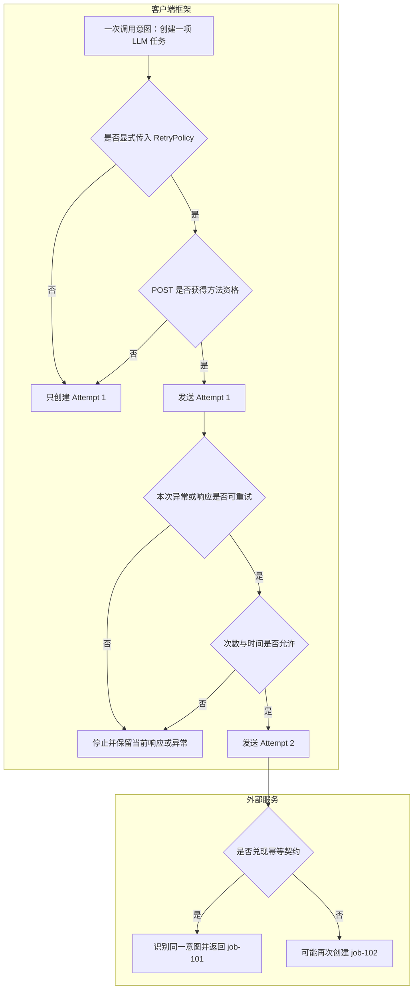

# 第 2 课：POST 重试资格与服务端幂等

## 本课在事实链中的位置

第 1 课已经建立了一条基本判断链：只有显式传入 `RetryPolicy`，请求方法、本次结果、剩余次数以及时间条件又都允许时，前一个 Attempt 才可能产生下一个 Attempt。

本课只把其中的“方法资格”向前推进一步：

> 当请求方法是 POST 时，客户端凭什么允许再次发送？允许再次发送以后，为什么仍然可能创建两个任务？

我们继续使用同一个异步 LLM 场景。调用者只想创建一个生成任务，请求为 `POST /v1/jobs`。一次调用意图可以有多个 Attempt，但调用者通常只希望服务端产生一个任务、一次推理和一份计费。这里所说的“副作用”，就是请求对服务端业务状态造成的可观察改变，例如创建任务、扣减额度或发送消息。

本课不讨论等待多久、总 deadline 如何限制 Retry；这些时间问题留给第 3 课。本课也不把 Polling 混进来：重新提交 `POST /v1/jobs` 是再次尝试创建任务，查询已经创建的任务则是另一种请求。

---

## 核心问题

先给出本课最重要的结论：

> `allowed_methods`、`allow_post=True` 和 `Idempotency-Key` 都只能让 POST 通过客户端的方法资格检查。真正避免重复创建、重复执行或重复计费，需要外部服务兑现幂等契约。

这句话包含两层彼此独立的承诺：

| 承诺层次 | 谁作出决定 | 回答的问题 |
| --- | --- | --- |
| 客户端重试资格 | 本框架 | 失败后是否允许再发送一次 POST |
| 服务端幂等效果 | 接收请求的外部服务 | 收到同一业务意图的重复请求后，是否只产生一次约定效果 |

客户端可以决定“发不发第二次”，却无法仅凭一个请求头决定服务端“执行几次”。反过来，即使服务端支持幂等，客户端没有显式启用 Retry，也不会因为请求带了幂等键就自动发送第二次。

---

## 从一个具体现象开始

假设调用者的唯一目标是创建一个图片生成任务：

```text
调用意图：为订单 42 创建一次封面图生成任务
请求方法：POST
请求路径：/v1/jobs
请求体：{"order_id": 42, "prompt": "生成一张山谷封面图"}
```

客户端发出请求后发生了下面的事情：

```text
T0  客户端发出 Attempt 1：POST /v1/jobs
T1  服务端接收请求并创建 job-101
T2  服务端提交了业务结果，可能也已经开始推理或计费
T3  成功响应在返回途中丢失
T4  客户端只观察到 requests.Timeout
T5  客户端发出 Attempt 2：POST /v1/jobs
T6  服务端把它当成新请求，又创建 job-102
T7  客户端收到 job-102 的成功响应
```

最终数量不是“看到一次成功，所以只执行一次”：

| 事实 | 数量或结果 |
| --- | --- |
| 调用意图 | 1 个 |
| HTTP Attempt | 2 次 |
| 服务端创建动作 | 2 次 |
| 实际任务 | `job-101`、`job-102` |
| 客户端收到的成功响应 | 1 个，只包含 `job-102` |

关键转折发生在 T3 到 T4。客户端没有收到响应，只能知道“没有在预期方式下拿到结果”，不能由此推出“服务端没有执行”。对有副作用的 POST 来说，Timeout 表示结果未知，而不等于执行失败。

如果客户端把 Timeout 直接理解成“任务肯定没创建”，第二次发送就可能把一次通信不确定性变成两份真实业务副作用。

---

## 为什么原有解释不够

第 1 课已经说明，默认情况下 GET、HEAD 具有方法资格，POST 则需要额外授权。但仅知道“POST 默认不重试”还不能处理真实调用中的两个问题。

第一个问题是，有些 POST 确实需要恢复机会。例如服务端提供了可靠的幂等协议，第一次响应丢失时，再发一次可以取回第一次创建的 `job-101`。如果一律禁止 POST Retry，调用者只能面对一个结果未知的请求。

第二个问题是，“允许 POST Retry”并不等于“POST 已经安全”。框架能够检查方法、策略和请求头，却看不到外部服务内部是否已经完成以下动作：

- 是否原子记录了幂等键；
- 是否把幂等键与同一请求内容绑定；
- 是否在重复请求到达时返回第一次的任务；
- 是否避免再次调用模型或再次计费；
- 是否仍处于服务端规定的去重有效期。

因此必须把推理拆开：

```text
本次 POST 是否可以进入客户端 Retry 循环？
                    ↓ 这是框架能决定的

重复 POST 是否只产生一次业务效果？
                    ↓ 这是外部服务契约决定的
```

把这两问合成一句“带幂等键的 POST 是幂等的”，会掩盖系统边界，也无法解释前面的 `job-101`、`job-102` 事故。

---

## 核心概念

本课只新增三个概念，并继续沿用第 1 课的调用意图、Attempt 和 Retry。

### 1. POST 重试资格

POST 重试资格是客户端的一道方法门禁。它只回答：当前 POST 在某个 Attempt 失败后，能否继续接受异常资格、响应资格、次数和时间条件的判断。

获得方法资格不会立刻产生 Attempt 2。例如：

```text
POST 获得方法资格
→ Attempt 1 返回 HTTP 400
→ 400 不在默认 retry_statuses 中
→ 不产生 Attempt 2
```

所以“POST 获准”只是必要条件之一，不是 Retry 已经发生，更不是调用最终成功。

### 2. 幂等键

幂等键是调用者为一次业务意图选择的稳定标识。例如：

```http
Idempotency-Key: create-cover-order-42
```

同一个调用意图产生的多个 Attempt 应复用同一个键；新的调用意图应使用新键。在以该 Header 值作为去重标识的契约中，若 Attempt 1 使用 `key-A`，Attempt 2 改成 `key-B`，服务端通常会把它们视为两个请求。外部服务如果还使用订单号等业务自然键去重，则要以它公布的实际契约为准。

在本框架的本地判断中，幂等键首先是 POST 获得方法资格的一种信号。这个信号是否能在服务端产生去重效果，取决于外部协议，而不是 Header 字符串本身。

### 3. 服务端幂等契约

服务端幂等契约约定：同一作用域内，相同业务意图被重复提交时，服务端如何识别重复、处理并发、约束请求内容，并返回已有结果。

这里的“幂等”不是网络只发送一次。网络上仍可能出现两个 Attempt：

```text
2 次 HTTP Attempt
≠ 必然执行 2 份业务副作用
```

当服务端真正兑现契约时，两个 Attempt 可以只对应一个 `job-101`。这通常被描述为“效果只发生一次”，而不是“请求只到达一次”。

---

## 完整运行过程

先看一张完整关系图。图中的“客户端框架”和“外部服务”两个区域，明确分开了双方各自能够决定的事实。



图中每一段承担不同职责：

1. `RetryPolicy` 决定调用是否进入 Retry 编排。没有策略时，即使存在 `Idempotency-Key`，也只走单次发送路径。
2. POST 方法资格决定它能否进入多次 Attempt 的循环。当前框架有三条相互独立的放行路径。
3. 方法获准后，Timeout、HTTP 503 等结果还要通过各自的资格判断，并受到次数和时间边界约束。
4. Attempt 2 真正发出后，客户端已经完成了自己的职责。服务端是否把它关联到 `job-101`，不是客户端门禁能够证明的事实。

### POST 获得方法资格的三条路径

当前判断顺序可以写成下面这棵树：

```text
请求方法是否位于 allowed_methods？
├─ 是：方法资格通过
└─ 否
   ├─ 方法不是 POST：方法资格不通过
   └─ 方法是 POST
      ├─ allow_post=True：方法资格通过
      └─ 合并后的 Header 名中存在 idempotency_header：方法资格通过
```

三条路径的含义不同，但结果都是“通过客户端方法门禁”：

| 放行路径 | 示例 | 授权范围 | 能否证明服务端幂等 |
| --- | --- | --- | --- |
| `allowed_methods` 包含 POST | `{"GET", "HEAD", "POST"}` | 使用这份策略的 POST | 不能 |
| `allow_post=True` | 专门打开 POST 开关 | 使用这份策略的 POST | 不能 |
| 存在指定 Header 名 | 默认是 `Idempotency-Key` | 携带该 Header 的请求 | 不能 |

需要特别注意，“三条路径”不是要求同时满足三项，而是任意一条即可通过方法检查。把 POST 放入 `allowed_methods` 后，不会再要求 `allow_post=True` 或幂等键；`allow_post=True` 也会绕过幂等键要求。

---

## 正常路径

这里把“正常路径”定义为：客户端获得 Retry 资格，同时外部服务确实兑现双方事先约定的幂等契约。外部契约是为了解释机制而设定的明确前提，不代表当前仓库实现了服务端。

### 输入

调用者为“订单 42 创建封面图任务”生成一次稳定的键，并显式启用 Retry：

```python
policy = RetryPolicy(max_attempts=3)

response = client.post(
    "/v1/jobs",
    json={"order_id": 42, "prompt": "生成一张山谷封面图"},
    headers={"Idempotency-Key": "create-cover-order-42"},
    retry_policy=policy,
)
```

为了让过程可推导，假定外部服务公布并兑现以下契约：

```text
作用域：tenant + endpoint + Idempotency-Key
内容约束：同一个 key 必须对应同一个请求体指纹
首次请求：原子占位，执行业务并保存 key → 结果
重复请求：不创建新任务，等待或回放首次结果
冲突请求：相同 key 配不同请求体时明确拒绝
有效期：覆盖客户端可能发生 Retry 的整个时间窗口
```

### 判断与状态变化

```text
Attempt 1
├─ 请求方法：POST
├─ 合并后的 Header 名含 Idempotency-Key
├─ 客户端方法资格：通过
├─ 服务端原子记录 create-cover-order-42 → processing
├─ 服务端创建 job-101
├─ 服务端记录 create-cover-order-42 → job-101
└─ 响应丢失，客户端观察到 Timeout

Retry 决策
├─ Timeout 具备默认异常资格
├─ 尚有 Attempt 次数
├─ 假定时间条件允许
└─ 产生 Attempt 2

Attempt 2
├─ 仍使用 Idempotency-Key: create-cover-order-42
├─ 仍使用订单 42 的同一请求内容
├─ 服务端查到该 key 已对应 job-101
├─ 不再创建任务
└─ 返回 job-101 的约定结果
```

### 输出与结论

| 事实 | 结果 |
| --- | --- |
| 调用意图 | 1 个 |
| HTTP Attempt | 2 次 |
| 服务端接收 | 2 次 |
| 任务创建副作用 | 1 次 |
| 最终业务对象 | `job-101` |

因此，正常路径不是“Retry 保证只发一次”，而是：客户端可能重复发送，服务端利用稳定键把多个 Attempt 归并到同一业务意图。

即使在这条路径中，“返回完全相同的状态码和响应体”“只计费一次”也仍要写进外部契约后才成立。仅说服务端支持 `Idempotency-Key`，还不足以推出这些细节。

---

## 复杂路径

复杂路径用来说明：方法资格成立以后，安全性仍会因授权方式或跨端契约缺失而失败。

### 路径一：策略级直接放行 POST，但服务端按每次请求创建任务

输入策略如下：

```python
policy = RetryPolicy(allow_post=True, max_attempts=2)
```

请求没有幂等键。完整过程是：

```text
Attempt 1：POST /v1/jobs
→ allow_post=True，方法资格通过
→ 服务端创建 job-101
→ 响应丢失，客户端得到 Timeout
→ Timeout 具备异常资格，次数和时间允许

Attempt 2：POST /v1/jobs
→ 服务端无法用稳定键识别它属于原意图
→ 服务端创建 job-102
→ 客户端收到 job-102
```

`allow_post=True` 的真实含义是“调用者接受让 POST 进入 Retry 判断”，不是“服务端已经安全”。把 POST 放入 `allowed_methods` 会得到同类结果：它同样在客户端直接放行，不要求幂等键。

### 路径二：请求头存在，但服务端忽略它

输入看似比前一条更安全：

```http
Idempotency-Key: create-cover-order-42
```

但外部服务没有实现这个协议：

```text
Attempt 1：key 相同 → 服务端不读取 key → 创建 job-101
响应丢失
Attempt 2：key 相同 → 服务端仍不读取 key → 创建 job-102
```

在客户端看来，Header 名存在，因此 POST 获得了方法资格；在服务端看来，它只是一个被忽略的字符串。这正是“客户端资格”和“服务端幂等”不能互相替代的原因。

### 路径三：同一调用意图没有保持稳定的键或内容

即使服务端正确实现幂等，客户端若破坏契约也无法获得预期效果。

第一种破坏方式是每个 Attempt 使用新键：

```text
Attempt 1：Idempotency-Key: key-A → 创建 job-101
Attempt 2：Idempotency-Key: key-B → 创建 job-102
```

第二种破坏方式是同键不同内容：

```text
Attempt 1：key-A + payload-P
Attempt 2：key-A + payload-Q
```

这时可靠服务通常应拒绝冲突，而不是静默把 `payload-Q` 当成 `payload-P` 的重复。不过具体状态码和响应格式仍由外部协议定义，仓库不能替它作出承诺。

> 实现边界，首次阅读先记结论：客户端放行 POST 之后，仍要保证键稳定、请求内容可重放。下面的复制细节是在解释为什么框架不能替调用者证明这件事。

当前框架会为每个 Attempt 重新构建请求上下文，并尽力对请求参数做 `deepcopy`。这能让普通 JSON 字典在多次 Attempt 之间相互独立，却不是“线上字节完全相同”的证明：不能深拷贝的对象会退回原引用，文件流、生成器等一次性请求体也没有自动倒带保证；Middleware 或并发修改 Session Header 还可能改变后续 Attempt。

因此，请求内容可重放、幂等键跨 Attempt 稳定，也属于安全 Retry 的前提。

---

## 对应的框架实现

概念模型明确以后，再看源码职责。下面的代码只保留与本课有关的控制流；省略了字段校验、观察记录、等待计算等内容，但没有改变 POST 方法资格的判断顺序。

### 1. RetryPolicy 提供三项 POST 配置

`common/retry.py` 中与本课直接相关的默认值是：

```python
allowed_methods = frozenset({"GET", "HEAD"})
allow_post = False
idempotency_header = "Idempotency-Key"
```

因此，一个普通 POST 默认不具备方法资格。三种典型配置分别是：

```python
# 路径一：方法集合授权。这里保留默认 GET、HEAD，并加入 POST。
RetryPolicy(
    allowed_methods=frozenset({"GET", "HEAD", "POST"}),
)

# 路径二：专门打开 POST。
RetryPolicy(allow_post=True)

# 路径三：策略沿用默认值，请求本身携带指定 Header。
RetryPolicy()
```

第三种配置不能脱离请求单独生效。只有本次请求合并后的 Header 键集合中出现默认的 `Idempotency-Key`，POST 才通过这一分支。也可以用 `idempotency_header` 改成外部服务实际约定的名称。该配置不能是空字符串或纯空白；校验通过后，源码不会再替它去除首尾空格，因此应直接填写协议规定的准确 Header 名，不要依赖自动规范化。

### 2. 方法资格判断的真实顺序

`is_method_retry_allowed()` 的核心控制流如下：

```python
normalized_method = method.upper()

if normalized_method in {name.upper() for name in policy.allowed_methods}:
    return True

if normalized_method != "POST":
    return False

if policy.allow_post:
    return True

headers = kwargs.get("headers") or {}
header_names = {str(name).lower() for name in dict(headers).keys()}
return policy.idempotency_header.lower() in header_names
```

它准确解释了几个容易遗漏的边界：

- `allowed_methods` 优先判断。集合中已有 POST 时，不再要求后两项。
- `allow_post=True` 会在检查 Header 之前直接放行。
- Header 名转成小写比较，所以 `Idempotency-Key` 与 `idempotency-key` 的资格效果相同。
- 这里只检查 Header 名是否存在，不验证值是否非空、唯一或稳定。

最后一点尤其重要。按当前本地逻辑，下面两个 Header 都能使名称检查返回真：

```python
{"Idempotency-Key": ""}
{"Idempotency-Key": None}
```

这不表示它们是有效的服务端幂等键。`None` 还可能在 Requests 准备线上请求时被移除，于是出现“本地方法资格通过，线上并未携带该 Header”的边缘情况。课程中应把这理解为当前判断边界，而不是可依赖的用法。

### 3. 资格检查使用合并后的 Header

> 这一小节解释 Header 从哪里来、何时检查。主线仍然是：名称检查只能给出客户端资格，不能证明服务端幂等。

`BaseRequest` 构建请求上下文时，通常先复制 Session Header，再叠加本次请求 Header：

```python
merged = dict(self.session.headers)
merged.update(request_headers)
```

随后 `_send_with_retry()` 先构造一个 `first_context`，并用其中已经合并的 Header 判断方法资格。这个名字容易造成误解：`first_context` 是用于建立请求分组和取得资格判断快照的预构建上下文，本身不会作为 Attempt 1 发送。真实 Attempt 1 以及后面的每个 Attempt 都由 `context_factory` 再次构建，再次复制参数并合并当时的 Session Header。

这意味着幂等键既可能由本次 `headers={...}` 提供，也可能早已存在于 Session Header 中；也意味着资格快照与真实 Attempt 1 之间，如果 Session Header 被并发修改，仍可能出现差异。

Session 级幂等键会随共享该 Session 的多个 POST 发送；其中显式传入 `RetryPolicy` 的 POST 还会因此获得方法资格，所以授权范围比请求级键更宽。若多个不同调用意图错误复用同一个值，还会违反服务端契约。对创建类请求，更容易推理的做法是由调用意图生成请求级稳定键，并明确管理它的生命周期。

资格判断只在 Retry 循环开始前执行一次。真实 Attempt 1 和后续 Attempt 虽然都会重新构建上下文，但执行器不会逐轮重新检查 Header。于是，“资格快照中有这个 Header 名”不能证明每个线上 Attempt 都仍携带相同的有效值。

还有一条更具体的边缘路径。调用内部若设置 `_inherit_session_headers=False`，`_merge_headers()` 当前并不是直接丢弃 Session Header 名，而是先为它们建立值为 `None` 的占位项：

```python
if inherit_session_headers:
    merged = dict(self.session.headers)
else:
    merged = {str(name): None for name in self.session.headers}

merged.update(request_headers)
```

假设 Session 原本有 `Idempotency-Key`，而本次请求禁用继承且没有用请求级 Header 覆盖它，数据流会变成：

```text
Session 中存在 Idempotency-Key
→ 合并结果保留名称，但值变成 None
→ 本地资格检查只看名称，因此 POST 获准
→ Requests 准备线上请求时移除值为 None 的 Header
→ 线上 POST 可能没有 Idempotency-Key
```

这条路径再次说明，本地方法资格不等于线上请求携带有效键，更不等于服务端幂等。它是当前实现需要知道的边界，不应被当成使用技巧。

### 4. 方法资格不等于下一次 Attempt

`RetryExecutor.execute()` 先做方法判断：

```python
if not is_method_retry_allowed(method, request_kwargs, policy):
    return send_once(context_factory(1))
```

方法不获准时，框架不会因返回的响应或抛出的异常再创建 Attempt 2。在发送前 deadline 仍有剩余、上下文构建和 Middleware 没有提前失败时，当前请求至多执行一次框架级发送；若发送前已经失败，则也可能一次都没有发出。

方法获准后，执行器才进入最多 `max_attempts` 次的循环。每次结果还要检查异常或响应资格，并检查次数及时间条件。因此完整关系是：

```text
存在 Idempotency-Key Header 名
→ POST 方法资格通过
→ Attempt 1 的结果仍需具备资格
→ 次数与时间仍需允许
→ 才真正创建 Attempt 2
```

### 5. 框架能力不等于当前业务入口已启用

底层 `BaseRequest` 具备上述能力，但当前内置的图片、Chat 和异步媒体创建入口调用 POST 时没有传入 `retry_policy`。`create_and_poll_media_generation()` 接收的 `retry_policy` 会传给后续 GET Polling，不会传给创建阶段的 POST。

素材库中的部分创建操作会生成 `Idempotency-Key`，但这些调用同样没有同时传入 `retry_policy`。按照 `BaseRequest.request()` 的分支规则，它们仍走单次发送路径。

所以当前准确表述是：

```text
框架底层具备 POST Retry 方法门禁
≠ 所有业务 POST 已自动启用 Retry
≠ 携带 Header 就会自动启动 Retry
```

---

## 能够保证什么

在调用经过当前 `BaseRequest` 和 `RetryExecutor`、且没有被其他代码替换相关职责的前提下，框架能够保证以下客户端行为：

1. 没有传入 `retry_policy` 时，请求走非 Retry 的单次发送路径。仅有 `Idempotency-Key` 不会自动启动 Retry。
2. 传入策略但 POST 未满足三条放行路径中的任意一条时，不会因本次响应或异常产生 Attempt 2；发送前检查或 Middleware 仍可能使 Attempt 1 根本没有发出。
3. `allowed_methods` 包含 POST、`allow_post=True`、合并后的 Header 名包含 `idempotency_header`，任意一条都能让 POST 通过方法资格检查。
4. Header 名称匹配不区分大小写；当前判断只验证名称存在。
5. POST 通过方法资格后，仍须满足异常或响应资格、剩余次数和时间条件，才会创建下一个 Attempt。
6. Retry 循环最多创建 `max_attempts` 个框架级 Attempt。

这些保证的共同边界是“客户端怎样决定是否再次发送”。它们没有跨越网络去改变外部服务的执行业务方式。

---

## 保证成立的前提

如果目标不只是“允许再次发送”，而是“重复发送仍只产生一次约定效果”，至少需要以下前提共同成立。

### 客户端前提

- 调用者显式传入适合该请求的 `RetryPolicy`。
- 同一调用意图的所有 Attempt 使用同一个非空幂等键。
- 不同调用意图不复用同一个键。
- 每次 Attempt 的业务请求内容保持一致，且请求体可以安全重放。
- 幂等 Header 能经过客户端、中间件和网关，最终到达外部服务。

### 服务端契约前提

- 服务端确实识别双方约定的 Header 名。
- 服务端定义清楚键的作用域，例如租户、账户和接口，而不是让不同业务互相碰撞。
- 服务端把 key 与请求内容或其指纹绑定；同 key 不同内容会得到明确冲突结果。
- 首次请求与并发重复请求之间使用原子占位或等价机制，不能让两个请求同时通过“尚未处理”的判断。
- key 的保存时间覆盖客户端最晚可能发生的 Retry。
- 服务端定义重复请求是等待首次执行、返回当前状态，还是回放首次结果。
- 如果业务要求只推理一次或只计费一次，这些要求也必须成为服务端契约的一部分。

这些条件中的任意一项缺失，都不能仅凭客户端看到一个 Header 就推导“只产生一个任务”。

---

## 不能保证什么

当前仓库没有实现 `POST /v1/jobs` 背后的外部服务幂等存储，因此框架不能保证：

- 服务端一定识别 `Idempotency-Key`；
- 相同 key 一定只创建一个资源；
- 相同 key 一定返回相同状态码、响应头或响应体；
- key 在多长时间内有效；
- 相同 key 的并发请求会被原子合并；
- 相同 key 配不同请求体时一定拒绝；
- 网关或代理不会删除、改写该 Header；
- 两个 Attempt 一定发送完全相同的请求字节；
- 模型只推理一次，额度只扣减一次，账单只记录一次；
- Timeout 发生时，第一次请求一定失败或一定成功。

也不能把以下三句话互相替换：

```text
请求带有 Idempotency-Key
只说明：客户端看到了一个指定名称的 Header

POST 获得重试资格
只说明：它可以继续接受结果、次数和时间判断

服务端兑现幂等契约
才说明：重复请求会产生契约约定的一份业务效果
```

最后还有一个看似保守但很重要的边界：不允许 POST Retry 可以避免框架自动制造 Attempt 2，却无法消除 Attempt 1 的结果不确定性。若 `job-101` 已创建但响应丢失，客户端仍需要依靠业务查询、幂等查询接口或人工补偿机制确认结果；“没有重试”不等于“没有副作用”。

---

## 与下一课的关系

本课已经确定“能不能再次发送”的正确性边界：

```text
失败具备结果资格
+ POST 具备客户端方法资格
+ 次数与时间允许
→ 才可能出现下一次 Attempt

外部服务另行兑现幂等契约
→ 多个 Attempt 才可能只产生一次业务效果
```

但这里暂时把“时间允许”当成了一个整体条件。假设配置 `max_attempts=3`，实际时间可能是：

```text
Attempt 1 等待 8 秒
→ 退避 1 秒
→ Attempt 2 等待 8 秒
→ 退避 2 秒
→ Attempt 3 等待 8 秒
```

单次 `timeout=8` 并不能把整个调用限制在 8 秒内；次数上限也不能直接告诉我们总耗时。第 3 课将沿这条时间线区分单次 timeout、退避、`max_elapsed` 与整体 deadline，说明它们分别约束哪一段时间。

---

## 实现依据

本课的框架事实首先来自当前仓库中的以下实现：

- `common/retry.py`：`RetryPolicy` 与 `is_method_retry_allowed()`。
- `common/base_request.py`：Retry 的显式分支、Header 合并、每次 Attempt 的上下文构建与请求参数复制。
- `common/retry_executor.py`：方法资格检查及 Attempt 循环。
- `common/base_task.py`、`common/task_capabilities/media_generation.py`：内置 LLM 创建入口与 Polling 的策略传递边界。
- `module/material_library/task.py`：生成幂等键但未同时启用 Retry 的当前业务示例。

以下测试直接覆盖主要路径：

- `tests/test_retry_policy.py`：默认 POST 无键不获准、有默认幂等键获准、`allow_post=True` 获准。
- `tests/test_retry_executor.py`：POST 无键只走一次发送、有键或 `allow_post=True` 时可由 503 进入下一次 Attempt。
- `tests/test_base_request_retry_polling.py`：标准请求入口中的 POST 门禁，以及每个 Attempt 使用独立上下文。
- `tests/test_base_task.py`：内置创建入口没有传入 Retry 策略，以及创建后 Polling 的策略传递位置。

`allowed_methods` 显式包含 POST、Header 名大小写、自定义 Header 名、空值、Session Header 参与资格、禁用继承时的 `None` 占位，以及深拷贝失败回退原对象等细节，是根据上述当前源码直接推导的行为；现有这些测试并未逐项为它们提供回归覆盖。

服务端去重、键存储、并发原子性、响应回放和计费语义不在这些客户端源码中，因此本课只把它们写成外部契约前提，不写成仓库已经提供的能力。
