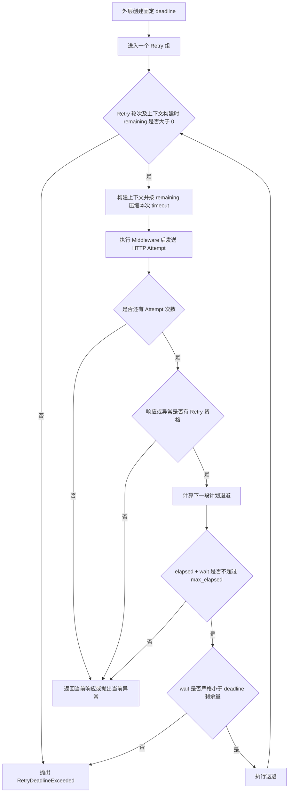

# 第 3 课：单次 Timeout 为什么限制不了总时长

## 本课在事实链中的位置

第 1 课说明了 Retry 不是“失败就再试”：方法、响应或异常、次数和时间条件都要允许，才可能产生下一个 Attempt。第 2 课又把 POST 的边界讲清楚：客户端允许重新发送，不等于服务端已经保证幂等。

现在，即使一个请求具备 Retry 资格，新的问题仍然存在：

> 如果每个请求都配置了 `timeout=8`，整个调用是否一定会在 8 秒内结束？

答案是否定的。一次调用可能包含多个 Attempt，而相邻 Attempt 之间还有退避等待。每个 Attempt 各自使用一次 timeout，这些时间会在外层时间线上累积。

本课只研究时间边界：单次 `timeout`、`max_attempts`、退避、`max_elapsed` 和外层 `deadline` 分别控制什么。第 4 课才会解释 HTTP 请求结束后，怎样根据任务状态决定继续查询还是结束 Polling。

---

## 核心问题

本课要完整回答一个具体矛盾：

> 为什么 `timeout=8` 的调用可能在 27 秒后才结束，而 `max_elapsed=10` 的 Retry 甚至可能运行到第 17 秒？框架怎样用固定 deadline 阻止时间边界继续向后移动？

先把结论压缩成四句话：

```text
timeout       限制一次 HTTP Attempt 的等待参数
max_attempts  限制一个 Retry 组最多产生多少个 Attempt
max_elapsed   判断下一段 Retry 退避是否还能进入局部预算
deadline      让外层流程中的所有 Attempt 共享同一个截止点
```

它们不是同一个限制的不同名字，也不能相互替代。

---

## 从一个具体现象开始

沿用异步 LLM 案例。上一课已经得到任务 `job-101`，现在客户端需要向 `GET /v1/jobs/job-101` 发起一次查询。为了先只观察 Retry，暂不解释响应体中的业务状态。

使用下面的确定性设定：

```python
policy = RetryPolicy(
    max_attempts=3,
    backoff="exponential",
    base_delay=1,
    jitter=False,
    max_elapsed=30,
)

response = client.get(
    "/v1/jobs/job-101",
    timeout=8,
    retry_policy=policy,
)
```

再假定每个 HTTP Attempt 都恰好等待 8 秒，然后抛出 `requests.Timeout`。这里的“恰好 8 秒”是为了让时间推导清楚，不是对真实网络调度精度的承诺。

```text
T0          Attempt 1 开始；新增第 1 条 HTTP 请求事实
T0 ～ T8    本次请求等待 8 秒，随后抛出 Timeout

T8 ～ T9    第一次退避：1 秒

T9          Attempt 2 开始；新增第 2 条 HTTP 请求事实
T9 ～ T17   本次请求再次等待 8 秒，随后抛出 Timeout

T17 ～ T19  第二次退避：2 秒

T19         Attempt 3 开始；新增第 3 条 HTTP 请求事实
T19 ～ T27  本次请求再次等待 8 秒，随后抛出 Timeout

T27         max_attempts 已耗尽，向调用者抛出最后一次 Timeout
```

时间结算为：

```text
三段请求等待：8 + 8 + 8 = 24 秒
两段退避等待：1 + 2 = 3 秒
整个 Retry 经过时间：24 + 3 = 27 秒
```

因此，`timeout=8` 没有失效。它被用于 Attempt 1，Attempt 2 和 Attempt 3 又分别获得了自己的请求超时参数。真正错误的是把“每次请求的 timeout”理解成“整个调用共用的倒计时”。

还要区分两个写法相近的事物：`timeout=8` 是传给一次请求的配置；`requests.Timeout` 是该次请求抛出的异常。前者参与限制等待，后者进入第 1 课所讲的异常资格判断。

---

## 为什么原有解释不够

只知道 `max_attempts=3`，最多只能推导“框架最多创建三个 Attempt”，不能推导总时长。原因是每个 Attempt 的实际耗时都未知，Attempt 之间的等待也不属于任何一次 HTTP 请求。

只知道 `timeout=8`，也不能推导整个 Retry 最多 8 秒。它没有覆盖：

- 前面已经完成的 Attempt；
- 两次 Attempt 之间的退避；
- Middleware 和响应解析等客户端处理；
- Retry 之外的上层等待；
- 服务端已经启动、仍在后台执行的异步任务。

即使把次数和单次 timeout 相乘，也只能得到一个教学化估算，还会漏掉退避：

```text
错误估算：3 × 8 = 24 秒
案例实际：3 × 8 + 1 + 2 = 27 秒
```

真实 Requests timeout 也不是包围整段 Python 调用的强制墙钟计时器。它主要约束连接、读取等网络等待；如果传入 `(connect_timeout, read_timeout)`，两个分量还有各自语义。因此，本课时间线中的整数用于解释框架如何组合时间段，不代表操作系统会在某个毫秒点强制终止所有代码。

要让多个 Attempt 服从共同边界，必须把“本次请求还能等多久”和“整个外层过程还剩多久”放在同一条时间线上。

---

## 核心概念

本课新增三个核心概念。

### 1. 单次请求超时：Per-attempt timeout

单次请求 timeout 是一个 HTTP Attempt 使用的请求参数。`BaseRequest` 每次构建 Attempt 上下文时，都会设置本次请求的 `timeout`：调用者显式传入时使用该值，否则使用客户端配置中的默认值。

没有外层 deadline 时，第二个 Attempt 不会继承第一个 Attempt 已消耗的时间：

```text
Attempt 1：使用 timeout=8
Attempt 2：再次使用 timeout=8
Attempt 3：再次使用 timeout=8
```

配置有限 timeout 时，它会约束部分连接或读取等待，降低单次网络交互无边界等待的风险；它不负责限制整个 Retry 或 Polling 生命周期。如果显式传入 `timeout=None`，同时又没有外层 deadline，当前框架会保留 `None`，不会自行补上一段有限请求超时。

### 2. Retry 调度预算：Retry scheduling budget

Retry 调度预算包含两个相关因素：Attempt 之间计划等待多久，以及局部 Retry 是否还允许进入下一段等待。

退避（backoff）是在两个 Attempt 之间主动插入的时间：

```text
Attempt 1
→ backoff
→ Attempt 2
```

`max_elapsed` 则从当前 `RetryExecutor` 进入可重试分支后开始计时。遇到可重试结果时，当前实现检查：

```text
已经经过的时间 + 下一段计划退避 <= max_elapsed
```

注意，式子里没有“下一次 Attempt 可能花费的时间”。所以 `max_elapsed` 更准确地说是一道继续调度的门禁，而不是能在指定时刻中断执行的硬性总超时。

### 3. 外层绝对截止点：Deadline

deadline 是用单调时钟表示的固定截止时刻：

```text
deadline = 外层流程开始时刻 + 总预算
remaining = deadline - 当前单调时钟时刻
```

重点在“固定”。每个 Attempt 都读取同一个 deadline；不能在每轮开始时重新计算“当前时间 + 总预算”，否则终点会不断向后移动。

当前仓库中，明确创建并向内部 Retry 传递这类 deadline 的主要路径是 `poll_get()`：它根据 `poll_timeout` 计算一次固定截止点，让多轮查询、查询内部的 Retry 和两类等待共享剩余时间。

三把时间尺的区别如下：

```text
单次请求尺： [Attempt 1 timeout]   [Attempt 2 timeout]

Retry 调度尺：[请求][退避][请求][退避][请求]
               ↑ max_elapsed 从 Retry 执行器内部开始计时

外层截止尺：  [--------------------------------]
               ↑ 外层开始             固定 deadline
```

| 时间机制 | 直接约束对象 | 是否随 Attempt 重新获得 |
| --- | --- | --- |
| `timeout` | 当前 HTTP Attempt 的请求参数 | 是；有 deadline 时会按剩余量缩短 |
| `max_attempts` | 一个 Retry 组的 Attempt 数量 | 不适用，它是计数上限 |
| backoff / `Retry-After` | 两个 Attempt 之间的计划等待 | 每次可重试结果后重新计算 |
| `max_elapsed` | 当前 Retry 是否允许下一段计划退避 | 每个 Retry 执行重新开始计时 |
| `deadline` | 外层流程剩余时间 | 否；所有内部 Attempt 共享同一截止点 |

---

## 完整运行过程

先看带有外层 deadline 时，一次 Retry 从发送到继续或停止的顺序：



图中有两个主要 deadline 决策点：

1. **Retry 轮次开始及请求上下文构建时**检查 `remaining > 0`，并把本次 timeout 压到当时的剩余时间以内。它能在这些检查点阻止继续；但上下文构建后还会执行 Middleware，真正调用传输层之前没有第三次 deadline 检查。若这段处理很慢，请求仍可能在截止点之后才实际发出。
2. **退避开始前**要求整段 `wait_seconds` 严格小于 remaining。它阻止“一次等待就吃完或越过全部剩余预算”。

外层 Polling 在内部 Retry 返回响应、并成功解析和评价业务状态后，还会再次观察 deadline。这样，一个可解析的成功响应如果在截止点之后才被观察到，也不会被当作按时完成。若响应解析或状态评价本身抛出异常，该异常会先传播，流程到不了后面的 deadline 检查。这里只说明时间检查顺序；成功、失败、等待和未知业务状态的含义留到第 4 课。

### 退避怎样计算

为了看清公式，先关闭随机抖动：

```python
RetryPolicy(
    max_attempts=4,
    backoff="exponential",
    base_delay=1,
    max_delay=10,
    jitter=False,
)
```

指数退避按刚刚失败的 Attempt 序号计算：

```text
Attempt 1 后：1 × 2^(1-1) = 1 秒
Attempt 2 后：1 × 2^(2-1) = 2 秒
Attempt 3 后：1 × 2^(3-1) = 4 秒
```

计算值最终不会超过 `max_delay`。若 `backoff="fixed"`，每次使用 `base_delay`，之后同样受 `max_delay` 限制。

默认 `jitter=True` 时，当前实现使用 full jitter，在 0 到已截断的 delay 之间随机取值。因此它不是“总在基础等待附近略微上下浮动”，甚至可能取到 0。为了能精确推导，本课所有主时间线都显式使用 `jitter=False`。

### `Retry-After` 怎样参与

> 实现补充，首次阅读可以先记住：服务端给出的等待建议会替代本地退避，但仍要经过本地上限和两层时间预算。下面说明它的精确规则。

当可重试响应带有 `Retry-After`，且 `respect_retry_after=True` 时，框架优先使用该 Header，而不是本地 fixed 或 exponential 结果。它支持非负秒数和 HTTP-date；无效、空白或负值会回退到本地退避，过去的日期得到 0 秒。

当前顺序是：

```text
有效 Retry-After
→ 替代本地退避
→ 仍受 max_delay 截断
→ 不再应用 jitter
→ 再接受 max_elapsed 与 deadline 检查
```

例如：

```text
Retry-After: 60
max_delay=10
→ 当前实现计划等待 10 秒，而不是 60 秒
```

所以字段名 `respect_retry_after` 不能理解为“无条件等待服务端给出的完整时长”。如果外部服务把 60 秒当作不得提前重试的最低要求，这一截断行为需要调用方在策略设计中认真评估。

回到三层主线：无论等待值来自指数退避还是 `Retry-After`，它都属于 Attempt 之间的 Retry 调度时间，不属于单次 timeout，并且不能越过共享 deadline。

---

## 正常路径

现在加入一个共享 deadline。为便于按整数推导，忽略示例中极短的本地处理开销；假设外层流程在 T0 创建 `deadline=T12`，并把它传给内部 Retry：

```text
请求 timeout：8 秒
max_attempts：3
base_delay：1 秒
jitter：False
max_elapsed：30 秒
deadline：T12
```

服务端行为设定为：Attempt 1 在 8 秒时抛出 Timeout，Attempt 2 运行 2 秒后返回 HTTP 200。

### 输入与第一次发送

```text
T0
├─ Retry started_at=T0
├─ deadline 剩余 12 秒
├─ 本次有效 timeout=min(8, 12)=8 秒
├─ 创建 Attempt 1 和第 1 条 HTTP 请求事实
└─ 发出请求
```

### 第一次结果与退避判断

```text
T8
├─ Attempt 1 抛出 requests.Timeout
├─ Timeout 具有异常资格
├─ 尚有 Attempt 次数
├─ 下一段指数退避=1 秒
├─ max_elapsed：8+1 <= 30，通过
├─ deadline：1 < 4，通过
└─ 执行 1 秒退避
```

### 第二次发送与输出

```text
T9
├─ deadline 剩余 3 秒
├─ 原始 timeout=8 秒
├─ 本次有效 timeout=min(8, 3)=3 秒
├─ 创建 Attempt 2 和第 2 条 HTTP 请求事实
└─ 发出请求

T11
├─ Attempt 2 返回 HTTP 200
├─ 200 不具备默认响应 Retry 资格
└─ Retry 返回当前响应，不创建 Attempt 3
```

这一过程的关键不是“第二次也最多等 8 秒”，而是第二次只能使用外层剩余的 3 秒。两个 Attempt 共享固定 T12，而不是各自把截止点续到“当前时刻再加 12 秒”。

HTTP 层在 T11 得到了 200；业务层仍然只是“关于 `job-101` 的响应已经返回”。响应体是否表示任务完成，要由下一课的 Polling 状态机解释，不能仅由 HTTP 200 推导。

---

## 复杂路径

### 路径一：`max_elapsed=10`，实际却运行到 T17

设定如下：

```text
max_attempts=2
timeout=8 秒
base_delay=1 秒
jitter=False
max_elapsed=10 秒
没有外层 deadline
```

完整时间线为：

```text
T0 ～ T8
Attempt 1 等待 8 秒后抛出 Timeout

T8
elapsed + wait = 8 + 1 = 9
9 <= max_elapsed，因此允许进入退避

T8 ～ T9
退避 1 秒

T9
Attempt 2 开始，并重新使用 timeout=8

T9 ～ T17
Attempt 2 等待 8 秒后抛出 Timeout

T17
次数耗尽，抛出 Attempt 2 的原 Timeout
```

`max_elapsed=10` 却在 T17 结束，并不是检查失效。T8 的检查式只问“已经经过的 8 秒加下一段 1 秒等待，是否不超过 10 秒”，没有为 Attempt 2 预留最多 8 秒。Attempt 2 开始后，`max_elapsed` 也不会在 T10 主动中断它；即使实际 sleep 比计划值更久，下一轮顶部也没有独立的 `max_elapsed` 复查。

更细的一条边界是：当 `elapsed + wait == max_elapsed` 时，当前实现使用 `<=`，因此仍允许等待；下一次 Attempt 甚至可以恰好在预算边界开始。

### 路径二：`max_elapsed` 拒绝等待时，结果类型决定输出

假设 Attempt 1 在 T4.5 得到可重试结果，下一段退避为 1 秒，而 `max_elapsed=5`：

```text
4.5 + 1 = 5.5
5.5 > 5
→ 不执行退避
→ 不创建 Attempt 2
```

接下来不是统一抛出一个“总超时异常”，而是保留当前路径的结果：

| Attempt 1 的结果 | `max_elapsed` 不容纳退避时 |
| --- | --- |
| HTTP 503 | 直接返回当前 503 响应 |
| `requests.Timeout` | 重新抛出当前原 Timeout |

这正是 `max_elapsed` 不能被叫作硬 deadline 的另一个原因。它不会产生 `RetryDeadlineExceeded`，只是让 Retry 停止继续调度。

### 路径三：退避刚好吃完 deadline，也不允许等待

设定：

```text
deadline=T10
Attempt 1 在 T8 返回 HTTP 503
下一段计划退避=2 秒
max_elapsed 仍允许继续
```

deadline 此时剩余 2 秒，而 Retry 的判断使用严格小于：

```text
wait_seconds < remaining
2 < 2  不成立
```

所以框架不执行这段退避，也不创建 Attempt 2，而是抛出 `RetryDeadlineExceeded`。因为当前走的是响应路径，该异常会携带 `last_response=当前 503`。在标准 Polling 调用链中，外层会把它转换为 `PollingTimeoutError`，并尽量保留最后响应。

这与 `max_elapsed` 的边界不同：

```text
elapsed + wait == max_elapsed → 允许等待
wait == deadline remaining    → 拒绝等待
```

严格小于的意义是：如果等待正好耗尽所有剩余时间，那么等待结束后已经没有正时间可以启动下一次 Attempt。

### 路径四：两个预算同时不足时，先检查 `max_elapsed`

> 前三条路径已经完成本课主线。下面补充的是两种预算同时触发时的优先级，它不会改变“单次 timeout、Retry 调度预算、外层 deadline”这三层模型。

Retry 先检查 `max_elapsed`，再检查 deadline。如果一次可重试响应之后，两项都不允许下一段等待，流程会先被 `max_elapsed` 分支截住：响应路径直接返回当前响应，不会继续得到 `RetryDeadlineExceeded`。

异常路径同理：`max_elapsed` 先拒绝时，框架重新抛出当前原异常。只有 `max_elapsed` 允许而 deadline 不允许，才会生成 `RetryDeadlineExceeded`；异常路径中，当前异常会作为它的 cause 保留下来。

因此，“预算不足总会抛 deadline 异常”并不符合当前控制流，必须先看是哪一层预算先作出停止决定。

---

## 对应的框架实现

前面的时间线已经建立了模型，下面再把每个判断放回源码职责。代码均是围绕本课删减后的控制流，省略了记录和非时间字段，不改变判断顺序。

### 1. RetryPolicy 保存局部 Retry 参数

`common/retry.py` 的相关默认值为：

```python
max_attempts = 3
backoff = "exponential"
base_delay = 0.5
max_delay = 10.0
jitter = True
respect_retry_after = True
max_elapsed = 30.0
```

`max_attempts` 必须至少为 1；`max_elapsed` 必须大于 0，也可以设为 `None` 以关闭这道局部调度预算。`base_delay` 不能小于 0，`max_delay` 不能小于 `base_delay`，`backoff` 只能是 `fixed` 或 `exponential`。关闭 `max_elapsed` 不代表整个 Polling 没有 deadline，也不代表单次请求没有 timeout。

### 2. RetryExecutor 先检查局部预算，再检查外层截止点

响应路径的核心顺序可简化为：

```python
response = send_once(context)

if attempt_index >= policy.max_attempts:
    return response
if not should_retry_response(response, policy):
    return response

wait_seconds = calculate_retry_delay(policy, attempt_index, response=response)

if (
    policy.max_elapsed is not None
    and elapsed_so_far + wait_seconds > policy.max_elapsed
):
    return response
if deadline is not None and wait_seconds >= remaining_before_deadline:
    raise RetryDeadlineExceeded(last_response=response)

sleep(wait_seconds)
```

异常路径的检查位置相同，但停止结果不同：局部预算不足时重新抛出当前原异常；deadline 不允许等待时，抛出以当前异常为 cause 的 `RetryDeadlineExceeded`。

执行器用 `time.monotonic()` 计算 elapsed 和 remaining。单调时钟适合测量经过时间，因为系统日历时间被人工校正时，它不会像普通墙上时钟那样突然跳变。`Retry-After` 的 HTTP-date 解析需要日历时间，因此那一小段使用 UTC datetime；二者用途不同。

### 3. BaseRequest 为每个 Attempt 重新裁剪 timeout

构建请求上下文时，核心逻辑为：

```python
request_kwargs.setdefault("timeout", self.config.timeout)
request_kwargs["timeout"] = retry_executor.clamp_timeout(
    request_kwargs["timeout"],
    deadline,
)
```

`clamp_timeout()` 的行为是：

```text
没有 deadline       → 原样返回 timeout
上下文构建时 deadline 已耗尽 → 抛 RetryDeadlineExceeded
timeout 是标量      → min(timeout, remaining)
timeout 是 None      → remaining
timeout 是 tuple     → 每个分量分别与 remaining 取较小值
```

每个真实 Attempt 都重新构建上下文，所以 remaining 会不断减少，后续 Attempt 的有效 timeout 可以比前一次更短。

tuple 的两个分量分别被裁剪，不代表连接阶段与读取阶段的总和严格不超过 remaining；Middleware 也能在发送前修改上下文中的 timeout。因此，clamp 是将网络等待参数向剩余预算收紧，不是能够抢占任意执行代码的系统级计时器。

### 4. 当前 deadline 的主要来源是 Polling

`BaseRequest._poll_get_with_policy()` 在一次 Polling 开始时计算：

```python
started_at = monotonic()
deadline = started_at + poll_timeout
```

同一个 deadline 随后传给每一轮 GET 以及每轮内部的 Retry。于是它覆盖多轮请求、Retry backoff 和 Polling interval，而不是在每个 Attempt 前重新生成。

`poll_timeout=None` 时，当前实现用 `config.timeout` 的数值作为 Polling 总预算；与此同时，单个 HTTP 请求在未显式传 `timeout` 时也使用 `config.timeout`。即使两个值碰巧相同，它们仍是两个不同角色：一个形成外层截止点，一个是单次请求参数。

`poll_interval` 和最终采用的 Polling 总预算都必须大于 0，否则在开始循环前抛出 `ValueError`。

独立调用 `BaseRequest.get(..., retry_policy=...)` 时，框架不会仅凭 RetryPolicy 自动创建这一外层 deadline；它只有自己的 `max_elapsed`。这也是不能把 `max_elapsed` 和 deadline 混为一谈的原因。

`max_elapsed` 的起点也晚于 `_send_with_retry()` 预先构建资格判断上下文的时刻，因此那一小段前置构建耗时不计入这项局部预算。外层 deadline 则在更高层先行创建，能够覆盖这段时间。

### 5. 当前业务入口怎样启用这些能力

当前内置媒体 Polling 入口总会根据 `poll_timeout` 或默认配置建立外层 deadline，所以可能发生的多轮查询共享总时间边界。但它的 `retry_policy` 默认是 `None`：默认业务路径进入可能包含多轮查询的 Polling 状态机，每一轮最多进行一次 GET，并不会自动在该轮内部产生 HTTP Retry。

只有调用者显式提供 `RetryPolicy` 并沿调用链传入 `poll_get()` 后，`max_attempts`、backoff、`Retry-After` 和 `max_elapsed` 才会参与每一轮 GET 的内部 Retry。于是必须区分：

```text
Polling deadline 已启用
≠ 每轮 GET 的 HTTP Retry 已启用
```

### 6. 停止原因决定对外结果

时间边界不是统一转换成一种超时异常。必须按停止发生的位置区分：

| 停止位置 | RetryExecutor 的结果 |
| --- | --- |
| 次数耗尽或结果无 Retry 资格，当前是 Response | 返回当前响应 |
| 次数耗尽或结果无 Retry 资格，当前是异常 | 重新抛出当前原异常 |
| `max_elapsed` 不容纳下一段等待，当前是 Response | 返回当前响应 |
| `max_elapsed` 不容纳下一段等待，当前是异常 | 重新抛出当前原异常 |
| 可重试响应准备等待，但 wait 放不进 deadline | 抛 `RetryDeadlineExceeded`，携带当前响应 |
| 可重试异常准备等待，但 wait 放不进 deadline | 抛 `RetryDeadlineExceeded`，当前异常作为 cause；`last_response` 只可能是此前保存的响应 |
| 下一轮开始或上下文构建时发现 deadline 已到 | 直接抛 `RetryDeadlineExceeded`；此时没有本轮当前结果，也不统一保证异常 cause 或 `last_response` |

还有一种不能塞进“deadline 到期就统一转换”的情况：最后一次 Attempt 或结果无 Retry 资格的 Attempt 可能在执行期间越过 deadline。RetryExecutor 没有通用的发送后检查，所以响应仍可能直接返回，异常仍可能原样抛出。

标准 Polling 只专门捕获并转换 `RetryDeadlineExceeded`。如果它收到的是成功解析、评价后的 Response，还会在外层再次检查 deadline，届时可能抛出 `PollingTimeoutError`；如果 HTTP Retry 因次数耗尽、异常不具资格或 `max_elapsed` 不允许而重新抛出原始 `requests.Timeout`，Polling 会继续传播这个原异常，不会统一包装成 `PollingTimeoutError`。

### 7. 计划等待与实际等待不是同一事实

> 实现补充，首次阅读只需抓住：预算检查发生在真正 sleep 之前，所以“算出了等待值”不等于“已经等待过”。

Retry 在检查 `max_elapsed` 和 deadline 之前，就已经生成一条带有 `wait_seconds` 的 `RetryAttemptRecord`。如果预算随后拒绝等待，该记录仍表示“当时计算出的计划等待”，不能据此断言真正 sleep 过。

实际顺序是：

```text
计算并记录计划 wait
→ 检查 max_elapsed
→ 检查 deadline
→ sleeper(wait)
→ sleeper 返回后通知 on_wait
```

这条区分将在后续观察与指标课程中继续使用：计划值、实际发生的等待和测得的耗时不是天然相同的事实。

---

## 能够保证什么

在调用进入当前标准实现、相关时间值有效且时钟与回调按接口工作时，框架能够保证：

1. 一个 Retry 组创建的 Attempt 数不超过 `max_attempts`。
2. 指数退避的未抖动上界按刚失败的 Attempt 序号增长，直到受 `max_delay` 截断；启用 jitter 后，实际等待不保证单调增长。fixed 退避的未抖动值保持为 `base_delay`，同样受 `max_delay` 截断。
3. 有效 `Retry-After` 在启用尊重选项时替代本地退避、关闭 jitter，并同样受 `max_delay` 截断。
4. 在决定是否进入下一段等待的检查时刻，如果“已经经过的时间 + 下一段计划等待”大于 `max_elapsed`，框架不会执行该等待。
5. 有外层 deadline 时，Retry 轮次开始和请求上下文构建时必须仍有正的 remaining；每个 Attempt 的 timeout 会按构建当时的 remaining 收紧。
6. Retry 退避只有在 `wait_seconds < remaining` 时才执行。
7. 标准 Polling 路径使用一次固定 deadline，并在响应成功完成状态解析与评价后再次检查是否已经到期。

这些保证共同控制“是否继续调度”和“传给请求的 timeout 值”，不构成对操作系统、第三方 HTTP 库或任意 Middleware 的强制中断能力。

---

## 保证成立的前提

要让时间边界按预期工作，需要满足以下前提：

- 所有属于同一外层流程的内部请求都接收到同一个固定 deadline，而不是每轮重新计算。
- 需要内部 HTTP Retry 时，调用方显式传入 `RetryPolicy`；仅有 `poll_timeout` 不会凭空增加 Retry Attempt。
- 使用单调时钟计算经过时间与剩余时间，不把 UTC 时间字符串直接当作 monotonic deadline。
- 传入的 `timeout` 类型和值能够被 Requests 接受；tuple 各分量的语义由 Requests 决定。
- Middleware 不在发送前把已经裁剪的 timeout 改回更大的值。
- Middleware 不长时间阻塞；deadline 不会在 Middleware 执行过程中强制抢占它。
- `sleeper` 和操作系统调度不会被理解成毫秒级精确；睡眠实际结束时间可能晚于计划值。
- 外部服务的 `Retry-After` 语义与本地 `max_delay` 策略经过协调，避免客户端比服务端允许的时间更早重试。

对时间正确性的合理目标是建立清楚的停止规则和剩余预算传播，而不是承诺现实系统在一个精确时钟刻度上被强制杀停。

---

## 不能保证什么

当前实现不能保证：

- `timeout=T` 时，一个 Attempt 的墙钟总时长一定不超过 T；
- `max_attempts=N` 时，总时长一定不超过 `N × timeout`；
- `max_elapsed=T` 时，Retry 会在 T 秒处中断已开始的 Attempt；
- `max_elapsed` 会为下一次 Attempt 预留完整请求时间；
- `deadline=T` 时，任意 Python 代码或已经阻塞的底层调用会在截止瞬间被抢占；
- 上下文构建时 remaining 仍为正，就代表稍后的传输层调用一定在 deadline 之前开始；
- RetryExecutor 会在每个响应返回后统一拒绝已经越过 deadline 的结果；它本身没有这道通用的发送后检查，标准 Polling 外层才会在解析响应后再次核对 deadline；
- tuple timeout 的连接与读取阶段总和一定不超过 remaining；
- `Retry-After` 一定按服务端给出的原始时长完整等待；
- `RetryAttemptRecord.wait_seconds` 一定代表已经发生且精确测量的睡眠；
- Retry 在所有预算耗尽场景中都抛 `RetryDeadlineExceeded`；
- HTTP 200 一定代表异步 LLM 任务已经完成。

最后一项是本课和下一课的连接点。时间边界可以决定“现在还能不能继续”，却不能解释响应中的业务状态意味着什么。

---

## 与下一课的关系

本课已经把一次复杂调用的时间线分成三层：

```text
单次 timeout
→ 约束一个 HTTP Attempt 的请求参数

Retry 调度预算
→ 决定失败后是否还进入下一段退避与 Attempt

外层 deadline
→ 让多轮请求与等待共享同一截止点
```

但异步 LLM 任务还有一个独立问题：

```http
HTTP/1.1 200 OK
Content-Type: application/json

{"task_id": "job-101", "status": "RUNNING"}
```

HTTP 请求已经成功返回，业务任务却仍在运行。时间还有剩余时，客户端应继续等待；看到成功终态时应返回；看到失败终态或未知状态时又应采取不同动作。

第 4 课将进入 Polling 业务状态机，解释 HTTP 成功与业务成功为什么不是一回事，以及等待态、成功终态、失败终态和未知状态怎样决定下一步。

---

## 实现依据

本课的实现事实来自：

- `common/retry.py`：`RetryPolicy`、`parse_retry_after()`、`calculate_retry_delay()`。
- `common/retry_executor.py`：Retry 循环、`max_elapsed`、deadline 检查、timeout clamp 和不同停止结果。
- `common/base_request.py`：每个 Attempt 的 timeout 构建、Polling deadline 的创建与传播、响应后的剩余时间检查。
- `common/base_task.py`、`common/task_capabilities/media_generation.py`：内置媒体 Polling 的 `retry_policy` 默认值及传递边界。

主要路径由以下测试直接覆盖：

- `tests/test_retry_policy.py`：`Retry-After` 解析、指数退避上限和 jitter。
- `tests/test_retry_executor.py`：次数耗尽、`max_elapsed` 在响应与异常路径上的不同结果。
- `tests/test_base_request_retry_polling.py`：请求级 Retry、Polling deadline 对 timeout 和退避的约束，以及 deadline 后返回成功仍判超时。
- `tests/test_base_task.py`：内置业务门面默认不启用每轮 GET 的内部 Retry，并在调用者提供时把策略传给 Polling。
- `tests/quality/test_semantic_request_groups.py`：被预算阻止的计划等待不计入已执行 Retry 等待指标。

`max_elapsed` 的等号边界、合法 `Retry-After` 被 `max_delay` 截断、tuple timeout 裁剪、Middleware 改写和部分异常链细节主要由当前源码直接推导，现有测试没有逐项锁定。它们应被视为需要源码变更时同步复核的实现边界。

上述选定测试中直接覆盖了 `max_attempts >= 1` 的校验；`base_delay`、`max_delay`、`backoff`、`max_elapsed`、`poll_interval` 和 Polling 总预算的其他输入校验主要由当前源码直接确认。
