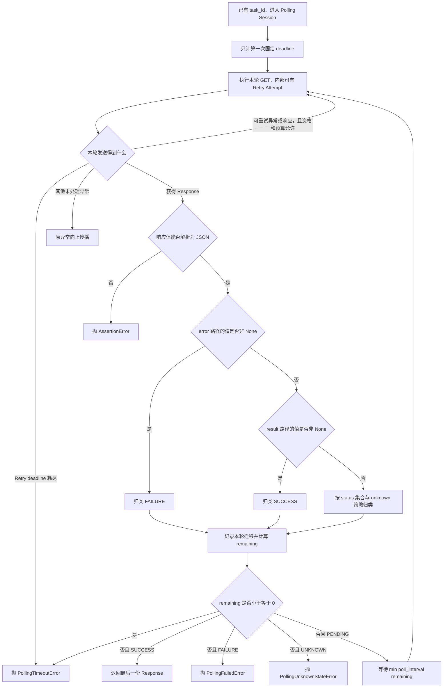

# 第 4 课：Polling 是业务状态机

## 本课在事实链中的位置

第 3 课已经把一次异步调用的时间边界分成了三层：单次 `timeout` 约束一次 HTTP Attempt，Retry 调度预算决定失败后能否再次发送，Polling 的固定 `deadline` 则让多轮查询、查询内部可能发生的 Retry 和轮询等待共享同一个调度与结果接受边界。

不过，时间预算只能回答“现在是否还允许继续”，不能回答“为什么要继续”。上一课留下的响应正好暴露了这个问题：

```http
HTTP/1.1 200 OK
Content-Type: application/json

{"task_id": "job-101", "status": "RUNNING"}
```

HTTP 请求已经返回，异步任务却未必完成。客户端必须解释响应体中的业务状态，才能决定继续查询、返回结果还是抛出异常。

这里的大写 `RUNNING` 是第 3 课在尚未解释业务状态时使用的示意值。当前默认媒体策略按字符串精确匹配小写 `running`；若外部响应原样给出大写 `RUNNING`，它会进入未知分支。本课正常轨迹因此改用源码实际接受的小写状态值。

本课只解决这一个判断问题：Polling 如何把查询响应归入等待、成功、失败或未知四种方向，并在共享 deadline 内作出下一步决定。完成这个模型后，一次业务动作可能包含一个创建请求和一轮或多轮查询。第 5 课将继续处理这些请求事实应当归属于哪个权威 Case 集合。

先校正一个贯穿案例中的接口表示。第 2 课把创建接口简写为 `POST /v1/jobs`，第 3 课把查询接口简写为 `GET /v1/jobs/job-101`。为了将同一教学案例映射到当前异步媒体入口，本课使用：

```text
POST /v1/media/generations
  响应字段：task_id

GET /v1/media/tasks/{task_id}
```

本课继续沿用标识值 `job-101`，但把它放回真实字段和真实查询路径：`task_id="job-101"`，查询 `/v1/media/tasks/job-101`。标识值可以叫 `job-101`，这不改变源码中字段名是 `task_id` 的事实。

---

## 核心问题

本课要回答的矛盾是：

> 对同一个 `task_id` 连续发出的三次 GET 都返回 HTTP 200，为什么前两次仍要等待，第三次才能返回？如果响应报告失败、出现未约定状态，或者成功来得太晚，框架又为什么必须走向不同结果？

答案不能只依靠 HTTP 状态码。Polling 必须同时维护两条状态线：

```text
HTTP 状态线：请求是否获得响应、状态码是什么、是否发生传输异常
业务状态线：异步任务正在等待、已经成功、已经失败，还是无法识别
```

HTTP 状态线决定一次查询发生了什么；业务状态线决定整个 Polling Session 是否结束。两条线有关联，但不能互相替代。

---

## 从一个具体现象开始

沿用异步图像生成案例。假定创建请求已经完成，服务端返回：

```json
{"task_id": "job-101"}
```

创建完成后，客户端进入查询阶段。为了让时间推导便于核对，本课使用以下教学输入：

```text
查询路径：/v1/media/tasks/job-101
poll_interval：2 秒
poll_timeout：10 秒
查询级 retry_policy：None
每次 GET 的示例耗时：0.2 秒
Polling 开始时间：T0
固定 deadline：T10
```

`retry_policy=None` 很重要：它表示本例每一轮查询只发送一次 GET，不在这一轮内部再做 HTTP Retry。下表中的“第 1、2、3 轮”是 Polling 查询轮次，不是一个 Retry 组里的 Attempt 1、2、3。

服务端响应序列是本例给定的业务输入，不是仓库能够替外部服务作出的承诺：

| 时间 | HTTP 状态线 | 原始业务状态线 | 剩余 deadline | 框架动作 |
| --- | --- | --- | ---: | --- |
| T0 | 开始第 1 次 GET；发生一次新的 HTTP 发送 | 尚未观察到状态 | 10.0 秒 | 查询已有的 `job-101`，不重新 POST |
| T0.2 | HTTP 200 | `pending` | 9.8 秒 | 归类为 `PollingState.PENDING`，等待 2 秒 |
| T2.2 | 开始第 2 次 GET；发生一次新的 HTTP 发送 | 上次仍在等待 | 7.8 秒 | 再次查询同一个 `task_id` |
| T2.4 | HTTP 200 | `running` | 7.6 秒 | 仍归类为 `PollingState.PENDING`，等待 2 秒 |
| T4.4 | 开始第 3 次 GET；发生一次新的 HTTP 发送 | 上次仍在运行 | 5.6 秒 | 再次查询同一个 `task_id` |
| T4.6 | HTTP 200 | `succeeded` | 5.4 秒 | 归类为 `PollingState.SUCCESS`，轮询核心交出本次响应 |

把规范中的业务轨迹和框架内部分类并排写出，就能看到两层名称并不相同：

```text
外部原始业务轨迹：pending → running → succeeded
教学显示名称：    PENDING → RUNNING → SUCCEEDED
框架分类轨迹：    PENDING → PENDING → SUCCESS
```

`running` 是外部服务报告的一个原始等待状态；框架没有单独的 `PollingState.RUNNING`，而是把它与 `queued`、`pending`、`processing` 一起归入 `PollingState.PENDING`。同理，`succeeded` 是原始成功状态，归类结果才是 `PollingState.SUCCESS`。

三次 HTTP 结果都是 200，但只有第三次让整个会话成功结束。第一、二次 200 仅表示“状态查询获得了响应”，响应体仍说任务没有到达成功终态。

---

## 为什么原有解释不够

如果只沿用前几课的 HTTP Retry 模型，容易得到一个错误流程：

```text
GET 返回 HTTP 200
→ 本次请求成功
→ 整个异步任务成功
```

第二个箭头没有成立依据。HTTP 200 描述的是查询请求，而查询的对象是另一个生命周期更长的异步任务。一个成功送达的查询可以告诉客户端四种完全不同的业务事实：

| 同为 HTTP 200 的响应体 | 业务含义 | 整个 Polling 的结果 |
| --- | --- | --- |
| `{"status":"running"}` | 已有任务仍在处理 | 预算允许时继续 |
| `{"status":"succeeded"}` | 已有任务达到成功终态 | 在 deadline 内才返回 |
| `{"status":"failed"}` | 已有任务达到失败终态 | 抛出业务失败异常 |
| `{"status":"paused"}` | 默认策略无法识别 | 抛出未知状态异常 |

仅靠状态码也无法反向推断业务分类。一次响应究竟进入哪条业务分支，还需要状态策略读取响应体；状态码本身不足以代替这一步。当前实现怎样分配两类输入，将在建立完整模型后映射到代码。

另一个不足是把“再次查询”误写成“再次提交”。两者操作的资源不同：

```text
POST /v1/media/generations
→ 请求创建一个新任务
→ 成功后得到 task_id

GET /v1/media/tasks/job-101
→ 查询已经存在的 job-101
→ 不应创建另一个任务
```

因此，Polling 的循环体必须是查询已有任务，而不是重发创建 POST。POST 重发是否安全仍取决于第 2 课讨论的服务端幂等契约；状态机不能替外部服务补上这个契约。

---

## 核心概念

本课只增加三个核心概念。

### 1. 轮询会话：Polling Session

轮询会话是从客户端开始持续查询某个已有任务，到成功返回或以失败、未知、超时等结果停止的完整生命周期。

它解决的问题是：多次相互分离的 GET 为什么属于同一个“等待任务结束”的过程。会话的输入至少包括查询路径、`PollingPolicy`、`poll_interval` 和总时限；输出是最后一份成功响应，或者一个保留上下文的异常。

它与单次请求的区别是：一个 Polling Session 可以包含多轮 GET。它与 Retry 组的区别是：每一轮 GET 内部可以选择是否使用 Retry；Retry 处理的是同一轮查询的发送失败或可重试结果，Polling 处理的是异步任务尚未到达终态。

```text
一个 Polling Session
├─ 查询轮次 1
│  └─ 一次查询调用：默认只发送一次，也可显式配置多个 Retry Attempt
├─ Polling 等待
├─ 查询轮次 2
│  └─ 一次新的查询调用
├─ Polling 等待
└─ 查询轮次 3
   └─ 一次新的查询调用
```

### 2. Polling 业务状态机：Raw status and PollingState

这里的 Polling 业务状态机（Polling state machine）是客户端的一组有限分类和转移规则：它接收当前查询响应、状态策略与剩余时间，输出“返回、抛出特定异常或等待后再查询”的下一步动作。它不是外部服务内部状态机的复制品，也不能说明服务端怎样完成图像生成。

原始业务状态是响应 JSON 中由 `status_json_path` 找到的值，例如 `running`。框架状态是客户端依据 `PollingPolicy` 归类后的四种枚举结果：

| 框架状态 | 中文含义 | 是否终止当前会话 | `remaining > 0` 时的动作 |
| --- | --- | --- | --- |
| `PollingState.PENDING` | 等待态 | 否 | 在预算内等待，再查询 |
| `PollingState.SUCCESS` | 成功终态 | 是 | 返回最后一份响应 |
| `PollingState.FAILURE` | 失败终态 | 是 | 抛 `PollingFailedError` |
| `PollingState.UNKNOWN` | 未知状态 | 是 | 默认抛 `PollingUnknownStateError` |

这里的“终态”是客户端状态机的停止分类，不是对外部系统事实真实性的证明。客户端把 `succeeded` 映射为成功，只能说明响应满足当前策略；它不能独立证明图片内容正确、结果 URL 可访问或服务端没有重复创建任务。

### 3. 状态判定策略：PollingPolicy

`PollingPolicy` 规定从哪里取状态、哪些原始值属于各集合，以及结果字段、错误字段和未知值怎样影响分类。它解决的是“同一套循环如何解释不同接口响应”的问题。

当前媒体默认策略使用精确、区分大小写的成员判断：

```text
等待集合：queued, running, pending, processing
成功集合：succeeded, success, completed
失败集合：failed, cancelled, canceled
结果路径：$.result.urls
错误路径：$.error
未知策略：fail
```

所以 `running` 能命中等待集合，而 `RUNNING` 默认不能。上一课展示的大写 `RUNNING` 只是尚未解释业务状态时的示意写法；按当前默认媒体策略直接收到大写字符串时，它会落入未知分支。若外部服务确实返回大写值，必须让策略显式包含该值或在标准入口之前完成有证据支持的归一化，不能假定框架会自动改成小写。

---

## 完整运行过程

下面的状态图对应当前 `BaseRequest.poll_get()` 的实际判断次序。图中的“收到响应”指获得一个 `requests.Response`，不是限定为 HTTP 2xx。



图中的关键关系逐项解释如下。

1. **已有 `task_id` 才进入查询。** 组合入口先执行创建 POST，再提取任务标识，之后才调用查询路径。创建阶段和查询阶段不是同一个循环。
2. **deadline 只建立一次。** 每一轮查询以及该轮内部显式启用的 Retry 都收到同一个绝对截止点；重新进入循环不会续期。
3. **传输处理先于业务分类。** 如果一轮 GET 配置了 `RetryPolicy`，可重试异常或响应先在该轮内部处理；默认业务入口没有传该策略，每轮通常只发送一次。
4. **状态评价先检查错误，再检查结果，最后检查原始状态集合。** 这使冲突响应拥有确定优先级，而不是由字段排列顺序决定。
5. **每份成功解析的响应先形成一条迁移记录。** 记录包括外层查询轮次、相对耗时、框架状态、原始状态和 HTTP 状态码。
6. **deadline 判断先于四类状态的动作。** 响应即使已经被归类为 `SUCCESS`，只要观察时刻已经越过 deadline，结果仍是 `PollingTimeoutError`。
7. **只有等待态回到查询。** 等待长度取 `poll_interval` 与剩余预算的较小值；成功返回，失败和默认未知分别抛出不同异常。

判定顺序可以压缩为一条可逐步核对的数据流：

```text
Response
→ JSON body
→ error_value / result_value / raw_status
→ 状态评价结果
→ 迁移记录
→ remaining deadline
→ 返回、抛错或等待
```

输入是响应与策略；中间数据是当前分类和累计迁移；最终输出不是一个统一的布尔值，而是原始响应或具有不同语义的异常。这一区分让调用者知道会话因业务失败、未知协议还是时间耗尽而结束。

---

## 正常路径

回到开头的 `job-101`。创建响应已经提供 `task_id`，因此 Polling 从 T0 开始；POST 所花的时间不计入这里的 T0～T10 查询预算。

### 第 1 轮：`pending` 只允许继续

T0 发送：

```http
GET /v1/media/tasks/job-101
```

T0.2 收到：

```http
HTTP/1.1 200 OK
Content-Type: application/json

{"task_id":"job-101","status":"pending"}
```

状态评价依次得到：

```text
$.error         → None，不构成失败
$.result.urls   → None，不构成结果成功
$.status        → "pending"，命中等待集合
框架状态        → PollingState.PENDING
remaining       → T10 - T0.2 = 9.8 秒
```

剩余时间为正，状态又是等待态，因此会话睡眠 `min(2, 9.8)=2` 秒。该轮不会向调用者返回响应，也不会重新提交创建请求。

### 第 2 轮：原始状态改变，框架分类不变

T2.2 再次查询同一路径，T2.4 收到：

```json
{"task_id":"job-101","status":"running"}
```

原始状态由 `pending` 变成 `running`，说明外部任务进入了另一个业务阶段；但两个值都在默认等待集合中，因此框架分类仍是 `PollingState.PENDING`。此时 `remaining=7.6` 秒，框架再等待 2 秒。

这一步说明状态机可以压缩外部服务的多个细粒度状态。它没有丢弃原始值：迁移记录仍保存 `running`；只是控制流只需要知道“尚未终止”。

### 第 3 轮：成功必须同时满足状态与时间边界

T4.4 发出第三次查询，T4.6 收到：

```json
{
  "task_id": "job-101",
  "status": "succeeded"
}
```

评价器先确认 `$.error` 为 `None`，再确认 `$.result.urls` 没有值，最后发现原始 `succeeded` 位于默认成功集合，于是归类为 `PollingState.SUCCESS`。这样，主轨迹的停止原因就是业务状态从等待态进入成功终态。

观察时刻仍有 5.4 秒预算，因此成功分支有效。轮询核心把这一份原始响应交回公共入口；它不会把三轮响应合成一个新响应，也不会把某个结果字段单独当作状态机输出。

本例最终事实可以完整写成：

```text
输入：已有 task_id=job-101，interval=2 秒，deadline=T10
查询：3 轮，每轮 1 次 GET；循环在内存中累计 3 条迁移
原始状态：pending → running → succeeded
框架状态：PENDING → PENDING → SUCCESS
状态机输出：T4.6 收到的最后一份 requests.Response
停止原因：在 deadline 之前观察到策略定义的 SUCCESS
```

由这个案例可以推出：相同的 HTTP 200 会因为业务响应体不同而产生继续或停止两种动作。不能由它推出：外部服务一定按这三个状态依次变化，也不能推出结果 URL 一定可访问或图片内容一定符合提示词。

---

## 复杂路径

复杂路径每次只改变一个主要条件，以便确认是哪一步导致分支变化。

### 路径一：HTTP 200 携带失败终态

保持 ID、路径、间隔和 deadline 不变，只把第二轮响应改为：

```http
HTTP/1.1 200 OK
Content-Type: application/json

{
  "task_id": "job-101",
  "status": "failed"
}
```

推导过程是：

```text
HTTP 200
→ 查询请求获得响应
→ 错误路径与结果路径均未命中
→ status="failed" 命中失败集合
→ 归类 PollingState.FAILURE
→ 记录原始状态 failed 与 HTTP 200
→ remaining 仍大于 0
→ 抛 PollingFailedError
→ 不再睡眠，也不发下一轮 GET
```

`PollingFailedError` 保留查询路径、最后原始状态、最后响应、迁移序列，并在错误路径命中时额外保留 `error_value`。HTTP 请求完成与业务任务失败可以同时成立，因此异常不是把 HTTP 200 改写成 HTTP 失败，而是表达更高一层的业务终态。

### 路径二：出现未约定的状态

再次保持其他输入不变，只把第一轮原始状态改为：

```json
{"task_id":"job-101","status":"paused"}
```

默认策略的三个集合都没有 `paused`，错误路径和结果路径也没有命中，所以评价结果是 `PollingState.UNKNOWN`。只要响应仍在 deadline 内，循环立即抛出 `PollingUnknownStateError`，不会把未知状态当作成功，也不会默认继续等待。

调用者可以创建自定义策略，把 `unknown` 设置为 `pending` 或 `ignore`。在当前实现中，这两个配置值都会把未匹配状态归类为 `PENDING`，随后走等待分支：

```text
unknown="fail"     → UNKNOWN → PollingUnknownStateError
unknown="pending"  → PENDING → 预算内继续查询
unknown="ignore"   → PENDING → 预算内继续查询
```

`ignore` 在这里不表示删除本次响应，也不是第五种状态；它当前与 `pending` 具有相同控制流效果。即使允许未知值继续，固定 deadline 仍会在后续检查点阻止继续调度或拒绝过晚结果；它不会强制抢占已经开始的调用。

大小写也是协议的一部分。默认集合中的 `running` 与外部返回的 `RUNNING` 是两个不同字符串；后者默认进入未知分支。仓库没有提供自动大小写归一化，课程不能把它描述成已有能力。

### 路径三：成功状态在 deadline 之后才被观察到

现在只改变响应时刻：`deadline=T10`，一次查询在 T9.9 开始，客户端最终在 T10.1 才观察到：

```json
{"task_id":"job-101","status":"succeeded"}
```

状态评价会先得到 `PollingState.SUCCESS`，并把 `succeeded` 加入迁移序列；接下来计算：

```text
remaining = T10 - T10.1 = -0.1 秒
```

因为 deadline 检查排在成功返回之前，最终输出是 `PollingTimeoutError`，不是成功响应。异常仍携带最后状态 `succeeded` 和最后响应，便于诊断“成功出现了，但出现得太晚”。

这不是前后矛盾。两个判断回答不同问题：状态分类回答“响应内容代表什么”，deadline 回答“这个结果是否在允许时间内被观察到”。只有二者都满足，成功分支才能返回。

三条路径的结果可以并排核对：

| 变化 | 已知事实 | 输出 | 不应作出的解释 |
| --- | --- | --- | --- |
| 错误路径取值不为 `None`；或错误、结果均未命中且 `status=failed` | 响应可解析且被策略判为失败 | `PollingFailedError` | HTTP 200 等于业务成功 |
| 错误、结果均未命中，`status=paused` 且使用默认 unknown 策略 | 响应可解析但协议状态未命中 | `PollingUnknownStateError` | 未知等于等待或失败终态 |
| `succeeded` 在 deadline 后观察 | 内容属于成功，时间资格不成立 | `PollingTimeoutError` | 最后状态是成功就必须返回 |

---

## 对应的框架实现

前面的现象、概念和状态图已经建立了判断模型，现在把它映射到当前仓库。以下代码均来自现有实现；为突出单一分支，片段只截取相关语句，省略处及其影响会在段后说明。

### 1. 标准组合入口先创建，再查询已有任务

`common/task_capabilities/media_generation.py` 中的组合方法执行顺序是：

```python
create_response = create_call(request_client, payload)
task_id = extract_call(create_response)
return poll_call(
    request_client,
    task_id,
    poll_interval=poll_interval,
    poll_timeout=poll_timeout,
    polling_policy=polling_policy,
    retry_policy=retry_policy,
)
```

`create_call` 的标准实现向 `/v1/media/generations` 发送 POST；`poll_call` 的标准实现把同一个 `task_id` 填入 `/v1/media/tasks/{task_id}`，再调用 `request_client.poll_get()`。输入是创建 payload 与轮询参数，状态变化是“没有任务标识”变为“持有一个可查询的 `task_id`”，输出则来自查询阶段最后一次成功响应。若创建调用抛出异常、创建响应不是 JSON 对象，或者响应缺少 `task_id`、`id`、`request_id` 中的可用值，流程会在进入 Polling 之前停止。组合入口本身没有仅凭创建响应的非 2xx 状态码停止流程。

例如，仓库中的图像模型、视频模型和 Smoke 异步图像用例确实调用了这个组合入口，所以这不只是一个未接入的框架能力。通用 `poll_get()` 还被账单结算和部分素材库路径直接使用；与此同时，素材库模块仍保留其他手写轮询。由此只能确认列出的调用点已经启用相应能力，不能把标准媒体组合链概括为仓库所有轮询的统一实现。

### 2. 默认媒体策略把外部状态映射为四类结果

`common/polling.py` 中的默认策略是：

```python
DEFAULT_MEDIA_POLLING_POLICY = PollingPolicy(
    status_json_path="$.status",
    pending=frozenset({"queued", "running", "pending", "processing"}),
    success=frozenset({"succeeded", "success", "completed"}),
    failure=frozenset({"failed", "cancelled", "canceled"}),
    result_json_path="$.result.urls",
    error_json_path="$.error",
)
```

这些集合是客户端当前接受的协议值，不是对外部服务所有可能状态的枚举声明。默认 `unknown="fail"` 来自 `PollingPolicy` 字段默认值，因此未命中值会保留为未知，而不是猜成某个终态。

### 3. 错误、结果和状态集合具有固定优先级

状态评价函数的关键分支如下：

```python
if policy.error_json_path is not None:
    error_value = _extract_json_path_value(body, policy.error_json_path)
    if error_value is not None:
        return PollingEvaluation(
            state=PollingState.FAILURE,
            raw_status=raw_status if raw_status is not None else error_value,
            error_value=error_value,
        )

if policy.result_json_path is not None:
    result_value = _extract_json_path_value(body, policy.result_json_path)
    if result_value is not None:
        return PollingEvaluation(
            state=PollingState.SUCCESS,
            raw_status=raw_status,
            result_value=result_value,
        )

if raw_status in policy.pending:
    return PollingEvaluation(state=PollingState.PENDING, raw_status=raw_status)
if raw_status in policy.success:
    return PollingEvaluation(state=PollingState.SUCCESS, raw_status=raw_status)
if raw_status in policy.failure:
    return PollingEvaluation(state=PollingState.FAILURE, raw_status=raw_status)

if policy.unknown in {"pending", "ignore"}:
    return PollingEvaluation(state=PollingState.PENDING, raw_status=raw_status)
return PollingEvaluation(state=PollingState.UNKNOWN, raw_status=raw_status)
```

输入是已解析的 JSON 和不可变的 `PollingPolicy`，输出是一个 `PollingEvaluation`。它保留 `raw_status`，并在命中时保留 `result_value` 或 `error_value`。这里使用“值不为 `None`”作为结果或错误路径的存在条件；它没有进一步判断 URL 是否可访问、结果列表是否非空或错误对象是否符合某个业务 Schema。

错误路径具有最高判定优先级。即使一个矛盾响应同时写着 `status="succeeded"` 并提供结果，只要 `$.error` 的值非 `None`，当前实现仍先归入 `FAILURE`。若错误路径未命中但结果路径非 `None`，结果分支又先于原始状态集合；因此一个同时带结果与 `status="failed"` 的响应会被归为 `SUCCESS`。这些是客户端的固定优先级，不能解释外部响应为何矛盾，也不能替代响应 Schema 或业务正确性校验。

该评价函数没有读取 `response.status_code`。状态码是在外层创建 `PollingTransition` 时作为观察信息记录的，而不是四类业务状态的分类条件。发送层也没有自动调用 `raise_for_status()`；因此，没有查询级 Retry 接管时，非 2xx 响应仍可能进入 JSON 状态评价。这个实现边界说明 HTTP 结果与业务结果必须分开叙述。

### 4. 一个 deadline 约束所有查询轮次

`common/base_request.py` 在进入轮询核心时只创建一次截止点，并把它传给每轮查询：

```python
started_at = self.retry_executor.monotonic()
deadline = started_at + timeout
transitions: list[PollingTransition] = []

while True:
    attempt_index += 1
    try:
        last_response, last_logger = self._request_without_attach(
            "GET",
            path,
            retry_policy=retry_policy,
            protocol="polling",
            polling_policy=polling_policy,
            deadline=deadline,
            **kwargs,
        )
    except RetryDeadlineExceeded as error:
        raise PollingTimeoutError(
            path=path,
            timeout=timeout,
            last_status=last_status,
            last_response=(
                error.last_response
                if error.last_response is not None
                else last_response
            ),
            transitions=transitions,
        ) from error
```

该片段只省略了两项日志步骤名称参数及其他与本判断无关的上下文参数；保留了发送、deadline 传递和 `RetryDeadlineExceeded` 转换的顺序。`timeout` 在这里是 `poll_timeout`，或者在调用者没有提供 `poll_timeout` 时采用的全局请求配置值。它被转换成绝对 `deadline` 后不再随循环移动。`_request_without_attach()` 收到相同 deadline，因此它创建单次请求上下文时会把该轮 HTTP timeout 裁剪到当时的剩余预算；显式启用的内部 Retry 也使用该 deadline 判断能否开始下一次发送或退避。这里保证的是调度检查和 timeout 参数裁剪，不是对已经开始的网络调用、Middleware 或操作系统调度进行强制抢占。

外层循环中的 `PollingTransition.attempt_index` 随查询轮次递增；内层 Retry 另有自己的 Attempt 编号。一轮查询若发生多个 Retry Attempt，仍只会在最终得到可评价响应后新增一条 Polling 迁移。字段名相似不代表两层计数可以合并。

### 5. 时间资格在终态动作之前检查

状态评价与迁移记录完成后，循环执行以下分支：

```python
remaining = deadline - observed_at
if remaining <= 0:
    self._attach_polling_transitions(last_logger, transitions)
    last_logger.attach_success(last_response)
    raise PollingTimeoutError(
        path=path,
        timeout=timeout,
        last_status=last_status,
        last_response=last_response,
        transitions=transitions,
    )

if evaluation.state is PollingState.SUCCESS:
    self._attach_polling_transitions(last_logger, transitions)
    last_logger.attach_success(last_response)
    return last_response

if evaluation.state is PollingState.FAILURE:
    self._attach_polling_transitions(last_logger, transitions)
    last_logger.attach_success(last_response)
    raise PollingFailedError(
        path=path,
        last_status=last_status,
        last_response=last_response,
        transitions=transitions,
        error_value=evaluation.error_value,
    )

if evaluation.state is PollingState.UNKNOWN:
    self._attach_polling_transitions(last_logger, transitions)
    last_logger.attach_success(last_response)
    raise PollingUnknownStateError(
        path=path,
        last_status=last_status,
        last_response=last_response,
        transitions=transitions,
    )

sleep_seconds = min(poll_interval, remaining)
sleep_started_at = self.retry_executor.monotonic()
try:
    self.retry_executor.sleeper(sleep_seconds)
finally:
    if runtime_polling is not None:
        runtime_polling.add_sleep(
            self.retry_executor.monotonic() - sleep_started_at,
        )
```

`PENDING` 没有单独的 `if`，因为成功、失败、未知三个分支都未进入后，唯一剩余分类就是等待态，于是执行受剩余预算裁剪的睡眠并回到下一轮。

这段代码还揭示了一个实现前提：获得响应并完成状态评价后，超时、成功、失败和未知四个终止分支会先附加迁移与 HTTP 响应日志。这些日志调用没有在此处被 fail-open 包裹；若日志附件自身抛出异常，它可能取代原本准备返回的响应或 Polling 异常。内部 Retry 在取得可评价响应前耗尽 deadline 时是例外：该转换分支直接抛 `PollingTimeoutError`，不执行这里的两项终态附件调用。因此，上述响应评价分支的标准输出边界以日志附加正常完成或使用 Noop logger 为前提，不能把后续课程讨论的 Runtime Hooks fail-open 扩大到这里的所有日志操作。

相关测试分别锁定了 `queued → running → succeeded` 的成功轨迹、失败终态、未知状态、等待到超时、deadline 后观察到成功仍超时，以及轮询内部 Retry 共享 deadline。测试证明这些路径受到当前测试套件覆盖；当前行为的首要依据仍是上述实现。

### 6. 实现与测试证据索引

本课的重要陈述可追溯到以下位置：

- `common/task_capabilities/media_generation.py:24-29,57-153`：创建端点、查询端点、`task_id` 提取，以及“创建—提取—轮询”的组合顺序。
- `common/base_task.py:73-124`：业务门面对媒体能力的委托，以及默认策略和可选 Retry 策略的传递。
- `common/polling.py:18-59,102-224,269-276`：四类框架状态、策略校验、三类 Polling 异常、响应评价优先级和默认媒体状态集合。
- `common/base_request.py:123-161,216-237,391-558`：公共入口、单次 timeout 裁剪、查询循环、迁移记录、deadline 顺序与最终分支。
- `common/retry_executor.py:59-128,162-203`：每轮内部 Retry 对同一 deadline 的检查、剩余预算和等待约束。
- `common/base_decorators.py:50-73`、`util/api_call_logger.py:46-52,103-109`：状态机外的结果捕获，以及终态分支前日志附件调用的异常边界。
- `module/image_model/test_wan2_7_image.py:15-33`、`module/video_model/task.py:20-65`、`module/smoke/test_图片生成异步调用.py:45-70`：图像、视频与 Smoke 路径调用标准媒体组合入口的实例。
- `common/task_capabilities/billing.py:83-104`、`module/material_library/request.py:123-136`、`module/material_library/task.py:305-325`：其他业务对通用 `poll_get()` 的封装与调用；素材库同时存在独立手写循环，不能据此推导全仓统一。
- `tests/test_polling_state_machine.py:21-167`：策略校验、四类状态、字段优先级、异常上下文和迁移格式覆盖。
- `tests/test_base_request_retry_polling.py:252-462`：成功、失败、未知、超时、晚到成功、内层 Retry 和共享 deadline 覆盖。
- `tests/test_base_task.py:110-187`：创建、查询委托、策略传递、组合调用与任务 ID 提取覆盖。

本课核验时，前两组 Polling 测试共 32 项通过；`test_base_task.py` 中与媒体生成和任务 ID 相关的 7 项通过。测试结果说明这些预期在当前版本得到覆盖，不能代替源码证明实现，也不能证明外部服务在任意环境中始终返回相同轨迹。

---

## 能够保证什么

在调用标准 `BaseRequest.poll_get()`、响应可被策略解析且没有未处理的更底层异常时，当前实现能够保证：

1. 一次 Polling Session 只创建一个固定 deadline；循环不会在每一轮重新续期。
2. 每轮都查询传入的同一路径，不会由 Polling 循环重新发送创建 POST。
3. 错误路径、结果路径、状态集合和未知策略按固定顺序产生一个框架分类。
4. 等待态只会在剩余预算为正时继续；传给 sleeper 的计划等待值不超过 `poll_interval` 与计算时剩余预算中的较小值。
5. 只有在 deadline 之前观察到 `PollingState.SUCCESS`，轮询核心才把最后一份原始响应交给公共入口。
6. 失败、未知和超时分别通过 `PollingFailedError`、`PollingUnknownStateError`、`PollingTimeoutError` 表达，并保留相应诊断上下文。
7. 显式提供查询级 `RetryPolicy` 时，每轮内部 Retry 与所有轮询轮次使用同一个外层 deadline 进行调度检查与 timeout 裁剪；未提供时，不会凭空产生内层 Retry。

这些是客户端控制流保证，不是外部任务质量或服务端契约保证。

---

## 保证成立的前提

上述保证依赖以下前提：

- 调用经过 `BaseRequest.poll_get()` 或标准媒体能力对它的委托，而不是另一个模块的独立手写循环。
- 创建阶段已经取得可用的任务标识，并把同一个标识放入正确的查询路径。
- `poll_interval` 和最终采用的 Polling 总时限都大于 0。
- 响应体是可解析 JSON；`status_json_path`、`result_json_path` 和 `error_json_path` 与外部响应结构一致。
- 原始状态的值和大小写与策略集合一致，或者调用方明确配置了合适的 unknown 策略。
- 需要查询级 HTTP Retry 时，调用方显式传入 `RetryPolicy`；标准媒体入口的默认值是 `None`。
- 已获得响应并完成状态评价的终止分支中，迁移与响应日志附加能够正常完成，或者当前使用的是 Noop logger；这些附件调用不在本段状态分支的异常隔离之内。内部 Retry deadline 转换分支不经过这些终态附件调用。
- 单调时钟与请求层能够提供实现进行预算判断所需的时间信息。单次请求 timeout 会被裁剪到剩余预算，但系统调度与网络库仍可能让实际观察时刻略晚于截止点，因此返回后还要再次检查 deadline。
- 外部服务提供的任务 ID、状态、结果和错误内容符合双方约定。仓库中的客户端代码与测试只能声明并验证这一预期，不能静态证明部署中的服务每次都会兑现。

业务启用范围也要单独说明：图像模型、视频模型与异步图片 Smoke 用例可作为当前调用标准媒体组合入口的实例；账单结算和部分素材库路径直接调用通用 `poll_get()`。这些证据不等于所有业务模块、所有测试或所有外部调用都经过同一状态机。

---

## 不能保证什么

当前 Polling 状态机不能保证：

1. **HTTP 200 就是业务成功。** 同一个状态码可以承载等待、失败或未知状态。
2. **非 2xx 自动等于业务失败。** 当前发送层不自动调用 `raise_for_status()`；是否 Retry 以及响应体怎样分类取决于实际配置和内容。
3. **外部任务最终一定进入终态。** 若它持续返回等待态，会话只能在 deadline 耗尽时以超时结束。
4. **成功字段代表结果质量正确。** 默认结果路径的值只要不为 `None` 就能触发成功分类；状态机不验证 URL 可访问、列表非空、图片内容正确或模型输出符合提示词。
5. **状态值会自动规范化。** 默认集合匹配区分大小写，`RUNNING` 不会自动变成 `running`。
6. **未知状态等于失败终态。** 默认控制流会抛未知状态异常，但这只说明客户端协议无法解释该值，不能证明外部任务已经失败。
7. **Polling 总时限覆盖创建与结果下载。** 当前 deadline 在进入轮询核心时才创建；之前的 POST 和成功返回后的结果下载不属于这段预算。
8. **查询状态机解决 POST 幂等。** 它查询已有 `task_id`，不能修复创建请求重发造成的重复任务。
9. **仓库所有轮询均采用这套实现。** 部分其他业务代码仍有独立循环，只有经过标准入口的调用才能获得这里列出的控制流保证。
10. **多条查询事实已经有稳定归属。** 状态迁移可以描述本次会话观察到什么，但尚未确定本次 Runner 唯一认可哪些 Case，也没有建立完整性的权威参照。
11. **捕获 `PollingError` 就能覆盖全部 Polling 失败。** `PollingFailedError` 和 `PollingUnknownStateError` 继承 `PollingError`，而 `PollingTimeoutError` 直接继承 `TimeoutError`；调用方若只捕获前者，不会接住超时。

未知、缺失与失败必须保留各自语义，不能在没有策略依据时自行补写结论。当前实现有两条必须明说的例外：状态缺失会按 unknown 策略处理，因此自定义 `pending` 或 `ignore` 会继续等待；结果路径缺失也不妨碍原始状态命中成功集合。没有观察到终态不能写成“任务没有问题”。

此外，若响应体不是有效 JSON，评价器会抛出 `AssertionError`，并在错误消息中使用经过脱敏和长度限制的响应文本。此时没有可分类的 JSON 状态事实，不能把它补写为 `UNKNOWN`、零值或成功。

---

## 与下一课的关系

本课把一次异步调用推进到了正确终点：

```text
POST 创建任务并取得 task_id
→ 多轮 GET 查询同一个任务
→ 每份响应按业务策略分类
→ 共享 deadline 决定时间资格
→ 成功返回，或以失败、未知、超时停止
```

在本课的已解案例中，`job-101` 的一次业务动作实际发送了一个创建请求和三次 GET，轮询循环在内存中累计了三条迁移。它们是否进一步持久化为观察事实，取决于日志与 Quality/Runtime Hooks 是否启用并正常工作。状态机只解释这些响应为何继续或停止，还没有确定本次 Runner 唯一认可哪些 Case，也没有提供完整性参照。

第 5 课将从 pytest 收集到的 Case 列表开始，解释 Runner 为什么必须先形成权威 Case 集合，以及这个集合为什么同时决定执行输入、完整性参照和后续指标的稳定分母。
