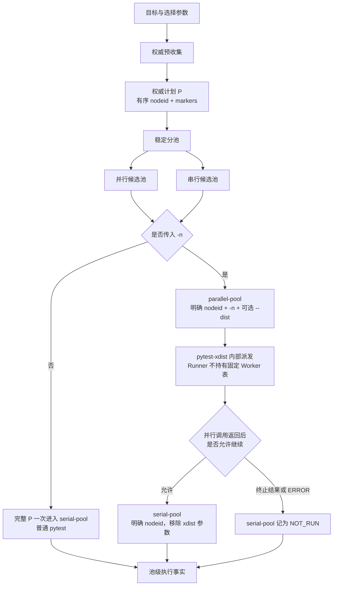

# 第 6 课：并行池与串行池只改变调度

## 本课在事实链中的位置

第 5 课先固定了本次运行的权威 Case 集合。以异步图像生成 Smoke 为例，Runner 在执行前得到三个 pytest `nodeid`，并按收集顺序把计划记为：

```text
P = [A, B, C]
```

其中：

```text
A = module/smoke/test_图片生成异步调用.py::TestAsyncImageGeneration::test_f8_07_async_image_generation_submit_returns_task_id

B = module/smoke/test_图片生成异步调用.py::TestAsyncImageGeneration::test_f8_08_async_image_generation_task_status_query

C = module/smoke/test_图片生成异步调用.py::TestAsyncImageGeneration::test_f8_09_async_image_generation_task_succeeds_with_result
```

这份计划回答“本次原本要执行谁”，却还没有回答“在哪里、以什么先后执行”。本课就处理第二个问题：Runner 怎样把一份已经固定的计划放入并行池或串行池，以及 `-n` 怎样改变真正采用的执行阶段。

这里必须先面对一个来自当前仓库的事实：A、B、C 所在文件具有文件级 `pytestmark = pytest.mark.serial`。因此，保持第 5 课的 `P` 完全不变并使用默认 marker 名时，三个 Case 都只能成为串行候选，不能为了展示并发而把其中任何一个虚构成并行 Case。

这恰好提供了本课的第一个边界：**启用并行能力，不等于每个计划都必然产生并行执行。** 本课会先用不变的 `P` 推导真实结果，再用另一轮明确改变选择范围的真实异步图像计划展示两个非空池。两轮计划不会混写成同一次运行。

本课只讨论执行池、调度位置以及计划顺序与完成顺序。完整的跨运行事实身份留到第 7 课；pytest 原始退出码的事实所有权与最终合并规则留到第 8 课。

---

## 核心问题

本课要回答的矛盾是：

> 同一份 `P=[A,B,C]`，关闭并发时只有一次 pytest 调用，传入 `-n` 后却可能出现两个池级记录。怎样证明改变的是调度，而不是计划成员？又由谁决定某个并行 Case 落到哪个 Worker、何时完成？

先给出本课最重要的不变量。假设默认串行 marker 为 `serial`，Runner 从权威计划 `P` 派生两个候选子序列：

```text
P_parallel = [case ∈ P | case 不含 serial marker]
P_serial   = [case ∈ P | case 含 serial marker]

成员守恒：set(P_parallel) ∪ set(P_serial) = set(P)
互斥：    set(P_parallel) ∩ set(P_serial) = ∅
身份不变：分池前后的成员仍使用同一个 nodeid
```

这三个关系只描述计划层。它们不承诺运行耗时相同、外部请求交错相同或测试结果相同。并发可能暴露共享状态竞争，也可能遭遇外部服务限流；“只改变调度”的准确含义是：**调度器不得通过分池增删或改写权威计划成员。**

---

## 从一个具体现象开始

先保持第 5 课的 `P` 不变。A、B、C 都从文件级继承 `serial`，所以稳定分池的结果是：

```text
输入计划：    [A, B, C]
并行候选池：  []
串行候选池：  [A, B, C]
```

现在只改变命令行是否提供 `-n 2`。

| 对照项 | 未传 `-n` | 传入 `-n 2` |
| --- | --- | --- |
| 权威计划 | `[A,B,C]` | `[A,B,C]` |
| 分池计算 | `parallel=[]`，`serial=[A,B,C]` | `parallel=[]`，`serial=[A,B,C]` |
| 实际 pytest 阶段 | 一次 `serial-pool`，输入全部 A/B/C | 空 `parallel-pool` 不启动 pytest；随后 `serial-pool` 输入 A/B/C |
| xdist 参数 | 不由 Runner 添加 | 并行池本可得到 `-n 2`；本例池为空，所以没有并行 pytest 调用。串行池移除 xdist 参数 |
| 计划成员是否改变 | 否 | 否 |

这里有两个容易被名称遮住的事实。

第一，Runner 在权威收集成功后总会先计算两个候选池；但未传 `-n` 时，计算结果不用于实际分阶段执行。Runner 把完整 `P` 一次性交给一个名为 `serial-pool` 的普通 pytest 调用。即使 `P` 中有未标记的 Case，它在这个模式下也会进入同一个阶段。

第二，传入 `-n` 只会选择“并行候选池在前、串行候选池在后”的控制流。若并行候选池为空，Runner 记录 `NOT_RUN`，不会为一个空列表启动 pytest，更不会凭空产生 Worker 工作量。

所以，仅看到“命令含 `-n 2`”不能推出“A、B、C 分给了两个 Worker”。对当前这三个真实 Case，这个结论与 marker 事实相冲突。

---

## 为什么原有解释不够

一种常见解释是：“加上 `-n 2`，Runner 就把所有 Case 平分给两个 Worker。”这句话把三个不同层次压成了一层：

```text
权威计划成员
≠ Runner 的池级分类
≠ pytest-xdist 的 Worker 派发
```

Runner 能确定的是前两层。它先持有权威 `nodeid` 序列，再依据 marker 派生池级 `nodeid` 序列。对于非空并行池，Runner 把整组明确 `nodeid` 和 `-n` 参数交给一次 pytest 调用；具体哪个 Worker 接收哪个 Case，是 pytest-xdist 的运行职责，不是 Runner 预先保存的一张分配表。

另一种常见解释是：“计划列表是 `[D,E]`，所以完成顺序也是 D、E。”计划顺序只是输入顺序。并行环境中，Case 的启动和完成受 Worker 可用性、Case 耗时、插件策略和运行环境影响。若当前产物只保存池级开始与结束时间，而没有单 Case 完成事件，就不能把列表顺序补写成实际完成顺序。

还要区分两种名字相近却含义不同的参数：

- `-m serial` 是 pytest 选择条件，会在权威收集阶段改变“本次有哪些 Case”。
- `--serial-marker serial` 是 Runner 的分类配置，只决定已收集成员进入哪个候选池。

前者可能改变 `P`，后者在分池守恒成立时不改变 `P` 的成员。把二者都解释成“打开串行模式”，就会丢失计划边界。

---

## 核心概念

本课新增三个核心概念。

### 1. 执行池：Execution Pool

执行池是从同一权威计划派生的一组池级执行输入。默认规则是：带 `serial` marker 的 Case 进入串行候选池，其他 Case 进入并行候选池。

“候选”二字不能省略，因为分池计算与真正执行并不总是一一对应：

- 未传 `-n`：Runner 把完整权威计划交给唯一的 `serial-pool`，不会分别执行两个候选池。
- 传入 `-n`：两个候选池才成为先并行、后串行的两个池级位置；空池保留 `NOT_RUN` 记录但不调用 pytest。
- `--collect-only`：Runner只报告两个候选池的数量，不建立执行生命周期，也不执行任一池。

执行池不是新的 Case 集合来源。它只消费权威计划，并受“无重复、无交集、并集等于原计划”的守恒检查约束。

### 2. 调度位置：Scheduling Position

调度位置说明一个计划成员被放在哪个执行阶段，以及该阶段使用怎样的执行器参数。

当前标准 Runner 有两个池级位置：

```text
parallel-pool：带 -n，可能带 --dist，由 pytest-xdist 调度
serial-pool：移除 -n/--numprocesses/--dist，使用普通 pytest 调用
```

池级位置与 Worker 位置不是同一件事。Runner 知道 D 属于 `parallel-pool`，并不等于 Runner 知道 D 将由 `gw0` 还是 `gw1` 执行。当前 `PoolExecutionResult` 也没有保存这种映射。

“串行池”同样需要准确理解：它表示这个 Runner 阶段移除了 xdist 参数，并在并行池返回后才启动。它不禁止测试函数内部使用线程或异步任务，也不提供多个 Runner 进程之间的全局互斥。

### 3. 计划顺序与完成顺序：Planned Order and Completion Order

分池函数按权威计划做一次顺序遍历，所以每个候选池内部保留原计划的相对顺序。例如：

```text
Q = [D, E, A, B, C]

parallel(Q) = [D, E]
serial(Q)   = [A, B, C]
```

这是计划顺序。Runner 随后把 `[D,E]` 作为一次 pytest 调用的输入，并且只有该调用返回后才考虑 `[A,B,C]`。这建立了池间屏障：串行池不会与尚未返回的并行池阶段重叠。

但 Runner 当前没有记录并行池内的 `nodeid → Worker` 映射，也没有记录单 Case 完成时间。因此，对于 D 和 E：

```text
计划输入顺序：D → E
Worker 分配：未知（由 xdist 运行时决定）
实际完成顺序：未知（Runner 池级产物没有这项事实）
```

未知不能被补成 D→E，也不能仅凭耗时猜成 E→D。若将来有可信的单 Case 观察产物，可以报告那一次运行的实际顺序；它仍不是下一次运行的固定保证。

---

## 完整运行过程

先用一张图固定职责边界，再查看源码：



这条链有六个关键状态变化。

### 第一步：权威计划先于调度存在

Runner 先完成第 5 课解释的预收集。收集输出中的每一项带有 `nodeid` 和可见 marker；只有收集退出码为 0，Runner 才读取这份计划并进入分池。

因此，`-n`、`--dist` 和报告路径属于执行配置，不负责定义本次原始成员。改变 `-k`、`-m`、目标路径等选择条件则可能产生另一份权威计划，不能把这种变化归因于分池。

### 第二步：一次遍历形成两个候选子序列

Runner 把同一 `collection.cases` 交给分池函数。每个成员只判断一次：包含指定串行 marker 就追加到串行列表，否则追加到并行列表。输入重复会直接失败；遍历结束后还检查交集和并集。

这个过程的输出是两个 `nodeid` 元组。marker 在这里用于决策，但输出没有把 Case 改名，也没有增加 Worker 字段。

### 第三步：`-n` 决定采用单阶段还是双阶段

`numprocesses` 为空时，Runner 走单阶段路径：把完整 `case_nodeids` 交给 `serial-pool`。这时前一步的两个候选子序列只用于收集展示，不驱动实际执行。

`numprocesses` 非空时，Runner 走双阶段路径。并行候选池得到 `-n <numprocesses>`；只有调用者明确给出 `--dist` 时，Runner 才把该值一并交给 xdist。`--dist` 本身不启用双阶段，单独传它没有这项效果。

### 第四步：非空并行池交给 xdist

对于非空并行池，Runner 构造的 pytest 输入以明确 `nodeid` 开头，再附加执行参数。调用 pytest 后，具体 Worker 派发由已安装的 pytest-xdist 负责。

Runner 等待这次 pytest 调用返回，因此它能确定并行池的池级开始与结束时刻，却不能从这些时刻恢复每个 Case 的完成先后。不同 xdist 版本、分发策略和插件组合还可能具有不同语义；仓库没有把某个固定 Worker 映射写进 Runner。

### 第五步：池间屏障决定串行池能否启动

并行调用返回后，Runner 才判断串行池。并行池普通测试失败，即原始退出码为 1，不会阻止串行阶段；Runner仍会继续收集串行阶段事实。

若并行调用抛出普通 Python 异常，池状态为 `ERROR`；若 pytest 正常返回 2、3、4 或 5，属于当前停止集合。两类情况都会使有计划的串行池保持 `NOT_RUN`。本课只使用这些事实说明调度门槛，退出事实为何不能被后续组件覆盖留到第 8 课。

### 第六步：写下池级事实，而不是臆造 Case 事实

每个池级结果可以保存：阶段名、计划 `nodeid`、`NOT_RUN/COMPLETED/ERROR` 状态、原始 pytest 退出码、池级起止时间、异常类型和 JUnit 路径。

其中：

- `COMPLETED` 只表示 `pytest.main()` 正常返回，退出码仍可能是 1；它不是“所有 Case 通过”。
- `NOT_RUN` 表示该池没有启动；要结合 `planned_nodeids` 判断是空池，还是有计划但被前一阶段阻断。
- `planned_nodeids` 是输入计划，不是已完成 Case 清单。

Runner 产物没有记录单 Case 的完成顺序时，课程也不会为它补一列虚构值。

---

## 正常路径

正常路径保持第 5 课的 `P=[A,B,C]` 不变，并假设本次三个业务 Case 的 pytest 调用正常返回 0。这里不实际调用收费的外部图像服务；我们只依据当前计划、marker 和 Runner 控制流推导调度结果。

### 路径一：未传 `-n`

```text
权威计划 P = [A,B,C]
→ 候选分池 parallel=[]，serial=[A,B,C]
→ numprocesses 为空
→ Runner 选择单阶段路径
→ execute_pool("serial-pool", [A,B,C], 不含 xdist 的参数)
→ pytest.main() 正常返回 0
→ 池状态 COMPLETED，raw_pytest_exit_code=0
```

虽然分池函数已经算出串行候选为 A/B/C，真正驱动执行的是完整 `case_nodeids`。若计划中还含未标 `serial` 的成员，它在关闭并发时也会随完整列表进入这唯一一次调用。

### 路径二：传入 `-n 2`

```text
权威计划 P = [A,B,C]
→ 候选分池 parallel=[]，serial=[A,B,C]
→ numprocesses="2"
→ parallel-pool 为空，不调用 pytest，状态 NOT_RUN
→ 空池没有 ERROR，也没有终止型原始退出码
→ serial-pool 接收 [A,B,C]，参数中移除 xdist 选项
→ pytest.main() 正常返回 0
→ 串行池状态 COMPLETED，raw_pytest_exit_code=0
```

对应的池级事实可以概括为：

| 计划成员 | marker 分类 | 池级调度位置 | Worker 分配 | 实际完成顺序 |
| --- | --- | --- | --- | --- |
| A | `serial` | `serial-pool` | 不经过 Runner 的 xdist 并行池 | Runner 未记录，未知 |
| B | `serial` | `serial-pool` | 不经过 Runner 的 xdist 并行池 | Runner 未记录，未知 |
| C | `serial` | `serial-pool` | 不经过 Runner 的 xdist 并行池 | Runner 未记录，未知 |

这里没有把 A/B/C 的列表顺序直接写成完成顺序。普通 pytest通常按收到的项目顺序推进，但插件可以介入，且当前池级产物没有逐 Case 时间证据。本课能确认的是：并行池阶段没有启动，串行池收到的计划仍是 A/B/C。

两条正常路径的执行阶段数量不同，计划却满足同一个关系：

```text
planned_nodeids = [A,B,C]
```

这就是“调度可以改变，权威计划不随之改变”的最小证明。

---

## 复杂路径

### 路径一：另一轮真实选择范围产生两个非空池

为了观察两个池都非空，必须另起一次运行并明确改变选择范围。当前仓库还有两个未标 `serial`、同样调用异步媒体创建与轮询入口的真实图像 Case：

```text
D = module/image_model/test_wan2_7_image.py::TestImageGenerations::test_pos_case_1

E = module/image_model/test_wan2_7_image_pro.py::TestImageGenerations::test_create_image_generation
```

设这次新运行的权威计划顺序为：

```text
Q = [D, E, A, B, C]
```

`Q` 不是第 5 课的 `P`，也不是在同一次运行中临时添入两个 Case。它代表目标或选择范围已经变化后重新完成的一次权威收集。D、E 当前没有 `serial` marker，A、B、C 继承文件级 `serial`，因此：

```text
parallel(Q) = [D, E]
serial(Q)   = [A, B, C]
```

若调用者提供 `-n 2`，并且并行池正常返回 0，Runner 的池级顺序是：

```text
pytest([D,E], -n 2)
→ 等待整个并行池调用返回
→ pytest([A,B,C])，移除 xdist 参数
```

预期集合、调度位置与完成顺序应这样对照：

| 事实层 | D | E | A/B/C |
| --- | --- | --- | --- |
| 权威计划成员 | 属于 Q，nodeid 不变 | 属于 Q，nodeid 不变 | 属于 Q，nodeid 不变 |
| Runner 池级位置 | `parallel-pool` | `parallel-pool` | `serial-pool` |
| 具体 Worker | Runner 不记录 | Runner 不记录 | 不进入 Runner 的 xdist 并行阶段 |
| 单 Case 完成次序 | 无可信逐 Case 时间时为未知 | 无可信逐 Case 时间时为未知 | 无可信逐 Case 时间时为未知 |
| 池间约束 | 与 E 同属先执行的池 | 与 D 同属先执行的池 | 只在并行池调用返回后启动 |

一次实际 xdist 运行可能让 D 与 E 落在不同 Worker，也可能由于耗时不同而先完成 E；这些都只是允许出现的运行观察，不是 Runner 的固定计划。某个 `--dist` 策略甚至可能具有复制执行语义，所以“每个并行 Case 必然恰好落到一个 Worker”也不能对所有策略笼统承诺。

### 路径二：并行池有测试失败，串行池仍继续

继续使用混合计划 Q，只改变并行 pytest 的返回值：

```text
parallel-pool 计划：[D,E]
pytest.main() 正常返回 1
→ parallel-pool.status = COMPLETED
→ raw_pytest_exit_code = 1
→ 1 不在当前终止码集合
→ serial-pool 仍以 [A,B,C] 启动
```

`COMPLETED` 与退出码 1 可以同时成立：前者描述调用是否正常返回，后者保存 pytest 的测试失败事实。Runner 继续串行池，是为了让后续计划成员仍有机会执行和留下事实；它没有把并行失败改写成成功。最终退出事实的合并由第 8 课解释。

### 路径三：终止型结果阻断有计划的串行池

若并行 pytest 正常返回 2、3、4 或 5，或者并行调用抛出普通 Python 异常，Runner 不启动串行池：

```text
parallel-pool：[D,E] → 终止型返回或 ERROR
serial-pool：[A,B,C] → NOT_RUN
```

此时 `serial-pool.planned_nodeids` 仍是 `[A,B,C]`。这与空串行池不同：

| 场景 | `serial-pool.planned_nodeids` | `status` | 能得出的结论 |
| --- | --- | --- | --- |
| 计划本来没有串行成员 | `[]` | `NOT_RUN` | 没有串行池输入 |
| 有 A/B/C，但被并行阶段阻断 | `[A,B,C]` | `NOT_RUN` | 三项已计划，但该池未启动 |

两者状态文字相同，计划事实不同。不能只看到 `NOT_RUN` 就说“串行 Case 数为零”，更不能把未运行解释成通过。

### 路径四：参数看似并发，实际能力没有兑现

还有几个配置边界会使“看到并发参数”与“发生多个 Worker 执行”分离：

- `-n 0` 对 Runner 来说是非空字符串，会选择双阶段控制流；但不能据此宣称 xdist 已创建并行 Worker。
- `--dist` 单独出现不会让 Runner进入双阶段；真正的分支条件是 `numprocesses`。
- xdist 未安装或参数非法时，pytest 可能正常返回 usage error 4；池可以是 `COMPLETED/raw=4`，随后串行池保持 `NOT_RUN`。
- 直接运行 `python -m pytest -n ...` 绕过 Runner，不会自动得到本课的稳定分池与串行收尾。

所以“仓库声明 pytest-xdist 依赖”“流水线提供 Worker 参数”“某次 Runner 真正走过双阶段”是三种不同事实，不能互相替代。

---

## 对应的框架实现

概念模型明确后，再把它映射到当前源码。以下片段按本课问题截取，省略了日志、报告路径和生命周期细节，没有改变输入、状态变化或异常方向。

### 1. 分池函数做稳定分类并检查守恒

```python
# run_orchestration/scheduling.py
def split_test_cases(cases, serial_marker=DEFAULT_SERIAL_MARKER):
    parallel_cases = []
    serial_cases = []
    seen = set()

    for case in cases:
        if case.nodeid in seen:
            raise ValueError(
                f"duplicate nodeid in execution plan: {case.nodeid}"
            )
        seen.add(case.nodeid)
        if serial_marker in case.markers:
            serial_cases.append(case.nodeid)
        else:
            parallel_cases.append(case.nodeid)

    parallel = tuple(parallel_cases)
    serial = tuple(serial_cases)
    if set(parallel) & set(serial):
        raise ValueError("parallel and serial execution pools overlap")
    if set(parallel) | set(serial) != seen:
        raise ValueError(
            "execution pool union differs from the authoritative plan"
        )
    return parallel, serial
```

输入是带 `nodeid` 和 marker 的权威收集项序列，输出是两个有序 `nodeid` 元组。状态变化只有“成员被追加到一个候选列表”；异常路径拒绝重复、交叉或并集不一致。函数没有创建 Worker，也没有执行 Case。

### 2. Runner 先保留完整计划，再选择执行模式

```python
# run_orchestration/runner.py
cases = collection.cases
case_nodeids = tuple(case.nodeid for case in cases)
parallel_cases, serial_cases = scheduling.split_test_cases(
    cases, serial_marker=serial_marker
)

if not numprocesses:
    execute_pool("serial-pool", case_nodeids, serial_args)
else:
    parallel_result = (
        execute_pool("parallel-pool", parallel_cases, parallel_args)
        if parallel_cases
        else _not_run_pool("parallel-pool", parallel_cases, parallel_args)
    )
    # 只有并行池返回后，控制流才会到达串行池判断。
```

`case_nodeids` 与两个候选池同时存在。单阶段路径明确使用完整计划；双阶段路径才使用候选池。这解释了为什么不能仅凭已经计算过分池，就宣称实际运行一定分成两个 pytest 阶段。

### 3. 两个阶段使用不同的执行参数

```python
# run_orchestration/pytest_execution.py
def build_parallel_args(pytest_args, *, numprocesses, dist, junit_suffix):
    args = replace_junitxml_suffix(list(pytest_args), junit_suffix)
    args.extend(["-n", numprocesses])
    if dist:
        args.extend(["--dist", dist])
    return args


def build_serial_args(pytest_args, *, junit_suffix):
    return replace_junitxml_suffix(
        remove_xdist_args(list(pytest_args)), junit_suffix
    )
```

并行池的输入增加 xdist Worker 数和可选策略；串行池删除这些参数。JUnit 路径还会使用不同后缀，避免两个池写向同一文件。本课关注调度，不把报告合并机制扩展成新的核心概念。

### 4. 非空池只接收明确的计划成员

```python
# run_orchestration/pytest_execution.py
def execute_pool(
    stage_id: str,
    planned_nodeids: Sequence[str],
    pytest_args: Sequence[str],
    *,
    allure_lifecycle: AllureRunLifecycle | None = None,
) -> PoolExecutionResult:
    nodeids = tuple(planned_nodeids)
    junit_path = extract_junit_path(pytest_args)
    if not nodeids:
        return PoolExecutionResult(
            stage_id=stage_id,
            planned_nodeids=(),
            status=PoolExecutionStatus.NOT_RUN,
            junit_path=junit_path,
        )

    started_at = datetime.now(UTC)
    effective_args = (
        allure_lifecycle.pool_args(stage_id, pytest_args)
        if allure_lifecycle is not None
        else list(pytest_args)
    )
    try:
        args = [*nodeids, *effective_args]
        with _runner_managed_allure_environment():
            exit_code = run_pytest(args)
    except Exception as error:
        return PoolExecutionResult(
            stage_id=stage_id,
            planned_nodeids=nodeids,
            status=PoolExecutionStatus.ERROR,
            started_at=started_at,
            completed_at=datetime.now(UTC),
            exception_type=type(error).__name__,
            junit_path=junit_path,
        )
    return PoolExecutionResult(
        stage_id=stage_id,
        planned_nodeids=nodeids,
        status=PoolExecutionStatus.COMPLETED,
        raw_pytest_exit_code=exit_code,
        started_at=started_at,
        completed_at=datetime.now(UTC),
        junit_path=junit_path,
    )
```

输入是池级 `planned_nodeids` 和参数；输出也是池级事实。正常返回的非零退出码不会被状态字段吞掉，调用异常也不会伪造一个 pytest 退出码。这里没有单 Case 完成列表，所以不能从这个对象重建完成顺序。

### 5. 并行池返回后设置串行启动门槛

```python
# run_orchestration/runner.py
stop_after_parallel = (
    parallel_result.status is PoolExecutionStatus.ERROR
    or should_stop_after_exit_code(
        parallel_result.raw_pytest_exit_code
    )
)

if stop_after_parallel:
    serial_result = _not_run_pool(
        "serial-pool", serial_cases, serial_args
    )
elif serial_cases:
    serial_result = execute_pool(
        "serial-pool", serial_cases, serial_args
    )
else:
    serial_result = _not_run_pool(
        "serial-pool", serial_cases, serial_args
    )
```

该判断发生在 `parallel_result` 已形成之后，所以并行池与串行池之间存在明确先后。当前终止码集合是 2、3、4、5；普通测试失败码 1 不在其中。被阻断的串行池仍保存自己的计划成员，这让“空池”和“有计划但未运行”可以被区分。

### 6. 实现与测试证据索引

本课的重要陈述可追溯到以下位置：

- `run_master.py:6-11,22-25`、`run_orchestration/cli.py:11-19,33-63`：标准入口、`-n`、`--dist` 与兼容参数的传递。
- `run_orchestration/pytest_execution.py:104-181,195-212`：选择参数进入预收集，以及 `nodeid` 与可见 marker 的形成。
- `run_orchestration/runner.py:66-79`、`run_orchestration/scheduling.py:8-31`：同一权威计划分池和 `collect-only` 计数。
- `run_orchestration/runner.py:99-178`：无 `-n` 的单阶段路径、有 `-n` 的并行优先路径、空池和停止门槛。
- `run_orchestration/pytest_execution.py:215-266,319-384`：并行/串行参数、池级结果、退出码停止判断。
- `run_orchestration/runner.py:244-285`：执行产物只保存池级计划与时间，不保存 Worker 映射或单 Case 完成顺序。
- `module/smoke/test_图片生成异步调用.py:22,34-70`：A/B/C 的文件级 `serial` marker 与真实异步图像 Case。
- `module/image_model/test_wan2_7_image.py:15-33`、`module/image_model/test_wan2_7_image_pro.py:15-33`：辅助计划 D/E 的真实异步媒体创建与轮询调用。
- `requirements.txt:3`、`Jenkinsfile:16-30,104-121,142-156,174-216`：xdist 能力、默认开关、定时启用和不同流水线阶段的真实入口。

测试分别覆盖 marker 收集、稳定分池、单阶段调用、并行池先于串行池、空池、并行失败码 1 后继续、终止码停止和调用异常停止。多数 Runner 测试模拟了 `pytest.main`，因此证明的是控制流契约，不证明真实外部服务、任意 xdist 策略或具体 Worker 完成顺序。

---

## 能够保证什么

通过标准 `run_master.py → runner.run()` 入口，并且权威收集与分池成功时，当前实现能够保证：

1. 两个候选池都从同一权威计划派生；重复 `nodeid` 被拒绝，两池无交集且并集等于原计划。
2. 两个候选池分别保留权威计划中属于自身成员的相对顺序，分池不改写 `nodeid`。
3. 未传 `-n` 时，Runner 把完整计划一次性交给单个 `serial-pool`。
4. 传入非空 `numprocesses` 时，非空并行池先以 xdist 参数执行；只有该调用返回并通过继续门槛后，非空串行池才以移除 xdist 的参数执行。
5. 空池不会调用 pytest，而是形成 `NOT_RUN` 池级事实。
6. 并行池普通测试失败码 1 后仍会进入串行池；状态 `ERROR` 或原始退出码 2、3、4、5 会阻止串行池启动。
7. 每个池级结果保留计划成员和原始执行事实，使“本来为空”与“有计划但未运行”具备可区分的证据。

这些保证到池级为止。Runner 没有借此获得 xdist 内部的固定 Worker 分配表。

---

## 保证成立的前提

上述保证依赖以下前提：

- 调用经过标准 CLI，`-n/--numprocesses` 被 CLI 消费并传入 Runner 的 `numprocesses` 参数。直接拼错调用层级可能绕过预期分支。
- 权威预收集已经成功，marker 是当前收集项实际可见的 marker；默认串行 marker 是 `serial`，调用者也可以显式改名。
- 调用者理解 `-m serial` 会改变收集范围，而 `--serial-marker` 只改变分类规则。
- 需要真实 Worker 并发时，pytest-xdist 已安装且参数有效；仓库声明依赖不等于当前每个环境都成功安装并启用。
- xdist 的具体分发与复制语义由所选插件版本和 `--dist` 策略兑现。若课程讨论“一个 Case 只执行一次”，还必须另行限定所用策略并取得运行证据。
- Runner 进程持续存活到并行池返回和串行池处理完成；进程被外部强制终止时，后续池级产物可能缺失。
- 外部异步图像服务、网络、凭证与额度足以让 Case 执行。调度计划本身不保证 `task_id`、成功终态或图像结果。
- Jenkins 的 Real Smoke 确实被启用。该阶段默认关闭；手工参数默认 `TEST_PARALLEL_WORKERS=off`，而仓库中的定时配置才显式选择 `auto`。

---

## 不能保证什么

并行池与串行池机制不能保证：

1. **传入 `-n` 就一定有 Case 并行。** 并行候选池可能为空，`-n 0` 也不能被描述成必然创建多个 Worker。
2. **所有 Case 都会被平均分给 Worker。** Runner 不拥有具体分配算法；Case 数、耗时和 xdist 策略都会影响运行。
3. **某个 `nodeid` 固定属于 `gw0` 或 `gw1`。** 当前 Runner 产物没有这种映射，下一次运行也可以不同。
4. **计划顺序就是启动顺序或完成顺序。** Runner 只保存池级计划和池级时间；缺少逐 Case 事实时，完成顺序是未知。
5. **每种 `--dist` 策略都只执行每个 Case 一次。** CLI 把策略交给 xdist，某些策略可能具有复制执行语义。
6. **串行池提供全局互斥。** 它只移除当前 Runner 阶段的 xdist 参数，不限制另一个 Runner、外部系统或测试体内部并发。
7. **`COMPLETED` 等于测试通过。** 它只表示 pytest 调用返回；真实结果仍由原始退出码和 Case 事实表达。
8. **`NOT_RUN` 等于计划为空。** 有计划但被前一阶段阻断的池也使用这个状态，必须同时查看 `planned_nodeids`。
9. **并发不会改变业务观察。** 外部限流、共享状态、超时与请求交错都可能让同一计划产生不同结果；本课不把这些变化写成身份变化。
10. **marker 能自动验证资源冲突。** `serial` 是作者提供的分类声明，Runner 不推断 Case 共享了哪些账户、文件、配额或外部任务。
11. **直接 pytest 调用拥有相同双池语义。** `pytest -n` 会使用 xdist，但不会自动执行 Runner 的 marker 分池和串行收尾。
12. **池名或 Worker 编号足以成为完整 Case 身份。** 本课只证明 `nodeid` 在计划分池时不被改写；跨运行、阶段、Worker 与单次执行的完整归属尚未展开。

缺少 Worker 映射、单 Case 时间或可信运行产物时，只能把对应事实记为未知。不能以列表位置、日志打印先后或一个池级结束时间替代它们。

---

## 与下一课的关系

本课把第 5 课的权威计划继续向下推进了一步：

```text
权威 Case 计划
→ 按 marker 派生互斥且守恒的候选池
→ `-n` 决定单阶段或并行优先双阶段
→ xdist 决定并行池内部派发
→ Runner 在池间建立先后屏障
→ 池级产物保留计划与执行状态
```

由此可以确认：调度位置变化时，计划中的 `nodeid` 不应被增删或改写；同时也能确认 Runner 只掌握池级计划，不能仅凭 `nodeid` 和池名完整表达一条观察事实属于哪一次运行、哪次执行和哪个 Worker。

下一课将回答这个归属问题：框架实际采用的五级身份怎样逐层保护事实，使相同局部名称出现在不同运行或执行位置时仍不会被误合并。
