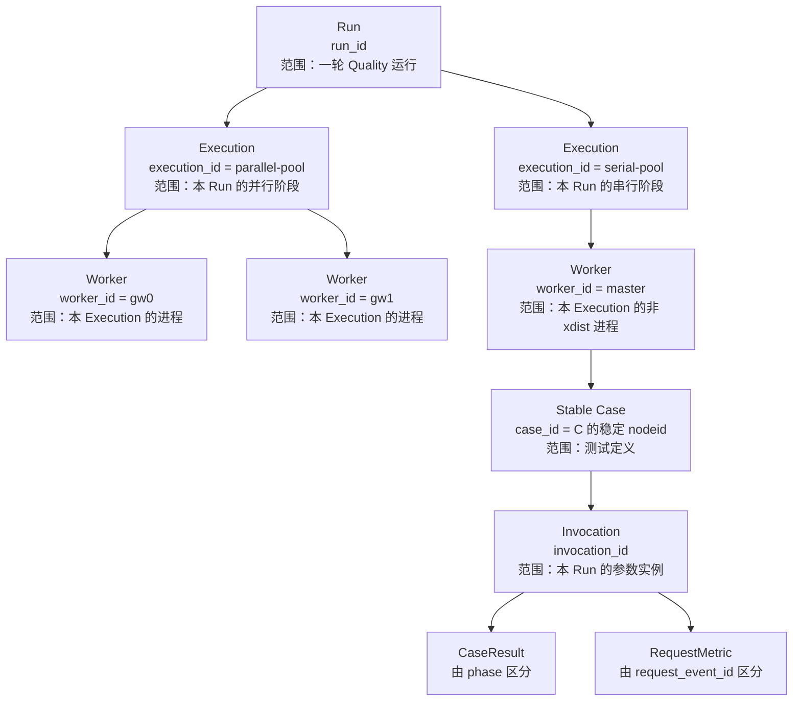

# 第 7 课：五级身份怎样保护事实归属

## 本课在事实链中的位置

第 6 课已经把“执行谁”和“在哪里执行”分开：权威 Case 计划先固定，Runner 再把计划成员放入 `parallel-pool` 或 `serial-pool`；并行池内部由 pytest-xdist 决定实际 Worker。调度位置可以变化，计划中的 pytest `nodeid` 不应因此被改写。

但是，仅保留 `nodeid`、池名或 Worker 编号，还不足以回答一条观察记录究竟属于哪次运行。考虑贯穿课程的异步图像生成 Case C：

```text
C = module/smoke/test_图片生成异步调用.py::
    TestAsyncImageGeneration::
    test_f8_09_async_image_generation_task_succeeds_with_result
```

今天和明天各运行一次 C，局部测试名相同；两个运行都可能位于 `serial-pool`，都可能由 `master` 执行；一次 C 内又可能产生任务提交和多轮状态查询。若只看方法名、池名或 Worker 编号，这些事实很容易被误认为来自同一个逻辑调用实例。

本课继续解决这个归属问题。我们先看两条只保留局部名称的记录为何无法判定归属，再随着观察范围扩大逐层补充身份，最后才得到当前框架使用的完整身份树。这个结论会被后续的质量观察与历史分析使用；pytest 原始退出、Case 记录与派生质量结论之间的事实所有权留到第 8 课。

---

## 核心问题

本课只回答一个问题：

> 当同一个异步图像 Case 在不同 Run、不同执行阶段或不同 Worker 上产生多条 Case 与请求事实时，框架怎样用真实五级身份保存归属，避免仅凭局部同名就把不同事实误认成同一个逻辑调用实例？

问题范围只到“已记录事实怎样找到所属运行与 Case 实例”。身份本身能否证明业务成功、外部任务唯一以及所有事实均已收集，不属于这个问题的肯定答案。

---

## 从一个具体现象开始

假设一个汇总表只保留了人眼容易看到的三列。运维先后两天运行真实 Case C，得到两组局部标签：

| 观察记录 | 测试方法显示名 | 阶段标签 | 进程标签 |
| --- | --- | --- | --- |
| 甲 | `test_f8_09_async_image_generation_task_succeeds_with_result` | `serial-pool` | `master` |
| 乙 | `test_f8_09_async_image_generation_task_succeeds_with_result` | `serial-pool` | `master` |

两个运行都可能提交图像任务并进行多轮状态查询。现在要回答：甲、乙是不是同一次 Case 执行？两条状态查询是不是同一次 HTTP 发送？仅凭这张表无法回答。

方法显示名只说明一个局部名称；`serial-pool` 会在不同运行中复用；`master` 也只是非 xdist 进程的固定标签。即使额外看到两个请求指向相同 URL，也不能据此判断它们属于哪一轮运行或哪一个 Case。原有信息缺少的不是“再加一个更长的名字”，而是不同范围上的归属边界。

下面逐层补齐这些边界。直到模型完整以后，才会把甲、乙代入当前算法，得到可复算的两套身份。

---

## 为什么原有解释不够

身份需要逐层增加，因为每次扩大观察范围，旧字段都会出现新的歧义。

### 起点：一个 Run 中只有一个 Case

只观察某一轮中的 C 时，方法名似乎足够，但它没有保存运行边界。框架先用 `run_id` 标识一轮启用 Quality 的运行。下一天重新运行 C 时，新的 `run_id` 让两轮记录不会仅因局部名称相同而混在一起。

仅有 `run_id` 又无法区分同一轮中的多个测试定义，于是需要继续增加一层。

### 增加多个 Case：引入 case_id

方法名不能说明测试定义的完整位置。当前仓库已经存在一组直接例子：

```text
module/material_library/test_ark_virtual_portrait_assets.py::
TestArkVirtualPortraitAssetsFlow::test_01_create_virtual_portrait_group

module/smoke/test_ark_virtual_portrait_assets.py::
TestArkVirtualPortraitAssetsFlow::test_01_create_virtual_portrait_group
```

两者类名和方法名相同，完整路径不同。只保留显示名称会误合并；保留规范化后的完整稳定 `nodeid`，即 `case_id`，才能区分这两个定义。反过来，同一个 C 跨 Run 保持相同 `case_id`，正好支持长期关联；要区分运行仍需同时保留 `run_id`。

### 增加多个 Execution：引入 execution_id

一个 Run 可以包含 `parallel-pool` 与 `serial-pool` 两个 pytest 执行阶段。仅有 `(run_id, case_id)` 能说明“本轮执行了哪个定义”，却不能报告事实来自哪个阶段。`execution_id` 因此加入。当前标准 Runner 使用字面值 `parallel-pool` 与 `serial-pool`；直接启用 pytest 插件且没有阶段配置时使用 `manual-pytest`。

### 增加多个 Worker：引入 worker_id

并行阶段可以拥有多个 xdist Worker。不同 Worker 各自写独立分片，`execution_id` 不能说明记录由哪个进程产生。`worker_id` 因此加入。典型 xdist 值是 `gw0`、`gw1`；无 xdist 时是 `master`。这些短名称只在其父级 Run 和 Execution 下有意义，跨运行复用并不构成同一身份。

### 增加多个参数实例：引入 invocation_id

pytest 参数化会让一个测试定义产生多个收集项。当前实现故意从 `case_id` 中去掉末尾参数段，所以两个参数分支仍可汇总为同一稳定 Case；但它们不是同一个逻辑调用实例。`invocation_id` 把本轮 `run_id`、稳定 `case_id` 和脱敏后的 `param_hash` 组合起来，区分本轮中的参数实例。

### 第六层：一个调用实例仍可能产生多份事实

到这里得到完整五级坐标：

```text
(run_id, execution_id, worker_id, case_id, invocation_id)
```

但仍不能停止辨析。用例阶段记录（`CaseResult`）中的 setup、call、teardown 共享 invocation，要靠 `phase` 区分；请求指标记录（`RequestMetric`）中的每次 HTTP 发送也共享 invocation，要靠 `request_event_id` 区分。换句话说：

```text
五级坐标：回答“属于谁”
phase / request_event_id：回答“属于它的哪一条事实”
```

因此，Worker 编号、线程号、分片文件名、方法显示名和外部任务 ID 都只覆盖局部维度。把其中任何一个当成完整身份，都会丢失至少一层归属。

---

## 核心概念

本课新增三个核心概念。

### 1. 归属坐标：Attribution Coordinates

归属坐标是随一条质量事实保存的五元组：

```text
(run_id, execution_id, worker_id, case_id, invocation_id)
```

它解决的是“这条事实属于哪里”，生命周期是记录被创建、写入并被下游读取的整个过程。相邻层的区别是：

- `run_id` 与 `execution_id` 描述 Runner 的运行和阶段；
- `worker_id` 描述产生事实的 pytest 进程位置；
- `case_id` 与 `invocation_id` 描述稳定测试定义和本轮参数实例。

“坐标”比“一个全局主键”更准确。当前模型要求这些字段非空，但不会为每条输入重新计算整个父子关系；每个值也不都具备全局唯一保证。可靠归属来自标准入口正确生成和传播整组坐标，而不是来自某个字段名字看起来足够独特。

### 2. 稳定 Case 与调用实例：Stable Case and Invocation

稳定 Case 是规范化后的测试定义，字段为 `case_id`。它的生命周期可以跨 Run：只要 pytest 的稳定 `nodeid` 表示不变，多轮运行就能以同一 `case_id` 关联。

调用实例（Invocation）是该稳定定义在一轮 Run 中的一个参数实例，字段为 `invocation_id`。这里的“实例”是逻辑身份，不是每次物理执行尝试的唯一 ID。它由：

```text
run_id + case_id + param_hash
```

确定。参数化分支共享 `case_id`，但通常具有不同 `param_hash` 与 `invocation_id`；跨 Run 的同一无参数 Case 也因 `run_id` 不同而具有不同 invocation。

两者的区别是：`case_id` 用来回答“长期看是哪个测试定义”，`invocation_id` 用来回答“本轮看是哪个参数实例”。`invocation_id` 不包含 `execution_id` 或 `worker_id`，所以调度变化不会自动改写逻辑调用身份；实际记录仍同时保存 execution 和 worker，说明该调用落在哪里。

### 3. 上下文传播：Context Propagation

上下文传播是把已经建立的归属信息沿真实调用链带到事实产生点。当前实现把三项运行信息放进 `QualityRunContext`，把两项 Case 信息及原始 `nodeid`、`param_hash` 放进 `QualityCaseContext`，并通过 Python 的上下文变量（Context Variable，`ContextVar`）在当前执行上下文中读取。

它与“把 ID 写进日志字符串”不同。写日志只留下文本；上下文传播让 Case Hook、请求观察器和语义收集器在创建结构化记录时复制同一组字段。它的生命周期边界也很明确：运行上下文绑定在当前 pytest 执行上下文中，Case 上下文只包围一个 `pytest_runtest_protocol`，结束后按 token 恢复。

`ContextVar` 不等于任意线程自动继承。跨线程提交必须显式复制上下文。贯穿案例的并发异步图像提交使用 `submit_with_context()`，该帮助函数先 `copy_context()`，再让工作函数在副本中运行；裸用 `executor.submit()` 不能获得相同保证。

---

## 完整运行过程

先看完整身份树，再进入源码。树中的父子关系表示“一条具体记录的归属路径”，不是五个 ID 的计算依赖：



图中 C 画在 `serial-pool/master` 下，是因为该真实文件带文件级 `serial` marker，标准 Runner 的双阶段路径会在非 xdist 串行阶段执行它。一个别的 Case 可以出现在并行 Worker 下。`case_id` 的稳定含义不由这次绘图位置决定。

五层各自的生命周期、有效范围、记录中的父级关系和传播位置如下：

| 层级 | 生命周期 | 有效或唯一性范围 | 具体记录中的父级 | 主要传播位置 |
| --- | --- | --- | --- | --- |
| `run_id` | 一轮启用 Quality 的 Runner/pytest 运行 | 预期标识一轮 Run；生成值非数学无碰撞 | 无 | 父配置、阶段环境、Worker 配置、运行上下文、事实记录 |
| `execution_id` | 一次 pytest 池/阶段 | 只应在一个 Run 内解释；当前标准值是池名 | `run_id` | 阶段环境、Worker 配置、运行上下文、分片路由 |
| `worker_id` | 一个 pytest 进程或 xdist Worker | 只应在 `(run_id, execution_id)` 内解释 | `run_id + execution_id` | xdist `workerinput`、运行上下文、分片路由 |
| `case_id` | 一个稳定测试定义，可跨 Run 关联 | 完整稳定 `nodeid` 范围；参数实例故意共享 | 具体记录所在的 Run/Execution/Worker | Case 上下文、Case/Request/语义事实、JUnit |
| `invocation_id` | 某 Run 中一个 Case 参数实例 | 由 run、case、参数哈希确定；非绝对无碰撞 | 逻辑父级是 `run_id + case_id`；记录另带 execution/worker | Case 上下文、Case/Request/语义事实、JUnit |

这里特意把 `invocation_id` 的“逻辑父级”和记录的“执行位置”分开。它的公式没有使用 `execution_id` 与 `worker_id`；所以这不是 `worker_id` 派生出 `case_id`、再派生 invocation 的值生成树。树表达的是：当 invocation 产生事实时，事实同时挂在某个 execution 和 worker 下。

真实运行依次经历以下状态变化。

### 第一步：父进程决定是否建立 Quality Run

Runner 读取 Quality 配置。若未启用，生命周期对象保持 Noop 行为，不为后续阶段注入五级身份；若是 `--collect-only`，pytest 插件也不建立运行上下文。只有启用且进入实际执行时，父进程才保留外部给定的 `run_id`，或生成一个新的父级值。

本地生成格式是 `local-UTC时间-UUID前8位`；Jenkins 环境同时提供 `JOB_NAME` 和 `BUILD_NUMBER` 时，两者经规范化后也进入字符串。这个生成策略降低普通运行中的碰撞概率，却没有全局注册与查重，因此课程不会把它描述成绝对唯一。

### 第二步：阶段环境加入 execution_id

Runner 进入具体池前，把同一个父级 `run_id` 和阶段值写入 `QUALITY_RUN_ID`、`QUALITY_EXECUTION_ID`。当前标准路径直接使用 `parallel-pool` 或 `serial-pool`，并没有调用仓库中另一个可生成 `*-1` 的 `build_execution_id()` 帮助函数。阶段退出后，环境变量恢复到进入前的状态。

这一步的输入是父级运行配置与当前阶段名；输出是供 pytest 插件读取的运行配置。若 Quality 未启用，上下文管理器只让控制流通过，不注入这些变量。

### 第三步：每个执行进程建立运行上下文

非 xdist 阶段使用 `worker_id=master`。在 xdist 阶段，controller 自身不创建 Collector，而把 `run_id`、`execution_id` 和输出目录等配置放进每个 Worker 的 `workerinput`；Worker 再读取自己的 `workerid`，建立 `QualityRunContext`。

此时运行状态从“两项环境配置”扩展为三项运行坐标。标准配置解析会生成或校验所需的 run/execution 值；解析异常时插件写警告并禁用本次收集。`QualityRunContext` 自身也拒绝空文本，但它的构造位于后续 Collector 初始化的 `try` 块之外，因此这里不把任意构造异常都说成会被同一警告分支捕获。

### 第四步：每个 pytest 收集项建立 Case 上下文

进入 `pytest_runtest_protocol` 时，插件规范化完整 `item.nodeid` 得到 `case_id`。若是参数化项，还把末尾参数 ID 和 `callspec.params` 一起规范化、脱敏并哈希；非参数化项以 `None` 生成稳定 `param_hash`。随后使用 `run_id + case_id + param_hash` 构造 `invocation_id`，形成 `QualityCaseContext`。

状态从“当前进程属于哪个 Run/Execution/Worker”扩展为“当前正在处理哪个 Case invocation”。若规范化或构造失败，插件记录 `case_context_build_failed`；后续不能把缺失身份悄悄替换成方法名。

### 第五步：事实产生时快照五级坐标

pytest 送来 setup、call 或 teardown 报告时，插件从运行上下文读取前三项，从 Case 上下文读取后两项，构造 `CaseResult`。三种 phase 共享 invocation，但每条记录保留自己的 `phase`、状态和时间。

HTTP 请求收到响应或异常时，请求观察器用相同方式构造 `RequestMetric`，同时带上本次发送的 `request_event_id`。这使多轮 Polling 既能归到 C 的同一次 invocation，又不会互相覆盖。

### 第六步：写入 Worker 分片并结束上下文

Collector 按 `execution_id-worker_id` 选择独立分片文件。文件名负责存储路由，记录正文负责完整归属。一个 Case 分片可以包含多条 `CaseResult`，一个请求分片可以包含多条 `RequestMetric`；两类文件共享相同的 execution-worker 后缀，却不是同一个文件。不能从文件名补出 `case_id` 或 `invocation_id`。

单个 runtest protocol 结束后，插件重置 Case Context；pytest 进程卸载时再重置 Run Context。JUnit XML 报告旁路只附加 `quality_case_id` 与 `quality_invocation_id`，并非五级字段的完整副本。这里仅用于说明身份覆盖范围；具体报告校验留到后续课程。下游不能把 JUnit 显示名或分片名当成完整身份。

---

## 正常路径

正常路径使用真实 Case C，并限定为一次启用 Quality 的标准 Runner 执行。因为 C 所在文件具有文件级 `pytestmark = pytest.mark.serial`，它进入 `serial-pool`；这个阶段移除了 xdist 参数，所以执行进程身份是 `master`。

为了让输入、过程和输出闭合，下面固定一条教学用运行轨迹。它使用当前实现能够接收的事实形态，但不声称仓库已经在 2026 年 8 月 26 日访问外部服务：

```text
run_id       = image-smoke-104-20260826T010000Z-a1b2c3d4
execution_id = serial-pool
worker_id    = master
nodeid       = C
参数         = None

pytest 报告 = setup passed、call passed、teardown passed
请求回调    = 1 次提交响应 + 3 次查询响应
查询业务态  = PENDING、PENDING、SUCCEEDED
```

身份演化过程是：

```text
父 Run 保留 run_id
→ serial-pool 阶段注入 execution_id
→ 非 xdist pytest 建立 worker_id=master 的 QualityRunContext
→ C 开始时，nodeid 规范化为稳定 case_id
→ None 计算为 param_hash=74234e98afe7498f
→ 生成 invocation_id=inv-a93bbdf630847f96d91234b5
→ setup/call/teardown 与 4 次请求回调读取同一上下文
→ Case 事实写入 cases-serial-pool-master.jsonl
→ 请求事实写入 requests-serial-pool-master.jsonl
→ C 结束，Case Context 恢复
```

这组给定输入确定形成以下身份结果。为突出归属，四个实际由 UUID4 生成的请求事件值缩写为 `r-submit / r-poll-1 / r-poll-2 / r-poll-3`：

```text
I = (
  image-smoke-104-20260826T010000Z-a1b2c3d4,
  serial-pool,
  master,
  C,
  inv-a93bbdf630847f96d91234b5
)

CaseResult 1 = I + phase=setup    + raw_status=passed
CaseResult 2 = I + phase=call     + raw_status=passed
CaseResult 3 = I + phase=teardown + raw_status=passed

RequestMetric 1 = I + request_event_id=r-submit
RequestMetric 2 = I + request_event_id=r-poll-1
RequestMetric 3 = I + request_event_id=r-poll-2
RequestMetric 4 = I + request_event_id=r-poll-3
```

输出共包含三条用例阶段记录和四条请求指标记录。它们的五级字段完全相同，因此可归入同一个逻辑调用实例；三种 `phase` 与四个 `request_event_id` 又使七条事实不互相覆盖。

`PENDING / SUCCEEDED` 只用于闭合这条教学轨迹，不是身份算法的输入。真实 C 可能经历不同轮询次数，也可能因网络或外部业务失败而得到不同结果；这些变化不会由身份坐标改写成成功。

正常路径结束后，Run 104 的 C 可以与未来运行中的同一稳定 `case_id` 关联，也能依靠 `run_id + invocation_id` 与未来的 invocation 分开。这个结论不需要依赖 Worker 编号恰好为 `master`；即使调度位置改变，逻辑 invocation 仍由 run、case 与参数决定。

---

## 复杂路径

复杂路径每次只改变一个主要条件，观察哪一层身份承担区分职责。

### 路径一：同一 Case 在下一轮 Run 再次执行

下面不是外部服务运行日志，而是把真实 Case C、当前标识公式与两个明确的输入值离线复算。C 没有参数化，`None` 的当前 `param_hash` 为 `74234e98afe7498f`；只把 `run_id` 从 Run 104 改为 Run 105，其余条件保持相同：

```text
Run 104
run_id        = image-smoke-104-20260826T010000Z-a1b2c3d4
execution_id  = serial-pool
worker_id     = master
case_id       = C 的完整稳定 nodeid
param_hash    = 74234e98afe7498f
invocation_id = inv-a93bbdf630847f96d91234b5

Run 105
run_id        = image-smoke-105-20260827T010000Z-b2c3d4e5
execution_id  = serial-pool
worker_id     = master
case_id       = 与 Run 104 相同
param_hash    = 74234e98afe7498f
invocation_id = inv-5cf71455f7138a2f5f6a31da
```

这两个具体输入得到表中的两个不同 invocation 值。`case_id` 相同保留纵向关联；不同 `run_id` 划开运行边界，并参与重新计算 `invocation_id`。若查询目标是“C 的历史”，可按 `case_id` 找到两轮；若查询目标是“Run 104 的这个逻辑调用实例”，必须再限定 run/invocation。只按方法名、`serial-pool` 或 `master` 归并都会丢掉运行边界。

### 路径二：同一测试定义出现两个参数实例

现在只增加参数化。当前插件会从以下两类信息计算 `param_hash`：

```text
parameter_id + callspec.params
```

两个收集项的完整 `nodeid` 末尾参数段不同，但去掉参数段后的 `case_id` 相同；参数内容不同通常使 `param_hash` 与 `invocation_id` 不同。仓库的插件测试直接覆盖了“一个 `case_id`、两个 `invocation_id`”这一合同。

这里不能把 `case_id` 改成完整参数 nodeid 来“解决”问题，否则会失去稳定定义层；也不能只保留 `param_hash`，因为同一参数值可以出现在不同 Case 或不同 Run。两层并存才分别支持长期关联和本轮实例区分。

还有一个安全边界：参数值先经过规范化和脱敏。两个只在敏感值上不同、脱敏后等价的参数可能得到相同哈希；哈希又经过截断。因此 `invocation_id` 是当前合同中的确定性标识，不是对任意原始秘密值的数学唯一证明。

### 路径三：跨线程时没有复制当前 Context

同一异步图像模块的并发提交帮助路径真实使用 `submit_with_context(executor, fn)`。该函数复制的不只是 `QualityCaseContext`，还包括以 `ContextVar` 绑定的 Quality Runtime Hook。现在只改变提交方式：若改成裸 `executor.submit(fn)`，新线程通常同时看不到当前 Case Context 和已绑定的 Quality Hook。

真实调用方向因而是：

```text
裸线程没有继承当前 Context
→ get_runtime_hooks() 取得默认 NoopRuntimeHooks
→ 请求照常走业务路径，但不进入 Quality 请求观察器
→ 不产生 RequestMetric，也不保证产生 IntegrityIssue
```

所以结果不能写成“请求为零”或“没有发生请求”。已知的是观察事实缺失；由于观察器本身未运行，连缺失诊断也可能没有。这正是标准调用链显式使用 `copy_context()` 的原因。

贯穿案例当前没有这个缺陷：`_submit_concurrent_async_image_tasks()` 在 `module/smoke/test_图片生成异步调用.py:179-190` 通过 `submit_with_context()` 提交工作。本段描述的是绕过现有帮助函数后的边界，不是声称真实 C 已经丢失上下文。

### 路径四：Hook 已执行，但 Case Context 缺失

再只改变一个条件：假设 Quality Hook 与 Collector 仍处于活动上下文，请求观察器已经被调用，但此时 `get_case_context()` 返回空。该分支与“裸线程退回 Noop”不同。请求观察器会拒绝用线程号、方法名或最近一个 Case 补身份：

```text
请求观察器已进入，Collector 存在
→ 发现 case_context is None
→ 不写 RequestMetric
→ 写一条 code=missing_case_context 的完整性问题记录（IntegrityIssue）
```

仓库测试通过直接清空 Case Context 后调用请求记录函数覆盖这一合同。它证明分支行为，不证明真实异步图像主线已经走过该分支。两种缺失场景的共同结论是：缺少 RequestMetric 不能解释为零次请求、零成本或业务成功。

### 路径五：同一 Run 人为重复调度同一 Case 与参数

只改变调度约束：若绕过权威计划去重，在同一个 `run_id` 中重复执行相同 `case_id + param_hash`，公式会再次得到相同 `invocation_id`。因为 invocation 的计算不含 execution 与 worker，把第二次物理执行挪到另一个 Worker 也不会自动产生新逻辑调用 ID。

此时五级记录中的 execution/worker 可以暴露不同产生位置，但当前身份公式不能把重复执行自动改造成两个 invocation。相同 invocation 已经无法单独区分这两次物理尝试，必须依赖权威计划拒绝重复，并由后续完整性处理识别异常；本课不提前展开合并规则。

所以五级身份的有效前提包含第 5、6 课建立的权威计划与守恒调度。身份保护归属，计划约束重复；两者解决的问题不同，不能用其中一个替代另一个。

---

## 对应的框架实现

概念模型和运行顺序明确后，再把关键分支映射到源码。以下片段只保留本课相关语句，省略了其他配置与异常日志。

### 1. 父 Run 只生成一次，阶段只注入位置

```python
# run_orchestration/environment.py
return QualityRuntimeConfig(
    enabled=True,
    run_id=configured.run_id or new_parent_run_id(),
    execution_id=None,
    output_dir=output_dir,
)

values = {
    QUALITY_ENABLE_ENV: "1",
    QUALITY_RUN_ID_ENV: str(quality_config.run_id),
    QUALITY_EXECUTION_ID_ENV: execution_id,
    QUALITY_OUTPUT_DIR_ENV: str(quality_config.output_dir),
}
```

输入是父级配置与当前阶段名。第一次状态变化确定一轮 Run 的 `run_id`；第二次只在阶段范围加入 `execution_id`。Runner 对两个池复用同一个父级配置，所以不会为并行池和串行池各生成一个 Run。

若 Quality 关闭，`quality_stage_environment()` 直接 `yield`；若配置非法，父配置解析会降级为关闭。这意味着“框架有五级身份实现”与“当前命令确实启用了该实现”必须分开陈述。

### 2. 稳定 Case 与 Invocation 使用不同输入

```python
# quality/identifiers.py
def build_case_id(nodeid: str) -> str:
    return normalize_nodeid(nodeid).stable_nodeid


def build_invocation_id(run_id: str, case_id: str, param_hash: str) -> str:
    parts = tuple(_require_non_empty(value, name) for name, value in (
        ("run_id", run_id),
        ("case_id", case_id),
        ("param_hash", param_hash),
    ))
    digest = hashlib.sha256("\0".join(parts).encode("utf-8")).hexdigest()[:24]
    return f"inv-{digest}"
```

第一段输入完整 pytest `nodeid`，输出去除末尾参数段后的稳定定义。第二段输入 Run、稳定 Case 与参数哈希，输出本轮逻辑 invocation。状态变化发生在标识值的构造上，不修改 pytest 原始 `nodeid`。

空输入会触发校验错误；哈希输出被截断，所以该函数提供确定性映射，却没有提供全局碰撞检测。还可以直接确认：函数参数中没有 `execution_id` 和 `worker_id`。

### 3. Worker 建立运行上下文，单项建立 Case 上下文

```python
# quality/pytest_plugin_runtime.py
worker_id = _worker_id(config)
run_context = QualityRunContext(
    run_id=_required(runtime_config.run_id, "run_id"),
    execution_id=_required(runtime_config.execution_id, "execution_id"),
    worker_id=worker_id,
    output_dir=runtime_config.output_dir,
)
state.run_token = set_run_context(run_context)

# 进入单个 pytest item 时
case_context = _build_case_context(item, collector.run_context.run_id)
token = set_case_context(case_context)
try:
    yield
finally:
    reset_case_context(token)
```

第一段把环境或 xdist `workerinput` 中的值转成当前进程上下文；第二段把当前 item 转成临时 Case 上下文。输出不是一个拼接字符串，而是两个结构化、只读的数据对象。

异常方向也不同：运行配置解析异常会写警告并停用收集；`QualityRunContext` 成功建立后，Collector 或 Hook 初始化异常才进入清理分支并取消 Collector。`QualityRunContext` 构造本身位于这个 `try` 块之外，不能宣称它的任意构造异常也由该分支接住。单项身份构造失败则会写完整性问题，并让该项缺少可信 Case 事实。代码没有用 `gw0`、线程 ID 或测试显示名兜底生成假的 invocation。

### 4. Case 与请求事实快照同一组五级字段

```python
# quality/pytest_plugin_runtime.py：CaseResult 的身份部分
result = CaseResult(
    run_id=collector.run_context.run_id,
    execution_id=collector.run_context.execution_id,
    worker_id=collector.run_context.worker_id,
    case_id=case_context.case_id,
    invocation_id=case_context.invocation_id,
    phase=CasePhase(report.when),
    # 其余状态与时间字段省略
)

# quality/request_metrics.py：RequestMetric 的身份部分
metric = RequestMetric(
    run_id=run_context.run_id,
    execution_id=run_context.execution_id,
    worker_id=run_context.worker_id,
    case_id=case_context.case_id,
    invocation_id=case_context.invocation_id,
    request_event_id=request_event_id,
    # 其余请求字段省略
)
```

两段代码的输入都来自已建立的 Run 与 Case Context，输出则是不同事实模型。`CaseResult` 用 `phase` 细分测试阶段；`RequestMetric` 用 `request_event_id` 细分 HTTP 发送。五级字段相同只说明共同归属，不说明两个记录内容相同。

这些模型对五级文本做非空校验，但不会重算 `case_id` 与 `invocation_id`。因此结构校验（Schema validation）通过只能证明字段形状和局部约束成立，不能单独证明来源真实、父子关系正确或事实完整；更完整的下游校验留到后续课程。

### 5. 缺少 Case Context 时拒绝伪造请求归属

```python
# quality/request_metrics.py
case_context = get_case_context()
if case_context is None:
    _record_missing_case(collector, request_event_id)
    return
```

输入是一条已经进入请求观察器的响应或异常。若 Case Context 存在，函数继续构造 `RequestMetric`；若缺失，状态变化是新增一条 `missing_case_context` Integrity，输出中没有对应 RequestMetric。

这个分支保护了“记录一旦存在，就应有可解释归属”，代价是观察数据会缺失。下游不能把缺失行解释为零次请求、零耗时或业务成功。

### 6. 跨线程需要显式复制上下文

```python
# common/context_executor.py
def submit_with_context(executor, function, /, *args, **kwargs):
    context = copy_context()
    return executor.submit(context.run, function, *args, **kwargs)
```

输入是提交线程的当前 Context 与待执行函数；输出是普通 Future。关键状态变化是工作函数在复制的 Context 中运行，因此可以读取提交时的 Run/Case 身份。若工作函数自身失败，异常仍由 Future 传播；这个帮助函数不改写业务结果。

异步图像案例在 `module/smoke/test_图片生成异步调用.py:179-190` 的并发提交处真实调用了它。框架存在该能力、这个业务路径已经使用它、其他任意线程路径也一定使用它，是三个不同命题；当前证据只支持前两个。

### 源码与测试定位

- `quality/identifiers.py:54-126`：Run、Case、参数、Invocation 与 Request Event 标识规则。
- `run_orchestration/environment.py:19-98`、`run_orchestration/runner.py:92-178`：父 Run 与阶段环境的真实调用链。
- `quality/runtime_context.py:8-99`、`quality/pytest_plugin_runtime.py:67-209,212-249,273-342,378-388`：运行/Case 上下文的建立、传播、消费和复位。
- `quality/models.py:167-195,238-272`、`quality/semantic_models.py:86-102`：Case、请求与语义事实共同使用的五级字段。
- `quality/request_metrics.py:40-129,267-293`：请求事件 ID、五级身份复制与缺失 Case Context 分支。
- `quality/collector.py:26-60`：以 execution/worker 命名分片及记录写入。
- `common/runtime_hooks/provider.py:9-27`、`quality/runtime_adapter.py:82-89`：Runtime Hook 的 ContextVar 绑定、Noop 回退与 Quality 观察入口。
- `common/context_executor.py:12-20`、`module/smoke/test_图片生成异步调用.py:179-190`：跨线程上下文复制及真实业务调用点。
- `quality/config.py:9-13,48-98`、`run_orchestration/quality_lifecycle.py:36-50,124-143`、`Jenkinsfile:18-30,142-156,174-216`：Quality 默认开关、Noop 生命周期和流水线启用边界。
- `tests/quality/test_quality_identifiers.py`、`test_quality_runtime_context.py`、`test_quality_context_executor.py`：标识算法与上下文合同。
- `tests/quality/test_quality_pytest_plugin.py`、`test_quality_request_metrics.py`、`test_quality_run_master.py`：参数实例、JUnit 属性、xdist 分片、缺失上下文与跨阶段 Run 身份。

测试证明这些合同受到当前测试套件覆盖，不能替代生产源码证明当前实现，也不能证明外部图像服务已经兑现任务唯一、幂等或成功契约。

---

## 能够保证什么

在标准入口启用 Quality、身份生成和上下文传播均成功的前提下，当前实现能够保证：

1. `CaseResult`、`RequestMetric` 与语义身份模型使用同名的 `run_id / execution_id / worker_id / case_id / invocation_id` 五级坐标。
2. 同一父 Runner 生命周期中的并行池和串行池共享一个 `run_id`，并以不同 `execution_id` 表达阶段位置。
3. xdist Worker 从 controller 取得同一 run/execution 配置，并以自身 `worker_id` 写独立的阶段—Worker 分片；非 xdist 阶段使用 `master`。
4. `case_id` 保留稳定测试定义：路径、类与方法仍参与，末尾参数段被去除；只同名而完整稳定路径不同的测试不会得到相同 `case_id`。
5. 相同的 `run_id + case_id + param_hash` 会确定地产生相同 `invocation_id`；本课复算的两组输入以及当前测试中的具体输入变化得到不同结果，但算法不承诺任意不同输入绝不碰撞。
6. 调度位置不参与 invocation 公式；同一 Run、Case 与参数在上下文正确传播时，不会因为落到另一个 Worker 就被当成另一个逻辑调用。
7. 同一 invocation 的 Case phase 和多次 HTTP 发送可以保持共同归属，同时分别由 `phase` 与 `request_event_id` 细分。
8. 在 Quality 请求观察器已经执行且 Collector 存在时，缺少 Case Context 不会触发身份猜测；观察器跳过 RequestMetric，并写 `missing_case_context` 完整性问题。
9. 贯穿案例的并发异步图像提交路径通过 `copy_context()` 传播当前上下文，不以线程编号充当身份。

这些保证描述的是当前结构化事实如何归属，不等于每次运行一定收集到全部事实。

---

## 保证成立的前提

上述保证依赖以下条件：

- 运行经过标准 Runner，或直接 pytest 调用正确设置了 Quality 配置；`QUALITY_ENABLE` 默认是关闭的，启用能力不等于本次已启用。
- 执行不是 `--collect-only`。收集阶段可以形成权威 Case 计划，但插件在 collect-only 下不建立这些运行事实。
- 父级 `run_id` 没有被调用方错误复用；同一 Run 内的 execution 名与同一 execution 内的 Worker 名也应保持预期区分。
- Case 来自权威收集项，完整 `nodeid` 能被规范化；同一 Run 不应绕过计划约束重复调度同一 Case 与参数。
- 所有需要记录请求的调用都发生在有效的 `QualityCaseContext` 中；跨线程代码使用 `submit_with_context()` 或等价的 `copy_context()` 传播方式。
- 每个 execution/worker 组合拥有自己的分片路径。若两个进程错误地拿到相同组合，它们可能写向同一路径，Collector 不会替调用方证明 Worker 身份唯一。
- 下游读取记录正文中的身份字段，不把 `cases-serial-pool-master.jsonl` 之类的文件名、JUnit 显示名或日志顺序当成完整身份。
- 要对真实异步图像结果下业务结论，仍需有效凭证、网络、服务额度和外部服务响应。身份机制只保存归属，不兑现这些外部条件。
- 在 Jenkins 中，实际 Real Smoke 阶段必须被启用；该参数默认关闭。只运行 Collect Smoke 或框架单元测试不能证明一次外部 Smoke 已产生五级质量事实。

任一前提失败时，应把相应事实标为缺失、冲突或未知，不能用空字符串、零值或成功状态补齐。

---

## 不能保证什么

五级身份机制不能保证：

1. **任一字段在全世界绝对唯一。** `run_id` 使用截短 UUID，`param_hash` 与 invocation 摘要也被截断；源码没有全局碰撞注册表。
2. **五个值是逐层哈希出来的。** `invocation_id` 只使用 run、case 与参数哈希，不使用 execution 或 worker；身份树表达记录归属，不表达全部计算依赖。
3. **`invocation_id` 唯一标识一次物理执行尝试。** 同一 Run 中重复执行相同 Case 与参数会重得同一 invocation；权威计划与调度约束仍然必要。
4. **五级坐标唯一标识每条记录。** 同一 invocation 的 Case 事实还需 `phase`，请求事实还需 `request_event_id`，语义层也有自己的领域键。
5. **Worker 编号、线程号、文件名或显示名可以替代完整身份。** `gw0` 会复用，线程不在五级模型中，一个分片装多条记录，显示名还可能跨目录同名。
6. **外部 `task_id` 或 `server_request_id` 等于质量身份。** 它们由外部服务或协议提供，既不覆盖 Runner 归属，也不由五级算法保证唯一或幂等。
7. **结构校验通过就表示身份关系真实。** 当前模型主要验证必填文本和结构，不为每条输入重算 case/invocation，也不普遍验证文件名、execution 与 worker 的父子一致性；具体聚合校验留到后续课程。
8. **存在 CaseResult 就表示 Case 成功。** 身份与结果是不同维度；setup、call、teardown 的原始状态仍需分别读取，第 8 课会说明原始 pytest 事实的所有权。
9. **没有 RequestMetric 就表示没有请求或成本为零。** Hook 关闭、裸线程回退到 Noop、Context 丢失、进程终止或写入失败都可能造成观察缺口；缺失必须保持未知，也不保证总有完整性问题记录。
10. **ContextVar 自动覆盖任意新线程或进程。** 当前异步图像并发路径显式复制 Context；绕过帮助函数的路径没有同等保证。
11. **分片文件存在就证明所有 Worker 事实完整。** 文件名只含 execution 与 worker，一个文件的存在不能证明所有预期 Worker 的事实齐全；完整校验范围留到后续课程。
12. **五级身份证明外部服务成功、幂等或任务唯一。** 它只解决本框架记录的归属问题，外部服务契约仍需独立证据。

最重要的边界可以压缩成一句话：**五级身份让已记录的事实可归属，但不会把未记录的事实变成零，也不会把结构合法的字段变成业务真相。**

---

## 与下一课的关系

本课把第 6 课的调度位置接入了完整事实归属：

```text
一轮 Quality Run 建立 run_id
→ 每个 pytest 阶段加入 execution_id
→ 每个执行进程加入 worker_id
→ 完整稳定 nodeid 形成 case_id
→ run + case + 参数形成 invocation_id
→ Case、请求和语义事实快照五级坐标
→ phase / request_event_id 继续区分具体事实
```

因此，同名 Case、复用的池名和 Worker 编号不再需要被猜成同一次事实；同一稳定 Case 的多轮 invocation 既能关联，也能分开。与此同时，身份只回答“事实属于谁”，还没有回答“哪一种结果拥有最终解释权”。

下一课将处理这个自然出现的问题：当 pytest 原始退出、Case 记录和附属质量组件同时给出结果时，为什么 pytest 原始退出事实不能被后续派生结论覆盖，以及框架怎样保留这一所有权边界。
