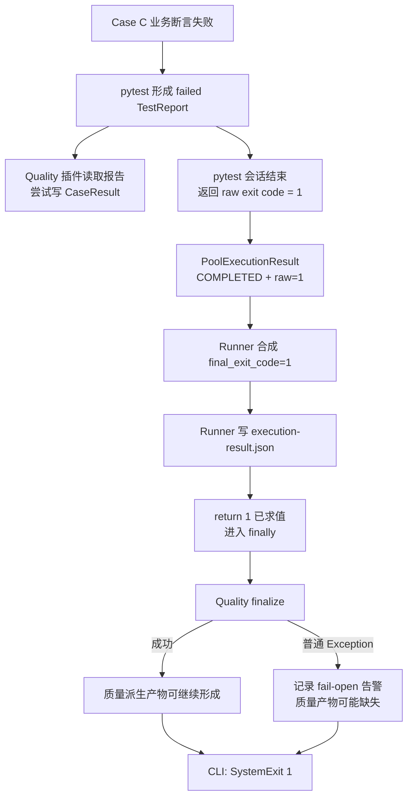

# 第 8 课：pytest 原始退出事实不能被覆盖

## 本课在事实链中的位置

第 7 课已经建立五级归属坐标：`run_id / execution_id / worker_id / case_id / invocation_id`。它让一条 Case 事实或请求事实能够回答“属于哪一轮运行、哪个阶段、哪个执行进程和哪个调用实例”。身份解决了归属，却没有决定谁有权解释执行结果。

同一次运行里会同时出现几种看似相近的结果：pytest 为整个测试会话返回一个整数退出码，Quality 插件为 setup、call、teardown 分别记录 Case 状态，Runner 为多个执行池计算项目级最终码，Quality 归并阶段还会形成完整性与失败分类等派生结论。如果把这些结果都压缩成一个“成功/失败”，附属组件的故障就可能遮住原本已经发生的测试失败，或者把观察资料缺失误写成业务成功。

本课继续使用异步图像生成 Case C，解释这些结果各自回答什么问题、由谁产生，以及为什么后生成的质量结论不能反向改写 pytest 已经给出的原始退出事实。下一课将在这条所有权边界上进一步拆开业务请求路径与观察路径。

---

## 核心问题

> 当 Case C 的业务断言失败，而 Quality 最终化随后也失败时，框架怎样保留 pytest 的原始失败，并让附属故障只增加诊断信息或留下未知，而不是把测试结果改成另一个结论？

本课讨论标准入口 `run_master.py` 的真实控制流。它不承诺任何第三方 pytest 插件、任意 `BaseException` 或任意绕过 Runner 的调用方式都具有相同隔离效果。

---

## 从一个具体现象开始

仍使用前几课中的真实 Case C：

```text
module/smoke/test_图片生成异步调用.py::
TestAsyncImageGeneration::
test_f8_09_async_image_generation_task_succeeds_with_result
```

该 Case 调用异步图像生成与轮询后，在 `module/smoke/test_图片生成异步调用.py:65-70` 检查最终业务状态是否属于 `succeeded/success`，并继续检查输出是否存在。下面固定一组教学输入：外部响应的最终状态为 `completed`。默认媒体轮询策略把 `completed` 列为成功终态，所以 `poll_get()` 会把响应交还给 Case；但 Case C 自己接受的成功状态集合只有 `succeeded/success`，因此随后在第 66 行触发状态断言失败。这个输入用于推导框架控制流，不表示当前真实环境已经出现该响应，也不表示外部服务承诺成功或失败。

运行条件如下：

```text
入口          = python run_master.py <Case C>
Quality       = 已启用
run_id        = image-smoke-104-20260826T010000Z-a1b2c3d4
execution_id  = serial-pool
worker_id     = master
权威产物写入  = 成功
业务输入      = 最终响应体 {"status":"completed"}；轮询返回响应，Case C 的 call 阶段断言失败
```

先看 Quality 正常最终化的基线路径，再只增加一个变化：Quality 最终化抛出普通 `OSError`。

| 时点 | pytest 与 Runner 主线 | Case 观察线 | Quality 最终化线 |
| --- | --- | --- | --- |
| T0 | Runner 已完成权威收集，开始 `serial-pool` | 五级上下文已建立 | 尚未开始 |
| T1 | 轮询把 `completed` 判为成功终态并返回响应；Case C 不接受该状态，断言不成立 | 尚未收到 call 报告 | 尚未开始 |
| T2 | pytest 形成 call 阶段的 failed `TestReport` | 插件尝试写入 `raw_status=failed`、`final_status=failed` | 尚未开始 |
| T3 | pytest 会话完成并返回整数 `1` | CaseResult 可能已写入；若写失败则可能只留下完整性问题或告警 | 尚未开始 |
| T4 | 池结果成为 `COMPLETED + raw_pytest_exit_code=1` | 不再改变 pytest 报告 | 尚未开始 |
| T5 | Runner 合成 `final_exit_code=1`，写 `execution-result.json` | 观察事实仍是旁路资料 | 尚未开始 |
| T6 | Runner 准备返回 `1` | 不反写 Runner 退出码 | 基线：成功完成；复杂分支：抛 `OSError` 后被转成告警 |
| T7 | CLI 把 Runner 返回值变成 `SystemExit(1)` | 可能完整，也可能存在诊断缺口 | 复杂分支不能把 `1` 变成 `0` |

这里同时出现了 `failed`、`COMPLETED`、`FINISHED`、退出码 `1` 和一条 Quality 告警。它们并不矛盾：`failed` 描述一个 Case 阶段；`COMPLETED` 描述 pytest 调用已经返回；在没有执行池 Python 异常时，Runner 传给 Quality 的 `FINISHED` 描述运行生命周期走到了最终化；整数 `1` 描述 pytest 会话包含测试失败。Quality 最终化若失败，磁盘上的最终 RunRecord 还可能缺失，不能因为 Runner 曾准备传入 `FINISHED` 就声称质量产物已经完整落盘。

---

## 为什么原有解释不够

如果只说“最后结果是失败”，至少会丢掉四个关键区别。

第一，pytest 的退出码是会话级事实。`1` 表示该次 pytest 调用属于 `TESTS_FAILED`，但仅凭 `1` 不能定位是哪个 Case、哪个阶段或哪个业务断言造成失败。

第二，CaseResult 是阶段级观察事实。它能把 C 的 call 阶段标成 `failed`，也能把 setup 或 teardown 的失败标成 `error`；但一条 CaseResult 不能代替整个 pytest 会话的退出码。

第三，Quality 的完整性、失败分类、语义指标或长期治理状态，是根据已收集事实产生的派生结论。派生结论可以增加解释，却不能拥有 pytest 会话退出事实。若观察写入失败，合理结果是“观察事实缺失或未知”，不是把测试改成通过。

第四，Runner 的项目级 `final_exit_code` 是对一个或多个池级原始码以及 Runner 自身错误的合成。单池正常返回时，它经常与池级原始码相同；多池或 Runner 产物写入失败时，两者不一定相同。因此，既不能让 Quality 状态覆盖原始码，也不能把 Runner 最终码误称为某个单池原始码的别名。

要把这些区别稳定下来，需要先定义三类核心事实，再沿真实控制流观察它们何时产生。

---

## 核心概念

### 1. pytest 原始退出事实：Raw pytest exit fact

pytest 原始退出事实，是一次 `pytest.main(...)` 调用实际返回的整数。当前 Runner 使用的值为：

| 整数 | 当前常量名 | 回答的问题 |
| ---: | --- | --- |
| 0 | `PYTEST_EXIT_OK` | 该 pytest 会话是否按 pytest 规则成功 |
| 1 | `PYTEST_EXIT_TESTS_FAILED` | 该会话是否包含测试失败 |
| 2 | `PYTEST_EXIT_INTERRUPTED` | 该会话是否被中断 |
| 3 | `PYTEST_EXIT_INTERNAL_ERROR` | pytest 是否发生内部错误 |
| 4 | `PYTEST_EXIT_USAGE_ERROR` | pytest 调用参数或用法是否错误 |
| 5 | `PYTEST_EXIT_NO_TESTS_COLLECTED` | 是否没有收集到测试 |

它的生命周期是一轮具体 pytest 调用，从 `pytest.main()` 返回时产生，进入对应池的 `PoolExecutionResult.raw_pytest_exit_code`。它与业务状态不同：外部任务的 `completed` 是异步图像业务事实，pytest 的 `1` 是测试会话事实。

### 2. Case 结果：Case result

Case 结果是 Quality 插件从 pytest 已形成的 `TestReport` 中读取并保存的阶段级观察记录。当前 `CaseResult` 同时保存五级身份、`phase`、`raw_status`、`final_status`、耗时和时间。

它的范围小于 pytest 会话：一个 invocation 最多会看到 setup、call、teardown 等多个阶段记录。当前标准插件在采集时把同一个局部 `status` 同时写入 `raw_status` 与 `final_status`，所以不能描述成“Quality 在采集时纠正了 pytest 状态”。

相邻概念的区别是：pytest 原始退出事实回答“整个 pytest 调用怎样退出”；Case 结果回答“某个稳定身份下的某个阶段发生了什么”。

### 3. 派生质量结论：Derived quality conclusion

派生质量结论是 Quality 根据已经记录的 Case、请求、JUnit 或完整性事实计算出的解释，例如运行完整性、失败分类、语义指标或历史治理信号。它的生命周期晚于原始事实，成立范围受输入完整性和校验结果限制。

派生结论与原始事实的关系是：

```text
原始 pytest / Case / 请求事实
          ↓ 读取、校验、归并、解释
派生质量结论
```

箭头只能说明“派生结论依赖原始事实”，不能反向理解为“派生结论有权重写原始事实”。Quality 失败可以使自身结论缺失、降级或未知；它不能把 pytest 已返回的 `1` 解释成 `0`。

Runner 的 `final_exit_code` 不另立为第四个核心概念。它是 Runner 在进程边界上执行的合成结果：读取各池原始码，保留终止类退出，保留测试失败，并在 Runner 自身无法完成权威执行产物时避免返回伪成功。

---

## 完整运行过程

先用一张所有权与控制流图放置三类事实：



图中的两条分支共享同一个 pytest 原始结果。下面按执行顺序展开每一步。

### 第一步：pytest 先形成阶段报告

默认媒体轮询策略把 `completed` 放在成功集合中。Case C 在 call 阶段先收到轮询返回的这份响应，再执行自己的、更窄的 `succeeded/success` 断言；给定状态不在该集合中，断言抛出失败，pytest 构造 `TestReport`。如果输入改成默认策略的失败终态 `failed`，`poll_get()` 会更早抛出 `PollingFailedError`，第 65～70 行不会执行；这不是本课选用的路径。Quality 的 `pytest_runtest_logreport()` 接收的是已经形成的阶段报告，它读取 `report.when`、`report.duration` 和 outcome，再尝试构造 CaseResult。

输入是 pytest 报告，输出是旁路观察记录。插件没有给 `report.outcome` 赋新值，也没有设置 session exit status。即使 CaseResult 写入失败，已形成的 failed 报告仍归 pytest 所有。

### 第二步：pytest 返回会话级原始码

当该 pytest 会话完成后，`run_pytest()` 执行 `int(pytest.main(pytest_args))`。在本课输入下，pytest 返回 `1`。`execute_pool()` 把这个整数原样写入 `raw_pytest_exit_code`，并把池状态写成 `COMPLETED`。

`COMPLETED` 的判断条件是“pytest 调用正常返回”，不是“返回值等于 0”。所以 `COMPLETED + raw=1` 是合法且必要的组合。如果调用 pytest 的 Python 路径直接抛出普通 `Exception`，池状态才是 `ERROR`，此时源码不伪造一个 pytest 原始码，`raw_pytest_exit_code` 保持 `None`。

### 第三步：Runner 合成项目级最终码

Runner 收集所有实际执行池的原始码。当前规则先保留按池顺序遇到的第一个终止码 `2/3/4/5`；没有终止码但存在 `1` 时返回 `1`；全部为 `0` 时返回 `0`；其他未知非零值收敛为 `1`。任一池处于 `ERROR` 时，Runner 也返回 `1`。

因此，若并行池为 `1`、串行池为 `0`，项目级结果仍为 `1`。成功池不能抵消失败池。这个合成产生新结果，却没有修改任何池对象中的原始字段。

### 第四步：Runner 先写自己的权威执行产物

`execution-result.json` 分字段保存：

```text
collection_exit_code
pool_results[*].status
pool_results[*].raw_pytest_exit_code
final_exit_code
```

这些字段同时存在，是为了保留来源与合成结果。若权威执行产物写入失败，Runner 对非终止结果返回 `1`，对 `2/3/4/5` 保留原码。这是 Runner 自己没有兑现执行账本时新增的项目级失败，不是 Quality 把 pytest 原始事实改成另一种状态。写入既然失败，磁盘上可能残留的旧文件也不能当成本轮证据。

### 第五步：返回前执行附属最终化

Runner 在 `try` 中计算并准备返回 `final_exit_code`，随后 Python 必须先执行 `finally`。因此，`finally` 本身并不会自动保护先前的返回值；真正提供隔离的是 Quality 生命周期内部的 `except Exception`。

在本课复杂输入中，`finalize_quality_run()` 抛出普通 `OSError`。`EnabledQualityRunLifecycle.finalize()` 捕获它并输出告警，没有把异常交回 Runner，也没有返回另一个退出码。先前求得的 `1` 因而继续返回。CLI 最后通过 `SystemExit(1)` 把该整数变成操作系统可见的进程退出状态。

### 第六步：分别解释最后留下的事实

本课输入最终支持以下结论：

| 事实或结论 | 最终值 | 所有者与含义 |
| --- | --- | --- |
| Case C call 报告 | `failed` | pytest；该阶段断言失败 |
| `CaseResult.raw_status` | `failed`，若观察写入成功 | Quality 插件对 pytest 报告的副本 |
| 池状态 | `COMPLETED` | Runner；pytest 调用正常返回 |
| 池级原始码 | `1` | pytest；本次会话包含测试失败 |
| Runner 最终码 | `1` | Runner；单池原始失败被保留 |
| Quality 生命周期输入状态 | `FINISHED` | Runner；没有池级 Python 调用异常，不表示用例通过 |
| Quality 最终产物 | 可能缺失或停在降级初始记录 | 取决于异常发生位置，不能补写成完整 |
| 进程退出状态 | `1` | CLI 对 Runner 返回值的传递 |

其中只有明确写成“若观察写入成功”的 CaseResult 才能作为已存在事实。若 Collector 连主事实和 Integrity 都写失败，课程能够断言的是“pytest 仍失败，Quality 诊断出现缺口”，不能断言磁盘上存在一条完整失败记录。

---

## 正常路径

正常路径先不加入 Quality 故障，只保留 Case C 的业务断言失败。输入仍是单池标准 Runner、Quality 已启用、权威执行产物可写。

```text
T0：权威收集成功，collection_exit_code = 0
T1：serial-pool 开始执行 Case C
T2：轮询按默认策略返回终态 completed，Case C 的成功集合不接受它，call 断言失败
T3：pytest 形成 call failed 报告
T4：Quality 插件写 CaseResult(raw_status=failed, final_status=failed)
T5：pytest.main() 返回 1
T6：池结果 = COMPLETED + raw_pytest_exit_code=1
T7：Runner final_exit_code = 1，并成功写权威执行产物
T8：Quality 归并与最终记录成功完成
T9：run_master.py 以 SystemExit(1) 结束
```

这条路径中，Quality 最终 RunRecord 可以是 `status=finished`。这里的 `finished` 只表示 Runner 没有把执行池判为 `ERROR`，并把生命周期带到了最终化；用例失败是 pytest 正常返回的一种结果，所以池仍为 `COMPLETED`。两个“完成”词都没有把 call 阶段的 `failed` 或原始退出码 `1`改成通过。

从输入到输出的推导是闭合的：默认轮询策略接受 `completed` 并返回响应，Case C 自己的成功集合不接受它，pytest 因断言失败产生 failed 报告并返回 `1`；Quality 保存报告副本并形成派生资料；Runner 保存池级 `1`，单池合成仍为 `1`；CLI 最终退出 `1`。

---

## 复杂路径

复杂路径以正常路径为基线，每次只增加一个主要变化。

### 路径一：Quality 最终化抛出普通异常

保持 Case C 断言失败、pytest 返回 `1`、Runner 权威产物写入成功，只把 T8 改为：`finalize_quality_run()` 抛出 `OSError("quality unavailable")`。

控制流变为：

```text
Runner 已求得并准备返回 1
→ 进入 finally
→ Quality finalize 抛普通 OSError
→ EnabledQualityRunLifecycle 捕获 Exception
→ 输出 “Quality finalization failed open” 告警
→ finally 正常结束
→ Runner 继续返回 1
→ CLI 产生 SystemExit(1)
```

这组组合行为由当前源码中两个没有反向数据依赖的分支推导得到。现有测试直接覆盖的是“pytest 返回 `0`，Quality 最终化抛 `OSError`，Runner 仍返回 `0`”；仓库没有把“pytest 返回 `1`”和“Quality 最终化异常”放进同一个现成测试。课程因此不会把组合场景说成已有单测直接覆盖。

派生侧的结果必须保守表达：归并、最终 RunRecord、语义、指标或后续历史步骤可能没有完成，具体缺失范围取决于异常发生点。不能把缺失写成零问题、完整或成功。

### 路径二：CaseResult 写入失败

恢复 Quality 最终化本身可运行，只把 T4 改为 Collector 写 CaseResult 时磁盘抛出普通 `OSError`。Collector 捕获主事实写入异常，尝试增加 `case_write_failed` Integrity；若 Integrity 自身也写失败，则只尝试输出告警。

这条观察路径会向 `report.user_properties` 追加用于 JUnit 的 Case 与 Invocation 身份，但没有修改 `report.outcome`，也没有把 Collector 的写入返回值送进 pytest 会话退出码计算：

```text
failed TestReport 已形成
→ CaseResult 写入失败
→ 尝试记录 Integrity / 告警
→ pytest 继续完成自己的会话
→ 原始退出码仍按 pytest 实际结果产生
```

仓库测试直接覆盖“通过用例 + Collector 写失败时 pytest 仍报告 passed”，证明 Collector 故障与 pytest outcome 隔离；它没有直接覆盖本课“失败用例 + Collector 写失败”的组合。后者的结论来自插件、Collector 与 Runner 之间没有反向写入的控制流。观察缺口仍然是真实损失，不能因为退出码被保留就声称诊断完整。

### 路径三：两个执行池给出不同结果

现在只增加多池条件：并行池正常返回 `1`，串行池正常返回 `0`。并行池的 `1` 不属于终止码集合，所以串行池仍会执行；两个池都记为 `COMPLETED`。

| 执行池 | 状态 | 原始码 | 是否继续 |
| --- | --- | ---: | --- |
| `parallel-pool` | `COMPLETED` | 1 | 是，`1` 不阻止串行池 |
| `serial-pool` | `COMPLETED` | 0 | 已完成 |
| Runner 合成 | — | 1 | 成功池不能抵消失败池 |

如果并行池返回 `2/3/4/5`，Runner 会停止串行池，并按当前池顺序保留遇到的第一个终止码。这里的 `final_exit_code` 是多个原始事实的合成，不是把其中某个池的原始字段就地改写。

### 反例边界：Runner 自己的权威产物写失败

最后看一个不能归为 Quality fail-open 的反例。若所有 pytest 池原本返回 `0`，但 Runner 写 `execution-result.json` 失败，当前策略把项目级返回值提升为 `1`。这时：

```text
池级 raw_pytest_exit_code = 0
Runner 权威产物写入 = 失败
项目级 final_exit_code = 1
```

两个值不同是有意的：pytest 原始事实仍是 `0`，但 Runner 自己未能完成权威账本，所以项目级执行不能返回伪成功。这恰好说明“原始事实不可覆盖”不等于“项目最终码永远只能复制原始码”。

---

## 对应的框架实现

概念和完整控制流建立以后，再查看本课需要的关键源码分支。以下片段只省略与当前判断无关的参数和日志，不改变分支顺序。

### 1. pytest 返回值原样进入池级字段

```python
# run_orchestration/pytest_execution.py
def run_pytest(pytest_args: list[str]) -> int:
    return int(pytest.main(pytest_args))


try:
    args = [*nodeids, *effective_args]
    with _runner_managed_allure_environment():
        exit_code = run_pytest(args)
except Exception as error:
    return PoolExecutionResult(
        status=PoolExecutionStatus.ERROR,
        exception_type=type(error).__name__,
        # raw_pytest_exit_code 使用默认值 None
    )
return PoolExecutionResult(
    status=PoolExecutionStatus.COMPLETED,
    raw_pytest_exit_code=exit_code,
)
```

输入是计划中的 `nodeids` 与 pytest 参数。正常返回时，状态变化是把整数放入不可变的池结果对象，输出为 `COMPLETED + raw`；普通 Python 异常时，输出为 `ERROR + raw=None`。这两个分支防止把“pytest 返回了失败码”和“调用 pytest 的路径抛异常”混成同一种事实。

`except Exception` 不捕获 `KeyboardInterrupt` 或 `SystemExit`。它们会继续到 Runner 的专门分支，被标为 `INTERRUPTED` 后重新抛出，不能扩张成“任何异常都会被转换成退出码 1”。

### 2. Runner 合成结果但保留池级来源

```python
# run_orchestration/pytest_execution.py
def merge_exit_codes(exit_codes: Sequence[int]) -> int:
    if not exit_codes:
        return 0
    for exit_code in exit_codes:
        if exit_code in PYTEST_TERMINATING_EXIT_CODES:
            return exit_code
    if any(exit_code == PYTEST_EXIT_TESTS_FAILED for exit_code in exit_codes):
        return PYTEST_EXIT_TESTS_FAILED
    if any(exit_code != PYTEST_EXIT_OK for exit_code in exit_codes):
        return PYTEST_EXIT_TESTS_FAILED
    return PYTEST_EXIT_OK
```

输入是按执行池顺序排列的非空原始码。输出是项目级整数。函数没有接收 CaseResult、IntegrityStatus、Metrics 或 Flaky 状态，所以这些派生值不能参与该计算。

Runner 写产物时同时保存 `pool_results[*].raw_pytest_exit_code` 与 `final_exit_code`（`run_orchestration/runner.py:244-297`）。写入异常时对非终止结果返回 `1`，说明项目级结果还能表达 Runner 自身失败；原始池对象没有被回写。

### 3. Quality 插件只读取 pytest 报告

```python
# quality/pytest_plugin_runtime.py
def pytest_runtest_logreport(report: pytest.TestReport) -> None:
    # 省略 Collector 与上下文检查
    status = _case_status(report)
    result = CaseResult(
        # 五级身份字段省略
        phase=CasePhase(report.when),
        raw_status=status,
        final_status=status,
        # 时间字段省略
    )
    collector.record_case(result)


def _case_status(report: pytest.TestReport) -> CaseStatus:
    was_xfail = hasattr(report, "wasxfail")
    if report.skipped:
        return CaseStatus.XFAILED if was_xfail else CaseStatus.SKIPPED
    if report.passed:
        return CaseStatus.XPASSED if was_xfail else CaseStatus.PASSED
    if report.when == "call":
        return CaseStatus.FAILED
    return CaseStatus.ERROR
```

输入是 pytest 已经生成的阶段报告。输出是带五级身份的 CaseResult：普通 call 失败映射为 `failed`，setup/teardown 失败映射为 `error`，skip 与 xfail/xpass 也分别保留。当前赋值明确使用同一个 `status` 写两个状态字段；插件没有修改 `report.outcome`，也没有接触 Runner 的 `final_exit_code`。

`quality/case_lifecycle.py:8-20` 可以把若干阶段状态折叠为 Case 级状态，优先级为 error、failed、skipped、passed。这个折叠只读取 CaseResult，不能反推或重写 pytest session 的原始码。

### 4. 普通 Quality 最终化异常在自身边界内结束

```python
# run_orchestration/quality_lifecycle.py
def finalize(self, *, start_time, expected_case_count, pool_results, status) -> None:
    try:
        finalize_quality_run(
            self._config,
            start_time=start_time,
            expected_execution_ids=tuple(
                result.stage_id for result in executed
            ),
            expected_case_count=expected_case_count,
            junit_files=tuple(result.junit_path for result in executed),
            status=RunStatus(status.value),
        )
    except Exception as error:
        _warn("Quality finalization failed open", error)
```

输入是本轮执行池、预期 Case 数量和 Runner 生命周期状态。正常输出是 Quality 归并及派生产物；普通异常输出是一条告警，并结束该附属分支。该方法没有返回退出码，也没有取得可修改的池级原始码。

Runner 在 `run_orchestration/runner.py:180-211` 先合成退出码并写权威执行产物，随后在 `finally` 中调用 Quality 最终化。隔离成立的原因是上面的 `except Exception`，不是 `finally` 会自动忽略错误。

### 5. CLI 只传递 Runner 的整数返回值

```python
# run_orchestration/cli.py
def main(argv=None) -> int:
    parsed_args, pytest_args = parse_args(argv or [])
    return runner.run(
        test_path=parsed_args.test_path,
        extra_pytest_args=pytest_args,
        numprocesses=parsed_args.numprocesses,
        dist=parsed_args.dist,
        serial_marker=parsed_args.serial_marker,
    )

# run_master.py
raise SystemExit(main(sys.argv[1:]))
```

CLI 不读取 Quality 完整性或失败分类来重新解释结果。它的输入是 Runner 返回的整数，输出是进程退出状态。于是标准路径的所有权顺序是：pytest 产生池级原始码，Runner 计算项目级码，CLI 将项目级码暴露给操作系统。

### 源码与测试定位

- `module/smoke/test_图片生成异步调用.py:57-70`：Case C 的真实轮询调用、成功状态断言与输出断言。
- `common/polling.py:189-224,269-275`、`common/base_request.py:492-538`：默认轮询策略把 `completed` 判为成功并返回，把 `failed` 判为失败并抛出 `PollingFailedError`。
- `run_orchestration/pytest_execution.py:25-38,86-101,311-380`：退出码常量、池状态、原始码捕获和多池合成。
- `run_orchestration/runner.py:92-211,227-297`：Quality 生命周期位置、Runner 最终码、执行产物和 `finally` 顺序。
- `run_orchestration/quality_lifecycle.py:59-121`：普通 Quality 初始化/最终化异常的隔离边界。
- `run_orchestration/quality_run_record.py:11-61`：初始降级记录与最终 RunRecord 的写入行为。
- `quality/pytest_plugin_runtime.py:179-257,345-353`：Case 上下文包围 pytest 协议、报告映射及观察写入异常处理。
- `quality/models.py:15-33,167-180`、`quality/case_lifecycle.py:8-20`：Quality Run/Case 状态模型与阶段折叠。
- `quality/collector.py:47-72,101-134`：主事实写入失败、Integrity 回退及告警边界。
- `run_orchestration/quality_pipeline.py:18-54`：事实归并、运行记录、语义、指标与 Flaky 均位于 Runner 退出码合成之后。
- `tests/test_stage0_known_defects.py:78-107`：成功码、失败码和终止码的合成合同。
- `tests/test_master_service_parallel_serial.py:228-256,386-405,433-474,477-495`：失败池继续、终止码停止、Quality 最终化隔离、Runner 产物写失败和调用异常。
- `tests/quality/test_quality_pytest_plugin.py:44-113,192-210`：阶段状态采集、setup error、不伪造 call 记录及 Collector 故障不改变通过结果。
- `tests/quality/test_quality_run_master.py:243-266`：`KeyboardInterrupt` 传播且 Quality 最终化仍被尝试。

测试证明这些合同受到当前测试套件覆盖；生产源码决定当前行为。外部图像服务的可用性、最终状态和响应内容不由这些单元测试保证。

---

## 能够保证什么

在本课限定的标准入口和普通异常范围内，当前实现能够保证：

1. 一次正常返回的 `pytest.main()` 整数会原样进入对应池的 `raw_pytest_exit_code`；返回 `1` 的池仍标记为 `COMPLETED`，不会被误记成调用异常。
2. Quality 插件从 pytest 已形成的 setup/call/teardown 报告构造 CaseResult；当前采集阶段的 `raw_status` 与 `final_status` 相同，不会在采集时“纠正” pytest 结果。
3. Runner 多池合成不会让 `0` 抵消已有的 `1`，并保留按池顺序遇到的第一个 `2/3/4/5` 终止码。
4. Runner 权威执行产物分开保存池级原始码和项目级最终码，不用 Quality 完整性、语义指标或治理状态替代它们。
5. Quality 最终化抛出的普通 `Exception` 会在 Enabled 生命周期内部转成告警；在 Runner 权威产物已经成功写入的本课案例中，它不会把已求得的 `1` 改成 `0` 或另一个 Quality 状态。
6. Collector 的普通写入异常只影响观察资料：它尝试记录完整性问题或告警，不把 pytest 已形成的报告改成 passed。
7. 标准 CLI 直接把 Runner 的整数返回值交给 `SystemExit`，没有增加一层 Quality 结果覆盖。

这些保证维护的是事实所有权，不是对质量数据“永不缺失”的承诺。

---

## 保证成立的前提

- 执行经过当前标准链路 `run_master.py → cli.main → runner.run → execute_pool → pytest.main`；绕过 Runner 的命令只能讨论它自身实际返回的 pytest 结果。
- 权威收集已经成功，且本课讨论的是非 `--collect-only` 执行；收集失败和无用例会在更早位置直接返回对应原始码。
- 本课“Case C 失败 + Quality 最终化异常”的复杂路径假设 Runner 权威执行产物写入成功。若写入失败，项目级返回策略会另行生效。
- Quality 已显式启用。`QUALITY_ENABLE` 当前默认关闭；仓库存在 Quality 能力不等于任意业务命令都已启用它。
- 需要得到 CaseResult 时，Quality pytest 插件、五级上下文和 Collector 必须实际工作且写入成功。退出码存在不能证明观察分片也存在。
- “最终化异常不影响已求得返回值”只覆盖生命周期捕获的普通 `Exception`。`KeyboardInterrupt`、`SystemExit` 等 `BaseException` 不属于这个捕获范围。
- pytest 自身对插件或内部故障返回什么整数，就形成什么原始事实。若未隔离的插件故障使 pytest 返回 `3`，框架保存的是实际 `3`，不能猜测移除插件后本来会是什么值。
- 教学输入中的外部业务终态 `completed` 只用于触发真实断言：它由默认轮询策略当作成功终态返回，却不属于 Case C 接受的 `succeeded/success` 集合。源码不证明生产服务会返回该状态，也不证明服务一定成功、幂等或在给定时限内完成。

---

## 不能保证什么

1. **不能保证任意附属故障都不影响进程退出。** 当前结论限定于标准 Quality 生命周期捕获的普通异常；未捕获的 `BaseException` 或其他不受该边界保护的代码仍可能中断返回。
2. **不能把 `COMPLETED` 翻译成“测试通过”。** 它只表示 `pytest.main()` 正常返回，原始码可以是 `0`，也可以是 `1`～`5`。
3. **不能把 Quality `FINISHED` 翻译成“所有 Case 通过”。** 当前 Runner 只在池状态为 `ERROR` 时改为 `PARTIAL`；测试断言失败并返回 `1` 时仍可把生命周期状态传为 `FINISHED`。
4. **不能凭退出码 `1` 定位唯一失败原因。** 它是 session 级类别；具体 Case、阶段与断言需要 TestReport、JUnit 或 CaseResult 等证据。
5. **不能凭一条 `CaseResult.failed` 推断整个会话只有这个失败。** 同一会话可能还有其他 Case、setup/teardown 错误或插件问题。
6. **不能把派生分类当成原始状态。** FailureRecord、IntegrityStatus、Metrics 和 Flaky 信号可以解释事实，但不拥有 pytest 原始退出码。
7. **不能把 Quality 产物缺失解释成通过、零问题或没有请求。** Collector、归并或最终记录失败都会造成未知范围；fail-open 保留业务执行的同时可能损失诊断事实。
8. **不能把 Runner `final_exit_code` 当成任一池 raw code 的同义词。** 它可能合成多个池，也可能因 Runner 自身权威产物写失败而从 `0` 提升为 `1`。
9. **不能声称现有测试直接覆盖了所有故障组合。** 仓库分别覆盖了退出码合成、Quality 最终化异常和 Collector 故障；本课的部分组合结论来自真实源码控制流推导。
10. **不能用本课证明外部服务契约。** 测试结果事实只说明客户端观察与断言结果，不证明服务端任务唯一、幂等、可用或业务正确。

最重要的边界是：**原始事实可以被保存、组合和解释，但不能被派生结论冒名替代；观察失败造成的是诊断缺口，而不是新的业务成功。**

---

## 与下一课的关系

本课已经把结果所有权固定下来：

```text
pytest TestReport → Case 阶段原始事实
pytest.main() 返回值 → 池级原始退出事实
多个池级事实 + Runner 自身边界 → 项目级 final_exit_code
已收集事实 → Quality 派生结论
```

因此，附属质量组件可以增加诊断、完整性和长期治理信息，却不能把 pytest 的原始退出事实改写为另一种结果；附属事实缺失时也只能保留未知。

下一课将继续追问：既然观察组件不能拥有业务结果，请求核心为什么仍需要发布运行事实，又怎样只依赖中性的 Runtime Hooks，使业务响应与观察结果沿两条路径传播？
