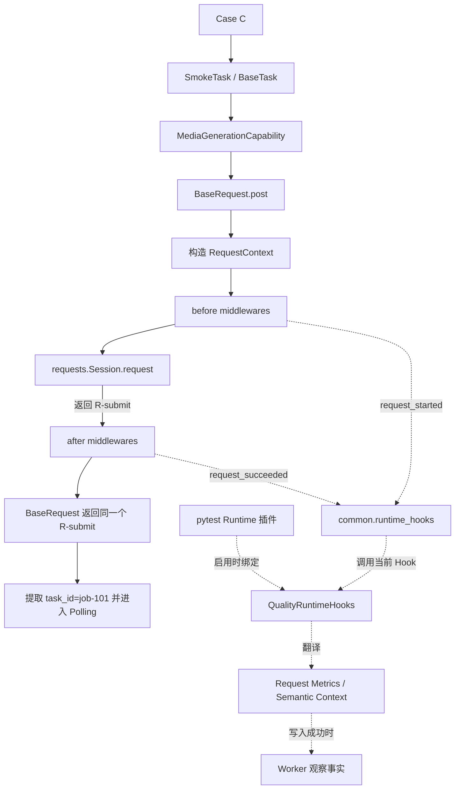
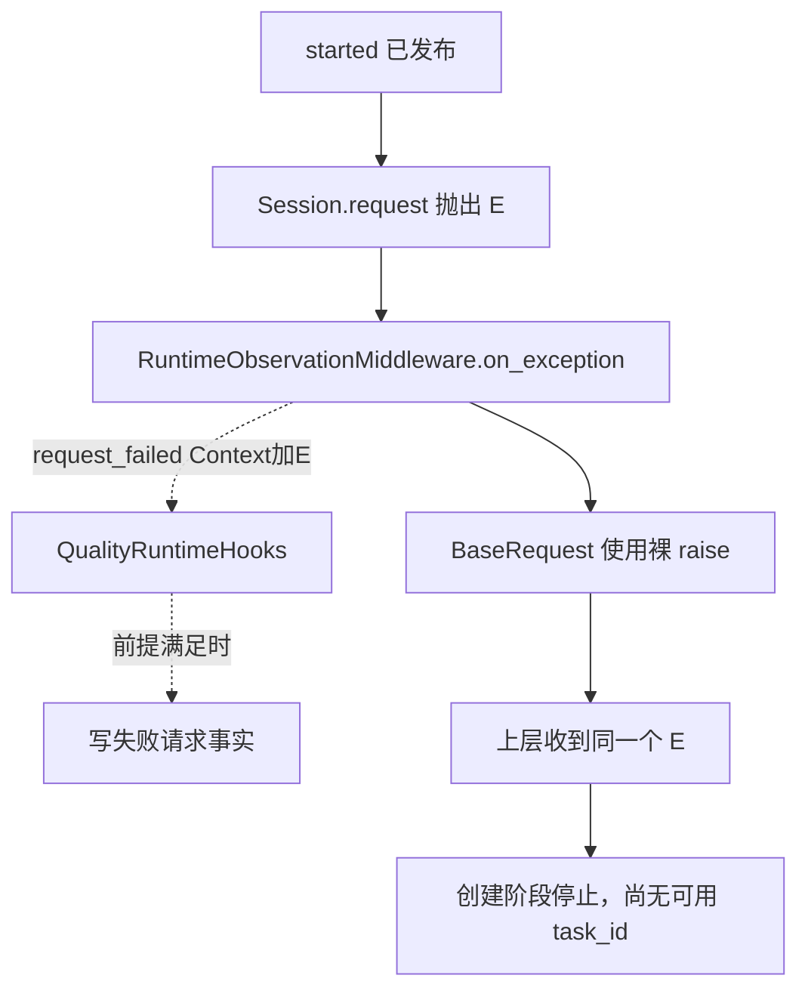

# 第 9 课：为什么请求核心只依赖中性 Runtime Hooks

## 本课在事实链中的位置

第 8 课已经划清结果所有权：pytest 产生阶段报告和会话退出事实，Runner 保存并合成执行结果，Quality 只能根据已收集事实增加解释。观察资料即使缺失，也不能反向把 pytest 的失败改成成功。

这条原则还要继续下钻到一次 HTTP 发送。贯穿课程的异步图像生成 Case C 会先提交任务，再轮询任务状态：

```text
Case C = module/smoke/test_图片生成异步调用.py::
         TestAsyncImageGeneration::
         test_f8_09_async_image_generation_task_succeeds_with_result

POST /v1/media/generations
→ 从响应提取 task_id="job-101"
→ GET /v1/media/tasks/job-101
→ 继续轮询直到终态
```

请求核心必须让调用者得到 `requests.Response` 或原始请求异常，同时又要发布“请求开始、得到响应或发生异常”的中性事件。具体适配器再结合质量上下文生成计时和归属等记录。如果请求核心直接导入 Collector、Metrics 或 Semantic，它就会同时知道“怎样发请求”和“质量数据怎样保存、解释”，业务路径会被具体质量实现绑住。

本课只处理这个遗留问题：请求核心怎样通过中性的 Runtime Hooks 发布事实，而不反向依赖 `quality`。第 10 课再比较真实 Hook 与 Noop；第 11 课再完整分析 Hook 自身失败时的 fail-open 范围。

---

## 核心问题

> Case C 提交异步图像任务时，请求核心怎样把同一次发送的开始、响应或异常交给观察者，又仍由业务调用链拥有最终的 `Response` 或异常？为什么这个结构不要求 `common` 知道具体的 Quality Collector？

本课关注依赖方向与事实所有权。它不会把“Hook 返回值不参与控制流”扩大为“任意自定义 Hook 都绝无副作用”，也不会用一个教学响应证明外部服务已经兑现契约。

---

## 从一个具体现象开始

先固定一组能够由当前实现处理的教学输入。响应内容是本课给定条件，不表示仓库已经在当前环境访问外部服务：

```text
执行入口      = 标准 pytest/Runner 路径，Quality 已启用
Semantic      = 已启用且 Collector 初始化成功（仅用于展示 Operation 归组）
run_id        = image-smoke-104-20260826T010000Z-a1b2c3d4
execution_id  = serial-pool
worker_id     = master
case_id       = Case C 的稳定 nodeid
invocation_id = inv-a93bbdf630847f96d91234b5

请求           = POST /v1/media/generations
retry_policy   = None
网络返回对象   = R-submit
HTTP 状态码    = 202
响应头         = X-OneAPI-Request-Id: req-submit-101
响应体         = {"task_id":"job-101"}
```

Case C 的真实业务入口调用 `SmokeTask.create_and_poll_media_generation()`。创建阶段最终进入 `BaseRequest.post()`。在一次正常发送中，可以同时观察到两组结果：

| 时点 | 调用者需要的业务结果 | 观察侧新增的信息 |
| --- | --- | --- |
| T0 | 尚未发送 | 当前五级身份已经由 pytest Quality 插件建立 |
| T1 | `BaseRequest` 构造本次 `RequestContext` | Request Group 与本次 Context 建立关联 |
| T2 | 尚未得到响应 | started 事件使观察侧生成请求事件标识并开始计时 |
| T3 | `Session.request()` 发出 POST | Hook 不决定是否发送，也不生成网络响应 |
| T4 | `Session.request()` 返回对象 `R-submit` | 尚未完成响应观察 |
| T5 | after 中间件接收同一个 `R-submit` | succeeded 事件把状态码等可观察事实交给当前 Hook |
| T6 | `_send()` 返回同一个 `R-submit` | Quality 在前提满足时写入一条请求事实 |
| T7 | 上层从 `R-submit` 提取 `job-101`，继续 Polling | 观察记录留在 Worker 的质量产物中供后续处理 |

业务侧没有从 Hook 领取一个“加工后的响应”。`requests.Session.request()` 先产生 `R-submit`，观察侧只在响应已经存在后收到它，随后 `_send()` 返回自己原来的局部变量 `response`。观察侧也没有返回“允许继续轮询”之类的决定；提取 `task_id` 和进入 Polling 仍由 Task 与请求业务链完成。

在本例的 Quality 前提都满足时，请求事实可以保存 `POST`、`/v1/media/generations`、`202`、`attempt_index=1` 和五级归属。这里的 2xx 分类只描述这一次 HTTP Request Event；异步任务才刚刚得到 `task_id`，不能因此写成整个图像生成 Operation 已经成功。

---

## 为什么原有解释不够

只说“请求后顺便记录一下”会隐藏三个问题。

第一，谁决定业务控制流？请求可能返回响应，也可能抛出 `requests.Timeout`。调用者必须拿到真实结果，Retry 与 Polling 才能按自己的规则继续或停止。若观察函数能够用一个返回值替代响应，或者把请求异常转换成伪成功，上一课建立的事实所有权就会失效。

第二，请求核心依赖谁？`BaseRequest` 位于 `common`。质量采集的文件格式、Collector、Semantic Context 和完整性记录位于 `quality`。若 `common` 直接导入这些实现，关闭或移除 Quality 时，基础 HTTP 能力仍会受其导入、初始化和存储细节影响；替换另一种观察后端也要修改请求核心。

第三，一条观察记录何时才存在？“请求已经返回”是业务事实；“对应 RequestMetric 已经成功写入”还要求 Quality 已启用、适配器已绑定、Collector 与 Case Context 存在、存储写入成功。前者不能自动证明后者，后者缺失也不能被填成“没有请求”。

因此，本课需要同时区分路径、合同和适配位置。只有三者都明确，才能解释“请求核心发布事实”为什么不等于“请求核心拥有质量结论”。

---

## 核心概念

本课新增三个核心概念。

### 1. 业务路径：Business Path

业务路径是从调用参数走到业务可见结果的控制流。在本课的一次发送中，它包括：构造 `RequestContext`、调用 `requests.Session.request()`、返回 `requests.Response`，或重新抛出请求异常。

它回答的是“调用者最终拿到什么”。其生命周期从进入 `BaseRequest.request()` 开始，到响应返回或异常离开该方法结束。Retry 是否再发、Polling 是否再查以及 Case 是否断言成功，都消费这条路径的结果。

业务路径与观察路径的区别不在于“谁先写代码”，而在于谁拥有控制结果。当前请求回调 `request_started()`、`request_succeeded()`、`request_failed()` 的返回类型都是 `None`；请求核心不会读取这些回调的返回值来选择响应、异常或下一次发送。

### 2. 观察路径：Observation Path

观察路径是在业务事件已经开始或形成后，把可观察信息旁路交给一个 Hook。它接收 `RequestContext`、`Response` 或异常，供后端记录事实；它不拥有外部服务的响应，也不拥有 pytest 最终结果。

在其余 before 中间件也成功，且 `Session.request()` 返回 `Response` 或抛出普通 `Exception` 的路径中，这条观察路径先有 started，再以唯一一个 succeeded 或 failed 收尾。开始时，框架还会把当时选择的 Hook 保存到 `RequestContext.attributes`。结束时再从同一 Context 取回 Hook，使一次请求的首尾不会仅因 provider 中途被替换就落到两个观察后端。若 started 之后另一个 before 中间件先失败，网络调用尚未进入，当前 `_send()` 不会为该失败调用 exception 中间件；若 `Session.request()` 抛出 `BaseException` 而不是普通 `Exception`，也不会进入 failed 通知。因此，不能仅凭 started 推断必有对应的 succeeded 或 failed。

“旁路”不表示观察没有价值。Quality 适配器可以据此生成 `request_event_id`、计时并写请求事实。旁路只限定权力方向：观察消费业务事件，不通过返回值接管 HTTP 结果。

### 3. 中性 Runtime Hooks 与适配器：Neutral Runtime Hooks and Adapter

中性 Runtime Hooks 是 `common.runtime_hooks.RuntimeHooks` 定义的运行时观察合同。合同描述 Operation、Request Group、单次请求、Polling 和 Stream 等生命周期，但不引用 `QualityCollector`、`RequestMetric` 或其他 Quality 类型。这里“中性”指依赖和数据模型归属中性，不表示每种 Hook 实现天然可信或不可产生副作用。

适配器（Adapter）位于 `quality.runtime_adapter.QualityRuntimeHooks`。它依赖中性合同，同时知道怎样调用 Quality 的 request metrics 与 semantic context。启用时，pytest Runtime 插件把这个适配器绑定到 `ContextVar`；请求核心只向当前合同发送事件。

依赖方向因而是：

```text
common 请求核心 ──依赖──> common.runtime_hooks 合同
                                   <──实现── quality.runtime_adapter
                                                   ↑
                                      启用时由 pytest 插件绑定
```

若更换观察后端，应由新后端实现同一合同并在外部绑定，而不是让 `BaseRequest` 增加一个对新存储模块的直接导入。

---

## 完整运行过程

先用双路径图放置完整调用，再逐步解释。实线表示业务控制或返回，虚线表示旁路通知：



图中的关键关系有六条。

1. **Case C 确实经过公共请求入口。** Case C 调用 `SmokeTask`；`BaseTask` 把组合动作委托给 `MediaGenerationCapability`；创建回调最终执行 `request_client.post('/v1/media/generations')`。这不是只因方法同名而推测出的连接。
2. **业务 Operation 可以包围创建与轮询。** 组合能力先请求建立 `async_task` Operation，再执行创建、提取 `task_id` 与轮询。在本课给定的 Semantic Collector 正常前提下，最外层后端返回 `owned=true`，中性生命周期把它设为当前 Operation；内部创建、HTTP 和 Polling scope 随后借用父级 Hook 和原生句柄，并以 `owned=false` 表明自己没有结束权。`owned=false` 也可能表示借用，不能单独据此判断 Operation 不存在；只有最外层开始时没有活动 Operation，且因 Collector 或 Case Context 缺失得到空句柄时，才不能声称新建了持久化 Operation。
3. **Request Group 与单次发送分开。** 本例没有传 `retry_policy`，所以 Group 的 `configured_max_attempts=1`；组内只有一个 RequestContext 和一次物理发送。后续每轮 Polling 查询会各自产生自己的发送事实。
4. **观察发生在网络调用两侧。** 默认中间件按注册顺序先运行 Runtime Observation，再运行媒体、脱敏和日志中间件；随后才调用 `Session.request()`。收到响应后，中间件仍按注册顺序运行，Runtime Observation 先收到该响应。
5. **开始和结束使用同一个 Hook。** started 阶段从当前 Operation 或 provider 取得 Hook，并保存到 Context；succeeded/failed 阶段优先使用这个快照。这个规则保护的是观察归属，不是网络响应内容。
6. **只有适配器知道 Quality。** `common` 发布中性事件；`QualityRuntimeHooks` 才把它们翻译为请求采集和语义调用。若适配器、Collector 或存储没有实际工作，业务路径仍可能完成，但不能声称观察事实已经存在。

将正常提交按状态变化展开：

```text
T0  pytest 执行进程：Quality 配置启用，绑定 QualityRuntimeHooks
T1  Case C：请求建立 async_task Operation；本例后端返回 owned=true
T2  创建阶段：构造 POST RequestContext，Group 最大尝试数为 1
T3  before：快照当前 Hook；Quality 生成 request_event_id 并记录起始时刻
T4  send：Session.request(...) 开始网络发送
T5  send：得到 R-submit(202, task_id=job-101)
T6  after：同一个 Hook 接收 Context 与 R-submit，尝试写 RequestMetric
T7  return：_send 返回 R-submit；Group 在 finally 中先完成；借用的请求级 Operation 观察收尾但不结束外层 Operation；BaseRequest 再返回同一对象
T8  Task：从 R-submit 提取 job-101，进入后续 Polling
```

在 T6 写入正常时，观察事实与业务对象之间是“来源关系”，不是“替代关系”：

```text
R-submit
├─ 业务路径读取响应体 → task_id="job-101"
└─ 观察路径读取可观察字段 → 一条归属于 Case C 的请求事实
```

RequestMetric 会复制五级身份和本次事件字段。它不会接管 `R-submit` 的生命周期，也不会证明之后三轮 GET 的业务状态。每轮查询都需要自己的 Request Event；一次提交响应不能代表整个异步调用。

---

## 正常路径

正常路径继续使用开头的输入，并假设 Quality Collector、Case Context 与分片写入均正常。

### T0～T2：外部绑定先于业务调用

pytest 的轻量入口只有在非 collect-only 且 `QUALITY_ENABLE` 解析为启用时，才动态加载 Runtime 插件。执行进程建立 Run Context 和 P0 Collector 后，本例还成功建立已启用的 Semantic Collector；插件随后创建 `QualityRuntimeHooks`，再用 token 将它绑定到当前 ContextVar。

仓库还存在一个明确的业务配置路径：Jenkins 的 `Real Smoke` 阶段仅在 `RUN_REAL_SMOKE` 条件成立时，把 Quality、Semantic 和 Metrics 开关设为 `1`，再调用 `run_master.py`。这证明该业务阶段具备启用路径，却不能证明它此刻正在运行，也不能证明任意本地 pytest 命令使用了相同开关。

因此，请求核心看到的是“当前 RuntimeHooks”，不是“当前 QualityCollector”。五级身份由插件与 Case Context 提供；请求层不负责生成 `run_id`、`case_id` 或 `invocation_id`。

Case C 进入组合能力后，外层 scope 构造业务名称 `media_generation` 和类型 `async_task`。在本例 Semantic Collector 正常的前提下，适配器成功开始并拥有该 Operation；创建 POST 位于其中，内层观察 scope 借用同一 Operation，所以不会仅因调用经过多层帮助方法就制造多个顶层业务动作。若只开启 Quality 而没有开启 Semantic，这段 Operation 持久化与复用结论不成立，但 P0 请求事实仍可采集。

### T3～T4：先发布开始事件，再执行网络调用

`BaseRequest` 为 POST 构造独立的 `RequestContext`：

```text
method   = POST
path     = /v1/media/generations
protocol = http
retry_policy = None
attributes = {}
```

Request Group 绑定 Context 后，默认 Runtime Observation 中间件发布 started。Quality 适配器在 Collector 存在时增加三项局部状态：新 `request_event_id`、高精度开始时间、尚未写入标记。随后其他 before 中间件运行，最后 `Session.request()` 才真正发送。

started 事件只证明客户端走到了发送前观察点。若后续某个 before 中间件失败，网络调用可能尚未发生；所以不能仅凭开始事件声称外部服务已经收到请求。本课正常路径假设其余 before 中间件也成功。

### T5～T6：响应先属于业务路径，再成为观察输入

给定的外部响应形成 `R-submit` 后，`_send()` 把它传入 after 中间件。Runtime Observation 发布 succeeded；内置适配器读取状态码、请求路径、计时、身份和响应中的预定义字段，构造请求事实。

在本例中可推导的主要字段为：

| 字段 | 值 | 推导依据 |
| --- | --- | --- |
| 五级归属 | 本课给定 Run/Execution/Worker/Case/Invocation | Collector Run Context 与当前 Case Context |
| `request_event_id` | 新生成的非空值 | started 事件生成；具体 UUID 不预先编造 |
| `method` | `POST` | RequestContext |
| `url_template` | `/v1/media/generations` | path 模板化结果 |
| `protocol` | `http` | 非 stream 的普通发送 |
| `attempt_index` | `1` | Context 未设置有效的其他尝试号时默认 1 |
| `status_code` | `202` | `R-submit.status_code` |
| `timeout` | `false` | 本分支收到响应，不是异常记录 |
| `retryable` | `false` | 本次 Context 没有 RetryPolicy |
| `server_request_id` | `req-submit-101` | 给定响应头中的受支持字段 |

Quality 的当前 HTTP 分类会把 2xx Request Event 标成 `business_status=success`。这只是请求事实模型对普通 HTTP 事件的局部分类；组合 Operation 还必须提取 task_id、执行 Polling 并由 Case 检查最终状态和输出。课程不会把这个字段扩张成“图像已经生成”。

### T7～T8：两条路径分别交付结果

观察结束后，`_send()` 返回 `R-submit`，单次 Request Group 在 `finally` 中完成。`BaseRequest.request()` 随后调用请求级 `finish_response()`；本例请求级 lease 借用外层 Operation，因此该调用不结束外层所有者。接着 `BaseRequest.request()` 返回同一个响应对象。上层解析 `{"task_id":"job-101"}`，状态从“尚无任务标识”变为“可以查询 `/v1/media/tasks/job-101`”。

最终输出为：

```text
业务输出：R-submit，供 Task 提取 job-101 并继续 Polling
观察输出：在全部采集前提满足时，新增一条 POST RequestMetric
Case 输出：尚未形成最终通过；必须等待轮询终态和后续断言
```

这三行不能合并。响应返回不自动保证观察写入成功；观察写入成功也不自动保证 Case 最终通过。

---

## 复杂路径

复杂路径只改变一个输入：T5 不再返回响应，而是 `Session.request()` 抛出对象 `E = requests.Timeout('network timeout')`。其余条件不变，本次 POST 仍没有 RetryPolicy。

### 异常怎样沿两条路径传播



逐步推导如下：

1. T3 的 started 已执行，因此观察侧可能已经有事件 ID 和开始时间。
2. `Session.request()` 抛出 `E`，局部变量 `response` 没有形成，after 分支不会运行。
3. `_send()` 捕获普通 `Exception`，逐个调用 `on_exception(context, E)`。Runtime Observation 把同一个 `E` 交给 failed Hook。
4. 在采集前提满足时，Quality 构造 `status_code=None`、`business_status=failed`、`timeout=true`、`attempt_index=1`、`error_type=Timeout` 的请求事实。因为本次没有 RetryPolicy，`retryable=false`；“是否可以重试”与“是否发生超时”仍是两项判断。
5. exception 中间件执行后，`_send()` 使用裸 `raise`。Request Group 先在 `finally` 中完成；`BaseRequest.request()` 捕获 `BaseException`，调用请求级 `finish_error()` 后再次裸 `raise`。在本例中，请求级 lease 借用外层 Operation，所以它不结束外层所有者；异常继续穿出组合入口，最外层 scope 才以失败结果结束自己。调用者最终收到原来的 `E`，不是 Hook 生成的新异常。
6. 创建阶段没有获得可解析的 `Response`，所以不会从这条路径得到 `job-101`，标准组合入口也不会进入后续 Polling。

最终结果是：

```text
业务输出：原始 requests.Timeout 对象 E
观察输出：前提满足时新增一条 timeout 请求事实；失败时可能留下诊断缺口
外部状态：未知。客户端超时不能证明服务端一定没有接收或创建任务
```

这里没有新增“Hook 自身也失败”这一变量。当前中性包装会隔离 Hook 抛出的普通 `Exception`，但只捕获 `Exception`，并不捕获 `KeyboardInterrupt`、`SystemExit` 等 `BaseException`；任意第三方 Hook 还可能在抛错前修改共享对象。完整的故障阶段与损失范围将在第 11 课单独推导。

---

## 对应的框架实现

概念模型和两条路径明确以后，再看四个关键实现片段。以下代码按真实顺序节选，省略了与本课判断无关的类型细节和其他中间件实现，没有改变分支与所有权。

### 1. 请求核心返回响应或重新抛出请求异常

```python
# common/base_request.py
def _send(self, context):
    self._run_before_middlewares(context)
    try:
        response = self.session.request(
            method=context.method,
            url=context.url,
            **context.kwargs,
        )
    except Exception as error:
        self._run_exception_middlewares(context, error)
        raise

    self._run_after_middlewares(context, response)
    return response
```

输入是已经构造的 RequestContext。before 阶段发生在网络调用前；正常输出是 `Session.request()` 产生并经过 after 通知的 `response`；异常输出是网络调用抛出的原异常。裸 `raise` 没有创建替代异常。若普通的非 Runtime Observation 中间件在 before/after 中失败，外层包装仍可能抛 `RuntimeError`，所以这里的非侵入结论不能泛化到所有中间件。

### 2. 默认中间件只发布三个中性请求事件

```python
# common/request_middleware.py
class RuntimeObservationMiddleware:
    def before_request(self, context):
        observe_request_started(context)

    def after_response(self, context, response):
        observe_request_succeeded(context, response)

    def on_exception(self, context, error):
        observe_request_failed(context, error)


def default_request_middlewares(capture_policy=DEFAULT_CAPTURE_POLICY):
    return [
        RuntimeObservationMiddleware(),
        MediaResourceMiddleware(capture_policy),
        RedactionMiddleware(),
        LoggingMiddleware(),
    ]
```

三个方法的输入分别是 Context、Context 加 Response、Context 加异常，输出均为 `None`。这里的函数名 `request_succeeded` 表示网络调用返回了一个 Response；任何状态码都会进入 after 分支，是否属于 2xx 由后续观察逻辑另行分类。它们没有导入 Collector，也没有根据观察结果改写请求分支。默认链确实包含该中间件；调用者若显式传入 `middlewares=[]`，则不再拥有这个默认观察点。

### 3. 中性生命周期固定本次 Hook，并忽略普通回调异常

```python
# common/runtime_hooks/lifecycle.py
def observe_request_started(context):
    hooks = get_active_runtime_hooks()
    context.attributes[RUNTIME_REQUEST_HOOKS_ATTR] = hooks
    _safe_call(hooks.request_started, context)

def observe_request_succeeded(context, response):
    hooks = _request_hooks(context)
    _safe_call(hooks.request_succeeded, context, response)

def observe_request_failed(context, error):
    hooks = _request_hooks(context)
    _safe_call(hooks.request_failed, context, error)

def _safe_call(function, *args, **kwargs):
    try:
        function(*args, **kwargs)
    except Exception:
        return
```

started 的状态变化是向 Context 保存本次 Hook；succeeded/failed 的选择依据是网络调用是否返回。`_safe_call` 不把回调返回值交给请求核心，并隔离普通 `Exception`。它不捕获所有 `BaseException`，也无法撤销 Hook 在抛错前已经产生的副作用。

### 4. 外部插件绑定具体适配器

```python
# quality/pytest_plugin_runtime.py
state.runtime_hooks = QualityRuntimeHooks()
state.runtime_hooks_token = bind_runtime_hooks(state.runtime_hooks)

# quality/runtime_adapter.py
class QualityRuntimeHooks:
    def request_started(self, context):
        self._capture_request_call(
            context, request_metrics.start_request_capture, context
        )

    def request_succeeded(self, context, response):
        self._capture_request_call(
            context, request_metrics.record_response, context, response
        )

    def request_failed(self, context, error):
        self._capture_request_call(
            context, request_metrics.record_exception, context, error
        )
```

绑定发生在 Quality Runtime 插件一侧。适配器输入是中性事件，输出是对 Quality 采集函数的调用；这些方法仍返回 `None`。`common` 无需知道写入的是哪个文件、如何构造 RequestMetric 或 Semantic 关系。插件卸载时使用保存的 token 恢复先前绑定，这也说明绑定有执行上下文和生命周期边界。

### 源码与测试定位

- `module/smoke/test_图片生成异步调用.py:57-63`：Case C 的真实组合入口。
- `common/base_task.py:73-79,101-121`、`common/task_capabilities/media_generation.py:57-68,93-124`：创建、提取 task_id 与 Polling 的真实委托链。
- `common/base_request.py:50-105,216-285,356-389`：默认中间件、Response 返回、异常传播和中间件边界。
- `common/request_context.py:11-23`、`common/request_middleware.py:91-114`：中性 Context 与默认观察中间件。
- `common/runtime_hooks/protocol.py:15-89`、`common/runtime_hooks/provider.py:9-27`、`common/runtime_hooks/lifecycle.py:38-181,240-271`、`common/runtime_hooks/observer.py:38-67,140-208`：合同、ContextVar provider、Operation/Group 观察、Hook 快照与普通异常隔离。
- `quality/runtime_context.py:8-59`、`quality/pytest_plugin.py:14-30`、`quality/pytest_plugin_runtime.py:67-119,179-209,326-342`：五级上下文、配置启用后的动态加载，以及执行进程与 Case 的上下文绑定。
- `quality/runtime_adapter.py:20-21,65-89`、`quality/request_metrics.py:40-129`：中性事件到 Quality 请求事实的翻译。
- `Jenkinsfile:174-184,208-216`：`Real Smoke` 条件阶段显式启用 Quality/Semantic/Metrics 并调用标准 Runner。
- `tests/quality/test_common_quality_boundary.py:13-77`：AST 边界检查，以及完全阻断 `quality` 导入后 `common` 仍能完成模拟 HTTP 调用。
- `tests/quality/test_quality_request_metrics.py:91-132,229-265`：响应、超时、Retry Attempt 和 Polling 请求事实的覆盖。
- `tests/quality/test_common_runtime_hooks.py:50-98,127-143`：默认 Noop、Operation 复用、上下文传播和普通 Hook 故障不替换业务异常的覆盖。

测试说明这些合同受到当前测试套件覆盖；当前行为仍以生产源码为准。模拟响应测试不证明外部图像服务在当前时间可用或会返回本课给定数据。

---

## 能够保证什么

在当前仓库自带实现和下列前提内，可以得出这些结论：

1. `BaseRequest` 使用默认中间件时，每次物理发送都会经过 Runtime Observation 的 before，并在网络返回或抛普通请求异常后走向 succeeded 或 failed 通知。
2. `common` 的请求核心只静态依赖 `common.runtime_hooks`；Quality 适配器反向依赖该合同。仓库还有 AST 测试防止 `common` 新增对 `quality` 的静态 import。
3. 三个请求事件回调的返回值不会参与 Response、异常、Retry 或 Polling 的控制判断。
4. 正常响应路径中，当前请求核心在观察后返回 `Session.request()` 产生的局部 `response`；内置 Quality 适配器不生产替代 Response。
5. 普通网络异常路径中，请求核心先发布 failed，再用裸 `raise` 传播原异常；内置观察可以记录失败，但不把它转换为成功响应。
6. started 阶段保存本次 Hook，succeeded/failed 阶段优先取回该快照，使一条请求的观察首尾保持在同一实现上。
7. Quality 启用且执行进程初始化成功时，Runtime 插件绑定 `QualityRuntimeHooks`；它把中性请求事件翻译给请求事实和语义采集模块。

这些保证描述的是请求与观察的职责边界，不是质量事实永不丢失的保证。

---

## 保证成立的前提

- 对贯穿案例而言，真实链路是 `BaseTask/Capability → BaseRequest → default_request_middlewares`；请求事件观察的最低入口是使用带默认中间件的 `BaseRequest`，并不要求每个调用者都先经过 BaseTask 或 Capability。仓库中直接调用 `requests` 的代码不会自动经过这个观察点。
- `BaseRequest` 必须使用默认中间件。构造时显式传入空列表或自定义列表，会替换默认集合；框架不会偷偷补回 Runtime Observation。
- 在标准 pytest/Runner 路径中，要得到本课展示的 RequestMetric，必须实际启用 Quality，Runtime 插件成功加载并在对应执行进程绑定适配器，Collector 与当前 Case Context 存在，且分片写入成功。公共 API 也允许测试或其他调用者手工配置 Collector 并绑定适配器，因此 Runtime 插件不是所有可能接入方式的绝对必要条件。
- 要得到本课正常路径中“外层 Operation 被拥有、内层 scope 复用”的结果，还必须启用 Semantic 且 Semantic Collector 初始化成功；这不是生成 P0 RequestMetric 的必要条件。
- 五级身份必须已经按第 7 课的标准入口建立并传播。缺少 Case Context 时，当前请求采集会跳过主请求事实并尝试写 `missing_case_context` 完整性记录。
- “同一个 Response”限定于当前内置 Runtime Observation 与 Quality 适配器没有替换返回值的控制流。协议参数是可变对象，不提供不可变性防护。
- “原异常传播”限定于请求核心捕获的普通 `Exception` 路径，以及其他中间件没有另行中断控制流的条件。
- 本课教学输入中的 202、`job-101` 与请求 ID 是明确给定的数据。它们用于推导客户端行为，不是仓库对外部服务的实时证明。

---

## 不能保证什么

1. **不能把框架能力写成当前运行状态。** 仓库具备 Runtime Hooks，Case C 也经过默认观察点；但 `QUALITY_ENABLE` 默认是 false，静态源码不能证明当前用户进程已经绑定 Quality 后端。
2. **不能把“无静态依赖”写成“运行时完全无联系”。** 启用后，外部 pytest 插件会有意把 `QualityRuntimeHooks` 注入 common 的 provider；解耦的是依赖方向，不是禁止协作。
3. **不能把一次 HTTP 202 写成异步任务成功。** 它只让创建调用得到响应；还要提取 task_id、完成 Polling，并通过 Case 对终态和输出的断言。
4. **不能用 RequestMetric 代替 Response。** 前者是观察记录，后者是业务调用结果；观察记录缺失也不能被解释为没有发送、零耗时或业务通过。
5. **不能保证任意自定义 Hook 绝无业务影响。** 合同把可变 Context、Response 和异常对象交给实现，provider 只拒绝 `None`，没有运行时验证整个协议。错误实现可能原地修改对象，或返回错误形状破坏后续观察生命周期。
6. **不能宣称所有异常都会被吞掉。** 中性安全包装捕获 `Exception`，不捕获 `KeyboardInterrupt`、`SystemExit` 等 `BaseException`；第 11 课会按阶段说明这一边界。
7. **不能把 Runtime Hook 的 fail-open 扩张到所有中间件。** 当前普通 before/after 中间件异常会被请求核心包装为 `RuntimeError`；Runtime Observation 之所以能隔离普通后端异常，是因为它调用的中性生命周期内部另有安全包装。
8. **不能由客户端超时断言服务端没有创建任务。** 请求可能在响应到达客户端前已被服务端接受；是否创建、是否幂等以及最终状态都属于外部契约和后续证据。
9. **不能由适配器类存在推断所有业务入口都使用它。** 只有经过绑定上下文和公共请求链的调用才具有本课描述的观察关系；旁路 `requests` 或显式移除默认中间件不在该保证内。
10. **不能把“中性”理解为公共层没有任何历史命名。** `common` 仍保留 `QualityMetricsMiddleware` 兼容别名，元数据规范化也仍接收 `_quality_operation_name` 与 `_quality_traffic_role`；本课证明的是类型和静态依赖已经移到中性合同，不是所有旧名称均已删除。

最重要的结论是：**中性 Runtime Hooks 让请求核心发布“发生了什么”，具体 Quality 适配器决定“怎样记录和解释”；业务响应或异常仍沿原业务路径交付。**

---

## 与下一课的关系

本课已经建立稳定的依赖方向：

```text
业务路径：调用参数 → Session.request → Response / 原请求异常 → 调用者
观察路径：同一次事件 → 中性 Runtime Hooks → 可选适配器 → 观察事实
```

现在还留下一个开关问题：`BaseRequest` 的默认结构始终包含 Runtime Observation，但 Quality 默认可以关闭。如果关闭时没有具体采集后端，请求核心为什么不需要增加 `if quality_enabled` 分支，started、succeeded 和 failed 又会落到哪里？

第 10 课将把同一条 Case C 调用链分别放入真实 Hook 与 `NoopRuntimeHooks`，逐列比较业务响应、原始异常、pytest 结果和观察产物。
