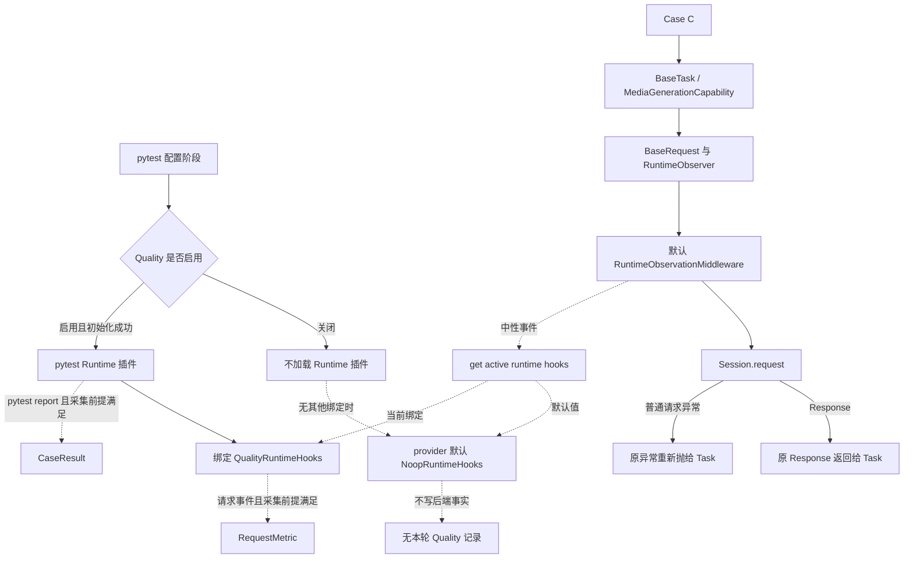
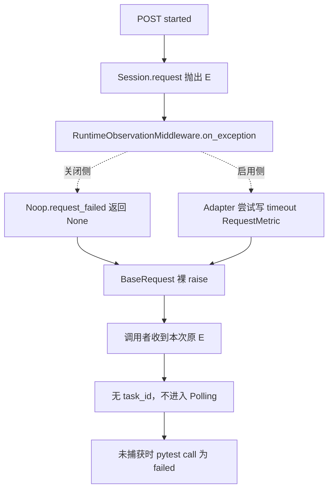

# 第 10 课：Quality 关闭时为什么使用 Noop

## 本课在事实链中的位置

第 9 课已经把一次请求分成两条路径：业务路径拥有 `Response` 或原请求异常，观察路径通过中性 Runtime Hooks 接收 started、succeeded、failed 等事件。`common` 只依赖中性合同，具体的 `QualityRuntimeHooks` 由外部 pytest 插件绑定。

但 Quality 是可选能力，而且 `QUALITY_ENABLE` 未设置时默认为关闭。如果关闭就意味着删除观察调用，那么 `BaseRequest`、Retry、Polling 和 Stream 都要各自判断开关；同一个 Case 会形成“启用版”和“关闭版”两套控制流。这样不仅增加分支，还会让开关有机会意外改变业务结果。

本课继续使用 Case C：

```text
Case C = module/smoke/test_图片生成异步调用.py::
         TestAsyncImageGeneration::
         test_f8_09_async_image_generation_task_succeeds_with_result

POST /v1/media/generations
→ task_id="job-101"
→ GET /v1/media/tasks/job-101
→ Polling 到 succeeded
```

本课只回答关闭机制：为什么标准初始上下文使用 `NoopRuntimeHooks`，以及真实 Hook 与 Noop 下哪些结果保持不变。第 11 课才会增加“已经绑定的真实 Hook 自身抛错”这一变量，完整讨论 fail-open 的保护与代价。

---

## 核心问题

> 当 `QUALITY_ENABLE=0` 时，Case C 为什么仍然经过同一套 `BaseRequest`、Runtime Observer 和默认观察中间件，却不会产生本轮 Quality 事实？为什么业务响应、原请求异常和 pytest 原始结果不需要由另一套关闭分支来维护？

这里的“使用 Noop”有一个精确含义：Quality 轻量插件在关闭时不绑定 `QualityRuntimeHooks`；如果当前上下文也没有其他显式绑定，Runtime Hooks provider 返回自己的默认 `NoopRuntimeHooks`。生产代码不是在看到 `QUALITY_ENABLE=0` 后主动执行一次 `bind_runtime_hooks(NoopRuntimeHooks())`。

---

## 从一个具体现象开始

做两次隔离的受控教学运行。两次都选择同一个 Case C，进入 `serial-pool`，业务请求参数、轮询规则和模拟网络结果完全相同；唯一改变的是标准 Quality 配置。为了只观察主开关，启用侧不要求开启 Semantic。

输入序列固定为：

```text
请求重试 = None
Polling timeout = 600 秒
计时前提 = 每次响应解析与同步观察完成后 remaining > 0

T0  POST /v1/media/generations
T1  R-submit = 202, {"task_id":"job-101"}
T2  GET /v1/media/tasks/job-101
T3  R-poll-1 = 200, {"status":"pending"}
T4  GET /v1/media/tasks/job-101
T5  R-poll-2 = 200, {"status":"pending"}
T6  GET /v1/media/tasks/job-101
T7  R-final = 200, {
      "status":"succeeded",
      "result":{"url":"https://cdn.example/job-101.png"}
    }
```

这些 Response 是教学输入，不表示仓库已经连接外部图像服务，也不证明服务此刻会返回相同内容。

两次运行得到以下对照：

| 对比项 | Quality 启用：`QualityRuntimeHooks` | Quality 关闭：默认 `NoopRuntimeHooks` |
| --- | --- | --- |
| 业务请求序列 | 1 次 POST，3 次 GET | 1 次 POST，3 次 GET |
| 最终业务对象 | 本次运行的原 `R-final` | 本次运行的原 `R-final` |
| Case C 断言 | `succeeded` 且存在图像 URL，passed | `succeeded` 且存在图像 URL，passed |
| pytest 原始结果 | 本例 call 阶段为 passed | 本例 call 阶段为 passed |
| 请求观察产物 | 全部采集前提满足时有 4 条 RequestMetric | 不写本轮 RequestMetric |
| Case 观察产物 | Collector 正常时写 CaseResult | 不写本轮 Quality CaseResult |

“原 `R-final`”表示每次运行都返回该次 `Session.request()` 产生的对象，不表示两个独立进程共享同一个 Python 对象。

开关改变了观察产物，却没有改变 POST、Polling、最终 Response 和断言。这不是因为关闭侧绕开了 Runtime Observer，而是因为观察调用仍然存在，只是落到一个遵守相同合同、返回中性结果的对象上。

---

## 为什么原有解释不够

把关闭理解成“什么都不调用”，会遗漏三个事实。

第一，请求核心并不读取 Quality 配置。`BaseRequest` 构造时总会创建 `RuntimeObserver`；使用默认中间件时，`RuntimeObservationMiddleware` 也始终在列表中。开关判断发生在外部 pytest 插件是否加载并绑定具体 Adapter 的位置，而不是每个请求发送点。

第二，“没有观察记录”与“没有发生请求”不是同一事实。关闭侧的四次 `Session.request()` 仍然发生，Case 仍然得到最终响应；只是 Noop 没有为它们生成 `request_event_id`、计时或 RequestMetric。缺失记录必须保留为“本轮没有相应 Quality 事实”，不能补成请求数 0、耗时 0 或业务成功。

第三，`QUALITY_ENABLE=0` 不会强制覆盖当前 provider。它只让标准 Quality 插件不加载 Runtime 实现。默认 Noop 来自 provider 自身；如果别的调用者已经手工绑定自定义 Hook，关闭 Quality 不会替它改回 Noop。

因此，需要解释的不是一个简单布尔分支，而是两个相邻机制：一个完整但不产生后端效果的空对象，以及一个能够临时覆盖并恢复默认对象的作用域绑定。

---

## 核心概念

本课只新增两个概念。

### 1. 空对象：Null Object

空对象（Null Object）是一个实现完整接口、但对外返回中性结果的对象。它与 `None` 的差别是：调用者仍然可以执行统一的方法调用，不必在每个位置先写 `if hooks is not None`。

本框架的空对象是 `NoopRuntimeHooks`。它覆盖 `RuntimeHooks` 合同中的 Operation、Request Group、Request Event、Polling 和 Stream 方法：

- `begin_operation()` 返回 `RuntimeOperationStart(native_handle=None, owned=False)`；
- Request Group、Polling 和 Stream 的开始方法返回空句柄；
- bind、finish、started、succeeded、failed 等通知返回 `None`；
- 它不创建 Collector，不分配 Quality 身份，也不写 Quality 分片。

这些返回值不是伪造的“成功事实”。`owned=False` 的含义是没有一个需要由当前观察者结束的持久化 Operation；空句柄表示没有后端对象。Noop 选择不产生事实，而不是产生一条所有字段为零的事实。

Noop 也不等于没有任何执行成本。`RuntimeObserver`、lease、`RequestContext` 和中性方法调用仍然存在；省去的是具体后端的采集与持久化，不是所有 Python 调用。

### 2. 默认回退与作用域绑定：Default Fallback and Scoped Binding

Runtime Hooks provider 用 `ContextVar` 保存当前 Hook。它的默认回退（default fallback）是一个进程内单例 `NoopRuntimeHooks`，所以标准初始上下文调用 `get_runtime_hooks()` 总能取得合同对象。

Quality 启用且执行进程初始化成功时，Runtime 插件用 `bind_runtime_hooks()` 把当前上下文临时绑定到 `QualityRuntimeHooks`，并保存返回的 token。pytest 卸载插件时，再用这个 token 恢复绑定前的值。恢复目标通常是默认 Noop，但也可能是外部调用者此前绑定的另一个 Hook，所以源码使用“恢复先前值”，而不是“固定设置为 Noop”。

这两个概念共同保持调用点稳定：业务代码总是发布事件，provider 决定事件落到空对象还是具体 Adapter。

---

## 完整运行过程

先把开关位置与业务路径放在一张图里。实线表示业务控制流，虚线表示观察选择和通知：



图中有六条关键关系。

1. **开关判断在外围。** `quality.pytest_plugin` 先读取配置；关闭时直接返回，只有启用时才动态导入并注册 Runtime 插件。`common` 的请求核心不读取 `QUALITY_ENABLE`。
2. **业务路径只有一条。** 两侧都经过同一个 Case、Task、Capability、`BaseRequest`、默认中间件和 `Session.request()`。没有单独的 `request_without_quality()`。
3. **provider 总能给出对象。** 没有显式绑定时返回 Noop；启用且初始化成功时返回当前上下文中的 Quality Adapter。
4. **Noop 接受调用但不建事实。** 它提供协议要求的中性返回值，使生命周期代码可以继续完成自己的状态收尾。
5. **观察事实仍有各自的生产者。** Adapter 可以根据请求事件尝试写 RequestMetric；pytest Runtime 插件根据 TestReport 尝试写 CaseResult。两者都不接管业务 Response 或请求异常。
6. **退出时恢复旧绑定。** Runtime 插件使用 bind 返回的 token 恢复先前值，避免一次 pytest 会话永久污染外围上下文。

将开关两侧按同一时间线展开：

```text
T0  pytest 配置
    关闭：轻量插件提前返回；标准初始上下文仍是默认 Noop
    启用：执行进程初始化 Collector，绑定 QualityRuntimeHooks

T1  Case C 进入 create_and_poll_media_generation
    两侧：进入相同的业务组合入口

T2  创建 Operation 与 POST Request Group
    关闭：Noop 返回 owned=false 与空句柄
    启用：Adapter 返回自己的观察句柄；是否有 Semantic Operation 还取决于子开关

T3  POST started → Session.request → R-submit → succeeded
    两侧：Task 都取得各自运行中的原 R-submit，并提取 job-101

T4～T7  三轮 GET 与两次等待
    两侧：状态都按 pending → pending → succeeded 演进
    关闭：Polling 和请求观察不写后端事实
    启用：前提满足时，每次物理发送写一条 RequestMetric
    本例：每轮响应解析与同步观察后，600 秒 deadline 的 remaining 都大于 0

T8  Case 读取 R-final 并断言
    两侧：状态和结果 URL 满足条件，pytest call 均为 passed

T9  pytest 会话结束
    关闭：没有 Runtime Adapter 需要解绑
    启用：插件用 token 恢复绑定前的 Hook
```

这里的“相同调用链”限定在业务调用点。Noop 的外层 Operation 为 `owned=false`，不会设置 active operation；Semantic 正常的真实 Hook 可能拥有外层 Operation，使内层 scope 直接借用它。因此，观察侧句柄、状态和某些 Hook 调用次数可以不同，业务侧仍执行相同的网络与断言流程。

---

## 正常路径

### T0：关闭侧保留默认值，而不是主动绑定 Noop

`QUALITY_ENABLE` 未设置时默认解析为 false，显式的 `0`、`false`、`no` 和 `off` 也会解析为 false。pytest 轻量插件遇到关闭配置后直接返回，不导入 `quality.pytest_plugin_runtime`。

此时，如果当前上下文从未被其他代码绑定，provider 的 `ContextVar` 读取默认单例 `NoopRuntimeHooks`。这个顺序很重要：

```text
不是：QUALITY_ENABLE=0 → bind(NoopRuntimeHooks())
而是：QUALITY_ENABLE=0 → 不绑定 Quality Adapter
                         → provider 保留已有值
                         → 标准初始值恰好是 Noop
```

Runner 层还有另一个对象 `NoopQualityRunLifecycle`。它在 Quality 关闭时不增加 JUnit 参数、不设置 Quality stage 环境，也不执行 Quality 汇总。它与请求层 `NoopRuntimeHooks` 服务于两个不同边界，不能当成同一个实例：前者保持 Runner 生命周期接口稳定，后者保持运行时观察接口稳定。

### T1～T3：Noop 不改变业务发送

Case C 仍进入 `MediaGenerationCapability` 的组合入口，`BaseRequest` 仍创建 Operation observation、Request Group 和 `RequestContext`。默认中间件仍先调用 `observe_request_started(context)`。

Noop 对 Operation 返回 `native_handle=None, owned=False`，对 Request Group 返回 `None`，对 started 返回 `None`。这些结果不会被解释成“请求已经成功”，也不会阻止下一步 `Session.request()`。给定 `R-submit` 后，默认中间件照常调用 succeeded，Noop 再次返回 `None`；随后 `_send()` 返回自己的局部变量 `response`。

状态变化是：

```text
业务状态：无 task_id → 得到 R-submit → 提取 job-101
观察状态：默认 Noop → 无后端句柄 → 无 RequestMetric
```

两条状态线不能互相替代。观察侧没有记录，不妨碍业务侧从响应提取 task_id；业务侧得到 task_id，也不能反推某条 Quality 记录已经落盘。

### T4～T9：Polling 与 pytest 继续按原规则工作

后续三轮 GET 仍由 Polling 状态机控制。Noop 的 Polling 方法接收开始、状态、等待和结束通知，但不保存后端状态。`pending` 仍表示继续等待，`succeeded` 仍表示返回最终响应；这些判断属于 Polling 业务逻辑，不由 Noop 决定。本例还明确给定：每次网络响应、响应解析和同步观察完成后，600 秒 Polling deadline 都有剩余时间，尤其最终 `succeeded` 被观察后 `remaining > 0`，所以不会先进入超时分支。

Case C 最后读取 `R-final`，确认状态属于 `succeeded`/`success`，并确认响应包含图像 URL 或 base64 数据。给定本课的 URL，断言通过。Quality 关闭没有生成 Quality CaseResult，但 pytest 自己仍产生原始 passed 报告；“没有派生 Case 事实”和“pytest 没有执行 Case”是两个不同结论。

### 启用侧只替换观察后端

启用侧在执行进程完成初始化后，将 provider 当前值绑定为 `QualityRuntimeHooks`。沿用第 9 课的示例身份：

```text
run_id        = image-smoke-104-20260826T010000Z-a1b2c3d4
execution_id  = serial-pool
worker_id     = master
case_id       = Case C 的稳定 nodeid
invocation_id = inv-a93bbdf630847f96d91234b5
```

四次物理发送分别发布 started 与 succeeded。在 Collector、Case Context 和写盘均正常时，每次发送形成一条带上述归属的 RequestMetric。pytest call 报告还会被复制成 CaseResult。这里没有开启 Semantic 的前提，所以不能额外声称产生了持久化 Operation、Request Group 或 Polling Session 分片。

业务侧仍从 `R-submit` 取得 `job-101`，从 `R-final` 取得终态和 URL。Adapter 增加了观察产物，但没有提供第二份业务响应，也没有替代 Case 断言。

---

## 复杂路径

复杂路径只改变一个输入：首个 POST 的 `Session.request()` 不再返回 `R-submit`，而是抛出本次运行自己的对象：

```text
E = requests.Timeout("network timeout")
retry_policy = None
```

两侧的控制流如下：



逐步推导：

1. 两侧都已经进入同一个 POST Request Group，并执行 started 调用点。
2. `requests.Timeout` 是普通 `Exception`，所以 `_send()` 捕获它并执行 exception middlewares。默认 Runtime Observation 把 Context 与本次 `E` 发布给 failed Hook。
3. 关闭侧的 Noop 返回 `None`，不生成失败记录。启用侧在采集前提满足时写一条 `status_code=None`、`timeout=true`、`error_type=Timeout` 的 RequestMetric。
4. failed 回调的返回值不参与异常选择。`_send()` 使用裸 `raise`；外层 `BaseRequest.request()` 完成观察收尾后再次裸 `raise`。
5. 两侧调用者分别收到本次传输层抛出的原 `E`。因为没有 Response，创建阶段不能提取 `job-101`，标准组合入口不会进入 Polling。
6. Case C 没有捕获这个 Timeout，所以 pytest call 原始结果在两侧都是 failed。启用侧可以记录失败 CaseResult；关闭侧没有这条 Quality 派生记录，但原始失败仍然存在。

最终对照为：

| 对比项 | Quality 启用：`QualityRuntimeHooks` | Quality 关闭：默认 `NoopRuntimeHooks` |
| --- | --- | --- |
| 业务输出 | 传播本次原 `requests.Timeout` | 传播本次原 `requests.Timeout` |
| task_id | 未形成 | 未形成 |
| Polling | 不进入 | 不进入 |
| pytest 原始结果 | 未捕获时为 failed | 未捕获时为 failed |
| Quality 观察产物 | 前提满足时有 timeout RequestMetric 与失败 CaseResult | 没有本轮对应 Quality 事实 |

这个案例证明的是正常 Noop 与正常内置 Adapter 的选择不改变业务异常所有权。它没有让真实 Hook 自身抛错，也没有覆盖 `KeyboardInterrupt`、`SystemExit` 等 `BaseException`；这些边界留到下一课。

---

## 对应的框架实现

概念模型、正常路径和复杂路径已经明确以后，再看五个最小实现片段。以下代码按当前生产源码节选，省略了与本课判断无关的方法和类型细节。

### 1. Provider 默认给出 Noop，并用 token 恢复旧值

```python
# common/runtime_hooks/provider.py
_NOOP_RUNTIME_HOOKS = NoopRuntimeHooks()
_RUNTIME_HOOKS = ContextVar(
    "common_runtime_hooks",
    default=_NOOP_RUNTIME_HOOKS,
)

def get_runtime_hooks():
    return _RUNTIME_HOOKS.get()

def bind_runtime_hooks(hooks):
    if hooks is None:
        raise TypeError("hooks must not be None")
    return _RUNTIME_HOOKS.set(hooks)

def reset_runtime_hooks(token):
    _RUNTIME_HOOKS.reset(token)
```

输入是一个非空 Hook；bind 的输出是携带先前上下文状态的 token。状态从默认 Noop 临时变为具体 Hook，reset 再恢复先前值。这里没有读取 `QUALITY_ENABLE`，也没有把恢复目标写死为 Noop。

### 2. Noop 返回合同所需的中性结果

```python
# common/runtime_hooks/noop.py
class NoopRuntimeHooks:
    def begin_operation(self, metadata):
        return RuntimeOperationStart()

    def start_request_group(
        self, *, method, path, protocol, configured_max_attempts
    ):
        return None

    def request_started(self, context):
        return None

    def request_succeeded(self, context, response):
        return None

    def request_failed(self, context, error):
        return None
```

`RuntimeOperationStart()` 的默认字段是 `native_handle=None, owned=False`。这些输出让 lifecycle 能构造合法 lease 并继续运行，但不建立 Quality 事实。源码中的 Noop 还实现 Polling、Stream 和其余 finish/bind 方法；此处只保留本课请求路径需要的代表性分支。

### 3. 关闭时，轻量插件只是不加载 Runtime 插件

```python
# quality/pytest_plugin.py
def pytest_configure(config):
    if getattr(config.option, "collectonly", False):
        return
    try:
        enabled = _quality_enabled(config)
    except Exception as error:
        _write_warning(config, ...)
        return
    if not enabled:
        return

    runtime = import_module("quality.pytest_plugin_runtime")
    if not config.pluginmanager.has_plugin("quality-runtime"):
        config.pluginmanager.register(runtime, "quality-runtime")
```

输入是 pytest 配置。collect-only、配置解析失败或 disabled 都不会加载 Runtime 插件；只有 enabled 才动态注册。该方法的输出不是一个 Noop 实例，所以“关闭时主动切换”不是当前实现。

### 4. 启用侧绑定 Adapter，退出时恢复先前值

```python
# quality/pytest_plugin_runtime.py
state.runtime_hooks = QualityRuntimeHooks()
state.runtime_hooks_token = bind_runtime_hooks(state.runtime_hooks)

# pytest_unconfigure(...) 的 finally 中
if state.runtime_hooks_token is not None:
    reset_runtime_hooks(state.runtime_hooks_token)
    state.runtime_hooks_token = None
state.runtime_hooks = None
```

绑定发生在执行进程的 Run Context 与 Collector 初始化之后。退出时使用保存的 token，因此恢复的是绑定前状态。初始化失败时也有对应回滚，但完整故障影响属于第 11 课。

### 5. 请求核心没有 Quality 开关分支

```python
# common/base_request.py
def _send(self, context):
    self._run_before_middlewares(context)
    try:
        response = self.session.request(
            method=context.method,
            url=context.url,
            **context.kwargs,
        )
    except Exception as error:
        self._run_exception_middlewares(context, error)
        raise

    self._run_after_middlewares(context, response)
    return response
```

输入是已经绑定到 Request Group 的 Context。正常输出是传输层产生的 `response`；普通异常输出是原异常。before、after 和 exception 中间件内部会发布中性事件，但 `_send()` 不接收 Hook 返回的替代结果，也不读取 Quality 开关。Request Group 的 finish 位于外层 `finally`，所以两种后端都沿同一调用位置完成组收尾。

### 源码与测试定位

- `common/runtime_hooks/noop.py:15-89`、`common/runtime_hooks/models.py:58-95`：Noop 的完整方法与中性句柄。
- `common/runtime_hooks/provider.py:9-27`：默认单例、ContextVar、bind token 和 reset。
- `common/runtime_hooks/lifecycle.py:48-104,133-181,240-271`：Operation 所有权、Request Group、请求 Hook 快照和安全调用。
- `common/runtime_hooks/observer.py:38-89,140-208`：统一 observation 对象与生命周期调用点。
- `quality/config.py:41-98,177-185`：主开关解析及默认关闭。
- `quality/pytest_plugin.py:14-30`、`quality/pytest_plugin_runtime.py:67-134,179-209,212-257,273-293`：关闭早退、启用绑定、Case 观察和退出恢复。
- `quality/runtime_adapter.py:20-148`、`quality/request_metrics.py:40-129`：真实 Adapter 对 P0/Semantic 的翻译，以及响应/异常 RequestMetric。
- `run_orchestration/quality_lifecycle.py:36-56,124-144`：Runner 层独立的 Noop 生命周期。
- `tests/quality/test_common_runtime_hooks.py:50-51,70-87,127-143`：默认 Noop、固定起始 Hook 和业务异常保持的覆盖。
- `tests/quality/test_common_quality_boundary.py:13-77`：无静态 Quality import，以及 Quality 完全不可导入时公共 HTTP 仍工作的覆盖。
- `tests/quality/test_quality_pytest_plugin.py:116-136,192-210`：disabled/collect-only 无 Quality 输出，以及 Collector 失败不改一个 passing 结果的覆盖。
- `tests/quality/test_quality_lifecycle.py:22-67`：关闭时只加载轻量配置，Runner Noop 不改参数或创建文件的覆盖。
- `tests/test_base_request_middleware.py:25-86`：正常中间件顺序与原 Timeout 对象传播的覆盖。

这些测试证明相应合同受到当前测试套件覆盖。仓库没有一个单独的参数化 A/B 测试，同时比较完整四列结果；本课对照来自当前生产控制流和多组测试，测试不替代源码事实。

---

## 能够保证什么

在当前仓库自带实现和下列前提内，可以得出这些结论：

1. 标准初始上下文没有显式绑定时，Runtime Hooks provider 返回 `NoopRuntimeHooks`，而不是 `None`。
2. Quality 关闭时，轻量 pytest 插件不动态加载 Runtime 插件；请求核心无需出现 `if quality_enabled` 分支。
3. `BaseRequest` 使用默认中间件时，开关两侧都保留中性 Operation、Request Group 和 Request Event 调用点。
4. 当前 Noop 返回中性句柄或 `None`，不创建 Quality 观察事实，也不通过返回值决定发送、重试、轮询或断言。
5. 在本课普通 HTTP 正常路径中，每次运行都返回本次 `Session.request()` 产生的原 Response；在普通请求异常路径中，每次运行都重新抛出本次原异常。
6. 在其他输入一致的已解案例中，Quality 开关不改变 Case C 的业务断言与 pytest 原始结果；改变的是是否存在本轮 Quality 派生事实。
7. 启用侧卸载时通过 token 恢复绑定前的 Hook，而不是无条件覆盖为某个全局对象。

这些保证描述的是当前内置标准路径的依赖与控制流，不是任意扩展实现之间的完全行为等价。

---

## 保证成立的前提

- “关闭侧落到 Noop”要求当前执行上下文没有其他代码手工绑定自定义 Runtime Hook。`QUALITY_ENABLE=0` 只关闭标准 Quality 插件，不是全局禁用所有观察者。
- “相同业务结果”要求除了 Quality 开关，业务请求、模拟或外部响应、Retry/Polling 配置、其他中间件和 Case 断言均保持相同；还要求两侧每次响应及同步观察都在共同的 600 秒 Polling deadline 内完成，最终响应处理后 `remaining > 0`。
- Request Event 调用点要求 `BaseRequest` 使用默认中间件。显式传入 `middlewares=[]` 会移除默认 `RuntimeObservationMiddleware`；这不是关闭 Quality 的等价操作。
- 启用侧要得到 RequestMetric，必须在实际执行进程成功加载 Runtime 插件，完成 Collector 和 Case Context 初始化，并成功写盘。仅有 Adapter 类或 `QUALITY_ENABLE=1` 文本都不足以证明事实已经存在。
- 本例没有开启 Semantic；主 Quality 开关足以支持 P0 RequestMetric，但不能据此声明已有 Operation、Request Group 或 Polling Session 语义分片。
- 本课对响应与异常的结论限定于当前普通 HTTP 实现和内置 Hook。两次隔离运行不共享对象；每次只保证该次传输层对象沿该次业务链传播。
- pytest 结果对照限定于本课给定的正常响应或未捕获 `requests.Timeout`。Hook 自身故障、进程中断和其他插件行为需要分别分析。

---

## 不能保证什么

1. **不能把关闭写成主动绑定 Noop。** 标准插件只是停止加载和绑定；provider 默认值才是 Noop，手工绑定可以改变当前值。
2. **不能把无记录写成零值或成功。** 关闭侧没有 RequestMetric 时，请求次数、耗时和状态在 Quality 数据中是缺失，不是 0，也不是 passed。
3. **不能声称关闭会删除历史产物。** Noop 不创建本轮 Quality 记录，但不会清理已有文件；Allure、日志和其他组件也可能继续产生自己的产物。
4. **不能把 Noop 写成完全不执行观察代码。** 中性观察对象、lease、Context 和方法调用仍存在；Noop 只是不产生后端效果。
5. **不能把同一调用点写成相同观察状态。** Noop 的 Operation 不被拥有，Semantic 正常的真实 Hook 可能拥有并复用父 Operation，因此内部句柄、状态和调用次数可以不同。
6. **不能把 Quality 关闭等同于移除默认中间件。** 前者保留观察调用并使用默认对象；后者会直接改变请求中间件集合。
7. **不能把主开关开启写成所有质量能力都开启。** Semantic、Metrics 和 Flaky 还有各自的前提；本课启用侧只声明条件满足时的 P0 请求与 Case 事实。
8. **不能保证任意第三方 Hook 都不影响业务对象。** Runtime 合同传递可变 Context、Response 和异常对象；第 9 课已限定当前内置实现的所有权，本课不把它扩大为不可变性保证。
9. **不能把普通异常结论扩大到所有 `BaseException`。** 当前安全包装和 `_send()` 的网络异常分支只捕获 `Exception`；中断类异常的边界将在第 11 课说明。
10. **不能由开关推断外部服务响应相同。** 202、`job-101`、轮询状态和结果 URL都是本课固定输入；真实服务是否可用、是否幂等以及返回什么仍由外部契约和实际证据决定。
11. **不能把控制流同形扩大为耗时相同。** 真实 Adapter 的同步采集会消耗时间，Noop 与真实 Hook 不承诺相同延迟；在 deadline 临界点，额外耗时可能使 Polling 先进入超时分支。本课的结果对照依赖已明确给出的充足余量。

最重要的结论是：**Noop 让“没有具体 Quality 后端”也成为 Runtime Hooks 合同中的正常状态。请求核心始终发布中性事件；标准插件是否绑定 Adapter，只改变可得到的观察事实，不替业务路径决定响应、异常或 pytest 原始结果。**

---

## 与下一课的关系

本课比较的是两个都正常工作的后端选择：

```text
未显式绑定 → provider 默认 Noop → 不产生本轮 Quality 事实
Quality 启用 → 绑定 Quality Adapter → 前提满足时产生观察事实
```

业务调用点因此不需要随开关分叉。但真实 Adapter 比 Noop 多出计时、对象构造和写盘，这些动作本身也可能失败。下一课将只增加这个变量：Hook 在调用前、调用后或异常观察阶段发生故障。

第 11 课会回答：fail-open 怎样保留业务 Response 或原异常，哪些 Hook 异常会被隔离，以及观察失败后为什么只能报告诊断事实可能缺失，而不能假装记录仍然完整。
