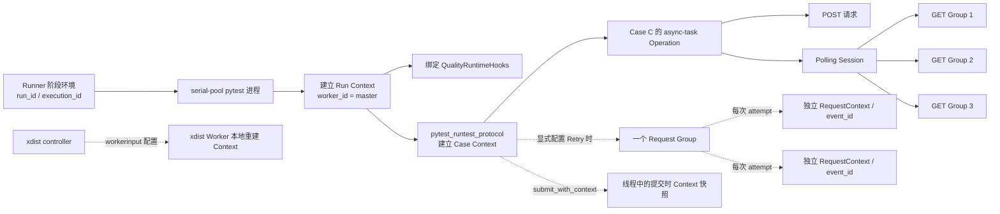
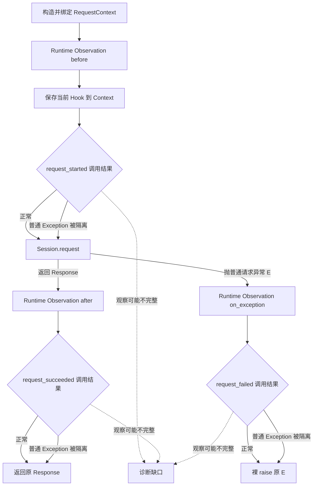

# 第 11 课：Fail-open 保护什么，又牺牲什么

## 本课在事实链中的位置

第 9 课把一次 HTTP 调用拆成业务路径与观察路径：`Session.request()` 产生的 `Response` 或原请求异常属于业务路径，中性 Runtime Hooks 只接收 started、succeeded、failed 等观察事件。第 10 课又说明，Quality 关闭时 provider 可以落到 Noop；Quality 启用时则绑定真实 Adapter。请求核心不需要为这两种后端维护两套发送逻辑。

还剩一个更苛刻的情况：真实 Hook 已经绑定，也确实位于调用链上，但它在记录事实时抛出了异常。如果观察者的错误覆盖了业务响应，或者吞掉了原请求异常，那么“旁路观察”仍然会成为业务执行的必要条件。

本课继续使用同一个 Case C：

```text
Case C = module/smoke/test_图片生成异步调用.py::
         TestAsyncImageGeneration::
         test_f8_09_async_image_generation_task_succeeds_with_result

POST /v1/media/generations
-> task_id="job-101"
-> GET /v1/media/tasks/job-101
-> Polling 到 succeeded
```

Case C 所在文件带有 `pytest.mark.serial`，所以标准 Runner 把它放入 `serial-pool`，由非 xdist 的 `master` 进程执行。它当前没有显式配置请求 Retry。正文会另外说明“若显式配置 Retry”时的传播机制，但不会把这个条件分支写成 Case C 已经发生的事实。

本课只回答一个问题：身份上下文怎样到达 Worker、请求、Retry 与 Polling，Hook 普通异常又怎样被隔离；第 12 课才讨论多个 Worker 为什么分别保存事实分片。

---

## 核心问题

> 当 Case C 已经绑定真实 Runtime Hook，而 Hook 在请求前、响应后或异常观察阶段抛出错误时，框架怎样让调用者仍得到业务 `Response` 或原请求异常？被保住的业务连续性以哪些诊断事实缺失为代价，为什么这些缺失只能表达为 unknown？

这里的“Hook 失败”必须限定到当前实现：由 Runtime lifecycle 的安全包装调用 Hook，且 Hook 抛出普通 `Exception`。它不自动包括其他中间件、`KeyboardInterrupt`、永久阻塞或任意副作用。

---

## 从一个具体现象开始

先固定一组正常输入。Quality 与 Semantic 均已启用，执行进程已成功建立 Collector、Run Context、Case Context 和 `QualityRuntimeHooks`；Polling 开始后，每轮响应解析与同步观察完成时，600 秒 deadline 都仍有余量。网络响应为教学输入：

```text
T0  POST /v1/media/generations
T1  R-submit = 202, {"task_id":"job-101"}
T2  GET /v1/media/tasks/job-101
T3  R-poll-1 = 200, {"status":"pending"}
T4  GET /v1/media/tasks/job-101
T5  R-poll-2 = 200, {"status":"pending"}
T6  GET /v1/media/tasks/job-101
T7  R-final = 200, {
      "status":"succeeded",
      "result":{"url":"https://cdn.example/job-101.png"}
    }
```

健康 Adapter 在全部采集前提满足时，为一次 POST 和三次 GET 各写一条 RequestMetric。四条记录共享 Case C 的五级身份，各有独立 `request_event_id`。Case 最终读取 `R-final`，断言业务状态和图像 URL，pytest call 为 passed。

现在做三个彼此隔离的故障注入运行。每次只让一个请求 Hook 抛 `RuntimeError`，其他输入不变。为使“缺在哪里”可以确定，教学用 Hook 在委托真实 Adapter **之前**抛错；这不是内置 Adapter 的默认行为。

| 隔离运行 | 新增的唯一故障 | 调用者最终看见什么 | 观察侧发生什么 |
| --- | --- | --- | --- |
| A：请求前失败 | POST 的 `request_started()` 抛 `RuntimeError` | POST 仍返回 `R-submit`，随后三轮 Polling 完成，Case passed | 开始时刻与原事件 ID 未建立；响应阶段仍会尝试采集 |
| B：响应后失败 | POST 的 `request_succeeded()` 在委托前抛 `RuntimeError` | 同一个 `R-submit` 仍交给 Task，Case 最终 passed | POST 对应的响应侧 RequestMetric 缺失；后续 GET 可正常记录 |
| C：异常观察失败 | POST 的网络调用改为抛原对象 `E = requests.Timeout(...)`，`request_failed()` 又在委托前抛 `RuntimeError` | 最终传播的仍是原 `E`；没有 task_id，不进入 Polling，未捕获时 pytest call failed | POST 的失败 RequestMetric 缺失，Hook 错误不成为顶层业务异常 |

运行 A 最容易产生误读。started 阶段虽然没有写入开始时刻，但 succeeded 阶段仍可临时生成一个事件 ID，并把缺失开始时刻回退成 `duration_ms=0.0`。这个 `0.0` 不是网络真实零耗时；它只说明当前实现没有取得起点。对可信诊断而言，耗时仍然是未知。

三个运行共同展示了 fail-open 的两面：

```text
Hook 的普通异常
├─ 没有直接夺走 Response，也没有替换原请求异常
└─ 可能让开始、成功、失败、关联或耗时事实缺失/不完整
```

所以“Case 继续执行”不能推出“观察记录仍然完整”；反过来，“没有 RequestMetric”也不能推出“没有发送请求”。

---

## 为什么原有解释不够

只记住“Hook 出错会被吞掉”，仍然解释不了四个关键问题。

第一，Hook 从哪里得到 Case C 的身份？五级身份横跨 Run、Execution、Worker、Case 与 Invocation。Controller 的 `ContextVar` 不会自动穿过进程边界，普通线程提交也没有仓库级自动传播保证。如果身份根本没有到达执行位置，Hook 即使不抛错，也无法生成可归属的记录。

第二，一次 Retry 或 Polling 会产生多个请求对象。它们应共享哪部分上下文，又必须在哪些字段上彼此不同？如果把“五级身份相同”误写成“所有请求共用一个 ID”，多次物理发送就会互相覆盖。

第三，`Exception` 隔离发生在哪一层？默认 Runtime Observation middleware 会调用 lifecycle，lifecycle 再调用 Hook。安全包装保护的是最内层 Hook 调用，并不把所有 before/after middleware 都变成 fail-open。

第四，Hook 失败以后究竟还剩什么事实？可能是整条 RequestMetric 缺失，也可能是 P0 已写而 Semantic 关联缺失，还可能出现 `duration_ms=0.0` 这样的实现回退值。把这些情况统一写成“记录失败”不够精确；把缺失补成零或成功则会制造不存在的事实。

因此，本课需要三个概念：作用域上下文传播、Fail-open 异常隔离和诊断缺口。

---

## 核心概念

### 1. 作用域上下文传播：Scoped Context Propagation

作用域上下文传播（Scoped Context Propagation）是把一组运行身份绑定到特定动态执行范围，并在进入、跨越受控边界和退出时保持或恢复这组身份的机制。

在本框架中，五级归属由两类 Context 共同提供：

```text
QualityRunContext  = run_id + execution_id + worker_id + output_dir
QualityCaseContext = case_id + invocation_id + nodeid + param_hash

RequestMetric 的五级身份
= Run Context 的 run_id / execution_id / worker_id
+ Case Context 的 case_id / invocation_id
```

它解决的是“当前观察事实属于谁”。Run Context 的生命周期覆盖一个执行进程；Case Context 在 `pytest_runtest_protocol` 外层覆盖该 Item 的 setup、call 和 teardown，结束时再用 token 恢复先前值。

传播不等于复制一切：

- xdist 跨进程时，controller 显式传递可序列化配置，Worker 在自己的进程重建 Run Context、Collector 和 Hook；不是把 controller 的 ContextVar 内存复制过去。
- 同一同步调用栈中的 Retry 与 Polling 直接读取当前 ContextVar，不重新计算五级身份。
- 显式线程任务只有通过 `submit_with_context()` 获取提交时的 `copy_context()` 绑定快照，才有仓库提供的传播路径。在 Case Context 建立前提交会复制不到该身份，提交后父上下文的变化也不会反写已有快照；这不是对上下文对象的深复制。
- 每个 `RequestContext` 只承载本次请求属性和语义关联，不保存五级字段的完整副本；RequestMetric 写入时才组合两类 Quality Context。

因此，“上下文传播成功”与“每次请求对象完全相同”是两回事。多次发送可共享五级归属，同时拥有不同的 `RequestContext`、attempt index、Request Group 或 Request Event ID。

### 2. Fail-open 异常隔离：Fail-open Exception Isolation

Fail-open 在本课中的精确含义是：观察 Hook 经 lifecycle 的 `_safe_call()` 或 `_safe_result()` 被调用时，Hook 抛出的普通 `Exception` 不直接阻止业务路径继续；无返回值调用被忽略，需要返回值的调用获得中性默认值。

它解决的是“观察后端故障是否直接接管业务结果”。典型结果为：

- started Hook 失败后，默认 before middleware仍能返回，后续网络发送继续；
- succeeded Hook 失败后，已经存在的 `Response` 仍由 `_send()` 返回；
- failed Hook 失败后，`_send()` 的裸 `raise` 仍传播原请求异常；
- Operation、Request Group、Polling 的开始失败时使用空句柄或非拥有 lease，普通收尾错误被忽略。

这不是一个全局容错开关。它只覆盖安全包装内部的函数调用和普通 `Exception`，不承诺 Hook 没有修改对象，不限制 Hook 执行时间，也不处理安全包装外的错误返回值消费。

### 3. 诊断缺口：Diagnostic Gap

诊断缺口（Diagnostic Gap）是观察链没有留下足够事实，导致某个状态、耗时、关联或完整性无法可靠判断。它可以有三种形态：

| 形态 | 例子 | 可以下的结论 |
| --- | --- | --- |
| 整条缺失 | succeeded Hook 在写入前失败，没有 POST RequestMetric | 对应观察事实不存在；不能推断没有 POST |
| 部分写入 | P0 RequestMetric 已写，Semantic 关联随后失败 | P0 层有记录；Semantic 层完整性未知 |
| 回退占位 | started 缺失，响应记录的 `duration_ms=0.0` | 当前字段用了回退值；真实耗时未知 |

诊断缺口与业务失败不同。运行 B 中 Case C 可以 passed，同时缺少 POST 成功记录；运行 C 中业务确实失败，同时失败记录也可能缺失。观察数据必须保留这种不确定性，不能根据 pytest 结果反填请求事实，也不能根据缺失记录改写 pytest 结果。

---

## 完整运行过程

先看五级身份怎样到达一次发送。实线表示当前 Case C 的实际路径，虚线表示其他执行方式下的条件传播机制：



图中有五条不能混淆的关系。

1. **Case C 的真实 Worker 是 `master`。** xdist 分支说明框架机制，不代表该 serial Case 已经由 `gw0` 执行。
2. **跨进程靠重建。** controller 只把 run、execution、输出目录和 Semantic 配置放入 `workerinput`；Worker 再读取自己的 `workerid`，建立本地对象。
3. **Case Context 是动态作用域。** Case 开始前 set，结束后 reset；在这一同步范围内，POST 与 Polling 都读取同一 Case 身份。
4. **Retry 不重算五级身份。** 若调用者显式配置 Retry，一个 Request Group 覆盖多个 attempt；每个 attempt 新建 RequestContext，并有自己的事件 ID。
5. **Polling 每轮不是同一请求。**一个 Polling Session 覆盖多轮查询，每轮 GET 建立独立 Request Group 和 Request Event；它们从当前作用域取得相同五级归属。

身份到达以后，一次物理发送按下面的控制流执行：



这个流程还要加上三个时间点。

**请求开始前。** Request Group 已创建并尝试绑定 `RequestContext`。`observe_request_started()` 先保存当前 Hook，再经 `_safe_call()` 调用它。即使 started 抛普通异常，结束阶段仍能从 Context 找回同一 Hook，而不是临时改用 provider 的新值。

**响应形成后。** `Session.request()` 已经把 `response` 放入 `_send()` 的局部变量，after middlewares 才执行 succeeded 通知。Hook 的普通异常被 lifecycle 吞掉后，after middleware 正常返回，`_send()` 继续返回这一个 `response`。这里要求其余 after middlewares 也正常；普通非 Hook after middleware 抛错仍会阻止 Response 返回。

这里的 `request_succeeded` 只表示传输调用已经返回一个 `Response`，并不表示状态码一定是 2xx，更不表示异步任务已经达到业务成功终态。4xx/5xx Response 同样进入 after 路径；HTTP 与业务状态仍由请求、Retry 和 Polling 的规则另行解释。

**传输抛错后。** `_send()` 只把 `Session.request()` 抛出的普通 `Exception` 送入 exception middlewares。failed Hook 的普通错误被隔离后，`_send()` 执行裸 `raise`，恢复当前捕获中的原异常对象。若外层 Retry 存在，它看到的仍是原异常并按原策略判断资格；观察者不能用自己的异常替换资格判断输入。

最后，Request Group 在 `finally` 中收尾，外层 Operation 或 Polling 也根据已经形成的业务结果收尾。它们的 Hook 普通错误仍走同一安全包装，但收尾记录是否完整是另一件事。

---

## 正常路径

正常路径不注入任何 Hook 故障，并保持第 10 课的响应序列。

### T0：执行进程建立三层运行状态

Runner 为 `serial-pool` 提供 `run_id` 与 `execution_id`。非 xdist pytest 进程把 `worker_id` 定为 `master`，建立：

```text
QualityRunContext
  run_id        = image-smoke-104-20260826T010000Z-a1b2c3d4
  execution_id  = serial-pool
  worker_id     = master

Collector
  拥有同一个 Run Context

Runtime Hook provider
  当前值 = QualityRuntimeHooks
```

如果是 xdist 并行阶段，controller 本身会跳过 Collector 初始化，把配置发给 Worker；Worker 再建立自己的 Run Context 与 Hook。这个机制保证进程边界明确，但不是 Case C 本次 serial 执行的路径。

### T1：Case 作用域补齐后两级身份

`pytest_runtest_protocol` 根据 `item.nodeid` 构造稳定 `case_id`，再由 `run_id + case_id + param_hash` 构造 `invocation_id`。本例沿用前课身份：

```text
case_id       = Case C 的稳定 nodeid
invocation_id = inv-a93bbdf630847f96d91234b5
```

插件将 `QualityCaseContext` 绑定到当前动态上下文。Case 的 setup、call、teardown 以及 call 内的 POST、Polling 都位于这个范围内。结束时 token 恢复进入前的 Case Context，避免下一 Item 意外继承 Case C。

### T2～T3：POST 形成第一条请求事实

组合入口先建立 `ASYNC_TASK` Operation。健康路径中，创建调用的内部 HTTP scope、轮询调用的内部 POLLING scope 以及 `BaseRequest` 的观察入口都会借用这一个 active lease，并以 `owned=False` 表示自己不负责再创建或结束另一个持久化 Operation。因此本例持久化的是一个外层 `ASYNC_TASK` Operation，不是三个父子 Operation。

POST 进入一个 `configured_max_attempts=1` 的 Request Group，因为 Case C 的创建调用没有 Retry policy。Group 把自己的语义 ID 写入本次 `RequestContext`。

started Hook 分配事件 ID 并保存 `perf_counter()` 起点。`Session.request()` 返回 `R-submit` 后，succeeded Hook 从两类 Quality Context 组合五级字段，从 RequestContext 取得 attempt 与计时起点，先写 P0 RequestMetric；随后 Semantic 观察才从 RequestContext 读取 Group ID，把该 metric 关联到对应 attempt。Task 随后从业务 Response 提取 `job-101`。

状态变化为：

```text
业务：没有 task_id -> R-submit -> task_id="job-101"
观察：无 POST event -> started -> POST RequestMetric + Group attempt
身份：五级归属不变；新增独立 request_event_id
```

### T4～T7：三轮 Polling 复用作用域，不复用事件

`poll_get()` 在外层 Operation 内建立一个 Polling Session。每轮 GET 重新进入 `_request_without_attach()`，因此每轮有一个独立 Request Group；因为没有 Retry，每个 Group 只有一个 attempt。

三轮结果依次是 pending、pending、succeeded。每轮创建 Request Group 时，Semantic 层读取当前 Operation 和 Polling Context；Group 绑定再把 operation、group 与同一个 polling session ID 写入本轮 `RequestContext`。内置 request metric 采集在 started 阶段建立本次事件 ID、起点和写入标志；得到 Response 后，response 采集才从 Collector Run Context 与当前 Case Context 组合五级字段，并把 RequestContext 中已有的 Group ID 交给后续 Semantic 观察。最终形成的关系是：

```text
同一五级身份
└─ 同一 async-task Operation
   ├─ POST Group
   │  └─ POST Request Event
   └─ 同一 Polling Session
      ├─ GET Group 1 -> GET Event 1 -> pending
      ├─ GET Group 2 -> GET Event 2 -> pending
      └─ GET Group 3 -> GET Event 3 -> succeeded
```

“同一五级身份”只回答归属；四个 Request Event ID 仍不同。Polling Session 与四层语义的统计意义将在第 17～18 课展开，本课只使用它说明上下文没有在轮询循环中丢失。

### T8～T9：业务与观察分别收尾

最终 Response 在业务层满足 `succeeded` 且存在图像 URL，Case C call 为 passed。Polling Session、Operation 和 pytest Case 记录各自尝试收尾；随后 Case Context 与会话级 Hook/Run Context 按 token 恢复。

在所有采集前提都满足时，本例有四条 RequestMetric 和完整的相关语义观察。这里的“完整”只针对给定健康路径和本课已列事件，不是对磁盘、外部服务或任意插件的永久保证。

### 条件分支：若显式启用 Retry

Case C 当前没有显式 Retry。为了说明传播机制，只假设未来某个调用为单轮 GET 配置 `max_attempts=2`：

```text
同一 Run/Execution/Worker/Case/Invocation
-> 创建一个 Request Group
-> attempt 1：新 RequestContext，event-1，原 Timeout
-> 等待
-> attempt 2：新 RequestContext，event-2，返回 Response
-> Group finish
```

两次 attempt 的五级身份和 Group 相同，`attempt_index` 与 `request_event_id` 不同。Retry executor 消费原异常或 Response 来决定是否继续，Hook 不生成新的 Case 身份。

---

## 复杂路径

下面三个路径分别从 started、succeeded 和 failed 加入一个故障，不把多个变量混在同一次运行中。

### 路径 A：`request_started` 先失败，网络仍发送

输入仍是正常的四个 Response，只把 POST 的 Hook 改成：

```text
request_started(context):
    在委托 QualityRuntimeHooks 之前抛 RuntimeError("capture start failed")

其余 Hook：正常委托真实 Adapter
```

执行顺序为：

```text
1. lifecycle 先把本次 Hook 保存到 RequestContext.attributes
2. request_started 抛 RuntimeError
3. _safe_call 捕获并返回
4. 默认 before middleware 继续，Session.request 返回 R-submit
5. request_succeeded 从 Context 取回同一 Hook 并正常委托 Adapter
6. _send 返回 R-submit；Task 提取 job-101
7. Polling 的三轮 GET 正常完成；Case passed
```

因为真实 Adapter 的 started 没有运行，POST Context 没有原事件 ID 和开始时刻。response 采集在其余条件正常时会临时创建事件 ID，并把 duration 回退为 `0.0`。所以本次可能仍有一条 POST RequestMetric，但其计时起点不存在。

正确结论是：POST 确实返回，Case 继续；POST 的真实观察耗时未知。错误结论包括“POST 耗时为零”“started 根本没有必要”以及“有 ending 记录就证明完整生命周期存在”。

### 路径 B：`request_succeeded` 失败，原 Response 仍返回

这次 started 正常，POST 已拥有事件 ID 和开始时刻；`Session.request()` 也已经返回 `R-submit`。只让 succeeded Hook 在委托 Adapter 前抛错：

```text
response = Session.request(...)          # 已得到 R-submit
observe_request_succeeded(context, response)
    -> Hook 抛 RuntimeError
    -> _safe_call 捕获并返回
return response                           # 返回同一个 R-submit
```

Task 因而仍能提取 `job-101` 并进入 Polling。后续三轮 GET 使用各自新 Context，若 Hook 不再故障，它们仍可形成 RequestMetric，Case 最终 passed。

POST 的 started 状态只存在于内存 Context 中，succeeded 未委托记录函数，所以本次 POST 主记录缺失。不能用三条 GET 记录反推 POST 的状态、耗时、状态码或用量，也不能因为 Case passed 就补造一条成功 POST。

这里还要区分“抛错前”和“抛错后”。本例明确在委托前抛错，故主记录缺失；若一个自定义 Hook 先写记录、再抛异常，lifecycle 会吞掉异常，但已经发生的写盘或对象修改不会回滚。Fail-open 不是事务撤销。

### 路径 C：网络抛原 Timeout，`request_failed` 又失败

只改变 POST 的网络输出：

```text
E = requests.Timeout("network timeout")
retry_policy = None
```

started 正常，但 `Session.request()` 抛出对象 `E`。默认 exception middleware 调用 failed Hook；故障注入 Hook 在委托记录前又抛 `RuntimeError("capture failure failed")`。完整异常流为：

```text
Session.request 抛 E
-> _send 捕获普通 Exception E
-> request_failed(context, E)
-> Hook RuntimeError 被 _safe_call 隔离
-> exception middleware 返回
-> _send 裸 raise
-> 外层 Operation 尝试失败收尾
-> 调用者收到原对象 E
```

由于没有 `R-submit`，Task 无法提取 `job-101`，也不会进入 Polling。Case C 不捕获该 Timeout，所以 pytest call 为 failed。观察侧没有失败 RequestMetric，但这不能把业务失败解释成成功，也不能把缺失记录解释成“没有发起 POST”。

若另一个调用显式配置 Retry，Retry 的异常资格判断仍接收原 `E`。failed Hook 的 `RuntimeError` 不会替换它；是否再发由 Retry policy、次数和 deadline 决定。本例的 Case C 没有 Retry，因此直接停止。

### 其他生命周期 Hook 失败

Operation、Request Group 与 Polling 也使用 `_safe_result()` 或 `_safe_call()`：

| 故障 | 中性结果或控制流 | 可能损失 |
| --- | --- | --- |
| `model_id_from_kwargs` 抛普通异常 | model ID 回退 `None`，组合入口继续 | 模型归属 |
| `begin_operation` 抛普通异常 | 回退 `native_handle=None, owned=False` | Operation 及下游父子关联 |
| `start_request_group` 抛普通异常 | Group 使用空句柄，发送继续 | Group 与 attempt 关联 |
| `begin_polling_session` 抛普通异常 | Polling lease 使用空句柄，状态机继续 | Polling Session 事实 |
| finish Hook 抛普通异常 | 收尾函数返回，已形成业务结果继续传播 | 最终 outcome 或汇总 |

中性回退保证调用结构还能继续，不代表生成了一条“空但成功”的事实。空句柄就是没有对应后端对象。

### Adapter 的二层保护仍不是完整性保证

内置 `QualityRuntimeHooks` 在请求采集内部还有一层尽力保护：`start_request_capture()`、`record_response()` 或 `record_exception()` 抛普通异常时，Adapter 尝试写一条 `request_capture_failed` integrity 记录。

这条诊断也可能不存在：Collector 可能缺失，`capture_integrity()` 可能再次失败，进程也可能在写入前终止。通用 lifecycle 不会自动为任意第三方 Hook 生成诊断。因此只能写“尝试记录观察失败”，不能写“所有 Hook 错误都有审计记录”。

P0 与 Semantic 也不是原子事务。response/exception 路径先把 Context 标成 `written=True`，再构造并写 P0 metric，之后才观察 Semantic：

```text
written=True
-> 构造 RequestMetric
-> record_request(P0)
-> observe_request_metric(Semantic)
```

任一步失败都可能留下不同缺口。例如 P0 写入成功而 Semantic 失败时，只能确认 P0 层已有事实；不能声称 Request Group 或 Operation 一定完整。反过来，Collector 的 P0 写入失败会返回 `False` 而不是继续抛错，当前调用者没有检查该返回值，随后仍会尝试 Semantic 观察，所以 Semantic 有局部事实也不能证明 P0 主记录存在。若 `written=True` 后、主记录写入前失败，后续重复回调还可能因“已写”标志而不再补录。

### Fail-open 之外的故障

以下情况不满足本课的保护条件：

1. Hook 抛 `KeyboardInterrupt`、`SystemExit` 等 `BaseException`。安全包装只捕获 `Exception`，这类异常会继续向外传播，并可能替换原业务结果。
2. Hook 永久阻塞或执行过慢。当前机制没有 Hook 超时或隔离线程；位于 Retry attempt 或 Polling 循环内的同步 Hook 耗时会消耗对应 deadline，在临界点甚至可能让业务先进入超时。
3. Hook 原地修改 `RequestContext`、请求 kwargs、`Response` 或 error。安全包装不复制对象，也不回滚修改；“返回同一对象”不等于对象内容未变。
4. Hook 返回错误形状。例如 `begin_operation()` 没有抛错却返回 `None`，安全调用已经结束，后续读取 `.native_handle` 时仍会失败。
5. 普通非 Hook before/after middleware 抛错。`BaseRequest` 会把它包装成 `RuntimeError`；before 错误可阻止发送，after 错误可让已取得的 Response 无法返回。
6. 普通非 Hook `on_exception` middleware 抛错。dispatcher 会把错误作为 note 附到原请求异常后继续传播原异常；这是中间件调度规则，不是 lifecycle 对 Hook 的通用保护。
7. 绕过 `BaseRequest`、显式移除默认 Runtime Observation middleware、离开 Case Context，或在线程中使用裸 `executor.submit()`。此时真实调用链可能根本没有获得本课描述的观察与身份传播。

---

## 对应的框架实现

前面的现象、概念和控制流已经建立，再用六个最小源码片段定位实现。代码均按当前生产源码节选，省略与本课分支无关的细节。

### 1. xdist 传配置，Worker 本地重建

```python
# quality/pytest_plugin_runtime.py
def pytest_configure_node(node):
    node.workerinput[_WORKER_INPUT_KEY] = {
        "enabled": True,
        "run_id": state.config.run_id,
        "execution_id": state.config.execution_id,
        "output_dir": str(state.config.output_dir),
        "semantic_enabled": state.config.semantic_enabled,
    }

def _resolve_runtime_config(config):
    worker_input = getattr(config, "workerinput", None)
    payload = worker_input.get(_WORKER_INPUT_KEY) if isinstance(worker_input, dict) else None
    if payload is not None:
        return QualityRuntimeConfig(
            enabled=bool(payload["enabled"]),
            run_id=_required(payload.get("run_id"), "run_id"),
            execution_id=_required(payload.get("execution_id"), "execution_id"),
            output_dir=Path(payload["output_dir"]),
            semantic_enabled=bool(payload.get("semantic_enabled", False)),
        )
```

controller 的输出是可序列化配置，不是一个 ContextVar token。Worker 以该配置加自己的 `workerid` 构造 `QualityRunContext`，再绑定本地 Collector 与 Hook。必需字段非法或初始化失败会使该进程的相应采集被禁用并写 warning；不能把“框架有配置通道”当作“每个 Worker 一定初始化成功”。

Case C 实际不走 xdist 分支，但这个片段说明“穿过 Worker”必须按进程边界解释。

### 2. Case Context 有明确进入与恢复

```python
# quality/pytest_plugin_runtime.py
@pytest.hookimpl(hookwrapper=True, tryfirst=True)
def pytest_runtest_protocol(item, nextitem):
    ...
    token = None
    try:
        case_context = _build_case_context(item, collector.run_context.run_id)
        token = set_case_context(case_context)
    except Exception as error:
        collector.capture_integrity(...)

    try:
        yield
    finally:
        ...
        if token is not None:
            reset_case_context(token)
```

输入是当前 pytest Item 与 Run ID；成功状态变化是当前动态上下文开始指向该 Item 的 Case Context。`yield` 覆盖 setup、call 和 teardown 的 protocol；输出不是把身份作为参数逐层传给 Task，而是让下游在当前作用域读取。`finally` 恢复旧值。

若 Case Context 构造失败，pytest Item 仍可继续，但请求采集没有后两级身份时会跳过主 metric，并尽力记录 `missing_case_context`。这正是业务继续而诊断出现缺口的另一个例子。

### 3. Retry 新建 RequestContext，但共用一个 Group

```python
# common/base_request.py
group = self._runtime_observer.start_request_group(
    method=first_context.method,
    path=first_context.path,
    protocol=first_context.protocol,
    configured_max_attempts=retry_policy.max_attempts,
)

def context_factory(attempt_index):
    context = self._build_request_context(...)
    context.attributes["attempt_index"] = attempt_index
    context.attributes["max_attempts"] = retry_policy.max_attempts
    group.bind(context)
    return context

try:
    return self.retry_executor.execute(
        context_factory=context_factory,
        send_once=self._send,
        ...
    )
finally:
    group.finish()
```

输入是方法、请求参数与 Retry policy。Group 在所有 attempt 之前建立；每次 attempt 的状态变化是新建 Context、写 attempt index、绑定同一 Group。输出可能是最终 Response、策略停止时保留的原请求异常，或等待越过共享 deadline 后产生的 `RetryDeadlineExceeded`；Polling 会把后一种异常转换成 `PollingTimeoutError`。Group 无论哪条路径都尝试 finish。

这里没有生成新的五级身份。RequestMetric 稍后从当前 Run/Case Context 取五级字段，并从本次 RequestContext 取 attempt 等 P0 输入；P0 写入之后，Semantic 观察再读取 Context 中的 Group ID 建立关联。Case C 当前没有传 Retry policy，所以该片段描述条件能力，而不是本例执行次数。

### 4. 请求开始保存 Hook，安全包装只捕获普通异常

```python
# common/runtime_hooks/lifecycle.py
def observe_request_started(context):
    hooks = get_active_runtime_hooks()
    context.attributes[RUNTIME_REQUEST_HOOKS_ATTR] = hooks
    _safe_call(hooks.request_started, context)

def observe_request_succeeded(context, response):
    hooks = _request_hooks(context)
    _safe_call(hooks.request_succeeded, context, response)

def observe_request_failed(context, error):
    hooks = _request_hooks(context)
    _safe_call(hooks.request_failed, context, error)

def _safe_call(function, *args, **kwargs):
    try:
        function(*args, **kwargs)
    except Exception:
        return
```

started 的输入是本次可变 RequestContext。保存 Hook 的状态变化发生在调用之前，因此 started 普通异常不会抹掉快照。succeeded/failed 的输入再增加 Response 或 error；在快照属性没有被改写时，它们优先回取开始阶段的同一 Hook。

`except Exception` 是保护边界。函数没有日志、重试或事务回滚；它只返回。`_safe_result()` 使用相同捕获范围，在错误时返回调用点指定的默认值。

### 5. Response 与原异常由 `_send()` 继续拥有

```python
# common/base_request.py
def _send(self, context):
    self._run_before_middlewares(context)
    try:
        response = self.session.request(
            method=context.method,
            url=context.url,
            **context.kwargs,
        )
    except Exception as error:
        self._run_exception_middlewares(context, error)
        raise

    self._run_after_middlewares(context, response)
    return response
```

正常输入经过网络后产生局部变量 `response`。Runtime succeeded Hook 没有替代返回值；只要所有 after middlewares 返回，输出仍是这个变量。

异常输入是 `Session.request()` 抛出的普通 `Exception`。exception middlewares 接收同一对象，随后裸 `raise` 恢复它。failed Hook 普通异常因上一片段被隔离，不会成为新的顶层异常。`BaseRequest.request()` 外层还会按业务错误尝试 Operation 收尾，再次重抛。

### 6. 尽力诊断与零值回退是两种不同事实

```python
# quality/runtime_adapter.py
def _capture_request_call(context, function, *args):
    try:
        function(*args)
    except Exception as error:
        collector = get_collector()
        if collector is None:
            return
        collector.capture_integrity(
            source="request_metrics",
            code="request_capture_failed",
            message=f"{type(error).__name__}: {error}",
            related_id=context.attributes.get(REQUEST_EVENT_ID_ATTR),
        )

# quality/request_metrics.py
def _duration_ms(context):
    started_at = context.attributes.get(REQUEST_STARTED_ATTR)
    if not isinstance(started_at, (int, float)):
        return 0.0
    return max((time.perf_counter() - float(started_at)) * 1000, 0.0)
```

Adapter 的异常输入会触发一次 integrity 写入尝试；Collector 不存在时没有输出，二次写入失败也没有必达保证。`_duration_ms()` 的输入若缺少有效起点，当前输出是 `0.0`。前者是尽力诊断机制，后者是字段回退行为；都不能证明观察链完整。

### 源码与测试定位

- `common/context_executor.py:12-20`：受控线程提交的 Context 快照。
- `common/runtime_hooks/lifecycle.py:43-104,133-202,240-271`：中性回退、lease 固定 Hook 与安全调用。
- `common/request_middleware.py:91-113`：默认 Runtime Observation 的三个转发点及中间件顺序。
- `common/base_request.py:70-105,123-161,258-389,447-558`：业务结果、Retry Group、Polling 与普通中间件边界。
- `quality/runtime_context.py:8-99`：Run/Case Context 的字段和动态作用域。
- `quality/pytest_plugin_runtime.py:67-149,179-209,273-307,326-342,384-388`：执行进程、Worker 配置、Case 作用域和恢复。
- `quality/runtime_adapter.py:20-148`：中性 Hook 到 P0/Semantic 的适配与尽力诊断。
- `quality/request_metrics.py:40-129,260-308`：五级身份组合、事件 ID、时长回退、写入标志和 Semantic 观察。
- `quality/semantic_context.py:155-271`：Request Group 与 Polling Session 的 ContextVar 关联。
- `tests/quality/test_common_runtime_hooks.py:54-98,127-143`：Context 传播、固定起始 Hook和业务异常保留的覆盖。
- `tests/quality/test_quality_context_executor.py:9-42`：提交时快照与并发 Context 隔离的覆盖。
- `tests/quality/test_quality_request_metrics.py:214-265`：采集失败、Retry 与 Polling 请求事实的覆盖。
- `tests/quality/test_semantic_request_groups.py:55-79,104-142`：共享 Group、Hook 快照与 P0/Semantic 解耦的覆盖。
- `tests/quality/test_semantic_polling.py:27-48`：Polling Session 与多轮请求的覆盖。
- `tests/test_base_request_middleware.py:59-103`：exception middleware 之后原异常对象传播的覆盖。

本课定向执行了其中 18 项测试：18 passed，0 failures，0 errors，0 skipped。测试没有逐一覆盖三个请求 Hook 各自抛错的完整 BaseRequest 路径，也没有覆盖 `BaseException`、阻塞、原地修改、错误返回形状、二次诊断失败或裸线程提交；这些边界来自生产源码，不能写成测试已全面证明。

---

## 能够保证什么

在当前仓库内置实现和下列前提内，可以得出这些结论：

1. xdist controller 通过 `workerinput` 传递运行配置，Worker 在自己的进程建立 Run Context、Collector 与 Runtime Hook；非 xdist 执行进程使用 `worker_id=master`。
2. Case Context 在 `pytest_runtest_protocol` 的动态范围内建立，并在 `finally` 中用 token 恢复；同步的 POST、Retry 和 Polling 不重新计算五级身份。
3. 条件性的 Retry 在一个 Request Group 内为每个真实 attempt 新建 RequestContext；attempt 共享五级归属，但拥有独立 attempt index 和 Request Event ID。
4. Polling 在一个 Session 中执行多轮独立请求；每轮从当前 Run/Case Context 组合相同五级身份，不复用 Request Event ID。
5. 请求 started 时选中的 Hook 被保存到该 RequestContext；在该快照属性未被改写时，succeeded/failed 优先使用这份快照，provider 中途变化不会把首尾自动拆给两个后端。
6. 经 `_safe_call()` 或 `_safe_result()` 调用的 Hook 抛普通 `Exception` 时，该异常会被忽略或转换为中性默认值。
7. 在其余中间件正常时，started Hook 普通异常不阻止网络发送，succeeded Hook 普通异常不替换已经形成的 Response，failed Hook 普通异常不替换原普通请求异常。
8. Operation、Request Group 与 Polling Hook 的普通开始/结束错误采用相同隔离原则；开始阶段可得到空句柄或非拥有 lease。
9. 内置 Adapter 的请求采集失败会尽力写 `request_capture_failed`，但业务路径不会等待该诊断必然成功后才继续。

这些保证描述控制流和归属机制。它们不等于观察事实完整，也不等于所有自定义 Hook 都满足相同的副作用、延迟和返回形状约束。

---

## 保证成立的前提

- 实际请求经过 `BaseRequest` 的默认 `RuntimeObservationMiddleware`，并由 `common.runtime_hooks.lifecycle` 调用 Hook。直接调用 `requests` 或显式传入 `middlewares=[]` 不具备同一观察链。
- Quality 在实际执行进程初始化成功，Collector、Run Context 和 Case Context 均位于有效作用域。仅存在相关类或配置文本不足以证明一次运行已经绑定。
- 跨 xdist 进程依赖 controller payload 与 Worker 本地重建；跨线程依赖 `submit_with_context()`。裸 `executor.submit()` 没有仓库提供的 Context 传播保证。
- “保留业务结果”的对照要求请求参数、外部或模拟响应、Retry/Polling 策略、其他中间件与 Case 断言保持相同。
- 正常 Case C 的 passed 结论还要求 Polling 各轮响应解析和同步 Hook 执行后，600 秒 deadline 仍有余量，尤其最终 succeeded 被处理后 `remaining > 0`。
- 故障必须是 Hook 方法内部抛出的普通 `Exception`。`BaseException`、错误返回形状、永久阻塞和安全包装外的代码不满足该前提。
- 声称某条主记录缺失时，需要知道故障发生在委托写入之前。Hook 先产生副作用再抛错时，当前实现不会回滚已经写入的内容。
- 声称业务对象“原样保留”还要求 Hook 与其他中间件不原地修改 RequestContext、请求参数、Response 或 error；fail-open 只隔离普通异常，不提供对象不可变性。
- RequestMetric 的五级归属要求写入时同时能取得 Collector Run Context 和当前 Case Context。RequestContext 自身不是五级身份的完整持久载体。
- 本课的 202、`job-101`、pending/succeeded 和结果 URL 是已解案例输入，不证明外部服务在真实时刻返回相同内容。

---

## 不能保证什么

1. **不能保证诊断完整。** Fail-open 的目标是让业务路径不因 Hook 普通异常直接失败；它允许 RequestMetric、Operation、Group、Polling Session 或 integrity 记录缺失。
2. **不能把缺失补成零、成功或没有问题。** started 缺失后出现的 `duration_ms=0.0` 是当前实现回退，不是实际零耗时。没有失败记录也不表示请求没有失败。
3. **不能保证 P0 与 Semantic 原子一致。** 两层按顺序写入，一层成功不证明另一层完整；`written=True` 也不证明主记录已经持久化成功。
4. **不能保证每个 Hook 错误都有 integrity 记录。** Adapter 只做尽力写入；Collector 缺失、二次写入失败或进程中断都可能让诊断本身消失。
5. **不能把普通 `Exception` 的结论扩大到 `BaseException`。** `KeyboardInterrupt`、`SystemExit` 等不会被 `_safe_call/_safe_result` 捕获，可能阻断或替换业务结果。
6. **不能隔离阻塞与延迟。** Hook 与业务调用同步执行，没有独立超时；位于 Retry attempt 或 Polling 循环内的耗时会消耗对应 deadline，临界情况下可改变最终业务超时结果。
7. **不能回滚可变对象副作用。** Hook 接收 RequestContext、Response 和 error 的原对象；原地修改在抛错后仍可保留。
8. **不能容忍任意接口异常。** `hooks.method` 的属性查找发生在进入安全函数之前；`_safe_result` 也只在方法调用抛异常时回退。Hook 正常返回 `None` 或错误对象后，安全包装外的属性读取仍可能失败。
9. **不能把所有中间件都称为 fail-open。** 非 Hook before/after middleware 的普通错误会被包装为 `RuntimeError` 并改变业务输出；exception middleware 另有“给原异常添加 note”的规则。
10. **不能声称 ContextVar 自动跨越所有边界。** xdist 是配置传递加本地重建，线程需要 helper；子进程、裸线程和脱离 Case 作用域的任务都需单独证明。
11. **不能把条件性的 Retry 写成 Case C 当前事实。** 当前组合入口调用创建 POST 时不传 `retry_policy`，只把默认的 `None` 传给 Polling；两侧均未启用 Retry。本课的两次 attempt 只解释框架能力。
12. **不能用业务 passed 证明外部观察完整。**运行 B 可以让 Case C passed 而 POST metric 缺失；业务结果与诊断覆盖率必须分别报告。

最重要的结论是：**Fail-open 保住的是业务控制流对 Response 和原异常的所有权，不是观察事实的完整性。观察失败后，框架宁可留下可见或不可见的诊断缺口，也不能用猜测填造一条成功、零耗时或无问题的事实。**

---

## 与下一课的关系

第 9～11 课完成了非侵入式质量观测的三步推导：

```text
中性合同隔开 common 与 quality
-> Noop 让关闭状态仍保持统一调用点
-> Fail-open 隔离 Hook 普通异常，但允许诊断缺口
```

现在可以确认：一次请求事实若成功生成，会携带 Run、Execution、Worker、Case 与 Invocation 的归属；若 Hook 在写入前失败，那条事实仍然缺失，后续机制不能凭空恢复它。

接下来的问题不再是“Hook 出错会不会拖垮业务”，而是“多个 Worker 都成功产生事实时，怎样避免它们竞争同一个输出，并明确每份事实由谁生产”。第 12 课将解释为什么每个 Worker 独立记录事实分片。独立分片能建立写入所有权，但不会补回本课已经丢失的观察事件。
