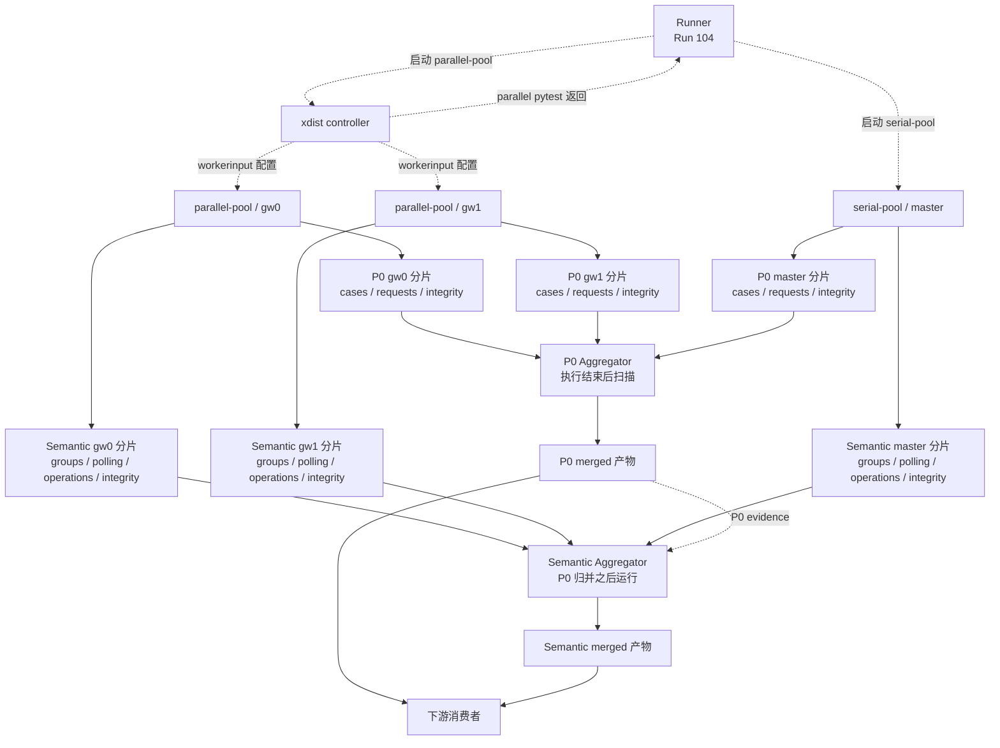

# 第 12 课：为什么每个 Worker 独立记录事实分片

## 本课在事实链中的位置

第 11 课说明了观察链的一个取舍：Runtime Hook 的普通异常不会直接夺走业务 `Response` 或替换原请求异常，但对应的观察事实可能缺失。只有实际生成成功的 Case、Request 与 Semantic 事实，才有机会进入后续质量账本。

现在把视角从一个请求移到一次含有多个执行进程的 Run。并行阶段中的 `gw0`、`gw1` 会同时产生事实；并行阶段结束后，串行阶段的 `master` 还会继续产生事实。如果这些进程共同打开同一份在线产物，谁能初始化它、谁能追加、哪次写入覆盖了谁，就会成为新的不确定性。

本课继续使用同一个异步图像生成案例，并保持 Case C 的真实调度属性：

```text
Case C = module/smoke/test_图片生成异步调用.py::
         TestAsyncImageGeneration::
         test_f8_09_async_image_generation_task_succeeds_with_result

POST /v1/media/generations
-> task_id="job-101"
-> GET /v1/media/tasks/job-101
-> Polling 到 succeeded
```

Case C 所在文件有 `pytest.mark.serial`。在标准 Runner 的并行模式中，它不会由 `gw0` 或 `gw1` 执行，而是在并行阶段返回后进入不带 xdist 参数的 `serial-pool/master`。本课为展示多 Worker，再沿用第 6 课的混合计划 `Q=[D,E,A,B,C]`；D、E 是两个未标 `serial` 的真实图像 Case，A、B、C 属于串行池。

本课只回答“每个事实生产者为什么写自己的分片，以及这些分片如何保留来源”。第 13 课才判断分片是否属于当前 Run、字段是否符合当前 Schema；第 14～16 课再处理重复、冲突、完整性和哈希。

---

## 核心问题

> 当 `parallel-pool/gw0`、`parallel-pool/gw1` 与后续 `serial-pool/master` 都会产生事实时，怎样避免它们竞争同一个文件，并让后置归并者知道每份原始事实由哪个执行位置生产？

这个问题包含两个不能混为一谈的目标：

```text
写入目标隔离：不同生产者在正常路径下不共享同一个在线追加文件

事实归属保留：进入分片的主记录仍携带
run_id / execution_id / worker_id / case_id / invocation_id
```

前者减少写入竞争，后者保留语义归属。文件名不能替代完整五级身份；记录里有五级身份，也不能反过来提供文件系统锁或来源认证。

---

## 从一个具体现象开始

给定一次启用 Quality 与 Semantic 的教学运行：

```text
run_id = image-smoke-104-20260826T010000Z-a1b2c3d4
计划 Q = [D, E, A, B, C]
并发参数 = -n 2

parallel(Q) = [D, E]
serial(Q)   = [A, B, C]
```

本次运行实际观察到 D 由 `gw0` 执行、E 由 `gw1` 执行。这个映射只是本次案例输入；Runner 没有承诺下一次仍把 D 固定给 `gw0`、E 固定给 `gw1`。A、B、C 则在并行调用返回后由 `serial-pool/master` 执行。

```text
D = module/image_model/test_wan2_7_image.py::
    TestImageGenerations::test_pos_case_1

E = module/image_model/test_wan2_7_image_pro.py::
    TestImageGenerations::test_create_image_generation
```

三个生产者会命中三组不同的 P0 路径：

```text
parallel-pool/gw0
├─ shards/cases-parallel-pool-gw0.jsonl
├─ shards/requests-parallel-pool-gw0.jsonl
└─ shards/integrity-parallel-pool-gw0.jsonl

parallel-pool/gw1
├─ shards/cases-parallel-pool-gw1.jsonl
├─ shards/requests-parallel-pool-gw1.jsonl
└─ shards/integrity-parallel-pool-gw1.jsonl

serial-pool/master
├─ shards/cases-serial-pool-master.jsonl
├─ shards/requests-serial-pool-master.jsonl
└─ shards/integrity-serial-pool-master.jsonl
```

Semantic 启用并初始化成功时，每个生产者还在 `semantic/shards/` 下拥有自己的 `request-groups-*`、`polling-sessions-*`、`operations-*` 与 `integrity-*`。当前实现没有独立的 `streams-*.jsonl`；SSE 的流式结果最终进入该 Worker 的 Operation 分片。

先看 Case C 的一部分输出。若它的 setup、call、teardown 都形成 pytest report，三条 CaseResult 都追加到：

```text
shards/cases-serial-pool-master.jsonl
```

若教学输入中的一次 POST 和三次 GET 都经过健康的观察链并成功写入，四条 RequestMetric 都追加到：

```text
shards/requests-serial-pool-master.jsonl
```

每条主记录仍保存 Case C 的五级身份。`phase` 区分 pytest 阶段，`request_event_id` 区分每次物理请求。不能把“一项 Case”误读成 Case 分片里永远只有一行，也不能因为四条请求位于同一文件就认为它们共用一个事件 ID。

现在加入一个反事实设计：假如三个进程都使用同一个 `cases.jsonl`。每个 Collector 初始化时都会把目标文件清空，于是可能出现：

```text
T0  gw0 初始化 cases.jsonl，文件被清空
T1  gw0 追加 D 的 call 事实
T2  gw1 初始化同一个 cases.jsonl，D 的既有内容被清空
T3  gw0 与 gw1 继续追加，但各自的实例锁互不相识
T4  parallel-pool 返回
T5  serial-pool/master 初始化同一个 cases.jsonl，并再次清空并行事实
```

T2 和 T5 已经足以说明共享目标的问题。即使不假定操作系统一定会把两次 append 交错成损坏的 JSON，共享初始化也会覆盖已有内容；后续并发追加也没有仓库提供的跨进程协调。

当前实现不创建这个共享文件。它用 `execution_id-worker_id` 后缀把三次初始化路由到不同目标。这就是本课要解释的核心：竞争不是靠一个全局文件锁解决，而是先让标准路径中的生产者不要共同写一份原始分片。

---

## 为什么原有解释不够

“给每条记录加上 `worker_id` 就可以并发写”只解决了内容标签，没有解决写入过程。若 `gw0` 和 `gw1` 仍共同打开 `cases.jsonl`，记录正文即使带不同 `worker_id`，初始化覆盖和无跨进程协调的问题仍然存在。

“使用了锁，所以多个 Worker 写文件安全”也不准确。P0 Collector 的锁属于一个 Python 对象实例，只能串行化该实例内的线程。不同 xdist Worker 是不同进程，拥有不同 Collector 和不同锁；它们不会共享这把锁。Semantic Collector 的锁也同样只属于本地实例。

“每个 Worker 一份文件”又过于粗略。当前实现按事实种类拆分，并把 Execution 一起放入文件后缀：

```text
同一个 Worker 位置
≠ 一份混合所有类型的总文件

实际路由键
= 事实种类 + execution_id + worker_id
```

`parallel-pool/gw0` 的 CaseResult 与 RequestMetric 不写进同一文件；名称同为 `master` 的不同 Execution 也应命中不同后缀。Semantic 还使用独立目录和独立类型文件。

最后，“独立文件存在”不等于“事实可信”。空文件可能表示 Collector 初始化成功后没有相应记录，也可能表示后续 Hook 绑定失败、Case 未执行或事实写入缺失。非空文件也可能包含其他 Run、错误结构、重复或冲突。独立分片只建立原始写入边界，不完成后续可信性判断。

因此，本课需要三个概念：Worker 独立分片、单写者路由，以及生产者、归并者与消费者的责任边界。

---

## 核心概念

### 1. Worker 独立分片：Worker-owned Shard

Worker 独立分片（Worker-owned Shard）是由一个执行进程在初始化时选定，并由该进程按记录种类追加原始事实的 JSONL 文件。在当前实现中，“所有者”由 `execution_id` 与 `worker_id` 共同定位，而不是只看 `gw0` 或 `master` 这个局部名称。

它的生命周期是：

```text
执行进程初始化 Collector
-> 为本 execution/worker 创建或清空类型化文件
-> 本地观察事件逐行 append
-> 该 pytest 执行会话卸载 Collector，不再由它在线写入
-> Runner 后置归并读取现有分片
```

“owned”描述框架内的写入责任，不是操作系统权限。文件没有因此获得 ACL、签名或进程认证；其他进程若被错误配置为相同路径，仍可打开和修改它。

### 2. 单写者路由：Single-writer Routing

单写者路由（Single-writer Routing）是让标准执行路径中的每个生产进程根据自身 execution/worker 身份计算唯一目标，从而避免不同 Worker 共同写一份 raw shard 的约定。

它解决的是“写到哪里”，不是“写的内容一定正确”：

| 问题 | 单写者路由是否回答 |
| --- | --- |
| `gw0` 与 `gw1` 是否命中不同文件 | 是，在身份唯一且配置正确的标准路径中 |
| 同一 Collector 内多个线程怎样追加 | 由实例内锁串行化 |
| 两个进程误用同一 worker_id 是否安全 | 否 |
| 文件里的 run_id 是否为当前 Run | 否，后置归并再判断 |
| 应当有多少 Case 或请求 | 否，需要上游计划与完整性依据 |
| 一条事实是否真实反映外部服务 | 否 |

因此，单写者是正常路径的路由不变量，不是存储系统强制执行的唯一写入许可。

### 3. 生产者、归并者与消费者：Producer, Merger, Consumer

生产者（Producer）是在事实发生位置创建原始记录的执行进程。对本课而言，pytest hook 生产 CaseResult，Runtime Hook 适配链生产 RequestMetric，Semantic Collector 在相应结束点生产业务语义主记录；它们都写当前进程自己的 raw shard。

归并者（Merger）在执行阶段结束后扫描分片，读取并形成 merged 产物。它不参与 Worker 在线写入，也不能补造一个从未落盘的请求或 Case 事实。

消费者（Consumer）读取上游产物，计算 Metrics、Flaky 信号或其他派生信息。消费者可以增加解释，不能回到历史上替 Worker 生产原始事实。

三者的区别是事实责任，不只是调用顺序：

| 角色 | 拥有的输入 | 可以产生的输出 | 不拥有的责任 |
| --- | --- | --- | --- |
| Worker 生产者 | 本地 pytest report、请求观察事件、Run/Case Context | raw shard 中的原始记录 | 判断整个 Run 是否完整可信 |
| Aggregator 归并者 | 执行结束时可见的分片与归并请求 | merged 产物、manifest、完整性结果 | 重演外部请求或补写缺失原始事实 |
| Metrics/Flaky 消费者 | 上游约定的结果与历史 | 指标或检测信号 | 改写 pytest 原始结果或 raw shard |

---

## 完整运行过程

先用数据流固定各方关系。实线表示原始事实或归并结果的传递，虚线表示配置或阶段控制：



图中有五条关键关系。

第一，controller 到 `gw0/gw1` 的虚线传递运行配置，而不是代替 Worker 生产 Case 或请求事实。controller 识别出自己的角色后不创建 Collector，所以标准路径中没有额外的 `cases-parallel-pool-master.jsonl` 副本。

第二，`gw0` 与 `gw1` 各自把 P0 和 Semantic 原始事实写到不同路径。P0 与 Semantic 也是两套写入链，不能把两条实线理解成一次原子提交。

第三，串行 `master` 位于并行 pytest 调用返回之后。Case C 的事实只沿 `serial-pool/master` 分支写入，不会因为同一个 Run 曾启动过 xdist 就改归 `gw0/gw1`。

第四，Aggregator 的箭头从已经形成的分片指向 merged 输出。这是后置读取，不是 Aggregator 在 Case 执行期间接管 Worker 文件句柄。Semantic Aggregator 还会读取 P0 merged manifest 与 RequestMetric 作为 P0 evidence，所以图中另有一条从 P0 merged 指向 Semantic Aggregator 的虚线；本课只用它说明先后依赖，不提前展开入口校验。

第五，下游消费者读取归并结果，不反向修改 Worker 分片。若某条 Hook 事实在第 11 课的失败路径中根本没有生成，图中的任何后置节点都不能恢复它。

按时间展开，一次运行经历以下状态变化：

```text
T0  Runner 已有 Run 104、Q 和两个执行池
T1  parallel controller 给 gw0/gw1 下发共同的 Run/Execution/output 配置
T2  gw0、gw1 用各自 worker_id 创建自己的空分片
T3  D、E 执行，原始事实逐行追加到实际生产 Worker 的路径
T4  parallel pytest 返回，Worker 在线写入阶段结束
T5  Runner 启动 serial-pool，非 xdist 进程取 worker_id=master
T6  master 创建 serial-pool-master 分片并执行 A、B、C
T7  Case C 的 pytest report、POST、Polling GET 与语义收尾写入 master 分片
T8  Runner 进入 finalization，P0 Aggregator 扫描 P0 shards
T9  写最终 Run record后，Semantic Aggregator 扫描 semantic/shards
T10 Metrics 与 Flaky 等下游阶段读取上游产物
```

T2 的空分片是“初始化发生过”的产物，不是完成数量。T3 与 T7 才可能增加事实行。T8 以后才发生跨 Worker 读取，因此生产阶段不需要所有 Worker 在线共享一个 merged 文件。

---

## 正常路径

### 初始输入

本路径固定这些输入：

```text
Quality enabled       = true
Semantic enabled      = true
run_id                = image-smoke-104-20260826T010000Z-a1b2c3d4
parallel execution_id = parallel-pool
serial execution_id   = serial-pool
parallel workers      = gw0, gw1
serial worker         = master
output_dir            = Run 104 的质量产物目录
parallel result       = 允许 Runner 继续 serial-pool 的非终止结果
```

本次观测到 D 在 `gw0`、E 在 `gw1`；Case C 仍在 `master`。所有 Collector 初始化、Hook 调用与文件追加均成功。Case C 没有显式 Retry，教学响应仍是一次 POST 获得 `job-101`，三次 GET 得到 `pending -> pending -> succeeded`。

### parallel-pool 的判断与写入

controller 首先判断自己是否是 xdist controller。结果为是，所以它只保存插件配置并在每个节点配置时下发 payload，不建立 Run Context、Collector 或 Runtime Hook。

`gw0` 和 `gw1` 读取相同的 `run_id`、`execution_id=parallel-pool` 与 `output_dir`，但读取到不同的 xdist `workerid`。路径计算结果因此分叉：

| 输入进程 | execution_id | worker_id | Case 分片 |
| --- | --- | --- | --- |
| Worker 0 | `parallel-pool` | `gw0` | `cases-parallel-pool-gw0.jsonl` |
| Worker 1 | `parallel-pool` | `gw1` | `cases-parallel-pool-gw1.jsonl` |

两个进程随后各自清空或创建自己的一组文件。`gw0` 不扫描 `gw1` 的文件，`gw1` 也不打开 `gw0` 的文件。D 的 pytest report 到达 `gw0` 插件时，只追加 `gw0` Case 分片；E 的 report 对 `gw1` 同理。

此时形成的结论只有：在这次给定派发下，D/E 的原始事实拥有不同生产者路径。不能从文件名反推下一次 xdist 调度，也不能从 `gw0` 分片为空推断 `gw0` 原本没有任务。

### serial-pool 中的 Case C

并行 pytest 返回后，Runner 构造下一次串行 pytest 调用的参数并移除 xdist 选项。该次 pytest 配置不是 xdist controller，也没有 `workerinput`，所以插件使用 `worker_id=master`。`execution_id` 已由阶段环境切换为 `serial-pool`，最终后缀是 `serial-pool-master`。当前 Runner 通过连续的 `pytest.main()` 调用执行这两个阶段；这里的 `master` 表示非 xdist 执行位置，不表示 Runner 必然另启一个操作系统进程。

Case C 的事实沿两条来源清晰的生产链写入：

```text
pytest setup/call/teardown report
-> pytest_runtest_logreport
-> CaseResult
-> record_case
-> shards/cases-serial-pool-master.jsonl

POST/GET 的 Runtime Hook 响应事件
-> RequestMetric 构造
-> record_request
-> shards/requests-serial-pool-master.jsonl
```

第一条链的输入是 pytest 已形成的 phase report，输出是零至多条实际出现的 phase 事实；插件不会在 setup 失败时虚构一个 call report。第二条链的输入是实际经过观察器且拥有 Run/Case Context 的请求事件，输出是一行一条的 RequestMetric。Case C 的四次请求共享五级归属，但各有自己的 `request_event_id`。

对一条成功写入的 Case C call 记录，可以把路径与正文并排理解：

```text
路径：shards/cases-serial-pool-master.jsonl
      └─ 生产路由 = serial-pool/master

正文：run_id        = image-smoke-104-20260826T010000Z-a1b2c3d4
      execution_id  = serial-pool
      worker_id     = master
      case_id       = Case C 的稳定 nodeid
      invocation_id = inv-a93bbdf630847f96d91234b5
      phase         = call
      final_status  = passed
```

路径说明谁在标准链中写入，正文说明记录属于哪个 Run、Execution、Worker、Case 与 Invocation。两者一致是本路径的已知输入与结果；本课不把这种一致扩大为对任意手工记录的认证。

### 后置读取

执行控制进入 Runner 的 `finally`，并且排在前面的 Allure finalization 正常返回后，Runner 才会在已有执行结果基础上调用 Quality finalization。P0 归并先扫描 `shards/`；只有取得 P0 归并结果后，流水线才写最终 Run record，并继续 Semantic、Metrics 与 Flaky 阶段。

因此，正常路径的责任闭环是：

```text
Worker 只生产自己的 raw facts
-> 执行阶段结束
-> Aggregator 统一读取，不回写 Worker raw shards
-> Consumer 使用归并结果形成派生信息
```

本路径可以得出“在线写入已按生产者隔离”。它还不能得出“所有分片已通过当前 Run 与 Schema 检查”，因为那些判断尚未执行或尚未在本课展开。

---

## 复杂路径

### 路径一：反事实共享文件怎样丢失所有权

只改变一个变量：取消 `execution_id-worker_id` 后缀，让所有 CaseResult 都写 `shards/cases.jsonl`。其余运行计划和阶段顺序保持不变。

| 时间 | 调用者与动作 | 文件状态变化 | 能否保留来源 |
| --- | --- | --- | --- |
| T0 | `gw0` 初始化 | `cases.jsonl` 被清空 | 尚无记录 |
| T1 | `gw0` 写 D call | 文件含 D | D 暂时可由正文身份识别 |
| T2 | `gw1` 初始化 | 同一文件再次被清空 | D 已丢失，正文身份也随行消失 |
| T3 | `gw0/gw1` 并发 append | 两个实例锁各管各的 | 框架没有跨进程写入顺序与完整性保证 |
| T4 | parallel 返回 | 文件内容取决于此前未受框架协调的写入 | 不能宣称并行事实完整 |
| T5 | serial `master` 初始化 | 同一文件再次清空 | 可把残留并行事实全部覆盖 |
| T6 | Case C 写入 | 文件可能只剩串行事实 | 不能据此声称 Run 只有串行事实 |

这个反事实有两个独立故障来源。

第一，初始化使用截断写。后初始化者不需要与前一个进程同时运行，也能清空已有内容。由于 Runner 的串行阶段本来就在并行阶段之后，T5 的覆盖风险甚至不依赖真正的并发交错。

第二，实例锁不跨进程。T3 中每个 Collector 都能成功取得自己的锁，但这不能建立两个文件句柄之间的互斥。当前 `append_jsonl()` 只是序列化一行、以 append 模式写入并 flush，没有仓库级进程锁。

恢复实际的独立路由后，状态变为：

```text
T0  gw0 只清空 cases-parallel-pool-gw0.jsonl
T1  gw0 追加 D
T2  gw1 只清空 cases-parallel-pool-gw1.jsonl，D 不受影响
T3  两者追加不同文件，不需要共享实例锁
T5  master 只清空 cases-serial-pool-master.jsonl，并行文件不受影响
```

最终输出是三份保留生产者边界的 raw shard，而不是一份边写边汇总的总文件。Aggregator 稍后读取三份输入，才形成统一输出。

### 路径二：两个进程错误复用同一身份

独立路由依赖一个关键前提：同一输出目录里，一个 execution/worker 后缀只对应一个 Collector 初始化者。现在让两个进程都错误地获得：

```text
output_dir   = 同一目录
execution_id = parallel-pool
worker_id    = gw0
```

两者都会计算出 `cases-parallel-pool-gw0.jsonl` 等相同路径。较晚初始化者会清空较早内容，两个实例的 `RLock` 也不会共享。当前实现没有通过进程 PID、随机后缀、文件锁或独占创建来拒绝这次碰撞。

所以“Worker-owned”是一项标准插件路由合同，不是安全边界。它要求 xdist 提供不同 worker ID，并要求调用方不要并行复用同一个 output/execution/worker 组合。

### 路径三：空分片与缺失分片都不能补猜

再只改变初始化或写入结果。

情形 A：Collector 成功初始化，创建了空 `cases-parallel-pool-gw0.jsonl`，但该进程尚未收到 report。空文件只证明初始化走到了文件创建，不证明 `gw0` 应有零个 Case。

情形 B：P0 Collector 创建成功，随后 Runtime Hook 绑定失败。外层异常分支会重置已绑定的 Hook token、Run Context token 和 P0 Collector 注册状态，并让业务 pytest 继续，但已经创建的文件不会因此自动删除。如果 Semantic Collector 已先成功建立，这个异常分支不会立即重置它；会话卸载时的 `pytest_unconfigure` 才负责最终收尾和重置。文件存在仍不能证明采集链已完整启用。

情形 C：Case/Request 主写入失败。Collector 尽力在自己的 Integrity 分片追加错误；若 Integrity 写入也失败，只能尝试告警，磁盘上可能没有机器可读诊断。没有主记录不能解释为请求没有发生或 Case 成功。

情形 D：Worker 在创建文件前崩溃，或初始化目录失败。对应分片可能完全不存在。缺失文件可能代表未启动、失败、错误路径或其他未知状态，不能直接改写成“这个 Worker 没有工作”。

独立分片的价值是让问题可以定位到一个明确生产者路径。例如，可以准确说“没有观察到 `parallel-pool/gw0` 的 Case 分片”。但要判断该文件是否本应存在、应有多少 Case，还需要权威计划、实际 Worker 证据和后置完整性规则。本课不提前用一个猜测替代这些依据。

### 路径四：P0 与 Semantic 只完成一边

Case C 的响应事实先尝试进入 P0 Request 分片，再交给 Semantic 观察。两次调用不是事务：

```text
P0 request append 成功
-> Semantic 结束写入失败
=> P0 RequestMetric 可能存在，Semantic 记录缺失

P0 request append 失败并返回 False
-> 当前调用方仍继续 Semantic 观察
=> Semantic 局部事实可能存在，P0 主记录缺失
```

所以不能把“同一个 Worker 有两套独立目录”理解成原子双写。两套分片都保留生产者路由，但它们各自的存在性与完整性仍需分别判断。

---

## 对应的框架实现

概念模型已经固定后，再把关键步骤映射到当前实现。以下片段是带省略标记的教学摘录，不是可直接替换生产文件的完整实现。每段只保留当前结论需要的分支；被省略的错误处理会在片段后单独说明，不能把省略理解成生产代码没有这些状态。

### 1. controller 不生产原始分片，Worker 本地初始化

```python
# quality/pytest_plugin_runtime.py，教学化删减
def pytest_configure(config):
    if getattr(config.option, "collectonly", False):
        return
    try:
        runtime_config = _resolve_runtime_config(config)
    except Exception:
        _write_warning(config, "quality collection disabled")
        return

    state = _PluginState(config=runtime_config)
    setattr(config, _STATE_ATTR, state)
    if not runtime_config.enabled:
        return
    if _is_xdist_controller(config):
        return

    worker_id = _worker_id(config)
    run_context = QualityRunContext(
        run_id=runtime_config.run_id,
        execution_id=runtime_config.execution_id,
        worker_id=worker_id,
        output_dir=runtime_config.output_dir,
    )
    try:
        state.run_context = run_context
        state.run_token = set_run_context(run_context)
        state.collector = configure_collector(run_context)
        if runtime_config.semantic_enabled:
            try:
                state.semantic_collector = configure_semantic_collector(run_context)
            except Exception:
                reset_semantic_collector()
                state.semantic_collector = None
        state.runtime_hooks = QualityRuntimeHooks()
        state.runtime_hooks_token = bind_runtime_hooks(state.runtime_hooks)
    except Exception:
        # 重置 Hook/Run token 和 P0 Collector 状态；告警文本省略
        ...

def pytest_configure_node(node):
    state = _get_state(node.config)
    if state is None or not state.config.enabled:
        return
    node.workerinput["quality_runtime"] = {
        "enabled": True,
        "run_id": state.config.run_id,
        "execution_id": state.config.execution_id,
        "output_dir": str(state.config.output_dir),
        "semantic_enabled": state.config.semantic_enabled,
    }
```

输入是当前 pytest 配置、进程角色与运行配置。插件先创建并挂载 `_PluginState`，所以 controller 虽然在 Collector 初始化前返回，`pytest_configure_node` 仍能从该 state 取得配置并形成 Worker payload；它不会因此创建本地 Collector。Worker 分支把 payload 与自己的 `workerid` 组合成 Run Context，状态变化是本执行位置获得 P0 Collector、可选 Semantic Collector和后续 Hook 绑定。

若配置解析抛普通异常，插件告警后不建立 state。若仅 Semantic 初始化失败，内层分支重置 Semantic Collector，P0 与后续 Hook 绑定仍可继续。若 P0 初始化或后续 Hook 绑定进入外层异常分支，代码会重置 Hook token、Run Context token 与 P0 Collector 状态并告警；它不会在该分支立即重置一个先前已成功建立的 Semantic Collector，后者由 `pytest_unconfigure` 收尾。这些分支都不会删除已经创建的空文件，也解释了为什么“发现空文件”不证明整个观察链已成功建立。

### 2. 路由键决定一组类型化 P0 分片

```python
# quality/collector.py，教学化删减
class QualityCollector:
    def __init__(self, run_context):
        self.run_context = run_context
        self._write_lock = RLock()

        layout = ensure_quality_dirs(run_context.output_dir)
        suffix = f"{run_context.execution_id}-{run_context.worker_id}.jsonl"
        self.paths = QualityShardPaths(
            cases=layout.shards / f"cases-{suffix}",
            requests=layout.shards / f"requests-{suffix}",
            integrity=layout.shards / f"integrity-{suffix}",
        )
        for path in (
            self.paths.cases,
            self.paths.requests,
            self.paths.integrity,
        ):
            path.write_text("", encoding="utf-8")
```

输入是 `QualityRunContext`。`execution_id` 区分池级执行，`worker_id` 区分该 Execution 内的执行进程；事实种类由 `cases/requests/integrity` 前缀区分。输出是三条确定路径以及三个刚初始化的空文件。

初始化是覆盖写，不是接着旧文件追加。这使“一个后缀只初始化一次”成为重要前提，也使反事实共享路径会产生确定的覆盖风险。异常不会被这段构造函数自行转换成“成功的空分片”；外层插件决定如何警告和停用采集。

Semantic Collector 使用相同后缀规则，但根目录是 `semantic/shards/`，类型是 Request Group、Polling Session、Operation 与 Integrity。SSE 结束后写 OperationRecord，不存在额外 Stream 分片。

### 3. 锁只保护同一 Collector 的线程追加

```python
# quality/collector.py 与 quality/storage.py，教学化删减
def _append(self, path, record):
    with self._write_lock:
        append_jsonl(path, record)

def append_jsonl(path, record):
    serialized = json.dumps(_to_jsonable(record), separators=(",", ":"))
    with path.open("a", encoding="utf-8", newline="\n") as handle:
        handle.write(serialized)
        handle.write("\n")
        handle.flush()
```

输入是一条已经构造完成的记录和当前 Collector 选择的路径。锁取得后，状态变化是目标文件多出一行 JSON 与换行；底层 helper 返回目标路径，Collector 的主记录接口把成功表示为 `True`。若序列化或写盘抛异常，Case/Request 的上层会尽力写 Integrity，Integrity 自身失败则只尽力告警。

`self._write_lock` 不会跨进程共享。`flush()` 也不是 `fsync()`，不能把成功返回扩大为断电后的持久性保证。这里没有对共享文件进行原子替换；原子写 helper 用于其他输出，不是 raw shard 的追加方式。

### 4. 路径身份与记录身份同时保留

```python
# quality/pytest_plugin_runtime.py，教学化删减
result = CaseResult(
    run_id=collector.run_context.run_id,
    execution_id=collector.run_context.execution_id,
    worker_id=collector.run_context.worker_id,
    case_id=case_context.case_id,
    invocation_id=case_context.invocation_id,
    nodeid=case_context.nodeid,
    param_hash=case_context.param_hash,
    phase=report.when,
    raw_status=status,
    final_status=status,
    duration_ms=duration_ms,
    start_time=end_time - timedelta(milliseconds=duration_ms),
    end_time=end_time,
)
collector.record_case(result)
```

输入来自两个作用域：Run Context 提供 run/execution/worker，Case Context 提供 case/invocation；pytest report 提供 phase、状态与耗时。输出是一条带五级身份的 CaseResult，并被当前 Collector 路由到它的 Case 分片。

RequestMetric 与三类 Semantic 主记录也在标准路径中写入五级身份。Integrity 是例外：Integrity 记录正文只有 Run 级身份，其 execution/worker 来源主要依赖所在分片路径。因此，把一行 Integrity 从文件中单独摘出后，不能声称仍能仅凭正文恢复完整生产者位置。

Collector 的 `record_case(result)` 接口并不会重新验证调用者手工传入的五级字段是否等于自身 Run Context。标准插件按上面方式构造一致记录，但“文件中出现一条自称来自 gw1 的记录”不是密码学来源证明。

### 5. Aggregator 在执行结束后读取

```python
# run_orchestration/runner.py 与 quality_pipeline.py，教学化删减
try:
    # 执行 parallel-pool 与 serial-pool，细节省略
    ...
finally:
    allure_lifecycle.finalize()
    quality_run_lifecycle.finalize(...)

def finalize_quality_run(config, ...):
    merge_result = quality_fact_merge_stage.merge_quality_facts(config, ...)
    if merge_result is None:
        return
    quality_run_record.write_final_run_record(...)
    quality_semantic_stage.run_semantic_stage(config)
    quality_metrics_stage.run_metrics_stage(config)
    imported = quality_flaky_stage.run_flaky_history_stage(config, ...)
    quality_flaky_stage.run_flaky_state_stage(config, imported)
```

输入是已经结束或中止的池级执行结果，以及此时输出目录中可见的分片。进入 `finally` 后，Allure finalization 排在 Quality 调用之前；只有它正常返回，代码才调用 Quality finalization。Quality 流水线内部先进入 P0 归并，再写最终 Run record，随后才进入 Semantic、Metrics 与 Flaky 阶段。P0 Aggregator 扫描 `cases-*`、`requests-*`、`integrity-*`；Semantic Aggregator 扫描自己的三类主分片与 Integrity。

这里的输出是 merged 与派生产物，不是对 raw shard 的在线追加。若 P0 归并没有结果，流水线停止后续步骤；若某条原始事实此前从未写出，finalization 也没有业务输入可以重建它。

### 6. 源码与测试定位

- `module/smoke/test_图片生成异步调用.py:22,57-70`：Case C 的 serial marker 与真实异步创建、Polling 入口。
- `run_orchestration/runner.py:99-112,128-176,204-211`：并行与串行阶段顺序，以及 `finally` 中的 Quality finalization。
- `run_orchestration/pytest_execution.py:245-266`：串行阶段移除 xdist 参数。
- `quality/pytest_plugin_runtime.py:68-150,213-250,297-323,379-389`：controller/Worker 分支、配置传递、CaseResult 写入和 Worker ID。
- `quality/collector.py:26-128`：P0 路径、初始化、分类写入、实例锁和失败诊断。
- `quality/storage.py:59-73,129-135`：JSONL append 与 P0 目录布局。
- `quality/request_metrics.py:48-129`：RequestMetric 的五级身份和 P0/Semantic 顺序。
- `quality/semantic_collector.py:112-143,221-294,338-385,431-599`：Semantic 路径、主记录落点、身份与失败处理。
- `quality/aggregator.py:125-153,188-274`：P0 后置扫描和 merged 输出。
- `quality/semantic_aggregator.py:114-189`：Semantic 后置扫描和 merged 输出。
- `run_orchestration/quality_pipeline.py:18-54`：P0、Run record、Semantic、Metrics、Flaky 的调用顺序。
- `tests/quality/test_quality_collector.py:78-172`：空分片、分类写入、线程锁、重建清空与写入失败覆盖。
- `tests/quality/test_quality_pytest_plugin.py:164-190,212-296`：xdist 独立 P0/Semantic 分片与 controller 无重复分片。
- `tests/quality/test_semantic_request_groups.py:30-49`：HTTP 事实进入关联的 Group 与 Operation 分片。
- `tests/quality/test_semantic_polling.py:27-48`：两轮查询进入一个 Polling Session、两个 Group 与一个 Operation。
- `tests/quality/test_semantic_streaming.py:42-59`：SSE 结果进入 Operation 分片，而非独立 Stream 分片。

本课定向执行 13 项测试：13 passed，0 failures，0 errors，0 skipped。测试覆盖预期路径，不证明未模拟的进程碰撞、断电、强杀、文件损坏或后续全部校验规则。

---

## 能够保证什么

在当前标准实现和本节前提内，可以得到以下有限结论：

1. Quality 启用且非 collect-only、非 xdist controller 的执行进程会用当前 `execution_id-worker_id` 构造自己的三类 P0 路径。
2. Semantic 也启用且初始化成功时，该进程会在 `semantic/shards/` 构造 Request Group、Polling Session、Operation 和 Integrity 四类路径。
3. xdist controller 不建立 Collector；标准并行路径由实际 `gw*` Worker 生产原始分片，不生成 controller 的 `parallel-pool-master` 重复副本。
4. 非 xdist 执行进程使用 `worker_id=master`。当前 Case C 受 serial marker 约束，在标准并行 Runner 中写入 `serial-pool-master` 路径。
5. 不同 execution/worker 组合在正常命名与同一输出根目录下得到不同目标文件，因此一个 Worker 的正常初始化不会清空另一 Worker 的分片。
6. 同一 P0 Collector 实例内的线程追加由一个 `RLock` 串行化；Semantic Collector 也用本实例锁保护 pending 状态与相应写入。
7. 标准 CaseResult、RequestMetric 和 Semantic 主记录在进入分片时保留五级身份；分片路径另外表达 execution/worker 生产路由。
8. Worker 只写 raw shard；Runner 在执行阶段之后启动 Aggregator，后者读取分片并写独立的 merged 产物。
9. P0 主写失败会尽力转成该 Worker 的 IntegrityIssue；Integrity 再失败会尽力告警，而不会伪造一条成功记录。

这些保证建立的是写入边界和责任关系，不是对事实完整性、真实性或业务成功的结论。

---

## 保证成立的前提

- Quality 配置实际启用，pytest 不是 `--collect-only`，且当前进程成功完成 P0 Collector 初始化。仅有相关类、插件注册或配置文件不等于某次调用已启用。
- Semantic 分片还要求 Semantic 开关启用且 Semantic Collector 初始化成功；P0 成功不能替代这个前提。
- 每个执行进程获得正确且唯一的 `output_dir + execution_id + worker_id`。同一路径不得由两个 Collector 并行初始化或写入。
- xdist controller 能把同一 Run、Execution、输出目录配置传给 Worker，Worker 能取得自身 `workerid`。若 `workerid` 键缺失，当前代码会回退为字符串 `worker`，不能假设仍然唯一。
- Case 与 Request 主记录经过标准 pytest plugin、Runtime Hook Adapter 与有效 Run/Case Context 构造。直接手工调用 Collector 时，调用者需自己保证记录身份一致。
- Case C 的 `serial-pool/master` 结论依赖当前文件级 serial marker、标准 Runner 分池，以及串行阶段移除 `-n/--numprocesses/--dist`。绕过 Runner 的直接 pytest 调用需要重新判断 execution 配置。
- 文件系统允许创建目录、初始化文件和追加内容。一次 Python `flush()` 成功只说明数据交给当前 I/O 层，不能替代更强的持久性契约。
- 本课教学中的 `job-101`、两次 pending、最终 succeeded 与结果 URL 是固定输入，不是仓库对外部服务实时响应的证明。

---

## 不能保证什么

1. **不能把 Worker-owned 理解成访问控制。** 独立分片没有自动附加 ACL、签名、进程认证或防篡改能力，其他进程仍可能打开文件。
2. **不能保证错误复用身份时安全。** 两个进程若获得同一 output/execution/worker 组合，就会命中同一路径；初始化覆盖与无共享锁问题重新出现。
3. **不能声称存在跨进程文件锁。** P0 和 Semantic 的 `RLock` 都属于本地 Collector 实例，只约束同一实例内的线程或状态操作。
4. **不能把 append 加 flush 扩大为事务或崩溃持久性。** 当前 raw shard 写入没有 `fsync()`、日志事务或崩溃恢复协议。
5. **不能把文件存在解释为采集完整。** Collector 初始化会先创建空文件；后续 Hook 绑定失败、Case 未开始或事实缺失时，空文件仍可能存在。
6. **不能把空文件解释为零事实。** 是否本应有 Case、请求或语义记录需要权威计划和运行证据；未知必须保留为未知。
7. **不能把分片缺失解释为该 Worker 没有工作。** 未启动、初始化失败、进程崩溃、输出路径错误等都可能产生同一表象。
8. **不能仅凭文件名确认当前 Run。** 分片名没有 `run_id`；主记录正文虽有 run_id，仍需后置入口判断，下一课再展开。
9. **不能把文件名替代五级身份。** 文件只编码 execution/worker 和记录种类，不包含 case/invocation；Integrity 单条正文甚至只有 Run 级身份。
10. **不能把记录身份当成来源认证。** 标准构造路径会写一致身份，但 Collector 不复核手工传入记录与自身 Context 是否相符。
11. **不能保证每个 Case 只有一行。** pytest 的 setup、call、teardown 是不同 phase；实际未形成的 phase report也不会被补造。
12. **不能保证 P0 与 Semantic 原子一致。** 两套 Collector、目录和写入调用彼此独立，可能只成功一边。
13. **不能恢复第 11 课的诊断缺口。** Hook 写入前失败时，独立路径中仍不会凭空出现对应 RequestMetric。
14. **不能由分片独立推出事实可信。** 跨 Run、Schema、重复、冲突、预期 Execution、Case 数量、JUnit identity 与哈希都尚需后置处理。
15. **不能把测试覆盖扩大到未测试环境。** 13 项测试没有模拟两个真实进程故意共用一个后缀、突然断电、强制终止、网络文件系统语义或落盘后篡改。

最重要的结论是：**Worker 独立分片通过确定性的 execution/worker 路由建立原始事实的写入所有权，避免标准多进程路径共享同一在线目标；它没有因此证明事实完整、真实或已经可以被信任。**

---

## 与下一课的关系

本课把多个生产者的写入责任分开了：`parallel-pool/gw0`、`parallel-pool/gw1` 与 `serial-pool/master` 各自生成类型化 raw shard，执行结束后再由 Aggregator 统一读取。这样，竞争问题不再迫使 Worker 共同维护一个在线总文件，事实来源也能沿路径和记录身份被追踪。

但目录里出现一份 `cases-parallel-pool-gw0.jsonl`，仍然没有回答两个问题：其中的 `run_id` 是否属于当前 Run，字段结构是否符合当前版本的模型。分片文件名甚至不包含 `run_id`。

第 13 课将从一份其他 Run 的记录混入当前目录，以及一份 Schema 不兼容的记录开始，解释 Run 与 Schema 为什么构成归并入口。通过入口只说明记录满足这两道准入条件，仍不能证明事实完整或业务结论正确。
