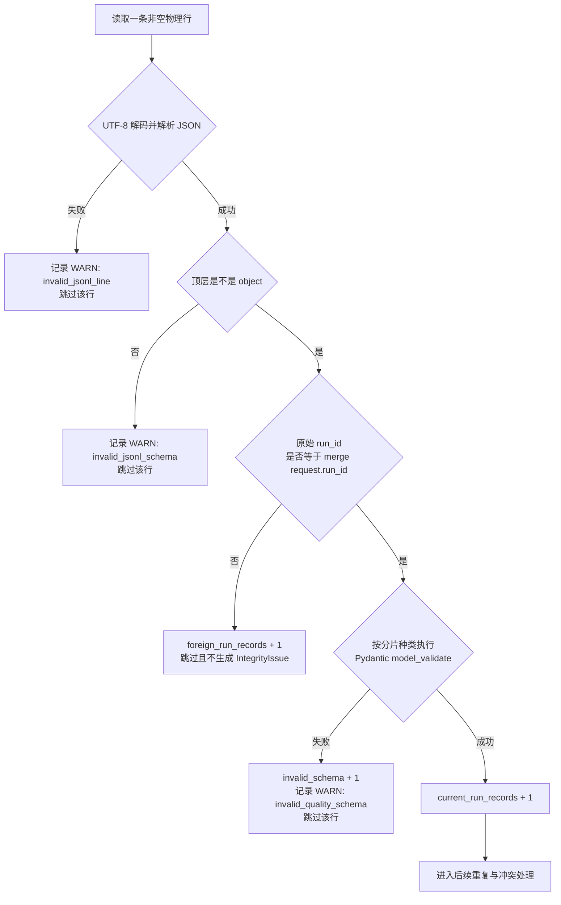

# 第 13 课：Run 与 Schema 构成归并入口

## 本课在事实链中的位置

第 12 课把多个事实生产者的写入目标分开了。`parallel-pool/gw0`、`parallel-pool/gw1` 与 `serial-pool/master` 各自写自己的 raw shard，执行结束后的 Aggregator 再统一读取。这个设计回答了“谁在什么位置写入”，却还没有回答“读到的内容能否进入本次归并”。

原因在于，分片路径只带事实种类、`execution_id` 和 `worker_id`，不带 `run_id`。如果一个输出目录被复用，旧 Run 的记录可能留在当前扫描范围内；即使一行确实自报为当前 Run，它的字段也可能属于不受支持的版本，或根本不满足当前记录模型。

本课继续使用同一个异步图像生成 Case C：

```text
Case C = module/smoke/test_图片生成异步调用.py::
         TestAsyncImageGeneration::
         test_f8_09_async_image_generation_task_succeeds_with_result

POST /v1/media/generations
-> task_id="job-101"
-> GET /v1/media/tasks/job-101
-> Polling 到 succeeded
```

Case C 在当前源码中真实存在，并受文件级 `pytest.mark.serial` 约束。`job-101`、轮询状态和本课使用的具体时间仍是贯穿案例的教学输入，不表示仓库证明外部服务曾返回这些值。

本课只回答一个入口问题：P0（最基础的 Case、Request 与 Integrity 事实层）Aggregator 怎样逐行判断“属于当前 Run”且“能被当前模型接受”，再把记录交给后续归并关卡。第 14 课才处理已经通过入口的精确重复与同键冲突；第 15、16 课再处理完整性、JUnit identity 和哈希。

---

## 核心问题

> 同一目录里的记录都能解析成 JSON，为什么 Aggregator 仍不能直接把它们写入 merged 输出？

因为“能够解析”“属于本次运行”和“符合当前记录契约”是三个不同判断：

```text
JSON 可解析
≠ 属于当前 Run
≠ 符合当前 Pydantic 模型
≠ 已经完整、真实、无冲突
```

在 JSON 解码与 object 形态检查之后，本课关注两道核心准入门：当前 Run 门与当前模型 Schema 门。它们只决定一条原始记录能否成为后续归并的候选，不提前替后续关卡作结论。

---

## 从一个具体现象开始

沿用第 12 课的 Run 104 与 `serial-pool/master`。本次归并请求由标准 Runner 的 Quality 收尾链创建；这个案例明确给定排在它前面的 Allure finalization 已正常返回。关键输入为：

```text
merge request.run_id = image-smoke-104-20260826T010000Z-a1b2c3d4
output_dir            = Run 104 的质量产物目录
expected_execution_ids = [parallel-pool, serial-pool]
expected_case_count     = 上游权威 Case 集合给出的数量
```

现在只放大观察 Case C 的一个分片：

```text
shards/cases-serial-pool-master.jsonl
```

其他 Case、Request 与 Integrity 分片保持正常且暂不展开。这个 Case 分片中有三条非空物理行。L1 是基准记录：

```json
{
  "schema_version": "quality.v1",
  "run_id": "image-smoke-104-20260826T010000Z-a1b2c3d4",
  "execution_id": "serial-pool",
  "worker_id": "master",
  "case_id": "module/smoke/test_图片生成异步调用.py::TestAsyncImageGeneration::test_f8_09_async_image_generation_task_succeeds_with_result",
  "invocation_id": "inv-a93bbdf630847f96d91234b5",
  "nodeid": "module/smoke/test_图片生成异步调用.py::TestAsyncImageGeneration::test_f8_09_async_image_generation_task_succeeds_with_result",
  "param_hash": "74234e98afe7498f",
  "phase": "call",
  "raw_status": "passed",
  "final_status": "passed",
  "duration_ms": 4600.0,
  "start_time": "2026-08-26T01:00:10Z",
  "end_time": "2026-08-26T01:00:14.600000Z",
  "failure_id": null,
  "evidence_refs": {}
}
```

这里的时间和耗时是自洽的教学数据，不是线上测量。L2、L3 以 L1 为基准，只改变表中列出的字段；未列字段与 L1 相同：

| 行 | 改动 | 这行试图表达什么 |
| --- | --- | --- |
| L1 | 无 | 当前 Run 104、当前版本的 Case C call 事实 |
| L2 | `run_id=image-smoke-105-20260827T010000Z-b2c3d4e5`；`invocation_id=inv-5cf71455f7138a2f5f6a31da` | 误留在当前目录中的另一 Run 记录 |
| L3 | `schema_version=quality.v0`；`invocation_id=inv-current-v0` | 自报属于 Run 104，但版本不受当前模型支持的记录 |

三行都可能是语法正确的 JSON object。若只检查“能否解析 JSON”，三行会全部留下；如果只相信文件名，三行又都会被误认为来自 `serial-pool/master`。当前实现采用的实际入口顺序如下：



图中有四个需要按顺序理解的关系。

第一，只有 JSON 解码成功且顶层为 object，代码才有可读取的 `run_id`。非法 JSON 不会被分类为其他 Run。

第二，Run 判断发生在 Pydantic 模型校验之前。L2 到达 Run 门就停止，因此不会因为它后面的其他字段而参与当前 Run 的模型校验。

第三，L3 的原始 `run_id` 与 Run 104 相等，才继续进入 `CaseResult` 模型；显式版本 `quality.v0` 与当前唯一接受的 `quality.v1` 不符，所以被记录为 Schema 问题并跳过。

第四，L1 通过两道入口后只成为“候选”。箭头还会进入重复与冲突处理，而不是直接宣告“可信且完整”。

在这组三行中，Case 分片对 manifest 的统计贡献是：

```text
physical_non_empty_lines = 3
current_run_records      = 1
foreign_run_records      = 1
invalid_json             = 0
invalid_schema           = 1
```

只有 L1 能向 merged Case 集合贡献记录。L2 被隔离但不产生完整性问题；L3 产生一个 WARN，因此在其余输入均正常的前提下，本次归并流程可以写完，而完整性状态为 `degraded`。

---

## 为什么原有解释不够

第 12 课已经说明分片名中的 `serial-pool-master` 是生产路由，不是完整五级身份。现在还要排除三种容易混淆的解释。

第一种解释是“文件位于 Run 104 的目录，所以内容一定属于 Run 104”。目录归属是调用方与文件系统组织方式提供的上下文，不是每一行内容的证明。当前 Aggregator 不从目录名推导 Run，也不读取 `run.json` 来重新裁定当前 Run；它以 `QualityMergeRequest.run_id` 为参照，对每个 JSON object 的原始 `run_id` 做精确相等比较。

第二种解释是“能被 JSON 解析，就符合质量事实格式”。JSON 只规定文本怎样变成字符串、数字、布尔值、数组和对象。它不知道 `phase` 应属于哪些值，不知道 `duration_ms` 不能为负，也不知道 Case 记录需要哪些身份和带时区时间。JSON 解析通过，只表示语法与通用数据形态可读。

第三种解释是“只要出现 `schema_version=quality.v1`，整条事实就可信”。版本字段只是模型契约的一部分。当前实现还会检查额外字段、必填字段、枚举、非负数值、非空文本和时间先后等约束；反过来，模型接受一条记录也不能核实外部请求真的发生、身份没有伪造、所有预期事实都已到齐。

还要特别说明一个当前实现细节：`schema_version` 在基类中有默认值。显式写入不受支持的版本会失败，但完全省略该字段时，模型会补入 `quality.v1`。因此，本课不能把现有行为描述成“每条输入必须显式声明版本”。

---

## 核心概念

### 1. 当前 Run 准入：Current-run Admission

当前 Run 准入（Current-run Admission）是把归并请求中的 `run_id` 当作本次扫描的范围参照，只让原始 payload 中 `run_id` 与它精确相等的 object 继续接受模型校验。

它的生命周期很短：对每一条已解析为 object 的非空行执行一次。它不改变原始文件，也不把外来记录搬到另一个目录。当前实现只是增加该源文件的 `foreign_run_records`，随后处理下一行。

这里的“当前”具有明确的相对性：

```text
当前 Run
= 当前 QualityMergeRequest 指定的 run_id
≠ 文件所在目录的名字
≠ 修改时间最新的 Run
≠ Aggregator 从外部系统独立认证过的 Run
```

标准 Runner 在权威收集成功且不是 collect-only 后，先创建并 prepare Quality 生命周期；执行控制随后进入执行块，并最终进入 `finally`。`finally` 中排在前面的 Allure finalization 还必须正常返回，控制流才会调用 Quality finalization。其中 Quality 已启用且 Run ID 非空的 Pipeline 会把配置中的 Run ID送入归并请求。直接调用 `merge_quality_run()` 时，请求对象本身是普通 dataclass，调用者仍需提供正确的参照值。

### 2. 模型 Schema：Model Schema

模型 Schema（Model Schema）是当前 P0 代码用 Pydantic 模型表达的记录结构与字段约束。本课中的 “Schema” 不是仓库中某个由 Aggregator 加载的 JSON Schema 文件。

模型不是由记录自己的版本字段选择，而是由分片文件种类选择：

| 被扫描的文件模式 | 使用的模型 | 当前版本字段 |
| --- | --- | --- |
| `cases-*.jsonl` | `CaseResult` | `quality.v1` |
| `requests-*.jsonl` | `RequestMetric` | `quality.v1` |
| `integrity-*.jsonl` | `IntegrityIssue` | `quality.v1` |

三类模型共享 `extra="forbid"` 与 `allow_inf_nan=False`，并使用 `Literal["quality.v1"]` 限制显式版本。各具体模型再定义自己的身份、枚举、时间和数值约束。因为配置没有启用全局 strict mode，Pydantic 仍可能按自身规则转换兼容输入；“通过 Schema”不能扩大成“原始 JSON 中每个值的运行时类型都未经转换”。

### 3. 归并候选记录：Merge Candidate

归并候选记录（Merge Candidate）是通过当前 Run 与对应模型检查后得到的类型化记录。代码在此时才增加 `current_run_records`，再把对象交给 `_add_record()`。

候选资格只回答“可以进入下一关吗”，不回答“最终一定被保留吗”：

| 问题 | 本课入口能否回答 |
| --- | --- |
| 原始 object 是否自报为当前 Run | 能 |
| 当前模型能否接受该记录 | 能 |
| 两条候选是否完全相同 | 不能，第 14 课处理 |
| 同一身份键是否出现矛盾内容 | 不能，第 14 课处理 |
| 预期 Case 是否全部到齐 | 不能，第 15 课处理 |
| JUnit identity 是否对得上 | 不能，第 15 课处理 |
| 落盘后内容是否被改动 | 不能，第 16 课处理 |
| 外部服务是否真的完成任务 | 不能，外部事实不由结构校验兑现 |

---

## 完整运行过程

先沿标准 Runner 调用链确定“当前 Run”从哪里来，再沿单行数据流观察两道入口。

### 阶段一：调用方建立本次归并范围

Runner 已经从权威收集结果得到 Case 数，并完成实际进入的并行池与串行池。进入 `finally` 后，Runner 先调用 Allure finalization；本路径给定它正常返回，随后 Quality 生命周期才整理实际执行过的池级 `stage_id`、JUnit 路径与计划 Case 数，并调用 P0 归并阶段。

P0 归并阶段构造的请求包含：

```text
run_id                 当前 Quality 配置中的 Run ID
output_dir              当前质量产物根目录
expected_execution_ids  实际进入过的池级 Execution
expected_case_count     权威 Case 集合大小
junit_files             对应执行阶段的 JUnit 路径
run_start_time          当前 Run 开始时间
```

本课只使用 `run_id` 解释入口；其余三个完整性参照不会被偷换成 Run 或 Schema 判断。

### 阶段二：文件模式先决定记录模型

Aggregator 在 `output_dir/shards` 直接扫描三种文件模式：

```text
cases-*.jsonl
requests-*.jsonl
integrity-*.jsonl
```

循环项同时携带 `kind`、glob pattern 与 model。于是同一段逐行逻辑读取 Case 分片时调用 `CaseResult.model_validate()`，读取 Request 分片时调用 `RequestMetric.model_validate()`。一个名为 `notes.jsonl` 的文件不会因内容看起来像 CaseResult 就自动被读取；一个 RequestMetric 被放进 `cases-*` 时，也不会根据它自己的字段动态改选 RequestMetric 模型。

### 阶段三：逐行形成局部判断

以三行 Case 分片为例：

```text
T0  归并请求确定 current run = Run 104
T1  cases-* 模式命中文件，当前模型确定为 CaseResult
T2  读取 L1；JSON object 成立
T3  L1.run_id == Run 104；进入 CaseResult 校验
T4  L1 符合当前模型；current_run_records 由 0 变 1
T5  L1 进入后续 _add_record
T6  读取 L2；JSON object 成立
T7  L2.run_id == Run 105，不等于 Run 104
T8  foreign_run_records 由 0 变 1；L2 被跳过
T9  读取 L3；run_id 等于 Run 104
T10 L3 的 quality.v0 不符合当前 Literal；模型抛 ValidationError
T11 invalid_schema 由 0 变 1，并产生 WARN invalid_quality_schema
T12 扫描继续；L3 不进入 _add_record
```

T7 说明 Run 门比较的是原始 object 中的值。T8 没有创建 IntegrityIssue，所以仅混入 foreign 记录不会单独让完整性从 `complete` 降为 `degraded`。

T10 的 `ValidationError` 是预期的单行拒绝信号。代码提取第一条错误的位置和消息，生成当前 Run 的 IntegrityIssue，然后继续扫描。它没有把整份 Case 分片回滚，也没有把 L3 修成 `quality.v1`。

### 阶段四：入口结果进入后续关卡

完成扫描后，主流程还会读取 JUnit、执行完整性对账和失败分类，再写四份 merged 文件：

```text
merged/case-results.jsonl
merged/request-metrics.jsonl
merged/failures.jsonl
merged/integrity-issues.jsonl
```

最后 manifest 同时保留两类状态信息：

```text
status = complete
    表示归并流程走到最终输出并写完 manifest

integrity_status = degraded
    表示聚合的问题中有 WARN、没有 ERROR
```

因此，`status=complete` 与“所有输入事实完整无误”不是同义词。在本课的复杂输入里，流程完成了，但 L3 的模型错误留下 WARN，故完整性为 `degraded`。若后续关卡再产生 ERROR，流程仍可能写出 `status=complete` 的 manifest，而 `integrity_status` 会是 `failed`。

---

## 正常路径

### 输入

先只看 L1，并假定其他分片和后续校验都没有问题：

```text
request.run_id     = Run 104
source file        = shards/cases-serial-pool-master.jsonl
source line L1     = 当前 Run 104 的完整 CaseResult object
schema_version     = quality.v1
record.execution_id          = serial-pool
request.expected_execution_ids = [parallel-pool, serial-pool]
```

### 判断与状态变化

| 顺序 | 输入 | 判断 | 状态变化 |
| ---: | --- | --- | --- |
| 1 | L1 的 UTF-8 字节 | 能否解析 JSON | 得到一个 object；无问题记录 |
| 2 | L1 object | `run_id` 是否精确等于 Run 104 | 是；foreign 计数不变 |
| 3 | 文件模式与 L1 | `CaseResult.model_validate()` 是否接受 | 是；得到类型化 CaseResult |
| 4 | 已接受对象 | 增加当前记录计数 | `current_run_records: 0 -> 1` |
| 5 | 候选记录 | 交给下一道关卡 | 本课入口结束 |

模型校验在这条记录上确认的是：显式版本受支持，必需字段存在，额外字段没有出现，身份文本满足非空规则，`phase` 和状态值属于允许枚举，耗时非负，时间包含时区且结束时间不早于开始时间。

### 输出与结论

L1 成为归并候选。假定后续重复、完整性、JUnit 和写出步骤也通过，它会出现在 `merged/case-results.jsonl` 中，对应源文件的 `current_run_records` 为 1。

这个结果允许得出的结论是：“L1 自报的 Run ID 与本次请求相同，并可被当前 CaseResult 模型接受。”它不允许推出“Case C 的 POST 与三次 Polling 请求全部被观测”“服务端任务真实成功”或“整个 Run 的所有 Case 已到齐”。那些问题需要其他原始事实、外部契约或后续对账。

---

## 复杂路径

### 路径一：其他 Run 的合法记录混入

只增加 L2。它是语法正确的 object，字段也可以满足 CaseResult 的形状，但原始 `run_id` 是 Run 105。

```text
L2 JSON 解析成功
→ 顶层是 object
→ L2.run_id != request.run_id
→ foreign_run_records + 1
→ continue
→ 不调用 CaseResult.model_validate(L2)
→ 不进入候选集合
```

这一顺序带来两个结果。

一是隔离有效：L2 不会污染 Run 104 的 merged Case 输出。二是隔离本身不是告警：当前代码没有为 foreign 行创建 IntegrityIssue。仓库测试把一个其他 Run 的 CaseResult 放入分片，最终断言它被过滤、manifest 的 foreign 计数为 1，同时整体仍可保持 `IntegrityStatus.COMPLETE`。

如果 L2 同时具有错误版本，结果仍先由 Run 门决定：它被计作 foreign，不会再增加 `invalid_schema`。这不是说 L2 的结构正确，而是本次归并没有继续判断一个范围外对象的模型兼容性。

### 路径二：当前 Run 的版本不兼容

再加入 L3。它的 `run_id` 是 Run 104，所以通过第一道门；显式 `schema_version=quality.v0` 不符合当前模型只接受的 `quality.v1`。

```text
L3.run_id == request.run_id
→ CaseResult.model_validate(L3)
→ ValidationError
→ invalid_schema + 1
→ 生成 severity=warn、code=invalid_quality_schema 的 IntegrityIssue
→ 跳过 L3
→ 继续读取后续行
```

假定 L1、其他分片和后续关卡都正常，三行的局部结果为：

| 行 | Run 门 | 模型门 | 是否进入候选 | 是否产生问题 |
| --- | --- | --- | --- | --- |
| L1 | 通过 | 通过 | 是 | 否 |
| L2 | 拒绝 | 未执行 | 否 | 否，只计 foreign |
| L3 | 通过 | 拒绝 | 否 | WARN `invalid_quality_schema` |

最终 `merged/case-results.jsonl` 只接收 L1。L3 的缺失不能解释为“这个 Invocation 成功”“这条记录等于零”或“没有对应事实”；准确说法是：观察到了一个当前 Run 的输入对象，但当前模型拒绝它，因而没有可接受的 CaseResult。

### 路径三：JSON 问题发生在 Run 门之前

若增加一行 `not-json`，UTF-8/JSON 步骤会生成 WARN `invalid_jsonl_line`。若增加一个合法 JSON 数组 `[]`，对象检查会生成 WARN `invalid_jsonl_schema`。这两行都没有可读取的 object `run_id`，因此不能被归类为 current 或 foreign。

如果是 `{}`，情况不同：它是 object，但 `payload.get("run_id")` 得到 `None`，与 Run 104 不相等，于是当前实现把它计为 foreign，并在 Schema 门之前跳过。不能根据“缺少必填字段”这一表象倒推代码一定会产生 `invalid_quality_schema`；入口顺序决定了实际分类。

### 路径四：缺少版本字段并不会被当前实现拒绝

现在回到 L1，只删除 `schema_version`，其余字段保持有效：

```text
L1.run_id == Run 104
→ CaseResult.model_validate(L1)
→ VersionedQualityModel 为 schema_version 使用默认值 quality.v1
→ 校验通过
→ 类型化记录中出现 schema_version=quality.v1
```

这条行为不是对未来兼容策略的建议，而是当前模型定义造成的结果。它意味着：

- 可以说“显式不支持的版本会被拒绝”。
- 不能说“所有输入都必须显式声明版本”。
- 不能把输出中的 `quality.v1` 一律当成原始行显式携带该值的证据。

这一限制也说明，Schema 通过描述的是“当前代码接受了什么”，不是更强的来源证明或版本协商协议。

### 路径五：源文件无法打开时转入整体失败

这次只改变一个条件：初始 `status=merging` manifest 已经写成，但扫描器无法打开命中的 Case 分片。文件打开异常不属于单行 JSON 或模型错误的局部捕获范围，因此会离开 `_scan_shard()`，进入 `merge_quality_run()` 的整体异常分支。

该分支新增 ERROR `merge_failed`，尝试把 manifest 改写为 `status=failed`，并返回 `integrity_status=failed` 的 `QualityMergeResult`。它不会继续读取这个文件的下一行。标准 Quality Pipeline 收到的是一个非空结果，因此仍会把该完整性失败带入后续 Run record 等质量阶段；这与“merge wrapper 返回 `None` 后停止后续阶段”不是同一条路径。

作为实现边界，建立目录和第一次写 `status=merging` manifest 位于 `merge_quality_run()` 内部 `try` 之前。若失败恰好发生在这里，函数自身无法构造上述 FAILED 结果；标准 Runner 外层的 merge stage 才会捕获异常、打印 fail-open 消息并返回 `None`，Quality Pipeline 随即停止后续质量阶段。两个失败位置的输入、返回值和下游状态不同，不能合并成“归并失败后都继续”或“归并失败后都停止”。这些附属失败都不把已经形成的 pytest 原始结果改写成另一种结果。

---

## 对应的框架实现

前面的数据流已经说明了对象与判断，现在再把关键步骤映射到当前源码。以下代码均为带省略标记的教学摘录，只保留本课分支；省略内容包括其他归并关卡、排序和输出细节，不能用这些片段直接替换生产文件。

### 1. 标准调用链把 Run ID 放入归并请求

```python
# run_orchestration/quality_pipeline.py 与 quality_fact_merge_stage.py
# 教学化删减
def finalize_quality_run(quality_config, *, start_time,
                         expected_execution_ids,
                         expected_case_count, junit_files, status):
    if not quality_config.enabled or not quality_config.run_id:
        return

    merge_result = merge_quality_facts(
        quality_config,
        start_time=start_time,
        expected_execution_ids=expected_execution_ids,
        expected_case_count=expected_case_count,
        junit_files=junit_files,
    )
    if merge_result is None:
        return
    # 后续 Run record、Semantic、Metrics、Flaky 阶段省略

def merge_quality_facts(quality_config, *, start_time,
                        expected_execution_ids,
                        expected_case_count, junit_files):
    try:
        return merge_quality_run(QualityMergeRequest(
            run_id=str(quality_config.run_id),
            output_dir=quality_config.output_dir,
            expected_execution_ids=expected_execution_ids,
            expected_case_count=expected_case_count,
            junit_files=tuple(path for path in junit_files if path is not None),
            run_start_time=start_time,
        ))
    except Exception as error:
        print(f"Quality merge failed open: {type(error).__name__}: {error}")
        return None
```

输入来自当前 Quality 配置和 Runner 已形成的执行事实。标准 Runner 还要求前置 Allure finalization 正常返回，控制流才会抵达这里。Pipeline 判断 Quality 是否启用以及 Run ID 是否存在；下游得到的状态变化是一个以该字符串为当前范围的 `QualityMergeRequest`。正常返回值是 `QualityMergeResult`；如果 wrapper 捕获到归并函数外抛的异常，返回 `None`，Pipeline 不再进入后续质量阶段。

这里不能反向推导 `QualityMergeRequest` dataclass 自己校验了非空 Run ID。标准 Runner 有上游门槛，直接 Python 调用仍由调用者负责。

### 2. 文件种类选择模型

```python
# quality/aggregator.py，教学化删减
def _scan_shards(state, shards_dir):
    shard_specs = (
        ("cases", "cases-*.jsonl", CaseResult),
        ("requests", "requests-*.jsonl", RequestMetric),
        ("integrity", "integrity-*.jsonl", IntegrityIssue),
    )
    for kind, pattern, model in shard_specs:
        for path in sorted(shards_dir.glob(pattern),
                           key=lambda item: item.as_posix()):
            stats = _scan_shard(state, path, kind, model)
            state.source_stats.append(stats)
```

输入是 raw shard 目录。glob 命中的文件名决定 `model`，输出是每个源文件的扫描统计和被接受记录。这个步骤没有读取某行后根据 `schema_version` 切换到旧版模型，也没有扫描任意名称的 JSONL 文件。

预期 Execution 的 Case 分片检查在这段循环之后，属于第 15 课的完整性关卡。它不应被描述为本课 Run 门的一部分。

### 3. 每条记录先过 Run 门，再过模型门

```python
# quality/aggregator.py，教学化删减
for line_number, raw_line in enumerate(handle, start=1):
    line = raw_line.strip()
    if not line:
        continue
    stats.physical_non_empty_lines += 1
    try:
        payload = json.loads(line.decode("utf-8"))
    except (UnicodeDecodeError, json.JSONDecodeError) as error:
        stats.invalid_json += 1
        state.issue(severity=IssueSeverity.WARN,
                    code="invalid_jsonl_line", ...)
        continue

    if not isinstance(payload, dict):
        stats.invalid_schema += 1
        state.issue(severity=IssueSeverity.WARN,
                    code="invalid_jsonl_schema", ...)
        continue

    if payload.get("run_id") != state.request.run_id:
        stats.foreign_run_records += 1
        continue

    try:
        record = model.model_validate(payload)
    except ValidationError as error:
        stats.invalid_schema += 1
        state.issue(severity=IssueSeverity.WARN,
                    code="invalid_quality_schema", ...)
        continue

    stats.current_run_records += 1
    _add_record(state, stats, record)
```

输入是一条原始字节行、调用方指定的 Run ID 和由文件种类确定的模型。每个 `continue` 都表示该行不进入候选，但不终止整个文件。通过后状态先增加 `current_run_records`，再把类型化记录交给下一关。

异常路径也有明确所有权：JSON 与模型问题转换为当前归并过程的 IntegrityIssue；foreign 行只进入源统计。`_validation_summary()` 只取 Pydantic 的第一条错误及字段位置，错误消息还会经过长度与换行处理，因此 manifest 或 Integrity 输出不是原始 ValidationError 的完整副本。

### 4. 当前 Schema 是 Pydantic 模型约束

```python
# quality/models.py，教学化删减
SCHEMA_VERSION = "quality.v1"

class FrozenQualityModel(BaseModel):
    model_config = ConfigDict(
        frozen=True,
        extra="forbid",
        allow_inf_nan=False,
    )

class VersionedQualityModel(FrozenQualityModel):
    schema_version: Literal["quality.v1"] = SCHEMA_VERSION

class CaseResult(VersionedQualityModel):
    run_id: str
    execution_id: str
    worker_id: str
    case_id: str
    invocation_id: str
    nodeid: str
    param_hash: str
    phase: CasePhase
    raw_status: CaseStatus
    final_status: CaseStatus
    duration_ms: float = Field(ge=0)
    start_time: datetime
    end_time: datetime
    # failure_id、evidence_refs 与字段校验器省略
```

输入是前一步的当前 Run object。模型成功时输出顶层字段赋值受 `frozen=True` 约束的 CaseResult 对象，并可能应用默认值或允许的转换；触发 Pydantic `ValidationError` 时，扫描器把它转换成 WARN 后跳过该行。`frozen=True` 不会把 `evidence_refs` 等嵌套可变对象递归冻结，不能据此宣称对象深度不可变。

`schema_version` 右侧的默认值解释了缺字段路径。`Literal` 解释了显式 `quality.v0` 的拒绝。`extra="forbid"` 解释了未知额外字段为何不被静默保留。具体 CaseResult 校验器还要求核心身份文本非空、时间带时区且结束不早于开始。

### 5. 流程状态与完整性状态分别写出

```python
# quality/aggregator.py，教学化删减
write_jsonl_atomic(case_results_path, sorted_cases)
write_jsonl_atomic(request_metrics_path, sorted_requests)
write_jsonl_atomic(failures_path, sorted_failures)
write_jsonl_atomic(integrity_issues_path, all_issues)
_write_manifest(state, manifest_path,
                status="complete", output_hashes=output_hashes)

def _integrity_status(issues):
    severities = {issue.severity for issue in issues}
    if IssueSeverity.ERROR in severities:
        return IntegrityStatus.FAILED
    if IssueSeverity.WARN in severities:
        return IntegrityStatus.DEGRADED
    return IntegrityStatus.COMPLETE
```

输入是已完成后续关卡的记录与全部问题。输出包括 merged 文件和最终 manifest。`status` 描述归并过程阶段，`integrity_status` 由问题严重度计算；两者不能合并成一个“成功/失败”标签。

### 6. 源码与测试定位

- `module/smoke/test_图片生成异步调用.py:22,57-70`：Case C 的 serial marker 与真实异步业务入口。
- `run_orchestration/runner.py:204-210`：Runner 在 `finally` 中先调用 Allure finalization，前者正常返回后才调用 Quality 生命周期。
- `run_orchestration/quality_lifecycle.py:92-119`：实际 Execution、权威 Case 数和 JUnit 路径进入 Pipeline。
- `run_orchestration/quality_pipeline.py:18-49`：启用/Run ID 前提、P0 merge 及后续阶段顺序。
- `run_orchestration/quality_fact_merge_stage.py:14-37`：构造 `QualityMergeRequest` 与 wrapper 的 fail-open。
- `quality/aggregator.py:40-59,124-184`：归并请求、结果、正常输出和整体失败路径。
- `quality/aggregator.py:187-218`：文件种类到模型的选择，以及后续预期 Execution 检查。
- `quality/aggregator.py:221-308`：JSON、object、Run、模型与下一道重复/冲突处理的准确顺序。
- `quality/aggregator.py:490-527,538-544,596-602`：manifest、完整性状态和模型错误摘要。
- `quality/models.py:10,92-97,167-218,238-285`：当前版本、共同模型配置、CaseResult 与 RequestMetric 约束。
- `tests/quality/test_quality_aggregator.py:63-133`：foreign 过滤仍可 complete，以及坏 JSON 逐行容错。
- `tests/quality/test_quality_models.py:36-140`：默认版本序列化、显式错误版本和额外字段拒绝。
- `tests/quality/test_quality_run_master.py:129-158,221-240`：池间共享 Run ID及归并请求参数。
- `tests/quality/test_run_orchestration_quality_pipeline.py:20-103`：质量阶段顺序与 merge wrapper 无结果时停止。

本课定向运行仓库既有测试 10 项，并运行 2 项入口探针，共 12 项通过。探针覆盖当前 Run 错误版本、foreign 与模型门的先后顺序、manifest 计数，以及缺省版本被模型补入。测试证明这些覆盖场景符合预期，不能替代源码对未覆盖环境的说明。

---

## 能够保证什么

在当前标准实现和本课前提内，可以得到以下有限结论：

1. 在权威收集成功、不是 collect-only、已进入 `finally` 且前置 Allure finalization 正常返回时，Quality 已启用并具有非空 Run ID 的标准 Runner 会把配置中的 Run ID 作为 P0 `QualityMergeRequest` 的范围参照。
2. P0 Aggregator 只扫描直接匹配 `cases-*`、`requests-*`、`integrity-*` 的 JSONL 文件，并按文件种类选择 `CaseResult`、`RequestMetric` 或 `IntegrityIssue` 模型。
3. 对每条非空行，代码先完成 JSON 与 object 检查，再比较原始 `run_id`，最后才执行对应 Pydantic 模型校验。
4. 自报 Run ID 不匹配的 object 不进入当前候选，只增加 `foreign_run_records`。
5. 当前 Run 但不满足模型的 object 不进入候选，并产生 WARN `invalid_quality_schema`。
6. 单行 JSON 解码问题、非 object 输入或被捕获的 Pydantic `ValidationError` 不会自动终止同文件扫描；后续行仍可独立判断。
7. 只有通过 Run 与模型两道门的记录才增加 `current_run_records`，并进入下一道重复与冲突处理。
8. 当前模型拒绝显式不支持的版本与额外字段，并执行具体模型声明的字段约束。

这些保证描述的是“入口筛选怎样发生”，不是对最终账本完整、来源真实或业务成功的保证。

---

## 保证成立的前提

- 使用标准 Runner 时，权威收集成功、当前不是 collect-only、控制流已进入 `finally`、前置 Allure finalization 正常返回，Quality 配置实际启用，并且上游成功取得非空、正确的 Run ID。仓库存在 Aggregator 不等于所有业务调用都会进入它。
- 调用方为本次归并提供正确的 `QualityMergeRequest.run_id`。当前 Run 的真值来自该请求，不由 Aggregator 另行查询权威服务。
- raw shard 位于请求的 `output_dir/shards`，名称直接匹配三类受支持模式；其他文件名不会被自动识别。
- 文件系统允许打开和读取分片；某一行无法按 UTF-8 解码时会进入局部 WARN 分支，而未被局部分支处理的文件 I/O 或写出异常可能使归并失败。
- 对模型约束的结论以当前 `quality.v1` Pydantic 定义为准；P0 和 Semantic 是不同模型体系，不能混用版本。
- L1、L2、L3、Run 104/105、时间和外部业务响应都是完整给定的教学输入。仓库只证明处理这些输入的框架机制，不证明它们曾出现在真实线上 Run。
- “其余校验均正常”的示例结论依赖后续重复、完整性、JUnit 与输出阶段确实没有新增问题；本课没有用入口通过替代这些前提。

---

## 不能保证什么

1. **不能凭目录或文件名确认 Run。** 分片文件名不含 `run_id`；当前判断依赖请求值与记录自报值。
2. **不能把 Run ID 相等当成来源认证。** 手工写入或错误组件可以复制同一字符串，Aggregator 没有签名、进程认证或独立外部证明。
3. **不能把 foreign 记录当成完整性错误。** 当前实现只计数并跳过；在其他输入正常时，完整性仍可是 `complete`。
4. **不能声称先校验完整 Schema 再判断 Run。** 当前顺序相反；缺少 `run_id` 的 object 也会先被计作 foreign。
5. **不能把 Pydantic 模型说成外部 JSON Schema 文件。** 当前 Aggregator 直接调用模型的 `model_validate()`，也没有按版本迁移旧记录。
6. **不能声称每条输入必须显式带 `schema_version`。** 当前字段有 `quality.v1` 默认值；缺失版本可被补入并通过。
7. **不能把模型校验描述为完全 strict。** 当前配置未开启全局 strict mode，兼容输入可能被 Pydantic 转换后接受。
8. **不能把 Schema 合法扩大成事实真实。** 模型不验证外部请求确实发生、响应由真实服务返回或业务状态真正为 `succeeded`。
9. **不能把 Schema 合法扩大成身份可信。** 本课入口不核对记录中的 execution/worker 是否与分片后缀一致，也不重算 `case_id`、`invocation_id` 或 `param_hash`。
10. **不能把 Schema 合法扩大成数据完整。** 它不证明预期 Execution 都有 Case 分片、预期 Case 数到齐或 JUnit identity 一致。
11. **不能把被跳过的当前 Run 记录解释为零或成功。** 准确状态是模型拒绝、观察事实不可接受，并留下 WARN；缺失含义仍然未知。
12. **不能把逐行容错扩大为任意错误都可继续。** 文件读取、初始 manifest 或输出写入等异常拥有不同的失败路径。
13. **不能把 `manifest.status=complete` 等同于账本无问题。** 它只表示流程完成；质量判断还要看 `integrity_status` 与问题列表。
14. **不能把 P0 规则自动推广到 Semantic。** Semantic 使用独立的 `quality.semantic.v1` 模型与归并器，本课未证明其全部入口行为相同。
15. **不能提前宣布候选记录最终保留。** 两个候选仍可能是完全相同的副本，也可能在同一身份键上互相矛盾。

本课最重要的结论是：**P0 Aggregator 先用归并请求中的 Run ID 划定记录范围，再用由分片种类选定的当前 Pydantic 模型建立结构准入；通过两道门只取得后续归并资格，不等于事实已经真实、完整或无冲突。**

---

## 与下一课的关系

本课已经把 L2 这样的外来 Run 记录和 L3 这样的当前 Run 不兼容记录挡在候选集合之外。留下来的 L1 至少属于本次请求范围，并能被当前模型接受。

但如果两个不同 Worker 分片各有一条都通过入口的记录，它们仍可能有相同身份键。两条内容完全一致时，可以识别为重复副本；身份键相同而内容不同，则是不能靠简单去重掩盖的冲突。

第 14 课将沿 `_add_record()` 的下一步继续，解释为什么重复与冲突不能用同一种方式处理。
