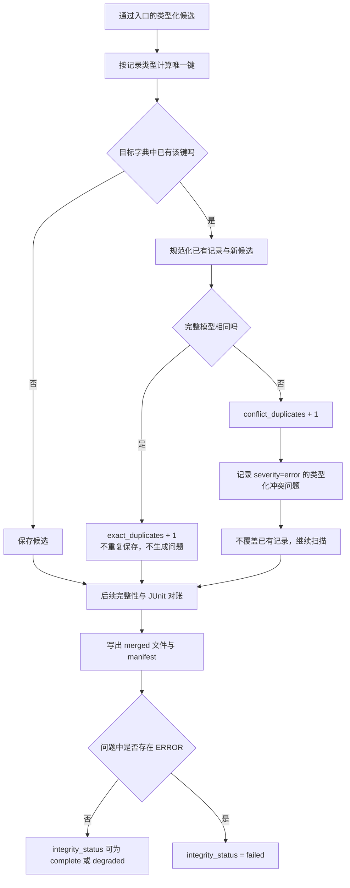

# 第 14 课：重复与冲突不能用同一种方式处理

## 本课在事实链中的位置

第 13 课已经建立了 P0 Aggregator 的两道入口：一条 JSON object 先用归并请求中的 `run_id` 接受当前 Run 准入，再由分片种类对应的 Pydantic 模型完成 Schema 校验。通过这两道门的记录只是 Merge Candidate（归并候选），还不能直接写入最终集合。

本课继续使用同一个异步图像生成 Case C：

```text
Case C = module/smoke/test_图片生成异步调用.py::
         TestAsyncImageGeneration::
         test_f8_09_async_image_generation_task_succeeds_with_result

POST /v1/media/generations
-> task_id="job-101"
-> GET /v1/media/tasks/job-101
-> Polling 到 succeeded
```

Case C 仍属于 Run 104 的 `serial-pool/master`，其当前 Run ID 为：

```text
image-smoke-104-20260826T010000Z-a1b2c3d4
```

Case C、文件级 `serial` 标记与异步调用入口在仓库中真实存在；`job-101`、轮询结果和本课时间值仍是教学输入，不表示仓库证明外部服务曾返回这些值。

第 13 课中的外来 Run 记录和显式 `quality.v0` 记录已经在入口被挡住。本课不再使用它们制造重复，而是从三条都已经通过 Run 与 Schema 检查的 CaseResult 候选开始，只回答一个问题：相同键再次出现时，Aggregator 怎样区分“同一内容的副本”和“相互矛盾的事实”。

---

## 核心问题

> 两条候选记录拥有相同身份键时，为什么不能一律保留第一条并把其余记录都当作普通重复？

相同键只说明两条记录争用同一个唯一位置，并不说明它们表达了相同内容：

```text
同键 + 全记录相同 = 精确重复，可以折叠为一条
同键 + 全记录不同 = 事实冲突，不能静默折叠
```

如果只按键删除后来者，冲突会被伪装成一次成功去重。下游只能看到一条看似确定的事实，却不知道另一个已经通过入口的候选给出了不同值。

---

## 从一个具体现象开始

沿用第 13 课已经接受的 L1，将它改称候选 A。为了只观察重复与冲突，本节给定其他 Case、Request、Integrity 分片、预期 Execution、预期 Case 数和 JUnit 对账都正常。

候选 A 是 Case C 的 `call` 阶段事实：

```json
{
  "schema_version": "quality.v1",
  "run_id": "image-smoke-104-20260826T010000Z-a1b2c3d4",
  "execution_id": "serial-pool",
  "worker_id": "master",
  "case_id": "module/smoke/test_图片生成异步调用.py::TestAsyncImageGeneration::test_f8_09_async_image_generation_task_succeeds_with_result",
  "invocation_id": "inv-a93bbdf630847f96d91234b5",
  "nodeid": "module/smoke/test_图片生成异步调用.py::TestAsyncImageGeneration::test_f8_09_async_image_generation_task_succeeds_with_result",
  "param_hash": "74234e98afe7498f",
  "phase": "call",
  "raw_status": "passed",
  "final_status": "passed",
  "duration_ms": 4600.0,
  "start_time": "2026-08-26T01:00:10Z",
  "end_time": "2026-08-26T01:00:14.600000Z",
  "failure_id": null,
  "evidence_refs": {}
}
```

同一个 `cases-serial-pool-master.jsonl` 随后又出现候选 B 和候选 C。没有列出的字段均与 A 相同：

| 候选 | 与 A 的差异 | Run 门 | Schema 门 | CaseResult 键 |
| --- | --- | --- | --- | --- |
| A | 无 | 通过 | 通过 | `("inv-a93…", "call")` |
| B | 类型化后的全部字段都与 A 相同 | 通过 | 通过 | `("inv-a93…", "call")` |
| C | `duration_ms=5100.0`，`end_time=2026-08-26T01:00:15.100000Z` | 通过 | 通过 | `("inv-a93…", "call")` |

A 与 B 的键相同，完整内容也相同。C 的键仍相同，但耗时事实与 A、B 不同。C 的开始时间、结束时间和非负耗时都能满足 CaseResult 模型，所以它不是 Schema 错误；问题只有在它与已经占用该键的记录相遇时才出现。

当前实现按分片种类、排序后的文件路径和文件内物理行顺序扫描。假定 A、B、C 按这个顺序到达 `_add_record()`，数据变化如下：

| 时点 | 输入 | 键是否已存在 | 全记录比较 | 状态变化 |
| ---: | --- | --- | --- | --- |
| T0 | A | 否 | 不需要 | A 写入内存中的 Case 字典 |
| T1 | B | 是 | 与 A 相同 | B 不再写入；`exact_duplicates + 1` |
| T2 | C | 是 | 与 A 不同 | C 不写入；`conflict_duplicates + 1`；新增 ERROR |

这三行都已通过入口，所以对应源分片的局部统计是：

```text
physical_non_empty_lines = 3
current_run_records      = 3
exact_duplicates         = 1
conflict_duplicates      = 1
```

`current_run_records=3` 表示三行都取得了候选资格，不表示 merged 输出会保留三行。去重与冲突处理后，Case 字典中只有先到的 A。

在没有其他异常的前提下，当前实现仍会完成后续对账并写出 merged 文件。结果不是“冲突已经解决”，而是：

```text
merged/case-results.jsonl      保留 A，共 1 条
merged/integrity-issues.jsonl  新增 1 条 case_result_conflict
manifest.status                complete
manifest.integrity_status      failed
```

`status=complete` 只表示归并过程写完了产物；ERROR 使 `integrity_status=failed`。因此，被物化到 Case 文件中的 A 不能被扩大解释成 Aggregator 已判定 A 比 C 更真实。

---

## 为什么原有解释不够

第 13 课的 Run 与 Schema 检查只能分别回答“是否自报属于当前 Run”和“单条记录是否满足当前模型”。它们都不能比较两条记录之间的关系。

候选 A 与 C 单独检查时都成立：

```text
A：当前 Run + CaseResult 合法
C：当前 Run + CaseResult 合法
```

把两项“单条合法”并排放置，不能推出“二者可以同时为同一阶段的唯一事实”。如果它们都声明同一个 `invocation_id` 和同一个 `phase`，却给出不同的耗时、状态、Worker 或其他字段，Aggregator 面对的是相互矛盾的候选。

只比较状态、耗时等非身份字段也不够：两个不同 Invocation 恰好拥有相同业务值时，可能被错误合并。反过来，如果只做完整记录相等去重，A 与 C 会作为两条不同记录留下，却没有产生“同一个唯一位置出现矛盾”的错误。当前机制必须先确定“哪个位置只能有一条”，再判断“争用该位置的内容是否一致”。

还要区分原始文本与模型内容。JSON 字段顺序或空白不同，不必然代表事实不同。当前代码先把 payload 校验成 Pydantic 对象，再把整个模型转成 JSON 形态并按键排序后比较。因此，本课的“精确”指规范化后的完整模型相等，不是源文件字节逐字符相等。

---

## 核心概念

### 1. 记录唯一键：Record Uniqueness Key

记录唯一键（Record Uniqueness Key）是当前 Run 范围内，Aggregator 用来决定两个候选是否争用同一个槽位的键。它不是所有记录统一使用的五级身份拼接，而是由记录类型决定：

| 候选类型 | 当前 `_add_record()` 使用的键 | 允许区分的相邻事实 |
| --- | --- | --- |
| `CaseResult` | `(invocation_id, phase.value)` | 同一 Invocation 的 `setup`、`call`、`teardown` 可以分别存在 |
| `RequestMetric` | `request_event_id` | 同一 Invocation 下的多次发送只要事件 ID 不同，就不是重复 |
| `IntegrityIssue` | `(source, code, related_id, message)` | 错误来源、代码、关联对象或消息不同，会占用不同键 |

`run_id` 没有再次放进这些键，因为 `_add_record()` 只接收已经通过当前 Run 准入的候选。这些键的唯一性范围因此是当前归并请求，而不是跨所有 Run 的全局范围。

以 Case C 为例，`case_id` 相同不足以构成重复。同一个稳定 Case 可以在不同 Run 或同一 Run 的不同 Invocation 中执行。进入本课这一步后，CaseResult 真正发生键碰撞的条件是 `invocation_id` 与 `phase` 同时相同。

### 2. 精确重复：Exact Duplicate

精确重复（Exact Duplicate）是两个候选的记录唯一键相同，而且规范化后的完整模型也相同。

规范化比较包含整个模型，不只检查表中的业务字段。当前 `_canonical_record()` 先执行 `model_dump(mode="json")`，再用排序键和紧凑分隔符生成 JSON 字符串。于是，原始 JSON 的字段排列不同不会单独制造冲突；模型校验后仍然不同的字段则会进入比较。

遇到精确重复时，当前实现：

1. 保留此前已经进入目标字典的记录。
2. 不再插入后来候选。
3. 给后来候选所在源分片增加 `exact_duplicates`。
4. 不为这次重复创建 IntegrityIssue。

因此，在其余检查均正常时，精确重复不会单独降低 `integrity_status`。它仍被 manifest 记录为源分片统计，不能说 Aggregator 没有观察到这条副本。

### 3. 同键冲突：Conflicting Duplicate

同键冲突（Conflicting Duplicate）是两个候选的记录唯一键相同，但规范化后的完整模型不同。

当前实现不会用后来值覆盖此前值，也不会把差异静默吞成普通去重。它给后来候选所在源分片增加 `conflict_duplicates`，并创建一个 `severity=error` 的 Aggregator IntegrityIssue。错误代码随记录类型变化：

| 记录类型 | 冲突代码 |
| --- | --- |
| `CaseResult` | `case_result_conflict` |
| `RequestMetric` | `request_metric_conflict` |
| `IntegrityIssue` | `integrity_issue_conflict` |

“拒绝冲突”在当前实现中的准确含义是：后来候选不进入对应字典，先前候选仍留在字典中，归并继续，但最终完整性被 ERROR 标记为 `failed`。它不表示代码已经判断先前候选是真值，也不表示整个函数立即抛出异常。

---

## 完整运行过程

下面的图从第 13 课的 Merge Candidate 开始，省略已经完成的 JSON、Run 和 Schema 入口判断：



图中每一条分支解决不同问题。

第一，唯一键只定位槽位。字典中没有该键时，候选成为该槽位的第一条记录；此时没有第二条内容可比较。

第二，键已经存在时才执行完整模型比较。相同内容进入精确重复分支，不同内容进入冲突分支。两个分支都会停止新候选写入，但只有冲突分支产生 ERROR。

第三，ERROR 是一条质量完整性事实，不是 Python 异常。`state.issue()` 把它追加到问题集合后，扫描仍可继续。只有后续未被局部处理的读取、计算或写出异常才会进入 `merge_failed` 的整体异常路径。

第四，merged 数据与完整性结论分别写出。当前代码会把目标字典中的第一条记录物化，同时把冲突问题写入 `integrity-issues.jsonl`，再由全部问题的严重度计算 `integrity_status`。因此，消费者不能只打开 `case-results.jsonl` 就忽略 manifest 与完整性问题。

### 三类记录怎样使用同一判断框架

三类 raw shard 候选共用 `_add_record()` 的控制流，但键不同：

```text
CaseResult
  inv-a93... + call
  -> 决定这个 Invocation 的 call 槽位

RequestMetric
  req-submit-01
  -> 决定一次实际发送事件的槽位

IntegrityIssue
  aggregator + invalid_quality_schema + shard-name + message
  -> 决定一条具体完整性问题的槽位
```

同一 Invocation 的四次 HTTP 发送如果拥有四个不同 `request_event_id`，它们是四条 RequestMetric，不会因为共享 `invocation_id` 而被去重。反过来，两个 RequestMetric 若复用同一个 `request_event_id`，即使只有 `status_code` 不同，也会进入冲突分支。

---

## 正常路径

正常路径只输入 A 与 B。两者均为当前 Run、Schema 合法，并在模型校验后完整相同。

### 输入

```text
request.run_id          = image-smoke-104-20260826T010000Z-a1b2c3d4
expected_case_count     = 1
A.key                   = (inv-a93..., call)
B.key                   = (inv-a93..., call)
canonical(A)            = canonical(B)
其余分片与后续校验      = 正常
```

### 判断与状态变化

| 顺序 | 输入 | 判断 | 状态变化 |
| ---: | --- | --- | --- |
| 1 | A | 入口通过 | `current_run_records: 0 -> 1` |
| 2 | A 的键 | 目标字典中不存在 | `cases[key] = A` |
| 3 | B | 入口通过 | `current_run_records: 1 -> 2` |
| 4 | B 的键 | 已存在 A | 进入全记录比较 |
| 5 | A 与 B | 规范化内容相同 | `exact_duplicates: 0 -> 1`，B 不写入 |
| 6 | 后续流程 | 没有其他问题 | 写出一条 CaseResult |

### 输出与结论

```text
源分片当前 Run 候选数    = 2
源分片精确重复数         = 1
merged CaseResult 数      = 1
重复产生的 IntegrityIssue = 0
manifest.status           = complete
manifest.integrity_status = complete
```

最后两项依赖本节已经给定的“其余检查与写出均正常”。本路径能说明 A、B 对当前比较规则表达同一个模型内容，因此 merged 集合只需保留一个值；它不能说明副本为何产生，也不能证明两个原始写入者都可靠。

仓库现有 `test_merge_filters_foreign_run_deduplicates_and_writes_manifest` 覆盖了同一 CaseResult 写入两次的路径，并断言 merged Case 只有一条、`exact_duplicates=1`，同时完整性仍为 `complete`。测试证明该场景受到回归覆盖；当前行为本身仍由 `_add_record()` 的实现决定。

---

## 复杂路径

### 路径一：同一个 CaseResult 键给出不同耗时

在正常路径基础上加入候选 C：

```text
C.invocation_id = A.invocation_id
C.phase         = A.phase
C.duration_ms   = 5100.0
C.end_time      = 2026-08-26T01:00:15.100000Z
```

C 单独满足当前 CaseResult 模型。它进入 `_add_record()` 后，先得到与 A 相同的键，再因为完整模型不同而进入冲突分支：

```text
找到 cases[(inv-a93..., call)] = A
-> canonical(A) != canonical(C)
-> conflict_duplicates + 1
-> 新增 ERROR case_result_conflict
-> C 不写入
-> A 不被覆盖
-> 扫描继续
```

假定没有其他问题，最终关键结果为：

| 结果项 | 值 | 含义 |
| --- | --- | --- |
| `merged/case-results.jsonl` | 1 条 A | 当前代码保留扫描时先遇到的值 |
| `conflict_duplicates` | 1 | 后来候选与已有槽位冲突 |
| `case_result_conflict` | 1 条 ERROR | 冲突没有被伪装成普通去重 |
| `manifest.status` | `complete` | 输出流程完成 |
| `manifest.integrity_status` | `failed` | 当前事实集合存在 ERROR |

A 留在输出中只是“先进入字典”的结果。扫描顺序来自固定的分片种类顺序、排序后的路径和文件内行序；它不是按 `start_time` 选择，也不是按 Worker 权威级别选择。当前实现没有仲裁规则能够证明 A 或 C 哪个更真实。

### 路径二：同一 Invocation 的不同 phase 不是重复

再构造候选 D，保留 A 的 `invocation_id`，但令 `phase="teardown"`，并给出与 teardown 对应的时间和状态。此时：

```text
A.key = (inv-a93..., call)
D.key = (inv-a93..., teardown)
```

两个键不同，所以 D 不会与 A 进行重复内容比较，而会占用另一个 CaseResult 槽位。merged Case 文件可以同时包含该 Invocation 的 call 与 teardown 记录；`expected_case_count` 后续按不同 `invocation_id` 的数量对账，不会把多个 phase 误算成多个 Case。这也说明不能只看 `invocation_id` 就宣称 CaseResult 重复。

### 路径三：不同键上的语义矛盾不由本关发现

假设两个 RequestMetric 具有不同 `request_event_id`，却因为上游错误都声称自己是 `attempt_index=1`。它们的唯一键不同，因此 `_add_record()` 会同时保留，哪怕业务解释者随后认为这种组合可疑。

这不是本关把矛盾判成了成功，而是本关的职责只覆盖“同一唯一键是否出现多个内容”。跨键关系需要其他对账或语义机制；如果仓库没有对应检查，就必须保持为当前未被本关证明的范围，不能把 `_add_record()` 描述成通用一致性验证器。

---

## 对应的框架实现

先建立了上面的键与分支模型，再来看实现。下面片段来自 `quality/aggregator.py`，仅省略类型注解旁的静态检查注释，没有改变分支顺序：

```python
def _add_record(state, stats, record):
    if isinstance(record, CaseResult):
        key = (record.invocation_id, record.phase.value)
        target = state.cases
        conflict_code = "case_result_conflict"
    elif isinstance(record, RequestMetric):
        key = record.request_event_id
        target = state.requests
        conflict_code = "request_metric_conflict"
    else:
        key = (record.source, record.code, record.related_id, record.message)
        target = state.integrity
        conflict_code = "integrity_issue_conflict"

    existing = target.get(key)
    if existing is None:
        target[key] = record
        return
    if _canonical_record(existing) == _canonical_record(record):
        stats.exact_duplicates += 1
        return
    stats.conflict_duplicates += 1
    state.issue(
        severity=IssueSeverity.ERROR,
        source="aggregator",
        code=conflict_code,
        message=f"conflicting duplicate record for key {key!r}",
        related_id=str(key),
    )
```

输入是已经类型化的 CaseResult、RequestMetric 或 IntegrityIssue，以及当前源分片的统计对象。目标字典既承担唯一槽位索引，也保存最终将被写出的记录。

三个返回点对应三种状态：首次出现时保存；精确重复时只计数；冲突时计数并记录 ERROR。冲突分支没有 `target[key] = record`，所以后来候选不会覆盖已有值；它也没有 `raise`，所以冲突本身不会中止扫描。

完整模型比较由下面的方法完成：

```python
def _canonical_record(record: Any) -> str:
    if hasattr(record, "model_dump"):
        payload = record.model_dump(mode="json")
    else:
        payload = record
    return json.dumps(
        payload,
        allow_nan=False,
        ensure_ascii=False,
        sort_keys=True,
        separators=(",", ":"),
    )
```

输入是已有记录或新候选，输出是用于相等判断的规范化 JSON 字符串。`sort_keys=True` 消除字典键顺序造成的文本差异；`model_dump(mode="json")` 使比较发生在模型接受并转换后的 JSON 形态上。该函数没有忽略 `duration_ms`、状态、时间或 Worker 等非键字段，所以 A 与 C 会得到不同字符串。

入口计数与最终状态的相关代码位于两个不同阶段：

```python
stats.current_run_records += 1
_add_record(state, stats, record)

all_issues = _sorted_issues((*state.integrity.values(), *state.issues))
integrity_status = _integrity_status(all_issues)

write_jsonl_atomic(case_path, _sorted_cases(state.cases.values()))
write_jsonl_atomic(issue_path, all_issues)
_write_manifest(state, manifest_path, status="complete", output_hashes=output_hashes)
```

这段代码经过教学化缩写：实际实现还写 Request、Failure 等输出并计算各输出哈希。保留下来的顺序没有变化。候选计数先增加，去重或冲突随后发生；写出数据来自字典中的保留值，完整性状态来自全部问题的严重度。只要没有未处理异常，冲突 ERROR 不妨碍 `status="complete"` 的 manifest 被写出，但 `_integrity_status()` 会返回 `failed`。

### 源码、调用链与测试定位

- `quality/aggregator.py:62-100`：源分片计数器与三类目标字典。
- `quality/aggregator.py:124-184`：扫描、对账、写出和整体异常路径。
- `quality/aggregator.py:187-205`：固定分片种类及排序后的文件扫描。
- `quality/aggregator.py:221-308`：入口计数、三类唯一键、精确重复和冲突分支。
- `quality/aggregator.py:490-527,538-577`：manifest、完整性状态和规范化比较。
- `quality/models.py:100-122,167-218,238-285`：三类候选的当前模型字段。
- `run_orchestration/quality_pipeline.py:18-49` 与 `run_orchestration/quality_fact_merge_stage.py:14-37`：标准 Quality 收尾链怎样调用 P0 merge。
- `tests/quality/test_quality_aggregator.py:63-87`：外来 Run 过滤与 CaseResult 精确重复的现有回归测试。

当前仓库的 P0 Aggregator 测试直接覆盖精确重复计数和只保留一条记录；仓库中没有以 `case_result_conflict`、`request_metric_conflict` 或 `integrity_issue_conflict` 为断言目标的 P0 定向测试。因此，冲突分支的当前行为由上述生产源码直接证明，不能把它表述成已有同粒度回归测试所保证的行为。本课的定向探针验证了 A/B 与 A/C 两条路径，但探针位于课程自动化运行目录，不替代仓库测试。

---

## 能够保证什么

在当前 P0 Aggregator 实现和本课前提下，可以得到以下有限保证：

1. 通过当前 Run 与模型入口的每条记录都会先增加其源分片的 `current_run_records`，然后进入 `_add_record()`；这个计数不是最终保留数。
2. CaseResult 使用 `(invocation_id, phase)`，RequestMetric 使用 `request_event_id`，IntegrityIssue 使用 `(source, code, related_id, message)` 作为当前 Run 内的记录唯一键。
3. 唯一键首次出现时，候选进入对应目标字典。
4. 同键且规范化完整模型相同的后来候选不会再次写入目标字典，只增加 `exact_duplicates`，且不因这次重复新增 IntegrityIssue。
5. 同键但规范化完整模型不同的后来候选不会覆盖已有记录；代码增加 `conflict_duplicates`，并产生记录类型对应的 ERROR 冲突问题。
6. 只要没有其他未处理异常，冲突问题不会阻止 merged 文件和 `status=complete` 的 manifest 写出；该 ERROR 会使最终 `integrity_status=failed`。
7. 原始 shard 不会被本步骤改写。去重和冲突选择发生在内存目标字典与新写出的 merged 产物中。

这些保证只说明当前代码怎样处理已经取得候选资格的记录，不说明候选由可信生产者生成，也不替外部服务判断业务事实真伪。

---

## 保证成立的前提

- 本课讨论的是当前 `quality/aggregator.py` 中的 P0 `_add_record()`，输入已经经过 JSON object、当前 Run 和对应 Pydantic 模型检查。第 13 课中被过滤或拒绝的记录不会到达本步骤。
- 调用方提供了正确的 `QualityMergeRequest.run_id`，并且标准 Runner 的 Quality 链确实启用并走到 P0 merge；仓库存在此能力不等于每条业务调用都经过它。
- 唯一键字段由当前模型正确填充。Schema 只校验字段形态和局部约束，不认证字段由哪个进程或外部系统产生。
- 对“先前记录”的描述依赖当前扫描顺序：分片种类顺序固定，同类分片按路径排序，每个文件按物理行顺序读取。输入文件集合或名称变化可能改变谁先占用键。
- `manifest.status=complete` 与输出数量的结论依赖后续对账、分类、存储和哈希步骤没有抛出未处理异常。若发生写出错误，整体会进入 `merge_failed` 路径。
- 正常路径的 `integrity_status=complete` 还依赖没有其他 WARN 或 ERROR；复杂路径的 `failed` 由冲突 ERROR 足以确定。
- A、B、C 的具体时间、耗时和外部响应是完整给定的教学输入。仓库证明处理规则，不证明这些数据曾在真实运行中出现。

---

## 不能保证什么

1. **不能把相同键等同于相同事实。** 必须继续比较规范化后的完整模型；否则冲突会被静默隐藏。
2. **不能把精确重复说成原始字节完全一致。** 当前比较发生在 Pydantic 模型转成 JSON 形态之后，字段顺序和部分模型转换可能消除原始表示差异。
3. **不能从精确重复推出来源可靠。** 两份完全相同的错误记录仍会被折叠；本步骤没有签名、进程认证或外部事实核验。
4. **不能从 `exact_duplicates=1` 推出生产链没有问题。** 当前实现记录计数但不生成问题；副本产生原因仍可能需要其他诊断。
5. **不能把当前唯一键称为完整五级身份。** CaseResult 键只取 `invocation_id + phase`，RequestMetric 与 IntegrityIssue 使用各自规则；Run 范围由前一道门提供。
6. **不能声称同一 Invocation 的所有 CaseResult 都会合并。** `phase` 不同就占用不同键，setup、call 和 teardown 可以同时存在。
7. **不能声称本关发现所有矛盾。** 不同键之间的字段组合即使在业务上可疑，也不会触发 `_add_record()` 的同键冲突分支。
8. **不能把冲突后的先前记录称为已认证真值。** 当前代码只是保留先扫描到的记录，没有按时间、Worker 或证据强度仲裁。
9. **不能声称冲突会删除双方或立即终止归并。** 后来候选被拒绝，已有记录保留，ERROR 被记录，流程在无其他异常时继续写出。
10. **不能只看 `manifest.status=complete` 宣布账本可信。** 冲突场景同时产生 `integrity_status=failed`，两种状态描述的是不同事实。
11. **不能从一条 merged CaseResult 推出源文件只有一条当前 Run 记录。** 两条精确重复或一条保留值加一条冲突值都可能只物化为一条；必须结合 `current_run_records`、重复计数和 IntegrityIssue 阅读。
12. **不能把本课结论推广成 Worker 完整性保证。** `_add_record()` 处理已经出现的候选，不证明每个预期 Execution 或 Worker 的分片都出现；下一课才检查当前实现拥有的完整性参照。
13. **不能把 P0 规则自动推广到 Semantic Aggregator、JUnit evidence 或派生 FailureRecord。** 它们有相邻但独立的键和冲突代码，本课没有用 P0 `_add_record()` 替代那些实现。
14. **不能把测试覆盖写得比仓库现状更强。** 现有 P0 测试直接覆盖精确重复；三个 raw 记录冲突代码的行为当前主要由生产分支证明。

本课最重要的结论是：**唯一键只负责发现“两个候选在争用同一个位置”；只有完整模型相同才能折叠为精确重复，完整模型不同必须留下 ERROR 冲突事实。当前实现保留先到记录并拒绝后来冲突候选，但不会替使用者裁定哪一条才是真相。**

---

## 与下一课的关系

本课解决了已经出现的候选怎样形成唯一集合：相同内容的同键副本可以折叠，相互矛盾的同键候选必须留下失败完整性证据。

但“没有重复或冲突”仍不等于“应该出现的事实全部出现”。某个预期 Execution 可能根本没有 Case 分片，merged Invocation 数可能与权威 Case 数不符，CaseResult 也可能与 JUnit identity 对不上。

第 15 课将继续沿归并顺序，解释 Case 完整性与 JUnit Identity 怎样提供这些后续参照，以及 Aggregator 为什么仍不能据此保证发现每个 Worker 的全部缺失分片。
