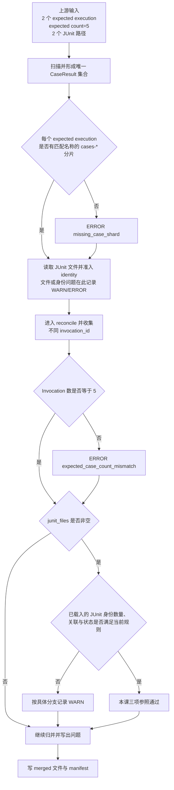

# 第 15 课：Case 完整性与 JUnit Identity

## 本课在事实链中的位置

第 14 课已经说明：进入 P0 Aggregator 的候选记录先按类型取得唯一键；同键同内容的精确副本可以折叠，同键异内容则留下 ERROR 冲突事实。这个过程解决了“已经出现的候选怎样形成唯一集合”，却没有证明“应该出现的事实都出现了”。

本课回到 Run 104 的完整混合计划，而不是继续使用上一课为隔离重复分支而缩小的单 Invocation 视角：

```text
run_id = image-smoke-104-20260826T010000Z-a1b2c3d4
计划 Q = [D, E, A, B, C]
并发参数 = -n 2

parallel(Q) = [D, E]
serial(Q)   = [A, B, C]
expected_case_count = 5
```

这里的 A、B、C 恢复为第 5～6 课定义的 Case 别名，不是第 14 课用于比较三条候选记录的临时标签；上一课的 `expected_case_count=1` 也只是隔离重复/冲突机制的教学 fixture，不是完整 Run 104 的归并请求。

其中 Case C 仍是贯穿课程的异步图像生成 Case：

```text
Case C = module/smoke/test_图片生成异步调用.py::
         TestAsyncImageGeneration::
         test_f8_09_async_image_generation_task_succeeds_with_result

POST /v1/media/generations
-> task_id="job-101"
-> GET /v1/media/tasks/job-101
-> Polling 到 succeeded
```

Case C 的文件级 `serial` 标记和异步调用入口来自当前仓库；`job-101`、轮询状态及本课时间值是教学输入，不是外部服务真实响应的仓库证明。

本课按三项判断的依赖关系解释：预期 Execution 是否出现 Case 分片、merged Case 的 Invocation 数量是否等于权威计划数，以及 pytest JUnit 旁路能否用质量身份关联回来。第 16 课才讨论源分片与 merged 输出在不同时点的 SHA256。

---

## 核心问题

> 分片已经通过 Run、Schema、重复与冲突检查，为什么 Aggregator 仍不能直接断言本次五个计划 Case 的事实完整？

因为前几课的检查都以“已经观察到的记录”为输入。完整性还需要把观察结果与执行前计划、池级执行结果或 JUnit 旁路提供的参照进行比较：

```text
只检查已有记录是否合法
不能发现本应出现却完全缺失的记录

因此还要依次比较：
预期执行阶段 → 权威计划数量 → JUnit 旁路身份
```

这三道关卡的证据粒度不同。一个阶段文件名存在，不等于其中包含预期 Case；数量相等，不等于成员逐项相同；JUnit 能与 CaseResult 关联，也不等于外部 LLM 业务状态真实成功。

---

## 从一个具体现象开始

### 正常输入

沿用第 12 课已经建立的本次调度观察：D 在 `parallel-pool/gw0`，E 在 `parallel-pool/gw1`，A、B、C 在 `serial-pool/master`。D、E 是两个真实的非 serial 图像 Case，A、B、C 来自带文件级 serial 标记的异步图像 Smoke 文件。

五个别名对应的稳定 `case_id` 是：

| Case | 完整 `case_id` |
| --- | --- |
| D | `module/image_model/test_wan2_7_image.py::TestImageGenerations::test_pos_case_1` |
| E | `module/image_model/test_wan2_7_image_pro.py::TestImageGenerations::test_create_image_generation` |
| A | `module/smoke/test_图片生成异步调用.py::TestAsyncImageGeneration::test_f8_07_async_image_generation_submit_returns_task_id` |
| B | `module/smoke/test_图片生成异步调用.py::TestAsyncImageGeneration::test_f8_08_async_image_generation_task_status_query` |
| C | `module/smoke/test_图片生成异步调用.py::TestAsyncImageGeneration::test_f8_09_async_image_generation_task_succeeds_with_result` |

本课使用的五个非参数化 Invocation 由当前标识算法根据 Run 104、上表 `case_id` 与 `param_hash=74234e98afe7498f` 复算得到：

| Case | 本次执行位置 | `invocation_id` |
| --- | --- | --- |
| D | `parallel-pool/gw0` | `inv-ba6b0129931686cc597a4dee` |
| E | `parallel-pool/gw1` | `inv-820ff09be1301a34f09d9733` |
| A | `serial-pool/master` | `inv-788f9ff67094e3d4ae180c3c` |
| B | `serial-pool/master` | `inv-1f9cb1bdb12d5b22d1f8992e` |
| C | `serial-pool/master` | `inv-a93bbdf630847f96d91234b5` |

D/E 到具体 `gw0/gw1` 的映射只是本次教学输入，不是 Runner 对未来调度的承诺。五个 Invocation ID 是对给定输入的确定性复算结果，也不是对任意输入绝无哈希碰撞的数学证明。

本例还明确给定：Quality 已启用，两个池都实际进入过 pytest，且调用者没有显式传入 `--junitxml`。因此标准 Runner 会补充默认 JUnit 路径，并在并行双池分支中形成阶段后缀；收尾链提供：

```text
expected_execution_ids = [parallel-pool, serial-pool]
expected_case_count     = 5
junit_files             = [quality-parallel.xml, quality-serial.xml]
run_start_time          = T0
```

三个 Case 分片为：

```text
shards/cases-parallel-pool-gw0.jsonl     包含 D 的阶段事实
shards/cases-parallel-pool-gw1.jsonl     包含 E 的阶段事实
shards/cases-serial-pool-master.jsonl    包含 A、B、C 的阶段事实
```

一个 Invocation 可以拥有 setup、call、teardown 多条 CaseResult。本课的数量参照不数物理行，而是把 merged CaseResult 中不同的 `invocation_id` 组成集合；正常输入得到五个成员。

两个 JUnit 文件各自包含对应池级 pytest 执行产生的 `<testcase>`。Quality 插件把下面两个 property 放入 JUnit 旁路：

```xml
<property name="quality_case_id" value="module/smoke/test_图片生成异步调用.py::TestAsyncImageGeneration::test_f8_09_async_image_generation_task_succeeds_with_result" />
<property name="quality_invocation_id" value="inv-a93bbdf630847f96d91234b5" />
```

假定两个文件都存在，修改时间不早于 T0，XML 可解析；五个 testcase 都有非空的两个质量身份属性，Invocation 与 merged Case 一致，折叠后的 CaseResult 状态也与 JUnit 状态相容。三道关卡的数据流如下：



正常输入依次得到：两个 Execution 都命中 Case 分片文件名，五个不同 Invocation 与计划数相等，五个 JUnit identity 都能按 Invocation 关联且状态相容。本课三项检查不产生问题；再给定此前入口、冲突检查及其他步骤也正常，最终才是：

```text
manifest.status           = complete
manifest.integrity_status = complete
```

---

## 为什么原有解释不够

“目录里有 Case 文件”过于粗糙。当前 Execution 检查只问某个文件名是否含有 `cases-{execution_id}-`，不检查这个文件是否非空，也不要求里面至少有一条当前 Run、Schema 合法的记录。它更没有收到预期 Worker 清单。

“merged 中正好有五个 CaseResult”也不准确。一个 Invocation 可能有多个 phase，因此当前数量规则数的是不同 `invocation_id`，不是 CaseResult 行数。即使不同 Invocation 恰好也是五个，这个数字仍不能证明成员就是 Q 中的 D、E、A、B、C，因为 Aggregator 没有收到完整 `planned_nodeids`。

“JUnit 有五个 testcase”仍不足够。XML 中的物理 testcase 数与可接受的质量身份数不同：缺少任一质量身份属性的 testcase 会被跳过；同一个 Invocation ID 出现矛盾 evidence 会产生冲突；状态还要与该 Invocation 的多阶段 CaseResult 折叠结果相容。

三道关卡因此不是三个同义计数，而是从粗到细的三种参照。每一道都能发现一部分问题，也都有不能覆盖的范围。

---

## 核心概念

### 1. 预期 Execution 分片存在性：Expected-execution Shard Presence

预期 Execution 分片存在性（Expected-execution Shard Presence）回答：标准 Runner 拥有非 `NOT_RUN` 池级结果的每个 Execution，扫描结果中是否至少出现一个名称匹配的 Case shard。这个筛选还会纳入状态为 ERROR 的池级结果，因此“被列为 expected execution”本身不证明其中有 Case 成功执行。

它的输入不是固定的 `[parallel-pool, serial-pool]` 常量。Quality lifecycle 从 `pool_results` 中排除状态为 `NOT_RUN` 的池，再把其余结果的 `stage_id` 作为 `expected_execution_ids`。因此，因并行阶段终止而根本未运行的 serial pool 不会进入这项“预期已执行阶段”清单；完整计划中未执行的串行 Case 仍可能在下一道总数检查中暴露。

当前匹配依据是文件名：

```text
expected execution = parallel-pool
命中任一 cases-parallel-pool-*.jsonl
→ 该 Execution 的存在性关卡通过
```

不命中时产生 ERROR `missing_case_shard`。这项检查的生命周期是所有 shard 扫描完成后、JUnit 读取前。它与 Worker 完整性不同：请求中没有 `expected_worker_ids`，所以一个 `cases-parallel-pool-gw0.jsonl` 足以让 `parallel-pool` 通过，代码不会继续要求 `gw1` 文件存在。

### 2. 预期 Case 数量对账：Expected-case Count Reconciliation

预期 Case 数量对账（Expected-case Count Reconciliation）把 Runner 权威收集得到的计划数，与去重、冲突处理后 CaseResult 中不同 `invocation_id` 的数量进行比较。

本课正常路径的计算是：

```text
expected_case_count = 5

observed invocation_ids = {
  inv-ba6b...,
  inv-820f...,
  inv-788f...,
  inv-1f9c...,
  inv-a93b...
}

len(observed invocation_ids) = 5
```

数量不相等时产生 ERROR `expected_case_count_mismatch`，消息同时保存 expected 与 merged 数量。若完全没有 CaseResult，还会另外产生 ERROR `no_case_results`。

这一关比“是否有某个阶段文件”更细，因为空文件或只剩一个 Worker 文件时，Invocation 总数可能暴露全局短缺；它又比成员对账更粗，因为请求只带整数 5，不带 Q 的五个完整成员。

### 3. JUnit 身份旁证：JUnit Identity Evidence

JUnit 身份旁证（JUnit Identity Evidence）是 pytest JUnit `<testcase>` 中由 Quality 插件附加的两个属性：

```text
quality_case_id
quality_invocation_id
```

它的作用是让 JUnit 执行结果与 P0 CaseResult 使用同一组 Case/Invocation 名称，而不是依赖可能变化的 `classname`、显示 `name` 或文件顺序。它不是五级身份的完整副本，也不是独立于 pytest 的外部真值来源。

当前 Aggregator 要求两个属性都为非空，缺少任一个就记录 WARN `junit_missing_quality_identity` 并跳过该条 evidence。接受后，实际索引与后续关联使用 `quality_invocation_id`；`quality_case_id` 只经过“存在”检查，当前代码没有把它与 CaseResult 的 `case_id` 做相等比较。

JUnit 输入还有自己的准入条件：路径不存在产生 `junit_file_missing`，文件修改时间早于 `run_start_time` 产生 `junit_file_stale`，解析失败产生 `junit_parse_failed`。这三项都是 WARN，并跳过该文件的 evidence。它们表示旁路证据不可用，不能被解释成 Case 通过或没有问题。

---

## 完整运行过程

下面转入真实执行顺序。它与前文为了理解而采用的“Execution → 数量 → JUnit 关联”讲解顺序并不完全相同：代码实际执行 `_scan_shards() → _read_junit() → _reconcile()`；也就是先完成 Execution 检查和 JUnit 文件读取，再在 reconcile 中先查 Invocation 数量、后做 JUnit 对账。

### 阶段一：Runner 形成三个参照输入

标准 Runner 在执行前已经保存权威 `case_nodeids`。收尾时：

1. `expected_case_count` 始终取完整权威集合长度，本例为 5。
2. `pool_results` 中状态不是 `NOT_RUN` 的结果形成 executed 序列。
3. executed 的 `stage_id` 形成 `expected_execution_ids`。
4. executed 中非空的 JUnit 路径形成 `junit_files`。
5. Run 开始时间形成 JUnit 新旧判断的参照。

在本例两个池均执行的前提下，三个参照是“两个阶段、五个计划成员、两个 JUnit 文件”。Runner 没有把完整 `planned_nodeids` 传入 `QualityMergeRequest`；计划成员表仍存在于 Runner 产物中，但当前 P0 Aggregator 只收到数量。

### 阶段二：扫描完成后检查预期 Execution

Aggregator 先扫描三类 shard，并完成前两课的入口与重复/冲突处理。随后针对每个 expected execution，遍历 `source_stats`：

```text
只要 stats.kind == cases
并且文件名包含 cases-{execution_id}-
就认为这个 execution 找到了 Case shard
```

这里检查的是扫描到的路径，不是已保留 CaseResult。一个空文件、全是 foreign Run 的文件或全被 Schema 拒绝的文件仍会生成 source stats，因此可能满足文件名存在性；这些记录问题是否被其他关卡发现，要看后续计数与入口问题。

### 阶段三：读取 JUnit 旁路

对每个传入路径，代码依次处理：

```text
路径是否存在
→ 若提供 run_start_time，文件 mtime 是否早于它
→ XML 能否解析
→ 遍历每个 testcase
→ 两个 quality identity 是否都存在
→ invocation_id 是否已经对应另一份不同 evidence
```

解析成功时，manifest 中该 JUnit 文件的 `cases` 先记为 XML 里解析出的 testcase 数。随后缺少身份的 testcase 可能被跳过，所以 `junit_files[].cases` 不等于最终 `junit_evidence` 的唯一身份数。

`state.junit_evidence` 以 `invocation_id` 为键。如果同一个 Invocation 后来出现一份与先前 dataclass 内容不同的 evidence，代码产生 ERROR `junit_identity_conflict` 并保留先前 evidence；“不同”比较还包含 JUnit 路径、classname、name、状态、两个质量身份、失败证据和耗时。完全相等的同文件重复不会产生该冲突。

### 阶段四：执行数量与 JUnit 对账

Aggregator 从保留的 CaseResult 得到 Invocation 集合。检查顺序为：

1. CaseResult 字典为空时记录 `no_case_results` ERROR。
2. `expected_case_count` 非空且与 Invocation 集合大小不同，记录 `expected_case_count_mismatch` ERROR。
3. 只有 `junit_files` 非空时，才进入 JUnit 对账。
4. 接受的 JUnit identity 数与 merged Invocation 数不同，记录 `junit_case_count_mismatch` WARN。
5. 对每个 JUnit invocation 查找 CaseResult；找不到时记录 `junit_invocation_missing_case_result` WARN。
6. 找到时先把该 Invocation 的多阶段 `final_status` 折叠，再与 JUnit 状态比较；不相容时记录 `junit_status_mismatch` WARN。

状态折叠中，ERROR 优先于 FAILED，FAILED 优先于 SKIPPED/XFAILED，其余折叠为 PASSED。兼容判断允许 CaseResult 的 ERROR 与 FAILED 对应 JUnit 的 ERROR 或 FAILED；SKIPPED/XFAILED 折叠后要求 JUnit 为 SKIPPED；其余要求 JUnit 为 PASSED。它检查的是粗粒度结果相容性，不是逐 phase、逐耗时或逐错误消息相等。

### 阶段五：写出数据与完整性结论

这些校验多数通过 `state.issue()` 增加问题，而不抛出异常或删除已有 CaseResult。只要后续写出没有未处理异常，Aggregator 仍写 Case、Request、Failure、Integrity 文件及 `status=complete` 的 manifest。

问题严重度另行决定 `integrity_status`：

```text
任一 ERROR → failed
无 ERROR、至少一个 WARN → degraded
没有 WARN/ERROR → complete
```

所以“归并写完”“事实完整性通过”和“pytest 原始结果通过”始终是三类不同事实。

若扫描、解析或写出期间出现逃逸到顶层的未处理异常，代码会新增 ERROR `merge_failed`，尝试把 manifest 写为 `status=failed`，并返回失败完整性；这与受控校验问题发生后仍正常写完的路径不同。函数进入归并时还会先写一次 `status=merging`，它只是过程状态，不是最终结论。

---

## 正常路径

### 输入

```text
权威计划 Q                     = [D,E,A,B,C]
expected_execution_ids         = [parallel-pool, serial-pool]
expected_case_count            = 5
匹配的 Case shard              = parallel/gw0, parallel/gw1, serial/master
去重后的不同 invocation_id     = 5
JUnit 路径                     = quality-parallel.xml, quality-serial.xml
可接受的 JUnit identity        = 5
CaseResult/JUnit 折叠状态       = 全部相容
```

### 判断、状态变化与输出

| 顺序 | 参照 | 观察值 | 判断 | 新增问题 |
| ---: | --- | --- | --- | --- |
| 1 | `parallel-pool` | 至少一个 `cases-parallel-pool-*` | 通过 | 无 |
| 2 | `serial-pool` | 至少一个 `cases-serial-pool-*` | 通过 | 无 |
| 3 | `expected_case_count=5` | 5 个不同 Invocation | 通过 | 无 |
| 4 | 5 个 merged Invocation | 5 个可接受 JUnit identity | 数量相等 | 无 |
| 5 | 每个 JUnit invocation | 能找到对应 CaseResult | 关联通过 | 无 |
| 6 | 折叠 Case 状态 | 与 JUnit 状态相容 | 状态通过 | 无 |

在此前 Run、Schema、重复与冲突检查也通过，且后续写出正常的前提下，最终 merged CaseResult 保留五个 Invocation 的实际阶段事实，manifest 同时是 `status=complete`、`integrity_status=complete`。

这个结果允许得出的结论是：当前请求指定的两个已执行阶段都有至少一个匹配名称的 Case shard；merged CaseResult 的不同 Invocation 数为五；给定 JUnit 文件中的五个可接受 Invocation 能找到 CaseResult，且折叠状态相容。

它不允许推出每个 Worker 分片都存在、五个成员逐项等于 Q、JUnit `case_id` 已与 CaseResult 逐项相等、外部图像任务真实成功，或源文件与输出文件此后不会变化。

---

## 复杂路径

### 路径一：缺少整个预期 Execution 的 Case shard

只改变 parallel Case shard：`cases-parallel-pool-*` 全部缺失；`serial-pool/master` 的 A、B、C 仍在。因为本例 `expected_execution_ids` 仍包含两个实际进入过的池，第一道关卡得到：

```text
parallel-pool：没有任何 cases-parallel-pool-* → ERROR missing_case_shard
serial-pool：  找到 cases-serial-pool-master → 通过
```

恢复完整计划数 5 后，后续还只能观察到 A、B、C 三个 Invocation，于是数量关再产生 ERROR `expected_case_count_mismatch`。由于本路径只改变 Case shard，正常 JUnit 仍保留 D、E、A、B、C：五个 JUnit identity 对三个 merged Invocation 还会产生 WARN `junit_case_count_mismatch`，D、E 各自产生一条 WARN `junit_invocation_missing_case_result`。两个 ERROR 已足以把 P0 完整性标为 `failed`；这些 ERROR 与 WARN 都不会把缺失补成失败或通过，已有三项事实仍可被物化并与问题一起写出。

### 路径二：缺少一个 Worker 分片，但 Execution 名称仍存在

现在保留 `cases-parallel-pool-gw0.jsonl` 与 `cases-serial-pool-master.jsonl`，移除 `cases-parallel-pool-gw1.jsonl`，并给定 E 的 CaseResult 也没有在其他分片出现。

第一道关卡只寻找 `cases-parallel-pool-`，所以 gw0 文件已经让 `parallel-pool` 通过；它不会产生 `missing_case_shard`。第二道关卡观察到四个 Invocation：

```text
observed = {D,A,B,C}
len(observed) = 4
expected = 5
→ ERROR expected_case_count_mismatch
```

这个 ERROR 能说明全局 Invocation 数不等，却不能仅凭现有输入证明缺的是 gw1、E 或某个特定 phase。若 E 的合法记录也出现在 gw0 分片中，使总数恢复为 5，当前 Execution 与数量两关都不会因为 gw1 文件缺失而报错；请求里没有可供比较的 Worker 清单。

本路径同样只改变 Case shard，因此正常 JUnit 仍有五个 identity。JUnit 对账还会产生 WARN `junit_case_count_mismatch`，并为没有 CaseResult 的 E 产生 WARN `junit_invocation_missing_case_result`。这些旁路问题能说明 JUnit 与 merged CaseResult 不一致，却仍不能证明 E 原先必然属于 gw1；Worker 归属需要另一份权威参照。

### 路径三：数量相等但成员被替换

保持两个 Execution 的文件名都存在，只把计划成员 E 的观察事实替换为计划外成员 X；JUnit 旁路也如实包含观察到的 X，而不包含 E：

```text
权威计划语义      = [D,E,A,B,C]
Aggregator 收到的数 = 5
实际观察成员      = [D,X,A,B,C]
JUnit identity     = [D,X,A,B,C]
```

当前请求只向 Aggregator 传入整数 `expected_case_count=5`，没有传入 Q 的完整成员列表。因此：

```text
两个 expected execution 都有匹配文件名 → 通过
5 == 5                               → 通过
JUnit 与 observed Invocation 集合一致 → 通过
状态也相容                           → 通过
```

在其他输入均正常时，本课三关不会产生问题，完整性可以保持 `complete`。这不证明成员替换是正确行为，而是准确暴露当前校验所缺少的计划成员参照。Runner 保存完整 `planned_nodeids`，不等于 P0 Aggregator 已使用它逐项核对。

### 路径四：JUnit testcase 缺少 Invocation 身份

恢复正常的五个 CaseResult 与计划成员，只让 Case C 的 JUnit testcase 缺少 `quality_invocation_id`，同时保留非空 `quality_case_id`。

读取 JUnit 时，该 testcase 仍计入 XML 文件的 testcase 数，但不能成为可关联 evidence：

```text
解析出 5 个 testcase
→ C 缺少一个必需质量身份
→ WARN junit_missing_quality_identity
→ 跳过 C 的 evidence
→ 可接受 JUnit identity 数变为 4
→ 4 != 5 个 merged Invocation
→ WARN junit_case_count_mismatch
```

两项都是 WARN。若没有其他问题，Case C 的 CaseResult 不被删除，pytest 结果不被改写，manifest 为 `status=complete`、`integrity_status=degraded`。准确结论是“JUnit 旁路对 Case C 的身份关联不完整”，而不是“Case C 没有执行”或“Case C 失败”。

### 路径五：身份可关联，但状态不相容

最后只改变 Case C 的 JUnit 状态：merged CaseResult 折叠为 PASSED，具有正确 Invocation 的 JUnit testcase 却包含 `<failure>`，解析为 FAILED。

身份数量与关联都通过，状态比较产生 WARN `junit_status_mismatch`。Aggregator 保留两边原始表达，不把 CaseResult 改成 FAILED，也不把 JUnit 改成 PASSED；在没有 ERROR 和其他 WARN 时，完整性为 `degraded`。

---

## 对应的框架实现

前文已经建立三项参照及其顺序，下面只展示决定行为的关键分支。

### 1. Runner 怎样形成归并输入

下面代码来自 `run_orchestration/quality_lifecycle.py` 与 `run_orchestration/runner.py`，按调用关系教学化合并展示：

```python
executed = tuple(
    result
    for result in pool_results
    if result.status.value != "NOT_RUN"
)

finalize_quality_run(
    expected_execution_ids=tuple(result.stage_id for result in executed),
    expected_case_count=len(case_nodeids),
    junit_files=tuple(result.junit_path for result in executed),
)
```

真实代码中 `expected_case_count` 由 Runner 传给 lifecycle，lifecycle 再将它原样传给 Pipeline；JUnit 路径中的 `None` 会在 `quality_fact_merge_stage.py` 构造请求时过滤。输入来自权威收集和实际池级结果，输出是 `QualityMergeRequest` 的三类参照。该链只有在 Quality 实际启用且收尾执行到 P0 merge 时才生效。

### 2. Execution 检查只使用 Case shard 文件名

```python
for execution_id in state.request.expected_execution_ids:
    if not any(
        stats.kind == "cases"
        and f"cases-{execution_id}-" in stats.path.name
        for stats in state.source_stats
    ):
        state.issue(
            severity=IssueSeverity.ERROR,
            code="missing_case_shard",
            related_id=execution_id,
        )
```

输入是请求中的 expected execution 与扫描后每个源文件的统计。通过时没有新增状态；不通过时新增 ERROR。判断没有读取 `stats.current_run_records`，也没有拆出 Worker 名称，因此文件为空或只有一个 Worker 文件时仍可能通过这一关。

### 3. 数量检查使用不同 Invocation

```python
invocation_ids = {
    case.invocation_id
    for case in state.cases.values()
}

if not state.cases:
    state.issue(severity=IssueSeverity.ERROR, code="no_case_results")

if (
    state.request.expected_case_count is not None
    and len(invocation_ids) != state.request.expected_case_count
):
    state.issue(
        severity=IssueSeverity.ERROR,
        code="expected_case_count_mismatch",
    )
```

`state.cases` 已经按 `(invocation_id, phase)` 去重，所以集合推导会把一个 Invocation 的多个 phase 再折叠为一个计数成员。输出不是覆盖率百分比，而是在不相等时产生一条错误事实。

### 4. JUnit 身份怎样进入并参与对账

插件把属性写入 pytest report；JUnit 解析器再按固定名称取出：

```python
report.user_properties = [
    *report.user_properties,
    ("quality_case_id", case_context.case_id),
    ("quality_invocation_id", case_context.invocation_id),
]

evidence = JUnitCaseEvidence(
    case_id=properties.get("quality_case_id"),
    invocation_id=properties.get("quality_invocation_id"),
    # status、failure evidence、duration 等字段省略
)
```

这段是教学化组合：真实 `_add_junit_identity_properties()` 会先检查同名 property，避免自行重复追加；解析器还读取 classname、name、状态、失败证据和耗时。输入是当前 Case Context 与 pytest report，输出是带两个质量属性的 JUnit testcase 及其解析 evidence。

Aggregator 的核心关联分支为：

```python
if not evidence.invocation_id or not evidence.case_id:
    issue("junit_missing_quality_identity", severity="warn")
    continue

existing = state.junit_evidence.get(evidence.invocation_id)
if existing is not None and existing != evidence:
    issue("junit_identity_conflict", severity="error")
    continue
state.junit_evidence[evidence.invocation_id] = evidence

if len(state.junit_evidence) != len(invocation_ids):
    issue("junit_case_count_mismatch", severity="warn")

for invocation_id, evidence in state.junit_evidence.items():
    cases = [case for case in state.cases.values()
             if case.invocation_id == invocation_id]
    if not cases:
        issue("junit_invocation_missing_case_result", severity="warn")
    elif not compatible(fold_case_status(cases), evidence.status):
        issue("junit_status_mismatch", severity="warn")
```

代码按 `invocation_id` 建立字典和查找 CaseResult，解释了为什么 `case_id` 当前只做存在性检查。各分支增加问题或跳过后来 evidence，不会回写 CaseResult，也不会替换 pytest 原始退出事实。

### 5. 源码、调用链与测试定位

- `run_orchestration/runner.py:96-178,204-210`：执行池结果、完整计划数与 Quality 收尾调用。
- `run_orchestration/quality_lifecycle.py:73-81,92-121`：默认 JUnit 参数、排除 `NOT_RUN`、传递 Execution/数量/JUnit 路径。
- `run_orchestration/quality_fact_merge_stage.py:14-34`：过滤空 JUnit 路径并构造 `QualityMergeRequest`。
- `quality/aggregator.py:40-47,187-218`：请求字段、源分片扫描与 expected Execution 文件名检查。
- `quality/aggregator.py:311-427`：JUnit 准入、identity 字典、Invocation 数量与状态对账。
- `quality/aggregator.py:530-544`：状态相容规则及问题严重度到完整性状态的映射。
- `quality/junit.py:12-60,63-90`：固定 property 名称、testcase 解析和 JUnit 状态提取。
- `quality/pytest_plugin_runtime.py:170-176,212-249,360-371`：Case Context 中的两个身份进入 JUnit report 与 CaseResult。
- `tests/quality/test_quality_aggregator.py:63-87,90-177`：正常数量样例、坏 JSON 恢复和 skipped 多阶段状态与 JUnit 相容。
- `tests/quality/test_quality_junit.py:7-45`：JUnit 身份与失败证据提取、缺失属性解析为 `None`。
- `tests/quality/test_quality_pytest_plugin.py:139-149`：真实 pytest 插件向 JUnit 写入质量身份的最小贯通测试。
- `tests/quality/test_quality_run_master.py:129-159,221-240`：通过替身验证两个 expected Execution、权威 Case 数和 JUnit 路径的传递。

现有测试直接覆盖正常路径中的部分连接，但没有直接断言 `missing_case_shard`、`expected_case_count_mismatch`、`junit_missing_quality_identity`、`junit_identity_conflict`、`junit_case_count_mismatch` 或正向产生 `junit_status_mismatch`。这些负向分支的当前行为由生产源码直接证明；课程自动化目录中的定向探针只用于复核推导，不替代仓库回归测试。

---

## 能够保证什么

在当前标准 Runner、Quality 已启用且 P0 merge 实际运行的前提下，本课可以确认：

1. Runner 把完整权威 Case 集合的数量作为 `expected_case_count`，并把状态不是 `NOT_RUN` 的池级 `stage_id` 作为 `expected_execution_ids`。
2. 每个 expected execution 若没有任何名称匹配的 Case shard，Aggregator 会记录 ERROR `missing_case_shard`。
3. Aggregator 以 merged CaseResult 中不同 `invocation_id` 的数量对照 `expected_case_count`；不相等时记录 ERROR `expected_case_count_mismatch`，完全没有 CaseResult 时另记 `no_case_results`。
4. 标准 Quality lifecycle 在调用者未提供 JUnit 参数时补充默认路径；启用并行双池分支时，Runner 为 parallel/serial 两个阶段形成带后缀的路径。插件尝试把 Case/Invocation 两个质量身份写入 JUnit report。
5. 对传入的 JUnit 路径，Aggregator 会记录文件缺失、过旧或解析失败；只接受两个质量身份均非空的 testcase evidence。
6. JUnit evidence 以 `invocation_id` 建索引；同一键出现不同 evidence 时记录 ERROR `junit_identity_conflict` 并跳过后来值。
7. 提供至少一个 JUnit 路径时，Aggregator 比较 JUnit identity 数与 merged Invocation 数，并检查 JUnit invocation 是否有 CaseResult、折叠状态是否相容；这些不一致按当前代码记录 WARN。
8. ERROR 使 `integrity_status=failed`，只有 WARN 使其为 `degraded`；这些派生完整性状态不覆盖原始 CaseResult、JUnit 内容或 pytest 退出事实。

---

## 保证成立的前提

- 权威预收集成功，`case_nodeids` 确实是本次 Runner 接受的完整计划；它的权威性只限当前选择条件与运行，不等于人的永久测试清单。
- Quality 配置实际启用、Run ID 有效，收尾链已经执行到 `merge_quality_run()`。能力存在不等于默认启用或任意直接 pytest 调用都会经过归并。
- `expected_execution_ids` 来自实际非 `NOT_RUN` 的池级结果；它不是预期 Worker 列表，也不表示每个 Worker 必须承担 Case。
- raw Case shard 位于 `output_dir/shards` 且名称满足当前模式。文件名存在性依赖调用方和生产者遵守命名约定，当前检查不认证文件来源。
- `expected_case_count` 是正确的权威计划数量；直接调用 API 或 CLI 时，调用者仍需提供正确值。传入 `None` 会跳过数量比较。
- 标准插件成功建立 Case Context 并把质量属性送入 JUnit report；Hook、插件或 JUnit 生成失败会留下缺口，不能假定旁路永远完整。
- `run_start_time` 已提供时，文件系统 mtime 是当前实现判断 JUnit 是否过旧的依据；它不是 XML 内容来源或真实性证明。
- 正常路径的 `integrity_status=complete` 依赖本课之外的 Run、Schema、冲突、存储等步骤也没有产生 WARN 或 ERROR。
- Q、D/E 的 Worker 分配、五个具体 Invocation、JUnit 内容和外部响应是明确给定或离线复算的教学输入；仓库不证明某次线上执行出现了这些具体结果。

---

## 不能保证什么

1. **不能保证发现每个 Worker 的全部缺失分片。** 请求没有 expected Worker 清单；任一 `cases-{execution_id}-*` 文件就能满足该 Execution 的存在性检查。
2. **不能把匹配文件名等同于当前 Run 有有效 Case。** 空文件、全是 foreign Run 或全被 Schema 拒绝的文件仍可能让 Execution 关通过。
3. **不能把数量相等扩大成成员完整。** 当前请求不含权威 `planned_nodeids` 集合；少 E、多 X 仍可能得到 5。
4. **不能把 CaseResult 行数当成 Case 数。** 当前规则数不同 Invocation；一个 Invocation 的多个 phase 只计一次。
5. **不能由数量不等确定缺失原因或具体成员。** Case 未启动、观察失败、进程中止、分片丢失或计划外记录都可能改变数量，当前错误只陈述 expected 与 merged 数。
6. **不能保证 JUnit 对账一定运行。** 直接调用 `merge_quality_run()` 时 `junit_files` 可以为空；此时整个 JUnit 对账块跳过，其他检查正常时完整性仍可为 `complete`。标准 Quality Runner 通常提供 JUnit 路径，二者不能混写。
7. **不能把 JUnit testcase 物理数当成可关联身份数。** 缺身份的 testcase 仍计入文件 `cases`，却不会进入 `state.junit_evidence`。
8. **不能声称 JUnit 的 `quality_case_id` 已与 CaseResult 逐项相等。** 当前只检查它非空，实际索引与关联使用 `quality_invocation_id`；“错误 case_id + 正确 invocation_id”可不产生本关问题。
9. **不能把 JUnit 数量相等当成身份集合相等。** 一少一多可以保持数量不变；代码会为多出的 JUnit invocation 记录 `junit_invocation_missing_case_result`，却没有对每个 merged Invocation 逐项发出“缺 JUnit”问题。
10. **不能把 JUnit 状态相容说成所有细节相同。** FAILED 与 ERROR 被视为相容；该关不比较 phase、耗时、错误消息或外部业务状态。
11. **不能把 JUnit WARN 解释成 Case 失败。** 缺文件、旧文件、解析失败、缺身份、数量或状态不一致只让质量完整性降级；CaseResult 和 pytest 原始退出事实保持原样。
12. **不能把 `manifest.status=complete` 当成完整性通过。** ERROR 或 WARN 可以与写出完成同时存在，必须另看 `integrity_status` 和问题明细。
13. **不能把本课三关当成来源认证。** 文件名、模型字段与 JUnit property 都可被错误调用方或手工产物伪造，当前没有签名或外部权威服务核验。
14. **不能提前把哈希写成事实真实性证明。** 第 16 课将区分源分片 SHA256 与 output SHA256；即使二者一致，也只能支持内容未变化，不能补足本课没有的成员和来源证据。

本课最重要的结论是：**当前 P0 Aggregator 用 Execution 级文件名存在性、不同 Invocation 的数量和 JUnit Invocation 旁证逐层增加完整性约束；三者能够暴露部分缺片、数量和旁路不一致，却没有 expected Worker 清单或计划成员集合，也没有逐项校验 JUnit `case_id`，因此不能把“全部关卡通过”扩大成所有事实绝对完整、来源真实或业务正确。**

---

## 与下一课的关系

本课已经说明候选事实集合为什么需要在写成 merged 输出前经过阶段存在性、计划数量和 JUnit identity 三项参照。但这些判断发生时还依赖两类具体内容：被读取的源分片，以及校验完成后写出的 merged 文件。

如果源分片在扫描后被替换，或 merged 文件写完后被改动，仅凭本课的数量与身份结论无法说明消费者拿到的仍是同一份内容。

第 16 课将按真实生成时点区分归并时记录的源分片 SHA256 与 merged 写完后的 output SHA256，并解释下游消费前为什么还要重新验证后者。
