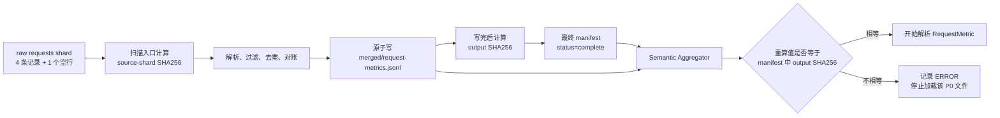

# 第 16 课：源分片哈希与输出哈希不是一回事

## 本课在事实链中的位置

第 15 课已经说明：P0 Aggregator 不只整理已经出现的记录，还会用预期 Execution、预期 Case 数量和 JUnit identity 检查事实集合。那些检查回答的是“进入 merged 输出前，当前集合是否满足已有完整性参照”。即使这些关卡全部通过，仍有两个不同的文件时点需要说明：源摘要计算时看到了哪些字节，以及下游后来读取的是不是 Aggregator 当时写完的输出字节。

继续沿用 Run 104 的完整计划：

```text
run_id = image-smoke-104-20260826T010000Z-a1b2c3d4
计划 Q = [D, E, A, B, C]
并发参数 = -n 2
parallel(Q) = [D, E]
serial(Q)   = [A, B, C]
expected_execution_ids = [parallel-pool, serial-pool]
expected_case_count = 5
```

Case C 仍是异步图像生成 Case：`case_id=nodeid=module/smoke/test_图片生成异步调用.py::TestAsyncImageGeneration::test_f8_09_async_image_generation_task_succeeds_with_result`，`execution_id=serial-pool`，`worker_id=master`，`param_hash=74234e98afe7498f`，`invocation_id=inv-a93bbdf630847f96d91234b5`。本课给它安排一条提交请求和三条查询请求，作为 `shards/requests-serial-pool-master.jsonl` 中的教学输入。`job-101`、响应状态和耗时是明确给定的离线案例数据，不是仓库对某次外部服务响应的证明。

本课只追踪三个时点：扫描源分片时记录 SHA256；四份 merged 文件写完后生成 output SHA256；Semantic Aggregator 消费 `merged/request-metrics.jsonl` 前重新计算并比较 output SHA256。第 17 课才解释这些未变化的请求事实怎样组成业务语义。

---

## 核心问题

> Aggregator 扫描每个源分片时已经记录了 SHA256，为什么写完 merged 文件后还要生成另一组 output SHA256，并让下游消费前重新验证？

因为两组摘要虽然使用同一种 SHA256 算法，却绑定了不同对象、不同生成时点和不同用途：

```text
源分片 SHA256：描述扫描入口处某一个 raw shard 的字节
output SHA256：描述归并、筛选、排序并写完后的某一个 merged 文件的字节
消费前重验：比较下游此刻将要消费的 merged 字节与 manifest 中的承诺
```

它们不是一条摘要被重复命名。源摘要不能替代输出摘要，输出摘要也不能反向证明源分片从未变化。哈希相等只支持“这两次计算得到相同摘要”的字节一致性判断，不会自动证明记录真实、成员完整、生产者可信或业务含义正确。

---

## 从一个具体现象开始

### 正常输入：源文件与输出文件本来就可能不同

本课的五个 Case 分布保持不变：

```text
shards/cases-parallel-pool-gw0.jsonl    -> D
shards/cases-parallel-pool-gw1.jsonl    -> E
shards/cases-serial-pool-master.jsonl   -> A、B、C
```

Case C 的请求分片包含四条 `RequestMetric`。下表的事件 ID 是定向探针采用的 fixture 标识，便于稳定复现；生产路径的真实 `request_event_id` 由运行时生成，不能预先把这些教学字符串当作某次线上身份：

| 顺序 | 探针 fixture `request_event_id` | 请求 | 本课给定结果 |
| --- | --- | --- | --- |
| 1 | `req-c-submit-01` | `POST /v1/media/generations` | HTTP 202，得到 `job-101` |
| 2 | `req-c-poll-01` | `GET /v1/media/tasks/job-101` | 查询尚未结束 |
| 3 | `req-c-poll-02` | `GET /v1/media/tasks/job-101` | 查询尚未结束 |
| 4 | `req-c-poll-03` | `GET /v1/media/tasks/job-101` | 查询得到 `succeeded` |

为隔离“物理字节”和“模型记录”的差别，定向探针还在这个 requests shard 末尾放了一个空行。扫描器计算源摘要时读取整个文件的原始字节，所以空行属于摘要输入；逐行解析时，空行会被跳过，不会形成第五条 `RequestMetric`。

随后 P0 Aggregator 完成 Run、Schema、重复/冲突和第 15 课的完整性判断，把四条请求记录重新序列化为 `merged/request-metrics.jsonl`。源分片中的额外空行已经不在输出中，输出还经过统一排序和序列化，因此探针得到两项不同摘要：

```text
source_shards 中 requests shard 的 SHA256
= caa946f2bb64c663b5769f8cbb0d05e9b56ed40ea347d4c86a4bc07bff3101e5

output_hashes["request-metrics"]
= 3b6a28c8332e9a1f4e866eee19042ce68db2a058ab56dd721b1ec99fdcfb9e42
```

这不是校验失败，因为代码从不要求二者相等。二者描述的文件对象不同。

完整的时点关系是：



图中的第一条摘要跟着 raw shard 走，第二条摘要跟着 merged 文件走。下游比较的是“merged 文件当前值”和 manifest 中对应的 output hash，而不是拿 merged 文件去和任一 source hash 比较。

### 只改变一个输出字段

P0 最终 manifest 已经写成 `status=complete` 后，探针只把 POST 那条 merged 请求的 `duration_ms` 从 `180.0` 改成 `181.0`，不修改 P0 manifest。两个序列化文件长度不变，逐字节比较确认只有数字 `0` 变成了 `1`：

```text
manifest 仍记录 = 3b6a28c...9e42
文件重新计算   = 6edf9655...03ff
```

Semantic Aggregator 先看见 P0 manifest 的 Run ID 和 `status=complete`，再重算请求文件。两个摘要不等，它记录 ERROR `p0_request_metrics_hash_mismatch`，并在打开该文件解析 `RequestMetric` 之前返回。它不会把修改后的 `181.0` 当作可信 P0 请求事实。

这里还要区分两个结果：P0 manifest 仍是先前的 `status=complete`；本次 Semantic merge 没有抛出未处理异常，仍会写自己的 `status=complete` manifest，但其中 `integrity_status=failed`。所以“拒绝这个输入文件”不等于“整个进程抛异常退出”，也不等于改写 Case C 的 CaseResult 或 pytest 退出事实。

---

## 为什么原有解释不够

把两组值都称为“文件哈希”会隐藏三个决定其含义的问题。

第一个问题是“算谁”。源分片可能有多个 Worker 文件，内容包含空白行、foreign Run、非法记录和后来会折叠的精确重复；merged 输出则是校验、筛选、去重、分类和排序后的新文件。算法相同，不会让输入对象变成同一对象。

第二个问题是“何时算”。源摘要在 `_scan_shard()` 刚进入时生成，甚至早于该分片逐行解析；output SHA256 在四份 merged JSONL 都完成单文件写出后生成；下游摘要又发生在另一个消费阶段。若不标明时点，“哈希一致”就没有可比较的双方。

第三个问题是“和什么比”。当前 P0 请求没有调用者提供的 expected source hash，所以源摘要只是写入清单的观察值，不是一道“符合预期才准入”的门禁。下游则拥有 manifest 中的 expected output hash，可以与自己重新读取文件得到的 actual hash 比较。

还需要把内容一致与事实正确分开。一个 Schema 合法但没有来源证据支持的 `duration_ms=181.0`，只要文件和 manifest 被协调更新，就能通过这一层摘要比较；反过来，一个语义完全等价的文件只多一个换行，字节摘要也会改变。SHA256 处理的是字节，不理解 Run 计划、Case 身份、HTTP 语义或外部 LLM 的真实行为。

---

## 核心概念

### 1. 源分片 SHA256：Source-shard SHA256

源分片 SHA256（Source-shard SHA256）是 P0 Aggregator 开始扫描某个 raw shard 时，对哈希读取步骤当时看到的原始字节计算的十六进制摘要。它解决的是“本次归并为哪个源路径记录了哪项入口摘要”这一血缘问题；由于随后解析会另开文件，它本身不保证解析器看到同一版本。

它的生命周期从 `_scan_shard()` 入口开始，最后进入 `manifest.source_shards[].sha256`。摘要覆盖物理文件的全部字节；空行即使不生成模型，foreign Run 即使随后被过滤，非法行即使只留下问题，它们仍参与源摘要计算。

当前实现没有 expected source hash，也没有下游重新打开 raw shard 与该值对账。因此，这个字段是审计记录，不是当前消费链的准入门禁。JUnit 文件另记在 `junit_files`，不属于 `source_shards`，当前也没有相同的 SHA256 字段。

### 2. 输出 SHA256：Output SHA256

输出 SHA256（Output SHA256）是 P0 Aggregator 在最终 merged JSONL 写完后，对每一份落盘输出重新读取原始字节得到的摘要。它解决的是“最终发布了哪个输出文件版本”。

P0 manifest 使用四个固定键保存它们：

| manifest 键 | 对应文件 |
| --- | --- |
| `case-results` | `merged/case-results.jsonl` |
| `request-metrics` | `merged/request-metrics.jsonl` |
| `failures` | `merged/failures.jsonl` |
| `integrity-issues` | `merged/integrity-issues.jsonl` |

`merged/manifest.json` 本身不在自己的 `output_hashes` 中。两个不同角色的空文件还会得到同一个空字节摘要；本课探针中 `failures` 与 `integrity-issues` 都是空文件，摘要都为 `e3b0c442...b855`。因此，摘要本身不携带文件角色，必须由 manifest 键和路径给它上下文。

### 3. 消费前重验：Consumer-side Verification

消费前重验（Consumer-side Verification）是消费者在解析具体输出前，重新计算自己将要读取的文件摘要，再与上游 manifest 中对应 output hash 比较。它解决的是“发布之后、消费之前，当前字节是否仍与上游清单一致”。

本课主线中的消费者是 Semantic Aggregator，它只核验 P0 的 `request-metrics.jsonl`。摘要相等才进入逐行 `RequestMetric` 解析；不相等则记录 `p0_request_metrics_hash_mismatch` 并停止加载该文件。其他消费者的核验范围并不相同，不能把这一行为扩写成“每个下游都验证四份 P0 输出”。

三项概念可按对象与时点对齐：

| 概念 | 被计算对象 | 生成时点 | 保存位置或比较对象 | 当前用途 |
| --- | --- | --- | --- | --- |
| 源分片 SHA256 | 单个 raw shard | 该 shard 解析前 | `source_shards[].sha256` | 记录扫描入口的源字节血缘 |
| 输出 SHA256 | 单个 merged JSONL | 四份输出写完后 | `output_hashes[name]` | 声明发布的输出字节版本 |
| 消费前重验 | 消费者当前看到的 merged 文件 | 解析该文件前 | 与 `output_hashes[name]` 比较 | 不一致时拒绝该文件作为输入 |

“不是一回事”描述的是对象、时点和合同不同，并不意味着两个摘要数值永远不可能相同。如果某个源文件与某个输出文件碰巧字节完全相同，它们可能得到相同值，但仍属于不同阶段的记录。

---

## 完整运行过程

下面按真实控制流排列，不把逻辑依赖顺序误写成文件事务。

### T0：先公布归并中的 manifest

`merge_quality_run()` 建立目录和状态后，先原子写 `merged/manifest.json`：

```text
status = merging
output_hashes = {}
source_shards = []
```

这个文件告诉观察者归并正在进行。它不是完成承诺，也不能作为下游开始消费四份输出的信号。

### T1：为每个源分片记录入口摘要，再逐行扫描

Aggregator 只扫描三类 P0 shard：`cases-*.jsonl`、`requests-*.jsonl`、`integrity-*.jsonl`。对每个匹配文件，它先计算 raw bytes 的 SHA256，再用另一个打开操作逐行读取。随后才统计非空行、过滤 foreign Run、做 Schema 校验并处理重复或冲突。

状态由“尚无该文件统计”变成一项 `_SourceStats`，其中既有 `sha256`，也有当前 Run 记录数、foreign 记录数、非法行数和重复计数。扫描结束后，这项统计才加入 `state.source_stats`。

### T2：完成内容校验与对账

源记录进入第 12～15 课已经建立的链：当前 Run、Schema、重复与冲突、预期 Execution、预期 Case 数量、JUnit identity，以及失败分类。源摘要不会代替其中任何一关，也不会因为摘要已生成就让记录自动通过。

这一阶段形成四类内存结果：Case、Request、Failure 和 Integrity Issue。它们已经不是 raw shard 的逐字节拷贝。

### T3：依次原子替换四个 merged 文件

Aggregator 依次写 `case-results.jsonl`、`request-metrics.jsonl`、`failures.jsonl`、`integrity-issues.jsonl`。每一个文件都先写同目录临时文件，执行 `flush` 和 `fsync`，再用 `os.replace` 替换目标。

这提供的是单个文件的原子替换，不是“四个 JSONL 加一个 manifest”组成的整体事务。进程若在中途停止，目录里可能保留不同代次的输出；Semantic、Metrics 与 Flaky 这些严格产物消费者会以后面的最终 manifest 状态作为提交门禁。Pipeline Reporting 的降级读取合同更宽松，不能把这句话扩大为所有消费者的统一行为。

### T4：输出落盘后生成四个 output SHA256

四次写调用结束后，Aggregator 重新打开四个目标文件，逐块读取原始字节并生成 `output_hashes`。这个时点晚于输出序列化，所以摘要覆盖的是落盘结果，而不是内存模型或源分片。

### T5：最后发布 complete manifest

Aggregator 把 `source_shards`、输出计数、四项 `output_hashes` 和派生的 `integrity_status` 放入 manifest，再以单文件原子替换写成 `status=complete`。只有运行到这里，P0 manifest 才发布“这一轮写出已经走完”的提交标志；Semantic、Metrics 与 Flaky 按各自规则把这个状态作为后续门禁。

如果上述 try 块发生普通异常，Aggregator 会记录 ERROR `merge_failed`，尝试写 `status=failed` 且 `output_hashes={}` 的 manifest，并返回 `IntegrityStatus.FAILED`。这个公共函数通常把异常转成结果，而不是继续向调用者抛出。

### T6：Semantic 先检查清单身份与提交状态

Semantic Aggregator 保存 P0 manifest 当前的 SHA256，解析 manifest，并要求 `run_id` 等于本次 Run 且 `status=complete`。不满足时记录 `p0_manifest_untrusted` 并停止加载 P0 请求证据。

这里的 “untrusted” 是该分支的错误代码语义，不代表 manifest 已经过数字签名认证。当前 Semantic 检查不要求 P0 `integrity_status=complete`，也不核验 P0 manifest、Schema 或 merge 版本字段。

### T7：重算请求输出并作相等比较

Semantic 确认 `merged/request-metrics.jsonl` 存在后计算 actual SHA256，从 P0 manifest 读取 `output_hashes["request-metrics"]` 作为 expected SHA256：

```text
expected == actual -> 继续
expected != actual -> ERROR p0_request_metrics_hash_mismatch，然后返回
```

expected 字段缺失时得到的也是不相等，而不是把缺失解释为验证成功。

### T8：相等后才解析请求事实

只有比较通过，Semantic 才打开文件逐行执行 `RequestMetric` 模型校验，过滤 foreign Run，并按 `request_event_id` 处理冲突。这里还会有新的结构和关系校验，所以“哈希通过”不是后续所有校验通过的替代说法。

---

## 正常路径

### 输入

正常路径明确给定：Quality 和 Semantic 都已启用并实际进入收尾链；Run 104 的三个 Case shard 包含五个计划 Case，四条 Case C 请求事实已由标准上下文写入 requests shard；第 12～15 课建立的前置条件均已满足；P0 写出期间和 Semantic 重验、读取期间没有其他进程修改相关文件。

定向探针直接调用生产归并函数，得到：

```text
P0 manifest.status           = complete
P0 manifest.integrity_status = complete

四项 source_shards[].sha256 逐一等于对对应 raw shard 的重新计算值
四项 output_hashes 逐一等于对对应 merged 文件的重新计算值
```

探针为了只隔离本课的文件摘要分支，没有传入 JUnit 路径，因此它没有重复证明第 15 课的 JUnit 对账；`junit_files=()` 会使那一块按当前合同跳过。正文正常路径中的“前置条件满足”是本课明确给定的场景，探针负责复核的是源摘要、输出摘要和消费前重验，二者证据范围不能混写。

其中 requests shard 的源摘要与请求输出摘要不相等，原因是源文件多一个会在解析时跳过的空行，输出又经过统一序列化。这个差异没有产生问题，因为真实判断从来不是 `source_hash == output_hash`。

### 判断、状态变化与输出

Semantic 依次得到：

1. `merged/manifest.json` 存在、JSON 可解析、Run ID 相同、`status=complete`。
2. `merged/request-metrics.jsonl` 存在。
3. 重算值 `3b6a28c8...9e42` 与 `output_hashes["request-metrics"]` 相等。
4. 比较通过后，四条 `RequestMetric` 才进入解析，并可成为下一阶段关系校验的 P0 evidence。

本次 Semantic 结果为：

```text
semantic manifest.status           = complete
semantic manifest.integrity_status = complete
issue_codes                         = []
```

Semantic manifest 的 `p0_evidence` 还记录它当时看到的 P0 manifest SHA256 与 request-metrics SHA256。这建立了下一阶段可继续核对的证据链，但没有给 P0 manifest 增加自签名，也没有引入外部可信根。

### 可以推出的结论

在文件于比较和读取期间保持稳定、manifest 未与文件协调伪造的前提下，Semantic 消费时看到的请求文件与 P0 manifest 声明的输出版本一致，可以继续做模型和关系校验。

不能由这条正常路径推出“这四条 HTTP 记录一定来自真实服务”“Run 104 绝无漏项”或“Case C 的业务动作已成功”。前者需要来源认证与外部契约证据，完整性仍由上一课的有限参照约束，业务分组与成功口径则属于后续语义层。

---

## 复杂路径

### 路径一：只改 merged 输出，manifest 保持不变

输入只增加一个变量：P0 `status=complete` 发布后，`request-metrics.jsonl` 中第一条 POST RequestMetric 的 `duration_ms` 从 `180.0` 变为 `181.0`；P0 manifest 仍保存旧摘要。探针的 `req-c-submit-01` 只是定位这条 fixture 记录的教学标识。

执行顺序如下：

```text
读取 expected = 3b6a28c8...9e42
重算 actual   = 6edf9655...03ff
比较结果      = 不相等
新增问题      = ERROR p0_request_metrics_hash_mismatch
P0 请求加载   = 在逐行解析前停止
```

`_load_p0_evidence()` 从该分支返回后，Semantic merge 的外层流程仍会完成关系检查和自己的四份空或派生输出写入，再写 Semantic `status=complete` manifest。因为问题集合中有 ERROR，最终 `integrity_status=failed`。

因此完整结论是：被修改的 P0 请求文件没有进入可信请求集合；Semantic 产物的写出过程完成，但完整性失败。不能简写成“抛异常导致整个 Quality 流程终止”，也不能说框架自动恢复了原文件。

### 路径二：输出与 manifest 中的摘要一起改变

第二条路径从路径一继续，只改变一个条件：有人把 P0 manifest 的 `output_hashes["request-metrics"]` 同步更新为新文件摘要 `6edf9655...03ff`。

再次运行 Semantic 时，expected 与 actual 相等，`p0_request_metrics_hash_mismatch` 不再出现，文件进入模型解析。本课探针得到 Semantic `integrity_status=complete`。这不是 `duration_ms=181.0` 已被证明真实，而是当前比较的两端已重新一致。

P0 manifest 没有数字签名、带密钥的认证机制或仓库内可验证的外部不可变摘要。Semantic 虽会把它此刻看到的 P0 manifest SHA256 写入自己的 manifest，但这属于后续证据链；在缺少独立信任锚的这一层，能够同时改文件和 manifest 的主体仍可建立一组彼此一致的新值。

### 路径三：计算与读取之间发生并发修改

源扫描使用两个分开的打开动作：先 `_file_sha256(path)`，再 `path.open("rb")` 逐行解析。下游也先计算输出摘要，比较通过后再重新打开文本文件解析。源码没有文件锁、不可变快照或同一文件描述符上的“校验后继续读取”协议。

所以当前实现不能保证源摘要一定对应随后真正解析到的全部字节，也不能保证下游比较通过后到解析结束前文件绝不变化。这是一类检查时与使用时的竞态窗口。正常 Runner 会在执行池返回后才进入收尾，降低 Worker 仍写 shard 的概率，但这种调用顺序不是文件系统级互斥。

类似地，某个 merged 文件在 P0 写完后、Aggregator 计算 output hash 之前被改变，改变后的内容可能直接成为 manifest 中的新基线；在 hash 已计算后再改变，稳定的下游重验才有机会发现。时间点决定了检测结果。

---

## 对应的框架实现

下面的代码均位于概念模型与完整时间线之后。片段为教学化摘录，省略类型声明、排序细节和不相关分支，但保持真实调用顺序、状态所有权和失败边界。

### 1. 源摘要先于逐行解析

`quality/aggregator.py:197-228` 的关键顺序是：

```python
for kind, pattern, model in shard_specs:
    for path in sorted(shards_dir.glob(pattern)):
        stats = _scan_shard(state, path, kind, model)
        state.source_stats.append(stats)

def _scan_shard(state, path, kind, model):
    stats = _SourceStats(
        path=path,
        kind=kind,
        sha256=_file_sha256(path),
    )
    with path.open("rb") as handle:
        for line_number, raw_line in enumerate(handle, start=1):
            line = raw_line.strip()
            if not line:
                continue
            # 后续才做 JSON、Run、Schema、重复与冲突处理
```

输入是一个由文件名模式选中的 raw shard。`_file_sha256()` 成功后，只是局部 `_SourceStats` 先得到该文件的入口摘要；逐行处理继续改变这个局部统计和候选集合，整个 `_scan_shard()` 正常返回后，调用方才把它加入 `state.source_stats`。摘要没有与调用者给出的期望值比较。若读文件等异常越出该方法，外层 `merge_quality_run()` 会走 `merge_failed` 结果路径。

### 2. 四个输出写完后才计算 output hashes

`quality/aggregator.py:124-152` 保留了两个 manifest 时点：

```python
_write_manifest(state, manifest_path, status="merging", output_hashes={})

_scan_shards(state, layout.shards)
_read_junit(state)
_reconcile(state)
_classify_failures(state)

write_jsonl_atomic(output_paths["case-results"], sorted_cases)
write_jsonl_atomic(output_paths["request-metrics"], sorted_requests)
write_jsonl_atomic(output_paths["failures"], sorted_failures)
write_jsonl_atomic(output_paths["integrity-issues"], all_issues)

output_hashes = {
    name: _file_sha256(path)
    for name, path in output_paths.items()
}
_write_manifest(state, manifest_path, status="complete", output_hashes=output_hashes)
```

四个 `write_jsonl_atomic()` 各自完成一个文件的替换。只有四个调用都返回，代码才逐文件算 output hash，随后发布 complete manifest。这解释了 output hash 为什么覆盖最终序列化字节，也解释了它为什么不能直接复用 T1 的源摘要。

`quality/storage.py:23-56,76-110` 给出单文件原子写的具体机制：同目录临时文件、`flush`、`fsync`、`os.replace`。这里没有把五个文件包装成一个事务，也没有对目录做整体代际切换。

### 3. SHA256 原语只读取字节

`util/artifact_io.py:61-74` 的公共原语是：

```python
def file_sha256(path):
    digest = hashlib.sha256()
    with Path(path).open("rb") as handle:
        for chunk in iter(lambda: handle.read(1024 * 1024), b""):
            digest.update(chunk)
    return digest.hexdigest()

def compare_file_sha256(path, expected):
    normalized = expected if isinstance(expected, str) and expected else None
    return HashComparison(expected=normalized, actual=file_sha256(path))
```

它以二进制模式分块读取，不解析 JSON，也不忽略换行或空白。`HashComparison.matches` 只有在 expected 是非空字符串且与 actual 完全相等时才为真；它本身不认证 expected 的来源。

### 4. Semantic 在解析前拒绝摘要不一致的文件

`quality/semantic_aggregator.py:291-369` 的关键分支是：

```python
manifest = json.loads(manifest_path.read_text(encoding="utf-8"))
if manifest.get("run_id") != run_id or manifest.get("status") != "complete":
    issue(code="p0_manifest_untrusted", severity="error")
    return

actual_hash = _file_sha256(requests_path)
expected_hash = (manifest.get("output_hashes") or {}).get("request-metrics")
if expected_hash != actual_hash:
    issue(code="p0_request_metrics_hash_mismatch", severity="error")
    return

with requests_path.open("r", encoding="utf-8") as handle:
    for line in handle:
        metric = RequestMetric.model_validate_json(line)
        # 通过后才加入 state.p0_requests
```

输入是 P0 manifest 和请求输出。比较失败只改变 Semantic 的问题集合并停止该文件的加载，不会回写 P0 文件。外层 `merge_semantic_run()` 随后写自己的结果；ERROR 最终映射成 `integrity_status=failed`。

### 5. 能力存在、业务启用与真实执行

生产调用顺序位于 `run_orchestration/quality_pipeline.py:18-54`：P0 merge 返回非 `None` 结果后写最终 Run 记录，再依次调用 Semantic、Metrics 和 Flaky 阶段。这里没有要求 P0 `integrity_status` 成功；`merge_quality_run()` 把多数异常转成 FAILED 结果时，后续阶段仍会被调用并依靠各自门禁判断输入。`quality_semantic_stage.py:8-22` 只有在 `semantic_enabled` 为真时才调用 `merge_semantic_run()`，而且阶段本身采用 fail-open 处理，不用 Semantic 返回状态改写 pytest 退出事实。

配置解析的 Quality 与 Semantic 默认值都是关闭；因此，仓库里存在哈希代码不等于任意 pytest 入口都会执行它。当前 `Jenkinsfile:174-216` 的 Real Smoke 阶段在 `RUN_REAL_SMOKE` 条件成立时显式设置 `QUALITY_ENABLE=1`、`QUALITY_SEMANTIC_ENABLE=1` 和 `QUALITY_METRICS_ENABLE=1`，再调用 `run_master.py`。这证明该业务流水线配置了调用链，不能证明某次外部 Jenkins Job 已经实际运行，也不能证明外部 LLM 服务兑现了教学响应。

### 6. 测试证据与覆盖边界

- `tests/test_artifact_io.py:19-28` 用包含 CRLF 的原始字节验证 SHA256 精确值，并验证正确、错误和缺失 expected 的比较结果。
- `tests/quality/test_quality_aggregator.py:63-87` 覆盖真实 P0 merge、foreign Run、精确重复和 complete manifest，但没有直接逐项断言 `source_shards[].sha256` 或四项 P0 `output_hashes`。
- `tests/quality/test_semantic_aggregator.py:40-56` 覆盖正常 Semantic 链；`:59-75` 给 P0 request-metrics 追加一个换行，断言 `integrity_status=FAILED` 和 `p0_request_metrics_hash_mismatch`。
- `tests/quality/test_flaky_importer.py:79-92` 与 `tests/quality/test_pipeline_reporting.py:415-434` 证明其他消费者也有各自的拒绝或局部降级行为，但它们的文件范围与终局不同。

课程定向探针逐项重算了 P0 四个源摘要和四个输出摘要，并复现正常、只改输出、输出与 manifest 同步改变三条路径。探针用于复核源码推导，不替代仓库测试；仓库当前仍缺少对 P0 四项 output hash 和 source hash 落盘精确值的直接回归断言。

---

## 能够保证什么

在相关阶段实际启用、文件稳定且调用成功的前提下，当前实现明确提供这些能力：

1. P0 Aggregator 对每个被扫描的 Case、Request、Integrity raw shard 在解析前计算 SHA256，并把值连同路径和扫描统计写入 `source_shards`。
2. P0 Aggregator 在四份 merged JSONL 完成写出后分别计算 SHA256；最终 complete manifest 保存四个固定 output hash。
3. 通过 `write_json_atomic()` / `write_jsonl_atomic()` 写出的 manifest 与 merged 输出采用同目录临时文件、刷新、文件 `fsync` 与原子替换，读者不会在一次替换中看到半个新文件。Worker shard 使用的是追加写，不属于这项保证。
4. Semantic Aggregator 在加载 P0 请求事实前要求 P0 manifest 可读、Run ID 匹配且状态为 complete，并重新计算 `request-metrics.jsonl` 的 SHA256。
5. expected 与 actual 不一致时，Semantic 记录 ERROR `p0_request_metrics_hash_mismatch`，不把该文件中的记录加入 `p0_requests`。
6. expected 与 actual 相等后，文件仍要逐行通过 `RequestMetric` Schema、Run 过滤、重复冲突和后续关系校验；摘要比较没有绕过这些检查。
7. P0 的完成状态、P0 的完整性状态、Semantic 的完成状态和 Semantic 的完整性状态是分开的事实，不会因为某个文件被拒绝就回写 CaseResult 或 pytest 原始结果。

这里的“保证”是当前代码对给定输入和文件系统操作的行为承诺，不是对 SHA256 绝无理论碰撞、操作系统永不故障或外部服务真实履约的证明。

---

## 保证成立的前提

- Quality 配置已经启用、Run ID 有效，标准收尾链实际执行到 `merge_quality_run()`；只存在模块或类不能产生任何清单。
- 要获得本课 Semantic 重验行为，Semantic 也必须启用并实际执行。默认配置关闭它；当前 Jenkins Real Smoke 配置显式开启，但某次 Job 是否运行仍是外部事实。
- raw shard 位于约定目录且文件名匹配扫描模式。JUnit 不属于 `source_shards`，不能套用本课的源摘要结论。
- P0 manifest 和 `request-metrics.jsonl` 均存在、可读；manifest 的 Run ID 与 complete 状态满足 Semantic 当前门禁。
- 文件在一次摘要计算期间保持可稳定读取；要把“比较通过”继续解释为“随后解析了同一字节版本”，还要求比较完成到解析结束之间没有并发改写。
- expected output hash 所在 manifest 本身来自调用方认可的目录和发布过程。若需要抵御能够同时修改数据与 manifest 的主体，还必须有当前实现之外的数字签名、带密钥的认证机制、只读存储或独立可信摘要。
- 上游 Run、Schema、冲突和完整性关卡各自成立。哈希相等不会补足错误的 `expected_case_count`、缺失的 Worker 参照或不完整的 JUnit identity。
- 本课的 D/E Worker 分配、四条 Case C 请求、耗时和 `job-101` 是教学输入；仓库只能证明处理这些输入的机制，不能把它们提升为某次线上执行证据。

---

## 不能保证什么

1. **源分片 SHA256 不能代替 output SHA256。** 前者覆盖 raw shard，后者覆盖归并后的新文件；二者没有相等要求，也没有一对一映射。
2. **源摘要当前不是准入门禁。** `QualityMergeRequest` 没有 expected source hash，生产下游也没有读取 raw shard 并复验 `source_shards[].sha256`。
3. **哈希一致不能证明事实真实。** 错误但稳定的 JSON 会得到稳定摘要；SHA256 不访问外部 LLM，也不知道服务器是否真的返回 `job-101`。
4. **哈希一致不能证明来源可信。** P0 manifest 没有数字签名、带密钥的认证机制或外部可信根；同步修改文件与 expected hash 可以重新形成一致值。
5. **哈希一致不能证明集合完整或业务语义正确。** 第 15 课的 Execution、数量和 JUnit 参照仍有各自边界；请求怎样组成一次业务动作也尚未由文件摘要回答。
6. **字节变化不等于语义变化。** 只增加换行也会产生新摘要；反过来，摘要机制不会解释两个不同字段值哪个更符合业务事实。
7. **不能声称所有下游验证所有 P0 输出。** Semantic 只重验 P0 request-metrics；Flaky importer 重验 case-results、failures 和 integrity-issues，但不重验 request-metrics，而且只有 Flaky 实际启用时该路径才发生；Reporting 和 Metrics 还有不同的输入范围与失败终局。
8. **不能把五个文件当成整体原子事务。** 单文件 `os.replace` 不会让四个 merged JSONL 与 manifest 同时切换；最终 complete manifest 只是当前发布协议的提交标志。
9. **不能排除检查时与使用时的竞态。** 源端先 hash 后另开文件解析，消费端也先 hash 后另开文件解析；没有锁或不可变快照消除窗口。
10. **不能把 `status=complete` 写成完整性通过。** P0 或 Semantic 都可能完成写出但带有 failed/degraded 的 `integrity_status`；本课篡改路径的 Semantic 正是 complete + failed。
11. **不能把 Semantic 的 manifest 门禁扩大为所有 P0 元数据门禁。** 当前它检查 Run ID 与 `status`，没有据此拒绝 P0 `integrity_status=failed`，也没有验证 P0 的版本字段。
12. **不能把附属质量失败改写成 pytest 失败。** 标准 Quality 收尾与 Semantic 阶段采用 fail-open 边界，现有调用没有用该返回结果覆盖此前业务测试退出事实。
13. **不能把 P0 manifest 的摘要写成自认证。** P0 manifest 不保存自己的 hash；Semantic 保存它看到的 P0 manifest hash，是供后续链路核对的观察值，不是自带可信来源的签名。

本课最重要的结论是：**源分片 SHA256 记录扫描入口处的 raw bytes，output SHA256 记录归并后发布的 merged bytes，下游重验只比较自己将消费的输出与 manifest 声明是否一致。三者形成字节变化检测链，但没有把字节一致性升级为事实真实性、来源认证、集合完整性或业务正确性。**

---

## 与下一课的关系

本课让 Semantic Aggregator 在读取 P0 请求事实前先回答“这些字节是否仍是 P0 manifest 声明的版本”。通过重验后，Case C 的一条提交与三条查询仍只是四条彼此独立的 `RequestMetric`。

文件没有被改动，并不能回答它们共同构成几次业务动作，也不能说明一次 Retry 与一次 Polling 查询该怎样归属。第 17 课将在同一条 Case C 时间线上加入 Retry 变量，建立 Operation、Request Group、Polling Session 与 Request Event 四层业务语义。
