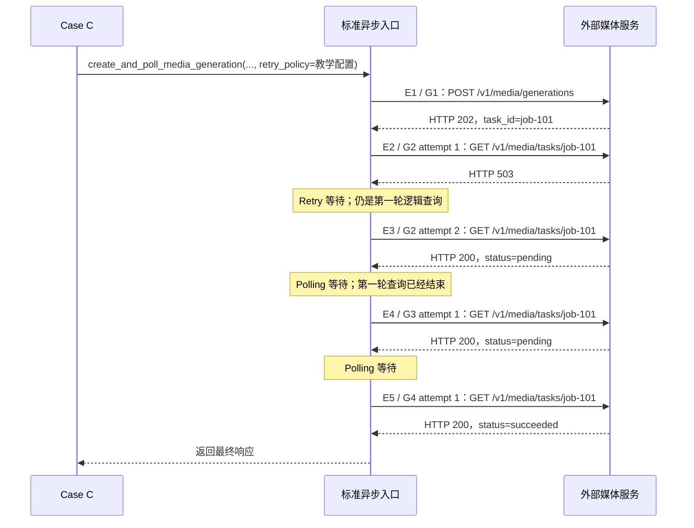
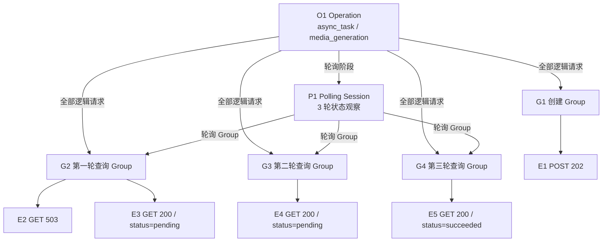

# 第 17 课：为什么需要四层业务语义

## 本课在事实链中的位置

第 16 课说明了 P0 请求文件怎样经过输出哈希校验：校验通过，只能说明 Semantic Aggregator 即将读取的字节仍与 P0 manifest 的声明一致，不能说明这些请求如何共同构成一次业务动作。对 Case C 而言，一条提交请求和后续查询即使都已成为通过该文件门禁、可供下游读取的 `RequestMetric`，仍然只是按时间排列的请求事实。

本课继续使用 Run 104 中的 Case C：

```text
run_id        = image-smoke-104-20260826T010000Z-a1b2c3d4
execution_id  = serial-pool
worker_id     = master
case_id       = module/smoke/test_图片生成异步调用.py::TestAsyncImageGeneration::test_f8_09_async_image_generation_task_succeeds_with_result
param_hash    = 74234e98afe7498f
invocation_id = inv-a93bbdf630847f96d91234b5
```

仓库中的这个 Case 确实调用标准异步入口 `create_and_poll_media_generation()`；该入口也确实具备把 `retry_policy` 传给轮询 GET 的能力。不过当前 Case 只传了 `poll_interval` 和 `poll_timeout`，没有传 `retry_policy`。为了在一条时间线上看清 Retry 与 Polling 的不同归属，本课只增加一个受控教学变量：离线调用同一标准入口时，为轮询 GET 显式配置 `RetryPolicy(max_attempts=2, base_delay=0.2, jitter=False, max_elapsed=None)`，并给出固定响应。GET 与 HTTP 503 分别满足该策略的默认方法和结果资格。这个变化证明的是现有代码怎样处理给定输入，不是对某次外部服务执行的复述。

本课要把已经建立的 Request Event 事实组织成三种更高层语义：Request Group、Polling Session 和 Operation。第 18 课才会在这个模型上计算轮询次数、终态与耗时；本课只解决“每条事实属于哪一次逻辑请求、哪段轮询、哪次业务动作”。

---

## 核心问题

> 同一个 Case 中依次出现 `POST 202`、`GET 503`、三个 `GET 200`，怎样证明它们是一次异步业务 Operation，其中第一次查询发生了 Retry，而不是五次彼此独立的 HTTP 调用？

答案不能只来自请求数量、URL 或状态码。框架需要同时保留四种粒度：

```text
Request Event    回答：实际发送了哪一次请求？
Request Group    回答：哪些发送属于同一次逻辑请求及其重试？
Polling Session  回答：哪些逻辑查询属于同一段轮询？
Operation        回答：提交与轮询共同服务于哪一次业务动作？
```

四层不是把同一个计数换四个名字。它们拥有不同的边界、不同的结果字段和不同的引用关系。只有把这些关系在调用发生时记录下来，后续指标才有可靠分母。

---

## 从一个具体现象开始

先看本课的受控时间线。`E1` 到 `E5` 是便于讲解的别名；生产代码里的 `request_event_id`、`request_group_id`、`polling_session_id` 和 `operation_id` 都在运行时生成，不能预先假定就是这些字符串。



五次物理发送的事实如下：

| Event | 所属 Group | 请求 | 传输结果 | 本次事件的业务状态 |
| --- | --- | --- | --- | --- |
| `E1` | `G1` | `POST /v1/media/generations` | HTTP 202 | `success` |
| `E2` | `G2` | `GET /v1/media/tasks/job-101`，attempt 1 | HTTP 503 | `failed` |
| `E3` | `G2` | 同一 GET，attempt 2 | HTTP 200 | `unknown`，因为原始 `pending` 不是终态成功 |
| `E4` | `G3` | 下一轮 GET，attempt 1 | HTTP 200 | `unknown`，原始状态仍为 `pending` |
| `E5` | `G4` | 再下一轮 GET，attempt 1 | HTTP 200 | `success`，原始状态为 `succeeded` |

如果只看五行 method、URL 和 HTTP status，还存在另一种合法解释：程序先独立调用一次 `post()`，再独立调用四次 `get()`。定向探针对这两条调用路径使用同一组 method、URL 和状态码，得到的拓扑却不同：

| 调用方式 | Request Event | Request Group | Polling Session | Operation |
| --- | ---: | ---: | ---: | ---: |
| 标准异步入口，第一轮 GET 内发生 Retry | 5 | 4 | 1 | 1 |
| 一次独立 POST 加四次独立 GET | 5 | 5 | 0 | 5 |

所以“看见五次请求”并不能推出“发生了一次异步任务”，也不能推出“轮询了四次”。物理发送数相同，业务拓扑可以完全不同。

---

## 为什么原有解释不够

第 16 课留下的是四条可读取、可校验的 P0 Request Event：一条 POST 与三条查询。本课显式增加一次 GET Retry 后，受控时间线才变成五条。`quality/models.py:238-284` 中的 `RequestMetric` 保存 Run、Execution、Worker、Case、Invocation、`request_event_id`、接口、协议、`attempt_index`、状态码、业务状态、耗时、错误和可选用量。它没有 `operation_id`、`request_group_id` 或 `polling_session_id` 字段。

这意味着单靠 Event 列表无法可靠回答三个问题。

第一，`E2` 与 `E3` 是同一次逻辑 GET 的两个 attempt，还是两轮独立查询？两条记录的相邻位置不能充当归属证据，并发、日志排序或分片归并都可能让“相邻”失去含义。

第二，`E3`、`E4`、`E5` 中哪些响应构成同一段 Polling？HTTP 200 只说明协议层响应成功。`E3` 和 `E4` 的响应体原始状态仍是 `pending`，对应的 Request Event 业务状态是 `unknown`，不能各算一次异步业务成功。

第三，创建任务的 POST 与查询任务的 GET 是否服务于同一个业务动作？URL 不同是正常现象，服务端 `job-101` 也不是本地 Operation 身份；仅靠相同 Case 或相同 Invocation，又可能把一个测试方法内的多次独立业务调用误并在一起。

因此，哈希、身份和 Event 都仍然必要，但各自只解决一部分问题：哈希约束文件版本，五级身份约束事实归属，Event 记录物理发送；业务拓扑必须由调用上下文另行记录，不能在事后凭状态码猜出来。

---

## 核心概念

Request Event 是前面课程已经建立的事实单元，本课不把它当作第四个新概念重新发明。这里新增三个用于组织 Event 的概念。

### 1. Request Group：一次逻辑请求

Request Group 把一次逻辑请求的全部实际 attempt 放在一起。无 Retry 时，一个 Group 通常引用一个 Event；发生 Retry 时，一个 Group 可以按顺序引用多个 Event。

在本课时间线中，`G2` 表示“第一轮查询 `job-101`”这个逻辑请求：

```text
G2.attempt_event_ids       = [E2, E3]
G2.attempt_count           = 2
G2.configured_max_attempts = 2
G2.first_status_code       = 503
G2.final_status_code       = 200
G2.final_request_event_id  = E3
```

Retry 增加的是 Group 内的 Event 数，不会自动增加 Polling 的轮数。Group 的 `complete` 只表示已观察到的 attempt index 连续为 `1..N`；它不等于最终请求成功。一个最终仍返回 503 的 Group，也可以在记录结构上完整。

### 2. Polling Session：围绕同一任务的一段轮询

Polling Session 把每一轮逻辑查询对应的 Request Group 放在一起，同时记录轮询等待、最终结果，以及一个有界的已观察业务状态序列。当前 Collector 最多保留前 64 项状态；本课只有三轮，不会触及该上限。

本课的 `P1` 引用三个查询 Group：

```text
P1.request_group_ids       = [G2, G3, G4]
P1.poll_count              = 3
P1.observed_state_sequence = [pending, pending, success]
P1.terminal_status         = success
P1.final_outcome           = success
```

`E2` 的 503 没有单独形成一次已观察业务状态。Retry executor 在同一轮查询内得到最终响应 `E3` 后，Polling 状态机才观察一次 `pending`。因此 `P1.poll_count=3`，不是四个 GET Event 对应的 4。

### 3. Operation：一次调用者声明的业务动作

Operation 是当前最外层活动的 Runtime Operation 边界。普通 `BaseRequest.request()` 也能为一次独立请求建立 HTTP Operation；当更外层领域入口已经声明 Operation 时，内部请求会复用它。本课的标准异步入口把 `O1` 声明为类型 `async_task`、名称 `media_generation` 的一次业务动作，并把创建任务与后续轮询放在同一边界内：

```text
O1.request_group_ids     = [G1, G2, G3, G4]
O1.polling_session_ids   = [P1]
O1.outcome               = success
```

Operation 回答的是“这些逻辑请求共同完成了哪一次动作”，不是“服务器上绝对只存在一个任务”。它是客户端观测模型，不能替代服务端幂等、任务唯一性或真实执行证明。

### 四层关系是一张引用图

四层经常被口头简称为“包含关系”，但当前模型不是一棵严格的单链树。真实引用方向如下：



Operation 直接引用全部 Group 和 Polling Session；Polling Session 只引用轮询期间的 Group；每个 Group 再用 `attempt_event_ids` 引用 P0 Event。查询 Group 因而同时属于 Operation 的全部请求集合和 Polling Session 的轮询子集。创建 Group `G1` 属于 Operation，却不属于 Polling Session。把关系画成 `Operation → Group → Polling Session → Event` 会把层次顺序画反。

---

## 完整运行过程

下面按真实控制流说明这张图怎样形成。时间顺序比最终 JSON 中字段的排列更重要。

### T0：Case 上下文与观察能力就绪

pytest 插件需要先建立 Run/Execution/Worker 上下文，再为 Case C 建立 Case/Invocation 上下文。只有 `QUALITY_ENABLE=1` 时 P0 Collector 才配置；只有总开关与 `QUALITY_SEMANTIC_ENABLE=1` 同时成立时 Semantic Collector 才配置。随后 `QualityRuntimeHooks` 被绑定到中性 Runtime Hooks。

如果这些条件未成立，请求业务仍可执行，但本课描述的四层记录不会凭空出现。默认配置下 Quality 和 Semantic 都是关闭的。

### T1：标准入口建立外层 Operation

`create_and_poll_media_generation()` 进入 `ASYNC_TASK/media_generation` 的 operation scope，创建 `O1`。随后创建 helper 自己声明的 HTTP scope、轮询 helper 声明的 Polling scope都会发现已有活动 Operation，于是复用 `O1`，租约为 `owned=False`，不会再落盘为额外顶层 Operation。

状态从“当前没有 Operation”变成“`O1` 正在进行，尚无子 Group”。如果标准入口内的异常向外传播，scope 会按异常类型结束 `O1`，不会把异常路径写成成功。

### T2：提交任务形成 `G1 → E1`

POST 没有配置 Retry，所以请求核心先建立 `G1`，再为这一次 `_send()` 建立请求上下文。发送完成后，P0 记录 `E1`；Semantic 观察器把该 Event 关联到仍在进行的 `G1`。Group 结束时生成一条 Request Group 记录，并把 `G1` 加入 `O1.request_group_ids`。

响应中的 `job-101` 是离线教学输入。代码随后从创建响应提取 task ID；这一步成功后才进入轮询。

### T3：开始 `P1`

`poll_get()` 只在循环外开始一次 Polling Session。此时 `P1` 绑定到当前活动的 `O1`，但还没有查询 Group、状态或终局。

### T4：第一轮查询在一个 Group 内重试

轮询循环第一次调用 `_request_without_attach()`，它建立 `G2`。因为传入 Retry，Group 在 Retry executor 外只建立一次；每个 attempt 则新建 RequestContext，并写入新的 Event ID 与 `attempt_index`。

`E2` 得到 503，满足受控 Retry 条件；实际执行的重试等待累计到 `G2.retry_wait_ms`。随后 `E3` 得到 HTTP 200，响应体原始状态为 `pending`。Retry executor 返回最终响应，`G2` 才结束，因此它引用 `[E2, E3]`。接着 Polling 状态机只对 `E3` 的响应求值一次，把一个 `pending` 追加到 `P1`。

### T5：后两轮各形成一个 Group

第一次 Polling 等待之后，第二轮建立 `G3`，`E4` 的原始状态为 `pending`；再次等待后，第三轮建立 `G4`，`E5` 的原始状态为 `succeeded`，被策略映射为 Polling `success`。两轮均没有实际重试，所以各有一个 Event，虽然教学 Retry 策略的 `configured_max_attempts` 仍为 2。

每个查询 Group 完成时都同时追加到 `O1.request_group_ids` 与 `P1.request_group_ids`。每轮最终响应经过状态机后，`P1` 的状态序列依次变为 `[pending]`、`[pending, pending]`、`[pending, pending, success]`。

### T6：先结束 Session，再结束 Operation

状态机看到 `SUCCESS` 后返回 `E5` 的响应。`poll_get()` 以 success 结束 `P1`，Collector 用 `len(P1.request_group_ids)` 写出 `poll_count=3`，并把 `P1` 加入 `O1.polling_session_ids`。

控制流再退出最外层异步 scope，`O1` 以 success 收尾。此时它已有四个 Group、一个 Polling Session；最终请求 Event 是 2xx 且业务状态不是 failed，所以没有触发 Operation outcome 的失败降级。

### T7：后置归并校验引用关系

运行期 Collector 写的是 Worker 独立的 P0/P1 分片。Semantic Aggregator 随后才检查 Group 引用的 P0 Event 是否存在、attempt index 是否连续、一个 Event 是否被多个 Group 占用；对每个 Session 所列 Group，检查其存在性以及 session、operation、invocation 身份是否一致；还会检查 Operation 引用的 Group/Session 是否存在并属于同一 Invocation。`async_task` Operation 至少要有 Group 和 Polling Session，否则记录 `async_operation_incomplete`。当前校验不是从所有带 `polling_session_id` 的 Group 反向证明 Session 一定列全了它们。

本课定向探针复现了运行期的两种拓扑并读取 raw shards，没有执行 P0/Semantic merge。因此它能证明采集路径产生了 `5/4/1/1` 与 `5/5/0/5` 两组结构，不能单独证明后置归并门禁已经通过。

---

## 正常路径

先回到仓库当前 Case C 的真实调用形态：它使用标准异步入口，却没有传 `retry_policy`。如果给这个调用提供第 16 课的受控响应 `POST 202 → GET status=pending → GET status=pending → GET status=succeeded`，模型为：

```text
4 Request Events
4 Request Groups
1 Polling Session
1 Operation

O1 async_task/media_generation
├─ G1 -> E1 POST 202
├─ G2 -> E2 GET 200/status=pending
├─ G3 -> E3 GET 200/status=pending
├─ G4 -> E4 GET 200/status=succeeded
└─ P1 -> [G2, G3, G4]
```

这里每个 Group 都只有一个 Event，但 Group 仍然有必要。它明确表示“这次逻辑请求没有发生 Retry”，而不是让消费者根据只有一条 Event 猜测调用边界。Polling Session 说明三个 GET 是三轮查询；Operation 又说明 POST 与这三轮查询属于同一次 `media_generation` 动作。

正常返回时，三层结论也不能相互替代：两个原始状态为 `pending` 的 Event，其业务状态为 `unknown`；Polling Session 的状态序列最终到达 `success`；Operation 的 outcome 才表示这次客户端业务动作成功返回。当前 smoke 测试还会对最终状态与输出做断言，但仓库源码只证明该断言和调用链存在，不能证明某次外部执行已经获得了这些受控响应。

---

## 复杂路径

### 路径一：一轮查询发生 Retry

把唯一新增变量——GET Retry——放回时间线，数量从正常路径的 4 个 Event 变成 5 个，但 Group、Session 和 Operation 数量不变：

```text
Events   : E1, E2, E3, E4, E5                         = 5
Groups   : G1, G2=[E2,E3], G3=[E4], G4=[E5]          = 4
Sessions : P1=[G2,G3,G4]                              = 1
Operations: O1=[G1,G2,G3,G4; P1]                     = 1
```

这条路径揭示两个不能混用的计数：`attempt_count` 属于 Request Group，`poll_count` 属于 Polling Session。第一次查询的 `attempt_count=2`，整个 Session 的 `poll_count=3`。Retry 等待属于这次逻辑请求；两轮查询之间的睡眠属于 Polling Session。两类等待都会消耗共享 deadline，但语义归属不同。

### 路径二：相同五次发送来自五个独立调用

若调用者绕开标准异步入口，执行一次独立 `post()` 和四次独立 `get()`，中性请求层会为每次普通调用建立各自的 HTTP Operation 与单 Event Group。此时没有 Polling Session，也没有证据把 POST 和 GET 解释为同一异步任务：

```text
O1 -> G1 -> E1
O2 -> G2 -> E2
O3 -> G3 -> E3
O4 -> G4 -> E4
O5 -> G5 -> E5
```

定向探针中两条路径的 method、URL 和 status 序列一致，但普通 GET 的协议是 `http`，不会经过 Polling 状态机；HTTP 200 会被 P0 记为普通 HTTP success，而不是原始状态 `pending` 对应的业务 `unknown`。框架依据调用时建立的 scope 保存语义，不依据事后模式匹配猜测语义。

### 路径三：创建响应无法提取 task ID

如果 POST 已形成 `G1 → E1`，但创建响应不是有效 JSON 或缺少 task ID，异常会在 Polling Session 开始前传播。Collector 仍可能写出 `O1.outcome=failed` 和已有的创建 Group。这里有一个必须保留的模型边界：运行期 `OperationRecord.completeness` 只检查是否还有未结束子对象、是否被标记 incomplete、以及是否至少有一个 Group，所以这条 Operation 记录本身仍可能是 `complete`；后置聚合才会因 `async_task` 没有 Polling Session 记录 `async_operation_incomplete`，使 Semantic 关系集合的 integrity 失败。单条记录完整与异步关系完整不是同一个结论。

### 路径四：观察链局部失败

Runtime Hooks 与 Semantic Context 对观察异常采用 fail-open。比如 P0 `RequestMetric` 已成功写出，而把它关联到 Group 时失败，业务响应仍可返回；结果可能是 Event 保留、Group 缺 Event，或者更高层记录缺失。此时缺失值必须保持 unknown/incomplete，并由完整性问题说明，不能用 `0 次重试`、`0 次轮询` 或“独立调用”补猜。

---

## 对应的框架实现

图和概念明确之后，再看实现如何保留这些边界。

### 1. 标准入口拥有最外层 Operation

`common/task_capabilities/media_generation.py:93-124` 的关键顺序是：

```python
with operation_scope(
    RuntimeOperationKind.ASYNC_TASK,
    name="media_generation",
    role=RuntimeTrafficRole.WORKLOAD,
    model_id=model_id_from_kwargs({"json": payload}),
):
    create_response = create_call(request_client, payload)
    task_id = extract_call(create_response)
    return poll_call(
        request_client,
        task_id,
        poll_interval=poll_interval,
        poll_timeout=poll_timeout,
        polling_policy=polling_policy,
        retry_policy=retry_policy,
    )
```

输入是请求客户端、业务 payload、Polling 配置以及可选 Retry。输出是最后一轮查询响应。状态变化是先建立一个 `ASYNC_TASK` scope，再在同一 scope 内完成 create、task ID 提取与 poll；任一步骤抛出的异常都会结束该 scope 并继续向调用者传播。

`common/runtime_hooks/lifecycle.py:48-95` 检查活动 Operation：已有外层 scope 时返回 `owned=False` 的租约，嵌套 helper 不重复结束或写出 Operation。这就是 `O1` 能同时拥有创建与轮询 Group，而不会膨胀成三个顶层 Operation 的原因。

### 2. Retry executor 外只建立一个 Group

`common/base_request.py:274-354` 分开处理无 Retry 与有 Retry 的请求。无 Retry 时建立 Group、绑定 Context、发送一次并在 `finally` 结束 Group；有 Retry 时先建立一次 Group，再让每个 attempt 通过 `context_factory()` 获得新的 Context：

```python
group = self._runtime_observer.start_request_group(
    method=first_context.method,
    path=first_context.path,
    protocol=first_context.protocol,
    configured_max_attempts=retry_policy.max_attempts,
)

def context_factory(attempt_index):
    context = self._build_request_context(...)
    context.attributes["attempt_index"] = attempt_index
    context.attributes["max_attempts"] = retry_policy.max_attempts
    group.bind(context)
    return context

try:
    return self.retry_executor.execute(..., context_factory=context_factory, send_once=self._send)
finally:
    group.finish()
```

每次 `_send()` 的响应或异常由 `quality/request_metrics.py:40-129` 生成一条 `RequestMetric`，P0 Collector 先记录，再旁路交给 Semantic 观察器。于是一个 attempt 对应一个 Event，而 Group 生命周期覆盖整个 Retry executor。

### 3. Polling 循环每轮发起一次逻辑请求

`common/base_request.py:123-161,447-558` 在循环外开始一次 Polling observation，在循环内每轮调用 `_request_without_attach(..., retry_policy=retry_policy, protocol="polling")`。该逻辑请求内部的 Retry 全部完成后，代码才执行：

```python
evaluation = evaluate_polling_response(last_response, polling_policy)
runtime_polling.observe_state(evaluation.state.value)
```

输入是这一轮最终响应；输出是一次状态机求值。状态为 success 时返回，failure 或 unknown 时抛出对应 Polling 异常，pending 时记录一次轮询等待并开始下一轮。因此 Retry attempts 不会被误计为多轮状态观察。

### 4. Collector 把引用写进三类 Semantic Record

`quality/semantic_collector.py:221-294` 在 Group 结束时按已观察 Metric 的顺序生成 `attempt_event_ids`，用 Event 数写 `attempt_count`，并把 Group 同时挂到活动 Operation 和可选 Polling Session。`quality/semantic_collector.py:338-385` 在 Session 结束时写：

```python
request_group_ids=tuple(session.request_group_ids)
poll_count=len(session.request_group_ids)
observed_state_sequence=tuple(session.observed_states)
```

`quality/semantic_collector.py:431-513` 最后把全部 `request_group_ids` 和 `polling_session_ids` 写入 Operation。它也会检查是否仍有未结束 Group/Session、是否至少形成一个 Group，并在最终 Event 不是 2xx 或业务状态 failed 时把原定 success outcome 降为 failed。

`quality/semantic_models.py:105-221` 还约束 Group 的 `attempt_count` 必须等于 Event 引用数量、最终 Event 必须属于该 Group，以及 Session 的 `poll_count` 必须等于 Group 引用数量。这些是单条模型内部约束；跨记录引用是否真实存在，则由 `quality/semantic_aggregator.py:372-511` 在归并时检查。

### 5. 能力存在不等于每次执行都启用

`quality/config.py:41-112` 把 Quality 和 Semantic 默认值都设为关闭，Semantic 还受总开关约束。`quality/pytest_plugin_runtime.py:67-120` 只有在相应开关开启时才配置 Collector 并绑定 `QualityRuntimeHooks`。`Jenkinsfile:174-216` 的 Real Smoke 阶段在条件成立、实际进入该阶段时显式设置 `QUALITY_ENABLE=1`、`QUALITY_SEMANTIC_ENABLE=1` 和 `QUALITY_METRICS_ENABLE=1`。

这三项事实必须分开陈述：仓库存在四层采集能力；Real Smoke 业务配置选择启用它；Case C 的标准入口会经过相应 scope。它们都不能证明某次外部 Jenkins Job 已运行，也不能证明外部媒体服务兑现了本课的响应序列。

相关分段测试分别覆盖了嵌套 Operation 复用、单请求的一组一事件、Retry 多 Event 共组、Polling 按 Group 计轮，以及 P0 Event 到 Semantic Group 的关联。仓库当前没有一条单测直接把真实 Case C 在 Semantic runtime 下完整执行后断言整套 `1 Operation + 1 Session + 4 Groups + 5 Events`；本课的精确拓扑还由离线定向探针补充复核。测试证明其覆盖范围内的预期，不替代生产源码对当前调用关系的证明。

---

## 能够保证什么

在下面一节列出的前提成立时，当前实现能够保证：

1. 每次被 P0 成功观察的实际发送都有独立 Request Event，响应和异常路径不会共用同一个 Event 身份。
2. 一次逻辑请求的 Retry attempts 绑定到同一个 Request Group；无 Retry 的逻辑请求仍形成一组一事件。
3. Polling 的每轮逻辑查询形成一个 Group；组内 Retry 增加 `attempt_count`，不增加 `poll_count`。
4. Polling Session 保存全部轮询 Group 引用；本课三轮案例的每轮最终响应都进入状态序列，创建 Group 不会误放入该 Session。当前状态序列最多保留前 64 项，不能把这一点扩写为任意轮数下都无截断。
5. 标准异步入口建立的外层 Operation 直接引用创建与查询的全部 Group，并引用 Polling Session；嵌套 HTTP/Polling scope 复用父 Operation。
6. Group、Session 和 Operation 的结构完整性与结果字段分开保存。记录完整不自动等于请求成功、轮询成功或业务成功。
7. Semantic Aggregator 对 Group/Event、Session/Group、Operation/子记录的存在、身份和部分双向关系做后置检查，并检查 attempt index 连续性和 Event 不被多个 Group 占用。
8. 对本课给定的离线输入，标准异步入口形成 `5 Events / 4 Groups / 1 Session / 1 Operation`；五次独立调用形成 `5 / 5 / 0 / 5`。这说明相同物理发送序列可以保留不同的调用语义。

---

## 保证成立的前提

- pytest 运行已经建立有效的 Run、Execution、Worker、Case 和 Invocation 上下文；缺少 Case context 时，P0 `RequestMetric` 本身也会跳过，并留下 warning。
- `QUALITY_ENABLE=1`，且需要四层 Semantic 产物时同时满足 `QUALITY_SEMANTIC_ENABLE=1`；仅有源码类和配置项不产生记录。
- 调用经过标准入口或显式建立等价的 Operation/Polling scope。绕开入口的独立请求会按独立 HTTP Operation 记录，这是不同调用事实，不是采集错误。
- Request middleware、P0 Collector、Semantic Collector 与分片写入在相关阶段成功；fail-open 只能保护业务调用，不能补回丢失的观察关系。
- Polling 使用明确的 `PollingPolicy`，服务响应能被当前状态机解析为 pending、success、failure 或 unknown；框架不会从任意 JSON 自动猜测状态含义。
- 要出现本课复杂路径中的 `G2=[E2,E3]`，调用者必须显式传入允许该 GET 结果重试的策略，并且 deadline 允许实际执行第二次发送。当前真实 smoke Case 没有传该参数。
- Semantic Aggregator 必须先成功扫描 P1 分片，再加载通过第 16 课所述 manifest 与 output hash 门禁的 P0 请求文件，最后完成跨记录关系检查，才能把归并结果当作完整语义集合。
- 本课的固定响应、`job-101`、别名与数量是可复现教学输入；外部服务是否曾返回这些值，需要独立的真实运行证据。

---

## 不能保证什么

1. **四层记录不能证明外部服务真实履约。** 它们描述客户端声明的 scope 和客户端观察到的响应，不验证服务端内部是否真正只创建、执行或保存了一个任务。
2. **本地四层 ID 不是服务端 task ID。** `operation_id`、`request_group_id`、`polling_session_id`、`request_event_id` 由本地运行时生成；`job-101` 来自响应体，二者职责不同。
3. **Event 数不能反推出 Group、Session 或 Operation 数。** 相邻请求、相同 URL、相同 Case 和相同状态码都不足以在缺少语义记录时恢复原拓扑。
4. **`complete` 不等于 `success`。** attempts 连续的 Group 可以最终失败；有 Group 的 Session 可以以 failure/timeout 结束；完整记录的 Operation 也可以拥有 failed outcome。
5. **`success` 也不证明记录完整或内容真实。** Operation 的 outcome 是当前控制流与已观察最终事实的结果；观察缺失、来源不可信或外部响应造假需要其他证据处理。
6. **一个 HTTP 200 不等于一次异步业务成功。** Polling 原始状态为 `pending` 的响应在 Request Event 层为业务 `unknown`；最终 Session 和 Operation 才承载更高层终局。
7. **Retry 配置不保证一定发生 Retry。** 只有资格判断通过、实际出现可重试结果且 deadline 允许时，才会增加 Event；被 deadline 阻止的等待与发送不能记成已发生事实。
8. **fail-open 不保证观测完整。** P0 Event 可能已经保留，而 Group、Session 或 Operation 关系缺失；框架不会以零值填补未知，也不会为了质量记录失败改写原始业务异常或 pytest 结果。
9. **运行期模型校验不等于跨记录关系已经通过。** 单条 Group/Session/Operation 能成功序列化，仍可能在 Semantic merge 中因缺失引用、身份不一致或 `async_operation_incomplete` 被判为 integrity failed。
10. **状态序列不保证无限保留。** Polling Group 和 `poll_count` 可以继续增长，但当前 `observed_state_sequence` 最多记录前 64 项，`terminal_status` 取该受限序列的最后一项；超过上限时不能把它当作实际最后一轮状态。
11. **现有测试与探针不是外部端到端证明。** 分段单测覆盖各机制，离线探针覆盖两种精确拓扑；探针未运行 P0/Semantic merge，仓库也没有直接针对真实 Case C 的整套四层端到端断言。

本课最重要的结论是：**Request Event 保存物理发送事实，Request Group 保存一次逻辑请求及其 attempts，Polling Session 保存多轮逻辑查询，Operation 保存调用者声明的一次业务动作。四者通过运行时引用组成业务拓扑；缺少任一层，都不能靠请求数量和状态码无损重建。**

---

## 与下一课的关系

本课已经确定 `P1` 引用 `[G2, G3, G4]`，第一轮 `G2` 内含两次发送，并且状态序列是 `[pending, pending, success]`。这使三个原本容易混淆的问题有了各自的数据来源：物理发送看 Event，逻辑查询看 Group，整段轮询看 Polling Session。

第 18 课将只展开 Polling Session：逐轮对齐查询 Group、最终响应、业务状态与时间消耗，解释轮询次数、轮询终态和业务耗时应该怎样计算，以及为什么不能把每个 HTTP 200 都当成一次独立业务成功。
