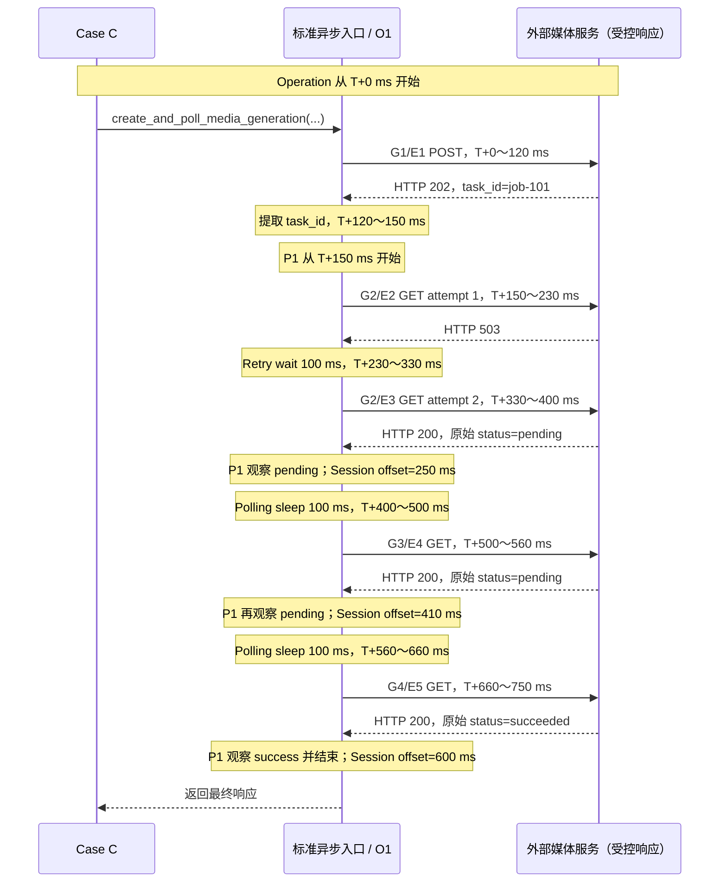

# 第 18 课：异步轮询指标应该归到哪一层

## 本课在事实链中的位置

第 17 课把同一次异步图像生成整理成四层业务语义：Request Event 记录一次物理发送，Request Group 组织一次逻辑请求及其 Retry attempts，Polling Session 组织多轮逻辑查询，Operation 则覆盖提交任务与轮询结果这一整个客户端业务动作。上一课已经回答“事实属于谁”，但还没有回答“轮询了几次、何时结束、耗时应记在哪里”。

本课继续使用 Run 104 中的 Case C：

```text
run_id        = image-smoke-104-20260826T010000Z-a1b2c3d4
execution_id  = serial-pool
worker_id     = master
case_id       = module/smoke/test_图片生成异步调用.py::TestAsyncImageGeneration::test_f8_09_async_image_generation_task_succeeds_with_result
param_hash    = 74234e98afe7498f
invocation_id = inv-a93bbdf630847f96d91234b5
```

仓库中的 Case C 确实调用标准异步入口 `create_and_poll_media_generation()`，但当前调用没有传 `retry_policy`。为了延续第 17 课的四层关系并精确区分 Retry 等待与 Polling 等待，本课仍使用离线受控 Retry，并把计时输入明确固定为 `poll_interval=0.1s` 与 `RetryPolicy(max_attempts=2, base_delay=0.1, jitter=False, max_elapsed=None)`。其中 Retry 的 `base_delay` 是本课为逐毫秒计算而从第 17 课示例的 0.2 秒调整为 0.1 秒；HTTP 响应和请求耗时也全部固定。这个调整不改变上一课的 `G2=[E2,E3]` 拓扑；它证明的是现有生产代码面对这些输入时怎样记账，不是某次外部媒体服务执行记录。

本课只解释 Polling Session 的次数、终局和时间边界。第 19 课才会比较首次结果与最终结果，定义“重试挽救”及其分母。

---

## 核心问题

> 一次异步任务实际发送了四个查询请求，其中两个属于同一轮查询的 Retry；轮询次数应算 4 还是 3，三个 HTTP 200 又能否算成三次业务成功？

要回答这个问题，必须分别找到三个权威范围：

```text
轮询次数        → Polling Session 引用的 Request Group 集合
轮询终局        → Polling 状态机结束 Session 时给出的 final_outcome
业务动作耗时    → Operation 的计时窗口
```

Request Event 数量、HTTP 2xx 数量和 Session 的三个结论有关联，却都不能单独替代它们。

---

## 从一个具体现象开始

### 同一条成功路径上的两条状态线

先展开第 17 课的 `O1`。`E1`～`E5`、`G1`～`G4` 和 `P1` 仍是教学别名；生产 ID 由运行时生成。



这条图同时保留 HTTP 层和业务层：

| 时段 | HTTP 层事实 | 业务层判断 | 新增语义事实 |
| --- | --- | --- | --- |
| `T+0～120 ms` | POST 返回 202 | 创建响应提供 `job-101` | `G1 → E1`，尚未进入 P1 |
| `T+150～230 ms` | 第一轮 GET 返回 503 | 满足教学 Retry 策略，尚不交给 Polling 状态机 | `E2` 加入 `G2` |
| `T+230～330 ms` | 没有发送请求 | `G2` 内 Retry 等待 | `G2.retry_wait_ms` 增加 100 |
| `T+330～400 ms` | Retry GET 返回 200 | 原始 `pending` 映射为 Polling `pending` | `E3` 加入 `G2`；P1 完成第 1 次状态观察 |
| `T+400～500 ms` | 没有发送请求 | 两轮逻辑查询之间等待 | `P1.sleep_duration_ms` 增加 100 |
| `T+500～560 ms` | 第二轮 GET 返回 200 | 再次观察 `pending` | `G3 → E4`；P1 完成第 2 次状态观察 |
| `T+560～660 ms` | 没有发送请求 | 下一轮 Polling 等待 | `P1.sleep_duration_ms` 再增加 100 |
| `T+660～750 ms` | 第三轮 GET 返回 200 | 原始 `succeeded` 映射为 `success`，停止 | `G4 → E5`；P1 完成第 3 次状态观察并结束 |

因此，四次 GET 发送并不等于四轮 Polling。`E2` 与 `E3` 都属于第一轮的 `G2`；Polling 状态机只接收 Retry executor 返回的 `E3` 响应。主路径的 Session 结果是：

```text
P1.request_group_ids       = [G2, G3, G4]
P1.poll_count              = 3
P1.observed_state_sequence = [pending, pending, success]
P1.terminal_status         = success
P1.final_outcome           = success
P1.total_duration_ms       = 600
P1.sleep_duration_ms       = 200
```

三个 HTTP 200 也不是三次业务成功。`E3` 和 `E4` 的原始业务状态仍为 `pending`，对应 Request Event 的 `business_status` 是 `unknown`；只有 `E5` 到达成功终态。Session 只产生一个 `final_outcome=success`，外层 Operation 也只产生一个成功 outcome。

---

## 为什么原有解释不够

如果只统计 Request Event，可以得到五次发送、四个 2xx、一个 5xx；如果只统计 GET，可以得到四次查询发送。这些数都是真的，但它们回答的是传输层问题。

轮询指标还需要补上三种不能从 Event 行数推断的边界。

第一，**一轮的边界**由 Request Group 决定。一轮内部可以发送多个 Retry attempt，所以四个 GET Event 在本例中只形成三个轮询 Group。

第二，**结束原因**由 Polling 控制流决定。最后观察到什么状态，与 Session 为什么结束，是两个字段：`terminal_status` 来自已保存状态序列，`final_outcome` 来自成功返回、业务失败、未知状态、超时或中断的控制流。

第三，**时间窗口**必须先说明对象。`E3.duration_ms=70` 是一次发送耗时，`G2.total_duration_ms=250` 覆盖两个 attempt 和中间 Retry 等待，`P1.total_duration_ms=600` 覆盖整段轮询，`O1.timing.total_duration_ms=750` 则从异步 Operation 开始计到当前实现记录的轮询终点。把这些值加在一起会重复计算。

因此，“4 次 GET”“3 个 HTTP 200”“600 ms”都不能脱离语义层单独解释。指标名称必须同时带着计算层、观察集合和缺失规则。

---

## 核心概念

本课新增三个概念；四层对象本身沿用第 17 课定义。

### 1. 轮询轮次：Polling Round

本课所说的轮询轮次，以当前 Polling Session 记录中的一条查询 Request Group 为计数单元；该 Group 内可以有一个或多个 Request Event。在正常采集路径中，这正好对应循环发起的一次逻辑查询。Group 会在状态解析前完成并挂入 Session，因此 `poll_count` 的精确定义是“已记录的 Group 引用数”，而不是“成功完成状态求值的次数”；解析失败时两者可能不同。

对单个 Session，计算式是：

```text
poll_count = len(request_group_ids)
           = len([G2, G3, G4])
           = 3
```

这不是比例，所以没有“成功次数 ÷ 总次数”形式的分子和分母。它的计数对象是 Session 中已记录的查询 Group，统计范围是一条具体 Polling Session。若 P1 根本缺失，解释上只能说轮询次数未知；实现不会为它合成一条带 `unknown` 的 Session。若 P1 已落盘但 `request_group_ids` 为空，当前实现会明确保存 `poll_count=0` 和 `completeness=incomplete`。这个 0 只描述“记录里没有 Group”，不能扩大成“已经证明业务真实轮询 0 次”。

### 2. 观察状态与结束结果：Terminal Status 与 Final Outcome

`terminal_status` 是当前持久化 `observed_state_sequence` 的最后一项；`final_outcome` 是 Polling 控制流结束时写下的结果。两者分别回答：

| 字段 | 回答的问题 | 来源 |
| --- | --- | --- |
| `terminal_status` | 最后保存的标准化状态是什么？ | `observed_state_sequence` 的末项 |
| `final_outcome` | 这段 Session 因什么结果结束？ | Polling 正常返回或异常类型 |

正常短路径中二者常同时为 `success`，但这不是恒等式。最后观察到 `pending` 后由 deadline 检查抛出 `PollingTimeoutError` 时，可以得到 `terminal_status=pending`、`final_outcome=timeout`；状态序列被截断时，二者也可能不同。普通请求自身直接抛出的 `requests.Timeout` 若没有被包装成 `PollingTimeoutError`，当前 Session 的兜底 outcome 是 `failure`，外层 Operation 才按通用异常规则记为 `timeout`。

这里保存的是 `pending/success/failure/unknown` 这组标准化状态，不是服务端原始字符串的无限集合。例如原始 `succeeded` 在本课策略下映射为 `success`。

### 3. 轮询耗时与业务动作耗时：Session Time 与 Operation Time

Polling Session 时间从 `poll_get()` 建立 Session 开始，到 Session 以某种 outcome 结束。`total_duration_ms` 是这个窗口的单调时钟差；`sleep_duration_ms` 只累计实际 Polling sleep。

Operation 时间属于更外层业务动作。对本课的标准异步入口，它从提交请求之前开始，并在当前实现中使用 Polling Session 完成时保存的 `terminal_perf` 作为结束时点：

```text
P1.total_duration_ms = T+750 - T+150 = 600 ms
P1.sleep_duration_ms = 100 + 100      = 200 ms
O1.total_duration_ms = T+750 - T+0   = 750 ms
```

`G2` 内的 100 ms Retry wait 已包含在 P1 的 600 ms 窗口中，却不属于 P1 的 `sleep_duration_ms`。POST 的 120 ms 和提取 task ID 的 30 ms 属于 O1 窗口，却不属于 P1。不同层的时间可以嵌套，不能直接求和。

---

## 完整运行过程

### T0：建立 Operation 与 Polling Session

标准异步入口先建立 `ASYNC_TASK/media_generation` Operation。POST 完成、task ID 提取成功后，`poll_get()` 在循环外只建立一次 Polling observation；此时 Session 起点为 `T+150 ms`。

如果 Quality、Semantic 或必要 Case 上下文没有建立，业务调用仍可继续，但不能假定 P1 记录存在。能力存在、配置启用、调用链经过和事实成功落盘必须分别成立。

### T1：一轮逻辑查询先完整结束

每次循环调用一次 `_request_without_attach()`。Request Group 在 Retry executor 外建立，每个 attempt 再生成自己的 Request Event。第一轮因此先形成：

```text
G2.attempt_event_ids = [E2, E3]
G2.attempt_count     = 2
G2.retry_wait_ms     = 100
G2.total_duration_ms = 250
```

在 `G2` 结束以前，Polling 状态机不会把 E2 的响应单独计作一轮状态观察。这个顺序阻止了“一个 Retry attempt 等于一轮 Polling”的误算。

### T2：只对本轮最终响应求值

逻辑请求返回后，状态机解析这一轮的最终响应 E3，把原始 `pending` 映射为标准化 `pending`。Semantic Collector 做两件事：

1. 将 `pending` 追加到 `observed_state_sequence`，只要序列尚未达到 64 项上限。
2. 若此前从未出现过 `pending`，记录它相对 Session 起点的首次 offset；重复出现不会覆盖第一次时间。

第一轮结束时，序列为 `[pending]`，首次 `pending` offset 为 250 ms。

### T3：先检查 deadline，再决定状态分支

状态被观察后，Polling 循环读取单调时钟并计算剩余 deadline。当前判断顺序是：

```text
最终响应求值
→ 记录标准化状态
→ 计算 remaining
→ remaining <= 0：抛 PollingTimeoutError
→ success：返回响应
→ failure：抛 PollingFailedError
→ unknown：抛 PollingUnknownStateError
→ pending：执行下一次 Polling sleep
```

这意味着状态事实和结束原因必须分开保存。即使刚观察到一个状态，deadline 判断仍可能让 Session 以 timeout 结束。

### T4：pending 才进入下一轮等待

第一轮和第二轮都得到 `pending`，且剩余时间大于零，于是各执行 100 ms Polling sleep。Collector 累加的是 sleeper 实际消耗的时间，不是简单写入配置值。第三轮得到 `success` 后直接返回，不再增加 sleep。

Session 结束前的状态变化如下：

```text
轮 1 后：[pending]                    sleep=100 ms
轮 2 后：[pending, pending]           sleep=200 ms
轮 3 后：[pending, pending, success]  sleep=200 ms
```

### T5：Session 结束并把时间交给 Operation

`poll_get()` 正常返回时，Runtime observer 以 `success` 结束 P1。Semantic Collector 用当前 Group 引用数写 `poll_count=3`，用 Session 起止单调时钟写 `total_duration_ms=600`，并把 P1 的 duration、sleep 和终点写入仍在活动的 O1。

外层入口在 P1 返回后还做了受控的 40 ms 封装工作，场景时钟最终到 `T+790 ms`。但 O1 当前优先使用 P1 完成时保存的 `terminal_perf=T+750 ms`，所以记录的 `O1.total_duration_ms=750`，不包含这 40 ms。这是现有实现的计时边界，不应改写成“从函数进入到函数完全退出的墙钟时间”。

### T6：Metrics 只聚合当前公开的对象

Semantic 归并后，当前 run-metrics 会聚合 Operation、Request Group 和 Request Event。对 async Operation，`operation_timing()` 汇总 `total_duration_ms`、`create_request_ms`、`polling_total_ms` 和 `polling_sleep_ms`。

本课主路径只有一个合格 Operation，所以生产聚合结果为：

| Operation timing 字段 | eligible_count | sample_size | missing_count | total / mean / min / max |
| --- | ---: | ---: | ---: | --- |
| `total_duration_ms` | 1 | 1 | 0 | `750 / 750 / 750 / 750` |
| `create_request_ms` | 1 | 1 | 0 | `120 / 120 / 120 / 120` |
| `polling_total_ms` | 1 | 1 | 0 | `600 / 600 / 600 / 600` |
| `polling_sleep_ms` | 1 | 1 | 0 | `200 / 200 / 200 / 200` |

这张表对应探针直接交给 `operation_timing()` 的单个 async Operation，也对应只含 O1 的 async-task bucket。数值聚合只对已知值计算，并另存 `missing_count` 与 completeness。若看整个 run 级 summary，`total_duration_ms`、成功总耗时和非成功总耗时的输入是全部 workload Operation；只有 `create_request_ms`、`polling_total_ms` 和 `polling_sleep_ms` 会先筛选 workload `async_task` Operation，独立的 `polling` Operation 不进入这三项。当前 run-metrics 没有 Polling Session 专属聚合桶，因此 `poll_count=3`、`terminal_status=success` 和 `final_outcome=success` 仍是 Semantic Session 事实，不能声称它们已经成为 run 级轮询汇总指标。

### 指标必须带着来源与范围

| 要回答的问题 | 所在层 | 计算输入或“分子” | 统计范围或“分母” | 缺失时怎样表达 | 不能解释什么 |
| --- | --- | --- | --- | --- | --- |
| 本 Session 轮询几轮 | Polling Session | `request_group_ids` 的数量 | 单个 P1；不是比例 | P1 缺失时没有记录；空 Group 列表才会保存 `0 + incomplete` | 物理发送次数、Retry 次数、真实轮次已被穷尽 |
| 本 Session 最后保存了什么状态 | Polling Session | 状态序列末项 | 单个 P1；不是比例 | 无状态时为 `None`；超长序列受上限影响 | Session 为什么结束 |
| 本 Session 因什么结束 | Polling Session | 控制流映射出的一个 outcome | 单个 P1；不是比例 | P1 缺失时没有 outcome，不能从 HTTP 补猜；`unknown` 只表示未知状态异常的真实结果 | 外部任务内部是否真实成功 |
| 轮询阶段耗时多少 | Polling Session | 起止单调时钟差 | 单个 P1 | P1 缺失时没有该数值，解释保持未知 | 完整 Operation 端到端耗时 |
| 业务动作耗时多少 | Operation | O1 的 `total_duration_ms` | 单个 O1；聚合时分母是有已知值的 Operation 样本 | 聚合保留 `eligible_count/sample_size/missing_count` | 服务端纯处理时长、用户端绝对墙钟时长 |

---

## 正常路径

对本课受控主路径，输入是一个标准异步 Operation、一个 Polling Session、固定 5 秒 deadline，以及第一轮 GET 内允许最多两次 attempt 的 Retry 策略。执行结果按层汇总如下：

| 层 | 权威事实 | 本例结果 |
| --- | --- | --- |
| Request Event | 每次物理发送的 HTTP 与局部业务分类 | 5 个 Event；4 个 2xx、1 个 5xx；其中 2 个业务 success、1 个 failed、2 个 unknown |
| Request Group | 一次逻辑请求的 attempts 与 Retry 等待 | 4 个 Group；`G2=[E2,E3]`，其余一组一 Event |
| Polling Session | 查询 Group、状态序列、终局和轮询窗口 | 3 轮，`pending→pending→success`，600 ms，总 Polling sleep 200 ms |
| Operation | 提交和轮询共同构成的业务动作 | 1 个成功 `media_generation`，记录总耗时 750 ms |

推导轮询次数时只数 P1 的 Group：`|[G2,G3,G4]|=3`。推导 Session 终局时使用 `final_outcome=success`，而不是数三个 HTTP 200。推导业务动作耗时时读取 O1 的时间窗口，而不是把 Event、Group 和 Session 的 duration 相加。

能够得出的结论是：客户端通过标准入口完成了一次被记录为成功的异步 Operation；它经历三轮逻辑查询，第一轮内部发生一次 Retry，轮询阶段记录 600 ms。

不能由此推出：外部服务内部只执行过一次任务、服务端处理本身恰好用了 600 ms、或者任意真实 Jenkins 执行都得到这些数值。所有时间和响应都是本课探针的受控输入。

---

## 复杂路径

### 路径一：相同五次发送，但没有 Retry

现在只改变一个条件：不给轮询 GET 传 `retry_policy`。仍使用完全相同的 method、path、HTTP 状态码、请求起止时间、三段 100 ms 等待和 790 ms 场景时间。

第一次 GET 的 503 不再被 Retry executor 消化，而是作为第一轮逻辑查询的最终响应交给 Polling 状态机。其响应体仍含受控原始状态 `pending`，所以状态机把它标准化为 `pending` 并进入下一轮；P0 Event 层则因为 HTTP 非 2xx，把该 Event 的业务分类保留为 `failed`。两个层次没有互相覆盖。

| 指标或事实 | 第一轮内 Retry | 无 Retry，503 自成一轮 |
| --- | ---: | ---: |
| Request Events | 5 | 5 |
| HTTP 分布 | 4 个 2xx、1 个 5xx | 4 个 2xx、1 个 5xx |
| Request Groups | 4 | 5 |
| P1 查询 Groups | `[G2,G3,G4]` | `[G2,G3,G4,G5]` |
| `poll_count` | 3 | 4 |
| 状态序列 | `pending,pending,success` | `pending,pending,pending,success` |
| `final_outcome` | `success` | `success` |
| P1 `total_duration_ms` | 600 | 600 |
| P1 `sleep_duration_ms` | 200 | 300 |
| O1 `total_duration_ms` | 750 | 750 |

为什么总时间没有变化？第一条路径把 `T+230～330 ms` 归为 G2 内 Retry wait，第二条路径把同一段时间归为两轮之间的 Polling sleep。物理时间线相同，语义所有权不同，所以 Session 总窗口同为 600 ms，`poll_count` 与 `sleep_duration_ms` 却不同。

这个对照直接说明：HTTP 请求数是 Event 层计数，轮询次数是 Session 下 Group 的计数；相同 Event 数不能替代业务分母。

### 路径二：最后状态仍是 pending，但 deadline 已耗尽

只增加一个变量：某轮最终响应被映射为 `pending` 后，计算得到 `remaining <= 0`。当前控制流已经记录这个 `pending`，随后抛出 `PollingTimeoutError`，不会再 sleep 或开始下一轮。

最终事实是：

```text
terminal_status = pending
final_outcome   = timeout
```

这不是数据矛盾。前者陈述“最后保存的状态”，后者陈述“Session 的结束原因”。外层 Operation 的 outcome 也会沿异常路径成为 timeout，但已经发生的 Event 和 Group 不会被改写成零。

### 路径三：观察记录缺失或状态序列达到上限

若 Hook 或 Semantic 写入局部失败，业务请求仍可能继续，Session、Group 或状态关系却可能缺失。此时不能根据日志行数补出 `poll_count`，也不能把没有 Session 记录解释成“轮询 0 次”。

当前 Collector 最多持久化 64 个 `observed_state_sequence` 项，但会在截断判断之前记录某种状态的首次 offset。定向边界探针依次输入 64 个 `pending` 和第 65 个 `success`，得到：

```text
持久化状态数             = 64
持久化末状态             = pending
terminal_status          = pending
final_outcome            = success
first success offset     = 65 ms
```

这个孤立探针没有创建 Request Group，所以该 Session record 同时是 `incomplete`。它用于证明 64 项上限和两个字段的不同来源，不代表一条完整业务调用。超过上限时，`terminal_status` 不能被解释成实际最后一轮状态。

---

## 对应的框架实现

概念和时间线明确之后，再把三个结论映射到当前源码。

### 1. 每轮只把最终响应交给状态机

`common/base_request.py:466-510` 的关键顺序是：

```python
last_response, last_logger = self._request_without_attach(
    "GET",
    path,
    retry_policy=retry_policy,
    protocol="polling",
    polling_policy=polling_policy,
    deadline=deadline,
    **kwargs,
)
evaluation = evaluate_polling_response(last_response, polling_policy)
runtime_polling.observe_state(evaluation.state.value)
```

输入是一轮逻辑 GET 及可选 Retry；`_request_without_attach()` 返回这一轮的最终响应。输出是一条标准化状态观察。Group 内先前失败的 attempt 仍保存为 Request Event，但不会各自追加 Polling 状态。

随后 `common/base_request.py:512-558` 先检查 remaining，再处理 success、failure、unknown 或 pending。异常向 `poll_get()` 外传播，`RuntimePollingObservation.finish_error()` 会把 `PollingFailedError`、`PollingUnknownStateError` 和 `PollingTimeoutError` 分别映射为 Session 的 `failure`、`unknown` 和 `timeout`。其他异常走兜底 `failure`；其中普通 `requests.Timeout` 会让外层 Operation 按通用异常映射为 `timeout`。业务异常不会被观测层吞掉。

### 2. Session 计数来自 Group 引用

`quality/semantic_collector.py:317-369` 的核心记录逻辑是：

```python
offset = _elapsed_ms(session.started_perf, self._monotonic())
session.first_observed_offsets_ms.setdefault(normalized, offset)
if len(session.observed_states) < MAX_OBSERVED_STATES:
    session.observed_states.append(normalized)

record = PollingSessionRecord(
    request_group_ids=tuple(session.request_group_ids),
    poll_count=len(session.request_group_ids),
    total_duration_ms=duration_ms,
    sleep_duration_ms=session.sleep_duration_ms,
    final_outcome=outcome,
    terminal_status=terminal,
    observed_state_sequence=tuple(session.observed_states),
)
```

输入是运行期已挂入 Session 的 Group、已观察状态、实际 sleep 和结束 outcome。输出是一条 PollingSessionRecord。状态列表上限是 64；`first_observed_offsets_ms` 只记录每种标准化状态第一次出现的时间，不能从中恢复每一轮的 offset。

`quality/semantic_models.py:216-220` 还要求 `poll_count` 等于 `request_group_ids` 长度。这保证单条 Session 内部自洽，但不证明缺失的 Group 一定已被发现，也不证明服务端状态真实。

### 3. Operation 使用 Session 终点形成当前计时窗口

Session 完成时，`quality/semantic_collector.py:380-384` 把数据写回父 Operation：

```python
operation.polling_session_ids.append(polling_session_id)
operation.polling_total_ms = duration_ms
operation.polling_sleep_ms = session.sleep_duration_ms
operation.terminal_perf = self._monotonic()
```

Operation 收尾时，`quality/semantic_collector.py:454-456` 优先使用该终点：

```python
ended_perf = operation.terminal_perf or self._monotonic()
total_duration_ms = _elapsed_ms(operation.started_perf, ended_perf)
```

因此，本课一 Operation、一 Session 的标准路径得到 750 ms。当前字段对多个 Session 使用赋值而非累加；若调用者在同一 Operation 内人为建立多个 Session，后完成的 Session 会覆盖 `polling_total_ms` 和 `polling_sleep_ms`，不能把这两个字段宣称为任意多 Session 的总和。

### 4. 当前 run-metrics 聚合 Operation 时间，不聚合 Session 次数

`quality/metrics/operation.py:136-198` 从 OperationRecord 取出时间字段，并通过 `numeric_aggregate()` 保留 eligible、known sample、missing 与 completeness。`quality/metrics/builder.py:104-112` 当前构建的是：

```python
run_metrics = RunMetricSummary(
    operation=operation_stability(workload_operations),
    usage=operation_usage(workload_operations, events),
    operation_timing=operation_timing(workload_operations),
    request_groups=request_group_stability(workload_groups, events),
    request_group_timing=request_group_timing(workload_groups, events),
    request_events=request_event_stability(workload_events),
    request_event_timing=request_event_timing(workload_events),
)
```

列表中没有 Polling Session 专属 summary。Session 记录会被加载并参与关系校验；它的 duration 与 sleep 早已在运行期由 Collector 复制到 Operation，Metrics 的 `operation_timing()` 只读取 OperationRecord，不会重新根据 Session 计算或核验这两个时间。当前不能宣称 run-metrics 已输出“平均轮询次数”或“Polling Session 成功率”。若未来新增这种聚合，其分母也必须来自经过完整性筛选的 Session 集合，而不能使用 GET Event 总数。

相关测试分别覆盖两轮 Polling 形成两个 Group、Retry 多 Event 仍共用一个 Group、嵌套 Operation 复用，以及 Metrics 数值聚合的缺失语义。本课定向探针进一步用真实 BaseTask、BaseRequest、P0/P1 Collector 和生产指标函数复现精确时间线；它直接读取 raw shards 并调用指标 helper，没有执行完整的 P0/Semantic merge。测试证明覆盖范围内的预期，探针证明给定受控输入下的采集与计算结果；二者都不代替源码，也不能单独证明归并门禁通过或外部服务履约。

---

## 能够保证什么

在下一节前提全部成立时，当前实现能够保证：

1. 对单条已落盘的 Polling Session，`poll_count` 等于其记录中的 `request_group_ids` 数量；一轮内部的 Retry Event 不会单独增加该计数。这个内部约束不证明列表已经穷尽所有真实轮次。
2. 每轮逻辑请求完成后，只对其最终响应执行一次 Polling 状态求值，并保存标准化状态。
3. `final_outcome` 根据正常返回或具体异常路径记录为 success、failure、timeout、unknown 或 interrupted，不用 HTTP 2xx 数量替代；其中只有 `PollingTimeoutError` 映射为 Session timeout，其他超时异常不能笼统套用该结论。
4. Session `total_duration_ms` 使用该 Session 的单调时钟起止差，`sleep_duration_ms` 累计实际 Polling sleep；Retry wait 保留在 Request Group 层。
5. 对本课受控主路径，P1 可复现为三轮、状态 `pending,pending,success`、总时长 600 ms、Polling sleep 200 ms；O1 的当前记录总时长为 750 ms。
6. 对相同五次物理发送的无 Retry 路径，P1 可复现为四轮、Polling sleep 300 ms，而 Session 总时长和 Operation 总时长仍分别为 600 ms 与 750 ms。
7. Operation timing 聚合保留样本范围和缺失数量，不用缺失时间参与均值计算。

---

## 保证成立的前提

- pytest 已建立有效的 Run、Execution、Worker、Case 和 Invocation 上下文。
- `QUALITY_ENABLE=1` 且 `QUALITY_SEMANTIC_ENABLE=1`，P0 Collector、Semantic Collector 和 Runtime Hooks 已正确绑定。
- 调用经过标准异步入口或显式建立等价 Operation/Polling scope；直接使用 `requests.*` 不会自动生成本课语义。
- Request Event、Request Group、Polling Session 和 Operation 的相关写入成功；fail-open 造成的记录缺口必须原样保留。实现只会在已识别的条件下写 `incomplete` 或真实控制结果 `unknown`，不会为完全缺失的 Session 合成占位记录。
- PollingPolicy 能把响应解析为 pending、success、failure 或 unknown；本课 `pending/succeeded` 到标准状态的映射依赖该策略。
- 要形成 `G2=[E2,E3]`，调用者必须显式提供允许 GET 503 重试的策略，而且共享 deadline 允许第二次发送。当前真实 smoke Case 并未传入该策略。
- 用于真实下游 Metrics 时，Metrics loader 必须校验 P0 与 Semantic manifest 的版本和状态、声明的输出哈希、Semantic 到 P0 的证据链，并拒绝 `integrity_status=failed`；`degraded` 输入可以继续加载，但结果也必须保留 degraded。哈希一致仍不证明事实真实或完整。
- 本课的状态码、响应体、耗时、等待、`job-101` 和短 ID 都是离线教学输入；外部执行事实需要独立证据。

---

## 不能保证什么

1. **四个 GET Event 不能证明轮询四轮。** Group 内 Retry 会增加 Event，却不会增加 Session 的逻辑轮数。
2. **三个 HTTP 200 不能证明三次业务成功。** 两个响应仍是 pending；一个 Session 和一个 Operation 最多在各自层形成一次终局结果。
3. **`terminal_status` 不能替代 `final_outcome`。** deadline 优先判断、状态观察前异常以及状态序列上限都可能使二者不同。
4. **`poll_count` 不保证等于状态序列长度。** Group 可以先完成，而状态解析随后失败；状态序列还最多保留 64 项。
5. **`first_observed_offsets_ms` 不是逐轮时间线。** 它只保留每种标准化状态第一次出现的 offset；本课的 250/410/600 ms 逐轮值来自受控探针对 Hook 边界的追踪，不全都存在于 Session JSON。
6. **Session 总时长不是服务端纯处理时长。** 它包含客户端查询、Retry 等待、Polling sleep 和循环内开销，不揭示服务端内部执行时间。
7. **Operation 总时长不是任意意义上的函数墙钟时间。** 当前 async 路径采用 Session 完成时的 `terminal_perf`，所以不包含本课受控的 40 ms poll 返回后封装工作。
8. **`create_request_ms + polling_total_ms` 不是普遍等式。** 本例二者之和为 720 ms，而 Operation total 为 750 ms；task ID 提取等衔接工作也位于 Operation 窗口内。
9. **当前多个 Polling Session 的时间不会自动求和。** Operation 上的 polling timing 字段由后完成 Session 覆盖；本课一 Operation、一 Session 的路径不受此限制。
10. **当前 run-metrics 没有 Polling Session 专属聚合。** `poll_count`、Session outcome 和状态序列是 Semantic 事实，不能把尚不存在的平均轮询次数或 Session 成功率写成现有输出。
11. **记录 `complete` 不等于业务 `success`。** Session 只要拥有至少一个 Group 就可能结构完整，同时仍以 failure、timeout 或 unknown 结束。
12. **记录中的 Group 列表不保证穷尽真实轮次。** Semantic Aggregator 和 Metrics validation 会核对 Session 已列出的 Group，却不会反向遍历所有 Group 来证明没有漏列；`poll_count` 是记录内计数，不是对现实完整性的独立证明。
13. **缺失不能解释成零。** P1 完全缺失时，产物中没有一条自动合成的 `unknown` Session；下游只能把该事实缺口保持为未知。只有 P1 确实落盘且 Group 列表为空时，当前实现才会保存 `poll_count=0 + incomplete`；该 0 也不能证明业务真实轮询 0 次。
14. **“发生超时”不能自动推出 Session outcome 为 timeout。** `PollingTimeoutError` 才映射为 Session timeout；未包装的请求 `requests.Timeout` 当前映射为 Session failure，而外层 Operation 映射为 timeout。
15. **客户端记录不能证明外部履约。** 本地状态、outcome 和时间窗口描述客户端观察，不证明服务端任务唯一、状态真实或内部执行正确。

本课的核心结论是：**轮询次数属于 Polling Session 下的逻辑 Request Group 集合，轮询终局属于 Session 控制流，完整业务动作耗时属于 Operation；Request Event 只提供构成这些结论的物理发送事实，不能越层替代业务指标。**

---

## 与下一课的关系

本课已经把 `G2=[E2,E3]` 与后续 `G3/G4` 放回同一个 P1，确认第一轮发生两次发送却只计一轮，并区分了 Event 结果、Session 终局和 Operation 时间。

接下来还剩一个问题：E2 首次失败、E3 最终成功时，什么条件下才能说这次 Retry “挽救”了请求或业务动作？第 19 课将对照首次成功、失败后成功与最终失败，分别确定 Request Group 和 Operation 层的分子、分母与未知值。
