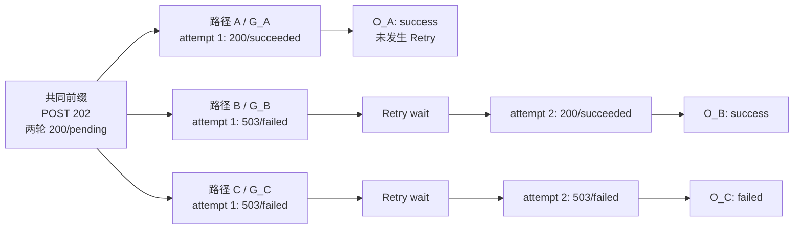

# 第 19 课：什么叫一次重试挽救

## 本课在事实链中的位置

第 18 课已经把异步图像生成拆成四层：Request Event 是一次物理发送，Request Group 是一次逻辑请求及其 Retry attempts，Polling Session 是多轮逻辑查询，Operation 是完整客户端业务动作。上一课还确认，HTTP 200、一次 Polling 成功和一次 Operation 成功不是同一个计数。

本课继续使用 Run 104 中的 Case C：

```text
run_id        = image-smoke-104-20260826T010000Z-a1b2c3d4
execution_id  = serial-pool
worker_id     = master
case_id       = module/smoke/test_图片生成异步调用.py::TestAsyncImageGeneration::test_f8_09_async_image_generation_task_succeeds_with_result
param_hash    = 74234e98afe7498f
invocation_id = inv-a93bbdf630847f96d91234b5
```

仓库中的这个 Case 确实调用标准异步入口 `create_and_poll_media_generation()`，但当前调用只传 `poll_interval` 与 `poll_timeout`，没有传 `retry_policy`。本课为了解释现有框架具备的 Retry 与 Metrics 能力，使用三条离线受控变体；它们不是某次真实 Run 104 的执行事实，也不证明外部媒体服务曾返回这些响应。

本课只回答“什么情况下可以把一次 Retry 解释为挽救”。第 20 课会继续追踪这些 Event 产生的 Token 与媒体用量，并处理缺失值。

---

## 核心问题

> 两个业务动作都发送了两次同样的 Polling GET：一个从 503 变成 200/succeeded，另一个连续得到两个 503。为什么只有前者可能叫“重试挽救”，而且为什么仍要检查整个 Operation 的最终结果？

答案不能只来自“发送次数增加了”。一次完整判断至少要同时回答：

```text
是否真的执行了 Retry？
→ 同一 Request Group 的首次与最终 Event 怎样变化？
→ 拥有该 Group 的 Operation 最终怎样结束？
```

这三个问题分别使用不同的事实，也拥有不同的统计分母。

---

## 从一个具体现象开始

### 固定共同前缀，只改变最后一轮查询

三条受控路径都先建立一个 `ASYNC_TASK/media_generation` Operation，完成相同的创建请求，再经过两轮单次发送的查询：

```text
G1：POST 创建任务 → HTTP 202，Event business_status=success
G2：GET 查询任务 → HTTP 200 / pending，Event business_status=unknown
G3：GET 查询任务 → HTTP 200 / pending，Event business_status=unknown
```

`pending` 是有效的等待态，却不是业务成功，所以 G2、G3 的 HTTP 层成功与 Event 业务状态 unknown 可以同时成立。随后只让最后一轮查询分叉。三个终局 Group 都配置 `RetryPolicy(max_attempts=2, base_delay=0.1, jitter=False, max_elapsed=None)`，共享 deadline 仍有余量；“首次成功”中的第二次 attempt 因而只是允许执行，并未实际发生。



`G_A`、`G_B`、`G_C` 以及其中的 `A1/B1/B2/C1/C2` 都是教学别名；生产 ID 由运行时生成。三条路径不是同一次真实 Case 调用的三段，而是同一输入身份下用于横向比较的三个受控变体。

### 先不计算比率，只记录各层事实

| 路径 | 最后一轮 Request Event | Request Group 事实 | Polling Session 终局 | Operation 终局 |
| --- | --- | --- | --- | --- |
| A：首次成功 | `A1=200/success` | `attempt_count=1`，没有实际 Retry | 观察 success，正常返回 | `success` |
| B：首败终成 | `B1=503/failed`，`B2=200/success` | `attempt_count=2`，首败终成 | 只对 B2 求值，观察 success | `success` |
| C：全部失败 | `C1=503/failed`，`C2=503/failed` | `attempt_count=2`，首尾都失败 | 对 C2 的显式 failed 状态求值并抛错 | `failed` |

B 与 C 都真实发送了两个终局查询 Event，也都发生了一次 Retry。发送次数相同，业务结构却不同：B 的最终 Event 与 Operation 都成功，C 的最终 Event 与 Operation 都失败。因此，“重试过”只能说明控制流重复发送过，不能说明它挽救了什么。

---

## 为什么原有解释不够

第 18 课解决了“一次 Retry attempt 是否应增加 Polling 轮数”：同一轮里的多个 Event 仍属于一个 Request Group。但知道归属关系以后，还有三个容易混淆的判断。

第一，**配置了 Retry 不等于发生了 Retry**。路径 A 的 `configured_max_attempts=2`，但首次响应已经成功，实际 `attempt_count=1`。它是首次成功，不是“重试挽救率为 0%”。对 A 单独计算 rescue 指标时，正确结果是没有 retried Group，因而 `sample_size=0`、`value=None`、`completeness=no_data`。

第二，**Group 首败终成不自动等于整个业务动作成功**。当前生产字段 `business_retry_rescue_rate` 只读取同一 Group 的首尾 Event，不接收 Operation 参数。一个较早阶段的 Group 可以首败终成，但后续 task ID 提取、Polling 或其他业务步骤仍可能失败。

第三，**Event 成功率与 Operation 成功率不能共享分母**。Retry 会增加物理 Event，却不增加这一次完整业务动作的数量。若把每个成功 Event 都当作一个成功业务动作，Retry 越多，分母和分子越会偏离真正的问题。

所以本课需要把“实际重试”“组内挽救”和“业务动作终局”分开，再规定它们怎样共同形成一个可审计结论。

---

## 核心概念

### 1. 实际重试集合：Retried Request Groups

实际重试集合是 `attempt_count > 1` 的 Request Group 集合，记为 `R`：

```text
G = 当前统计范围内的 Request Group 集合
R = {g ∈ G | g.attempt_count > 1}
```

它解决“哪些逻辑请求真的多发送过一次”这个问题。适用对象是已经结束的一条 Request Group；Group 本身在首次发送前开始，而“retried”分类只有在第二个 Event 实际出现后才成立。它与配置上限不同：`configured_max_attempts=2` 只是允许最多两次，`attempt_count=1` 才是路径 A 的实际事实。

### 2. 组内重试挽救：Retry Rescue at Request Group

组内重试挽救比较同一 retried Group 的首次 Event 与最终 Event。当前实现有两个口径：

```text
HTTP rescue:
  first Event 不是 HTTP success
  AND final Event 是 HTTP success

business rescue:
  first Event business_status = failed
  AND final Event business_status = success
```

它解决“Retry 是否改变了这一次逻辑请求的首尾结果”。该判断在 Group 结束、final Event 已确定后才成立，适用范围只是一条 Request Group；中间 attempt 不参与当前首尾判定，父 Operation 的最终 outcome 也不参与。

这里的 HTTP success 严格指 2xx。首次 `status_code=None` 也会被 `http_success()`判为 False，因此 HTTP rescue 更精确的说法是“首次不是 HTTP success、最终成为 HTTP success”，而不只是“首次收到非 2xx 响应”。

### 3. 业务动作挽救判定：Operation-level Rescue Audit

本课把“完整业务动作被挽救”定义为一个跨层审计条件：

```text
同一 Operation 内存在实际 retried Group
AND 该 Group 的首次业务结果为已知 failed
AND 该 Group 的最终业务结果为已知 success
AND 父 Operation 的最终 outcome = success
```

它解决“组内改善是否最终落到了完整业务动作成功”这个问题，范围是一条已经结束的 Operation。路径 B 满足四项；A 没有实际 Retry；C 的 Group 与 Operation 都没有成功。

这个名称用于教学推导。当前 Schema 没有 `operation_retry_rescue_rate` 字段，生产代码也没有一个函数直接联合 Group 与 Operation 输出该指标。现有事实足以做离线审计，却不能把这个推导冒充为框架已经产出的 Operation 指标；它也不能证明“如果不重试，业务一定失败”这种反事实因果。

---

## 完整运行过程

### T0：建立完整业务动作

标准入口在创建请求前建立外层 `ASYNC_TASK/media_generation` Operation。内层创建请求和 Polling scope 复用当前 Operation lease，因此相同 Case 调用仍形成一个完整业务 Operation，而不是每个 HTTP 请求各形成一个业务动作。

真实 Case C 没有传 `retry_policy`。在本课的受控变体里，策略只作为框架能力输入显式传给 Polling 查询；这一步不会改变真实 Case 的配置事实。

### T1：共同前缀产生已成功和未知的 Event

创建请求的 202 被普通 HTTP 规则记为 Event success。随后两个 200/pending 查询在传输层成功，但 PollingPolicy 将其映射为等待态，P0 Event 的 `business_status` 是 unknown。

到最终 Group 开始前，每条路径都拥有：

```text
1 个 create Event：business success
2 个 polling Event：business unknown
1 个仍未结束的 Operation
```

这些 pending Event 不能提前增加 Operation 成功数。

### T2：Retry executor 决定是否继续发送

路径 A 的首次 200 不属于可重试响应，executor 立即返回；Group 只有 A1。

路径 B 与 C 的首次 503 命中策略。在 attempts 上限、`max_elapsed` 和共享 deadline 均允许的前提下，executor 执行等待并建立 attempt 2。于是 G_B 和 G_C 都进入实际 retried 集合。它们的差异直到最终响应才出现：B2 是 200/succeeded，C2 仍是 503，并带有明确的 `status=failed` 教学响应体。

这里必须固定 C2 的业务状态和 deadline。若 C2 的响应体仍是 pending，Polling 会继续下一轮；若共享 deadline 先耗尽，Session 与 Operation 可能成为 timeout。不能把这些不同控制流统称为“最终失败”。

### T3：Collector 先完成 Group，再让 Polling 判断最终响应

每个 attempt 先形成自己的 Request Event。Group 结束时，Collector 保存有序的 `attempt_event_ids`，以第一个 Event 填充 first 字段，以最后一个 Event 填充 final 字段，并令 `attempt_count` 等于实际 Event 数。

Polling 状态机只接收这一轮逻辑请求的最终响应：

```text
路径 A：A1 → success → Session success
路径 B：B1 被 Retry 消化，B2 → success → Session success
路径 C：C1 被 Retry 消化，C2 → failure → PollingFailedError
```

因此，B1 与 C1 仍是可审计 Event，却不会各自形成一轮 Polling 状态观察。

### T4：Operation 以完整调用的控制流收尾

A 和 B 的 Polling 正常返回，外层 `operation_scope` 正常退出，O_A 与 O_B 为 success。C 的 `PollingFailedError` 向外传播，拥有该 Operation 的外层 scope 以 failed 收尾，O_C 为 failed。

Operation 结果不是成功 Event 数的投票。路径 B 有一个失败 Event，Operation 仍成功；路径 C 即使共同前缀已有三个 HTTP 2xx，Operation 仍失败。

### T5：按层选择分母

先只看三条分支的最终 Group，五个 Event 为：

```text
A: [success]
B: [failed, success]
C: [failed, failed]
```

由此可直接得到：

| 指标 | 分子 | 分母 | 结果 |
| --- | ---: | ---: | ---: |
| 终局切片 Event 业务成功率 | A1、B2，共 2 个 success Event | 5 个业务状态已知的 Event | `2/5 = 0.4` |
| 最终 Group 首次 HTTP 成功率 | G_A 的首次 Event | 3 个最终 Group | `1/3` |
| 最终 Group 最终 HTTP 成功率 | G_A、G_B 的最终 Event | 3 个最终 Group | `2/3` |
| Retry rate | G_B、G_C | 3 个最终 Group | `2/3` |
| HTTP retry rescue rate | G_B | 2 个实际 retried Group | `1/2` |
| Business retry rescue rate | G_B | 2 个首尾业务状态均已知的 retried Group | `1/2` |
| Operation success rate | O_A、O_B | 3 个 Operation | `2/3` |

“终局切片”是为了把三条分叉并排解释，不是生产 bucket 的名称。生产 bucket 按 interface、protocol 和 traffic role 分区；若把每条路径共同的两个 200/pending Group 也纳入相同 Polling 接口范围，则共有 11 个 Event 和 9 个 Group：

```text
按 2xx 教学派生的 Event HTTP 比例 = 8 / 11
Event business_success_rate        = 2 / 5 known
                                       + 6 unknown
Polling Group retry_rate           = 2 / 9
Group HTTP retry rescue rate       = 1 / 2
Group business retry rescue rate   = 1 / 2
Operation success_rate             = 2 / 3
```

当前 Request Event summary 没有名为 `http_success_rate` 的字段；`8/11` 是依据 transport 计数作出的本课派生比例。生产 `request_events.business_success_rate` 则明确排除六个 unknown，所以其 `sample_size=5`、`unknown_count=6`、completeness=partial。Operation success 对三个 Operation 各产生一个 True/False，因此分母始终是 3。

这就是三种“成功率”不能混成一个指标的具体原因：派生 Event HTTP 2xx 比例观察 11 次物理发送；`request_events.business_success_rate` 只观察 5 个业务状态已知的 Event，并另记 6 个 unknown；`operations.success_rate` 观察 3 个完整 Operation。分子与分母必须属于同一层，不能拿 11 个 Event 去除 2 个成功 Operation。

---

## 正常路径

### 首次成功不是一次挽救

路径 A 的输入是一个允许最多两次 attempt 的策略，以及首次即返回 200/succeeded 的最终查询。执行过程在 A1 后停止，没有 Retry wait，也没有 A2。

```text
G_A.configured_max_attempts = 2
G_A.attempt_event_ids       = [A1]
G_A.attempt_count           = 1
O_A.outcome                 = success
```

这条路径能够形成两个结论：逻辑请求首次成功，完整业务动作成功。它不能形成“被 Retry 挽救”的结论，因为 `attempt_count > 1` 不成立。

若统计范围只有 G_A，当前 `ratio_aggregate()`收到的是空 rescue 观察集合，结果为：

```text
numerator    = 0
sample_size  = 0
unknown_count= 0
value        = null
completeness = no_data
```

`null/no_data` 表示没有适用的 retried Group，不是挽救率 0%，也不是缺失被补成零。

---

## 复杂路径

### 路径一：相同两次发送，只有一条被挽救

B 与 C 是最小对照：method、接口、最多 attempts、实际发送数和 Retry wait 次数都相同，只改变最终响应。

| 对比项 | B：首次失败后最终成功 | C：所有尝试最终失败 |
| --- | --- | --- |
| 输入 | 503/failed → 200/succeeded | 503/failed → 503/failed |
| 实际 Event 数 | 2 | 2 |
| `attempt_count` | 2 | 2 |
| Group HTTP rescue | True | False |
| Group business rescue | True | False |
| Polling 看到的最终状态 | success | failure |
| Operation outcome | success | failed |
| 完整业务动作挽救审计 | 可以成立 | 不成立 |

两条路径拥有相同请求数量，却得到不同业务结果。这直接排除了“只要发送了第二次就算挽救”的算法。

### 路径二：HTTP 恢复，但业务仍是 unknown

把 B2 从 200/succeeded 改为 200/pending，其他条件不变：

```text
B1 = 503 / business failed
B2 = 200 / business unknown
```

对该 retried Group，HTTP 首尾为失败到成功，所以 `http_retry_rescue_rate=1/1`。但 business pair 是 `False, None`，`business_retry_rescue_rate` 得到：

```text
numerator     = 0
sample_size   = 0
unknown_count = 1
value         = null
completeness  = no_data
```

Polling 随后还需继续下一轮。即使后续 Operation 最终成功，也不能把当前 G 的 200/pending 改写成已知业务 success。第 18 课的受控主路径正有一组 503→200/pending；它证明的是 HTTP Group 恢复，不是当前 Group 业务 rescue 已成立。

### 路径三：Group 被挽救，外层 Operation 仍可能失败

当前 Group 指标不读取 Operation。考虑框架允许的另一条受控路径：自定义 create callback 使用具备资格的 POST Retry，创建 Group 从 503 变为 202，因此 Group 的 HTTP 与普通 HTTP 业务分类都首败终成；随后 `extract_task_id()` 因最终响应缺少 task ID 抛出异常。此时外层 async Operation 是 failed。

这条路径只说明当前职责边界：

```text
Group business rescue = True
Operation outcome     = failed
完整业务动作挽救      = 不成立
```

真实 Case C 使用默认 create，当前没有为 create 传 Retry 策略；这里是框架能力的边界案例，不是该 Case 已发生的事实。它也再次说明，生产 `business_retry_rescue_rate` 的“business”仍然是 Event 业务分类，不是 Operation 终局。

### 路径四：记录缺失不能被归为失败或未挽救

若 Group 引用的 Event 缺失，Metrics 源校验会拒绝该输入；若观察 Hook 没有建立 Group 或 Operation，也不会自动合成一条 unknown 记录。此时不能把缺失样本加入失败分母，更不能报告“0 次挽救”。

explicit `business_status=unknown` 与记录完全缺失是两件事：前者由 `ratio_aggregate()`计入 `unknown_count`；后者属于证据链或完整性问题，需要原样保留失败或 degraded 范围。

---

## 对应的框架实现

概念、时间线和分母已经确定，再对应到生产代码。

### 1. Retry 是否实际发生，由 attempt_count 判断

`quality/metrics/request_group.py:31-46` 先取首尾 Event，再筛选实际 retried Group：

```python
first_events = tuple(events[item.attempt_event_ids[0]] for item in groups)
final_events = tuple(events[item.final_request_event_id] for item in groups)
retried = tuple(item for item in groups if item.attempt_count > 1)
business_pairs = tuple(
    (
        business_success(events[item.attempt_event_ids[0]]),
        business_success(events[item.final_request_event_id]),
    )
    for item in retried
)
```

输入是已经通过关系校验的 Group 与 Event 映射。输出中的 `retried` 只含实际多 attempt 的 Group；配置上限、曾经可重试或计划等待都不能代替 `attempt_count > 1`。若 Event 引用缺失，校验阶段会失败，而不是让这里补一条假 Event。

### 2. 两种 rescue 都只比较 Group 首尾

同一函数在 `quality/metrics/request_group.py:66-82` 计算：

```python
first_http_success_rate=ratio_aggregate(
    http_success(item) for item in first_events
),
final_http_success_rate=ratio_aggregate(
    http_success(item) for item in final_events
),
http_retry_rescue_rate=ratio_aggregate(
    (not http_success(events[item.attempt_event_ids[0]]))
    and http_success(events[item.final_request_event_id])
    for item in retried
),
business_retry_rescue_rate=ratio_aggregate(
    None if first is None or final is None else (not first and final)
    for first, final in business_pairs
),
```

HTTP 输入来自首尾 status code，业务输入来自首尾 `business_status`。输出是两个 Group 层比率。中间 attempts 不参与当前 rescue 布尔值；函数也没有读取父 Operation，所以它不能给出 Operation-level rescue。

### 3. unknown 保留在计数中，但不进入已知分母

`quality/metrics/request_event.py:92-99` 与 `quality/metrics/primitives.py:83-105` 的关键规则是：

```python
def business_success(event: RequestMetric) -> bool | None:
    if event.business_status is BusinessStatus.UNKNOWN:
        return None
    return event.business_status is BusinessStatus.SUCCESS

def ratio_aggregate(values: Iterable[bool | None]) -> RatioAggregate:
    observations = tuple(values)
    known = tuple(value for value in observations if value is not None)
    numerator = sum(value is True for value in known)
    sample_size = len(known)
    unknown_count = len(observations) - sample_size
    value = None if sample_size == 0 else round(numerator / sample_size, 6)
    # 后续代码还据此设置 no_data、partial 或 complete
```

输入 `True, False, None` 会得到分子 1、已知分母 2、unknown 1，而不是 1/3。状态缺失不能通过这段代码变成 `None`；只有一条已经存在且明确标成 unknown 的 Event 才会走这个分支。

### 4. Operation 成功率使用完整业务动作集合

`quality/metrics/operation.py:40-59` 只读取每个 Operation 的最终 outcome：

```python
def operation_stability(
    operations: Sequence[OperationRecord],
) -> OperationStability:
    return OperationStability(
        operation_count=len(operations),
        outcomes=count_distribution(item.outcome.value for item in operations),
        success_rate=ratio_aggregate(
            item.outcome is OperationOutcome.SUCCESS for item in operations
        ),
        timeout_rate=ratio_aggregate(
            item.outcome is OperationOutcome.TIMEOUT for item in operations
        ),
        incomplete_or_unknown_count=sum(
            item.outcome in {OperationOutcome.INCOMPLETE, OperationOutcome.UNKNOWN}
            for item in operations
        ),
        record_completeness=count_distribution(
            item.completeness.value for item in operations
        ),
    )
```

输入是当前范围内的 workload Operations。每条 Operation 都产生一个 True 或 False，因此 unknown、incomplete、timeout 和 failed outcome 都仍在成功率分母中，只是不会进入成功分子。输出没有 rescue 字段。

`quality/metrics/builder.py:55-112` 会先过滤 `traffic_role=workload`，再分别聚合 Operations、Groups 和 Events。这保证控制流量不进入 workload 分母，却不意味着缺失的 workload 记录能被自动发现或补齐。

### 5. 最终失败怎样从 Retry 传播到 Operation

`common/retry_executor.py:73-109` 在两次 503 后达到 attempts 上限，会返回最后一个响应。随后 `common/base_request.py:492-538` 才对该响应执行 Polling 状态求值；本课 C2 的响应体明确映射为 failure，所以抛出 `PollingFailedError`。`common/runtime_hooks/observer.py:110-137` 把它映射为 Polling failure 与 Operation failed，异常仍继续向调用者传播。

输入若改成 pending、unknown 或 deadline 耗尽，会分别继续轮询、抛未知状态异常或走 timeout；因此正文的 C 路径只对固定的 failed 响应成立。

### 6. 当前 Schema 没有 Operation rescue 字段

`quality/metrics_models.py:289-328` 的 Operation 指标只有 outcome 分布、success/timeout rate、完整性、时间和用量；`344-358` 才在 RequestGroupStability 中定义两个 retry rescue rate。

所以当前可保存并关联的是：

```text
Request Group：首尾 Event、attempt_count、Group rescue 聚合输入
Operation：request_group_ids、最终 outcome、Operation success rate
```

把二者联合成“完整业务动作挽救”需要额外审计查询或未来新增正式指标。当前实现没有发布这个结果，课程也不把教学判断写成现成功能。

---

## 能够保证什么

在输入记录通过校验且统计范围明确时，当前实现能够保证：

1. `attempt_count > 1` 的 Group 才进入 retried 集合；首次成功但配置允许 Retry 的 Group 不进入 rescue 分母。
2. HTTP rescue 对每个实际 retried Group 比较首 Event 是否非 HTTP success、最终 Event 是否 HTTP success，分母是全部实际 retried Group。
3. Business rescue 对每个实际 retried Group 比较首尾已知业务分类；任一端 unknown 时该观察进入 `unknown_count`，不进入已知分母。
4. Operation success rate 只按 workload Operation 的最终 outcome 计算，Retry 产生的额外 Event 不会增加 Operation 分母。
5. 对本课受控三路径，终局 Group 投影可复现 Event 业务成功率 2/5、HTTP 与 business rescue 1/2；三个 Operation 可复现成功率 2/3。
6. B 与 C 都发送两个终局查询 Event，但只有 B 得到 Group 首败终成和 Operation success；相同请求数不会强迫业务结论相同。

---

## 保证成立的前提

- pytest 已建立正确的 Run、Execution、Worker、Case 与 Invocation 上下文；本文固定身份只是教学连续性标识，不代表外部执行已经发生。
- `QUALITY_ENABLE=1`、`QUALITY_SEMANTIC_ENABLE=1`，P0 Collector、Semantic Collector 与 Runtime Hooks 已正确绑定。
- 调用经过标准异步入口或显式建立等价 Operation scope；直接调用 `requests.*` 不会自动产生本课完整语义。
- RetryPolicy 对当前 method 有资格，503 位于 `retry_statuses`，attempts、`max_elapsed` 与共享 deadline 允许下一次实际发送。
- PollingPolicy 能把本课响应体中的 pending、succeeded 与 failed 映射为对应标准状态；C2 必须是明确 failure 且 deadline 尚未先耗尽。
- Group、Event 与 Operation 关系通过 Metrics 源校验，输入属于 workload 范围；生产 bucket 的 interface、protocol 与 traffic role 范围必须在解释比率时一并声明。
- 要把跨层审计结果称为“完整业务动作挽救”，必须同时取得 Group 首尾已知业务状态和父 Operation 最终 success；缺任一证据都保持未知。
- 当前真实 Case C 没有传 RetryPolicy。本课三路径、短别名、响应体和等待均为离线受控输入，外部履约需要独立证据。

---

## 不能保证什么

1. **发生 Retry 不保证发生挽救。** C 有两个 attempts，但首尾都失败。
2. **首次成功不等于挽救率 0%。** 没有 retried Group 时，当前 rescue 指标是 no_data，不是零。
3. **HTTP rescue 不保证业务 rescue。** 503→200/pending 在 HTTP 层首败终成，业务终局仍 unknown。
4. **Group business rescue 不保证 Operation 成功。** 当前公式不读取父 Operation，后续步骤仍可失败。
5. **Operation 成功不证明某次 Retry 是必要原因。** 现有记录描述观察到的顺序，不能证明没有 Retry 时必然失败，也不能排除服务端随后自行恢复。
6. **当前没有 Operation-level retry rescue 指标。** 跨层条件是可审计推导，不是现有 Schema 字段，也不能声称 run-metrics 已输出该比率。
7. **Event 数不能替代 Operation 数。** 本课完整 Polling 接口有 11 个 Event、三个 Operation；把二者混成一个分母会产生没有语义的比例。
8. **unknown 不能当失败、零或成功。** Event 的 explicit unknown 进入 `unknown_count`；完全缺失的记录则属于完整性问题，不能自动合成 unknown。
9. **首尾比较不描述所有中间 attempts。** 当前 rescue 布尔值只看第一个与最终 Event，中间失败类型、等待成本和状态变化需要回到原始 Event/Group 事实。
10. **客户端 outcome 不证明外部服务履约。** 它不证明任务只执行一次、没有副作用、服务端内部状态真实，也不替代幂等契约。
11. **记录 complete 不等于业务 success。** 路径 C 的 Event、Group、Session 和 Operation 关系可以结构完整，同时 Operation outcome 仍是 failed。
12. **测试与离线探针不等于真实运行。** 它们只证明覆盖范围内的预期和给定受控输入下的当前计算结果。

本课的核心结论是：**“重试挽救”不是第二次请求发生了，而是同一逻辑请求观察到首败终成，并且在讨论完整业务动作时还必须确认父 Operation 最终成功；Event、Group 与 Operation 各有自己的权威分母。**

---

## 与下一课的关系

本课已经把 Retry 增加的物理发送、Group 首尾改善和 Operation 最终成功分开，并保留 unknown 与无适用样本的差异。

下一课将追踪这些首次与重试 Event 各自产生的 Token、媒体数量与时长：哪些用量能归属到 Group 和 Operation，哪些字段缺失时必须保留 unknown 或覆盖范围，而不能补成零。
