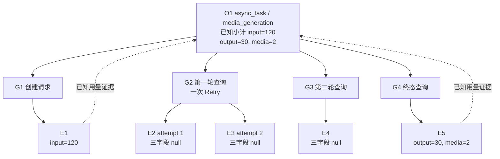

# 第 20 课：Token、媒体用量与缺失语义

## 本课在事实链中的位置

第 19 课把“实际发生 Retry”“同一 Request Group 首败终成”和“整个 Operation 最终成功”分开了。那一课留下的最后一个问题是：Retry 增加了一次物理发送以后，这些 Request Event 报告的 Token 与媒体用量应当归给谁；某些响应没有用量字段时，又该怎样解释总数。

本课继续使用 Run 104 中的 Case C：

```text
run_id        = image-smoke-104-20260826T010000Z-a1b2c3d4
execution_id  = serial-pool
worker_id     = master
case_id       = module/smoke/test_图片生成异步调用.py::TestAsyncImageGeneration::test_f8_09_async_image_generation_task_succeeds_with_result
param_hash    = 74234e98afe7498f
invocation_id = inv-a93bbdf630847f96d91234b5
```

仓库中的这个 Case 确实经过标准异步入口 `create_and_poll_media_generation()`，但它当前只传 `poll_interval` 与 `poll_timeout`，没有传 `retry_policy`。为延续第 17、18 课已经建立的四层关系，本课仍使用那条离线受控变体：第一轮 Polling GET 内发生一次 Retry，形成 `O1/P1/G1～G4/E1～E5`。本课只在既有响应中增加几个受控 `usage` 与媒体结果字段；数值不是某次 Run 104 的实测数据，也不证明外部媒体服务会返回这些字段。

本课只回答一个核心问题：**当一次异步 Operation 的部分 Event 有用量、部分 Event 没有用量时，当前框架怎样保留归属、已知小计和缺失边界，而不把未知补成零。** 第 21 课将转向跨 Run 的 Case 历史，讨论单次失败为什么不能说明 Flaky。

---

## 核心问题

> 同一个 `media_generation` Operation 有五次物理发送：创建响应报告了 120 个输入 Token，终态响应报告了 30 个输出 Token和两个媒体结果，其余三个 Event 没有任何用量字段。为什么可以报告已知小计 `120/30/2`，却不能说“另外三个 Event 的用量都是 0”，也不能说媒体生成时长已经被测得？

要回答这个问题，至少需要依次确认四件事：

```text
响应里实际出现了哪些可接受字段？
→ 这些字段属于哪个 Request Event？
→ Event 通过哪个 Request Group 归入哪个 Operation？
→ 聚合结果怎样同时携带已知值、证据 Event 与缺失范围？
```

状态码、业务成功、Retry 次数都不能替代这些判断。一次 200 响应可以没有任何 Token；一次 503 也不能据此推断资源消耗为零；Operation 成功只说明客户端业务控制流正常结束，不会自动补全用量。

---

## 从一个具体现象开始

### 给既有五 Event 时间线叠加受控用量

本课不改变第 17、18 课的请求拓扑，只增加以下响应字段：

```text
E1 / G1：POST 202
  body.task_id = job-101
  body.usage.prompt_tokens = 120

E2 / G2 attempt 1：GET 503
  无 usage

E3 / G2 attempt 2：GET 200 / status=pending
  无 usage

E4 / G3 attempt 1：GET 200 / status=pending
  无 usage

E5 / G4 attempt 1：GET 200 / status=succeeded
  body.usage.completion_tokens = 30
  body.result.urls = [a.png, b.png]
```

`E1～E5` 仍只是教学别名，生产 `request_event_id` 由运行时生成。五个 P0 Event 的用量事实为：

| Event | `input_tokens` | `output_tokens` | `media_count` | 说明 |
| --- | ---: | ---: | ---: | --- |
| E1 | 120 | `null` | `null` | `prompt_tokens` 被规范化为 input |
| E2 | `null` | `null` | `null` | 首次 GET 没有用量证据 |
| E3 | `null` | `null` | `null` | Retry Event 也没有用量证据 |
| E4 | `null` | `null` | `null` | pending 响应没有用量证据 |
| E5 | `null` | 30 | 2 | `completion_tokens` 被规范化为 output；两个 URL 计为两个媒体结果 |

Request Event 模型没有 `media_duration_ms` 字段，所以表中不能再加一列“媒体时长 0”。当前生产链只在 Operation Schema 中预留了该字段，没有把响应中的任何值采集到它；它在本例中只能保持 `null`。

### 同一批事实有三种不同视图



图中的实线是业务归属：Group 用 `attempt_event_ids` 引用 Event，Operation 再引用 Group。虚线是用量证据：当前 Operation 记录 `[E1,E5]` 为 `source_request_event_ids`，已知数值分别相加。E2、E3、E4 仍然存在于业务拓扑中，却不会因为字段缺失而被改写成三个零值样本。

生产 Request Event bucket 按 `interface_id + protocol + traffic_role` 分区，因此不会把五个 Event 强行塞入一个桶：POST 桶 `[E1]` 的用量 Event 覆盖是 known 1、missing 0；Polling GET 桶 `[E2,E3,E4,E5]` 是 known 1、missing 3。Operation 视图跨越这些 Group，才得到同一个 O1 的已知小计 `120/30/2`。

这里出现了本课最重要的现象：O1 当前会被标为 `usage.completeness=complete`，同时 `media_duration_ms=null`，Polling Event 覆盖仍是 `1 known + 3 missing`。三者并不矛盾，因为它们回答的问题不同；后文将给出 `complete` 的精确实现含义。

---

## 为什么原有解释不够

第 17 课已经证明 E2 与 E3 同属 G2，第 18 课已经证明它们只构成一轮 Polling，第 19 课又证明“发生 Retry”不等于“业务被挽救”。这些结论仍不足以解释用量，原因有四个。

第一，**结果事实与资源事实彼此独立。** E2 的 503 是传输/HTTP 结果，E3 的 pending 是业务等待态；两者都没有说明 Token 是 0。外部服务可能没有消耗资源，也可能消耗了资源却没有返回字段，还可能返回了当前解析器不支持的形状。仓库只能把后两种情形都保留为未知，不能选择一个较方便的零值。

第二，**Group 只提供归属边界，不发布总用量。** 当前 `RequestGroupRecord` 保存 `attempt_event_ids`、`attempt_count`、首尾状态和时间，没有 `usage` 字段。后置 Request Group bucket 提供的是 first/retry 拆分的 `retry_usage`，也不是每个 Group 的权威总量。若课程写出 `G2.usage=0`，就同时虚构了字段和数值。

第三，**已知小计不自动等于真实总消耗。** O1 的 120、30、2 是当前解析器从 E1、E5 找到的值之和。E2～E4 的未知没有进入求和，所以正确名称是“已知用量之和”。只有外部契约进一步保证每个响应都完整报告本次增量，才能把这个和解释成真实总量；仓库当前不能证明该契约。

第四，**媒体数量与媒体时长不是同一事实。** E5 的两个 URL 支持 `media_count=2`，却不包含每个媒体的持续时间。Polling Session 的 600 ms、Operation 的 750 ms 都是客户端观察窗口，包含网络、Retry、Polling sleep 和本地衔接，不能替代生成内容的媒体时长。

因此，本课不能只教一个 `sum()`。完整模型必须同时保留字段来源、业务归属、适用范围和缺失语义。

---

## 核心概念

### 1. Event 用量事实：只记录响应明确提供的已知值

Event 用量事实是一次物理发送结束时，当前解析器从该响应中取得的三个可空值：

```text
U(E) = (input_tokens?, output_tokens?, media_count?)
```

问号表示值可以为 `None`。输入 Token 支持 `input_tokens/prompt_tokens` 两组名称，输出 Token 支持 `output_tokens/completion_tokens`；只接受非布尔、非负整数。媒体数量来自受支持的显式结果结构，不从请求参数或状态码推算。

`None` 与 `0` 的判断依据不是“看起来有没有工作量”，而是响应是否给出了一个被解析器接受的值：

```text
字段缺失                 -> None，未知
字段值为负数、字符串或布尔 -> None，当前解析器不接受
字段显式为整数 0          -> 0，已知零
字段显式为正整数          -> 对应已知值
```

这一区分发生在 Event 创建时。后置聚合不应重新猜测响应含义。

### 2. Operation 用量证据与已知归并

Event 先通过 Group 的显式引用归属到 Operation。对本课非 SSE 的 async media 路径，Operation Collector 再按 RequestMetric 字段构造两类证据集合：

```text
source_request_event_ids  = 至少有一个已知用量字段的 Event
missing_request_event_ids = 按当前 Operation 规则被标记为缺失的 Event
```

已知归并对四个 Operation 字段分别求和；其中前三项可能来自 Event，`media_duration_ms` 当前没有采集来源：

```text
known_sum(field, O)
  = Σ Event 中该 field 已知的值
```

这个公式不会把 `None` 当 0 加进去。它也不验证外部值是逐 Event 增量还是重复出现的累计量，因此结果必须带着“已知”和“当前响应语义”的边界。

SSE 是另一条采集路径：P0 RequestMetric 不读取流响应体，用量可以来自后续 stream chunk；流结束时，最后一个 SSE Request Event ID 被用作这份流式用量的归属锚点。因此在通用模型中，source ID 不必表示三个用量值直接写在该 RequestMetric 上。本课主案例不是 SSE，后续计算均使用前述非流式规则。

Request Group 在这里仍是第 17 课已有的归属概念：`G2=[E2,E3]` 证明 E3 是同一逻辑 GET 的 Retry Event。当前框架可以按 `attempt_index` 把已知 source Event 投影为 first/retry 用量，但没有额外创造 `G2.usage_total`。

### 3. 覆盖与缺失语义：数值、证据完整度和适用性分开表达

当前产物使用多种精确状态，而不是一个统一的 `usage=unknown` 字段：

| 表达 | 所在层 | 含义 |
| --- | --- | --- |
| `null` | Event/Operation 字段 | 该字段没有当前已知值 |
| `complete/partial/missing` | Operation `UsageCompleteness` | 按当前 source/missing Event 规则描述证据状态 |
| `no_data` | 数值聚合 `MetricCompleteness` | 当前字段没有可聚合的已知样本 |
| `not_applicable` | Operation 或数值聚合 | 该对象按规则不应计算该用量 |
| known/missing Event count | Request Event bucket | bucket 中至少有一个用量字段的 Event 数与三字段全空的 Event 数 |

这些词不能互换。`not_applicable` 不是“采集失败”，`no_data` 不是数值 0，Operation `complete` 也不是“四个字段全部非空”。解释任何一个数字时，都必须同时声明观察层和覆盖口径。

---

## 完整运行过程

### T0：标准入口建立正确的外层归属

`create_and_poll_media_generation()`先建立 workload `ASYNC_TASK/media_generation` Operation O1。内部创建 HTTP scope 与 Polling scope发现已有活动 Operation，复用 O1 而不再创建独立顶层 Operation。这样，POST 创建与后续 GET 查询才会共同归入一次异步业务动作。

这一步依赖 pytest Case Context、P0/Semantic Collector 与 Runtime Hooks 已经绑定。缺少 Case Context 时，P0 RequestMetric 会被跳过并记录 integrity issue；系统不会伪造一条 `unknown` Event。若调用者直接使用 `requests.*`，也没有标准 middleware 帮它建立本课的证据链。

### T1：每次实际发送先形成自己的 Event 用量

默认 Runtime Observation middleware 在发送前为当前 RequestContext 建立 `request_event_id` 和起始时刻。收到响应后，`record_response()`解析协议、状态、耗时与 response JSON，并构造 `RequestUsage`。

在本课受控输入中，状态依次变化为：

```text
E1 response -> 读取 prompt_tokens=120
E2 response -> 未找到三个用量字段
E3 response -> 未找到三个用量字段
E4 response -> 未找到三个用量字段
E5 response -> 读取 completion_tokens=30，result.urls 长度=2
```

每个 Event 的输出是自己的三个可空字段。E1 不会预先知道 E5 的媒体结果，E5 也不会被反向补上 E1 的输入 Token。

### T2：Group 绑定保证 Retry Event 不漂移

G2 在 Retry executor 外只建立一次。E2 和 E3 各自拥有新 RequestContext 与新 Event ID，但都绑定同一个 Group lease，并分别记录 `attempt_index=1/2`。Group 完成后保存：

```text
G2.attempt_event_ids      = [E2, E3]
G2.final_request_event_id = E3
G2.attempt_count          = 2
G2.operation_id           = O1
```

这组引用证明 E3 是 G2 的 Retry attempt，并证明两个 Event 属于 O1。它不宣称 E2 或 E3 的用量为零。

### T3：Group 完成时把 Event 交给 Operation

Semantic Collector 完成一个 Group 时，会把该 Group 的 Event 列表追加到仍在进行的 Operation。O1 依次收到 E1、E2、E3、E4、E5，并保存 G1～G4 的引用。Operation 结束以前，用量仍只是待归并的 Event 事实。

如果 Group 没有任何 P0 RequestMetric，Collector 会记录 `request_group_without_metrics`，把 Operation 标为 incomplete，并且不会虚构一个全零 Group 记录。这是记录缺口，不是零用量证据。

### T4：Operation 结束时归并已知字段

O1 是 `ASYNC_TASK` 且 role 为 workload，适用于用量归并。Collector 遍历五个 Event：E1 与 E5 至少有一个用量字段，因此成为 source；E2～E4 三字段全空。

当前 async 规则不会逐个把空 Event 放进 missing IDs。因为已经存在 source，最终得到：

```text
O1.usage.input_tokens              = 120
O1.usage.output_tokens             = 30
O1.usage.media_count               = 2
O1.usage.media_duration_ms         = null
O1.usage.source_request_event_ids  = [E1, E5]
O1.usage.missing_request_event_ids = []
O1.usage.completeness              = complete
```

这里的 `complete` 只表示“至少有已知字段，并且按 async 当前规则没有 missing Event ID”。它没有检查四个字段是否全有值，也没有证明 E2～E4 对真实资源消耗不重要。

### T5：后置门禁验证归属关系

Metrics loader 不只读取一个总数。关系校验会确认 Group 引用的 Event 存在、attempt index 连续、接口身份匹配；一个 Event 不能属于多个 Group；Operation 引用的 Group 必须存在并属于该 Operation。对于 usage evidence，还会拒绝 known/missing ID 重叠、Event 位于 Operation 之外或同一 usage Event 被多个 Operation 占用。

当前这一步的 `require_identity_match()`重新核对的是 run、case、invocation，加上显式引用关系；不能把它扩写成在 Metrics 阶段再次验证全部五级字段的每一项。Execution 与 Worker 仍存在于源记录，运行期正确传播和上游门禁仍是前提。

### T6：Metrics 按粒度发布不同覆盖信息

Event bucket 按接口、协议和 traffic role 分区。它把三字段任一已知的 Event 计为 known，把三字段全空的 Event 计为 missing。因此本例 Polling GET bucket 是：

```text
known_event_count   = 1   # E5
missing_event_count = 3   # E2, E3, E4
```

Operation bucket 对 O1 的四个字段分别聚合。前三项有一条 Operation 样本，已知小计为 120、30、2；媒体时长没有任何已知样本，结果为 `total=null, completeness=no_data`。与此同时，Operation usage completeness 分布仍是 `complete: 1`，known source Event 数是 2。

每个用量字段的 helper 会先过滤 `None` 再建立 `NumericAggregate`。因此其 `eligible_count` 已经缩成已知样本数量，字段级 `missing_count=0` 不能解释为原始 Event 没有缺失。真正的覆盖说明需要把数值聚合与 Event known/missing count、Operation source/missing IDs、completeness 分布一起读。

---

## 正常路径

### 输入、判断、状态变化与输出

本课正常路径的输入是：标准异步入口、正确 Case Context、启用的真实 Runtime Hooks，以及前述五个受控响应。处理过程不推测任何缺失字段，只接受明确的非负整数和受支持媒体结果。

| 阶段 | 输入 | 判断 | 状态变化 | 输出 |
| --- | --- | --- | --- | --- |
| Event 采集 | E1 `prompt_tokens=120` | 非负整数，支持的别名 | E1 成为 known usage Event | `input_tokens=120` |
| Event 采集 | E2～E4 无 usage | 没有可接受字段 | 三个 Event 保持三项 `null` | 不生成零值 |
| Event 采集 | E5 `completion_tokens=30`、两个 URL | Token 合法；结果列表长度为 2 | E5 成为 known usage Event | `output=30, media=2` |
| Group 归属 | G2 引用 E2、E3 | attempt index 为 1、2 | E3 被识别为 Retry Event | 只建立归属，不生成 Group 总量 |
| Operation 归并 | O1 拥有五个 Event | E1、E5 任一字段已知 | source IDs 变为 `[E1,E5]` | 已知小计 `120/30/2` |
| Metrics | workload O1 与两个接口 bucket | 按粒度分区并过滤未知字段 | 保存数值及覆盖信息 | Polling 覆盖 `1 known/3 missing`；时长 `no_data` |

最终可以形成的完整陈述是：

> 在本课受控 O1 中，当前解析器从 E1 与 E5 观察到输入 Token 120、输出 Token 30、媒体结果 2，因而 Operation 的已知小计为 `120/30/2`。Polling GET bucket 的四个 Event 中只有 E5 含任一用量字段，另三个 Event 的用量未知。当前链路没有媒体内容时长来源，所以该字段为 `null/no_data`。

这段话没有把缺失变成零，也没有把已知小计升级为外部计费真相。它同时说明值、来源、分母与限制，能够被 Event ID 和 Operation 引用关系复核。

### Request Group 在正常路径中的准确作用

对 Polling 接口的 Request Group bucket，当前实现会从 Operation 的 source Event 中筛出属于桶内 Group 的 Event，再按 `attempt_index==1` 或 `>1` 分成 first/retry。E5 是首次 attempt，所以已知 output 30 与 media 2 落在 first 部分；E3 虽是 Retry Event，却没有用量 source。

因此，不能把“retry 用量没有已知样本”写成“Retry 消耗 0”。对本例完整 Polling 接口 bucket，first 部分从 E5 得到 output 30、media 2，E5 缺少的 input 为 `no_data`；source 集合中没有 `attempt_index>1` 的 Event，所以三个 retry 数值聚合都是 `not_applicable`。G2 的 `[E2,E3]` 原始引用才保留了两次发送事实。当前 `retry_missing_attempt_count=0` 也依赖 Operation missing IDs，而 async 规则没有逐 Event 标记这三个空值，所以这个 0 不构成 G2 用量覆盖的穷尽证明。

---

## 复杂路径

### 路径一：显式 0 与缺失得到相同小计，却不是同一事实

只改变 E3：让 Retry 响应显式返回 `usage.prompt_tokens=0`，其余输入不变。

```text
原路径 E3：input_tokens = null
新路径 E3：input_tokens = 0
```

两条路径的 Operation input 已知小计都是 120：

```text
原路径：120
新路径：120 + 0 = 120
```

数字相同，证据状态不同。新路径中 E3 成为 source Event，O1 的 source IDs 从 `[E1,E5]` 变为 `[E1,E3,E5]`；Polling bucket known Event 从 1 增为 2，missing Event 从 3 减为 2；Group retry 投影也拥有一条值为 0 的已知 input 样本。

这个对照说明，不能通过最终 total 反推覆盖。`null` 与 0 即使对加法结果贡献相同，前者表示不知道，后者表示响应明确报告了已知零。

### 路径二：整个 async Operation 都没有用量

只改变用量字段：E1 和 E5 也不再提供 Token 或媒体结果，其余业务状态仍让 O1 正常返回。当前 smoke Case 会在 Operation 返回后继续断言输出存在，因此这个受控变体最终会让 Case 失败；它只用于解释 Collector 的“全部用量缺失”边界，不是一个通过的 Case 变体。

此时五个 Event 的三项用量全部是 `null`。当前 async fallback 只把最后一个已附着 Event 放入 missing IDs：

```text
input_tokens              = null
output_tokens             = null
media_count               = null
media_duration_ms         = null
source_request_event_ids  = []
missing_request_event_ids = [E5]
completeness              = missing
```

E5 只是当前列表的最后一个 Event；该规则没有证明 E1～E4 不缺，也没有证明 E5 是外部计费权威。Metrics 会把 workload O1 归入 `usage_incomplete`，状态在没有更早失败的前提下降为 degraded；字段聚合为 `no_data`，而不是 total 0。Operation outcome 仍可以是 success，因为业务成功与用量完整是两个维度。

### 路径三：绕开标准异步入口改变归属

只改变调用入口：不使用外层 `create_and_poll_media_generation()`，而是分别调用一次普通 POST 和一次独立 `poll_get()`。

普通 POST 会拥有自己的 HTTP Operation；独立 `poll_get()`会建立 `POLLING` Operation。当前 `_build_operation_usage()`把独立 Polling Operation 标为 `not_applicable`，即使终态 Request Event 自身解析出了 `media_count=2`，也不会把它归并为那个 Polling Operation 的适用用量。两个独立 Operation 又没有证据表明共同构成一次 async task。

这不是数值丢失后的补救问题，而是业务拓扑已经改变。只有标准入口或显式建立的等价外层 Operation scope，才能让创建与查询 Event 共享 O1。直接调用 `requests.*`、移除默认 observation middleware，或者在线程中丢失 ContextVar，还可能让 Event、Group 或 Operation 记录根本不存在；缺失记录不能用一条全零对象代替。

### 路径四：外部返回累计值而不是本次增量

只改变外部字段语义：保留 E1 的 `input_tokens=120`，再假设 E3 报告 `input_tokens=120`，E5 又报告累计的 `input_tokens=120`。当前 Collector 会按 Event 求和，得到 360，因为它只知道三个响应都给了合法整数。

若外部契约实际定义“每次查询都重复返回截至当前的累计量”，360 就会重复计算；若契约定义“每个 Event 的独立增量”，360 才可能是正确小计。仓库当前没有区分这两种契约的字段，也没有按 server request ID 去重累计值。因此，框架能保证算术与证据可追溯，不能保证外部用量语义已经兑现。

### 路径五：媒体数量已知，媒体时长仍未知

保留 E5 的两个 URL，并给 Polling Session 600 ms、Operation 750 ms。输出仍应是：

```text
media_count       = 2
media_duration_ms = null / no_data
polling_total_ms  = 600
operation total   = 750
```

前两项描述媒体产物用量，后两项描述客户端时间窗口。把 600 或 750 写入 `media_duration_ms` 会改变事实所有权：网络与等待时间被误称为内容时长。当前实现没有授权这种换算。

---

## 对应的框架实现

前面已经建立现象、概念和完整路径，下面再对应生产代码。片段均为教学化摘录，省略了导入、模型校验、错误记录与不相关分支；字段选择、控制条件和事实所有权保持不变。

### 1. Event 只提取受支持的已知字段

`quality/request_metrics.py:197-213` 的核心逻辑为：

```python
def _usage(body, protocol):
    if protocol is Protocol.SSE or body is None:
        return RequestUsage()

    raw_usage = body.get("usage")
    if not isinstance(raw_usage, Mapping):
        raw_usage = {}

    return RequestUsage(
        input_tokens=_first_value(
            _non_negative_int(raw_usage.get("input_tokens")),
            _non_negative_int(raw_usage.get("prompt_tokens")),
        ),
        output_tokens=_first_value(
            _non_negative_int(raw_usage.get("output_tokens")),
            _non_negative_int(raw_usage.get("completion_tokens")),
        ),
        media_count=_media_count(body),
    )
```

输入是本次响应 JSON 与协议；输出是三个可空字段。`_non_negative_int()`排除布尔、非整数和负数，却保留整数 0。`_media_count()`只检查明确支持的 `data` 或 `result` 形状。解析不到返回 `None`，不会读取请求的 `n` 或根据 HTTP 成功补零。

### 2. Group 保存成员，Operation 才保存用量

`quality/semantic_collector.py:246-285` 完成 Group 时执行的职责可缩写为：

```python
metrics = list(group.metrics)
attempt_ids = tuple(metric.request_event_id for metric in metrics)

record = RequestGroupRecord(
    request_group_id=request_group_id,
    operation_id=group.operation_id,
    attempt_event_ids=attempt_ids,
    attempt_count=len(metrics),
    final_request_event_id=metrics[-1].request_event_id,
    # 省略接口、首尾结果、时间与完整性字段
)

operation.request_group_ids.append(request_group_id)
operation.metrics.extend(metrics)
```

输入是已经观察到的 Event；状态变化是 Group 落盘，并把成员追加给 Operation；输出没有 Group usage。这个顺序让 Retry 成员关系先固定，再由 Operation 负责跨 Group 归并。

### 3. Operation 按 Event 证据求已知和

`quality/semantic_collector.py:635-690` 的关键分支为：

```python
if operation.role is TrafficRole.CONTROL \
        or operation.kind is OperationKind.POLLING:
    return OperationUsage(completeness=UsageCompleteness.NOT_APPLICABLE)

for metric in operation.metrics:
    values = {
        "input_tokens": metric.usage.input_tokens,
        "output_tokens": metric.usage.output_tokens,
        "media_count": metric.usage.media_count,
    }
    if any(value is not None for value in values.values()):
        source_ids.append(metric.request_event_id)
        _sum_usage(known, values)
    elif operation.kind in {OperationKind.HTTP, OperationKind.SSE} \
            and metric.protocol is not Protocol.POLLING:
        missing_ids.append(metric.request_event_id)

if operation.kind is OperationKind.ASYNC_TASK and not source_ids:
    if operation.metrics:
        missing_ids.append(operation.metrics[-1].request_event_id)

has_known = any(value is not None for value in known.values())
completeness = (
    UsageCompleteness.PARTIAL if has_known and missing_ids
    else UsageCompleteness.COMPLETE if has_known
    else UsageCompleteness.MISSING
)
```

片段说明了两个易错边界。第一，`any(...)` 使“任一字段已知”成为 source Event，不能由 `complete` 推出所有字段齐全。第二，async 的 missing fallback 只在整个 Operation 无 source 时触发，所以本课 E2～E4 不会逐条进入 missing IDs。

### 4. Event 覆盖与字段数值聚合不是同一个计数

`quality/metrics/request_event.py:27-35,79-89,126-134` 中：

```python
def event_has_usage(event):
    return any(
        value is not None
        for value in (
            event.usage.input_tokens,
            event.usage.output_tokens,
            event.usage.media_count,
        )
    )

def event_known_usage(events, field):
    values = tuple(
        value for event in events
        if (value := getattr(event.usage, field)) is not None
    )
    return numeric_aggregate(values, not_applicable=not events)

known = tuple(event for event in events if event_has_usage(event))
missing_event_count = len(events) - len(known)
```

Event coverage 统计“三字段任一已知”的 Event；字段聚合却先过滤 `None`。所以后者的 `missing_count` 不能充当原始逐字段缺失数。这不是要求读者猜测的细节，而是解释生产 JSON 时必须遵守的当前口径。

### 5. usage 证据不能越过 Operation 边界

`quality/metrics/validation.py:169-190` 会联合检查 known 与 missing evidence：

```python
usage_ids = (
    *operation.usage.source_request_event_ids,
    *operation.usage.missing_request_event_ids,
)
if len(set(usage_ids)) != len(usage_ids):
    raise_source_error("usage_evidence_overlap", ...)

for event_id in usage_ids:
    if event_id not in operation_event_ids or event_id not in events:
        raise_source_error("usage_event_outside_operation", ...)
```

这一步能拒绝证据重叠和跨 Operation 引用。它不能证明外部 Token 含义、计费规则或媒体时长，只能保护当前记录之间的归属一致性。

---

## 能够保证什么

在输入记录通过门禁、标准入口与上下文完整、统计范围明确时，当前实现能够保证：

1. 每个实际发送的标准请求 attempt 可以形成独立 Request Event，并携带自己的三个可空用量字段。
2. 输入/输出 Token 只接受受支持别名下的非负整数；显式 0 被保留为已知零，缺失不会自动变成 0。
3. 媒体数量只依据当前支持的响应结果形状计算；本例 E5 的两个 `result.urls` 得到 `media_count=2`。
4. Retry attempts 通过 Group 的有序 `attempt_event_ids` 保持归属；E2、E3 不会因为 method 与 URL 相同而被事后猜成两个独立业务动作。
5. Group 完成后，其 Event 被交给所属 Operation；Operation 对每个已知字段求和，并保存 source Event ID。
6. usage known/missing evidence 不能重叠，不能引用 Operation 之外或不存在的 Event，也不能被多个 Operation 同时认领。
7. Request Event bucket 保留“任一用量字段已知”的 known/missing Event 数；Operation 聚合保留 completeness 分布与 source 计数。
8. 没有已知媒体时长时，Operation 字段保持 `null`，聚合保持 `no_data`，不会用 Polling 或 Operation 耗时代替。
9. workload Operation 的 usage 为 `partial/missing` 时，Metrics 会发出 `usage_incomplete` 并降级，而不是发布一个看似完整的零总量。
10. 对本课受控输入，O1 的已知小计可复算为 input 120、output 30、media 2，证据为 `[E1,E5]`；Polling bucket 可复算为 1 个 known Event 与 3 个 missing Event。

---

## 保证成立的前提

- pytest 已建立正确的 Run、Execution、Worker、Case 与 Invocation Context；本课固定身份用于连续教学，不代表外部执行已经发生。
- P0、Semantic 与 Metrics 所需开关已启用，Collector 和真实 `QualityRuntimeHooks` 已绑定。仓库默认配置是关闭；Jenkins Real Smoke 才有显式开启三者的配置。
- 调用经过 `create_and_poll_media_generation()`或显式建立等价的外层 workload async Operation；嵌套请求必须继续复用该上下文。
- BaseRequest 使用默认 Runtime Observation middleware；若自定义 middlewares 删除它，课程中的自动采集结论不成立。
- 重试线程或并发任务正确传播 ContextVar；否则 Event 可能缺失 Case 或 Operation 归属。
- 响应是当前解析器可读取的 JSON 对象，Token 使用受支持名称与非负整数，媒体结果使用受支持结构。
- P0 与 Semantic merged 产物的版本、状态、哈希和引用门禁通过；degraded 范围在 Metrics 中继续保留，不能静默升级为完整。
- 解释 bucket 时声明 interface、protocol、traffic role 和 model 等实际分区；不能把不同范围的 Event coverage 混成一个比率。
- 把已知小计进一步解释为真实总消耗以前，必须取得外部服务关于字段完整性、增量/累计口径和计费语义的独立契约证据。
- 本课 `120/30/2`、`job-101`、响应顺序和短 ID 都是离线受控输入；真实服务是否返回相同字段与数值仍未知。

---

## 不能保证什么

1. **字段缺失不保证用量为零。** `null` 只能说明当前没有可接受的值，不能说明外部没有消耗资源。
2. **显式零与缺失不能合并。** 两者可能得到相同 total，却拥有不同 source IDs、known Event 数和审计含义。
3. **Operation `usage.complete` 不保证四个字段齐全。** 当前 async 只要任一 Event 有任一已知字段，就可能是 complete，同时 Token 或媒体时长仍为 `null`。
4. **async missing IDs 不保证列出所有空 Event。** 有 source 时，E2～E4 不会进入 missing IDs；完全无 source 时也只标最后一个 Event。
5. **Event known 不保证每个字段 known。** input、output、media 任一非空就把整个 Event 计入 `known_event_count`。
6. **字段 NumericAggregate 的 `missing_count=0` 不保证字段没有缺失。** 当前用量 helper 在聚合前过滤了 `None`，需要另读覆盖与原始证据。
7. **Request Group 不提供总用量。** `attempt_event_ids` 建立归属，`retry_usage`只做已知 source 的 first/retry 投影；不能虚构 `G2.usage_total`。
8. **`retry_missing_attempt_count` 不保证覆盖 async 的所有缺失 Retry Event。** 它依赖 Operation missing IDs，而 async 当前不逐 Event 标记。
9. **媒体数量不保证媒体时长、大小、质量或计费单位。** 两个 URL 只支持当前解析器所定义的 `media_count=2`。
10. **当前标准链路不能采集 `media_duration_ms`。** Schema 中存在字段不等于业务模块已启用采集；网络、Polling、stream 或 Operation 时间都不能代填。
11. **已知字段求和不保证外部总量正确。** 若每轮响应重复返回累计值，当前按 Event 相加可能重复计算；若外部漏报，也可能低估。
12. **用量证据不证明账单金额。** Semantic/Metrics 不发布价格、金额或 quota，控制接口 `/v1/account/usage-records` 也不进入 workload 聚合。
13. **Operation success 不保证 usage complete，usage complete 也不保证业务 success。** 两个维度的事实所有者与结束条件不同。
14. **独立 Polling Operation 的 usage 为 `not_applicable`。** 不能把它误读成已知零，也不能在缺少外层 async 归属时自行拼回一次业务动作。
15. **Hook 缺失不会自动生成 unknown 记录。** 没有 Event、Group 或 Operation 时是证据链缺口，不能补一条全零对象进入分母。
16. **客户端记录不能证明外部服务履约。** 它不能证明任务只执行一次、服务端内部资源消耗、媒体内容真实有效或计费准确。
17. **测试只证明覆盖范围内的预期。** 相关定向测试能确认显式 0、媒体结构、usage 模型约束和证据拒绝规则，不能替代生产源码对当前行为的证明，也不能替代真实服务证据。

本课的核心结论是：**用量结论必须从 Request Event 的明确字段出发，经 Group 引用归入 Operation；聚合只能报告已知值之和，并同时携带 source、覆盖与缺失语义。`null`、0、`no_data` 和 `not_applicable` 各有不同含义，任何一个都不能为了得到整齐数字而被改写。**

---

## 与下一课的关系

本课完成了单次 Invocation 内的资源事实链：Event 保存局部用量，Group保护 Retry 归属，Operation发布已知小计，Metrics保留当前实现能够表达的覆盖与缺失边界。

下一课开始进入 Flaky 检测与治理。它不沿用 Token 总量作为前置条件，而是回到同一 Case 在多个可信 Run 中的结果历史：一次失败究竟只是一次失败，还是足以说明结果发生了可比较的波动。稳定身份和可信 P0 Case 事实仍然重要，但 Flaky 不依赖本课的 Metrics 用量聚合。
