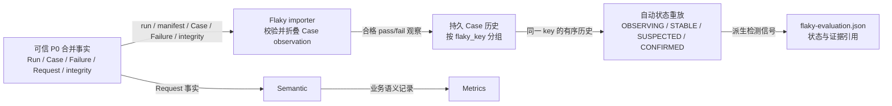

# 第 21 课：单次失败为什么不能说明 Flaky

## 本课在事实链中的位置

第 20 课停留在一次 Invocation 内：Request Event 提供局部用量，Request Group 保留 Retry 归属，Operation 发布已知小计，Metrics 再表达覆盖与缺失。Flaky 检测不接着消费这些用量指标。本课要换到可信 P0 事实的另一条支路，比较同一个 Case 在多个 Run 中的结果。

继续使用 Case C：

```text
case_id   = module/smoke/test_图片生成异步调用.py::TestAsyncImageGeneration::test_f8_09_async_image_generation_task_succeeds_with_result
param_hash = 74234e98afe7498f
```

仓库中的这个 Case 确实调用 `create_and_poll_media_generation()`，并检查异步任务成功且输出存在；文件还用 `pytest.mark.serial` 标记了串行执行。可是，仓库源码没有提供 Case C 连续多日运行后形成的真实 Flaky 历史。本课的 Run、通过、失败和 DNS 异常都是离线受控输入，只用于复算当前规则，不能写成外部服务已经发生过的事实。

本课只回答一个核心问题：**为什么一次失败只说明某一轮 Case 失败，只有同一比较范围内的可信历史及其结果变化，才足以产生 Flaky 自动检测信号。** 第 22 课再解释这些历史怎样持久化、关联和保留审计信息。

---

## 核心问题

> Case C 今天失败了一次，能不能立即说“它是 Flaky”？如果不能，连续通过、连续以同一原因失败、通过与失败交替、以及一次明显的环境异常，分别会得到什么结论？

“失败”和“Flaky”回答的是两个不同问题：

```text
单次失败：这一轮发生了什么？
Flaky 信号：同一可比对象在一段可信历史中，结果是否发生了规则所定义的波动？
```

本课所说的 Flaky（不稳定性）不是“失败”的英文别名。在当前框架的自动检测层，它指同一可比历史内结果签名变化所形成的信号，并由规则继续区分观察、稳定、疑似和确认状态。

前一个问题只需一轮 Case 事实。后一个问题至少还需要知道：以前比较的是不是同一个对象、每一轮是否可信、失败指纹是否相同、变化发生了几次，以及当前阈值是否满足。没有这些前后关系，单次失败没有足够信息描述“波动”。

---

## 从一个具体现象开始

### 固定四个历史位置

为了让每一步都能直接计算，本课用 `R1～R4` 表示四个按时间递增的受控 Run 位置：

```text
R1 = image-smoke-104-20260826T010000Z-a1b2c3d4
R2 = image-smoke-105-20260827T010000Z-b2c3d4e5
R3 = image-smoke-106-20260828T010000Z-c3d4e5f6
R4 = image-smoke-107-20260829T010000Z-d4e5f6a7
```

四个位置都假定已通过本课后文说明的 P0 导入门禁，并固定：

```text
case_id           = Case C 的完整 case_id
param_hash        = 74234e98afe7498f
environment       = overseas
execution_profile = serial  # 执行画像：serial-pool 归一后的比较值
state_epoch       = 1       # 状态纪元：显式重置前后的历史隔离值
```

这五项产生同一个比较键，正文简称 `K1`。`P` 表示签名 `pass`；`F_A` 表示 `fail:<failure_id A>`，其中 `A` 只是同一个完整 P0 failure ID 的短别名。以下各窗口是彼此独立的反事实输入，不是说 R1～R4 同时拥有多种结果。

### 四组历史给出四种答案

```mermaid
flowchart TB
    subgraph ONE["只有一次失败"]
        direction LR
        O1["R1 · F_A"] --> OS["OBSERVING"]
    end

    subgraph PASS["稳定通过窗口"]
        direction LR
        P1["R1 · P"] --> P2["R2 · P"] --> P3["R3 · P"] --> PS["STABLE / pass"]
    end

    subgraph FAIL["稳定失败窗口"]
        direction LR
        F1["R1 · F_A"] --> F2["R2 · F_A"] --> F3["R3 · F_A"] --> FS["STABLE / fail:A"]
    end

    subgraph WAVE["通过与失败交替窗口"]
        direction LR
        W1["R1 · P<br/>OBSERVING"] --> W2["R2 · F_A<br/>SUSPECTED"] --> W3["R3 · P<br/>SUSPECTED"] --> W4["R4 · F_A<br/>CONFIRMED"]
    end
```



图中的横向箭头表示按观察时间重放，而不是网络调用。前三个窗口说明，失败次数本身不能定义 Flaky：一次失败是 `OBSERVING`；三次相同失败签名反而是 `STABLE` 的稳定失败。第四个窗口中，第 2 条只产生 `SUSPECTED`，到第 4 条才同时拥有 2 次通过、2 次失败和至少 2 次通过/失败切换，进入自动状态 `CONFIRMED`。

默认规则的精确结果为。`outcome switch` 是相邻观察在 pass 与 fail 之间的结果类别切换；`signature switch` 是相邻完整签名不同，因而 `fail:A → fail:B` 也会计入：

| 独立历史窗口 | 样本 | pass / fail | outcome switch | signature switch | 最终自动状态 |
| --- | ---: | ---: | ---: | ---: | --- |
| `F_A` | 1 | 0 / 1 | 0 | 0 | `OBSERVING` |
| `P, P, P` | 3 | 3 / 0 | 0 | 0 | `STABLE`，稳定 outcome 为 pass |
| `F_A, F_A, F_A` | 3 | 0 / 3 | 0 | 0 | `STABLE`，稳定 outcome 为 fail、failure ID 为 A |
| `P, F_A, P, F_A` | 4 | 2 / 2 | 3 | 3 | `CONFIRMED` |

这里的 `CONFIRMED` 是自动状态名，只表示当前规则阈值已满足。它没有确认根因，没有作出人工隔离决定，也不会单凭这个状态改变 pytest 选例。

### “环境异常”需要先拆成三种情况

假设 R1～R3 都是 `P`，R4 因 DNS 问题成为 `F_ENV`，对应 FailureRecord 的 `failure_category=ENVIRONMENT`。若它仍属于 `environment=overseas` 的 K1，当前检测器不会按失败类别豁免这一条；K1 会从 `STABLE` 变为 `SUSPECTED`。但 3 pass、1 fail 尚不满足 `CONFIRMED` 门槛。

若 R4 实际运行在 `environment=china`，它会进入另一个键 K2。此时 K1 的海外历史仍是稳定通过，K2 只有一条失败并处于 `OBSERVING`；不能把两个部署环境拼成一次切换。

若环境事故导致 Run 没有结束、manifest 不完整、P0 完整性失败或 Case 生命周期残缺，则它不会产生一条可比较观察。缺少观察不是 pass，也不是 fail，更不是可以补入窗口的“unknown 结果”。

---

## 为什么原有解释不够

### 单轮 Case 状态没有“前后变化”

`CaseStatus.FAILED` 或 `CaseStatus.ERROR` 能证明一轮 Invocation 的最终事实，却没有告诉检测器此前发生过什么。只有 `F_A` 一条时，pass 数为 0、fail 数为 1、切换数为 0。把它称为 Flaky，相当于在没有第二个点时声称时间序列发生了摆动。

反过来，失败多次也不必然是 Flaky。`F_A, F_A, F_A` 每次都失败，但结果签名一致，因此当前规则称其为 `STABLE` fail。这个结果并不赞扬 Case 健康，只说明“观察到的行为稳定地失败”。

### 只比较 case_id 仍可能混入不可比样本

同一个 Case 定义可以带不同参数，可以运行在 china 或 overseas，可以走 serial 或 parallel 执行画像，也可能在人工重置后的新 epoch 中重新积累证据。当前实现把这些维度纳入 `flaky_key`。只按 `case_id` 汇总，会把生产规则明确分开的历史混到一起。

同样，`invocation_id` 也不能用来跨 Run 关联：它标识一次具体 Invocation，本来就会随运行变化。长期比较需要保留 Case 身份，又要剔除每轮都会变化的运行实例身份。

### 失败分类不是自动检测过滤器

P0 FailureRecord 可以把失败归为 `PRODUCT_DEFECT`、`TEST_DEFECT`、`ENVIRONMENT`、`TRANSIENT` 等类别。这个类别回答“当前分类器认为失败更像哪一类原因”；结果签名回答“这一轮是 pass，还是带哪个 failure ID 的 fail”。当前 Flaky 重放只使用后者。

因此，“人已经看出这是网络故障”和“自动状态机应该忽略它”不是同一句话。仓库当前没有后一条规则。教学若把环境类失败自动删除，就会把未来治理建议冒充成现有实现。

### Metrics 无法替代 Case 历史

Token、Retry 次数、Polling 耗时和成功率可以描述一次或一批业务调用，却不是 Flaky importer 的输入。一次 Case 可以没有完整 Metrics 仍形成可信 P0 pass/fail；反过来，漂亮的 Metrics 也不能替代 Case 的完整生命周期、failure ID 与 P0 完整性门禁。

---

## 核心概念

本课只新增三个概念。

### 1. 可比历史（Comparable History）

可比历史是当前实现允许放进同一 Flaky 时间序列的一组 Case 观察。它由同一个 `flaky_key` 限定：

```text
case_id
+ param_hash
+ environment
+ execution_profile
+ state_epoch
```

其中 execution profile（执行画像）把串行、并行和手工执行形态分开；state epoch（状态纪元）把一次显式重置前后的历史分开。这与五级运行身份的职责不同。Run、Execution、Worker、Case、Invocation 负责把一轮事实归到正确位置；Flaky key 则从跨 Run 观察中选出当前规则认为可比较的子集。`run_id` 和 `invocation_id` 保留在每条证据中用于审计，但不用于把长期历史切成“一轮一个桶”。

“可比”是当前规则下的工程定义，不是对世界状态完全相同的证明。这个键没有包含 branch、commit、依赖版本、外部模型版本或某台机器的网络健康度；这些未建模差异仍可能影响结果。

### 2. 结果签名（Result Signature）

结果签名是自动检测真正比较的值：

```text
通过                → pass
失败，failure_id=A  → fail:A
失败，failure_id=B  → fail:B
```

它比二元 pass/fail 多保留一层失败指纹。于是 `F_A, F_A, F_A` 是一致签名；`F_A, F_B` 虽然两个 outcome 都是 fail，签名已经变化，会产生 `SUSPECTED`。不过，全是 fail 时没有 pass/fail outcome 切换，不能满足默认自动确认条件。

`failure_category` 是伴随观察保存的原因分类，不属于签名。把 category 与 signature 分开，才能准确描述环境类失败当前为何仍参与计算。

### 3. 自动检测投影（Automatic Flaky Projection）

自动检测投影是把同一 key 的有序观察按规则重放后得到的当前状态与证据摘要。本课涉及四个自动状态：

| 状态 | 当前含义 | 不能替代的结论 |
| --- | --- | --- |
| `OBSERVING` | 已有观察，但尚无足够一致性或变化证据 | 不是“通过”，也不是“无问题” |
| `STABLE` | 达到连续一致签名阈值 | 不等于健康；可以稳定失败 |
| `SUSPECTED` | 签名变化，或已稳定签名被打破 | 不等于已经确认 Flaky |
| `CONFIRMED` | 当前自动规则的确认阈值已满足 | 不等于根因、人工治理或执行隔离已经确认 |

默认状态机使用最近最多 20 条的证据窗口。从空历史开始、状态仍为 `OBSERVING` 且此前没有签名变化时，3 个一致签名会进入 `STABLE`；已经进入 `SUSPECTED` 后，清除疑似采用另一条规则，需要尾部连续 5 个相同签名。自动确认同时要求至少 4 个样本、2 个 pass、2 个 fail、2 次 outcome switch。窗口还记录 signature switch、不同失败指纹数、尾部连续签名数以及 observation/run 引用。

---

## 完整运行过程

### 先看两条消费者支路



上方链路是本课的数据依赖：Flaky importer 直接读 P0 的 Run、manifest、Case、Failure 与 integrity 产物。下方链路是 Metrics 分支。生产编排中 Flaky 阶段排在 Semantic/Metrics 后执行，但图中没有 `Metrics → Flaky` 的箭头，因为 importer 不读取 Metrics 输出；执行先后不等于数据依赖。

### 阶段一：确认这一轮是否有资格进入历史

输入是某个 Run 的 `run.json`、P0 manifest 及三份 merged 输出。导入器先验证文件存在、Run ID 一致、Run 为 `FINISHED`、manifest 状态为 `complete`、Schema 和版本受支持、完整性状态可接受，并复验 Case、Failure、integrity issue 文件哈希。

如果整个 Run 不可信，输出是失败或无数据的导入报告，不会写入伪造的 Case 观察。`DEGRADED` 也不是一律拒绝：分类降级、JUnit 文件类警告和限定的 requests 分片解析警告在当前白名单内仍可导入；会影响 Case 可信度的警告则阻断。

### 阶段二：把一个 Invocation 的 phase 折成一个观察

导入器按 `(run_id, invocation_id)` 收拢 `setup/call/teardown`，检查各 phase 的 Case、参数、Execution、Worker 和规范化 nodeid 一致。

在没有 `FAILED/ERROR` phase 时，raw 与 final 状态都为 passed 的 call 才形成 `observation_outcome=pass`。任何 `FAILED/ERROR` 路径必须拥有唯一 failure ID，并能找到唯一匹配的 P0 FailureRecord，才形成 `observation_outcome=fail`。不存在 `FAILED/ERROR` phase 而出现 `SKIPPED/XFAILED/XPASSED`，以及 collection-only、不完整生命周期、身份冲突或不明确失败指纹时，Invocation 会被按原因排除，而不是猜成一个结果。

### 阶段三：确定比较键并持久化

输入观察中的 `serial-pool/master` 被规范化为 `execution_profile=serial`；环境只接受 `china` 或 `overseas`。存储层用 Case、参数、环境、执行画像和当前 epoch 构造 key，再用 `run_id + flaky_key` 构造 observation ID。

状态变化是：这轮具体 Invocation 成为长期历史中的一条可审计观察。其 Run ID、Invocation ID、决定性 phase、原始/最终状态、failure ID/category、观察时间、产物引用和规则版本不会因为进入长期比较而消失。

### 阶段四：排序、建立证据窗口并重放

重放不是按文件导入先后，也不是按 Run 名字中的数字排序。当前排序键依次是：

```text
observed_at
→ run_end_time
→ run_id
→ observation_id
```

对每个时间前缀，规则取最近最多 20 条形成证据，计算 pass/fail、outcome switch、signature switch、不同失败指纹和尾部连续签名数，再推进状态。最终输出保留全部观察数和当前窗口样本数；“窗口 20”不表示数据库只保存 20 条历史。

### 阶段五：发布自动检测结果

投影层把当前状态、检测状态、稳定 outcome/failure ID、计数、规则版本和最新 observation/run 写入 Flaky state；迁移记录另行保存触发 observation 及证据 observation/run 引用。本轮评估再报告新增疑似、新增确认、持续确认等摘要。

这些输出是派生信号，不会倒写 P0 Case 结果，也不会覆盖 pytest 原始退出事实。历史或状态阶段异常时，编排采用 fail-open：测试事实仍保留，但 Flaky 观察或投影可能缺失；不能把缺口解释成稳定。

---

## 正常路径

### 路径一：三次稳定通过

输入为 K1 下的 `P, P, P`。逐条重放如下：

| 时点 | 新签名 | 判断所需证据 | 状态变化 | 输出 |
| --- | --- | --- | --- | --- |
| R1 | `pass` | 第一条观察 | 无状态 → `OBSERVING` | sample=1，pass=1 |
| R2 | `pass` | 没有签名变化，样本仍少于 3 | 保持 `OBSERVING` | sample=2，pass=2 |
| R3 | `pass` | 3 个连续一致签名 | `OBSERVING → STABLE` | stable outcome=`pass` |

这里的关键不是“三轮都没有报错”这句自然语言，而是三条观察都经过门禁、属于 K1、按时间有序且签名完全相同。若 R2 的 Case lifecycle 不完整，它不会被补成 pass；实际可用历史只有 R1、R3 两条，仍处于 `OBSERVING`。

### 路径二：三次稳定失败

把输入改为 `F_A, F_A, F_A`，其余条件不变：

| 时点 | 新签名 | 判断 | 状态变化 |
| --- | --- | --- | --- |
| R1 | `fail:A` | 第一条观察 | 无状态 → `OBSERVING` |
| R2 | `fail:A` | 同签名，但样本不足 3 | 保持 `OBSERVING` |
| R3 | `fail:A` | 3 个连续一致签名 | `OBSERVING → STABLE` |

最终投影保存 `stable_outcome=fail` 和 `stable_failure_id=A`。因此 `STABLE` 描述的是签名一致性，不是质量评价。一个稳定失败的 Case 仍然需要处理，只是它没有表现出当前规则定义的 pass/fail 波动。

这两条路径也说明，自动检测不以“失败数大于零”为 Flaky 判据。若只看失败数量，稳定失败会被误判；若把 STABLE 翻译成健康，又会把确定性故障漏掉。

---

## 复杂路径

### 路径一：通过与失败交替

输入为 K1 下的 `P, F_A, P, F_A`：

| 时点 | 窗口 | pass / fail | outcome switch | 判断 | 状态 |
| --- | --- | ---: | ---: | --- | --- |
| R1 | `P` | 1 / 0 | 0 | 第一条观察 | `OBSERVING` |
| R2 | `P,F_A` | 1 / 1 | 1 | 首次签名和 outcome 变化 | `SUSPECTED` |
| R3 | `P,F_A,P` | 2 / 1 | 2 | fail 仍少于 2 | `SUSPECTED` |
| R4 | `P,F_A,P,F_A` | 2 / 2 | 3 | 样本、pass、fail、切换均达标 | `CONFIRMED` |

R2 的一条失败确实改变了状态，但原因不是“一次失败足以证明 Flaky”，而是它与 R1 的可信 pass 构成了第一次变化。此时系统只给出疑似信号。R4 才满足默认确认阈值。

另一条最短确认序列可以是 `P, F_A, F_A, P`：它有 2 次通过、2 次失败和 2 次 outcome switch，也会确认。规则要求的是计数与切换，不要求每一步严格交替。

### 路径二：一次失败打破稳定通过

输入为 `P, P, P, F_A`。前三条已经让 K1 成为 `STABLE/pass`，R4 的新签名不同于保存的稳定签名，于是状态变为 `SUSPECTED`，reason 为 `stable_signature_broken`。

最终窗口是 3 pass、1 fail、1 次 outcome switch，不满足 2 个 fail。因此准确结论是：

> 一条新失败可以借助此前三条可信通过历史打破稳定性并触发疑似；它仍不能独自满足自动确认条件。

这既没有削弱单次失败的告警价值，也没有把初步异常夸大为已经确认的 Flaky。

### 路径三：全都失败，但失败指纹变化

输入先取 `F_A, F_B`。第二条的 outcome 仍是 fail，所以 outcome switch 为 0；但结果签名从 `fail:A` 变为 `fail:B`，signature switch 为 1，状态进入 `SUSPECTED`，reason 为 `failure_fingerprint_changed`。

即使扩展为 `F_A, F_B, F_A, F_B`，pass 仍为 0，outcome switch 仍为 0。它会保持疑似，不会达到默认 `CONFIRMED`。这个窗口表明：检测器关心的不仅是通过/失败，也关心失败模式是否稳定；但自动确认 Flaky 又明确要求 pass 与 fail 都出现。

### 路径四：环境异常并不只有一种处理

先取同一 K1 的 `P, P, P, F_ENV`，其中最后一条 FailureRecord 分类为 `ENVIRONMENT`。导入器仍把它折成 fail，签名函数仍得到 `fail:ENV-DNS`，状态从稳定通过变为疑似。自动检测能说的是“同一当前比较分区的结果签名被打破”，不能说 DNS 一定是根因，也不能说 Case 本身有缺陷。

再只改变一个输入：让最后一条来自 `environment=china`。环境进入 key 后生成 K2，所以：

```text
K1 / overseas：P, P, P → STABLE/pass
K2 / china：F_ENV     → OBSERVING
```

两条历史不会合并。这里的 `environment` 是部署比较维度；`failure_category=ENVIRONMENT` 是失败原因元数据，二者不能互换。

最后再改变事实可信度：若 DNS 事故使 Run 为 `INTERRUPTED`，Flaky 阶段会写无数据报告而不导入；若 Run 虽完成，但 Case 的失败没有唯一匹配的 P0 FailureRecord，则只排除该 Invocation。这两种情况都不会偷偷追加 `F_ENV`，也不会追加 pass。

### 路径五：安全降级与阻断性缺口不同

假设 P0 integrity 为 `DEGRADED`。若唯一警告是 `classification_failed`，当前白名单允许导入，观察仍进入历史，导入结果标为 `DEGRADED`。若警告是影响 Case 信任的 `junit_status_mismatch`，导入被阻断。

因此，不能使用“degraded 一律不可信”或“degraded 一律可用”这种简化。决定因素是当前门禁对具体 issue 的分类；导入状态和观察是否存在都必须按真实输出解释。

---

## 对应的框架实现

前面已经建立了现象、三个概念和完整路径，下面再把关键机制映射到生产代码。片段均为教学化摘录，省略导入、模型校验、错误包装和不相关分支；字段、判断顺序、状态含义与失败边界保持不变。

### 1. Flaky 直接读取 P0，而不是 Metrics

`quality/flaky_importer.py:227-266` 的输入选择可缩写为：

```python
def prepare_flaky_import(request):
    paths = {
        "run_record": output_dir / "run.json",
        "manifest": output_dir / "merged" / "manifest.json",
        "case_results": output_dir / "merged" / "case-results.jsonl",
        "failures": output_dir / "merged" / "failures.jsonl",
        "integrity_issues": output_dir / "merged" / "integrity-issues.jsonl",
    }
    require_every_file(paths)
    validate_run_manifest_and_hashes(paths)
    return fold_case_observations(case_results, failures, ...)
```

输入是 P0 Run 与合并事实；判断包括存在性、版本、完整性和哈希；输出是合格 Case observation candidates。字典中没有 Semantic 或 Metrics 路径。生产流水线虽然先调用 Semantic 和 Metrics，再调用 Flaky history，但这只是运行顺序。Semantic 失败后 Flaky 仍能导入的定向测试也锁定了这一边界。

### 2. 比较键明确分开参数、环境和执行画像

`quality/flaky_importer.py:101-168` 的核心为：

```python
def normalize_execution_profile(execution_id, worker_id):
    if execution_id.casefold() == "serial-pool":
        return "serial"
    if execution_id.casefold() == "parallel-pool":
        return "parallel"
    # 省略 manual/custom 分支及验证

def build_flaky_key(case_id, param_hash, environment,
                    execution_profile, state_epoch):
    payload = {
        "case_id": case_id,
        "param_hash": param_hash,
        "environment": normalize_flaky_environment(environment),
        "execution_profile": normalize_stored_execution_profile(
            execution_profile
        ),
        "state_epoch": state_epoch,
    }
    return "flaky-v1-" + _full_hash(payload)
```

输入是可比性维度，输出是稳定 hash key。环境只接受 china/overseas，非法值抛出错误；epoch 小于 1 也被拒绝。Run ID 没有进入 payload，所以后续 Run 能加入同一历史；不同环境或 serial/parallel 则得到不同 key。

### 3. 只有完整、明确的 Invocation 才折成观察

`quality/flaky_importer.py:651-763` 的关键分支为：

```python
normal = {CasePhase.SETUP, CasePhase.CALL, CasePhase.TEARDOWN}
early_setup = {CasePhase.SETUP, CasePhase.TEARDOWN}
if phase_set == normal:
    pass
elif phase_set == early_setup and by_phase[CasePhase.SETUP].final_status in {
    CaseStatus.ERROR,
    CaseStatus.SKIPPED,
}:
    pass
elif CasePhase.COLLECTION in phase_set:
    raise FlakyImportError("collection_phase", ...)
else:
    raise FlakyImportError("incomplete_phase", ...)

if error_phases or failed_phases:
    if not failure_ids:
        raise FlakyImportError("missing_failure_fingerprint", ...)
    if len(failure_ids) != 1:
        raise FlakyImportError("multiple_failure_fingerprints", ...)
    failure = require_one_matching_p0_failure_record(...)
    outcome = ObservationOutcome.FAIL
    failure_category = failure.category.value
else:
    if call.final_status is CaseStatus.PASSED:
        outcome = ObservationOutcome.PASS
        failure_id = None
        failure_category = None
    elif skipped_xfailed_or_xpassed:
        raise FlakyImportError("expected_outcome_excluded", ...)
```

输入是一轮 Invocation 的 phase 与 P0 FailureRecord；输出是一个 pass 或 fail candidate，异常则成为明确排除原因。片段保留了 `failure_category`，但没有用它筛掉环境类失败。分类被保存与分类参与检测是两件不同的事。

### 4. 签名与证据窗口保留两种切换

`quality/flaky.py:23-89` 的核心为：

```python
def build_result_signature(observation):
    if observation.observation_outcome is ObservationOutcome.PASS:
        return "pass"
    if not observation.failure_id:
        raise ValueError("fail observation must include failure_id")
    return f"fail:{observation.failure_id}"

def derive_evidence_window(observations, config):
    ordered = sort_observations(observations)
    window = ordered[-config.evidence_window_size:]
    signatures = [build_result_signature(item) for item in window]
    outcomes = [item.observation_outcome for item in window]
    outcome_switches = sum(
        left is not right for left, right in zip(outcomes, outcomes[1:])
    )
    signature_switches = sum(
        left != right for left, right in zip(signatures, signatures[1:])
    )
    return evidence_with_counts_and_refs(...)
```

输入是同一 key 的历史，输出是最多 20 条的证据摘要。`P → F_A` 同时增加 outcome 和 signature switch；`F_A → F_B` 只增加 signature switch。函数不读取 `failure_category`，因此不能从 ENVIRONMENT 分类推导自动排除。

### 5. 状态机先疑似，再按更高门槛确认

`quality/flaky.py:92-168,237-244` 的主要转移可缩写为：

```python
if state is None:
    state = OBSERVING
elif state is OBSERVING:
    if evidence.signature_switch_count > 0:
        state = SUSPECTED
    elif evidence.sample_size >= config.stable_min_samples:
        state = STABLE
elif state is STABLE:
    if latest_signature != stable_signature:
        state = SUSPECTED
elif state is SUSPECTED:
    if (
        evidence.sample_size >= config.confirmed_min_samples
        and evidence.pass_count >= config.confirmed_min_pass_count
        and evidence.fail_count >= config.confirmed_min_fail_count
        and evidence.outcome_switch_count
            >= config.confirmed_min_outcome_switches
    ):
        state = CONFIRMED
    elif (
        evidence.trailing_same_signature_count
        >= config.suspected_clear_signature_streak
    ):
        state = STABLE
elif state is CONFIRMED:
    pass
```

输入是每一步的新观察和当前证据；状态变化依次区分首次观察、一致性、首次变化和确认阈值；输出还带 reason 与 observation/run 证据引用。默认自动 replay 中 `CONFIRMED` 保持不变。人工覆盖、隔离和恢复属于后续治理层，不能从最后一个 `pass` 擅自推导状态已自动清除。

---

## 能够保证什么

在输入通过门禁、配置启用且使用当前默认规则时，现有实现能够保证：

1. Flaky history 直接读取可信 P0 Run、manifest、Case、Failure 和 integrity 产物，不以 Metrics 为前置输入。
2. 每个合格 Invocation 只在生命周期与身份一致后折成 pass/fail；在没有其他 failed/error phase 时，skip、xfail、xpass 和无法明确折叠的记录不会被补成结果。
3. failed/error observation 必须携带唯一 failure ID，并能引用唯一匹配的 P0 FailureRecord。
4. `case_id + param_hash + environment + execution_profile + state_epoch` 相同的观察进入同一个比较 key；china/overseas、serial/parallel 不会直接混算。
5. 结果签名精确区分 `pass`、`fail:A` 和 `fail:B`；失败分类作为元数据保存，但不暗中改变签名。
6. 历史按明确的四字段顺序重放，最终证据保存样本、pass/fail、两类切换、失败指纹数量及观察/Run 引用。
7. 一条孤立的 fail observation 得到 `OBSERVING`，不会直接得到 `SUSPECTED` 或 `CONFIRMED`。
8. 从空历史起、仍处于 `OBSERVING` 且未发生签名变化时，三个相同签名得到 `STABLE`；因此稳定通过和稳定失败能被明确区分并保留稳定 outcome。若已进入 `SUSPECTED`，默认要由尾部五个相同签名走另一条清除路径。
9. 首次签名变化只产生 `SUSPECTED`；默认确认还要同时满足 4 样本、2 pass、2 fail 和 2 次 outcome switch。
10. 对本课受控 `P,F_A,P,F_A`，可复算出第 2 条疑似、第 4 条确认；对 `F_A×3`，可复算出稳定失败。
11. 不可信 Run 和不合格 Invocation 以失败或排除原因表达，不会被静默改写成 pass、fail 或零样本意义上的“稳定”。
12. 自动投影不会覆盖 P0 Case 事实或 pytest 原始退出结果。

---

## 保证成立的前提

- `QUALITY_ENABLE` 与 Flaky history/state 的相应开关已启用，并提供有效的绝对持久数据库路径。仓库默认是关闭状态。
- Jenkins Real Smoke 所在外部部署确实提供了 `QUALITY_FLAKY_DB_PATH`；仓库中的条件配置本身不能证明该路径已经存在。
- Run 已正常结束为 `FINISHED`，最终 `run.json` 与 P0 manifest 已生成且互相一致。
- manifest 为当前支持版本与 Schema、状态为 complete，三份 P0 输出哈希复验一致，完整性问题满足当前准入规则。
- Case C 的 setup/call/teardown 生命周期完整，或符合当前允许的 setup 提前终止形态；身份字段与规范化 nodeid 一致。
- pass 观察来自真正 passed 的 call；fail/error 观察拥有唯一、匹配的 P0 failure ID，不能用异常文本临时别名替代。
- 被比较记录拥有相同的 Case、参数 hash、环境、执行画像和 epoch。只看显示名称或 URL 相同不够。
- `environment` 能准确归入当前支持的 china/overseas；更细的区域、主机、网络或依赖差异若未进入 key，需要在解释结论时保留限制。
- 历史时间字段可靠。迟到导入仍会按观察时间重放；若源时间错误，排序正确性没有外部保证。
- 当前 epoch 内的身份、环境、执行画像、观察折叠与指纹版本必须兼容；这些观察来源版本冲突时需要显式 epoch reset。已存状态的状态规则或投影版本不兼容时，则需要显式 versioned rebuild，不能静默重放。
- 本课采用默认阈值。配置对象允许其他有效值时，状态结果必须按实际配置重新计算。
- 本课 R1～R4、P/F 序列、A 与 ENV-DNS 都是离线受控数据，并非 Case C 的实测历史。

---

## 不能保证什么

1. **孤立的一次失败不能证明 Flaky。** 它作为唯一历史时只形成 `OBSERVING`；加入已有历史后，状态取决于整个证据窗口——它可以打破稳定而进入 `SUSPECTED`，也可能作为最后一条观察使既有窗口达到 `CONFIRMED`，但确认依据始终是整段历史，不是该次失败本身。
2. **`STABLE` 不保证 Case 健康。** 三次相同 `fail:A` 是稳定失败，仍然代表每轮 Case 失败。
3. **`SUSPECTED` 不等于 `CONFIRMED`。** 一次签名变化足以引起怀疑，但默认确认需要更完整的 pass/fail 与切换证据。
4. **失败签名变化不保证通过/失败波动。** `fail:A → fail:B` 会疑似，但全 fail 序列不满足默认确认条件。
5. **自动 `CONFIRMED` 不保证根因。** 它只确认规则阈值，不说明问题属于产品、测试、框架、配置还是环境。
6. **`failure_category=ENVIRONMENT` 不会被当前检测器自动排除。** 分类器判断与 Flaky 签名计算是两个职责。
7. **不同 `environment` 也不能拼成一条波动。** overseas pass 与 china fail 属于不同 key；若各只有一条，两边都仍在观察。
8. **当前 key 不保证控制了所有影响因素。** branch、commit、依赖版本、外部模型版本和区域内网络状态不在 key 中。
9. **未导入记录不能解释为通过、失败或没有问题。** Run 级门禁失败、Case 被排除、数据库不可用或 fail-open 都可能留下历史缺口。
10. **`DEGRADED` 不能被统一解释。** 当前白名单内警告可导入，影响 Case 信任的警告会阻断，必须读取具体 issue。
11. **20 条证据窗口不表示数据库只保存 20 条。** 它限制当前统计窗口；历史存储与审计是第 22 课的主题。
12. **Flaky 不依赖 Metrics。** 即使编排顺序位于 Metrics 之后，也不能把用量、成功率或轮询聚合作为 Flaky 的必需输入。
13. **自动检测不等于人工治理。** `CONFIRMED` 不代表已经指定 owner、理由、期限或隔离决定。
14. **自动检测不等于执行行为。** 本课任何状态都不能推出 pytest 已自动跳过 Case；该边界将在第 24 课展开。
15. **条件接入不等于当前部署已启用。** 没有外部持久数据库配置时，Real Smoke 会关闭 Flaky history/state。
16. **客户端历史不能证明外部服务契约。** 它不能证明任务内部只执行一次、DNS 根因真实、媒体结果正确，或未来运行会保持同样模式。
17. **测试与离线探针不是生产历史。** 它们确认覆盖范围内的当前规则，不替代真实多 Run 证据，也不替代源码对当前行为的证明。

本课的核心结论是：**Flaky 不是失败的别名，而是同一当前比较键下、通过可信门禁的有序结果签名所产生的自动检测信号。孤立的一次失败只能提供一个点；把新失败放入已有历史后，它可能触发疑似，也可能恰好使整个窗口达到确认阈值，但结论始终来自多条 pass/fail 及其切换，而不是来自该失败本身。**

---

## 与下一课的关系

本课暂时把“可信观察已经可供重放”作为输入，说明了可比键、结果签名和自动状态怎样给稳定通过、稳定失败、交替结果及环境异常不同结论。它也确认了数据依赖方向：Flaky 直接消费 P0 Case 历史，Metrics 是旁路消费者，不是它的上游。

下一课将追问本课刻意留下的问题：一轮 P0 Case 怎样变成持久观察，跨 Run 怎样用稳定身份关联，Run、Invocation、Failure、产物哈希和规则版本又怎样保留为可审计证据。只有先把这条可信历史链画完整，自动状态才有可复核的事实基础。
