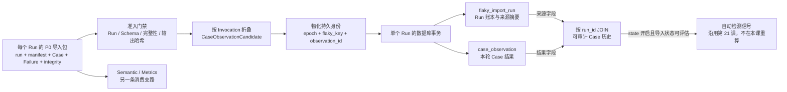

# 第 22 课：可信 P0 Case 历史怎样形成

## 本课在事实链中的位置

第 21 课已经说明：Flaky 不是单次失败的别名。只有同一比较键下的多条可信 Case 观察，才能形成稳定、疑似或确认等自动检测信号。那一课把“可信历史已经存在”当作输入，却还没有回答这些观察从哪里来、怎样跨 Run 关联，以及旧记录为什么不会被一次重复导入或来源变化静默改写。

本课继续使用 Case C：

```text
case_id = module/smoke/test_图片生成异步调用.py::TestAsyncImageGeneration::test_f8_09_async_image_generation_task_succeeds_with_result
param_hash = 74234e98afe7498f
```

仓库中的 Case C 确实调用 `create_and_poll_media_generation()`，检查异步任务进入成功状态且输出存在，并由文件级 `pytest.mark.serial` 放入串行调度范围。源码只能证明 Case 定义与当前调用形态，不能证明它已经在某个外部环境形成连续多日历史。正文中的 Run 104～107、通过/失败结果、时间和来源摘要都是离线受控输入。

本课只回答一个核心问题：**多个 Run 中的 Case C 事实，怎样经过 P0 准入、身份物化和原子写入，形成可关联、可追溯且不能被静默覆盖的持久历史。** 这些历史会供第 21 课的自动检测使用；由谁作出治理决定，要到第 23 课再讨论。

---

## 核心问题

> Run 104～107 各自给出 Case C 的一个结果时，为什么不能直接把 `P、F_A、P、F_A` 抄进一列就称为可信历史？框架怎样证明每一行属于哪一轮来源、怎样把四轮中的同一可比对象关联起来，又怎样处理重复、冲突和半途失败？

一列结果只保留了“发生了什么”，没有保留“这条结论从哪组 P0 字节得来、通过了什么门禁、属于哪个 Invocation、使用哪版规则、何时观察和何时导入”。若这些信息丢失，同一个序列可能来自四个可信 Run，也可能来自重复导入、被改动的产物、错误环境，甚至是把缺失结果补写成 pass。

因此，本课要同时保留两种关系：

```text
纵向血缘：一条观察 → 所属 Run → 五份 P0 输入及其摘要
横向关联：不同 Run 的观察 → 同一个 flaky_key → 一条可比历史
```

纵向血缘让人能够追问来源；横向关联让检测器能够跨 Run 比较。任何一边缺失，都不足以形成第 21 课使用的可信历史。

---

## 从一个具体现象开始

先沿用第 21 课的四个时间位置，并给出本课关心的持久化输入：

```text
R1（Run 104）= image-smoke-104-20260826T010000Z-a1b2c3d4 → P
R2（Run 105）= image-smoke-105-20260827T010000Z-b2c3d4e5 → F_A
R3（Run 106）= image-smoke-106-20260828T010000Z-c3d4e5f6 → P
R4（Run 107）= image-smoke-107-20260829T010000Z-d4e5f6a7 → F_A
```

`P` 是 pass 的简写；`F_A` 是 `fail:<完整 failure_id A>` 的教学别名。四轮都固定：

```text
case_id           = Case C 的完整 case_id
param_hash        = 74234e98afe7498f
environment       = overseas
execution_profile = serial
state_epoch       = 1
```

其中 `state_epoch=1` 不是从 P0 文件抄来的 Run 序号，而是存储层首次建立当前 Case、环境和执行画像范围时使用的比较纪元。四轮的 `run_id` 与 `invocation_id` 各不相同；五个比较维度相同，所以物化后共享第 21 课定义的比较键 K1。

如果只保留下面四格，确实能看见波动，却无法审计：

| Run | 结果 |
| --- | --- |
| R1（Run 104） | `P` |
| R2（Run 105） | `F_A` |
| R3（Run 106） | `P` |
| R4（Run 107） | `F_A` |

框架实际建立的是一条带来源的链：



图中的 `P0 导入包` 不是一个额外生成的新文件，而是本课对五份必需输入的合称。每轮通过门禁后，Run 级来源进入 `flaky_import_run`，Case 级结果进入 `case_observation`；两张表通过 `run_id` 关联。Semantic/Metrics 也消费可信事实，但 Flaky importer 没有读取它们的输出，因此图中不存在 `Metrics → Flaky`。

为便于阅读，下面把四个完整 `source_digest` 分别记为 D104～D107，把由 `run_id + K1` 计算出的完整 observation ID 记为 O104～O107。这些只是正文别名，不是生产字段的实际值：

| Run | P0 导入包 | Run 账本 | 持久观察 | 跨 Run 关系 |
| --- | --- | --- | --- | --- |
| R1（Run 104） | 五份文件，摘要 D104 | 1 行，保存 Run 104 与 D104 | O104，`pass` | K1 |
| R2（Run 105） | 五份文件，摘要 D105 | 1 行，保存 Run 105 与 D105 | O105，`fail:A` | K1 |
| R3（Run 106） | 五份文件，摘要 D106 | 1 行，保存 Run 106 与 D106 | O106，`pass` | K1 |
| R4（Run 107） | 五份文件，摘要 D107 | 1 行，保存 Run 107 与 D107 | O107，`fail:A` | K1 |

最终得到的是四条 Run 血缘、四条 Case 观察和一个共享比较键，而不是一列失去来源的 P/F 字符。

---

## 为什么原有解释不够

### 只有结果值，无法证明来源边界

`pass` 或 `fail:A` 没有说明它来自哪个 `run.json`，manifest 是否已经 complete，三份 merged 输出是否仍与 manifest 中的哈希一致，也没有说明失败 A 能否唯一关联到 P0 FailureRecord。把结果脱离这些输入保存，之后就无法区分可信观察与手工抄写值。

### 本轮身份和长期关联身份不能互换

`run_id` 标识一轮运行，`invocation_id` 标识这一轮中的一次 Case Invocation；它们必须随观察保存以便追溯，却会跨 Run 改变。只用它们分组，四轮永远无法相遇。反过来，只用 `case_id` 又会混入不同参数、china/overseas、serial/parallel 或不同 epoch 的观察。

当前实现用 `run_id + invocation_id` 折叠本轮 phase，用 `case_id + param_hash + environment + execution_profile + state_epoch` 关联长期可比历史。前者回答“这一轮的 phase 属于谁”，后者回答“哪些轮次可以比较”。

### “再执行一次 INSERT”不是可靠的重复处理

同一 Run 可能因 CI 重试导入步骤而再次到达；也可能在第一次导入后，源文件内容发生变化。前一种情况不应重复增加样本，后一种情况不能覆盖旧账本。框架需要先区分“相同来源已导入”与“同一 Run 指向不同来源”，再决定 NOOP 或拒绝。

### 持久化不自动等于事实真实或永远可用

SQLite 能在进程结束后保留记录，事务能避免留下半个 Run，SHA256 能关联一组读取到的字节。这些机制都不能证明 P0 中的业务陈述真实，也不能承诺数据库文件、Jenkins artifact 或本地目录将永久保存。技术保证必须停在各自证据能够支持的范围内。

---

## 核心概念

本课只新增三个概念。第 21 课已经定义的 `flaky_key`、结果签名和自动检测投影在这里继续使用，不重复作为新概念。

### 1. P0 导入包（P0 Import Bundle）

P0 导入包是一次 Run 进入 Flaky history 前必须共同读取的五份输入：

```text
run.json
merged/manifest.json
merged/case-results.jsonl
merged/failures.jsonl
merged/integrity-issues.jsonl
```

它解决的问题是：一条 Case 结果不能脱离 Run 状态、合并清单、失败指纹和完整性问题单独成为可信历史。导入器先计算五个文件各自的 SHA256；其中三份 merged 数据文件还要与 manifest 的 `output_hashes` 对照。随后才解析 Case、Failure 和 integrity issue，并把合格 Invocation 折成候选观察。

“导入包”表示一次读取与校验所需的文件集合，不表示框架把五份文件重新封装或复制进数据库。原始 P0 产物仍在原位置，数据库保存的是选出的事实、来源引用和摘要。

### 2. 持久 Case 观察（Persistent Case Observation）

持久 Case 观察是一个合格 Invocation 经 phase 折叠、比较身份物化并提交到 `case_observation` 后的记录。它同时保留两类字段：

```text
本轮追溯：run_id、invocation_id、decisive_phase、raw/final status、observed_at
长期比较：case_id、param_hash、environment、execution_profile、state_epoch、flaky_key
结果事实：pass/fail、failure_id、failure_category
规则解释：identity/environment/profile/observation/fingerprint version
```

`flaky_key` 让不同 Run 的可比观察进入同一桶；`observation_id = hash(run_id, flaky_key)` 让每个 Run 中该桶的一条观察具有独立身份。数据库的 `UNIQUE(run_id, flaky_key)` 进一步限制同一 Run、同一比较键最多写入一条观察。

候选观察还不是持久观察。候选只说明 P0 phase 已能折成明确 pass/fail；只有 epoch 与规则版本相容、整个 Run 的事务提交成功后，它才成为可查询历史。

### 3. 审计血缘（Audit Lineage）

审计血缘是从持久观察回到导入来源所需的关联信息。`flaky_import_run` 充当每个 Run 一行的导入账本，保存：

- `source_kind` 与 `artifact_ref`；
- Jenkins job/build、branch、commit；
- 环境、Run 状态、P0 完整性状态和起止时间；
- P0 Schema、merge、failure fingerprint 和 importer 版本；
- 五份输入文件各自的 SHA256；
- 身份、环境、执行画像、观察折叠规则版本；
- eligible/excluded 数量与 `imported_at`。

`source_digest` 则把 `run_id` 与五个文件 SHA256 组成规范化对象后再做 SHA256。它不包含 importer version，所以只改变导入器版本、输入字节不变时，仍被识别为同一来源。三份 merged 数据的哈希先与 manifest 对照；`run.json` 和 manifest 的哈希没有外部签名或另一份可信摘要背书，只参与随后生成的 `source_digest`。因此，该摘要是本库的来源集合标识和冲突保护依据，不是数字签名，也不证明内容陈述为真。

每条 `case_observation` 通过外键 `run_id` 指向这份 Run 账本。普通 history 查询再 JOIN 两表，为观察直接补回 `artifact_ref`、`source_digest`、`run_end_time` 和 `imported_at`；五个逐文件哈希等更完整的 Run 字段仍保存在 Run 账本中，并非重复存进每条 history entry。

---

## 完整运行过程

### 阶段一：定位并验证一轮 P0 导入包

输入是 `run_id`、该轮 `quality_output_dir` 和持久数据库路径。导入器先要求五份文件全部存在，再计算当前字节的五个 SHA256。随后校验：

1. `run.json.run_id` 与请求一致，Run 状态为 `FINISHED`，环境可规范化为 `china` 或 `overseas`；
2. manifest 的 Run ID、manifest version、P0 Schema 精确匹配，状态为 `complete`；
3. run 与 manifest 的 integrity status 一致且不是 `FAILED`；
4. Case、Failure、integrity issue 三份 merged 输出的当前 SHA256 与 manifest 记录一致；
5. run 与 merged 文件中的 integrity issues 一致，且不存在 ERROR 或影响 Case 可信度的非白名单 WARN。

任一 Run 级门禁失败，流程在接触历史数据库前或进入数据库导入前停止，不会把该轮结果补写成观察。`DEGRADED` 不是统一拒绝：例如当前白名单中的分类降级或限定 requests 分片警告仍可导入；影响 Case 可信度的警告会阻断。

### 阶段二：把本轮 phase 折成候选观察

导入器按 `(run_id, invocation_id)` 聚合 CaseResult，确认各 phase 的 Case、参数、Execution、Worker 与规范化 nodeid 一致。完整的 setup/call/teardown，或当前允许的 setup 提前结束形态，才继续判断结果。

没有 failed/error phase 时，导入器先检查 call：只有 final status 为 passed 且 raw status 也为 passed，才折成 pass；若没有这种可接受的 passed call，而 phase 中出现 skip/xfail/xpass，则按 expected outcome 排除。存在 failed/error phase 时，必须只有一个 failure ID，而且能找到唯一匹配的 P0 FailureRecord，才折成 fail 并保留 failure category。不完整 lifecycle、collection-only、身份冲突、缺失或多重失败指纹也会按具体原因排除，不会猜成 pass 或 fail。

这一阶段的输出是 `CaseObservationCandidate[]`、eligible/excluded 数量和排除原因；数据库身份尚未生成。

### 阶段三：形成 Run 来源账本草稿

五个文件当前哈希与 `run_id` 组成 `source_digest`。导入器还从 Run 事实中收集 job/build、branch/commit、环境、时间和版本，形成 `FlakyRunMetadata`。

若有 Jenkins job 和 build，产物引用形如：

```text
jenkins:<job>#<build>:reports/quality
```

本地导入时，数据库保存实际 `local:<run_id>:<path>` 引用；写入 `flaky-import.json` 的报告使用 `<local-path>` 脱敏。两者都是定位线索，不是原始产物副本，也不保证被引用位置日后仍可访问。

### 阶段四：物化跨 Run 身份

存储层先以 `case_id + environment + execution_profile` 查找 epoch scope。首次出现时建立 epoch 1；已有 scope 则核对身份、环境和执行画像规则版本，并检查当前 epoch 中观察折叠与 failure fingerprint 等版本是否相容。不相容时拒绝混写，要求显式跨到新 epoch。

随后用五个比较字段计算 K1：

```text
K1 = hash(case_id, param_hash, environment, execution_profile, state_epoch)
```

再用本轮 Run 与 K1 计算观察身份：

```text
O104 = hash(R1 的完整 run_id, K1)
```

输入是候选观察和当前 epoch，输出是完整 `CaseObservation`。`run_id` 与 `invocation_id` 被保留用于审计，但不进入长期比较键；branch 和 commit 也只保留在 Run 账本中，不自动切分比较历史。

### 阶段五：在一个导入事务中写完整一轮

存储先初始化并校验数据库 Schema；本轮数据写入随后使用一个主连接和 `BEGIN IMMEDIATE` 事务。事务内依次完成：

```text
检查 run_id/source_digest 的幂等与冲突
→ 建立或复用所需 epoch scope
→ 物化全部观察身份
→ 插入 1 行 flaky_import_run
→ 插入本轮全部 case_observation
→ 核对本轮观察数
→ COMMIT
```

任一步抛出异常，事务 ROLLBACK，所以不会留下只有 Run 账本却缺少本应写入的观察，也不会留下本轮新建但没有成功导入的 epoch scope。这里的原子边界仅覆盖本轮数据库数据；Schema migration 在此前初始化阶段处理，`flaky-import.json` 又在数据库调用返回后单独写出。

### 阶段六：查询时拼回结果与来源

普通 history 查询从 `case_observation` 出发，按 `run_id` JOIN `flaky_import_run`。调用方可以在 `case_id` 之外继续指定参数 hash、环境、执行画像和 epoch；若要取得 K1 的单一可比历史，应把这些维度限定完整。

普通 history 输出按 `observed_at, run_id` 排列；若调用方只传 Case ID、结果混有多个比较键，而且前两项也相同，源码没有再给最终 tie-breaker。第 21 课自动检测使用的精确 key 查询才按 `observed_at, run_end_time, run_id, observation_id` 提供完整确定性顺序。两者都不按 `imported_at` 排列，因此晚到的旧 Run 会回到它的事实时间位置；不能把这两种查询的排序字段混写成一套。

历史提交后，自动状态评估在另一个事务中读取同一 K1 的观察并重放。投影失败不会倒删已经提交的历史。这正是“事实记录”和“对事实的自动解释”分开的含义。

---

## 正常路径

### 先完整导入 R1（Run 104）

R1 的五份 P0 文件存在，Run 为 `FINISHED`，manifest 为 complete，版本、完整性与三份 merged 输出哈希通过。Case C 的 setup/call/teardown 身份一致，call 的 raw/final status 都为 passed，因此得到一个 pass candidate；`serial-pool/master` 被规范化为 `serial`。

数据库尚无 Case C/overseas/serial 的 epoch scope，于是建立 epoch 1，算出 K1 和 O104。事务内先形成一行 Run 104 账本，再写入 O104，复核本轮观察数为 1 后提交。此时：

```text
flaky_import_run = 1 行
flaky_case_epoch = 1 行
case_observation = 1 行
```

若只完成到候选而事务失败，这三个数字不会形成 `1/1/0` 的半成品；本轮新行会整体回滚。

### 再让 R2～R4（Run 105～107）沿同一路径进入

R2 与 R4 的 failed lifecycle 都假定携带同一个完整 failure ID A，并能各自在本轮 P0 FailureRecord 中找到唯一匹配；R3 与 R1 一样折成 pass。四轮的物化结果为：

| Run | candidate | failure 引用 | source digest | epoch / key | observation |
| --- | --- | --- | --- | --- | --- |
| R1（104） | pass | 无 | D104 | `1 / K1` | O104 |
| R2（105） | fail | A | D105 | `1 / K1` | O105 |
| R3（106） | pass | 无 | D106 | `1 / K1` | O106 |
| R4（107） | fail | A | D107 | `1 / K1` | O107 |

D104～D107 各自包含对应 `run_id` 与五个文件哈希；O104～O107 各自包含对应 `run_id` 与同一个 K1。于是，在一个只含本课受控输入的新数据库中，最终有：

```text
flaky_import_run = 4 行     # 四轮来源
flaky_case_epoch = 1 行     # 同一 Case / overseas / serial scope
case_observation = 4 行     # 四轮结果
```

精确限定 Case、参数、环境、执行画像和 epoch 的 history 查询返回四条观察。每条直接带有本轮的结果字段、`artifact_ref`、`source_digest`、`run_end_time` 和 `imported_at`；需要逐文件 SHA256、branch 或 commit 时，可沿 `run_id` 回到对应 Run 账本。

这四条记录现在可以供第 21 课的算法重放。本课不重新计算自动状态，因为“历史怎样形成”与“历史怎样被解释”是前后相邻但不同的问题。

---

## 复杂路径

### 路径一：同一来源再次到达

假设 CI 只重跑 R1（Run 104）的导入步骤，五份输入字节没有变化。准备阶段仍会读取并校验当前输入，得到与首次相同的 `run_id + source_digest`。存储发现该组合已经存在，返回 NOOP，`inserted_count=0`：

```text
导入前：4 个 Run，4 条观察
再次导入 R1：NOOP
导入后：4 个 Run，4 条观察
```

即使只改变 importer version，`source_digest` 也不变，因为它只由 Run ID 与五个文件 SHA256 构成。NOOP 的含义是“这个来源已经入账”，不是“同一执行又贡献了一条相同观察”，也不是产生了一份新的长期样本。

### 路径二：同一 Run 的来源发生变化

现在只把 R1 的 `run.json.branch` 改成另一个值。该文件 SHA256 改变，D104 也随之改变；完整 Run ID 不变。输入在准备阶段能够形成新摘要后，存储看到“已有同一 Run ID，但摘要不同”，返回 `run_source_conflict`。

旧 Run 104 账本和 O104 不会被覆盖，新摘要也不会取代旧摘要。低层 Store 还拒绝“同一 source digest 已归属其他 Run”的输入，错误码为 `source_digest_conflict`；标准导入器已经把 `run_id` 纳入摘要，所以这主要是存储 API 的防御性约束，不是正常准备路径中的常见冲突。摘要冲突只能说明来源身份不一致，不能自动判断哪份业务内容是真相。

### 路径三：一次写入在中途失败

假设本轮包含多个候选，其中第二条观察违反唯一约束。事务已经开始后发生物化或插入异常，本轮新写入的 Run、epoch 和观察会整体回滚。若 SQLite 在执行 `BEGIN IMMEDIATE` 时就 busy，事务根本不会开始。两种情况都不会留下本轮部分数据，已提交的 R1～R4 保持原样。

这项原子性只覆盖同一次数据库导入。数据库提交后才写的 `flaky-import.json` 若失败，已提交历史不会随报告一起回滚。返回结果会追加 `import_report_write_failed`；原结果为 `IMPORTED`、`NOOP` 或 `DEGRADED` 时变为或保持 `DEGRADED`，原结果为 `NO_DATA` 或 `FAILED` 时保留原状态。反过来，后续自动投影失败也不会撤销已经提交的 observation。

### 路径四：Case 无法形成观察，或整个 P0 包被拒绝

若 Run 108 的 Case C 有 failed phase，却没有唯一匹配的 FailureRecord，该 Invocation 被记入 `missing_failure_fingerprint` 排除原因。若本轮没有其他合格 candidate，Run 账本仍以 `eligible_count=0`、相应 `excluded_count` 写入，导入结果为 `NO_DATA`，但 Case C 不会获得 pass、fail 或 unknown 观察；报告若成功写出，具体排除原因位于 `flaky-import.json`，Run 账本只保存计数。

若变化发生得更早，例如 `case-results.jsonl` 的当前 SHA256 与 manifest 不一致，则整个 P0 包在数据库写入前失败：既没有本轮 Run 账本，也没有观察。此外，Run 未结束或配置无效时，编排会直接生成 `NO_DATA` 报告；数据库 busy 或路径无效也可能被导入包装器表达为 `NO_DATA`，同样不代表 Run 已入账。首次导入时，目标数据库文件尚不存在本身不是错误，只要其父目录有效，SQLite 会创建该文件。`NO_DATA` 是结果状态，不是统一的数据库落盘形态，必须结合 issue code 判断。无论属于哪一种，state stage 都不会把它当作可评估 Run。

### 路径五：旧 Run 晚于新 Run 导入

假设 R2 先导入，R1 后导入。O104 的 `imported_at` 会晚于 O105，但它的 `observed_at` 更早。普通 history 查询仍把 O104 放在 O105 前；自动检测的精确 key 查询还用 `run_end_time、run_id、observation_id` 处理时间相同时的确定性顺序。

因此，导入时刻是审计字段，不是业务观察顺序。历史按事实时间保存并供自动检测重新读取；具体投影机制沿用第 21 课，本课只确认持久历史不会因后续投影失败而丢失。

---

## 对应的框架实现

前面已经建立了输入包、持久观察和审计血缘，下面再把它们映射到生产代码。片段均为教学化摘录，省略模型解析、错误包装和不相关分支；字段关系与异常边界保持不变。

### 1. 导入器只从五份 P0 输入准备历史

`quality/flaky_importer.py:227-320` 的主干可以缩写为：

```python
def prepare_flaky_import(request):
    paths = {
        "run_record": output_dir / "run.json",
        "manifest": output_dir / "merged" / "manifest.json",
        "case_results": output_dir / "merged" / "case-results.jsonl",
        "failures": output_dir / "merged" / "failures.jsonl",
        "integrity_issues": output_dir / "merged" / "integrity-issues.jsonl",
    }
    require_every_file(paths)
    source_hashes = sha256_each(paths)
    validate_run_manifest_integrity_and_output_hashes(paths, source_hashes)
    fold = fold_case_observations(case_results, failures, ...)
    source_digest = digest(request.run_id, source_hashes)
    return PreparedFlakyImport(metadata, fold.candidates, ...)
```

输入是当前 Run 的输出目录；判断覆盖存在性、Run/manifest、版本、完整性、哈希和 Invocation 折叠；输出是 Run metadata 与 candidate 集合。异常发生时不会得到可送入存储层的准备结果。路径表没有 Semantic 或 Metrics 产物，这也直接限定了数据依赖。

`quality/flaky_importer.py:906-926` 进一步规定了来源引用和摘要：

```python
payload = {
    "run_id": run_id,
    "run_record_sha256": source_hashes["run_record"],
    "manifest_sha256": source_hashes["manifest"],
    "case_results_sha256": source_hashes["case_results"],
    "failures_sha256": source_hashes["failures"],
    "integrity_issues_sha256": source_hashes["integrity_issues"],
}
source_digest = sha256(canonical_json(payload))
```

输入是本轮 Run ID 和五个文件哈希，输出是来源摘要。摘要前后的状态变化是“把多个文件的字节身份绑定成一项可比较元数据”，不是把五份文件永久封装，也不是认证业务事实。

### 2. 存储层补齐 epoch、比较键和观察身份

`quality/flaky_store/import_service.py:88-166` 的核心为：

```python
scope = repository.epoch_scope(connection, epoch_scope_key)
if scope is None:
    repository.insert_epoch_scope(connection, epoch_scope_key, candidate, now)
    state_epoch = 1
else:
    require_compatible_scope_and_observation_versions(scope, candidate)
    state_epoch = scope.current_epoch

flaky_key = build_flaky_key(
    candidate.case_id,
    candidate.param_hash,
    candidate.environment,
    candidate.execution_profile,
    state_epoch,
)
observation_id = build_observation_id(candidate.run_id, flaky_key)
return CaseObservation(**candidate, flaky_key=flaky_key,
                       observation_id=observation_id, ...)
```

输入是尚未拥有数据库身份的 candidate；判断当前 scope 与规则版本是否相容；状态变化是首次建立 epoch 或复用当前 epoch；输出是完整持久观察。版本冲突走异常路径，不会把不同解释规则产生的观察悄悄混进同一 epoch。

### 3. 幂等判断和整轮写入共享一个事务

`quality/flaky_store/facade.py:57-74`、`quality/flaky_store/import_service.py:28-85` 与 `quality/flaky_store/repository.py:93-106` 合起来可缩写为：

```python
with repository.transaction(connection):       # BEGIN IMMEDIATE
    existing = source_digest_for_run(run_id)
    if existing == metadata.source_digest:
        return NOOP
    if existing is not None:
        raise FlakyStoreError("run_source_conflict", ...)

    observations = materialize_all(candidates)
    insert_import_run(metadata)
    for observation in observations:
        insert_observation(observation)
    require_count_matches()
```

正常退出事务时 COMMIT，任一异常则 ROLLBACK。输入是一轮 metadata 与全部 candidates；输出要么是完整提交的 Run 和观察，要么是 NOOP，要么是没有本轮部分数据的异常。`flaky_import_run.run_id` 是主键、`source_digest` 唯一；观察通过外键连接 Run 与 epoch scope，并受 `(run_id, flaky_key)` 唯一约束。

### 4. history 查询把观察与来源重新拼合

`quality/flaky_store/repository.py:1014-1049` 的查询主干为：

```sql
SELECT observation.*,
       import_run.artifact_ref,
       import_run.source_digest,
       import_run.run_end_time,
       import_run.imported_at
FROM case_observation AS observation
JOIN flaky_import_run AS import_run
  ON import_run.run_id = observation.run_id
WHERE observation.case_id = ? /* 可继续限定四个维度 */
ORDER BY observation.observed_at, observation.run_id
```

输入是 Case ID 和可选的参数、环境、执行画像、epoch 过滤器；输出是 `FlakyHistoryEntry[]`。JOIN 把每条结果重新连到来源摘要与定位信息。调用者若只传 Case ID，可能拿到多个比较键的记录；“查询得到一组记录”和“这些记录天然属于一个可比桶”不是同一承诺。

---

## 能够保证什么

在标准结束入口实际执行、Flaky history 启用且输入与数据库满足下节前提时，当前实现能够保证：

1. 一次导入共同读取 `run.json`、P0 manifest、Case、Failure 和 integrity issue 五份输入；Flaky 不以 Metrics 输出为输入。
2. Run 必须为 `FINISHED`，manifest 必须 complete 且版本受支持，完整性和三份 merged 输出哈希必须通过当前门禁。
3. 只有生命周期与身份一致、结果和失败指纹明确的 Invocation 才成为 candidate；排除项不会被补成 pass 或 fail。
4. `run_id/invocation_id` 保留本轮追溯，五个比较维度形成跨 Run 的 `flaky_key`，二者承担不同身份职责。
5. 每个 Run 一行来源账本；每条观察通过外键关联 Run 和 epoch scope；同一 Run、同一 key 最多一条观察。
6. Run 账本保存五个文件哈希、来源摘要、artifact ref、CI 元数据、时间、版本及 eligible/excluded 计数。
7. 同一 `run_id + source_digest` 重导为 NOOP，不增加历史样本；同一 Run 的不同摘要被拒绝，旧记录不被覆盖。
8. 本轮 Run 账本、所需 epoch scope 与全部观察在同一数据事务中提交；观察冲突、写入失败或数据库 busy 不会留下本轮半成品。
9. history 查询通过 `run_id` 把 Case 结果与来源摘要、artifact ref、Run 结束和导入时间拼回同一条结果。
10. 普通 history 明确按 `observed_at, run_id` 排列；自动检测针对单一 key 使用四字段确定性排序。宽范围普通查询在前两项相同后没有最终排序保证，`imported_at` 也不参与业务观察排序。
11. 历史导入与自动投影分属不同事务；后续投影失败不会回滚已提交的 P0 Case 历史。
12. 数据库初始化会校验 migration 历史，并运行 SQLite 的快速结构一致性检查（`quick_check`）；损坏数据库不会被自动替换成一个看似成功的空库。该检查也不验证业务事实。

---

## 保证成立的前提

- 总 Quality 开关和 `QUALITY_FLAKY_HISTORY_ENABLE` 已启用。两者默认关闭；仓库只证明条件接入存在，不能证明某个外部 Jenkins 部署已经启用。
- `QUALITY_FLAKY_DB_PATH` 必须是绝对路径，父目录已存在且可写；若目标已经存在，它必须是普通文件。目标尚不存在时可由 SQLite 首次创建。代码只能校验这些形态，跨 Run 持久性由部署环境保证。
- 当前实现按字符串前缀无条件拒绝 `\\` 或 `//` 开头的 UNC 路径。错误信息提出未来支持前需先审查 SQLite locking，但仓库没有“审查后放行”的开关或实现；代码也不能据此识别所有映射盘或挂载式网络存储。
- 外部运行环境负责让数据库文件跨 Run 保留，并承担适合自身恢复目标的备份、权限、磁盘容量和生命周期管理。
- `.env.example` 中 Quality、Flaky history 和 Flaky state 都默认关闭。Jenkins Real Smoke 先把两个 Flaky 开关设为 `0`，仅在外部提供非空 `QUALITY_FLAKY_DB_PATH` 时改为 `1`；仓库不能证明实际 Job 已提供该路径。
- Runner 已走标准结束流程，P0 merge 与最终 `run.json` 已成功生成；Run 的状态、环境与完整性字段准确。
- 五份必需文件在读取期间可用，manifest 使用当前支持版本和 Schema，三份 merged 数据的 output SHA256 与当前字节一致。
- integrity issue 满足当前准入规则；不能把一个 `DEGRADED` 标签脱离具体 issue 直接判断为可导入或不可导入。
- Case C 的 phase 身份与规范化 nodeid 一致；fail/error observation 有唯一 failure ID，并能匹配唯一的 P0 FailureRecord。
- `environment` 能归一为 china/overseas，执行身份能归一为受支持的 execution profile。
- 当前 epoch 内的 identity、environment、execution-profile、observation 与 fingerprint 版本相容；语义变化需要显式建立新 epoch，不能静默混写。
- P0 中的 `observed_at` 与 Run 时间可被信任。排序能稳定使用已有字段，但不能替外部时钟修正错误时间。
- 调用方若要读取单一可比历史，需要给出完整比较维度或直接按精确 `flaky_key` 使用检测查询；只给 `case_id` 的公共查询范围更宽。
- 上游 P0 的既有保证与限制继续成立，包括 Aggregator 只在其明确范围内检查完整性，不能保证发现每个 Worker 的所有潜在缺失分片。

---

## 不能保证什么

1. **SHA256 一致不证明业务事实真实。** 它证明当前读取字节与记录的摘要关系一致，不能证明 Case 真执行过、外部响应正确或记录者可信。
2. **`source_digest` 不是来源签名。** 它没有提供发布者身份认证，也不能在两个冲突来源之间裁定真伪。
3. **`artifact_ref` 不保证原始产物永久可访问。** 它只是 Jenkins 或本地路径的定位引用；数据库没有复制五份 P0 文件。
4. **绝对路径不等于自动备份或永久保存。** 仅有待执行 migration 时才创建固定名称的 `<db>.pre-migration.bak`，通过 `quick_check` 后落盘；它不是轮转备份、跨机复制或灾难恢复方案。Migration 使用自己的事务并先于单 Run 导入事务完成，后续 Run 导入失败不会回退已完成的 Schema migration。
5. **UNC 形式的网络共享当前不受支持。** 路径检查无条件拒绝 `\\` 或 `//` 开头的路径；错误信息中的 locking review 是未来支持前提，不是当前放行机制。这项字符串检查也不能证明其他路径背后的存储一定是本地盘。
6. **同一 `flaky_key` 不控制所有影响因素。** branch、commit、依赖版本、外部模型版本和具体主机不在 key 中，只作为部分审计信息存在或根本未建模。
7. **`case_id` 相同不保证查询结果全都可比较。** 省略参数、环境、执行画像或 epoch 过滤器的公共 history 查询可能返回多个 key。
8. **重命名后的 Case 不会自动继承旧名称历史。** 当前源码没有跨 case_id 的别名映射；是否迁移需另行决定。
9. **NOOP 不是一条新观察。** 它表示相同来源已经入账，不能当作又一次 pass/fail 样本。
10. **`NO_DATA`、排除或导入失败都不是 pass。** `NO_DATA` 既可能表示合法空 candidate 的 Run 已入账，也可能表示运行、配置或数据库问题导致未导入；历史缺口不能解释成零失败、稳定或没有问题。
11. **导入成功不保证自动投影成功。** 两者在独立事务中；投影失败不会抹去历史，数据库随后可能表现为尚无投影、投影需要重算，或规则/投影版本不兼容，取决于此前状态。
12. **数据库事务不包含导入报告文件。** `flaky-import.json` 在数据库调用返回后写出，报告写失败不会撤销已经提交的 Run 与观察。
13. **历史不能确认失败根因。** 保存了 `failure_category`、failure ID 与来源信息，也仍不能证明责任在产品、测试、框架、网络或外部 LLM 服务。
14. **持久历史不是人工治理决定。** 自动检测可以消费它，但 owner、理由、期限和处置不能从一组观察中自动冒充出来。
15. **Flaky 不依赖 Metrics。** 流水线中 Semantic/Metrics 先运行只是编排顺序；Metrics 失败不构成 importer 的数据前置条件。
16. **本课四轮不是生产实测。** 它们是对当前代码路径的离线受控说明，不能证明 Case C 或外部服务已经真实出现该序列。

本课的核心结论是：**可信 P0 Case 历史不是一列跨 Run 的结果值，而是“通过 P0 门禁的持久观察 + 稳定比较身份 + 可回到 Run 来源的审计血缘”。Run 账本和 observation 在单轮事务中共同提交；相同来源幂等、变化来源冲突、缺失结果保持缺失。这样形成的历史可以被自动检测复核，但不会因此越权成为业务真相或治理决定。**

---

## 与下一课的关系

第 21 课回答了可信历史能够产生什么自动信号，本课补齐了这些历史怎样从多个 P0 Run 形成、持久化、关联和追溯。到这里，事实记录与自动检测已经拥有可复核的输入输出边界。

仍然缺少的是人的治理信息：自动信号由谁确认或纠正，为什么作出决定，谁负责、有效到何时，以及统计判断与人工结论怎样分别留痕。第 23 课将继续回答：为什么自动检测不等于人工治理。
