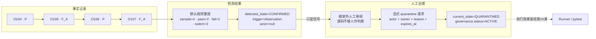

# 第 23 课：自动检测不等于人工治理

## 本课在事实链中的位置

第 21 课已经解释：同一个比较键 K1 下，`P, F_A, P, F_A` 经过默认规则重放，会依次得到 `OBSERVING → SUSPECTED → SUSPECTED → CONFIRMED`。第 22 课又补齐了这些观察怎样从 P0 产物进入持久历史，以及怎样沿 `run_id` 回到来源账本。到这里，框架已经拥有可信历史和可复算的自动信号。

但自动状态中出现 `CONFIRMED`，仍没有回答下面这些问题：

- 谁审阅了这组证据？
- 人是否接受这个统计判断，还是要把它纠正为另一种状态？
- 如果决定进入治理，谁负责，理由是什么，有效到何时？
- 这次决定来自自动规则还是人工动作？

本课继续使用异步图像生成 Case C：

```text
case_id = module/smoke/test_图片生成异步调用.py::TestAsyncImageGeneration::test_f8_09_async_image_generation_task_succeeds_with_result
param_hash = 74234e98afe7498f
environment = overseas
execution_profile = serial
state_epoch = 1
```

其中 `serial` 是执行身份 `serial-pool/master` 归一后的长期比较维度，不是把 `execution_id` 和 `worker_id` 改名。上述五个比较维度生成的完整 `flaky_key` 仍简称 K1；R1～R4、`F_A`、O104～O107 和后文的治理决定都属于离线受控案例，不是 Case C 的生产实测。

本课只回答一个问题：**自动检测已经给出 `CONFIRMED` 后，为什么仍需显式的人工决定，框架又怎样让事实、检测和治理分别留痕而不互相改写？** 至于治理状态是否会改变下一次 pytest 选例，留到第 24 课。

---

## 核心问题

> K1 的四条可信观察已经让自动状态达到 `CONFIRMED`，为什么不能直接宣布“Case C 已经由团队确认并隔离”？

因为现有信息只足以重放统计规则：

```text
O104=P → O105=F_A → O106=P → O107=F_A
sample_size=4
pass_count=2
fail_count=2
outcome_switch_count=3
自动结果=CONFIRMED
```

这些字段没有包含审核者、责任人、治理理由和期限。算法也不知道失败 A 是可接受的外部扰动、测试问题、产品缺陷，还是仍待调查的现象。它能证明“这个窗口满足当前规则”，不能凭空生成组织责任和处置决定。

框架因此把三层信息分开：

| 层次 | 已有输入 | 本层新增的信息 | 本层不能替代什么 |
| --- | --- | --- | --- |
| 事实记录 | 四个 P0 Run | O104～O107 的结果、身份、时间与来源 | 不直接给出 Flaky 分类或处置 |
| 检测结果 | K1 的有序观察 | 状态、计数、切换、规则版本和证据引用 | 不产生 owner、期限或人工理由 |
| 治理决定 | 检测结果与人审阅的上下文 | actor、owner、reason、expires_at 和治理生命周期 | 不改写历史，也不自动决定 pytest 如何选例 |

“统计信号”与“人工治理”之间必须保留一条显式边界。否则，`CONFIRMED` 这个名字会被误读成“人已经认可根因和处置”，而源码中的自动状态并没有这样的含义。

---

## 从一个具体现象开始

沿用前两课的四轮输入：

| 时间 | Run | 持久观察 | 自动状态变化 |
| --- | --- | --- | --- |
| 2026-08-26 | R1：`image-smoke-104-20260826T010000Z-a1b2c3d4` | O104 = `P` | 首条观察，进入 `OBSERVING` |
| 2026-08-27 | R2：`image-smoke-105-20260827T010000Z-b2c3d4e5` | O105 = `F_A` | 首次结果变化，进入 `SUSPECTED` |
| 2026-08-28 | R3：`image-smoke-106-20260828T010000Z-c3d4e5f6` | O106 = `P` | 尚未满足确认阈值，保持 `SUSPECTED` |
| 2026-08-29 | R4：`image-smoke-107-20260829T010000Z-d4e5f6a7` | O107 = `F_A` | 2 pass、2 fail、3 次切换，进入 `CONFIRMED` |

本例假定每轮导入成功后都启用了 Flaky state stage。R4 评估完成时，数据库可以回答：

```text
K1.current_state  = CONFIRMED
K1.detected_state = CONFIRMED
last transition.trigger_type = observation
last transition.reason_code  = confirmation_threshold_met
last transition.actor        = null
evidence observations        = O104, O105, O106, O107
```

`actor=null` 并非表示“匿名人员确认”，而是这条 transition 来自观察触发的自动投影。此刻还没有开放的 `flaky_governance` 记录，也没有 owner、人工理由或到期时间。

现在加入本课唯一的新变量：一次显式人工决定。假设审核者在框架外查看了 K1 的历史和关联材料，决定把它放入有负责人和期限的治理流程。传给框架的受控输入为：

```text
flaky_key = <K1 的完整生产值>
actor     = qa-lead-li
owner     = image-generation-team
reason    = K1 在四个可信 Run 中出现可复核的通过/失败波动，需限期调查
expires_at= 2026-09-05T02:00:00Z
```

这里的 K1 仍只是正文别名；真实调用必须传完整 `flaky_key`。理由只陈述已经有证据支持的波动和后续调查，不把尚未查清的根因写成事实。

这次受控调用按同一条时间线展开。假定人工动作发生在 R4 之后，且 `expires_at` 在动作发生时仍位于未来：

| 时刻 | 事件 | 新增或改变的内容 |
| --- | --- | --- |
| T0 | R4 的 O107 完成 P0 导入 | 事实层新增 O107=`F_A` |
| T1 | state stage 重放 K1 | 检测层新增自动 `CONFIRMED` transition |
| T2 | 审核者查询历史、投影与证据引用 | 只读，不改变数据库 |
| T3 | 审核者提交 quarantine 请求 | 新增待校验的 actor/owner/reason/expires_at |
| T4 | 治理事务校验并提交 | governance=`ACTIVE`，current state=`QUARANTINED` |
| T5 | 再次查询 state 与 governance | 返回检测来源和人工治理两组记录 |

请求成功后的结果是：

```text
P0 observations              保持 O104～O107，不改写
flaky_state.detected_state   保持 CONFIRMED
flaky_state.current_state    CONFIRMED → QUARANTINED
flaky_transition             新增一条 manual_quarantine
flaky_governance             新增一条 status=ACTIVE 的治理记录
```

完整关系如下：



图中最后一条虚线表示一个尚未回答的问题，不表示已有调用。当前治理写入到状态库为止；不能因为状态名是 `QUARANTINED`，就在本课把它翻译成“下一轮会跳过 Case C”。

---

## 为什么原有解释不够

### 同一个状态名不能说明是谁作出的判断

`CONFIRMED` 可能由默认阈值自动产生，也可能由人对 `SUSPECTED` 执行 `flaky-confirm` 后产生。两条路径最终都能看到 `current_state=CONFIRMED`，但证据来源不同：自动路径的 transition 是 bootstrap、observation 或 reprojection 触发，人工路径的 transition 是 manual 触发，并另有 actor、reason 和 override 记录。

因此，只读取最终状态值会丢失“自动推导还是人工纠正”这一关键事实。审计时必须同时读取 transition 及相应的 override 或 governance 记录。

### 统计量不能生成组织责任

四条观察可以计算 pass/fail 数和切换数，却不能计算出 `image-generation-team` 应当负责，也不能计算出 2026-09-05 是合适期限。owner、reason 和 expires_at 都是调用者显式提供的新事实，不是检测器从样本中推导出来的字段。

框架能校验这些文本非空、长度受限以及期限在创建时位于未来，但不能证明 actor 的真实身份、owner 的权限、理由的真实性或期限是否符合团队流程。认证、授权、审批和工单系统若有要求，需要由框架外部机制兑现。

### “处于隔离治理”包含两个不同对象

隔离成功后，`flaky_state.current_state` 是 `QUARANTINED`；与之关联的 `flaky_governance.status` 却是 `ACTIVE`。前者描述当前有效状态，后者描述治理记录的生命周期。治理表只使用 `ACTIVE、RECOVERING、CLOSED`，不存在名为 `QUARANTINED` 的 governance status。

把二者混写，会使“Case 当前处于什么状态”和“这张治理单是否仍开放”失去边界，也会掩盖 owner、期限和关闭原因属于哪一项记录。

---

## 核心概念

本课新增三个概念。历史观察、比较键和默认检测阈值沿用第 21、22 课，不重新定义。

### 1. 自动检测投影（Automatic Detection Projection）

自动检测投影是把同一 `flaky_key` 的有序观察按某版规则重放后得到的派生状态和证据摘要。它解决“当前历史满足哪种统计模式”的问题，包含：

- `OBSERVING、STABLE、SUSPECTED、CONFIRMED` 中的检测词汇；
- 样本数、pass/fail 数、结果与签名切换数；
- 规则版本、投影版本；
- 触发观察和证据 observation/run 引用。

它的生命周期随新观察、迟到观察或显式重建而变化。它与 P0 事实的差别是：观察记录某轮发生了什么，投影解释多轮事实当前符合什么规则。删除或改写观察来迁就投影，会破坏这一分层。

`flaky_state` 同时保存 `current_state` 和 `detected_state`。`current_state` 可以进入治理态 `QUARANTINED/RECOVERING`；`detected_state` 的字段约束只允许四个检测词汇。不过它不能被笼统称为“永远未经人工影响的纯算法值”：人工 `confirm` 或 `mark-not-flaky` 会同时更新两个字段，并可能建立新的评估锚点。要判断状态来源，必须结合 transition 的 `trigger_type` 与审计表，而不是只猜字段名。

### 2. 可审计人工决定（Audited Manual Decision）

可审计人工决定是由调用者显式提交、经过允许状态校验，并留下 actor、reason、前后状态和触发证据的状态动作。当前入口包括：

| 动作 | 允许的起点 | 目标状态 | 主要留痕 |
| --- | --- | --- | --- |
| `flaky-confirm` | `SUSPECTED` | `CONFIRMED` | manual transition + override |
| `flaky-mark-not-flaky` | `SUSPECTED` 或 `CONFIRMED` | `STABLE` | manual transition + override + 新评估锚点 |
| `flaky-quarantine` | `CONFIRMED` | `QUARANTINED` | manual transition + governance |
| `flaky-start-recovery` | `QUARANTINED` | `RECOVERING` | manual transition + governance 恢复字段 |
| `flaky-cancel-quarantine` | `QUARANTINED` | `CONFIRMED` | manual transition + override + governance 关闭 |

“人工”描述动作需要显式调用和人工输入，不表示代码已经完成身份认证或审批。`actor` 与 `reason` 是审计字段；它们能保留调用者提供的文字，不能自行证明文字背后的主体与判断真实。

### 3. 治理生命周期（Governance Lifecycle）

治理生命周期是围绕一次隔离决定保存责任、理由、期限、恢复与关闭信息的记录。它解决的不是“算法如何算状态”，而是“决定由谁负责、为何存在、何时应复核、后来怎样结束”。

```text
flaky_state.current_state：
CONFIRMED --人工隔离--> QUARANTINED --人工开始恢复--> RECOVERING
     ^                         |                         |
     |                         +--人工取消--------------+
     |                                                   |
     +-------恢复期再次变化（regressed）------------------+
                                                         |
STABLE <---------恢复期连续同签名达到阈值（recovered）-----+

flaky_governance.status：
ACTIVE --------人工开始恢复--------> RECOVERING
  |                                      |
  +--人工取消--> CLOSED/cancelled         +--重放结果--> CLOSED/recovered 或 CLOSED/regressed
```

这两条状态线相关但不相同。隔离后，State 是 `QUARANTINED`，Governance 是 `ACTIVE`；开始恢复后，两者才都使用 `RECOVERING` 这个词。每个 K1 同时最多有一条 `ACTIVE/RECOVERING` 的开放治理记录。

---

## 完整运行过程

下面从 R4 的自动结果开始，沿真实职责顺序推导一次隔离决定。

### 阶段一：标准收尾链只生成事实和自动信号

标准 Quality 收尾在 P0 merge 和最终 Run record 之后，依次调用 Semantic、Metrics、Flaky history import 与 Flaky state evaluate。只有总 Quality、Flaky history 和 Flaky state 的相关开关满足条件，且数据库路径有效时，后两步才会实际执行。

对 R4，history stage 把 O107 加入 K1；state stage 读取 K1 的完整有序历史并重放规则，得到自动 `CONFIRMED`。这一阶段可以新增自动 transition 和 `flaky-evaluation.json`，但调用链没有接着调用 confirm、mark-not-flaky、quarantine、start-recovery 或 cancel-quarantine。

所以自动阶段的输出是“待审阅信号”，不是暗含的人工命令。

### 阶段二：读取证据，而不是只读一个状态词

审核者需要把状态与其来源一起看：

```text
比较身份：K1 的五个维度与 epoch
原始历史：O104～O107 及各自 Run 血缘
检测摘要：sample=4、pass=2、fail=2、outcome_switch=3
转换原因：confirmation_threshold_met
触发来源：trigger_type=observation、trigger_observation_id=O107
规则身份：rule_version + projection_version
```

若只看 `CONFIRMED`，无法知道这是自动阈值、人工 confirm，还是旧版本投影留下的状态。若投影为 `STALE`，或规则/投影版本不兼容，治理入口会拒绝把它当作当前状态继续写入。

### 阶段三：人的判断发生在框架外

审核者可以接受自动信号，也可以基于额外证据纠正它。当前模块不读取工单、聊天审批、身份目录或根因报告，因此“谁有权决定”和“理由是否充分”不是算法能够验证的事实。

在本课正常路径中，人只作出有限决定：K1 需要进入一段有 owner 和复核期限的隔离治理。理由不宣称失败 A 已有确定根因。

### 阶段四：显式提交 quarantine 请求

调用者提交完整 K1、actor、owner、reason 和带时区的 expires_at。框架依次检查：

1. expires_at 在执行动作时仍晚于当前 UTC 时间；
2. K1 对应的状态存在、投影为 CURRENT，且规则/投影版本兼容；
3. `current_state` 正好是 `CONFIRMED`；
4. K1 没有另一条 `ACTIVE/RECOVERING` 治理记录。

任一条件不满足，动作失败，不会把现状硬改成隔离。

### 阶段五：在一个事务中写入决定

通过检查后，同一 SQLite `BEGIN IMMEDIATE` 事务完成三项变化：

```text
插入 flaky_governance：
  status=ACTIVE
  owner=image-generation-team
  reason=<人工输入的受控文本>
  created_by=qa-lead-li
  created_at=<框架当前时间>
  expires_at=2026-09-05T02:00:00Z

插入 flaky_transition：
  from_state=CONFIRMED
  to_state=QUARANTINED
  trigger_type=manual
  reason_code=manual_quarantine
  trigger_observation_id=O107
  evidence_observation_ids=[O104,O105,O106,O107]
  actor=qa-lead-li

更新 flaky_state：
  current_state=QUARANTINED
  detected_state=CONFIRMED   # 本动作不把检测层写成治理态
  last_transition_id=<刚写入的 transition>
```

这里不会新增、删除或修改 `case_observation`。若插入治理、写 transition 或更新 state 的任一步失败，事务回滚，不留下“有治理单却没变状态”或“状态已变却没有治理单”的半成品。

### 阶段六：读取接口能还原到什么程度

公开 state 查询返回当前 `FlakyStateRecord`；governance list 返回治理记录本身。自动评估当次写出的 `flaky-evaluation.json` 还会包含该次生成的 transitions。内部 state summary 会关联最后一次转换的 reason，以及开放治理的 governance ID、owner 和 expires_at。

这些信息能够分别回答当前有效状态、检测字段、开放治理责任和到期时间，却还不是一个完整的审计查询 API：当前公开 Store/CLI 没有通用的 transition history 或 override history 列表入口。若要确认一条较早转换究竟由观察还是人工触发，需要保留对应评估报告，或用受控审计工具读取 `flaky_transition`、`flaky_override` 原表；若要得到不受人工锚点影响的算法结果，则需从原始 observations 按相同规则另行重放。

因此，“数据库已经分层留痕”和“公开接口已经提供统一审计视图”是两种不同能力。现有查询同样不能回答“pytest 会不会跳过”；数据库中出现 `QUARANTINED` 只证明治理写入已经发生。

---

## 正常路径

### 输入

本课正常路径使用下面一组已经讲解完成的数据：

```text
K1 history = [O104=P, O105=F_A, O106=P, O107=F_A]
automatic transition = SUSPECTED -> CONFIRMED
automatic reason = confirmation_threshold_met
human decision = quarantine
actor = qa-lead-li
owner = image-generation-team
expires_at = 2026-09-05T02:00:00Z
```

### 三层数据怎样变化

| 时点 | 事实记录 | 检测结果 | 治理决定 |
| --- | --- | --- | --- |
| R4 导入前 | O104～O106 | `SUSPECTED` | 无开放治理 |
| R4 导入后 | 新增 O107=`F_A` | 自动 transition：`SUSPECTED → CONFIRMED`，actor 为空 | 仍无 owner、reason、期限 |
| 人工请求校验后 | O104～O107 不变 | 检测证据不变 | 接受 `actor/owner/reason/expires_at` |
| 事务提交后 | O104～O107 不变 | `detected_state=CONFIRMED` | `current_state=QUARANTINED`，governance=`ACTIVE` |

关键点在第三行：自动结果不会自己“长出”治理信息。只有显式请求通过状态、期限和开放记录检查后，第四行才成立。

### 最终可审计结果

成功后至少存在三条彼此可关联、职责不同的证据：

1. O104～O107 说明四轮分别发生了什么；
2. 自动 transition 说明为什么在 O107 后达到 `CONFIRMED`；
3. governance 与 manual transition 说明谁在何时作出隔离决定、由谁负责、为什么以及何时需要复核。

因此，最终结论应写成：

> K1 的可信历史满足默认自动确认阈值；随后调用者 `qa-lead-li` 显式创建了一条由 `image-generation-team` 负责、带理由和期限的 ACTIVE 治理记录，使当前状态进入 `QUARANTINED`。这些记录没有改写四条 P0 观察，也尚不能证明执行层会跳过 Case C。

不能简写成“系统发现不稳定，所以自动隔离了测试”。这句话同时抹去了人工动作、责任字段和执行边界。

---

## 复杂路径

### 路径一：同一个 `CONFIRMED`，来源可能不同

把时间停在 R2。此时 K1 的历史只有 `P, F_A`，自动状态是 `SUSPECTED`。若审核者基于额外证据决定提前确认，可以显式执行 `flaky-confirm`：

```text
输入：K1 + actor + reason
校验：current_state 必须是 SUSPECTED，且没有开放治理
输出：current_state=CONFIRMED，detected_state=CONFIRMED
留痕：manual transition + action=confirm_flaky 的 override
```

这条人工 transition 的 `reason_code=manual_confirm_flaky`、`trigger_type=manual`，并保留 actor；override 另存调用者给出的 reason。与之对照，R4 的自动确认使用 `reason_code=confirmation_threshold_met`，由 observation 触发，actor 为空，也没有 `confirm_flaky` override。

| 对比项 | R4 自动确认 | R2 人工 confirm |
| --- | --- | --- |
| 最终状态词 | `CONFIRMED` | `CONFIRMED` |
| 触发类型 | observation | manual |
| 原因 | 默认阈值满足 | `manual_confirm_flaky` + 人工 reason |
| actor | 无 | 必填 |
| override | 不产生 | 产生 |

所以 `CONFIRMED` 不能单独证明“已经人工审核”。反过来，K1 在 R4 已经自动 `CONFIRMED` 时再调用 `flaky-confirm` 也不会形成第二次确认；该入口只允许从 `SUSPECTED` 出发，会返回状态转换错误。

### 路径二：人不同意自动确认

回到 R4 的自动 `CONFIRMED`。假设审核者能够证明这组波动不应继续按 Flaky 对待，可以显式执行 `flaky-mark-not-flaky`。该动作不会删除 O104～O107，也不会抹掉此前的自动 transition，而是新增：

```text
manual transition：CONFIRMED -> STABLE
override.action：mark_not_flaky
override.actor / reason：调用者提供
evaluation_anchor：O107
```

当前实现用最新观察建立稳定签名。由于本例 O107=`F_A`，结果会是 `STABLE/fail:A`，不是 `STABLE/pass`。这延续了第 21 课的边界：`STABLE` 表示签名稳定，不表示 Case 健康或最近一次通过。之后若出现与 `fail:A` 不同的新签名，锚点后的评估仍可再次进入 `SUSPECTED`。

这条路径说明人工决定可以纠正派生状态，但不能把历史失败改成通过。若人希望宣称失败 A 是部署事件造成的，那个根因仍需框架外证据支持；reason 字段只是保存这项陈述，不验证其真实性。

### 路径三：状态、期限或开放治理不满足条件

每次只改变一个条件，可以得到三个明确拒绝：

| 改变的条件 | 判断位置 | 结果 |
| --- | --- | --- |
| 在 R2 的 `SUSPECTED` 上直接 quarantine | 要求 `current_state=CONFIRMED` | `invalid_state_transition`，无治理写入 |
| expires_at 已不晚于动作时刻 | 创建前的期限检查 | `invalid_expiry`，无治理写入 |
| K1 已有 ACTIVE/RECOVERING 治理 | 开放治理唯一性检查 | `active_governance_exists`，不创建第二条开放记录 |

若确实要在 R2 进入隔离，必须先由人显式 `flaky-confirm`，再提交 quarantine；这两步各自留下审计记录。框架不会为了满足隔离前置条件而偷偷把 `SUSPECTED` 升成 `CONFIRMED`。

这些治理写操作都经过同一事务包装。后半段写入发生异常时，前面已执行的本次数据库变化会回滚；已存在的 P0 历史和先前提交的状态不受影响。

### 路径四：期限已过，但没有人继续处理

假设治理记录到达 `expires_at` 后仍是 `ACTIVE`。查询 `overdue=True` 会用当前查询时间找出这条记录，自动评估报告也可以把它列入 `overdue`。当前代码没有因到期而自动：

- 把 governance 改成 `CLOSED`；
- 把 `current_state` 改回 `CONFIRMED`；
- 启动恢复；
- 取消隔离；
- 修改 pytest 选例。

`overdue` 是查询条件和报告分类，不是新的治理状态。期限提供“应当复核”的审计信号；谁接收该信号、如何升级仍需外部流程。当前代码没有通用的“延长期限”或“直接关闭治理单”入口；已有关闭路径只有人工取消隔离，或开始恢复后由新证据评估为 `recovered/regressed`。

### 路径五：进入恢复后又出现新证据

只有处于 `QUARANTINED` 且存在 ACTIVE governance 时，显式 `flaky-start-recovery` 才会：

```text
current_state：QUARANTINED -> RECOVERING
governance.status：ACTIVE -> RECOVERING
recovery_anchor_observation_id：记录当时最新观察
```

后续评估只用 anchor 之后的新观察判断恢复。默认规则下，尾部达到 5 个相同签名时，state 进入 `STABLE`，governance 关闭为 `recovered`；若恢复证据出现签名切换，则 state 回到 `CONFIRMED`，governance 关闭为 `regressed`。这里的相同签名不要求是 pass：连续 5 个 `fail:A` 同样会得到 `STABLE/fail:A` 和治理 resolution=`recovered`。`recovered` 表示这次治理生命周期按当前恢复规则结束，不证明 Case 已恢复健康。

两种结束都来自“人工开始恢复 + 后续事实触发评估”的组合，不是原始 `CONFIRMED` 自动替人完成整个治理流程。

这条路径仍不说明执行层在 `QUARANTINED` 或 `RECOVERING` 时做了什么。本课只追踪状态库与审计记录。

---

## 对应的框架实现

概念模型已经区分事实、检测和治理。下面只摘取承担关键分支的代码，并逐项说明输入、输出、状态变化与异常边界。

### 1. 标准收尾只导入并评估，不自动作出治理决定

`run_orchestration/quality_pipeline.py:47-54` 的主干为：

```python
quality_semantic_stage.run_semantic_stage(quality_config)
quality_metrics_stage.run_metrics_stage(quality_config)
flaky_import_result = quality_flaky_stage.run_flaky_history_stage(
    quality_config, status=status
)
quality_flaky_stage.run_flaky_state_stage(
    quality_config, flaky_import_result
)
```

输入是本轮结束状态和 Quality 配置；输出是 P0 下游产物、历史导入结果及自动评估报告。调用序列中没有人工治理函数。Semantic/Metrics 排在前面只是编排顺序，Flaky importer 的输入仍是五份 P0 文件，不读取 Metrics 输出。

`quality/cli.py:124-153,178-188` 另行注册 `flaky-confirm`、`flaky-mark-not-flaky`、`flaky-quarantine`、`flaky-start-recovery` 和 `flaky-cancel-quarantine`。这些命令只有被调用者显式执行时才进入治理服务；自动评估不会替调用者构造 actor、owner、reason 或 expires_at。

### 2. 自动投影先重放事实，再形成带证据的状态

`quality/flaky_store/projection.py:197-219` 可以缩写为：

```python
observations = repository.observations_for_key(connection, flaky_key)
existing = repository.state_or_none(connection, flaky_key)
require_compatible_versions(existing, config)

automatic = replay_observations(observations, config)
current_state = automatic.current_state
detected_state = automatic.detected_state
evidence = automatic.evidence
```

输入是 K1 的持久观察与当前投影；判断先覆盖数据存在性和版本兼容；输出是规则重放得到的状态与证据。后续构造的 state 保存计数、最新观察、规则/投影版本和 transition 引用。异常路径不会捏造一个可用状态。

若 K1 已有开放治理，`quality/flaky_store/projection.py:227-277` 会把治理态与检测态分开处理：ACTIVE 隔离让 `current_state` 保持 `QUARANTINED`，同时保留检测层状态；RECOVERING 则从 recovery anchor 后的新观察评估恢复。由此不能把 `current_state` 与 `detected_state` 当成永远相同的别名。

### 3. quarantine 同时写责任记录与人工 transition

`quality/flaky_store/governance.py:56-98` 的关键分支为：

```python
if request.expires_at.astimezone(UTC) <= now:
    raise FlakyStoreError("invalid_expiry", ...)

state = repository.require_state(connection, request.flaky_key)
if state.current_state is not FlakyState.CONFIRMED:
    raise FlakyStoreError("invalid_state_transition", ...)
repository.require_no_open_governance(connection, request.flaky_key)

repository.insert_governance(
    governance_id=governance_id,
    flaky_key=request.flaky_key,
    owner=request.owner,
    reason=request.reason,
    actor=request.actor,
    created_at=now,
    expires_at=request.expires_at,
)
transition = manual_transition(
    state, to_state=FlakyState.QUARANTINED,
    reason_code="manual_quarantine", actor=request.actor, now=now,
)
repository.update_state_transition(
    request.flaky_key,
    state=FlakyState.QUARANTINED,
    transition_id=transition.transition_id,
    updated_at=now,
)
```

输入是完整 K1 与人工审计字段；正常输出是一条 ACTIVE governance；状态变化是 `current_state` 进入 `QUARANTINED`。`update_state_transition` 只更新 current state，因此本路径中的 `detected_state=CONFIRMED` 被保留。状态错误、过期时间或已有开放治理都会在写入成功前终止。

`quality/flaky_store/facade.py:222-226` 又把整次 operation 包在数据库 transaction 中，所以治理记录、transition 与 state 更新共享提交或回滚结果。

### 4. 人工纠正新增审计记录，不改历史观察

`quality/flaky_store/governance.py:195-248` 的人工 override 主干为：

```python
state = repository.require_state(connection, request.flaky_key)
require_allowed_state(state.current_state)
repository.require_no_open_governance(connection, request.flaky_key)

transition = manual_transition(..., actor=request.actor)
repository.insert_override(
    state,
    action=action,
    to_state=target_state,
    actor=request.actor,
    reason=request.reason,
    now=now,
)
if target_state is FlakyState.STABLE:
    latest = repository.observations_for_key(connection, state.flaky_key)[-1]
    stable_outcome = latest.observation_outcome.value
    stable_failure_id = latest.failure_id
    anchor = latest.observation_id
repository.update_state_after_override(...)
```

输入是现有 CURRENT 投影和显式人工请求；输出是更新后的 state。`confirm_flaky` 与 `mark_not_flaky` 共用这条机制，但允许的起点和目标不同。需要的历史只用于记录证据和建立 anchor，没有 UPDATE 或 DELETE `case_observation` 的步骤。

数据库迁移 `quality/flaky_store/migrations/0002_flaky_state_machine.sql:62-173` 将三类记录分表：transition 记录状态来源与证据，governance 记录责任和期限，override 记录人工纠正。分表不是重复保存同一事实，而是让审计者能够区分“规则算出的状态”“人作出的决定”和“治理单的生命周期”。

---

## 能够保证什么

在标准链路和显式人工入口确实执行、数据库与版本满足下节前提时，当前实现能够保证：

1. 自动检测从同一 K1 的有序持久观察重放，保存状态、统计摘要、规则/投影版本与证据引用。
2. 自动 state stage 不会调用人工 confirm、纠正、隔离、恢复或取消入口，也不会自动生成 owner、reason 和 expires_at。
3. 自动与人工 transition 可以通过 `trigger_type` 区分；人工 transition 必须携带 actor，并关联触发观察与证据引用。
4. `flaky-confirm` 只允许 `SUSPECTED → CONFIRMED`；`flaky-mark-not-flaky` 只允许从 `SUSPECTED/CONFIRMED` 到 `STABLE`。
5. 人工 confirm 与 mark-not-flaky 会留下 override；它保存 action、前后状态、触发观察、actor、reason 和时间。
6. quarantine 只接受 CURRENT、版本兼容的 `CONFIRMED` 状态、未来期限和没有开放治理的 K1。
7. quarantine 成功后，governance 为 `ACTIVE`，state 的 current 为 `QUARANTINED`，检测层状态仍可单独保留。
8. governance 保存 owner、reason、created_by/at、expires_at，以及后续恢复和关闭所需字段；同一 K1 最多有一条开放治理。
9. 单次治理写入中的治理记录、transition、override（适用时）和 state 更新受同一个数据库事务保护。
10. 人工决定不会删除或改写 P0 Case observations；自动 transition 也仍保留，可追溯到规则和证据窗口。
11. 到期的开放治理可以被查询和评估报告列为 overdue；状态不会因查询而被静默改写。
12. 开始恢复和取消隔离都要求明确的前置状态及开放治理；恢复结束会保存 recovered 或 regressed，取消保存 cancelled。

---

## 保证成立的前提

- 第 21、22 课的上游条件继续成立：P0 输入通过门禁，观察身份可比较，failure ID 与时间可用，历史数据库没有被当作真相之外的替代物。
- 总 Quality、Flaky history 和 Flaky state 已启用，且真实 Runner 走标准 finalize 链。它们默认关闭；仓库不能证明任何外部 Job 当前已提供持久数据库路径并启用。
- 人工入口由调用者另行显式执行。标准 Runner 不会在自动 `CONFIRMED` 后自行调用这些入口。
- 调用者使用完整、正确的 `flaky_key`，目标 state 存在、projection 为 CURRENT，规则和投影版本与当前代码兼容。
- 人工请求满足对应状态机前置条件；quarantine 的 expires_at 带时区且在动作执行时仍位于未来。
- actor、reason 以及 quarantine 所需 owner 由外部流程正确提供；数据模型检查非空、长度和时间格式，标准 `quality.flaky_importer` 包装入口还会做脱敏与截断，但直接调用 `FlakyStore` 不经过该层脱敏。身份认证与权限审批仍需由外部系统保证。
- SQLite 数据库可读写且事务能够取得锁；同一 K1 没有冲突的开放治理。
- 若使用 overdue，调用方接受代码以查询时刻和存储时间比较；时间源或时区输入若错误，框架不能替外部系统校正业务日期。
- 若进入恢复，后续观察必须成功导入并落在 recovery anchor 之后，才能参与恢复判断。

---

## 不能保证什么

1. **自动 `CONFIRMED` 不等于人工确认。** 它只表示当前规则阈值满足；状态名本身也不能说明转换来源。
2. **自动检测不能确认根因。** 2 pass、2 fail 和 3 次切换不能证明问题属于产品、测试、框架、网络或外部 LLM 服务。
3. **人工字段不自带真实性。** actor、owner 和 reason 被记录，不代表框架已认证身份、验证权限、完成审批或核实陈述。
4. **人工决定不改写历史。** mark-not-flaky 不会把 fail 改为 pass，quarantine 也不会删除造成信号的观察。
5. **`STABLE` 不等于健康。** 对本课 R4 使用 mark-not-flaky，会按最新 O107 建立 `STABLE/fail:A`，不能翻译成 Case 已恢复通过。
6. **`detected_state` 不能被描述为永远纯自动。** 人工 confirm/mark-not-flaky 会更新它；来源审计必须结合 transition 与 override/governance。
7. **治理期限不会自动执行处置。** overdue 只是一项查询与报告结果，不会自动关闭、恢复、取消或通知负责人。
8. **`QUARANTINED` 不等于 pytest 已跳过。** 本课只证明治理状态被持久化；Runner 是否读取它是另一条调用关系。
9. **治理写入不能证明外部流程已经响应。** owner 字段存在，不等于负责人收到通知、开始调查或按时完成。
10. **治理状态不覆盖 pytest 原始事实。** Case 的 pass/fail、Run 结果和 pytest 退出事实仍属于各自事实层。
11. **自动评估 fail-open 不保证信号完整。** 评估失败会保留既有历史，但可能没有本轮新投影；缺口必须保持未知，不能视作稳定。
12. **数据库持久化不保证永久保存或跨机可用。** 备份、访问控制、容量和生命周期仍由部署环境负责。
13. **Flaky 不依赖 Metrics。** 编排顺序不能被解释成数据依赖，Metrics 结果也不能替代 P0 历史或人工决定。
14. **本课案例不证明真实部署已经启用治理。** `.env.example` 默认关闭相关开关；Jenkinsfile 只在外部提供数据库路径时条件开启历史和状态评估，人工命令仍需另行调用。
15. **`recovered` 不保证业务恢复通过。** 当前恢复规则看的是连续相同签名；稳定失败也可能结束治理生命周期。
16. **持久化审计字段不等于完整公开审计接口。** 当前 CLI 可查 state 与 governance，但没有通用 transition/override 历史查询命令。

本课的核心结论是：**可信历史回答“发生过什么”，自动检测回答“这些事实按当前规则呈现什么模式”，人工治理回答“人决定怎样负责、为何处理以及何时复核”。三层可以关联，但不能互相冒充。自动 `CONFIRMED` 不是人工签字，人工决定也不能重写 P0 事实。**

---

## 与下一课的关系

本课已经让 K1 从自动 `CONFIRMED` 经过显式人工请求进入了可审计的 `QUARANTINED` 治理状态，并保留了 owner、reason、期限、状态来源和原始观察。

但数据库中的治理状态只是信息。下一课将把它放回 Runner 与 pytest 的真实执行链，回答最后一个容易被名称误导的问题：`QUARANTINED` 当前究竟会不会改变选例和执行行为？
