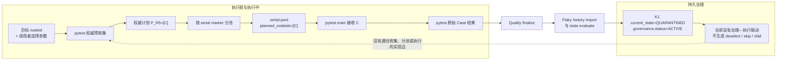

# 第 24 课：治理状态不等于执行行为

## 本课在事实链中的位置

第 21 课说明，Flaky 描述的是同一个可比对象在多轮可信结果中的波动，不是某一次失败的别名。第 22 课把这些结果放入持久历史，并区分了每轮 P0 事实与跨 Run 比较键。第 23 课又把自动检测与人工治理分开：K1 的 `P, F_A, P, F_A` 先按规则达到 `CONFIRMED`，随后只有显式人工请求才能建立治理记录，并把 `flaky_state.current_state` 改为 `QUARANTINED`。

隔离完成后的三个字段仍沿用上一课：

```text
flaky_state.current_state  = QUARANTINED
flaky_state.detected_state = CONFIRMED
flaky_governance.status    = ACTIVE
```

这里必须继续使用准确名称：`QUARANTINED` 是 Flaky State 的当前状态，`ACTIVE` 是开放治理记录的生命周期状态。它们不是同一个字段，也不能互换。

本课仍使用异步图像生成 Case C：

```text
case_id = module/smoke/test_图片生成异步调用.py::TestAsyncImageGeneration::test_f8_09_async_image_generation_task_succeeds_with_result
param_hash = 74234e98afe7498f
environment = overseas
execution_profile = serial
state_epoch = 1
```

这五个维度形成的完整 `flaky_key` 继续简称 K1。K1、R1～R5、O104～O107、O109、失败 A 和人工隔离都属于离线受控案例，不是 Case C 的生产实测。仓库中的 Case C 确实带有文件级 `serial` marker，并在进入测试函数后调用异步图像生成入口；源码不能证明某次外部运行一定启动、一定调用成功或一定通过。

上一课停在“治理决定已经写入数据库”。本课只增加 Runner/pytest 执行层，回答一个问题：**K1 已经是 `QUARANTINED`，当前标准 Runner 会不会因此自动排除、skip 或 xfail Case C？** 这个结论将直接交给第 25 课，用来统一说明 Flaky、Runner 与 pytest 各自拥有哪一类事实。

---

## 核心问题

> 数据库已经把 K1 标为 `QUARANTINED`。下一轮运行的目标仍包含 Case C 时，为什么 Case C 还会进入 pytest 的执行输入？

答案取决于真实的数据流，而不是状态名称的日常含义。当前标准链中：

```text
调用目标与 pytest 选择参数
→ 权威预收集
→ Case 计划
→ marker 分池
→ pytest 执行
→ Quality 收尾
→ Flaky 历史导入与状态评估
```

`QUARANTINED` 保存在最后一端所使用的 Flaky 数据库里。下一轮开始时，Runner 的收集、分池和执行代码没有先读取这项状态，也没有把它转换成 `--deselect`、skip marker 或 xfail marker。因此，只改变 K1 的治理状态，不会改变下一轮的 pytest 选择输入。

需要分别回答五个问题：

| 问题 | 当前事实所有者 | 本课案例中的答案 |
| --- | --- | --- |
| K1 处于什么治理状态？ | Flaky state/governance store | `current_state=QUARANTINED`，开放治理为 `ACTIVE` |
| 本轮原本选择哪些 Case？ | pytest 预收集与 Runner 权威计划 | 由目标、选择参数和当时的插件环境决定 |
| Case C 放在哪个池？ | Runner 调度 | 因 `serial` marker 进入串行候选池 |
| 该池是否真的启动？ | Runner 池间控制流 | 取决于空池、前序退出码和异常，不取决于 K1 状态 |
| Case C 最终是什么结果？ | pytest 实际执行 | 只有运行后才能得到各 phase 的 passed、failed、skipped、xfailed 等状态 |

所以，准确结论不是“隔离 Case 永远会执行”，而是：

> 当调用目标与 pytest 选择条件仍包含 Case C、权威收集成功，并且控制流确实到达 Case C 所在执行池时，`QUARANTINED` 本身不会把 Case C 从计划中移除，也不会为它添加 skip 或 xfail。

这句话同时保留了选择、调度和 pytest 自身可能造成的其他分支。

---

## 从一个具体现象开始

上一课的人工动作发生后，K1 具有如下持久状态：

```text
history                 = [O104=P, O105=F_A, O106=P, O107=F_A]
current_state           = QUARANTINED
detected_state          = CONFIRMED
governance.status       = ACTIVE
governance.owner        = image-generation-team
governance.expires_at   = 2026-09-05T02:00:00Z
```

现在增加一轮发生在期限前的受控运行：

```text
R5 = image-smoke-109-20260830T010000Z-e5f6a7b8
test target = Case C 的完整 nodeid
numprocesses = 2
显式排除条件 = 无
```

这里的 R5 表示 K1 历史中第五个合格位置，不表示它必须使用紧接 Run 107 的编号。第 22 课已经把 Run 108 用作异常输入：它留下导入账本，却没有为 Case C 形成观察。因此，本课改用 Run 109，并为这一轮使用新的 `run_id` 和 `invocation_id`；Case、参数、环境、执行画像和 epoch 五个比较维度保持不变，所以通过导入门禁后形成的观察仍属于 K1，届时才称为 O109。

下面假设权威收集成功、并行候选池为空、串行池能够启动；为了把正常路径闭合，还假设受控的外部响应最终使 Case C 的 call phase 得到 `raw_status=passed`、`final_status=passed`，setup 与 teardown 也没有 FAILED/ERROR。最后这个业务结果只是教学输入，不是仓库或真实服务的历史记录。

按实际职责顺序，时间线为：

| 时刻 | 输入与判断 | 状态变化或输出 |
| --- | --- | --- |
| T0 | K1 已是 `QUARANTINED`，governance 为 `ACTIVE` | 数据库保留治理信息；尚未形成 R5 计划 |
| T1 | Runner 接收 Case C 的完整 nodeid 与 `-n 2` | 参数被拆成收集参数与执行参数；没有读取 K1 |
| T2 | pytest 执行权威 `collect-only` | 得到 `P_R5=[C]`，C 带 `serial` marker |
| T3 | Runner 对 `P_R5` 分池 | `parallel=[]`，`serial=[C]` |
| T4 | 空并行池不启动，且不会阻断后续 | `parallel-pool.status=NOT_RUN`，其计划为空 |
| T5 | Runner 启动串行池 | C 的完整 nodeid 被放进 `pytest.main()` 参数 |
| T6 | pytest 进入 Case C 的 call phase | 测试函数调用异步图像生成；执行期记录 call 的 `raw_status=passed`、`final_status=passed` |
| T7 | 所有池已经返回，Runner 才执行 Quality finalize | 归并执行期已记录的事实、写最终 Run record，随后才可能导入 O109=`P` 并重新评估 K1 |
| T8 | 开放治理仍为 `ACTIVE` | 投影保留 `current_state=QUARANTINED`；这不会倒流改写 T2～T6 |

这一现象可以画成两条方向不同的链：



图中从 A 到 G、再从 G 到 H 的实线是当前调用方向：执行先发生，质量收尾后消费结果。X 到 B 的虚线只标出缺失的联动位置，不表示存在调用。当前代码没有一个组件在 T1～T5 之间读取 K1，并把 `QUARANTINED` 翻译成 pytest 行为。

因此，T6 的 passed CaseResult 不能解释为“隔离失效”，也不能解释为“系统自动解除隔离”。它只说明 Case C 在当前选择与调度条件下仍被执行，并由 pytest 产生了一次新的阶段事实；K1 的治理记录仍可以保持开放。只有后续导入成功，才会再产生 `observation_outcome=pass` 的 O109。

---

## 为什么原有解释不够

### “隔离”这个词不能替代调用关系

在日常表达中，“隔离测试”常被理解为“不再运行”。但当前模型里的 `QUARANTINED` 是一个持久状态值：通过标准 quarantine 入口形成该状态时，它与一条带 owner、reason 和期限的开放治理记录相伴。枚举成员本身不会删除 pytest item，也不会修改命令行参数；数据库约束本身也不能证明任意来源的 `QUARANTINED` 都必然拥有完整治理信息。

要让状态真正影响执行，至少需要一条可定位的机制链：

```text
执行前读取治理库
→ 判定哪条治理记录对本轮仍有效
→ 把 flaky_key 映射到本轮 pytest item
→ 选择一种动作：排除、skip、xfail 或其他策略
→ 记录动作来源与失败处理
```

当前标准 Runner 中没有这条链。缺少其中任何一环，都不能只凭 `QUARANTINED` 的名字宣称 Case 已经不会运行。

### “在计划里”与“已经执行”也不是同一件事

即使 C 出现在权威计划，后面仍可能发生：

- 用户只要求 `--collect-only`；
- 收集完成后，前置并行池返回终止型退出码；
- 执行池内部发生 Python 异常；
- pytest 或其他插件在执行期产生 skip；
- Case setup 失败，call phase 没有开始。

为避免把不同阶段压成一个“执行了”，本课使用下面四个教学分析标签；它们不是仓库模型中的正式状态字段：

```text
collected：C 在成功权威收集形成的 Case 集合中
pool-planned：C 在某个池的 planned_nodeids 中
lifecycle-started：pytest 已开始处理 C，并产生至少一个阶段报告
call-entered：pytest 实际进入 C 的 call phase
```

`collected` 可以推出 Runner 原本把谁纳入计划，`pool-planned` 可以推出某个池预期接收谁，`lifecycle-started` 仍可能只对应 setup error 或 skip。前三者都不能单独推出业务函数已运行，更不能推出测试通过；还需 call 阶段及其结果证据。

### 执行后的分析不能反向改写执行前的选择

当前 Runner 在所有执行池返回后，才进入 Quality finalize。Flaky history import 和 state evaluate 又位于 finalize 的末端。因此，即使 R5 新结果让某项统计发生变化，也只能影响 R5 结束后的持久历史和投影。

这项时序有两个含义：

1. 本轮新算出的状态不能倒流回本轮收集阶段；
2. 已存在的旧状态若要影响下一轮，也必须有一个下一轮执行前的读取者。

第一点由时间顺序排除，第二点由当前 Runner 的输入与调用关系排除。两者不能合并成一句“状态模块与执行无关”：Flaky 结果仍属于质量收尾的一部分，也会进入报告；它只是没有成为当前执行选择器。

---

## 核心概念

本课只新增两个核心概念。权威 Case 集合、执行池、Flaky State 和治理生命周期均沿用前文定义。

### 1. 执行选择输入（Execution Selection Input）

执行选择输入是 Runner 发起权威预收集时，交给 pytest 用来确定本轮成员范围的信息。在当前实现中，它主要来自：

- 目标路径或完整 nodeid；
- `-k`、`-m`、`--ignore`、`--ignore-glob`、`--deselect` 等已识别选择参数；
- pytest 当时能够加载的测试代码、配置和插件环境；
- 未被 Runner 识别的插件参数，因为 Runner 为保留插件既有语义，会把它们同时传给收集与执行。

预收集成功后，最终 `session.items` 被转换成按顺序保存的 `CollectedTestCase`。每项只有 `nodeid` 与可见 marker；Runner 再以这份结果建立本轮权威计划。

执行选择输入解决的是“这轮原本要执行谁”。它与治理状态的差别是：治理状态描述 K1 当前怎样被管理，选择输入才实际进入 pytest 的成员判定。当前 `PytestArgumentPlan`、`CollectionResult` 和 `CollectedTestCase` 都没有 `flaky_key` 或 `current_state` 字段。

### 2. 治理—执行联动（Governance-to-Execution Enforcement）

治理—执行联动是把持久治理决定转换成实际测试选择或运行动作的一条显式机制。它不是一个状态名，而是一组必须落地的责任：何时读取、怎样匹配身份、采用什么动作、失败时继续还是停止，以及怎样审计。

对 K1 而言，身份匹配也不能只比较显示名称。K1 包含：

```text
case_id + param_hash + environment + execution_profile + state_epoch
```

而 Runner 预收集项只有：

```text
nodeid + markers
```

如果未来要实现联动，组件必须明确怎样从本轮参数化 item、环境、计划执行画像和当前 epoch 找到对应治理记录。它还必须明确 `QUARANTINED` 应翻译成 deselect、skip、xfail，还是只发出警告；这些行为对计划分母、JUnit、pytest 退出码和后续 Flaky 观察都有不同影响。

当前仓库没有实现这项联动。因此，本课使用它来标记“缺失的调用关系”，不是把未来设计写成已经存在的能力。

---

## 完整运行过程

下面从 R5 的入口开始，逐步检查每个阶段究竟读取什么、产生什么，以及异常会把控制流带到哪里。

### 阶段一：调用者确定目标和 pytest 参数

`run_master.py` 把命令行交给 `run_orchestration.cli.main()`。CLI 识别位置目标或 `--test-path`、`-n/--numprocesses`、`--dist`、`--serial-marker`，以及兼容参数 `--parallel-first`；`parse_known_args()` 留下的其余参数继续作为 pytest 参数进入 Runner。

本课正常路径的概念输入为：

```text
target = <Case C 完整 nodeid>
numprocesses = 2
pytest args = [--junitxml=reports/smoke-tests.xml]
```

此时数据库中的 K1 没有被读入参数计划。若调用者主动提供 `--deselect` 或 `-k`，那是新的执行选择输入；若没有提供，Runner 不会从治理库补出一个隐藏的排除条件。

若 `partition_pytest_args()` 发现需要值的 pytest 选择或执行参数缺值，Runner 捕获 `ValueError` 并返回 pytest usage error 4，尚未收集任何 Case。CLI 自身的 argparse 语法错误走 `SystemExit` 路径，不属于这个返回 4 的分支。两类错误都不能归因于治理状态。

### 阶段二：pytest 形成权威预收集结果

Runner 以 `--collect-only -q -o addopts=`、调用者的收集参数和目标启动 pytest。pytest 负责发现 item；Runner 的收集插件按最终顺序读取 `session.items`，保存每项的 nodeid 与 marker。

若仓库的轻量 Quality 插件被加载，它看到 `collectonly=True` 会直接返回，不注册 runtime 插件。因此，Quality runtime 不参与这轮权威预收集。即便在后续执行期注册，当前 `pytest_collection_modifyitems` 也只校验每个 item 能否构造 Case ID；它不删 item，不添加 skip/xfail，也不查询 Flaky store。

正常输出是：

```text
collection.raw_pytest_exit_code = 0
collection.cases = [CollectedTestCase(nodeid=C, markers={serial, ...})]
```

若收集得到退出码 5 或其他非零值，Runner 在建立可执行计划和执行池前停止。非 `collect-only` 调用仍会写 `runner-execution.v1`：其中 `planned_nodeids` 直接复制当时的 `collection.cases`，`pool_results` 为空。这只是失败收集留下的诊断快照；即使 pytest 在失败前暴露了部分 item，也不能把它称作成功的权威执行计划。没有 Case 结果更不能写成“隔离生效”或“全部通过”。

### 阶段三：Runner 固定计划并按 marker 分池

收集成功后，Runner 从 `collection.cases` 生成一次 `case_nodeids`，再调用 `split_test_cases()`。该函数逐项执行唯一判断：是否包含指定的串行 marker。

Case C 的文件当前声明 `pytestmark = pytest.mark.serial`，所以：

```text
P_R5       = [C]
parallel   = []
serial     = [C]
```

这一阶段没有读取 `flaky_state`、`flaky_governance` 或 `QUALITY_FLAKY_DB_PATH`。`serial` 在这里描述池级调度位置；K1 中的 `execution_profile=serial` 是长期比较维度。两者有关联，但不是同一个字段，也不能让治理状态反向改变 marker。

重复 nodeid、池间交叉或分池并集不等于原计划时，调度函数拒绝继续。正常分池只改变位置，不增删计划成员。

### 阶段四：非空执行池把明确 nodeid 交给 pytest

因为本例传入 `-n 2`，Runner 采用先并行、后串行的双阶段控制流。空并行池被记录为 `NOT_RUN`，但空池没有错误和终止型退出码，所以控制流继续到串行池。

`execute_pool()` 对非空串行池构造：

```text
pytest args = [C 的完整 nodeid, ...串行执行参数]
```

然后调用 `pytest.main(args)`。这一步可以证明 Runner 已把 C 交给 pytest；它仍不能证明 pytest 已进入 call phase。后续阶段报告只能逐层补充证据：setup 报告说明 pytest 已处理该 item，call 报告才说明流程到达 call phase；setup error 或 setup 阶段 skip 都可能使测试函数根本没有运行。skip、xfail 与最终通过/失败也必须按实际 phase 与状态字段解释，不能由池计划反推。

如果 `pytest.main()` 抛普通 Python 异常，池状态成为 `ERROR`；如果它正常返回，池状态是 `COMPLETED`，并保留原始退出码。`COMPLETED` 只表示调用返回，不等于所有 Case 通过。

### 阶段五：pytest 产生业务执行事实

在本课正常路径的受控假设下，pytest 进入 Case C 的 call phase。Case C 随后调用 `create_and_poll_media_generation()`，检查业务终态属于成功集合，并检查图像 URL 或 Base64 结果存在。

这条业务路径可能形成 passed CaseResult，也可能因请求、轮询、断言或外部服务异常在 call phase 形成 failed；setup 或 teardown 失败则形成 error，skip/xfail 另按其自身状态记录。本课把 R5 的受控三阶段结果均设为 passed，只为展示一个完整输出：

```text
serial-pool.status = COMPLETED
serial-pool.raw_pytest_exit_code = 0
Case C call.raw_status = passed
Case C call.final_status = passed
Case C setup/teardown.final_status = passed
```

这里的整数 `raw_pytest_exit_code` 是池级 pytest 会话事实，`passed` 是 CaseResult 的阶段状态；此时还没有 Flaky `pass` 观察。只有后续 history import 成功，完整 P0 lifecycle 才会按门禁折成 O109 的 `observation_outcome=pass`。这些执行事实由实际 pytest/业务执行产生，Flaky store 既不拥有响应，也不能把失败改成通过；反过来，Case 通过一次也不会自动删除已有治理记录。

### 阶段六：执行结束后才进入 Flaky 收尾

所有池处理结束后，Runner 先计算原始退出结果并写 `runner-execution.v1`，随后在 `finally` 中调用 Quality finalize。启用的收尾链依次执行：

```text
P0 merge
→ 最终 Run record
→ Semantic
→ Metrics
→ Flaky history import
→ Flaky state evaluate
```

这只是编排顺序。Flaky 仍直接消费可信 P0 Case 历史，不读取 Metrics 作为上游。

若 R5 的 P0 事实满足导入门禁，O109=`P` 才会进入 K1 历史。state evaluate 会读取已有开放治理：当 governance 仍为 `ACTIVE` 时，当前投影继续保持 `current_state=QUARANTINED`、`detected_state=CONFIRMED`。在本课的默认规则与五条受控观察 `P,F_A,P,F_A,P` 下，证据窗口的 `sample_size=5`、pass/fail 为 `3/2`，outcome 与 signature 的 switch count 都为 4；最新观察和计数使状态 payload 更新，所以评估结果可为 `EVALUATED`，但 `transitioned_count=0`，K1 仍出现在 `quarantined` 集合中。`EVALUATED` 不能误读成发生了状态迁移。

这证明“隔离期间仍可积累新观察”与“隔离自动跳过”不是同一机制。

history import 与 state evaluate 是不同阶段、不同事务。前者提交成功而后者失败时，新观察可以已经存在，投影却没有成功刷新。此类缺口必须报告为评估失败或未知，不能把旧状态冒充本轮新结论。

---

## 正常路径

### 输入

```text
R5.run_id = image-smoke-109-20260830T010000Z-e5f6a7b8
target = C 的完整 nodeid
numprocesses = 2
selection excludes C = false

K1.current_state = QUARANTINED
K1.detected_state = CONFIRMED
K1.governance.status = ACTIVE
K1.governance.expires_at = 2026-09-05T02:00:00Z

受控 Case lifecycle = setup/call/teardown 均无 FAILED/ERROR，且 call 的 raw/final 均为 passed
```

为了观察执行后的历史变化，本路径再假设总 Quality、Flaky history 与 Flaky state 均已启用，数据库路径有效，R5 最终形成完整可信的 P0 Case 事实。若这些前提不成立，执行选择结论仍可成立，但不能继续声称 O109 已导入。

### 从输入到输出

| 步骤 | 读取的事实 | 判断 | 输出 |
| --- | --- | --- | --- |
| 参数拆分 | target、pytest args、`numprocesses` | 哪些参数用于收集或执行 | 收集参数不含治理状态 |
| 权威预收集 | target、收集参数、pytest 环境 | pytest 是否成功收集 | `P_R5=[C]` |
| 分池 | C 的 nodeid 与 markers | 是否含 `serial` | `parallel=[]`，`serial=[C]` |
| 池间控制 | 空并行池的 `NOT_RUN` | 是否有 ERROR/终止码 | 允许启动串行池 |
| pytest 执行 | C 的 nodeid 与执行参数 | pytest/Case 的真实运行 | 三阶段均无 FAILED/ERROR，call 为 passed；池级原始退出码为 0 |
| Quality 收尾 | R5 原始事实与 P0 门禁 | 是否可导入、是否可投影 | 导入成功才有 O109=`P`；开放治理与 `QUARANTINED` 保持 |

R5 的关键状态变化是：

```text
执行计划：        尚未形成 → [C]
串行池输入：      尚未形成 → [C]
Case lifecycle：  未知 → 三阶段均无 FAILED/ERROR，call 的 raw/final 均为 passed（本例受控输入）
池级原始退出码： 未知 → 0
Flaky 观察：      不存在 → O109(outcome=pass)（仅在导入成功时）
K1 历史：         [O104,O105,O106,O107] → [O104,O105,O106,O107,O109]（仅在导入成功时）
K1 current_state：QUARANTINED → QUARANTINED（ACTIVE governance 仍开放）
```

这里没有“Runner 读取 QUARANTINED 后决定继续执行”这一判断。真实过程更直接：Runner 根本没有把 K1 作为选择输入，所以它按目标、pytest 参数与 marker 继续处理 C。

### 能得出的结论

可以完整陈述为：

> 在 R5 的受控输入中，K1 在运行前已处于 `QUARANTINED`，但标准 Runner 的权威收集仍由目标与 pytest 参数形成。Case C 被收集，因现有 `serial` marker 进入串行池，并在池未受阻时交给 pytest。受控执行形成完整且无 FAILED/ERROR、call raw/final 均为 passed 的 lifecycle 后，Quality 收尾才可能把它折成 pass 观察；开放治理仍使 K1 的当前状态保持 `QUARANTINED`。

不能把它缩写成“隔离无效”。治理记录仍保存责任与期限，也仍影响后续投影展示。当前缺少的是“治理状态自动改变执行”的联动，而不是治理数据本身没有作用。

---

## 复杂路径

下面每条路径先建立清楚的局部基线，再改变一个决定性条件，用来区分“没有执行”可能来自哪里。

### 路径一：调用者显式排除 Case C

把目标从 C 的完整 nodeid 改为其所在测试文件，并增加：

```text
--deselect=<Case C 的完整 nodeid>
```

其余条件保持不变，包括 K1 仍为 `QUARANTINED`。执行过程为：

```text
调用者 selection args 包含 --deselect=C
→ 该参数进入权威预收集
→ pytest 的最终 session.items 不含 C
→ Runner 接受的权威计划不含 C
→ 任一执行池都不会收到 C
→ 本轮没有 C 的新 CaseResult，也不能为它补一条 pass 或 fail 观察
```

最终现象确实是“C 没有执行”，但原因证据位于 `selection_args` 与收集结果，而不是 Flaky 数据库。即使此时把 K1 改回 `CONFIRMED`，同一个 `--deselect` 仍会排除 C；这说明两者没有因果依赖。

`-k`、`-m`、`--ignore` 或第三方插件参数也可能改变收集范围。Runner 有意保留 pytest 与插件的既有选择语义，因此不能承诺任何环境下目标中出现 C 就一定被收集。

### 路径二：C 已计划，但串行池没有启动

现在保持 C 被收集。为了观察池间屏障，先建立一个局部基线：把目标扩大为同时包含并行候选与 C 的混合计划；若前置并行 pytest 返回 0，串行池会正常启动。随后只把这个返回码从 0 改为终止型退出码 4：

```text
权威计划含 C
→ C 进入 serial-pool.planned_nodeids
→ parallel-pool 正常返回 raw_pytest_exit_code=4
→ Runner 判定必须停止后续池
→ serial-pool.status=NOT_RUN
→ C 没有进入本轮 pytest 调用
```

这一结果与 `QUARANTINED` 也无关。证据组合是“计划中有 C + 串行池未启动 + 前置池给出终止型退出码”。若只读取 `planned_nodeids`，会误写成 C 已执行；若只读取 `NOT_RUN`，又可能误写成串行池本来没有 Case。

第 22 课已经确立缺失事实不能补成结果。本路径没有 C 的 call 结果时，Flaky import 不能替它生成一条通过或失败观察。

### 路径三：治理期限已经过去

只把查询时间移到 `2026-09-05T02:00:00Z` 之后。当前存储层会把仍开放且已过期的治理记录列入 `overdue`，但开放治理查询仍以 `ACTIVE/RECOVERING` 为条件；它不会因为日期已过就自动关闭记录、改回 `CONFIRMED` 或启动恢复。

执行链也没有读取 `overdue`。因此：

```text
governance.status = ACTIVE
expires_at < 查询时刻
→ 报告/查询可标记 overdue
→ current_state 仍可保持 QUARANTINED
→ Runner 选择输入仍不变化
```

“期限到达”只产生需要外部流程响应的治理信号，既不是自动跳过条件，也不是自动恢复执行条件。由于 Case C 本来就没有被自动跳过，“恢复执行”这句话在当前实现中没有对应的状态变化。

### 路径四：外部系统真的实现了选择联动

假设另有一个仓库之外的包装器，在启动 Runner 前执行：

```text
查询开放治理
→ 把 K1 映射到 Case C
→ 注入 --deselect=C
→ 保存“因治理策略排除”的审计记录
```

在这个新增前提下，C 可以不进入权威计划。但结论必须写成“外部包装器按自己的策略排除了 C”，不能回写成“当前 Runner 的 `QUARANTINED` 自动生效”。仓库无法证明所有外部启动器和私有插件是否存在这种逻辑。

这条反事实还说明，真正的联动需要明确至少四项契约：

| 契约 | 必须回答的问题 |
| --- | --- |
| 身份映射 | K1 的五维身份怎样对应当前参数化 pytest item？ |
| 动作语义 | 是 deselect、skip、xfail、只告警，还是进入专门池？ |
| 失败策略 | 数据库不可用、状态过期或版本不兼容时继续还是停止？ |
| 审计 | 哪条策略在何时、因哪条治理记录改变了哪些计划成员？ |

当前代码没有给出这些答案，所以本课不会把任一种建议写成现有行为。

---

## 对应的框架实现

前面已经建立了“治理状态—执行选择输入—执行后收尾”的模型。下面只截取决定本课结论的分支；代码为教学化删减，省略日志、报告路径与不相关异常文本，但保留输入、调用顺序、状态变化和异常方向。

### 1. Runner 在创建 Quality 生命周期前完成权威收集

`run_orchestration/runner.py:18-94` 的关键顺序是：

```python
argument_plan = pytest_execution.partition_pytest_args(
    extra_pytest_args or ()
)
collection = pytest_execution.collect_test_case_items(
    test_path,
    argument_plan.collection_args,
)

if collection.raw_pytest_exit_code != PYTEST_EXIT_OK:
    final_exit_code = collection.raw_pytest_exit_code
    if not argument_plan.collect_only:
        final_exit_code = _write_execution_result(
            test_path=test_path,
            argument_plan=argument_plan,
            collection=collection,
            pool_results=(),
            final_exit_code=final_exit_code,
        )
    return final_exit_code

cases = collection.cases
case_nodeids = tuple(case.nodeid for case in cases)
parallel_cases, serial_cases = scheduling.split_test_cases(cases)

if argument_plan.collect_only:
    return PYTEST_EXIT_OK

quality_run_lifecycle = quality_lifecycle.create_quality_run_lifecycle()
```

输入是调用目标和 pytest 参数；成功输出是 `cases`、`case_nodeids` 与两个候选池。收集非零时不创建执行生命周期或执行池，但非 `collect-only` 分支仍把当时的 `collection.cases` 写成诊断快照；空的 `pool_results` 表明这些 nodeid 没有成为池级执行。最关键的时序是：`create_quality_run_lifecycle()` 位于成功权威收集与 `collect-only` 返回之后，而前面的收集和分池都没有 Flaky state 参数。

这段代码并不能单独证明所有插件都不会筛选，因为插件参数会进入 pytest。它能证明当前 Runner 没有在这条主干中读取 K1 并自行生成筛选条件。

### 2. 选择参数来自调用者，收集项只保存 nodeid 与 marker

`run_orchestration/pytest_execution.py:104-181,195-212` 的核心为：

```python
if arg in {"-k", "-m", "--ignore", "--ignore-glob", "--deselect"}:
    collection_args.extend([arg, args[index + 1]])
    selection_args.extend([arg, args[index + 1]])

args = [
    "--collect-only",
    "-q",
    "-o",
    "addopts=",
    *pytest_args,
    str(test_path),
]
exit_code = int(pytest.main(args, plugins=[collector]))

for item in session.items:
    self.items.append(
        CollectedTestCase(
            nodeid=item.nodeid,
            markers=frozenset(marker.name for marker in item.iter_markers()),
        )
    )
```

第一段的输入只来自调用者给 Runner 的参数。第二段让 pytest 决定最终 item，再把 nodeid 与 marker 保存为计划成员。`FlakyStateSummary`、数据库路径和 governance 记录都没有进入这两个数据结构。

对带等号的 `-k=...`、`-m=...`、`--deselect=...` 等形式，函数另有对应前缀分支；上面的删减不表示只支持成对参数。未知插件参数会同时进入收集与执行，这也是外部插件仍可能改变行为的边界。

### 3. 分池只读 marker，执行池原样接收计划 nodeid

`run_orchestration/scheduling.py:8-31` 与 `run_orchestration/pytest_execution.py:319-367` 可组合为：

```python
for case in cases:
    if serial_marker in case.markers:
        serial_cases.append(case.nodeid)
    else:
        parallel_cases.append(case.nodeid)

nodeids = tuple(planned_nodeids)
if not nodeids:
    return PoolExecutionResult(
        planned_nodeids=(),
        status=PoolExecutionStatus.NOT_RUN,
    )

args = [*nodeids, *effective_args]
exit_code = run_pytest(args)  # 内部调用 pytest.main(args)
return PoolExecutionResult(
    planned_nodeids=nodeids,
    status=PoolExecutionStatus.COMPLETED,
    raw_pytest_exit_code=exit_code,
)
```

分池输入是收集项，判断只使用 marker，输出是两个 nodeid 序列。执行函数输入是某个池的 `planned_nodeids` 与执行参数；空池不调用 pytest，非空池把全部 nodeid 放进参数。

异常路径也需要保留：`run_pytest()` 抛出普通异常时，函数返回 `ERROR`，而不是伪造 pytest 退出码。`COMPLETED` 保存 pytest 的原始返回值，不把 1 改成 0。整段没有以 `QUARANTINED` 为条件的分支。

### 4. 当前 Quality collection hook 只检查身份

`quality/pytest_plugin.py:14-30` 在 collect-only 模式直接返回。执行期注册的 `quality/pytest_plugin_runtime.py:152-168` 则只有下面的职责：

```python
def pytest_collection_modifyitems(config, items):
    state = _get_state(config)
    collector = state.collector if state is not None else None
    if collector is None:
        return
    for item in items:
        try:
            build_case_id(item.nodeid)
        except Exception as error:
            collector.capture_integrity(
                source="pytest_plugin",
                code="case_context_build_failed",
                ...,
            )
```

输入是 pytest 已有 items 和可选 Quality collector。正常路径只验证每个 nodeid 能否形成 Case ID；异常路径记录完整性问题。代码没有修改 `items`、调用 deselect hook、增加 marker 或查询 Flaky store，所以当前 Quality 插件不是隔离执行器。

### 5. Flaky 处理位于 pytest 执行之后

`run_orchestration/runner.py:180-211` 先取得池结果，在 `finally` 中才调用生命周期收尾；`run_orchestration/quality_pipeline.py:18-54` 的尾部为：

```python
quality_semantic_stage.run_semantic_stage(quality_config)
quality_metrics_stage.run_metrics_stage(quality_config)
flaky_import_result = quality_flaky_stage.run_flaky_history_stage(
    quality_config, status=status
)
quality_flaky_stage.run_flaky_state_stage(
    quality_config, flaky_import_result
)
```

输入是已经产生的本轮状态和质量产物；输出是历史导入、自动投影及相应报告。Flaky stage 的异常会 fail-open，不会覆盖 pytest 已经形成的原始结果。

当数据库已有开放 ACTIVE governance 时，`quality/flaky_store/projection.py:213-277` 仍先重放 observations，然后把 `current_state` 保持为 `QUARANTINED`。这是执行后读取治理库，用于维护投影；它不是执行前选例。

### 6. 现有测试覆盖了什么

测试只能证明覆盖范围内的预期，不能替代上述生产调用链：

- `tests/test_master_service_parallel_serial.py:95-105` 覆盖 marker 分池；`:108-162` 覆盖收集到的 nodeid 成为 pytest 输入；`:328-359` 覆盖选择参数进入收集；`:387-405` 覆盖终止型并行结果阻止串行池。
- `tests/test_run_orchestration_boundaries.py:18-36,57-86` 检查 `pytest.main` 的单一封装位置，以及 Runner 不直接导入 Quality 业务实现。
- `tests/quality/test_quality_lazy_loading.py:55-56` 检查导入 Runner 时不加载 Quality 模块。
- `tests/quality/test_quality_pytest_plugin.py:44-88,116-136` 覆盖插件记录 pytest 已产生的 pass/fail/skip/xfail，以及 collect-only 不创建质量输出。
- `tests/quality/test_flaky_run_master.py:204-245` 直接覆盖 history stage 返回后才调用 state evaluate；`quality/flaky_store/facade.py:57-74` 的事务上下文才是单次 history import 提交边界的生产代码证据。

仓库目前没有一项“预置 `QUARANTINED` 数据库，再端到端启动 Runner，断言 Case 仍执行”的专门测试。因此，“不自动改变选例”的首要证据是完整生产调用链中没有状态读取与选择写入，测试只为各段职责提供补充覆盖。

---

## 能够保证什么

在标准入口、当前源码与下一节列出的前提成立时，当前实现能够保证：

1. Runner 先根据目标、调用者提供的选择参数和当时 pytest 环境完成一次权威预收集。
2. 权威收集项保存 nodeid 与可见 marker；分池只根据指定串行 marker 分类，不读取 Flaky state 或 governance。
3. 非空执行池把其全部 `planned_nodeids` 作为明确 pytest 输入；空池保存 `NOT_RUN`，不启动 pytest。
4. Case C 当前继承文件级 `serial` marker；只要它进入本轮权威计划，就会被分到串行候选池。
5. 当前 Quality runtime collection hook 只校验 Case ID 并记录完整性异常，不删除 item，也不添加 skip/xfail。
6. Flaky history import 与 state evaluate 位于执行后 Quality finalize；新结果不能反向改变已经完成的本轮选择与 pytest 原始结果。
7. 人工 quarantine 通过独立显式入口写入治理库；标准 Runner 不会因为数据库出现 `QUARANTINED` 自动生成 `-k/-m/--deselect`、修改 marker 或重写 pytest 退出码。
8. 开放 ACTIVE governance 可以让后续投影继续保持 `current_state=QUARANTINED`，同时允许新的可信观察在实际执行后进入历史。
9. 治理期限到达只可形成 overdue 查询/报告信号，不自动关闭治理或改变选例。

这些保证共同支持本课结论：**当前 `QUARANTINED` 是可审计的治理信息，不是已经接线的 pytest 执行策略。**

---

## 保证成立的前提

- 调用经过仓库当前标准入口 `run_master.py → run_orchestration.runner.run()`；直接调用 pytest、另写脚本或私有平台包装器不自动继承本课的 Runner 行为。
- 课程核验的是当前仓库中的 Runner、Quality plugin、Flaky store 与 Jenkinsfile。外部未入库插件、平台策略和命令改写不在可证明范围内。
- 目标和调用者选择参数仍包含 Case C，pytest 在当时的代码、配置与插件环境中成功收集它，且 nodeid 唯一。
- Case C 文件级 `serial` marker 仍存在，Runner 使用默认 `serial_marker=serial`；若调用者改变 marker 名或修改测试代码，必须重新收集并重新判断分池。
- 要从“计划中有 C”继续得出“pytest 接收 C”，控制流必须到达非空串行池；前置池不能出现阻断后续执行的 ERROR 或终止型退出码。
- 要从“pytest 接收 C”继续得出“异步业务函数执行”，pytest 必须真正进入 C 的 call phase；setup 失败、skip、插件行为或中断都可能阻止它。
- 要形成 O109，R5 必须完成可导入的 P0 生命周期，身份、Run 状态、Schema、完整性和数据库路径等门禁均满足；缺失不能补成 pass 或 fail。
- 要在 R5 后成功刷新状态，history import 与 state evaluate 两个阶段都必须成功。观察已经提交不等于投影一定刷新。
- 若讨论 Jenkins Real Smoke，只能确认仓库 Jenkinsfile 在外部提供数据库路径时开启 history/state evaluation，并调用标准 Runner；不能由此证明某个真实 Job 已提供路径或执行过人工 quarantine。

---

## 不能保证什么

1. **`QUARANTINED` 不保证自动跳过。** 当前标准链没有从 Flaky store 到 pytest 选择、marker 或执行池的联动。
2. **`QUARANTINED` 也不保证 Case 必然执行。** 显式选择参数、收集失败、`collect-only`、池间终止、setup 失败、pytest 原生 marker 和其他插件都可能使它不进入 call phase。
3. **计划成员不等于已执行成员。** `planned_nodeids` 记录池输入，不是逐 Case 完成清单。
4. **池 `COMPLETED` 不等于全部通过。** 它表示 `pytest.main()` 正常返回，原始退出码仍可能是 1。
5. **一次 passed CaseResult 或一条 pass 观察不等于治理自动结束。** ACTIVE governance 会继续让当前状态保持 `QUARANTINED`；进入恢复需要显式动作，恢复结束还依赖 anchor 后的新证据。
6. **期限过期不等于自动解隔离。** `overdue` 是查询或报告分类，不会自动关闭、恢复、取消，也不会改变 Runner 输入。
7. **状态字段不证明执行原因。** 看到 `QUARANTINED` 与“本轮未运行”同时出现，仍需检查 selection args、权威计划、池状态和 pytest 报告，不能直接建立因果。
8. **当前仓库行为不覆盖外部系统。** 外部包装器或插件可以实现自己的过滤策略；若存在，必须由其代码、配置和审计事实另行证明。
9. **Jenkins 开启 Flaky 评估不等于开启执行隔离。** 当前 Jenkinsfile 只是条件设置 history/state 开关，再调用 Runner，没有注入治理筛选参数。
10. **Flaky 治理不拥有 pytest 原始事实。** 它不能把 fail 改成 skip、把未运行改成 pass，或覆盖 Runner 汇总的退出码。
11. **运行产生新观察不保证投影同步成功。** history import 与 state evaluate 分属不同阶段；后者失败时应保留诊断缺口。
12. **本课不证明外部 LLM 服务结果。** R5 的 passed CaseResult 与 O109 的 pass 观察都是已说明的受控输入，不能当作生产成功记录。

本课的核心结论是：**治理状态描述“这个可比对象当前怎样被管理”，执行链回答“本轮哪些 pytest item 被选择、计划和实际运行”。只有显式的治理—执行联动才能让前者改变后者；当前标准仓库没有实现这条联动。因此，`QUARANTINED` 不能被翻译成自动 skip、xfail 或 deselect。**

---

## 与下一课的关系

至此，Flaky 模块的四节课形成了完整分层：可信 P0 历史保存可比事实，自动检测投影解释结果波动，人工治理保存责任与期限，Runner/pytest 则独立拥有选择、调度和原始执行结果。一个层次中的状态只有经过明确调用关系，才可能改变另一个层次的行为。

这也提出了全书最后一个综合问题：Runner、Worker、Runtime Hooks、Aggregator、Semantic/Metrics 和 Flaky 分别生产、校验或消费什么事实？每个组件的承诺到哪里停止？下一课将以“事实所有权决定组件能说什么”为核心，把这些边界放进同一张责任图中统一收束。
