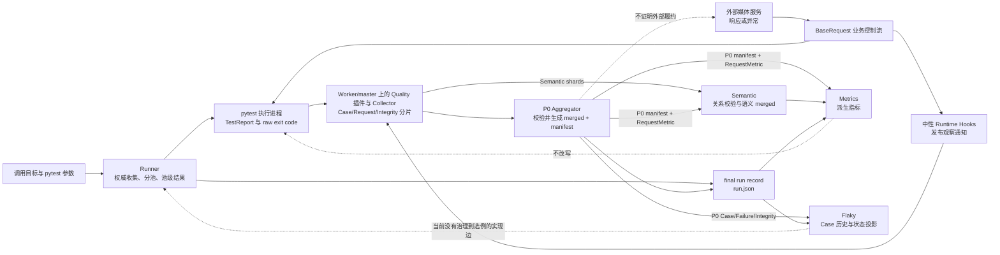

# 第 25 课：事实所有权决定组件能说什么

## 本课在事实链中的位置

前 24 课已经沿同一条事实链完成了六组区分：

```text
Retry / Polling：单次请求、一次逻辑请求与异步业务终态不同
Runner / 身份：权威 Case 集合、调度位置与实际完成顺序不同
Runtime Hooks：业务路径与观察路径不同
Aggregator：原始分片、校验结果与 merged 输出不同
Semantic / Metrics：物理请求事实与业务语义指标不同
Flaky：可信历史、自动检测、人工治理与执行行为不同
```

第 24 课最后确认：`flaky_state.current_state=QUARANTINED` 是 Flaky 持久化的治理状态，当前标准 Runner 不读取它来生成 `--deselect`、skip 或 xfail。一个组件拥有某项状态，并不等于它有权改变另一个组件的行为。

本课把这条原则推广到整条链。仍使用异步图像生成 Case C：

```text
case_id = module/smoke/test_图片生成异步调用.py::TestAsyncImageGeneration::test_f8_09_async_image_generation_task_succeeds_with_result
param_hash = 74234e98afe7498f
environment = overseas
execution_profile = serial
state_epoch = 1
```

仓库中的 Case C 确实带有文件级 `serial` marker，并调用标准入口 `create_and_poll_media_generation()`。这个组合入口的 `retry_policy` 只转交给轮询 GET；默认创建 POST 本身不接收该参数。Case C 当前只传入 `poll_interval` 与 `poll_timeout`，没有传 `retry_policy`，所以本课正常路径采用一次无 Retry 的 POST 和三轮无 Retry 的 GET。固定响应、Run 109、结果状态和质量开关均是离线受控输入，不是外部服务的生产实测。

为保持第 24 课的叙事连续，本课继续使用 `R5`、`K1` 与后文的 `O109` 作为教学简称；它们不是模型字段或数据库中的字面 ID。`R5` 指这轮 Run 109；`K1` 指由五个可比维度计算出的真实 `flaky-v1-<hash>`；`O109` 指由本轮 `run_id + flaky_key` 计算出的真实 `observation-v1-<hash>`。

本课只回答“每个组件有资格依据哪些事实说什么”。第 26 课才把跨 Run 分片、Hook 缺失、输出改动和 `QUARANTINED` 等变化同时放入端到端案例，完成全书收束。

---

## 核心问题

> 同一轮运行同时出现“pytest 返回 0”“P0 完整性为 complete”“业务 Operation 成功”“Flaky 导入一条 pass 观察”和“K1 仍为 QUARANTINED”时，为什么这些结论可以同时成立，却没有任何一个结论能够替代其余结论？

因为它们回答的不是同一个问题：

| 结论 | 回答的问题 | 直接依据 |
| --- | --- | --- |
| pytest 池级原始退出码为 0 | 这次 pytest 调用怎样结束 | `pytest.main(...)` 的返回值 |
| Runner 最终退出码为 0 | 多个执行池及 Runner 自身产物写入怎样合成进程结果 | 池级原始退出码、池状态和 Runner 写入策略 |
| P0 `integrity_status=complete` | 已扫描的分片是否通过当前校验 | 当前 Run、Schema、重复/冲突、数量与 JUnit 等门禁 |
| Operation 成功 | 被记录的请求怎样组成一次业务动作并终止 | Semantic 的 Operation、Group、Session、Event 关系 |
| Metrics 聚合成功 | 已验证来源能否形成规定口径的派生指标 | P0 与 Semantic 产物、哈希、关系和统计规则 |
| Flaky observation 为 pass | 本轮 Case lifecycle 是否可折叠成一条长期观察 | P0 CaseResult、Failure、Integrity 与 Run 门禁 |
| K1 仍为 `QUARANTINED` | 该长期可比对象当前怎样被治理 | 历史投影和开放治理记录 |

这些结论可以通过身份和来源互相连接，却不能互相代替。pytest 返回 0 不证明请求观察完整；Metrics 成功不拥有 pytest 原始退出事实；`QUARANTINED` 也不拥有下一轮选例权。

---

## 从一个具体现象开始

### 受控输入

沿用第 24 课的 R5：

```text
run_id        = image-smoke-109-20260830T010000Z-e5f6a7b8
execution_id  = serial-pool
worker_id     = master
case_id       = Case C 的完整 case_id
param_hash    = 74234e98afe7498f
invocation_id = inv-ef97257482844af73efc4c9d

目标            = Case C 的完整 nodeid
numprocesses    = 2
显式排除条件     = 无
Quality         = 启用
Semantic        = 启用
Metrics         = 启用
Flaky history   = 启用
Flaky state     = 启用
持久数据库       = 可用
```

`invocation_id` 是当前实现对 `run_id + case_id + param_hash` 计算出的本轮身份。K1 在运行前已有第 24 课的受控历史 `P, F_A, P, F_A`，并有一条状态为 ACTIVE 的人工治理记录（governance），所以：

```text
flaky_state.current_state  = QUARANTINED
flaky_state.detected_state = CONFIRMED
governance.status          = ACTIVE
```

外部媒体服务的本轮响应也作为受控输入给定：

```text
E1：POST /v1/media/generations       → HTTP 202，task_id=job-101
E2：GET  /v1/media/tasks/job-101     → HTTP 200，status=pending
E3：GET  /v1/media/tasks/job-101     → HTTP 200，status=pending
E4：GET  /v1/media/tasks/job-101     → HTTP 200，status=succeeded，result.url 非空
```

这里没有 Retry：每次经 BaseRequest 的物理发送各自属于一个 Request Group。四个 Group 共同属于一个 `media_generation` Operation，三个 GET Group 同时属于一个 Polling Session。受控 E4 只提供单数路径 `$.result.url`，不提供 `$.result.urls`，因此 `poll_get` 外层的默认结果下载装饰器不会再用原生 `requests.get()` 发起附件下载；若真实响应包含后一个路径且输出捕获开启，下载请求会额外发生，但它绕过当前 BaseRequest/Quality 观察链，不能算成第五个 Request Event。

### 一轮结束后出现的多种“成功”

在其余门禁也全部满足的受控正常路径中，可以同时得到：

```text
serial-pool.raw_pytest_exit_code = 0
runner.final_exit_code           = 0
Case C call.final_status         = passed
P0 manifest.status               = complete
P0 manifest.integrity_status     = complete
Semantic integrity_status        = complete
Metrics status                   = aggregated
Flaky import                     = IMPORTED，新增 O109=pass
K1 current_state                 = QUARANTINED
```

最后两行并不矛盾。`O109=pass` 是新写入的执行历史；`QUARANTINED` 是开放治理作用后的当前状态。一次新通过不会自动关闭治理，治理状态也没有倒流改写本轮 pytest 结果。

### 先看责任图



实线表示当前存在的数据或控制流。三条虚线标记禁止跨越的边界：

- Flaky 当前不能用治理状态改变 Runner 选例。
- Semantic/Metrics 不能把派生结论写回 pytest 原始结果。
- Aggregator 不能因为 Schema 与哈希通过，就替外部服务证明业务真实。

---

## 为什么原有解释不够

### “都写着成功”不等于“是同一个成功”

`HTTP 200`、`status=succeeded`、`call=passed`、`raw exit code=0`、`manifest.status=complete` 和 `Metrics status=aggregated` 分别属于协议、业务、Case、pytest 会话、文件提交和指标聚合层。它们的判断输入不同，生命周期也不同。

例如，`manifest.status=complete` 表示 Aggregator 已完成输出写入流程。即使校验过程中出现 ERROR，代码仍可能写出四份 merged 文件和 `status=complete`，同时把 `integrity_status` 标为 `failed`。所以只读 `status` 就宣称“事实可信”，已经越过了字段本身的含义。

### “后执行”不等于“依赖前一个结果”

Quality 收尾的调用顺序是：

```text
P0 merge
→ final run record
→ Semantic
→ Metrics
→ Flaky history
→ Flaky state
```

这只能说明程序调用先后。Metrics 确实读取 P0 RequestMetric 与 Semantic 输出；Flaky 却直接读取 P0 的 Run、CaseResult、Failure 和 Integrity 产物。把图画成 `P0 → Metrics → Flaky`，会错误地把调用顺序解释成数据依赖。

### “校验通过”不能升级为“事实真实”

Schema 可以说明字段形状符合模型；哈希可以说明当前字节与清单中的摘要一致；数量对账可以说明唯一 Invocation 数符合给定数字。它们都不能单独证明：

- 分片一定来自声称的 Worker；
- 外部服务确实只执行了一次业务动作；
- 所有应该存在的 Worker 分片都已经出现；
- 业务结果和长期治理结论一定正确。

每种校验只能在自己的输入与规则范围内缩小不确定性，不能把未检查的命题顺带变成事实。

### “没有记录”不等于“没有发生”

Runtime Hook 或 Collector 失败时，业务请求可能已经完成，但 RequestMetric 没有落盘。Metrics 的 `no_data`、`unknown_count` 或失败状态描述证据不足；它们不能被改写成“请求数为 0”“用量为 0”或“业务没有问题”。

因此，需要一套能回答“谁产生、谁校验、谁解释、谁无权改写”的统一模型。

---

## 核心概念

本课只新增两个核心概念。

### 1. 事实所有权（Fact Ownership）

事实所有权是某个组件对自己直接产生、记录或作出的结果承担定义责任。它回答：

```text
这个字段由谁首次形成？
它描述哪个生命周期？
谁可以更新它？
出现冲突时应回到哪一层取证？
```

例如：

- pytest 产生阶段报告和每次 `pytest.main()` 的原始退出码；
- Runner 形成权威收集结果、池计划和 Runner 最终退出码；
- Worker 侧插件根据 pytest 报告生成带五级身份的 CaseResult 副本；
- Aggregator 产生 merged 集合、完整性结论和输出哈希；
- Metrics 产生统计派生值；
- Flaky 产生跨 Run 观察、自动状态和人工治理记录。

“拥有”不表示该组件可以替所有上游担保。Worker 拥有自己写出的分片，却不能据一份分片宣布全 Run 完整；Metrics 拥有指标值，却不能重写组成指标的 RequestMetric。

### 2. 消费证据契约（Consumer Evidence Contract）

消费证据契约是一个消费者在作出结论前明确接受哪些输入、校验哪些条件、输出什么派生事实，以及失败时怎样表达。它至少包含四部分：

| 契约部分 | 要回答的问题 |
| --- | --- |
| 输入集合 | 读取哪些文件、字段和身份？ |
| 准入门禁 | 校验 Run、Schema、哈希、关系还是状态？ |
| 派生规则 | 如何从输入形成新结论？ |
| 失败表达 | 是拒绝、degraded、no_data、unknown，还是 fail-open？ |

Semantic 与 Flaky 的契约不同。Semantic 需要 RequestMetric 与语义关系；Flaky 需要可折叠的 P0 Case lifecycle。因而同一份 RequestMetric 被改动时，Semantic 必须拒绝它，而 Flaky 可以在自己的 Case 证据仍可信时继续工作。这不是标准不一致，而是两个消费者没有宣称同一种事实。

可以把本课的推理规则压缩为：

```text
组件可作出的结论
≤ 它实际读取并验证的事实
∩ 它实现的派生规则
∩ 本次确实启用并经过的调用路径
```

任何一项缺失，都必须缩小结论，而不是由组件名称补齐。

---

## 完整运行过程

下面沿 Run 109 的真实编排顺序走一遍。时间线中的响应和最终状态仍是本课给定的受控事实；“框架在什么位置处理这些事实”来自当前源码。

```text
T0   Runner 调用 pytest 做一次权威预收集
     输入：目标、选择参数
     输出：Case C 的 nodeid 与 marker、collection raw exit code

T1   Runner 固定 Case 集合并分池
     Case C 带 serial marker，因此进入 serial-pool
     numprocesses=2 只让 parallel-pool 具备 xdist 并发，不改变 Case C 身份

T2   serial-pool 启动 pytest
     execution_id=serial-pool；非 xdist 执行端的 worker_id=master
     pytest.main(...) 的返回值成为这个池的 raw_pytest_exit_code

T3   Quality pytest 插件建立上下文
     Run Context：run_id + execution_id + worker_id
     Case Context：case_id + param_hash + invocation_id
     Collector 为 serial-pool/master 准备独立分片

T4   Case C 进入 call phase，建立 media_generation Operation
     POST 没有 retry_policy，因此只物理发送一次
     Hook 把这次发送映射成 Request Event，并关联到一个 Request Group

T5   POST 返回受控的 HTTP 202 和 job-101
     Polling Session 随后执行三轮 GET
     三轮 GET 分别返回 pending、pending、succeeded

T6   标准 Adapter 形成语义观察
     1 个 Operation
     4 个 Request Group：1 个提交 Group + 3 个无 Retry 的查询 Group
     1 个 Polling Session：包含 3 个查询 Group
     4 个 Request Event：对应四次物理发送

T7   pytest 依次产生 setup、call、teardown TestReport
     call 的受控 final_status=passed
     插件依据这些报告派生 CaseResult，不改 report.outcome

T8   Collector 写出当前执行端的 Case、Request、Integrity 分片
     Semantic Collector 写出 Operation、Group、Session 等语义分片
     写入失败会尝试留下 IntegrityIssue，但不能反向改写业务响应

T9   Runner 得到池级结果并写 execution-result.json
     serial-pool.raw_pytest_exit_code=0
     本例所有已运行池均正常，Runner 产物也写入成功，所以 final_exit_code=0

T10  Quality 收尾先执行 P0 Aggregator
     扫描分片 → 校验当前 Run/Schema → 处理重复与冲突
     → 对账预期 Case/JUnit → 写 merged → 计算 output SHA256 → 写 manifest

T11  写 final run record，然后处理两个下游分支
     请求语义分支：Semantic → Metrics
     Case 历史分支：Flaky history → Flaky state

T12  本轮结果收束
     Semantic 恢复 Operation/Group/Session/Event 关系
     Metrics 依据已验证来源形成派生指标
     Flaky 折叠 Case lifecycle，新增 O109=pass
     开放 governance 仍生效，因此 K1.current_state=QUARANTINED
```

### 这条时间线里有三种不同的“先后”

第一种是业务控制流：POST 完成后才取得 `job-101`，随后才能执行 GET。第二种是事实提交顺序：Worker 先写分片，Aggregator 后写 merged 与 manifest。第三种是编排调用顺序：P0、Semantic、Metrics、Flaky 依次被调用。

这三种先后不能互换。尤其是：

```text
调用顺序：P0 → Semantic → Metrics → Flaky

与本课复杂路径有关的主要数据依赖：
Worker Semantic shards ───────────────→ Semantic
P0 manifest + RequestMetric ─────────→ Semantic ──→ Metrics
P0 manifest + RequestMetric ──────────────────────→ Metrics
run.json ─────────────────────────────────────────→ Metrics

P0 manifest + CaseResult / Failure / Integrity ──→ Flaky
run.json ─────────────────────────────────────────→ Flaky
```

Metrics 同时消费 P0 RequestMetric 和 Semantic 输出。Flaky 虽然在 Metrics 之后被调用，却不读取 Metrics，也不读取 RequestMetric。这项区别将决定复杂路径中两个分支为何会得到不同结果。

### 每一层怎样把输入变成自己的输出

| 层 | 直接输入 | 本层新形成的事实 | 本层没有取得的权力 |
| --- | --- | --- | --- |
| Runner | pytest 参数、权威预收集结果、marker、池结果 | 权威 Case 集合、池计划、池状态、Runner 最终退出码 | 不能替 Worker 证明请求观察完整，不能按当前 Flaky 状态自动隔离 Case |
| pytest / Worker | 精确 nodeid、Run/Execution/Worker 上下文、TestReport | pytest 原始退出事实、阶段 CaseResult、Worker 分片 | 单个分片不能代表全 Run，CaseResult 不能证明外部服务履约 |
| Runtime Hooks | 业务请求前后事件、身份与语义上下文 | Hooks 发布和分发中性通知；标准 Adapter/Collector 再派生并持久化 Request/Semantic 记录 | Hook 结果不控制业务响应；fail-open 不保证观察一定落盘 |
| P0 Aggregator | 当前发现的分片、预期 Execution/Case 数、JUnit | merged 集合、IntegrityIssue、完整性状态、output SHA256 | 不能证明来源真实性、业务真值或每个 Worker 的全部分片都出现 |
| Semantic / Metrics | 已验证的 P0 RequestMetric、语义分片、Run 记录 | 业务关系、覆盖范围和派生指标 | 不能改写 pytest、补造缺失用量或把外部履约当成已证明事实 |
| Flaky | 已验证的 P0 CaseResult、Failure、Integrity、历史与治理记录 | observation、自动状态、当前治理状态 | 当前不能改变 Runner 选例，也不能依据 Case 历史证明请求事实完整 |

这张表中的“新形成”就是事实所有权的落点；“直接输入”与检查条件共同构成消费证据契约。

其中还要再拆一层责任：Runtime Hooks 拥有通知分发与 fail-open 规则，Quality Adapter 拥有从中性通知到质量模型的映射，Collector 拥有把记录写入当前执行端分片的动作。三者在调用链上相连，并不因此变成同一个事实生产者。

---

## 正常路径

正常路径不再增加变量：四次受控 HTTP 发送全部被标准 Runtime Hooks 捕获，Worker 写入成功，P0 与下游的门禁全部通过。

### 第一步：Runner 只对执行计划和进程结果负责

权威预收集得到 Case C 后，Runner 依据文件级 `serial` marker 把它放入 `serial-pool`。即使命令传入 `numprocesses=2`，这个参数也不会把串行 Case 改成并行 Case。Runner 给 pytest 的是预收集得到的精确 nodeid，而不是让各执行端重新定义权威集合。

本例的 pytest 调用返回 0，于是池级原始事实为：

```text
stage_id              = serial-pool
status                = COMPLETED
raw_pytest_exit_code  = 0
planned_nodeids       = [Case C nodeid]
```

Runner 汇总所有池结果；没有池级基础设施 `ERROR`，也没有非零 raw code，并且 `execution-result.json` 写入成功，因此形成自己的 `final_exit_code=0`。这里仍需保留两层事实：池级 raw code 来自 pytest，Runner final code 来自跨池合成和 Runner 自身写入规则。

### 第二步：业务响应与观察事实并行形成

每一次 `_send()` 都先进入 before middleware，再调用 `session.request()`，成功后进入 after middleware。标准 Runtime middleware 在这些位置发布中性通知，绑定的 Quality Adapter 再把通知解释成 RequestMetric 和语义记录。

对本例四次物理发送，正常观察结果可以写成：

| Event | HTTP 与业务结果 | 语义归属 | Worker 观察 |
| --- | --- | --- | --- |
| E1 | POST 202，取得 `job-101` | Operation 的提交 Group | 1 条 RequestMetric |
| E2 | GET 200，`pending` | Polling Session 的查询 Group 1 | 1 条 RequestMetric |
| E3 | GET 200，`pending` | Polling Session 的查询 Group 2 | 1 条 RequestMetric |
| E4 | GET 200，`succeeded`，`result.url` 非空 | Polling Session 的查询 Group 3 | 1 条 RequestMetric |

没有 Retry，所以每个 Group 只有一次发送。HTTP 200 只描述三个 GET 的协议结果；`status=succeeded` 让 Polling 状态机返回，并使外层 `media_generation` Operation 正常结束。组合调用返回以后，Case C 才检查 `result.url` 是否存在；这个断言决定 Case 能否继续通过，不是 Semantic Operation 成功的条件。Hook 记录成功也只说明观察路径完成，不能替外部服务增加任何契约。

### 第三步：Worker 保存局部事实，P0 建立本轮可消费账本

pytest 对 Case C 产生阶段报告。插件依据 `report.when` 和 `report.outcome` 写 setup/call/teardown 三条 CaseResult，并使用相同 `invocation_id` 把它们归入同一次 Case 调用。请求观察写入 `requests-serial-pool-master.jsonl`；Case 阶段写入 `cases-serial-pool-master.jsonl`。文件名体现执行端归属，但可信身份仍来自记录内字段，不能只靠文件名判断。

Aggregator 对“它实际扫描到的分片”执行当前实现的门禁。正常路径中：

1. 分片记录属于 Run 109，且能通过当前 Schema。
2. 相同身份没有冲突副本。
3. `serial-pool` 存在至少一份 Case shard。
4. 唯一 `invocation_id` 数与受控 `expected_case_count` 相符。
5. JUnit 中的 Case identity 能与 P0 CaseResult 对账。
6. 四份 merged 文件写入成功，并分别计算 output SHA256。

因此可以得到：

```text
manifest.status           = complete
manifest.integrity_status = complete
```

前者说明本次提交流程写到了完成态，后者说明当前已扫描输入通过当前门禁。它们在正常路径中恰好都为 `complete`，仍然是两个独立字段。

### 第四步：两个消费者分支分别作结论

Semantic 读取自己的语义分片，同时只从 P0 侧读取 `request-metrics.jsonl`。它确认 P0 manifest 属于当前 Run、提交状态为 complete，并重新计算 RequestMetric 的 output SHA256；随后校验 Operation、Request Group、Polling Session 与 Request Event 的引用关系。本例关系与哈希均满足时，它可以形成 `integrity_status=complete` 的语义输出。

Metrics 再读取 `run.json`、P0 RequestMetric、Semantic manifest 与四份 Semantic merged 文件，独立复验版本、Run、完整性、哈希和来源关联。标准媒体组合入口把外层 Operation 标为 `workload`；在本例 Run 为 FINISHED、存在一个 workload Operation 且没有 degraded reason 的受控前提下，Metrics 状态为 `aggregated`。指标仍保留 unknown 与覆盖计数，本课不为未给定的 Token 或媒体用量补零。

Flaky 走另一条支路。它读取 P0 的 `case-results.jsonl`、`failures.jsonl`、`integrity-issues.jsonl`、manifest 和 `run.json`，验证自己的相关 output SHA256，再把三阶段 Case lifecycle 折叠成一条 `pass` observation。它不需要先获得 Metrics 结果。

于是同一轮受控运行得到的结论是：

```text
执行层：pytest raw=0；Runner final=0；Case call=passed
账本层：P0 manifest.status=complete；P0 integrity_status=complete
语义层：Operation 成功；Semantic integrity=complete；Metrics aggregated
历史层：新增 O109=pass；自动历史被重放
治理层：开放 governance 未关闭，current_state 仍为 QUARANTINED
```

每一行都能追溯到自己的输入，但没有一行可以单独推出其余四行。

---

## 复杂路径

复杂路径只增加一个变化：它从 P0 manifest 与 final run record 已写完、Semantic/Metrics/Flaky 尚未首次运行的时点分叉，有人只给 `merged/request-metrics.jsonl` 追加一个换行。此时还没有旧的 Metrics payload；CaseResult、Failure、Integrity、Run 记录、pytest 结果与语义分片都不改动。

### 变化发生在哪一个提交边界之后

P0 完成时曾记录：

```text
manifest.output_hashes["request-metrics"] = H_before
```

追加换行后，JSONL 中的非空逻辑记录没有增加，但文件字节已经改变：

```text
SHA256(request-metrics.jsonl) = H_after
H_after != H_before
```

P0 manifest 不会自行回写，所以磁盘上仍能读到：

```text
manifest.status           = complete
manifest.integrity_status = complete
```

这两个旧字段描述 Aggregator 当时完成的提交与校验，不是对未来所有文件字节的持续保证。下游若要消费当前文件，必须执行自己的复验。

### Semantic 为什么拒绝

Semantic 的 P0 输入契约明确包含 RequestMetric 文件及其 manifest 摘要。它先计算当前文件的 `H_after`，再与 `H_before` 比较，得到：

```text
code             = p0_request_metrics_hash_mismatch
semantic result  = integrity_status=failed
```

即使多出的只是空行，哈希契约比较的也是字节内容。Semantic 不能因为 JSONL 解析时会跳过空行，就假装输入没有越过提交边界。

这里的“拒绝”准确地说是拒绝该 P0 RequestMetric 证据，不是让整个 Semantic merge 立刻抛异常退出。`_load_p0_evidence()` 返回后，主流程仍继续校验关系、逐文件写出四份 Semantic merged，并写出 `manifest.status=complete`；但 `integrity_status=failed`。由于 P0 请求集合没有被载入，本例四个 Group 引用的四个 Event 还会分别产生 `request_event_missing`。这再次说明提交状态不能替代完整性状态。

### Metrics 为什么也拒绝

Metrics 不是简单信任“Semantic 已经运行”。它自己的来源加载器也会复验 P0 RequestMetric 的 output SHA256，并要求 Semantic 来源关联与完整性满足条件。本例至少已有 P0 RequestMetric 哈希不匹配，因此 Metrics 来源门禁失败：

```text
metrics status  = failed
metrics payload = 不生成
```

失败包装中的计数字段即使出现 0，也只是没有构建出 metrics payload，不能改写成“观测到 0 次请求”“Token 用量为 0”或“失败率为 0”。缺失结论仍然是未知或不可计算。

### Flaky 为什么仍可继续

Flaky 的路径字典不含 `request-metrics.jsonl`、Semantic 目录或 Metrics 产物。它复验的是 CaseResult、Failure 和 Integrity 等与 Case lifecycle 有关的 P0 输出。当前变化没有改动这些文件；在 Run 已结束、Case 阶段可折叠、相关哈希和完整性门禁仍满足，并且这个独立分支尚未导入 Run 109 时，Flaky 可以继续导入 `O109=pass`。

这不是 Flaky 忽略了自己承诺范围内的错误。它根本没有依据请求事实作结论：

```text
Semantic/Metrics 的问题：这些请求事实还能否被解释和统计？
Flaky 的问题：这次 Case lifecycle 能否形成一条可信历史观察？
```

两个问题使用不同输入，因此允许一个分支拒绝、另一个分支继续。Flaky 的继续导入也不能反过来证明 RequestMetric 未被改动。

### 正常路径与复杂路径对照

| 对比项 | 正常路径 | 复杂路径 |
| --- | --- | --- |
| 唯一变化 | 无 | P0 提交后给 RequestMetric 文件追加换行 |
| pytest / Runner | raw=0，final=0 | 不变 |
| P0 manifest 字段 | status=complete，integrity=complete | 旧字段不变 |
| 当前 RequestMetric 哈希 | 等于 manifest 摘要 | 与 manifest 摘要不同 |
| Semantic | 接受并形成完整语义输出 | 拒绝 P0 请求证据；仍写 status=complete、integrity=failed 的语义 manifest |
| Metrics | 形成 metrics payload | 来源门禁失败，不形成 payload |
| Flaky | 导入 O109=pass | 自身门禁仍满足时继续导入 O109=pass |
| K1 当前治理状态 | QUARANTINED | 仍为 QUARANTINED |

这个分支给出一个可复用的判断方法：看到某个组件成功或失败时，先列出它实际读取并验证的输入，再判断结论能传播到哪里；不能按流水线位置把结论向所有方向扩散。

---

## 对应的框架实现

前面的模型已经区分了每层责任，下面只截取决定边界的分支。代码路径均为仓库当前实现；省略的部分不改变这里讨论的控制流。

### Runner：先固定权威集合，再合成自己的退出结果

标准入口最终进入 `run_orchestration/runner.py:34-211`。关键顺序可缩写为：

```python
collection = pytest_execution.collect_test_case_items(
    test_path,
    argument_plan.collection_args,
)
cases = collection.cases

parallel_cases, serial_cases = scheduling.split_test_cases(
    cases, serial_marker=serial_marker
)

with quality_run_lifecycle.stage_environment("serial-pool"):
    serial_result = pytest_execution.execute_pool(
        "serial-pool",
        serial_cases,
        serial_args,
        allure_lifecycle=allure_lifecycle,
    )

final_exit_code = _final_exit_code(pool_results)
final_exit_code = _write_execution_result(
    ...,
    pool_results=tuple(pool_results),
    final_exit_code=final_exit_code,
)
```

输入是 pytest 参数和预收集得到的最终 `session.items`；分池只改变 Case 的调度位置。`execute_pool()` 内部的 `pytest.main()` 返回值保存在池级 `raw_pytest_exit_code`。`_final_exit_code()` 合并各池 raw code；若池状态是基础设施 `ERROR`，则返回测试失败码。随后 `_write_execution_result()` 保存权威计划与池结果；写入失败时，它保留已有终止型退出码，否则把 Runner 最终码改为测试失败码。

因此，Runner 拥有 final code 的合成规则，但不拥有每个 raw code 的原始含义，也不能用 Quality 派生结论覆盖 pytest raw code。

### pytest 插件：派生阶段记录，不接管 TestReport

`quality/pytest_plugin_runtime.py:87-119,179-257` 在实际执行端建立上下文并派生阶段记录。xdist controller 不创建 Collector；worker 或非 xdist 的 `master` 才按传播配置写自己的分片：

```python
if _is_xdist_controller(config):
    return

run_context = QualityRunContext(
    run_id=_required(runtime_config.run_id, "run_id"),
    execution_id=_required(runtime_config.execution_id, "execution_id"),
    worker_id=_worker_id(config),
    output_dir=runtime_config.output_dir,
)
state.collector = configure_collector(run_context, ...)
```

收到阶段报告后，插件构造新的 CaseResult：

```python
status = _case_status(report)
result = CaseResult(
    run_id=collector.run_context.run_id,
    execution_id=collector.run_context.execution_id,
    worker_id=collector.run_context.worker_id,
    case_id=case_context.case_id,
    invocation_id=case_context.invocation_id,
    phase=CasePhase(report.when),
    raw_status=status,
    final_status=status,
    ...,
)
collector.record_case(result)
```

输入是 pytest 已经产生的 `TestReport` 与当前身份上下文；输出是依据报告派生、带稳定归属的新 CaseResult。代码没有给 `report.outcome` 赋新值。写入异常会尝试记录 `case_write_failed`，但不会把原本 passed 的报告改成 failed。相反，这也意味着“pytest 通过”不能证明派生记录一定写成功。

### Runtime Hooks：业务调用照常返回，观察异常被隔离

`common/base_request.py:258-272` 的核心发送顺序是：

```python
self._run_before_middlewares(context)
try:
    response = self.session.request(
        method=context.method,
        url=context.url,
        **context.kwargs,
    )
except Exception as error:
    self._run_exception_middlewares(context, error)
    raise

self._run_after_middlewares(context, response)
return response
```

`common/runtime_hooks/lifecycle.py:260-271` 对 Hook 的调用使用：

```python
def _safe_call(function, *args, **kwargs):
    try:
        function(*args, **kwargs)
    except Exception:
        return
```

业务请求异常在 exception middleware 之后原样抛出；普通 Hook `Exception` 则停留在观察路径，不成为业务异常。这个实现只捕获 `Exception`，不能扩大成“所有 `BaseException` 都会被吞掉”。当前标准 Quality Adapter 不改写业务响应，但 Hook 协议也不是对任意第三方实现施加对象不可变性的安全边界。

发送次数还有一条旁路边界：`common/base_request.py:123-161` 的 `poll_get` 被结果下载装饰器包裹；`common/base_decorators.py:50-73` 在 `$.result.urls` 存在且输出捕获开启时调用原生 `requests.get()`。它不经过上述 `_send()`，所以既不属于四个 Group，也不会生成第五个 Quality Event。本课受控 E4 不含该 URL 路径，因而业务网络发送总数与 Quality Event 数都为四。

### P0 Aggregator：提交状态与完整性状态分别形成

`quality/aggregator.py:124-162` 的主流程先扫描和对账，再写输出：

```python
_scan_shards(state, layout.shards)
_read_junit(state)
_reconcile(state)
_classify_failures(state)

integrity_status = _integrity_status(all_issues)
write_jsonl_atomic(output_paths["case-results"], ...)
write_jsonl_atomic(output_paths["request-metrics"], ...)
write_jsonl_atomic(output_paths["failures"], ...)
write_jsonl_atomic(output_paths["integrity-issues"], ...)
output_hashes = {name: _file_sha256(path) for name, path in output_paths.items()}
_write_manifest(state, manifest_path, status="complete", output_hashes=output_hashes)
```

`integrity_status` 由校验问题计算，`status="complete"` 则在四份 merged 与摘要写完后提交。因而校验产生 ERROR 时，仍可能出现“提交 complete、完整性 failed”；只有主流程抛出未处理异常时，外层异常分支才尝试写 `status="failed"`。

四份 merged 文件分别通过临时文件替换实现单文件原子写；它们不是一个可整体回滚的多文件事务。只有这些文件都写完并计算摘要后，Aggregator 才写最终 manifest。缺片检查也有明确范围：它只按每个 `expected_execution_id` 查找至少一份 `cases-{execution_id}-*.jsonl`。它没有枚举并证明每个预期 Worker 都有 Case、Request、Integrity 三类分片。因此 `integrity_status=complete` 只能按已实现门禁解释。

### Quality 收尾：调用顺序不等于单链依赖

`run_orchestration/quality_pipeline.py:27-54` 的顺序是：

```python
merge_result = quality_fact_merge_stage.merge_quality_facts(...)
quality_run_record.write_final_run_record(...)
quality_semantic_stage.run_semantic_stage(quality_config)
quality_metrics_stage.run_metrics_stage(quality_config)
flaky_import_result = quality_flaky_stage.run_flaky_history_stage(...)
quality_flaky_stage.run_flaky_state_stage(quality_config, flaky_import_result)
```

这段代码说明何时调用各阶段，却没有说明每个阶段读什么。数据依赖必须继续检查消费者入口。

这次收尾由 `run_orchestration/runner.py:204-211` 的 `finally` 调用；`run_orchestration/quality_lifecycle.py:92-121` 中的 `QualityRunLifecycle.finalize()` 又把流水线调用包在 `try/except Exception` 中并记录 fail-open 警告。因此普通 Quality 收尾异常不能覆盖已经形成的 pytest raw exit 或 Runner 返回值，代价仍是质量产物可能缺失或停在不完整状态。

Semantic 在 `quality/semantic_aggregator.py:291-369` 中只加载 P0 RequestMetric，并复验摘要：

```python
actual_hash = _file_sha256(requests_path)
expected_hash = (manifest.get("output_hashes") or {}).get("request-metrics")
if expected_hash != actual_hash:
    state.issue(
        severity=IssueSeverity.ERROR,
        source="semantic_aggregator",
        code="p0_request_metrics_hash_mismatch",
        message="P0 request metrics hash differs from manifest",
        related_id=requests_path.name,
    )
    return
```

这里的 `return` 只退出 `_load_p0_evidence()`；外层 `merge_semantic_run()` 仍执行关系校验和输出写入，所以哈希不匹配会同时留下 failed 完整性及缺失 Event 引用，而不是把 Semantic 目录描述成完全没有产物。

Metrics 的 `quality/metrics/sources.py:49-142` 同样先验证 P0 RequestMetric，再验证 Semantic manifest、来源关联及四份 Semantic 输出。它不是仅凭阶段名称就接受上游结果。

Flaky 的 `quality/flaky_importer.py:227-266` 则明确列出另一组路径：

```python
paths = {
    "run_record": output_dir / "run.json",
    "manifest": output_dir / "merged" / "manifest.json",
    "case_results": output_dir / "merged" / "case-results.jsonl",
    "failures": output_dir / "merged" / "failures.jsonl",
    "integrity_issues": output_dir / "merged" / "integrity-issues.jsonl",
}
```

这里没有 RequestMetric、Semantic 或 Metrics。它随后验证 Run、manifest 和相关 output hash，再折叠 Case lifecycle。复杂路径中 Flaky 能继续工作的原因来自这份输入契约，而不是来自对哈希错误的特殊宽容。

---

## 能够保证什么

先把六个组件放进同一张三列表。表中的保证都是当前实现、当前调用路径和已给定受控输入共同支持的有限结论。

| 组件 | 能够保证什么 | 保证成立的前提 | 不能保证什么 |
| --- | --- | --- | --- |
| Runner | 用一次权威预收集固定 Case 集合；按 marker 分池；保存各池 raw code 并合成 Runner final code | 使用标准 Runner 入口；预收集成功；参数未绕过其选择与分池流程；执行结果写入规则按当前实现运行 | 不能证明 Case 已进入 call phase、请求事实完整或外部业务成功；当前不按 Flaky 状态改变选例 |
| pytest / Worker | pytest 拥有原始阶段报告和调用退出码；插件依据报告派生带稳定身份的 Worker 局部事实 | 插件启用并在实际 worker/master 初始化；Run/Case 上下文建立成功；Collector 写入成功 | 单个 Worker 不代表全 Run；派生记录不能覆盖 raw outcome，也不能证明服务端履约 |
| Runtime Hooks | 标准 Hook 的普通异常不控制业务返回；标准 Adapter 可把中性通知映射为请求与语义观察 | 真实请求经过标准 middleware；Quality Hook 已绑定；上下文完整；异常属于 `Exception`；Collector 可写 | fail-open 不保证诊断完整；Noop 不产出质量观察；不能承诺任意第三方 Hook 都不修改可变对象 |
| P0 Aggregator | 对已扫描分片执行当前 Run、Schema、重复/冲突、数量和 JUnit 等门禁；逐文件原子写 merged 并记录 output hash | 输入目录与预期参数正确；文件在扫描期间可读；各输出与 manifest 写入成功；消费者按 manifest 与完整性字段解释 | 不提供多文件事务；Schema/哈希不证明真值或来源；不保证发现每个 Worker 的全部缺片；源分片摘要不是下游 expected hash |
| Semantic / Metrics | 按关系规则恢复业务层次；对规定来源复验哈希并生成带覆盖语义的派生指标 | 标准语义入口真实启用并经过；Request/Semantic 上下文完整；P0 与 Semantic 门禁通过；规则准入相应对象 | 不能把缺失当零；不能改写 pytest；不能由 HTTP 成功证明业务成功或由派生指标证明外部履约 |
| Flaky | 从可信 P0 Case lifecycle 形成可审计 observation，重放自动状态并叠加显式治理 | Run 已结束；相关 P0 产物、哈希、身份和完整性门禁满足；历史可比；持久存储可用 | 不依赖也不证明 Metrics；自动检测不等于人工治理；`QUARANTINED` 当前不产生 deselect、skip 或 xfail |

这张表同时说明了一个重要限制：组件只能对“本层形成的事实”和“自己实际验证过的输入”负责。它可以把上游身份记录为来源，却不能替上游扩大承诺。

本轮中能够成立的具体结论包括：Runner 可以说 Case C 被计划到串行池且池 raw code 为 0；P0 可以说已扫描事实通过当前完整性门禁；Semantic 可以说给定四个 Request Event 能组成一个成功 Operation；Flaky 可以说本轮 Case lifecycle 折叠为 pass，且当前治理投影仍为 QUARANTINED。把这些限定语删掉，结论就会超出证据。

---

## 保证成立的前提

### 前提一：能力存在、业务启用、真实经过和外部履约必须逐级确认

本例可以用四行说明：

```text
框架存在能力：BaseRequest 支持 retry_policy 和 polling_policy
业务模块启用：Case C 启用了 Polling，但当前调用没有传 retry_policy
真实调用经过：本轮受控路径实际发生 1 次 POST 和 3 次 GET
外部服务履约：只由本课给定响应约束；仓库不能证明生产服务在现实中如此响应
```

任何一行都不能由上一行自动推出。尤其不能因为框架“支持 Retry”，就把本例写成 POST 已重试；也不能因为受控响应复现了成功，就把它写成生产服务可用性保证。

### 前提二：稳定身份和上下文传播没有中断

Run、Execution、Worker、Case 与 Invocation 身份必须在对应生命周期内建立并传播。没有 `invocation_id`，pytest 三阶段无法可靠折叠为同一次调用；没有 Request Event 与 Group/Operation 的关联，Semantic 无法恢复业务结构；没有稳定 `flaky_key`，跨 Run 结果也不能被视为同一可比对象。

上下文缺失时，正确结果不是猜一个归属，而是记录完整性问题、排除不可信输入或保留未知。

### 前提三：每个消费者重新执行自己的准入门禁

P0 manifest 是提交凭据，不是让所有下游永久免检的通行证。三个消费者执行的门禁并不同构：Semantic 在 P0 侧检查 manifest 的 `run_id/status`、RequestMetric 的 output hash 与记录模型，并不检查 P0 的 manifest/schema/merge 版本或 `integrity_status`；Metrics 校验 RunRecord 模型与 `run_id`，再检查 P0 和 Semantic 的规定版本、提交/完整性状态、来源关联及相关输出哈希；Flaky 要求 Run 已结束，检查 P0 manifest 的 `run_id`、manifest/schema 版本和提交状态，要求 merge/fingerprint 字段存在、完整性与 Run 一致，并复验 CaseResult、Failure、Integrity 的输出哈希。复杂路径已经证明：若消费者只检查 `status=complete` 而不执行自己契约中的 output hash 复验，就会接受提交后被改变的字节。

同样，Flaky 没有义务复验 RequestMetric，因为它不依据请求事实作结论；若未来要让 Flaky 宣称请求层稳定性，必须先扩展明确的输入、校验与派生规则，不能只改文案。

### 前提四：缺失必须保持为缺失

Hook fail-open、Collector 写入失败、语义关系缺失或用量字段缺失，都可能让观察覆盖不足。当前实现用 IntegrityIssue、failed、degraded、unknown、`None/no_data` 或排除计数表达不同情形。具体采用哪一种取决于相应组件契约，但共同前提是不能用零值或成功掩盖没有证据。

---

## 不能保证什么

本课把全书需要长期保留的十二条边界放回同一条事实链中：

1. 框架具备某项能力，不等于业务模块已经启用，也不等于本次真实调用链经过；外部服务是否兑现契约还需独立证据。
2. POST 获得客户端重试资格，只表示客户端可以再次发送，不证明服务端幂等，也不证明本例已经启用 Retry。
3. 单次请求设置 timeout，不给整个 Retry/Polling 过程自动建立统一 deadline；两个时间边界属于不同生命周期。
4. fail-open 保护业务路径不因普通 Hook 异常失败，但会允许观察事实缺失，不能同时宣称诊断完整。
5. Schema 合法或哈希一致，只能证明规定结构或字节关系满足，不能证明事实完整、来源正确或业务结论正确。
6. Aggregator 当前按预期 Execution 检查 Case shard，不能据此宣称发现每个 Worker 的全部 Case、Request 和 Integrity 缺片。
7. 扫描源分片时记录的 SHA256 与 merged 写完后生成、供下游复验的 output SHA256 属于两个时点；二者不能合并成一个笼统的“哈希已验证”。
8. Semantic/Metrics 依赖标准入口、真实启用、上下文传播和来源门禁；缺失或全 unknown 的数据不能解释成零。
9. Flaky 直接消费可信 P0 Case 历史，不依赖 Metrics；Metrics 成功与否不能替 Flaky 的 Case 门禁作结论。
10. 可信历史、自动检测、人工治理和实际执行行为是不同层次；后层需要显式实现边，不能靠同名状态自动连通。
11. `QUARANTINED` 在当前仓库只是 Flaky 治理投影，标准 Runner 选例链没有读取它，因此不会自动 deselect、skip 或 xfail。
12. pytest 原始退出事实属于 pytest 调用；Runner 可以保存和合成，附属 Quality 组件可以增加诊断，但都不能覆盖原始值。

还有三项容易被“成功”一词掩盖的未知：

- `P0 integrity_status=complete` 不证明所有本应出现的 Worker 都已被发现，因为当前输入没有完整 Worker 期望清单供该门禁逐一核对。
- `Operation=succeeded` 是对受控请求事实的语义解释，不是仓库对外部媒体服务真实执行次数、持久性或生产可用性的证明。
- `O109=pass` 与 `QUARANTINED` 同时存在，只说明本轮观察和治理投影分别如此；它们不预测下一轮一定通过或失败。

因此，当证据不足时，组件能够作出的最强结论可能只是“无法计算”“未导入”“完整性失败”或“仍待人工确认”。这不是能力缺陷的粉饰，而是事实所有权没有允许它代替别的系统发言。

---

## 与下一课的关系

本课回答了为什么同一轮运行可以同时拥有多个互不替代的结论：Runner、pytest/Worker、Runtime Hooks、P0 Aggregator、Semantic/Metrics 和 Flaky 各自拥有有限事实，并按不同消费证据契约形成派生结果。判断一个结论是否成立，必须同时追问它的来源、门禁、真实调用路径和不能覆盖的范围。

第 26 课将不再增加新的所有权概念，而是把整条事实链放回一次完整的异步 LLM 调用：POST 首次失败后重试、Polling 到达终态、Worker 分片归并、Semantic/Metrics 解释、历史进入 Flaky；同时加入跨 Run 分片、Hook 事实缺失、输出被改动和 `QUARANTINED`。届时会用时间视图、身份视图和数据流视图逐项追溯最终结论，完成全书收束。
