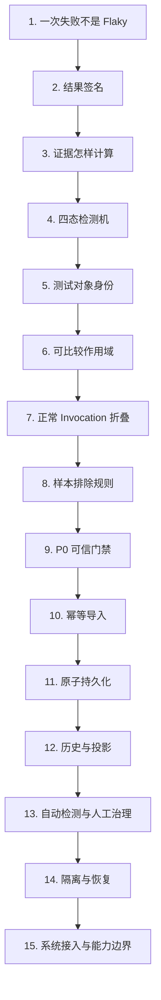

# Flaky 子系统课程学习路线

## 总体安排

正式课程拆为 5 个层级、15 节主课。每节建议 35～55 分钟，只回答一个核心问题，最多引入 2～3 个核心概念，并且只增加一个主要变量或复杂分支。

第 0 单元不是集中讲授的大前置课，而是在第 1、7、11 课前分别解锁三张短知识卡。



### 初学者教学约束

每节正文必须同时满足：

1. 新术语最多 2～3 个，字段和枚举值不单独扩展成第二条知识主线。
2. 先展示可观察现象，再命名概念，最后才阅读对应源码。
3. 正文只完整推导一条正常路径和一个复杂分支，其余情况放入练习或参考表。
4. 只使用前面已经解锁的输入字段，不提前展示后续课程的答案。
5. 缺失数据始终表示“没有可用事实”，不得补成 PASS 或零。

## 层级一：最小检测主线

这一层只使用内存中的短序列，不引入 P0 文件、SQLite、CLI 或治理操作。

| 课次 | 唯一核心问题 | 新增概念 | 主要材料 |
| --- | --- | --- | --- |
| 第 1 课 | 一次失败为什么不能说明 Flaky？ | 单轮结果、Observation、跨 Run 历史 | 数据包 A1 |
| 第 2 课 | 两次失败为什么也可能表现不同？ | 结果签名、Failure ID | 数据包 A2 |
| 第 3 课 | 怎样从短历史中提取判断证据？ | 证据窗口、证据摘要、签名切换 | 数据包 A3 |
| 第 4 课 | 相同证据怎样形成当前检测状态？ | 阈值、检测状态、状态迁移 | 数据包 A4 |

### 四课的严格边界

- 第 1 课只比较“一次”与“多次”，不出现状态枚举。
- 第 2 课只判断签名是否相同，不计算阈值；Failure ID 暂时视为已给定标签。
- 第 3 课只计算 pass/fail 数、切换次数和尾部连续数，不给状态答案。
- 第 4 课才揭示 `OBSERVING/STABLE/SUSPECTED/CONFIRMED`，并用第 3 课已经算好的证据逐步迁移。

### 源码进入顺序

1. 第 1 课只读 [状态机测试中的最短案例](../../tests/quality/test_flaky_state_machine.py)。
2. 第 2 课读 [build_result_signature()](../../quality/flaky.py)。
3. 第 3 课读同文件中的 `derive_evidence_window()`。
4. 第 4 课最后读 `replay_observations()` 和 `FlakyRuleConfig`。

这一层不阅读 Repository、迁移 SQL 或完整模型文件。

### 层级完成标志

学习者能够：

- 区分偶发失败、稳定失败和 Flaky。
- 根据签名序列手工计算证据。
- 在给定规则配置时推导四种自动检测状态。

第 1～4 课可以单独作为 Flaky 最小入门课。

## 层级二：形成可比较的 Observation

| 课次 | 唯一核心问题 | 新增概念 | 主要材料 |
| --- | --- | --- | --- |
| 第 5 课 | 怎样确认比较的是同一个测试对象？ | Case 身份、参数身份、参数隔离 | 数据包 B 的前半部分 |
| 第 6 课 | 同一测试对象在什么范围内才可比较？ | 比较作用域、Epoch、Flaky Key | 数据包 B 的后半部分 |
| 第 7 课 | 完整的 pytest Phase 怎样形成一条候选样本？ | Phase 折叠、决定性结果、Observation Candidate | 数据包 C1 |
| 第 8 课 | 哪些事实不足以形成可信样本？ | 生命周期完整性、证据唯一性、排除原因 | 数据包 C2 |

### 第 5 课：测试对象身份

只比较 `case_id` 和 `param_hash`。先展示两个参数实例被错误合并的现象，再解释为什么参数身份必须隔离。此时不出现环境、执行画像和 Epoch。

### 第 6 课：可比较作用域

按下面顺序，每次只改变一个维度：

```text
environment
→ execution_profile
→ state_epoch
→ 将完整身份命名为 flaky_key
```

本课关心“哪些历史可以比较”，暂时把 Epoch 理解为“人为开启的新历史编号”，不讲哈希算法、数据库键或 Epoch 的存储与治理命令。

源码入口：[flaky_importer.py 的身份函数](../../quality/flaky_importer.py)。只读 `normalize_execution_profile()`、`build_epoch_scope_key()` 和 `build_flaky_key()` 的输入输出。

### 第 7 课：正常 Invocation 折叠

阅读第 0 单元知识卡 B 后开始。正文只完整推导：

1. setup/call/teardown 全部通过。
2. call failed 且存在唯一 FailureRecord。

结论只到 `CaseObservationCandidate`，不进入数据库或状态机。

### 第 8 课：样本排除规则

核心复杂路径只使用“call failed 但 FailureRecord 缺失”。学习者先用“能否形成唯一、完整的结果”作出决定，再看到排除原因。

setup/teardown error、skip/xfail/xpass、生命周期残缺和冲突证据放在课末巩固表中逐项判断，不在正文同时展开多条机制。

第 7～8 课的源码入口：[fold_case_observations()](../../quality/flaky_importer.py)。

### 层级完成标志

学习者能够依次回答：

```text
是不是同一测试对象？
→ 是否处于相同可比较范围？
→ 本轮事实能否形成唯一 Observation Candidate？
```

前 8 课均不要求阅读数据库代码。

## 层级三：建立可信、可重复导入的历史

| 课次 | 唯一核心问题 | 新增概念 | 主要材料 |
| --- | --- | --- | --- |
| 第 9 课 | 为什么上游产物仍需经过可信门禁？ | 来源合同、内容校验、整包拒绝 | 正常包与篡改包 |
| 第 10 课 | 同一个来源再次到达时怎样处理？ | Source Digest、NOOP、来源冲突 | 三种重复导入结果 |
| 第 11 课 | 多条写入怎样避免留下半成品？ | 导入账本、事务边界、回滚 | 正常提交与中途失败 |

### 第 9 课：P0 可信门禁

核心案例只改变一个条件：JSONL 内容是否仍与 manifest 中的 SHA256 一致。由此建立三步模型：

```text
来源是否完整
→ 内容是否与声明一致
→ 是否允许整个来源进入历史
```

版本、Run/manifest 完成状态、Integrity 和 JSONL Schema 是同一门禁的检查清单，放在核心推导之后，不要求同课背诵全部拒绝码。

源码入口：[prepare_flaky_import()](../../quality/flaky_importer.py)。

### 第 10 课：幂等与冲突

在第 9 课已经理解 digest 的基础上，只比较：

```text
同 run_id + 同 digest      → NOOP
同 run_id + 不同 digest    → run_source_conflict
```

`不同 run_id + 同 digest → source_digest_conflict` 放在课末作为唯一约束参考，不与核心重复导入路径同时推导。

源码入口：[import_service.py](../../quality/flaky_store/import_service.py)。

### 第 11 课：最小持久化与原子性

先阅读第 0 单元知识卡 C。本课只认识当前写入所需的三类记录：

```text
Run 导入账本
Epoch
Observation 历史
```

用“写 Observation 时失败”演示整个事务回滚。State、Transition、Override 和 Governance 表在后续课程按需引入；Schema migration 与迁移前备份移入进阶专题。

源码入口：[facade.py](../../quality/flaky_store/facade.py) 和 [import_service.py](../../quality/flaky_store/import_service.py)，只追踪事务开始、提交和回滚边界。

### 层级完成标志

学习者能够解释一条 Observation 为什么被接受、拒绝、判为重复或整体回滚。

## 层级四：从历史投影到人工治理

| 课次 | 唯一核心问题 | 新增概念 | 主要材料 |
| --- | --- | --- | --- |
| 第 12 课 | 为什么既保存历史又保存当前状态？ | 不可变历史、状态投影、Transition 审计 | R1～R6 正常顺序 |
| 第 13 课 | 自动检测为什么不能直接替代人工决定？ | Manual Override、双状态字段、人工动作审计 | 一次人工确认 |
| 第 14 课 | 隔离对象怎样证明重新稳定？ | Quarantine、Recovery Anchor、Resolution | 隔离后的新样本 |

### 第 12 课：历史与当前投影

只建立下面的基本关系：

```text
Observation 是历史事实
→ State 是当前可查询投影
→ Transition 记录投影何时发生变化
```

本课只使用正常到达顺序。晚到 Observation、确定性排序、规则版本变化和全量 rebuild 统一放入进阶专题。

源码入口：[projection.py](../../quality/flaky_store/projection.py)，先读一次普通 `evaluate_run()` 路径。

### 第 13 课：自动检测与人工治理

核心路径只完整追踪一次“将 `SUSPECTED` 人工确认为 `CONFIRMED`”：

```text
自动 current_state / detected_state = SUSPECTED
→ 外部调查形成受约束的人工决定
→ manual Transition + Override
→ current_state / detected_state = CONFIRMED
→ Observation 保持不变
```

当前实现不会在人工确认后把 `detected_state` 留在 `SUSPECTED`；原状态由 Transition 和 Override 保存。两个状态字段主要在隔离/恢复阶段分开：`current_state` 可以进入治理状态，`detected_state` 仍受自动状态域约束。标记非 Flaky 作为课末对照，不同时展开其锚点规则。

源码入口：[governance.py](../../quality/flaky_store/governance.py) 中对应的单个命令。

### 第 14 课：隔离与恢复

```text
CONFIRMED
→ 登记隔离信息
→ QUARANTINED
→ 人工开始恢复
→ 保存 Recovery Anchor
→ 只评估 Anchor 之后的新样本
→ recovered 或 regressed
```

必须指出：当前恢复算法判断签名是否稳定，不额外要求恢复样本一定为 PASS；`QUARANTINED` 也不等于 pytest Skip。取消隔离只作为课末动作对照。

源码入口：`start_recovery()` 和 [flaky.py 中的 evaluate_recovery()](../../quality/flaky.py)。

### 层级完成标志

学习者能够区分历史事实、自动检测状态、对外当前状态、人工审计和治理生命周期。

## 层级五：放回完整框架

| 课次 | 唯一核心问题 | 新增概念 | 主要材料 |
| --- | --- | --- | --- |
| 第 15 课 | Flaky 在测试框架中拥有什么权力？ | 功能开关、fail-open、事实所有权 | 一次 Quality 收尾链与数据库故障 |

先建立最小依赖关系：

```text
pytest 执行
→ P0 可信事实
   ├─→ Semantic / Metrics
   └─→ Flaky 导入 → 状态评估 → 报告摘要
```

再把它映射到真实执行顺序。本课只围绕“Flaky 数据库不可用”这一条故障路径推导，并明确：

- 执行先后不等于数据依赖；Flaky 直接读取 P0，不读取 Metrics。
- Flaky 默认关闭，状态评估依赖历史导入已开启。
- 导入和评估异常采用 fail-open，不覆盖 pytest 原始结果。
- 报告缺失表示没有可用诊断数据，不能解释成零个问题。
- `QUARANTINED` 当前不会自动改变 pytest 选例。

源码入口：

1. [quality_pipeline.py](../../run_orchestration/quality_pipeline.py)
2. [quality_flaky_stage.py](../../run_orchestration/quality_flaky_stage.py)
3. [quality_sources.py](../../pipeline_reporting/quality_sources.py)

## 进阶专题：完成主线后再学习

这些内容属于当前实现，但不会阻塞对核心子系统的理解。

### 进阶 A：Schema migration 与备份

- 前置：完成第 11 课。
- 新增概念：Schema 版本、迁移前备份、迁移原子性。
- 正文：[A-Schema迁移与备份.md](advanced/A-Schema迁移与备份.md)。
- 源码：[migration.py](../../quality/flaky_store/migration.py) 和 `migrations/*.sql`。

### 进阶 B：晚到数据与确定性重建

- 前置：完成第 12 课。
- 新增概念：确定性排序、晚到重投影、显式全量 rebuild。
- 案例：在独立教学数据库中，`run-2/3/4` 的 PASS 先形成 `STABLE`，排序更早的 `run-1` FAIL 随后才到达。
- 边界：当前 rebuild 支持同版本 dry-run/apply，但与普通评估一样拒绝不兼容的规则/投影版本；跨版本替换流程尚未实现。
- 正文：[B-晚到数据与确定性重建.md](advanced/B-晚到数据与确定性重建.md)。
- 源码：[projection.py](../../quality/flaky_store/projection.py) 中的投影计划与 rebuild 路径。

### 进阶 C：数据规模边界

- 前置：完成第 15 课。
- 新增概念：当前 Run 内存物化、每 Key 全历史重放、Key 范围与全库重建。
- 当前 Run 的 Case、Failure 和 Integrity JSONL 会逐行解析，但校验后的模型会整批保留到折叠完成。
- 状态评估只处理当前 Run 涉及的 `flaky_key`。
- 每个受影响 key 会读取全部历史 Observation，再从头重放。
- 证据窗口最多 20 条，不代表数据库只查询 20 条。
- `rebuild` 会遍历所有 key；dry-run 也执行读取和计划计算。
- 当前没有历史归档、快照起点或分页重放策略。
- 正文：[C-数据规模边界.md](advanced/C-数据规模边界.md)。

本专题只解释当前边界，不在入门阶段讨论优化方案。

## 依赖检查点

| 开始位置 | 必须已经掌握 | 明确不要求 |
| --- | --- | --- |
| 第 1 课 | 第 0 单元知识卡 A | Phase、P0、数据库 |
| 第 5 课 | 签名、证据和四态检测 | P0 文件、SQL |
| 第 7 课 | 知识卡 B、可比较身份 | 存储实现 |
| 第 9 课 | Observation Candidate 的形成与排除 | 事务、投影 |
| 第 11 课 | 知识卡 C、幂等导入 | 治理模型、迁移 SQL |
| 第 12 课 | 不可变 Observation 历史 | 人工治理、rebuild |
| 第 15 课 | 导入、投影和治理的职责边界 | 性能优化方案 |

## 每节课的固定节奏

```text
具体现象
→ 学习者先预测
→ 旧模型为什么不够
→ 新增 2～3 个概念
→ 使用当前已解锁数据完整推导
→ 展示一小段对应源码
→ 一条正常路径
→ 一个复杂分支
→ 能保证 / 成立前提 / 不能保证
→ 引出下一课
```

## 建议时长

| 层级 | 课数 | 建议时长 |
| --- | ---: | ---: |
| 按需前置知识卡 | 3 张 | 合计 45～60 分钟 |
| 最小检测主线 | 4 | 2.5～3 小时 |
| 身份与 Observation | 4 | 3～3.5 小时 |
| 可信历史与持久化 | 3 | 2～2.5 小时 |
| 投影与人工治理 | 3 | 2.5～3 小时 |
| 系统接入与边界 | 1 | 45～60 分钟 |

15 节主课约需 11～13 小时。三个进阶专题另需约 2～3 小时，可在主线完成后学习。
