# 当前实现源码阅读地图

## 使用方式

这是随课查询的索引，不是开课前的必读材料。完成一节课的现象推导和概念模型后，只打开该课指定的函数；不要提前通读本文件列出的全部模块。

当前基准的 Flaky 生产代码分布在多个文件中，大部分代码用于可信性、持久化、审计和框架集成。纯检测算法主要集中在 `quality/flaky.py`，因此源码阅读必须跟随课程逐层展开，Repository 和迁移 SQL 最后再读。

## 第 15 课再看的完整调用链

学习第 1～14 课时不需要记住这张图：

```mermaid
flowchart LR
    A["finalize_quality_run"] --> B["run_flaky_history_stage"]
    B --> C["prepare_flaky_import"]
    C --> D["fold_case_observations"]
    D --> E["FlakyStore.import_run"]
    E --> F[("Run + Epoch + Observation")]
    F --> G["run_flaky_state_stage"]
    G --> H["FlakyStore.evaluate_run"]
    H --> I["replay_observations"]
    I --> J[("State + Transition + Governance")]
    J --> K["flaky-evaluation.json"]
    K --> L["pipeline-summary.md"]
```



## 按课程查询的文件职责

| 文件 | 单一主要职责 | 何时打开 |
| --- | --- | --- |
| `quality/flaky.py` | 结果签名、证据窗口、自动重放、恢复判定 | 第 2～4、14 课；进阶 B～C |
| `quality/flaky_models.py` | 输入、结果、状态和审计 DTO | 只在某课需要相应模型时读局部 |
| `quality/flaky_importer.py` | 身份构造、Invocation 折叠、P0 校验 | 第 5～9 课 |
| `quality/flaky_store/import_service.py` | Run 幂等导入和 Observation 物化 | 第 10～11 课 |
| `quality/flaky_store/facade.py` | 对外存储接口和事务边界 | 第 11 课；进阶 B |
| `quality/flaky_store/projection.py` | 历史投影、治理覆盖和恢复收口 | 第 12、14 课；重建部分在进阶 B |
| `quality/flaky_store/governance.py` | 人工确认、纠正、隔离和恢复命令 | 第 13～14 课 |
| `quality/flaky_store/epoch.py` | 显式开启新的历史周期 | 第 6 课先理解概念，第 14 课后再读实现 |
| `quality/flaky_store/repository.py` | SQL、查询和行到模型的映射 | 主线完成后；进阶 B～C |
| `quality/flaky_store/migration.py` | Schema 校验、备份和迁移 | 进阶 A |
| `quality/flaky_store/migrations/*.sql` | 数据库约束的最终落点 | 进阶 A |
| `run_orchestration/quality_flaky_stage.py` | 开关、阶段衔接和 fail-open | 第 15 课 |
| `pipeline_reporting/quality_sources.py` | 读取本轮评估并形成摘要 | 第 15 课 |

## 七次主线阅读

### 第一次：结果怎样成为状态（第 1～4 课）

按课程进度分次打开，不要一次读完：

1. [状态机测试](../../tests/quality/test_flaky_state_machine.py) 中的最短案例。
2. [flaky.py](../../quality/flaky.py) 中的 `build_result_signature()`。
3. 同文件中的 `derive_evidence_window()`。
4. 最后才读 `replay_observations()` 和 `FlakyRuleConfig`。

此时跳过恢复算法和模型字段校验。

### 第二次：哪些结果可以比较（第 5～6 课）

1. `build_flaky_key()` 的五个输入。
2. `normalize_execution_profile()`。
3. `build_epoch_scope_key()`。

这些函数位于 [flaky_importer.py](../../quality/flaky_importer.py)。只追踪输入和输出，不展开哈希辅助函数。

### 第三次：Observation 怎样形成（第 7～8 课）

1. `fold_case_observations()` 的正常路径。
2. `_fold_invocation()` 的一个排除路径。
3. 对照 [导入器测试](../../tests/quality/test_flaky_importer.py) 中相应的单个案例。

不要在本次阅读中进入数据库。

### 第四次：来源为何可信且幂等（第 9～10 课）

1. `prepare_flaky_import()` 的总门禁。
2. `_validate_output_hashes()` 的一条失败路径。
3. `import_service.import_run()` 的 NOOP 和 conflict 分支。

版本、Schema 和 Integrity 的完整检查表作为课后参考，不逐个背错误码。

### 第五次：事务怎样保护历史（第 11 课）

1. `FlakyStore.import_run()`。
2. `import_service.import_run()`。
3. `materialize_observation()`。
4. 最后查看这次事务实际写入的表。

本次只追踪事务开始、提交和回滚，不阅读 migration。

### 第六次：投影与治理（第 12～14 课）

1. `projection.evaluate_run()` 的正常顺序。
2. `governance.confirm_flaky()` 的单个动作。
3. `governance.quarantine()`。
4. `governance.start_recovery()`。
5. `evaluate_recovery()`。

标记非 Flaky、取消隔离和其他动作在理解主路径后作为对照阅读。

### 第七次：系统边界（第 15 课）

1. `quality_pipeline.finalize_quality_run()`。
2. `run_flaky_history_stage()`。
3. `run_flaky_state_stage()`。
4. Pipeline Summary 对 `flaky-evaluation.json` 的读取。

这时再回看顶部完整调用链，区分执行顺序和数据依赖。

## 第 13 课后使用的状态速查

### pytest 状态

```text
PASSED / FAILED / ERROR / SKIPPED / XFAILED / XPASSED
```

它描述某轮执行事实。

### Flaky 状态

```text
自动检测：OBSERVING / STABLE / SUSPECTED / CONFIRMED
治理阶段：QUARANTINED / RECOVERING
```

两个字段的当前实现规则是：

- 直接 `confirm_flaky` 或 `mark_not_flaky` 会把 `detected_state` 与 `current_state` 一起更新到目标自动状态；人工动作前态由 Transition/Override 保存。
- 隔离或恢复期间，`current_state` 可进入 `QUARANTINED/RECOVERING`，`detected_state` 仍只能取四种自动状态；此时两者才主要体现分离。

因此，不能把 `detected_state` 简化成“永远不受人工动作影响的纯算法快照”。

### 导入或评估结果

```text
IMPORTED / EVALUATED / NOOP / DEGRADED / FAILED / NO_DATA
```

它描述 Flaky 阶段是否形成可用输出，不描述 Case 是否通过。

## 主线完成后使用的数据表速查

不要按建表顺序记忆。完成第 14 课后，可以按用途归纳：

| 用途 | 表 |
| --- | --- |
| 来源与身份 | `flaky_import_run`、`flaky_case_epoch` |
| 不可变历史 | `case_observation` |
| 当前投影与迁移审计 | `flaky_state`、`flaky_transition` |
| 人工治理 | `flaky_override`、`flaky_governance` |

## 进阶源码入口

### 进阶 A：Schema migration 与备份

1. `initialize_store()` 如何调用迁移。
2. [migration.py](../../quality/flaky_store/migration.py) 中的版本判断、备份和事务。
3. 最后查看 `migrations/*.sql`。

### 进阶 B：晚到数据与重建

1. `sort_observations()`。
2. `projection.build_projection_plan()`。
3. `rebuild_states()`。
4. `build_projection_plan()` 的版本兼容门禁，以及导入事务先于投影失败提交的边界。

当前 `rebuild_states()` 与普通评估复用同一版本门禁：同版本可 dry-run/apply，不兼容版本会返回 `incompatible_projection_version`。报错要求的“显式版本化重建”尚无跨版本替换实现，阅读时不要从错误文案推导出不存在的升级路径。

### 进阶 C：数据规模边界

当前实现需要分别观察：

1. `read_jsonl_values()` 逐行解析；`_read_jsonl_models()` 再把当前 Run 的 Case、Failure 和 Integrity 模型分别累积为完整 tuple。
2. `evaluate_run()` 只处理当前 Run 涉及的 `flaky_key`。
3. `observations_for_key()` 会为每个受影响 key 读取全部历史。
4. `replay_observations()` 从第一条 Observation 开始重放。
5. `evidence_window_size=20` 只限制一次证据汇总，不限制数据库查询量和完整重放成本。
6. `evaluate_run()` 和 `rebuild_states()` 都先构造所选 Key 的计划 tuple；后者会遍历全部 `flaky_key`，dry-run 也不跳过计算。

当前实现优先保证确定性重建和审计完整性，没有历史压缩、快照起点、分页重放或增量状态机。这是实现边界，不应提前混入状态规则课程。

## 测试阅读地图

| 想理解的行为 | 优先阅读 | 课程位置 |
| --- | --- | --- |
| 状态阈值和稳定失败 | `test_flaky_state_machine.py` | 第 1～4 课 |
| 身份、折叠和排除规则 | `test_flaky_importer.py` | 第 5～9 课 |
| 幂等和事务边界 | `test_flaky_store.py`、`test_flaky_store_transaction_boundaries.py` | 第 10～11 课 |
| 基础投影和恢复 | `test_flaky_state_store.py` | 第 12、14 课 |
| 人工确认与隔离 | `test_flaky_governance.py` | 第 13～14 课 |
| Pipeline 顺序与 fail-open | `test_flaky_run_master.py` | 第 15 课 |
| 迁移和乱序重建 | 对应 Store/State Store 测试 | 进阶 A～B |

测试提供短小的预期行为案例；当前行为仍应由测试、真实调用链和实现代码共同确认。

## 当前不存在的能力

阅读工作区时不要把其他分支或未跟踪设计文件中的术语带回本基准。提交 `efef315d...` 中没有：

- `flaky_dashboard.py`
- `flaky_shadow.py`
- `flaky_probe.py`
- `flaky_v3.py`
- pytest 自动 Skip 或 Enforce 链路

当前 `QUARANTINED` 是治理记录，不是执行过滤器。
