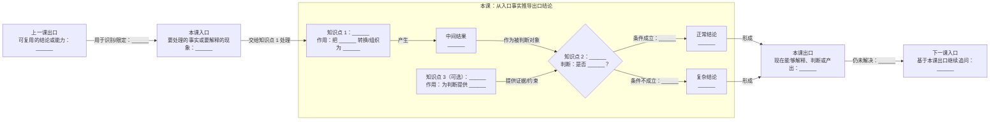

# Flaky 单课编写模板

后续编写十五节主课正文时统一使用本模板。三个进阶专题也沿用同一结构，但不作为后续主课的必备前置。标题可以调整，信息顺序不变。

````markdown
# 第 N 课：用一个具体问题命名

## 本课在学习链中的位置

- 上一课已经解决什么。
- 本课继续解决哪个问题。
- 本课结论会被下一课怎样使用。
- 本课需要解锁哪一张前置知识卡；没有则明确写“无新增前置”。

## 学完本课，你能够做到

写 2～3 个可观察、可验证的学习结果，使用“判断、计算、解释、画出、定位”等动词，避免只写“了解”或“熟悉”。

## 开始前自检

给出 2～3 个只依赖上一课出口或指定知识卡的问题，并明确暂停作答。随后提供简短答案和回退链接：答不出来时，指出应回到哪一节或哪张知识卡，而不是继续引入新知识。

## 核心问题

用一句可观察、可回答的问题限定范围。

## 从统一案例中的一个现象开始

- 只给出本课已经解锁的 Run、Case、字段和输入数据。
- 按 T0、T1、T2 或 R1、R2、R3 展示顺序。
- 直接展示最终现象，但暂不引入源码。
- 状态答案、阈值和后续字段不得在首次预测前提前出现。

## 先做判断

- 提出 1～2 个学习者可依据现有知识作答的问题。
- 明确提示先写下答案和理由，再继续阅读。
- 这里不公布答案；答案必须在“为什么已有解释不够”或后续推导中逐项揭示。

## 为什么已有解释不够

- 指出旧模型无法区分的两种情况。
- 每次只增加一个主要变量。

## 核心概念

- 最多新增 2～3 个概念。
- 首次出现时同时给出中文含义和英文名称。
- 说明概念的输入、输出、生命周期和相邻概念区别。
- 一个术语如果包含独立规则或生命周期，就按一个新概念计数，不能只把多个术语合并写在同一单元格中。

## 本课知识关系图

这张图不是把本课标题和知识点排成一条课程目录，而是回答：本课的输入事实经过哪些知识和规则，为什么会得到本课结论？先完成现象与概念讲解，再按本课真实机制绘制；不要直接照抄节点数量和拓扑。



绘图要求：

- 先写清“事实如何变化”，再决定节点；不能用 `知识点 1 → 知识点 2 → 知识点 3` 表示讲解先后。
- 每个知识点必须承担可说清的作用，例如分组、转换、匹配、筛选、约束或推导；没有参与推导的知识点不能放进图中。
- 每条箭头都应能读成一句因果或数据流语句，例如“Phase 折叠产生 Invocation 级结果”；禁止只写“相关”“然后”“下一步”。
- 图的拓扑服从真实关系：两个事实共同产生结果时画汇合；同一规则产生不同结果时画分支；没有分支时删除菱形和多余路径。
- “上一课出口”填写可直接复用的结论或能力，并通过有含义的箭头进入本课；不能只写课程标题。
- “本课出口”必须由图中的推导路径产生，并且是可验证的能力或产物。
- “下一课入口”只承接本课尚未解决的问题，不提前放入下一课的答案或知识点。
- 第一课用前置知识卡的完成标志代替“上一课出口”；最后一课用课程总完成标准或进阶专题代替“下一课入口”。

## 最小规则

- 用一张决策表、伪代码或不超过 5 条的规则总结本课机制。
- 每个条件使用本课已经定义的术语，并明确输入、判断和输出。
- 将“当前实现规则”与“为了讲解而使用的示例值”分开标注。
- 本节是后续推导的依据，不加入尚未学习的异常分支。

## 完整运行过程

输入事实
→ 条件判断
→ 状态变化
→ 新产生的事实
→ 最终输出

## 正常路径

完整推导一个最小成功路径。

## 复杂路径

只增加一种失败、缺失、冲突、乱序或人工动作，并完整推导分叉。其他边界情况只列为课末练习或参考表，不在正文继续扩展机制。

## 对应的框架实现

- 先展示一个与本课规则一一对应的测试断言，再进入生产源码；如果该断言会提前泄露后续课程的状态或规则，则只展示真实测试的数据构造，并明确延后断言。
- 只选择承载本课核心分支的一小段源码。
- 先说明调用背景，再展示源码。
- 解释输入来源、返回值、状态变化和异常去向。
- 方法存在不等于真实调用链一定经过它。

## 能够保证什么

只写当前提交明确实现的保证。

## 保证成立的前提

写明入口、身份、Schema、配置或数据完整性要求。

## 不能保证什么

主动澄清最容易被扩大理解的能力。

## 本课小结

- 用 3～5 句话重新回答“核心问题”。
- 按“输入是什么 → 使用什么规则 → 得到什么输出”复述主线。
- 不在小结中引入新术语、新边界或下一课答案。

## 课末自测

- 设置 3～5 题，至少包括一道规则复算题、一道解释题和一道边界辨析题。
- 自测只能使用本课和此前课程已学知识；不能依赖尚未展示的源码细节。
- 题目后明确提示先独立作答，再展开答案。

<details>
<summary>查看答案与解析</summary>

逐题给出答案、推导步骤和常见错误。不能只给最终选项。

</details>

## 本课完成标准

列出 2～3 项可由学习者自行验证的标准，并与开头学习目标、本课知识关系图出口保持一致。未达到时，指出应复习的具体小节。

## 与下一课的关系

提出本课解决后自然留下的一个问题。
````

## 每课内容预算

| 内容 | 建议比例 |
| --- | ---: |
| 学习导航与知识点串联图 | 10% |
| 现象、预测和揭示 | 15% |
| 概念模型与最小规则 | 20% |
| 完整机制推导 | 25% |
| 源码映射 | 15% |
| 小结、自测与边界 | 15% |

源码不是课程主体。单课不展示完整大型函数、完整模型文件或整张数据库 Schema。

## 事实陈述检查

每个重要结论都要区分：

1. 框架是否存在该能力。
2. 当前配置是否启用该能力。
3. 当前真实调用链是否经过该能力。
4. 外部服务是否承诺相应行为。

不能从“仓库里有一个类或函数”直接推出后面三项。

## Flaky 专项检查

每节相关课程必须保持以下边界：

- Flaky 直接消费可信 P0 Case 事实，不依赖 Metrics。
- 单次失败不是 Flaky。
- `STABLE` 不等于业务成功。
- 缺失 Observation 不等于 PASS。
- 自动检测不等于人工治理。
- `QUARANTINED` 当前不等于 pytest Skip。
- fail-open 保护 pytest 结果，但可能造成诊断数据缺失。
- 示例数据不能描述成真实外部服务事实。

## 单课完成检查

- 是否只有一个核心问题？
- 学习目标是否可以通过课末任务验证，而不是“了解/熟悉”式陈述？
- 开始前自检是否只依赖明确的前置，并提供失败后的回退位置？
- 是否最多新增 2～3 个核心概念？
- 所有必需概念是否已由前一课或指定知识卡解锁？
- 是否先展示现象，再命名概念？
- 是否要求学习者在答案揭示前先预测并说明理由？
- 是否隐藏了尚未学习的状态答案、字段和复杂分支？
- 知识关系图是否明确标出上一课出口、本课入口、本课出口和下一课入口？
- 从本课入口沿箭头是否能够完整解释输入怎样变成正常或复杂结论？
- 图中的每个知识点是否实际参与转换、判断或约束，而不是按讲解顺序排列的目录节点？
- 图中的每条边是否能读成具体的数据流、条件或因果关系？
- 本课出口是否正好满足下一课入口，且没有提前引入下一课答案？
- 是否完整给出输入、顺序、判断、状态变化和输出？
- 最小规则是否足以独立支撑正常路径和复杂路径的推导？
- 是否只增加一个复杂变量？
- 是否在概念之后才出现源码？
- 是否先由测试断言或不泄露后续答案的测试数据构造连接概念规则，再进入生产源码？
- 是否明确写出能够保证、成立前提和不能保证？
- 课末自测是否覆盖复算、解释和边界辨析，并附逐题解析？
- 学习目标、知识关系图出口和完成标准是否表达同一组能力？
- 是否自然引出下一课？
