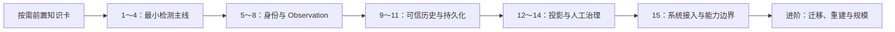

# Flaky 检测与治理独立学习模块

## 基准与定位

本模块以 Git 提交 `efef315d67a7532b77edf64c2e1b26a93c13b048` 为唯一实现基准。

它面向第一次系统学习 Flaky 的读者。学习目标不是记忆源码目录、数据库字段或 CLI 参数，而是逐层回答下面五个问题：

1. 什么现象才构成 Flaky，而不仅是一次失败？
2. 哪些不同 Run 中的结果可以互相比较？
3. 一次 pytest 执行怎样形成可信的长期 Observation？
4. 历史怎样投影为检测状态，人工又怎样进行治理？
5. Flaky 在完整测试框架中拥有什么权力，又明确不拥有什么权力？

本模块可以独立学习，不要求先学完整的 Retry、Polling、Runtime Hooks、Aggregator 或 Metrics。必要的上游概念会在对应课程开始前，以按需知识卡的形式给出。

## 目录内容

| 文件 | 用途 |
| --- | --- |
| [00-前置知识.md](00-前置知识.md) | 三张按需解锁的最小知识卡，不集中灌输前置概念 |
| [01-统一案例与教学数据.md](01-统一案例与教学数据.md) | 固定同一条 Case 历史，并按课逐步揭示数据和答案 |
| [02-课程学习路线.md](02-课程学习路线.md) | 5 个层级、15 节主课和 3 个进阶专题 |
| [03-源码阅读地图.md](03-源码阅读地图.md) | 随课查询概念对应的真实调用链、源码和测试 |
| [04-单课编写模板.md](04-单课编写模板.md) | 后续编写每节课程时使用的统一结构和检查项 |
| [05-课程验收记录.md](05-课程验收记录.md) | 每课编写、初学者审阅、事实核验和测试门禁的结果 |

首次学习时先浏览课程路线，再按课打开对应知识卡和数据包。源码地图只在一节课完成概念推导后使用，不要按文件顺序通读。

## 逐课导航

### 主线：先建立最小模型，再增加工程层级

1. 最小检测主线：[第 1 课](lessons/01-一次失败不是Flaky.md) → [第 2 课](lessons/02-结果签名.md) → [第 3 课](lessons/03-证据怎样计算.md) → [第 4 课](lessons/04-四态检测机.md)
2. 身份与 Observation：[第 5 课](lessons/05-测试对象身份.md) → [第 6 课](lessons/06-可比较作用域.md) → [第 7 课](lessons/07-正常Invocation折叠.md) → [第 8 课](lessons/08-样本排除规则.md)
3. 可信历史与持久化：[第 9 课](lessons/09-P0可信门禁.md) → [第 10 课](lessons/10-幂等导入.md) → [第 11 课](lessons/11-原子持久化.md)
4. 投影与人工治理：[第 12 课](lessons/12-历史与当前投影.md) → [第 13 课](lessons/13-自动检测与人工确认.md) → [第 14 课](lessons/14-隔离与恢复.md)
5. 系统边界：[第 15 课](lessons/15-系统接入与能力边界.md)

### 进阶：主线完成后按需深入

1. [进阶 A：Schema migration 与备份](advanced/A-Schema迁移与备份.md)
2. [进阶 B：晚到数据与确定性重建](advanced/B-晚到数据与确定性重建.md)
3. [进阶 C：数据规模边界](advanced/C-数据规模边界.md)

第一次学习建议按主线 1→15 完成；进阶专题不会成为主线的隐藏前置。若只需要理解最小检测算法，可先停在第 4 课。

## 学习路线



建议按顺序学习，但不要提前通读全部教学数据和源码地图。前 4 课只操作内存短序列，前 8 课不接触数据库；学习者先理解核心检测和样本形成，再增加工程可靠性。Migration、晚到数据重建和规模分析统一延后到主线完成之后。

## 最低外部前置

学习者只需要：

- 能阅读 Python 函数、类、枚举、异常、列表和字典。
- 知道 pytest 可以执行测试，并能区分最基本的 pass 与 fail。
- 能阅读简单 JSON。

error、skip、xfail/xpass 会在第 8 课结合实例解释；数据库表、唯一约束和事务会在第 11 课前通过知识卡即时补充。它们都不作为外部前置要求。

不要求：

- 掌握 LLM API、Retry 或 Polling 的具体实现。
- 掌握 Quality 全部采集和归并代码。
- 掌握 Metrics、Jenkins 或并发调度细节。
- 自行准备真实线上 Flaky 数据。

## 当前基准的能力边界

当前实现包含：

- P0 事实校验和 Case Observation 折叠。
- SQLite 长期历史、两版 Schema migration 和迁移前备份。
- 确定性 Flaky 状态重放与状态迁移审计。
- 人工确认、纠正、隔离、恢复和取消隔离。
- CLI 查询、数据库检查和 Pipeline Summary 展示。
- 对 pytest 主结果的 fail-open 保护。

当前实现不包含：

- 根据 `QUARANTINED` 自动跳过 pytest Case。
- 跨 `rule_version` / `projection_version` 替换旧 State 的版本化 rebuild 流程。
- 历史归档、投影快照、分页重放或增量状态机。
- Dashboard。
- Shadow 决策计划。
- 独立 Probe Job。
- v3 检测和治理模型。

因此，本模块始终区分：

```text
可信执行事实
→ 自动检测信号
→ 人工治理决定
→ 实际执行行为
```

前三层在当前实现中存在；最后一层仍由 pytest、Runner 和 Jenkins 拥有，治理状态不会自动改变执行行为。

## 完成标准

完成本模块后，学习者应能：

- 根据一组结果签名手工推导 Flaky 状态。
- 判断两条测试结果是否属于同一个 `flaky_key`。
- 解释某条 Case 为什么形成或没有形成 Observation。
- 区分历史事实、状态投影、人工治理和测试执行。
- 沿当前真实调用链追踪一次导入、评估和报告生成。
- 说明当前实现面对大量历史数据时的读取与重放边界。
