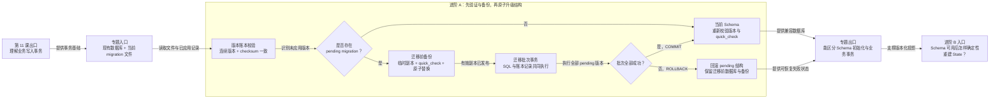

# 进阶 A：Schema migration 怎样安全升级数据库

## 本专题在学习链中的位置

- 前置是[第 11 课](../lessons/11-原子持久化.md)：你已经理解业务导入事务的 COMMIT/ROLLBACK。
- 本专题转向业务写入之前的数据库结构初始化，解释 v1→v2 Schema 升级。
- 本专题输出一个已校验、已备份、迁移到当前版本的存储；进阶 B 将在其上处理投影重建。
- 这是可选进阶内容，不影响第 12～15 课的主线学习。

## 学完本专题，你能够做到

1. 根据 migration 文件和 `schema_migration` 账本判断哪些版本待应用。
2. 解释迁移前备份为什么先写临时文件、校验后再替换目标备份。
3. 区分 migration 事务与 Run 业务导入事务，并推导批量迁移失败后的数据库结构。

## 开始前自检

1. 第 11 课的一次业务事务包含哪些 Run 数据写入？
2. ROLLBACK 是否会撤销事务开始前已经提交的操作？
3. 唯一约束与事务分别解决什么问题？

<details>
<summary>查看自检答案</summary>

1. Epoch 物化、Run 账本、Observation 写入和数量校验。
2. 不会，只撤销当前事务中的未提交变化。
3. 唯一约束阻止冲突记录；事务让多条写入共同提交或撤销。

如果答不出来，请先复习[第 11 课](../lessons/11-原子持久化.md)。

</details>

## 核心问题

> 数据库已经包含 v1 历史，而当前代码需要 v2 State/Governance 表时，怎样升级又避免留下“迁了一半”的 Schema？

## 从统一案例中的一个现象开始

假设数据库只有 v1：

```text
已应用：0001_observation_store.sql
已有数据：Run、Epoch、Observation、reset_epoch 审计
当前代码还提供：0002_flaky_state_machine.sql
```

如果 v2 执行到一半失败，既不能丢失 v1 历史，也不能留下几张 v2 表、几张旧表的混合结构。升级前还需要一个可检查的数据库副本。

## 先做判断

1. 应在执行 v2 SQL 之前还是之后创建备份？
2. v2 中任一 SQL 失败时，已经执行的 v2 语句应该保留吗？
3. 已应用 v1 文件后来被修改但仍叫同一版本，系统应该继续吗？

## 为什么已有解释不够

业务事务只保护一轮 Run 数据，不负责数据库结构演进。Schema 升级还需要：

- 确定代码提供的版本序列与数据库已应用记录兼容。
- 在任何待应用 migration 前创建一致、可校验的备份。
- 将全部 pending migration 与其账本记录作为一个批次提交。

当前实现拒绝版本缺口、过新的数据库和 checksum 漂移，避免“版本号相同、SQL 含义却改变”。

## 核心概念

### 1. Schema 版本账本（Migration Ledger）

每个 migration 文件包含连续版本号、名称、SQL 和内容 checksum。应用后写入 `schema_migration`：

```text
version / name / checksum / applied_at
```

当前文件必须从 1 连续编号；数据库已应用版本也必须连续。已应用 checksum 必须与当前同版本文件一致，否则返回 `migration_checksum_mismatch`。

### 2. 迁移前备份（Pre-migration Backup）

只要存在 pending migration，就先使用 SQLite backup API 复制当前连接：

```text
源数据库
→ 随机临时备份文件
→ PRAGMA quick_check == ok
→ os.replace 为 <database>.pre-migration.bak
```

临时文件避免失败副本冒充正式备份；`os.replace` 只在校验通过后发布。首次创建空数据库时也会在迁移前产生一个有效的空数据库备份。

### 3. 迁移批次原子性（Atomic Migration Batch）

所有 pending migration 及各自账本 INSERT 被拼在同一个：

```text
BEGIN IMMEDIATE
→ migration SQL + schema_migration INSERT
→ ...其他 pending migration...
→ COMMIT
```

任一 SQLite 错误触发 ROLLBACK，所有 pending Schema 变化共同撤销。这条 migration 事务先于第 11 课的业务导入事务。

## 本专题知识关系图



## 最小规则

1. migration 文件必须从 1 连续编号且 UTF-8 可读。
2. 数据库记录不能有版本缺口、不能比代码更新、同版本 checksum 不能漂移。
3. 有 pending 版本才创建迁移前备份；备份必须通过 `quick_check` 才发布。
4. 全部 pending SQL 与账本 INSERT 在一个批次事务中执行，任一失败全部回滚。
5. 迁移后重新读取账本并执行 `quick_check`；成功后才开始独立的业务事务。

## 完整运行过程

```text
打开数据库连接并 quick_check
→ 加载、规范化和摘要 migration 文件
→ 读取 schema_migration
→ 验证已应用版本/checksum
→ 计算 pending
→ 有 pending：创建并校验备份
→ 一个事务应用全部 pending 与账本行
→ 重读账本并再次校验
→ quick_check
→ 返回 schema_version / migration_applied / backup_created
→ 之后才进入 Run 业务事务
```

## 正常路径

数据库已有 v1，代码提供 v1、v2：

1. v1 账本 checksum 与当前 `0001` 文件一致。
2. pending 只有 v2。
3. 创建 `.pre-migration.bak`，其中仍是完整 v1 数据库，并通过 `quick_check`。
4. 一个事务执行 v2：新增 State、Transition、Governance 表，并升级 Override 表。
5. 同一事务写入 v2 migration 账本。
6. 提交后版本为 2，旧 Observation 与 v1 reset 审计仍保留。

## 复杂路径

只改变一个变量：将 v2 SQL 改成先创建表、随后包含非法 SQL。

```text
BEGIN
→ CREATE TABLE broken ...（已执行但未提交）
→ THIS IS NOT SQL（失败）
→ ROLLBACK
```

最终：

- pending migration 的所有表和账本记录都不存在。
- 原迁移前数据库状态保持。
- `.pre-migration.bak` 存在且 `quick_check=ok`。
- 调用者收到 `migration_failed`，不会继续业务导入。

## 对应的框架实现

### 先看测试断言

[存储测试](../../../tests/quality/test_flaky_store.py)注入坏的第二个 migration：

```python
with pytest.raises(FlakyStoreError) as captured:
    FlakyStore(database, migrations_directory=migrations).import_run(...)

assert captured.value.code == "migration_failed"
assert tables == []
assert backup.is_file()
assert quick_check(backup) == "ok"
```

同文件还验证 checksum 被篡改时拒绝数据库，以及 v2 升级保留 v1 Observation 和 reset 审计。

### 再看生产代码

[migration.py](../../../quality/flaky_store/migration.py)的核心顺序是：

```python
validate_applied_migrations(applied, migrations)
pending = [migration for migration in migrations if migration.version not in applied]
if pending:
    backup.create_pre_migration_backup(...)
    apply_migrations(connection, pending)
```

`apply_migrations()` 将 `BEGIN IMMEDIATE`、所有 SQL/账本 INSERT 和 `COMMIT` 交给一次 `executescript()`；异常时显式 ROLLBACK。[backup.py](../../../quality/flaky_store/backup.py)则先备份到临时路径，通过 `quick_check` 后 `os.replace()`。

## 能够保证什么

- 当前代码拒绝版本序列缺口、过新数据库和已应用 SQL checksum 漂移。
- 任何 pending migration 执行前都会尝试创建有效备份。
- 一批 pending Schema 变化要么全部提交，要么全部回滚。
- v1→v2 正常 migration 保留已有 Observation 和 reset_epoch 审计。

## 保证成立的前提

- 数据库连接可读写，备份目标目录可写且 SQLite backup API 正常工作。
- 所有 Schema 变更都通过当前 `initialize_store()` 入口。
- migration 文件未被绕过账本手工应用。
- 文件系统对 `os.replace` 提供当前代码依赖的同目录原子替换行为。

## 不能保证什么

- 备份不会自动回滚或自动恢复数据库；它只是迁移前可用副本。
- migration 成功不代表随后 Run 业务导入一定成功，两者事务独立。
- `quick_check=ok` 不证明业务数据语义正确，只说明 SQLite 结构检查通过。
- 本专题不解决多个进程同时升级同一数据库的部署协调策略。

## 本专题小结

Schema migration 先用版本账本确认“数据库走过哪些结构变化”，再在任何 pending 版本前创建并校验备份，最后以一个批次事务应用所有 pending SQL 和账本记录。它发生在 Run 业务事务之前，两者失败范围不同。

```text
版本/checksum 校验
→ pending？
→ 迁移前备份
→ 原子 migration 批次
→ 新 Schema 校验
→ 独立业务事务
```

## 课末自测

1. **顺序题**：备份、应用 pending SQL、Run 业务导入三者的顺序是什么？
2. **故障题**：v2 第一个建表成功、第二条 SQL 失败，v2 表与账本行是否保留？
3. **解释题**：为什么同版本 SQL 文件 checksum 改变时不能继续？
4. **边界题**：migration COMMIT 后，随后 Observation 写入失败，会撤销 Schema v2 吗？

<details>
<summary>查看答案与解析</summary>

1. 先创建并验证迁移前备份，再原子应用 pending SQL，成功后才开始独立 Run 业务导入。
2. 不保留；整个 pending 批次 ROLLBACK。
3. 同一版本号应代表不可变结构变更；checksum 漂移会让不同数据库虽都称 v1，实际结构却可能不同。
4. 不会。Schema 初始化与业务导入是独立事务；业务失败只回滚本次 Run 数据。

</details>

## 本专题完成标准

- 能画出备份、migration 事务和业务事务的三个边界。
- 能推导正常 v1→v2 与坏 v2 两条路径的最终状态。
- 能解释版本号与 checksum 为什么共同构成迁移账本身份。

## 与下一专题的关系

数据库结构现在可安全升级，但 State 仍是可重算投影。进阶 B 将改变 Observation 的到达顺序，解释晚到事实怎样确定性重投影、同版本 rebuild 怎样 dry-run/apply，以及当前版本门禁仍留下什么跨版本能力缺口。
