# 进阶 B：晚到事实怎样得到确定的 State

## 本专题在学习链中的位置

- 前置是[第 12 课](../lessons/12-历史与当前投影.md)：你已经知道 Observation 是事实，State 是可重算投影。
- [进阶 A](A-Schema迁移与备份.md)已经解释存储怎样升级到兼容 Schema；它是本专题的相邻专题，但不是理解排序算法的硬前置。
- 本专题只改变一个主要变量：一条历史上更早的 Observation 晚于后续事实到达数据库。
- 本专题输出“同一组事实总能按同一顺序重放”的能力；进阶 C 将继续追问全历史重放的成本。

## 学完本专题，你能够做到

1. 使用四字段排序键复算一组 Observation 的确定历史顺序。
2. 解释晚到 Observation 为什么触发全历史重投影，以及对应 Transition 为什么标记为 `reprojection`。
3. 区分单 Run 评估、`rebuild_states(apply=False)` 和 `rebuild_states(apply=True)`，并指出当前版本重建的能力边界。

## 开始前自检

1. Observation 与 State 中，哪一个是不可变历史，哪一个是可重算结果？
2. 第 12 课中的 Transition 在什么情况下产生？
3. 第 11 课已经提交的 Observation，会因为随后 State 投影失败而被撤销吗？

<details>
<summary>查看自检答案</summary>

1. Observation 是不可变历史；State 是从历史计算出的当前投影。
2. 计算出的状态相对已有状态发生变化时产生；状态未变化时不会仅为重复评估追加 Transition。
3. 不会。Observation 导入事务与 State 评估事务相互独立。

如果前两题答不出来，请先复习[第 12 课](../lessons/12-历史与当前投影.md)；第三题可回看[第 11 课](../lessons/11-原子持久化.md)。

</details>

## 核心问题

> 如果 `run-1` 比 `run-2`～`run-4` 更晚写入数据库，State 应该按数据库到达顺序追加计算，还是按事实的固定顺序重新计算？

## 从统一案例中的一个现象开始

本专题仍使用 Case C，但新建一个独立教学数据库以直接对应专项测试。下面的小写 `run-1`～`run-4` 不是主线大写 R1～R6 的延续，两组结果不要拼成同一条历史。

先导入并评估三轮 PASS：

```text
数据库到达顺序：run-2 PASS → run-3 PASS → run-4 PASS
当前 State：STABLE
```

随后才导入一轮 FAIL：

```text
第 4 个到达数据库：run-1 FAIL
```

这个案例故意让各 Run 的 `observed_at` 和 `run_end_time` 相同，因此 `run_id` 成为有效的第三层排序条件。完整历史的固定顺序其实是：

```text
run-1 FAIL → run-2 PASS → run-3 PASS → run-4 PASS
```

晚到事实加入后，当前实现得到 `SUSPECTED`，而不是把 FAIL 机械追加到三个 PASS 后面。

## 先做判断

请先写下答案和理由，再继续阅读：

1. 晚到的 `run-1` 应放在序列开头还是结尾？
2. 系统可以只用“旧 State + 新 FAIL”增量计算吗？
3. 从 `STABLE` 变为 `SUSPECTED` 时，应把触发者记录成 `run-1` 还是排序后的最后一条 `run-4`？

## 为什么已有解释不够

“Observation 可重放”还没有回答两个问题：

- 数据库到达顺序会随重试、复制或补录改变，怎样让同一组事实仍得到同一个输入序列？
- 已存在旧 State 时，怎样区分“新事实自然接在末尾”和“新事实插入旧历史中间”？

如果直接按导入顺序追加，本次序列会被错误地看成：

```text
PASS → PASS → PASS → FAIL
```

这样 State 取决于“谁先写进数据库”，而不是事实本身。当前实现因此在每次投影时重新读取同一 Flaky Key 的全部 Observation，先排序，再从第一条开始重放。

## 核心概念

### 1. 确定性排序（Deterministic Ordering）

当前排序键按以下优先级比较：

```text
observed_at
→ run_end_time
→ run_id
→ observation_id
```

前一字段相同才比较后一字段。最后两个稳定标识负责打破时间相同的平局，所以只要事实字段不变，多次读取就得到同一个全序。

这不是按 `imported_at` 排序。`imported_at` 表示何时写入历史库，不能替代事实发生顺序。

### 2. 晚到重投影（Late-observation Reprojection）

重投影不是在旧 State 上补一步，而是：

```text
读取这个 Flaky Key 的全部 Observation
→ 确定性排序
→ 从第一条开始 replay
→ 将新结果与已有 State 比较
```

如果本轮确有新 Observation、旧的 `latest_observation_id` 在新排序中不再紧邻新末尾，并且状态发生变化，当前实现写入：

```text
trigger_type = reprojection
reason_code = late_observation_reprojection
trigger_observation_id = 本次晚到 Observation
```

注意：Observation 晚到但最终状态不变时，State 的样本统计仍可更新，但不会为了“到达晚”单独制造状态迁移。

### 3. 显式全量重建（Explicit Full Rebuild）

普通 `evaluate_run(run_id)` 只找出当前 Run 涉及的 Flaky Key；`rebuild_states()` 则枚举数据库中的全部 Flaky Key，并为每个 Key 生成同样的投影计划：

| 调用 | 范围 | 是否写入 |
| --- | --- | --- |
| `evaluate_run(run_id)` | 当前 Run 涉及的 Key | 在评估事务中写入 |
| `rebuild_states(apply=False)` | 全部 Key | 不写入，只返回计划汇总 |
| `rebuild_states(apply=True)` | 全部 Key | 在一个事务中应用变化 |

`apply=False` 是 dry-run，不是“先写再回滚”；`apply=True` 才写 State、Transition 和可能的治理收口。

当前基准还有一个必须明确的边界：投影计划首先要求已有 State 的 `rule_version`、`projection_version` 与传入配置相同。版本不同时，普通评估和当前 `rebuild_states()` 都会返回 `incompatible_projection_version`。报错文案说明需要“显式版本化重建”，但跨版本替换旧 State 的迁移流程在此基准中尚未实现，不能把现有 rebuild 描述成已经解决规则升级。

## 本专题知识关系图

```mermaid
flowchart LR
    PREV["进阶 A 出口<br/>得到兼容且可用的 Schema"]
    ENTRY["专题入口<br/>已提交 Observation + 已有 State"]

    subgraph TOPIC["进阶 B：由事实集合确定性地产生投影"]
        direction LR
        MODE{"投影入口是什么？"}
        AFFECTED["单 Run 评估<br/>选出本 Run 涉及的 Key"]
        ALL["显式 rebuild<br/>枚举全部 Flaky Key"]
        VERSION{"已有投影版本<br/>与配置兼容？"}
        REFUSE["拒绝投影写入<br/>保留已提交 Observation"]
        HISTORY["读取每个 Key 的全部 Observation"]
        ORDER["确定性排序<br/>observed_at → run_end_time<br/>→ run_id → observation_id"]
        REPLAY["从第一条开始重放<br/>生成新的 State 候选"]
        CHANGE{"相对已有 State<br/>是否发生状态迁移？"}
        LATE{"新事实是否插入<br/>旧历史顺序？"}
        AUDIT["计划 reprojection Transition<br/>触发者指向晚到 Observation"]
        NORMAL["计划普通 Observation Transition"]
        PLAN["形成 State/Transition 计划<br/>事实历史保持不变"]
        OUTPUT{"入口与写入模式？"}
        RUNWRITE["单 Run 评估事务<br/>应用受影响 Key"]
        PREVIEW["rebuild dry-run<br/>只返回计划汇总"]
        APPLY["rebuild apply 事务<br/>应用全部 Key 计划"]

        MODE -->|evaluate_run| AFFECTED
        MODE -->|rebuild_states| ALL
        AFFECTED -->|为受影响 Key 建计划| VERSION
        ALL -->|为每个 Key 建计划| VERSION
        VERSION -->|否| REFUSE
        VERSION -->|是| HISTORY
        HISTORY -->|提供完整事实集合| ORDER
        ORDER -->|固定重放输入| REPLAY
        REPLAY -->|与旧投影比较| CHANGE
        CHANGE -->|否，仅 State 统计可能变化| PLAN
        CHANGE -->|是| LATE
        LATE -->|是| AUDIT
        LATE -->|否| NORMAL
        AUDIT -->|连同晚到迁移证据| PLAN
        NORMAL -->|连同普通迁移证据| PLAN
        PLAN -->|保留入口模式| OUTPUT
        OUTPUT -->|evaluate_run| RUNWRITE
        OUTPUT -->|rebuild + dry-run| PREVIEW
        OUTPUT -->|rebuild + apply| APPLY
    end

    EXIT["专题出口<br/>能复算乱序事实并选择评估或 rebuild"]
    NEXT["进阶 C 入口<br/>全历史读取与重放的成本有多大？"]

    PREV -->|允许读取当前存储结构| ENTRY
    ENTRY -->|选择处理范围| MODE
    REFUSE -->|形成明确的版本边界| EXIT
    RUNWRITE -->|形成确定投影| EXIT
    PREVIEW -->|形成无写入预览| EXIT
    APPLY -->|形成确定投影| EXIT
    EXIT -->|暴露全量处理范围| NEXT
```



这张图串联的是两种入口怎样共享同一套“版本门禁 → 全历史读取 → 排序 → 重放 → 比较”机制。晚到只影响 Transition 的触发语义；它不会改变 Observation 事实。

## 最小规则

1. 同一 Flaky Key 的 Observation 始终按 `observed_at / run_end_time / run_id / observation_id` 升序排列。
2. 投影从排序后第一条 Observation 开始重放，不按数据库导入顺序增量追加。
3. 状态因晚到事实改变时，迁移使用 `reprojection / late_observation_reprojection`，触发 Observation 来自本次 Run。
4. `rebuild_states(apply=False)` 只预览全部 Key 的计划；`apply=True` 才在事务中写入。
5. 已有投影与配置版本不兼容时拒绝建计划；已提交 Observation 不随评估失败回滚。

## 完整运行过程

```text
导入事务先提交晚到 Observation
→ evaluate_run 找到本 Run 涉及的 Flaky Key
→ 校验已有 State 的规则/投影版本
→ 查询该 Key 的全部 Observation
→ 按四字段确定性排序
→ 从第一条开始 replay
→ 比较旧 State 与新 State
→ 状态改变且属于晚到：生成 reprojection Transition
→ 在独立评估事务中写 State + Transition
```

显式 rebuild 复用中间的版本校验、查询、排序和重放步骤，只是把处理范围扩大到全部 Key，并在写入前增加 dry-run/apply 选择。

## 正常路径

先按数据库到达顺序处理：

```text
run-2 PASS → run-3 PASS → run-4 PASS
```

三条事实按固定顺序重放后达到 `STABLE`。现在 `run-1 FAIL` 才写入，但导入事务与投影事务分开：

1. `run-1` Observation 先成功提交。
2. 评估读取四条 Observation；时间字段相同，`run_id` 将 `run-1` 排在最前。
3. 重放 `FAIL → PASS → PASS → PASS`，得到 `SUSPECTED`。
4. 原 `latest_observation_id` 对应 `run-4`，新到事实却位于它之前，因此识别为晚到。
5. State 从 `STABLE` 变为 `SUSPECTED`。
6. 新 Transition 标记 `reprojection / late_observation_reprojection`，触发 Observation 属于 `run-1`。

这里“最新”有两个不同含义：`run-1` 是最新到达数据库的事实，但排序后的历史末尾仍是 `run-4`。State 的 `latest_observation_id` 表示后者。

## 复杂路径

只改变一个变量：将数据库中的旧 State `rule_version` 手工改成 `flaky-state.legacy`，再导入 `run-2`。

```text
run-2 Observation 导入 COMMIT
→ evaluate_run 读取旧 State
→ 发现版本与当前配置不兼容
→ incompatible_projection_version
→ State/Transition 评估事务不写入
```

最终数据库仍有两条 Observation，但只有 `run-1` 评估时形成的旧 Transition。事实没有因投影失败而消失。当前 `rebuild_states(apply=False/True)` 也会在同一版本门禁处拒绝；若要真正升级规则版本，需要本基准之外的版本化替换流程。

## 对应的框架实现

### 先看测试断言

[State Store 测试](../../../tests/quality/test_flaky_state_store.py)先建立三个 PASS 的 `STABLE` 投影，再晚到一个 FAIL：

```python
for run_id in ("run-2", "run-3", "run-4"):
    _import_and_evaluate(factory, database, run_id, "pass")
assert _state(store).current_state is FlakyState.STABLE

_import_and_evaluate(factory, database, "run-1", "fail")

assert _state(store).current_state is FlakyState.SUSPECTED
assert transition[:2] == ("reprojection", "late_observation_reprojection")
assert trigger_run == "run-1"
```

同文件的版本失败测试还断言：`evaluate_run()` 返回 `incompatible_projection_version` 后，两条已提交 Observation 仍在，而 Transition 数量没有增加。

### 再看生产代码

[flaky.py](../../../quality/flaky.py)中的排序函数明确给出四字段键：

```python
key=lambda item: (
    item.observed_at,
    item.run_end_time,
    item.run_id,
    item.observation_id,
)
```

`replay_observations()` 先调用 `sort_observations()`，再对每个历史前缀计算证据和状态。[projection.py](../../../quality/flaky_store/projection.py)中的 `build_projection_plan()` 则：

1. 查询一个 Key 的全部 Observation 和已有 State。
2. 检查规则/投影版本。
3. 调用 `replay_observations()` 计算候选投影。
4. 比较旧最新事实在新序列中的位置，决定 `observation` 或 `reprojection` 触发类型。

同文件的 `rebuild_states()` 通过 `all_flaky_keys()` 建立全部计划；[facade.py](../../../quality/flaky_store/facade.py)只在 `apply=True` 时用事务包住计划应用。

## 能够保证什么

- 相同 Observation 字段集合会产生相同的排序输入，不受数据库到达先后影响。
- 晚到事实能够参与从头重放，状态变化会留下带触发 Observation 的迁移审计。
- 投影失败不会撤销已在独立导入事务中提交的 Observation。
- 同版本 rebuild 可以先 dry-run，再原子应用全部计划。

## 保证成立的前提

- 四个排序字段均已按模型与 Schema 要求提供，稳定标识没有被事后改写。
- 所有待比较事实属于同一 Flaky Key 和同一 State Epoch。
- Observation 通过正常导入入口提交，State 通过当前投影入口写入。
- 已有 State 的规则/投影版本与本次配置兼容。

## 不能保证什么

- 当前 rebuild 不能直接跨 `rule_version` 或 `projection_version` 替换旧投影。
- 确定性排序只能保证同一事实集合得到同一顺序，不能证明上游时间戳代表真实世界的绝对先后。
- 当前没有独立的 rebuild 作业账本；返回值只是本次计划的数量汇总。
- 全历史重放不代表成本有上界；规模问题留到进阶 C。

## 本专题小结

晚到数据不能按数据库写入顺序机械追加。当前实现读取一个 Flaky Key 的全部 Observation，用四字段确定性排序后从头重放，再将新投影与旧 State 比较；状态因晚到事实改变时，以 `reprojection` Transition 留下审计。

```text
事实集合
→ 四字段排序
→ 从头 replay
→ 投影比较
→ State + 必要的 Transition
```

显式 rebuild 将相同机制扩展到全部 Key，并提供 dry-run/apply，但当前版本门禁也作用于 rebuild，因此它不是已经完成的跨版本升级方案。

## 课末自测

1. **排序复算题**：四条 Observation 的 `observed_at`、`run_end_time` 都相同，`run_id` 分别为 `run-4/run-2/run-1/run-3`，固定顺序是什么？
2. **解释题**：为什么不能用 `imported_at` 作为 Flaky 历史的首要排序字段？
3. **审计题**：`run-1` 晚到并使 State 从 `STABLE` 变为 `SUSPECTED`，Transition 的 trigger type、reason 和触发 Run 分别是什么？
4. **模式题**：dry-run 与 apply 的处理范围是否不同？写入行为有何不同？
5. **边界题**：已有 State 的 `rule_version` 与当前配置不同时，能否直接用当前 `rebuild_states(apply=True)` 修复？失败后新 Observation 还在吗？

请先独立作答，再展开答案。

<details>
<summary>查看答案与解析</summary>

1. `run-1 → run-2 → run-3 → run-4`。前两个时间字段打平后，比较 `run_id`；本例无需使用最后的 `observation_id`。
2. `imported_at` 描述写入历史库的时间，会受补录和传输延迟影响；以它排序会让相同事实因到达顺序不同而得到不同投影。
3. `trigger_type=reprojection`，`reason_code=late_observation_reprojection`，触发 Run 是 `run-1`。触发者不是排序后的历史末尾 `run-4`。
4. 范围相同，都会枚举全部 Flaky Key 并建立计划；dry-run 不写，apply 在事务中应用变化。
5. 不能，当前两种 rebuild 模式都会先触发 `incompatible_projection_version`。若 Observation 已由前一个导入事务提交，它仍然保留。

常见错误是把“报错要求显式版本化重建”当成“当前 rebuild 已经支持跨版本”。前者是保护性要求，后者在本基准中尚未实现。

</details>

## 本专题完成标准

- 能不用数据库到达顺序，按四字段对乱序 Observation 完成排序。
- 能完整解释晚到测试怎样从三个 PASS 的 `STABLE` 得到 `SUSPECTED`，并写出迁移审计三元组。
- 能正确选择单 Run 评估、全量 dry-run 或全量 apply，并主动指出版本不兼容边界。

未达到第一、二项时复习“确定性排序”和“正常路径”；未达到第三项时复习“显式全量重建”和“复杂路径”。

## 与下一专题的关系

确定性来自“读取完整事实并从头重放”，但这种做法会让查询和计算量随历史增长。进阶 C 将沿着本专题的全历史读取路径，逐段定位当前实现的数据规模边界。
