# 进阶 C：窗口只有 20，为什么处理量仍会增长

## 本专题在学习链中的位置

- 前置是[第 15 课](../lessons/15-系统接入与能力边界.md)：你已经能从 P0 产物追到 Flaky 报告，并能区分执行结果与诊断数据。
- 上一专题是[进阶 B](B-晚到数据与确定性重建.md)：确定性投影需要读取完整事实、排序并从头重放。
- 本专题不再增加状态规则，只沿真实调用链观察“当前 Run 多大、单 Key 历史多长、数据库有多少 Key”三个规模变量。
- 这是最后一个进阶专题；输出将用于课程总验收和后续容量评估，而不是在本课设计优化方案。

## 学完本专题，你能够做到

1. 指出当前 Run 的三类 JSONL 在何处从逐行读取变为整批内存模型。
2. 解释为什么证据窗口最多 20 条，却不限制单 Key 的查询量和重放步数。
3. 比较 `evaluate_run()` 与 `rebuild_states()` 的处理范围，并列出当前实现尚未提供的规模控制能力。

## 开始前自检

1. `evaluate_run(run_id)` 与 `rebuild_states()` 分别选择哪些 Flaky Key？
2. 进阶 B 中，一条晚到 Observation 加入后，投影为什么要从第一条事实开始重放？
3. dry-run 与 apply 的主要区别是处理范围，还是是否写入？

<details>
<summary>查看自检答案</summary>

1. 前者只选择当前 Run 涉及的 Key；后者枚举数据库中的全部 Key。
2. 事实插入历史中间后，后续状态路径都可能改变；从固定顺序的第一条重放才能恢复确定投影。
3. 两者都为全部 Key 建立计划；区别是 dry-run 不写，apply 在事务中写入。

如果答不出来，请先复习[进阶 B](B-晚到数据与确定性重建.md)中的“核心概念”和“最小规则”。

</details>

## 核心问题

> 默认 `evidence_window_size=20` 时，一个 Key 已积累 10,000 条 Observation，当前实现是否只查询并处理最后 20 条？

## 从统一案例中的一个现象开始

先观察同一 State 中两个同时存在的数字：

```text
total_observation_count = 25
sample_size = 20
```

这表示历史中有 25 条真实 Observation，而本次最终证据摘要只使用末尾 20 条。它不表示数据库只返回 20 条，也不表示重放从第 6 条开始。

再把历史长度想象为 10,000。数值只是教学示例，不是当前代码声明的安全上限：

```text
数据库查询：这个 Key 的全部 10,000 条
状态重放：从第 1 条依次重建历史前缀
最终证据：只汇总排序后末尾最多 20 条
```

## 先做判断

请先写下答案和理由，再继续阅读：

1. 把证据窗口从 20 改为 10，数据库查询是否自然变成 `LIMIT 10`？
2. `read_jsonl_values()` 逐行产出记录，是否等于导入器只在内存保留一行？
3. `rebuild_states(apply=False)` 不写数据库，是否也不需要读取和重放历史？

## 为什么已有解释不够

前面课程关注“结果是否正确”，因此窗口、历史和处理范围容易被合并理解。规模审阅必须把三段生命周期拆开：

```text
当前 Run 产物进入内存
→ 历史从数据库进入投影算法
→ 单 Run 评估或全库 rebuild 选择 Key 范围
```

窗口 20 只出现在第二段内部的证据计算中。它没有反向改变第一段怎样收集模型，也没有给数据库查询增加 `LIMIT`，更没有把全库 rebuild 改成分页任务。

## 核心概念

### 1. 当前 Run 内存物化（Run-level Materialization）

底层 `read_jsonl_values()` 确实逐行解析 JSONL；但 `_read_jsonl_models()` 会把每一行校验后的模型追加到列表，最后返回完整 tuple（不可变序列容器）。`prepare_flaky_import()` 依次得到：

```text
全部 CaseResult
+ 全部 FailureRecord
+ 全部 IntegrityIssue
```

随后折叠器还会构造 Failure 查找表、Invocation 分组、Candidate 和 Issue 集合。因此当前 Run 的记录量会影响准备阶段的内存占用；“逐行读文件”不等于“流式处理后立即丢弃模型”。

### 2. 每 Key 全历史重放（Per-key Full-history Replay）

对每个待评估 Flaky Key，`observations_for_key()` 执行按固定顺序排列的 SELECT，并调用 `fetchall()` 一次取得全部匹配行；SQL 没有 `LIMIT 20`。设这个 Key 当前有 H 条历史，随后 `replay_observations()`：

```text
排序全部 H 条历史
→ 依次处理前缀 1、2、3……H
→ 每个前缀计算证据
→ 最终得到 State 与 Transition 决策
```

`evidence_window_size=20` 只让一次证据摘要取当前前缀的末尾最多 20 条。它限制 `sample_size`；默认配置还用独立的 `max_transition_evidence_refs=20` 限制审计证据引用量。两者都不限制：

- SQL 返回的 Observation 数量；
- `total_observation_count`；
- 从第一条到第 H 条的重放步数。

### 3. Key 范围与全库重建（Key Scope and Full Rebuild）

普通评估先查询“当前 Run 涉及哪些 Key”，所以一轮只重放受影响 Key；这是当前实现已有的范围收缩。它会先为这些受影响 Key 建好一个计划 tuple，再逐个写入。

全量 rebuild 则：

```text
all_flaky_keys()
→ 为每个 Key 读取全部历史并建立 ProjectionPlan
→ 先把全部计划组成 tuple
→ dry-run 返回汇总，或 apply 在事务中逐个写入
```

dry-run 只省去写入，不省去 Key 枚举、全历史查询和计划计算。当前实现没有归档历史、快照起点、按 Key 分页的 rebuild，也没有从旧 State 增量推进的状态机。

## 本专题知识关系图

```mermaid
flowchart LR
    PREV["进阶 B 出口<br/>用全历史排序与重放得到确定投影"]
    ENTRY["专题入口<br/>当前 Run 产物 + 持续增长的历史库"]

    subgraph TOPIC["进阶 C：分别定位三种处理规模"]
        direction LR
        FILES["三个 JSONL<br/>Case / Failure / Integrity"]
        LINES["逐行解析与模型校验"]
        MEMORY["当前 Run 内存物化<br/>三个完整模型集合"]
        FOLD["分组与折叠<br/>生成 Candidate 集合"]
        STORE[("提交 Observation 历史")]

        MODE{"投影入口是什么？"}
        RUNKEYS["evaluate_run<br/>只选择本 Run 涉及的 Key"]
        ALLKEYS["rebuild_states<br/>枚举数据库全部 Key"]
        QUERY["对每个所选 Key<br/>fetchall 全部历史"]
        REPLAY["从第 1 条开始<br/>重放全部历史前缀"]
        WINDOW["每个前缀只取末尾最多 20 条<br/>形成证据摘要"]
        PLAN["生成每 Key 的 ProjectionPlan"]
        RUNPLANSET["受影响计划 tuple"]
        RUNWRITE["单 Run 事务<br/>写受影响计划"]
        PLANSET["全量计划 tuple<br/>dry-run 汇总或 apply 写入"]

        FILES -->|逐个提供 JSON 行| LINES
        LINES -->|校验后的模型持续累积| MEMORY
        MEMORY -->|共同参与查找与分组| FOLD
        FOLD -->|合法 Candidate 被物化| STORE

        MODE -->|普通评估| RUNKEYS
        MODE -->|全量重建| ALLKEYS
        RUNKEYS -->|每个受影响 Key| QUERY
        ALLKEYS -->|每个数据库 Key| QUERY
        QUERY -->|提供 H 条排序事实| REPLAY
        REPLAY -->|每个历史前缀交给证据计算| WINDOW
        WINDOW -->|证据推动状态规则| PLAN
        PLAN -->|来自 evaluate_run| RUNPLANSET
        RUNPLANSET -->|全部受影响计划已生成| RUNWRITE
        PLAN -->|来自 rebuild| PLANSET
    end

    EXIT["专题出口<br/>能分别判断 Run、历史长度与 Key 数量的影响"]
    NEXT["课程总验收入口<br/>按真实边界评估是否需要容量设计"]

    PREV -->|解释为何必须读取完整事实| ENTRY
    ENTRY -->|产物进入导入阶段| FILES
    ENTRY -->|已有历史可直接进入维护| MODE
    STORE -->|新 Run 可触发普通评估| MODE
    RUNWRITE -->|暴露单 Run 处理边界| EXIT
    PLANSET -->|暴露全库处理边界| EXIT
    EXIT -->|不预设优化方案| NEXT
```



图中三条规模关系不能互相替代：JSONL 行数决定当前 Run 物化量，单 Key 历史长度决定该 Key 查询和重放量，Key 数量决定普通评估或 rebuild 要重复多少次。

## 最小规则

1. 三类 JSONL 逐行解析，但每类校验模型都会累积为当前 Run 的完整 tuple 后再折叠。
2. 普通评估只选择当前 Run 涉及的 Key，并先构造这些 Key 的计划 tuple；对每个 Key 仍 `fetchall()` 全部 Observation。
3. replay 从第一条历史开始处理；窗口 20 只限制每次证据摘要，不限制查询量和重放步数。
4. rebuild 枚举全部 Key，并在返回或写入前建立全部计划；dry-run 也执行读取与计算。
5. 当前没有归档、快照起点、分页重放或增量 State 推进机制，不能从代码推导固定容量上限。

## 完整运行过程

```text
逐行读取 Case / Failure / Integrity JSONL
→ 分别累积为完整模型 tuple
→ 构造查找表并按 Invocation 折叠
→ 导入 Candidate 为 Observation
→ 当前 Run 评估选择受影响 Key
→ 每个 Key 查询全部历史
→ 从第一条开始 replay
→ 每个前缀仅用末尾最多 20 条计算证据
→ 写入 State 与必要 Transition
```

如果入口换成 rebuild，导入阶段不重做，但“受影响 Key”会换成“数据库全部 Key”，各 Key 后面的全历史查询和重放步骤保持不变。

## 正常路径

使用一组小型教学数据：当前 Run 有两个合法 Candidate，它们属于两个 Flaky Key；两个 Key 分别已有 8 条和 12 条历史。

1. 当前 Run 的 Case、Failure、Integrity 模型先完整物化并完成折叠。
2. Observation 提交后，`evaluate_run()` 只选中这两个 Key，不扫描其他无关 Key 的历史。
3. 第一个 Key 查询并重放全部 8 条，最终 `sample_size=8`。
4. 第二个 Key 查询并重放全部 12 条，最终 `sample_size=12`。
5. 两者都未达到 20，所以证据窗口与完整历史长度暂时相同。

这里可以看见普通评估已有的局部性：数据库即使还有其他 Key，本轮也只处理当前 Run 涉及的两个。

## 复杂路径

只改变一个变量：将入口从 `evaluate_run(current_run)` 换成 `rebuild_states(apply=False)`。

假设数据库共有 1,000 个 Key；这个数字只是教学示例：

1. `all_flaky_keys()` 返回全部 1,000 个 Key。
2. 每个 Key 都调用 `observations_for_key().fetchall()` 并从头 replay。
3. 每个 Key 形成一个 ProjectionPlan，全部计划先组成 tuple。
4. 因为是 dry-run，State 和 Transition 不写入；但前面三步不会跳过。

所以 dry-run 的“安全”指无投影写入，不等于低读取量或低计算量。当前代码也没有给 1,000 个 Key 分页或记录可续跑的 rebuild 游标。

## 对应的框架实现

### 先看测试断言

[状态机测试](../../../tests/quality/test_flaky_state_machine.py)用 25 条真实 Observation 验证窗口边界：

```python
evidence = derive_evidence_window(_history(*("pass",) * 25))

assert evidence.total_observation_count == 25
assert evidence.sample_size == 20
assert len(evidence.observation_ids) == 20
```

这个测试只证明证据摘要上限，不证明查询或 replay 只处理 20 条。后两点必须继续对照调用链。

### 再看生产代码

[flaky_importer.py](../../../quality/flaky_importer.py)中的 `_read_jsonl_models()` 展示“逐行读、整批留存”：

```python
records = []
for item in read_jsonl_values(path):
    records.append(model.model_validate(item.value))
return tuple(records)
```

[repository.py](../../../quality/flaky_store/repository.py)中的 `observations_for_key()` 对一个 Key 执行无 `LIMIT` 的有序查询并 `.fetchall()`。[flaky.py](../../../quality/flaky.py)中的 `replay_observations()` 遍历：

```python
for index, observation in enumerate(ordered, start=1):
    prefix = ordered[:index]
    evidence = derive_evidence_window(prefix, config)
```

[projection.py](../../../quality/flaky_store/projection.py)则体现两种 Key 范围：`evaluate_run()` 使用 `flaky_keys_for_run(run_id)`，`rebuild_states()` 使用 `all_flaky_keys()`，并将生成器整体转换为 `plans = tuple(...)`。

## 能够保证什么

- 当前 Run 的每条 JSONL 记录都会先通过模型校验，再参与折叠。
- 普通 Run 评估不会主动重放与本 Run 无关的 Flaky Key。
- 一个被选择的 Key 会使用完整、确定排序的 Observation 历史重建投影。
- 最终证据摘要受 `evidence_window_size` 限制，Transition 证据引用另受 `max_transition_evidence_refs` 限制。

## 保证成立的前提

- P0 文件能被完整读取并通过第 9 课的可信门禁。
- 数据库能够返回被选择 Key 的完整历史。
- 进程有足够资源完成当前 Run 物化、历史查询和计划构造。
- 调用者理解 dry-run 只禁止写投影，不承诺低资源消耗。

## 不能保证什么

- 当前代码没有声明“每 Run 最多多少行”“每 Key 最多多少历史”或“rebuild 最多多少 Key”的硬上限。
- 没有流式折叠、Observation 历史归档、投影快照、分页重放或可续跑 rebuild。
- `evidence_window_size=20` 不能作为数据库容量、内存占用或执行时长的上限。
- 没有基准测试就不能从源码推断某个数据量一定成功或一定超时。

## 本专题小结

当前实现有三个独立的增长维度：当前 Run 的模型被整批物化；每个被选 Key 的全部历史被查询并从头重放；全量 rebuild 还会把选择范围扩大到全部 Key，并先构造全部计划。

```text
Run 行数 → 导入准备内存
单 Key 历史长度 → 查询与重放
所选 Key 数量 → 重复投影次数与计划数量
```

窗口 20 只约束证据摘要。它不改变上面三个输入规模，也不是系统容量承诺。

## 课末自测

1. **追踪题**：`read_jsonl_values()` 逐行 yield，为什么 `prepare_flaky_import()` 仍会持有整批当前 Run 模型？
2. **复算题**：一个 Key 有 25 条 Observation，默认窗口为 20。查询条数、`total_observation_count` 和最终 `sample_size` 分别是多少？
3. **比较题**：数据库有 100 个 Key，当前 Run 只涉及 2 个。普通评估与 rebuild 分别选择多少 Key？
4. **边界题**：为什么 `rebuild_states(apply=False)` 不能解释为“轻量检查”？
5. **辨析题**：窗口 20 是否证明第 21 条以前的历史可以直接删除？

请先独立作答，再展开答案。

<details>
<summary>查看答案与解析</summary>

1. `_read_jsonl_models()` 把逐行校验结果追加到列表，读完后返回完整 tuple；三类模型随后共同参与校验和折叠。
2. 当前查询无 `LIMIT`，所以返回全部 25 条；`total_observation_count=25`；最终 `sample_size=20`。
3. 普通评估只选当前 Run 涉及的 2 个；rebuild 选择全部 100 个。两者对每个所选 Key 都读取全部历史。
4. dry-run 不写 State/Transition，但仍枚举全部 Key、查询每个 Key 的完整历史、完成 replay 并构造全部计划。
5. 不能。窗口只描述一次证据摘要；当前 replay 仍从第一条事实开始恢复状态路径和迁移决策，代码也没有归档或快照替代机制。

常见错误是只看 `sample_size`，忽略 `total_observation_count` 和调用它之前已经发生的完整查询与重放。

</details>

## 本专题完成标准

- 能从 JSONL 行走到完整模型 tuple，并指出当前 Run 规模影响哪一段内存。
- 能用“查询全部、重放全部、摘要最多 20”准确解释一个长历史 Key。
- 能比较普通评估与全量 rebuild 的 Key 范围，并说出至少三项当前缺失的规模控制能力。

未达到第一项时复习“当前 Run 内存物化”；未达到第二项时复习“每 Key 全历史重放”；未达到第三项时复习“Key 范围与全库重建”和“复杂路径”。

## 与课程总验收的关系

主线与三个进阶专题至此闭环。总验收将检查学习者能否从 P0 事实一路解释到 State、治理与报告，同时把确定性、事务安全和规模上限分别归到正确层级，不把当前不存在的优化能力当成实现事实。
