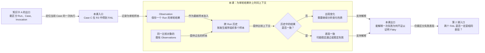

# 第 1 课：一次失败为什么不是 Flaky

## 本课在学习链中的位置

- 上一站是[第 0 单元知识卡 A](../00-前置知识.md#知识卡-a一次执行中有哪三个对象)：你已经能区分 Run、Case 和 Invocation。
- 本课只解决一个问题：为什么不能根据一个 Run 中的一次失败认定 Case 是 Flaky。
- 本课形成的跨 Run 历史，会成为第 2 课比较不同失败表现的输入。
- 本课无新增外部前置。

## 学完本课，你能够做到

1. 根据给定记录指出哪些只是单轮结果，哪些已经构成跨 Run 历史。
2. 解释为什么一次失败既可能来自长期稳定失败，也可能来自一次结果变化。
3. 区分“结果是否成功”和“多轮表现是否一致”。

## 开始前自检

先不要向下阅读答案，尝试回答：

1. 一轮完整测试运行叫什么？
2. Case 和 Invocation 有什么区别？
3. `test_async_image_generation → FAILED` 能否说明昨天也失败？

<details>
<summary>查看自检答案</summary>

1. 一轮完整测试运行叫 Run。
2. Case 是稳定的测试定义；Invocation 是这个 Case 在某个 Run 中的一次实际执行。
3. 不能。它只描述当前 Invocation，没有携带昨天的事实。

如果第 1～2 题答不出来，请先回到[知识卡 A](../00-前置知识.md#知识卡-a一次执行中有哪三个对象)。

</details>

## 核心问题

> 今天看到异步图像生成 Case 失败，为什么还不能称它为 Flaky？

## 从统一案例中的一个现象开始

本课使用统一案例 Case C：提交图像生成任务，轮询到成功状态，并验证输出地址存在。

今天的 Run 只留下这一条结果：

```text
R3：Case C → FAIL
```

这条记录没有告诉我们 R1 和 R2 发生过什么。现在补充两种都可能存在的历史：

```text
历史甲：R1 PASS → R2 PASS → R3 FAIL
历史乙：R1 FAIL → R2 FAIL → R3 FAIL
```

两段历史的最新结果完全相同，都是 R3 FAIL。

## 先做判断

请先写下答案和理由，再继续阅读：

1. 只看到 `R3 FAIL`，能否区分历史甲和历史乙？
2. 历史乙连续失败，是否比历史甲更能说明“表现反复变化”？

## 为什么已有解释不够

只看最新结果，两段历史会被压缩成同一句话：

```text
Case C 失败了
```

但它们表达的长期现象不同：

- 历史甲先通过、后失败，至少出现过结果变化。
- 历史乙始终失败，表现一致，只是一直不成功。

所以答案是：只看 R3 无法区分两段历史；历史乙也没有表现出反复变化。`FAIL` 回答“这一轮是否成功”，而 Flaky 要回答“多轮结果是否发生不稳定变化”。

## 核心概念

### 1. 单轮结果（Single-run Result）

单轮结果是某个 Case 在一个 Run 中的执行结论，本课只使用 PASS 和 FAIL。

```text
输入：一个 Invocation 的执行事实
输出：本轮 PASS 或 FAIL
生命周期：只属于这一轮 Run
```

它能说明本轮成败，不能单独说明过去或未来。

### 2. 观察样本（Observation）

Observation 是 Flaky 历史中的一条可比较单轮样本。本课暂时把每个 PASS/FAIL 当作已经形成的 Observation：

```text
R1 的 PASS → Observation 1
R2 的 PASS → Observation 2
R3 的 FAIL → Observation 3
```

真正的 pytest 执行会产生多条阶段事实，它们能否形成一条可信 Observation，要到第 7～8 课再学习。现在只关注 Observation 被拿来做什么。

### 3. 跨 Run 历史（Cross-run History）

同一比较对象在多个 Run 中的 Observation，按发生顺序排列后构成跨 Run 历史：

```text
Observation 1 → Observation 2 → Observation 3
```

历史提供“是否一致”的上下文。它与单轮结果不是两套数据：历史就是多条单轮 Observation 的有序集合。

## 本课知识关系图

图中串联的是事实如何变成判断依据，而不是正文目录：



## 最小规则

| 输入 | 可以得出的结论 | 不能得出的结论 |
| --- | --- | --- |
| 1 条 Observation | 当前 Run 是 PASS 还是 FAIL | 多轮表现是否一致、是否 Flaky |
| 同一比较对象的多条 Observation | 结果是否曾发生变化 | 变化是否已达到某个检测状态 |
| 连续多个 PASS | 这段历史表现一致且成功 | 未来一定不会失败 |
| 连续多个 FAIL | 这段历史表现一致但不成功 | 它一定是 Flaky |

本课使用的 PASS/FAIL 序列是教学数据。“需要跨 Run 历史才能讨论波动”是当前实现的机制边界；具体阈值和状态要到第 3～4 课才引入。

## 完整运行过程

```text
Case C 在一个 Run 中执行
→ 产生本轮 PASS/FAIL
→ 保存为一条 Observation
→ 与已有 Observation 按时间组成历史
→ 比较多轮结果是否一致
→ 得到“目前一致”或“出现变化”的描述
```

注意，最后一步还没有产生正式 Flaky 状态。本课只建立判断所需的时间上下文。

## 正常路径

先看一段始终通过的历史：

```text
R1 PASS
R2 PASS
R3 PASS
```

逐步推导：

1. 每个 Run 为 Case C 提供一条单轮结果。
2. 三条结果分别成为三条 Observation。
3. 按 R1、R2、R3 排列，得到跨 Run 历史 `PASS → PASS → PASS`。
4. 三轮结果一致，而且都是成功。

本课可以把它描述为“这三轮表现一致地通过”，但还不使用任何状态名称。

## 复杂路径

只改变一个变量：把三轮结果都改成 FAIL。

```text
R1 FAIL
R2 FAIL
R3 FAIL
```

推导过程没有变化：

1. 三个 Run 仍然形成三条 Observation。
2. 历史变成 `FAIL → FAIL → FAIL`。
3. 三轮仍然表现一致，只是结果不成功。

这揭示了一个重要边界：一致性和成功不是同一件事。稳定失败更像一个可重复问题；Flaky 关注的是表现变化，不能把“失败很多次”直接等同为“不稳定”。

## 对应的框架实现

### 先看测试如何构造跨 Run 历史

[状态机测试的 `_history()` 辅助函数](../../../tests/quality/test_flaky_state_machine.py)会为输入序列中的每一项创建独立记录：

```python
for index, signature in enumerate(signatures):
    entries.append(
        FlakyHistoryEntry(
            observation_id=f"observation-{index:02d}",
            run_id=f"run-{index:02d}",
            # 其余字段暂时省略
        )
    )
```

这里能看到本课主线：序列中的每个结果都有自己的 `run_id` 和 `observation_id`，多项输入才形成历史。测试变量名 `signature` 会在第 2 课解释；本课只把它看作结果标签。具体状态断言也延后到第 4 课，避免提前给出答案。

### 再看生产代码如何逐步读取历史

[replay_observations()](../../../quality/flaky.py)接收的不是一个布尔值，而是一组历史记录：

```python
ordered = sort_observations(observations)
for index, observation in enumerate(ordered, start=1):
    prefix = ordered[:index]
```

这三行表明：

- 输入是 `observations`，即多条历史记录。
- 记录先被排序。
- 算法按不断增长的历史前缀处理，而不是只查看最后一次结果。

本课不继续阅读后面的证据计算和状态分支，它们分别属于第 3、4 课。

## 能够保证什么

- 当前检测算法以 Observation 历史为输入，不把最新一次 PASS/FAIL 当作完整历史。
- 一段全 PASS 和一段全 FAIL 的历史都可以表现一致。
- 单次失败本身不会提供“过去也曾通过或失败”的信息。

## 保证成立的前提

- 序列中的记录确实属于同一可比较对象；本课教学数据已经预先保证这一点，第 5～6 课会展开身份条件。
- 每条 Observation 都来自一个真实可用的单轮样本；第 7～9 课会说明形成和接纳条件。
- 历史有明确顺序；晚到数据的固定排序属于进阶专题 B。

## 不能保证什么

- 一次失败不能证明 Case 是 Flaky，也不能证明它会持续失败。
- 连续通过不能保证未来永远通过。
- 连续失败只说明当前历史表现一致地失败，不代表业务健康。
- 本课没有定义检测状态或阈值，因此不能输出 `OBSERVING`、`STABLE`、`SUSPECTED` 或 `CONFIRMED`。

## 本课小结

Flaky 不是“一次失败”的别名。单轮结果只描述一个 Invocation 在一个 Run 中是 PASS 还是 FAIL；将它保存为 Observation，并与过去样本组成跨 Run 历史后，才能比较表现是否一致。连续 PASS 是一致地成功，连续 FAIL 是一致地不成功，两者都与结果反复变化不同。

主线可以压缩成：

```text
单轮 PASS/FAIL
→ 一条 Observation
→ 多条 Observation 组成跨 Run 历史
→ 比较一致性
```

## 课末自测

请先独立作答，再展开答案。

1. **判断题**：`R8 FAIL` 足以说明 Case C 在 R7 中通过。
2. **归类题**：`R1 PASS → R2 PASS → R3 PASS` 中有几条 Observation？它们共同构成什么？
3. **解释题**：为什么 `FAIL → FAIL → FAIL` 不能直接称为 Flaky？
4. **边界题**：某报告没有 Case C 的 Observation，可以把这一轮补成 PASS 吗？

<details>
<summary>查看答案与解析</summary>

1. **错误。** R8 的单轮结果不携带 R7 的事实，R7 可能是 PASS、FAIL，也可能没有可用样本。
2. **三条 Observation。** 每个 Run 提供一条单轮样本，三条按顺序共同构成跨 Run 历史。
3. 三轮都失败说明它在这段历史中表现一致；Flaky 关注多轮表现变化，而不是失败次数本身。
4. **不能。** 缺失 Observation 表示没有可用事实，不等于 PASS。否则人为补值会制造不存在的稳定性。

常见错误是把“成功”与“一致”混为一谈：PASS/FAIL 描述成功与否，跨 Run 比较才描述一致与否。

</details>

## 本课完成标准

如果你能完成以下任务，就可以进入第 2 课：

- 给出一个最新 FAIL，画出两段可能但含义不同的三轮历史。
- 不使用状态名称，解释全 PASS、全 FAIL 和 PASS/FAIL 混合序列的区别。
- 明确说出“缺失 Observation 不等于 PASS”。

若仍把连续失败当作 Flaky，请复习“复杂路径”；若仍从一条结果推断上一轮，请复习“核心概念”和“最小规则”。

## 与下一课的关系

本课把多个 PASS/FAIL 组成了历史，但还默认所有 FAIL 都是同一种表现。下一课继续追问：两个结果都写着 FAIL，如果失败原因不同，它们还能算同一个结果吗？
