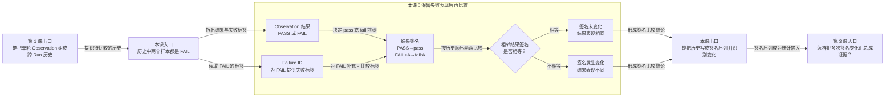

# 第 2 课：两个 FAIL 为什么可能不是同一种表现

## 本课在学习链中的位置

- 上一课已经把多个单轮 Observation 组成跨 Run 历史，并区分了“成功”与“一致”。
- 本课继续解决：只写 PASS/FAIL，是否足以判断相邻样本表现相同。
- 本课输出的结果签名序列，会成为第 3 课计算历史证据的输入。
- 本课无新增前置知识卡。

## 学完本课，你能够做到

1. 根据 Observation 的结果和 Failure ID 写出当前实现使用的结果签名。
2. 分辨“PASS/FAIL 是否变化”和“结果签名是否变化”。
3. 解释为什么两个 FAIL 仍可能表示不同的失败表现。

## 开始前自检

请先回答，再展开答案：

1. 一条 Observation 描述的是一轮结果，还是多轮历史？
2. `FAIL → FAIL → FAIL` 至少能说明这三轮的 PASS/FAIL 是否一致吗？
3. 缺少 Observation 时能否自动补成 PASS？

<details>
<summary>查看自检答案</summary>

1. 一条 Observation 描述一个 Run 中的一条可比较单轮样本；多条样本才组成历史。
2. 能。只看 PASS/FAIL 时，三轮一致地失败，但还不知道失败表现是否相同。
3. 不能。缺少 Observation 表示没有可用事实。

如果这些答案不清楚，请先复习[第 1 课](01-一次失败不是Flaky.md)。

</details>

## 核心问题

> Case C 连续两轮都是 FAIL，为什么 Flaky 仍要区分这两次失败？

## 从统一案例中的一个现象开始

沿用 Case C，现有两段历史：

```text
历史甲：R1 FAIL（失败 A）→ R2 FAIL（失败 A）
历史乙：R1 FAIL（失败 A）→ R2 FAIL（失败 B）
```

如果只保留 PASS/FAIL，两段历史都会变成：

```text
FAIL → FAIL
```

但原始教学数据告诉我们：历史甲重复出现同一种失败，历史乙的失败表现发生了变化。

## 先做判断

请先写下答案和理由：

1. 只比较 PASS/FAIL，能否区分历史甲和历史乙？
2. 如果要保留这种差异，失败样本至少还需要携带什么标签？

## 为什么已有解释不够

PASS/FAIL 只表达“本轮成功还是失败”。它会把所有失败压缩成同一个 FAIL，从而丢失失败表现是否相同的信息。

因此：

- 历史甲需要表达为“同一种失败重复出现”。
- 历史乙需要表达为“失败仍在发生，但失败表现从 A 变成 B”。

本课不会使用异常全文进行比较。异常文本可能包含时间、请求标识等易变内容；当前实现使用上游已经提供的 Failure ID 作为失败标签。

## 核心概念

### 1. Failure ID（失败标识）

Failure ID 是上游为某种规范化失败证据提供的标识。本课教学数据使用 `A` 和 `B`：

```text
A：一种失败表现
B：另一种失败表现
```

这里不需要知道 A、B 怎样计算。第 7 课会学习失败样本如何关联到失败证据；本课只使用已经给定的标签。

Failure ID 不回答 Case 是否成功：只有 FAIL Observation 才需要它，PASS Observation 没有 Failure ID。

### 2. 结果签名（Result Signature）

结果签名把 Observation 转换成一个可直接比较的短标签：

```text
PASS             → pass
FAIL + Failure A → fail:A
FAIL + Failure B → fail:B
```

签名把“成功与否”和“失败表现”放进同一个比较单位。两个签名字符串相等，表示当前规则认为两条 Observation 的结果表现相同；字符串不同，表示表现发生变化。

## 本课知识关系图



## 最小规则

| Observation 输入 | 结果签名 | 原因 |
| --- | --- | --- |
| PASS，Failure ID 为空 | `pass` | 成功样本不需要失败标签 |
| FAIL，Failure ID 为 A | `fail:A` | 保留失败 A 的表现 |
| FAIL，Failure ID 为 B | `fail:B` | 与失败 A 可区分 |
| FAIL，Failure ID 缺失 | 不能生成签名 | 当前实现拒绝猜测失败标签 |

相邻比较规则只有一条：

```text
左侧签名 == 右侧签名 → 表现相同
左侧签名 != 右侧签名 → 表现变化
```

A、B 是教学标签；`pass` 和 `fail:<failure_id>` 是当前生产代码的签名格式。

## 完整运行过程

```text
读取一条 Observation
→ 查看结果是 PASS 还是 FAIL
→ PASS 直接得到 pass
→ FAIL 读取 Failure ID 并得到 fail:<id>
→ 按 Run 顺序形成签名序列
→ 比较相邻签名是否相等
```

本课到“签名是否变化”为止，不统计变化次数，也不映射为检测状态。

## 正常路径

先处理相同失败重复出现：

```text
R1：FAIL + A
R2：FAIL + A
```

逐步推导：

1. R1 是 FAIL，读取 Failure ID A，得到 `fail:A`。
2. R2 也是 FAIL，读取 Failure ID A，得到 `fail:A`。
3. 签名序列为 `fail:A → fail:A`。
4. 相邻签名相等，所以这两轮的失败表现相同。

注意：“表现相同”不表示失败是好事，只表示当前比较规则没有观察到变化。

## 复杂路径

只改变一个变量：R2 的 Failure ID 从 A 改为 B。

```text
R1：FAIL + A → fail:A
R2：FAIL + B → fail:B
```

PASS/FAIL 序列仍然是 `FAIL → FAIL`，所以成功与否没有切换；结果签名序列却是 `fail:A → fail:B`，因此签名发生一次变化。

这说明两种“变化”不能混用：

- `pass → fail:A`：成功与否改变，签名也改变。
- `fail:A → fail:B`：成功与否没有改变，但签名改变。

本课只识别变化，不判断这种变化应该进入什么状态。

## 对应的框架实现

### 先用最小断言固定预期

下面的断言复用了[状态机测试](../../../tests/quality/test_flaky_state_machine.py)构造历史的方式，只验证本课签名规则：

```python
assert build_result_signature(_history("pass")[0]) == "pass"
assert build_result_signature(_history("fail:A")[0]) == "fail:A"
assert build_result_signature(_history("fail:B")[0]) == "fail:B"
```

仓库状态机测试还特意使用 `_history("fail:A", "fail:B")`，说明两个 FAIL 的 Failure ID 会保留在历史中。本课不展开该测试后续的状态断言。

### 再看生产代码

[build_result_signature()](../../../quality/flaky.py)完整实现很短：

```python
def build_result_signature(observation: CaseObservation) -> str:
    if observation.observation_outcome is ObservationOutcome.PASS:
        return "pass"
    if not observation.failure_id:
        raise ValueError("fail observation must include failure_id")
    return f"fail:{observation.failure_id}"
```

逐行对应最小规则：

1. PASS 直接返回 `pass`。
2. 非 PASS 路径必须存在 `failure_id`，缺失时抛出错误。
3. 合法 FAIL 返回 `fail:<failure_id>`。

函数没有读取数据库、阈值或治理状态；它只把单条 Observation 转换成签名。

## 能够保证什么

- PASS 的当前结果签名固定为 `pass`。
- FAIL 的签名包含 Failure ID，所以 `fail:A` 与 `fail:B` 可以区分。
- FAIL 缺少 Failure ID 时，签名函数不会把它默认为某个通用失败。

## 保证成立的前提

- 输入已经是一条可用 Observation；其形成过程到第 7～8 课再学习。
- Failure ID 已由可信上游提供，并满足 Observation 模型约束。
- 被比较的 Observation 属于同一可比较历史；身份边界到第 5～6 课再学习。

## 不能保证什么

- Failure ID 相同不代表异常文本逐字相同，也不证明根因已经定位。
- Failure ID 不表示严重程度或业务影响。
- 签名发生一次变化不等于已经确认 Flaky；本课尚未引入证据门槛和状态规则。
- 缺失 Failure ID 不能被解释成 PASS，也不能由本函数猜测补齐。

## 本课小结

PASS/FAIL 只保留成功与否，无法区分不同失败表现。当前实现为 PASS 生成 `pass`，为带有 Failure ID 的 FAIL 生成 `fail:<id>`，从而让历史可以比较结果签名。`fail:A → fail:B` 虽然仍是连续失败，却已经发生签名变化。

```text
Observation 的结果 + FAIL 的 Failure ID
→ 结果签名
→ 相邻签名比较
→ 表现相同或发生变化
```

## 课末自测

请先独立作答，再查看解析。

1. **复算题**：将 `PASS、FAIL+A、FAIL+A、FAIL+B` 写成结果签名序列。
2. **比较题**：上述序列中，哪两对相邻签名发生变化？
3. **解释题**：为什么 `FAIL+A → FAIL+B` 的 PASS/FAIL 没变，结果签名却变了？
4. **边界题**：一条 FAIL Observation 没有 Failure ID，当前签名函数会生成 `fail:unknown` 吗？

<details>
<summary>查看答案与解析</summary>

1. `pass → fail:A → fail:A → fail:B`。
2. 第一对 `pass → fail:A` 和第三对 `fail:A → fail:B` 发生变化；中间 `fail:A → fail:A` 未变化。
3. PASS/FAIL 只比较成功与否，两条记录都失败；结果签名还包含失败标签，A 与 B 不同，所以签名不同。
4. 不会。生产函数在 FAIL 缺少 Failure ID 时抛出 `ValueError`，不会猜测标签，更不会把缺失当作 PASS。

常见错误是只数 PASS/FAIL 切换，从而漏掉 `fail:A → fail:B` 这种失败表现变化。

</details>

## 本课完成标准

达到以下标准后再进入第 3 课：

- 能把包含 PASS、FAIL+A、FAIL+B 的历史准确写成签名序列。
- 能分别指出成功与否是否变化、结果签名是否变化。
- 能解释 FAIL 为什么必须有 Failure ID 才能生成当前签名。

若混淆两种变化，请复习“复杂路径”；若不能生成签名，请复习“最小规则”。

## 与下一课的关系

现在已经能识别相邻签名是否变化，但一段历史可能有很多样本。第 3 课将学习怎样限定证据窗口，并把签名序列汇总成可供规则使用的证据摘要。
