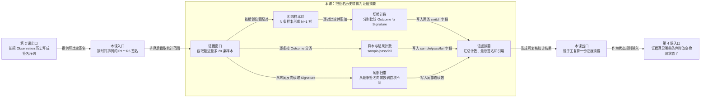

# 第 3 课：怎样从短历史中计算证据

## 本课在学习链中的位置

- 上一课已经能把 PASS、FAIL+A、FAIL+B 转换为 `pass`、`fail:A`、`fail:B`，并识别一对相邻签名是否变化。
- 本课把整段签名序列汇总成一份可复算的证据，但不判断任何检测状态。
- 本课产出的证据摘要，会在第 4 课作为状态规则的输入。
- 本课无新增前置知识卡。

## 学完本课，你能够做到

1. 从一段历史中选出当前证据窗口。
2. 手工计算 PASS/FAIL 数、Outcome 切换数、Signature 切换数和尾部连续签名数。
3. 解释证据摘要为什么只是事实统计，不是 Flaky 结论。

## 开始前自检

请先回答：

1. `FAIL+A` 的结果签名是什么？
2. `fail:A → fail:B` 的成功与否是否变化？结果签名是否变化？
3. 多条 Observation 按顺序组成什么？

<details>
<summary>查看自检答案</summary>

1. `fail:A`。
2. 两条都是 FAIL，因此 Outcome 没变；A 与 B 不同，因此 Signature 变了。
3. 组成跨 Run 历史。

如果第 1～2 题答不出来，请复习[第 2 课](02-结果签名.md)；如果第 3 题不清楚，请复习[第 1 课](01-一次失败不是Flaky.md)。

</details>

## 核心问题

> 一段历史有多个签名时，怎样把它整理成状态规则可以使用、学习者也能手工复算的证据？

## 从统一案例中的一个现象开始

使用 Case C 的 R1～R6，本课只看签名，不看状态答案：

| Run | 新增签名 | 到当前 Run 的历史 |
| --- | --- | --- |
| R1 | `pass` | `pass` |
| R2 | `pass` | `pass pass` |
| R3 | `pass` | `pass pass pass` |
| R4 | `fail:A` | `pass pass pass fail:A` |
| R5 | `pass` | `pass pass pass fail:A pass` |
| R6 | `fail:A` | `pass pass pass fail:A pass fail:A` |

如果只说“这段历史有 6 条”，仍然不知道其中有多少 PASS、多少 FAIL、变化了几次，或者末尾是否开始趋于一致。

## 先做判断

请先写下答案，不必一次答对：

1. R1～R6 中有多少 PASS、多少 FAIL？
2. 从左到右比较相邻结果，PASS 与 FAIL 互相切换了几次？
3. 从最后一个 `fail:A` 向前数，连续相同签名有几个？

## 为什么已有解释不够

上一课的“相邻签名相同或不同”只能解释一对样本。状态规则面对的是一段历史，需要一份统一摘要：

- 明确本次统计哪些样本。
- 对窗口内所有相邻样本使用相同计数方法。
- 把结果保存成字段，而不是依赖口头印象判断“变化很多”。

对 R1～R6，答案分别是 4 个 PASS、2 个 FAIL；Outcome 切换 3 次；末尾只有 1 个 `fail:A`。下面建立可重复得到这些答案的方法。

## 核心概念

### 1. 证据窗口（Evidence Window）

证据窗口是本次证据计算实际使用的、按时间排序后的最近一段 Observation。

当前默认窗口上限是 20 条：

```text
历史不超过 20 条 → 全部进入窗口
历史超过 20 条   → 只取排序后的最后 20 条
```

`total_observation_count` 表示完整历史有多少条；`sample_size` 表示本次窗口实际用了多少条。窗口上限不是“至少需要 20 条”，也不是状态阈值。

### 2. 切换计数（Switch Count）

切换计数只比较相邻样本，每一对不相同就加 1。当前证据同时保留两种计数：

| 计数 | 比较内容 | `fail:A → fail:B` 是否计数 |
| --- | --- | --- |
| Outcome Switch | PASS 与 FAIL | 否 |
| Signature Switch | `pass`、`fail:A`、`fail:B` | 是 |

长度为 N 的序列最多有 N−1 对相邻样本。不能把“不相同签名的种类数”当作切换次数。

### 3. 证据摘要（Evidence Summary）

证据摘要是窗口计算后的结构化结果。本课重点字段是：

```text
sample_size
pass_count / fail_count
outcome_switch_count
signature_switch_count
trailing_same_signature_count
latest_signature
```

`trailing_same_signature_count` 从最新签名向前数，遇到第一个不同签名就停止。它只描述历史末尾连续了多久，不等于整段历史中该签名出现的总次数。

## 本课知识关系图



## 最小规则

按下面顺序计算，可以避免漏数或重复计数：

1. 将 Observation 按当前确定性规则排序；从末尾截取至多 20 条作为窗口。
2. 窗口中 `sample_size = pass_count + fail_count`。
3. 对每一对相邻样本比较 Outcome，不同则 `outcome_switch_count + 1`；再比较 Signature，不同则 `signature_switch_count + 1`。
4. 从最新 Signature 向前计数，遇到不同值停止，得到 `trailing_same_signature_count`。
5. 最新一项的 Signature 成为 `latest_signature`。

窗口上限 20 是当前默认配置值。R1～R6 只有 6 条，因此全部进入窗口；本课不展开晚到数据的排序细节。

## 完整运行过程

```text
跨 Run Observation 历史
→ 按确定性顺序排列
→ 截取最近至多 20 条
→ 生成 Outcome 序列和 Signature 序列
→ 计算样本数、PASS/FAIL 数、两类相邻切换
→ 从末尾计算连续相同签名数
→ 形成证据摘要
```

输出仍是事实统计，没有状态名称，也没有人工治理决定。

## 正常路径

完整计算 R1～R6：

```text
Signature：pass → pass → pass → fail:A → pass → fail:A
Outcome：   PASS → PASS → PASS → FAIL   → PASS → FAIL
```

### 第一步：确定窗口

历史共 6 条，小于默认上限 20，所以：

```text
total_observation_count = 6
sample_size = 6
```

### 第二步：按 Outcome 分类

- PASS 位于 R1、R2、R3、R5，共 4 个。
- FAIL 位于 R4、R6，共 2 个。

```text
pass_count = 4
fail_count = 2
```

### 第三步：逐对计算切换

| 相邻对 | Outcome 变化 | Signature 变化 |
| --- | ---: | ---: |
| R1→R2：`pass→pass` | 0 | 0 |
| R2→R3：`pass→pass` | 0 | 0 |
| R3→R4：`pass→fail:A` | 1 | 1 |
| R4→R5：`fail:A→pass` | 1 | 1 |
| R5→R6：`pass→fail:A` | 1 | 1 |

合计：

```text
outcome_switch_count = 3
signature_switch_count = 3
```

### 第四步：计算尾部

最新签名是 `fail:A`；向前一个是 `pass`，立即不同，所以：

```text
latest_signature = fail:A
trailing_same_signature_count = 1
```

至此得到一份证据摘要，但不根据它猜测状态。

## 复杂路径

只改变一个变量：把 R5 从 `pass` 改成 `fail:B`。

```text
原序列：pass → pass → pass → fail:A → pass   → fail:A
新序列：pass → pass → pass → fail:A → fail:B → fail:A
```

新序列仍有 6 个样本，但：

- `pass_count` 从 4 变成 3，`fail_count` 从 2 变成 3。
- Outcome 只在 `R3 pass → R4 fail` 时变化，因此 Outcome Switch 从 3 降为 1。
- Signature 在 `pass→fail:A`、`fail:A→fail:B`、`fail:B→fail:A` 三处变化，因此 Signature Switch 仍为 3。
- 最新 `fail:A` 前面是 `fail:B`，所以尾部连续数仍为 1。

这个对照再次说明：Outcome Switch 与 Signature Switch 回答不同问题，不能只保留其中一个。

## 对应的框架实现

### 先看测试断言

[状态机测试](../../../tests/quality/test_flaky_state_machine.py)验证 25 条真实 Observation 在默认配置下只取最后 20 条：

```python
evidence = derive_evidence_window(_history(*("pass",) * 25))
assert evidence.total_observation_count == 25
assert evidence.sample_size == 20
assert len(evidence.observation_ids) == 20
```

断言分别对应完整历史量、窗口样本量和保留的证据引用量。它没有表达“需要 20 条才能判断”。

### 再看生产代码

[derive_evidence_window()](../../../quality/flaky.py)先截取窗口，再计算计数：

```python
window = ordered[-config.evidence_window_size :]
signatures = [build_result_signature(item) for item in window]
outcomes = [item.observation_outcome for item in window]
pass_count = sum(item is ObservationOutcome.PASS for item in outcomes)
fail_count = len(outcomes) - pass_count
```

两类切换都使用相邻配对：

```python
outcome_switches = sum(
    left is not right for left, right in zip(outcomes, outcomes[1:])
)
signature_switches = sum(
    left != right for left, right in zip(signatures, signatures[1:])
)
```

尾部计数则从倒数第二项向前扫描，遇到与最新签名不同的值就停止。生产函数最终返回 `FlakyEvidence`，而不是直接返回状态。

## 能够保证什么

- 当前默认证据窗口至多包含排序后最近 20 条真实 Observation。
- PASS/FAIL 数之和等于窗口样本数。
- 两类切换只比较相邻项；`fail:A→fail:B` 只增加 Signature Switch。
- 尾部连续数从最新签名开始，至少为 1。

## 保证成立的前提

- 输入至少包含一条 Observation；空输入会被拒绝。
- 每条 Observation 已能生成合法结果签名。
- Observation 属于同一可比较历史。
- 本课按已经排好的教学顺序复算；生产排序的完整并列规则在进阶专题 B 解释。

## 不能保证什么

- 窗口大小 20 不代表确认 Flaky 需要 20 个样本。
- 切换次数多本身不是状态，必须由下一课的规则解释。
- 证据摘要不判断失败根因，也不评价业务严重性。
- 没有 Observation 时不能生成全零摘要；缺失数据仍不是 PASS 或零。

## 本课小结

证据窗口先限定本次统计范围，切换计数再逐对比较 Outcome 和 Signature，证据摘要最终保存样本、结果、变化和尾部连续信息。对 R1～R6，可复算出 6 个样本、4 PASS、2 FAIL、两类切换各 3 次、尾部连续数 1。这些数字只是可核验事实，还不是检测状态。

```text
签名历史
→ 最近至多 20 条的窗口
→ 分类计数 + 相邻切换 + 尾部扫描
→ FlakyEvidence
```

## 课末自测

使用序列 `pass → fail:A → fail:A → pass → pass`，先独立作答：

1. **复算题**：`sample_size`、`pass_count` 和 `fail_count` 分别是多少？
2. **复算题**：Outcome Switch 和 Signature Switch 分别是多少？
3. **复算题**：`latest_signature` 和 `trailing_same_signature_count` 分别是什么？
4. **解释题**：为什么 5 个样本只有 4 对相邻比较？
5. **边界题**：数据库中没有任何 Observation 时，可以产生 `sample_size=0` 的有效证据摘要吗？

<details>
<summary>查看答案与解析</summary>

1. 样本共 5 个，其中 PASS 位于第 1、4、5 项，所以 `sample_size=5`、`pass_count=3`、`fail_count=2`。
2. 相邻对为 `pass→fail:A`、`fail:A→fail:A`、`fail:A→pass`、`pass→pass`。第一和第三对的 Outcome 与 Signature 都变化，所以两类切换数均为 2。
3. 最新签名是 `pass`。从末尾向前还有一个 `pass`，再前面是 `fail:A`，因此尾部连续数为 2。
4. 相邻比较需要左右两个样本；N 个按顺序排列的样本只有 N−1 个间隙，所以 5 个样本有 4 对。
5. 不可以。`derive_evidence_window()` 要求至少一条 Observation；缺失历史不是一份计数全零的证据。

常见错误包括把某个签名的出现总数当作尾部连续数，以及漏掉 `fail:A→fail:B` 这类只改变 Signature 的切换。

</details>

## 本课完成标准

满足以下条件后再进入第 4 课：

- 能为任意 5～8 项短签名序列画出所有相邻对并计算两类切换。
- 能正确计算尾部连续签名数，而不是同签名总数。
- 能说明 `FlakyEvidence` 是状态规则的输入，不是状态本身。

若切换数经常出错，请复习“正常路径”的逐对表；若混淆窗口与阈值，请复习“核心概念”和“不能保证什么”。

## 与下一课的关系

本课已经把 R1～R6 变成可复算的证据摘要，但没有解释数字何时足够、状态如何变化。第 4 课将保持同一份数据不变，只增加阈值和状态迁移规则。
