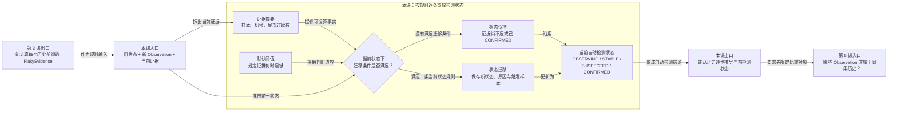

# 第 4 课：证据怎样形成四态检测结果

## 本课在学习链中的位置

- 上一课已经能从签名历史计算样本数、PASS/FAIL 数、两类切换数和尾部连续数。
- 本课保持 R1～R6 数据不变，只增加自动检测规则，解释状态如何随新 Observation 迁移。
- 本课输出“可比较历史的自动检测状态”，第 5 课将追问什么才是同一个比较对象。
- 本课无新增前置知识卡。

## 学完本课，你能够做到

1. 使用默认阈值手工推导 R1～R6 的四种自动检测状态。
2. 区分“当前状态”和“这次为何改变状态的迁移”。
3. 解释稳定失败为何是 `STABLE`，以及一次变化为何只到 `SUSPECTED`。

## 开始前自检

请先计算序列 `pass → pass → pass → fail:A → pass → fail:A`：

1. 样本数、PASS 数、FAIL 数分别是多少？
2. Outcome Switch 和 Signature Switch 分别是多少？
3. 最新签名及尾部连续数分别是什么？

<details>
<summary>查看自检答案</summary>

答案依次为：样本数 6、PASS 4、FAIL 2；两类切换均为 3；最新签名 `fail:A`、尾部连续数 1。

如果无法独立得到这些值，请先复习[第 3 课](03-证据怎样计算.md)。

</details>

## 核心问题

> 同一段证据在每个新 Run 到达后，怎样推动自动检测状态变化？

## 从统一案例中的一个现象开始

仍使用 Case C 的同一条时间线：

```text
R1 pass
R2 pass
R3 pass
R4 fail:A
R5 pass
R6 fail:A
```

我们已经会计算每个历史前缀的证据，但还没有回答：

- 前两个相同样本是否已经足够稳定？
- 第一次签名变化是否已经足够确认 Flaky？
- 多次 PASS/FAIL 切换在什么条件下才构成确认信号？

## 先做判断

请在不知道状态名称的情况下先预测：

1. R1、R2 的一致证据是否足够形成稳定结论？
2. R4 第一次打破连续 PASS 时，应该立即作出最终结论，还是先保留怀疑？
3. R6 已有 4 PASS、2 FAIL 和 3 次 Outcome 切换，是否比 R4 的证据更充分？

## 为什么已有解释不够

证据摘要只提供事实数字，不决定“多少才够”。如果没有统一规则，相同历史可能被不同人随意解释。

当前实现因此使用：

- 明确的默认阈值，规定证据达到什么程度。
- 一个自动检测状态，保存重放到当前样本时的结论。
- 状态迁移，记录新增样本为何让结论发生改变。

R1～R2 的一致样本还不足 3 个；R4 已出现真实变化但证据还不足以确认；R6 同时满足 PASS、FAIL 和 Outcome 切换门槛，因此证据层级逐步提高。

## 核心概念

### 1. 阈值（Threshold）

阈值是状态规则中“至少达到多少”的明确条件。当前默认配置与本课相关的值是：

| 用途 | 默认条件 |
| --- | --- |
| 形成稳定证据 | 至少 3 个相同结果签名 |
| 确认 Flaky | 窗口至少 4 个样本，且至少 2 PASS、2 FAIL、2 次 Outcome Switch |
| 清除怀疑 | 在 `SUSPECTED` 后，尾部至少 5 个相同签名 |

确认条件是“同时满足”，不是任选其一。这里的数字属于当前 `FlakyRuleConfig`，不是 Flaky 的通用定义。

### 2. 自动检测状态（Automatic Detection State）

四种状态描述算法基于当前可信历史得到的结论：

| 状态 | 含义 |
| --- | --- |
| `OBSERVING` | 样本仍少且尚未出现变化，继续观察 |
| `STABLE` | 已达到连续相同签名的稳定门槛 |
| `SUSPECTED` | 已观察到签名变化，但确认条件尚未满足 |
| `CONFIRMED` | PASS/FAIL 波动证据达到确认门槛 |

`STABLE` 表示表现一致，不表示业务成功，所以稳定失败也可以是 `STABLE`。

### 3. 状态迁移（State Transition）

状态迁移是“从旧状态到新状态”的一次变化，同时带有触发样本和原因。例如：

```text
R3：OBSERVING → STABLE
原因：连续相同签名达到 3 个
```

如果新样本没有改变状态，就没有新的迁移。例如 R2 仍为 `OBSERVING`，这是状态保持，不是一次新的状态迁移。

## 本课知识关系图



## 最小规则

状态机按排序后的 Observation 逐条重放，每次只根据“当前状态 + 当前历史前缀证据”选择规则：

| 当前状态 | 条件 | 新状态 |
| --- | --- | --- |
| 无状态 | 第一条 Observation 到达 | `OBSERVING` |
| `OBSERVING` | 已有 Signature Switch | `SUSPECTED` |
| `OBSERVING` | 无切换且样本数至少 3 | `STABLE` |
| `STABLE` | 最新签名打破已保存的稳定签名 | `SUSPECTED` |
| `SUSPECTED` | 样本、PASS、FAIL、Outcome Switch 同时达到确认门槛 | `CONFIRMED` |
| `SUSPECTED` | 未确认，且尾部相同签名至少 5 个 | `STABLE` |
| `CONFIRMED` | 后续任意自动样本 | 保持 `CONFIRMED` |

同一次判断中，确认条件优先于清除怀疑条件。人工治理不属于这张自动状态表，要到第 13～14 课学习。

## 完整运行过程

```text
按确定性顺序读取 Observation
→ 从第一条开始逐个扩大历史前缀
→ 为当前前缀计算 FlakyEvidence
→ 读取前一自动状态
→ 按该状态对应的阈值规则判断
→ 保持状态，或生成一条迁移并更新状态
→ 继续处理下一条 Observation
→ 得到当前自动检测状态与迁移记录
```

这叫“重放”：即使最后证据相同，也必须按历史顺序经过中间状态。

## 正常路径

逐个重放 R1～R6：

| Run | 关键证据 | 判断 | 当前状态 |
| --- | --- | --- | --- |
| R1 | 1 个 `pass` | 第一条样本 | `OBSERVING` |
| R2 | 2 个相同签名 | 少于稳定门槛 3 | `OBSERVING` |
| R3 | 3 个相同签名 | 达到稳定门槛 | `STABLE` |
| R4 | 最新 `fail:A` 打破稳定签名 `pass` | 变化已出现，尚未确认 | `SUSPECTED` |
| R5 | 4 PASS、1 FAIL、2 次 Outcome Switch | FAIL 少于 2 | `SUSPECTED` |
| R6 | 4 PASS、2 FAIL、3 次 Outcome Switch | 确认条件全部满足 | `CONFIRMED` |

真正的状态迁移发生在 R1、R3、R4、R6：

```text
无状态 ─R1→ OBSERVING ─R3→ STABLE ─R4→ SUSPECTED ─R6→ CONFIRMED
```

R2 和 R5 虽然产生新证据，但状态保持不变。

## 复杂路径

只改变一个变量：把三轮历史都设为相同失败签名。

```text
R1 fail:A → R2 fail:A → R3 fail:A
```

推导：

1. R1 是第一条样本，进入 `OBSERVING`。
2. R2 仍无签名切换，但只有 2 个样本，保持 `OBSERVING`。
3. R3 达到 3 个相同签名，进入 `STABLE`。
4. 稳定签名保存为 `fail:A`，稳定结果为 FAIL。

因此 `STABLE` 不能翻译为“测试通过”。它只表示当前历史的结果签名稳定。

## 对应的框架实现

### 先看测试断言

[状态机测试](../../../tests/quality/test_flaky_state_machine.py)把通过与稳定失败放在同一个测试中：

```python
assert replay_observations(_history("pass")).current_state is FlakyState.OBSERVING
assert replay_observations(_history("pass", "pass", "pass")).current_state is FlakyState.STABLE

stable_fail = replay_observations(_history("fail:A", "fail:A", "fail:A"))
assert stable_fail.current_state is FlakyState.STABLE
assert stable_fail.stable_failure_id == "A"
```

另一个测试验证确认条件要求 PASS/FAIL 交替证据，而“全是不同失败”不会确认：

```python
confirmed = replay_observations(_history("pass", "fail:A", "fail:A", "pass"))
assert confirmed.current_state is FlakyState.CONFIRMED

all_fail = replay_observations(_history("fail:A", "fail:B", "fail:A", "fail:B"))
assert all_fail.current_state is FlakyState.SUSPECTED
```

### 再看生产代码

[replay_observations()](../../../quality/flaky.py)对每个增长中的前缀重新计算证据：

```python
for index, observation in enumerate(ordered, start=1):
    prefix = ordered[:index]
    evidence = derive_evidence_window(prefix, config)
```

随后根据当前状态选择对应分支。例如从 `SUSPECTED` 出发：

```python
if _confirmation_met(evidence, config):
    state = FlakyState.CONFIRMED
elif evidence.trailing_same_signature_count >= config.suspected_clear_signature_streak:
    state = FlakyState.STABLE
```

`_confirmation_met()` 同时检查最小样本数、PASS 数、FAIL 数和 Outcome Switch 数。达到 `CONFIRMED` 后，自动分支不再降级；这是当前 v1 规则，而不是所有 Flaky 系统都必须如此。

## 能够保证什么

- 相同输入历史和相同规则配置会按同一状态机产生检测状态。
- 默认 3 个相同签名可从 `OBSERVING` 进入 `STABLE`。
- 一次签名变化只产生怀疑；确认还要求至少 2 PASS、2 FAIL 和 2 次 Outcome Switch 等条件同时满足。
- 自动 `CONFIRMED` 在后续重放中保持；它不会自行恢复为 `STABLE`。

## 保证成立的前提

- 输入至少有一条、属于同一可比较对象的可信 Observation。
- 每条 Observation 都能生成结果签名，并按确定性规则排序。
- 使用的是本课列出的当前默认 `FlakyRuleConfig`；更改配置可能改变状态结果。
- 本课只讨论自动检测，不应用人工 Override 或 Governance。

## 不能保证什么

- `STABLE` 不保证业务成功，稳定结果可以是 FAIL。
- `SUSPECTED` 不是人工确认，也不会自动隔离测试。
- `CONFIRMED` 不会把 pytest 失败改成通过，也不会自动跳过 Case。
- 状态不能弥补缺失 Observation；没有样本时不会凭空生成一个正常状态。

## 本课小结

证据必须经过明确阈值才能形成自动检测状态。状态机按历史前缀逐条重放：先观察，一致样本达到门槛后稳定，签名被打破后怀疑，PASS/FAIL 波动证据充分后确认。状态迁移记录“何时、为何改变”，而当前状态描述重放到现在的结论。

```text
旧状态 + 新 Observation + 当前证据
→ 应用当前状态对应的阈值规则
→ 状态保持或发生迁移
→ 当前自动检测状态
```

## 课末自测

请先独立作答，再查看解析。

1. **复算题**：`pass → pass → pass` 依次得到什么状态？
2. **解释题**：为什么 `fail:A → fail:A → fail:A` 最终是 `STABLE`，而不是 `CONFIRMED`？
3. **判断题**：`pass → fail:A` 已出现一次 Outcome Switch，因此默认规则会立即 `CONFIRMED`。
4. **规则题**：处于 `SUSPECTED` 时，默认确认条件至少要求多少 PASS、FAIL 和 Outcome Switch？
5. **边界题**：自动状态为 `CONFIRMED` 是否意味着 pytest 下一轮会跳过这个 Case？

<details>
<summary>查看答案与解析</summary>

1. R1 为 `OBSERVING`，R2 仍为 `OBSERVING`，R3 达到 3 个相同签名后为 `STABLE`。
2. 三个 `fail:A` 的签名始终一致，满足稳定门槛；确认条件要求窗口中同时有至少 2 PASS 和 2 FAIL，这段历史没有 PASS。稳定描述一致性，不描述成功。
3. **错误。** 第一次变化会进入 `SUSPECTED`；此时只有 1 PASS、1 FAIL、1 次 Outcome Switch，确认门槛尚未全部满足。
4. 至少 2 PASS、2 FAIL、2 次 Outcome Switch；同时样本数至少为 4。
5. **不意味着。** 当前自动状态只是一项检测结论，执行权仍属于 pytest、Runner 和 Jenkins。

常见错误是把任一阈值达到当作确认，或把 `STABLE` 当作 PASS。确认门槛必须同时满足，稳定只描述签名一致。

</details>

## 本课完成标准

达到以下标准后再进入第 5 课：

- 能不看答案推导 R1～R6 的每一步状态，并指出真正发生迁移的 Run。
- 能用默认门槛解释 `SUSPECTED` 与 `CONFIRMED` 的区别。
- 能说明稳定失败、自动确认和 pytest 执行行为彼此不同。

若状态跳步，请复习“最小规则”；若把状态当作成败，请复习“复杂路径”和“不能保证什么”。

## 与下一课的关系

前四课默认所有 Observation 都属于同一条可比较历史。但如果两个参数实例恰好拥有相同签名，能否直接合并？第 5 课从 `case_id` 和 `param_hash` 开始建立测试对象身份。
